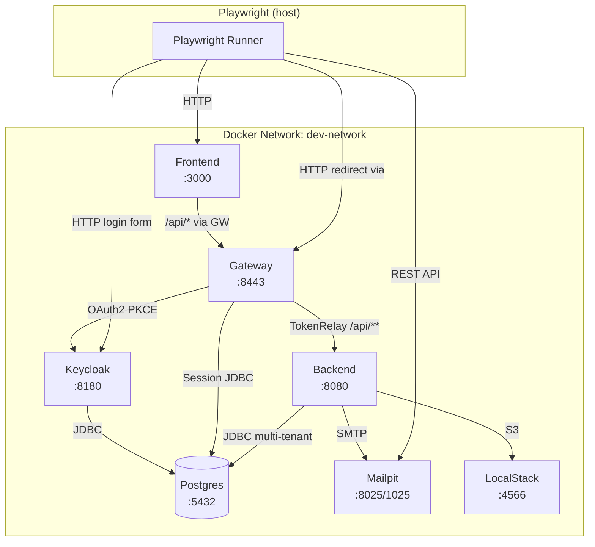
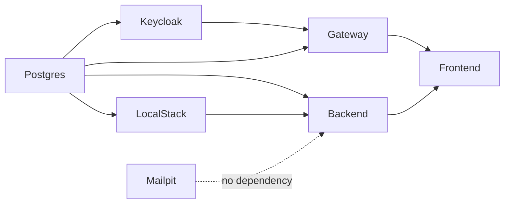
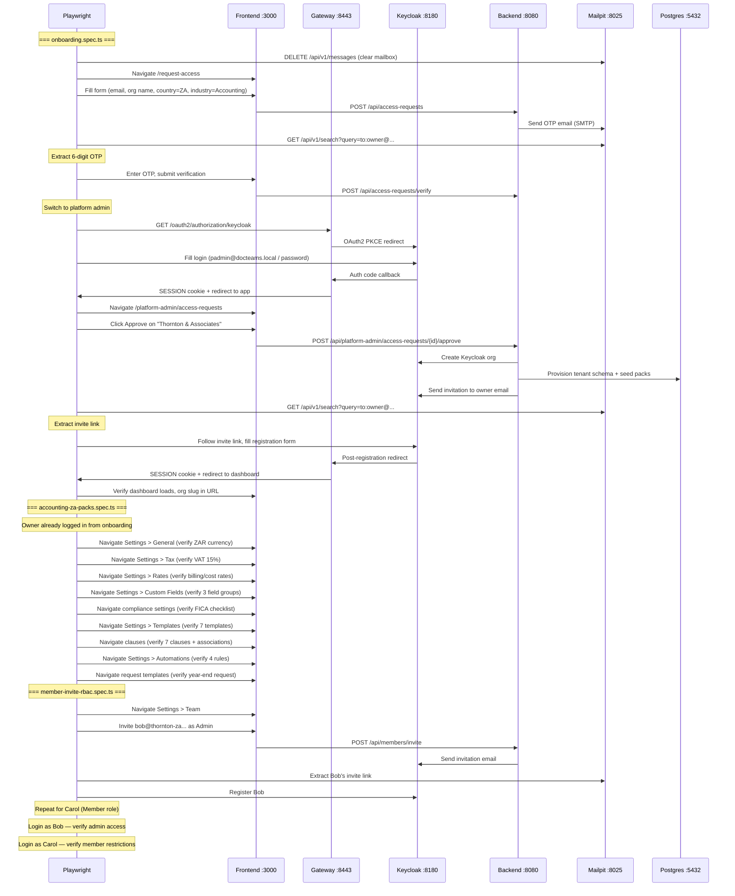
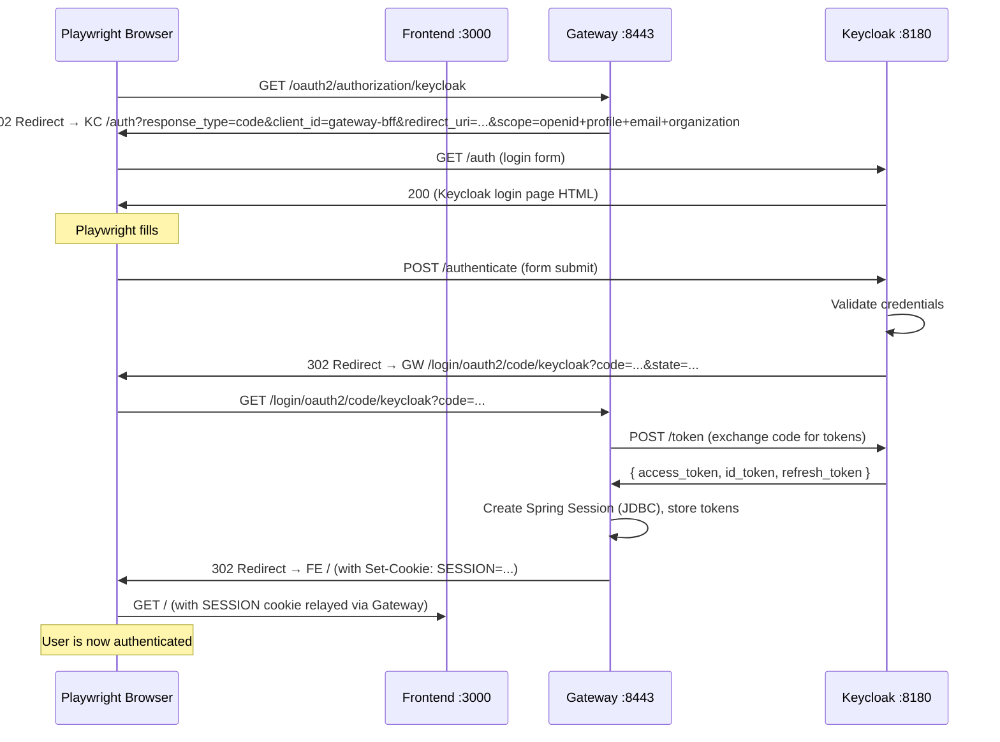
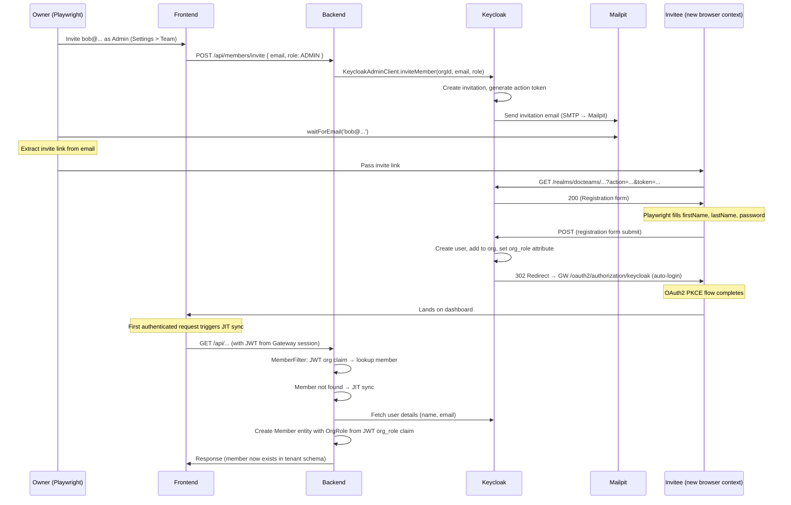
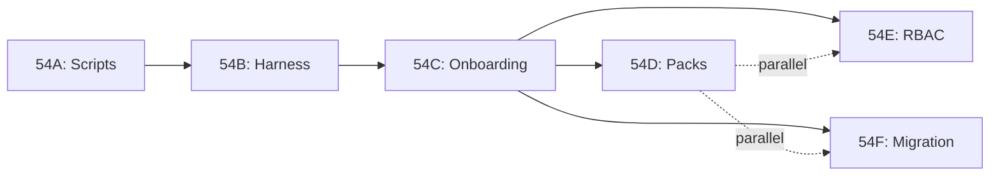

> Standalone architecture document for Phase 54. ADR files go in `adr/`.

# Phase 54 — Keycloak E2E Test Suite

---

## 54. Phase 54 — Keycloak E2E Test Suite

Phase 54 builds a **Playwright end-to-end test suite running against the full Keycloak dev stack** that validates the complete accounting firm onboarding lifecycle through the product UI. This phase does not introduce new entities, database migrations, or API endpoints. It is a test infrastructure and test authoring phase.

The existing E2E stack (Phase 20) was designed to bypass Clerk authentication using a mock IDP. With Keycloak now the production auth provider (Phase 36), the mock IDP stack is superseded. Phase 54 retires it as the primary test target and replaces it with tests that exercise the real Keycloak login flow, real email delivery via Mailpit, and real pack seeding through the provisioning pipeline.

The test suite validates three critical flows that have never been tested end-to-end through the UI:

1. **Org onboarding** — public access request form, OTP email verification, platform admin approval, Keycloak invitation, owner registration, JIT member sync
2. **Pack verification** — all eight accounting-ZA packs (fields, compliance, templates, clauses, automations, requests, rate cards, tax defaults) confirmed through the product UI after provisioning
3. **Member invite and RBAC** — admin and member invite via Keycloak, registration from invite link, role-based page and action restrictions

**Dependencies on prior phases**:
- **Phase 20** (Auth Abstraction): `lib/auth/` provider pattern, existing Playwright config at `frontend/e2e/`, mock IDP E2E stack being deprecated
- **Phase 36** (Keycloak + Gateway BFF): `gateway/` Spring Cloud Gateway app, `gateway-bff` client, OAuth2 PKCE flow, `SESSION` cookie, `keycloak-bootstrap.sh`
- **Phase 39** (Admin-Approved Provisioning): `AccessRequest` entity, OTP verification, platform admin approval flow, `TenantProvisioningService`
- **Phase 47** (Vertical QA): `accounting-za.json` vertical profile, pack JSON files, `AbstractPackSeeder` vertical filtering

### What's New

| Capability | Before Phase 54 | After Phase 54 |
|---|---|---|
| Primary E2E target | Mock IDP stack (`docker-compose.e2e.yml`, port 3001/8081) | Keycloak dev stack (`docker-compose.yml --all`, port 3000/8080/8443) |
| Auth in tests | Programmatic token injection via mock IDP `/token` endpoint | Real Keycloak login page interaction via Playwright |
| Email testing | Not tested (mock IDP bypasses email) | Mailpit API integration — OTP extraction, invite link extraction |
| Pack verification | Manual QA script (`tasks/48-lifecycle-script.md`) | Automated Playwright assertions against every accounting-ZA pack |
| Member invite flow | Not tested end-to-end | Full flow: invite in UI, Keycloak email, registration, JIT sync, RBAC verification |
| Test data strategy | Pre-seeded via boot-seed container (Alice/Bob/Carol) | UI-driven creation — only platform admin is pre-scripted |
| Mock IDP stack | Primary test target | Deprecated (retained, not deleted) |

**Out of scope**: Full 90-day lifecycle operations (time logging, invoicing, profitability), CI/CD pipeline configuration (GitHub Actions), performance/load testing, customer portal auth (magic links), multi-org isolation testing, fixing gaps found by the test suite (separate follow-up work).

**No new entities, no DB migrations, no new API endpoints.**

---

### 54.1 Overview

The test suite runs against the existing `docker-compose.yml` dev stack with all services started (`--all` flag). This is the same stack developers use locally — Keycloak on port 8180, Gateway on 8443, Backend on 8080, Frontend on 3000, Postgres on 5432, Mailpit on 8025. No separate E2E-specific Docker Compose file is needed because the dev stack already has every service defined.

The only pre-existing state when tests start is:
- Keycloak realm `docteams` (imported from `compose/keycloak/realm-export.json`)
- Platform admin user `padmin@docteams.local` / `password` (created by `keycloak-bootstrap.sh`)
- Protocol mappers: `groups` (flat group names) and `org-role` (user attribute to JWT claim)
- `platform-admins` group with the platform admin assigned

Everything else — the org, the owner, the team members, all data — is created through the product's UI during the test run. This is intentional. Tests that create data through the UI validate the full stack: frontend form submission, server action, API call, backend service, Keycloak admin client, provisioning pipeline, pack seeders, and JIT sync. A test that seeds data directly into the database proves nothing about the product.

See [ADR-207](#adr-207-e2e-test-data-strategy-ui-driven-no-db-seeding) for the full rationale.

---

## 1. Docker Compose Architecture

### 1.1 Service Topology

The existing `compose/docker-compose.yml` already defines all required services. No new service definitions are needed. The current topology:



### 1.2 Service Dependency Graph (Startup Order)



Docker Compose `depends_on` with `condition: service_healthy` enforces this order. Mailpit starts independently with no dependencies.

### 1.3 Port Allocation

| Service | Container Port | Host Port | Health Check |
|---|---|---|---|
| Postgres | 5432 | 5432 | `pg_isready -U postgres` |
| Keycloak | 8180 | 8180 | TCP connect `:8180` |
| Gateway | 8443 | 8443 | `GET /actuator/health` |
| Backend | 8080 | 8080 | `GET /actuator/health` |
| Frontend | 3000 | 3000 | `GET /` |
| Mailpit SMTP | 1025 | 1025 | (implicit — starts fast) |
| Mailpit Web/API | 8025 | 8025 | `GET /` |
| LocalStack | 4566 | 4566 | `awslocal s3 ls` |

These are the standard dev stack ports. No port conflicts with the E2E mock-auth stack (which uses 5433, 8081, 3001, 8090, 8026).

### 1.4 Health Check Strategy

All health checks are already defined in `compose/docker-compose.yml`. The key timing considerations for Playwright:

- **Keycloak** is the slowest to start (~30-45s). It has `start_period: 30s` and 15 retries at 10s intervals.
- **Backend** depends on Postgres and LocalStack being healthy. It has `start_period: 30s`.
- **Gateway** depends on Keycloak and Postgres. Session table auto-creation (`initialize-schema: always`) adds a few seconds on first start.
- **Frontend** depends on Backend being healthy. Next.js production build inside Docker takes ~60-90s on first run.

The `dev-up.sh --all` script already waits for all services and prints a summary. Total startup time from cold: ~3-5 minutes.

### 1.5 Bootstrap Sequence

After services are healthy, `keycloak-bootstrap.sh` must run to ensure the platform admin exists:

```
docker-compose up -d --all
    ↓
dev-up.sh --all (waits for health checks)
    ↓
keycloak-bootstrap.sh (idempotent)
    ├── Registers org_role in Keycloak user profile
    ├── Adds groups + org-role protocol mappers to gateway-bff client
    ├── Creates padmin@docteams.local / password
    ├── Assigns padmin to platform-admins group
    └── Backfills org_role on any existing org members
    ↓
Stack ready for Playwright
```

The script at `compose/scripts/keycloak-bootstrap.sh` is already idempotent — safe to re-run on every test cycle. It does NOT create organizations or tenant users.

### 1.6 Environment Configuration

Tests use `compose/.env.keycloak` which sets:

| Variable | Value | Purpose |
|---|---|---|
| `NEXT_PUBLIC_AUTH_MODE` | `keycloak` | Frontend built for Keycloak auth |
| `SPRING_PROFILES_ACTIVE` | `local,keycloak` | Backend uses Keycloak JWT validation |
| `JWT_ISSUER_URI` | `http://keycloak:8180/realms/docteams` | Backend JWT issuer (Docker network) |
| `JWT_JWK_SET_URI` | `http://keycloak:8180/realms/docteams/protocol/openid-connect/certs` | Backend JWKS endpoint |
| `KEYCLOAK_CLIENT_SECRET` | `docteams-web-secret` | Gateway BFF client secret |

### 1.7 Comparison: Current Dev Stack vs E2E Mock-Auth Stack

| Aspect | Dev Stack (Phase 54 target) | E2E Mock-Auth Stack (deprecated) |
|---|---|---|
| Compose file | `docker-compose.yml` | `docker-compose.e2e.yml` |
| Auth provider | Keycloak (real) | Mock IDP (fake) |
| Frontend auth mode | `keycloak` | `mock` |
| Frontend port | 3000 | 3001 |
| Backend port | 8080 | 8081 |
| Gateway | Yes (port 8443) | No |
| Login flow | Keycloak login page | Mock login page (`/mock-login`) |
| Email testing | Mailpit (port 8025) | Mailpit (port 8026) |
| Pre-seeded users | Platform admin only | Alice, Bob, Carol + org |
| Org creation | Through product UI | Boot-seed container |

---

## 2. Playwright Test Architecture

### 2.1 Directory Structure

```
frontend/e2e/
├── playwright.config.ts              # Updated config (timeout, workers, baseURL)
├── fixtures/
│   ├── auth.ts                       # Existing mock IDP fixture (retained, deprecated)
│   └── keycloak-auth.ts              # NEW: Keycloak login fixtures
├── helpers/
│   └── mailpit.ts                    # NEW: Mailpit REST API helpers
├── page-objects/
│   ├── keycloak-login.page.ts        # NEW: Keycloak login page POM
│   └── keycloak-register.page.ts     # NEW: Keycloak registration page POM
├── constants/
│   └── keycloak-selectors.ts         # NEW: Keycloak form selectors
└── tests/
    ├── smoke.spec.ts                 # Existing (migrated to Keycloak)
    ├── lifecycle.spec.ts             # Existing (migrated)
    ├── keycloak/                     # NEW: Phase 54 test suite
    │   ├── onboarding.spec.ts        # Access request → approval → registration
    │   ├── accounting-za-packs.spec.ts  # Pack verification (8 packs)
    │   ├── member-invite-rbac.spec.ts   # Invite → register → RBAC
    │   └── existing-migration.spec.ts   # Migrated smoke tests
    └── ... (existing test files unchanged)
```

### 2.2 Playwright Configuration Updates

The existing config at `frontend/e2e/playwright.config.ts` needs updates for Keycloak:

```typescript
import { defineConfig, devices } from '@playwright/test'

export default defineConfig({
  testDir: './tests',
  globalTimeout: 600_000,  // 10 min — full onboarding suite is long
  timeout: 60_000,         // 60s per test (Keycloak login is slower than mock)
  retries: process.env.CI ? 1 : 0,
  workers: 1,              // Serial — tests share Keycloak state
  use: {
    baseURL: process.env.PLAYWRIGHT_BASE_URL || 'http://localhost:3000',
    screenshot: 'only-on-failure',
    trace: 'on-first-retry',
    actionTimeout: 15_000, // Keycloak redirects can be slow
  },
  projects: [
    {
      name: 'chromium',
      use: { ...devices['Desktop Chrome'] },
    },
  ],
})
```

Key changes from current config:
- **`timeout`**: 30s to 60s — Keycloak login involves multiple redirects (app -> gateway -> Keycloak -> gateway -> app)
- **`workers`**: Explicitly set to 1 — tests within `keycloak/` are serial (onboarding creates state that pack verification and RBAC tests depend on)
- **`globalTimeout`**: 300s to 600s — the full onboarding + pack + RBAC suite may take 5-8 minutes
- **`actionTimeout`**: Added at 15s — Keycloak page loads and redirects need more time than typical SPA navigation
- **`screenshot`**: On failure — captures Keycloak login page state for debugging
- **`trace`**: On first retry — full network trace for diagnosing redirect issues

### 2.3 Auth Fixture Design

**File**: `frontend/e2e/fixtures/keycloak-auth.ts`

Three fixture functions, all operating through the real Keycloak login page:

```typescript
import { Page, expect } from '@playwright/test'
import { KeycloakLoginPage } from '../page-objects/keycloak-login.page'
import { KeycloakRegisterPage } from '../page-objects/keycloak-register.page'

const GATEWAY_URL = process.env.GATEWAY_URL || 'http://localhost:8443'

/**
 * Logs in as the platform admin (padmin@docteams.local / password).
 * Navigates to the app, follows the OAuth2 redirect to Keycloak,
 * fills the login form, and waits for redirect back to the app.
 */
export async function loginAsPlatformAdmin(page: Page): Promise<void> {
  await loginAs(page, 'padmin@docteams.local', 'password')
}

/**
 * Generic Keycloak login for any user.
 * Triggers the OAuth2 PKCE flow through the Gateway BFF.
 */
export async function loginAs(
  page: Page,
  email: string,
  password: string
): Promise<void> {
  // Navigate to the gateway login endpoint to trigger OAuth2 redirect
  await page.goto(`${GATEWAY_URL}/oauth2/authorization/keycloak`)

  // Wait for redirect to Keycloak login page
  const loginPage = new KeycloakLoginPage(page)
  await loginPage.waitForReady()
  await loginPage.login(email, password)

  // Wait for redirect back to the app (through gateway)
  await page.waitForURL(/localhost:3000/, { timeout: 30_000 })
}

/**
 * Follows a Keycloak invitation link and completes registration.
 * The invite link goes directly to Keycloak's registration form.
 */
export async function registerFromInvite(
  page: Page,
  inviteLink: string,
  firstName: string,
  lastName: string,
  password: string
): Promise<void> {
  await page.goto(inviteLink)

  const registerPage = new KeycloakRegisterPage(page)
  await registerPage.waitForReady()
  await registerPage.register(firstName, lastName, password)

  // After registration, Keycloak redirects to the app via Gateway
  await page.waitForURL(/localhost:3000/, { timeout: 30_000 })
}
```

**Why the Gateway login endpoint**: The Keycloak OAuth2 PKCE flow is initiated by the Gateway BFF. Navigating to `http://localhost:8443/oauth2/authorization/keycloak` triggers the standard Spring Security OAuth2 login flow: Gateway redirects to Keycloak, user authenticates, Keycloak redirects back to Gateway with auth code, Gateway exchanges code for tokens, creates a `SESSION` cookie, and redirects to the frontend. Playwright follows all redirects naturally.

### 2.4 Keycloak Page Object Models

**File**: `frontend/e2e/page-objects/keycloak-login.page.ts`

```typescript
import { Page, expect } from '@playwright/test'
import { SELECTORS } from '../constants/keycloak-selectors'

export class KeycloakLoginPage {
  constructor(private page: Page) {}

  async waitForReady(): Promise<void> {
    await this.page.waitForSelector(SELECTORS.LOGIN.USERNAME_INPUT, {
      timeout: 15_000,
    })
  }

  async login(email: string, password: string): Promise<void> {
    await this.page.fill(SELECTORS.LOGIN.USERNAME_INPUT, email)
    await this.page.fill(SELECTORS.LOGIN.PASSWORD_INPUT, password)
    await this.page.click(SELECTORS.LOGIN.SUBMIT_BUTTON)
  }
}
```

**File**: `frontend/e2e/page-objects/keycloak-register.page.ts`

```typescript
import { Page } from '@playwright/test'
import { SELECTORS } from '../constants/keycloak-selectors'

export class KeycloakRegisterPage {
  constructor(private page: Page) {}

  async waitForReady(): Promise<void> {
    await this.page.waitForSelector(SELECTORS.REGISTER.FIRST_NAME_INPUT, {
      timeout: 15_000,
    })
  }

  async register(
    firstName: string,
    lastName: string,
    password: string
  ): Promise<void> {
    await this.page.fill(SELECTORS.REGISTER.FIRST_NAME_INPUT, firstName)
    await this.page.fill(SELECTORS.REGISTER.LAST_NAME_INPUT, lastName)
    await this.page.fill(SELECTORS.REGISTER.PASSWORD_INPUT, password)
    await this.page.fill(SELECTORS.REGISTER.PASSWORD_CONFIRM_INPUT, password)
    await this.page.click(SELECTORS.REGISTER.SUBMIT_BUTTON)
  }
}
```

**File**: `frontend/e2e/constants/keycloak-selectors.ts`

```typescript
/**
 * Keycloak form selectors. These match the default Keycloak theme.
 * If the docteams theme customizes the login page, update these selectors.
 *
 * To discover selectors: start the dev stack, navigate to
 * http://localhost:8180/realms/docteams/account/ and inspect the login form.
 */
export const SELECTORS = {
  LOGIN: {
    USERNAME_INPUT: '#username',
    PASSWORD_INPUT: '#password',
    SUBMIT_BUTTON: '#kc-login',
  },
  REGISTER: {
    FIRST_NAME_INPUT: '#firstName',
    LAST_NAME_INPUT: '#lastName',
    PASSWORD_INPUT: '#password',
    PASSWORD_CONFIRM_INPUT: '#password-confirm',
    SUBMIT_BUTTON: 'input[type="submit"], button[type="submit"]',
  },
} as const
```

The selectors are centralized in a constants file because Keycloak themes can change them. The default Keycloak 26.x theme uses `#username`, `#password`, `#kc-login` for login and `#firstName`, `#lastName`, `#password`, `#password-confirm` for registration. If the `docteams` custom theme (at `compose/keycloak/themes/`) changes these IDs, only one file needs updating.

### 2.5 Mailpit Helper Design

**File**: `frontend/e2e/helpers/mailpit.ts`

```typescript
const MAILPIT_API = process.env.MAILPIT_API_URL || 'http://localhost:8025/api/v1'

interface MailpitMessage {
  ID: string
  Subject: string
  From: { Address: string; Name: string }
  To: Array<{ Address: string; Name: string }>
  Text: string
  HTML: string
  Created: string
}

interface MailpitSearchResult {
  messages: MailpitMessage[]
  total: number
}

/**
 * Waits for an email to arrive at the given recipient address.
 * Polls Mailpit API until a matching message is found or timeout expires.
 */
export async function waitForEmail(
  recipient: string,
  options?: { subject?: string; timeout?: number }
): Promise<MailpitMessage> {
  const timeout = options?.timeout ?? 30_000
  const pollInterval = 2_000
  const start = Date.now()

  while (Date.now() - start < timeout) {
    const res = await fetch(
      `${MAILPIT_API}/search?query=to:${encodeURIComponent(recipient)}`
    )
    if (!res.ok) throw new Error(`Mailpit search failed: ${res.status}`)

    const data: MailpitSearchResult = await res.json()

    const match = data.messages.find((msg) => {
      if (options?.subject) {
        return msg.Subject.toLowerCase().includes(options.subject.toLowerCase())
      }
      return true
    })

    if (match) return match

    await new Promise((r) => setTimeout(r, pollInterval))
  }

  throw new Error(
    `No email for ${recipient} within ${timeout}ms` +
      (options?.subject ? ` (subject: "${options.subject}")` : '')
  )
}

/**
 * Extracts a 6-digit OTP code from email body text.
 */
export function extractOtp(email: MailpitMessage): string {
  // Match 6-digit code — adapt regex if OTP format changes
  const match = (email.Text || email.HTML).match(/\b(\d{6})\b/)
  if (!match) throw new Error(`No 6-digit OTP found in email: ${email.Subject}`)
  return match[1]
}

/**
 * Extracts a Keycloak invitation/registration link from email body.
 * Keycloak invite emails contain a link to the registration page.
 */
export function extractInviteLink(email: MailpitMessage): string {
  // Match Keycloak registration URLs
  const body = email.HTML || email.Text
  const match = body.match(
    /https?:\/\/[^\s"<]+\/realms\/[^\s"<]+\/protocol\/openid-connect\/auth[^\s"<]*/
  )
  if (!match) {
    // Fallback: look for any URL containing "registration" or "action-token"
    const fallback = body.match(/https?:\/\/[^\s"<]*(?:registration|action-token)[^\s"<]*/)
    if (!fallback) {
      throw new Error(`No invite link found in email: ${email.Subject}`)
    }
    return fallback[0]
  }
  return match[0]
}

/**
 * Deletes all emails in Mailpit. Call in test setup for a clean slate.
 */
export async function clearMailbox(): Promise<void> {
  await fetch(`${MAILPIT_API}/messages`, { method: 'DELETE' })
}

/**
 * Returns all emails for a given recipient.
 */
export async function getEmails(recipient: string): Promise<MailpitMessage[]> {
  const res = await fetch(
    `${MAILPIT_API}/search?query=to:${encodeURIComponent(recipient)}`
  )
  if (!res.ok) throw new Error(`Mailpit search failed: ${res.status}`)
  const data: MailpitSearchResult = await res.json()
  return data.messages
}
```

**Mailpit API reference** (`http://localhost:8025/api/v1/`):
- `GET /search?query=to:email@example.com` — search messages by recipient
- `DELETE /messages` — delete all messages
- `GET /message/{id}` — get full message by ID
- Response fields: `ID`, `Subject`, `From`, `To`, `Text` (plain text body), `HTML` (HTML body), `Created`

The `waitForEmail` function polls at 2-second intervals with a 30-second default timeout. Keycloak invitation emails may take longer than direct SMTP sends because they go through Keycloak's internal email service, which batches on a short interval. The 30-second timeout provides margin.

### 2.6 Test Execution Flow

Tests in `frontend/e2e/tests/keycloak/` execute serially because they build on shared state:



### 2.7 Data Strategy

See [ADR-207](#adr-207-e2e-test-data-strategy-ui-driven-no-db-seeding).

**Pre-existing state** (created by `keycloak-bootstrap.sh`):
- Keycloak realm `docteams`
- Platform admin: `padmin@docteams.local` / `password`
- Protocol mappers: `groups`, `org-role`
- `platform-admins` group

**Created during tests** (through the product UI):
- Organization "Thornton & Associates" with slug `thornton-associates`
- Tenant schema with all accounting-ZA packs
- Owner: `owner@thornton-za.e2e-test.local` / `SecureP@ss1` (Thandi Thornton)
- Admin: `bob@thornton-za.e2e-test.local` / `SecureP@ss2` (Bob Ndlovu)
- Member: `carol@thornton-za.e2e-test.local` / `SecureP@ss3` (Carol Mokoena)

**Clean state between runs**: `bash compose/scripts/dev-down.sh --clean` wipes all Docker volumes (Postgres data, Keycloak state). Then `dev-up.sh --all` + `keycloak-bootstrap.sh` restores only the platform admin. Tests start from scratch.

**Email domain convention**: All test emails use `@thornton-za.e2e-test.local` (or `@e2e-test.local` for the domain). This makes Mailpit searches reliable — no collisions with real email addresses or other test runs. The `.local` TLD guarantees no DNS resolution leaks.

---

## 3. Test Specifications

### 3.1 Test File Index

| Test File | Description | Dependencies | Est. Scenarios |
|---|---|---|---|
| `keycloak/onboarding.spec.ts` | Access request, OTP, approval, registration, JIT sync | None (first to run) | 1 serial flow, 7 checkpoints |
| `keycloak/accounting-za-packs.spec.ts` | All 8 accounting-ZA pack types verified through UI | Onboarding complete | 8 describe blocks, ~35 assertions |
| `keycloak/member-invite-rbac.spec.ts` | Invite admin + member, RBAC verification | Onboarding complete | 4 describe blocks, ~20 assertions |
| `keycloak/existing-migration.spec.ts` | Migrated smoke tests (project CRUD, settings access) | Onboarding + members complete | 3 scenarios (migrated from `smoke.spec.ts`) |

### 3.2 Onboarding Test: `onboarding.spec.ts`

**Structure**: `test.describe.serial('Accounting firm onboarding', ...)` — a single serial block because each step depends on the prior step's output.

| Step | Action | Assertion |
|---|---|---|
| 1 | Clear Mailpit | Mailbox empty |
| 2 | Navigate to `/request-access`, fill form (email, name, org, country=South Africa, industry=Accounting), submit | Success message visible ("Verification code sent" or similar) |
| 3 | Poll Mailpit for OTP email to `owner@thornton-za.e2e-test.local` | Email received with 6-digit code |
| 4 | Enter OTP on verification step, submit | Success message ("Your request has been submitted for review") |
| 5 | Login as platform admin via Keycloak | Redirect to app, platform admin UI visible |
| 6 | Navigate to `/platform-admin/access-requests`, find "Thornton & Associates" in PENDING | Request listed with correct details |
| 7 | Click Approve, confirm dialog | Status changes to APPROVED, no provisioning error |
| 8 | Poll Mailpit for invitation email to `owner@thornton-za.e2e-test.local` | Keycloak invitation email received |
| 9 | Extract invite link, follow it, register as Thandi Thornton | Registration form displayed, filled, submitted |
| 10 | After registration redirect, verify dashboard | URL contains org slug, dashboard loads without errors |
| 11 | Navigate to Settings > Team | "Thandi Thornton" listed with Owner role |

### 3.3 Pack Verification: `accounting-za-packs.spec.ts`

**Prerequisite**: Owner logged in. Uses `beforeAll` to ensure login state or repeats login if session expired.

#### 3.3.1 Default Settings Verification

| Navigate To | Assert | Source Pack |
|---|---|---|
| Settings > General | Default currency = ZAR | `accounting-za.json` → `currency: "ZAR"` |
| Settings > Tax | Tax rate "VAT" exists, rate = 15%, marked default | `taxDefaults` in profile |

#### 3.3.2 Rate Card Defaults

| Navigate To | Assert | Source Pack |
|---|---|---|
| Settings > Rates | Billing: Owner = R1,500/hr, Admin = R850/hr, Member = R450/hr | `rateCardDefaults.billingRates` |
| Settings > Rates | Cost: Owner = R650/hr, Admin = R350/hr, Member = R180/hr | `rateCardDefaults.costRates` |

**Known gap**: Rate card auto-seeding from the vertical profile may not be implemented. If `TenantProvisioningService` does not currently seed `BillingRate` and `CostRate` from `rateCardDefaults`, this test will fail and surface the gap. See Section 6.1.

#### 3.3.3 Pack Verification Matrix

| Pack Type | Pack ID | UI Location | Assertion Count | Key Assertions |
|---|---|---|---|---|
| **Field** (customer) | `accounting-za-customer` | Settings > Custom Fields | 16+ | "SA Accounting — Client Details" group with 16 fields (Company Reg, VAT Number, SARS Tax Ref, etc.) |
| **Field** (project) | `accounting-za-project` | Settings > Custom Fields | 5+ | "SA Accounting — Engagement Details" group with 5 fields (Engagement Type, Tax Year, etc.) |
| **Field** (trust) | `accounting-za-customer-trust` | Settings > Custom Fields | 1+ | Trust-specific customer field group exists |
| **Compliance** | `fica-kyc-za` | Compliance/checklist settings | 11 | "FICA KYC — SA Accounting" checklist with 11 items (Certified ID, Proof of Residence, etc.) |
| **Template** | `accounting-za` | Settings > Templates | 7 | 7 templates listed (3 Engagement Letters, Monthly Report Cover, SA Tax Invoice, etc.) |
| **Clause** | `accounting-za-clauses` | Clauses settings / template editor | 7 + 3 | 7 clauses exist + 3 template association checks (Monthly Bookkeeping: 7 clauses/4 required; Annual Tax: 5/3 required; Advisory: 4/2 required) |
| **Automation** | `automation-accounting-za` | Settings > Automations | 4 | FICA Reminder, Budget Alert, Invoice Overdue, SARS Deadline |
| **Request** | `year-end-info-request-za` | Request template settings | 1 + 8 | 1 template exists + 8 items (Trial Balance, Bank Statements, Loan Agreements, Fixed Assets, Debtors, Creditors, Insurance, Payroll) |
| | | | | |
| **Defaults** (not packs — seeded from profile `accounting-za.json`) | | | | |
| Tax default | (profile `taxDefaults`) | Settings > Tax | 1 | VAT at 15% |
| Currency default | (profile `currency`) | Settings > General | 1 | Default currency = ZAR |
| Rate defaults | (profile `rateCardDefaults`) | Settings > Rates | 6 | 3 billing rates + 3 cost rates |

**Total assertions**: ~60+

#### 3.3.4 Custom Field Detail Assertions

Settings > Custom Fields must show these field groups and their fields:

**Group: "SA Accounting — Client Details"** (from `accounting-za-customer` pack)

| # | Field Name | Type | Notes |
|---|---|---|---|
| 1 | Company Registration Number | TEXT | |
| 2 | Trading As | TEXT | |
| 3 | VAT Number | TEXT | |
| 4 | SARS Tax Reference | TEXT | |
| 5 | SARS eFiling Profile Number | TEXT | |
| 6 | Financial Year-End | TEXT | |
| 7 | Entity Type | DROPDOWN | Options: Pty Ltd, Sole Proprietor, CC, Trust, Partnership, NPC |
| 8 | Industry (SIC Code) | TEXT | |
| 9 | Registered Address | TEXT | |
| 10 | Postal Address | TEXT | |
| 11 | Primary Contact Name | TEXT | |
| 12 | Primary Contact Email | TEXT | |
| 13 | Primary Contact Phone | TEXT | |
| 14 | FICA Verified | DROPDOWN | Options: Not Started, In Progress, Verified |
| 15 | FICA Verification Date | DATE | |
| 16 | Referred By | TEXT | |

**Group: "SA Accounting — Engagement Details"** (from `accounting-za-project` pack)

| # | Field Name | Type |
|---|---|---|
| 1 | Engagement Type | DROPDOWN |
| 2 | Tax Year | TEXT |
| 3 | SARS Submission Deadline | DATE |
| 4 | Assigned Reviewer | TEXT |
| 5 | Complexity | DROPDOWN |

#### 3.3.5 FICA Checklist Detail Assertions

| # | Item | Required | Entity Type Filter |
|---|---|---|---|
| 1 | Certified ID Copy | Yes | (all) |
| 2 | Proof of Residence | Yes | (all) |
| 3 | Company Registration CM29/CoR14.3 | Yes | Pty Ltd, CC, NPC |
| 4 | Tax Clearance Certificate | Yes | (all) |
| 5 | Bank Confirmation Letter | Yes | (all) |
| 6 | Proof of Business Address | No | (all) |
| 7 | Resolution / Mandate | No | Pty Ltd, CC, NPC, Trust |
| 8 | Beneficial Ownership Declaration | Yes | Pty Ltd, CC, NPC, Trust |
| 9 | Source of Funds Declaration | No | (all) |
| 10 | Letters of Authority — Master's Office | Yes | Trust |
| 11 | Trust Deed — Certified Copy | Yes | Trust |

#### 3.3.6 Document Template Assertions

| # | Template Name | Category | Entity |
|---|---|---|---|
| 1 | Engagement Letter — Monthly Bookkeeping | ENGAGEMENT_LETTER | — |
| 2 | Engagement Letter — Annual Tax Return | ENGAGEMENT_LETTER | — |
| 3 | Engagement Letter — Advisory | ENGAGEMENT_LETTER | — |
| 4 | Monthly Report Cover | COVER_LETTER | — |
| 5 | SA Tax Invoice | OTHER | INVOICE |
| 6 | Statement of Account | REPORT | CUSTOMER |
| 7 | FICA Confirmation Letter | OTHER | CUSTOMER |

#### 3.3.7 Clause Assertions

7 clauses total:

| # | Clause | Category |
|---|---|---|
| 1 | Limitation of Liability (Accounting) | Legal |
| 2 | Fee Escalation | Commercial |
| 3 | Termination (Accounting) | Legal |
| 4 | Confidentiality (Accounting) | Legal |
| 5 | Document Retention (Accounting) | Compliance |
| 6 | Third-Party Reliance | Legal |
| 7 | Electronic Communication Consent | Compliance |

Template-clause associations:

| Template | Clauses Associated | Required Clauses |
|---|---|---|
| Engagement Letter — Monthly Bookkeeping | 7 (all) | 4 |
| Engagement Letter — Annual Tax Return | 5 | 3 |
| Engagement Letter — Advisory | 4 | 2 |

#### 3.3.8 Automation Rule Assertions

| # | Rule Name | Trigger | Action |
|---|---|---|---|
| 1 | FICA Reminder (7 days) | CUSTOMER_STATUS_CHANGED to ONBOARDING | Notify org admins after 7 days |
| 2 | Engagement Budget Alert (80%) | BUDGET_THRESHOLD_REACHED at 80% | Notify project owner |
| 3 | Invoice Overdue (30 days) | INVOICE_STATUS_CHANGED to OVERDUE | Notify admins + email customer |
| 4 | SARS Deadline Reminder | FIELD_DATE_APPROACHING (sars_submission_deadline) | Notify org admins |

#### 3.3.9 Request Template Assertions

"Year-End Information Request (SA)" with 8 items:

| # | Item | Required | Type |
|---|---|---|---|
| 1 | Trial Balance | Yes | FILE_UPLOAD |
| 2 | Bank Statements — Full Year | Yes | FILE_UPLOAD |
| 3 | Loan Agreements | Yes | FILE_UPLOAD |
| 4 | Fixed Asset Register | Yes | FILE_UPLOAD |
| 5 | Debtors Age Analysis | No | FILE_UPLOAD |
| 6 | Creditors Age Analysis | No | FILE_UPLOAD |
| 7 | Insurance Schedule | No | FILE_UPLOAD |
| 8 | Payroll Summary | Yes | FILE_UPLOAD |

### 3.4 Member Invite and RBAC: `member-invite-rbac.spec.ts`

**Prerequisite**: Org "Thornton & Associates" exists with owner "Thandi Thornton" logged in.

#### 3.4.1 Invite Admin (Bob)

| Step | Action | Assertion |
|---|---|---|
| 1 | Navigate Settings > Team | Team page loads |
| 2 | Click invite, fill email `bob@thornton-za.e2e-test.local`, role = Admin | Invitation sent |
| 3 | Verify invitation appears as pending in Team page | Pending invitation visible |
| 4 | Poll Mailpit for Bob's invite email | Email received |
| 5 | Extract invite link, open in new browser context | Keycloak registration page loads |
| 6 | Register as "Bob Ndlovu", password `SecureP@ss2` | Registration completes |
| 7 | After redirect, verify lands on org dashboard | Dashboard loads |
| 8 | Navigate Settings > Team | Bob listed with Admin role |

#### 3.4.2 Invite Member (Carol)

Same flow as Bob with `carol@thornton-za.e2e-test.local`, role = Member, "Carol Mokoena", `SecureP@ss3`.

#### 3.4.3 RBAC Test Matrix

| Page/Action | Owner (Thandi) | Admin (Bob) | Member (Carol) |
|---|---|---|---|
| Dashboard | Access | Access | Access |
| My Work | Access | Access | Access |
| Customers list | Access | Access | Access |
| Projects list | Access | Access | Access |
| Invoices list | Access | Access | Hidden/blocked |
| Settings > General | Access | Access | Redirect/forbidden |
| Settings > Team (view) | Access | Access | Redirect/forbidden |
| Settings > Team (invite) | Access | Hidden | Hidden |
| Settings > Rates | Access | Access | Redirect/forbidden |
| Settings > Tax | Access | Access | Redirect/forbidden |
| Profitability reports | Access | Access | Hidden/blocked |
| Billing rates (on project) | Visible | Visible | Hidden |
| Cost rates (anywhere) | Visible | Hidden | Hidden |

The RBAC test logs in as each user and verifies:
- **Bob (Admin)**: Can access Settings > General, Settings > Team (read-only, no invite button), Customers, Projects, Invoices. Cannot see org deletion or billing/subscription settings.
- **Carol (Member)**: Can access My Work, assigned tasks, time entry logging. Cannot access Settings > Rates, Settings > General, or Settings > Team invite action. Financial data (profitability, billing rates, cost rates) is hidden or blocked.

---

## 4. Auth Flow Architecture

### 4.1 Keycloak Login Flow via Gateway BFF



**Session management in tests**: The Gateway creates a `SESSION` cookie (HTTP-only, SameSite=Lax) that Playwright's browser context automatically stores and sends on subsequent requests. No manual cookie handling is needed in tests. The session persists for 8 hours (`spring.session.timeout: 8h` in `gateway/src/main/resources/application.yml`), well beyond any test run.

### 4.2 Keycloak Invite → Registration → JIT Sync



### 4.3 Platform Admin Auth

Platform admin auth differs from tenant user auth in one critical way: the platform admin is NOT a member of any organization. The JWT contains a `groups` claim (via the groups protocol mapper) that includes `platform-admins`. The backend and frontend check for this group membership to grant access to `/platform-admin/**` routes.

In Playwright tests, `loginAsPlatformAdmin` navigates the same OAuth2 PKCE flow as any other user. After login, the platform admin can access `/platform-admin/access-requests` but not any org-scoped route (no `o.id` in JWT). When the platform admin needs to switch to an org context (not required in Phase 54 tests), they would need to be invited to an org.

---

## 5. Existing E2E Migration Strategy

### 5.1 What Changes

The existing Playwright tests at `frontend/e2e/tests/` (50+ test files) currently run against the mock IDP E2E stack (`docker-compose.e2e.yml`, port 3001/8081). Migration involves:

| Current Pattern | New Pattern |
|---|---|
| `import { loginAs } from '../fixtures/auth'` | `import { loginAs } from '../fixtures/keycloak-auth'` |
| `loginAs(page, 'alice')` (programmatic token) | `loginAs(page, 'alice@example.com', 'password')` (Keycloak UI) |
| `page.goto('/mock-login')` | Removed (no mock login page in Keycloak mode) |
| `baseURL: 'http://localhost:3001'` | `baseURL: 'http://localhost:3000'` |
| Backend at `localhost:8081` | Backend at `localhost:8080` |
| Mailpit at `localhost:8026` | Mailpit at `localhost:8025` |
| Pre-seeded Alice/Bob/Carol | Users created by `keycloak-seed.sh` |

### 5.2 Auth Fixture Replacement

The existing `frontend/e2e/fixtures/auth.ts` uses programmatic token injection:

```typescript
// CURRENT — programmatic (mock IDP)
const res = await fetch(`${MOCK_IDP_URL}/token`, {
  method: 'POST',
  body: JSON.stringify({ userId: 'user_e2e_alice', orgSlug: 'e2e-test-org' }),
})
const { access_token } = await res.json()
await page.context().addCookies([{ name: 'mock-auth-token', value: access_token, ... }])
```

The replacement uses the real Keycloak login page:

```typescript
// NEW — real Keycloak login
await page.goto('http://localhost:8443/oauth2/authorization/keycloak')
// Keycloak login page loads
await page.fill('#username', 'alice@example.com')
await page.fill('#password', 'password')
await page.click('#kc-login')
await page.waitForURL(/localhost:3000/)
```

### 5.3 Test Data Dependencies

Existing tests depend on pre-seeded users (Alice/Bob/Carol from the boot-seed container with org `e2e-test-org`). For the migrated tests to work against the Keycloak dev stack, the `keycloak-seed.sh` script provides equivalent users:

| Mock IDP User | Keycloak Seed User | Email | Role |
|---|---|---|---|
| `user_e2e_alice` | Alice Owner | `alice@example.com` | Owner |
| `user_e2e_bob` | Bob Admin | `bob@example.com` | Admin |
| `user_e2e_carol` | Carol Member | `carol@example.com` | Member |

The `keycloak-seed.sh` script (at `compose/scripts/keycloak-seed.sh`) creates these users, assigns them to the `acme-corp` organization, and sets passwords. However, it does NOT provision a tenant schema — the migrated tests must either:

1. Run `keycloak-seed.sh` AND trigger tenant provisioning via the product's approval flow, or
2. Accept that migrated tests need the full onboarding flow to run first

Option 2 is recommended — the Phase 54 onboarding test creates the tenant through the real provisioning flow. Migrated tests can depend on this state. For the development seed org (`acme-corp`), a separate `dev-seed-tenant.sh` script can call the backend's internal provisioning endpoint to create the tenant schema.

### 5.4 Deprecation Approach

1. **Add deprecation header** to `compose/docker-compose.e2e.yml`:
   ```yaml
   # DEPRECATED — Phase 54 (2026-03): Prefer Keycloak dev stack (docker-compose.yml --all).
   # The mock IDP E2E stack is retained for backwards compatibility and fallback.
   # New tests should target the Keycloak stack. See architecture/phase54-keycloak-e2e-test-suite.md.
   ```

2. **Retain all mock IDP code** — `compose/mock-idp/`, `compose/seed/`, `frontend/e2e/fixtures/auth.ts`, mock auth pages in `frontend/app/(mock-auth)/`. Do not delete.

3. **Update `CLAUDE.md`** agent navigation section to recommend the Keycloak dev stack as primary, with mock IDP as fallback.

4. **Update `compose/scripts/` README** (if exists) to list the Keycloak stack as the primary E2E target.

### 5.5 Gradual Migration Path

Not all 50+ existing test files need to migrate in Phase 54. The strategy:

- **Phase 54 Slice F**: Migrate the 3 smoke tests in `smoke.spec.ts` as a proof-of-concept
- **Future phases**: Migrate remaining test files incrementally. Each file's migration is independent — change the import, update URLs, adapt user references
- **Coexistence**: Both stacks can run simultaneously (different ports). A test file that hasn't been migrated still works against the mock IDP stack

---

## 6. Prerequisites and Gap Analysis

### 6.1 Rate Card Auto-Seeding (Potential Gap)

**Expected**: When `TenantProvisioningService` provisions a tenant with profile `accounting-za`, it reads `rateCardDefaults` from the profile manifest and creates `BillingRate` and `CostRate` entries.

**Current state**: The `accounting-za.json` profile declares `rateCardDefaults` with billing and cost rates per role (Owner/Admin/Member). However, the provisioning pipeline may not currently consume this section. Pack seeders (`FieldPackSeeder`, `CompliancePackSeeder`, etc.) each handle their own pack type, but there may not be a `RatePackSeeder` that reads from the profile manifest.

**Challenge**: At provisioning time, only the owner has been invited. Rate defaults are role-based (Owner = R1,500/hr), not member-based. The seeder needs to create default rate entries keyed by `OrgRole`, not by `Member`. When members are later synced via JIT, their rate should derive from their role.

**Impact on tests**: Section 3.3.2 (rate card verification) will fail if this gap exists. The test is intentionally written to surface this — a failing test is the signal to implement the seeder.

**Resolution**: Implement a `RateDefaultSeeder` that runs during provisioning, reads `rateCardDefaults` from the vertical profile, and creates role-based default rates. This is a backend change outside Phase 54 scope but should be tracked as a prerequisite.

### 6.2 Tax Default Auto-Seeding (Potential Gap)

**Expected**: `taxDefaults: [{ name: "VAT", rate: 15.00, default: true }]` from the profile creates a tax rate entity during provisioning.

**Current state**: Unknown whether `TenantProvisioningService` reads and seeds tax defaults from the profile. If not, Settings > Tax will show no rates after provisioning.

**Impact**: Section 3.3.1 tax assertion will fail.

### 6.3 Currency Default Auto-Seeding (Potential Gap)

**Expected**: `currency: "ZAR"` from the profile sets `OrgSettings.defaultCurrency` to ZAR during provisioning.

**Current state**: `OrgSettings` is created during provisioning. The `verticalProfile` field is set (per Phase 47 architecture). Whether `defaultCurrency` is also set from the profile's `currency` field is unclear.

**Impact**: Section 3.3.1 currency assertion will fail if defaultCurrency remains null or defaults to something other than ZAR.

### 6.4 Keycloak Login Page Selectors

The selectors in `constants/keycloak-selectors.ts` match Keycloak 26.x's default theme. The project has a custom theme directory at `compose/keycloak/themes/`. If the custom theme changes form element IDs, the selectors must be updated.

**Verification step**: Before writing tests, start the dev stack and inspect the Keycloak login page at `http://localhost:8180/realms/docteams/account/` (which redirects to the login form). Confirm `#username`, `#password`, `#kc-login` exist. For the registration form, trigger an invitation and inspect the form at the registration URL.

### 6.5 `data-testid` Attributes on Frontend Components

Several pack verification assertions reference specific UI elements (field group names, checklist items, template names). These assertions are more reliable with `data-testid` attributes than with text selectors. The following components may need `data-testid` additions:

| Component | Suggested `data-testid` | Used By |
|---|---|---|
| Custom field group header | `data-testid="field-group-{slug}"` | Pack verification (3.3.3) |
| Custom field row | `data-testid="field-{slug}"` | Pack verification (3.3.3) |
| Compliance checklist template name | `data-testid="checklist-template-{slug}"` | Pack verification (3.3.4) |
| Checklist item row | `data-testid="checklist-item-{index}"` | Pack verification (3.3.4) |
| Document template list item | `data-testid="template-list-item-{slug}"` | Pack verification (3.3.6) |
| Clause list item | `data-testid="clause-{slug}"` | Pack verification (3.3.7) |
| Automation rule row | `data-testid="automation-{slug}"` | Pack verification (3.3.8) |
| Request template name | `data-testid="request-template-{slug}"` | Pack verification (3.3.9) |
| Rate card row | `data-testid="rate-{role}-{type}"` | Pack verification (3.3.2) |
| Tax rate row | `data-testid="tax-rate-{slug}"` | Pack verification (3.3.1) |
| Team member row | `data-testid="member-{email}"` | Member invite (3.4) |
| Invite button | `data-testid="invite-member-btn"` | Member invite (3.4) |

Adding `data-testid` attributes is a lightweight frontend change (no logic changes) that should be done in the early slices.

### 6.6 Keycloak Invite Email Format

The `extractInviteLink` helper uses regex to find the Keycloak registration URL in the email body. The exact URL pattern depends on how `KeycloakAdminClient.inviteMember()` constructs the invitation. Keycloak 26.x invitation emails typically contain an action token URL like:

```
http://localhost:8180/realms/docteams/login-actions/action-token?key=...&client_id=gateway-bff
```

This URL must be accessible from the Playwright browser (host machine), which means the Keycloak URL in the email must use `localhost:8180` (not the Docker-internal hostname `keycloak:8180`). The backend's Keycloak admin config at `application-keycloak.yml` sets `keycloak.admin.auth-server-url: http://localhost:8180` by default, which is correct for local development. If the Docker service sets `KEYCLOAK_AUTH_SERVER_URL` to the internal hostname, the invite URLs will be unreachable from Playwright.

**Verification**: Check that `KEYCLOAK_AUTH_SERVER_URL` in `docker-compose.yml` is set to `http://localhost:8180` (or not overridden from the default).

---

## 7. Implementation Guidance

### 7.1 File Changes

#### New Files

| File | Description |
|---|---|
| `frontend/e2e/fixtures/keycloak-auth.ts` | Keycloak login fixtures (loginAs, loginAsPlatformAdmin, registerFromInvite) |
| `frontend/e2e/helpers/mailpit.ts` | Mailpit REST API helpers (waitForEmail, extractOtp, extractInviteLink, clearMailbox) |
| `frontend/e2e/page-objects/keycloak-login.page.ts` | Keycloak login page POM |
| `frontend/e2e/page-objects/keycloak-register.page.ts` | Keycloak registration page POM |
| `frontend/e2e/constants/keycloak-selectors.ts` | Keycloak form selectors |
| `frontend/e2e/tests/keycloak/onboarding.spec.ts` | Onboarding flow test |
| `frontend/e2e/tests/keycloak/accounting-za-packs.spec.ts` | Pack verification tests |
| `frontend/e2e/tests/keycloak/member-invite-rbac.spec.ts` | Member invite + RBAC tests |
| `frontend/e2e/tests/keycloak/existing-migration.spec.ts` | Migrated smoke tests |
| `compose/scripts/dev-e2e-up.sh` | Orchestrator script: dev-up --all + bootstrap + health check summary |
| `compose/scripts/dev-e2e-down.sh` | Teardown: dev-down --clean |
| `compose/scripts/dev-seed-tenant.sh` | Seed script: provisions `acme-corp` tenant with Alice/Bob/Carol for migrated tests (54F) |
| `compose/.env.keycloak` | Environment overrides for Keycloak test stack (auth mode, gateway URL, backend profile) |
| `frontend/e2e/MIGRATION-GUIDE.md` | Step-by-step guide for migrating existing test files from mock IDP to Keycloak |

#### Modified Files

| File | Change |
|---|---|
| `frontend/e2e/playwright.config.ts` | Update timeout (60s), workers (1), globalTimeout (10min), actionTimeout (15s), retries (1 on CI) |
| `frontend/e2e/tests/smoke.spec.ts` | Original file retained — Keycloak-adapted copy created as `keycloak/existing-migration.spec.ts` |
| `compose/docker-compose.e2e.yml` | Add deprecation comment header |
| `CLAUDE.md` | Update agent navigation section — Keycloak stack as primary |
| Various frontend components | Add `data-testid` attributes for test selectors |

### 7.2 Orchestrator Script Design

**File**: `compose/scripts/dev-e2e-up.sh`

```bash
#!/usr/bin/env bash
# dev-e2e-up.sh — Start the full dev stack for Playwright E2E tests.
# Builds all services from source, starts them, runs bootstrap, waits for health.
#
# Usage: bash compose/scripts/dev-e2e-up.sh [--clean]
#   --clean: Wipe volumes first (fresh Postgres + Keycloak)
set -euo pipefail

SCRIPT_DIR="$(cd "$(dirname "${BASH_SOURCE[0]}")" && pwd)"

# Optional clean start
if [[ "${1:-}" == "--clean" ]]; then
  echo "Cleaning volumes first..."
  bash "$SCRIPT_DIR/dev-down.sh" --clean
fi

# Start all services (builds from source)
echo "Starting full dev stack..."
bash "$SCRIPT_DIR/dev-up.sh" --all

# Run Keycloak bootstrap (idempotent)
echo ""
echo "Running Keycloak bootstrap..."
bash "$SCRIPT_DIR/keycloak-bootstrap.sh"

echo ""
echo "=== E2E Stack Ready ==="
echo ""
echo "  Frontend:       http://localhost:3000"
echo "  Gateway:        http://localhost:8443"
echo "  Backend:        http://localhost:8080"
echo "  Keycloak:       http://localhost:8180 (admin/admin)"
echo "  Mailpit UI:     http://localhost:8025"
echo "  Mailpit API:    http://localhost:8025/api/v1/"
echo ""
echo "  Platform admin: padmin@docteams.local / password"
echo ""
echo "  Run tests:      cd frontend && npx playwright test e2e/tests/keycloak/"
echo "  Tear down:      bash compose/scripts/dev-e2e-down.sh"
echo ""
```

**File**: `compose/scripts/dev-e2e-down.sh`

```bash
#!/usr/bin/env bash
# dev-e2e-down.sh — Tear down dev stack and wipe all data.
# Always cleans volumes for a fresh state on next test run.
set -euo pipefail

SCRIPT_DIR="$(cd "$(dirname "${BASH_SOURCE[0]}")" && pwd)"
bash "$SCRIPT_DIR/dev-down.sh" --clean
```

### 7.3 Mailpit API Usage Patterns

Common patterns for test authors:

```typescript
import { clearMailbox, waitForEmail, extractOtp, extractInviteLink } from '../../helpers/mailpit'

// In beforeAll or beforeEach:
await clearMailbox()

// After triggering an OTP email:
const otpEmail = await waitForEmail('owner@thornton-za.e2e-test.local')
const otp = extractOtp(otpEmail)
// Fill OTP field in the UI:
await page.fill('[data-testid="otp-input"]', otp)

// After triggering a Keycloak invitation:
const inviteEmail = await waitForEmail('bob@thornton-za.e2e-test.local', {
  subject: 'invitation',
  timeout: 30_000,
})
const inviteLink = extractInviteLink(inviteEmail)
// Open invite in new browser context to avoid losing current session:
const invitePage = await page.context().newPage()
await registerFromInvite(invitePage, inviteLink, 'Bob', 'Ndlovu', 'SecureP@ss2')
await invitePage.close()
```

### 7.4 Browser Context Strategy

Tests that involve multiple users (owner invites Bob, Bob registers, verify Bob's access) need to handle browser contexts carefully:

- **Same browser context, different session**: Log out and log in as a different user. Simple but slow (Keycloak login per user switch).
- **New browser context per user**: `browser.newContext()` gives a fresh cookie jar. Multiple users can be logged in simultaneously. Faster for RBAC tests.

Recommended approach for RBAC tests:

```typescript
test('member cannot access rates', async ({ browser }) => {
  // Create a fresh context for Carol (no existing session)
  const carolContext = await browser.newContext()
  const carolPage = await carolContext.newPage()

  await loginAs(carolPage, 'carol@thornton-za.e2e-test.local', 'SecureP@ss3')
  await carolPage.goto('http://localhost:3000/org/thornton-associates/settings/rates')
  await expect(carolPage.getByText(/permission|forbidden|not authorized/i)).toBeVisible()

  await carolContext.close()
})
```

### 7.5 Testing Strategy: How to Test the Tests

Before running the full test suite, validate the infrastructure:

1. **Bootstrap validation**: Run `dev-e2e-up.sh`, then manually navigate to `http://localhost:8443/oauth2/authorization/keycloak` in a browser. Confirm you reach the Keycloak login page and can log in as `padmin@docteams.local`.

2. **Mailpit validation**: Send a test email via the backend (trigger an access request), then verify it appears at `http://localhost:8025/api/v1/messages`.

3. **Selector validation**: Navigate to the Keycloak login page, open DevTools, confirm `#username`, `#password`, `#kc-login` selectors match.

4. **Single fixture test**: Write a minimal test that just logs in as platform admin and verifies the page loads. Run it before the full suite.

```typescript
// bootstrap-check.spec.ts — run first to validate infrastructure
test('keycloak login works', async ({ page }) => {
  await loginAsPlatformAdmin(page)
  await expect(page).toHaveURL(/localhost:3000/)
})
```

---

## 8. Capability Slices

### Slice 54A — Docker Compose Orchestration and Scripts

**Scope**: Create the E2E lifecycle scripts that prepare the dev stack for Playwright tests.

**Key deliverables**:
- `compose/scripts/dev-e2e-up.sh` — orchestrates `dev-up.sh --all` + `keycloak-bootstrap.sh`
- `compose/scripts/dev-e2e-down.sh` — teardown with volume cleanup
- Update `frontend/e2e/playwright.config.ts` with new timeout/worker settings
- Add deprecation comment to `compose/docker-compose.e2e.yml`
- Update `CLAUDE.md` agent navigation section

**Dependencies**: None (infrastructure only).

**Estimated test count**: 0 (no test files in this slice — just infrastructure).

**Verification**: Run `dev-e2e-up.sh`, confirm all services healthy, run `dev-e2e-down.sh --clean`, confirm clean shutdown.

---

### Slice 54B — Playwright Harness (Auth Fixtures, Mailpit Helpers, Page Objects)

**Scope**: Build the reusable test infrastructure that all subsequent test files depend on.

**Key deliverables**:
- `frontend/e2e/fixtures/keycloak-auth.ts` — loginAs, loginAsPlatformAdmin, registerFromInvite
- `frontend/e2e/helpers/mailpit.ts` — waitForEmail, extractOtp, extractInviteLink, clearMailbox
- `frontend/e2e/page-objects/keycloak-login.page.ts` — Keycloak login POM
- `frontend/e2e/page-objects/keycloak-register.page.ts` — Keycloak registration POM
- `frontend/e2e/constants/keycloak-selectors.ts` — centralized selectors
- Bootstrap check test (`frontend/e2e/tests/keycloak/bootstrap-check.spec.ts`)

**Dependencies**: Slice 54A (dev stack must be running).

**Estimated test count**: 1 (bootstrap-check.spec.ts — validates login works).

**Verification**: Run `npx playwright test e2e/tests/keycloak/bootstrap-check.spec.ts` — platform admin login succeeds, page loads.

---

### Slice 54C — Onboarding Flow Test

**Scope**: The complete access request, OTP verification, approval, registration, and JIT sync test.

**Key deliverables**:
- `frontend/e2e/tests/keycloak/onboarding.spec.ts` — serial test flow
- Any `data-testid` additions needed on the access request form, OTP input, platform admin access requests page, and approval dialog

**Dependencies**: Slice 54B (auth fixtures and mailpit helpers).

**Estimated test count**: 1 serial flow with 7+ assertions (each step is a checkpoint within a single `test.describe.serial` block).

**Verification**: Run the onboarding test end-to-end. Confirm org appears in Keycloak admin console, tenant schema exists in Postgres, owner can access the dashboard.

---

### Slice 54D — Pack Verification Tests

**Scope**: Verify all 8 accounting-ZA pack types through the product UI after provisioning.

**Key deliverables**:
- `frontend/e2e/tests/keycloak/accounting-za-packs.spec.ts` — 8 describe blocks covering currency, tax, rates, custom fields, compliance, templates, clauses, automations, and request templates
- `data-testid` additions on Settings > Custom Fields, Templates, Automations, Tax, Rates, and compliance pages

**Dependencies**: Slice 54C (onboarding must have completed to create the tenant with packs).

**Estimated test count**: ~35 assertions across 8 describe blocks.

**Verification**: Run the pack verification suite. Document any failures — each failure indicates a gap in the provisioning pipeline (rate card seeding, tax seeding, currency default). Failing tests are expected discoveries, not bugs in the tests.

---

### Slice 54E — Member Invite and RBAC Tests

**Scope**: Invite admin + member via Keycloak, verify RBAC restrictions.

**Key deliverables**:
- `frontend/e2e/tests/keycloak/member-invite-rbac.spec.ts` — invite flow + RBAC matrix
- `data-testid` additions on Team page (invite button, member rows, role badges)

**Dependencies**: Slice 54C (onboarding must have completed; owner must be logged in).

**Estimated test count**: ~20 assertions (2 invite flows + 2 RBAC verification blocks).

**Verification**: Run member-invite-rbac test. Bob and Carol appear in Keycloak admin console as org members. RBAC assertions pass for both roles.

---

### Slice 54F — Existing E2E Test Migration (Proof-of-Concept)

**Scope**: Migrate the 3 smoke tests from `smoke.spec.ts` as a proof-of-concept for running existing tests against the Keycloak dev stack. This validates the migration pattern — the remaining 50+ test files across `customers/`, `projects/`, `invoices/`, `settings/`, `automations/`, `compliance/`, `portal/`, etc. are **out of scope for Phase 54** and should be migrated incrementally in future work.

**Key deliverables**:
- `frontend/e2e/tests/keycloak/existing-migration.spec.ts` — adapted smoke tests using Keycloak auth fixtures
- `MIGRATION-GUIDE.md` — step-by-step guide for migrating additional test files, documenting the auth fixture replacement pattern, URL changes, and test data dependencies
- `compose/scripts/dev-seed-tenant.sh` — optional seed script that creates an `acme-corp` org with Alice/Bob/Carol users through the product's provisioning API (not Keycloak admin API), so that migrated tests have a pre-existing tenant without depending on the onboarding test flow

**Dependencies**: Slice 54B (harness). Migrated tests use `keycloak-seed.sh` to create Alice/Bob/Carol in Keycloak, then `dev-seed-tenant.sh` to provision the tenant. This avoids coupling to the Slice 54C onboarding flow, allowing 54F to run independently.

**Estimated test count**: 3 (migrated from `smoke.spec.ts`).

**Out of scope for 54F**: `lifecycle.spec.ts`, `lifecycle-interactive.spec.ts`, `lifecycle-portal.spec.ts`, `rbac-capabilities.spec.ts`, and all 50+ subdirectory tests. These remain on the mock IDP stack until incrementally migrated.

**Verification**: Run the migrated tests against the Keycloak dev stack. All 3 pass (owner creates project, member blocked from admin settings, login redirect works).

---

### Slice Dependency Graph



Slices A → B → C are strictly sequential. After C, slices D, E, and F can run in parallel (they all depend on onboarding state but don't depend on each other).

---

## 9. ADR Index

### ADR-206: Test Stack Unification — Keycloak Replaces Mock IDP

**Status**: Proposed

**Context**: Phase 20 introduced a mock IDP E2E stack to bypass Clerk authentication for Playwright tests. With Keycloak now the production auth provider (Phase 36), the mock IDP is a second auth implementation that tests a path no production user follows. The mock IDP validates mock tokens, uses cookie-based auth, and skips OAuth2 PKCE, Gateway BFF sessions, and email-based flows. Bugs in the real auth path are invisible to mock IDP tests.

**Decision**: Adopt the Keycloak dev stack (`docker-compose.yml` with all services) as the primary E2E test target. Deprecate the mock IDP E2E stack (`docker-compose.e2e.yml`) but retain it as a fallback. New tests target the Keycloak stack exclusively. Existing tests migrate incrementally.

**Consequences**:
- Tests exercise the real auth path — OAuth2 PKCE, Keycloak login page, Gateway BFF session, JIT member sync
- Tests are slower (~2-3x per login) due to Keycloak page interactions vs. programmatic token injection
- Tests can verify email-based flows (OTP, invitations) that were impossible with mock IDP
- The mock IDP stack remains available for quick smoke tests during development if the Keycloak stack is not running
- Two test stacks coexist during migration — maintainers must know which stack a test targets

---

### ADR-207: E2E Test Data Strategy — UI-Driven, No DB Seeding

**Status**: Proposed

**Context**: The mock IDP E2E stack uses a boot-seed container that calls internal API endpoints to create an org, provision a schema, and sync members. This bypasses the product's user-facing flows. The Phase 54 test suite could either (a) continue using API/DB seeding for test data or (b) create all data through the product UI.

**Decision**: Tests create ALL data through the product UI. The only pre-existing state is the Keycloak realm and platform admin (from `keycloak-bootstrap.sh`). No direct database inserts, no internal API calls, no Keycloak admin API calls from test code.

**Rationale**:
- **Full-stack validation**: A test that creates a customer through the UI validates the form, the server action, the API call, the backend service, the entity persistence, and the response rendering. A test that inserts directly into the database validates none of this.
- **Provisioning pipeline coverage**: The onboarding flow exercises the complete pipeline — access request, OTP, approval, Keycloak org creation, schema provisioning, Flyway migrations, pack seeding, JIT sync. This pipeline has many moving parts that can only be validated by driving it end-to-end.
- **Pack seeding accuracy**: If a pack file has a malformed field or a seeder has a bug, only a test that goes through the seeder will catch it. Direct DB assertions prove the schema is correct but not that the seeder works.

**Trade-offs**:
- Tests are slower (full UI flow vs. API call)
- Tests are more fragile (depend on UI selectors, form validation, Keycloak page stability)
- Tests cannot run in parallel (shared Keycloak state)
- Clean state requires full volume wipe + rebuild (no incremental reset)

**Mitigations**:
- Serial execution (`workers: 1`) prevents state conflicts
- Keycloak selectors are centralized in one constants file
- `data-testid` attributes reduce selector fragility
- `dev-e2e-down.sh` + `dev-e2e-up.sh --clean` provides reliable clean state

---

### ADR-208: Pack Verification Approach — UI Assertions, Not API

**Status**: Proposed

**Context**: The accounting-ZA vertical profile seeds 8 pack types (60+ items) during tenant provisioning. Pack correctness could be verified by (a) API assertions (call `GET /api/custom-fields`, assert response), (b) database assertions (query tenant schema tables), or (c) UI assertions (navigate to Settings pages, assert visible content).

**Decision**: Verify pack seeding through UI assertions exclusively. Navigate to each settings page and assert that the expected items are visible.

**Rationale**:
- **Tests what users see**: A pack item that exists in the database but doesn't render in the UI is broken. API assertions would miss this. UI assertions catch rendering bugs, permission issues, and frontend data mapping errors.
- **Full-stack coverage**: UI assertion validates: pack JSON file, seeder logic, database persistence, API serialization, frontend data fetching, and component rendering. Each layer is implicitly tested.
- **Regression detection**: If a future frontend refactor breaks the custom fields page, pack verification tests catch it immediately.

**Trade-offs**:
- UI assertions are slower than API calls
- UI assertions depend on page structure and selectors (mitigated by `data-testid` attributes)
- Debugging failures requires inspecting the UI, not just API responses
- Pack count assertions (e.g., "7 templates exist") may be fragile if universal packs are also shown

**Mitigations**:
- Use `data-testid` attributes on pack-related UI elements
- Assert on specific item names, not just counts (e.g., "Engagement Letter — Monthly Bookkeeping" exists, not "7 templates exist")
- Screenshots on failure capture the exact UI state for debugging
