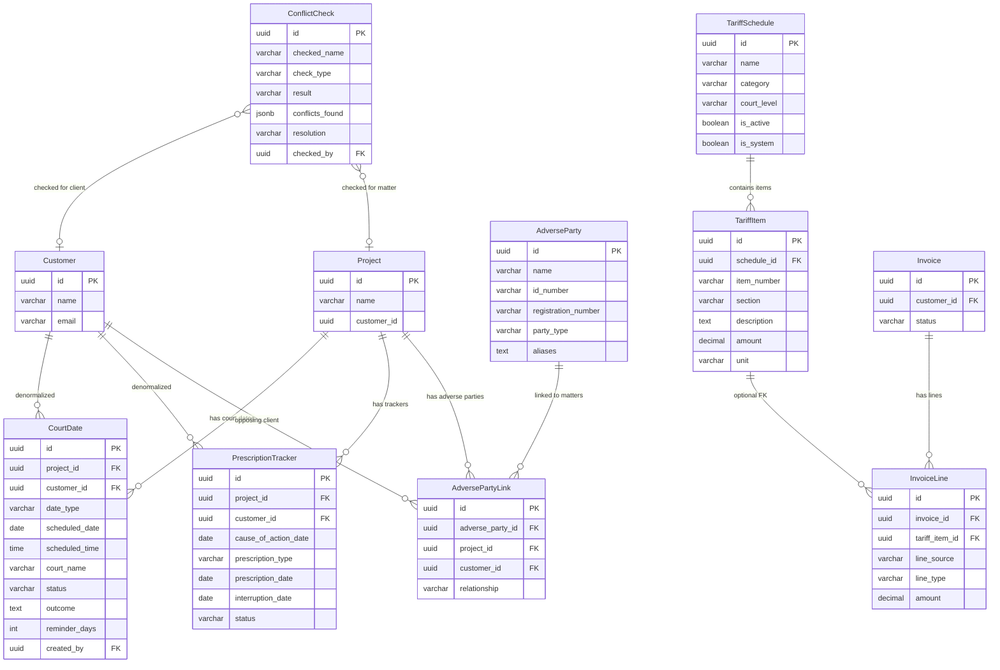
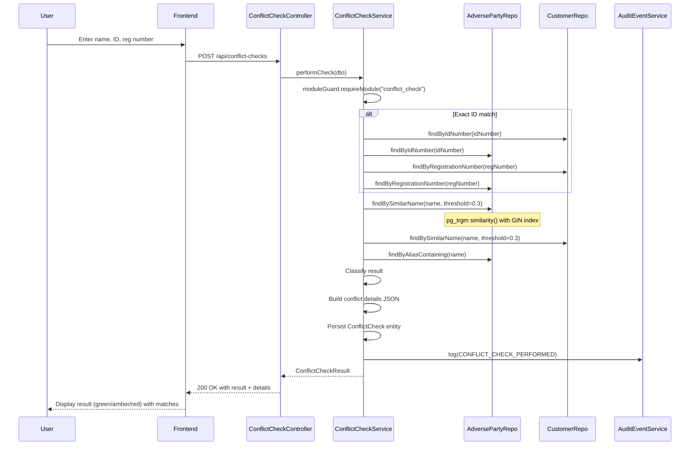
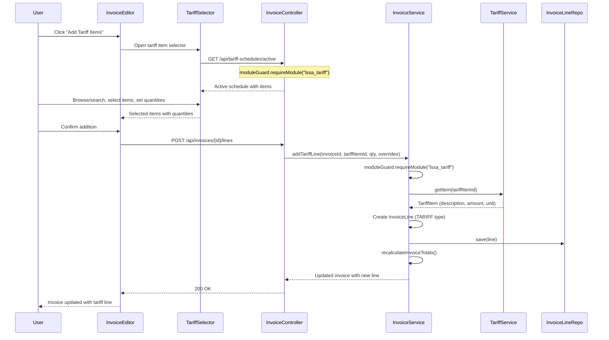
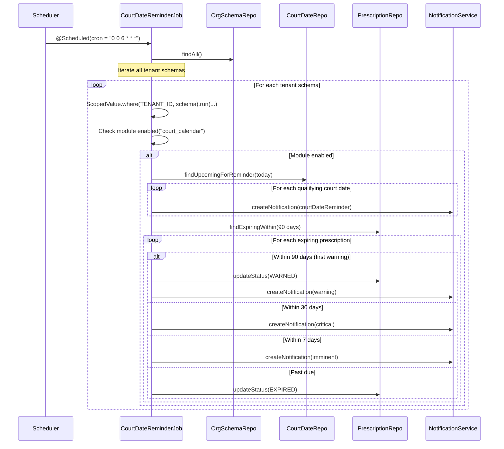

# Phase 55 — Legal Foundations: Court Calendar, Conflict Check & LSSA Tariff

> Standalone architecture document for Phase 55. ADRs: 209--212. Migration: V74.

---

## 1. Overview

Phase 55 is the multi-vertical architecture stress test. The platform has spent 53 phases building a generic professional services backbone and one real vertical (accounting-za, Phases 47--51). The legal stubs -- `court_calendar`, `conflict_check`, and `trust_accounting` -- were created in Phase 49 as placeholders to prove the module guard and profile system could conditionally gate UI and API access. But stubs prove nothing about coexistence: they contain no domain logic, no tables, no pack content, no interactions with shared entities. Two real verticals running simultaneously is an untested claim.

This phase builds three real legal modules that replace two of the three stubs, adds a fourth module (`lssa_tariff`), and populates all legal pack content. Critically, it ships with multi-vertical coexistence integration tests that prove accounting and legal tenants can operate in the same deployment without interference.

### What's New vs. What's Extended

| Capability | Existing Code | Phase 55 Changes |
|---|---|---|
| **Court dates** | Stub controller returns `"status": "stub"`. No entity, no table. | New `CourtDate` entity, `PrescriptionTracker` entity, `CourtCalendarService`, full CRUD + postpone/cancel/outcome flows, `CourtDateReminderJob` for notifications, frontend court calendar page with calendar/list/prescription views. |
| **Conflict check** | Stub controller returns `"status": "stub"`. No entity, no table. | New `AdverseParty`, `AdversePartyLink`, `ConflictCheck` entities. `ConflictCheckService` with pg_trgm fuzzy name search. `AdversePartyService` for registry management. Audit trail for all checks. Frontend conflict check page and adverse party registry. |
| **LSSA tariff** | Not registered. No module stub. | New `lssa_tariff` module. `TariffSchedule` and `TariffItem` entities. `TariffService` for schedule/item CRUD. Seed data for 2024/2025 High Court tariff. Invoice integration via new `tariff_item_id` FK on `InvoiceLine`. Frontend tariff management page and invoice line tariff selector. |
| **InvoiceLine** | Supports TIME, EXPENSE, RETAINER, MANUAL, FIXED_FEE line types. No tariff awareness. | Extended with `tariff_item_id` (nullable UUID FK) and `line_source` (VARCHAR). New `TARIFF` line type. |
| **Legal pack content** | `legal-za` profile declared but packs are empty shells. | Populated: `legal-za-customer` field pack (7 fields), `legal-za-project` field pack (8 fields), `legal-za` template pack (7 templates), `legal-za` clause pack (10 clauses), `legal-za` compliance pack (11 checklist items), `legal-za` automation pack (2 rules). |
| **Module registry** | 4 modules: 3 stubs + 1 active (`regulatory_deadlines`). | 7 modules: `court_calendar` active, `conflict_check` active, `lssa_tariff` active (new), `trust_accounting` stub (unchanged), `regulatory_deadlines` active (unchanged). Legal profile's `enabled_modules` updated to exclude `trust_accounting`. |
| **RBAC** | No legal-specific capabilities. Legal stubs reuse `PROJECT_MANAGEMENT` and `FINANCIAL_VISIBILITY`. | Two new capabilities: `VIEW_LEGAL`, `MANAGE_LEGAL`. All legal endpoints gated with these. |
| **Multi-vertical testing** | No tests verify coexistence of two real verticals. | 7 backend integration tests + 4 frontend tests explicitly proving accounting + legal tenant coexistence. |

### Strategic Context

This phase answers three questions:

1. **Does schema-per-tenant isolation work when two verticals create different table subsets?** Legal tables (court_dates, adverse_parties, conflict_checks, tariff_schedules, tariff_items) are created in every tenant schema, including accounting tenants that never use them. Module guard controls access, not table presence. This is the same pattern as accounting tables existing in generic tenant schemas.

2. **Can the `InvoiceLine` entity accommodate a vertical-specific rate source without breaking existing billing pipelines?** The tariff integration uses an additive pattern: a new nullable FK column and a new enum value. Accounting tenants never see `TARIFF` line types and never populate `tariff_item_id`. The existing `TIME -> BillingRate -> amount` pipeline is completely untouched.

3. **Do pack seeders remain orthogonal?** Provisioning an accounting tenant seeds accounting packs (field packs, compliance packs, templates, clauses, automations, rate packs, schedule packs). Provisioning a legal tenant seeds legal packs. No cross-contamination, no conditional logic in the shared seeder infrastructure. Each pack is identified by its pack name prefix (`accounting-za-*` or `legal-za-*`) and the seeder infrastructure resolves the correct JSON resource files.

---

## 2. Domain Model

### 2.1 New Entity: CourtDate

A tenant-scoped entity tracking court appearances, hearings, trials, and other legal events tied to a matter. Unlike accounting deadlines (calculated from fiscal year-end via `DeadlineCalculationService`), court dates are externally set by the court and entered manually by the firm. This fundamental difference motivates the separate entity model rather than reusing the deadline infrastructure ([ADR-209](../adr/ADR-209-court-date-vs-deadline-architecture.md)).

| Field | Java Type | DB Column | DB Type | Constraints | Notes |
|---|---|---|---|---|---|
| `id` | `UUID` | `id` | `UUID` | PK, generated | |
| `projectId` | `UUID` | `project_id` | `UUID` | NOT NULL | The matter this court date belongs to |
| `customerId` | `UUID` | `customer_id` | `UUID` | NOT NULL | Denormalized for cross-matter queries |
| `dateType` | `String` | `date_type` | `VARCHAR(30)` | NOT NULL | One of: HEARING, TRIAL, MOTION, MEDIATION, ARBITRATION, PRE_TRIAL, CASE_MANAGEMENT, TAXATION, OTHER |
| `scheduledDate` | `LocalDate` | `scheduled_date` | `DATE` | NOT NULL | The date of the court event |
| `scheduledTime` | `LocalTime` | `scheduled_time` | `TIME` | nullable | Time of the hearing |
| `courtName` | `String` | `court_name` | `VARCHAR(200)` | NOT NULL | E.g., "Johannesburg High Court" |
| `courtReference` | `String` | `court_reference` | `VARCHAR(100)` | nullable | Case number at court, e.g., "2026/12345" |
| `judgeMagistrate` | `String` | `judge_magistrate` | `VARCHAR(200)` | nullable | Assigned judge or magistrate |
| `description` | `String` | `description` | `TEXT` | nullable | What the appearance is about |
| `status` | `String` | `status` | `VARCHAR(20)` | NOT NULL, default 'SCHEDULED' | One of: SCHEDULED, POSTPONED, HEARD, CANCELLED |
| `outcome` | `String` | `outcome` | `TEXT` | nullable | Result of the hearing |
| `reminderDays` | `Integer` | `reminder_days` | `INTEGER` | NOT NULL, default 7 | Days before the date to send a reminder |
| `createdBy` | `UUID` | `created_by` | `UUID` | NOT NULL | Member who created it |
| `createdAt` | `Instant` | `created_at` | `TIMESTAMPTZ` | NOT NULL, immutable | |
| `updatedAt` | `Instant` | `updated_at` | `TIMESTAMPTZ` | NOT NULL | |

**Design rationale:** The `customerId` column is denormalized from the project-customer relationship. This avoids a three-table join when building the firm-wide court calendar view (court_dates -> customer_projects -> customers). The denormalization is safe because a matter's client rarely changes, and the court calendar is a read-heavy view.

**No unique constraint**: A matter can have multiple court dates of the same type (e.g., multiple hearings in the same trial).

### 2.2 New Entity: PrescriptionTracker

Tracks statutory prescription (limitation) periods for legal claims. Prescription is the SA legal concept of time-barring -- after the prescribed period, the right to bring a claim expires. The prescription date is calculated from the cause of action date plus the statutory period, but unlike accounting deadlines, it can be interrupted by judicial process (service of summons, acknowledgment of debt).

| Field | Java Type | DB Column | DB Type | Constraints | Notes |
|---|---|---|---|---|---|
| `id` | `UUID` | `id` | `UUID` | PK, generated | |
| `projectId` | `UUID` | `project_id` | `UUID` | NOT NULL | The matter this tracks |
| `customerId` | `UUID` | `customer_id` | `UUID` | NOT NULL | Denormalized for cross-matter queries |
| `causeOfActionDate` | `LocalDate` | `cause_of_action_date` | `DATE` | NOT NULL | When the cause of action arose |
| `prescriptionType` | `String` | `prescription_type` | `VARCHAR(30)` | NOT NULL | One of: GENERAL_3Y, DEBT_6Y, MORTGAGE_30Y, DELICT_3Y, CONTRACT_3Y, CUSTOM |
| `customYears` | `Integer` | `custom_years` | `INTEGER` | nullable | Only used when type is CUSTOM |
| `prescriptionDate` | `LocalDate` | `prescription_date` | `DATE` | NOT NULL | Calculated: cause_of_action_date + period. Stored for query efficiency. |
| `interruptionDate` | `LocalDate` | `interruption_date` | `DATE` | nullable | Date prescription was interrupted |
| `interruptionReason` | `String` | `interruption_reason` | `VARCHAR(200)` | nullable | E.g., "Service of combined summons" |
| `status` | `String` | `status` | `VARCHAR(20)` | NOT NULL, default 'RUNNING' | One of: RUNNING, INTERRUPTED, EXPIRED, WARNED |
| `notes` | `String` | `notes` | `TEXT` | nullable | |
| `createdBy` | `UUID` | `created_by` | `UUID` | NOT NULL | Member who created the tracker |
| `createdAt` | `Instant` | `created_at` | `TIMESTAMPTZ` | NOT NULL, immutable | |
| `updatedAt` | `Instant` | `updated_at` | `TIMESTAMPTZ` | NOT NULL | |

**Prescription rules** (static, code-based -- same pattern as `DeadlineTypeRegistry`):

| Type | Period | Reference |
|------|--------|-----------|
| `GENERAL_3Y` | 3 years | Prescription Act s11(d) -- general |
| `DEBT_6Y` | 6 years | Prescription Act s11(a) -- debt acknowledged in writing |
| `MORTGAGE_30Y` | 30 years | Prescription Act s11(b) -- mortgage bonds, judgments |
| `DELICT_3Y` | 3 years | Prescription Act s11(d) -- delictual claims |
| `CONTRACT_3Y` | 3 years | Prescription Act s11(d) -- contractual claims |
| `CUSTOM` | N years | Firm-defined for special statutes |

**Design rationale:** The `prescriptionDate` is stored (not calculated on-the-fly like accounting deadlines) because prescription tracking is a per-matter concern, not a firm-wide calendar computed from client data. Each prescription tracker is explicitly created by a user for a specific claim, and the date is needed for efficient "upcoming expiry" queries across all matters.

**Interruption handling:** When `interruptionDate` is set, the tracker moves to `INTERRUPTED` status. Full restart calculation (prescription restarts from the interruption date) is deferred -- this phase simply marks the interruption and relies on the lawyer to create a new tracker if needed.

### 2.3 New Entity: AdverseParty

A registry of parties who have been opposed to the firm's clients in legal matters. This is the core data source for conflict-of-interest checking.

| Field | Java Type | DB Column | DB Type | Constraints | Notes |
|---|---|---|---|---|---|
| `id` | `UUID` | `id` | `UUID` | PK, generated | |
| `name` | `String` | `name` | `VARCHAR(300)` | NOT NULL | Name of the adverse party (person or entity) |
| `idNumber` | `String` | `id_number` | `VARCHAR(20)` | nullable | SA ID number or passport number |
| `registrationNumber` | `String` | `registration_number` | `VARCHAR(30)` | nullable | Company registration number |
| `partyType` | `String` | `party_type` | `VARCHAR(20)` | NOT NULL | One of: NATURAL_PERSON, COMPANY, TRUST, CLOSE_CORPORATION, PARTNERSHIP, OTHER |
| `aliases` | `String` | `aliases` | `TEXT` | nullable | Comma-separated aliases or trading names |
| `notes` | `String` | `notes` | `TEXT` | nullable | |
| `createdAt` | `Instant` | `created_at` | `TIMESTAMPTZ` | NOT NULL, immutable | |
| `updatedAt` | `Instant` | `updated_at` | `TIMESTAMPTZ` | NOT NULL | |

**Fuzzy search:** The `name` column has a GIN trigram index for fuzzy matching via PostgreSQL's `pg_trgm` extension ([ADR-210](../adr/ADR-210-conflict-search-strategy.md)). The `id_number` and `registration_number` columns have standard B-tree indexes for exact matching.

### 2.4 New Entity: AdversePartyLink

Links an adverse party to a specific matter and client. Records the relationship context.

| Field | Java Type | DB Column | DB Type | Constraints | Notes |
|---|---|---|---|---|---|
| `id` | `UUID` | `id` | `UUID` | PK, generated | |
| `adversePartyId` | `UUID` | `adverse_party_id` | `UUID` | NOT NULL | FK to adverse_parties |
| `projectId` | `UUID` | `project_id` | `UUID` | NOT NULL | The matter this party is linked to |
| `customerId` | `UUID` | `customer_id` | `UUID` | NOT NULL | The client on the other side |
| `relationship` | `String` | `relationship` | `VARCHAR(30)` | NOT NULL | One of: OPPOSING_PARTY, WITNESS, CO_ACCUSED, RELATED_ENTITY, GUARANTOR |
| `description` | `String` | `description` | `TEXT` | nullable | Context about the relationship |
| `createdAt` | `Instant` | `created_at` | `TIMESTAMPTZ` | NOT NULL, immutable | |

**Unique constraint:** `(adverse_party_id, project_id)` -- an adverse party is linked to a matter at most once.

### 2.5 New Entity: ConflictCheck

An immutable audit record of every conflict-of-interest check performed by the firm. The Legal Practice Act requires firms to demonstrate they perform conflict checks -- this entity provides the audit trail.

| Field | Java Type | DB Column | DB Type | Constraints | Notes |
|---|---|---|---|---|---|
| `id` | `UUID` | `id` | `UUID` | PK, generated | |
| `checkedName` | `String` | `checked_name` | `VARCHAR(300)` | NOT NULL | The name that was searched |
| `checkedIdNumber` | `String` | `checked_id_number` | `VARCHAR(20)` | nullable | ID number searched |
| `checkedRegistrationNumber` | `String` | `checked_registration_number` | `VARCHAR(30)` | nullable | Registration number searched |
| `checkType` | `String` | `check_type` | `VARCHAR(20)` | NOT NULL | One of: NEW_CLIENT, NEW_MATTER, PERIODIC_REVIEW |
| `result` | `String` | `result` | `VARCHAR(20)` | NOT NULL | One of: NO_CONFLICT, CONFLICT_FOUND, POTENTIAL_CONFLICT |
| `conflictsFound` | `String` (JSONB) | `conflicts_found` | `JSONB` | nullable | Array of conflict details |
| `resolution` | `String` | `resolution` | `VARCHAR(30)` | nullable | One of: PROCEED, DECLINED, WAIVER_OBTAINED, REFERRED |
| `resolutionNotes` | `String` | `resolution_notes` | `TEXT` | nullable | |
| `waiverDocumentId` | `UUID` | `waiver_document_id` | `UUID` | nullable | Link to generated/uploaded waiver document |
| `checkedBy` | `UUID` | `checked_by` | `UUID` | NOT NULL | Member who performed the check |
| `resolvedBy` | `UUID` | `resolved_by` | `UUID` | nullable | Member who resolved the conflict |
| `checkedAt` | `Instant` | `checked_at` | `TIMESTAMPTZ` | NOT NULL | When the check was performed |
| `resolvedAt` | `Instant` | `resolved_at` | `TIMESTAMPTZ` | nullable | When the resolution was recorded |
| `customerId` | `UUID` | `customer_id` | `UUID` | nullable | The client being checked (for NEW_CLIENT checks) |
| `projectId` | `UUID` | `project_id` | `UUID` | nullable | The matter being checked (for NEW_MATTER checks) |

**`conflictsFound` JSONB structure:**

```json
[
  {
    "adversePartyId": "uuid",
    "adversePartyName": "Company X",
    "projectId": "uuid",
    "projectName": "Matter ABC",
    "customerId": "uuid",
    "customerName": "Client Y",
    "relationship": "OPPOSING_PARTY",
    "matchType": "NAME_SIMILARITY",
    "similarityScore": 0.85,
    "explanation": "Name match: 'Company X (Pty) Ltd' vs 'Company X'"
  }
]
```

**Design rationale:** The conflict details are stored as JSONB rather than as a separate entity because they are a snapshot of the search results at the time of the check. The adverse party registry may change after the check (parties renamed, links removed), but the audit record must reflect what was found at the time. This is the same snapshot pattern used by `InvoiceLine` for tax rate snapshots.

### 2.6 New Entity: TariffSchedule

A published tariff schedule containing standard fees for legal activities. See [ADR-211](../adr/ADR-211-tariff-rate-integration-approach.md) for why this is a separate entity from `BillingRate`.

| Field | Java Type | DB Column | DB Type | Constraints | Notes |
|---|---|---|---|---|---|
| `id` | `UUID` | `id` | `UUID` | PK, generated | |
| `name` | `String` | `name` | `VARCHAR(100)` | NOT NULL | E.g., "LSSA 2024/2025 High Court" |
| `category` | `String` | `category` | `VARCHAR(20)` | NOT NULL | One of: PARTY_AND_PARTY, ATTORNEY_AND_CLIENT |
| `courtLevel` | `String` | `court_level` | `VARCHAR(30)` | NOT NULL | One of: HIGH_COURT, MAGISTRATE_COURT, CONSTITUTIONAL_COURT |
| `effectiveFrom` | `LocalDate` | `effective_from` | `DATE` | NOT NULL | Start of validity period |
| `effectiveTo` | `LocalDate` | `effective_to` | `DATE` | nullable | End of validity period (null = current) |
| `isActive` | `boolean` | `is_active` | `BOOLEAN` | NOT NULL, default true | Whether this is the current schedule |
| `isSystem` | `boolean` | `is_system` | `BOOLEAN` | NOT NULL, default false | True = seeded/read-only, false = custom/editable |
| `source` | `String` | `source` | `VARCHAR(100)` | nullable | E.g., "LSSA Gazette 2024" |
| `createdAt` | `Instant` | `created_at` | `TIMESTAMPTZ` | NOT NULL, immutable | |
| `updatedAt` | `Instant` | `updated_at` | `TIMESTAMPTZ` | NOT NULL | |

### 2.7 New Entity: TariffItem

An individual line item within a tariff schedule. Represents a specific legal activity with a fixed fee amount.

| Field | Java Type | DB Column | DB Type | Constraints | Notes |
|---|---|---|---|---|---|
| `id` | `UUID` | `id` | `UUID` | PK, generated | |
| `scheduleId` | `UUID` | `schedule_id` | `UUID` | NOT NULL | FK to tariff_schedules |
| `itemNumber` | `String` | `item_number` | `VARCHAR(20)` | NOT NULL | Tariff item reference, e.g., "1(a)", "2(b)(ii)" |
| `section` | `String` | `section` | `VARCHAR(100)` | NOT NULL | Grouping header, e.g., "Instructions and consultations" |
| `description` | `String` | `description` | `TEXT` | NOT NULL | Full description of the activity |
| `amount` | `BigDecimal` | `amount` | `DECIMAL(12,2)` | NOT NULL | Amount in ZAR |
| `unit` | `String` | `unit` | `VARCHAR(30)` | NOT NULL | One of: PER_ITEM, PER_PAGE, PER_FOLIO, PER_QUARTER_HOUR, PER_HOUR, PER_DAY |
| `notes` | `String` | `notes` | `TEXT` | nullable | Conditions or explanations |
| `sortOrder` | `int` | `sort_order` | `INTEGER` | NOT NULL, default 0 | Display ordering within section |

### 2.8 Extended Entity: InvoiceLine

Two new columns are added to the existing `InvoiceLine` entity to support tariff-based invoice lines.

| Field | Java Type | DB Column | DB Type | Constraints | Notes |
|---|---|---|---|---|---|
| `tariffItemId` | `UUID` | `tariff_item_id` | `UUID` | nullable | FK to tariff_items. When set, the line amount comes from the tariff item. |
| `lineSource` | `String` | `line_source` | `VARCHAR(20)` | nullable | One of: TIME_ENTRY, EXPENSE, TARIFF, MANUAL. For display purposes. |

The existing `InvoiceLineType` enum is extended with `TARIFF`:

```java
public enum InvoiceLineType {
  TIME, EXPENSE, RETAINER, MANUAL, FIXED_FEE, TARIFF
}
```

**Design rationale:** The `lineSource` column is distinct from `lineType` because `lineType` drives billing logic (how the amount is computed) while `lineSource` is informational (where the line came from, for UI display). A `TARIFF` line type uses the tariff item's amount x quantity, not the hourly rate x hours calculation. The `tariffItemId` FK allows the invoice to reference the specific tariff item for traceability, similar to how `timeEntryId` references the time entry that generated a TIME line.

### 2.9 Entity Relationship Diagram




---

## 3. Core Flows and Backend Behaviour

### 3.1 Court Date CRUD + Lifecycle Flows

**Create court date:**

1. Controller receives `POST /api/court-dates` with project_id, date_type, scheduled_date, court_name, and optional fields.
2. `CourtCalendarService.createCourtDate()` calls `moduleGuard.requireModule("court_calendar")`.
3. Service validates: project exists, customer_id resolved from project-customer link.
4. Creates `CourtDate` entity with status `SCHEDULED`, `reminderDays` defaulting to 7.
5. Emits audit event: `COURT_DATE_CREATED`.
6. Returns created entity.

**Postpone court date:**

1. Controller receives `POST /api/court-dates/{id}/postpone` with `newDate` and `reason`.
2. Service loads the court date, validates status is `SCHEDULED` (cannot postpone an already-heard or cancelled date).
3. Updates `scheduledDate` to `newDate`, sets `status` to `POSTPONED`, appends reason to `description`.
4. Emits audit event: `COURT_DATE_POSTPONED` with old and new dates.
5. If the court date had been reminded, the reminder job will re-evaluate based on the new date.

**Cancel court date:**

1. Controller receives `POST /api/court-dates/{id}/cancel` with `reason`.
2. Service validates status is `SCHEDULED` or `POSTPONED`.
3. Sets `status` to `CANCELLED`, stores reason in `outcome`.
4. Emits audit event: `COURT_DATE_CANCELLED`.

**Record outcome:**

1. Controller receives `POST /api/court-dates/{id}/outcome` with `outcome` text.
2. Service validates status is `SCHEDULED` or `POSTPONED` (not already heard/cancelled).
3. Sets `status` to `HEARD`, stores outcome text.
4. Emits audit event: `COURT_DATE_OUTCOME_RECORDED`.

**State transitions:**

```
SCHEDULED --> POSTPONED (postpone action)
SCHEDULED --> HEARD     (record outcome)
SCHEDULED --> CANCELLED (cancel action)
POSTPONED --> HEARD     (record outcome)
POSTPONED --> CANCELLED (cancel action)
```

No reverse transitions: once heard or cancelled, a court date is final. A new court date must be created for any subsequent appearances.

### 3.2 Prescription Tracking + Warning Flow

**Create prescription tracker:**

1. Controller receives `POST /api/prescription-trackers` with project_id, cause_of_action_date, prescription_type, optional custom_years.
2. Service calls `moduleGuard.requireModule("court_calendar")` (prescription tracking is part of the court calendar module).
3. Calculates `prescriptionDate` from `causeOfActionDate` + period years (using `PrescriptionRuleRegistry`).
4. Creates entity with status `RUNNING`.
5. Emits audit event: `PRESCRIPTION_TRACKER_CREATED`.

**Interrupt prescription:**

1. Controller receives `POST /api/prescription-trackers/{id}/interrupt` with `interruptionDate` and `reason`.
2. Service validates status is `RUNNING` (cannot interrupt an already-interrupted or expired tracker).
3. Sets `interruptionDate`, `interruptionReason`, status to `INTERRUPTED`.
4. Emits audit event: `PRESCRIPTION_INTERRUPTED`.
5. Note: no automatic recalculation of prescription date. The firm creates a new tracker if needed.

**PrescriptionRuleRegistry** (static utility, same pattern as `DeadlineTypeRegistry`):

```java
public final class PrescriptionRuleRegistry {
    private PrescriptionRuleRegistry() {}

    public static int getPeriodYears(String prescriptionType) {
        return switch (prescriptionType) {
            case "GENERAL_3Y", "DELICT_3Y", "CONTRACT_3Y" -> 3;
            case "DEBT_6Y" -> 6;
            case "MORTGAGE_30Y" -> 30;
            default -> throw new IllegalArgumentException(
                "Unknown prescription type: " + prescriptionType);
        };
    }

    public static LocalDate calculatePrescriptionDate(
            LocalDate causeOfActionDate, String prescriptionType, Integer customYears) {
        if ("CUSTOM".equals(prescriptionType)) {
            if (customYears == null || customYears <= 0) {
                throw new IllegalArgumentException("CUSTOM type requires positive customYears");
            }
            return causeOfActionDate.plusYears(customYears);
        }
        return causeOfActionDate.plusYears(getPeriodYears(prescriptionType));
    }
}
```

### 3.3 CourtDateReminderJob

A scheduled job that runs daily, scanning for upcoming court dates and prescription expirations. Follows the same pattern as `FieldDateScannerJob` from Phase 48.

**Schedule:** Runs once daily at 06:00 UTC (configurable via `court.reminder.cron` property).

**Algorithm:**

1. For each tenant schema (iterate via `OrgSchemaMapping`):
   - Bind `RequestScopes.TENANT_ID` to the tenant schema.
   - Check if `court_calendar` module is enabled for this tenant. Skip if not.
   - Query court dates where `status IN ('SCHEDULED', 'POSTPONED')` and `scheduled_date - reminder_days <= today` and no reminder has been sent for this date yet.
   - For each qualifying court date, create a notification for the `createdBy` member (and all project members with `VIEW_LEGAL` capability).
   - Query prescription trackers where `status = 'RUNNING'` and `prescription_date` is within warning thresholds:
     - 90 days: `WARNED` status update + notification.
     - 30 days: notification (already warned).
     - 7 days: notification (critical warning).
   - Update tracker status to `WARNED` on first warning, `EXPIRED` when `prescriptionDate` is past.

**Notification templates:**

| Event | Subject | Body |
|---|---|---|
| Court date reminder | "Court date in {N} days: {dateType}" | "{courtName} -- {description}. Scheduled for {scheduledDate}." |
| Prescription 90-day warning | "Prescription warning: {prescriptionType}" | "Matter {projectName}: Prescription expires on {prescriptionDate} ({N} days)." |
| Prescription 30-day warning | "Prescription critical: {prescriptionType}" | "Matter {projectName}: Prescription expires on {prescriptionDate} ({N} days). Immediate action required." |
| Prescription 7-day warning | "Prescription imminent: {prescriptionType}" | "Matter {projectName}: Prescription expires on {prescriptionDate} ({N} days). URGENT." |

**Idempotency:** The job tracks which reminders have been sent to avoid duplicate notifications. This uses a lightweight approach: query notifications by reference_type/reference_id to check if a reminder for a specific court_date/date combination has already been dispatched.

### 3.4 Conflict Check Search Algorithm

The conflict search is a **fuzzy name match + exact ID match** across two data sources: the Customer table (existing clients) and the AdverseParty table (adverse parties). See [ADR-210](../adr/ADR-210-conflict-search-strategy.md) for the search strategy rationale.

**Algorithm:**

```
Input: checkedName, checkedIdNumber (optional), checkedRegistrationNumber (optional)

Step 1 -- Exact ID matching (highest priority):
  IF checkedIdNumber is provided:
    Search customers WHERE id_number = checkedIdNumber
    Search adverse_parties WHERE id_number = checkedIdNumber
    Any match -> CONFLICT_FOUND

  IF checkedRegistrationNumber is provided:
    Search customers WHERE registration_number = checkedRegistrationNumber
    Search adverse_parties WHERE registration_number = checkedRegistrationNumber
    Any match -> CONFLICT_FOUND

Step 2 -- Fuzzy name matching:
  Normalize checkedName (trim, lowercase).
  Search adverse_parties using pg_trgm:
    SELECT *, similarity(lower(name), lower(:checkedName)) AS score
    FROM adverse_parties
    WHERE similarity(lower(name), lower(:checkedName)) > 0.3
    ORDER BY score DESC

  Search customers using pg_trgm:
    SELECT *, similarity(lower(name), lower(:checkedName)) AS score
    FROM customers
    WHERE similarity(lower(name), lower(:checkedName)) > 0.3
    ORDER BY score DESC

  Also search adverse_party aliases:
    SELECT * FROM adverse_parties
    WHERE similarity(lower(aliases), lower(:checkedName)) > 0.3

Step 3 -- Result classification:
  IF any exact ID match found:
    result = CONFLICT_FOUND
  ELSE IF any name match with score > 0.6:
    result = CONFLICT_FOUND
  ELSE IF any name match with score 0.3-0.6, or alias match:
    result = POTENTIAL_CONFLICT
  ELSE:
    result = NO_CONFLICT

Step 4 -- Build conflict details:
  For each match, resolve linked matters via adverse_party_links.
  Include: adversePartyId, adversePartyName, projectId, projectName,
           customerId, customerName, relationship, matchType, similarityScore.

Step 5 -- Persist ConflictCheck record:
  Always persist, regardless of result.
  Emit audit event: CONFLICT_CHECK_PERFORMED.
```

**Performance:** The pg_trgm GIN index on `adverse_parties.name` handles the fuzzy search efficiently. At 10,000 adverse parties, trigram similarity with a GIN index runs in single-digit milliseconds. The customer table search uses the same approach. Both queries are bounded by the similarity threshold (0.3), which limits the result set.

### 3.5 Tariff Item Selection + Invoice Line Creation

**Flow:**

1. User is editing an invoice for a matter where `lssa_tariff` module is enabled.
2. User clicks "Add Tariff Items" button.
3. Frontend fetches active tariff schedules via `GET /api/tariff-schedules/active?category=PARTY_AND_PARTY&courtLevel=HIGH_COURT`.
4. User browses/searches tariff items within the selected schedule.
5. User selects items, sets quantity (default 1).
6. Frontend calls `POST /api/invoices/{invoiceId}/lines` with tariff item details.
7. Backend `InvoiceService` creates an `InvoiceLine` with `lineType = TARIFF`, `lineSource = "TARIFF"`, `tariffItemId` set.
8. Invoice totals are recalculated as `SUM(line_amount)` -- no change to the totals logic.

**Override handling:** The user can override the description and amount from the tariff. The `tariffItemId` FK is preserved for audit/traceability even when the amount is overridden.

### 3.6 Module Guard Gating Pattern

Every legal endpoint and service method starts with a module guard check. This is the same pattern used by the `regulatory_deadlines` module in Phase 51.

```java
// In service methods:
moduleGuard.requireModule("court_calendar");    // for court dates and prescriptions
moduleGuard.requireModule("conflict_check");    // for conflict checks and adverse parties
moduleGuard.requireModule("lssa_tariff");       // for tariff schedules and items
```

```tsx
// In frontend:
<ModuleGate module="court_calendar">
  <CourtCalendarTab />
</ModuleGate>
```

**Key principle:** Module guard is the single gating mechanism. Tables exist in every tenant schema regardless of profile. The guard checks `OrgSettings.enabled_modules` for the current tenant (resolved via `RequestScopes.TENANT_ID`). If the module is not enabled, the guard throws `ModuleNotEnabledException`, which the global exception handler translates to HTTP 403.

---

## 4. API Surface

### 4.1 Court Calendar Endpoints

| Method | Path | Auth | Description |
|--------|------|------|-------------|
| `GET` | `/api/court-dates` | VIEW_LEGAL | List court dates. Filters: `dateFrom`, `dateTo`, `dateType`, `status`, `customerId`, `projectId`. Paginated. |
| `GET` | `/api/court-dates/{id}` | VIEW_LEGAL | Get single court date detail. |
| `POST` | `/api/court-dates` | MANAGE_LEGAL | Create a court date. |
| `PUT` | `/api/court-dates/{id}` | MANAGE_LEGAL | Update a court date. |
| `POST` | `/api/court-dates/{id}/postpone` | MANAGE_LEGAL | Postpone to new date with reason. |
| `POST` | `/api/court-dates/{id}/cancel` | MANAGE_LEGAL | Cancel with reason. |
| `POST` | `/api/court-dates/{id}/outcome` | MANAGE_LEGAL | Record hearing outcome. |
| `GET` | `/api/prescription-trackers` | VIEW_LEGAL | List prescription trackers. Filters: `status`, `customerId`, `projectId`. Paginated. |
| `GET` | `/api/prescription-trackers/{id}` | VIEW_LEGAL | Get single tracker detail. |
| `POST` | `/api/prescription-trackers` | MANAGE_LEGAL | Create a tracker. |
| `PUT` | `/api/prescription-trackers/{id}` | MANAGE_LEGAL | Update a tracker. |
| `POST` | `/api/prescription-trackers/{id}/interrupt` | MANAGE_LEGAL | Record prescription interruption. |
| `GET` | `/api/court-calendar/upcoming` | VIEW_LEGAL | Combined: upcoming court dates + prescription warnings. Dashboard widget data. |

**Create court date request:**

```json
{
  "projectId": "uuid",
  "dateType": "HEARING",
  "scheduledDate": "2026-05-15",
  "scheduledTime": "10:00",
  "courtName": "Johannesburg High Court",
  "courtReference": "2026/12345",
  "judgeMagistrate": "Judge Mogoeng",
  "description": "Application for summary judgment",
  "reminderDays": 7
}
```

**Court date response:**

```json
{
  "id": "uuid",
  "projectId": "uuid",
  "projectName": "Smith v Jones",
  "customerId": "uuid",
  "customerName": "Smith & Associates",
  "dateType": "HEARING",
  "scheduledDate": "2026-05-15",
  "scheduledTime": "10:00",
  "courtName": "Johannesburg High Court",
  "courtReference": "2026/12345",
  "judgeMagistrate": "Judge Mogoeng",
  "description": "Application for summary judgment",
  "status": "SCHEDULED",
  "outcome": null,
  "reminderDays": 7,
  "createdBy": "uuid",
  "createdAt": "2026-04-01T10:00:00Z",
  "updatedAt": "2026-04-01T10:00:00Z"
}
```

### 4.2 Conflict Check Endpoints

| Method | Path | Auth | Description |
|--------|------|------|-------------|
| `POST` | `/api/conflict-checks` | MANAGE_LEGAL | Perform a conflict check. Returns result immediately. |
| `GET` | `/api/conflict-checks` | VIEW_LEGAL | List check history. Filters: `result`, `checkType`, `checkedBy`, `dateFrom`, `dateTo`. Paginated. |
| `GET` | `/api/conflict-checks/{id}` | VIEW_LEGAL | Single check detail. |
| `POST` | `/api/conflict-checks/{id}/resolve` | MANAGE_LEGAL | Resolve a conflict (proceed/decline/waiver/refer). |

**Perform conflict check request:**

```json
{
  "checkedName": "Ndlovu Trading (Pty) Ltd",
  "checkedIdNumber": null,
  "checkedRegistrationNumber": "2020/123456/07",
  "checkType": "NEW_CLIENT",
  "customerId": "uuid-optional",
  "projectId": "uuid-optional"
}
```

**Conflict check response:**

```json
{
  "id": "uuid",
  "checkedName": "Ndlovu Trading (Pty) Ltd",
  "checkedRegistrationNumber": "2020/123456/07",
  "checkType": "NEW_CLIENT",
  "result": "CONFLICT_FOUND",
  "conflictsFound": [
    {
      "adversePartyId": "uuid",
      "adversePartyName": "Ndlovu Trading",
      "projectId": "uuid",
      "projectName": "Mabaso v Ndlovu Trading",
      "customerId": "uuid",
      "customerName": "Mabaso Holdings",
      "relationship": "OPPOSING_PARTY",
      "matchType": "REGISTRATION_NUMBER_EXACT",
      "similarityScore": 1.0,
      "explanation": "Exact registration number match: 2020/123456/07"
    }
  ],
  "resolution": null,
  "checkedBy": "uuid",
  "checkedAt": "2026-04-01T10:00:00Z"
}
```

### 4.3 Adverse Party Endpoints

| Method | Path | Auth | Description |
|--------|------|------|-------------|
| `GET` | `/api/adverse-parties` | VIEW_LEGAL | List adverse parties. Filters: `search` (fuzzy name), `partyType`. Paginated. |
| `GET` | `/api/adverse-parties/{id}` | VIEW_LEGAL | Single adverse party with linked matters. |
| `POST` | `/api/adverse-parties` | MANAGE_LEGAL | Create adverse party. |
| `PUT` | `/api/adverse-parties/{id}` | MANAGE_LEGAL | Update adverse party. |
| `DELETE` | `/api/adverse-parties/{id}` | MANAGE_LEGAL | Delete adverse party (only if no active links). |
| `POST` | `/api/adverse-parties/{id}/links` | MANAGE_LEGAL | Link adverse party to a matter. |
| `DELETE` | `/api/adverse-party-links/{linkId}` | MANAGE_LEGAL | Unlink adverse party from a matter. |
| `GET` | `/api/projects/{id}/adverse-parties` | VIEW_LEGAL | Get adverse parties for a specific matter. |

### 4.4 Tariff Schedule Endpoints

| Method | Path | Auth | Description |
|--------|------|------|-------------|
| `GET` | `/api/tariff-schedules` | VIEW_LEGAL | List all tariff schedules. |
| `GET` | `/api/tariff-schedules/{id}` | VIEW_LEGAL | Schedule detail with items. |
| `GET` | `/api/tariff-schedules/active` | VIEW_LEGAL | Get current active schedule. Query params: `category`, `courtLevel`. |
| `POST` | `/api/tariff-schedules` | MANAGE_LEGAL | Create custom schedule (admin). |
| `PUT` | `/api/tariff-schedules/{id}` | MANAGE_LEGAL | Update custom schedule (admin). Rejects if `isSystem = true`. |
| `POST` | `/api/tariff-schedules/{id}/clone` | MANAGE_LEGAL | Clone schedule as custom (admin). |
| `GET` | `/api/tariff-items` | VIEW_LEGAL | List/search tariff items. Query params: `scheduleId`, `search`, `section`. |
| `GET` | `/api/tariff-items/{id}` | VIEW_LEGAL | Single item detail. |
| `POST` | `/api/tariff-schedules/{id}/items` | MANAGE_LEGAL | Add item to custom schedule (admin). |
| `PUT` | `/api/tariff-items/{id}` | MANAGE_LEGAL | Update item in custom schedule (admin). |
| `DELETE` | `/api/tariff-items/{id}` | MANAGE_LEGAL | Delete item from custom schedule (admin). |

### 4.5 Invoice Tariff Line Endpoint

The existing `POST /api/invoices/{invoiceId}/lines` endpoint is extended to accept `tariffItemId`. When `tariffItemId` is provided, `lineType` must be `TARIFF`, `lineSource` is set automatically, and module guard `lssa_tariff` is checked.

---

## 5. Sequence Diagrams

### 5.1 Conflict Check Flow



### 5.2 Tariff Invoice Line Creation



### 5.3 Court Date Reminder Job



---

## 6. Database Migration (V74)

### 6.1 Full SQL

**Global migration prerequisite:** Create `V16__enable_pg_trgm.sql` in `db/migration/global/`:

```sql
-- V16__enable_pg_trgm.sql
-- Enable pg_trgm extension for fuzzy name matching (used by conflict check in Phase 55)
CREATE EXTENSION IF NOT EXISTS pg_trgm;
```

**Tenant migration (V74):**

```sql
-- V74__create_legal_foundation_tables.sql
-- Phase 55: Court Calendar, Conflict Check, LSSA Tariff

-- NOTE: pg_trgm extension is created by global migration V16__enable_pg_trgm.sql

-- ============================================================
-- 1. Court Dates
-- ============================================================
CREATE TABLE court_dates (
    id              UUID PRIMARY KEY DEFAULT gen_random_uuid(),
    project_id      UUID NOT NULL,
    customer_id     UUID NOT NULL,
    date_type       VARCHAR(30) NOT NULL,
    scheduled_date  DATE NOT NULL,
    scheduled_time  TIME,
    court_name      VARCHAR(200) NOT NULL,
    court_reference VARCHAR(100),
    judge_magistrate VARCHAR(200),
    description     TEXT,
    status          VARCHAR(20) NOT NULL DEFAULT 'SCHEDULED',
    outcome         TEXT,
    reminder_days   INTEGER NOT NULL DEFAULT 7,
    created_by      UUID NOT NULL,
    created_at      TIMESTAMP WITH TIME ZONE NOT NULL DEFAULT now(),
    updated_at      TIMESTAMP WITH TIME ZONE NOT NULL DEFAULT now()
);

CREATE INDEX idx_court_dates_project_date ON court_dates (project_id, scheduled_date);
CREATE INDEX idx_court_dates_customer ON court_dates (customer_id);
CREATE INDEX idx_court_dates_status ON court_dates (status);
CREATE INDEX idx_court_dates_reminder ON court_dates (scheduled_date, status)
    WHERE status IN ('SCHEDULED', 'POSTPONED');

-- ============================================================
-- 2. Prescription Trackers
-- ============================================================
CREATE TABLE prescription_trackers (
    id                   UUID PRIMARY KEY DEFAULT gen_random_uuid(),
    project_id           UUID NOT NULL,
    customer_id          UUID NOT NULL,
    cause_of_action_date DATE NOT NULL,
    prescription_type    VARCHAR(30) NOT NULL,
    custom_years         INTEGER,
    prescription_date    DATE NOT NULL,
    interruption_date    DATE,
    interruption_reason  VARCHAR(200),
    status               VARCHAR(20) NOT NULL DEFAULT 'RUNNING',
    notes                TEXT,
    created_by           UUID NOT NULL,
    created_at           TIMESTAMP WITH TIME ZONE NOT NULL DEFAULT now(),
    updated_at           TIMESTAMP WITH TIME ZONE NOT NULL DEFAULT now()
);

CREATE INDEX idx_prescription_trackers_project ON prescription_trackers (project_id);
CREATE INDEX idx_prescription_trackers_date ON prescription_trackers (prescription_date)
    WHERE status IN ('RUNNING', 'WARNED');
CREATE INDEX idx_prescription_trackers_customer ON prescription_trackers (customer_id);

-- ============================================================
-- 3. Adverse Parties
-- ============================================================
CREATE TABLE adverse_parties (
    id                  UUID PRIMARY KEY DEFAULT gen_random_uuid(),
    name                VARCHAR(300) NOT NULL,
    id_number           VARCHAR(20),
    registration_number VARCHAR(30),
    party_type          VARCHAR(20) NOT NULL,
    aliases             TEXT,
    notes               TEXT,
    created_at          TIMESTAMP WITH TIME ZONE NOT NULL DEFAULT now(),
    updated_at          TIMESTAMP WITH TIME ZONE NOT NULL DEFAULT now()
);

CREATE INDEX idx_adverse_parties_name_trgm ON adverse_parties
    USING GIN (name gin_trgm_ops);
CREATE INDEX idx_adverse_parties_id_number ON adverse_parties (id_number)
    WHERE id_number IS NOT NULL;
CREATE INDEX idx_adverse_parties_reg_number ON adverse_parties (registration_number)
CREATE INDEX idx_adverse_parties_aliases_trgm ON adverse_parties
    USING GIN (aliases gin_trgm_ops)
    WHERE aliases IS NOT NULL;
    WHERE registration_number IS NOT NULL;

-- ============================================================
-- 4. Adverse Party Links
-- ============================================================
CREATE TABLE adverse_party_links (
    id               UUID PRIMARY KEY DEFAULT gen_random_uuid(),
    adverse_party_id UUID NOT NULL,
    project_id       UUID NOT NULL,
    customer_id      UUID NOT NULL,
    relationship     VARCHAR(30) NOT NULL,
    description      TEXT,
    created_at       TIMESTAMP WITH TIME ZONE NOT NULL DEFAULT now(),

    CONSTRAINT uq_adverse_party_project UNIQUE (adverse_party_id, project_id)
);

CREATE INDEX idx_adverse_party_links_project ON adverse_party_links (project_id);
CREATE INDEX idx_adverse_party_links_party ON adverse_party_links (adverse_party_id);
CREATE INDEX idx_adverse_party_links_customer ON adverse_party_links (customer_id);

-- ============================================================
-- 5. Conflict Checks
-- ============================================================
CREATE TABLE conflict_checks (
    id                          UUID PRIMARY KEY DEFAULT gen_random_uuid(),
    checked_name                VARCHAR(300) NOT NULL,
    checked_id_number           VARCHAR(20),
    checked_registration_number VARCHAR(30),
    check_type                  VARCHAR(20) NOT NULL,
    result                      VARCHAR(20) NOT NULL,
    conflicts_found             JSONB,
    resolution                  VARCHAR(30),
    resolution_notes            TEXT,
    waiver_document_id          UUID,
    checked_by                  UUID NOT NULL,
    resolved_by                 UUID,
    checked_at                  TIMESTAMP WITH TIME ZONE NOT NULL DEFAULT now(),
    resolved_at                 TIMESTAMP WITH TIME ZONE,
    customer_id                 UUID,
    project_id                  UUID
);

CREATE INDEX idx_conflict_checks_checked_by ON conflict_checks (checked_by);
CREATE INDEX idx_conflict_checks_checked_at ON conflict_checks (checked_at);
CREATE INDEX idx_conflict_checks_customer ON conflict_checks (customer_id)
    WHERE customer_id IS NOT NULL;
CREATE INDEX idx_conflict_checks_project ON conflict_checks (project_id)
    WHERE project_id IS NOT NULL;

-- ============================================================
-- 6. Tariff Schedules
-- ============================================================
CREATE TABLE tariff_schedules (
    id             UUID PRIMARY KEY DEFAULT gen_random_uuid(),
    name           VARCHAR(100) NOT NULL,
    category       VARCHAR(20) NOT NULL,
    court_level    VARCHAR(30) NOT NULL,
    effective_from DATE NOT NULL,
    effective_to   DATE,
    is_active      BOOLEAN NOT NULL DEFAULT true,
    is_system      BOOLEAN NOT NULL DEFAULT false,
    source         VARCHAR(100),
    created_at     TIMESTAMP WITH TIME ZONE NOT NULL DEFAULT now(),
    updated_at     TIMESTAMP WITH TIME ZONE NOT NULL DEFAULT now()
);

CREATE INDEX idx_tariff_schedules_active ON tariff_schedules (category, court_level, is_active)
    WHERE is_active = true;

-- ============================================================
-- 7. Tariff Items
-- ============================================================
CREATE TABLE tariff_items (
    id          UUID PRIMARY KEY DEFAULT gen_random_uuid(),
    schedule_id UUID NOT NULL REFERENCES tariff_schedules(id) ON DELETE CASCADE,
    item_number VARCHAR(20) NOT NULL,
    section     VARCHAR(100) NOT NULL,
    description TEXT NOT NULL,
    amount      DECIMAL(12, 2) NOT NULL,
    unit        VARCHAR(30) NOT NULL,
    notes       TEXT,
    sort_order  INTEGER NOT NULL DEFAULT 0,
    created_at  TIMESTAMP WITH TIME ZONE NOT NULL DEFAULT now(),
    updated_at  TIMESTAMP WITH TIME ZONE NOT NULL DEFAULT now()
);

CREATE INDEX idx_tariff_items_schedule ON tariff_items (schedule_id);
CREATE INDEX idx_tariff_items_description_trgm ON tariff_items
    USING GIN (description gin_trgm_ops);

-- ============================================================
-- 8. InvoiceLine Extension
-- ============================================================
ALTER TABLE invoice_lines ADD COLUMN tariff_item_id UUID;
ALTER TABLE invoice_lines ADD COLUMN line_source VARCHAR(20);

CREATE INDEX idx_invoice_lines_tariff_item ON invoice_lines (tariff_item_id)
    WHERE tariff_item_id IS NOT NULL;
```

### 6.2 Index Rationale

| Index | Purpose | Query Pattern |
|---|---|---|
| `idx_court_dates_project_date` | Court dates tab on matter detail page | `WHERE project_id = ? ORDER BY scheduled_date` |
| `idx_court_dates_customer` | Firm-wide calendar filtered by client | `WHERE customer_id = ?` |
| `idx_court_dates_reminder` | Partial index for reminder job | `WHERE status IN ('SCHEDULED','POSTPONED') AND scheduled_date <= ?` |
| `idx_prescription_trackers_date` | Partial index for warning job | `WHERE status IN ('RUNNING','WARNED') AND prescription_date <= ?` |
| `idx_adverse_parties_name_trgm` | Fuzzy conflict search (ADR-210) | `WHERE similarity(name, ?) > 0.3` |
| `idx_adverse_parties_id_number` | Partial index: exact ID match priority | `WHERE id_number = ?` |
| `idx_tariff_schedules_active` | Partial index: active schedule lookup | `WHERE is_active = true AND category = ? AND court_level = ?` |
| `idx_tariff_items_description_trgm` | Tariff item text search | Trigram similarity on description |
| `idx_invoice_lines_tariff_item` | Partial index: reverse tariff reference | `WHERE tariff_item_id = ?` |

---

## 7. Pack Content Specification

### 7.1 Field Packs

**`legal-za-customer` field pack** (JSON resource: `classpath:packs/legal-za-customer-fields.json`):

| Field Slug | Label | Type | Notes |
|------------|-------|------|-------|
| `client_type` | Client Type | DROPDOWN | Options: Individual, Company, Trust, Close Corporation, Partnership, Estate, Government |
| `id_passport_number` | ID / Passport Number | TEXT | For natural persons |
| `registration_number` | Registration Number | TEXT | For companies, CCs, trusts |
| `physical_address` | Physical Address | TEXTAREA | Domicilium address for service |
| `postal_address` | Postal Address | TEXTAREA | |
| `preferred_correspondence` | Preferred Correspondence | DROPDOWN | Options: Email, Post, Hand Delivery |
| `referred_by` | Referred By | TEXT | Referral source |

**`legal-za-project` field pack** (JSON resource: `classpath:packs/legal-za-project-fields.json`):

| Field Slug | Label | Type | Notes |
|------------|-------|------|-------|
| `matter_type` | Matter Type | DROPDOWN | Options: Litigation, Conveyancing, Commercial, Family Law, Estates, Labour, Criminal, Collections, Notarial |
| `case_number` | Case Number | TEXT | Court case number |
| `court_name` | Court | TEXT | Which court the matter is in |
| `opposing_party` | Opposing Party | TEXT | Primary opposing party name |
| `opposing_attorney` | Opposing Attorney | TEXT | Opposing attorney/firm name |
| `advocate_name` | Advocate | TEXT | Instructed advocate (if briefed) |
| `date_of_instruction` | Date of Instruction | DATE | When the firm was instructed |
| `estimated_value` | Estimated Value | NUMBER | Estimated value of the claim/matter |

### 7.2 Template Pack

**`legal-za` template pack** (JSON resource: `classpath:packs/legal-za-templates.json`):

| Template Slug | Name | Entity Type | Description |
|---|---|---|---|
| `engagement-letter-litigation` | Engagement Letter -- Litigation | PROJECT | Standard litigation engagement letter |
| `engagement-letter-conveyancing` | Engagement Letter -- Conveyancing | PROJECT | Conveyancing engagement letter |
| `engagement-letter-general` | Engagement Letter -- General | PROJECT | General legal engagement letter |
| `power-of-attorney` | Power of Attorney | CUSTOMER | Standard power of attorney template |
| `notice-of-motion` | Notice of Motion | PROJECT | Court filing -- notice of motion |
| `founding-affidavit` | Founding Affidavit | PROJECT | Court filing -- affidavit template |
| `letter-of-demand` | Letter of Demand | CUSTOMER | Demand letter for collections |

### 7.3 Clause Pack

**`legal-za` clause pack** (JSON resource: `classpath:packs/legal-za-clauses.json`):

| Clause Slug | Name | Category |
|---|---|---|
| `mandate-scope` | Scope of Mandate | engagement |
| `fees-hourly` | Fees -- Hourly Basis | fees |
| `fees-tariff` | Fees -- Tariff Basis | fees |
| `fees-contingency` | Fees -- Contingency | fees |
| `trust-deposits` | Trust Account Deposits | trust |
| `jurisdiction` | Jurisdiction & Domicilium | general |
| `termination` | Termination of Mandate | general |
| `fica-consent` | FICA Consent | compliance |
| `data-protection` | Data Protection (POPIA) | compliance |
| `conflict-waiver` | Conflict of Interest Waiver | compliance |

### 7.4 Compliance Pack

**`legal-za` compliance pack** -- checklist template for client onboarding:

| Item | Category | Description |
|---|---|---|
| Proof of Identity | KYC | SA ID / passport certified copy |
| Proof of Address | KYC | Not older than 3 months |
| Company Registration Docs | KYC | CIPC registration certificate |
| Trust Deed | KYC | For trust clients |
| Beneficial Ownership Declaration | KYC | Per PCC 59 requirements |
| Source of Funds Declaration | CDD | Origin of funds for the transaction |
| Engagement Letter Signed | Onboarding | Signed by client |
| Conflict Check Performed | Onboarding | Documented conflict check completed |
| Power of Attorney Signed | Onboarding | If applicable to the matter type |
| FICA Risk Assessment | Risk | Client risk rating (low/medium/high) |
| Sanctions Screening | Risk | Screened against sanctions lists |

### 7.5 Automation Pack

**`legal-za` automation pack**:

| Rule Name | Trigger | Action |
|---|---|---|
| Matter Onboarding Reminder | `CUSTOMER_STATUS_CHANGED` to ONBOARDING | Send notification "Complete onboarding checklist" |
| Engagement Letter Follow-up | `DOCUMENT_SENT` (engagement letter) | Create task "Follow up on engagement letter" due in 7 days |

### 7.6 LSSA Tariff Seed Data

Representative subset of the 2024/2025 LSSA High Court Party-and-Party tariff schedule. Seeded with `isSystem = true`.

| Item Number | Section | Description | Amount (ZAR) | Unit |
|---|---|---|---|---|
| 1(a) | Instructions and consultations | Instructions to sue or defend | 780.00 | PER_ITEM |
| 1(b) | Instructions and consultations | Consultation with client (per quarter-hour) | 780.00 | PER_QUARTER_HOUR |
| 1(c) | Instructions and consultations | Consultation with advocate (per quarter-hour) | 780.00 | PER_QUARTER_HOUR |
| 2(a) | Pleadings and documents | Drawing of summons | 1,250.00 | PER_ITEM |
| 2(b) | Pleadings and documents | Drawing of plea or exception | 1,250.00 | PER_ITEM |
| 2(c) | Pleadings and documents | Drawing of notice of motion | 1,250.00 | PER_ITEM |
| 2(d) | Pleadings and documents | Drawing of affidavit (per folio) | 195.00 | PER_FOLIO |
| 3(a) | Correspondence | Letters written (per folio) | 195.00 | PER_FOLIO |
| 3(b) | Correspondence | Letters received and perused (per folio) | 130.00 | PER_FOLIO |
| 3(c) | Correspondence | Telephone calls (per call) | 195.00 | PER_ITEM |
| 3(d) | Correspondence | Emails sent (per email) | 130.00 | PER_ITEM |
| 4(a) | Attendances | Attendance at court (per day) | 7,800.00 | PER_DAY |
| 4(b) | Attendances | Attendance at court (per half day) | 4,680.00 | PER_ITEM |
| 4(c) | Attendances | Waiting time at court (per hour) | 780.00 | PER_HOUR |
| 5(a) | Discovery and inspection | Preparation of discovery affidavit | 1,250.00 | PER_ITEM |
| 5(b) | Discovery and inspection | Inspection of documents (per hour) | 780.00 | PER_HOUR |
| 6(a) | Trial preparation | Preparation for trial (per day) | 7,800.00 | PER_DAY |
| 6(b) | Trial preparation | Preparation of heads of argument (per folio) | 260.00 | PER_FOLIO |
| 7(a) | Service and execution | Service of process (per service) | 390.00 | PER_ITEM |

---

## 8. Implementation Guidance

### 8.1 Backend Changes

| File / Package | Change |
|---|---|
| `verticals/legal/courtcalendar/` | Replace stub controller. Add: `CourtDate`, `PrescriptionTracker`, repos, `CourtCalendarService`, `CourtCalendarController`, `PrescriptionRuleRegistry`, `CourtDateReminderJob`. |
| `verticals/legal/conflictcheck/` | Replace stub controller. Add: `AdverseParty`, `AdversePartyLink`, `ConflictCheck`, repos, `AdversePartyService`, `ConflictCheckService`, `ConflictCheckController`, `AdversePartyController`. |
| `verticals/legal/tariff/` | New package. Add: `TariffSchedule`, `TariffItem`, repos, `TariffService`, `TariffController`. |
| `invoice/InvoiceLine.java` | Add `tariffItemId` (UUID), `lineSource` (String) fields. |
| `invoice/InvoiceLineType.java` | Add `TARIFF` enum value. |
| `invoice/InvoiceService.java` | Extend `addLine()` for tariff line type with module guard. |
| `invoice/dto/InvoiceLineResponse.java` | Add `tariffItemId`, `lineSource` fields. |
| `verticals/VerticalModuleRegistry.java` | Update stubs to active. Register `lssa_tariff`. |
| `verticals/VerticalProfileRegistry.java` | Update `legal-za` profile `enabled_modules`. |
| `orgrole/` | Register `VIEW_LEGAL` and `MANAGE_LEGAL` capabilities. |
| Pack seeders | `LegalFieldPackSeeder`, `LegalTemplatePackSeeder`, `LegalClausePackSeeder`, `LegalCompliancePackSeeder`, `LegalAutomationPackSeeder`, `LegalTariffSeeder`. |
| `resources/packs/` | Add 6 JSON resource files for legal packs. |
| `resources/db/migration/tenant/` | Add `V74__create_legal_foundation_tables.sql`. |

### 8.2 Frontend Changes

| File / Path | Change |
|---|---|
| `court-calendar/page.tsx` | Replace stub. Calendar view, list view, prescription view. |
| `conflict-check/page.tsx` | Replace stub. Run-check form, result display, check history. |
| `legal/adverse-parties/page.tsx` | New page. Adverse party registry with CRUD. |
| `legal/tariffs/page.tsx` | New page. Tariff schedule browser and custom schedule editor. |
| Project detail page | Module-gated "Court Dates" and "Adverse Parties" tabs. |
| Invoice editor | Module-gated "Add Tariff Items" button and tariff selector. |
| Sidebar navigation | Module-gated nav items in clients and finance zones. |
| Dashboard | Module-gated "Upcoming Court Dates" widget. |

### 8.3 Testing Strategy

| Test Category | Count (est.) |
|---|---|
| Court date CRUD + lifecycle | ~20 |
| Prescription tracker + rules | ~10 |
| CourtDateReminderJob | ~5 |
| Conflict check search | ~12 |
| Adverse party CRUD + links | ~10 |
| Tariff schedule + items | ~10 |
| Invoice tariff integration | ~8 |
| Multi-vertical coexistence | ~7 |
| Frontend component tests | ~15 |
| Frontend coexistence | ~4 |
| **Total** | **~101** |

---

## 9. Permission Model

### 9.1 Capability Definitions

| Capability | Description | Default Roles |
|---|---|---|
| `VIEW_LEGAL` | View legal module data: court dates, prescription trackers, adverse parties, conflict check history, tariff schedules | Owner, Admin, Member |
| `MANAGE_LEGAL` | Create, edit, delete legal module data. Perform conflict checks. Add tariff invoice lines. | Owner, Admin |

See [ADR-212](../adr/ADR-212-module-capability-mapping.md) for why two capabilities rather than per-module capabilities.

**Registration path:**
1. Add `VIEW_LEGAL` and `MANAGE_LEGAL` to the `Capability` enum in `orgrole/Capability.java`.
2. The default `OrgRole` seeds (owner, admin, member) must include these capabilities. Owner and Admin get both; Member gets `VIEW_LEGAL` only.
3. The legal vertical profile activation (`VerticalProfileService.applyProfile`) must update existing `OrgRole` records to include the new capabilities, so that users in a tenant switching to `legal-za` can immediately access the endpoints.
4. The legal stub controllers currently use `("FINANCIAL_VISIBILITY")` and `("PROJECT_MANAGEMENT")` 2014 these must be updated to use `VIEW_LEGAL` and `MANAGE_LEGAL` respectively.

### 9.2 Per-Endpoint Authorization

| Endpoint | Capability | Module Guard |
|---|---|---|
| `GET /api/court-dates` | VIEW_LEGAL | court_calendar |
| `POST /api/court-dates` | MANAGE_LEGAL | court_calendar |
| `PUT /api/court-dates/{id}` | MANAGE_LEGAL | court_calendar |
| `POST /api/court-dates/{id}/postpone` | MANAGE_LEGAL | court_calendar |
| `POST /api/court-dates/{id}/cancel` | MANAGE_LEGAL | court_calendar |
| `POST /api/court-dates/{id}/outcome` | MANAGE_LEGAL | court_calendar |
| `GET /api/prescription-trackers` | VIEW_LEGAL | court_calendar |
| `POST /api/prescription-trackers` | MANAGE_LEGAL | court_calendar |
| `POST /api/prescription-trackers/{id}/interrupt` | MANAGE_LEGAL | court_calendar |
| `GET /api/court-calendar/upcoming` | VIEW_LEGAL | court_calendar |
| `POST /api/conflict-checks` | MANAGE_LEGAL | conflict_check |
| `GET /api/conflict-checks` | VIEW_LEGAL | conflict_check |
| `POST /api/conflict-checks/{id}/resolve` | MANAGE_LEGAL | conflict_check |
| `GET /api/adverse-parties` | VIEW_LEGAL | conflict_check |
| `POST /api/adverse-parties` | MANAGE_LEGAL | conflict_check |
| `DELETE /api/adverse-parties/{id}` | MANAGE_LEGAL | conflict_check |
| `POST /api/adverse-parties/{id}/links` | MANAGE_LEGAL | conflict_check |
| `GET /api/projects/{id}/adverse-parties` | VIEW_LEGAL | conflict_check |
| `GET /api/tariff-schedules` | VIEW_LEGAL | lssa_tariff |
| `POST /api/tariff-schedules` | MANAGE_LEGAL | lssa_tariff |
| `POST /api/tariff-schedules/{id}/clone` | MANAGE_LEGAL | lssa_tariff |
| `GET /api/tariff-items` | VIEW_LEGAL | lssa_tariff |
| `POST /api/tariff-schedules/{id}/items` | MANAGE_LEGAL | lssa_tariff |
| `POST /api/invoices/{id}/lines` (tariff) | MANAGE_LEGAL | lssa_tariff |
| `GET /api/court-dates/{id}` | VIEW_LEGAL | court_calendar |
| `GET /api/prescription-trackers/{id}` | VIEW_LEGAL | court_calendar |
| `PUT /api/prescription-trackers/{id}` | MANAGE_LEGAL | court_calendar |
| `GET /api/conflict-checks/{id}` | VIEW_LEGAL | conflict_check |
| `GET /api/adverse-parties/{id}` | VIEW_LEGAL | conflict_check |
| `PUT /api/adverse-parties/{id}` | MANAGE_LEGAL | conflict_check |
| `DELETE /api/adverse-party-links/{linkId}` | MANAGE_LEGAL | conflict_check |
| `GET /api/tariff-schedules/{id}` | VIEW_LEGAL | lssa_tariff |
| `PUT /api/tariff-schedules/{id}` | MANAGE_LEGAL | lssa_tariff |
| `GET /api/tariff-items/{id}` | VIEW_LEGAL | lssa_tariff |
| `PUT /api/tariff-items/{id}` | MANAGE_LEGAL | lssa_tariff |
| `DELETE /api/tariff-items/{id}` | MANAGE_LEGAL | lssa_tariff |

---

## 10. Capability Slices

### Slice 55A -- Court Date Entity + Service + Controller

**What:** Core court date CRUD. Replace `CourtCalendarController` stub. Create `CourtDate` entity, repository, service, controller.

**Migration:** `V74__create_legal_foundation_tables.sql` (all 7 tables + InvoiceLine extension in a single migration). **All other slices depend on this migration being merged first.** Slices 55C and 55E can implement service/controller logic in parallel with 55A's service code, but must not create their own migrations.

**Endpoints:** `GET/POST/PUT /api/court-dates`, `POST /api/court-dates/{id}/postpone|cancel|outcome`

**Tests:** ~20 integration tests. **Dependencies:** None.

---

### Slice 55B -- Prescription Tracker + Reminder Job

**What:** Prescription tracking and daily reminder job. `PrescriptionTracker`, `PrescriptionRuleRegistry`, `CourtDateReminderJob`.

**Endpoints:** `GET/POST/PUT /api/prescription-trackers`, `POST .../interrupt`, `GET /api/court-calendar/upcoming`

**Tests:** ~15 tests. **Dependencies:** Slice 55A.

---

### Slice 55C -- Adverse Party Registry + CRUD

**What:** Adverse party entity and management. `AdverseParty`, `AdversePartyLink`, `AdversePartyService`, `AdversePartyController`.

**Endpoints:** `GET/POST/PUT/DELETE /api/adverse-parties`, link/unlink endpoints, `GET /api/projects/{id}/adverse-parties`

**Tests:** ~10 tests. **Dependencies:** None (parallel with 55A/55B).

---

### Slice 55D -- Conflict Check Service + Search Algorithm

**What:** Conflict check search with pg_trgm. `ConflictCheck`, `ConflictCheckService`, `ConflictCheckController`.

**Endpoints:** `POST/GET /api/conflict-checks`, `POST .../resolve`

**Tests:** ~12 tests. **Dependencies:** Slice 55C.

---

### Slice 55E -- Tariff Schedule Entity + Service + CRUD

**What:** Tariff schedule and item management. `TariffSchedule`, `TariffItem`, `TariffService`, `TariffController`. Register `lssa_tariff` module.

**Endpoints:** `GET/POST/PUT /api/tariff-schedules`, clone, `GET/POST/PUT/DELETE /api/tariff-items`

**Tests:** ~10 tests. **Dependencies:** None (parallel with 55A--55D).

---

### Slice 55F -- Invoice Integration

**What:** Extend `InvoiceLine` with tariff support. Add `tariffItemId`, `lineSource`, `TARIFF` line type.

**Tests:** ~8 tests. **Dependencies:** Slice 55E.

---

### Slice 55G -- Legal Pack Content + Module Registration

**What:** All pack content, tariff seed data, module registry updates, profile updates, capability registration.

**Tests:** ~5 tests. **Dependencies:** Slices 55A--55E.

---

### Slice 55H -- Frontend Pages

**What:** All frontend implementations: court calendar, conflict check, adverse parties, tariffs, matter detail tabs, invoice tariff selector, sidebar nav, dashboard widget.

**Tests:** ~15 tests. **Dependencies:** Slices 55A--55G.

---

### Slice 55I -- Multi-Vertical Coexistence Tests

**What:** Test-only slice. 7 backend + 4 frontend tests proving accounting and legal tenant coexistence.

**Tests:** ~11 tests. **Dependencies:** Slices 55A--55H.

---

### Slice Dependency Graph

```
55A (Court Date) ---------> 55B (Prescription + Reminder Job)
55C (Adverse Party) ------> 55D (Conflict Check)
55E (Tariff Schedule) ----> 55F (Invoice Integration)

55A + 55B + 55C + 55D + 55E --> 55G (Pack Content + Module Registration)
55G --> 55H (Frontend Pages)
55H --> 55I (Coexistence Tests)
```

**Parallel execution:** 55A, 55C, and 55E can run in parallel. 55B, 55D, and 55F can run in parallel after their prerequisites.

---

## Known Gaps (Deferred)

1. **Conflict check data retention (POPIA)**: `ConflictCheck` records contain personal information (`checked_name`, `checked_id_number`). The existing data protection infrastructure (Phase 50: `DataSubjectRequest`, anonymization) does not yet cover conflict check entities. A follow-up is needed to add anonymization support for conflict check records, or to integrate with the existing retention policy framework. This is not blocking for Phase 55 because conflict checks are an internal audit requirement — the firm must retain them for regulatory purposes. However, when a data subject exercises their right to erasure, the conflict check records must be handled (likely via anonymization rather than deletion, given the audit requirement).

2. **Prescription restart calculation**: When a prescription is interrupted and a new claim arises from the same cause, the prescription period restarts from the interruption date. This phase marks the interruption but does not recalculate. The workaround is for the lawyer to create a new `PrescriptionTracker` with the interruption date as the new cause of action date.

---

## 11. ADR Index

| ADR | Title | Decision |
|---|---|---|
| [ADR-209](../adr/ADR-209-court-date-vs-deadline-architecture.md) | Court Date vs. Deadline Architecture | Separate entity model -- court dates are event-based, not calculation-based |
| [ADR-210](../adr/ADR-210-conflict-search-strategy.md) | Conflict Search Strategy | PostgreSQL pg_trgm with GIN index -- fuzzy name matching |
| [ADR-211](../adr/ADR-211-tariff-rate-integration-approach.md) | Tariff Rate Integration Approach | Separate TariffItem entity with optional FK on InvoiceLine |
| [ADR-212](../adr/ADR-212-module-capability-mapping.md) | Module Capability Mapping | Module-specific pair (VIEW_LEGAL, MANAGE_LEGAL) |
