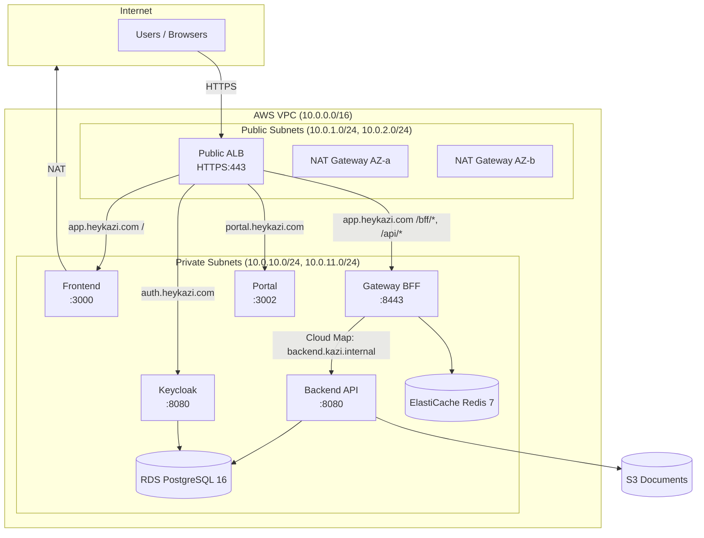
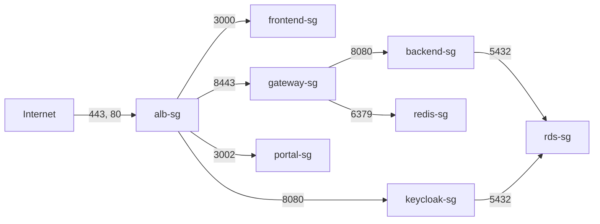
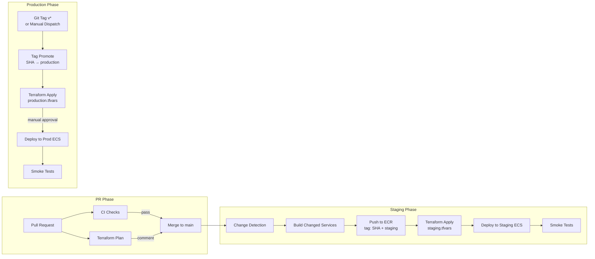
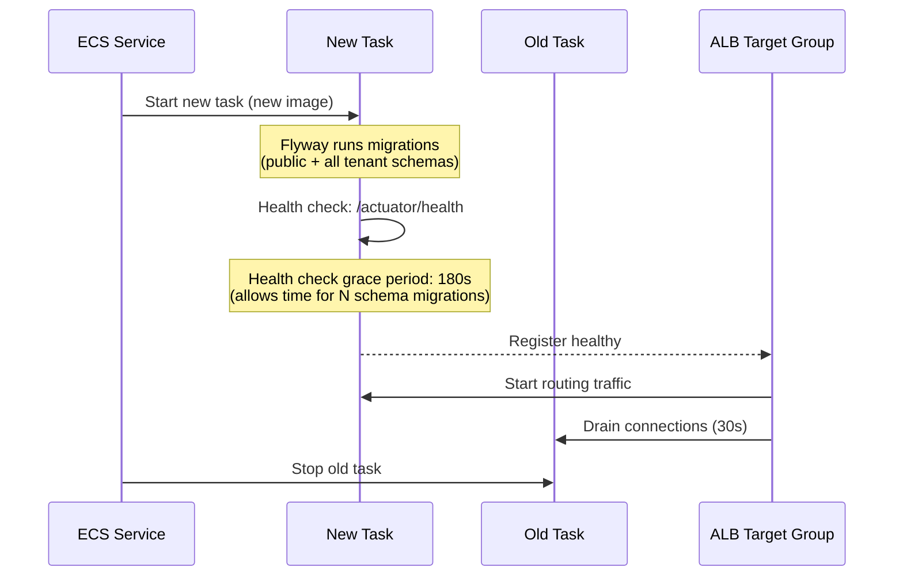
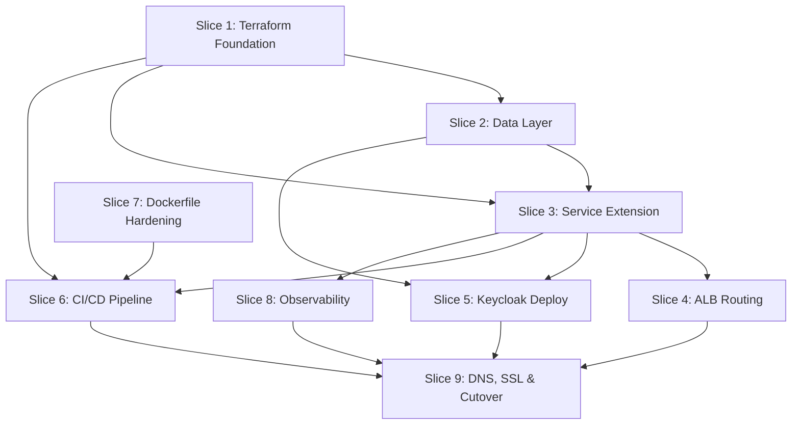

# Phase 56 -- Production Infrastructure & Deployment Pipeline

**Status**: Proposed
**Date**: 2026-04-01
**Scope**: Infrastructure-only -- no new domain entities, no new frontend pages

---

## 1. Overview

Phase 56 updates and extends the existing (stale) AWS infrastructure and CI/CD pipeline to match the current 5-service architecture, enabling HeyKazi to serve 5--20 paying tenants reliably. The approach is **update-in-place** (ADR-213) -- the existing Terraform modules are well-structured; the gaps are scope (only 2 of 5 services) and staleness (Clerk references, no Keycloak/Gateway/Portal support).

### Current vs. Target

| Dimension | Current State | Target State |
|-----------|--------------|--------------|
| Services provisioned | 2 (frontend, backend) | 5 (frontend, backend, gateway, portal, keycloak) |
| Auth secrets | Clerk (3 secrets) | Keycloak (6+ secrets) |
| ALB routing | Direct to frontend/backend | Through Gateway BFF for `/api/*`, `/bff/*` (ADR-214) |
| ECR repositories | 2 | 5 |
| Security groups | 4 (public ALB, frontend, internal ALB, backend) | 9 (+gateway, portal, keycloak, rds, redis) |
| Session storage | JDBC (Postgres) | ElastiCache Redis |
| Keycloak | Not deployed | ECS Fargate with separate database in shared RDS instance (ADR-215) |
| CI/CD auth | Long-lived IAM keys | GitHub OIDC |
| Image promotion | Rebuild per environment | Build once, tag-promote (ADR-217) |
| Flyway (prod) | Disabled | Re-enabled with extended health check grace (ADR-216) |
| Terraform in CI | None | Plan on PR, apply on merge |
| Monitoring | 2 log groups, no alarms | 5 log groups, 8+ alarms, SNS alerting |
| Naming | `docteams` throughout | `heykazi` for customer-facing, `kazi` internal (ADR-218) |
| DNS/SSL | Conditional, single record | Wildcard `*.heykazi.com`, 3 subdomain records |
| Dockerfiles | No health checks, hardcoded JARs | HEALTHCHECK, wildcard JARs, build arg fixes |

### Scope

**Updated**: VPC (NAT count variable), security-groups, ecr, ecs, alb, iam, secrets, dns, monitoring, autoscaling modules. All 7 GitHub Actions workflows. All 4 Dockerfiles. Backend `application-prod.yml`.

**New**: `data` module (RDS + ElastiCache), `bootstrap/` directory (state bucket), Terraform CI/CD workflow, Keycloak Dockerfile, `application-production.yml` (structured logging).

**Unchanged**: VPC CIDR structure, S3 module (already production-grade), composite `ecs-deploy` action (works as-is for any service).

---

## 2. Infrastructure Architecture

### 2.1 Network Topology



### 2.2 Service Topology

| Service | ECS Task | vCPU | Memory | Port | Health Check | Desired | Min/Max |
|---------|----------|------|--------|------|-------------|---------|---------|
| frontend | `heykazi-{env}-frontend` | 512 | 1024 MB | 3000 | `GET /` | 1 | 1/2 |
| gateway | `heykazi-{env}-gateway` | 512 | 1024 MB | 8443 | `GET /actuator/health` | 1 | 1/2 |
| backend | `heykazi-{env}-backend` | 1024 | 2048 MB | 8080 | `GET /actuator/health` | 1 | 1/3 |
| portal | `heykazi-{env}-portal` | 512 | 1024 MB | 3002 | `GET /` | 1 | 1/2 |
| keycloak | `heykazi-{env}-keycloak` | 1024 | 2048 MB | 8080 | `GET /health/ready` | 1 | 1/1 |

### 2.3 ALB Routing Rules (ADR-214)

Single public ALB with HTTPS listener (port 443). HTTP (port 80) redirects to HTTPS.

| Priority | Host Condition | Path Condition | Target Group | Rationale |
|----------|---------------|----------------|-------------|-----------|
| 10 | `auth.heykazi.com` | `/*` | keycloak-tg | Keycloak IdP must be directly reachable |
| 20 | `portal.heykazi.com` | `/*` | portal-tg | Customer portal -- separate host |
| 30 | `app.heykazi.com` | `/bff/*` | gateway-tg | BFF session endpoints |
| 40 | `app.heykazi.com` | `/api/*` | gateway-tg | API proxied via Gateway with TokenRelay |
| 50 | `app.heykazi.com` | `/*` | frontend-tg | Next.js SSR/static (default for app host) |
| 99 | (default) | `/*` | 404 fixed response | Catch-all |

**Why split routing (ADR-214)**: The frontend serves static/SSR directly without passing through the gateway. Only `/api/*` and `/bff/*` route through the gateway for OAuth2 token relay. This avoids the gateway becoming a bottleneck for static asset serving and reduces latency for page loads.

Staging uses `staging-` prefix on hostnames: `staging-app.heykazi.com`, `staging-portal.heykazi.com`, `staging-auth.heykazi.com`.

### 2.4 Security Group Relationships



| Security Group | Inbound Rules | Used By |
|---------------|---------------|---------|
| `alb-sg` | 443 from `0.0.0.0/0`, 80 from `0.0.0.0/0` | Public ALB |
| `frontend-sg` | 3000 from `alb-sg` | Frontend ECS tasks |
| `gateway-sg` | 8443 from `alb-sg` | Gateway ECS tasks |
| `backend-sg` | 8080 from `gateway-sg`, 8080 from `internal-alb-sg` | Backend ECS tasks |
| `portal-sg` | 3002 from `alb-sg` | Portal ECS tasks |
| `keycloak-sg` | 8080 from `alb-sg` | Keycloak ECS tasks |
| `rds-sg` | 5432 from `backend-sg`, 5432 from `keycloak-sg` | RDS PostgreSQL |
| `redis-sg` | 6379 from `gateway-sg` | ElastiCache Redis |

**Changes from current**: The internal ALB remains for `/internal/*` routes (frontend-to-backend internal API calls via API key). Backend SG now accepts ingress from `gateway-sg` instead of `alb-sg` for public API traffic. Three new SGs added (gateway, portal, keycloak). Two new SGs for data stores (rds, redis).

### 2.5 Cloud Map Service Discovery

AWS Cloud Map namespace: `kazi.internal` (private DNS).

| Service Name | DNS Record | Port | Used By |
|-------------|-----------|------|---------|
| `backend` | `backend.kazi.internal` | 8080 | Gateway (proxies `/api/**`) |

Gateway's `BACKEND_URL` environment variable is set to `http://backend.kazi.internal:8080`. This replaces the internal ALB for gateway-to-backend communication.

The internal ALB is retained for frontend server-side calls to `/internal/*` endpoints (Next.js server actions that call backend with API key auth).

---

## 3. Terraform Module Changes

### 3.1 Module Diff Table

| Module | What Exists | What Changes | What's New |
|--------|------------|-------------|-----------|
| `vpc` | 2-AZ VPC, 2 NAT gateways (hardcoded) | Make NAT count variable (`var.nat_gateway_count`). Production=2, staging=1. | -- |
| `security-groups` | 4 SGs (public-alb, frontend, internal-alb, backend) | Backend ingress changes from `alb-sg` to `gateway-sg` for API traffic | 5 new SGs: gateway, portal, keycloak, rds, redis |
| `ecr` | 2 repos (frontend, backend) | Refactor to `for_each` over service list | 3 new repos: gateway, portal, keycloak |
| `ecs` | 1 cluster, 2 task defs, 2 services | Replace Clerk env vars/secrets with Keycloak equivalents. Add Cloud Map service connect. | 3 new task defs + services: gateway, portal, keycloak |
| `alb` | Public ALB (frontend+backend TGs), Internal ALB | Restructure HTTPS listener rules for 5-service routing. Add host-based routing. Enable deletion protection (prod). | 3 new target groups: gateway, portal, keycloak |
| `iam` | Execution role + 2 task roles (frontend, backend) | Extend ECR pull policy for 5 repos. Extend CloudWatch logs policy for 5 log groups. | 3 new task roles (gateway, portal, keycloak). GitHub OIDC provider + deployment role. |
| `s3` | Document bucket with versioning, encryption, CORS | Add lifecycle rule: `generated/` prefix to IA after 90 days | -- |
| `secrets` | 6 secrets (3 Clerk, database-url x2, internal-api-key) | Remove 3 Clerk secrets. Keep database + internal-api-key. | 8 new secrets (see table below) |
| `dns` | ACM cert (single domain), 1 Route 53 A record | Wildcard cert `*.heykazi.com` + apex. Multiple A records. | Records for portal, auth subdomains |
| `monitoring` | 2 log groups (frontend, backend) | Refactor to `for_each` over service list | 3 new log groups + CloudWatch alarms + SNS topic |
| `autoscaling` | CPU/memory tracking for frontend + backend | Refactor to `for_each` over service list | Autoscaling for gateway, portal (not keycloak) |

**New modules:**

| Module | Purpose | Resources |
|--------|---------|-----------|
| `data` | Managed data stores | `aws_db_instance`, `aws_db_subnet_group`, `aws_elasticache_cluster`, `aws_elasticache_subnet_group` |
| `bootstrap/` | One-time state infra | S3 bucket + DynamoDB table for Terraform state (local state, run manually) |

### 3.2 Secrets Manager Inventory

**Removed (Clerk-era):**

| Secret Name | Status |
|------------|--------|
| `{project}/{env}/clerk-secret-key` | REMOVE |
| `{project}/{env}/clerk-webhook-secret` | REMOVE |
| `{project}/{env}/clerk-publishable-key` | REMOVE |

**Retained:**

| Secret Name | Used By |
|------------|---------|
| `{project}/{env}/database-url` | Backend (HikariCP pooled connection) |
| `{project}/{env}/database-migration-url` | Backend (Flyway direct connection) |
| `{project}/{env}/internal-api-key` | Frontend + Backend (`/internal/*` endpoints) |

**New:**

| Secret Name | Used By | Value Description |
|------------|---------|-------------------|
| `{project}/{env}/keycloak-client-secret` | Gateway | OAuth2 client secret for `gateway-bff` client |
| `{project}/{env}/keycloak-admin-password` | Keycloak | Keycloak admin console password |
| `{project}/{env}/keycloak-db-password` | Keycloak | RDS password for `kazi_keycloak` database |
| `{project}/{env}/portal-jwt-secret` | Backend | JWT signing secret for portal magic links |
| `{project}/{env}/portal-magic-link-secret` | Backend | HMAC secret for magic link tokens |
| `{project}/{env}/integration-encryption-key` | Backend | AES key for encrypting org integration secrets |
| `{project}/{env}/redis-auth-token` | Gateway | ElastiCache Redis AUTH token |
| `{project}/{env}/smtp-password` | Backend | SendGrid API key or SMTP password |

### 3.3 Environment Variables per Service

#### Backend Task Definition

| Variable | Source | Current | Updated |
|----------|--------|---------|---------|
| `SPRING_PROFILES_ACTIVE` | env | `var.environment` | `production,keycloak` |
| `SPRING_DATASOURCE_URL` | secret | -- | `database-url` secret ARN |
| `SPRING_DATASOURCE_PASSWORD` | secret | -- | (embedded in URL) |
| `SPRING_THREADS_VIRTUAL_ENABLED` | env | -- | `true` |
| `AWS_S3_BUCKET` | env | `var.s3_bucket_name` | unchanged |
| `AWS_REGION` | env | `var.aws_region` | unchanged |
| `KEYCLOAK_BASE_URL` | env | -- | `https://auth.heykazi.com` |
| `KEYCLOAK_REALM` | env | -- | `docteams` |
| `APP_BASE_URL` | env | -- | `https://app.heykazi.com` |
| `PORTAL_BASE_URL` | env | -- | `https://portal.heykazi.com` |
| `DATABASE_URL` | secret | `database-url` ARN | unchanged |
| `DATABASE_MIGRATION_URL` | secret | `database-migration-url` ARN | unchanged |
| `INTERNAL_API_KEY` | secret | `internal-api-key` ARN | unchanged |
| `PORTAL_JWT_SECRET` | secret | -- | `portal-jwt-secret` ARN |
| `PORTAL_MAGIC_LINK_SECRET` | secret | -- | `portal-magic-link-secret` ARN |
| `INTEGRATION_ENCRYPTION_KEY` | secret | -- | `integration-encryption-key` ARN |
| `SMTP_PASSWORD` | secret | -- | `smtp-password` ARN |
| ~~`CLERK_ISSUER`~~ | ~~env~~ | ~~`var.clerk_issuer`~~ | REMOVED |
| ~~`CLERK_JWKS_URI`~~ | ~~env~~ | ~~`var.clerk_jwks_uri`~~ | REMOVED |

#### Gateway Task Definition

| Variable | Source | Value |
|----------|--------|-------|
| `SPRING_PROFILES_ACTIVE` | env | `production` |
| `SPRING_DATA_REDIS_HOST` | env | `${redis_endpoint}` |
| `SPRING_DATA_REDIS_PORT` | env | `6379` |
| `SPRING_SESSION_STORE_TYPE` | env | `redis` |
| `SPRING_SECURITY_OAUTH2_CLIENT_PROVIDER_KEYCLOAK_ISSUER_URI` | env | `https://auth.heykazi.com/realms/docteams` |
| `SPRING_SECURITY_OAUTH2_CLIENT_REGISTRATION_KEYCLOAK_CLIENT_ID` | env | `gateway-bff` |
| `SPRING_SECURITY_OAUTH2_CLIENT_REGISTRATION_KEYCLOAK_CLIENT_SECRET` | secret | `keycloak-client-secret` ARN |
| `BACKEND_URL` | env | `http://backend.kazi.internal:8080` |
| `FRONTEND_URL` | env | `https://app.heykazi.com` |
| `SERVER_SERVLET_SESSION_COOKIE_SECURE` | env | `true` |
| `REDIS_AUTH_TOKEN` | secret | `redis-auth-token` ARN |

#### Frontend Task Definition

| Variable | Source | Value |
|----------|--------|-------|
| `NODE_ENV` | env | `production` |
| `BACKEND_URL` | env | `http://${internal_alb_dns_name}:8080` |
| `INTERNAL_API_KEY` | secret | `internal-api-key` ARN |

Build args (baked at image build time):
- `NEXT_PUBLIC_AUTH_MODE=keycloak`
- `NEXT_PUBLIC_GATEWAY_URL=https://app.heykazi.com`

#### Portal Task Definition

| Variable | Source | Value |
|----------|--------|-------|
| `NODE_ENV` | env | `production` |

Build args (baked at image build time):
- `NEXT_PUBLIC_PORTAL_API_URL=https://portal.heykazi.com/api`

#### Keycloak Task Definition

| Variable | Source | Value |
|----------|--------|-------|
| `KC_DB` | env | `postgres` |
| `KC_DB_URL` | env | `jdbc:postgresql://${rds_endpoint}:5432/kazi_keycloak` |
| `KC_DB_USERNAME` | env | `keycloak` |
| `KC_DB_PASSWORD` | secret | `keycloak-db-password` ARN |
| `KC_HOSTNAME` | env | `auth.heykazi.com` |
| `KC_HTTP_ENABLED` | env | `true` |
| `KC_PROXY_HEADERS` | env | `xforwarded` |
| `KC_HEALTH_ENABLED` | env | `true` |
| `KC_HOSTNAME_STRICT` | env | `false` |
| `KC_METRICS_ENABLED` | env | `false` |
| `KEYCLOAK_ADMIN` | env | `admin` |
| `KEYCLOAK_ADMIN_PASSWORD` | secret | `keycloak-admin-password` ARN |

---

## 4. CI/CD Pipeline Architecture

### 4.1 Pipeline Diagram



### 4.2 Workflow Changes Table

| Workflow | Current State | Changes | New State |
|----------|-------------|---------|-----------|
| `ci.yml` | Tests frontend + backend. Clerk build args. | Add gateway, portal CI jobs. Remove Clerk build args. Add Terraform validate job. | Tests all 4 app services + validates Terraform |
| `build-and-push.yml` | Builds frontend + backend. IAM keys. Hardcoded `dev`. | Extend to 5 services. Switch to OIDC. Environment-aware tagging. | Builds changed services, pushes to ECR with SHA + env tags |
| `deploy-staging.yml` | Rebuilds from source. IAM keys. 2 services. | Promote images (not rebuild). Switch to OIDC. 5 services. | Promotes SHA-tagged images, deploys all 5 services |
| `deploy-prod.yml` | Rebuilds from source. IAM keys. 2 services. | Promote images. Switch to OIDC. 5 services. Manual approval. | Promotes images to prod, deploys with approval gate |
| `rollback.yml` | 2 services (frontend, backend). IAM keys. | Add gateway, portal, keycloak to service selector. Switch to OIDC. | Rolls back any of 5 services |
| `terraform.yml` | Does not exist | NEW | Plan on PR, apply on merge (staging), manual dispatch (prod) |
| `qodana_code_quality.yml` | Functional | No changes needed | Unchanged |

### 4.3 Image Promotion Strategy (ADR-217)

**Build once, deploy everywhere.** Images are built from source only on merge to `main`. Promotion to staging and production uses ECR image tagging -- the same binary that was tested is deployed.

```
Build (merge to main):
  ECR: kazi/backend:abc123          (Git SHA)
  ECR: kazi/backend:staging         (environment tag)

Promote to production (tag or dispatch):
  ECR: kazi/backend:abc123          (already exists)
  ECR: kazi/backend:production      (new tag on same image)
```

Single ECR repository per service (not per-environment). Repository names: `kazi/backend`, `kazi/gateway`, `kazi/frontend`, `kazi/portal`, `kazi/keycloak`.

**Frontend exception**: The frontend (and portal) cannot be fully promoted because `NEXT_PUBLIC_*` environment variables are baked at build time. `NEXT_PUBLIC_GATEWAY_URL` differs between staging (`https://staging-app.heykazi.com`) and production (`https://app.heykazi.com`). These services must be rebuilt per environment. Backend, gateway, and keycloak images are true build-once-promote candidates since they read configuration from runtime environment variables.

ECR lifecycle policy: keep last 10 tagged images, expire untagged after 7 days.

### 4.4 GitHub OIDC Setup

**Terraform resources (in `iam` module):**

```hcl
resource "aws_iam_openid_connect_provider" "github" {
  url             = "https://token.actions.githubusercontent.com"
  client_id_list  = ["sts.amazonaws.com"]
  thumbprint_list = ["6938fd4d98bab03faadb97b34396831e3780aea1"]
}

resource "aws_iam_role" "github_actions" {
  name = "heykazi-github-actions"
  assume_role_policy = jsonencode({
    Version = "2012-10-17"
    Statement = [{
      Effect = "Allow"
      Principal = { Federated = aws_iam_openid_connect_provider.github.arn }
      Action = "sts:AssumeRoleWithWebIdentity"
      Condition = {
        StringEquals = { "token.actions.githubusercontent.com:aud" = "sts.amazonaws.com" }
        StringLike   = { "token.actions.githubusercontent.com:sub" = "repo:ORG/REPO:*" }
      }
    }]
  })
}
```

**Permissions on the role**: ECR push/pull, ECS update-service/describe/register-task-definition, S3 state bucket read/write, DynamoDB state lock, Secrets Manager read, CloudWatch Logs write, ELB describe.

**Workflow usage** (replaces IAM key auth in all workflows):

```yaml
- uses: aws-actions/configure-aws-credentials@v4
  with:
    role-to-assume: arn:aws:iam::ACCOUNT:role/heykazi-github-actions
    aws-region: us-east-1
```

### 4.5 Terraform CI/CD Workflow

New workflow: `.github/workflows/terraform.yml`

| Trigger | Action | Environment |
|---------|--------|-------------|
| `pull_request` with changes in `infra/` | `terraform plan` -- output as PR comment | -- |
| `push` to `main` with changes in `infra/` | `terraform apply -auto-approve` | staging |
| `workflow_dispatch` | `terraform apply` with manual approval | production |

Uses the same GitHub OIDC role. State bucket: `heykazi-terraform-state` (renamed from `docteams-terraform-state`).

---

## 5. Dockerfile Updates

### 5.1 Per-Service Changes Table

| Service | File | Current Issues | Changes |
|---------|------|---------------|---------|
| Backend | `backend/Dockerfile` | No HEALTHCHECK. Hardcoded JAR: `b2b-strawman-backend-0.0.1-SNAPSHOT.jar`. No JVM tuning. | Add `HEALTHCHECK`. Use `*.jar` glob. Add `-XX:MaxRAMPercentage=75`. |
| Gateway | `gateway/Dockerfile` | No HEALTHCHECK. Hardcoded JAR: `b2b-strawman-gateway-0.0.1-SNAPSHOT.jar`. | Add `HEALTHCHECK`. Use `*.jar` glob. Add `-XX:MaxRAMPercentage=75`. Set `cookie.secure=true`. |
| Frontend | `frontend/Dockerfile` | No HEALTHCHECK. Clerk build arg (`NEXT_PUBLIC_CLERK_PUBLISHABLE_KEY`). | Add `HEALTHCHECK`. Remove Clerk arg. Add `NEXT_PUBLIC_GATEWAY_URL` arg. Keep `NEXT_PUBLIC_AUTH_MODE`. |
| Portal | `portal/Dockerfile` | No HEALTHCHECK. Missing `public/` copy. | Add `HEALTHCHECK`. Add `COPY --from=builder /app/public ./public` before standalone copy. |
| Keycloak | (new) | Does not exist | Create `compose/keycloak/Dockerfile.prod` based on `quay.io/keycloak/keycloak:26.5`. |

### 5.2 Health Check Specifications

| Service | HEALTHCHECK Instruction | Interval | Timeout | Start Period | Retries |
|---------|------------------------|----------|---------|-------------|---------|
| Backend | `curl -f http://localhost:8080/actuator/health \|\| exit 1` | 30s | 5s | 60s | 3 |
| Gateway | `curl -f http://localhost:8443/actuator/health \|\| exit 1` | 30s | 5s | 30s | 3 |
| Frontend | `wget -q --spider http://localhost:3000/ \|\| exit 1` | 30s | 5s | 20s | 3 |
| Portal | `wget -q --spider http://localhost:3002/ \|\| exit 1` | 30s | 5s | 20s | 3 |
| Keycloak | (built-in `/health/ready`) | 30s | 5s | 90s | 3 |

Note: Java images use `curl` (available in Alpine via `apk add curl` in build stage or use `wget`). Node images use `wget` (built into Alpine).

### 5.3 Backend/Gateway Entrypoint Fix

Current (fragile):
```dockerfile
ENTRYPOINT ["java", "-jar", "b2b-strawman-backend-0.0.1-SNAPSHOT.jar"]
```

Updated (version-independent):
```dockerfile
ENTRYPOINT ["sh", "-c", "java -XX:MaxRAMPercentage=75 -jar *.jar"]
```

The Spring Boot extract command produces a single JAR in the destination directory. Using `*.jar` glob avoids hardcoding the artifact name and version.

### 5.4 Frontend Build Args Update

Current:
```dockerfile
ARG NEXT_PUBLIC_CLERK_PUBLISHABLE_KEY
ARG NEXT_PUBLIC_AUTH_MODE
ARG NEXT_PUBLIC_MOCK_IDP_URL
ARG NEXT_PUBLIC_BACKEND_URL
```

Updated:
```dockerfile
ARG NEXT_PUBLIC_AUTH_MODE=keycloak
ARG NEXT_PUBLIC_GATEWAY_URL
```

The `NEXT_PUBLIC_CLERK_PUBLISHABLE_KEY` and `NEXT_PUBLIC_MOCK_IDP_URL` args are removed (Clerk is gone, mock IDP is not used in production). `NEXT_PUBLIC_BACKEND_URL` is replaced by `NEXT_PUBLIC_GATEWAY_URL` (the frontend calls the gateway, not backend directly, in Keycloak mode).

---

## 6. Database Migration Strategy (ADR-216)

### 6.1 Current State

The `application-prod.yml` profile sets `spring.flyway.enabled: false`. This means Flyway does not run on backend startup in production. The `keycloak` profile (which would also be active) does not override this setting. Migrations are currently not automated for production.

### 6.2 Target State

Re-enable Flyway on backend startup with the `production,keycloak` profile combination:

```yaml
# application-production.yml (new profile, replaces application-prod.yml)
spring:
  flyway:
    enabled: true
```

On startup, the backend:
1. Runs global migrations against the `public` schema (V1--V16+)
2. Discovers all tenant schemas via `org_schema_mapping` table
3. Runs tenant migrations against each schema (V1--V84+)
4. Registers as healthy only after all migrations complete

### 6.3 ECS Deployment Sequence



### 6.4 Configuration

| Setting | Value | Why |
|---------|-------|-----|
| ALB health check interval | 30s | Standard check frequency |
| ALB health check grace period | 180s | Allow Flyway to migrate N schemas before first health check |
| ECS deployment min healthy % | 100 | Old task stays running until new one is healthy |
| ECS deployment max % | 200 | Allows new + old to run simultaneously |
| Flyway lock timeout | 120s | Prevent concurrent migration conflicts |

### 6.5 Rollback Considerations

Flyway migrations are **forward-only and additive** by design:
- New columns are nullable or have defaults
- New tables don't affect old code
- No column renames or type changes without a multi-step migration

Rollback = deploy previous Docker image. The old code runs against the new (forward-compatible) schema. Schema rollback is never attempted automatically.

If a destructive migration is needed (future), it must be done in two phases:
1. Deploy code that handles both old and new schema
2. Deploy migration that changes the schema
3. Deploy code that only handles new schema

### 6.6 prod Profile Fix

The `application-prod.yml` also references `CLERK_ISSUER` and `CLERK_JWKS_URI` in `spring.security.oauth2.resourceserver.jwt.*`. These are stale -- the `keycloak` profile (`application-keycloak.yml`) overrides them with `JWT_ISSUER_URI` and `JWT_JWK_SET_URI`. The prod profile should be updated to remove the Clerk references, or better yet, renamed to `application-production.yml` to avoid confusion with the environment name pattern.

---

## 7. Observability

### 7.1 CloudWatch Log Groups

| Log Group | Retention (Staging) | Retention (Production) |
|-----------|-------------------|----------------------|
| `/kazi/{env}/backend` | 30 days | 90 days |
| `/kazi/{env}/gateway` | 30 days | 90 days |
| `/kazi/{env}/frontend` | 30 days | 90 days |
| `/kazi/{env}/portal` | 30 days | 90 days |
| `/kazi/{env}/keycloak` | 30 days | 90 days |

**Naming change**: From `/ecs/docteams-{env}-{service}` to `/kazi/{env}/{service}`. Shorter, cleaner, matches the internal project name.

### 7.2 CloudWatch Alarms

| Alarm Name | Metric | Namespace | Threshold | Period | Action |
|-----------|--------|-----------|-----------|--------|--------|
| `{env}-backend-unhealthy` | `UnHealthyHostCount` (backend-tg) | AWS/ApplicationELB | > 0 for 2 min | 60s | SNS |
| `{env}-gateway-unhealthy` | `UnHealthyHostCount` (gateway-tg) | AWS/ApplicationELB | > 0 for 2 min | 60s | SNS |
| `{env}-keycloak-unhealthy` | `UnHealthyHostCount` (keycloak-tg) | AWS/ApplicationELB | > 0 for 2 min | 60s | SNS |
| `{env}-high-5xx` | `HTTPCode_Target_5XX_Count` | AWS/ApplicationELB | > 10 in 5 min | 300s | SNS |
| `{env}-rds-cpu-high` | `CPUUtilization` | AWS/RDS | > 80% for 10 min | 300s | SNS |
| `{env}-rds-storage-low` | `FreeStorageSpace` | AWS/RDS | < 5 GB | 300s | SNS |
| `{env}-rds-connections-high` | `DatabaseConnections` | AWS/RDS | > 80 | 300s | SNS |
| `{env}-backend-cpu-high` | `CPUUtilization` (backend service) | AWS/ECS | > 80% for 5 min | 300s | SNS |

### 7.3 SNS Alerting Topology

```
SNS Topic: heykazi-{env}-alerts
  ├── Email: founder@heykazi.com
  └── (Future: Slack webhook endpoint)
```

All CloudWatch alarms publish to this single SNS topic. Subscribers receive all alerts -- filtering by severity can be added later via SNS filter policies.

### 7.4 Spring Boot Production Configuration

New file: `backend/src/main/resources/application-production.yml`

```yaml
management:
  endpoints:
    web:
      exposure:
        include: health,info,metrics,prometheus
  endpoint:
    health:
      show-details: when-authorized
  health:
    db:
      enabled: true

spring:
  flyway:
    enabled: true

logging:
  level:
    root: WARN
    io.b2mash.b2b.b2bstrawman: INFO
    org.springframework.security: WARN
    org.hibernate.SQL: WARN
  pattern:
    console: '{"timestamp":"%d{ISO8601}","level":"%p","logger":"%c","message":"%m","thread":"%t","mdc":{%X}}%n'
```

JSON-structured logging enables CloudWatch Logs Insights queries like:

```
fields @timestamp, message, logger
| filter level = "ERROR"
| filter mdc.tenantId = "tenant_abc123"
| sort @timestamp desc
| limit 50
```

The `production` profile name avoids collision with the existing `prod` profile. Active profiles in ECS: `SPRING_PROFILES_ACTIVE=production,keycloak`.

---

## 8. DNS & SSL

### 8.1 Route 53 Records

| Record | Type | Value | Environment |
|--------|------|-------|-------------|
| `app.heykazi.com` | A (Alias) | Production ALB | production |
| `portal.heykazi.com` | A (Alias) | Production ALB | production |
| `auth.heykazi.com` | A (Alias) | Production ALB | production |
| `staging-app.heykazi.com` | A (Alias) | Staging ALB | staging |
| `staging-portal.heykazi.com` | A (Alias) | Staging ALB | staging |
| `staging-auth.heykazi.com` | A (Alias) | Staging ALB | staging |

All records are A-record aliases pointing to the environment's ALB. The ALB handles host-based routing to the correct target group.

### 8.2 ACM Certificate

| Certificate | Domain Names | Validation |
|------------|-------------|------------|
| Production | `*.heykazi.com`, `heykazi.com` | DNS (Route 53 CNAME auto-created by Terraform) |
| Staging | Same cert (wildcard covers `staging-*` subdomains) | Same |

A single wildcard certificate covers all subdomains. Both staging and production ALBs can use it (staging subdomains like `staging-app.heykazi.com` are covered by `*.heykazi.com`).

### 8.3 ALB HTTPS Configuration

| Setting | Value |
|---------|-------|
| SSL Policy | `ELBSecurityPolicy-TLS13-1-2-2021-06` |
| HTTPS Listener Port | 443 |
| HTTP Listener Port | 80 (redirect to HTTPS) |
| Sticky Sessions | Disabled (stateless frontend, Redis-backed gateway sessions) |
| Deletion Protection | `true` (production), `false` (staging) |

### 8.4 Keycloak Hostname Configuration

Keycloak generates URLs (login pages, token endpoints, JWKS URIs) using its configured hostname. Critical settings:

| Setting | Value | Why |
|---------|-------|-----|
| `KC_HOSTNAME` | `auth.heykazi.com` | All Keycloak-generated URLs use this hostname |
| `KC_PROXY_HEADERS` | `xforwarded` | Trust ALB's `X-Forwarded-*` headers for scheme detection |
| `KC_HTTP_ENABLED` | `true` | ALB terminates SSL; Keycloak runs HTTP internally |
| `KC_HOSTNAME_STRICT` | `false` | Allow admin console access without separate admin URL |

The Gateway's OAuth2 issuer URI must match: `https://auth.heykazi.com/realms/docteams`.

---

## 9. Operational Runbook Topics

The runbook (`infra/RUNBOOK.md`) should cover these sections. Full content is implementation scope -- this section defines the required topics.

### 9.1 Required Runbook Sections

1. **First-Time Setup**
   - AWS account prerequisites (IAM user, CLI, Route 53 hosted zone)
   - Terraform bootstrap (run `bootstrap/` config to create state bucket)
   - Domain delegation (registrar NS records)
   - Initial `terraform apply` (staging first, then production)
   - Keycloak realm import and theme verification
   - First tenant provisioning walkthrough

2. **Deploying a New Version**
   - How merge-to-main triggers staging deploy
   - How to promote to production (git tag or manual dispatch)
   - Verifying deployment (smoke tests, CloudWatch logs)
   - What to do if deployment fails (circuit breaker, auto-rollback)

3. **Rollback Procedure**
   - Using the rollback workflow (service selector, confirmation)
   - Manual rollback via AWS Console (previous task definition revision)
   - What rollback does NOT do (no schema rollback)

4. **Tenant Provisioning**
   - What `TenantProvisioningService` does (Keycloak org + schema + Flyway + packs)
   - Verifying a new tenant (check schema, check Keycloak org, test login)
   - Troubleshooting failed provisioning (check audit events, retry)

5. **Database Operations**
   - Connecting to RDS (via SSM Session Manager or bastion -- future)
   - Checking Flyway migration status per schema
   - Running ad-hoc queries against a tenant schema
   - Checking HikariCP pool metrics

6. **Viewing Logs**
   - CloudWatch Logs console navigation
   - Logs Insights query examples (errors by tenant, trace a request, slow queries)
   - Filtering by MDC fields (tenantId, userId, requestId)

7. **Responding to Alerts**
   - Per-alarm investigation guide (what each alarm means, first steps)
   - Escalation path

8. **Keycloak Operations**
   - Realm export/import
   - Adding protocol mappers
   - Theme updates (rebuild Keycloak image)
   - User management

9. **Cost Monitoring**
   - Expected monthly cost breakdown
   - Cost anomaly indicators

10. **Disaster Recovery**
    - RDS point-in-time recovery
    - S3 versioning recovery
    - Keycloak realm recovery

### 9.2 Production Cutover Checklist

- [ ] Terraform apply to production succeeds without errors
- [ ] All 5 ECS services healthy and passing ALB health checks
- [ ] `https://app.heykazi.com` loads the frontend
- [ ] `https://auth.heykazi.com` loads Keycloak login with custom theme
- [ ] `https://portal.heykazi.com` loads the portal login
- [ ] Access request flow works: submit request, receive OTP email, verify
- [ ] Platform admin can approve access request and trigger org provisioning
- [ ] Owner can login via Keycloak invite link, reach dashboard
- [ ] Create project, log time, create invoice -- basic smoke test
- [ ] CloudWatch alarms configured and a test alarm fires successfully
- [ ] DNS propagation verified from external network (`dig app.heykazi.com`)
- [ ] RDS automated backups visible in AWS Console
- [ ] Rollback procedure tested: deploy old image, verify service recovers

---

## 10. Capability Slices

### Slice 1: Terraform Foundation Update

**Scope**: Rename `docteams` to `heykazi` (ADR-218), replace Clerk secrets with Keycloak secrets, create bootstrap directory for state bucket, restructure from per-environment directories to single root with `.tfvars` files.

**Modules touched**: `secrets`, `bootstrap/` (new), root `main.tf`/`variables.tf`/`providers.tf` (restructure)

**Deliverables**:
- `infra/bootstrap/main.tf` -- creates S3 state bucket `heykazi-terraform-state` + DynamoDB lock table
- `infra/modules/secrets/main.tf` -- remove 3 Clerk secrets, add 8 Keycloak-era secrets
- `infra/environments/` -- update `project` variable from `docteams` to `heykazi` in all `.tfvars`
- `infra/environments/*/backend.tf` -- update state bucket key from `docteams-terraform-state` to `heykazi-terraform-state`
- State migration script (one-time) for moving state from old bucket to new

**Dependencies**: None (foundational)
**Estimated effort**: 0.5 days

---

### Slice 2: Data Layer -- RDS & ElastiCache

**Scope**: New `data` module for RDS PostgreSQL and ElastiCache Redis. Security groups for data stores.

**Modules touched**: `data/` (new), `security-groups` (add rds-sg, redis-sg)

**Deliverables**:
- `infra/modules/data/main.tf` -- `aws_db_instance`, `aws_db_subnet_group`, `aws_db_parameter_group`, `aws_elasticache_cluster`, `aws_elasticache_subnet_group`
- `infra/modules/security-groups/main.tf` -- add `rds-sg` (5432 from backend-sg + keycloak-sg) and `redis-sg` (6379 from gateway-sg)
- RDS: PostgreSQL 16, `db.t4g.medium` (prod) / `db.t4g.micro` (staging), multi-AZ (prod), 20 GB gp3, auto-scaling to 100 GB, automated backups (7-day prod, 1-day staging), deletion protection (prod)
- ElastiCache: Redis 7, `cache.t4g.micro`, single node, auth token from Secrets Manager

**Dependencies**: Slice 1 (secrets for DB credentials and Redis auth token)
**Estimated effort**: 1 day

---

### Slice 3: Service Extension -- Gateway, Portal, Keycloak Infrastructure

**Scope**: Add 3 new services to ECR, ECS, IAM, monitoring, and autoscaling modules.

**Modules touched**: `ecr`, `ecs`, `iam`, `monitoring`, `autoscaling`, `security-groups`

**Deliverables**:
- `infra/modules/ecr/main.tf` -- refactor to `for_each` over 5-service list. Create `kazi/backend`, `kazi/frontend`, `kazi/gateway`, `kazi/portal`, `kazi/keycloak` repos (replacing old `docteams-{env}-frontend` and `docteams-{env}-backend` repos)
- `infra/modules/security-groups/main.tf` -- add gateway-sg, portal-sg, keycloak-sg
- `infra/modules/ecs/main.tf` -- add 3 task definitions with correct env vars/secrets, 3 ECS services with Cloud Map service discovery
- `infra/modules/iam/main.tf` -- extend execution role for 5 ECR repos + 5 log groups, add gateway/portal/keycloak task roles
- `infra/modules/monitoring/main.tf` -- add 3 log groups (gateway, portal, keycloak)
- `infra/modules/autoscaling/main.tf` -- add gateway, portal to autoscaling (not keycloak -- fixed at 1)
- Replace all Clerk env vars/secrets in frontend + backend task definitions with Keycloak equivalents

**Dependencies**: Slice 1 (secrets), Slice 2 (RDS endpoint, Redis endpoint, security groups)
**Estimated effort**: 2 days

---

### Slice 4: ALB Routing Restructure

**Scope**: Restructure public ALB for 5-service, host-based + path-based routing (ADR-214). Add target groups for gateway, portal, keycloak.

**Modules touched**: `alb`

**Deliverables**:
- `infra/modules/alb/main.tf`:
  - 3 new target groups: `gateway-tg` (port 8443), `portal-tg` (port 3002), `keycloak-tg` (port 8080)
  - HTTPS listener rules with host + path conditions (priority 10--99)
  - Default action: 404 fixed response (not forward to frontend)
  - Remove direct `/api/*` routing to backend (now routes to gateway)
  - Enable deletion protection (`var.enable_deletion_protection`, true for prod)
- Backend SG: change public API ingress source from `alb-sg` to `gateway-sg`
- Internal ALB: retained for frontend `/internal/*` calls

**Dependencies**: Slice 3 (ECS services must exist before target groups can register)
**Estimated effort**: 1 day

---

### Slice 5: Keycloak Deployment

**Scope**: Create production Keycloak Dockerfile, ECS task configuration, realm import strategy (ADR-215).

**Deliverables**:
- `compose/keycloak/Dockerfile.prod` -- based on `quay.io/keycloak/keycloak:26.5`, copies theme JAR + realm JSON, configures production settings
- Keycloak database `kazi_keycloak` (separate database in the same RDS instance, created via Terraform `postgresql_database` resource) -- Keycloak auto-migrates its own schema on first boot
- Realm import configuration: `KC_SPI_IMPORT_REALM_ENABLED=true` with realm JSON baked into image or mounted via EFS
- Theme: Keycloakify theme JAR copied into `/opt/keycloak/providers/` in the Docker image

**Dependencies**: Slice 2 (RDS for Keycloak database), Slice 3 (ECS task definition)
**Estimated effort**: 1 day

---

### Slice 6: CI/CD Pipeline Update

**Scope**: Extend all workflows for 5 services, switch to OIDC, add image promotion (ADR-217), add Terraform workflow.

**Deliverables**:
- `.github/workflows/ci.yml` -- add gateway + portal CI jobs, add Terraform validate job, remove Clerk build args from frontend build step
- `.github/workflows/build-and-push.yml` -- add gateway/portal/keycloak builds with change detection, switch from IAM keys to OIDC, use `kazi/{service}` ECR repo names
- `.github/workflows/deploy-staging.yml` -- promote images (not rebuild), deploy all 5 services, update smoke tests for `staging-app.heykazi.com`
- `.github/workflows/deploy-prod.yml` -- promote images, deploy all 5 services, update smoke tests for `app.heykazi.com`
- `.github/workflows/rollback.yml` -- add gateway/portal/keycloak to service selector
- `.github/workflows/terraform.yml` -- NEW: plan on infra PR, apply on merge (staging), manual dispatch (prod)
- Update all workflows to use `role-to-assume` instead of `aws-access-key-id`/`aws-secret-access-key`

**Dependencies**: Slice 1 (OIDC IAM role), Slice 3 (5 services exist in ECS)
**Estimated effort**: 1.5 days

---

### Slice 7: Dockerfile Hardening

**Scope**: Add HEALTHCHECK to all Dockerfiles, fix hardcoded JAR names, update build args, fix portal `public/` copy.

**Deliverables**:
- `backend/Dockerfile` -- add HEALTHCHECK (curl actuator/health), replace hardcoded JAR with `*.jar`, add `-XX:MaxRAMPercentage=75`
- `gateway/Dockerfile` -- same as backend, port 8443
- `frontend/Dockerfile` -- add HEALTHCHECK (wget), remove `NEXT_PUBLIC_CLERK_PUBLISHABLE_KEY` arg, add `NEXT_PUBLIC_GATEWAY_URL` arg
- `portal/Dockerfile` -- add HEALTHCHECK (wget), add `COPY --from=builder /app/public ./public` before standalone copy, verify `EXPOSE` port is 3002 (currently 3001)
- Install `curl` in Java Alpine images for health checks (or use `wget`)
- Update `next.config.ts` output mode to `standalone` if not already set (both frontend and portal)

**Dependencies**: None (can run in parallel with infrastructure slices)
**Estimated effort**: 0.5 days

---

### Slice 8: Observability & Monitoring

**Scope**: CloudWatch alarms, SNS topics, structured logging configuration.

**Modules touched**: `monitoring`

**Deliverables**:
- `infra/modules/monitoring/main.tf`:
  - SNS topic `heykazi-{env}-alerts` with email subscription
  - 8 CloudWatch alarms (see Section 7.2)
  - Optional: CloudWatch dashboard with key metrics (ECS CPU, RDS connections, ALB 5xx)
- `backend/src/main/resources/application-production.yml` -- new profile with structured JSON logging, Flyway re-enabled, Actuator endpoints configured
- Update `application-prod.yml` to remove Clerk references from JWT config

**Dependencies**: Slice 3 (target groups must exist for ALB alarms)
**Estimated effort**: 1 day

---

### Slice 9: DNS, SSL & Production Cutover

**Scope**: ACM wildcard certificate, Route 53 records, production deploy verification, runbook.

**Deliverables**:
- `infra/modules/dns/main.tf` -- wildcard ACM cert `*.heykazi.com` + apex, DNS validation records, 6 A-record aliases (3 prod + 3 staging)
- Update `alb` module to use the new wildcard certificate ARN
- `infra/RUNBOOK.md` -- operational runbook covering all 10 topics from Section 9
- Production cutover execution: first `terraform apply`, smoke tests, DNS verification
- Gateway production config: `cookie.secure=true`, Redis session store

**Dependencies**: All previous slices (this is the final integration + go-live slice)
**Estimated effort**: 1 day

---

### Slice Dependency Graph



**Parallel tracks after Slice 1**: Slice 7 (Dockerfiles) is independent of all infrastructure slices and can be done in parallel. Slices 2+3 are sequential. Slice 8 can start after Slice 3.

**Total estimated effort**: 8--10 days

---

## 11. ADR Index

| ADR | Title | Decision |
|-----|-------|----------|
| [ADR-213](../adr/ADR-213-update-in-place-infrastructure.md) | Update-in-place vs. Rewrite Infrastructure | Update in place -- module structure is solid, only scope and references are stale |
| [ADR-214](../adr/ADR-214-gateway-bff-alb-routing.md) | Gateway BFF ALB Routing | Split routing -- frontend direct, `/api/*` and `/bff/*` through gateway |
| [ADR-215](../adr/ADR-215-keycloak-deployment-strategy.md) | Keycloak Deployment Strategy | ECS Fargate with separate database in shared RDS instance |
| [ADR-216](../adr/ADR-216-flyway-migration-production.md) | Flyway Migration Strategy for Production | Re-enable Flyway on startup with extended health check grace period |
| [ADR-217](../adr/ADR-217-cicd-image-promotion.md) | CI/CD Image Promotion | Single ECR with environment-specific tags (build once, tag-promote) |
| [ADR-218](../adr/ADR-218-naming-migration-heykazi.md) | Naming Migration (docteams to heykazi) | Rename customer-facing + new resources, keep internal names until natural replacement |
