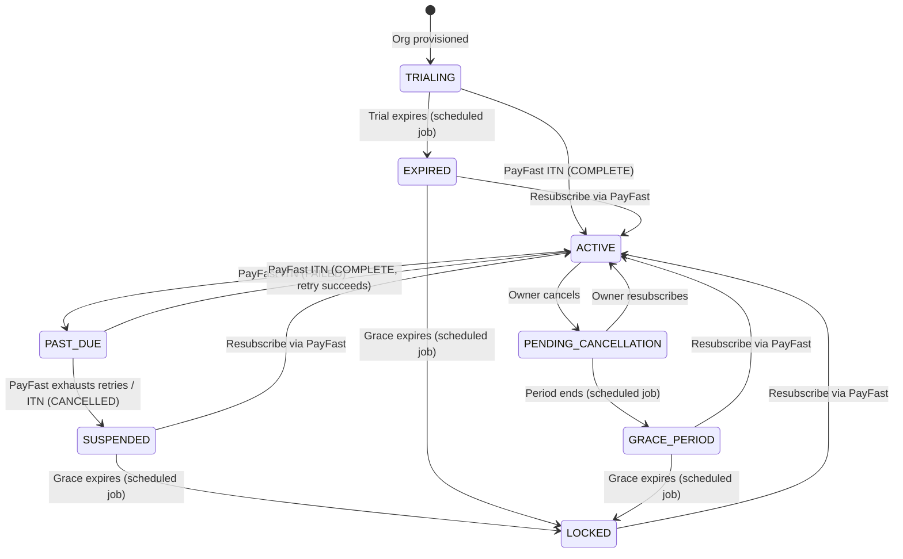
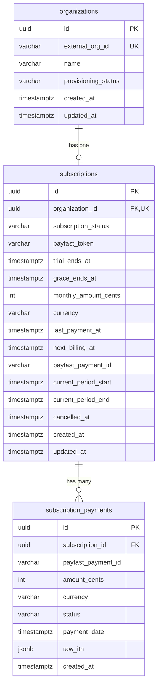
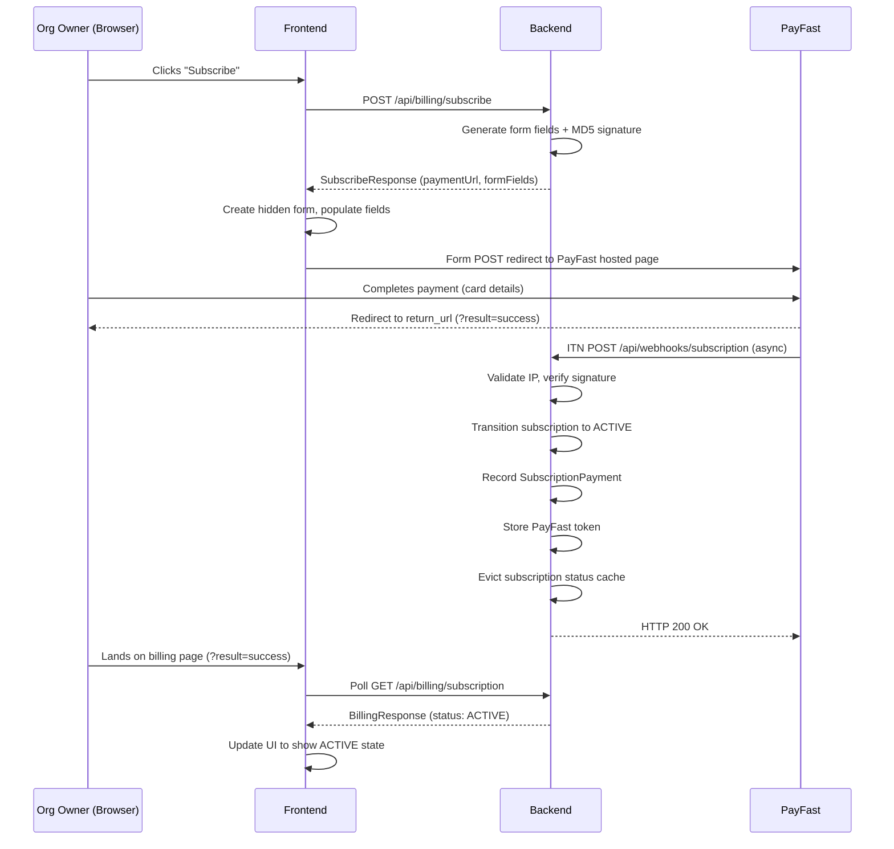
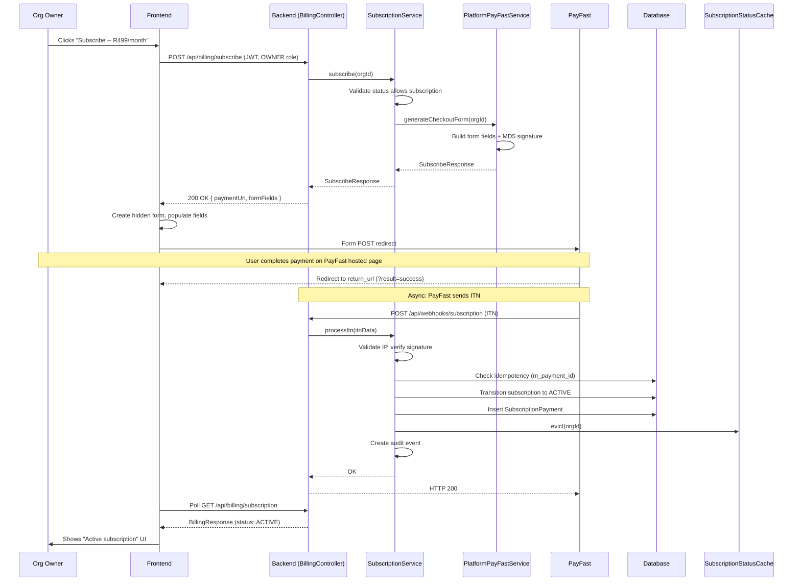
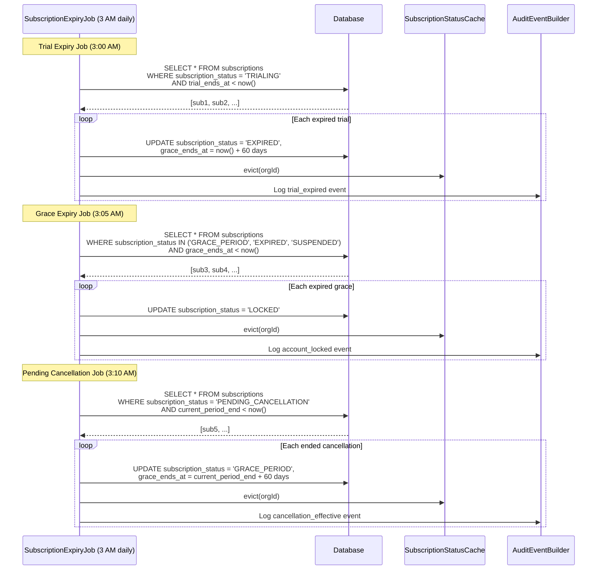
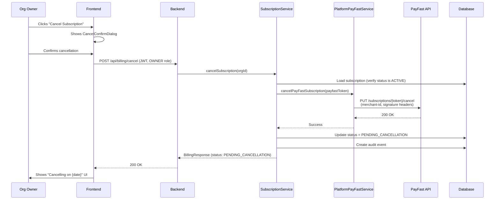

# Phase 57 -- Tenant Subscription Payments (PayFast Recurring Billing)

> Standalone architecture document for Phase 57.

**Status**: Proposed  
**Date**: 2026-04-02  
**Scope**: Billing lifecycle overhaul -- replaces dual-tier model with single-plan subscription via PayFast recurring billing

---

## 1. Overview

Phase 57 replaces HeyKazi's simulated billing system with real subscription payments via PayFast recurring billing. The dual-tier model (STARTER/PRO) is eliminated in favor of a single-plan lifecycle: every organization starts with a trial, subscribes via PayFast, and loses write access if they stop paying.

This phase touches three layers:
1. **Backend**: New subscription lifecycle model, PayFast integration for platform billing, read-only enforcement filter, scheduled expiry jobs, refactored billing API.
2. **Frontend**: Billing page redesign, global subscription banner, write-action gating via `SubscriptionContext`.
3. **Cleanup**: Removal of `Tier`, `PlanLimits`, `PlanSyncService`, and all Starter/Pro references.

### What's New vs What Changes

| Dimension | Before (Phase 2) | After (Phase 57) |
|-----------|------------------|-------------------|
| Plan model | Dual-tier (STARTER/PRO) | Single plan with lifecycle states |
| Subscription states | 2 (ACTIVE, CANCELLED) | 8 (TRIALING, ACTIVE, PENDING_CANCELLATION, PAST_DUE, SUSPENDED, GRACE_PERIOD, EXPIRED, LOCKED) |
| Payment collection | None (simulated upgrade) | PayFast recurring billing with ITN webhooks |
| Trial support | None | 14-day configurable trial with countdown |
| Grace period | None | 60-day read-only access after expiry/cancellation |
| Read-only enforcement | None | `SubscriptionGuardFilter` blocking write HTTP methods |
| Billing UI | Plan comparison table + fake upgrade button | Lifecycle-aware billing page with PayFast checkout redirect |
| Member limits | Per-tier (`PlanLimits.maxMembers(tier)`) | Single configurable value (`heykazi.billing.max-members`) |
| PayFast integration | Tenant BYOAK only (`integration/payment/`) | + Platform billing (`billing/payfast/`) |
| Payment history | None | `subscription_payments` table with ITN audit trail |
| Scheduled jobs | None for billing | 3 daily jobs (trial expiry, grace expiry, pending cancellation) |

### New Entities

| Entity | Schema | Purpose |
|--------|--------|---------|
| `SubscriptionPayment` | `public` | Payment audit trail -- one row per PayFast ITN (COMPLETE, FAILED, REFUNDED) |

### Modified Entities

| Entity | Change |
|--------|--------|
| `Subscription` | New fields: `subscriptionStatus`, `payfastToken`, `trialEndsAt`, `graceEndsAt`, `monthlyAmountCents`, `currency`, `lastPaymentAt`, `nextBillingAt`, `payfastPaymentId`. Removed: `planSlug`, `status` |
| `Organization` | Removed fields: `tier`, `planSlug`. Removed method: `updatePlan()` |

### Deleted Classes

| Class | Package | Reason |
|-------|---------|--------|
| `Tier.java` | `provisioning` | No tiers -- single plan |
| `PlanLimits.java` | `provisioning` | Replaced by `BillingProperties.maxMembers()` |
| `PlanSyncService.java` | `provisioning` | Vestige of Clerk Billing -- no plan sync needed |
| `PlanSyncController.java` | `provisioning` | Dead endpoint |

---

## 2. Subscription Lifecycle Model

### 2.1 State Machine (ADR-219)

The subscription lifecycle replaces both the `Tier` enum and the 2-state `SubscriptionStatus` with a single `SubscriptionStatus` enum covering 8 states.



### 2.2 State Definitions

| State | Access Level | UX Treatment | Triggers |
|-------|-------------|-------------|----------|
| `TRIALING` | Full access | Trial countdown, subscribe CTA | Org provisioning sets `trial_ends_at` |
| `ACTIVE` | Full access | Next billing date, payment history | PayFast ITN with `payment_status = COMPLETE` |
| `PENDING_CANCELLATION` | Full access | "Ends on {date}" banner | Owner clicks Cancel, PayFast API called |
| `PAST_DUE` | Full access | "Payment failed" warning banner | PayFast ITN with `payment_status = FAILED` |
| `SUSPENDED` | Read-only | "Subscription suspended" banner | PayFast exhausts retries (ITN `CANCELLED` while PAST_DUE) |
| `GRACE_PERIOD` | Read-only | Grace countdown, subscribe CTA | Period end (after cancellation) or payment exhaustion |
| `EXPIRED` | Read-only | Grace countdown, subscribe CTA | Trial expiry (scheduled job sets `grace_ends_at`) |
| `LOCKED` | No access | Full-page resubscribe CTA | Grace period expires (scheduled job) |

### 2.3 Access Policy Matrix

| State | GET/HEAD | POST/PUT/PATCH/DELETE | `/api/billing/*` | Data Preserved |
|-------|----------|----------------------|-------------------|----------------|
| TRIALING | Allow | Allow | Allow | Yes |
| ACTIVE | Allow | Allow | Allow | Yes |
| PENDING_CANCELLATION | Allow | Allow | Allow | Yes |
| PAST_DUE | Allow | Allow | Allow | Yes |
| SUSPENDED | Allow | **Block (403)** | Allow | Yes |
| GRACE_PERIOD | Allow | **Block (403)** | Allow | Yes |
| EXPIRED | Allow | **Block (403)** | Allow | Yes |
| LOCKED | **Block (403)** | **Block (403)** | Allow | Yes |

### 2.4 Member Limits

With a single plan, member limits are a flat configurable value sourced from `BillingProperties` (Section 4.1):

```yaml
heykazi:
  billing:
    max-members: 10
```

**Replaces:** `PlanLimits.maxMembers(Tier tier)` with a switch over STARTER/PRO. No separate `SubscriptionLimits` class — `BillingProperties.maxMembers()` covers this.

**Consumers:** `MemberSyncService.enforceMemberLimit()` and `SubscriptionService.getSubscription()` both switch from `PlanLimits.maxMembers(org.getTier())` to `billingProperties.maxMembers()`.

---

## 3. Data Model

### 3.1 Modified `Subscription` Entity

The existing `Subscription` entity (`billing/Subscription.java`, `public` schema) is restructured:

| Column | Type | Nullable | Description |
|--------|------|----------|-------------|
| `id` | `UUID` | No | Primary key (existing) |
| `organization_id` | `UUID` | No | FK to `organizations` (existing, unique) |
| `subscription_status` | `VARCHAR(30)` | No | Lifecycle state (replaces `status` + `plan_slug`) |
| `payfast_token` | `VARCHAR(255)` | Yes | PayFast subscription token for cancellation API |
| `trial_ends_at` | `TIMESTAMPTZ` | Yes | When trial expires (null if not trialing) |
| `grace_ends_at` | `TIMESTAMPTZ` | Yes | When grace period expires (null if not in grace) |
| `monthly_amount_cents` | `INTEGER` | Yes | Price snapshot at subscription time |
| `currency` | `VARCHAR(3)` | Yes | Currency code (default `ZAR`) |
| `last_payment_at` | `TIMESTAMPTZ` | Yes | Most recent successful payment |
| `next_billing_at` | `TIMESTAMPTZ` | Yes | Next PayFast charge date |
| `payfast_payment_id` | `VARCHAR(255)` | Yes | Latest ITN `m_payment_id` |
| `current_period_start` | `TIMESTAMPTZ` | Yes | Current billing period start (existing) |
| `current_period_end` | `TIMESTAMPTZ` | Yes | Current billing period end (existing) |
| `cancelled_at` | `TIMESTAMPTZ` | Yes | When cancellation was requested (existing) |
| `created_at` | `TIMESTAMPTZ` | No | Creation timestamp (existing) |
| `updated_at` | `TIMESTAMPTZ` | No | Last modification timestamp (existing) |

**Removed columns:** `plan_slug`, `status` (replaced by `subscription_status`).

### 3.2 New `SubscriptionPayment` Entity

```java
// billing/SubscriptionPayment.java
@Entity
@Table(name = "subscription_payments", schema = "public")
public class SubscriptionPayment {
    @Id @GeneratedValue(strategy = GenerationType.UUID)
    private UUID id;

    @Column(name = "subscription_id", nullable = false)
    private UUID subscriptionId;

    @Column(name = "payfast_payment_id", nullable = false)
    private String payfastPaymentId;

    @Column(name = "amount_cents", nullable = false)
    private int amountCents;

    @Column(name = "currency", nullable = false)
    private String currency;  // "ZAR"

    @Enumerated(EnumType.STRING)
    @Column(name = "status", nullable = false)
    private PaymentStatus status;  // COMPLETE, FAILED, REFUNDED

    @Column(name = "payment_date", nullable = false)
    private Instant paymentDate;

    @JdbcTypeCode(SqlTypes.JSON)
    @Column(name = "raw_itn", columnDefinition = "jsonb")
    private Map<String, String> rawItn;  // Full ITN payload for debugging

    @Column(name = "created_at", nullable = false)
    private Instant createdAt;

    public enum PaymentStatus { COMPLETE, FAILED, REFUNDED }
}
```

### 3.3 `Organization` Entity Changes

Remove from `Organization`:
- `tier` field (`@Enumerated Tier`)
- `planSlug` field (`String`)
- `updatePlan(Tier, String)` method
- `getTier()` method

The `Organization` entity retains `id`, `externalOrgId`, `name`, `provisioningStatus`, `createdAt`, `updatedAt`.

### 3.4 ER Diagram



---

## 4. PayFast Subscription Integration (ADR-220)

Platform subscription billing uses a separate `PlatformPayFastService` in `billing/payfast/` -- distinct from the tenant BYOAK `PayFastPaymentGateway` in `integration/payment/`. See ADR-220 for the rationale.

### 4.1 Platform PayFast Configuration

```java
// billing/payfast/PayFastBillingProperties.java
@ConfigurationProperties(prefix = "heykazi.billing.payfast")
public record PayFastBillingProperties(
    String merchantId,
    String merchantKey,
    String passphrase,
    boolean sandbox
) {}
```

```java
// billing/BillingProperties.java
@ConfigurationProperties(prefix = "heykazi.billing")
public record BillingProperties(
    int monthlyPriceCents,    // default 49900 (R499.00)
    int trialDays,            // default 14
    int gracePeriodDays,      // default 60
    String currency,          // default "ZAR"
    String itemName,          // default "HeyKazi Professional"
    String notifyUrl,         // ITN callback URL
    String returnUrl,         // PayFast redirect after success
    String cancelUrl,         // PayFast redirect after cancel
    int maxMembers            // default 10
) {}
```

Application config:

```yaml
heykazi:
  billing:
    payfast:
      merchant-id: ${PAYFAST_MERCHANT_ID}
      merchant-key: ${PAYFAST_MERCHANT_KEY}
      passphrase: ${PAYFAST_PASSPHRASE}
      sandbox: ${PAYFAST_SANDBOX:true}
    monthly-price-cents: 49900
    trial-days: 14
    grace-period-days: 60
    currency: ZAR
    item-name: "HeyKazi Professional"
    max-members: 10
    notify-url: ${HEYKAZI_BASE_URL}/api/webhooks/subscription
    return-url: ${HEYKAZI_FRONTEND_URL}/settings/billing?result=success
    cancel-url: ${HEYKAZI_FRONTEND_URL}/settings/billing?result=cancelled
```

### 4.2 Checkout Flow



**Form data generation** (`PlatformPayFastService.generateCheckoutForm()`):

```java
public SubscribeResponse generateCheckoutForm(UUID organizationId) {
    var data = new LinkedHashMap<String, String>();
    data.put("merchant_id", payfastProperties.merchantId());
    data.put("merchant_key", payfastProperties.merchantKey());
    data.put("return_url", billingProperties.returnUrl());
    data.put("cancel_url", billingProperties.cancelUrl());
    data.put("notify_url", billingProperties.notifyUrl());
    data.put("amount", formatCentsToRands(billingProperties.monthlyPriceCents()));
    data.put("item_name", billingProperties.itemName());
    data.put("subscription_type", "1");  // PayFast subscription flag
    data.put("recurring_amount", formatCentsToRands(billingProperties.monthlyPriceCents()));
    data.put("frequency", "3");          // Monthly
    data.put("cycles", "0");             // Indefinite
    data.put("custom_str1", organizationId.toString());
    data.put("signature", generateSignature(data));

    String paymentUrl = payfastProperties.sandbox()
        ? "https://sandbox.payfast.co.za/eng/process"
        : "https://www.payfast.co.za/eng/process";

    return new SubscribeResponse(paymentUrl, Map.copyOf(data));
}
```

### 4.3 ITN Webhook Handling

New endpoint: `POST /api/webhooks/subscription` (unauthenticated -- PayFast server-to-server).

**Processing steps:**

1. **Validate source IP.** PayFast IP range: `197.97.145.144/28` (197.97.145.144 -- 197.97.145.159). Reject requests from outside this range with HTTP 403.
2. **Validate signature.** Reconstruct MD5 hash from POST params (excluding `signature` field) sorted alphabetically + passphrase. Compare with received `signature`.
3. **Parse ITN fields:**
   - `m_payment_id` -- PayFast's unique payment ID
   - `pf_payment_id` -- PayFast reference
   - `payment_status` -- `COMPLETE`, `FAILED`, `PENDING`
   - `custom_str1` -- organization ID (set during checkout)
   - `token` -- subscription token (for cancellation API)
   - `amount_gross` -- payment amount
4. **Idempotency.** Check if `m_payment_id` exists in `subscription_payments`. If so, skip processing (deduplicate).
5. **Route by `payment_status`:**
   - `COMPLETE`: Transition to ACTIVE, record payment, update `last_payment_at`/`next_billing_at`, store `token` on first payment.
   - `FAILED`: If ACTIVE, transition to PAST_DUE. Record failed payment.
   - `CANCELLED`: Transition to SUSPENDED (if PAST_DUE) or GRACE_PERIOD (if ACTIVE/PENDING_CANCELLATION), set `grace_ends_at`.
6. **Evict subscription status cache** for the affected organization.
7. **Create audit event** via `AuditEventBuilder` for the state transition.
8. **Return HTTP 200** -- PayFast requires 200 OK regardless of processing outcome.

### 4.4 Cancellation via PayFast API

When the org owner clicks "Cancel Subscription":

1. `POST /api/billing/cancel` -- backend calls PayFast API:
   ```
   PUT https://api.payfast.co.za/subscriptions/{token}/cancel
   Headers:
     merchant-id: {merchantId}
     version: v1
     timestamp: {ISO-8601}
     signature: {MD5 of header params + passphrase}
   ```
2. On success, subscription transitions to `PENDING_CANCELLATION`.
3. Full access continues until `current_period_end`.
4. The daily scheduled job detects when `current_period_end < now()` and transitions to `GRACE_PERIOD`, setting `grace_ends_at = current_period_end + 60 days`.

For sandbox, the API base URL is `https://sandbox.payfast.co.za`.

### 4.5 Resubscribe Flow

A tenant in GRACE_PERIOD, EXPIRED, SUSPENDED, or LOCKED state can resubscribe:

1. Same checkout flow as Section 4.2 (owner clicks "Subscribe," backend generates form data, redirect to PayFast).
2. On successful ITN (payment_status = COMPLETE), transition to ACTIVE, clear `grace_ends_at`.
3. For LOCKED tenants, the billing page (`/settings/billing`) is the only accessible page -- the `SubscriptionGuardFilter` allows `GET /api/billing/*` and `POST /api/billing/subscribe` even for LOCKED orgs.

---

## 5. Read-Only Enforcement (ADR-221)

### 5.1 `SubscriptionGuardFilter` Design

A servlet filter in the Spring Security chain, positioned after `MemberFilter` (position 5 in the now-7-filter chain):

| Order | Filter | Purpose |
|-------|--------|---------|
| 1 | `ApiKeyAuthFilter` | API key for `/internal/*` |
| 2 | `BearerTokenAuthenticationFilter` + `ClerkJwtAuthenticationConverter` | JWT validation |
| 3 | `TenantFilter` | Binds `RequestScopes.TENANT_ID` |
| 4 | `MemberFilter` | Binds `RequestScopes.MEMBER_ID`, `ORG_ROLE` |
| **5** | **`SubscriptionGuardFilter`** | **Subscription status enforcement** |
| 6 | `PlatformAdminFilter` | Platform admin role binding |
| 7 | `TenantLoggingFilter` | MDC setup |

**Filter logic:**

```java
// billing/SubscriptionGuardFilter.java
@Component
public class SubscriptionGuardFilter extends OncePerRequestFilter {

    private final SubscriptionStatusCache statusCache;

    @Override
    protected void doFilterInternal(HttpServletRequest request,
                                     HttpServletResponse response,
                                     FilterChain chain) throws ... {

        // Skip for unauthenticated paths (webhooks, health)
        if (!RequestScopes.ORG_ID.isBound()) {
            chain.doFilter(request, response);
            return;
        }

        String orgId = RequestScopes.ORG_ID.get();  // external org ID (e.g., "org_abc123")
        SubscriptionStatus status = statusCache.getStatus(orgId);
        String method = request.getMethod();
        String path = request.getRequestURI();

        if (isReadOnlyState(status) && isMutatingMethod(method) && !isBillingPath(path)) {
            writeSubscriptionRequiredResponse(response);
            return;
        }

        if (status == SubscriptionStatus.LOCKED && !isBillingPath(path)) {
            writeLockedResponse(response);
            return;
        }

        chain.doFilter(request, response);
    }

    private boolean isReadOnlyState(SubscriptionStatus status) {
        return status == GRACE_PERIOD || status == SUSPENDED || status == EXPIRED;
    }

    private boolean isMutatingMethod(String method) {
        return "POST".equals(method) || "PUT".equals(method)
            || "PATCH".equals(method) || "DELETE".equals(method);
    }

    private boolean isBillingPath(String path) {
        return path.startsWith("/api/billing/");
    }
}
```

### 5.2 Error Response

For read-only states (403):
```json
{
  "type": "subscription_required",
  "title": "Subscription required",
  "detail": "Your subscription has expired. Subscribe to regain full access.",
  "instance": "/api/projects",
  "resubscribeUrl": "/settings/billing"
}
```

For LOCKED state (403):
```json
{
  "type": "subscription_locked",
  "title": "Account locked",
  "detail": "Your account has been locked. Resubscribe to access your data.",
  "instance": "/api/projects",
  "resubscribeUrl": "/settings/billing"
}
```

### 5.3 Subscription Status Cache

```java
// billing/SubscriptionStatusCache.java
@Component
public class SubscriptionStatusCache {

    private final Cache<UUID, SubscriptionStatus> cache;
    private final SubscriptionRepository subscriptionRepository;

    public SubscriptionStatusCache(SubscriptionRepository subscriptionRepository) {
        this.subscriptionRepository = subscriptionRepository;
        this.cache = Caffeine.newBuilder()
            .expireAfterWrite(Duration.ofMinutes(5))
            .maximumSize(1000)
            .build();
    }

    public SubscriptionStatus getStatus(UUID organizationId) {
        return cache.get(organizationId, this::loadStatus);
    }

    public void evict(UUID organizationId) {
        cache.invalidate(organizationId);
    }

    private SubscriptionStatus loadStatus(UUID orgId) {
        return subscriptionRepository.findByOrganizationId(orgId)
            .map(Subscription::getSubscriptionStatus)
            .orElse(SubscriptionStatus.TRIALING);  // Defensive default
    }
}
```

**Cache eviction points:**
- ITN webhook handler (`SubscriptionItnService.processItn()`) -- evicts after any status change.
- Scheduled expiry jobs -- evict after transitioning subscriptions.
- Admin override endpoints -- evict after manual status changes.

---

## 6. Subscription Status Detection (ADR-222)

Three `@Scheduled` jobs run daily at 3 AM (offset from the existing 2 AM dormancy/recurring schedule jobs).

### 6.1 Trial Expiry Job

```java
// billing/SubscriptionExpiryJob.java
@Component
public class SubscriptionExpiryJob {

    @Scheduled(cron = "0 0 3 * * *")
    public void processTrialExpiry() {
        var expired = subscriptionRepository
            .findBySubscriptionStatusAndTrialEndsAtBefore(TRIALING, Instant.now());
        for (var sub : expired) {
            sub.transitionTo(EXPIRED);
            sub.setGraceEndsAt(Instant.now().plus(
                Duration.ofDays(billingProperties.gracePeriodDays())));
            subscriptionRepository.save(sub);
            statusCache.evict(sub.getOrganizationId());
            auditService.log(/* trial expired event */);
            // Optional: notify org owner
        }
        log.info("Trial expiry job processed {} subscriptions", expired.size());
    }
}
```

### 6.2 Grace Period Expiry Job

```java
@Scheduled(cron = "0 5 3 * * *")  // 3:05 AM, after trial expiry
public void processGraceExpiry() {
    var expired = subscriptionRepository
        .findBySubscriptionStatusInAndGraceEndsAtBefore(
            List.of(GRACE_PERIOD, EXPIRED, SUSPENDED), Instant.now());
    for (var sub : expired) {
        sub.transitionTo(LOCKED);
        subscriptionRepository.save(sub);
        statusCache.evict(sub.getOrganizationId());
        auditService.log(/* account locked event */);
        // Optional: notify org owner
    }
    log.info("Grace expiry job processed {} subscriptions", expired.size());
}
```

### 6.3 Pending Cancellation End Job

```java
@Scheduled(cron = "0 10 3 * * *")  // 3:10 AM
public void processPendingCancellationEnd() {
    var ended = subscriptionRepository
        .findBySubscriptionStatusAndCurrentPeriodEndBefore(
            PENDING_CANCELLATION, Instant.now());
    for (var sub : ended) {
        sub.transitionTo(GRACE_PERIOD);
        sub.setGraceEndsAt(sub.getCurrentPeriodEnd().plus(
            Duration.ofDays(billingProperties.gracePeriodDays())));
        subscriptionRepository.save(sub);
        statusCache.evict(sub.getOrganizationId());
        auditService.log(/* cancellation effective event */);
    }
    log.info("Pending cancellation job processed {} subscriptions", ended.size());
}
```

**Repository queries:**

```java
// billing/SubscriptionRepository.java (additions)
List<Subscription> findBySubscriptionStatusAndTrialEndsAtBefore(
    SubscriptionStatus status, Instant cutoff);

List<Subscription> findBySubscriptionStatusInAndGraceEndsAtBefore(
    List<SubscriptionStatus> statuses, Instant cutoff);

List<Subscription> findBySubscriptionStatusAndCurrentPeriodEndBefore(
    SubscriptionStatus status, Instant cutoff);
```

---

## 7. API Surface

### 7.1 Public Billing Endpoints

| Method | Path | Auth | Description |
|--------|------|------|-------------|
| `GET` | `/api/billing/subscription` | JWT (any member) | Subscription status, trial/grace countdown, next billing date, limits |
| `POST` | `/api/billing/subscribe` | JWT (OWNER only) | Generates PayFast checkout form data, returns redirect URL + form fields |
| `POST` | `/api/billing/cancel` | JWT (OWNER only) | Cancels via PayFast API, transitions to PENDING_CANCELLATION |
| `GET` | `/api/billing/payments` | JWT (OWNER/ADMIN) | Payment history from `subscription_payments` |

### 7.2 Webhook Endpoint

| Method | Path | Auth | Description |
|--------|------|------|-------------|
| `POST` | `/api/webhooks/subscription` | Unauthenticated (IP + signature) | PayFast ITN callback |

### 7.3 Internal Admin Endpoints

| Method | Path | Auth | Description |
|--------|------|------|-------------|
| `POST` | `/internal/billing/extend-trial` | API key | Extends trial for a specific org |
| `POST` | `/internal/billing/activate` | API key | Manually activates subscription (support override) |

### 7.4 Request/Response DTOs

**`GET /api/billing/subscription` Response:**

```json
{
  "status": "TRIALING",
  "trialEndsAt": "2026-04-16T00:00:00Z",
  "currentPeriodEnd": null,
  "graceEndsAt": null,
  "nextBillingAt": null,
  "monthlyAmountCents": 49900,
  "currency": "ZAR",
  "limits": {
    "maxMembers": 10,
    "currentMembers": 3
  },
  "canSubscribe": true,
  "canCancel": false
}
```

```java
// billing/BillingResponse.java (replaces existing)
public record BillingResponse(
    String status,
    Instant trialEndsAt,
    Instant currentPeriodEnd,
    Instant graceEndsAt,
    Instant nextBillingAt,
    int monthlyAmountCents,
    String currency,
    LimitsResponse limits,
    boolean canSubscribe,
    boolean canCancel
) {
    public record LimitsResponse(int maxMembers, long currentMembers) {}
}
```

**`POST /api/billing/subscribe` Response:**

```json
{
  "paymentUrl": "https://sandbox.payfast.co.za/eng/process",
  "formFields": {
    "merchant_id": "10000100",
    "merchant_key": "46f0cd694581a",
    "amount": "499.00",
    "item_name": "HeyKazi Professional",
    "subscription_type": "1",
    "recurring_amount": "499.00",
    "frequency": "3",
    "cycles": "0",
    "custom_str1": "org-uuid-here",
    "notify_url": "https://api.heykazi.com/api/webhooks/subscription",
    "return_url": "https://app.heykazi.com/settings/billing?result=success",
    "cancel_url": "https://app.heykazi.com/settings/billing?result=cancelled",
    "signature": "abc123md5hash"
  }
}
```

```java
// billing/SubscribeResponse.java
public record SubscribeResponse(
    String paymentUrl,
    Map<String, String> formFields
) {}
```

**`POST /api/billing/cancel` Request/Response:**

No request body. Returns updated `BillingResponse` with `status: "PENDING_CANCELLATION"`.

**`GET /api/billing/payments` Response:**

```json
{
  "content": [
    {
      "id": "uuid",
      "payfastPaymentId": "1234567",
      "amountCents": 49900,
      "currency": "ZAR",
      "status": "COMPLETE",
      "paymentDate": "2026-04-02T10:30:00Z"
    }
  ],
  "page": { "totalElements": 5, "totalPages": 1, "size": 20, "number": 0 }
}
```

**`POST /internal/billing/extend-trial` Request:**

```json
{
  "organizationId": "uuid",
  "additionalDays": 14
}
```

**`POST /internal/billing/activate` Request:**

```json
{
  "organizationId": "uuid"
}
```

---

## 8. Frontend Changes

### 8.1 Billing Settings Page Redesign

**File:** `frontend/app/(app)/org/[slug]/settings/billing/page.tsx`

The current billing page displays a plan comparison table (Starter vs Pro) and a simulated upgrade button. This is replaced with a lifecycle-aware billing UI.

| Subscription Status | Page Content |
|---------------------|-------------|
| `TRIALING` | Trial countdown ("14 days remaining"), feature highlights, prominent "Subscribe -- R499/month" CTA button |
| `ACTIVE` | "Active subscription," next billing date, payment history list, "Cancel Subscription" link (with confirmation dialog) |
| `PENDING_CANCELLATION` | "Cancelling on {date}" message, continued access notice, "Resubscribe" CTA, payment history |
| `PAST_DUE` | Warning banner ("Payment failed"), link to PayFast to update payment method, payment history showing failed entry |
| `GRACE_PERIOD` / `EXPIRED` / `SUSPENDED` | "Your subscription has expired," grace period countdown, "Subscribe to regain full access" CTA, read-only explanation |
| `LOCKED` | Full-page "Resubscribe" CTA with org name, data preservation message, subscribe button (this is the only accessible page) |

### 8.2 Files to Delete/Replace

| File | Action |
|------|--------|
| `components/billing/plan-badge.tsx` | Delete (no tiers to badge) |
| `components/billing/plan-badge.test.tsx` | Delete |
| `components/billing/upgrade-button.tsx` | Replace with `subscribe-button.tsx` |
| `components/billing/upgrade-card.tsx` | Delete |
| `components/billing/upgrade-confirm-dialog.tsx` | Replace with `cancel-confirm-dialog.tsx` |
| `components/billing/upgrade-confirm-dialog.test.tsx` | Delete |
| `components/billing/upgrade-prompt.tsx` | Delete |
| `components/billing/upgrade-prompt.test.tsx` | Delete |
| `settings/billing/page.tsx` | Rewrite |
| `settings/billing/actions.ts` | Rewrite |

### 8.3 New Frontend Components

| Component | File | Purpose |
|-----------|------|---------|
| `SubscriptionBanner` | `components/billing/subscription-banner.tsx` | Global banner in app shell layout |
| `SubscribeButton` | `components/billing/subscribe-button.tsx` | PayFast form POST redirect |
| `CancelConfirmDialog` | `components/billing/cancel-confirm-dialog.tsx` | Cancellation confirmation |
| `PaymentHistory` | `components/billing/payment-history.tsx` | Payment list from `/api/billing/payments` |
| `TrialCountdown` | `components/billing/trial-countdown.tsx` | Days remaining display |
| `GraceCountdown` | `components/billing/grace-countdown.tsx` | Grace period days remaining |

### 8.4 Global Subscription Banner

A persistent banner rendered in the org-scoped layout (`app/(app)/org/[slug]/layout.tsx`):

| State | Banner | Style | Dismissible |
|-------|--------|-------|-------------|
| TRIALING (>7 days left) | Not shown | -- | -- |
| TRIALING (<=7 days left) | "Your trial ends in {N} days -- Subscribe now" | Info (blue) | Per-session |
| ACTIVE | Not shown | -- | -- |
| PENDING_CANCELLATION | "Your subscription ends on {date}" | Warning (amber) | Per-session |
| PAST_DUE | "Payment failed -- update your payment method" | Warning (amber) | Persistent |
| GRACE_PERIOD / EXPIRED / SUSPENDED | "Read-only mode -- subscribe to regain full access" | Error (red) | Persistent |
| LOCKED | Not shown (full-page redirect to billing) | -- | -- |

### 8.5 Write-Action Gating via `SubscriptionContext`

```tsx
// lib/subscription-context.tsx
"use client";
import { createContext, useContext, useMemo } from "react";

interface SubscriptionContextValue {
  status: string;
  isWriteEnabled: boolean;
  canSubscribe: boolean;
  canCancel: boolean;
}

const SubscriptionContext = createContext<SubscriptionContextValue>({
  status: "ACTIVE",
  isWriteEnabled: true,
  canSubscribe: false,
  canCancel: false,
});

export function useSubscription() {
  return useContext(SubscriptionContext);
}
```

**Usage in components:**

```tsx
const { isWriteEnabled } = useSubscription();
<Button disabled={!isWriteEnabled} title={!isWriteEnabled ? "Subscribe to enable this action" : undefined}>
  Create Project
</Button>
```

**API error interceptor** in `lib/api.ts`:
- Catches 403 responses with `type: "subscription_required"` or `type: "subscription_locked"`.
- Shows a modal with subscribe CTA or redirects to billing page.

### 8.6 PayFast Redirect Handling

The subscribe flow uses a hidden form POST (not a popup or API call):

1. Owner clicks "Subscribe" -- calls `POST /api/billing/subscribe` server action.
2. Server action returns `SubscribeResponse` (URL + form fields).
3. Client component creates a hidden `<form>` element, sets `action` to the PayFast URL, populates hidden `<input>` fields, calls `form.submit()`.
4. User completes payment on PayFast's hosted page.
5. PayFast redirects back to `return_url` (`/settings/billing?result=success`).
6. Billing page detects `?result=success` query param, polls `GET /api/billing/subscription` every 2 seconds (up to 30 seconds) waiting for ITN to update the status.
7. When status changes to ACTIVE, the UI updates.

---

## 9. Database Migration

### V17 Global Migration

**File:** `backend/src/main/resources/db/migration/global/V17__subscription_payments.sql`

```sql
-- Phase 57: Subscription lifecycle + payment tracking
-- Replaces dual-tier model with single-plan subscription via PayFast

-- 1. Add new columns to subscriptions table
ALTER TABLE subscriptions
  ADD COLUMN subscription_status VARCHAR(30),
  ADD COLUMN payfast_token VARCHAR(255),
  ADD COLUMN trial_ends_at TIMESTAMP WITH TIME ZONE,
  ADD COLUMN grace_ends_at TIMESTAMP WITH TIME ZONE,
  ADD COLUMN monthly_amount_cents INTEGER,
  ADD COLUMN currency VARCHAR(3) DEFAULT 'ZAR',
  ADD COLUMN last_payment_at TIMESTAMP WITH TIME ZONE,
  ADD COLUMN next_billing_at TIMESTAMP WITH TIME ZONE,
  ADD COLUMN payfast_payment_id VARCHAR(255);

-- 2. Migrate existing data
-- Pro subscriptions → ACTIVE (they were already "paying" conceptually)
UPDATE subscriptions
  SET subscription_status = 'ACTIVE'
  WHERE plan_slug = 'pro';

-- Starter subscriptions → TRIALING with 14-day trial window
UPDATE subscriptions
  SET subscription_status = 'TRIALING',
      trial_ends_at = now() + INTERVAL '14 days'
  WHERE plan_slug = 'starter' OR plan_slug IS NULL;

-- Catch any remaining rows (defensive)
UPDATE subscriptions
  SET subscription_status = 'TRIALING',
      trial_ends_at = now() + INTERVAL '14 days'
  WHERE subscription_status IS NULL;

-- 3. Make subscription_status NOT NULL after data migration
ALTER TABLE subscriptions
  ALTER COLUMN subscription_status SET NOT NULL;

-- 4. Drop replaced columns
ALTER TABLE subscriptions DROP COLUMN IF EXISTS plan_slug;
ALTER TABLE subscriptions DROP COLUMN IF EXISTS status;

-- 5. Remove tier and plan_slug from organizations
ALTER TABLE organizations DROP COLUMN IF EXISTS tier;
ALTER TABLE organizations DROP COLUMN IF EXISTS plan_slug;

-- 6. Create payment history table
CREATE TABLE IF NOT EXISTS subscription_payments (
  id UUID PRIMARY KEY DEFAULT gen_random_uuid(),
  subscription_id UUID NOT NULL REFERENCES subscriptions(id),
  payfast_payment_id VARCHAR(255) NOT NULL,
  amount_cents INTEGER NOT NULL,
  currency VARCHAR(3) NOT NULL DEFAULT 'ZAR',
  status VARCHAR(30) NOT NULL,
  payment_date TIMESTAMP WITH TIME ZONE NOT NULL,
  raw_itn JSONB,
  created_at TIMESTAMP WITH TIME ZONE NOT NULL DEFAULT now()
);

CREATE INDEX IF NOT EXISTS idx_sub_payments_subscription
  ON subscription_payments(subscription_id);

CREATE INDEX IF NOT EXISTS idx_sub_payments_payfast_id
  ON subscription_payments(payfast_payment_id);

-- 7. Index on subscription_status for scheduled job queries
CREATE INDEX IF NOT EXISTS idx_subscriptions_status
  ON subscriptions(subscription_status);
```

---

## 10. Code Cleanup

### 10.1 Files to Delete

| File | Package | Reason |
|------|---------|--------|
| `Tier.java` | `provisioning` | Enum with STARTER/PRO -- no tiers |
| `PlanLimits.java` | `provisioning` | Per-tier branching replaced by `BillingProperties.maxMembers()` |
| `PlanSyncService.java` | `provisioning` | Vestige of Clerk Billing webhook sync |
| `PlanSyncController.java` | `provisioning` | Dead endpoint for plan sync |
| `PlanSyncIntegrationTest.java` | `provisioning` (test) | Tests for deleted service |
| Frontend: `plan-badge.tsx`, `plan-badge.test.tsx`, `upgrade-card.tsx`, `upgrade-prompt.tsx`, `upgrade-prompt.test.tsx`, `upgrade-confirm-dialog.tsx`, `upgrade-confirm-dialog.test.tsx` | `components/billing/` | Tier-based UI components |

### 10.2 Files to Modify

| File | Change |
|------|--------|
| `Organization.java` | Remove `tier`, `planSlug` fields, `getTier()`, `getPlanSlug()`, `updatePlan()` |
| `Subscription.java` | Replace `planSlug`/`status` with lifecycle fields. Add `SubscriptionStatus` enum (8 states). Add transition methods |
| `SubscriptionService.java` | Replace `changePlan()`/`upgradePlan()` with `subscribe()`/`cancel()`. Replace `BillingResponse` record |
| `SubscriptionRepository.java` | Add queries for scheduled jobs |
| `BillingController.java` | Replace `upgrade()` with `subscribe()`, add `cancel()`, `payments()` |
| `MemberSyncService.java` | Replace `PlanLimits.maxMembers(org.getTier())` with `subscriptionLimits.maxMembers()` |
| `AssistantService.java` | Replace `org.getTier() != Tier.PRO` with subscription status check |
| `TenantProvisioningService.java` | Create TRIALING subscription (with `trial_ends_at`) instead of STARTER |
| `SecurityConfig.java` | Add `SubscriptionGuardFilter` to filter chain (position 5) |
| `SubscriptionIntegrationTest.java` | Rewrite for new lifecycle model |
| Frontend: `billing/page.tsx`, `billing/actions.ts` | Full rewrite for lifecycle UI |
| Frontend: `org/[slug]/layout.tsx` | Add `SubscriptionBanner` component |
| Frontend: `lib/internal-api.ts` | Update `BillingResponse` type |
| Frontend: `lib/api.ts` | Add `subscription_required` error interceptor |

### 10.3 Impact on Existing Features

| Feature | Impact | Migration |
|---------|--------|-----------|
| Member limit enforcement | `MemberSyncService` calls `PlanLimits.maxMembers(org.getTier())` | Replace with `subscriptionLimits.maxMembers()` |
| AI Assistant tier check | `AssistantService` checks `org.getTier() != Tier.PRO` | Replace with subscription status check (allow for TRIALING/ACTIVE/PENDING_CANCELLATION/PAST_DUE) |
| Tenant provisioning | `TenantProvisioningService` creates subscription with `planSlug = "starter"` | Create with `subscriptionStatus = TRIALING`, `trial_ends_at = now() + trialDays` |
| Organization entity | `Organization` has `tier` and `planSlug` fields | Remove fields; subscription status now lives solely on `Subscription` entity |
| Billing response DTO | `BillingResponse(planSlug, tier, status, limits)` | Replace with lifecycle-aware `BillingResponse` (status, timestamps, canSubscribe, canCancel) |
| Frontend tier badges | `PlanBadge` renders STARTER/PRO badge | Delete component; status-based badges rendered inline |
| Frontend upgrade flow | `UpgradeButton` → `UpgradeConfirmDialog` → fake upgrade | Replace with `SubscribeButton` → PayFast redirect |
| Test utilities | Tests reference `Tier.STARTER`, `Tier.PRO`, `org.updatePlan()` | Update to use `SubscriptionStatus` and subscription lifecycle methods |

---

## 11. Sequence Diagrams

### 11.1 Subscribe Flow



### 11.2 Trial Expiry --> Grace --> Lock Flow



### 11.3 Cancellation Flow



---

## 12. Testing Strategy

### 12.1 Backend Tests

| Test Class | Scope | Key Scenarios |
|------------|-------|---------------|
| `SubscriptionLifecycleTest` | Unit/Integration | All state transitions: TRIALING->ACTIVE, ACTIVE->PENDING_CANCELLATION, PENDING_CANCELLATION->GRACE, GRACE->LOCKED, EXPIRED->ACTIVE (resubscribe). Invalid transitions rejected. |
| `PlatformPayFastServiceTest` | Unit | Form data generation with correct fields. MD5 signature calculation matches expected output. Sandbox vs production URL selection. Cancellation API request construction. |
| `SubscriptionItnServiceTest` | Integration | Signature verification (valid/invalid). IP validation (PayFast range/outside range). Idempotency (duplicate `m_payment_id`). Status routing: COMPLETE->ACTIVE, FAILED->PAST_DUE, CANCELLED->SUSPENDED. Token storage on first payment. Payment record creation. |
| `SubscriptionGuardFilterTest` | Integration | Read-only enforcement: GET allowed during GRACE, POST blocked during GRACE, all blocked during LOCKED. Billing paths allowed in all states. TRIALING/ACTIVE pass through. Unauthenticated requests pass through. |
| `SubscriptionExpiryJobTest` | Integration | Trial expiry: TRIALING with past `trial_ends_at` transitions to EXPIRED. Grace expiry: GRACE with past `grace_ends_at` transitions to LOCKED. Pending cancellation: PENDING_CANCELLATION with past `current_period_end` transitions to GRACE. Subscriptions not past cutoff are untouched. |
| `BillingControllerIntegrationTest` | Integration | Subscribe endpoint returns form data (OWNER only, non-OWNER 403). Cancel endpoint calls PayFast API (OWNER only). Status endpoint returns correct lifecycle state. Payments endpoint returns paginated history. |
| `SubscriptionStatusCacheTest` | Unit | Cache hit returns without DB query. Cache miss loads from DB. Eviction forces reload. TTL expiry forces reload. |
| `BillingPropertiesTest` | Unit | Config properties bind correctly. Default values applied. `MemberSyncService` uses `BillingProperties.maxMembers()`. |

### 12.2 Frontend Tests

| Test | Scope | Key Scenarios |
|------|-------|---------------|
| `billing-page.test.tsx` | Component | Renders correctly for each of 8 subscription states. Subscribe CTA visible for TRIALING/GRACE/EXPIRED/SUSPENDED/LOCKED. Cancel link visible for ACTIVE only. Payment history rendered for ACTIVE/PENDING_CANCELLATION. |
| `subscription-banner.test.tsx` | Component | Banner hidden for ACTIVE. Info banner for TRIALING (<=7 days). Warning banner for PENDING_CANCELLATION and PAST_DUE. Error banner for GRACE/EXPIRED/SUSPENDED. Dismissible per-session for info/warning. Persistent for error. |
| `subscribe-button.test.tsx` | Component | Calls subscribe API on click. Creates hidden form with correct fields. Submits form to PayFast URL. |
| `cancel-confirm-dialog.test.tsx` | Component | Shows confirmation text. Calls cancel API on confirm. Shows loading state. Displays error on failure. |
| `subscription-context.test.tsx` | Unit | `isWriteEnabled` is true for TRIALING/ACTIVE/PENDING_CANCELLATION/PAST_DUE. `isWriteEnabled` is false for GRACE/EXPIRED/SUSPENDED/LOCKED. `canSubscribe` is true for TRIALING/GRACE/EXPIRED/SUSPENDED/LOCKED. |
| `api-error-interceptor.test.tsx` | Unit | Catches 403 with `subscription_required` type. Catches 403 with `subscription_locked` type. Does not intercept other 403 responses. |

### 12.3 Manual QA Scenarios

1. **Full lifecycle**: Provision org -> verify TRIALING -> subscribe via PayFast sandbox -> receive ITN -> verify ACTIVE -> cancel -> verify PENDING_CANCELLATION -> wait for period end (or trigger job manually) -> verify GRACE_PERIOD -> wait for grace end -> verify LOCKED.
2. **Trial expiry**: Provision org -> set `trial_ends_at` to past (via admin endpoint) -> trigger trial expiry job -> verify EXPIRED with grace countdown.
3. **Failed payment**: From ACTIVE state -> simulate FAILED ITN -> verify PAST_DUE banner -> simulate COMPLETE ITN (recovery) -> verify ACTIVE.
4. **Resubscribe from grace**: From GRACE_PERIOD state -> complete PayFast checkout -> verify ACTIVE, grace cleared.
5. **Read-only enforcement**: From GRACE_PERIOD state -> attempt POST/PUT/DELETE -> verify 403 with `subscription_required`. Verify GET requests succeed. Verify billing endpoints still work.
6. **Locked state**: From LOCKED state -> verify all pages redirect to billing. Verify subscribe flow works from locked state.

---

## 13. Capability Slices

### Slice 57A: Data Model + Entity Restructure

**Scope:** Database migration, entity changes, `SubscriptionStatus` enum, `SubscriptionPayment` entity, `BillingProperties` config.

**Deliverables:**
- `V17__subscription_payments.sql` global migration
- Modified `Subscription.java` with new fields and `SubscriptionStatus` enum
- New `SubscriptionPayment.java` entity
- New `SubscriptionPaymentRepository.java`
- `BillingProperties.java` (`@ConfigurationProperties`)
- `BillingProperties.java` (`@ConfigurationProperties`)
- Updated `SubscriptionRepository.java` with scheduled job queries
- Application config additions (`application.yml`, `application-local.yml`)

**Dependencies:** None (foundation slice).

**Tests:** Entity persistence tests, migration correctness, config binding tests.

### Slice 57B: Subscription Service + Billing API

**Scope:** Refactored `SubscriptionService`, new `BillingController` endpoints, `BillingResponse` DTO.

**Deliverables:**
- Rewritten `SubscriptionService.java` with lifecycle methods (`subscribe()`, `cancel()`, `getSubscription()`, `getPayments()`)
- Rewritten `BillingController.java` with new endpoints (`subscribe`, `cancel`, `payments`)
- New `BillingResponse.java` and `SubscribeResponse.java` DTOs
- Internal admin endpoints (`extend-trial`, `activate`)
- Updated `TenantProvisioningService` to create TRIALING subscriptions

**Dependencies:** 57A (entity model).

**Tests:** `BillingControllerIntegrationTest`, `SubscriptionLifecycleTest`.

### Slice 57C: PayFast Integration

**Scope:** Platform PayFast service, ITN webhook handler, checkout form generation, cancellation API.

**Deliverables:**
- `billing/payfast/PlatformPayFastService.java` (form generation, signature, IP validation)
- `billing/payfast/PayFastBillingProperties.java` (`@ConfigurationProperties`)
- `billing/SubscriptionItnController.java` (webhook endpoint)
- `billing/SubscriptionItnService.java` (ITN processing, idempotency, status routing)
- Webhook endpoint registered in `SecurityConfig` (unauthenticated, IP-validated)

**Dependencies:** 57A (entity), 57B (service layer for state transitions).

**Tests:** `PlatformPayFastServiceTest`, `SubscriptionItnServiceTest`.

### Slice 57D: Read-Only Enforcement + Scheduled Jobs

**Scope:** `SubscriptionGuardFilter`, `SubscriptionStatusCache`, 3 scheduled expiry jobs.

**Deliverables:**
- `billing/SubscriptionGuardFilter.java`
- `billing/SubscriptionStatusCache.java` (Caffeine cache)
- `billing/SubscriptionExpiryJob.java` (3 `@Scheduled` methods)
- Updated `SecurityConfig.java` (filter chain position 5)
- Audit events for state transitions

**Dependencies:** 57A (entity), 57B (service for status resolution).

**Tests:** `SubscriptionGuardFilterTest`, `SubscriptionStatusCacheTest`, `SubscriptionExpiryJobTest`.

### Slice 57E: Frontend Billing UI

**Scope:** Billing page rewrite, subscription banner, write-action gating, PayFast redirect handling.

**Deliverables:**
- Rewritten `settings/billing/page.tsx` (lifecycle-aware)
- Rewritten `settings/billing/actions.ts` (subscribe, cancel, payments server actions)
- `components/billing/subscription-banner.tsx`
- `components/billing/subscribe-button.tsx`
- `components/billing/cancel-confirm-dialog.tsx`
- `components/billing/payment-history.tsx`
- `components/billing/trial-countdown.tsx`
- `components/billing/grace-countdown.tsx`
- `lib/subscription-context.tsx` (SubscriptionContext provider)
- Updated `org/[slug]/layout.tsx` (banner integration)
- Updated `lib/api.ts` (error interceptor for `subscription_required`)
- Updated `lib/internal-api.ts` (new `BillingResponse` type)

**Dependencies:** 57B (API endpoints must exist for server actions to call).

**Tests:** `billing-page.test.tsx`, `subscription-banner.test.tsx`, `subscribe-button.test.tsx`, `cancel-confirm-dialog.test.tsx`, `subscription-context.test.tsx`.

### Slice 57F: Code Cleanup + Test Migration

**Scope:** Delete dead tier code, update all references, migrate existing tests.

**Deliverables:**
- Delete: `Tier.java`, `PlanLimits.java`, `PlanSyncService.java`, `PlanSyncController.java`, `PlanSyncIntegrationTest.java`
- Delete: frontend billing components (`plan-badge.*`, `upgrade-*`)
- Update: `Organization.java` (remove `tier`, `planSlug` fields)
- Update: `MemberSyncService.java` (use `BillingProperties.maxMembers()`)
- Update: `AssistantService.java` (subscription status check instead of tier check)
- Update: all test files referencing `Tier.STARTER`, `Tier.PRO`, `org.updatePlan()`
- Verify: no remaining references to `Tier`, `PlanLimits`, `PlanSync` in codebase

**Dependencies:** 57A-57E (all other slices must be complete before cleanup).

**Tests:** All existing tests pass after cleanup. Regression sweep.

### Slice Dependency Graph

```
57A (Data Model) ─────────────────────┐
   │                                  │
   ├──→ 57B (Service + API) ──────────┤
   │        │                         │
   │        ├──→ 57C (PayFast)        │
   │        │                         │
   │        ├──→ 57D (Guard + Jobs)   │
   │        │                         │
   │        └──→ 57E (Frontend) ──────┤
   │                                  │
   └──────────────────────────────────→ 57F (Cleanup)
```

**Parallel opportunities after 57B:** Slices 57C, 57D, and 57E are independent of each other and can run in parallel after 57B completes.

---

## 14. ADR Index

| ADR | Title | Decision |
|-----|-------|----------|
| [ADR-219](../adr/ADR-219-subscription-state-machine-design.md) | Subscription State Machine Design | Single-plan lifecycle with 8 states replaces dual-tier STARTER/PRO |
| [ADR-220](../adr/ADR-220-platform-vs-tenant-payfast-integration.md) | Platform vs Tenant PayFast Integration | Separate `PlatformPayFastService` in `billing/payfast/` -- independent of BYOAK `PayFastPaymentGateway` |
| [ADR-221](../adr/ADR-221-read-only-enforcement-strategy.md) | Read-Only Enforcement Strategy | Servlet filter (`SubscriptionGuardFilter`) blocking mutating HTTP methods for grace/locked states |
| [ADR-222](../adr/ADR-222-trial-and-grace-expiry-detection.md) | Trial and Grace Expiry Detection | Daily `@Scheduled` job at 3 AM -- matches existing `DormancyScheduledJob` pattern |
