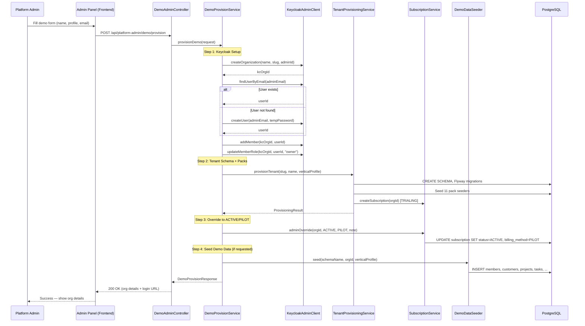
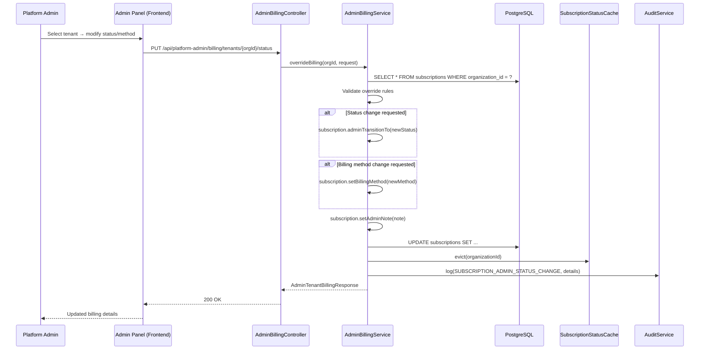
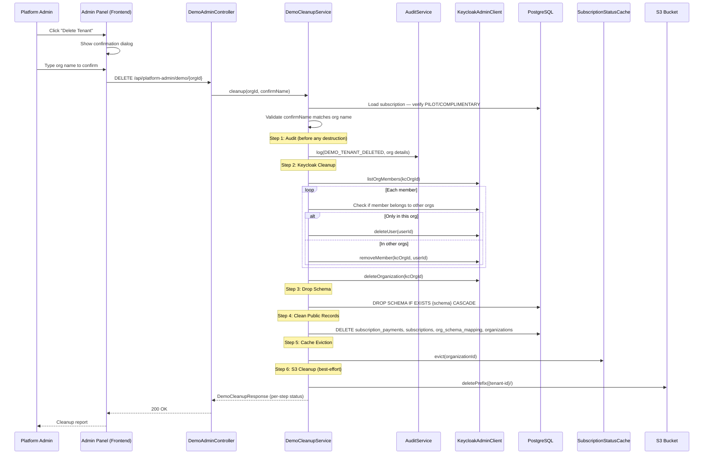
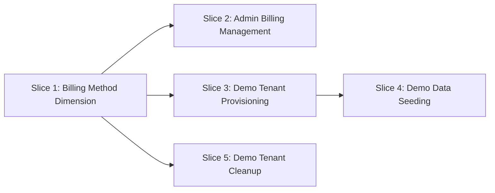

# Phase 58 — Demo Readiness & Admin Billing Controls

> Merge into `ARCHITECTURE.md` as **Section 11**. ADR files go in `adr/`.

> **Section Numbering Note**: Phases 5 through 8 were documented externally in separate architecture files and have not yet been merged into ARCHITECTURE.md. When all phases are merged, the section numbers will need reconciliation. This document uses Section 11 numbering as the next available in ARCHITECTURE.md.

---

## 11. Phase 58 — Demo Readiness & Admin Billing Controls

Phase 58 closes the gap between "the platform can process payments" (Phase 57) and "the platform is ready to demo to prospects." Until now, every subscription was either self-service PayFast or manually managed through raw API calls. Demo tenants required the full access request pipeline — OTP verification, admin approval, waiting for provisioning — even when the platform admin just wanted to show a prospect how the product works during a 30-minute call.

This phase introduces four capabilities: (1) a **billing method dimension** that separates commercial arrangement from access-control status, (2) an **admin billing management panel** so platform admins never need to hit internal endpoints directly, (3) **one-click demo tenant provisioning** that bypasses the access request pipeline while reusing the existing provisioning infrastructure, and (4) **safe demo tenant cleanup** with data seeding and destruction lifecycle.

The design is additive and non-breaking. The `SubscriptionGuardFilter` — the gatekeeper for tenant read/write access — does not change. Billing method is orthogonal to subscription status: a PILOT tenant and a PAYFAST tenant in the same status receive identical access-control treatment. This separation is the central architectural decision of the phase (see [ADR-223](../adr/ADR-223-billing-method-separate-dimension.md)).

**Dependencies on prior phases**:
- **Phase 57** (Subscription Billing): `Subscription` entity, `SubscriptionGuardFilter`, `SubscriptionStatusCache`, `SubscriptionExpiryJob`, `BillingResponse` DTO, PayFast ITN integration. This phase extends `Subscription` with `billingMethod` and `adminNote`.
- **Phase 39** (Admin-Approved Provisioning): `PlatformAdminController`, `PlatformSecurityService`, `AccessRequestApprovalService`, `OrgProvisioningService`. This phase adds new admin controllers following the same `@PreAuthorize` pattern.
- **Phase 49** (Vertical Profiles): `VerticalProfile` enum, `VerticalProfileRegistry`, `ModuleRegistry`. Demo data seeding is profile-aware.
- **Phase 36** (Keycloak + Gateway BFF): `KeycloakAdminClient` for org/user management during demo provisioning and cleanup.

### What's New

| Capability | Before Phase 58 | After Phase 58 |
|---|---|---|
| Billing arrangement | Implicit — PayFast or nothing | Explicit `billing_method` field: PAYFAST, DEBIT_ORDER, PILOT, COMPLIMENTARY, MANUAL |
| Admin billing controls | Raw API endpoints (`/internal/billing/extend-trial`, `/internal/billing/activate`) | Full admin panel at `/platform-admin/billing` with list, detail, status/method changes, trial extension |
| Demo tenant creation | Access request → OTP → admin approval → provisioning (5+ minutes, multiple steps) | One-click form → instant provisioning (30 seconds) |
| Demo data | Empty tenant after provisioning — only packs seeded | Realistic 3-month business activity: customers, projects, tasks, time entries, invoices, proposals |
| Demo cleanup | No mechanism — orphaned schemas accumulate | Safe one-click destruction with billing-method safety rail |
| Billing page (tenant-facing) | Same UI for all tenants | Adaptive: PayFast tenants see card UI, admin-managed tenants see "managed by administrator" |

**Out of scope**: Tenant impersonation (requires Keycloak token exchange), multi-tenant revenue analytics dashboard, self-service billing method changes, billing method migration tooling, demo data customization UI.

---

### 11.1 Overview

Phase 58 establishes the admin tooling layer for subscription management and demo readiness. The core abstractions:

1. **BillingMethod** — An enum on the `Subscription` entity that captures the commercial arrangement (how this tenant pays). Independent of `SubscriptionStatus` (which captures what access the tenant has). See [ADR-223](../adr/ADR-223-billing-method-separate-dimension.md).

2. **AdminBillingService** — A service that exposes admin-level subscription management: list all tenants with billing info, override status and billing method, extend trials. All actions require platform admin authentication and emit audit events.

3. **DemoProvisionService** — Orchestrates one-click demo tenant creation. Calls `KeycloakAdminClient` for org/user setup, delegates to `TenantProvisioningService` for schema and pack seeding, then optionally triggers `DemoDataSeeder` for transactional data. See [ADR-224](../adr/ADR-224-demo-provisioning-bypass.md).

4. **DemoDataSeeder** — A profile-aware service hierarchy (`BaseDemoDataSeeder` with `GenericDemoDataSeeder`, `AccountingDemoDataSeeder`, `LegalDemoDataSeeder` implementations) that populates a tenant with realistic South African business data. See [ADR-225](../adr/ADR-225-demo-data-seeding-strategy.md).

5. **DemoCleanupService** — Destroys demo tenants in a defined order (audit → Keycloak → schema → public records → cache → S3) with safety rails that prevent deletion of paying tenants. See [ADR-226](../adr/ADR-226-tenant-cleanup-safety-model.md).

All public-schema changes are in a single global migration (V18). No tenant-schema migrations are needed — this phase operates on platform infrastructure, not domain entities.

---

### 11.2 Domain Model

Phase 58 modifies one existing entity (`Subscription`) and introduces one new enum (`BillingMethod`). No new database tables are created. No tenant-schema entities are added or altered.

#### 11.2.1 BillingMethod Enum (New)

A standalone enum in the `billing` package that classifies the commercial arrangement for a tenant's subscription:

```java
public enum BillingMethod {
    PAYFAST,        // Automated card billing via PayFast recurring
    DEBIT_ORDER,    // Manual EFT/debit order — admin reconciles monthly
    PILOT,          // Pilot partner — no payment expected
    COMPLIMENTARY,  // Indefinite free access (internal, strategic partners)
    MANUAL;         // Default — invoice + EFT, admin manages lifecycle

    /**
     * Whether this billing method is managed by an administrator (as opposed
     * to automated self-service via PayFast).
     */
    public boolean isAdminManaged() {
        return this != PAYFAST;
    }

    /**
     * Whether subscriptions with this billing method should auto-expire
     * when the trial period ends. PILOT, COMPLIMENTARY, and DEBIT_ORDER
     * tenants are admin-managed — their trial does not auto-expire.
     */
    public boolean isTrialAutoExpiring() {
        return this == PAYFAST || this == MANUAL;
    }

    /**
     * Whether this billing method is eligible for demo cleanup.
     * Only PILOT and COMPLIMENTARY tenants can be deleted through
     * the cleanup flow — paying tenants are protected.
     */
    public boolean isCleanupEligible() {
        return this == PILOT || this == COMPLIMENTARY;
    }
}
```

**Design decision — enum on Subscription vs. separate table**: A `BillingMethod` enum on the `Subscription` entity is the simplest correct model. The billing method is a property of the subscription, not a standalone entity with its own lifecycle. There are no method-specific configuration fields that would warrant a separate table (PayFast credentials live in `BillingProperties`, not on the subscription). If a future billing method needs per-tenant configuration (e.g., a Stripe customer ID), that field can be added to `Subscription` directly — the same way `payfastToken` and `payfastPaymentId` already exist.

#### 11.2.2 Subscription Entity Changes

Two new fields are added to the existing `Subscription` entity:

| New Field | Java Type | DB Column | DB Type | Constraints | Notes |
|-----------|-----------|-----------|---------|-------------|-------|
| `billingMethod` | `BillingMethod` | `billing_method` | `VARCHAR(30)` | NOT NULL, DEFAULT `'MANUAL'` | Commercial arrangement. Does not affect access control. |
| `adminNote` | `String` | `admin_note` | `TEXT` | Nullable | Free-text note from platform admin (e.g., "Pilot agreement signed 2026-04-01") |

The updated Subscription entity after Phase 58:

| Field | Java Type | DB Column | DB Type | Constraints | Notes |
|-------|-----------|-----------|---------|-------------|-------|
| `id` | `UUID` | `id` | `UUID` | PK, default `gen_random_uuid()` | Auto-generated |
| `organizationId` | `UUID` | `organization_id` | `UUID` | NOT NULL, UNIQUE | FK → organizations |
| `subscriptionStatus` | `SubscriptionStatus` | `subscription_status` | `VARCHAR(30)` | NOT NULL | Access-control state |
| `billingMethod` | `BillingMethod` | `billing_method` | `VARCHAR(30)` | NOT NULL, DEFAULT `'MANUAL'` | **NEW** — Commercial arrangement |
| `adminNote` | `String` | `admin_note` | `TEXT` | Nullable | **NEW** — Admin-set note |
| `payfastToken` | `String` | `payfast_token` | `VARCHAR(255)` | Nullable | PayFast subscription token |
| `trialEndsAt` | `Instant` | `trial_ends_at` | `TIMESTAMPTZ` | Nullable | Trial end timestamp |
| `graceEndsAt` | `Instant` | `grace_ends_at` | `TIMESTAMPTZ` | Nullable | Grace period end |
| `monthlyAmountCents` | `Integer` | `monthly_amount_cents` | `INTEGER` | Nullable | Plan price |
| `currency` | `String` | `currency` | `VARCHAR(3)` | Default `'ZAR'` | ISO 4217 |
| `lastPaymentAt` | `Instant` | `last_payment_at` | `TIMESTAMPTZ` | Nullable | Most recent payment |
| `nextBillingAt` | `Instant` | `next_billing_at` | `TIMESTAMPTZ` | Nullable | Next billing date |
| `payfastPaymentId` | `String` | `payfast_payment_id` | `VARCHAR(255)` | Nullable | PayFast payment ID |
| `currentPeriodStart` | `Instant` | `current_period_start` | `TIMESTAMPTZ` | Nullable | Current billing period start |
| `currentPeriodEnd` | `Instant` | `current_period_end` | `TIMESTAMPTZ` | Nullable | Current billing period end |
| `cancelledAt` | `Instant` | `cancelled_at` | `TIMESTAMPTZ` | Nullable | Cancellation timestamp |
| `createdAt` | `Instant` | `created_at` | `TIMESTAMPTZ` | NOT NULL | Record creation |
| `updatedAt` | `Instant` | `updated_at` | `TIMESTAMPTZ` | NOT NULL | Last modification |

**Key invariant**: The `SubscriptionGuardFilter` reads `subscriptionStatus` only. The `billingMethod` field is invisible to access control. This is enforced by the filter's implementation (which calls `SubscriptionStatusCache.getStatus()`) and documented in [ADR-223](../adr/ADR-223-billing-method-separate-dimension.md).

#### 11.2.3 SubscriptionStatusCache Enhancement

The existing `SubscriptionStatusCache` caches `UUID → SubscriptionStatus`. Phase 58 enhances the cached record to include `billingMethod` so the billing API can return it without a separate DB query:

```java
// Before Phase 58
private final Cache<UUID, Subscription.SubscriptionStatus> cache;

// After Phase 58
public record CachedSubscriptionInfo(
    Subscription.SubscriptionStatus status,
    BillingMethod billingMethod
) {}
private final Cache<UUID, CachedSubscriptionInfo> cache;
```

The existing `getStatus(UUID orgId)` method is preserved by internally unwrapping `CachedSubscriptionInfo.status()` — callers like `SubscriptionGuardFilter` are unchanged. A new `getInfo(UUID orgId)` method returns the full `CachedSubscriptionInfo` for callers that need `billingMethod` (e.g., `BillingController`). Both methods share the same cache — `getStatus()` is a convenience wrapper, not a separate cache entry.

---

### 11.3 Core Flows and Backend Behaviour

#### 11.3.1 Admin Billing Override Flow

Platform admin changes a tenant's subscription status or billing method from the admin panel.

1. Admin opens `/platform-admin/billing`, selects a tenant row
2. Slide-over displays current status, billing method, key dates, admin note
3. Admin modifies one or more of: status, billing method, period end, admin note
4. Frontend sends `PUT /api/platform-admin/billing/tenants/{orgId}/status` with `AdminBillingOverrideRequest`
5. `AdminBillingService.overrideBilling()`:
   a. Loads `Subscription` by `organizationId`
   b. Validates the override (see 11.3.1.1)
   c. For status changes: calls `subscription.adminTransitionTo(newStatus)` — a new method that bypasses the `VALID_TRANSITIONS` map for admin overrides but still validates impossible states
   d. For billing method changes: sets `subscription.setBillingMethod(newMethod)`
   e. Sets `adminNote`, `currentPeriodEnd` if provided
   f. Saves subscription, evicts `SubscriptionStatusCache`
   g. Emits audit event via `AuditEventBuilder`
6. Returns updated `AdminTenantBillingResponse`

**11.3.1.1 Admin Override Validation Rules**:

| Rule | Rationale |
|------|-----------|
| Cannot set status to `PENDING_CANCELLATION` | PSP-driven state — only PayFast webhook sets this |
| Cannot set status to `PAST_DUE` | PSP-driven state — only PayFast payment failure sets this |
| Cannot set `billingMethod = PAYFAST` without existing `payfastToken` | PAYFAST means automated billing is active — the tenant must have subscribed through PayFast checkout first |
| `adminNote` required for all overrides | Mandatory audit trail — every admin action must have a documented reason |

**Admin status transitions** differ from the normal `VALID_TRANSITIONS` map. Admin overrides allow direct transitions that the automated lifecycle does not (e.g., `LOCKED → ACTIVE` is already allowed, but `TRIALING → ACTIVE` bypass is admin-exclusive without requiring PayFast payment). The `adminTransitionTo()` method defines a separate, more permissive transition map:

```java
private static final Set<SubscriptionStatus> ADMIN_ALLOWED_TARGETS =
    Set.of(SubscriptionStatus.TRIALING, SubscriptionStatus.ACTIVE,
           SubscriptionStatus.GRACE_PERIOD, SubscriptionStatus.LOCKED);

public void adminTransitionTo(SubscriptionStatus newStatus) {
    if (!ADMIN_ALLOWED_TARGETS.contains(newStatus)) {
        throw new InvalidStateException(
            "Invalid admin override",
            "Admin cannot set status to %s".formatted(newStatus));
    }
    this.subscriptionStatus = newStatus;
    this.updatedAt = Instant.now();
}
```

#### 11.3.2 Demo Tenant Provisioning Flow

Platform admin creates a fully provisioned demo tenant in one click.

```
Step 1:  Admin fills form at /platform-admin/demo
         (org name, vertical profile, admin email, seed data toggle)

Step 2:  POST /api/platform-admin/demo/provision
         → DemoProvisionService.provisionDemo(request)

Step 3:  Create Keycloak organization
         → keycloakAdminClient.createOrganization(name, slug, platformAdminUserId)
         Returns kcOrgId

Step 4:  Find or create Keycloak user for adminEmail
         → keycloakAdminClient.findUserByEmail(adminEmail)
         If not found: keycloakAdminClient.createUser(adminEmail, tempPassword)
         → keycloakAdminClient.addMember(kcOrgId, userId)
         → keycloakAdminClient.updateMemberRole(kcOrgId, userId, "owner")

Step 5:  Provision tenant schema via existing pipeline
         → tenantProvisioningService.provisionTenant(slug, orgName, verticalProfile)
         This handles: schema creation, Flyway migrations, pack seeding,
         subscription creation (TRIALING by default)

Step 6:  Override subscription to ACTIVE/PILOT
         → subscriptionService.adminOverride(orgId, ACTIVE, PILOT, adminNote)
         The subscription was created as TRIALING in Step 5 —
         we immediately transition it to ACTIVE with PILOT billing.

Step 7:  If seedDemoData flag is true:
         → demoDataSeeder.seed(schemaName, orgId, verticalProfile)
         Seeds transactional data (customers, projects, tasks, etc.)

Step 8:  Return DemoProvisionResponse with org details + login URL
```

**Why this reuses TenantProvisioningService rather than duplicating its steps**: The provisioning service encapsulates 10+ steps (schema creation, migrations, 11 pack seeders, subscription creation, mapping). Duplicating this sequence in a demo service would create a maintenance burden — every new pack seeder or migration step would need to be added in two places. Instead, the demo flow calls `provisionTenant()` as a single unit and then applies demo-specific overrides (billing method, data seeding) as post-processing. See [ADR-224](../adr/ADR-224-demo-provisioning-bypass.md).

**Keycloak user handling**: The `adminEmail` field may reference an existing Keycloak user (e.g., the platform admin doing a self-demo) or a new email (e.g., a prospect's address). The service first searches for the user by email. If found, it adds them to the new org. If not found, it creates a new user with a temporary password and adds them. This requires a `findUserByEmail()` and `createUser()` method on `KeycloakAdminClient` (minor additions to the existing client).

#### 11.3.3 Demo Data Seeding Flow

After tenant provisioning, the demo data seeder populates transactional records.

```
DemoProvisionService.provisionDemo()
  └── demoDataSeeder.seed(schemaName, orgId, verticalProfile)
        │
        ├── Resolve seeder: profileRegistry → GenericDemoDataSeeder
        │                                    / AccountingDemoDataSeeder
        │                                    / LegalDemoDataSeeder
        │
        └── seeder.seed(schemaName, orgId)
              │
              │  All operations execute within tenant transaction context
              │  via TenantTransactionHelper.executeInTenantTransaction()
              │
              ├── 1. Create Members (4)
              ├── 2. Create Customers (5-8)
              ├── 3. Create Projects (8-12) linked to Customers
              ├── 4. Create Tasks (40-60) linked to Projects + Members
              ├── 5. Create Time Entries (150-250) linked to Tasks + Members
              ├── 6. Create Billing Rates per Member + Project overrides
              ├── 7. Create Project Budgets with ~60-80% utilization
              ├── 8. Create Invoices (8-12) from unbilled Time Entries
              ├── 9. Create Proposals (3-5)
              ├── 10. Create Documents (5-8) from Templates
              ├── 11. Create Expenses (10-15)
              ├── 12. Create Comments (15-25) on Tasks and Documents
              └── 13. Create Notifications (10-20) for recent activity
```

**Seeding order matters**: Parents before children, FK constraints respected. Members must exist before tasks can be assigned. Customers must exist before projects can be linked. Time entries must exist before invoices can reference them. The seeding order above is the canonical dependency order.

**Data consistency rules** (enforced by the seeder, not the database):
- Time entries link to real tasks on real projects assigned to real members
- Invoice line items match actual unbilled time entries (those entries are marked as billed)
- Invoice totals match line item sums with correct tax calculations
- Budget utilization percentages reflect actual time entries (not random)
- Profitability numbers are realistic — positive margins on most projects, one project intentionally over-budget for demo drama
- Activity timeline is chronological: customer created → project created → tasks added → time logged → invoice generated
- All dates are relative to "today" so data always looks fresh

See [ADR-225](../adr/ADR-225-demo-data-seeding-strategy.md) for the rationale behind service-based seeding vs. SQL scripts vs. database snapshots.

#### 11.3.4 Demo Tenant Cleanup Flow

Platform admin destroys a demo tenant completely, with safety rails.

```
Step 1:  Admin selects a demo tenant → clicks "Delete Tenant"

Step 2:  Confirmation dialog:
         - Shows org name, profile, member count, creation date
         - Warning about irreversibility
         - Text input: "Type the organization name to confirm"

Step 3:  DELETE /api/platform-admin/demo/{orgId}
         with body: { confirmOrganizationName: "Demo — Accounting Firm" }

Step 4:  DemoCleanupService.cleanup(orgId, confirmName)
         │
         ├── Safety validation:
         │   - Subscription.billingMethod must be PILOT or COMPLIMENTARY
         │   - confirmOrganizationName must match org name (case-sensitive)
         │
         ├── 1. AUDIT: Log DEMO_TENANT_DELETED event
         │   (before any destructive action — ensures audit trail
         │    even if subsequent steps fail)
         │
         ├── 2. KEYCLOAK: Remove organization + member associations
         │   - List org members
         │   - For each member: check if they belong to other orgs
         │     - If this is their only org: delete Keycloak user
         │     - If they have other orgs: just remove from this org
         │   - Delete Keycloak organization
         │
         ├── 3. SCHEMA: DROP SCHEMA IF EXISTS {schema_name} CASCADE
         │   (single SQL statement removes all tenant data)
         │
         ├── 4. PUBLIC RECORDS: Delete from public schema
         │   - DELETE FROM subscription_payments WHERE subscription_id IN (...)
         │   - DELETE FROM subscriptions WHERE organization_id = {orgId}
         │   - DELETE FROM org_schema_mapping WHERE external_org_id = {externalOrgId}
         │   - DELETE FROM members WHERE ...  (public member references)
         │   - DELETE FROM organizations WHERE id = {orgId}
         │
         ├── 5. CACHE: Evict SubscriptionStatusCache entry
         │
         └── 6. S3 (best-effort): Delete {tenant-id}/ prefix from S3 bucket
             (log warning if S3 fails, don't block cleanup)
```

**Error handling**: Cleanup is a multi-step process. Each step is wrapped in a try-catch. If a step fails, the error is logged and execution continues with the next step (best-effort cleanup). The response includes a per-step success/failure report so the admin can see what succeeded and retry if needed.

**Safety model**: The billing method acts as a safety classification. Only `PILOT` and `COMPLIMENTARY` tenants can be deleted. If a demo tenant is converted to a paying tenant (billing method changed to `DEBIT_ORDER`, `PAYFAST`, or `MANUAL`), it is automatically protected from accidental cleanup. See [ADR-226](../adr/ADR-226-tenant-cleanup-safety-model.md).

#### 11.3.5 Reseed Flow

The reseed endpoint deletes all transactional data in a tenant's schema and re-seeds it. Useful for resetting a demo between prospect meetings.

```
POST /api/platform-admin/demo/{orgId}/reseed
  → DemoCleanupService.reseed(orgId)
      │
      ├── Validate: subscription.billingMethod is PILOT or COMPLIMENTARY
      │
      ├── TRUNCATE within tenant schema:
      │   TRUNCATE notifications, comments, expenses, invoices, invoice_lines,
      │   proposals, proposal_milestones, proposal_team_members, documents,
      │   generated_documents, time_entries, tasks, task_items, projects,
      │   project_members, customer_projects, customers, ... CASCADE
      │   (Order: children before parents, or use CASCADE)
      │
      ├── Preserve: OrgSettings, field definitions, templates, billing rates,
      │   compliance packs, report definitions, automation rules
      │   (Configuration is NOT deleted — only transactional records)
      │
      └── Re-run demoDataSeeder.seed(schemaName, orgId, verticalProfile)
```

The distinction between **configuration** (packs, templates, field definitions, settings) and **transactional data** (customers, projects, tasks, time entries, invoices) is key. Reseed only clears transactional data.

#### 11.3.6 Scheduled Job Changes

**Trial expiry job** (`processTrialExpiry()`): Add a `billingMethod` filter to the query. Only expire subscriptions where `billing_method IN ('PAYFAST', 'MANUAL')`. Subscriptions with `PILOT`, `COMPLIMENTARY`, or `DEBIT_ORDER` do not auto-expire because their lifecycle is admin-managed.

```java
// Before Phase 58
var expired = subscriptionRepository
    .findBySubscriptionStatusAndTrialEndsAtBefore(TRIALING, now);

// After Phase 58
var expired = subscriptionRepository
    .findBySubscriptionStatusAndBillingMethodInAndTrialEndsAtBefore(
        TRIALING, List.of(BillingMethod.PAYFAST, BillingMethod.MANUAL), now);
```

**Grace period expiry job** (`processGraceExpiry()`): No change. Applies to ALL billing methods. If an admin explicitly sets a tenant to `GRACE_PERIOD`, the grace timer runs regardless of billing method.

**Pending cancellation job** (`processPendingCancellationEnd()`): No change needed, but add a defensive check. `PENDING_CANCELLATION` is only set by the PayFast cancellation flow, so only `PAYFAST` subscriptions should be in this state. The existing query already filters by status, which is sufficient.

#### 11.3.7 PayFast ITN Webhook Impact

When the PayFast ITN handler processes a first successful payment, it should set `billingMethod = PAYFAST`:

```java
// In SubscriptionItnService, after processing first payment
if (subscription.getBillingMethod() != BillingMethod.PAYFAST) {
    subscription.setBillingMethod(BillingMethod.PAYFAST);
}
```

This handles the case where a tenant starts as MANUAL (default) and then subscribes via PayFast. The transition from `MANUAL → PAYFAST` is automatic, triggered by the payment webhook.

---

### 11.4 API Surface

All admin endpoints follow the existing `PlatformAdminController` pattern: class-level `@PreAuthorize("@platformSecurityService.isPlatformAdmin()")`, thin controller delegation, `ResponseEntity<T>` return types.

> **Relationship to existing `/internal/billing/*` endpoints**: Phase 57 created `POST /internal/billing/extend-trial` and `POST /internal/billing/activate` secured by API key (service-to-service). These endpoints are **preserved** for backward compatibility (scripts, automation). The new `/api/platform-admin/billing/*` endpoints provide the same functionality with richer request/response shapes, JWT-based platform admin auth, and admin panel UI integration. The `AdminBillingService` is the shared backend — both endpoint groups delegate to it.

#### 11.4.1 Admin Billing Endpoints

**Controller**: `AdminBillingController` in `billing/` package.
**Base path**: `/api/platform-admin/billing`

| Method | Path | Description | Request Body | Response |
|--------|------|-------------|--------------|----------|
| `GET` | `/tenants` | List all orgs with subscription info | Query: `?status=`, `?billingMethod=`, `?profile=`, `?search=` | `List<AdminTenantBillingResponse>` |
| `GET` | `/tenants/{orgId}` | Detailed subscription for one org | — | `AdminTenantBillingResponse` |
| `PUT` | `/tenants/{orgId}/status` | Admin override: status + billing method + note | `AdminBillingOverrideRequest` | `AdminTenantBillingResponse` |
| `POST` | `/tenants/{orgId}/extend-trial` | Extend trial by N days | `{ "days": 14 }` | `AdminTenantBillingResponse` |

**AdminBillingOverrideRequest**:

```java
public record AdminBillingOverrideRequest(
    String status,                    // TRIALING, ACTIVE, GRACE_PERIOD, LOCKED — null to keep current
    String billingMethod,             // PAYFAST, DEBIT_ORDER, PILOT, COMPLIMENTARY, MANUAL — null to keep current
    Instant currentPeriodEnd,         // Optional — sets when the current period expires
    @NotBlank String adminNote        // Required — audit trail reason
) {}
```

**AdminTenantBillingResponse**:

```java
public record AdminTenantBillingResponse(
    UUID organizationId,
    String organizationName,
    String verticalProfile,           // GENERIC, ACCOUNTING, LEGAL
    String subscriptionStatus,
    String billingMethod,
    Instant trialEndsAt,
    Instant currentPeriodEnd,
    Instant graceEndsAt,
    Instant createdAt,
    int memberCount,
    String adminNote,
    boolean isDemoTenant              // billingMethod is PILOT or COMPLIMENTARY
) {}
```

#### 11.4.2 Demo Provisioning Endpoints

**Controller**: `DemoAdminController` in `demo/` package.
**Base path**: `/api/platform-admin/demo`

| Method | Path | Description | Request Body | Response |
|--------|------|-------------|--------------|----------|
| `POST` | `/provision` | Create a fully provisioned demo tenant | `DemoProvisionRequest` | `DemoProvisionResponse` |
| `POST` | `/{orgId}/reseed` | Delete transactional data and reseed | — | `DemoReseedResponse` |
| `DELETE` | `/{orgId}` | Destroy a demo tenant completely | `DemoCleanupRequest` | `DemoCleanupResponse` |

**DemoProvisionRequest**:

```java
public record DemoProvisionRequest(
    @NotBlank String organizationName,
    @NotBlank String verticalProfile,  // GENERIC, ACCOUNTING, LEGAL
    @NotBlank @Email String adminEmail,
    boolean seedDemoData               // default true
) {}
```

**DemoProvisionResponse**:

```java
public record DemoProvisionResponse(
    UUID organizationId,
    String organizationSlug,
    String organizationName,
    String verticalProfile,
    String loginUrl,                   // Direct login URL for the demo
    boolean demoDataSeeded,
    String adminNote
) {}
```

**DemoCleanupRequest**:

```java
public record DemoCleanupRequest(
    @NotBlank String confirmOrganizationName  // Must match org name exactly
) {}
```

**DemoCleanupResponse**:

```java
public record DemoCleanupResponse(
    UUID organizationId,
    String organizationName,
    boolean keycloakCleaned,
    boolean schemaCleaned,
    boolean publicRecordsCleaned,
    boolean s3Cleaned,
    List<String> errors                // Empty if all steps succeeded
) {}
```

**DemoReseedResponse**:

```java
public record DemoReseedResponse(
    UUID organizationId,
    String organizationName,
    boolean success,
    String verticalProfile,
    String error                       // null if success
) {}
```

#### 11.4.3 Updated Billing Response DTO

The tenant-facing `BillingResponse` gains three new fields:

```java
public record BillingResponse(
    String status,
    String billingMethod,              // NEW — PAYFAST, DEBIT_ORDER, PILOT, etc.
    boolean adminManaged,              // NEW — true if billingMethod is not PAYFAST
    Instant trialEndsAt,
    Instant currentPeriodEnd,
    Instant graceEndsAt,
    Instant nextBillingAt,
    int monthlyAmountCents,
    String currency,
    String adminNote,                  // NEW — null for non-admin-managed subscriptions
    LimitsResponse limits,
    boolean canSubscribe,
    boolean canCancel
) {
    public record LimitsResponse(int maxMembers, long currentMembers) {}
}
```

> **Note**: The `tier` and `planSlug` fields that exist in the current `BillingResponse` are vestigial from the Phase 2 dual-tier model and are hardcoded to `"PRO"` / `"pro"`. Phase 57 Epic 425 (Backend Cleanup — Dead Tier Code) removes these fields. This DTO shape assumes that cleanup has been completed. If Epic 425 has not yet been merged, the implementer should include `tier` and `planSlug` fields temporarily and remove them when 425 lands.

The `canSubscribe` logic changes slightly: a tenant can only self-subscribe if `status.isSubscribable()` AND `billingMethod` allows self-service (i.e., is `PAYFAST` or `MANUAL`). A `PILOT` tenant in `TRIALING` status should not see a "Subscribe" CTA.

---

### 11.5 Sequence Diagrams

#### 11.5.1 Demo Tenant Provisioning



#### 11.5.2 Admin Billing Override



#### 11.5.3 Demo Tenant Cleanup



---

### 11.6 Demo Data Architecture

#### 11.6.1 Seeder Class Hierarchy

```
BaseDemoDataSeeder (abstract)
│   Provides:
│   - Relative date generation (today - N days/months)
│   - South African business name pools
│   - Member creation with realistic names
│   - Time entry distribution utilities
│   - Invoice generation from time entries
│   - Random data with deterministic seed for reproducibility
│
├── GenericDemoDataSeeder
│   Marketing agency / consultancy feel
│   - Clients: digital companies, manufacturers, retailers
│   - Projects: web, brand, strategy engagements
│   - Rates: R850-R1,500/hr
│
├── AccountingDemoDataSeeder
│   Small South African accounting firm
│   - Clients: SMEs, trusts, trading companies
│   - Projects: annual financials, VAT, BBBEE audits, monthly bookkeeping
│   - Rates: R650-R1,200/hr
│   - SARS deadlines: ITR14, provisional tax, VAT201
│   - Compliance checklists: FICA, tax clearance, CIPC returns
│
└── LegalDemoDataSeeder
    Small South African law firm
    - Clients: property trusts, developers, family estates
    - Projects/Matters: property transfers, lease reviews, estate planning
    - Rates: R1,200-R3,500/hr
    - Legal entities only if Phase 55 modules exist:
      VerticalModuleRegistry.getModule("court_calendar").isPresent() gates court dates, adverse parties, tariff items
```

**Profile resolution**: The `DemoDataSeeder` reads the tenant's `OrgSettings.verticalProfile` and dispatches to the correct implementation. Each profile-specific seeder extends `BaseDemoDataSeeder` to share utilities.

#### 11.6.2 Data Volume Table

| Entity | Count | Distribution |
|--------|-------|-------------|
| Members | 4 | 1 owner + 3 team members (admin, member, member) |
| Customers | 5-8 | 3 active, 1-2 onboarding, 1-2 prospect |
| Projects | 8-12 | 5-6 active, 2-3 completed, 1 on-hold |
| Tasks | 40-60 | ~5 per project, mix of OPEN/IN_PROGRESS/DONE/CANCELLED |
| Time Entries | 150-250 | ~3 months, 6-8 billable hours/day, distributed across members |
| Invoices | 8-12 | 2 draft, 3-4 sent, 2-3 paid, 1-2 overdue |
| Proposals | 3-5 | 1 draft, 1 sent, 1 accepted, 0-1 expired |
| Documents | 5-8 | Generated from templates (engagement letters, proposals) |
| Comments | 15-25 | Distributed across tasks and documents |
| Expenses | 10-15 | Travel, software, office supplies |
| Notifications | 10-20 | Recent activity (last 7 days) |
| Billing Rates | Per member (4) + 2-3 project overrides | Profile-specific rate ranges |
| Project Budgets | Per active project (5-6) | 60-80% utilization, one intentionally over-budget |

#### 11.6.3 Vertical-Specific Data

**Generic (Agency/Consultancy)**:
- **Customers**: "Acme Holdings (Pty) Ltd", "Cape Digital Solutions", "Highveld Manufacturing", "Karoo Wine Estate", "Sandton Retail Group"
- **Projects**: "Website Redesign", "Q1 Strategy Review", "Brand Identity Refresh", "Social Media Campaign — Cape Digital", "Annual Report Design"
- **Tasks**: Design briefs, content creation, client reviews, strategy workshops, creative direction
- **Rates**: Junior R850/hr, Mid-level R1,100/hr, Senior R1,350/hr, Director R1,500/hr

**Accounting**:
- **Customers**: "Van der Merwe & Associates", "Protea Trading (Pty) Ltd", "Karoo Investments", "Disa Financial Services", "Berg & Berg Attorneys"
- **Projects**: "2025 Annual Financials — Protea Trading", "VAT Registration — Disa Financial", "BBBEE Audit — Van der Merwe", "Monthly Bookkeeping — Karoo Investments", "SARS ITR14 — Berg & Berg"
- **Tasks**: Tax return preparation, financial statement review, SARS submission, bank reconciliation, CIPC annual return
- **Recurring**: Monthly bookkeeping projects with recurring tasks
- **Deadlines**: SARS ITR14, provisional tax, VAT201 (seeded via deadline type infrastructure from Phase 51)
- **Rates**: Clerk R650/hr, Accountant R850/hr, Senior Accountant R1,000/hr, Partner R1,200/hr

**Legal** (conditional on Phase 55 modules):
- **Customers**: "Dlamini Property Trust", "Naidoo & Partners Developers", "Botha Family Estate", "Msimang Transport (Pty) Ltd", "Cele Holdings"
- **Projects**: "Dlamini — Property Transfer DE-2026-001", "Naidoo — Commercial Lease Review", "Botha — Estate Administration", "Msimang — Labour Dispute"
- **Tasks**: Due diligence, contract drafting, FICA verification, settlement, court preparation
- **Rates**: Candidate Attorney R1,200/hr, Associate R1,800/hr, Senior Associate R2,500/hr, Partner R3,500/hr
- **Legal-specific** (if modules exist): Court dates, adverse parties, tariff items. Checked via `VerticalModuleRegistry.getModule("court_calendar").isPresent()`.

#### 11.6.4 Data Consistency Rules

The seeder enforces internal consistency, not just volume. These rules are critical for the demo to be convincing — inconsistent data (invoices that don't match time entries, budgets that don't reflect hours logged) would undermine the demo's purpose.

1. **Time entries → Tasks → Projects → Customers**: Every time entry references a real task on a real project linked to a real customer through a real member assignment.
2. **Invoices → Time entries**: Invoice line items are generated from actual unbilled time entries. The time entries are marked as billed (`invoiced = true`). Invoice totals = sum of line items + VAT at 15%.
3. **Budgets → Time entries**: Project budget utilization percentages reflect the actual sum of time entries for that project, not random values.
4. **Profitability**: Revenue (billing rates x hours) minus cost (cost rates x hours) yields positive margins for most projects. One project is intentionally over-budget (~120% utilization) to demonstrate budget alerts.
5. **Chronological ordering**: Entity creation timestamps form a logical timeline. A customer is created before its projects. A project exists before tasks are added. Time entries are logged after task creation. Invoices are generated after time entries.
6. **Member consistency**: Tasks are assigned to members who are also `ProjectMember` records on the relevant project.

#### 11.6.5 Seeding Order (FK Constraint Compliance)

```
1.  Members           (no FK dependencies within demo data)
2.  Customers         (created_by → members)
3.  Customer ↔ Project links via CustomerProject
4.  Projects          (created_by → members)
5.  ProjectMembers    (project_id → projects, member_id → members)
6.  Tasks             (project_id → projects, assignee_id → members, created_by → members)
7.  TaskItems         (task_id → tasks)
8.  TimeEntries       (task_id → tasks, member_id → members)
9.  BillingRates      (member_id → members, project_id → projects [optional])
10. CostRates         (member_id → members)
11. ProjectBudgets    (project_id → projects)
12. Invoices          (customer_id → customers)
13. InvoiceLines      (invoice_id → invoices, time_entry_id → time_entries [optional])
14. Proposals         (project_id → projects, customer_id → customers)
15. Documents         (project_id → projects [optional], customer_id → customers [optional])
16. Expenses          (project_id → projects, member_id → members)
17. Comments          (entity_type + entity_id → tasks/documents, author_id → members)
18. Notifications     (member_id → members)
```

---

### 11.7 Database Migrations

#### 11.7.1 V18 — Global: Add Billing Method and Admin Note to Subscriptions

```sql
-- V18__subscription_billing_method.sql
-- Add billing_method dimension and admin_note to subscriptions.
-- billing_method captures the commercial arrangement (how the tenant pays)
-- independently of subscription_status (what access the tenant has).

ALTER TABLE subscriptions
    ADD COLUMN IF NOT EXISTS billing_method VARCHAR(30) NOT NULL DEFAULT 'MANUAL';

ALTER TABLE subscriptions
    ADD COLUMN IF NOT EXISTS admin_note TEXT;

-- Index for admin queries: list by billing method, filter demo tenants
CREATE INDEX IF NOT EXISTS idx_subscriptions_billing_method
    ON subscriptions(billing_method);

-- Comment for clarity
COMMENT ON COLUMN subscriptions.billing_method IS
    'Commercial arrangement: PAYFAST, DEBIT_ORDER, PILOT, COMPLIMENTARY, MANUAL. Does not affect access control.';

COMMENT ON COLUMN subscriptions.admin_note IS
    'Free-text note from platform admin. Required for admin overrides.';
```

**Migration is backward-compatible**: The `DEFAULT 'MANUAL'` ensures all existing subscriptions get a valid billing method. `MANUAL` is the correct default because existing subscriptions were created before PayFast integration — they were implicitly manual. Subscriptions that already have PayFast tokens should be updated to `PAYFAST` in a data migration step:

```sql
-- Data migration: set PAYFAST for subscriptions with active PayFast tokens
UPDATE subscriptions
    SET billing_method = 'PAYFAST'
    WHERE payfast_token IS NOT NULL
      AND billing_method = 'MANUAL';
```

No tenant-schema migrations are needed for Phase 58.

---

### 11.8 Implementation Guidance

#### 11.8.1 Backend Changes

| Package | Change | Files |
|---------|--------|-------|
| `billing/` | Add `BillingMethod` enum | `BillingMethod.java` (new) |
| `billing/` | Add `billingMethod`, `adminNote` fields to `Subscription` entity | `Subscription.java` (modify) |
| `billing/` | Add `adminTransitionTo()` method to `Subscription` | `Subscription.java` (modify) |
| `billing/` | Enhance `SubscriptionStatusCache` with `CachedSubscriptionInfo` | `SubscriptionStatusCache.java` (modify) |
| `billing/` | Update `BillingResponse` with new fields | `BillingResponse.java` (modify) |
| `billing/` | Add billing method filter to `SubscriptionExpiryJob.processTrialExpiry()` | `SubscriptionExpiryJob.java` (modify) |
| `billing/` | Add query method with billing method filter | `SubscriptionRepository.java` (modify) |
| `billing/` | Set `billingMethod = PAYFAST` on first payment | `SubscriptionItnService.java` (modify) |
| `billing/` | Create `AdminBillingService` | `AdminBillingService.java` (new) |
| `billing/` | Create `AdminBillingController` | `AdminBillingController.java` (new) |
| `billing/` | Create admin DTOs | `AdminBillingDtos.java` (new) |
| `demo/` | Create `DemoProvisionService` | `DemoProvisionService.java` (new) |
| `demo/` | Create `DemoCleanupService` | `DemoCleanupService.java` (new) |
| `demo/` | Create `DemoAdminController` | `DemoAdminController.java` (new) |
| `demo/` | Create demo DTOs | `DemoDtos.java` (new) |
| `demo/seed/` | Create `BaseDemoDataSeeder` | `BaseDemoDataSeeder.java` (new) |
| `demo/seed/` | Create `GenericDemoDataSeeder` | `GenericDemoDataSeeder.java` (new) |
| `demo/seed/` | Create `AccountingDemoDataSeeder` | `AccountingDemoDataSeeder.java` (new) |
| `demo/seed/` | Create `LegalDemoDataSeeder` | `LegalDemoDataSeeder.java` (new) |
| `security/keycloak/` | Add `findUserByEmail()`, `createUser()` to `KeycloakAdminClient` | `KeycloakAdminClient.java` (modify) |
| `provisioning/` | (No changes — `TenantProvisioningService` is called as-is) | — |
| `db/migration/global/` | V18 migration | `V18__subscription_billing_method.sql` (new) |

#### 11.8.2 Frontend Changes

| Route | Change | Notes |
|-------|--------|-------|
| `/settings/billing/page.tsx` | Adapt UI based on `billingMethod` from API response | Hide PayFast UI when `adminManaged = true`, show "managed by administrator" message |
| `/platform-admin/billing/page.tsx` | New page: tenant billing list with filters and search | Table, badges, row actions |
| `/platform-admin/billing/[orgId]/` | Billing detail slide-over (or inline on list page) | Status/method changes, trial extension, admin note |
| `/platform-admin/demo/page.tsx` | New page: demo tenant creation form | Profile radio, email input, seed toggle |
| `/platform-admin/demo/` | Demo tenant list (filtered view or separate list) | PILOT/COMPLIMENTARY tenants, reseed and delete actions |
| `/platform-admin/layout.tsx` | Add Billing and Demo navigation items | Sidebar links |

**Badge color scheme** (consistent across billing list and demo list):

| Badge | Color |
|-------|-------|
| ACTIVE | Green |
| TRIALING | Blue |
| GRACE_PERIOD | Amber |
| LOCKED | Red |
| EXPIRED | Gray |
| PILOT | Purple |
| COMPLIMENTARY | Teal |
| DEBIT_ORDER | Indigo |
| MANUAL | Slate |
| PAYFAST | Emerald |

#### 11.8.3 Testing Strategy

**Backend Integration Tests**:

| Test Class | Scope |
|-----------|-------|
| `BillingMethodTest` | Verify billing method default (MANUAL), set on provisioning, returned in API |
| `SubscriptionExpiryJobBillingMethodTest` | Verify trial expiry respects billing method filter |
| `AdminBillingEndpointTest` | CRUD on tenant billing. Validation (no PAYFAST without token, adminNote required). Auth (platform admin only). |
| `DemoProvisionServiceTest` | Full provisioning: Keycloak org, schema, packs, subscription override, data seeding. Idempotent email handling. |
| `DemoDataSeederTest` | Data consistency: invoices match time entries, budgets match hours. Per-profile correctness. |
| `DemoCleanupServiceTest` | Full cleanup: schema dropped, public records removed, Keycloak cleaned. Safety: reject PAYFAST deletion. Partial failure handling. |
| `DemoReseedTest` | Transactional data deleted, config preserved, re-seeded correctly. |

**Frontend Tests**:

| Test | Scope |
|------|-------|
| Billing page adapts to billing method | PAYFAST shows card UI, PILOT shows admin-managed message |
| Admin billing list renders correctly | Badges, filters, search work |
| Admin billing override | Status/method changes save and reflect |
| Demo provisioning form | Validates inputs, shows loading, shows success with login URL |
| Demo delete confirmation | Requires exact name match, shows warning |
| Reseed shows loading + success toast | Button state management |

---

### 11.9 Permission Model Summary

All Phase 58 endpoints are platform admin only. No tenant-level permissions are introduced.

| Endpoint Category | Auth Mechanism | Guard |
|------------------|---------------|-------|
| Admin billing endpoints (`/api/platform-admin/billing/*`) | JWT + `@PreAuthorize("@platformSecurityService.isPlatformAdmin()")` | Class-level annotation on `AdminBillingController` |
| Demo endpoints (`/api/platform-admin/demo/*`) | JWT + `@PreAuthorize("@platformSecurityService.isPlatformAdmin()")` | Class-level annotation on `DemoAdminController` |
| Tenant-facing billing (`/api/billing/subscription`) | Standard JWT + tenant context | Existing — no changes |
| Demo cleanup | Platform admin + billing method check | Reject if `billingMethod` not in (PILOT, COMPLIMENTARY) |

The cleanup restriction on billing method is enforced at the service layer, not at the auth layer. The platform admin is authenticated, but the service validates that the target tenant is eligible for deletion.

---

### 11.10 Capability Slices

Phase 58 is implemented in 5 capability slices, matching the 5 epics in the requirements. Slices 2-5 all depend on Slice 1 (billing method foundation), and Slices 4 and 5 can run in parallel after their respective dependencies are met.



---

#### Slice 58A — Billing Method Dimension (Backend)

**Scope**: Add `BillingMethod` enum, extend `Subscription` entity, V18 migration, update `SubscriptionStatusCache`, update `BillingResponse`, modify scheduled jobs, update PayFast ITN handler.

**Deliverables**:
- `BillingMethod.java` — Enum with `isAdminManaged()`, `isTrialAutoExpiring()`, `isCleanupEligible()` helper methods
- `Subscription.java` — Add `billingMethod` (default MANUAL), `adminNote` fields, `adminTransitionTo()` method
- `SubscriptionStatusCache.java` — Enhance cached record with `CachedSubscriptionInfo`
- `BillingResponse.java` — Add `billingMethod`, `adminManaged`, `adminNote` fields
- `SubscriptionExpiryJob.java` — Add billing method filter to `processTrialExpiry()` query
- `SubscriptionRepository.java` — Add `findBySubscriptionStatusAndBillingMethodInAndTrialEndsAtBefore()`
- `SubscriptionItnService.java` — Set `billingMethod = PAYFAST` on first payment
- `V18__subscription_billing_method.sql` — Global migration (ALTER TABLE + data migration for existing PayFast subscriptions)

**Backend tests**: `BillingMethodTest`, `SubscriptionExpiryJobBillingMethodTest`

**Dependencies**: None (foundational)
**Estimated effort**: 0.5 days

---

#### Slice 58B — Admin Billing Management (Backend + Frontend)

**Scope**: Admin billing controller, service, admin panel billing section with tenant list, detail, status/method changes, trial extension, audit events.

**Deliverables**:
- `AdminBillingService.java` — List tenants, get details, override status/method, extend trial. All actions emit audit events.
- `AdminBillingController.java` — Thin controller: GET /tenants, GET /tenants/{orgId}, PUT /tenants/{orgId}/status, POST /tenants/{orgId}/extend-trial
- `AdminBillingDtos.java` — `AdminBillingOverrideRequest`, `AdminTenantBillingResponse`, `ExtendTrialRequest`
- Frontend: `/platform-admin/billing/page.tsx` — Tenant list with status/method badges, filters (status, billing method, profile), search, sort
- Frontend: Billing detail slide-over — Status/method dropdowns, trial extension input, period end picker, admin note textarea, save button
- Frontend: Layout update — Add "Billing" nav item to platform admin sidebar

**Backend tests**: `AdminBillingEndpointTest`
**Frontend tests**: Billing list rendering, override form, badge colors

**Dependencies**: Slice 58A
**Estimated effort**: 1.5 days

---

#### Slice 58C — Demo Tenant Provisioning (Backend + Frontend)

**Scope**: Demo provisioning service, demo admin controller, Keycloak user find/create, admin panel demo section with creation form.

**Deliverables**:
- `DemoProvisionService.java` — Orchestrates: Keycloak org + user setup → `TenantProvisioningService.provisionTenant()` → subscription override to ACTIVE/PILOT
- `DemoAdminController.java` — POST /provision endpoint (cleanup and reseed endpoints added in Slice 58E and 58D)
- `DemoDtos.java` — `DemoProvisionRequest`, `DemoProvisionResponse`
- `KeycloakAdminClient.java` — Add `findUserByEmail(email)`, `createUser(email, firstName, lastName, tempPassword)` methods
- Frontend: `/platform-admin/demo/page.tsx` — Create Demo Tenant form (org name, vertical profile radio, admin email, seed toggle)
- Frontend: Success state with org details and login URL
- Frontend: Layout update — Add "Demo" nav item to platform admin sidebar

**Backend tests**: `DemoProvisionServiceTest` (Keycloak interaction, provisioning pipeline, subscription override, idempotent email handling)

**Dependencies**: Slice 58A (for PILOT billing method on subscription)
**Estimated effort**: 1.5 days

---

#### Slice 58D — Demo Data Seeding (Backend)

**Scope**: Demo data seeder hierarchy — base seeder + 3 profile-specific seeders. Reseed endpoint.

**Deliverables**:
- `BaseDemoDataSeeder.java` — Abstract base: date utilities, name pools, member creation, time entry distribution, invoice generation helpers
- `GenericDemoDataSeeder.java` — Agency/consultancy data set
- `AccountingDemoDataSeeder.java` — SA accounting firm data set (SARS deadlines, compliance checklists)
- `LegalDemoDataSeeder.java` — SA law firm data set (conditional on Phase 55 modules)
- `DemoAdminController.java` — Add POST /{orgId}/reseed endpoint
- `DemoDtos.java` — Add `DemoReseedResponse`
- Integration with `DemoProvisionService` — Called when `seedDemoData = true`

**Backend tests**: `DemoDataSeederTest` (per-profile data consistency: invoices match time entries, budgets match hours, FK integrity), `DemoReseedTest` (transactional data cleared, config preserved)

**Dependencies**: Slice 58C (provisioning service provides the tenant to seed into)
**Estimated effort**: 2 days

---

#### Slice 58E — Demo Tenant Cleanup (Backend + Frontend)

**Scope**: Demo cleanup service with multi-step destruction, safety validation, frontend confirmation dialog.

**Deliverables**:
- `DemoCleanupService.java` — Ordered cleanup: audit → Keycloak → schema → public records → cache → S3. Per-step error handling with continuation.
- `DemoAdminController.java` — Add DELETE /{orgId} endpoint
- `DemoDtos.java` — Add `DemoCleanupRequest`, `DemoCleanupResponse`
- Frontend: Demo tenant list (filtered view showing PILOT/COMPLIMENTARY tenants)
- Frontend: Cleanup confirmation dialog — org details, warning, exact name match input
- Frontend: Reseed button with loading state and success toast
- Frontend: Billing page adaptation — Hide PayFast UI when `adminManaged = true`, show "managed by administrator" for admin-managed tenants

**Backend tests**: `DemoCleanupServiceTest` (full cleanup, safety rail rejection, partial failure handling)
**Frontend tests**: Confirmation dialog, billing page adaptation

**Dependencies**: Slice 58A (billing method for safety validation)
**Estimated effort**: 1.5 days

---

### 11.11 ADR Index

| ADR | Title | Decision |
|-----|-------|----------|
| [ADR-223](../adr/ADR-223-billing-method-separate-dimension.md) | Billing method as separate dimension | `billing_method` is independent of `subscription_status` — access control remains purely status-based |
| [ADR-224](../adr/ADR-224-demo-provisioning-bypass.md) | Demo provisioning bypass | Demo provisioning calls `TenantProvisioningService` directly, bypassing access request pipeline |
| [ADR-225](../adr/ADR-225-demo-data-seeding-strategy.md) | Demo data seeding strategy | Service-based seeding through entity layer, not SQL scripts or database snapshots |
| [ADR-226](../adr/ADR-226-tenant-cleanup-safety-model.md) | Tenant cleanup safety model | Cleanup restricted to PILOT/COMPLIMENTARY billing methods; paying tenants protected automatically |
