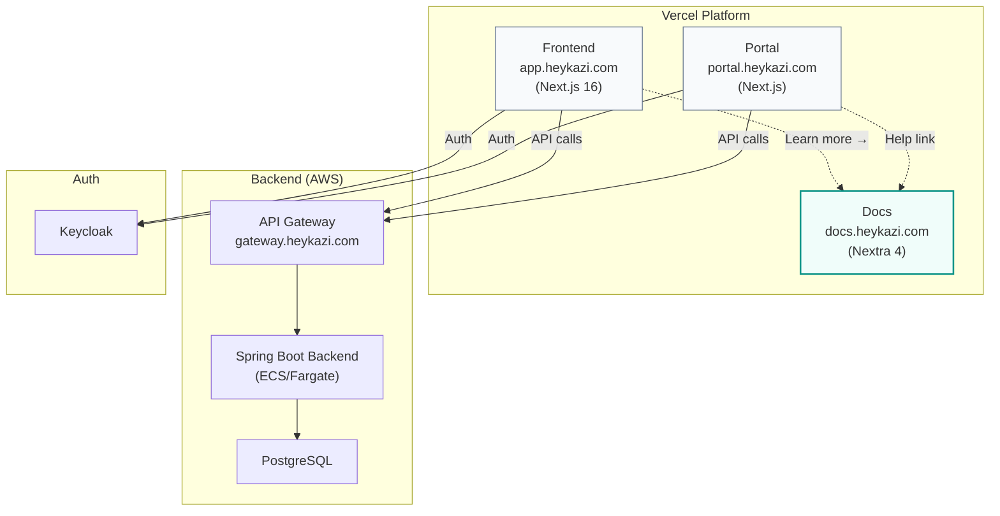

> Merge into architecture/ARCHITECTURE.md as **Section 11** or keep as standalone `architecture/phase59-user-help-documentation.md`.

# Phase 59 — User Help Documentation Site

---

## 11. Phase 59 — User Help Documentation Site

Phase 59 adds **self-service user documentation** to the HeyKazi platform — a standalone Nextra 4 documentation site at `docs.heykazi.com` containing comprehensive feature guides, getting-started walkthroughs, admin/settings references, and vertical-specific content for accounting and legal firms. Until now, the platform relies on inline contextual help (Phase 43 HelpTip tooltips, EmptyState components, GettingStartedChecklist) for user guidance. These in-context affordances are effective for micro-interactions — "what does this field mean?" — but cannot replace a searchable, browsable knowledge base where users learn workflows end-to-end, discover features they haven't tried, and find answers without contacting support.

At the 5–20 tenant scale approaching production, self-service documentation is the highest-leverage investment for keeping support costs near zero. The design is deliberately lightweight: a static Nextra site (MDX content, file-based routing, Flexsearch) deployed as a separate Vercel project. No backend, no database, no new entities. The only changes to the existing codebase are small frontend modifications to wire contextual deep-links from existing help touchpoints to specific doc pages.

**Dependencies on prior phases**:
- **Phase 43** (Contextual Help Infrastructure): `HelpTip` component, `EmptyState` component, i18n message catalog. This phase extends HelpTip with an optional `docsPath` prop and wires EmptyState's existing `secondaryLink` prop to doc pages.
- **Phase 44** (Sidebar Navigation): `UTILITY_ITEMS` array in `lib/nav-items.ts`. This phase adds a "Help" item.
- **Phase 3 / Phase 30** (Design Foundation): Font stack (Sora, IBM Plex Sans, JetBrains Mono), color system (slate palette, teal accents), dark mode. The doc site inherits these design tokens.

### What's New

| Capability | Before Phase 59 | After Phase 59 |
|---|---|---|
| User documentation | None — inline tooltips and empty states only | Comprehensive doc site at `docs.heykazi.com` with ~30 articles covering all major features |
| Deep-link from help | HelpTip shows popover with title + body only | HelpTip shows "Learn more" link to relevant doc page when `docsPath` is provided |
| Deep-link from empty states | EmptyState has `secondaryLink` prop but unused for docs | EmptyState wired with "Read the guide" links to doc pages at ~12 call sites |
| Help in navigation | No global help link | "Help" item in sidebar utility section opens doc site in new tab |
| Feature search | None outside the app | Flexsearch-powered full-text search across all documentation |
| Vertical-specific guides | Vertical profiles control UI modules only | Accounting guides (SARS deadlines, recurring engagements, compliance packs) + legal stubs |

**Out of scope**: API reference / developer documentation, changelog automation, in-app help widget or embedded iframe, search analytics or page view tracking, user comments or community features, multi-version docs, PDF export, AI-powered doc site search (the in-app AI assistant from Phase 52 covers conversational help), screenshots or embedded videos (text-only for v1), tenant-editable content.

---

### 11.1 Overview

Phase 59 is structurally unique among HeyKazi phases — it introduces no backend code, no database migrations, no new entities. The deliverables are: (1) a new standalone Nextra documentation site in the monorepo, (2) ~30 MDX articles covering the platform's feature set, and (3) targeted frontend changes to wire contextual deep-links from the existing app.

The documentation site serves three distinct audiences:
1. **New users** learning the platform (Getting Started guides)
2. **Active users** seeking reference material on specific features (Feature guides)
3. **Admins** configuring team, billing, integrations, and org settings (Admin guides)

Additionally, vertical-specific sections address the needs of accounting firms (three guides covering SARS deadlines, recurring engagements, and compliance packs) and legal firms (three stub articles noting Phase 55 features as "Coming Soon" while pointing to generic equivalents available today).

The content authorship model is platform-authored only — agents draft content by analyzing the codebase (controllers, services, frontend components, existing inline help text), and the founder reviews and edits. There is no tenant-editable content infrastructure. See [ADR-229](../adr/ADR-229-content-authorship-model.md).

---

### 11.2 Documentation Site Architecture

The doc site is a standalone Next.js project using Nextra 4, placed in a new top-level `docs/` directory. It shares no code with `frontend/` or `portal/` — it is fully independent, with its own `package.json`, `tsconfig.json`, and Tailwind configuration. This separation keeps the main app's build unaffected and allows independent deployment on a separate Vercel project. See [ADR-228](../adr/ADR-228-separate-site-vs-in-app-help.md).

#### 11.2.1 Project Structure

```
docs/
├── app/
│   ├── globals.css                   # Tailwind v4 CSS-first config with HeyKazi tokens
│   ├── layout.tsx                    # Root layout — fonts, metadata, Nextra theme wrapper
│   └── [[...mdxPath]]/
│       └── page.tsx                  # Nextra catch-all MDX page renderer
├── content/
│   ├── _meta.ts                      # Top-level navigation order
│   ├── index.mdx                     # Doc site landing page
│   ├── getting-started/
│   │   ├── _meta.ts
│   │   ├── quick-setup.mdx
│   │   ├── invite-your-team.mdx
│   │   └── first-project.mdx
│   ├── features/
│   │   ├── _meta.ts
│   │   ├── projects.mdx
│   │   ├── customers.mdx
│   │   ├── tasks.mdx
│   │   ├── time-tracking.mdx
│   │   ├── invoicing.mdx
│   │   ├── documents.mdx
│   │   ├── proposals.mdx
│   │   ├── expenses.mdx
│   │   ├── rate-cards-budgets.mdx
│   │   ├── reports.mdx
│   │   ├── resource-planning.mdx
│   │   ├── workflow-automations.mdx
│   │   ├── custom-fields-tags.mdx
│   │   ├── information-requests.mdx
│   │   ├── customer-portal.mdx
│   │   └── ai-assistant.mdx
│   ├── admin/
│   │   ├── _meta.ts
│   │   ├── team-permissions.mdx
│   │   ├── org-settings.mdx
│   │   ├── integrations.mdx
│   │   └── billing.mdx
│   └── verticals/
│       ├── _meta.ts
│       ├── accounting/
│       │   ├── _meta.ts
│       │   ├── sars-deadlines.mdx
│       │   ├── recurring-engagements.mdx
│       │   └── compliance-packs.mdx
│       └── legal/
│           ├── _meta.ts
│           ├── court-calendar.mdx
│           ├── conflict-checks.mdx
│           └── lssa-tariff.mdx
├── components/
│   └── home-cards.tsx                # Landing page feature cards (custom component)
├── public/
│   ├── logo.svg                      # HeyKazi logo
│   └── favicon.ico                   # HeyKazi favicon
├── mdx-components.tsx                # MDX component overrides (optional)
├── next.config.ts                    # Next.js config with Nextra plugin
├── package.json
├── pnpm-lock.yaml
├── postcss.config.mjs                # PostCSS with @tailwindcss/postcss
├── tsconfig.json
├── .env.local                        # NEXT_PUBLIC_APP_URL=https://app.heykazi.com
└── .gitignore
```

#### 11.2.2 Nextra 4 Integration

Nextra 4 is built on Next.js App Router (matching HeyKazi's Next.js 16 stack). It uses file-based routing where MDX files in `content/` automatically become pages. Navigation is generated from `_meta.ts` files that define ordering and display labels.

**`next.config.ts`**:
```typescript
import nextra from "nextra";

const withNextra = nextra({
  contentDirBasePath: "/",
});

export default withNextra({
  // Standard Next.js config
  reactStrictMode: true,
});
```

**`app/layout.tsx`**:
```typescript
import { Footer, Layout, Navbar } from "nextra-theme-docs";
import { Head } from "nextra/components";
import { getPageMap } from "nextra/page-map";
import type { ReactNode } from "react";
import "./globals.css";

export const metadata = {
  title: "HeyKazi Docs",
  description: "Documentation for HeyKazi — professional services management platform",
};

export default async function RootLayout({ children }: { children: ReactNode }) {
  return (
    <html lang="en" dir="ltr" suppressHydrationWarning>
      <Head />
      <body>
        <Layout
          navbar={
            <Navbar
              logo={<span className="font-display font-bold">HeyKazi Docs</span>}
              projectLink="https://app.heykazi.com"
            />
          }
          pageMap={await getPageMap()}
          docsRepositoryBase="https://github.com/heykazi/heykazi"
          footer={<Footer>© {new Date().getFullYear()} HeyKazi. All rights reserved.</Footer>}
        >
          {children}
        </Layout>
      </body>
    </html>
  );
}
```

**`app/[[...mdxPath]]/page.tsx`**:
```typescript
import { generateStaticParamsFor, importPage } from "nextra/pages";
import { useMDXComponents } from "../../mdx-components";

export const generateStaticParams = generateStaticParamsFor("mdxPath");

export async function generateMetadata(props: { params: Promise<{ mdxPath?: string[] }> }) {
  const params = await props.params;
  const { metadata } = await importPage(params.mdxPath);
  return metadata;
}

// Note: useMDXComponents is a regular function (not a React hook) exported from mdx-components.tsx.
// Calling it at module scope is the Nextra 4 convention. Verify against Nextra 4 docs if the API changes.
const Wrapper = useMDXComponents().wrapper;

export default async function Page(props: { params: Promise<{ mdxPath?: string[] }> }) {
  const params = await props.params;
  const { default: MDXContent, toc, metadata } = await importPage(params.mdxPath);
  return (
    <Wrapper toc={toc} metadata={metadata}>
      <MDXContent />
    </Wrapper>
  );
}
```

#### 11.2.3 Navigation Generation

Nextra 4 uses `_meta.ts` files to control sidebar ordering and labels. Each directory containing MDX files has a `_meta.ts` that exports a default object mapping file slugs to display names.

**`content/_meta.ts`** (top-level):
```typescript
export default {
  index: {
    title: "Home",
    type: "page",
    display: "hidden",
  },
  "getting-started": "Getting Started",
  features: "Features",
  admin: "Administration",
  verticals: "Industry Guides",
};
```

**`content/features/_meta.ts`**:
```typescript
export default {
  projects: "Projects",
  customers: "Customers",
  tasks: "Tasks",
  "time-tracking": "Time Tracking",
  invoicing: "Invoicing",
  documents: "Documents & Templates",
  proposals: "Proposals",
  expenses: "Expenses",
  "rate-cards-budgets": "Rate Cards & Budgets",
  reports: "Reports & Data Export",
  "resource-planning": "Resource Planning",
  "workflow-automations": "Workflow Automations",
  "custom-fields-tags": "Custom Fields & Tags",
  "information-requests": "Information Requests",
  "customer-portal": "Customer Portal",
  "ai-assistant": "AI Assistant",
};
```

**`content/verticals/_meta.ts`**:
```typescript
export default {
  accounting: "For Accounting Firms",
  legal: "For Legal Firms (Coming Soon)",
};
```

#### 11.2.4 Search Implementation

Nextra includes built-in search powered by Flexsearch. The search index is generated at build time from the MDX content and is included in the client bundle. At the current scale (~30 articles, ~18,000–25,000 total words), the index size is negligible (<50KB). No external search service is needed.

Search is configured by default in Nextra 4's docs theme — it renders in the navbar. No additional configuration is required beyond the standard Nextra setup.

---

### 11.3 Theming & Design Alignment

The doc site must visually feel like an extension of HeyKazi. Users clicking "Learn more" from an in-app tooltip should land on a page that shares the same typographic personality, color vocabulary, and tone — not a generic Nextra default theme.

#### 11.3.1 Font Stack

The doc site uses the same three-font stack as the main app, loaded via `next/font/google` in `app/layout.tsx`:

| Role | Font | CSS Class | Usage in Docs |
|------|------|-----------|---------------|
| Display | Sora | `font-display` | Page titles, section headings, home page hero |
| Body | IBM Plex Sans | `font-sans` | Article body text, sidebar labels, search results |
| Code | JetBrains Mono | `font-mono` | Code blocks, inline code, configuration snippets |

#### 11.3.2 Color Configuration

The doc site's Tailwind CSS v4 configuration mirrors HeyKazi's custom slate OKLCH scale and teal accents. Nextra's docs theme exposes CSS custom properties for color customization.

**`app/globals.css`** (key tokens):
```css
@import "tailwindcss";

:root {
  /* Match HeyKazi slate palette */
  --nextra-primary-hue: 175deg;       /* Teal accent */
  --nextra-primary-saturation: 60%;
}

/* Override Nextra's default heading font */
.nextra-content h1,
.nextra-content h2,
.nextra-content h3 {
  font-family: var(--font-display);
}

/* Match HeyKazi's code block styling */
code {
  font-family: var(--font-mono);
}
```

The exact values will be tuned during implementation to match the main app's visual feel. The key constraint is: teal for primary/interactive elements, slate for neutrals, Sora for headings.

#### 11.3.3 Dark Mode

Nextra's docs theme provides dark mode out of the box via a toggle in the navbar. The doc site keeps dark mode enabled (the default). Nextra's dark mode uses `prefers-color-scheme` and a manual toggle, consistent with the main app's dark mode support.

#### 11.3.4 Custom Components

The doc site uses Nextra's built-in components wherever possible:

| Component | Source | Usage |
|-----------|--------|-------|
| `Callout` | `nextra/components` | Tips, warnings, important notes |
| `Steps` | `nextra/components` | Step-by-step instructions |
| `Tabs` | `nextra/components` | Alternative workflows (e.g., "From scratch" vs "From template") |
| `Cards` | `nextra/components` | Landing page feature cards, related article links |

Only one custom component is anticipated:

- **`HomeCards`** (`components/home-cards.tsx`): A grid of feature-category cards for the doc site landing page, styled with HeyKazi's card aesthetic (lifted white cards, slate borders, teal hover accents). This cannot use Nextra's built-in `Cards` because the landing page layout requires a custom hero section above the card grid.

---

### 11.4 Content Architecture

#### 11.4.1 Content Structure

All content lives in `docs/content/` as MDX files organized by audience and topic:

```mermaid
graph TD
    ROOT["content/"]
    GS["getting-started/ (3 articles)"]
    FT["features/ (16 articles)"]
    AD["admin/ (4 articles)"]
    VT["verticals/"]
    AC["accounting/ (3 articles)"]
    LG["legal/ (3 stubs)"]

    ROOT --> GS
    ROOT --> FT
    ROOT --> AD
    ROOT --> VT
    VT --> AC
    VT --> LG

    GS --> GS1["quick-setup.mdx"]
    GS --> GS2["invite-your-team.mdx"]
    GS --> GS3["first-project.mdx"]

    FT --> FT1["projects.mdx"]
    FT --> FT2["customers.mdx"]
    FT --> FT3["tasks.mdx"]
    FT --> FT4["time-tracking.mdx"]
    FT --> FT5["invoicing.mdx"]
    FT --> FT6["... (11 more)"]

    AD --> AD1["team-permissions.mdx"]
    AD --> AD2["org-settings.mdx"]
    AD --> AD3["integrations.mdx"]
    AD --> AD4["billing.mdx"]

    AC --> AC1["sars-deadlines.mdx"]
    AC --> AC2["recurring-engagements.mdx"]
    AC --> AC3["compliance-packs.mdx"]

    LG --> LG1["court-calendar.mdx (stub)"]
    LG --> LG2["conflict-checks.mdx (stub)"]
    LG --> LG3["lssa-tariff.mdx (stub)"]
```



#### 11.4.2 Content Template

Every feature guide follows a consistent structure to set reader expectations and aid scanning:

```mdx
---
title: "Feature Name"
description: "One-sentence summary for SEO and search results"
---

# Feature Name

{1-2 paragraph overview: what it does, why you'd use it, who it's for}

## Key Concepts

{Terminology, statuses, relationships to other features. Use a table or definition list.}

## How to Use It

{Step-by-step for the primary workflow(s). Use Nextra's `<Steps>` component.}

### Creating a [Thing]

<Steps>
### Step 1 — Navigate to [Location]

{Description}

### Step 2 — Fill in details

{Description}

### Step 3 — Save

{Description}
</Steps>

## Tips & Best Practices

{2-3 practical tips as a bulleted list}

## Related Features

{Links to 2-4 related guides}
```

Getting started guides are longer (800–1,200 words) and more narrative. Vertical guides follow the same template but include a "Terminology Note" section explaining vertical-specific labels (e.g., "In the accounting profile, 'Projects' may appear as 'Engagements' if your admin has configured terminology overrides").

Legal stub articles use a simplified structure:

```mdx
---
title: "Feature Name (Coming Soon)"
description: "Brief description of the planned feature"
---

# Feature Name

<Callout type="info">
  This feature is coming soon. The sections below describe planned capabilities.
</Callout>

## What's Planned

{Brief description of the feature — 1-2 paragraphs}

## What's Available Today

{Generic features that serve as workarounds — link to relevant feature guides}
```

#### 11.4.3 Writing Guidelines

| Guideline | Detail |
|-----------|--------|
| **Tone** | Friendly, professional, task-oriented. Use "you" language. |
| **Sentence length** | Keep sentences short. One idea per sentence. |
| **Lead with intent** | Start sections with what the user wants to accomplish, then explain how. |
| **Terminology** | Use the product's UI labels exactly as they appear in the app. Reference the i18n message catalog (`lib/messages/en/`) for canonical label names. |
| **Jargon** | Avoid technical jargon. The audience is firm staff, not developers. No mentions of "API," "schema," "tenant," "JWT." |
| **Vertical awareness** | When a feature has vertical-specific terminology (e.g., "Matter" for legal, "Engagement" for accounting), note both terms: "Projects (called 'Matters' in legal firms)." |
| **Feature guide length** | 500–1,000 words |
| **Getting started length** | 800–1,200 words |
| **Vertical guide length** | 400–800 words |
| **Stub length** | 150–300 words |
| **Links** | Use relative paths within the doc site (e.g., `/features/invoicing`). Never hardcode `docs.heykazi.com` in content. |

#### 11.4.4 Content Authoring Workflow

Content is drafted by agents and reviewed by the founder. The workflow:

1. **Agent drafts**: An agent analyzes the relevant codebase area (controllers, services, frontend components, existing inline help text from `lib/messages/en/help.json` and `lib/messages/en/empty-states.json`) and writes the MDX article.
2. **Founder reviews**: The founder reads the draft, edits for accuracy and voice, and approves.
3. **Merge**: The article is committed to the monorepo and deployed via Vercel on merge to main.

This is a platform-authored model — tenants cannot contribute or customize help content. See [ADR-229](../adr/ADR-229-content-authorship-model.md).

---

### 11.5 Frontend Integration (Contextual Links)

The main app gains contextual deep-links to the doc site through three mechanisms: HelpTip extension, EmptyState wiring, and a sidebar Help link. These are small, targeted changes to existing components.

#### 11.5.1 `docsLink()` Utility Function

A new utility function in the frontend constructs doc site URLs from relative paths:

**`lib/docs.ts`**:
```typescript
const DOCS_URL =
  process.env.NEXT_PUBLIC_DOCS_URL ?? "https://docs.heykazi.com";

/**
 * Construct a full URL to a documentation page.
 * @param path - Relative path on the doc site, e.g., "/features/invoicing"
 */
export function docsLink(path: string): string {
  return `${DOCS_URL}${path}`;
}
```

The `NEXT_PUBLIC_DOCS_URL` environment variable allows overriding the base URL in development (e.g., `http://localhost:3003` when running the doc site locally). Defaults to production.

#### 11.5.2 HelpTip Component Extension

The existing `HelpTip` component (`components/help-tip.tsx`) gains an optional `docsPath` prop. When provided, a "Learn more" link renders below the popover body text.

**Current interface**:
```typescript
interface HelpTipProps {
  code: string;
}
```

**Extended interface**:
```typescript
interface HelpTipProps {
  code: string;
  docsPath?: string;  // e.g., "/features/invoicing"
}
```

**Rendering change**: When `docsPath` is provided, append a link below the body text:

```tsx
{docsPath && (
  <a
    href={docsLink(docsPath)}
    target="_blank"
    rel="noopener noreferrer"
    className="mt-2 inline-flex items-center gap-1 text-sm text-teal-600 hover:text-teal-700"
  >
    Learn more
    <ExternalLink className="size-3" />
  </a>
)}
```

The `docsLink()` import comes from `@/lib/docs`. The `ExternalLink` icon comes from `lucide-react` (already a project dependency). The link opens in a new tab and uses the same teal accent color as the app's interactive elements.

#### 11.5.3 EmptyState Component — Minor Rendering Fix Required

The existing `EmptyState` component (`components/empty-state.tsx`) already supports a `secondaryLink` prop:

```typescript
secondaryLink?: { label: string; href: string };
```

This renders a teal-colored link below the primary action. Doc site links are wired by passing `secondaryLink` at call sites — no component modification required. Example:

```tsx
<EmptyState
  icon={FileText}
  title="No invoices yet"
  description="Create your first invoice to bill a client"
  actionLabel="Create Invoice"
  onAction={() => setOpen(true)}
  secondaryLink={{
    label: "Read the invoicing guide",
    href: docsLink("/features/invoicing"),
  }}
/>
```

**Important — component change required**: The `secondaryLink.href` will be an absolute external URL (e.g., `https://docs.heykazi.com/features/invoicing`), not a Next.js route. The current `EmptyState` renders `secondaryLink` via a Next.js `<Link>` component, which works for external URLs but does not set `target="_blank"`. **Slice 59F must update `frontend/components/empty-state.tsx`** to detect external URLs (starts with `http`) and render an `<a>` tag with `target="_blank" rel="noopener noreferrer"` instead of `<Link>`. This is a 3-line change in the existing component — no `"use client"` directive needed as the check is purely JSX logic.

#### 11.5.4 Sidebar "Help" Link

Add a Help item to the `UTILITY_ITEMS` array in `lib/nav-items.ts`:

```typescript
import { Bell, Settings, BookOpen } from "lucide-react";

export const UTILITY_ITEMS: NavItem[] = [
  {
    label: "Notifications",
    href: (slug) => `/org/${slug}/notifications`,
    icon: Bell,
    exact: true,
  },
  {
    label: "Settings",
    href: (slug) => `/org/${slug}/settings/general`,
    icon: Settings,
  },
  {
    label: "Help",
    href: () => "https://docs.heykazi.com",
    icon: BookOpen,
    external: true,  // New flag — sidebar renderer opens in new tab
  },
];
```

The `NavItem` interface needs a new optional `external?: boolean` field. When `true`, the sidebar renderer uses an `<a target="_blank">` instead of a Next.js `<Link>`, and may display a small external-link indicator icon.

#### 11.5.5 Link Mapping Table

The following table maps existing in-app help touchpoints to doc site pages. Each row represents a call site where `docsPath` is added to a `HelpTip` or `secondaryLink` is wired to an `EmptyState`.

| App Location | Component | Prop | Docs Path |
|---|---|---|---|
| Projects list (empty) | `EmptyState` | `secondaryLink` | `/features/projects` |
| Customers list (empty) | `EmptyState` | `secondaryLink` | `/features/customers` |
| Tasks list (empty) | `EmptyState` | `secondaryLink` | `/features/tasks` |
| Time entries (empty) | `EmptyState` | `secondaryLink` | `/features/time-tracking` |
| Invoices list (empty) | `EmptyState` | `secondaryLink` | `/features/invoicing` |
| Documents list (empty) | `EmptyState` | `secondaryLink` | `/features/documents` |
| Proposals list (empty) | `EmptyState` | `secondaryLink` | `/features/proposals` |
| Reports page | `EmptyState` | `secondaryLink` | `/features/reports` |
| Rate cards settings | `HelpTip` | `docsPath` | `/features/rate-cards-budgets` |
| Automations (empty) | `EmptyState` | `secondaryLink` | `/features/workflow-automations` |
| Custom fields settings | `HelpTip` | `docsPath` | `/features/custom-fields-tags` |
| Information requests (empty) | `EmptyState` | `secondaryLink` | `/features/information-requests` |
| Resource planning (empty) | `EmptyState` | `secondaryLink` | `/features/resource-planning` |
| Team settings page | `HelpTip` | `docsPath` | `/admin/team-permissions` |
| Org settings page | `HelpTip` | `docsPath` | `/admin/org-settings` |
| Integrations settings | `HelpTip` | `docsPath` | `/admin/integrations` |
| Billing page | `HelpTip` | `docsPath` | `/admin/billing` |
| AI assistant (first use) | `EmptyState` | `secondaryLink` | `/features/ai-assistant` |
| Getting started checklist | `HelpTip` | `docsPath` | `/getting-started/quick-setup` |
| Customer portal contacts | `HelpTip` | `docsPath` | `/features/customer-portal` |

---

### 11.6 Deployment Architecture

The doc site runs as a separate Vercel project, independent from the main frontend and portal deployments. This mirrors the existing pattern where `frontend/` and `portal/` are separate Vercel projects within the same Git repository.

#### 11.6.1 Deployment Diagram



The doc site has **no backend dependency**. It is a purely static site (SSG) — all pages are pre-rendered at build time. It does not call any API, does not require authentication, and does not access the database.

#### 11.6.2 Vercel Project Configuration

The doc site is configured as a separate Vercel project via the Vercel dashboard (consistent with the existing frontend and portal approach — no `vercel.json` in the repo):

| Setting | Value |
|---------|-------|
| **Root Directory** | `docs/` |
| **Framework Preset** | Next.js |
| **Build Command** | `pnpm build` (or `next build`) |
| **Output Directory** | `.next` (default) |
| **Node.js Version** | 22.x |
| **Install Command** | `pnpm install` |

#### 11.6.3 Domain Setup

- **Production**: `docs.heykazi.com` — CNAME to Vercel
- **Preview**: Vercel preview deployments on PRs (e.g., `docs-heykazi-<hash>.vercel.app`)

#### 11.6.4 Environment Variables

| Variable | Value | Purpose |
|----------|-------|---------|
| `NEXT_PUBLIC_APP_URL` | `https://app.heykazi.com` | "Back to App" link in header |

The doc site needs minimal environment configuration because it has no backend integration.

#### 11.6.5 Local Development

Developers run the doc site locally for content preview:

```bash
cd docs/
pnpm install
pnpm dev          # Starts on port 3003 (to avoid conflict with frontend:3000, portal:3002)
```

The frontend can point to the local doc site by setting `NEXT_PUBLIC_DOCS_URL=http://localhost:3003` in `.env.local`.

---

### 11.7 Content Inventory

The full list of articles to write, ordered by priority. P0 articles are required for launch. P1 articles should ship within the first iteration. P2 articles are desirable but can follow.

#### Getting Started (3 articles)

| File Path | Title | Est. Words | Dependencies | Priority |
|-----------|-------|-----------|--------------|----------|
| `getting-started/quick-setup.mdx` | Quick Setup | 1,000 | Phase 43 (getting started checklist), Phase 44 (sidebar), org settings | P0 |
| `getting-started/invite-your-team.mdx` | Invite Your Team | 800 | Phase 36/46 (invitations), Phase 41 (roles/capabilities) | P0 |
| `getting-started/first-project.mdx` | Your First Project | 1,200 | Phase 4 (projects), Phase 5 (time tracking), Phase 4 (customers) | P0 |

#### Features (16 articles)

| File Path | Title | Est. Words | Dependencies | Priority |
|-----------|-------|-----------|--------------|----------|
| `features/projects.mdx` | Projects | 900 | Phase 4, Phase 16 (templates), Phase 29 (lifecycle) | P0 |
| `features/customers.mdx` | Customers | 800 | Phase 4, Phase 14 (lifecycle), Phase 33 (intake) | P0 |
| `features/tasks.mdx` | Tasks | 800 | Phase 4, Phase 18 (detail sheet), Phase 29 (lifecycle), Phase 11 (views) | P0 |
| `features/time-tracking.mdx` | Time Tracking | 900 | Phase 5, Phase 48 (bulk entry), Phase 30 (calendar) | P0 |
| `features/invoicing.mdx` | Invoicing | 1,000 | Phase 10, Phase 40 (billing runs), Phase 26 (tax), Phase 25 (payments) | P0 |
| `features/documents.mdx` | Documents & Templates | 900 | Phase 12, Phase 42 (DOCX), Phase 27 (clauses), Phase 28 (e-signing) | P1 |
| `features/proposals.mdx` | Proposals | 700 | Phase 32, Phase 33 (engagement orchestration) | P1 |
| `features/expenses.mdx` | Expenses | 500 | Expense entities, invoice integration | P1 |
| `features/rate-cards-budgets.mdx` | Rate Cards & Budgets | 800 | Phase 8 (rates, budgets, profitability) | P1 |
| `features/reports.mdx` | Reports & Data Export | 700 | Phase 19 (reports), Phase 8 (profitability dashboards) | P1 |
| `features/resource-planning.mdx` | Resource Planning | 700 | Phase 38 (allocations, capacity) | P1 |
| `features/workflow-automations.mdx` | Workflow Automations | 800 | Phase 37 (automation engine, triggers, actions) | P1 |
| `features/custom-fields-tags.mdx` | Custom Fields & Tags | 700 | Phase 11 (fields, tags, views), Phase 23 (auto-apply) | P2 |
| `features/information-requests.mdx` | Information Requests | 600 | Phase 34 (request templates, portal upload) | P2 |
| `features/customer-portal.mdx` | Customer Portal | 700 | Phase 7, portal app | P1 |
| `features/ai-assistant.mdx` | AI Assistant | 600 | Phase 52 (BYOAK Claude integration) | P2 |

#### Administration (4 articles)

| File Path | Title | Est. Words | Dependencies | Priority |
|-----------|-------|-----------|--------------|----------|
| `admin/team-permissions.mdx` | Team & Permissions | 800 | Phase 41 (custom roles, capabilities) | P0 |
| `admin/org-settings.mdx` | Organization Settings | 700 | Phase 48 (terminology), org settings entity | P1 |
| `admin/integrations.mdx` | Integrations | 600 | Phase 21 (BYOAK), Phase 24 (email), Phase 25 (payments) | P1 |
| `admin/billing.mdx` | Billing & Subscription | 700 | Phase 57 (subscription lifecycle, PayFast) | P0 |

#### Verticals — Accounting (3 articles)

| File Path | Title | Est. Words | Dependencies | Priority |
|-----------|-------|-----------|--------------|----------|
| `verticals/accounting/sars-deadlines.mdx` | SARS Deadline Management | 700 | Phase 51 (DeadlineTypeRegistry, filing statuses) | P1 |
| `verticals/accounting/recurring-engagements.mdx` | Recurring Engagements | 600 | Phase 16 (schedules), Phase 51 (post-schedule actions) | P1 |
| `verticals/accounting/compliance-packs.mdx` | Compliance Packs | 500 | Phase 14 (checklists, onboarding) | P1 |

#### Verticals — Legal (3 stubs)

| File Path | Title | Est. Words | Dependencies | Priority |
|-----------|-------|-----------|--------------|----------|
| `verticals/legal/court-calendar.mdx` | Court Calendar (Coming Soon) | 200 | Phase 55 (not yet built) | P2 |
| `verticals/legal/conflict-checks.mdx` | Conflict Checks (Coming Soon) | 200 | Phase 55 (not yet built) | P2 |
| `verticals/legal/lssa-tariff.mdx` | LSSA Tariff Billing (Coming Soon) | 200 | Phase 55 (not yet built) | P2 |

#### Home Page

| File Path | Title | Est. Words | Dependencies | Priority |
|-----------|-------|-----------|--------------|----------|
| `content/index.mdx` | HeyKazi Documentation (Home) | 300 | All sections (links to category pages) | P0 |

**Totals**: 30 content files (29 articles + 1 home page). ~18,900 estimated words. 11 P0 (3 getting started + 5 features + 2 admin + 1 home), 11 P1, 8 P2.

---

### 11.8 Implementation Guidance

#### 11.8.1 Frontend Changes (Existing Files)

| File | Change |
|------|--------|
| `frontend/components/help-tip.tsx` | Add optional `docsPath` prop. When provided, render "Learn more" link below body text using `docsLink()`. Import `ExternalLink` icon. |
| `frontend/components/empty-state.tsx` | Update `secondaryLink` rendering to detect external URLs (`href.startsWith("http")`) and render `<a target="_blank">` instead of `<Link>`. |
| `frontend/lib/nav-items.ts` | Add `external?: boolean` to `NavItem` interface. Add Help item to `UTILITY_ITEMS` with `BookOpen` icon and `external: true`. |
| `frontend/components/desktop-sidebar.tsx` | Update sidebar item rendering to handle `external: true` — render `<a target="_blank">` instead of `<Link>`. |
| `frontend/components/mobile-sidebar.tsx` | Same external link handling as desktop sidebar. |
| ~12 page files with EmptyState | Add `secondaryLink` prop with `docsLink()` call at each empty state call site (projects, customers, tasks, time entries, invoices, documents, proposals, automations, information requests, resource planning, reports, AI assistant). |
| ~7 pages/components with HelpTip | Add `docsPath` prop to existing HelpTip instances (rate cards settings, custom fields settings, team settings, org settings, integrations settings, billing page, getting started checklist). |

#### 11.8.2 New Files (Frontend)

| File | Purpose |
|------|---------|
| `frontend/lib/docs.ts` | `docsLink(path)` utility function + `NEXT_PUBLIC_DOCS_URL` resolution |

#### 11.8.3 New Files (Doc Site)

| File | Purpose |
|------|---------|
| `docs/package.json` | Project manifest — dependencies: `next`, `nextra`, `nextra-theme-docs`, `tailwindcss`, `@tailwindcss/postcss` |
| `docs/next.config.ts` | Next.js config with Nextra plugin |
| `docs/tsconfig.json` | TypeScript config |
| `docs/postcss.config.mjs` | PostCSS with Tailwind plugin |
| `docs/app/globals.css` | Tailwind v4 CSS-first config with HeyKazi brand tokens |
| `docs/app/layout.tsx` | Root layout with fonts, Nextra theme, header/footer |
| `docs/app/[[...mdxPath]]/page.tsx` | Nextra catch-all MDX page renderer |
| `docs/mdx-components.tsx` | MDX component overrides |
| `docs/content/_meta.ts` | Top-level navigation order |
| `docs/content/index.mdx` | Home page |
| `docs/content/getting-started/_meta.ts` | Getting started nav order |
| `docs/content/features/_meta.ts` | Features nav order |
| `docs/content/admin/_meta.ts` | Admin nav order |
| `docs/content/verticals/_meta.ts` | Verticals nav order |
| `docs/content/verticals/accounting/_meta.ts` | Accounting nav order |
| `docs/content/verticals/legal/_meta.ts` | Legal nav order |
| `docs/content/**/*.mdx` | 29 MDX content files (see Content Inventory) |
| `docs/components/home-cards.tsx` | Landing page feature category cards |
| `docs/public/logo.svg` | HeyKazi logo |
| `docs/public/favicon.ico` | Favicon |

#### 11.8.4 Testing Strategy

This phase has no backend tests. The testing strategy covers build verification, link integrity, and content quality.

| Test Category | Method | What It Verifies |
|---|---|---|
| **Doc site build** | `cd docs && pnpm build` exits 0 | All MDX files parse, no broken imports, search index generates |
| **Internal link integrity** | Build output + manual check (or `next build` warnings) | No broken cross-references between doc pages |
| **HelpTip docsPath rendering** | Vitest unit test | HelpTip renders "Learn more" link when `docsPath` is provided, does not render when omitted |
| **EmptyState external link** | Vitest unit test | EmptyState renders `<a target="_blank">` for external URLs in `secondaryLink` |
| **Sidebar Help item** | Vitest unit test | UTILITY_ITEMS contains Help item, marked as external |
| **docsLink() utility** | Vitest unit test | Constructs correct URLs with default and custom `NEXT_PUBLIC_DOCS_URL` |
| **Content linting** | Manual review (founder) | Accuracy, tone, completeness, terminology consistency |

---

### 11.9 Capability Slices

Phase 59 is divided into 6 independently deliverable slices. Each slice can be implemented, tested, and merged without depending on incomplete work from other slices (except where noted). The slices are ordered for incremental value delivery — Slice A delivers a working (empty) doc site, Slice B adds core content, and later slices layer on more content and frontend integration.

#### Slice 59A — Doc Site Scaffold & Home Page

**Scope**: Create the `docs/` project with Nextra 4, configure theming to match HeyKazi branding, build the home page, deploy to Vercel.

**Deliverables**:
- `docs/` project scaffold (package.json, next.config.ts, tsconfig.json, postcss, Tailwind, layout, catch-all page)
- Nextra theme configuration (fonts, colors, dark mode, header, footer)
- Home page (`content/index.mdx`) with hero section, category cards, quick links
- Top-level `_meta.ts` and section `_meta.ts` files (empty sections are fine — they'll show in nav but have no content)
- `public/` assets (logo, favicon)
- Vercel project configuration documentation

**Dependencies**: None (standalone)

**Test expectations**: `pnpm build` exits 0. Home page renders with correct branding. Navigation sidebar shows all section headings. Search bar is functional (empty index is fine).

---

#### Slice 59B — Getting Started & Core Feature Guides (P0 Content)

**Scope**: Write 8 of the 11 P0 articles: 3 getting started guides + 5 core feature guides (projects, customers, tasks, time tracking, invoicing). The remaining 3 P0 articles (home page in 59A, team-permissions and billing in 59C) are handled in their respective slices.

**Deliverables**:
- `getting-started/quick-setup.mdx`
- `getting-started/invite-your-team.mdx`
- `getting-started/first-project.mdx`
- `features/projects.mdx`
- `features/customers.mdx`
- `features/tasks.mdx`
- `features/time-tracking.mdx`
- `features/invoicing.mdx`

**Dependencies**: Slice 59A (doc site must exist)

**Test expectations**: `pnpm build` exits 0. All 8 articles render without errors. Internal cross-links between articles resolve. Search returns results for key terms (e.g., "invoice," "time entry," "project").

---

#### Slice 59C — Administration & Billing Guides (P0 + P1 Content)

**Scope**: Write the 4 admin guides + the billing/subscription guide. These are high-priority for launch because admins need self-service answers for team management and billing questions.

**Deliverables**:
- `admin/team-permissions.mdx`
- `admin/org-settings.mdx`
- `admin/integrations.mdx`
- `admin/billing.mdx`

**Dependencies**: Slice 59A (doc site must exist)

**Test expectations**: `pnpm build` exits 0. All 4 articles render. Cross-links to feature guides (from Slice 59B) resolve if both slices are merged.

---

#### Slice 59D — Remaining Feature Guides (P1 + P2 Content)

**Scope**: Write the remaining 11 feature guides not covered in Slice 59B. This includes documents, proposals, expenses, rate cards, reports, resource planning, automations, custom fields, information requests, customer portal, and AI assistant.

**Deliverables**:
- `features/documents.mdx`
- `features/proposals.mdx`
- `features/expenses.mdx`
- `features/rate-cards-budgets.mdx`
- `features/reports.mdx`
- `features/resource-planning.mdx`
- `features/workflow-automations.mdx`
- `features/custom-fields-tags.mdx`
- `features/information-requests.mdx`
- `features/customer-portal.mdx`
- `features/ai-assistant.mdx`

**Dependencies**: Slice 59A (doc site must exist)

**Test expectations**: `pnpm build` exits 0. All 11 articles render. Cross-links resolve.

---

#### Slice 59E — Vertical Guides (Accounting + Legal Stubs)

**Scope**: Write the 3 accounting-specific guides and 3 legal stub articles.

**Deliverables**:
- `verticals/accounting/sars-deadlines.mdx`
- `verticals/accounting/recurring-engagements.mdx`
- `verticals/accounting/compliance-packs.mdx`
- `verticals/legal/court-calendar.mdx` (stub)
- `verticals/legal/conflict-checks.mdx` (stub)
- `verticals/legal/lssa-tariff.mdx` (stub)

**Dependencies**: Slice 59A (doc site must exist)

**Test expectations**: `pnpm build` exits 0. Legal stubs display "Coming Soon" callout. Accounting guides link to relevant generic feature guides.

---

#### Slice 59F — Frontend Integration (Contextual Deep-Links)

**Scope**: Implement all frontend changes — HelpTip extension, EmptyState external link handling, docsLink utility, sidebar Help item, and wire ~20 link mappings across the app.

**Deliverables**:
- `frontend/lib/docs.ts` — `docsLink()` utility
- `frontend/components/help-tip.tsx` — add `docsPath` prop
- `frontend/components/empty-state.tsx` — external URL detection for `secondaryLink`
- `frontend/lib/nav-items.ts` — `external` flag on `NavItem`, Help item in `UTILITY_ITEMS`
- `frontend/components/desktop-sidebar.tsx` — external link rendering
- `frontend/components/mobile-sidebar.tsx` — external link rendering
- ~12 EmptyState call sites wired with `secondaryLink`
- ~7 HelpTip instances wired with `docsPath`
- Vitest tests for `docsLink()`, HelpTip extension, EmptyState external link, sidebar Help item

**Dependencies**: Slices 59A through 59E should be merged first so the doc pages exist when links are deployed. However, this slice can be developed in parallel — the links will simply point to pages that don't exist yet until the content slices merge.

**Test expectations**: All existing frontend tests pass. New Vitest tests pass for `docsLink()`, HelpTip, EmptyState, and sidebar. `pnpm build` (frontend) exits 0.

---

### 11.10 ADR Index

| ADR | Title | Key Decision |
|-----|-------|--------------|
| [ADR-227](../adr/ADR-227-nextra-over-alternatives.md) | Nextra over Alternatives | Nextra 4 chosen for doc site framework — App Router compatibility, MDX in monorepo, Vercel deployment, zero SaaS cost |
| [ADR-228](../adr/ADR-228-separate-site-vs-in-app-help.md) | Separate Site vs In-App Help | Standalone doc site at `docs.heykazi.com` rather than embedded help widget — complements existing in-app AI assistant and inline tooltips |
| [ADR-229](../adr/ADR-229-content-authorship-model.md) | Content Authorship Model | Platform-authored only (not tenant-editable) — one well-maintained content set at 5–20 tenant scale |
