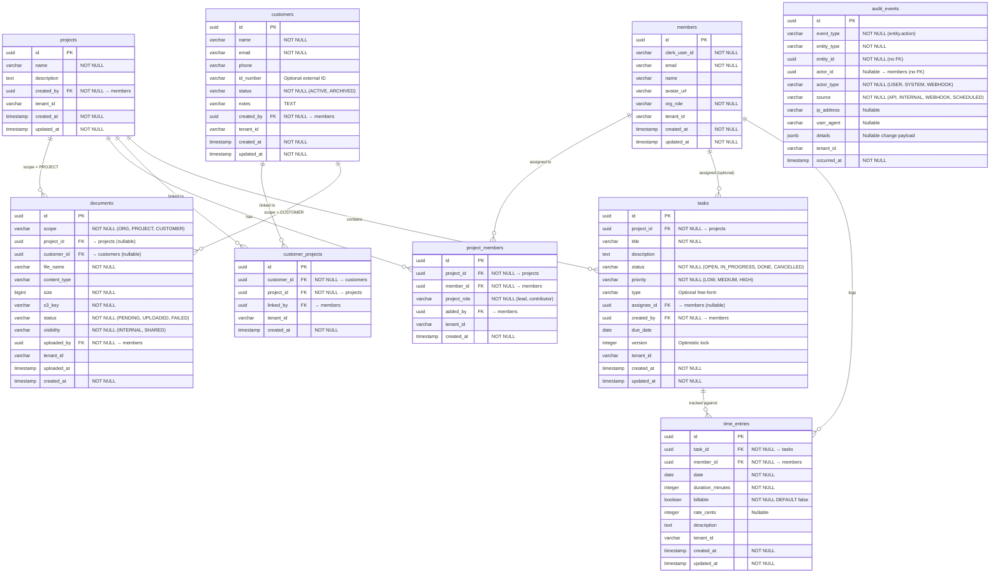
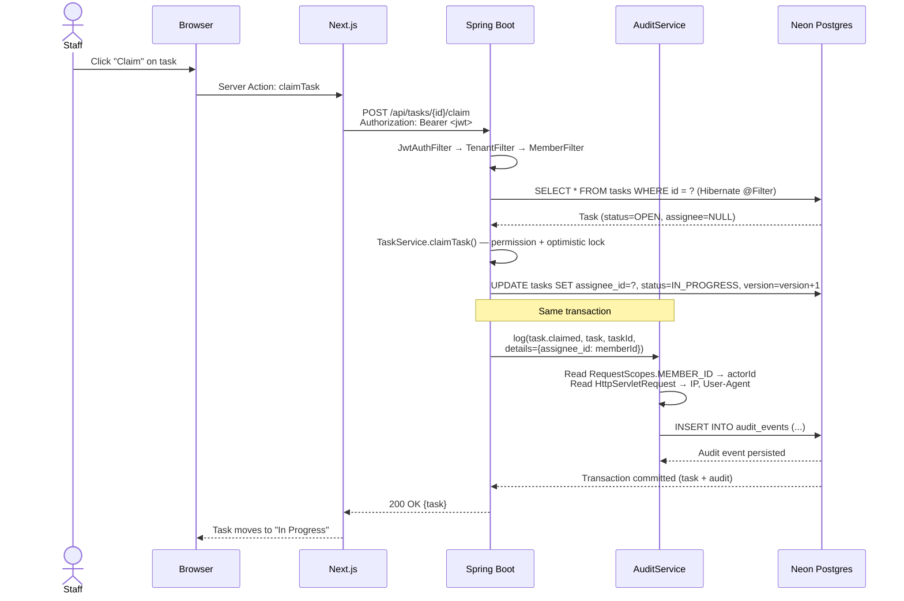
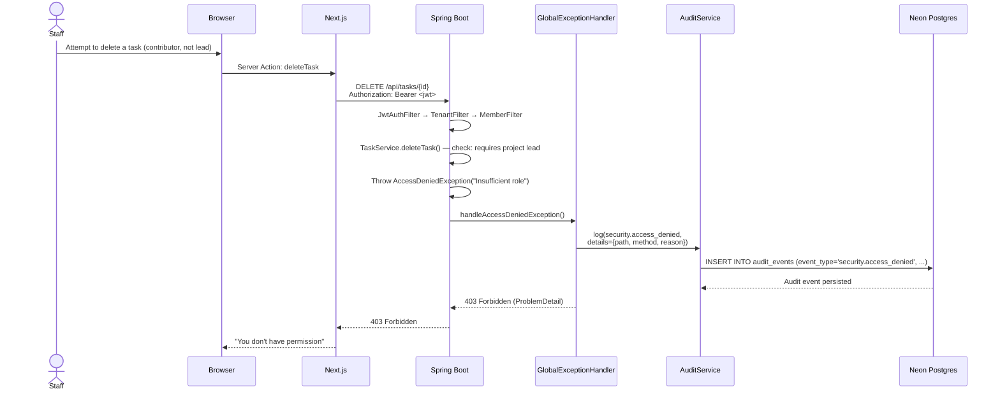
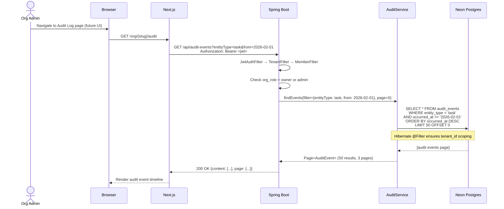

# Phase 6 — Audit & Compliance Foundations

> Merge into `ARCHITECTURE.md` as **Section 12**. ADR files go in `adr/`.

---

## 12. Phase 6 — Audit & Compliance Foundations

Phase 6 adds **backend-only audit trail and compliance infrastructure** to the platform. It introduces a generic `AuditEvent` entity, a service abstraction for recording events, and a retention/integrity strategy — all scoped within the existing multi-tenant model. No new UI is added in this phase; the infrastructure is designed for future dashboards, SIEM integration, and compliance reporting.

This phase is intentionally **domain-agnostic**: the audit model works identically for legal, consulting, accounting, or any other vertical running on the platform. It captures *who did what, to what entity, when, and from where* — without encoding business-specific semantics.

**What's new in Phase 6** (relative to Phase 5):

| Capability | Phase 5 (existing) | Phase 6 (this phase) |
|------------|--------------------|-----------------------|
| Audit trail | — | Generic `AuditEvent` entity, append-only log of domain and security events |
| Domain event logging | — | Automatic capture of create/update/delete on all tenant-scoped entities |
| Security event logging | — | Permission-denied responses, sensitive document access |
| Retention policy | — | Configurable retention periods, soft-purge maintenance job concept |
| Integrity verification | — | Append-only model, hash-chain concept for tamper-evidence (design only) |
| Audit query API | — | Internal endpoints for platform operators; tenant-scoped endpoint for future org-admin use |
| Extension points | — | `AuditService` abstraction for future log forwarding (ELK, OpenSearch, etc.) |

**Out of scope**: UI dashboards, full SIEM integration, onboarding redesign, GDPR/ISO compliance frameworks, real-time event streaming.

---

### 12.1 Domain Model

#### 12.1.1 AuditEvent (New Entity)

An AuditEvent records a single auditable action performed on a tenant-scoped entity. Events are **append-only** — once written, rows are never updated. The model is deliberately flat (no nested entities or foreign keys to audited entities) to decouple the audit log from schema evolution of the audited tables.

| Field | Type | Constraints | Notes |
|-------|------|-------------|-------|
| `id` | UUID | PK, generated | |
| `event_type` | VARCHAR(100) | NOT NULL | Normalized action: `{entity}.{action}` (e.g., `task.created`, `document.accessed`) |
| `entity_type` | VARCHAR(50) | NOT NULL | Audited entity kind: `project`, `customer`, `task`, `time_entry`, `document`, `member` |
| `entity_id` | UUID | NOT NULL | ID of the affected entity (not a FK — entity may be deleted later) |
| `actor_id` | UUID | Nullable | Member ID of the acting user; NULL for system-initiated events |
| `actor_type` | VARCHAR(20) | NOT NULL, default `USER` | `USER`, `SYSTEM`, `WEBHOOK` — distinguishes human vs automated actions |
| `source` | VARCHAR(30) | NOT NULL | Origin of the action: `API`, `INTERNAL`, `WEBHOOK`, `SCHEDULED` |
| `ip_address` | VARCHAR(45) | Nullable | Client IP (IPv4 or IPv6); NULL for non-HTTP sources |
| `user_agent` | VARCHAR(500) | Nullable | Truncated User-Agent header; NULL for non-HTTP sources |
| `details` | JSONB | Nullable | Key field changes only — e.g., `{"status": {"from": "OPEN", "to": "DONE"}}`. Never contains secrets, tokens, or full document contents |
| `tenant_id` | VARCHAR(255) | | Shared-schema discriminator (same pattern as all tenant entities) |
| `occurred_at` | TIMESTAMPTZ | NOT NULL | When the event happened (application timestamp, not DB default) |

**Design decisions**:

- **No FK to audited entities**: `entity_id` is a UUID stored as-is. This means audit records survive entity deletion — you can always see that a project was deleted even after the row is gone. It also avoids cascading deletes from the audited table into the audit log.
- **`event_type` as string, not enum**: Using a string allows new event types to be added without schema changes. The naming convention `{entity}.{action}` is enforced by the `AuditService` abstraction, not the database. See [ADR-026](../adr/ADR-026-audit-event-granularity.md).
- **`details` as JSONB, not TEXT**: JSONB enables future indexed queries (e.g., "find all events where `details->>'status'->>'to' = 'DONE'`") without full-text scanning. It also enforces valid JSON at the DB level.
- **`actor_type` + `actor_id` separation**: When Clerk webhooks trigger provisioning, the actor is `WEBHOOK` with no member ID. When scheduled maintenance runs, the actor is `SYSTEM`. This avoids nullable-member-id ambiguity.
- **PII minimization**: IP addresses and user agents are the only request metadata stored. No authorization headers, JWT tokens, request bodies, or response bodies are captured. See [ADR-028](../adr/ADR-028-audit-integrity-approach.md).

**Indexes**:

| Index | Columns | Rationale |
|-------|---------|-----------|
| PK | `id` | Default UUID PK |
| `idx_audit_entity` | `(entity_type, entity_id)` | "Show me all events for task X" |
| `idx_audit_actor` | `(actor_id)` WHERE `actor_id IS NOT NULL` | "Show me all actions by member Y" |
| `idx_audit_occurred` | `(occurred_at DESC)` | Time-range queries, retention purge |
| `idx_audit_type_time` | `(event_type, occurred_at DESC)` | "Show me all `document.accessed` events this week" |
| `idx_audit_tenant_time` | `(tenant_id, occurred_at DESC)` | Shared-schema: tenant-scoped time-range queries |

**No optimistic locking**: Audit events are write-once, never updated. No `version` column needed.

**No `updated_at`**: Events are immutable. Only `occurred_at` is recorded.

#### 12.1.2 AuditHashCheckpoint (Future — Design Only)

For tamper-evidence, batches of audit events can be periodically hashed into checkpoints. **This entity is not implemented in Phase 6** — it is documented here so the `audit_events` table design supports future hashing without schema changes.

| Field | Type | Constraints | Notes |
|-------|------|-------------|-------|
| `id` | UUID | PK, generated | |
| `period_start` | TIMESTAMPTZ | NOT NULL | Start of the hashed time window |
| `period_end` | TIMESTAMPTZ | NOT NULL | End of the hashed time window |
| `event_count` | INTEGER | NOT NULL | Number of events in the window |
| `hash` | VARCHAR(128) | NOT NULL | SHA-256 of concatenated `(id, event_type, entity_type, entity_id, occurred_at)` for all events in the window |
| `previous_hash` | VARCHAR(128) | Nullable | Hash of the previous checkpoint (chain) |
| `tenant_id` | VARCHAR(255) | | Shared-schema discriminator |
| `created_at` | TIMESTAMPTZ | NOT NULL | |

**How it works**: A scheduled job runs daily/weekly, selects all `audit_events` in the time window ordered by `occurred_at, id`, hashes a canonical representation, and stores the checkpoint. To verify integrity, re-hash the events and compare to the stored checkpoint. The `previous_hash` field chains checkpoints for sequential tamper detection. See [ADR-028](../adr/ADR-028-audit-integrity-approach.md) for the full design rationale.

#### 12.1.3 Updated ER Diagram

The following diagram shows the complete tenant-schema entity relationships after Phase 6. The `audit_events` entity has no FKs to other tables — it references them by `entity_type` + `entity_id` only.



**Note**: `audit_events` has **no relationship lines** to other entities in the diagram. This is intentional — audit events reference entities by `(entity_type, entity_id)` without database-level foreign keys. This ensures audit records are never cascaded on delete and survive schema evolution of audited tables.

---

### 12.2 Storage and Multi-Tenant Strategy

See [ADR-025](../adr/ADR-025-audit-storage-location.md) for the full decision record.

**Decision**: Audit events are stored **in each tenant's schema** using the same pattern as all other tenant-scoped entities. The `audit_events` table is created by a tenant migration (`V14__create_audit_events.sql`) and is subject to the same Hibernate `@Filter`, `TenantAware` listener, and RLS policies as every other tenant entity.

#### 12.2.1 Why Tenant-Local (Not Global)

The platform currently operates two tenancy modes:

1. **Dedicated schema** (`tenant_<hash>`): Each org has its own schema. The `audit_events` table lives in the org's schema alongside `projects`, `tasks`, etc. Tenant isolation is automatic via `SET search_path`.
2. **Shared schema** (`tenant_shared`): Multiple Starter-tier orgs share one schema. The `audit_events` table has a `tenant_id` column filtered by Hibernate `@Filter` and PostgreSQL RLS — identical to every other entity.

Placing audit data **in-tenant** means:

- **Zero new access patterns**: The existing `TenantFilter` → `TenantFilterTransactionManager` → Hibernate `@Filter` pipeline handles tenant scoping automatically. No new filter chain, no new connection provider, no special query logic.
- **Data isolation by default**: An org's audit data is physically separated (dedicated) or logically separated (shared) using the same mechanism as their business data. No risk of cross-tenant leakage through a shared global table.
- **Consistent backup/restore**: If an org's schema is backed up or restored, their audit trail comes with it.

**Trade-off**: Platform-wide operational queries (e.g., "show all permission-denied events across all tenants in the last hour") require iterating over tenant schemas. This is acceptable because:

- Platform operators already have internal endpoints that iterate over tenants (e.g., `TenantMigrationRunner`).
- Cross-tenant security monitoring is a Phase 7+ concern that will likely use a log-forwarding approach (CloudWatch, OpenSearch) rather than direct DB queries.
- For the Starter tier (shared schema), a single query on `tenant_shared.audit_events` covers all Starter orgs.

#### 12.2.2 Schema Layout

```
tenant_shared/                    tenant_abc123/
├── projects                      ├── projects
├── members                       ├── members
├── tasks                         ├── tasks
├── time_entries                  ├── time_entries
├── documents                     ├── documents
├── customers                     ├── customers
├── customer_projects             ├── customer_projects
├── project_members               ├── project_members
└── audit_events  ← NEW          └── audit_events  ← NEW
```

The `audit_events` table has the same lifecycle as all other tenant tables: created by `V14`, migrated by Flyway on tenant provisioning, subject to RLS in shared schema.

---

### 12.3 What We Log — Domain and Security Events

See [ADR-026](../adr/ADR-026-audit-event-granularity.md) for the decision on which entities and actions are logged.

#### 12.3.1 Domain Events (Phase 6 Minimum Set)

All domain events follow the pattern `{entity_type}.{action}`. The `details` JSONB field captures key field changes where relevant.

| Entity | Event Type | Trigger | Details Example |
|--------|-----------|---------|-----------------|
| **Project** | `project.created` | `ProjectService.createProject()` | `{"name": "Acme Audit"}` |
| | `project.updated` | `ProjectService.updateProject()` | `{"name": {"from": "Old", "to": "New"}}` |
| | `project.deleted` | `ProjectService.deleteProject()` | — |
| **Customer** | `customer.created` | `CustomerService.createCustomer()` | `{"name": "Jane Doe", "email": "jane@..."}` |
| | `customer.updated` | `CustomerService.updateCustomer()` | `{"status": {"from": "ACTIVE", "to": "ARCHIVED"}}` |
| | `customer.archived` | `CustomerService.archiveCustomer()` | — |
| | `customer.linked` | `CustomerProjectService.linkCustomer()` | `{"project_id": "uuid"}` |
| | `customer.unlinked` | `CustomerProjectService.unlinkCustomer()` | `{"project_id": "uuid"}` |
| **Task** | `task.created` | `TaskService.createTask()` | `{"title": "Review contract", "project_id": "uuid"}` |
| | `task.updated` | `TaskService.updateTask()` | `{"status": {"from": "OPEN", "to": "IN_PROGRESS"}}` |
| | `task.claimed` | `TaskService.claimTask()` | `{"assignee_id": "uuid"}` |
| | `task.released` | `TaskService.releaseTask()` | `{"previous_assignee_id": "uuid"}` |
| | `task.deleted` | `TaskService.deleteTask()` | — |
| **TimeEntry** | `time_entry.created` | `TimeEntryService.createTimeEntry()` | `{"task_id": "uuid", "duration_minutes": 90, "billable": true}` |
| | `time_entry.updated` | `TimeEntryService.updateTimeEntry()` | `{"duration_minutes": {"from": 60, "to": 90}}` |
| | `time_entry.deleted` | `TimeEntryService.deleteTimeEntry()` | — |
| **Document** | `document.created` | `DocumentService.initUpload()` | `{"scope": "PROJECT", "file_name": "report.pdf"}` |
| | `document.uploaded` | `DocumentService.confirmUpload()` | — |
| | `document.deleted` | `DocumentService.deleteDocument()` | `{"file_name": "report.pdf"}` |
| | `document.accessed` | `DocumentService.getDownloadUrl()` | `{"scope": "CUSTOMER", "file_name": "id_proof.pdf"}` |
| | `document.visibility_changed` | `DocumentService.updateVisibility()` | `{"visibility": {"from": "INTERNAL", "to": "SHARED"}}` |
| **Member** | `member.synced` | `MemberSyncService.syncMembers()` | `{"action": "added", "email": "john@..."}` |
| | `member.removed` | `MemberSyncService.syncMembers()` | `{"email": "john@..."}` |
| | `member.role_changed` | `MemberSyncService.syncMembers()` | `{"org_role": {"from": "member", "to": "admin"}}` |
| **ProjectMember** | `project_member.added` | `ProjectMemberService.addMember()` | `{"project_id": "uuid", "role": "contributor"}` |
| | `project_member.removed` | `ProjectMemberService.removeMember()` | `{"project_id": "uuid"}` |
| | `project_member.role_changed` | `ProjectMemberService.updateRole()` | `{"role": {"from": "contributor", "to": "lead"}}` |

#### 12.3.2 Security Events (Phase 6 Minimum Set)

Security events use the `security.` prefix instead of an entity name.

| Event Type | Trigger | Details Example |
|-----------|---------|-----------------|
| `security.access_denied` | `GlobalExceptionHandler` catches `AccessDeniedException` / 403 | `{"path": "/api/tasks/uuid", "method": "DELETE", "reason": "insufficient_role"}` |
| `security.document_accessed` | `DocumentService.getDownloadUrl()` for customer-scoped docs | `{"document_id": "uuid", "scope": "CUSTOMER", "customer_id": "uuid"}` |
| `security.auth_failed` | `JwtAuthFilter` rejects invalid/expired token | `{"reason": "expired_token", "path": "/api/projects"}` |

**What we deliberately do NOT log**:
- Successful authentication (this is Clerk's responsibility; Clerk provides its own audit logs).
- Read-only list/get operations on non-sensitive entities (too noisy; not compliance-relevant).
- Request/response bodies (PII risk, storage cost).
- JWT token contents (secrets).
- Passwords, API keys, or Clerk webhook payloads.

#### 12.3.3 How Events Are Captured

See [ADR-029](../adr/ADR-029-audit-logging-abstraction.md) for why we use explicit service calls over AOP.

**Approach**: Explicit `AuditService.log()` calls in service methods. Each service method that performs a mutating operation calls `AuditService.log()` after the successful mutation, within the same transaction.

```java
// Conceptual — TaskService.claimTask()
public Task claimTask(UUID taskId) {
    Task task = taskRepository.findOneById(taskId)
        .orElseThrow(() -> new ResourceNotFoundException("Task", taskId));

    // ... permission checks, optimistic lock, etc.
    task.claim(currentMemberId);
    Task saved = taskRepository.save(task);

    auditService.log(AuditEventBuilder.builder()
        .eventType("task.claimed")
        .entityType("task")
        .entityId(taskId)
        .details(Map.of("assignee_id", currentMemberId.toString()))
        .build());

    return saved;
}
```

**Why explicit over AOP**:

1. **Granularity**: AOP on `@Transactional` methods can't distinguish between a status change and a title change on the same `updateTask()` call. Explicit calls know exactly what changed.
2. **Detail capture**: The `details` JSONB requires knowing the before/after values, which are available in the service method but not in a generic AOP aspect.
3. **Reliability**: AOP aspects in this codebase have historically been unreliable with Hibernate session boundaries (see lessons from `TenantFilterTransactionManager`). Explicit calls execute within the known transaction.
4. **Testability**: Each audit call is visible in tests — you can verify that `claimTask()` produces a `task.claimed` event with the correct details.

**Security events** are captured differently:

- `security.access_denied`: Captured in `GlobalExceptionHandler` when handling `AccessDeniedException` or returning 403 responses. The handler has access to the `HttpServletRequest` for IP/path/method.
- `security.auth_failed`: Captured in `JwtAuthFilter` when JWT validation fails. Logged before the filter chain rejects the request.
- `security.document_accessed`: Captured in `DocumentService.getDownloadUrl()` — same as the domain event `document.accessed`, but with a `security.` prefix for customer-scoped documents to enable separate monitoring.

---

### 12.4 AuditService Abstraction and Extension Points

See [ADR-029](../adr/ADR-029-audit-logging-abstraction.md) for the full design rationale.

#### 12.4.1 Service Interface (Conceptual)

```java
public interface AuditService {

    /**
     * Record a single audit event. Called within the current transaction.
     * Implementations may write to DB, forward to external sinks, or both.
     */
    void log(AuditEventRecord event);

    /**
     * Batch query for audit events (internal/admin use).
     * Always scoped to the current tenant unless called from an internal endpoint.
     */
    Page<AuditEvent> findEvents(AuditEventFilter filter, Pageable pageable);
}
```

```java
public record AuditEventRecord(
    String eventType,      // e.g., "task.claimed"
    String entityType,     // e.g., "task"
    UUID entityId,
    UUID actorId,          // nullable for SYSTEM/WEBHOOK
    String actorType,      // "USER", "SYSTEM", "WEBHOOK"
    String source,         // "API", "INTERNAL", "WEBHOOK", "SCHEDULED"
    String ipAddress,      // nullable
    String userAgent,      // nullable
    Map<String, Object> details  // nullable
) {}
```

```java
public record AuditEventFilter(
    String entityType,     // nullable — filter by entity kind
    UUID entityId,         // nullable — filter by specific entity
    UUID actorId,          // nullable — filter by actor
    String eventType,      // nullable — filter by event type (prefix match)
    Instant from,          // nullable — start of time range
    Instant to             // nullable — end of time range
) {}
```

#### 12.4.2 Default Implementation: `DatabaseAuditService`

The Phase 6 implementation writes directly to the `audit_events` table via `AuditEventRepository`. The `log()` method:

1. Reads `RequestScopes.MEMBER_ID` (if bound) to populate `actor_id`.
2. Reads request attributes (IP, User-Agent) from `RequestContextHolder` — available in HTTP request threads, null for background jobs.
3. Sets `occurred_at` to `Instant.now()`.
4. Persists via `AuditEventRepository.save()` within the current transaction.

**Transaction semantics**: The audit event is written in the **same transaction** as the domain operation. If the domain operation rolls back, the audit event rolls back too. This ensures consistency: no phantom audit events for operations that didn't succeed.

#### 12.4.3 Future Extension: Log Forwarding

The `AuditService` interface is the single integration point for future external sinks:

```java
// Future: CompositeAuditService
public class CompositeAuditService implements AuditService {
    private final DatabaseAuditService dbService;
    private final Optional<ExternalLogSink> externalSink;

    @Override
    public void log(AuditEventRecord event) {
        dbService.log(event);
        externalSink.ifPresent(sink -> sink.forward(event));
    }
}
```

Possible future sinks:
- **CloudWatch Logs**: Structured JSON events for operational monitoring.
- **OpenSearch/ELK**: Full-text search, dashboards, alerting.
- **S3 export**: Periodic CSV/JSON dumps for compliance handoff.

The `AuditEventRecord` is a simple record, not a JPA entity — it can be serialized to any format without pulling in Hibernate dependencies.

#### 12.4.4 Future Extension: Portal Audit Access

When the customer portal is built, customers may want to see an audit trail of changes to their projects ("who modified my document?"). The existing `AuditService.findEvents()` method can be wrapped in a `PortalAuditService` that:

1. Restricts `entity_type` to a whitelist (`document`, `task`).
2. Filters `entity_id` to entities linked to the customer's projects (via `customer_projects`).
3. Strips `actor_id`, `ip_address`, `user_agent` from the response (PII minimization for external consumers).
4. Uses a reduced DTO: `{eventType, entityType, entityId, occurredAt, details}`.

This is an **additive** change — no existing code needs modification.

#### 12.4.5 AuditEventBuilder (Convenience)

A builder pattern reduces boilerplate in service methods:

```java
// Usage in service methods
auditService.log(AuditEventBuilder.builder()
    .eventType("task.claimed")
    .entityType("task")
    .entityId(taskId)
    .details(Map.of("assignee_id", memberId.toString()))
    .build());

// The builder automatically captures:
// - actorId from RequestScopes.MEMBER_ID (if bound)
// - actorType: USER if MEMBER_ID bound, SYSTEM otherwise
// - source: API if HttpServletRequest available, INTERNAL otherwise
// - ipAddress + userAgent from HttpServletRequest (if available)
```

The builder reads request context at build time, so service methods only need to specify the event-specific fields. This keeps audit calls to 4-5 lines instead of 10+.

---

### 12.5 Retention and Integrity

See [ADR-027](../adr/ADR-027-audit-retention-strategy.md) and [ADR-028](../adr/ADR-028-audit-integrity-approach.md) for the full decision records.

#### 12.5.1 Retention Policy

| Event Category | Default Retention | Configurable Via | Rationale |
|---------------|-------------------|-----------------|-----------|
| Domain events | 3 years | `audit.retention.domain-events-days=1095` | Compliance minimum for most jurisdictions |
| Security events | 1 year | `audit.retention.security-events-days=365` | Operational value decays faster; shorter retention reduces storage |

**Retention mechanism** (Phase 6 design, implementation in a future maintenance slice):

1. A Spring `@Scheduled` job runs weekly (configurable).
2. For each tenant schema, it executes:
   ```sql
   DELETE FROM audit_events
   WHERE occurred_at < NOW() - INTERVAL '1095 days'
     AND event_type NOT LIKE 'security.%';

   DELETE FROM audit_events
   WHERE occurred_at < NOW() - INTERVAL '365 days'
     AND event_type LIKE 'security.%';
   ```
3. The job logs the count of purged rows per tenant for operational visibility.
4. Deletes are hard deletes — there is no soft-delete mechanism for audit events.

**Phase 6 scope**: The retention configuration properties and the `AuditRetentionService` interface are defined. The scheduled job is **not implemented** in Phase 6 — it's deferred to a maintenance slice because retention is not urgent for a newly-deployed system.

#### 12.5.2 Integrity Model — Append-Only

Audit events are **never updated**. This is enforced at multiple levels:

1. **Entity design**: The `AuditEvent` entity has no setter methods (except `setTenantId` for `TenantAware`). No `updated_at` column. No `@Version`.
2. **Repository design**: `AuditEventRepository` extends `JpaRepository` but the service layer never calls `save()` on an existing entity — only `save()` on new entities.
3. **Application-level guard**: `DatabaseAuditService.log()` always creates a new `AuditEvent` instance. There is no `updateEvent()` method.
4. **Database-level guard** (optional, recommended for Pro tenants):
   ```sql
   -- Prevent updates via trigger (applied in V14 migration)
   CREATE OR REPLACE FUNCTION prevent_audit_update() RETURNS trigger AS $$
   BEGIN
     RAISE EXCEPTION 'audit_events rows cannot be updated';
   END;
   $$ LANGUAGE plpgsql;

   CREATE TRIGGER audit_events_no_update
     BEFORE UPDATE ON audit_events
     FOR EACH ROW EXECUTE FUNCTION prevent_audit_update();
   ```

#### 12.5.3 Integrity Model — Hash Chain (Future Design)

The `AuditHashCheckpoint` entity (Section 12.1.2) enables periodic tamper-evidence verification. The design:

1. **Checkpoint creation**: A scheduled job (daily/weekly) selects audit events in a time window, orders by `(occurred_at, id)`, concatenates their canonical representation, and computes SHA-256.
2. **Chain linking**: Each checkpoint stores `previous_hash` — the hash of the preceding checkpoint. This creates a blockchain-like chain.
3. **Verification**: To verify integrity for a period, re-compute the hash from the raw events and compare to the stored checkpoint. If they differ, events were tampered with.
4. **External anchoring** (optional): Periodically publish the latest checkpoint hash to an external immutable store (e.g., S3 object with versioning, AWS Backup vault) to prevent both event and checkpoint tampering.

**Why defer to future**: Hash chains add operational complexity (what happens if a checkpoint is corrupted? how do you re-chain after a restore?). The append-only model with DB triggers provides sufficient integrity for Phase 6. Hash chains become relevant when the platform serves regulated industries (finance, healthcare) that require formal tamper-evidence.

#### 12.5.4 PII Minimization

| Data | Stored? | Rationale |
|------|---------|-----------|
| Member ID (UUID) | Yes | Needed for "who did this" queries; UUIDs are pseudonymous |
| Member email/name | No | Available via `members` table join; avoid duplication that complicates GDPR erasure |
| Client IP | Yes (short retention) | Useful for security investigation; purged with security events after 1 year |
| User-Agent | Yes (truncated to 500 chars) | Useful for identifying automated vs browser access |
| JWT tokens | No | Secrets; never logged |
| Request/response bodies | No | May contain PII, large payloads, or secrets |
| Document file contents | No | S3 access logs cover this; audit tracks metadata operations only |
| Entity field values in `details` | Selective | Only key fields (status, name, role) — never sensitive fields (id_number, notes content) |

**GDPR erasure**: When a member is removed from an org, their audit events retain `actor_id` (UUID) but the `members` row is deleted. The UUID becomes opaque — it cannot be resolved to a name or email without the member record. For stricter erasure requirements, a future job can nullify `actor_id` on historical events for deleted members.

---

### 12.6 Tenant-Aware Access to Audit Data

#### 12.6.1 API Surface

Audit data is exposed via two endpoint groups: internal (platform operators) and tenant-scoped (future org admin use).

**Internal Endpoints** (authenticated via `X-Internal-Api-Key`):

| Method | Path | Description | Auth |
|--------|------|-------------|------|
| `GET` | `/internal/audit-events` | Query audit events across tenants | Internal API key |
| `GET` | `/internal/audit-events/stats` | Event counts by type and tenant | Internal API key |

**Tenant-Scoped Endpoints** (authenticated via Clerk JWT):

| Method | Path | Description | Auth |
|--------|------|-------------|------|
| `GET` | `/api/audit-events` | Query audit events for the current org | Owner, Admin |
| `GET` | `/api/audit-events/{entityType}/{entityId}` | Events for a specific entity | Owner, Admin |

#### 12.6.2 Query Parameters

All audit query endpoints support:

| Parameter | Type | Description |
|-----------|------|-------------|
| `entityType` | String | Filter by entity kind (e.g., `task`, `document`) |
| `entityId` | UUID | Filter by specific entity |
| `actorId` | UUID | Filter by acting member |
| `eventType` | String | Filter by event type (prefix match: `task.` matches all task events) |
| `from` | ISO-8601 | Start of time range (inclusive) |
| `to` | ISO-8601 | End of time range (exclusive) |
| `page` | int | Page number (0-indexed) |
| `size` | int | Page size (default 50, max 200) |

#### 12.6.3 Response Shape

```json
{
  "content": [
    {
      "id": "550e8400-e29b-41d4-a716-446655440000",
      "eventType": "task.claimed",
      "entityType": "task",
      "entityId": "660e8400-e29b-41d4-a716-446655440001",
      "actorId": "770e8400-e29b-41d4-a716-446655440002",
      "actorType": "USER",
      "source": "API",
      "details": {
        "assignee_id": "770e8400-e29b-41d4-a716-446655440002"
      },
      "occurredAt": "2026-02-10T14:30:00Z"
    }
  ],
  "page": { "number": 0, "size": 50, "totalElements": 142, "totalPages": 3 }
}
```

**Note**: `ip_address` and `user_agent` are **excluded** from the tenant-scoped API response. They are only available via the internal endpoint. This is a deliberate PII minimization choice — org admins see *what happened* and *who did it*, but not *from where*.

#### 12.6.4 Tenant Scoping Enforcement

For the `/api/audit-events` endpoints:

1. The request passes through the standard filter chain: `JwtAuthFilter` → `TenantFilter` → `MemberFilter`.
2. `TenantFilter` resolves the tenant schema and binds `RequestScopes.TENANT_ID`.
3. `TenantFilterTransactionManager` enables Hibernate `@Filter` on `AuditEvent` with `tenant_id = :tenantId`.
4. The controller checks `RequestScopes.ORG_ROLE` — only `org:owner` and `org:admin` can access audit data.
5. **No free-text tenant filter**: There is no `orgId` query parameter on tenant-scoped endpoints. The tenant is always derived from the JWT. This prevents org admins from querying other orgs' audit data.

For the `/internal/audit-events` endpoints:

1. The request passes through `InternalApiKeyFilter` (no JWT, no tenant).
2. The controller accepts an `orgId` query parameter and resolves the tenant schema via `OrgSchemaMappingRepository`.
3. The controller uses `ScopedValue.where(RequestScopes.TENANT_ID, schema).call()` to execute the query within the correct tenant context — the same pattern used by `MemberSyncService` for internal endpoints.

#### 12.6.5 Permission Model

| Endpoint | Owner | Admin | Member | Internal |
|----------|-------|-------|--------|----------|
| `GET /api/audit-events` | Yes | Yes | No | — |
| `GET /api/audit-events/{type}/{id}` | Yes | Yes | No | — |
| `GET /internal/audit-events` | — | — | — | API key |
| `GET /internal/audit-events/stats` | — | — | — | API key |

Regular members cannot access audit data. This is a deliberate choice — audit trails are compliance-sensitive and should only be accessible to org administrators.

---

### 12.7 Sequence Diagrams

#### 12.7.1 Domain Event Capture — Task Claim



#### 12.7.2 Security Event Capture — Access Denied



#### 12.7.3 Org Admin Queries Audit Trail



---

### 12.8 Database Migration

One tenant migration is required. No global migrations.

#### V14__create_audit_events.sql

```sql
-- Audit event log — append-only, no FKs to audited entities
CREATE TABLE audit_events (
    id              UUID PRIMARY KEY DEFAULT gen_random_uuid(),
    event_type      VARCHAR(100) NOT NULL,
    entity_type     VARCHAR(50)  NOT NULL,
    entity_id       UUID         NOT NULL,
    actor_id        UUID,
    actor_type      VARCHAR(20)  NOT NULL DEFAULT 'USER',
    source          VARCHAR(30)  NOT NULL,
    ip_address      VARCHAR(45),
    user_agent      VARCHAR(500),
    details         JSONB,
    tenant_id       VARCHAR(255),
    occurred_at     TIMESTAMPTZ  NOT NULL
);

-- Primary query patterns
CREATE INDEX idx_audit_entity     ON audit_events (entity_type, entity_id);
CREATE INDEX idx_audit_actor      ON audit_events (actor_id) WHERE actor_id IS NOT NULL;
CREATE INDEX idx_audit_occurred   ON audit_events (occurred_at DESC);
CREATE INDEX idx_audit_type_time  ON audit_events (event_type, occurred_at DESC);
CREATE INDEX idx_audit_tenant_time ON audit_events (tenant_id, occurred_at DESC);

-- Prevent updates (append-only enforcement)
CREATE OR REPLACE FUNCTION prevent_audit_update() RETURNS trigger AS $$
BEGIN
    RAISE EXCEPTION 'audit_events rows cannot be updated';
END;
$$ LANGUAGE plpgsql;

CREATE TRIGGER audit_events_no_update
    BEFORE UPDATE ON audit_events
    FOR EACH ROW EXECUTE FUNCTION prevent_audit_update();

-- RLS for shared schema (tenant_shared)
ALTER TABLE audit_events ENABLE ROW LEVEL SECURITY;

CREATE POLICY audit_events_tenant_isolation ON audit_events
    USING (tenant_id = current_setting('app.current_tenant', true));
```

**Migration notes**:
- This is a tenant-scoped migration at `backend/src/main/resources/db/migration/tenant/V14__create_audit_events.sql`.
- Applied to both `tenant_shared` and each `tenant_<hash>` schema.
- The update trigger provides defense-in-depth — even if a bug bypasses the application-level immutability, the DB rejects the write.
- RLS policy follows the same pattern as all other tenant entities.
- No backfill needed — this is a new table.

---

### 12.9 Implementation Guidance

#### 12.9.1 Backend Changes

| Package | File | Change |
|---------|------|--------|
| `audit/` (new) | `AuditEvent.java` | Entity class with `@FilterDef`, `@Filter`, `TenantAware` |
| `audit/` (new) | `AuditEventRepository.java` | `JpaRepository<AuditEvent, UUID>` with `findOneById()` JPQL query |
| `audit/` (new) | `AuditService.java` | Interface: `log(AuditEventRecord)`, `findEvents(AuditEventFilter, Pageable)` |
| `audit/` (new) | `AuditEventRecord.java` | Record for event creation (non-JPA DTO) |
| `audit/` (new) | `AuditEventFilter.java` | Record for query filtering |
| `audit/` (new) | `AuditEventBuilder.java` | Builder that auto-populates actor/source/request metadata |
| `audit/` (new) | `DatabaseAuditService.java` | Default implementation — writes to DB via repository |
| `audit/` (new) | `AuditEventController.java` | `GET /api/audit-events`, `GET /api/audit-events/{entityType}/{entityId}` |
| `audit/` (new) | `InternalAuditController.java` | `GET /internal/audit-events`, `GET /internal/audit-events/stats` |
| `project/` | `ProjectService.java` | Add `auditService.log()` calls to `createProject()`, `updateProject()`, `deleteProject()` |
| `customer/` | `CustomerService.java` | Add `auditService.log()` calls to create/update/archive |
| `customer/` | `CustomerProjectService.java` | Add `auditService.log()` calls to link/unlink |
| `task/` | `TaskService.java` | Add `auditService.log()` calls to create/update/claim/release/delete |
| `timeentry/` | `TimeEntryService.java` | Add `auditService.log()` calls to create/update/delete |
| `document/` | `DocumentService.java` | Add `auditService.log()` calls to init/confirm/delete/download/visibility |
| `member/` | `MemberSyncService.java` | Add `auditService.log()` calls to sync (add/remove/role change) |
| `member/` | `ProjectMemberService.java` | Add `auditService.log()` calls to add/remove/role change |
| `exception/` | `GlobalExceptionHandler.java` | Add `auditService.log()` for `AccessDeniedException` → `security.access_denied` |
| `security/` | `JwtAuthFilter.java` | Add `auditService.log()` for auth failures → `security.auth_failed` |
| `config/` | `SecurityConfig.java` | Add `/api/audit-events/**` to secured paths; add `/internal/audit-events/**` to internal paths |
| `db/migration/tenant/` | `V14__create_audit_events.sql` | New migration |

#### 12.9.2 Entity Code Pattern

```java
@Entity
@Table(name = "audit_events")
@FilterDef(name = "tenantFilter", parameters = @ParamDef(name = "tenantId", type = String.class))
@Filter(name = "tenantFilter", condition = "tenant_id = :tenantId")
@EntityListeners(TenantAwareEntityListener.class)
public class AuditEvent implements TenantAware {

    @Id
    @GeneratedValue(strategy = GenerationType.UUID)
    private UUID id;

    @Column(name = "event_type", nullable = false, length = 100)
    private String eventType;

    @Column(name = "entity_type", nullable = false, length = 50)
    private String entityType;

    @Column(name = "entity_id", nullable = false)
    private UUID entityId;

    @Column(name = "actor_id")
    private UUID actorId;

    @Column(name = "actor_type", nullable = false, length = 20)
    private String actorType;

    @Column(name = "source", nullable = false, length = 30)
    private String source;

    @Column(name = "ip_address", length = 45)
    private String ipAddress;

    @Column(name = "user_agent", length = 500)
    private String userAgent;

    @JdbcTypeCode(SqlTypes.JSON)
    @Column(name = "details", columnDefinition = "jsonb")
    private Map<String, Object> details;

    @Column(name = "tenant_id")
    private String tenantId;

    @Column(name = "occurred_at", nullable = false, updatable = false)
    private Instant occurredAt;

    protected AuditEvent() {}

    public AuditEvent(AuditEventRecord record) {
        this.eventType = record.eventType();
        this.entityType = record.entityType();
        this.entityId = record.entityId();
        this.actorId = record.actorId();
        this.actorType = record.actorType();
        this.source = record.source();
        this.ipAddress = record.ipAddress();
        this.userAgent = record.userAgent();
        this.details = record.details();
        this.occurredAt = Instant.now();
    }

    // Getters only — no setters (except tenantId for TenantAware)

    @Override
    public String getTenantId() { return tenantId; }

    @Override
    public void setTenantId(String tenantId) { this.tenantId = tenantId; }
}
```

**Key differences from standard entities**:
- No `updatedAt` — events are immutable.
- No `@Version` — events are never updated, so no optimistic locking.
- Constructor takes `AuditEventRecord` (the non-JPA DTO) and sets all fields.
- No business methods — the entity is a pure data container.

#### 12.9.3 Repository Code Pattern

```java
public interface AuditEventRepository extends JpaRepository<AuditEvent, UUID> {

    @Query("SELECT e FROM AuditEvent e WHERE e.id = :id")
    Optional<AuditEvent> findOneById(@Param("id") UUID id);

    @Query("""
        SELECT e FROM AuditEvent e
        WHERE (:entityType IS NULL OR e.entityType = :entityType)
          AND (:entityId IS NULL OR e.entityId = :entityId)
          AND (:actorId IS NULL OR e.actorId = :actorId)
          AND (:eventTypePrefix IS NULL OR e.eventType LIKE CONCAT(:eventTypePrefix, '%'))
          AND (:from IS NULL OR e.occurredAt >= :from)
          AND (:to IS NULL OR e.occurredAt < :to)
        ORDER BY e.occurredAt DESC
        """)
    Page<AuditEvent> findByFilter(
        @Param("entityType") String entityType,
        @Param("entityId") UUID entityId,
        @Param("actorId") UUID actorId,
        @Param("eventTypePrefix") String eventTypePrefix,
        @Param("from") Instant from,
        @Param("to") Instant to,
        Pageable pageable
    );

    @Query("SELECT e.eventType, COUNT(e) FROM AuditEvent e GROUP BY e.eventType ORDER BY COUNT(e) DESC")
    List<Object[]> countByEventType();
}
```

**Note**: Uses `findOneById()` (JPQL) not `findById()` (EntityManager.find) — consistent with the codebase pattern for shared-schema `@Filter` support. See lessons learned in MEMORY.md.

#### 12.9.4 Testing Strategy

| Test | Scope | What It Verifies |
|------|-------|-----------------|
| `AuditEventEntityTest` | Unit | Entity creation from `AuditEventRecord`, immutability (no setters) |
| `DatabaseAuditServiceTest` | Integration | `log()` persists events, `findEvents()` with filters, tenant isolation |
| `AuditEventControllerTest` | Integration | Tenant-scoped query, role-based access (owner/admin only), pagination |
| `InternalAuditControllerTest` | Integration | Internal API key auth, cross-tenant query, stats endpoint |
| `ProjectServiceAuditTest` | Integration | `project.created/updated/deleted` events captured correctly |
| `TaskServiceAuditTest` | Integration | `task.created/updated/claimed/released/deleted` events captured |
| `TimeEntryServiceAuditTest` | Integration | `time_entry.created/updated/deleted` events captured |
| `DocumentServiceAuditTest` | Integration | `document.created/uploaded/deleted/accessed/visibility_changed` events |
| `CustomerServiceAuditTest` | Integration | `customer.created/updated/archived/linked/unlinked` events |
| `SecurityAuditTest` | Integration | `security.access_denied` and `security.auth_failed` events captured |
| `AuditTenantIsolationTest` | Integration | Events in shared schema are isolated by tenant_id; events in dedicated schema are isolated by schema |
| `AuditAppendOnlyTest` | Integration | Verify that UPDATE on `audit_events` raises an exception (trigger enforcement) |

---

### 12.10 Permission Model Summary

#### 12.10.1 Audit Event Access

| Operation | Owner | Admin | Member | Internal API |
|-----------|-------|-------|--------|-------------|
| View own org's audit events | Yes | Yes | No | — |
| View events for a specific entity | Yes | Yes | No | — |
| View cross-tenant audit events | No | No | No | Yes |
| View audit stats | No | No | No | Yes |
| Create audit events (write) | — | — | — | Automatic (via `AuditService`) |
| Delete/purge audit events | No | No | No | Future scheduled job only |

**Note**: No user role can create, update, or delete audit events through any API. Events are created automatically by the `AuditService` abstraction within domain operations. Purging is handled by a scheduled maintenance job (future).

#### 12.10.2 Audited Operations Summary

For completeness, here is the mapping of which operations produce audit events and who can perform them:

| Entity | Operation | Produces Event | Allowed Roles |
|--------|-----------|---------------|---------------|
| Project | Create | `project.created` | All staff |
| Project | Update | `project.updated` | Owner, Admin, Project Lead |
| Project | Delete | `project.deleted` | Owner, Admin |
| Customer | Create | `customer.created` | Owner, Admin |
| Customer | Update | `customer.updated` | Owner, Admin |
| Customer | Archive | `customer.archived` | Owner, Admin |
| Customer | Link to project | `customer.linked` | Owner, Admin, Project Lead |
| Customer | Unlink from project | `customer.unlinked` | Owner, Admin, Project Lead |
| Task | Create | `task.created` | Project members (edit access) |
| Task | Update | `task.updated` | Project Lead, or current assignee |
| Task | Claim | `task.claimed` | Project members |
| Task | Release | `task.released` | Current assignee, Project Lead |
| Task | Delete | `task.deleted` | Project Lead |
| TimeEntry | Create | `time_entry.created` | Project members |
| TimeEntry | Update | `time_entry.updated` | Entry owner, Project Lead |
| TimeEntry | Delete | `time_entry.deleted` | Entry owner, Project Lead |
| Document | Init upload | `document.created` | Depends on scope |
| Document | Confirm upload | `document.uploaded` | Same as init |
| Document | Delete | `document.deleted` | Depends on scope |
| Document | Download/view | `document.accessed` | Depends on scope |
| Document | Visibility change | `document.visibility_changed` | Owner, Admin |
| Member | Sync (added) | `member.synced` | Webhook / Internal |
| Member | Sync (removed) | `member.removed` | Webhook / Internal |
| Member | Role changed | `member.role_changed` | Webhook / Internal |
| ProjectMember | Added | `project_member.added` | Owner, Admin, Project Lead |
| ProjectMember | Removed | `project_member.removed` | Owner, Admin, Project Lead |
| ProjectMember | Role changed | `project_member.role_changed` | Owner, Admin, Project Lead |
| Security | Access denied | `security.access_denied` | Any (on failure) |
| Security | Auth failed | `security.auth_failed` | Any (on failure) |
| Security | Sensitive doc access | `security.document_accessed` | Depends on scope |

---

### 12.11 Capability Slices

The following capability slices are designed to be turned into Epics by a task planner. Each slice is self-contained and produces a deployable increment.

#### Slice A: Audit Infrastructure — Entity, Service, Migration

- **Backend**: `AuditEvent` entity, `AuditEventRepository`, `AuditService` interface, `DatabaseAuditService`, `AuditEventRecord`, `AuditEventBuilder`, `AuditEventFilter`.
- **Migration**: `V14__create_audit_events.sql` (table, indexes, update trigger, RLS policy).
- **Tests**: Entity unit test, `DatabaseAuditService` integration test (log + query), tenant isolation test (shared + dedicated), append-only test (update trigger enforcement).
- **Scope**: Backend only. No endpoints, no integration with existing services yet.
- **Dependencies**: None.
- **Key deliverable**: A working `AuditService.log()` that persists tenant-scoped, append-only events.

#### Slice B: Domain Event Integration — Services

- **Backend**: Add `AuditService` injection and `log()` calls to all service methods listed in Section 12.3.1.
- **Services modified**: `ProjectService`, `CustomerService`, `CustomerProjectService`, `TaskService`, `TimeEntryService`, `DocumentService`, `MemberSyncService`, `ProjectMemberService`.
- **Tests**: Integration tests verifying that each service operation produces the correct audit event with the expected `eventType`, `entityType`, `entityId`, and `details`.
- **Scope**: Backend only. Modifies existing services (adds `AuditService` dependency injection + calls).
- **Dependencies**: Slice A.
- **Key deliverable**: All domain mutations automatically produce audit events.

#### Slice C: Security Event Integration

- **Backend**: Add audit logging to `GlobalExceptionHandler` (access denied), `JwtAuthFilter` (auth failed), and `DocumentService` (sensitive document access security event).
- **Configuration**: Add `security.` event types to the event type registry.
- **Tests**: Integration tests for access-denied audit capture, auth-failure audit capture, and customer-scoped document access audit.
- **Scope**: Backend only. Modifies exception handler and auth filter.
- **Dependencies**: Slice A.
- **Key deliverable**: Security-relevant events are captured in the audit trail.

#### Slice D: Audit Query API

- **Backend**: `AuditEventController` (tenant-scoped endpoints), `InternalAuditController` (platform operator endpoints).
- **Endpoints**: `GET /api/audit-events`, `GET /api/audit-events/{entityType}/{entityId}`, `GET /internal/audit-events`, `GET /internal/audit-events/stats`.
- **Security**: Role check (owner/admin) for tenant endpoints; API key for internal endpoints.
- **Tests**: Controller integration tests for pagination, filtering, role-based access, tenant isolation, internal API key auth.
- **Scope**: Backend only.
- **Dependencies**: Slice A.
- **Key deliverable**: Audit data is queryable via REST API with proper access controls.

---

### 12.12 Phase 6 ADR Index

| ADR | Title | Status |
|-----|-------|--------|
| [ADR-025](../adr/ADR-025-audit-storage-location.md) | Audit Storage Location | Accepted |
| [ADR-026](../adr/ADR-026-audit-event-granularity.md) | Audit Event Granularity | Accepted |
| [ADR-027](../adr/ADR-027-audit-retention-strategy.md) | Audit Retention Strategy | Accepted |
| [ADR-028](../adr/ADR-028-audit-integrity-approach.md) | Audit Integrity Approach | Accepted |
| [ADR-029](../adr/ADR-029-audit-logging-abstraction.md) | Audit Logging Abstraction | Accepted |
