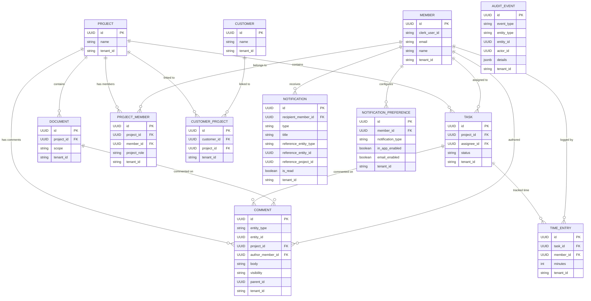
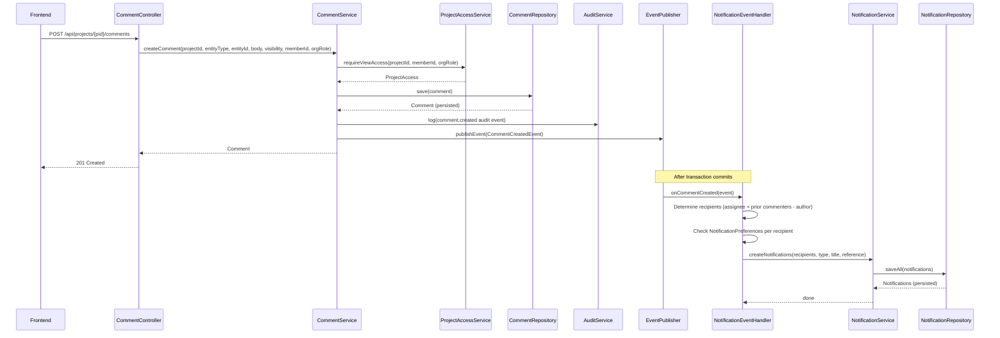
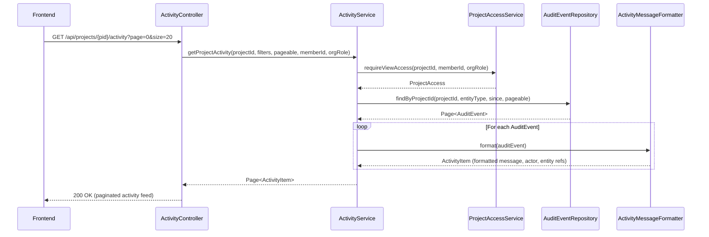
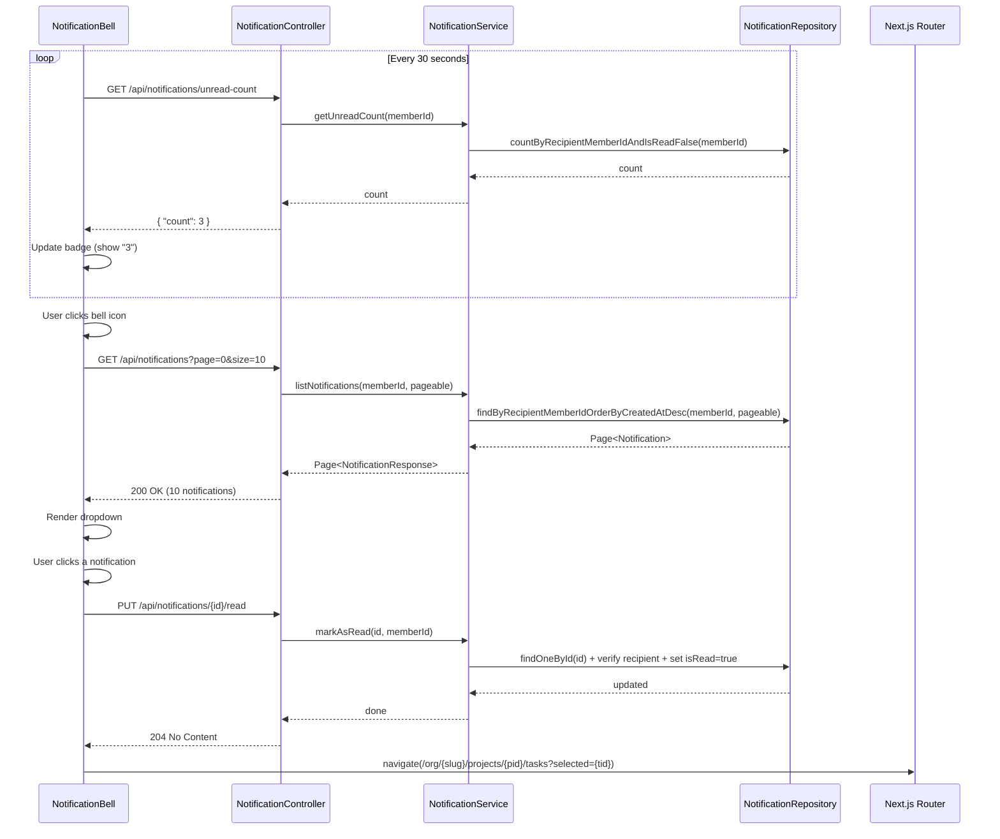
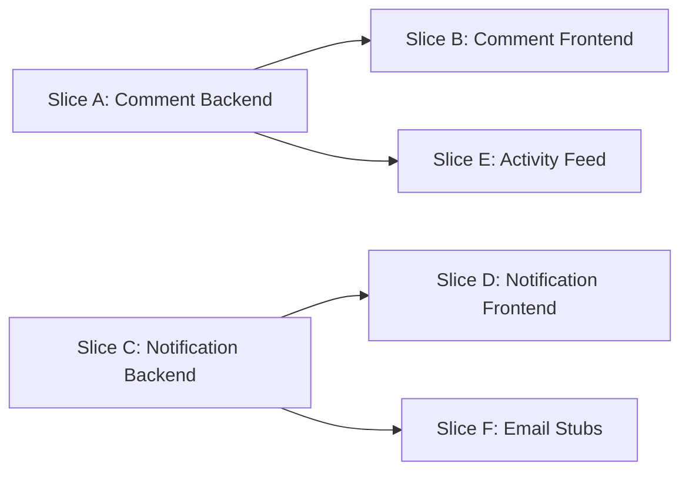

> Merge into ARCHITECTURE.md as **Section 11**.

> **Section Numbering Note**: Phase 5 (Task & Time Lifecycle) was documented externally in `phase5-task-time-lifecycle.md` and has not yet been merged into ARCHITECTURE.md. When both phases are merged, Phase 5 should become Section 11 and this document Section 12. For now, this document uses Section 11 numbering and should be renumbered during the merge.

## 11. Phase 6.5 — Notifications, Comments & Activity

### 11.1 Overview

Phase 6.5 adds the **communication and awareness layer** to the DocTeams platform. Until now, the platform captures what happens (audit events) but does not help users stay aware of changes or discuss their work. This phase introduces three interconnected capabilities: a comments system for annotating tasks and documents, a project activity feed that surfaces audit events as a human-readable timeline, and an in-app notification system that alerts users when things relevant to them change.

These three capabilities share a common foundation: the **Spring ApplicationEvent** pattern introduced in this phase. Domain services publish events after mutations; independent consumers (notification handler, and in the future, portal projection handler) subscribe to these events without coupling to the publisher. This event pattern was designed in [ADR-032](../adr/ADR-032-spring-application-events-for-portal.md) for Phase 7's customer portal and is implemented here for the first time. Phase 6.5 uses a pragmatic dual-write approach: existing services continue calling `auditService.log()` directly while also publishing Spring events for notification fan-out. New services (CommentService) publish events that the notification handler consumes.

Phase 6.5 also includes **email notification stubs** — the abstraction layer for future email delivery (SES) with templates and user preferences. Actual email sending is not wired in this phase; the stub logs email content in local/dev profiles.

#### What's New

| Before Phase 6.5 | After Phase 6.5 |
|---|---|
| Audit events stored but not surfaced to users | Project activity feed shows human-readable timeline |
| No way to discuss tasks or documents | Comments on tasks and documents with visibility control |
| Users must manually check for changes | In-app notifications with bell badge and unread count |
| No communication abstractions | Event publication pattern, notification channels, email stubs |
| No user preference infrastructure | Notification preferences (opt-out per type) |

#### Scope Boundaries

**In scope**:
- Comment CRUD on tasks and documents (flat, no threading)
- Comment visibility: INTERNAL (default) / SHARED (portal-ready)
- Project activity feed reading from audit_events
- In-app notifications with bell badge, dropdown, and full page
- Notification preferences (in-app + email toggles per type)
- Spring ApplicationEvent introduction (DomainEvent hierarchy)
- Email notification channel stub (logs only)
- Notification polling (30-second interval)

**Out of scope** (explicitly deferred):
- Threaded/nested comment replies — `parent_id` column reserved but unused ([ADR-034](../adr/ADR-034-flat-comments-with-threading-schema.md))
- Rich text or markdown in comments — plain text `TEXT` column for now
- @-mention parsing and notification targeting
- Real-time push (WebSocket, SSE) — polling only ([ADR-038](../adr/ADR-038-polling-for-notification-delivery.md))
- Email delivery integration (SES wiring) — stub only
- Comment reactions (emoji, thumbs up)
- Cross-org notification aggregation
- Migrating existing `auditService.log()` calls to event-driven audit logging (Phase 7 scope)

---

### 11.2 Domain Model

Phase 6.5 introduces three new tenant-scoped entities: **Comment**, **Notification**, and **NotificationPreference**. All follow the established entity pattern: `TenantAware` interface, `@FilterDef`/`@Filter` for shared-schema tenants, `@EntityListeners(TenantAwareEntityListener.class)`, UUID-based loose references (no JPA `@ManyToOne`).

#### 11.2.1 Comment Entity

Comments attach to tasks or documents within a project. The `entity_type` + `entity_id` polymorphic pattern allows comments on any entity type without join tables.

| Field | Java Type | DB Column | DB Type | Constraints | Notes |
|-------|-----------|-----------|---------|-------------|-------|
| `id` | `UUID` | `id` | `UUID` | PK, default `gen_random_uuid()` | Auto-generated |
| `entityType` | `String` | `entity_type` | `VARCHAR(20)` | NOT NULL | `TASK` or `DOCUMENT`; extensible for future entity types |
| `entityId` | `UUID` | `entity_id` | `UUID` | NOT NULL | ID of the task or document being commented on |
| `projectId` | `UUID` | `project_id` | `UUID` | NOT NULL | Denormalized for project-scoped queries; avoids join to tasks/documents |
| `authorMemberId` | `UUID` | `author_member_id` | `UUID` | NOT NULL | The member who wrote the comment; loose UUID reference to `members` |
| `body` | `String` | `body` | `TEXT` | NOT NULL | Plain text content; no length limit |
| `visibility` | `String` | `visibility` | `VARCHAR(20)` | NOT NULL, default `'INTERNAL'` | `INTERNAL` (staff-only) or `SHARED` (portal-visible) — see [ADR-037](../adr/ADR-037-comment-visibility-model.md) |
| `parentId` | `UUID` | `parent_id` | `UUID` | Nullable | Reserved for future threading; always NULL in Phase 6.5 — see [ADR-034](../adr/ADR-034-flat-comments-with-threading-schema.md) |
| `tenantId` | `String` | `tenant_id` | `VARCHAR(255)` | Nullable | Set by `TenantAwareEntityListener` for shared-schema tenants; NULL for dedicated-schema |
| `createdAt` | `Instant` | `created_at` | `TIMESTAMPTZ` | NOT NULL, default `now()` | Set on construction |
| `updatedAt` | `Instant` | `updated_at` | `TIMESTAMPTZ` | NOT NULL, default `now()` | Updated on edit |

**Indexes**:
- `idx_comments_entity` — `(entity_type, entity_id, created_at)` — primary query pattern: listing comments on a task/document
- `idx_comments_project` — `(project_id, created_at)` — project-wide comment feeds
- `idx_comments_tenant` — `(tenant_id) WHERE tenant_id IS NOT NULL` — shared-schema isolation

**Design decisions**:
- **Hard delete, not soft delete**: Comments are not audit-critical data. The deletion itself is audited (`comment.deleted` event with the deleted body captured in details). Soft delete would require filtering `WHERE deleted_at IS NULL` on every query and complicates the data model unnecessarily.
- **No `@Version` (optimistic locking)**: Concurrent edits to the same comment are extremely unlikely in a B2B setting. The `updatedAt` timestamp provides last-write-wins semantics. If conflicts become an issue, `@Version` can be added without migration (Hibernate manages the column).
- **`projectId` denormalization**: Avoids a join to `tasks` or `documents` when listing comments by project. The trade-off is that if a task moves to a different project (not currently supported), comment `projectId` values would be stale. Acceptable because task-to-project reassignment is not a planned feature.

#### 11.2.2 Notification Entity

Notifications are individual alerts delivered to a specific member. Each notification references the entity that triggered it for deep-linking in the UI.

| Field | Java Type | DB Column | DB Type | Constraints | Notes |
|-------|-----------|-----------|---------|-------------|-------|
| `id` | `UUID` | `id` | `UUID` | PK, default `gen_random_uuid()` | Auto-generated |
| `recipientMemberId` | `UUID` | `recipient_member_id` | `UUID` | NOT NULL | The member who receives this notification |
| `type` | `String` | `type` | `VARCHAR(50)` | NOT NULL | Notification type enum: `TASK_ASSIGNED`, `TASK_CLAIMED`, `TASK_UPDATED`, `COMMENT_ADDED`, `DOCUMENT_SHARED`, `MEMBER_INVITED`. **Note**: `PROJECT_UPDATED` from the requirements spec is intentionally deferred — project-level changes (name, description) are already visible in the activity feed, making a separate notification redundant for the initial release. Can be added later by defining a new event type and handler without schema changes. |
| `title` | `String` | `title` | `VARCHAR(500)` | NOT NULL | Short summary, e.g., "Alice commented on Task: Fix login bug" |
| `body` | `String` | `body` | `TEXT` | Nullable | Optional longer text (e.g., comment excerpt) |
| `referenceEntityType` | `String` | `reference_entity_type` | `VARCHAR(20)` | Nullable | Entity type for deep-linking: `TASK`, `DOCUMENT`, `PROJECT`, `COMMENT` |
| `referenceEntityId` | `UUID` | `reference_entity_id` | `UUID` | Nullable | Entity ID for deep-linking |
| `referenceProjectId` | `UUID` | `reference_project_id` | `UUID` | Nullable | Project context for URL construction |
| `isRead` | `boolean` | `is_read` | `BOOLEAN` | NOT NULL, default `false` | Marked true when user reads/dismisses |
| `tenantId` | `String` | `tenant_id` | `VARCHAR(255)` | Nullable | Shared-schema isolation |
| `createdAt` | `Instant` | `created_at` | `TIMESTAMPTZ` | NOT NULL, default `now()` | Immutable after creation |

**Indexes**:
- `idx_notifications_unread` — `(recipient_member_id, is_read, created_at DESC)` — bell badge unread count and filtered list
- `idx_notifications_list` — `(recipient_member_id, created_at DESC)` — full notification list with pagination
- `idx_notifications_tenant` — `(tenant_id) WHERE tenant_id IS NOT NULL` — shared-schema isolation

**Design decisions**:
- **No `updatedAt`**: Notifications are write-once except for `is_read` toggle. A separate `read_at` timestamp could be added later if analytics require it.
- **Hard delete for dismiss**: When a user dismisses a notification, it is physically deleted. Notifications are not compliance-critical; the events that created them are preserved in `audit_events`.
- **Self-scoped queries only**: All notification queries filter by `recipient_member_id = :currentMemberId`. There is no admin view of other users' notifications. This follows the [ADR-023](../adr/ADR-023-my-work-cross-project-query.md) pattern where the `WHERE` clause IS the authorization.
- **`referenceProjectId` for URL construction**: The frontend needs the project slug/ID to build a deep-link URL like `/org/{slug}/projects/{projectId}/tasks?selected={taskId}`. Storing `referenceProjectId` avoids a lookup at render time.

#### 11.2.3 NotificationPreference Entity

Preferences control which notification types a user receives and through which channels. The opt-out model means all types are enabled by default; users explicitly disable types they do not want.

| Field | Java Type | DB Column | DB Type | Constraints | Notes |
|-------|-----------|-----------|---------|-------------|-------|
| `id` | `UUID` | `id` | `UUID` | PK, default `gen_random_uuid()` | Auto-generated |
| `memberId` | `UUID` | `member_id` | `UUID` | NOT NULL | The member whose preferences these are |
| `notificationType` | `String` | `notification_type` | `VARCHAR(50)` | NOT NULL | Matches `Notification.type` values |
| `inAppEnabled` | `boolean` | `in_app_enabled` | `BOOLEAN` | NOT NULL, default `true` | Whether in-app notifications are enabled for this type |
| `emailEnabled` | `boolean` | `email_enabled` | `BOOLEAN` | NOT NULL, default `false` | Whether email notifications are enabled (stub in Phase 6.5) |
| `tenantId` | `String` | `tenant_id` | `VARCHAR(255)` | Nullable | Shared-schema isolation |

**Constraints**:
- `UNIQUE (member_id, notification_type, tenant_id)` — one preference row per member per type per tenant

**Indexes**:
- `idx_notif_prefs_member` — `(member_id)` — lookup all preferences for a member
- `idx_notif_prefs_tenant` — `(tenant_id) WHERE tenant_id IS NOT NULL` — shared-schema isolation

**Design decisions**:
- **Sparse rows**: Only preferences that differ from defaults are stored. If a member has no `NotificationPreference` row for `TASK_ASSIGNED`, the system uses the default (in-app enabled, email disabled). This means most members have zero rows until they visit the preferences page.
- **`tenant_id` in unique constraint**: Required because in the `tenant_shared` schema, the same `member_id` could theoretically exist across orgs (though in practice, Member UUIDs are globally unique). Including `tenant_id` in the unique constraint provides defense-in-depth for shared-schema isolation.
- **Per-type, not per-project**: Preferences apply to all notification types across all projects. Per-project preferences add significant complexity with minimal user value in a B2B context.

#### 11.2.4 Entity Relationship Diagram



**Total entities in tenant schema**: 12 (9 existing + 3 new: Comment, Notification, NotificationPreference). `AuditEvent` remains but is not counted as a "domain" entity — it is infrastructure.

---

### 11.3 Core Flows and Backend Behaviour

#### 11.3.1 Comment CRUD Flow

**Create Comment**

1. Client sends `POST /api/projects/{projectId}/comments` with `{ entityType, entityId, body, visibility? }`.
2. `CommentController` extracts `memberId` and `orgRole` from `RequestScopes`.
3. `CommentService.createComment()`:
   a. Calls `projectAccessService.requireViewAccess(projectId, memberId, orgRole)` — any project member can comment.
   b. Validates `entityType` is a supported value (`TASK` or `DOCUMENT`).
   c. Verifies the target entity exists and belongs to the project (e.g., `taskRepository.findOneById(entityId)` and checks `task.getProjectId().equals(projectId)`).
   d. Determines `visibility`: if caller provides `SHARED`, checks `access.canEdit()` (lead/admin/owner); otherwise defaults to `INTERNAL`. If a non-lead member requests `SHARED`, the request is rejected with `ForbiddenException`.
   e. Creates and saves the `Comment` entity.
   f. Logs audit event: `auditService.log(AuditEventBuilder.builder().eventType("comment.created").entityType("comment").entityId(comment.getId()).details(Map.of("project_id", projectId, "entity_type", entityType, "entity_id", entityId, "visibility", visibility)).build())`.
   g. Publishes `CommentCreatedEvent` via `applicationEventPublisher.publishEvent(...)`.
4. Returns `201 Created` with the created comment.

**Edit Comment**

1. Client sends `PUT /api/projects/{projectId}/comments/{commentId}` with `{ body?, visibility? }`.
2. `CommentService.updateComment()`:
   a. Loads the comment via `commentRepository.findOneById(commentId)`.
   b. Verifies `comment.getProjectId().equals(projectId)`.
   c. Checks authorization:
      - **Own comment**: author can always edit body. Author can also edit visibility if they have lead/admin/owner role (`access.canEdit()`).
      - **Others' comment**: only admin/owner (`access.isAdmin()`) can edit body or visibility. Project leads cannot edit others' comments.
   d. If `visibility` changed, verifies `access.canEdit()` (for own comments) or `access.isAdmin()` (for others') and publishes `CommentVisibilityChangedEvent`.
   e. Updates fields and saves.
   f. Logs `comment.updated` audit event (captures old/new body and visibility in details).
3. Returns `200 OK` with the updated comment.

**Delete Comment**

1. Client sends `DELETE /api/projects/{projectId}/comments/{commentId}`.
2. `CommentService.deleteComment()`:
   a. Loads the comment.
   b. Verifies project ownership.
   c. Checks authorization: author or admin/owner can delete.
   d. Logs `comment.deleted` audit event (captures the deleted body in details for audit trail).
   e. Publishes `CommentDeletedEvent`.
   f. Hard-deletes the comment via `commentRepository.delete(comment)`.
3. Returns `204 No Content`.

**List Comments**

1. Client sends `GET /api/projects/{projectId}/comments?entityType=TASK&entityId={id}&page=0&size=20`.
2. `CommentService.listComments()`:
   a. Calls `projectAccessService.requireViewAccess(...)`.
   b. Queries `commentRepository.findByEntityTypeAndEntityId(entityType, entityId, pageable)` ordered by `created_at ASC`.
3. Returns `200 OK` with paginated comment list.

#### 11.3.2 Activity Feed Flow

The activity feed reads from the existing `audit_events` table and formats entries into human-readable messages. See [ADR-035](../adr/ADR-035-activity-feed-direct-audit-query.md) for the design rationale.

**Query Flow**

1. Client sends `GET /api/projects/{projectId}/activity?page=0&size=20&entityType=TASK&since=2026-01-01T00:00:00Z`.
2. `ActivityController` extracts `memberId` and `orgRole` from `RequestScopes`.
3. `ActivityService.getProjectActivity()`:
   a. Calls `projectAccessService.requireViewAccess(...)`.
   b. Queries audit events: `SELECT * FROM audit_events WHERE (details->>'project_id') = :projectId` with optional filters for `entityType` and `since`, ordered by `occurred_at DESC`, paginated.
   c. For each audit event, calls `ActivityMessageFormatter.format(auditEvent)` to produce a human-readable entry.
4. Returns `200 OK` with paginated activity items.

**Message Formatting**

`ActivityMessageFormatter` maps `(eventType, entityType)` pairs to human-readable templates. The formatter extracts actor name and entity name from the audit event's JSONB `details` map.

| Event Type | Entity Type | Template | Example Output |
|------------|-------------|----------|---------------|
| `task.created` | `task` | `{actor} created task "{entityName}"` | Alice created task "Fix login bug" |
| `task.updated` | `task` | *(detail-inspection, see below)* | *(varies by what changed)* |
| `task.claimed` | `task` | `{actor} claimed task "{entityName}"` | Charlie claimed task "Fix login bug" |
| `task.released` | `task` | `{actor} released task "{entityName}"` | Alice released task "Fix login bug" |
| `document.uploaded` | `document` | `{actor} uploaded document "{entityName}"` | Alice uploaded document "Q4 Report.pdf" |
| `document.updated` | `document` | `{actor} updated document "{entityName}"` | Bob updated document "Q4 Report.pdf" |
| `document.deleted` | `document` | `{actor} deleted document "{entityName}"` | Alice deleted document "Q4 Report.pdf" |
| `comment.created` | `comment` | `{actor} commented on {parentType} "{parentName}"` | Alice commented on task "Fix login bug" |
| `comment.updated` | `comment` | `{actor} edited a comment on {parentType} "{parentName}"` | Bob edited a comment on task "Fix login bug" |
| `comment.deleted` | `comment` | `{actor} deleted a comment on {parentType} "{parentName}"` | Alice deleted a comment on task "Fix login bug" |
| `comment.visibility_changed` | `comment` | `{actor} changed comment visibility to {visibility}` | Alice changed comment visibility to SHARED |
| `time_entry.created` | `time_entry` | `{actor} logged {duration} on task "{entityName}"` | Bob logged 2h 30m on task "Fix login bug" |
| `time_entry.updated` | `time_entry` | `{actor} updated time entry on task "{entityName}"` | Bob updated time entry on task "Fix login bug" |
| `time_entry.deleted` | `time_entry` | `{actor} deleted time entry on task "{entityName}"` | Alice deleted time entry on task "Fix login bug" |
| `project_member.added` | `project_member` | `{actor} added {memberName} to the project` | Alice added Bob to the project |
| `project_member.removed` | `project_member` | `{actor} removed {memberName} from the project` | Alice removed Charlie from the project |
| *(unknown)* | *(any)* | `{actor} performed {eventType} on {entityType}` | Alice performed customer.updated on customer |

**`task.updated` detail-inspection logic**: The audit event type `task.updated` covers multiple semantic changes (assignment, status change, general field edits). The formatter inspects the JSONB `details` map to produce a more specific message:

- If `details` contains key `"assignee_id"` -> format as `"{actor} assigned task \"{entityName}\" to {assigneeName}"`
- If `details` contains key `"status"` -> format as `"{actor} changed task \"{entityName}\" status to {status}"`
- Otherwise -> format as `"{actor} updated task \"{entityName}\""`

When both keys are present (assignment + status change in a single update), produce two activity items or prefer the assignment message (assignment is more notable). The formatter checks keys with `details.containsKey(...)`.

> **Note**: The **notification system** uses separate Spring ApplicationEvents (`TaskAssignedEvent`, `TaskStatusChangedEvent`) which ARE distinct event types. The detail-inspection approach is only needed for the activity feed, which reads from `audit_events` where `task.updated` is the single event type for all task mutations.

The formatter resolves `{actor}` by batch-loading `Member.name` values from the `members` table using the `actorId` UUID stored on each `AuditEvent` entity (see "Actor Name Resolution" below). Entity names come from `details.get("title")` or `details.get("name")` or `details.get("file_name")` depending on entity type.

**Actor Name Resolution**: `ActivityService` resolves actor display names by batch-loading from the `members` table, not from JSONB details. Existing audit events do not include `actor_name` in their details map, and requiring all services to add it would be fragile and redundant. Instead, the service:

1. Fetches a `Page<AuditEvent>` for the project.
2. Collects the unique `actorId` UUIDs from the page.
3. Queries `memberRepository.findAllById(actorIds)` in a single batch.
4. Builds a `Map<UUID, String>` of `actorId -> member.getName()`.
5. Passes this map to `ActivityMessageFormatter.format(auditEvent, actorNameMap)` for `{actor}` substitution.
6. Falls back to `actorId.toString()` if a member is not found (e.g., deleted member).

For avatar URLs, the same batch approach applies: `Member` entities store `avatarUrl` (synced from Clerk), so the map becomes `Map<UUID, MemberInfo>` with both name and avatar URL.

**Performance**: The expression index `idx_audit_project` on `(details->>'project_id')` ensures the project filter uses an index scan. With pagination (`LIMIT 20 OFFSET ...`), the query cost is bounded regardless of total audit event volume per project. The batch member lookup adds at most one extra query per page (typically 1-10 unique actors per 20-item page).

#### 11.3.3 Notification Creation Flow

When a domain event occurs, the `NotificationEventHandler` determines recipients and creates `Notification` rows. See [ADR-036](../adr/ADR-036-synchronous-notification-fanout.md) for the synchronous fan-out design rationale.

**Notification Trigger Table**

| Domain Event | Notification Type | Recipients | Title Template |
|---|---|---|---|
| Task assigned to member | `TASK_ASSIGNED` | The assigned member (if not the actor) | `"{actorName} assigned you to task \"{taskTitle}\""` |
| Task claimed by someone | `TASK_CLAIMED` | Previous assignee (if any) + project leads | `"{actorName} claimed task \"{taskTitle}\""` |
| Task status changed | `TASK_UPDATED` | Task assignee (if not the actor) | `"{actorName} changed task \"{taskTitle}\" to {newStatus}"` |
| Comment added on a task | `COMMENT_ADDED` | Task assignee + other commenters on that task (excluding comment author) | `"{actorName} commented on task \"{taskTitle}\""` |
| Comment added on a document | `COMMENT_ADDED` | Document uploader + other commenters (excluding comment author) | `"{actorName} commented on document \"{docName}\""` |
| Document uploaded to project | `DOCUMENT_SHARED` | All project members (excluding uploader) | `"{actorName} uploaded \"{docName}\" to project \"{projectName}\""` |
| Member added to project | `MEMBER_INVITED` | The added member | `"You were added to project \"{projectName}\""` |

**Fan-Out Logic**

For each event, `NotificationEventHandler`:

1. Determines the raw recipient set (e.g., task assignee + other commenters for `COMMENT_ADDED`).
2. Removes the actor (the person who triggered the event should not be notified about their own action).
3. For each remaining recipient, checks `NotificationPreference` — if the user has explicitly disabled in-app notifications for this type, skip them.
4. Creates `Notification` rows in a single batch via `notificationRepository.saveAll(notifications)`.
5. Passes the notifications to `NotificationDispatcher` for multi-channel delivery (in-app is already done via the DB write; email channel is stubbed).

**Example: Comment Created on a Task**

```
CommentService.createComment()
    |
    +-- auditService.log(comment.created)          // Audit (existing pattern)
    +-- eventPublisher.publishEvent(CommentCreatedEvent)  // New event publication
    |
    ... transaction commits ...
    |
    NotificationEventHandler.onCommentCreated(CommentCreatedEvent)
        |
        +-- Determine recipients:
        |     1. Task assignee (if entityType == TASK)
        |     2. Previous commenters on the same entity (excluding author)
        |     3. Remove the comment author from recipients
        |
        +-- For each recipient:
        |     1. Check NotificationPreference for COMMENT_ADDED
        |     2. If in_app_enabled (default true): create Notification row
        |     3. Pass to NotificationDispatcher for email channel (stub)
        |
        +-- notificationRepository.saveAll(notifications)
```

#### 11.3.4 Notification Consumption Flow

**Bell Badge (Polling)**

1. Frontend `NotificationBell` component polls `GET /api/notifications/unread-count` every 30 seconds.
2. Backend runs: `SELECT count(*) FROM notifications WHERE recipient_member_id = :memberId AND is_read = false`.
3. Index `idx_notifications_unread` serves this query as an index-only scan.
4. Response: `{ "count": 5 }`. Frontend renders badge with count (or hides badge if 0).

**Notification Dropdown**

1. User clicks the bell icon.
2. Frontend fetches `GET /api/notifications?page=0&size=10`.
3. Backend returns the 10 most recent notifications for the current member.
4. Each notification shows: type icon, title, relative timestamp, read/unread indicator.

**Click → Navigate + Mark Read**

1. User clicks a notification in the dropdown.
2. Frontend calls `PUT /api/notifications/{id}/read` (fire-and-forget).
3. Frontend navigates to the referenced entity: `/org/{slug}/projects/{referenceProjectId}/tasks?selected={referenceEntityId}`.

**Mark All as Read**

1. User clicks "Mark all as read" in dropdown or full page.
2. Frontend calls `PUT /api/notifications/read-all`.
3. Backend runs: `UPDATE notifications SET is_read = true WHERE recipient_member_id = :memberId AND is_read = false`.

#### 11.3.5 Email Stub Flow

`NotificationDispatcher` routes notifications to one or more `NotificationChannel` implementations based on user preferences:

1. **InAppNotificationChannel**: Creates `Notification` rows in the database. This is the primary channel for Phase 6.5 and is always invoked (the DB write in the event handler IS the in-app channel).
2. **EmailNotificationChannel**: Checks `NotificationPreference.emailEnabled` for the type. In `local`/`dev` profiles, logs the email content (to, subject, body) at INFO level. In `prod`, the channel is not registered (no-op). When SES is integrated (future phase), the stub gains a real `SesClient` dependency.

---

### 11.4 API Surface

#### 11.4.1 Comments API

All comment endpoints require a valid Clerk JWT and project membership (verified via `ProjectAccessService.requireViewAccess()`).

| Method | Path | Description | Authorization | R/W |
|--------|------|-------------|--------------|-----|
| `POST` | `/api/projects/{projectId}/comments` | Create a comment | Project member | Write |
| `GET` | `/api/projects/{projectId}/comments` | List comments on an entity | Project member | Read |
| `PUT` | `/api/projects/{projectId}/comments/{commentId}` | Edit a comment | Author or admin/owner | Write |
| `DELETE` | `/api/projects/{projectId}/comments/{commentId}` | Delete a comment | Author or admin/owner | Write |

**POST /api/projects/{projectId}/comments**

Request:
```json
{
  "entityType": "TASK",
  "entityId": "a1b2c3d4-...",
  "body": "I think we should approach this differently.",
  "visibility": "INTERNAL"
}
```

- `entityType` — required, one of `TASK`, `DOCUMENT`
- `entityId` — required, UUID of the entity being commented on
- `body` — required, non-blank plain text
- `visibility` — optional, defaults to `INTERNAL`. `SHARED` requires lead/admin/owner role.

Response (`201 Created`):
```json
{
  "id": "f5e6d7c8-...",
  "entityType": "TASK",
  "entityId": "a1b2c3d4-...",
  "projectId": "b2c3d4e5-...",
  "authorMemberId": "c3d4e5f6-...",
  "authorName": "Alice Johnson",
  "authorAvatarUrl": "https://img.clerk.com/...",
  "body": "I think we should approach this differently.",
  "visibility": "INTERNAL",
  "createdAt": "2026-02-12T14:30:00Z",
  "updatedAt": "2026-02-12T14:30:00Z"
}
```

**GET /api/projects/{projectId}/comments**

Query parameters:
- `entityType` — required, `TASK` or `DOCUMENT`
- `entityId` — required, UUID
- `page` — optional, default `0`
- `size` — optional, default `20`, max `100`

Response (`200 OK`):
```json
{
  "content": [
    {
      "id": "f5e6d7c8-...",
      "entityType": "TASK",
      "entityId": "a1b2c3d4-...",
      "projectId": "b2c3d4e5-...",
      "authorMemberId": "c3d4e5f6-...",
      "authorName": "Alice Johnson",
      "authorAvatarUrl": "https://img.clerk.com/...",
      "body": "I think we should approach this differently.",
      "visibility": "INTERNAL",
      "createdAt": "2026-02-12T14:30:00Z",
      "updatedAt": "2026-02-12T14:30:00Z"
    }
  ],
  "page": {
    "size": 20,
    "number": 0,
    "totalElements": 3,
    "totalPages": 1
  }
}
```

Comments are ordered by `created_at ASC` (oldest first) — standard conversation ordering.

**PUT /api/projects/{projectId}/comments/{commentId}**

Request:
```json
{
  "body": "Updated: I think we should approach this differently after checking the spec.",
  "visibility": "SHARED"
}
```

- `body` — optional, non-blank if provided. Author can edit own body; admin/owner can edit any comment's body.
- `visibility` — optional, `INTERNAL` or `SHARED`. Author with lead/admin/owner role can change own visibility; admin/owner can change any comment's visibility. Regular members and project leads cannot change others' comment visibility.

Response (`200 OK`): Updated comment object (same shape as POST response).

**DELETE /api/projects/{projectId}/comments/{commentId}**

Response: `204 No Content`

#### 11.4.2 Activity API

| Method | Path | Description | Authorization | R/W |
|--------|------|-------------|--------------|-----|
| `GET` | `/api/projects/{projectId}/activity` | Project activity feed | Project member | Read |

**GET /api/projects/{projectId}/activity**

Query parameters:
- `page` — optional, default `0`
- `size` — optional, default `20`, max `50`
- `entityType` — optional filter: `TASK`, `DOCUMENT`, `COMMENT`, `PROJECT_MEMBER`, `TIME_ENTRY`. **Note**: The API accepts uppercase values for consistency with other endpoints, but `audit_events.entity_type` stores lowercase (`task`, `document`, etc.). `ActivityService` converts the filter parameter to lowercase before querying (e.g., `entityType.toLowerCase(Locale.ROOT)`).
- `since` — optional, ISO 8601 timestamp — only events after this time

Response (`200 OK`):
```json
{
  "content": [
    {
      "id": "e4f5a6b7-...",
      "message": "Alice created task \"Fix login bug\"",
      "actorName": "Alice Johnson",
      "actorAvatarUrl": "https://img.clerk.com/...",
      "entityType": "TASK",
      "entityId": "a1b2c3d4-...",
      "entityName": "Fix login bug",
      "eventType": "task.created",
      "occurredAt": "2026-02-12T10:15:00Z"
    },
    {
      "id": "d3e4f5a6-...",
      "message": "Bob commented on task \"Fix login bug\"",
      "actorName": "Bob Smith",
      "actorAvatarUrl": "https://img.clerk.com/...",
      "entityType": "COMMENT",
      "entityId": "f5e6d7c8-...",
      "entityName": "Fix login bug",
      "eventType": "comment.created",
      "occurredAt": "2026-02-12T14:30:00Z"
    }
  ],
  "page": {
    "size": 20,
    "number": 0,
    "totalElements": 45,
    "totalPages": 3
  }
}
```

Activity items are ordered by `occurred_at DESC` (most recent first).

#### 11.4.3 Notifications API

All notification endpoints are self-scoped to the authenticated user. No `ProjectAccessService` checks — the `WHERE recipient_member_id = :currentMemberId` clause IS the authorization (same pattern as [ADR-023](../adr/ADR-023-my-work-cross-project-query.md)).

| Method | Path | Description | Authorization | R/W |
|--------|------|-------------|--------------|-----|
| `GET` | `/api/notifications` | List notifications | Authenticated member | Read |
| `GET` | `/api/notifications/unread-count` | Unread count for badge | Authenticated member | Read |
| `PUT` | `/api/notifications/{id}/read` | Mark one as read | Authenticated member (recipient only) | Write |
| `PUT` | `/api/notifications/read-all` | Mark all as read | Authenticated member | Write |
| `DELETE` | `/api/notifications/{id}` | Dismiss notification | Authenticated member (recipient only) | Write |

**GET /api/notifications**

Query parameters:
- `unreadOnly` — optional, boolean, default `false`
- `page` — optional, default `0`
- `size` — optional, default `20`, max `50`

Response (`200 OK`):
```json
{
  "content": [
    {
      "id": "a1b2c3d4-...",
      "type": "COMMENT_ADDED",
      "title": "Alice commented on task \"Fix login bug\"",
      "body": "I think we should approach this differently.",
      "referenceEntityType": "TASK",
      "referenceEntityId": "b2c3d4e5-...",
      "referenceProjectId": "c3d4e5f6-...",
      "isRead": false,
      "createdAt": "2026-02-12T14:30:00Z"
    }
  ],
  "page": {
    "size": 20,
    "number": 0,
    "totalElements": 12,
    "totalPages": 1
  }
}
```

**GET /api/notifications/unread-count**

Response (`200 OK`):
```json
{
  "count": 5
}
```

**PUT /api/notifications/{id}/read**

Response: `204 No Content`

Verifies `notification.recipientMemberId == currentMemberId` before updating. Returns `404` if the notification does not exist or belongs to another user.

**PUT /api/notifications/read-all**

Response: `204 No Content`

Bulk update: `UPDATE notifications SET is_read = true WHERE recipient_member_id = :memberId AND is_read = false`.

**DELETE /api/notifications/{id}**

Response: `204 No Content`

Verifies ownership before deleting. Hard delete — notification is physically removed.

#### 11.4.4 Notification Preferences API

| Method | Path | Description | Authorization | R/W |
|--------|------|-------------|--------------|-----|
| `GET` | `/api/notifications/preferences` | Get all preferences | Authenticated member | Read |
| `PUT` | `/api/notifications/preferences` | Update preferences | Authenticated member | Write |

**GET /api/notifications/preferences**

Response (`200 OK`):
```json
{
  "preferences": [
    {
      "notificationType": "TASK_ASSIGNED",
      "inAppEnabled": true,
      "emailEnabled": false
    },
    {
      "notificationType": "TASK_CLAIMED",
      "inAppEnabled": true,
      "emailEnabled": false
    },
    {
      "notificationType": "TASK_UPDATED",
      "inAppEnabled": true,
      "emailEnabled": false
    },
    {
      "notificationType": "COMMENT_ADDED",
      "inAppEnabled": true,
      "emailEnabled": false
    },
    {
      "notificationType": "DOCUMENT_SHARED",
      "inAppEnabled": true,
      "emailEnabled": false
    },
    {
      "notificationType": "MEMBER_INVITED",
      "inAppEnabled": true,
      "emailEnabled": false
    }
  ]
}
```

The response always includes all known notification types, using stored preferences where they exist and defaults otherwise. This gives the frontend a complete list to render toggles for.

**PUT /api/notifications/preferences**

Request:
```json
{
  "preferences": [
    {
      "notificationType": "TASK_ASSIGNED",
      "inAppEnabled": true,
      "emailEnabled": false
    },
    {
      "notificationType": "COMMENT_ADDED",
      "inAppEnabled": false,
      "emailEnabled": false
    }
  ]
}
```

Response: `200 OK` with the full updated preferences list (same shape as GET response).

Only preferences that differ from defaults need to be sent. The service upserts rows for provided types and uses defaults for omitted types.

---

### 11.5 Sequence Diagrams

#### 11.5.1 Comment Creation with Notification Fan-Out



#### 11.5.2 Activity Feed Query



#### 11.5.3 Notification Bell Flow (Polling → Click → Navigate)



---

### 11.6 Event Publication Pattern

Phase 6.5 introduces Spring `ApplicationEvent` to the codebase for the first time, implementing the pattern accepted in [ADR-032](../adr/ADR-032-spring-application-events-for-portal.md). This section defines the event hierarchy, publication points, consumer conventions, and the dual-write strategy for transitioning from direct audit logging.

#### 11.6.1 DomainEvent Base Record

All domain events extend a sealed interface. Events are Java records — immutable, serializable, and carry only primitive types and UUIDs (no entity references, no lazy-loading proxies).

```java
package io.b2mash.b2b.b2bstrawman.event;

import java.time.Instant;
import java.util.Map;
import java.util.UUID;

/**
 * Base interface for all domain events published via Spring ApplicationEventPublisher.
 * All implementations must be records with primitive/UUID fields only — no JPA entity
 * references, no lazy proxies. This ensures events remain valid after the publishing
 * transaction commits and the persistence context closes.
 *
 * <p>Events carry enough context for any consumer to act without additional DB queries.
 * The {@code tenantId} field enables tenant-scoped processing in event handlers.
 */
public sealed interface DomainEvent
    permits CommentCreatedEvent, CommentUpdatedEvent, CommentDeletedEvent,
            CommentVisibilityChangedEvent, TaskAssignedEvent, TaskClaimedEvent,
            TaskStatusChangedEvent, DocumentUploadedEvent, MemberAddedToProjectEvent {

  String eventType();
  String entityType();
  UUID entityId();
  UUID projectId();
  UUID actorMemberId();
  String actorName();
  String tenantId();
  Instant occurredAt();
  Map<String, Object> details();
}
```

#### 11.6.2 Specific Event Records

```java
// Comment events (published by CommentService)
public record CommentCreatedEvent(
    String eventType,       // "comment.created"
    String entityType,      // "comment"
    UUID entityId,          // comment ID
    UUID projectId,
    UUID actorMemberId,
    String actorName,
    String tenantId,
    Instant occurredAt,
    Map<String, Object> details,
    // Comment-specific fields
    String targetEntityType,  // "TASK" or "DOCUMENT"
    UUID targetEntityId,      // the task/document being commented on
    String visibility         // "INTERNAL" or "SHARED"
) implements DomainEvent {}

public record CommentUpdatedEvent(
    String eventType,       // "comment.updated"
    String entityType,      // "comment"
    UUID entityId,
    UUID projectId,
    UUID actorMemberId,
    String actorName,
    String tenantId,
    Instant occurredAt,
    Map<String, Object> details
) implements DomainEvent {}

public record CommentDeletedEvent(
    String eventType,       // "comment.deleted"
    String entityType,      // "comment"
    UUID entityId,
    UUID projectId,
    UUID actorMemberId,
    String actorName,
    String tenantId,
    Instant occurredAt,
    Map<String, Object> details,
    String targetEntityType,
    UUID targetEntityId
) implements DomainEvent {}

public record CommentVisibilityChangedEvent(
    String eventType,       // "comment.visibility_changed"
    String entityType,      // "comment"
    UUID entityId,
    UUID projectId,
    UUID actorMemberId,
    String actorName,
    String tenantId,
    Instant occurredAt,
    Map<String, Object> details,
    String oldVisibility,
    String newVisibility
) implements DomainEvent {}

// Task events (published by TaskService alongside existing auditService.log())
public record TaskAssignedEvent(
    String eventType,       // "task.assigned"
    String entityType,      // "task"
    UUID entityId,          // task ID
    UUID projectId,
    UUID actorMemberId,
    String actorName,
    String tenantId,
    Instant occurredAt,
    Map<String, Object> details,
    UUID assigneeMemberId,
    String taskTitle
) implements DomainEvent {}

public record TaskClaimedEvent(
    String eventType,       // "task.claimed"
    String entityType,      // "task"
    UUID entityId,
    UUID projectId,
    UUID actorMemberId,
    String actorName,
    String tenantId,
    Instant occurredAt,
    Map<String, Object> details,
    UUID previousAssigneeId,  // nullable
    String taskTitle
) implements DomainEvent {}

public record TaskStatusChangedEvent(
    String eventType,       // "task.status_changed"
    String entityType,      // "task"
    UUID entityId,
    UUID projectId,
    UUID actorMemberId,
    String actorName,
    String tenantId,
    Instant occurredAt,
    Map<String, Object> details,
    String oldStatus,
    String newStatus,
    UUID assigneeMemberId,  // nullable
    String taskTitle
) implements DomainEvent {}

// Document events (published by DocumentService)
public record DocumentUploadedEvent(
    String eventType,       // "document.uploaded"
    String entityType,      // "document"
    UUID entityId,
    UUID projectId,
    UUID actorMemberId,
    String actorName,
    String tenantId,
    Instant occurredAt,
    Map<String, Object> details,
    String documentName
) implements DomainEvent {}

// Member events (published by ProjectMemberService)
public record MemberAddedToProjectEvent(
    String eventType,       // "project_member.added"
    String entityType,      // "project_member"
    UUID entityId,          // project_member ID
    UUID projectId,
    UUID actorMemberId,
    String actorName,
    String tenantId,
    Instant occurredAt,
    Map<String, Object> details,
    UUID addedMemberId,
    String projectName
) implements DomainEvent {}
```

#### 11.6.3 Publication Strategy: Dual-Write

Phase 6.5 uses a **dual-write** approach for existing services and a **single-write** approach for new services:

**New services (CommentService)**: Publish events AND call `auditService.log()`. The audit call is explicit — not derived from events — because audit logging has specific requirements (IP address, user agent, source) that are not part of the domain event payload.

**Existing services (TaskService, DocumentService, ProjectMemberService)**: Continue calling `auditService.log()` as before AND add `applicationEventPublisher.publishEvent(...)` calls alongside. This is the dual-write: both writes happen within the same transaction, and both succeed or fail together.

```java
// Example: TaskService.updateTask() — dual-write pattern
@Transactional
public Task updateTask(UUID taskId, ...) {
    // ... existing logic ...
    task.update(title, description, priority, status, type, dueDate, assigneeId);
    task = taskRepository.save(task);

    // Existing audit logging (unchanged)
    auditService.log(AuditEventBuilder.builder()
        .eventType("task.updated")
        .entityType("task")
        .entityId(task.getId())
        .details(changes)
        .build());

    // NEW: Event publication for notification fan-out
    if (assigneeChanged) {
        applicationEventPublisher.publishEvent(new TaskAssignedEvent(
            "task.assigned", "task", task.getId(), task.getProjectId(),
            memberId, actorName, tenantId, Instant.now(),
            Map.of("title", task.getTitle()),
            assigneeId, task.getTitle()));
    }
    if (statusChanged) {
        applicationEventPublisher.publishEvent(new TaskStatusChangedEvent(
            "task.status_changed", "task", task.getId(), task.getProjectId(),
            memberId, actorName, tenantId, Instant.now(),
            Map.of("title", task.getTitle(), "old_status", oldStatus, "new_status", status),
            oldStatus, status, task.getAssigneeId(), task.getTitle()));
    }

    return task;
}
```

**Why not migrate audit logging to an event listener now?** Moving `auditService.log()` into a `@TransactionalEventListener` would change the transactional behavior. Currently, audit events participate in the same transaction as the domain mutation — if the mutation rolls back, the audit event is also rolled back. With `@TransactionalEventListener(phase = AFTER_COMMIT)`, the audit write would happen in a new transaction after the domain transaction commits. This is actually the correct behavior for audit logging (you only want to audit committed changes), but it is a behavioral change that should be verified carefully across all 9 services that call `auditService.log()`. This migration is deferred to Phase 7, which can:

1. Introduce an `AuditEventHandler` that listens to domain events and calls `auditService.log()`.
2. Remove `auditService.log()` calls from domain services one by one.
3. Verify audit behavior is preserved in integration tests.

#### 11.6.4 Consumer: NotificationEventHandler

```java
package io.b2mash.b2b.b2bstrawman.notification;

import io.b2mash.b2b.b2bstrawman.event.*;
import io.b2mash.b2b.b2bstrawman.multitenancy.RequestScopes;
import java.util.ScopedValue;
import org.slf4j.Logger;
import org.slf4j.LoggerFactory;
import org.springframework.stereotype.Component;
import org.springframework.transaction.annotation.Propagation;
import org.springframework.transaction.annotation.Transactional;
import org.springframework.transaction.event.TransactionPhase;
import org.springframework.transaction.event.TransactionalEventListener;

/**
 * Listens to domain events and creates notifications for relevant recipients.
 * All handler methods run AFTER_COMMIT in a new transaction, ensuring:
 * 1. Notifications are only created for committed domain changes.
 * 2. Notification failures do not affect the domain transaction.
 *
 * <p>Each handler binds the tenant ScopedValue from the event's tenantId,
 * enabling Hibernate @Filter and RLS to work correctly in the new transaction.
 */
@Component
public class NotificationEventHandler {

    private static final Logger log = LoggerFactory.getLogger(NotificationEventHandler.class);

    private final NotificationService notificationService;

    public NotificationEventHandler(NotificationService notificationService) {
        this.notificationService = notificationService;
    }

    @TransactionalEventListener(phase = TransactionPhase.AFTER_COMMIT)
    public void onCommentCreated(CommentCreatedEvent event) {
        handleInTenantScope(event.tenantId(), () -> {
            try {
                notificationService.handleCommentCreated(event);
            } catch (Exception e) {
                log.warn("Failed to create notifications for comment.created event={}", event.entityId(), e);
            }
        });
    }

    @TransactionalEventListener(phase = TransactionPhase.AFTER_COMMIT)
    public void onTaskAssigned(TaskAssignedEvent event) {
        handleInTenantScope(event.tenantId(), () -> {
            try {
                notificationService.handleTaskAssigned(event);
            } catch (Exception e) {
                log.warn("Failed to create notifications for task.assigned event={}", event.entityId(), e);
            }
        });
    }

    @TransactionalEventListener(phase = TransactionPhase.AFTER_COMMIT)
    public void onTaskClaimed(TaskClaimedEvent event) {
        handleInTenantScope(event.tenantId(), () -> {
            try {
                notificationService.handleTaskClaimed(event);
            } catch (Exception e) {
                log.warn("Failed to create notifications for task.claimed event={}", event.entityId(), e);
            }
        });
    }

    @TransactionalEventListener(phase = TransactionPhase.AFTER_COMMIT)
    public void onTaskStatusChanged(TaskStatusChangedEvent event) {
        handleInTenantScope(event.tenantId(), () -> {
            try {
                notificationService.handleTaskStatusChanged(event);
            } catch (Exception e) {
                log.warn("Failed to create notifications for task.status_changed event={}", event.entityId(), e);
            }
        });
    }

    @TransactionalEventListener(phase = TransactionPhase.AFTER_COMMIT)
    public void onDocumentUploaded(DocumentUploadedEvent event) {
        handleInTenantScope(event.tenantId(), () -> {
            try {
                notificationService.handleDocumentUploaded(event);
            } catch (Exception e) {
                log.warn("Failed to create notifications for document.uploaded event={}", event.entityId(), e);
            }
        });
    }

    @TransactionalEventListener(phase = TransactionPhase.AFTER_COMMIT)
    public void onMemberAddedToProject(MemberAddedToProjectEvent event) {
        handleInTenantScope(event.tenantId(), () -> {
            try {
                notificationService.handleMemberAddedToProject(event);
            } catch (Exception e) {
                log.warn("Failed to create notifications for project_member.added event={}", event.entityId(), e);
            }
        });
    }

    /**
     * Binds the tenant ScopedValue so that Hibernate @Filter and RLS
     * work correctly in the handler's new transaction.
     */
    private void handleInTenantScope(String tenantId, Runnable action) {
        if (tenantId != null) {
            ScopedValue.where(RequestScopes.TENANT_ID, tenantId).run(action);
        } else {
            action.run();
        }
    }
}
```

**Key design decisions**:
- **AFTER_COMMIT**: Events are delivered only after the originating transaction commits. If a `TaskService.updateTask()` call rolls back, no `TaskAssignedEvent` is delivered and no phantom notification is created.
- **REQUIRES_NEW in NotificationService**: The event handler runs after the original transaction commits, so there is no active transaction. `NotificationService` methods that write notification rows use `@Transactional(propagation = Propagation.REQUIRES_NEW)` to get a fresh transaction.
- **Handler is NOT `@Transactional`**: `NotificationEventHandler` itself must NOT be annotated with `@Transactional`. Adding `@Transactional` to the handler would conflict with the `AFTER_COMMIT` phase — Spring cannot start a new transaction in an `AFTER_COMMIT` listener that is itself `@Transactional` on the listener method. Instead, the handler delegates to `NotificationService` methods which ARE `@Transactional(propagation = REQUIRES_NEW)`. The `ScopedValue` re-binding via `handleInTenantScope()` wraps the `NotificationService` call, ensuring tenant context is available when the service's new transaction begins.
- **Tenant scope re-binding**: The original request's `ScopedValue` bindings are no longer active in the AFTER_COMMIT phase. The handler re-binds `RequestScopes.TENANT_ID` from the event's `tenantId` field so that Hibernate `@Filter` and `TenantIdentifierResolver` work correctly.
- **Exception swallowing**: Each handler method catches and logs exceptions. A notification failure must never propagate to the HTTP response (which has already been sent at this point in the AFTER_COMMIT phase).

#### 11.6.5 Forward Compatibility with Phase 7

The domain events defined here are intentionally shaped for Phase 7's customer portal:

1. **Events carry all necessary data**: Each event includes `projectId`, `tenantId`, entity names, and actor names. Phase 7's `PortalProjectionHandler` can create portal read-model entries from event data alone without additional DB queries.
2. **`CommentVisibilityChangedEvent`**: Phase 7 subscribes to this event to project/un-project comments to/from the portal read-model. When visibility changes from INTERNAL to SHARED, the portal handler creates a `PortalComment` entry. When it changes from SHARED to INTERNAL, the portal handler deletes the entry.
3. **Sealed interface**: The `DomainEvent` sealed interface ensures all event types are enumerated at compile time. Phase 7 adds new event permits as needed (e.g., `PortalAccessGrantedEvent`).
4. **No entity references**: Events carry UUIDs and strings, not JPA entities. This means events remain valid after the publishing session closes and can be trivially serialized for future SQS/SNS migration.

---

### 11.7 Email Notification Stubs

#### 11.7.1 NotificationChannel Interface

```java
package io.b2mash.b2b.b2bstrawman.notification.channel;

import io.b2mash.b2b.b2bstrawman.notification.Notification;
import java.util.UUID;

/**
 * Abstraction for notification delivery channels. Each channel handles one
 * delivery mechanism (in-app, email, push, etc.).
 */
public interface NotificationChannel {

    /** Unique identifier for this channel (e.g., "in-app", "email"). */
    String channelId();

    /**
     * Delivers a notification via this channel.
     *
     * @param notification the notification to deliver
     * @param recipientEmail the recipient's email address (for email channels)
     */
    void deliver(Notification notification, String recipientEmail);

    /** Whether this channel is currently enabled/available. */
    boolean isEnabled();
}
```

#### 11.7.2 InAppNotificationChannel

```java
package io.b2mash.b2b.b2bstrawman.notification.channel;

import io.b2mash.b2b.b2bstrawman.notification.Notification;
import org.springframework.stereotype.Component;

/**
 * In-app notification channel. The notification is already persisted in the database
 * by the time this channel is invoked — this is effectively a no-op that exists
 * for symmetry with other channels in the NotificationDispatcher.
 */
@Component
public class InAppNotificationChannel implements NotificationChannel {

    @Override
    public String channelId() {
        return "in-app";
    }

    @Override
    public void deliver(Notification notification, String recipientEmail) {
        // No-op: the notification row was already created by NotificationService.
        // This channel exists for architectural completeness in NotificationDispatcher.
    }

    @Override
    public boolean isEnabled() {
        return true;
    }
}
```

#### 11.7.3 EmailNotificationChannel (Stub)

```java
package io.b2mash.b2b.b2bstrawman.notification.channel;

import io.b2mash.b2b.b2bstrawman.notification.Notification;
import io.b2mash.b2b.b2bstrawman.notification.template.EmailTemplate;
import io.b2mash.b2b.b2bstrawman.notification.template.TemplateRenderer;
import org.slf4j.Logger;
import org.slf4j.LoggerFactory;
import org.springframework.context.annotation.Profile;
import org.springframework.stereotype.Component;

/**
 * Email notification channel — stub implementation for local/dev profiles.
 * Logs the rendered email content instead of sending it.
 *
 * <p>In production, this bean is NOT registered (no prod profile). When SES
 * integration is added (future phase), a production EmailNotificationChannel
 * will inject SesClient and actually send emails.
 *
 * <p>Integration point for future SES wiring:
 * <pre>{@code
 * @Profile("prod")
 * @Component
 * public class SesEmailNotificationChannel implements NotificationChannel {
 *     private final SesClient sesClient;
 *     private final TemplateRenderer templateRenderer;
 *     // ... real email sending logic
 * }
 * }</pre>
 */
@Component
@Profile({"local", "dev"})
public class EmailNotificationChannel implements NotificationChannel {

    private static final Logger log = LoggerFactory.getLogger(EmailNotificationChannel.class);

    private final TemplateRenderer templateRenderer;

    public EmailNotificationChannel(TemplateRenderer templateRenderer) {
        this.templateRenderer = templateRenderer;
    }

    @Override
    public String channelId() {
        return "email";
    }

    @Override
    public void deliver(Notification notification, String recipientEmail) {
        EmailTemplate template = EmailTemplate.fromNotificationType(notification.getType());
        String subject = template.renderSubject(notification);
        String body = template.renderBody(notification);

        log.info(
            "[EMAIL STUB] To: {}, Subject: {}, Body: {}",
            recipientEmail, subject, body);
    }

    @Override
    public boolean isEnabled() {
        return true;
    }
}
```

#### 11.7.4 NotificationDispatcher

```java
package io.b2mash.b2b.b2bstrawman.notification.channel;

import io.b2mash.b2b.b2bstrawman.notification.Notification;
import io.b2mash.b2b.b2bstrawman.notification.NotificationPreference;
import io.b2mash.b2b.b2bstrawman.notification.NotificationPreferenceRepository;
import java.util.List;
import java.util.Map;
import java.util.UUID;
import java.util.function.Function;
import java.util.stream.Collectors;
import org.slf4j.Logger;
import org.slf4j.LoggerFactory;
import org.springframework.stereotype.Component;

/**
 * Routes notifications to appropriate channels based on user preferences.
 * Channels self-register via constructor injection (Spring collects all
 * NotificationChannel beans).
 */
@Component
public class NotificationDispatcher {

    private static final Logger log = LoggerFactory.getLogger(NotificationDispatcher.class);

    private final Map<String, NotificationChannel> channels;
    private final NotificationPreferenceRepository preferenceRepository;

    public NotificationDispatcher(
            List<NotificationChannel> channelBeans,
            NotificationPreferenceRepository preferenceRepository) {
        this.channels = channelBeans.stream()
            .filter(NotificationChannel::isEnabled)
            .collect(Collectors.toMap(NotificationChannel::channelId, Function.identity()));
        this.preferenceRepository = preferenceRepository;
    }

    /**
     * Dispatches a notification to all enabled channels based on user preferences.
     *
     * @param notification the persisted notification
     * @param recipientEmail the recipient's email (for email channel)
     */
    public void dispatch(Notification notification, String recipientEmail) {
        var preference = preferenceRepository
            .findByMemberIdAndNotificationType(
                notification.getRecipientMemberId(), notification.getType())
            .orElse(null);

        // In-app channel: always dispatch unless explicitly disabled
        boolean inAppEnabled = preference == null || preference.isInAppEnabled();
        if (inAppEnabled) {
            dispatchToChannel("in-app", notification, recipientEmail);
        }

        // Email channel: only dispatch if explicitly enabled (default is false)
        boolean emailEnabled = preference != null && preference.isEmailEnabled();
        if (emailEnabled) {
            dispatchToChannel("email", notification, recipientEmail);
        }
    }

    private void dispatchToChannel(String channelId, Notification notification, String email) {
        var channel = channels.get(channelId);
        if (channel != null) {
            try {
                channel.deliver(notification, email);
            } catch (Exception e) {
                log.warn("Failed to deliver notification via channel={} notificationId={}",
                    channelId, notification.getId(), e);
            }
        }
    }
}
```

#### 11.7.5 Email Templates

```java
package io.b2mash.b2b.b2bstrawman.notification.template;

import io.b2mash.b2b.b2bstrawman.notification.Notification;

/**
 * Email template definitions for notification types.
 * Templates use simple string formatting with notification fields.
 * When rich HTML emails are needed (future phase), these can be replaced
 * with Thymeleaf templates or a dedicated template engine.
 */
public enum EmailTemplate {

    TASK_ASSIGNED(
        "You've been assigned to a task",
        "Hi,\n\n%s\n\nView the task in DocTeams.\n\nBest,\nDocTeams"
    ),
    TASK_CLAIMED(
        "A task you were working on was claimed",
        "Hi,\n\n%s\n\nView the task in DocTeams.\n\nBest,\nDocTeams"
    ),
    TASK_UPDATED(
        "A task you're assigned to was updated",
        "Hi,\n\n%s\n\nView the task in DocTeams.\n\nBest,\nDocTeams"
    ),
    COMMENT_ADDED(
        "New comment on your task",
        "Hi,\n\n%s\n\nView the comment in DocTeams.\n\nBest,\nDocTeams"
    ),
    DOCUMENT_SHARED(
        "New document in your project",
        "Hi,\n\n%s\n\nView the document in DocTeams.\n\nBest,\nDocTeams"
    ),
    MEMBER_INVITED(
        "You've been added to a project",
        "Hi,\n\n%s\n\nView the project in DocTeams.\n\nBest,\nDocTeams"
    ),
    DEFAULT(
        "DocTeams notification",
        "Hi,\n\n%s\n\nBest,\nDocTeams"
    );

    private final String subjectTemplate;
    private final String bodyTemplate;

    EmailTemplate(String subjectTemplate, String bodyTemplate) {
        this.subjectTemplate = subjectTemplate;
        this.bodyTemplate = bodyTemplate;
    }

    public static EmailTemplate fromNotificationType(String type) {
        try {
            return valueOf(type);
        } catch (IllegalArgumentException e) {
            return DEFAULT;
        }
    }

    public String renderSubject(Notification notification) {
        return subjectTemplate;
    }

    public String renderBody(Notification notification) {
        return String.format(bodyTemplate, notification.getTitle());
    }
}
```

```java
package io.b2mash.b2b.b2bstrawman.notification.template;

import org.springframework.stereotype.Component;

/**
 * Renders email content from templates and notification data.
 * In Phase 6.5, this is a thin wrapper around EmailTemplate.
 * Future phases can inject Thymeleaf TemplateEngine for HTML rendering.
 */
@Component
public class TemplateRenderer {

    // Placeholder for future Thymeleaf integration.
    // Phase 6.5 uses EmailTemplate enum directly.
}
```

#### 11.7.6 Future SES Integration Point

When email delivery is wired (future phase), the integration path is:

1. Add `software.amazon.awssdk:ses` dependency to `pom.xml`.
2. Create `SesEmailNotificationChannel` with `@Profile("prod")` that injects `SesClient` and calls `sesClient.sendEmail(...)`.
3. The `EmailNotificationChannel` stub remains for `local`/`dev` profiles (LocalStack SES could also be used for local testing).
4. `TemplateRenderer` gains Thymeleaf integration for HTML email rendering.
5. No changes needed to `NotificationDispatcher`, `NotificationEventHandler`, or domain services — the channel abstraction isolates the delivery mechanism.

---

### 11.8 Database Migrations

All migrations are tenant-scoped and placed in `backend/src/main/resources/db/migration/tenant/`.

#### V15__create_comments.sql

```sql
-- Phase 6.5: Comment entity for tasks and documents
CREATE TABLE IF NOT EXISTS comments (
    id                  UUID PRIMARY KEY DEFAULT gen_random_uuid(),
    entity_type         VARCHAR(20)  NOT NULL,
    entity_id           UUID         NOT NULL,
    project_id          UUID         NOT NULL,
    author_member_id    UUID         NOT NULL,
    body                TEXT         NOT NULL,
    visibility          VARCHAR(20)  NOT NULL DEFAULT 'INTERNAL',
    parent_id           UUID,
    tenant_id           VARCHAR(255),
    created_at          TIMESTAMPTZ  NOT NULL DEFAULT now(),
    updated_at          TIMESTAMPTZ  NOT NULL DEFAULT now()
);

-- Primary query: listing comments on a specific entity (task or document)
CREATE INDEX IF NOT EXISTS idx_comments_entity
    ON comments (entity_type, entity_id, created_at);

-- Project-wide comment feeds and admin views
CREATE INDEX IF NOT EXISTS idx_comments_project
    ON comments (project_id, created_at);

-- Shared-schema tenant isolation (partial index for non-null tenant_id)
CREATE INDEX IF NOT EXISTS idx_comments_tenant
    ON comments (tenant_id) WHERE tenant_id IS NOT NULL;

-- RLS policy for shared-schema tenants
ALTER TABLE comments ENABLE ROW LEVEL SECURITY;
CREATE POLICY comments_tenant_isolation ON comments
    USING (tenant_id = current_setting('app.current_tenant', true) OR tenant_id IS NULL);

-- Expression index on audit_events for activity feed project filtering
-- Uses details->>'project_id' to avoid altering the append-only audit_events schema
-- See ADR-035 for design rationale
CREATE INDEX IF NOT EXISTS idx_audit_project
    ON audit_events ((details->>'project_id'));
```

#### V16__create_notifications.sql

```sql
-- Phase 6.5: Notification entity for in-app alerts
CREATE TABLE IF NOT EXISTS notifications (
    id                      UUID PRIMARY KEY DEFAULT gen_random_uuid(),
    recipient_member_id     UUID         NOT NULL,
    type                    VARCHAR(50)  NOT NULL,
    title                   VARCHAR(500) NOT NULL,
    body                    TEXT,
    reference_entity_type   VARCHAR(20),
    reference_entity_id     UUID,
    reference_project_id    UUID,
    is_read                 BOOLEAN      NOT NULL DEFAULT false,
    tenant_id               VARCHAR(255),
    created_at              TIMESTAMPTZ  NOT NULL DEFAULT now()
);

-- Bell badge query: unread notifications for a specific member, ordered by recency
CREATE INDEX IF NOT EXISTS idx_notifications_unread
    ON notifications (recipient_member_id, is_read, created_at DESC);

-- Full notification list for a member, regardless of read status
CREATE INDEX IF NOT EXISTS idx_notifications_list
    ON notifications (recipient_member_id, created_at DESC);

-- Shared-schema tenant isolation
CREATE INDEX IF NOT EXISTS idx_notifications_tenant
    ON notifications (tenant_id) WHERE tenant_id IS NOT NULL;

-- RLS policy for shared-schema tenants
ALTER TABLE notifications ENABLE ROW LEVEL SECURITY;
CREATE POLICY notifications_tenant_isolation ON notifications
    USING (tenant_id = current_setting('app.current_tenant', true) OR tenant_id IS NULL);
```

#### V17__create_notification_preferences.sql

```sql
-- Phase 6.5: Notification preference entity for opt-out per type/channel
CREATE TABLE IF NOT EXISTS notification_preferences (
    id                  UUID PRIMARY KEY DEFAULT gen_random_uuid(),
    member_id           UUID         NOT NULL,
    notification_type   VARCHAR(50)  NOT NULL,
    in_app_enabled      BOOLEAN      NOT NULL DEFAULT true,
    email_enabled       BOOLEAN      NOT NULL DEFAULT false,
    tenant_id           VARCHAR(255),
    -- One preference row per member per type per tenant
    UNIQUE (member_id, notification_type, tenant_id)
);

-- Lookup all preferences for a member
CREATE INDEX IF NOT EXISTS idx_notif_prefs_member
    ON notification_preferences (member_id);

-- Shared-schema tenant isolation
CREATE INDEX IF NOT EXISTS idx_notif_prefs_tenant
    ON notification_preferences (tenant_id) WHERE tenant_id IS NOT NULL;

-- RLS policy for shared-schema tenants
ALTER TABLE notification_preferences ENABLE ROW LEVEL SECURITY;
CREATE POLICY notif_prefs_tenant_isolation ON notification_preferences
    USING (tenant_id = current_setting('app.current_tenant', true) OR tenant_id IS NULL);
```

**Migration Notes**:
- No global migrations needed — all three entities are tenant-scoped.
- The `idx_audit_project` expression index (in V15) is added to the existing `audit_events` table. This does not violate the append-only constraint — `ALTER TABLE` and `CREATE INDEX` are DDL operations, not DML. The no-update trigger only prevents `UPDATE` statements.
- The `UNIQUE (member_id, notification_type, tenant_id)` constraint on `notification_preferences` handles NULL `tenant_id` correctly in PostgreSQL: `UNIQUE` treats each NULL as distinct, so dedicated-schema tenants (where `tenant_id` is NULL) get a standard uniqueness check on `(member_id, notification_type)`.

---

### 11.9 Implementation Guidance

#### 11.9.1 Backend Changes

**New Packages**

| Package | Files | Description |
|---------|-------|-------------|
| `comment/` | `Comment.java`, `CommentRepository.java`, `CommentService.java`, `CommentController.java` | Comment entity, CRUD operations, REST endpoints |
| `event/` | `DomainEvent.java`, `CommentCreatedEvent.java`, `CommentUpdatedEvent.java`, `CommentDeletedEvent.java`, `CommentVisibilityChangedEvent.java`, `TaskAssignedEvent.java`, `TaskClaimedEvent.java`, `TaskStatusChangedEvent.java`, `DocumentUploadedEvent.java`, `MemberAddedToProjectEvent.java` | Domain event sealed interface and record implementations |
| `notification/` | `Notification.java`, `NotificationPreference.java`, `NotificationRepository.java`, `NotificationPreferenceRepository.java`, `NotificationService.java`, `NotificationEventHandler.java`, `NotificationController.java`, `NotificationPreferenceController.java` | Notification entities, fan-out handler, REST endpoints |
| `notification/channel/` | `NotificationChannel.java`, `InAppNotificationChannel.java`, `EmailNotificationChannel.java`, `NotificationDispatcher.java` | Channel abstraction and implementations |
| `notification/template/` | `EmailTemplate.java`, `TemplateRenderer.java` | Email template definitions |
| `activity/` | `ActivityService.java`, `ActivityController.java`, `ActivityMessageFormatter.java` | Activity feed service and formatting |

**Modifications to Existing Files**

| File | Change |
|------|--------|
| `task/TaskService.java` | Add `ApplicationEventPublisher` injection; publish `TaskAssignedEvent`, `TaskClaimedEvent`, `TaskStatusChangedEvent` alongside existing `auditService.log()` calls |
| `document/DocumentService.java` | Add `ApplicationEventPublisher` injection; publish `DocumentUploadedEvent` |
| `member/ProjectMemberService.java` | Add `ApplicationEventPublisher` injection; publish `MemberAddedToProjectEvent` |
| `audit/AuditEventRepository.java` | Add `findByProjectId()` method using native query with `details->>'project_id'` filter |
| `member/MemberRepository.java` | Used by `ActivityService` for batch actor name resolution via `findAllById()` (method inherited from `JpaRepository`) |
| `config/SecurityConfig.java` | Add `/api/notifications/**` to authenticated endpoints |

#### 11.9.2 Entity Code Pattern

Following the existing conventions (TenantAware, @FilterDef, @Filter, UUID-based references):

```java
package io.b2mash.b2b.b2bstrawman.comment;

import io.b2mash.b2b.b2bstrawman.multitenancy.TenantAware;
import io.b2mash.b2b.b2bstrawman.multitenancy.TenantAwareEntityListener;
import jakarta.persistence.Column;
import jakarta.persistence.Entity;
import jakarta.persistence.EntityListeners;
import jakarta.persistence.GeneratedValue;
import jakarta.persistence.GenerationType;
import jakarta.persistence.Id;
import jakarta.persistence.Table;
import java.time.Instant;
import java.util.UUID;
import org.hibernate.annotations.Filter;
import org.hibernate.annotations.FilterDef;
import org.hibernate.annotations.ParamDef;

@Entity
@Table(name = "comments")
@FilterDef(name = "tenantFilter", parameters = @ParamDef(name = "tenantId", type = String.class))
@Filter(name = "tenantFilter", condition = "tenant_id = :tenantId")
@EntityListeners(TenantAwareEntityListener.class)
public class Comment implements TenantAware {

    @Id
    @GeneratedValue(strategy = GenerationType.UUID)
    private UUID id;

    @Column(name = "entity_type", nullable = false, length = 20)
    private String entityType;

    @Column(name = "entity_id", nullable = false)
    private UUID entityId;

    @Column(name = "project_id", nullable = false)
    private UUID projectId;

    @Column(name = "author_member_id", nullable = false)
    private UUID authorMemberId;

    @Column(name = "body", nullable = false, columnDefinition = "TEXT")
    private String body;

    @Column(name = "visibility", nullable = false, length = 20)
    private String visibility;

    @Column(name = "parent_id")
    private UUID parentId;

    @Column(name = "tenant_id")
    private String tenantId;

    @Column(name = "created_at", nullable = false, updatable = false)
    private Instant createdAt;

    @Column(name = "updated_at", nullable = false)
    private Instant updatedAt;

    protected Comment() {}

    public Comment(
            String entityType, UUID entityId, UUID projectId,
            UUID authorMemberId, String body, String visibility) {
        this.entityType = entityType;
        this.entityId = entityId;
        this.projectId = projectId;
        this.authorMemberId = authorMemberId;
        this.body = body;
        this.visibility = visibility;
        this.createdAt = Instant.now();
        this.updatedAt = Instant.now();
    }

    public void updateBody(String body) {
        this.body = body;
        this.updatedAt = Instant.now();
    }

    public void updateVisibility(String visibility) {
        this.visibility = visibility;
        this.updatedAt = Instant.now();
    }

    // Getters
    public UUID getId() { return id; }
    public String getEntityType() { return entityType; }
    public UUID getEntityId() { return entityId; }
    public UUID getProjectId() { return projectId; }
    public UUID getAuthorMemberId() { return authorMemberId; }
    public String getBody() { return body; }
    public String getVisibility() { return visibility; }
    public UUID getParentId() { return parentId; }
    public Instant getCreatedAt() { return createdAt; }
    public Instant getUpdatedAt() { return updatedAt; }

    @Override
    public String getTenantId() { return tenantId; }

    @Override
    public void setTenantId(String tenantId) { this.tenantId = tenantId; }
}
```

#### 11.9.3 Repository Code Pattern

Following the convention of `findOneById` via JPQL (bypasses `EntityManager.find()` which skips `@Filter`):

```java
package io.b2mash.b2b.b2bstrawman.comment;

import java.util.Optional;
import java.util.UUID;
import org.springframework.data.domain.Page;
import org.springframework.data.domain.Pageable;
import org.springframework.data.jpa.repository.JpaRepository;
import org.springframework.data.jpa.repository.Query;
import org.springframework.data.repository.query.Param;

public interface CommentRepository extends JpaRepository<Comment, UUID> {

    /** JPQL-based findById that respects Hibernate @Filter (unlike JpaRepository.findById). */
    @Query("SELECT c FROM Comment c WHERE c.id = :id")
    Optional<Comment> findOneById(@Param("id") UUID id);

    /** List comments on a specific entity, ordered by creation time (oldest first). */
    @Query("""
        SELECT c FROM Comment c
        WHERE c.entityType = :entityType
          AND c.entityId = :entityId
        ORDER BY c.createdAt ASC
        """)
    Page<Comment> findByEntityTypeAndEntityId(
        @Param("entityType") String entityType,
        @Param("entityId") UUID entityId,
        Pageable pageable);

    /** Find all distinct commenter member IDs on an entity (for notification fan-out). */
    @Query("""
        SELECT DISTINCT c.authorMemberId FROM Comment c
        WHERE c.entityType = :entityType
          AND c.entityId = :entityId
        """)
    java.util.List<UUID> findDistinctAuthorsByEntity(
        @Param("entityType") String entityType,
        @Param("entityId") UUID entityId);
}
```

```java
package io.b2mash.b2b.b2bstrawman.notification;

import java.util.Optional;
import java.util.UUID;
import org.springframework.data.domain.Page;
import org.springframework.data.domain.Pageable;
import org.springframework.data.jpa.repository.JpaRepository;
import org.springframework.data.jpa.repository.Modifying;
import org.springframework.data.jpa.repository.Query;
import org.springframework.data.repository.query.Param;

public interface NotificationRepository extends JpaRepository<Notification, UUID> {

    @Query("SELECT n FROM Notification n WHERE n.id = :id")
    Optional<Notification> findOneById(@Param("id") UUID id);

    @Query("""
        SELECT n FROM Notification n
        WHERE n.recipientMemberId = :memberId
        ORDER BY n.createdAt DESC
        """)
    Page<Notification> findByRecipientMemberId(
        @Param("memberId") UUID memberId, Pageable pageable);

    @Query("""
        SELECT n FROM Notification n
        WHERE n.recipientMemberId = :memberId
          AND n.isRead = false
        ORDER BY n.createdAt DESC
        """)
    Page<Notification> findUnreadByRecipientMemberId(
        @Param("memberId") UUID memberId, Pageable pageable);

    @Query("""
        SELECT count(n) FROM Notification n
        WHERE n.recipientMemberId = :memberId
          AND n.isRead = false
        """)
    long countUnreadByRecipientMemberId(@Param("memberId") UUID memberId);

    @Modifying
    @Query("""
        UPDATE Notification n SET n.isRead = true
        WHERE n.recipientMemberId = :memberId AND n.isRead = false
        """)
    void markAllAsRead(@Param("memberId") UUID memberId);
}
```

#### 11.9.4 Activity Feed Repository Method

Added to the existing `AuditEventRepository`:

```java
/**
 * Finds audit events for a specific project using the JSONB details->>'project_id' field.
 * Uses the expression index idx_audit_project for efficient lookups.
 */
@Query(
    value = """
        SELECT * FROM audit_events
        WHERE (details->>'project_id') = CAST(:projectId AS TEXT)
          AND (:entityType IS NULL OR entity_type = :entityType)
          AND (CAST(:since AS TIMESTAMPTZ) IS NULL OR occurred_at >= CAST(:since AS TIMESTAMPTZ))
        ORDER BY occurred_at DESC
        """,
    countQuery = """
        SELECT count(*) FROM audit_events
        WHERE (details->>'project_id') = CAST(:projectId AS TEXT)
          AND (:entityType IS NULL OR entity_type = :entityType)
          AND (CAST(:since AS TIMESTAMPTZ) IS NULL OR occurred_at >= CAST(:since AS TIMESTAMPTZ))
        """,
    nativeQuery = true)
Page<AuditEvent> findByProjectId(
    @Param("projectId") String projectId,
    @Param("entityType") String entityType,
    @Param("since") Instant since,
    Pageable pageable);
```

Note: The `projectId` parameter is passed as `String` (not `UUID`) because `details->>'project_id'` extracts a text value from JSONB.

**ActivityService batch-loading pattern** (pseudocode):

```java
public Page<ActivityItem> getProjectActivity(UUID projectId, String entityType,
        Instant since, Pageable pageable) {
    // 1. Fetch audit events page
    Page<AuditEvent> events = auditEventRepository.findByProjectId(
        projectId.toString(), entityType, since, pageable);

    // 2. Batch-resolve actor names from members table
    Set<UUID> actorIds = events.stream()
        .map(AuditEvent::getActorId)
        .filter(Objects::nonNull)
        .collect(Collectors.toSet());
    Map<UUID, Member> actorMap = memberRepository.findAllById(actorIds).stream()
        .collect(Collectors.toMap(Member::getId, Function.identity()));

    // 3. Format each event using the actor map
    List<ActivityItem> items = events.stream()
        .map(event -> activityMessageFormatter.format(event, actorMap))
        .toList();

    return new PageImpl<>(items, pageable, events.getTotalElements());
}
```

#### 11.9.5 Audit Event Enrichment (Prerequisite for Activity Feed)

The activity feed filters audit events by `details->>'project_id'`. However, many existing audit events do not include `project_id` in their JSONB details map. Before the activity feed can show a complete project timeline, the following services must be updated to include `"project_id"` in their `auditService.log()` details.

This enrichment work is a **prerequisite for Slice E** (Activity Feed) and should be done as the first task within that slice.

| Service | Event Type | Current Details Keys | Missing Keys to Add |
|---------|-----------|---------------------|---------------------|
| `DocumentService` | `document.created` | `scope`, `file_name` | `project_id` |
| `DocumentService` | `document.uploaded` | *(none)* | `project_id`, `file_name` |
| `DocumentService` | `document.deleted` | `file_name` | `project_id` |
| `DocumentService` | `document.accessed` | `scope`, `file_name` | `project_id` |
| `TimeEntryService` | `time_entry.created` | `task_id`, `duration_minutes`, `billable` | `project_id` |
| `TimeEntryService` | `time_entry.updated` | `task_id`, `duration_minutes`, `billable` | `project_id` |
| `TimeEntryService` | `time_entry.deleted` | `task_id` | `project_id` |
| `TaskService` | `task.updated` | *(delta fields)* | `project_id` |
| `TaskService` | `task.claimed` | `assignee_id` | `project_id` |
| `TaskService` | `task.released` | `previous_assignee_id` | `project_id` |

**Already includes `project_id`**: `task.created`, `task.deleted`, `comment.created`, `comment.updated`, `comment.deleted`, `comment.visibility_changed` (new in Phase 6.5).

**Impact**: Each enrichment is a one-line change — adding `"project_id", projectId` (or `task.getProjectId()`) to the existing `Map.of(...)` or `Map.ofEntries(...)` call in the audit details. No behavioral change, no new tests required (existing audit tests verify details structure, so they should be updated to assert the new key).

#### 11.9.6 Frontend Changes

**New Components**

| File | Description |
|------|-------------|
| `components/comments/comment-section.tsx` | Shared comment list + add comment form. Used on task and document detail views. Accepts `entityType`, `entityId`, `projectId` props. Server component that fetches comments and passes to client sub-components. |
| `components/comments/comment-item.tsx` | Single comment display: author avatar, name, timestamp, body, visibility badge. Edit/delete controls for authorized users. |
| `components/comments/add-comment-form.tsx` | Client component: text input + submit button. Visibility toggle (INTERNAL/SHARED) shown for leads/admins. Calls server action. |
| `components/comments/edit-comment-dialog.tsx` | Dialog for editing comment body and visibility. |
| `components/notifications/notification-bell.tsx` | Client component in the app header. Polls unread count every 30s. Shows badge. Toggles dropdown on click. |
| `components/notifications/notification-dropdown.tsx` | Popover showing recent notifications. "Mark all as read" action. "View all" link. |
| `components/notifications/notification-item.tsx` | Single notification in dropdown: type icon, title, relative time, read/unread dot. |
| `components/activity/activity-feed.tsx` | Server component: fetches activity items for a project. Renders chronological list with actor info and formatted messages. |
| `components/activity/activity-item.tsx` | Single activity entry: actor avatar, formatted message, relative timestamp. |
| `components/activity/activity-filter.tsx` | Client component: entity type filter chips for the activity feed. |

**New Pages**

| File | Description |
|------|-------------|
| `app/(app)/org/[slug]/notifications/page.tsx` | Full notifications page with paginated list and read/unread filter. |
| `app/(app)/org/[slug]/settings/notifications/page.tsx` | Notification preferences page with per-type in-app and email toggles. |

**Modified Files**

| File | Change |
|------|--------|
| `app/(app)/org/[slug]/layout.tsx` | Add `NotificationBell` to header between `PlanBadge` and `UserButton` |
| `app/(app)/org/[slug]/projects/[id]/page.tsx` | Add "Activity" tab to project detail page; add `CommentSection` to task and document detail views |
| `lib/actions/comments.ts` | Server actions: `createComment`, `updateComment`, `deleteComment` |
| `lib/actions/notifications.ts` | Server actions: `markNotificationRead`, `markAllNotificationsRead`, `dismissNotification`, `updateNotificationPreferences` |
| `components/desktop-sidebar.tsx` | Add "Notifications" link to sidebar navigation |

#### 11.9.7 Testing Strategy

| Test Name | Scope | What It Verifies |
|-----------|-------|-----------------|
| `CommentControllerTest` | Integration (MockMvc) | Comment CRUD endpoints, authorization checks, visibility permission gating |
| `CommentServiceTest` | Integration | Comment creation with audit logging, entity existence validation, visibility defaults |
| `CommentRepositoryTest` | Integration | JPQL queries, tenant isolation (@Filter), pagination ordering |
| `NotificationControllerTest` | Integration (MockMvc) | Notification list, unread count, mark read, mark all, dismiss, self-scoping |
| `NotificationServiceTest` | Integration | Notification creation, preference checking, recipient determination |
| `NotificationEventHandlerTest` | Integration | Event handling, fan-out logic, actor exclusion, preference opt-out |
| `NotificationPreferenceControllerTest` | Integration (MockMvc) | Preference get/update, default values, upsert behavior |
| `ActivityControllerTest` | Integration (MockMvc) | Activity feed endpoint, filtering, pagination, project access checks |
| `ActivityServiceTest` | Integration | Audit event query, message formatting, expression index usage |
| `ActivityMessageFormatterTest` | Unit | Template mapping for all (eventType, entityType) pairs, unknown type fallback |
| `NotificationDispatcherTest` | Unit | Channel routing based on preferences, error handling per channel |
| `EmailTemplateTest` | Unit | Template rendering for all notification types |
| `CommentSectionTest` | Frontend (vitest) | Comment list rendering, add form submission, edit/delete controls visibility |
| `NotificationBellTest` | Frontend (vitest) | Badge rendering, polling behavior, dropdown toggle |
| `NotificationPageTest` | Frontend (vitest) | Full page list, filter, mark all as read action |
| `ActivityFeedTest` | Frontend (vitest) | Activity item rendering, filter chips, load more pagination |

**Test count estimate**: ~25 backend integration tests, ~10 backend unit tests, ~12 frontend tests. Combined with existing suite: ~430+ backend, ~215+ frontend.

---

### 11.10 Permission Model Summary

#### Comment Permissions

| Operation | Any Project Member | Project Lead | Org Admin | Org Owner |
|-----------|-------------------|--------------|-----------|-----------|
| Create comment (INTERNAL) | Yes | Yes | Yes | Yes |
| Create comment (SHARED) | No | Yes | Yes | Yes |
| Edit own comment body | Yes | Yes | Yes | Yes |
| Edit own comment visibility | No | Yes | Yes | Yes |
| Edit others' comment body | No | No | Yes | Yes |
| Edit others' comment visibility | No | No | Yes | Yes |
| Delete own comment | Yes | Yes | Yes | Yes |
| Delete others' comment | No | No | Yes | Yes |
| List comments | Yes | Yes | Yes | Yes |

**Authorization logic**: `CommentService` first checks authorship via `comment.getAuthorMemberId().equals(memberId)`. For **own comments**: body edits are always allowed; visibility edits require `ProjectAccess.canEdit()` (lead/admin/owner). For **others' comments**: both body and visibility edits require `ProjectAccess.isAdmin()` (admin/owner only — project leads cannot modify others' comments). Deletion follows the same split: own comment = always allowed; others' comment = admin/owner only.

#### Notification Permissions

| Operation | Recipient | Other Members | Admins |
|-----------|-----------|--------------|--------|
| View own notifications | Yes | No | No |
| Mark own as read | Yes | No | No |
| Mark all own as read | Yes | No | No |
| Dismiss own notification | Yes | No | No |
| View others' notifications | No | No | No |

**Authorization logic**: All queries include `WHERE recipient_member_id = :currentMemberId`. There is no admin view of other users' notifications. Self-scoped queries ARE the authorization ([ADR-023](../adr/ADR-023-my-work-cross-project-query.md) pattern).

#### Activity Feed Permissions

| Operation | Any Project Member | Non-Member | Admins |
|-----------|-------------------|------------|--------|
| View project activity | Yes | No | Yes (via org role) |

**Authorization logic**: `ActivityService` calls `projectAccessService.requireViewAccess()` — same check as all project-scoped endpoints.

#### Notification Preferences

| Operation | Any Authenticated Member |
|-----------|------------------------|
| View own preferences | Yes |
| Update own preferences | Yes |

**Authorization logic**: Self-scoped — preferences are keyed by `member_id`.

---

### 11.11 Capability Slices

Phase 6.5 is designed as **6 independently deployable slices**. Slices A and C have no dependencies and can be developed in parallel. Slice E depends on Slice A for the V15 migration only. Slices B, D, and F depend on their respective backend slices.

| Slice | Scope | Key Deliverables | Dependencies | Estimated Tests |
|-------|-------|-----------------|--------------|-----------------|
| **A** | Backend | Comment entity, `CommentRepository`, `CommentService`, `CommentController`, V15 migration (comments table + audit expression index), audit event integration, `CommentCreatedEvent`/`CommentUpdatedEvent`/`CommentDeletedEvent`/`CommentVisibilityChangedEvent` records, integration tests | None | ~8 backend |
| **B** | Frontend | `CommentSection`, `CommentItem`, `AddCommentForm`, `EditCommentDialog` components, server actions, integration into task detail view and document detail view, frontend tests | Slice A | ~4 frontend |
| **C** | Backend | `Notification` entity, `NotificationPreference` entity, V16 + V17 migrations, `NotificationRepository`, `NotificationPreferenceRepository`, `NotificationService`, `NotificationEventHandler`, `NotificationController`, `NotificationPreferenceController`, `DomainEvent` sealed interface, all event records, event publication in `TaskService`/`DocumentService`/`ProjectMemberService`, integration tests | None (parallel with A) | ~12 backend |
| **D** | Frontend | `NotificationBell`, `NotificationDropdown`, `NotificationItem` components, header integration, polling hook, notifications page, preferences page, server actions, frontend tests | Slice C | ~5 frontend |
| **E** | Backend + Frontend | `ActivityService`, `ActivityController`, `ActivityMessageFormatter`, activity feed repository method, audit event enrichment (adding `project_id` to existing services' audit details — see section 11.9.5), Activity tab on project detail page, `ActivityFeed`/`ActivityItem`/`ActivityFilter` components, tests | Slice A (for V15 `idx_audit_project` expression index) | ~5 backend, ~3 frontend |
| **F** | Backend | `NotificationChannel` interface, `InAppNotificationChannel`, `EmailNotificationChannel` (stub), `NotificationDispatcher`, `EmailTemplate` enum, `TemplateRenderer`, dispatcher tests, template unit tests | Slice C | ~5 backend/unit |

#### Slice Dependency Graph



**Parallel execution**: Slices A and C have zero dependencies on each other and can be developed in parallel. Slice E depends on Slice A only for the V15 migration (which creates the `idx_audit_project` expression index on `audit_events`). In practice, Slice E development can begin in parallel with A — the activity feed code does not depend on the comment entity — but the migration must be deployed (A merged) before E's integration tests can run. After A and C complete, B, D, E, and F can proceed.

**Deployment order**: Any completed slice can be deployed independently. The backend slices (A, C, E) add endpoints and entities without breaking existing functionality. The frontend slices (B, D) add new UI components that gracefully degrade if the backend is not deployed yet (API calls return 404, components show empty state).

---

### 11.12 ADR Index

| ADR | Title | File | Summary |
|-----|-------|------|---------|
| [ADR-034](../adr/ADR-034-flat-comments-with-threading-schema.md) | Flat Comments with Threading-Ready Schema | `../adr/ADR-034-flat-comments-with-threading-schema.md` | Flat comments now, `parent_id` nullable column reserved for future threading without migration |
| [ADR-035](../adr/ADR-035-activity-feed-direct-audit-query.md) | Activity Feed via Direct Audit Query | `../adr/ADR-035-activity-feed-direct-audit-query.md` | Activity feed reads from `audit_events` directly with expression index on `details->>'project_id'` |
| [ADR-036](../adr/ADR-036-synchronous-notification-fanout.md) | Synchronous In-Process Notification Fan-Out | `../adr/ADR-036-synchronous-notification-fanout.md` | `@TransactionalEventListener(AFTER_COMMIT)` for notification creation — synchronous, in-process, no message queue |
| [ADR-037](../adr/ADR-037-comment-visibility-model.md) | Comment Visibility Model | `../adr/ADR-037-comment-visibility-model.md` | INTERNAL/SHARED enum — simple binary model mapping directly to Phase 7 portal projection |
| [ADR-038](../adr/ADR-038-polling-for-notification-delivery.md) | Polling for Notification Delivery | `../adr/ADR-038-polling-for-notification-delivery.md` | 30-second short polling for notification badge — simplest delivery mechanism, acceptable latency for B2B |

**Referenced ADRs from previous phases**:
- [ADR-023](../adr/ADR-023-my-work-cross-project-query.md) — Self-scoped query pattern (notifications follow this pattern)
- [ADR-032](../adr/ADR-032-spring-application-events-for-portal.md) — Spring ApplicationEvent decision (Phase 6.5 is the first implementation)
