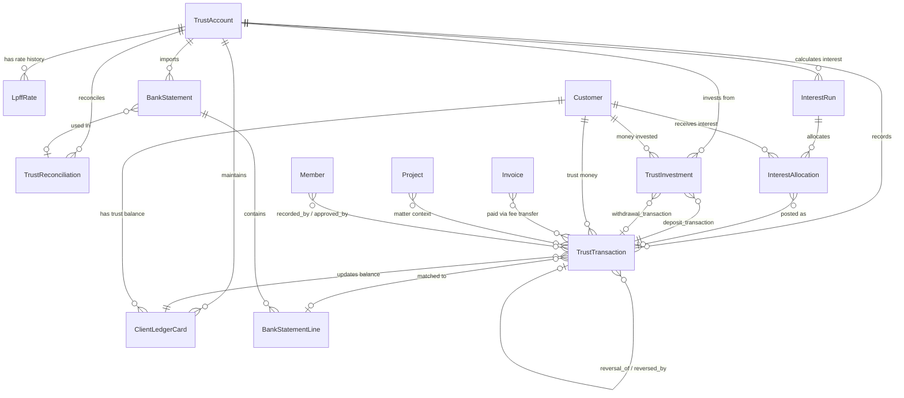
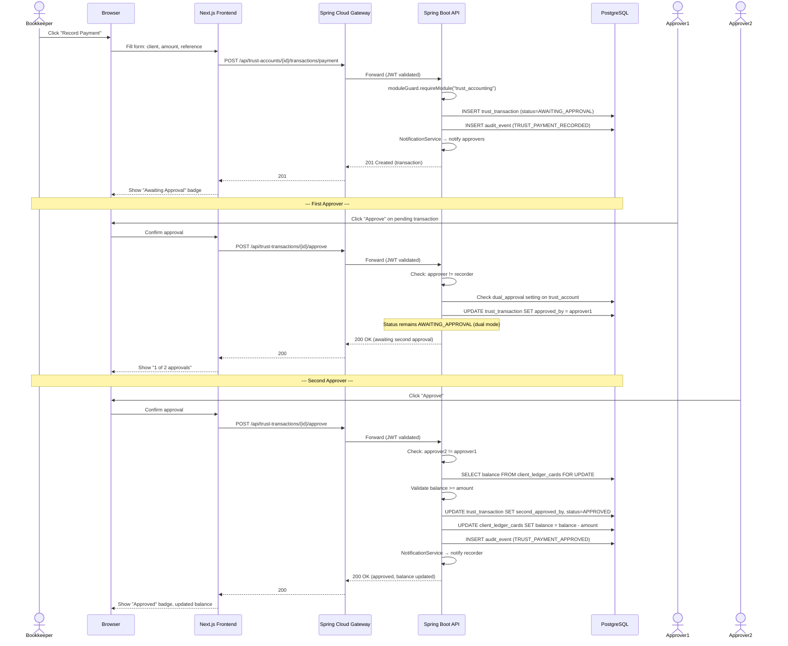
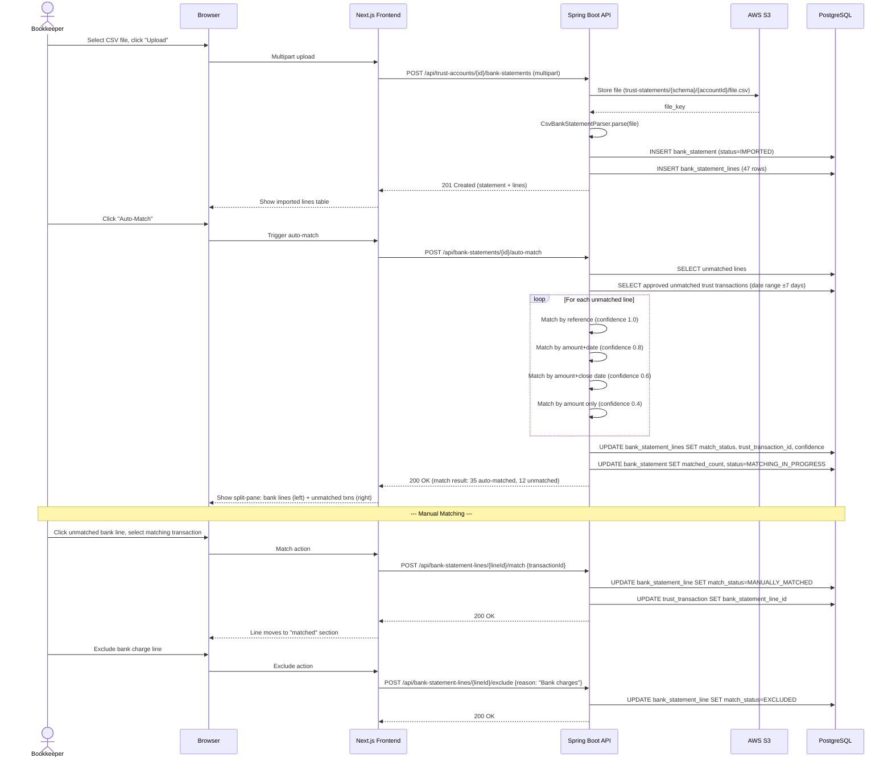
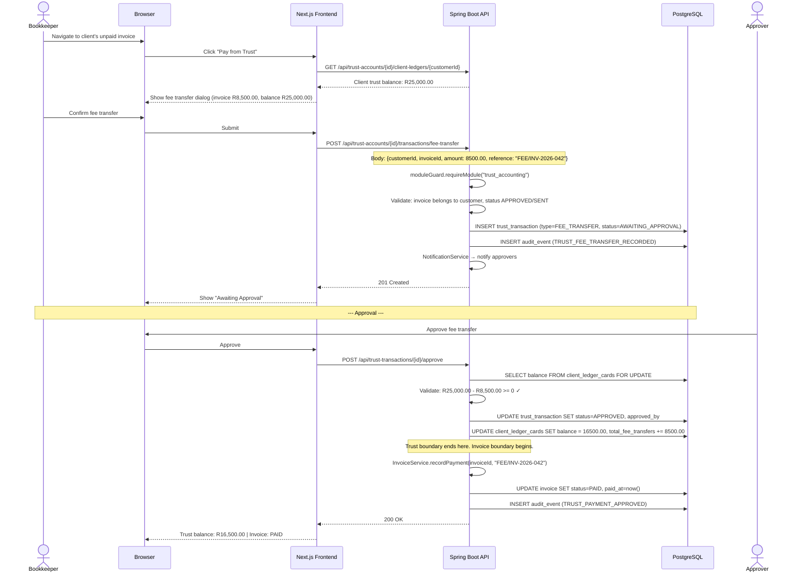
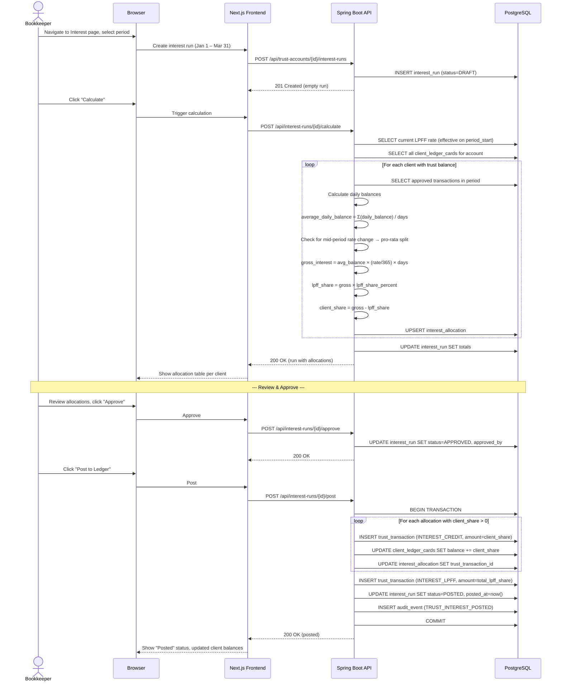

# Phase 60 — Trust Accounting (Legal Practice Act Section 86)

> Standalone architecture document for Phase 60 — Trust Accounting.

---

## 1. Overview

Phase 60 replaces the `trust_accounting` module stub (registered in Phase 49, currently a single `/status` endpoint) with a full double-entry trust ledger system that satisfies the requirements of the Legal Practice Act, 2014 (Section 86) for South African law firms. Trust accounting is the single feature that determines whether the legal vertical is viable — every matter involving client money (litigation, conveyancing, collections, estate administration) requires proper trust handling. Without it, no SA law firm can adopt Kazi for practice management.

The implementation builds on the existing vertical module architecture (Phase 49), the invoice system (Phase 10/25/26), RBAC capabilities (Phase 41/46), audit infrastructure (Phase 6), notification pipeline (Phase 6.5), reporting framework (Phase 19), and S3 storage (Phase 9/21). The `trust_accounting` module registration in `VerticalModuleRegistry` transitions from `"stub"` to `"active"` with full navigation items. The stub controller in `verticals.legal.trustaccounting` and the stub frontend page at `/trust-accounting` are replaced with real implementations.

The system introduces ten new entities (`TrustAccount`, `LpffRate`, `TrustTransaction`, `ClientLedgerCard`, `BankStatement`, `BankStatementLine`, `TrustReconciliation`, `InterestRun`, `InterestAllocation`, `TrustInvestment`), three new RBAC capabilities (`VIEW_TRUST`, `MANAGE_TRUST`, `APPROVE_TRUST_PAYMENT`), and seven new report definitions seeded via the existing `ReportDefinition` framework. All trust tables are created in every tenant schema (module guard controls access, not table presence — the established pattern from Phase 55).

### What's New

| Capability | Before Phase 60 | After Phase 60 |
|---|---|---|
| Trust module | Stub controller, stub frontend page, no data model | Full double-entry ledger, 10 entities, ~40 endpoints |
| Client trust balance | — | Per-client ledger cards with non-negative balance invariant (CHECK + SELECT FOR UPDATE) |
| Trust transactions | — | Immutable transaction ledger: deposit, payment, transfer, fee transfer, refund, interest, reversal |
| Payment authorization | — | Configurable single/dual approval with threshold, self-approval prevention |
| Bank reconciliation | — | CSV import, auto-matching (reference/amount/date), split-pane manual matching, three-way reconciliation |
| Interest calculation | — | Daily balance method, LPFF rate history, pro-rata rate splits, automated posting |
| Trust investments | — | Investment register: place, track interest, mature, withdraw lifecycle |
| Section 35 compliance | — | Seven report types via existing reporting framework (PDF/CSV/Excel) |
| Invoice integration | `paymentDestination` field defaults to `"OPERATING"` | Fee transfers link trust outflow to invoice payment, clean boundary |
| Trust RBAC | `VIEW_LEGAL` / `MANAGE_LEGAL` cover all legal features | Trust-specific: `VIEW_TRUST`, `MANAGE_TRUST`, `APPROVE_TRUST_PAYMENT` |

**Module ID**: `trust_accounting`

**RBAC Capabilities**: `VIEW_TRUST`, `MANAGE_TRUST`, `APPROVE_TRUST_PAYMENT`

**Out of scope**: Non-SA jurisdictions, multi-currency trust accounts, bank API integration, accounting software sync (future BYOAK), customer portal trust view, Section 35 certificate submission API, trust tenant impersonation by platform admin, physical receipt printing.

---

## 2. Domain Model

Phase 60 introduces ten new tenant-scoped entities. All follow the established patterns from the legal vertical (Phase 55): UUID-based FK references (not `@ManyToOne` JPA relationships), String-typed status/type fields, `Instant` for timestamps, `LocalDate` for business dates, protected no-arg constructor plus public business constructor, no Lombok.

### 2.1 TrustAccount

Represents a firm's trust bank account. SA firms typically have one general trust account and optionally one or more investment accounts.

| Column | Type | Constraints | Notes |
|--------|------|-------------|-------|
| `id` | `UUID` | PK, default `gen_random_uuid()` | |
| `account_name` | `VARCHAR(200)` | NOT NULL | Display name, e.g., "General Trust Account" |
| `bank_name` | `VARCHAR(200)` | NOT NULL | E.g., "First National Bank" |
| `branch_code` | `VARCHAR(20)` | NOT NULL | Bank branch code |
| `account_number` | `VARCHAR(30)` | NOT NULL | Trust bank account number |
| `account_type` | `VARCHAR(20)` | NOT NULL | `GENERAL` or `INVESTMENT` |
| `is_primary` | `BOOLEAN` | NOT NULL, default `true` | Only one GENERAL account can be primary |
| `require_dual_approval` | `BOOLEAN` | NOT NULL, default `false` | When true, payments require two approvers |
| `payment_approval_threshold` | `DECIMAL(15,2)` | Nullable | Dual approval only above this amount; NULL = all payments |
| `status` | `VARCHAR(20)` | NOT NULL, default `'ACTIVE'` | `ACTIVE` or `CLOSED` |
| `opened_date` | `DATE` | NOT NULL | When the account was opened |
| `closed_date` | `DATE` | Nullable | When the account was closed |
| `notes` | `TEXT` | Nullable | |
| `created_at` | `TIMESTAMPTZ` | NOT NULL, default `now()` | |
| `updated_at` | `TIMESTAMPTZ` | NOT NULL, default `now()` | |

**Constraints**:
- `UNIQUE (account_type, is_primary) WHERE is_primary = true AND account_type = 'GENERAL'` — partial unique index ensures at most one primary general trust account per tenant.
- `CHECK (account_type IN ('GENERAL', 'INVESTMENT'))` — constrain allowed types.
- `CHECK (status IN ('ACTIVE', 'CLOSED'))` — constrain allowed statuses.
- `CHECK (payment_approval_threshold IS NULL OR payment_approval_threshold > 0)` — threshold must be positive if set.
- `CHECK (closed_date IS NULL OR closed_date >= opened_date)` — closed date cannot precede opened date.

**Indexes**:
- `idx_trust_accounts_type_primary` — partial unique on `(account_type) WHERE is_primary = true AND account_type = 'GENERAL'`.
- `idx_trust_accounts_status` — `(status)` — filter by active/closed.

**Design rationale**: The `is_primary` partial unique index uses a WHERE clause rather than a computed column because PostgreSQL partial unique indexes are well-supported and this avoids adding a trigger or generated column. The `payment_approval_threshold` being nullable (rather than defaulting to 0) distinguishes "dual approval for all amounts" (NULL) from "dual approval above R0" (which would be equivalent but semantically confusing). See [ADR-232](../adr/ADR-232-configurable-dual-authorization.md).

### 2.2 LpffRate

Legal Practitioners Fidelity Fund rate history. The LPFF publishes annual rates that determine the split between client interest credit and the Fund's share. Modelled as a history table so the system can retroactively calculate interest for any period using the rate that was effective at the time.

| Column | Type | Constraints | Notes |
|--------|------|-------------|-------|
| `id` | `UUID` | PK, default `gen_random_uuid()` | |
| `trust_account_id` | `UUID` | NOT NULL, FK → `trust_accounts` | Which trust account this rate applies to |
| `effective_from` | `DATE` | NOT NULL | When this rate takes effect |
| `rate_percent` | `DECIMAL(5,4)` | NOT NULL | Annual interest rate, e.g., 0.0750 for 7.5% |
| `lpff_share_percent` | `DECIMAL(5,4)` | NOT NULL | Portion payable to LPFF, e.g., 0.7500 for 75% |
| `notes` | `VARCHAR(500)` | Nullable | E.g., "LPFF Circular 2025/1" |
| `created_at` | `TIMESTAMPTZ` | NOT NULL, default `now()` | |

**Constraints**:
- `UNIQUE (trust_account_id, effective_from)` — one rate per account per effective date.
- `CHECK (rate_percent >= 0 AND rate_percent <= 1)` — rate is a decimal fraction.
- `CHECK (lpff_share_percent >= 0 AND lpff_share_percent <= 1)` — share is a decimal fraction.

**Indexes**:
- `idx_lpff_rates_account_date` — `(trust_account_id, effective_from DESC)` — resolve current rate efficiently.

**Design rationale**: Storing the rate as `DECIMAL(5,4)` (not percentage points) avoids division in calculation code. The rate is per-account rather than global because investment accounts may have different interest arrangements. The `notes` field captures the regulatory circular reference for audit trail purposes.

### 2.3 TrustTransaction

The core ledger entry. Every movement of trust money is recorded as an immutable `TrustTransaction`. This is the single source of truth for the trust cashbook and feeds into client ledger card balances.

| Column | Type | Constraints | Notes |
|--------|------|-------------|-------|
| `id` | `UUID` | PK, default `gen_random_uuid()` | |
| `trust_account_id` | `UUID` | NOT NULL, FK → `trust_accounts` | |
| `transaction_type` | `VARCHAR(20)` | NOT NULL | See type semantics table |
| `amount` | `DECIMAL(15,2)` | NOT NULL, CHECK > 0 | Always positive; direction determined by type |
| `customer_id` | `UUID` | NOT NULL, FK → `customers` | Every trust transaction is tied to a client |
| `project_id` | `UUID` | Nullable, FK → `projects` | The matter this relates to |
| `counterparty_customer_id` | `UUID` | Nullable, FK → `customers` | For TRANSFER_IN/TRANSFER_OUT — the other client |
| `invoice_id` | `UUID` | Nullable, FK → `invoices` | For FEE_TRANSFER — the invoice being paid from trust |
| `reference` | `VARCHAR(200)` | NOT NULL | Transaction reference (used for bank statement matching) |
| `description` | `TEXT` | Nullable | What this transaction is for |
| `transaction_date` | `DATE` | NOT NULL | The date of the transaction |
| `status` | `VARCHAR(20)` | NOT NULL | See status lifecycle |
| `approved_by` | `UUID` | Nullable, FK → `members` | First approver |
| `approved_at` | `TIMESTAMPTZ` | Nullable | |
| `second_approved_by` | `UUID` | Nullable, FK → `members` | Second approver (dual approval) |
| `second_approved_at` | `TIMESTAMPTZ` | Nullable | |
| `rejected_by` | `UUID` | Nullable, FK → `members` | |
| `rejected_at` | `TIMESTAMPTZ` | Nullable | |
| `rejection_reason` | `VARCHAR(500)` | Nullable | |
| `reversal_of` | `UUID` | Nullable, FK → `trust_transactions` | Points to original if this is a reversal |
| `reversed_by_id` | `UUID` | Nullable, FK → `trust_transactions` | Points to reversal from the original |
| `bank_statement_line_id` | `UUID` | Nullable, FK → `bank_statement_lines` | Set during reconciliation matching |
| `recorded_by` | `UUID` | NOT NULL, FK → `members` | Member who recorded the transaction |
| `created_at` | `TIMESTAMPTZ` | NOT NULL, default `now()` | Immutable — no `updated_at` column |

**Immutability constraint**: TrustTransaction rows are append-only. The only columns that may be updated after creation are: `status` (lifecycle transitions), `approved_by` / `approved_at` / `second_approved_by` / `second_approved_at` (approval workflow), `rejected_by` / `rejected_at` / `rejection_reason` (rejection), `bank_statement_line_id` (reconciliation matching), and `reversed_by_id` (linking to reversal). All other columns (`amount`, `transaction_date`, `customer_id`, `transaction_type`, `reference`, `description`, `project_id`, `invoice_id`, `counterparty_customer_id`, `recorded_by`) are immutable after INSERT. This is a **legal requirement** under Section 86 — the audit trail must be tamper-proof. See [ADR-230](../adr/ADR-230-double-entry-trust-ledger.md).

**No `updated_at` column**: The absence of `updated_at` is intentional. Trust transactions are conceptually immutable. The mutable fields (status, approval) are lifecycle transitions with their own timestamps (`approved_at`, `rejected_at`). An `updated_at` column would imply general mutability, which contradicts the legal requirement.

**Constraints**:
- `CHECK (amount > 0)` — amounts are always positive.
- `CHECK (transaction_type IN ('DEPOSIT', 'PAYMENT', 'TRANSFER_IN', 'TRANSFER_OUT', 'FEE_TRANSFER', 'REFUND', 'INTEREST_CREDIT', 'INTEREST_LPFF', 'REVERSAL'))` — constrain allowed types.
- `CHECK (status IN ('RECORDED', 'AWAITING_APPROVAL', 'APPROVED', 'REJECTED', 'REVERSED'))` — constrain allowed statuses.

**Indexes**:
- `idx_trust_txn_account_date` — `(trust_account_id, transaction_date DESC)` — primary listing query.
- `idx_trust_txn_customer` — `(customer_id, transaction_date DESC)` — client ledger history.
- `idx_trust_txn_status` — `(status) WHERE status = 'AWAITING_APPROVAL'` — pending approvals query.
- `idx_trust_txn_invoice` — `(invoice_id) WHERE invoice_id IS NOT NULL` — fee transfer lookup by invoice.
- `idx_trust_txn_reconciliation` — `(bank_statement_line_id) WHERE bank_statement_line_id IS NOT NULL` — reconciliation lookups.
- `idx_trust_txn_reference` — `(reference)` — bank statement auto-matching by reference.

#### Transaction Type Semantics

| Type | Cashbook Effect | Client Ledger Effect | Requires Approval | Notes |
|------|----------------|---------------------|-------------------|-------|
| `DEPOSIT` | +amount | +amount (credit) | No | Client deposits money into trust |
| `PAYMENT` | −amount | −amount (debit) | **Yes** | Firm pays from trust on behalf of client |
| `TRANSFER_OUT` | 0 | −amount (debit source) | No | Inter-client transfer — source side |
| `TRANSFER_IN` | 0 | +amount (credit target) | No | Inter-client transfer — target side. Paired with TRANSFER_OUT. |
| `FEE_TRANSFER` | −amount | −amount (debit) | **Yes** | Transfer to office account to pay invoice. Links to `Invoice` via FK. |
| `REFUND` | −amount | −amount (debit) | **Yes** | Return unused trust money to client |
| `INTEREST_CREDIT` | +amount | +amount (credit) | No | Interest allocated to client from interest run |
| `INTEREST_LPFF` | −amount | 0 (no client effect) | No | Interest portion paid to Fidelity Fund. `customer_id` references a system-level placeholder. |
| `REVERSAL` | Opposite of original | Opposite of original | Conditional | Reversal of credit transactions requires approval and negative balance check. |

**Paired transactions**: `TRANSFER_IN` and `TRANSFER_OUT` are always created atomically within the same database transaction. A transfer from Client A to Client B creates: `TRANSFER_OUT` (customer=A, counterparty=B) and `TRANSFER_IN` (customer=B, counterparty=A). They share a matching `reference` and `created_at` timestamp but have no explicit linking FK — this avoids circular references while maintaining traceability.

### 2.4 ClientLedgerCard

Materialized per-client trust balance. Auto-created on first transaction, updated atomically on every approved transaction. The running totals provide fast reporting without re-aggregating the transaction history.

| Column | Type | Constraints | Notes |
|--------|------|-------------|-------|
| `id` | `UUID` | PK, default `gen_random_uuid()` | |
| `trust_account_id` | `UUID` | NOT NULL, FK → `trust_accounts` | |
| `customer_id` | `UUID` | NOT NULL, FK → `customers` | |
| `balance` | `DECIMAL(15,2)` | NOT NULL, default 0, **CHECK >= 0** | Current trust balance |
| `total_deposits` | `DECIMAL(15,2)` | NOT NULL, default 0 | Running total of deposits |
| `total_payments` | `DECIMAL(15,2)` | NOT NULL, default 0 | Running total of payments made on behalf |
| `total_fee_transfers` | `DECIMAL(15,2)` | NOT NULL, default 0 | Running total of fee transfers to office |
| `total_interest_credited` | `DECIMAL(15,2)` | NOT NULL, default 0 | Running total of interest credited |
| `last_transaction_date` | `DATE` | Nullable | Date of the most recent transaction |
| `created_at` | `TIMESTAMPTZ` | NOT NULL, default `now()` | |
| `updated_at` | `TIMESTAMPTZ` | NOT NULL, default `now()` | |

**Non-negative balance invariant**: `CHECK (balance >= 0)` at the database level is the last line of defence. The application layer performs `SELECT ... FOR UPDATE` on the `ClientLedgerCard` row before any debit transaction, checks `balance - amount >= 0`, and rejects if not. Both layers are mandatory — the CHECK constraint catches bugs in the application layer, and the SELECT FOR UPDATE prevents race conditions between concurrent approval requests. See [ADR-231](../adr/ADR-231-negative-balance-prevention.md).

**Constraints**:
- `UNIQUE (trust_account_id, customer_id)` — one ledger card per client per trust account.
- `CHECK (balance >= 0)` — **critical legal invariant**. A client's trust balance can never go negative under any circumstances.
- `CHECK (total_deposits >= 0)`, `CHECK (total_payments >= 0)`, `CHECK (total_fee_transfers >= 0)`, `CHECK (total_interest_credited >= 0)` — running totals are non-negative.

**Indexes**:
- `idx_client_ledger_account_customer` — `(trust_account_id, customer_id)` UNIQUE — primary lookup.
- `idx_client_ledger_balance` — `(trust_account_id, balance DESC) WHERE balance > 0` — active clients with non-zero balance.

**Lifecycle**: Auto-created on first approved transaction for a client on an account. Never deleted — even at zero balance, the card persists as a historical record and may receive future transactions.

### 2.5 BankStatement

Represents an imported bank statement file for reconciliation.

| Column | Type | Constraints | Notes |
|--------|------|-------------|-------|
| `id` | `UUID` | PK, default `gen_random_uuid()` | |
| `trust_account_id` | `UUID` | NOT NULL, FK → `trust_accounts` | |
| `period_start` | `DATE` | NOT NULL | Statement period start |
| `period_end` | `DATE` | NOT NULL | Statement period end |
| `opening_balance` | `DECIMAL(15,2)` | NOT NULL | Balance at start of period |
| `closing_balance` | `DECIMAL(15,2)` | NOT NULL | Balance at end of period |
| `file_key` | `VARCHAR(500)` | NOT NULL | S3 key for the uploaded file |
| `file_name` | `VARCHAR(200)` | NOT NULL | Original filename |
| `format` | `VARCHAR(20)` | NOT NULL | `CSV` or `OFX` |
| `line_count` | `INTEGER` | NOT NULL | Number of lines imported |
| `matched_count` | `INTEGER` | NOT NULL, default 0 | Number of lines matched to transactions |
| `status` | `VARCHAR(20)` | NOT NULL, default `'IMPORTED'` | See status lifecycle |
| `imported_by` | `UUID` | NOT NULL, FK → `members` | |
| `created_at` | `TIMESTAMPTZ` | NOT NULL, default `now()` | |
| `updated_at` | `TIMESTAMPTZ` | NOT NULL, default `now()` | |

**Constraints**:
- `CHECK (period_end >= period_start)` — period end cannot precede start.
- `CHECK (format IN ('CSV', 'OFX'))` — constrain allowed formats.
- `CHECK (status IN ('IMPORTED', 'MATCHING_IN_PROGRESS', 'MATCHED', 'RECONCILED'))` — constrain statuses.
- `CHECK (line_count >= 0)`, `CHECK (matched_count >= 0 AND matched_count <= line_count)`.

**Indexes**:
- `idx_bank_stmt_account_period` — `(trust_account_id, period_end DESC)` — list by period.

### 2.6 BankStatementLine

Individual line items parsed from a bank statement file.

| Column | Type | Constraints | Notes |
|--------|------|-------------|-------|
| `id` | `UUID` | PK, default `gen_random_uuid()` | |
| `bank_statement_id` | `UUID` | NOT NULL, FK → `bank_statements` | |
| `line_number` | `INTEGER` | NOT NULL | Position in the statement |
| `transaction_date` | `DATE` | NOT NULL | Date from the bank |
| `description` | `VARCHAR(500)` | NOT NULL | Description from the bank |
| `reference` | `VARCHAR(200)` | Nullable | Reference from the bank |
| `amount` | `DECIMAL(15,2)` | NOT NULL | Signed: positive = credit, negative = debit |
| `running_balance` | `DECIMAL(15,2)` | Nullable | Bank's running balance (if available) |
| `match_status` | `VARCHAR(20)` | NOT NULL, default `'UNMATCHED'` | See match status values |
| `trust_transaction_id` | `UUID` | Nullable, FK → `trust_transactions` | The matched trust transaction |
| `match_confidence` | `DECIMAL(3,2)` | Nullable | Auto-match confidence score (0.00–1.00) |
| `excluded_reason` | `VARCHAR(200)` | Nullable | Why this line was excluded |
| `created_at` | `TIMESTAMPTZ` | NOT NULL, default `now()` | |

**Constraints**:
- `CHECK (match_status IN ('UNMATCHED', 'AUTO_MATCHED', 'MANUALLY_MATCHED', 'EXCLUDED'))`.
- `CHECK (match_confidence IS NULL OR (match_confidence >= 0 AND match_confidence <= 1))`.

**Indexes**:
- `idx_bank_line_statement` — `(bank_statement_id, line_number)` — ordered listing.
- `idx_bank_line_match` — `(match_status) WHERE match_status = 'UNMATCHED'` — unmatched lines for manual matching.

### 2.7 TrustReconciliation

Monthly reconciliation record. Captures the three-way balance check: bank statement vs. cashbook vs. client ledger totals.

| Column | Type | Constraints | Notes |
|--------|------|-------------|-------|
| `id` | `UUID` | PK, default `gen_random_uuid()` | |
| `trust_account_id` | `UUID` | NOT NULL, FK → `trust_accounts` | |
| `period_end` | `DATE` | NOT NULL | Reconciliation date (typically month-end) |
| `bank_statement_id` | `UUID` | Nullable, FK → `bank_statements` | The bank statement used |
| `bank_balance` | `DECIMAL(15,2)` | NOT NULL | Balance per bank statement |
| `cashbook_balance` | `DECIMAL(15,2)` | NOT NULL | Balance per trust cashbook |
| `client_ledger_total` | `DECIMAL(15,2)` | NOT NULL | Sum of all client ledger card balances |
| `outstanding_deposits` | `DECIMAL(15,2)` | NOT NULL, default 0 | Deposits recorded but not yet on bank statement |
| `outstanding_payments` | `DECIMAL(15,2)` | NOT NULL, default 0 | Payments recorded but not yet on bank statement |
| `adjusted_bank_balance` | `DECIMAL(15,2)` | NOT NULL | `bank_balance + outstanding_deposits - outstanding_payments` |
| `is_balanced` | `BOOLEAN` | NOT NULL, default `false` | True when all three balances agree |
| `status` | `VARCHAR(20)` | NOT NULL, default `'DRAFT'` | `DRAFT` or `COMPLETED` |
| `completed_by` | `UUID` | Nullable, FK → `members` | |
| `completed_at` | `TIMESTAMPTZ` | Nullable | |
| `notes` | `TEXT` | Nullable | |
| `created_at` | `TIMESTAMPTZ` | NOT NULL, default `now()` | |
| `updated_at` | `TIMESTAMPTZ` | NOT NULL, default `now()` | |

**Constraints**:
- `CHECK (status IN ('DRAFT', 'COMPLETED'))`.

**Indexes**:
- `idx_trust_recon_account_period` — `(trust_account_id, period_end DESC)` — list by period.

**Design rationale**: The `adjusted_bank_balance` is stored rather than computed on read because the outstanding items change over time (they get matched in subsequent months). The reconciliation captures a point-in-time snapshot. The `is_balanced` flag is computed during `calculateReconciliation()` and checked before `completeReconciliation()` — a reconciliation can only be completed when balanced.

### 2.8 InterestRun

A periodic interest calculation batch. Groups all per-client interest allocations for a date range.

| Column | Type | Constraints | Notes |
|--------|------|-------------|-------|
| `id` | `UUID` | PK, default `gen_random_uuid()` | |
| `trust_account_id` | `UUID` | NOT NULL, FK → `trust_accounts` | |
| `period_start` | `DATE` | NOT NULL | |
| `period_end` | `DATE` | NOT NULL | |
| `lpff_rate_id` | `UUID` | NOT NULL, FK → `lpff_rates` | The rate used for this calculation |
| `total_interest` | `DECIMAL(15,2)` | NOT NULL, default 0 | Total interest earned in the period |
| `total_lpff_share` | `DECIMAL(15,2)` | NOT NULL, default 0 | LPFF's portion |
| `total_client_share` | `DECIMAL(15,2)` | NOT NULL, default 0 | Total credited to clients |
| `status` | `VARCHAR(20)` | NOT NULL, default `'DRAFT'` | `DRAFT`, `APPROVED`, or `POSTED` |
| `approved_by` | `UUID` | Nullable, FK → `members` | |
| `posted_at` | `TIMESTAMPTZ` | Nullable | When interest transactions were created |
| `created_at` | `TIMESTAMPTZ` | NOT NULL, default `now()` | |
| `updated_at` | `TIMESTAMPTZ` | NOT NULL, default `now()` | |

**Constraints**:
- `CHECK (period_end >= period_start)`.
- `CHECK (status IN ('DRAFT', 'APPROVED', 'POSTED'))`.
- `CHECK (total_interest >= 0)`, `CHECK (total_lpff_share >= 0)`, `CHECK (total_client_share >= 0)`.

**Indexes**:
- `idx_interest_run_account_period` — `(trust_account_id, period_end DESC)`.

### 2.9 InterestAllocation

Per-client interest breakdown within an interest run.

| Column | Type | Constraints | Notes |
|--------|------|-------------|-------|
| `id` | `UUID` | PK, default `gen_random_uuid()` | |
| `interest_run_id` | `UUID` | NOT NULL, FK → `interest_runs` | |
| `customer_id` | `UUID` | NOT NULL, FK → `customers` | |
| `average_daily_balance` | `DECIMAL(15,2)` | NOT NULL | Client's average daily balance for the period |
| `days_in_period` | `INTEGER` | NOT NULL | |
| `gross_interest` | `DECIMAL(15,2)` | NOT NULL | Interest earned on this client's balance |
| `lpff_share` | `DECIMAL(15,2)` | NOT NULL | LPFF portion |
| `client_share` | `DECIMAL(15,2)` | NOT NULL | Amount credited to client |
| `trust_transaction_id` | `UUID` | Nullable, FK → `trust_transactions` | FK to the INTEREST_CREDIT transaction when posted |
| `created_at` | `TIMESTAMPTZ` | NOT NULL, default `now()` | |

**Constraints**:
- `UNIQUE (interest_run_id, customer_id)` — one allocation per client per run.
- `CHECK (days_in_period > 0)`.
- `CHECK (gross_interest >= 0)`, `CHECK (lpff_share >= 0)`, `CHECK (client_share >= 0)`.

**Indexes**:
- `idx_interest_alloc_run` — `(interest_run_id)` — list allocations for a run.

### 2.10 TrustInvestment

Tracks client money placed on interest-bearing deposit.

| Column | Type | Constraints | Notes |
|--------|------|-------------|-------|
| `id` | `UUID` | PK, default `gen_random_uuid()` | |
| `trust_account_id` | `UUID` | NOT NULL, FK → `trust_accounts` | Source trust account |
| `customer_id` | `UUID` | NOT NULL, FK → `customers` | Client whose money is invested |
| `institution` | `VARCHAR(200)` | NOT NULL | E.g., "FNB Money Market" |
| `account_number` | `VARCHAR(50)` | NOT NULL | Investment account number |
| `principal` | `DECIMAL(15,2)` | NOT NULL, CHECK > 0 | Amount invested |
| `interest_rate` | `DECIMAL(5,4)` | NOT NULL | Annual interest rate |
| `deposit_date` | `DATE` | NOT NULL | When the investment was placed |
| `maturity_date` | `DATE` | Nullable | When the investment matures; NULL for call deposits |
| `interest_earned` | `DECIMAL(15,2)` | NOT NULL, default 0 | Running total of interest earned |
| `status` | `VARCHAR(20)` | NOT NULL, default `'ACTIVE'` | `ACTIVE`, `MATURED`, or `WITHDRAWN` |
| `withdrawal_date` | `DATE` | Nullable | |
| `withdrawal_amount` | `DECIMAL(15,2)` | Nullable | Principal + earned interest at withdrawal |
| `deposit_transaction_id` | `UUID` | NOT NULL, FK → `trust_transactions` | The PAYMENT that moved money from trust |
| `withdrawal_transaction_id` | `UUID` | Nullable, FK → `trust_transactions` | The DEPOSIT that returned money to trust |
| `notes` | `TEXT` | Nullable | |
| `created_at` | `TIMESTAMPTZ` | NOT NULL, default `now()` | |
| `updated_at` | `TIMESTAMPTZ` | NOT NULL, default `now()` | |

**Constraints**:
- `CHECK (principal > 0)`.
- `CHECK (interest_rate >= 0 AND interest_rate <= 1)`.
- `CHECK (interest_earned >= 0)`.
- `CHECK (status IN ('ACTIVE', 'MATURED', 'WITHDRAWN'))`.
- `CHECK (maturity_date IS NULL OR maturity_date >= deposit_date)`.

**Indexes**:
- `idx_trust_invest_account_status` — `(trust_account_id, status)` — active investments.
- `idx_trust_invest_customer` — `(customer_id)` — client's investments.
- `idx_trust_invest_maturity` — `(maturity_date) WHERE status = 'ACTIVE' AND maturity_date IS NOT NULL` — maturing soon query.

### 2.11 ER Diagram



---

## 3. Core Flows & Backend Behaviour

### 3.1 Trust Transaction Recording

All transaction recording flows share a common pattern: validate inputs, check module gate, create the `TrustTransaction` row, and (for credit transactions) immediately update the `ClientLedgerCard`. Debit transactions that require approval are created in `AWAITING_APPROVAL` status and only affect the ledger upon approval.

**Conceptual service signatures**:

```
TrustTransactionService
  + recordDeposit(trustAccountId, dto) → TrustTransaction
  + recordPayment(trustAccountId, dto) → TrustTransaction
  + recordTransfer(trustAccountId, dto) → Pair<TrustTransaction, TrustTransaction>
  + recordFeeTransfer(trustAccountId, dto) → TrustTransaction
  + recordRefund(trustAccountId, dto) → TrustTransaction
```

**Deposit flow**:
1. Validate: trust account exists and is ACTIVE, customer exists
2. Create `TrustTransaction` with type `DEPOSIT`, status `RECORDED`
3. Upsert `ClientLedgerCard`: increment `balance` and `total_deposits`, set `last_transaction_date`
4. Emit audit event `TRUST_DEPOSIT_RECORDED`
5. Return the created transaction

**Payment flow**:
1. Validate: trust account exists and is ACTIVE, customer exists
2. Create `TrustTransaction` with type `PAYMENT`, status `AWAITING_APPROVAL`
3. **Do not update ledger** — ledger effect deferred to approval
4. Emit audit event `TRUST_PAYMENT_RECORDED`
5. Notify members with `APPROVE_TRUST_PAYMENT` capability (in-app + email)
6. Return the created transaction

**Transfer flow** (atomic pair):
1. Validate: trust account ACTIVE, source customer exists, target customer exists, source != target
2. Check source client balance (SELECT FOR UPDATE): `balance >= amount`
3. Create `TRANSFER_OUT` transaction (customer = source, counterparty = target), status `RECORDED`
4. Create `TRANSFER_IN` transaction (customer = target, counterparty = source), status `RECORDED`
5. Update source `ClientLedgerCard`: decrement `balance`
6. Upsert target `ClientLedgerCard`: increment `balance`
7. Both transactions share the same `reference` and `created_at`
8. Emit audit event `TRUST_TRANSFER_RECORDED`
9. Return the pair

**Fee transfer flow**:
1. Validate: trust account ACTIVE, customer exists, invoice exists and belongs to customer, invoice status is APPROVED or SENT
2. Create `TrustTransaction` with type `FEE_TRANSFER`, status `AWAITING_APPROVAL`, `invoice_id` set
3. Emit audit event `TRUST_FEE_TRANSFER_RECORDED`
4. Notify approvers
5. Return the created transaction

*On approval*: The invoice's `recordPayment()` method is called to transition it to PAID status. The trust-to-office boundary is clean: trust records the outflow, invoice records the payment.

**Refund flow**:
1. Validate: trust account ACTIVE, customer exists
2. Create `TrustTransaction` with type `REFUND`, status `AWAITING_APPROVAL`
3. Emit audit event `TRUST_REFUND_RECORDED`
4. Notify approvers
5. Return the created transaction

### 3.2 Approval Workflow

**Conceptual service signatures**:

```
TrustTransactionService
  + approveTransaction(transactionId, approverId) → TrustTransaction
  + rejectTransaction(transactionId, rejecterId, reason) → TrustTransaction
```

**Single approval mode** (default — `trust_account.require_dual_approval = false`):

1. Validate: transaction status is `AWAITING_APPROVAL`
2. Validate: approver has `APPROVE_TRUST_PAYMENT` capability
3. **Self-approval prevention**: approver (`approverId`) != recorder (`recorded_by`). If same, reject with 400: "The transaction recorder cannot be the sole approver."
4. Perform negative balance check (see 3.3)
5. Set `approved_by = approverId`, `approved_at = now()`
6. Transition status to `APPROVED`
7. Update `ClientLedgerCard` (debit: decrement balance, update running totals)
8. If FEE_TRANSFER: call `InvoiceService.recordPayment()` to mark invoice as PAID
9. Emit audit event `TRUST_PAYMENT_APPROVED`
10. Notify the recorder that their transaction was approved (in-app)

**Dual approval mode** (`trust_account.require_dual_approval = true`):

1. First approver approves: set `approved_by`, status remains `AWAITING_APPROVAL`
2. Second approver (must be different from first approver) approves: set `second_approved_by`, then follow steps 4-10 from single approval
3. **Self-approval prevention in dual mode**: The recorder can be one of the two approvers, but not both. If `recorded_by == approved_by`, then `second_approved_by` must be different from both. The recorder can never be the sole person authorizing a payment.

**Threshold-based dual approval** (`payment_approval_threshold` is set):

When `amount >= threshold`, dual approval is required even if only single approval would otherwise suffice. When `amount < threshold`, single approval suffices even when dual mode is enabled. This allows firms to require two signatures only for large payments.

**Rejection**:
1. Any member with `APPROVE_TRUST_PAYMENT` can reject at any stage
2. Set `rejected_by`, `rejected_at`, `rejection_reason`
3. Transition status to `REJECTED`
4. No ledger effect
5. Emit audit event `TRUST_PAYMENT_REJECTED`
6. Notify the recorder (in-app + email)

See [ADR-232](../adr/ADR-232-configurable-dual-authorization.md) for the decision rationale.

### 3.3 Negative Balance Prevention

Before any debit transaction is approved (PAYMENT, FEE_TRANSFER, REFUND) or executed (TRANSFER_OUT):

```
BEGIN TRANSACTION
  SELECT balance FROM client_ledger_cards
    WHERE trust_account_id = ? AND customer_id = ?
    FOR UPDATE;                                    -- Row-level lock

  IF (balance - amount) < 0 THEN
    ROLLBACK;
    THROW InvalidStateException(
      "Insufficient trust balance for {clientName}. Available: R{balance}, Requested: R{amount}"
    );
  END IF;

  -- Proceed with ledger update
  UPDATE client_ledger_cards SET balance = balance - amount, ...
  WHERE trust_account_id = ? AND customer_id = ?;
COMMIT
```

**Two-layer defence** (belt and suspenders):

1. **Application layer**: `SELECT ... FOR UPDATE` within the approval transaction. Serializes concurrent approvals for the same client. Returns a clear, business-meaningful error message.
2. **Database layer**: `CHECK (balance >= 0)` on `client_ledger_cards`. Catches any application-layer bugs. Returns a constraint violation that the service layer translates to a 400 response.

**Why both layers**: The application-layer check provides good UX (clear error message, no cryptic constraint violation). The database-layer check provides safety (even if the application logic is buggy, the invariant holds). For a legal compliance requirement of this severity, defence in depth is non-negotiable. The contention introduced by SELECT FOR UPDATE is acceptable — trust transaction volumes for a typical SA law firm are 50–200/day, well within the capacity of row-level locks. See [ADR-231](../adr/ADR-231-negative-balance-prevention.md).

### 3.4 Transaction Reversal

**Conceptual service signature**:

```
TrustTransactionService
  + reverseTransaction(transactionId, reason) → TrustTransaction
```

**Flow**:
1. Validate: original transaction status is `APPROVED` (cannot reverse AWAITING_APPROVAL, REJECTED, or already REVERSED)
2. Validate: original transaction has no existing reversal (`reversed_by_id IS NULL`)
3. Create a new `TrustTransaction` with type `REVERSAL`, `reversal_of = originalId`
4. The reversal has the **opposite ledger effect** of the original (see type semantics table)
5. Update the original transaction: set `reversed_by_id` to the reversal's ID, set status to `REVERSED`
6. **Conditional approval requirement**:
   - Reversals of debit transactions (PAYMENT, FEE_TRANSFER, REFUND, TRANSFER_OUT) add money back to the client ledger — these do **not** require approval (status = `RECORDED`, immediate ledger effect)
   - Reversals of credit transactions (DEPOSIT, TRANSFER_IN, INTEREST_CREDIT) remove money from the client ledger — these **require** approval and negative balance check
7. Update `ClientLedgerCard` accordingly
8. Emit audit event `TRUST_TRANSACTION_REVERSED`

**Design rationale**: Reversals (rather than edits or deletions) preserve the complete audit trail. Every state the ledger has ever been in is reconstructible from the transaction log. This is a Legal Practice Act requirement — the trust ledger must be tamper-proof.

### 3.5 Bank Statement Import & Auto-Matching

**Conceptual service signatures**:

```
TrustReconciliationService
  + importBankStatement(accountId, file) → BankStatement
  + autoMatchStatement(statementId) → MatchResult
  + manualMatch(statementLineId, transactionId) → void
  + unmatch(statementLineId) → void
  + excludeLine(statementLineId, reason) → void
```

**Import flow**:
1. Receive multipart file upload
2. Store original file in S3: `trust-statements/{tenantSchema}/{accountId}/{filename}`
3. Detect format from file extension and header content
4. Delegate to `BankStatementParser` implementation (strategy pattern)
5. Parser extracts: period start/end, opening/closing balance, and all line items
6. Create `BankStatement` record with status `IMPORTED`
7. Create `BankStatementLine` records for each parsed line
8. Return the statement with all lines for review

**Auto-matching algorithm** (run on demand via `autoMatchStatement()`):

For each unmatched bank statement line, find candidate trust transactions (approved, not yet matched to a bank line, within the statement date range ±7 days):

1. **Exact reference match** (confidence: 1.00) — `bank_line.reference = trust_transaction.reference` (case-insensitive). If exactly one candidate matches, auto-match.
2. **Amount + exact date** (confidence: 0.80) — `abs(bank_line.amount) = trust_transaction.amount AND bank_line.transaction_date = trust_transaction.transaction_date`. If exactly one candidate, auto-match.
3. **Amount + close date** (confidence: 0.60) — same amount, date within ±3 business days, exactly one candidate. Flagged for review (below auto-match threshold).
4. **Amount only** (confidence: 0.40) — same amount, multiple candidates or date mismatch. Flagged for manual matching.

**Auto-match threshold**: Lines with confidence >= 0.80 are automatically matched (status → `AUTO_MATCHED`). Below 0.80, the line remains `UNMATCHED` for manual matching. The confidence score is stored on the `BankStatementLine` for the bookkeeper to review.

**Amount sign convention**: Bank statement amounts are signed (positive = credit/deposit, negative = debit/payment). Trust transaction amounts are always positive. The matcher compares `abs(bank_line.amount)` to `trust_transaction.amount` and validates that the sign direction matches the transaction type (credit types = positive, debit types = negative).

See [ADR-233](../adr/ADR-233-bank-reconciliation-matching.md).

### 3.6 Three-Way Reconciliation

**Conceptual service signatures**:

```
TrustReconciliationService
  + createReconciliation(accountId, periodEnd, bankStatementId) → TrustReconciliation
  + calculateReconciliation(reconciliationId) → TrustReconciliation
  + completeReconciliation(reconciliationId) → TrustReconciliation
```

**Calculation flow** (`calculateReconciliation`):

```
bank_balance           = bank_statement.closing_balance
cashbook_balance       = SUM(approved cashbook-affecting trust_transactions for account)
client_ledger_total    = SUM(client_ledger_cards.balance for account)
outstanding_deposits   = SUM(amount) of approved DEPOSIT/INTEREST_CREDIT transactions
                         not matched to any bank statement line
outstanding_payments   = SUM(amount) of approved PAYMENT/FEE_TRANSFER/REFUND/INTEREST_LPFF transactions
                         not matched to any bank statement line
adjusted_bank_balance  = bank_balance + outstanding_deposits - outstanding_payments

is_balanced = (adjusted_bank_balance == cashbook_balance)
              AND (cashbook_balance == client_ledger_total)
```

**Completion guard**: `completeReconciliation()` checks `is_balanced == true`. If the three balances do not agree, completion is rejected with a 400 error detailing each difference. This is the core compliance check — every monthly reconciliation must demonstrate that the bank, cashbook, and client ledgers are in agreement.

**Outstanding items**: Approved trust transactions not matched to any bank statement line are "outstanding" — timing differences where money has been recorded in the trust system but hasn't yet appeared on the bank statement (or vice versa). These are normal and expected. They must be resolved in subsequent months' reconciliations.

### 3.7 Interest Calculation

**Conceptual service signatures**:

```
InterestService
  + createInterestRun(accountId, periodStart, periodEnd) → InterestRun
  + calculateInterest(runId) → InterestRun
```

**Daily balance method** (per client):

1. Get all approved transactions for the client on this trust account, ordered by `transaction_date`, for dates within `[period_start, period_end]`
2. Reconstruct the daily balance: starting from the client's balance at `period_start - 1 day`, apply each transaction's ledger effect on its `transaction_date`
3. For each day in the period, record the balance at the start of that day
4. Sum all daily balances → `total_balance_days`
5. `average_daily_balance = total_balance_days / days_in_period`
6. `gross_interest = average_daily_balance × (annual_rate / 365) × days_in_period`
7. `lpff_share = gross_interest × lpff_share_percent`
8. `client_share = gross_interest - lpff_share`

**Rate lookup**: Use the `LpffRate` whose `effective_from` is on or before `period_start`. If the rate changes mid-period (a new `LpffRate` has `effective_from` within `[period_start, period_end]`), split the calculation at the rate change boundary:
- Segment 1: `period_start` to `rate_change_date - 1` at old rate
- Segment 2: `rate_change_date` to `period_end` at new rate
- Sum the interest from both segments

This pro-rata approach ensures accurate interest even during the annual LPFF rate change (typically effective 1 March). See [ADR-234](../adr/ADR-234-interest-daily-balance-method.md).

**Rounding**: All interest amounts are rounded to 2 decimal places (ZAR cents) using `HALF_UP` rounding. The LPFF share is calculated first and rounded; the client share is `gross_interest - lpff_share` (not independently rounded) to avoid rounding discrepancies.

### 3.8 Interest Posting

**Conceptual service signature**:

```
InterestService
  + postInterestRun(runId) → InterestRun
```

**Flow**:
1. Validate: interest run status is `APPROVED`
2. For each `InterestAllocation` with `client_share > 0`:
   - Create a `TrustTransaction` (type `INTEREST_CREDIT`, amount = `client_share`, customer = allocation's customer)
   - This credits the client's ledger card (balance increases)
   - Set `allocation.trust_transaction_id` to the new transaction's ID
3. Create a single `TrustTransaction` (type `INTEREST_LPFF`, amount = `total_lpff_share`)
   - This debits the cashbook (money owed/paid to the Legal Practitioners Fidelity Fund)
   - The `customer_id` references a system-level placeholder customer (or can be NULL if the schema permits — this is a firm-level outflow, not client-specific)
4. All transactions are created atomically within a single database transaction
5. Set `interest_run.status = 'POSTED'`, `interest_run.posted_at = now()`
6. Emit audit event `TRUST_INTEREST_POSTED`
7. Notify firm admin of posted interest amounts

### 3.9 Investment Lifecycle

**Conceptual service signatures**:

```
TrustInvestmentService
  + placeInvestment(accountId, dto) → TrustInvestment
  + recordInterestEarned(investmentId, amount) → TrustInvestment
  + withdrawInvestment(investmentId) → TrustInvestment
  + getMaturing(accountId, daysAhead) → List<TrustInvestment>
```

**Place investment**:
1. Validate: trust account ACTIVE, customer exists, customer has sufficient trust balance
2. Create a `PAYMENT` transaction from trust (debits client's trust balance) with description referencing the investment
3. Create `TrustInvestment` record with status `ACTIVE`, linking `deposit_transaction_id`
4. The PAYMENT transaction follows the normal approval workflow — the investment is only activated once the payment is approved
5. Emit audit event `TRUST_INVESTMENT_PLACED`

**Record interest earned**:
1. Validate: investment status is `ACTIVE`
2. Increment `interest_earned` by the specified amount
3. This does **not** affect the trust ledger — interest stays in the investment until withdrawal

**Withdraw investment**:
1. Validate: investment status is `ACTIVE` or `MATURED`
2. Calculate `withdrawal_amount = principal + interest_earned`
3. Create a `DEPOSIT` transaction to trust (credits client's trust balance) for the withdrawal amount
4. Set investment status to `WITHDRAWN`, record `withdrawal_date` and `withdrawal_amount`
5. Link `withdrawal_transaction_id`
6. Emit audit event `TRUST_INVESTMENT_WITHDRAWN`

**Maturity detection**: A scheduled job (or on-demand query) checks for investments where `maturity_date <= today + N days` and `status = 'ACTIVE'`. These are surfaced on the trust dashboard and trigger notifications to the member who placed the investment.

---

## 4. API Surface

### 4.1 Trust Accounts

| Method | Path | Auth | Description |
|--------|------|------|-------------|
| `GET` | `/api/trust-accounts` | `VIEW_TRUST` | List trust accounts |
| `GET` | `/api/trust-accounts/{id}` | `VIEW_TRUST` | Single trust account detail |
| `POST` | `/api/trust-accounts` | `MANAGE_TRUST` | Create trust account |
| `PUT` | `/api/trust-accounts/{id}` | `MANAGE_TRUST` | Update account (name, bank details, approval settings) |
| `POST` | `/api/trust-accounts/{id}/close` | `MANAGE_TRUST` | Close account (guarded: zero balance required) |
| `GET` | `/api/trust-accounts/{id}/lpff-rates` | `VIEW_TRUST` | List LPFF rate history |
| `POST` | `/api/trust-accounts/{id}/lpff-rates` | `MANAGE_TRUST` | Add new LPFF rate |

### 4.2 Trust Transactions

| Method | Path | Auth | Description |
|--------|------|------|-------------|
| `GET` | `/api/trust-accounts/{accountId}/transactions` | `VIEW_TRUST` | List transactions (filterable) |
| `GET` | `/api/trust-accounts/{accountId}/transactions/{id}` | `VIEW_TRUST` | Single transaction detail |
| `POST` | `/api/trust-accounts/{accountId}/transactions/deposit` | `MANAGE_TRUST` | Record deposit |
| `POST` | `/api/trust-accounts/{accountId}/transactions/payment` | `MANAGE_TRUST` | Record payment (→ AWAITING_APPROVAL) |
| `POST` | `/api/trust-accounts/{accountId}/transactions/transfer` | `MANAGE_TRUST` | Record inter-client transfer |
| `POST` | `/api/trust-accounts/{accountId}/transactions/fee-transfer` | `MANAGE_TRUST` | Record fee transfer to office (links to invoice) |
| `POST` | `/api/trust-accounts/{accountId}/transactions/refund` | `MANAGE_TRUST` | Record refund to client |

**Query parameters** for `GET .../transactions`:
- `dateFrom` / `dateTo` — `DATE` (ISO format) — filter by transaction date range
- `type` — `STRING` — filter by transaction type
- `status` — `STRING` — filter by status
- `customerId` — `UUID` — filter by client
- `projectId` — `UUID` — filter by matter
- `page` / `size` / `sort` — standard Spring Data pagination

### 4.3 Transaction Approvals

| Method | Path | Auth | Description |
|--------|------|------|-------------|
| `POST` | `/api/trust-transactions/{id}/approve` | `APPROVE_TRUST_PAYMENT` | Approve a pending transaction |
| `POST` | `/api/trust-transactions/{id}/reject` | `APPROVE_TRUST_PAYMENT` | Reject a pending transaction |
| `POST` | `/api/trust-transactions/{id}/reverse` | `MANAGE_TRUST` | Reverse an approved transaction |
| `GET` | `/api/trust-accounts/{accountId}/pending-approvals` | `VIEW_TRUST` | List pending approvals |
| `GET` | `/api/trust-accounts/{accountId}/cashbook-balance` | `VIEW_TRUST` | Current cashbook balance |

### 4.4 Client Ledgers

| Method | Path | Auth | Description |
|--------|------|------|-------------|
| `GET` | `/api/trust-accounts/{accountId}/client-ledgers` | `VIEW_TRUST` | List all client ledger cards |
| `GET` | `/api/trust-accounts/{accountId}/client-ledgers/{customerId}` | `VIEW_TRUST` | Single client ledger card with balance |
| `GET` | `/api/trust-accounts/{accountId}/client-ledgers/{customerId}/history` | `VIEW_TRUST` | Transaction history for client |
| `GET` | `/api/trust-accounts/{accountId}/client-ledgers/{customerId}/statement` | `VIEW_TRUST` | Ledger statement (date range, renderable) |
| `GET` | `/api/trust-accounts/{accountId}/total-balance` | `VIEW_TRUST` | Sum of all client balances |

**Query parameters** for `GET .../client-ledgers`:
- `nonZeroOnly` — `BOOLEAN` — filter to clients with non-zero balance
- `search` — `STRING` — customer name search
- `page` / `size` / `sort` — standard pagination

### 4.5 Bank Statements & Reconciliation

| Method | Path | Auth | Description |
|--------|------|------|-------------|
| `POST` | `/api/trust-accounts/{accountId}/bank-statements` | `MANAGE_TRUST` | Upload & import statement (multipart) |
| `GET` | `/api/trust-accounts/{accountId}/bank-statements` | `VIEW_TRUST` | List imported statements |
| `GET` | `/api/bank-statements/{statementId}` | `VIEW_TRUST` | Statement detail with lines |
| `POST` | `/api/bank-statements/{statementId}/auto-match` | `MANAGE_TRUST` | Trigger auto-matching |
| `POST` | `/api/bank-statement-lines/{lineId}/match` | `MANAGE_TRUST` | Manual match |
| `POST` | `/api/bank-statement-lines/{lineId}/unmatch` | `MANAGE_TRUST` | Remove match |
| `POST` | `/api/bank-statement-lines/{lineId}/exclude` | `MANAGE_TRUST` | Exclude line with reason |
| `POST` | `/api/trust-accounts/{accountId}/reconciliations` | `MANAGE_TRUST` | Create new reconciliation |
| `GET` | `/api/trust-accounts/{accountId}/reconciliations` | `VIEW_TRUST` | List reconciliations |
| `GET` | `/api/trust-reconciliations/{reconciliationId}` | `VIEW_TRUST` | Reconciliation detail |
| `POST` | `/api/trust-reconciliations/{reconciliationId}/calculate` | `MANAGE_TRUST` | Calculate/refresh balances |
| `POST` | `/api/trust-reconciliations/{reconciliationId}/complete` | `MANAGE_TRUST` | Mark complete (guarded: must balance) |

### 4.6 Interest & LPFF

| Method | Path | Auth | Description |
|--------|------|------|-------------|
| `POST` | `/api/trust-accounts/{accountId}/interest-runs` | `MANAGE_TRUST` | Create interest run |
| `GET` | `/api/trust-accounts/{accountId}/interest-runs` | `VIEW_TRUST` | List interest runs |
| `GET` | `/api/interest-runs/{runId}` | `VIEW_TRUST` | Interest run detail with allocations |
| `POST` | `/api/interest-runs/{runId}/calculate` | `MANAGE_TRUST` | Calculate/recalculate |
| `POST` | `/api/interest-runs/{runId}/approve` | `APPROVE_TRUST_PAYMENT` | Approve interest run |
| `POST` | `/api/interest-runs/{runId}/post` | `MANAGE_TRUST` | Post to ledger (creates transactions) |

### 4.7 Investments

| Method | Path | Auth | Description |
|--------|------|------|-------------|
| `GET` | `/api/trust-accounts/{accountId}/investments` | `VIEW_TRUST` | List investments (filterable by status, customer) |
| `GET` | `/api/trust-investments/{investmentId}` | `VIEW_TRUST` | Investment detail |
| `POST` | `/api/trust-accounts/{accountId}/investments` | `MANAGE_TRUST` | Place new investment |
| `PUT` | `/api/trust-investments/{investmentId}/interest` | `MANAGE_TRUST` | Record interest earned |
| `POST` | `/api/trust-investments/{investmentId}/withdraw` | `MANAGE_TRUST` | Withdraw investment back to trust |
| `GET` | `/api/trust-accounts/{accountId}/investments/maturing` | `VIEW_TRUST` | Investments maturing within N days |

### 4.8 Reports

Reports use the existing report execution endpoints from Phase 19. No new endpoints — just new `ReportDefinition` registrations:

```
POST /api/reports/execute    — execute a report (body: { reportSlug, parameters, format })
GET  /api/reports/{executionId}/download  — download rendered report
```

### 4.9 Key Request/Response Shapes

**Record Deposit** (`POST /api/trust-accounts/{accountId}/transactions/deposit`):

```json
{
  "customerId": "uuid",
  "projectId": "uuid | null",
  "amount": 15000.00,
  "reference": "DEP/2026/001",
  "description": "Litigation deposit — Smith v Jones",
  "transactionDate": "2026-04-01"
}
```

Response (201):

```json
{
  "id": "uuid",
  "trustAccountId": "uuid",
  "transactionType": "DEPOSIT",
  "amount": 15000.00,
  "customerId": "uuid",
  "customerName": "Smith & Co.",
  "projectId": "uuid",
  "reference": "DEP/2026/001",
  "description": "Litigation deposit — Smith v Jones",
  "transactionDate": "2026-04-01",
  "status": "RECORDED",
  "recordedBy": "uuid",
  "recordedByName": "Jane Doe",
  "createdAt": "2026-04-01T10:30:00Z"
}
```

**Approve Transaction** (`POST /api/trust-transactions/{id}/approve`):

Request body: empty (approver identity from JWT)

Response (200):

```json
{
  "id": "uuid",
  "transactionType": "PAYMENT",
  "amount": 5000.00,
  "status": "APPROVED",
  "approvedBy": "uuid",
  "approvedByName": "John Smith",
  "approvedAt": "2026-04-01T11:00:00Z",
  "secondApprovedBy": null,
  "clientBalance": 10000.00
}
```

**Import Bank Statement** (`POST /api/trust-accounts/{accountId}/bank-statements`):

Request: `multipart/form-data` with file field

Response (201):

```json
{
  "id": "uuid",
  "trustAccountId": "uuid",
  "periodStart": "2026-03-01",
  "periodEnd": "2026-03-31",
  "openingBalance": 125000.00,
  "closingBalance": 142500.00,
  "fileName": "fnb-trust-march-2026.csv",
  "format": "CSV",
  "lineCount": 47,
  "matchedCount": 0,
  "status": "IMPORTED",
  "lines": [
    {
      "id": "uuid",
      "lineNumber": 1,
      "transactionDate": "2026-03-01",
      "description": "DEPOSIT Smith & Co Ref DEP/2026/001",
      "reference": "DEP/2026/001",
      "amount": 15000.00,
      "runningBalance": 140000.00,
      "matchStatus": "UNMATCHED",
      "matchConfidence": null
    }
  ]
}
```

**Complete Reconciliation** (`POST /api/trust-reconciliations/{id}/complete`):

Request body: empty

Response (200 — if balanced):

```json
{
  "id": "uuid",
  "periodEnd": "2026-03-31",
  "bankBalance": 142500.00,
  "cashbookBalance": 145000.00,
  "clientLedgerTotal": 145000.00,
  "outstandingDeposits": 2500.00,
  "outstandingPayments": 0.00,
  "adjustedBankBalance": 145000.00,
  "isBalanced": true,
  "status": "COMPLETED",
  "completedBy": "uuid",
  "completedAt": "2026-04-02T14:00:00Z"
}
```

Response (400 — if not balanced):

```json
{
  "type": "about:blank",
  "title": "Reconciliation not balanced",
  "status": 400,
  "detail": "Cannot complete reconciliation: adjusted bank balance (R142,500.00) does not equal cashbook balance (R145,000.00). Difference: R2,500.00."
}
```

---

## 5. Sequence Diagrams

### 5.1 Record Payment with Dual Approval



### 5.2 Bank Statement Import & Auto-Match



### 5.3 Fee Transfer from Trust to Office



### 5.4 Interest Calculation & Posting



---

## 6. Bank Statement Import

### 6.1 CSV Parser Strategy Pattern

The bank statement import system uses the strategy pattern to support multiple CSV formats from different SA banks. Each bank has a slightly different column layout, date format, and header structure.

**Interface**:

```
BankStatementParser
  + canParse(fileName, headerLine) → boolean
  + parse(inputStream) → ParsedStatement
```

```
ParsedStatement
  - periodStart: LocalDate
  - periodEnd: LocalDate
  - openingBalance: BigDecimal
  - closingBalance: BigDecimal
  - lines: List<ParsedStatementLine>
```

**Implementations** (initial):

| Parser | Bank | Detection | Date Format | Notes |
|--------|------|-----------|-------------|-------|
| `FnbCsvParser` | First National Bank | Header contains "FNB" or "First National" | `dd/MM/yyyy` | Most common SA bank for trust accounts |
| `StandardBankCsvParser` | Standard Bank | Header contains "Standard Bank" | `yyyy-MM-dd` | |
| `NedbankCsvParser` | Nedbank | Header contains "Nedbank" | `dd MMM yyyy` | |
| `AbsaCsvParser` | ABSA | Header contains "Absa" or "ABSA" | `dd/MM/yyyy` | |
| `GenericCsvParser` | Fallback | Default if no bank detected | User-configurable | Prompts user to map columns |

**Detection flow**: On upload, the system reads the first few lines of the file. Each parser's `canParse()` method checks for recognizable patterns in the header row. The first parser that returns `true` is used. If none match, the `GenericCsvParser` is used with a column-mapping step in the UI.

**OFX parser**: `OfxBankStatementParser` is a stretch goal. OFX (Open Financial Exchange) is a standardized format that doesn't need bank-specific detection. If implemented, it parses the XML structure directly.

### 6.2 Auto-Matching Algorithm

The auto-matching algorithm scores potential matches between bank statement lines and unmatched trust transactions. The algorithm runs sequentially through four strategies, stopping at the first match found for each line:

| Priority | Strategy | Confidence | Auto-Match? | Criteria |
|----------|----------|-----------|-------------|----------|
| 1 | Exact reference | 1.00 | Yes | `lower(bank_line.reference) = lower(trust_txn.reference)` AND exactly one candidate |
| 2 | Amount + exact date | 0.80 | Yes | `abs(bank_line.amount) = trust_txn.amount` AND `bank_line.date = trust_txn.date` AND exactly one candidate |
| 3 | Amount + close date | 0.60 | No (flagged) | Same amount, date within ±3 business days, exactly one candidate |
| 4 | Amount only | 0.40 | No (flagged) | Same amount, any date, multiple or zero-date-match candidates |

**Candidate pool**: Only approved trust transactions that (a) don't already have a `bank_statement_line_id` set and (b) have `transaction_date` within `[statement.period_start - 7 days, statement.period_end + 7 days]` are considered as candidates.

**Auto-match threshold**: Confidence >= 0.80 triggers automatic matching. Below 0.80, the line is flagged as `UNMATCHED` with the confidence score and best candidate stored for the bookkeeper to review.

**Sign validation**: The matcher verifies that the direction (credit/debit) of the bank line matches the expected direction for the transaction type. A positive bank line (credit) should match deposit types; a negative bank line (debit) should match payment types. Mismatches are excluded from candidates.

### 6.3 Manual Matching UX Flow

The manual matching interface is a split-pane layout designed for the bookkeeper's workflow:

1. **Left panel**: Bank statement lines, sorted by date. Colour-coded: green (auto-matched), blue (manually matched), grey (excluded), yellow/red (unmatched).
2. **Right panel**: Unmatched trust transactions for the same period, sorted by date.
3. **Interaction**: Click a bank line → the right panel highlights candidate transactions (same amount, similar date). Click a transaction → "Match" button activates. Click "Match" to link them.
4. **Exclude**: For bank lines that are not trust transactions (bank charges, interest on the bank account itself), click "Exclude" and provide a reason.
5. **Unmatch**: Previously matched lines can be unmatched if matched incorrectly.
6. **Progress bar**: Shows matched/total at the top of the panel.

---

## 7. Database Migration (V85)

```sql
-- ============================================================
-- V85__create_trust_accounting_tables.sql
-- Phase 60: Trust Accounting (Legal Practice Act Section 86)
-- ============================================================

-- ============================================================
-- 1. Trust Accounts
-- ============================================================

CREATE TABLE IF NOT EXISTS trust_accounts (
    id                          UUID PRIMARY KEY DEFAULT gen_random_uuid(),
    account_name                VARCHAR(200) NOT NULL,
    bank_name                   VARCHAR(200) NOT NULL,
    branch_code                 VARCHAR(20) NOT NULL,
    account_number              VARCHAR(30) NOT NULL,
    account_type                VARCHAR(20) NOT NULL DEFAULT 'GENERAL',
    is_primary                  BOOLEAN NOT NULL DEFAULT true,
    require_dual_approval       BOOLEAN NOT NULL DEFAULT false,
    payment_approval_threshold  DECIMAL(15,2),
    status                      VARCHAR(20) NOT NULL DEFAULT 'ACTIVE',
    opened_date                 DATE NOT NULL,
    closed_date                 DATE,
    notes                       TEXT,
    created_at                  TIMESTAMPTZ NOT NULL DEFAULT now(),
    updated_at                  TIMESTAMPTZ NOT NULL DEFAULT now(),

    CONSTRAINT chk_trust_account_type
        CHECK (account_type IN ('GENERAL', 'INVESTMENT')),
    CONSTRAINT chk_trust_account_status
        CHECK (status IN ('ACTIVE', 'CLOSED')),
    CONSTRAINT chk_trust_account_threshold
        CHECK (payment_approval_threshold IS NULL OR payment_approval_threshold > 0),
    CONSTRAINT chk_trust_account_closed_date
        CHECK (closed_date IS NULL OR closed_date >= opened_date)
);

-- Only one primary general trust account per tenant
CREATE UNIQUE INDEX IF NOT EXISTS idx_trust_accounts_primary_general
    ON trust_accounts (account_type)
    WHERE is_primary = true AND account_type = 'GENERAL';

CREATE INDEX IF NOT EXISTS idx_trust_accounts_status
    ON trust_accounts (status);

-- ============================================================
-- 2. LPFF Rates
-- ============================================================

CREATE TABLE IF NOT EXISTS lpff_rates (
    id                  UUID PRIMARY KEY DEFAULT gen_random_uuid(),
    trust_account_id    UUID NOT NULL REFERENCES trust_accounts(id),
    effective_from      DATE NOT NULL,
    rate_percent        DECIMAL(5,4) NOT NULL,
    lpff_share_percent  DECIMAL(5,4) NOT NULL,
    notes               VARCHAR(500),
    created_at          TIMESTAMPTZ NOT NULL DEFAULT now(),

    CONSTRAINT uq_lpff_rate_account_date
        UNIQUE (trust_account_id, effective_from),
    CONSTRAINT chk_lpff_rate_percent
        CHECK (rate_percent >= 0 AND rate_percent <= 1),
    CONSTRAINT chk_lpff_share_percent
        CHECK (lpff_share_percent >= 0 AND lpff_share_percent <= 1)
);

CREATE INDEX IF NOT EXISTS idx_lpff_rates_account_date
    ON lpff_rates (trust_account_id, effective_from DESC);

-- ============================================================
-- 3. Trust Transactions
-- ============================================================

CREATE TABLE IF NOT EXISTS trust_transactions (
    id                          UUID PRIMARY KEY DEFAULT gen_random_uuid(),
    trust_account_id            UUID NOT NULL REFERENCES trust_accounts(id),
    transaction_type            VARCHAR(20) NOT NULL,
    amount                      DECIMAL(15,2) NOT NULL,
    customer_id                 UUID,  -- NULL only for INTEREST_LPFF (firm-level outflow, not client-specific)
    project_id                  UUID,
    counterparty_customer_id    UUID,
    invoice_id                  UUID,
    reference                   VARCHAR(200) NOT NULL,
    description                 TEXT,
    transaction_date            DATE NOT NULL,
    status                      VARCHAR(20) NOT NULL,
    approved_by                 UUID,
    approved_at                 TIMESTAMPTZ,
    second_approved_by          UUID,
    second_approved_at          TIMESTAMPTZ,
    rejected_by                 UUID,
    rejected_at                 TIMESTAMPTZ,
    rejection_reason            VARCHAR(500),
    reversal_of                 UUID REFERENCES trust_transactions(id),
    reversed_by_id              UUID REFERENCES trust_transactions(id),
    bank_statement_line_id      UUID,
    recorded_by                 UUID NOT NULL,
    created_at                  TIMESTAMPTZ NOT NULL DEFAULT now(),

    CONSTRAINT chk_trust_txn_amount_positive
        CHECK (amount > 0),
    CONSTRAINT chk_trust_txn_type
        CHECK (transaction_type IN (
            'DEPOSIT', 'PAYMENT', 'TRANSFER_IN', 'TRANSFER_OUT',
            'FEE_TRANSFER', 'REFUND', 'INTEREST_CREDIT', 'INTEREST_LPFF', 'REVERSAL'
        )),
    CONSTRAINT chk_trust_txn_status
        CHECK (status IN ('RECORDED', 'AWAITING_APPROVAL', 'APPROVED', 'REJECTED', 'REVERSED'))
);

CREATE INDEX IF NOT EXISTS idx_trust_txn_account_date
    ON trust_transactions (trust_account_id, transaction_date DESC);

CREATE INDEX IF NOT EXISTS idx_trust_txn_customer
    ON trust_transactions (customer_id, transaction_date DESC);

CREATE INDEX IF NOT EXISTS idx_trust_txn_status
    ON trust_transactions (status)
    WHERE status = 'AWAITING_APPROVAL';

CREATE INDEX IF NOT EXISTS idx_trust_txn_invoice
    ON trust_transactions (invoice_id)
    WHERE invoice_id IS NOT NULL;

CREATE INDEX IF NOT EXISTS idx_trust_txn_reconciliation
    ON trust_transactions (bank_statement_line_id)
    WHERE bank_statement_line_id IS NOT NULL;

CREATE INDEX IF NOT EXISTS idx_trust_txn_reference
    ON trust_transactions (reference);

-- ============================================================
-- 4. Client Ledger Cards
-- ============================================================

CREATE TABLE IF NOT EXISTS client_ledger_cards (
    id                      UUID PRIMARY KEY DEFAULT gen_random_uuid(),
    trust_account_id        UUID NOT NULL REFERENCES trust_accounts(id),
    customer_id             UUID NOT NULL,
    balance                 DECIMAL(15,2) NOT NULL DEFAULT 0,
    total_deposits          DECIMAL(15,2) NOT NULL DEFAULT 0,
    total_payments          DECIMAL(15,2) NOT NULL DEFAULT 0,
    total_fee_transfers     DECIMAL(15,2) NOT NULL DEFAULT 0,
    total_interest_credited DECIMAL(15,2) NOT NULL DEFAULT 0,
    last_transaction_date   DATE,
    created_at              TIMESTAMPTZ NOT NULL DEFAULT now(),
    updated_at              TIMESTAMPTZ NOT NULL DEFAULT now(),

    CONSTRAINT uq_client_ledger_account_customer
        UNIQUE (trust_account_id, customer_id),
    CONSTRAINT chk_client_ledger_balance_non_negative
        CHECK (balance >= 0),
    CONSTRAINT chk_client_ledger_deposits_non_negative
        CHECK (total_deposits >= 0),
    CONSTRAINT chk_client_ledger_payments_non_negative
        CHECK (total_payments >= 0),
    CONSTRAINT chk_client_ledger_fee_transfers_non_negative
        CHECK (total_fee_transfers >= 0),
    CONSTRAINT chk_client_ledger_interest_non_negative
        CHECK (total_interest_credited >= 0)
);

CREATE INDEX IF NOT EXISTS idx_client_ledger_balance
    ON client_ledger_cards (trust_account_id, balance DESC)
    WHERE balance > 0;

-- ============================================================
-- 5. Bank Statements
-- ============================================================

CREATE TABLE IF NOT EXISTS bank_statements (
    id                  UUID PRIMARY KEY DEFAULT gen_random_uuid(),
    trust_account_id    UUID NOT NULL REFERENCES trust_accounts(id),
    period_start        DATE NOT NULL,
    period_end          DATE NOT NULL,
    opening_balance     DECIMAL(15,2) NOT NULL,
    closing_balance     DECIMAL(15,2) NOT NULL,
    file_key            VARCHAR(500) NOT NULL,
    file_name           VARCHAR(200) NOT NULL,
    format              VARCHAR(20) NOT NULL,
    line_count          INTEGER NOT NULL,
    matched_count       INTEGER NOT NULL DEFAULT 0,
    status              VARCHAR(20) NOT NULL DEFAULT 'IMPORTED',
    imported_by         UUID NOT NULL,
    created_at          TIMESTAMPTZ NOT NULL DEFAULT now(),
    updated_at          TIMESTAMPTZ NOT NULL DEFAULT now(),

    CONSTRAINT chk_bank_stmt_period
        CHECK (period_end >= period_start),
    CONSTRAINT chk_bank_stmt_format
        CHECK (format IN ('CSV', 'OFX')),
    CONSTRAINT chk_bank_stmt_status
        CHECK (status IN ('IMPORTED', 'MATCHING_IN_PROGRESS', 'MATCHED', 'RECONCILED')),
    CONSTRAINT chk_bank_stmt_counts
        CHECK (line_count >= 0 AND matched_count >= 0 AND matched_count <= line_count)
);

CREATE INDEX IF NOT EXISTS idx_bank_stmt_account_period
    ON bank_statements (trust_account_id, period_end DESC);

-- ============================================================
-- 6. Bank Statement Lines
-- ============================================================

CREATE TABLE IF NOT EXISTS bank_statement_lines (
    id                      UUID PRIMARY KEY DEFAULT gen_random_uuid(),
    bank_statement_id       UUID NOT NULL REFERENCES bank_statements(id),
    line_number             INTEGER NOT NULL,
    transaction_date        DATE NOT NULL,
    description             VARCHAR(500) NOT NULL,
    reference               VARCHAR(200),
    amount                  DECIMAL(15,2) NOT NULL,
    running_balance         DECIMAL(15,2),
    match_status            VARCHAR(20) NOT NULL DEFAULT 'UNMATCHED',
    trust_transaction_id    UUID REFERENCES trust_transactions(id),
    match_confidence        DECIMAL(3,2),
    excluded_reason         VARCHAR(200),
    created_at              TIMESTAMPTZ NOT NULL DEFAULT now(),

    CONSTRAINT chk_bank_line_match_status
        CHECK (match_status IN ('UNMATCHED', 'AUTO_MATCHED', 'MANUALLY_MATCHED', 'EXCLUDED')),
    CONSTRAINT chk_bank_line_confidence
        CHECK (match_confidence IS NULL OR (match_confidence >= 0 AND match_confidence <= 1))
);

CREATE INDEX IF NOT EXISTS idx_bank_line_statement
    ON bank_statement_lines (bank_statement_id, line_number);

CREATE INDEX IF NOT EXISTS idx_bank_line_unmatched
    ON bank_statement_lines (match_status)
    WHERE match_status = 'UNMATCHED';

-- Add FK from trust_transactions back to bank_statement_lines
-- (deferred because bank_statement_lines didn't exist when trust_transactions was created)
-- Wrapped in DO block for idempotency (ALTER TABLE ADD CONSTRAINT has no IF NOT EXISTS)
DO $$ BEGIN
    ALTER TABLE trust_transactions
        ADD CONSTRAINT fk_trust_txn_bank_line
        FOREIGN KEY (bank_statement_line_id) REFERENCES bank_statement_lines(id);
EXCEPTION WHEN duplicate_object THEN NULL;
END $$;

-- ============================================================
-- 7. Trust Reconciliations
-- ============================================================

CREATE TABLE IF NOT EXISTS trust_reconciliations (
    id                      UUID PRIMARY KEY DEFAULT gen_random_uuid(),
    trust_account_id        UUID NOT NULL REFERENCES trust_accounts(id),
    period_end              DATE NOT NULL,
    bank_statement_id       UUID REFERENCES bank_statements(id),
    bank_balance            DECIMAL(15,2) NOT NULL,
    cashbook_balance        DECIMAL(15,2) NOT NULL,
    client_ledger_total     DECIMAL(15,2) NOT NULL,
    outstanding_deposits    DECIMAL(15,2) NOT NULL DEFAULT 0,
    outstanding_payments    DECIMAL(15,2) NOT NULL DEFAULT 0,
    adjusted_bank_balance   DECIMAL(15,2) NOT NULL,
    is_balanced             BOOLEAN NOT NULL DEFAULT false,
    status                  VARCHAR(20) NOT NULL DEFAULT 'DRAFT',
    completed_by            UUID,
    completed_at            TIMESTAMPTZ,
    notes                   TEXT,
    created_at              TIMESTAMPTZ NOT NULL DEFAULT now(),
    updated_at              TIMESTAMPTZ NOT NULL DEFAULT now(),

    CONSTRAINT chk_trust_recon_status
        CHECK (status IN ('DRAFT', 'COMPLETED'))
);

CREATE INDEX IF NOT EXISTS idx_trust_recon_account_period
    ON trust_reconciliations (trust_account_id, period_end DESC);

-- ============================================================
-- 8. Interest Runs
-- ============================================================

CREATE TABLE IF NOT EXISTS interest_runs (
    id                  UUID PRIMARY KEY DEFAULT gen_random_uuid(),
    trust_account_id    UUID NOT NULL REFERENCES trust_accounts(id),
    period_start        DATE NOT NULL,
    period_end          DATE NOT NULL,
    lpff_rate_id        UUID NOT NULL REFERENCES lpff_rates(id),
    total_interest      DECIMAL(15,2) NOT NULL DEFAULT 0,
    total_lpff_share    DECIMAL(15,2) NOT NULL DEFAULT 0,
    total_client_share  DECIMAL(15,2) NOT NULL DEFAULT 0,
    status              VARCHAR(20) NOT NULL DEFAULT 'DRAFT',
    approved_by         UUID,
    posted_at           TIMESTAMPTZ,
    created_at          TIMESTAMPTZ NOT NULL DEFAULT now(),
    updated_at          TIMESTAMPTZ NOT NULL DEFAULT now(),

    CONSTRAINT chk_interest_run_period
        CHECK (period_end >= period_start),
    CONSTRAINT chk_interest_run_status
        CHECK (status IN ('DRAFT', 'APPROVED', 'POSTED')),
    CONSTRAINT chk_interest_run_total
        CHECK (total_interest >= 0),
    CONSTRAINT chk_interest_run_lpff
        CHECK (total_lpff_share >= 0),
    CONSTRAINT chk_interest_run_client
        CHECK (total_client_share >= 0)
);

-- Prevent overlapping interest runs for the same trust account (excluding rejected/cancelled runs).
CREATE UNIQUE INDEX IF NOT EXISTS uq_interest_run_no_overlap
    ON interest_runs (trust_account_id, period_start, period_end)
    WHERE status IN ('DRAFT', 'APPROVED', 'POSTED');

CREATE INDEX IF NOT EXISTS idx_interest_run_account_period
    ON interest_runs (trust_account_id, period_end DESC);

-- ============================================================
-- 9. Interest Allocations
-- ============================================================

CREATE TABLE IF NOT EXISTS interest_allocations (
    id                      UUID PRIMARY KEY DEFAULT gen_random_uuid(),
    interest_run_id         UUID NOT NULL REFERENCES interest_runs(id),
    customer_id             UUID NOT NULL,
    average_daily_balance   DECIMAL(15,2) NOT NULL,
    days_in_period          INTEGER NOT NULL,
    gross_interest          DECIMAL(15,2) NOT NULL,
    lpff_share              DECIMAL(15,2) NOT NULL,
    client_share            DECIMAL(15,2) NOT NULL,
    trust_transaction_id    UUID REFERENCES trust_transactions(id),
    created_at              TIMESTAMPTZ NOT NULL DEFAULT now(),

    CONSTRAINT uq_interest_alloc_run_customer
        UNIQUE (interest_run_id, customer_id),
    CONSTRAINT chk_interest_alloc_days
        CHECK (days_in_period > 0),
    CONSTRAINT chk_interest_alloc_gross
        CHECK (gross_interest >= 0),
    CONSTRAINT chk_interest_alloc_lpff
        CHECK (lpff_share >= 0),
    CONSTRAINT chk_interest_alloc_client
        CHECK (client_share >= 0)
);

CREATE INDEX IF NOT EXISTS idx_interest_alloc_run
    ON interest_allocations (interest_run_id);

-- ============================================================
-- 10. Trust Investments
-- ============================================================

CREATE TABLE IF NOT EXISTS trust_investments (
    id                          UUID PRIMARY KEY DEFAULT gen_random_uuid(),
    trust_account_id            UUID NOT NULL REFERENCES trust_accounts(id),
    customer_id                 UUID NOT NULL,
    institution                 VARCHAR(200) NOT NULL,
    account_number              VARCHAR(50) NOT NULL,
    principal                   DECIMAL(15,2) NOT NULL,
    interest_rate               DECIMAL(5,4) NOT NULL,
    deposit_date                DATE NOT NULL,
    maturity_date               DATE,
    interest_earned             DECIMAL(15,2) NOT NULL DEFAULT 0,
    status                      VARCHAR(20) NOT NULL DEFAULT 'ACTIVE',
    withdrawal_date             DATE,
    withdrawal_amount           DECIMAL(15,2),
    deposit_transaction_id      UUID NOT NULL REFERENCES trust_transactions(id),
    withdrawal_transaction_id   UUID REFERENCES trust_transactions(id),
    notes                       TEXT,
    created_at                  TIMESTAMPTZ NOT NULL DEFAULT now(),
    updated_at                  TIMESTAMPTZ NOT NULL DEFAULT now(),

    CONSTRAINT chk_trust_invest_principal
        CHECK (principal > 0),
    CONSTRAINT chk_trust_invest_rate
        CHECK (interest_rate >= 0 AND interest_rate <= 1),
    CONSTRAINT chk_trust_invest_earned
        CHECK (interest_earned >= 0),
    CONSTRAINT chk_trust_invest_status
        CHECK (status IN ('ACTIVE', 'MATURED', 'WITHDRAWN')),
    CONSTRAINT chk_trust_invest_maturity
        CHECK (maturity_date IS NULL OR maturity_date >= deposit_date)
);

CREATE INDEX IF NOT EXISTS idx_trust_invest_account_status
    ON trust_investments (trust_account_id, status);

CREATE INDEX IF NOT EXISTS idx_trust_invest_customer
    ON trust_investments (customer_id);

CREATE INDEX IF NOT EXISTS idx_trust_invest_maturity
    ON trust_investments (maturity_date)
    WHERE status = 'ACTIVE' AND maturity_date IS NOT NULL;

-- ============================================================
-- 11. Capability Seeding — VIEW_TRUST, MANAGE_TRUST, APPROVE_TRUST_PAYMENT
-- ============================================================

-- Owner: VIEW_TRUST
INSERT INTO org_role_capabilities (org_role_id, capability)
SELECT id, 'VIEW_TRUST'
FROM org_roles
WHERE slug = 'owner'
  AND NOT EXISTS (
    SELECT 1 FROM org_role_capabilities
    WHERE org_role_id = org_roles.id AND capability = 'VIEW_TRUST'
  );

-- Owner: MANAGE_TRUST
INSERT INTO org_role_capabilities (org_role_id, capability)
SELECT id, 'MANAGE_TRUST'
FROM org_roles
WHERE slug = 'owner'
  AND NOT EXISTS (
    SELECT 1 FROM org_role_capabilities
    WHERE org_role_id = org_roles.id AND capability = 'MANAGE_TRUST'
  );

-- Owner: APPROVE_TRUST_PAYMENT
INSERT INTO org_role_capabilities (org_role_id, capability)
SELECT id, 'APPROVE_TRUST_PAYMENT'
FROM org_roles
WHERE slug = 'owner'
  AND NOT EXISTS (
    SELECT 1 FROM org_role_capabilities
    WHERE org_role_id = org_roles.id AND capability = 'APPROVE_TRUST_PAYMENT'
  );

-- Admin: VIEW_TRUST
INSERT INTO org_role_capabilities (org_role_id, capability)
SELECT id, 'VIEW_TRUST'
FROM org_roles
WHERE slug = 'admin'
  AND NOT EXISTS (
    SELECT 1 FROM org_role_capabilities
    WHERE org_role_id = org_roles.id AND capability = 'VIEW_TRUST'
  );

-- Admin: MANAGE_TRUST
INSERT INTO org_role_capabilities (org_role_id, capability)
SELECT id, 'MANAGE_TRUST'
FROM org_roles
WHERE slug = 'admin'
  AND NOT EXISTS (
    SELECT 1 FROM org_role_capabilities
    WHERE org_role_id = org_roles.id AND capability = 'MANAGE_TRUST'
  );

-- Member: VIEW_TRUST only
INSERT INTO org_role_capabilities (org_role_id, capability)
SELECT id, 'VIEW_TRUST'
FROM org_roles
WHERE slug = 'member'
  AND NOT EXISTS (
    SELECT 1 FROM org_role_capabilities
    WHERE org_role_id = org_roles.id AND capability = 'VIEW_TRUST'
  );

-- ============================================================
-- 12. Module Registry Update
-- ============================================================
-- The VerticalModuleRegistry Java code updates trust_accounting from
-- status "stub" to "active" with navItems. No SQL needed — this is
-- a code change in VerticalModuleRegistry.java. Documented here for
-- completeness.
--
-- Module: trust_accounting
-- Status: active (was: stub)
-- defaultEnabledFor: ["legal-za"]
-- navItems:
--   ("/trust-accounting", "Trust Accounting", "legal")
--   ("/trust-accounting/transactions", "Transactions", "legal")
--   ("/trust-accounting/client-ledgers", "Client Ledgers", "legal")
--   ("/trust-accounting/reconciliation", "Reconciliation", "legal")
--   ("/trust-accounting/interest", "Interest", "legal")
--   ("/trust-accounting/investments", "Investments", "legal")
--   ("/trust-accounting/reports", "Trust Reports", "legal")
```

---

## 8. Implementation Guidance

### 8.1 Backend Changes

**New packages** (under `verticals.legal.trustaccounting`):

| Package | Contents |
|---------|----------|
| `verticals.legal.trustaccounting` | `TrustAccountingController` (replaces stub), `TrustAccountService`, `TrustAccount`, `TrustAccountRepository` |
| `verticals.legal.trustaccounting.lpff` | `LpffRate`, `LpffRateRepository` |
| `verticals.legal.trustaccounting.transaction` | `TrustTransaction`, `TrustTransactionRepository`, `TrustTransactionService`, `TrustTransactionController` |
| `verticals.legal.trustaccounting.ledger` | `ClientLedgerCard`, `ClientLedgerCardRepository`, `ClientLedgerService`, `ClientLedgerController` |
| `verticals.legal.trustaccounting.reconciliation` | `BankStatement`, `BankStatementLine`, `TrustReconciliation` + repositories, `TrustReconciliationService`, `TrustReconciliationController` |
| `verticals.legal.trustaccounting.reconciliation.parser` | `BankStatementParser` (interface), `CsvBankStatementParser`, `FnbCsvParser`, `StandardBankCsvParser`, `NedbankCsvParser`, `AbsaCsvParser`, `GenericCsvParser` |
| `verticals.legal.trustaccounting.interest` | `InterestRun`, `InterestAllocation` + repositories, `InterestService`, `InterestController` |
| `verticals.legal.trustaccounting.investment` | `TrustInvestment`, `TrustInvestmentRepository`, `TrustInvestmentService`, `TrustInvestmentController` |
| `verticals.legal.trustaccounting.report` | Report data providers for the 7 trust report types (delegates to `ReportDefinition` framework) |
| `verticals.legal.trustaccounting.event` | Trust domain event records, notification fan-out handler |

**Modified classes**:

| Class | Change |
|-------|--------|
| `VerticalModuleRegistry` | Update `trust_accounting` module: status `"stub"` → `"active"`, add `defaultEnabledFor: ["legal-za"]`, add navigation items |
| `TrustAccountingController` | Replace stub with real trust account CRUD controller |
| `InvoiceService` | Add integration point: when a FEE_TRANSFER is approved, call `recordPayment()` on the linked invoice |
| `NotificationService` | Register new notification types: `TRUST_PAYMENT_AWAITING_APPROVAL`, `TRUST_PAYMENT_APPROVED`, `TRUST_PAYMENT_REJECTED`, `TRUST_RECONCILIATION_OVERDUE`, `TRUST_INVESTMENT_MATURING`, `TRUST_APPROVAL_AGING` |

### 8.2 Frontend Changes

**New pages**:

| Page | Route | Description |
|------|-------|-------------|
| Trust Dashboard | `/trust-accounting` | Replaces stub page. Summary cards, recent transactions, reconciliation status, alerts |
| Transactions | `/trust-accounting/transactions` | Transaction list with filters, recording dialogs, approval/reversal actions |
| Client Ledgers | `/trust-accounting/client-ledgers` | Client ledger card list and per-client detail/history |
| Reconciliation | `/trust-accounting/reconciliation` | Reconciliation list, new reconciliation flow with split-pane matching |
| Interest | `/trust-accounting/interest` | Interest runs list, calculation/approval/posting flow, LPFF rate management |
| Investments | `/trust-accounting/investments` | Investment register with place/record/withdraw actions |
| Trust Reports | `/trust-accounting/reports` | Report list with generation dialogs |
| Trust Settings | `/settings/trust-accounting` | Trust account management, approval settings, LPFF rates |

**New components**:

| Component | Used In | Description |
|-----------|---------|-------------|
| `RecordDepositDialog` | Transactions page | Deposit entry form |
| `RecordPaymentDialog` | Transactions page | Payment entry form |
| `RecordTransferDialog` | Transactions page | Inter-client transfer form |
| `RecordFeeTransferDialog` | Transactions page, project/customer detail | Fee transfer form with invoice selector |
| `RecordRefundDialog` | Transactions page | Refund form |
| `ApprovalBadge` | Transaction rows | Status badge with approve/reject actions |
| `BankStatementUpload` | Reconciliation page | File upload component |
| `ReconciliationSplitPane` | Reconciliation page | Split-pane matching interface |
| `InterestRunWizard` | Interest page | Multi-step: create → calculate → approve → post |
| `InvestmentDialog` | Investments page | Place investment form |
| `TrustBalanceCard` | Dashboard, project detail, customer detail | Summary card showing trust balance |

**Modified components**:

| Component | Change |
|-----------|--------|
| Project Detail page | Add "Trust" tab (module-gated) with client trust balance, transaction history, quick actions |
| Customer Detail page | Add "Trust" tab (module-gated) with total trust balance, ledger summary, investments |
| Sidebar Navigation | Add trust accounting nav items under Legal zone (conditional via `ModuleGate`) |

### 8.3 Package Structure

```
verticals/legal/trustaccounting/
├── TrustAccount.java
├── TrustAccountRepository.java
├── TrustAccountService.java
├── TrustAccountingController.java          # Replaces stub
├── lpff/
│   ├── LpffRate.java
│   └── LpffRateRepository.java
├── transaction/
│   ├── TrustTransaction.java
│   ├── TrustTransactionRepository.java
│   ├── TrustTransactionService.java
│   └── TrustTransactionController.java
├── ledger/
│   ├── ClientLedgerCard.java
│   ├── ClientLedgerCardRepository.java
│   ├── ClientLedgerService.java
│   └── ClientLedgerController.java
├── reconciliation/
│   ├── BankStatement.java
│   ├── BankStatementLine.java
│   ├── BankStatementRepository.java
│   ├── BankStatementLineRepository.java
│   ├── TrustReconciliation.java
│   ├── TrustReconciliationRepository.java
│   ├── TrustReconciliationService.java
│   ├── TrustReconciliationController.java
│   └── parser/
│       ├── BankStatementParser.java        # Interface
│       ├── ParsedStatement.java            # Record
│       ├── CsvBankStatementParser.java     # Abstract base for CSV
│       ├── FnbCsvParser.java
│       ├── StandardBankCsvParser.java
│       ├── NedbankCsvParser.java
│       ├── AbsaCsvParser.java
│       └── GenericCsvParser.java
├── interest/
│   ├── InterestRun.java
│   ├── InterestAllocation.java
│   ├── InterestRunRepository.java
│   ├── InterestAllocationRepository.java
│   ├── InterestService.java
│   └── InterestController.java
├── investment/
│   ├── TrustInvestment.java
│   ├── TrustInvestmentRepository.java
│   ├── TrustInvestmentService.java
│   └── TrustInvestmentController.java
├── report/
│   ├── TrustReportDataProvider.java        # Interface
│   ├── TrustReceiptsPaymentsProvider.java
│   ├── ClientTrustBalancesProvider.java
│   ├── ClientLedgerStatementProvider.java
│   ├── TrustReconciliationReportProvider.java
│   ├── InvestmentRegisterProvider.java
│   ├── InterestAllocationReportProvider.java
│   └── Section35DataPackProvider.java
└── event/
    ├── TrustDomainEvent.java               # Sealed interface
    └── TrustNotificationHandler.java       # Fan-out
```

### 8.4 Testing Strategy

| Test Category | Scope | Count Estimate | Notes |
|---------------|-------|---------------|-------|
| **Transaction service tests** | Unit/integration | ~30 | All transaction types, approval modes, reversal |
| **Negative balance tests** | Integration | ~10 | Concurrent approval, race conditions, CHECK constraint verification |
| **Approval workflow tests** | Integration | ~15 | Single/dual/threshold modes, self-approval prevention |
| **Bank statement import tests** | Unit | ~15 | Per-bank CSV parser tests with fixture files |
| **Auto-matching tests** | Unit/integration | ~10 | Each confidence level, edge cases (duplicates, no match) |
| **Reconciliation tests** | Integration | ~10 | Three-way balance check, completion guard |
| **Interest calculation tests** | Unit | ~12 | Daily balance, pro-rata rate splits, rounding |
| **Interest posting tests** | Integration | ~5 | Atomic posting, ledger effect verification |
| **Investment lifecycle tests** | Integration | ~8 | Place, record interest, mature, withdraw |
| **Controller/API tests** | MockMvc | ~25 | All endpoints, authorization checks, module gating |
| **Frontend tests** | React Testing Library | ~20 | Key flows: record transaction, approval, reconciliation |
| **Total** | | **~160** | |

**Test fixtures**: Bank statement CSV fixture files for each supported bank format, stored in `src/test/resources/fixtures/trust/`.

---

## 9. Permission Model

### 9.1 Capability Definitions

| Capability | Description | Default Assignment |
|------------|-------------|-------------------|
| `VIEW_TRUST` | View trust accounts, transactions, ledger cards, reconciliations, interest runs, investments, reports | Owner, Admin, Member |
| `MANAGE_TRUST` | Record transactions, manage accounts, import bank statements, run interest calculations, manage investments | Owner, Admin |
| `APPROVE_TRUST_PAYMENT` | Approve or reject trust payments, fee transfers, refunds. Approve interest runs. | Owner only |

### 9.2 Access Control Matrix

| Entity / Operation | VIEW_TRUST | MANAGE_TRUST | APPROVE_TRUST_PAYMENT |
|--------------------|-----------|--------------|----------------------|
| List trust accounts | Read | — | — |
| Create/update trust account | — | Write | — |
| Close trust account | — | Write | — |
| List transactions | Read | — | — |
| Record deposit/payment/transfer/refund | — | Write | — |
| Approve/reject transaction | — | — | Write |
| Reverse transaction | — | Write | — |
| List client ledgers | Read | — | — |
| Import bank statement | — | Write | — |
| Manual match/unmatch/exclude | — | Write | — |
| Create/calculate reconciliation | — | Write | — |
| Complete reconciliation | — | Write | — |
| Create/calculate interest run | — | Write | — |
| Approve interest run | — | — | Write |
| Post interest run | — | Write | — |
| Place/withdraw investment | — | Write | — |
| Record investment interest | — | Write | — |
| Generate trust reports | Read | — | — |
| Manage LPFF rates | — | Write | — |

### 9.3 Self-Approval Prevention Rules

1. **Single approval mode**: `approved_by != recorded_by`. The member who recorded the transaction cannot be the sole approver.
2. **Dual approval mode**: The recorder CAN be one of the two approvers (either `approved_by` or `second_approved_by`), but NOT both. At least one approver must be a different person from the recorder.
3. **Interest run approval**: The member who created the interest run cannot approve it (same self-approval prevention principle).
4. **Enforcement**: Service-layer validation. If violated, returns 400 with clear error message: "The transaction recorder cannot be the sole approver. A different member with APPROVE_TRUST_PAYMENT capability must approve this transaction."

### 9.4 Dual Approval + Threshold Interaction

The approval requirement is determined at approval time (not at recording time) based on the trust account's current settings:

| `require_dual_approval` | `payment_approval_threshold` | Amount | Approval Required |
|------------------------|-----------------------------|---------|--------------------|
| `false` | Any | Any | Single approval |
| `true` | `NULL` | Any | Dual approval |
| `true` | R10,000.00 | R5,000.00 | Single approval (below threshold) |
| `true` | R10,000.00 | R15,000.00 | Dual approval (at or above threshold) |

---

## 10. Capability Slices

The following slices are designed for independent implementation via the `/breakdown` skill. Each slice is deployable and testable on its own.

### Slice 60A — Trust Account Foundation

**Scope**: TrustAccount entity, LpffRate entity, TrustAccountService, TrustAccountingController (replaces stub), V85 migration (tables 1-2 + capability seeding), module registry update.

**Key deliverables**:
- `TrustAccount` and `LpffRate` entities, repositories, service
- Trust account CRUD endpoints (7 endpoints)
- V85 migration: `trust_accounts` table, `lpff_rates` table, capability seeding
- `VerticalModuleRegistry` update: `trust_accounting` → `"active"` with nav items
- Module gating on all endpoints

**Dependencies**: None (foundation slice)

**Test expectations**: ~15 tests. CRUD operations, module gating, LPFF rate management, closing guard (zero balance check uses empty ledger — always passes at this stage).

### Slice 60B — Trust Transaction Ledger & Client Ledger

**Scope**: TrustTransaction entity, ClientLedgerCard entity, TrustTransactionService (deposit, transfer, reversal — the non-approval types), ClientLedgerService.

**Key deliverables**:
- `TrustTransaction` and `ClientLedgerCard` entities, repositories
- V85 migration extension: `trust_transactions` table, `client_ledger_cards` table (with CHECK constraints)
- Deposit recording with immediate ledger effect
- Transfer (paired TRANSFER_IN/TRANSFER_OUT) with balance check
- Reversal flow
- Negative balance CHECK constraint verification
- Client ledger CRUD endpoints

**Dependencies**: 60A (trust accounts must exist)

**Test expectations**: ~25 tests. Deposit, transfer, reversal, negative balance prevention (SELECT FOR UPDATE + CHECK constraint), ledger card auto-creation, running totals.

### Slice 60C — Approval Workflow

**Scope**: Approval/rejection flow for PAYMENT, FEE_TRANSFER, REFUND transactions. Single and dual approval modes. Self-approval prevention.

**Key deliverables**:
- Payment, fee transfer, refund recording (AWAITING_APPROVAL status)
- `approveTransaction()`, `rejectTransaction()` service methods
- Single approval mode with self-approval prevention
- Dual approval mode with threshold
- Negative balance check on approval
- Fee transfer → invoice integration (mark invoice as PAID)
- Approval notification fan-out

**Dependencies**: 60B (transaction and ledger entities), existing invoice service

**Test expectations**: ~20 tests. Single approval, dual approval, threshold-based, self-approval prevention, rejection, fee transfer → invoice PAID, concurrent approval race condition.

### Slice 60D — Bank Statement Import & Parsing

**Scope**: BankStatement and BankStatementLine entities, CSV parser strategy pattern, file upload to S3, import flow.

**Key deliverables**:
- `BankStatement` and `BankStatementLine` entities, repositories
- V85 migration extension: `bank_statements` table, `bank_statement_lines` table
- `BankStatementParser` interface and CSV implementations (FNB, Standard Bank, Nedbank, ABSA, Generic)
- Multipart file upload endpoint
- S3 storage of original files
- Bank statement list/detail endpoints

**Dependencies**: 60A (trust accounts)

**Test expectations**: ~15 tests. Per-bank CSV parser with fixture files, file upload, import flow.

**Parallelizable with**: 60C (no dependency between approval workflow and statement import)

### Slice 60E — Auto-Matching & Manual Matching

**Scope**: Auto-matching algorithm, manual match/unmatch/exclude endpoints, matching UI support.

**Key deliverables**:
- Auto-matching service with 4-level confidence scoring
- Manual match, unmatch, exclude endpoints
- Confidence score storage on bank statement lines
- FK linkage: `trust_transaction.bank_statement_line_id`

**Dependencies**: 60B (trust transactions), 60D (bank statement lines)

**Test expectations**: ~10 tests. Each confidence level, edge cases, manual match/unmatch.

### Slice 60F — Three-Way Reconciliation

**Scope**: TrustReconciliation entity, calculation logic, completion guard, reconciliation endpoints.

**Key deliverables**:
- `TrustReconciliation` entity, repository
- V85 migration extension: `trust_reconciliations` table
- `calculateReconciliation()`: bank balance, cashbook balance, client ledger total, outstanding items, adjusted bank balance
- `completeReconciliation()`: guarded by `is_balanced`
- Outstanding items query

**Dependencies**: 60E (matching must be available for reconciliation to make sense)

**Test expectations**: ~10 tests. Three-way balance check, completion guard, outstanding items.

### Slice 60G — Interest Calculation & Posting

**Scope**: InterestRun and InterestAllocation entities, daily balance calculation, pro-rata rate splits, interest posting as trust transactions.

**Key deliverables**:
- `InterestRun` and `InterestAllocation` entities, repositories
- V85 migration extension: `interest_runs` table, `interest_allocations` table
- Daily balance method implementation
- Pro-rata rate split for mid-period rate changes
- Interest posting: INTEREST_CREDIT and INTEREST_LPFF transactions
- Interest run lifecycle: DRAFT → APPROVED → POSTED

**Dependencies**: 60B (trust transactions, client ledger), 60A (LPFF rates)

**Test expectations**: ~17 tests. Daily balance calculation, pro-rata splits, rounding, atomic posting, ledger effects.

**Parallelizable with**: 60D, 60E, 60F (independent of reconciliation)

### Slice 60H — Trust Investments

**Scope**: TrustInvestment entity, investment lifecycle (place, record interest, withdraw), maturity alerts.

**Key deliverables**:
- `TrustInvestment` entity, repository, service, controller
- V85 migration extension: `trust_investments` table
- Place investment (creates PAYMENT transaction)
- Record interest earned (updates running total)
- Withdraw investment (creates DEPOSIT transaction)
- Maturity detection query

**Dependencies**: 60C (payment approval for the initial PAYMENT transaction), 60B (deposit recording for withdrawal)

**Test expectations**: ~8 tests. Place, record interest, withdraw, maturity detection.

### Slice 60I — Trust Reports & Section 35

**Scope**: Seven report type registrations, data providers, Section 35 data pack.

**Key deliverables**:
- `ReportDefinition` seed data for 7 trust report types
- Data provider implementations for each report type
- Section 35 data pack: multi-section composite report
- Report generation via existing framework (PDF/CSV/Excel)

**Dependencies**: 60B, 60F, 60G, 60H (all data must be available for comprehensive reports)

**Test expectations**: ~7 tests. One per report type, verifying correct data assembly.

### Slice 60J — Frontend: Trust Dashboard, Transactions, Client Ledgers

**Scope**: Main trust UI pages: dashboard, transactions page with recording/approval dialogs, client ledger page.

**Key deliverables**:
- Trust dashboard (replaces stub page): summary cards, recent transactions, alerts
- Transactions page: list, filters, record deposit/payment/transfer/fee-transfer/refund dialogs
- Approval actions: approve/reject dialogs
- Reversal action: reverse dialog with reason
- Client ledger list and detail pages
- Project detail "Trust" tab integration
- Customer detail "Trust" tab integration
- Sidebar navigation update

**Dependencies**: 60A, 60B, 60C (backend APIs must be available)

**Test expectations**: ~12 frontend tests. Key flows: record deposit, approve payment, view ledger.

### Slice 60K — Frontend: Reconciliation, Interest, Investments, Reports

**Scope**: Remaining trust UI pages: reconciliation split-pane, interest wizard, investment register, trust reports.

**Key deliverables**:
- Reconciliation page: list, new reconciliation flow, split-pane matching, completion
- Bank statement upload component
- Interest page: runs list, calculation wizard, LPFF rate management
- Investment page: register, place/record/withdraw dialogs
- Trust reports page: report list with generation dialogs
- Trust settings page

**Dependencies**: 60D-60I (all backend APIs), 60J (shared components)

**Test expectations**: ~8 frontend tests. Reconciliation flow, interest calculation display, investment lifecycle.

### Slice Dependency Graph

```
60A (Foundation)
├── 60B (Transactions & Ledger)
│   ├── 60C (Approval Workflow)
│   │   └── 60H (Investments)
│   ├── 60D (Statement Import) ← parallelizable with 60C
│   │   └── 60E (Auto-Matching)
│   │       └── 60F (Reconciliation)
│   └── 60G (Interest) ← parallelizable with 60D/60E/60F
├── 60I (Reports) ← after 60B, 60F, 60G, 60H
├── 60J (Frontend: Core) ← after 60A, 60B, 60C
└── 60K (Frontend: Advanced) ← after 60D-60I, 60J
```

**Parallel opportunities**:
- After 60B: 60C, 60D, and 60G can run in parallel (approval, import, and interest are independent domains)
- After 60C: 60H can start while 60D/60E/60F progress
- 60J can start as soon as 60C is complete
- 60I and 60K wait for all backend slices

---

## 11. ADR Index

### New ADRs (Phase 60)

| ADR | Title | Summary |
|-----|-------|---------|
| [ADR-230](../adr/ADR-230-double-entry-trust-ledger.md) | Double-entry vs single-entry trust ledger | Why double-entry (cashbook + client ledger as two views of the same immutable transactions) is the correct model for Section 86 compliance. Reversals instead of edits. |
| [ADR-231](../adr/ADR-231-negative-balance-prevention.md) | Negative balance prevention strategy | Database CHECK constraint + application-level SELECT FOR UPDATE. Why both layers are necessary for a legal compliance requirement. Contention is acceptable at trust transaction volumes. |
| [ADR-232](../adr/ADR-232-configurable-dual-authorization.md) | Configurable dual authorization | Org-level setting for single vs. dual approval with optional threshold. Self-approval prevention rules. Mapping to existing RBAC capability system. |
| [ADR-233](../adr/ADR-233-bank-reconciliation-matching.md) | Bank reconciliation matching strategy | Reference-first matching with amount/date fallback. 0.80 confidence threshold for auto-matching. Split-pane UX for manual matching workflow. |
| [ADR-234](../adr/ADR-234-interest-daily-balance-method.md) | Interest calculation — daily balance method | Why daily balance (not monthly average) is the correct method for trust interest. Pro-rata handling for mid-period LPFF rate changes. Rounding strategy. |

### Related Existing ADRs

| ADR | Title | Relevance |
|-----|-------|-----------|
| [ADR-048](../adr/ADR-048-invoice-numbering.md) | Invoice numbering | Fee transfer links to invoices — invoice numbering and lifecycle is referenced |
| [ADR-049](../adr/ADR-049-line-item-granularity.md) | Invoice line item granularity | Trust fee transfers create a payment event on the invoice, not a line item |
| [ADR-025](../adr/ADR-025-audit-storage-location.md) | Audit event storage | All trust operations emit audit events via the existing AuditEvent infrastructure |
| [ADR-026](../adr/ADR-026-audit-granularity.md) | Audit event granularity | Trust audit events follow the established granularity pattern |
| [ADR-034](../adr/ADR-034-flat-comments.md) | Flat comments | Trust transactions are not commentable in this phase (future enhancement) |
| [ADR-039](../adr/ADR-039-rate-resolution-hierarchy.md) | Rate resolution hierarchy | Trust interest rates use a simpler model (per-account history) but follow the rate pattern |
