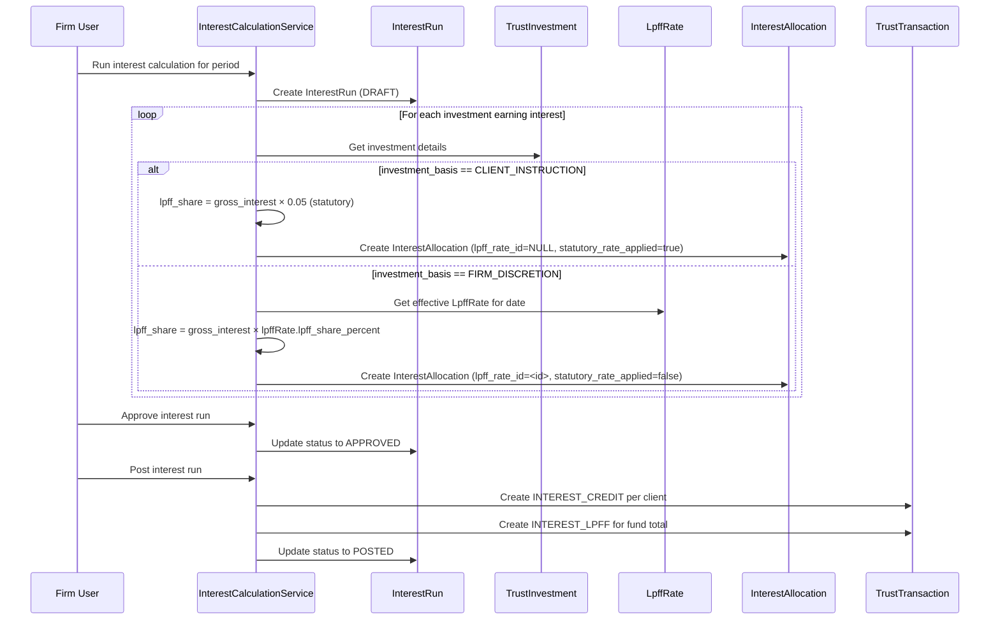
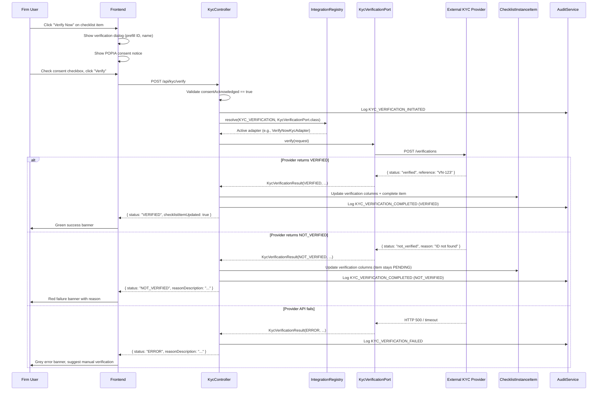

> Merge into architecture/ as standalone Phase 61 document.
> Depends on: Phase 60 (trust accounting), Phase 14 (checklists), Phase 21 (BYOAK integrations)

# Phase 61 — Legal Compliance Refinements: Section 86 Investment Distinction & KYC Verification Integration

---

## 61. Phase 61 — Legal Compliance Refinements

Phase 61 closes two compliance gaps identified in the Phase 60 trust accounting system and the Phase 14 checklist engine.

**Track 1 — Investment Basis Distinction**: The Legal Practice Act, 2014 distinguishes two legally distinct investment mechanisms with different interest treatment rules. Section 86(3) covers firm-initiated investments of surplus trust funds — interest follows the general LPFF arrangement rate configured in the `LpffRate` table. Section 86(4) covers client-instructed investments — Section 86(5) prescribes exactly 5% of interest to the LPFF, overriding whatever rate the firm has configured. Phase 60's `TrustInvestment` table treats all investments identically. This phase adds an `investment_basis` discriminator so the `InterestCalculationService` applies the correct LPFF share. An auditor reviewing the Section 35 certificate expects to see the two categories reported separately with their respective rates.

**Track 2 — KYC Verification Integration**: Law firms are "accountable institutions" under FICA and must verify client identity during onboarding. Phase 14 built a checklist engine with FICA compliance packs, but identity verification is entirely manual — the firm checks the client's ID document and marks the checklist item complete. This phase adds an optional, firm-configured KYC verification integration via the existing BYOAK infrastructure from Phase 21. If a firm brings their own API key for a supported KYC provider, the FICA checklist shows a "Verify Now" button that calls the provider's API and records the result on the checklist item. If not configured, nothing changes — manual verification remains the default.

**Dependencies on prior phases**:
- **Phase 60** (Trust Accounting): `TrustInvestment` entity (created by remaining Phase 60 slices), `InterestAllocation` entity, `InterestCalculationService`, `LpffRate`, `TrustAccount`, `TrustTransaction` types. Phase 60 must be complete before Phase 61 runs — Phase 61 extends entities, not replaces them.
- **Phase 14** (Customer Compliance & Lifecycle): `ChecklistInstanceItem` entity, FICA checklist packs, checklist completion flow.
- **Phase 21** (BYOAK Integrations): `IntegrationDomain` enum, `@IntegrationAdapter` annotation, `IntegrationRegistry`, `SecretStore`, `OrgIntegration` entity, `IntegrationGuardService`.
- **Phase 6** (Audit): `AuditService`, `AuditEventBuilder`.

### What's New

| Capability | Before Phase 61 | After Phase 61 |
|---|---|---|
| Investment basis tracking | All investments treated identically | `FIRM_DISCRETION` (86(3)) vs `CLIENT_INSTRUCTION` (86(4)) distinguished per investment |
| Interest LPFF share on 86(4) investments | Uses general LPFF arrangement rate | Fixed at 5% (statutory, per Section 86(5)) |
| Investment register reporting | Single list of all investments | Filterable by investment basis, shows applicable LPFF rate per investment |
| Section 35 data pack | No basis distinction | 86(3) and 86(4) investments reported separately with their respective rates |
| KYC verification | Manual-only (mark checklist item complete) | Optional automated verification via VerifyNow or Check ID SA (BYOAK) |
| Checklist verification metadata | None | Provider, reference, status, timestamp, and metadata stored on checklist items |
| POPIA consent tracking | None | Consent acknowledgement recorded before automated verification |
| KYC integration settings | Not applicable | Integration card in Settings with provider selection, API key configuration, connection test |

**Out of scope**: Approved bank list verification (Section 86(6)) — only the advisory informational note is in scope; actual verification against an LPFF-approved bank list is out of scope, as the system cannot determine a bank's arrangement status. Section 86(7) arrangement compliance — contractual, not software-enforceable. Changes to general trust account interest calculation — only investment interest is affected. VerifyNow face match / liveness detection — ID number verification only in v1. Automatic full FICA checklist completion — only the identity verification item is affected. Bulk verification — one client at a time. Check ID SA as sole FICA verification — format validation is not identity verification.

---

### 61.1 Overview

Phase 61 makes two surgical extensions to existing infrastructure. No new standalone entities are introduced. The investment track adds a single column and a conditional branch in the interest service. The KYC track adds five columns to an existing entity and a new integration domain that follows the proven BYOAK pattern exactly.

The investment basis distinction is small in code but significant in compliance. Treating all investments the same under Section 86 is a finding that an auditor would raise during the annual trust audit. The fix is straightforward — a column and a constant — but the regulatory impact of getting it wrong is material.

The KYC integration is architecturally familiar. It follows the same port-adapter pattern established by `PaymentGateway` (Phase 21), `SmtpEmailProvider` / `SendGridEmailProvider` (Phase 21), and `AccountingProvider` (Phase 21). The new `KycVerificationPort` interface, two provider adapters, and a `NoOpKycAdapter` default are structurally identical to what exists. The FICA checklist integration adds a "Verify Now" button alongside the existing manual "Mark Complete" option — the two paths coexist.

---

### 61.2 Domain Model Changes

Phase 61 modifies two existing entities and introduces supporting enums, a port interface, and value records. No new `@Entity` classes are created.

#### 61.2.1 TrustInvestment Extension

> **Dependency note**: `TrustInvestment` exists as a database table (V85) but has no `@Entity` class yet. Phase 60's remaining slices will create the `TrustInvestment` entity, `TrustInvestmentService`, and `TrustInvestmentRepository` before Phase 61 runs. Phase 61 adds the `investment_basis` column to the existing table and the corresponding field to the entity.

Add one column:

| Column | Type | Default | Constraints | Notes |
|--------|------|---------|-------------|-------|
| `investment_basis` | `VARCHAR(20)` | `'FIRM_DISCRETION'` | NOT NULL, CHECK IN ('FIRM_DISCRETION', 'CLIENT_INSTRUCTION') | Maps to `InvestmentBasis` enum |

The default ensures backward compatibility — any `TrustInvestment` rows created during Phase 60 before this migration runs are treated as firm-initiated (the safer default, since firm-initiated investments use the general LPFF rate, which is already what Phase 60 applies).

#### 61.2.2 InvestmentBasis Enum (New)

```java
package io.b2mash.b2b.b2bstrawman.verticals.legal.trustaccounting;

public enum InvestmentBasis {
    FIRM_DISCRETION,      // Section 86(3) — firm invests surplus trust funds
    CLIENT_INSTRUCTION    // Section 86(4) — firm invests on specific client instruction
}
```

#### 61.2.3 ChecklistInstanceItem Extension

The existing `ChecklistInstanceItem` entity (package `io.b2mash.b2b.b2bstrawman.checklist`) gains five nullable columns for recording automated verification results:

| Column | Type | Default | Constraints | Notes |
|--------|------|---------|-------------|-------|
| `verification_provider` | `VARCHAR(30)` | NULL | Nullable | Provider slug: `"verifynow"`, `"checkid"`, or null for manual |
| `verification_reference` | `VARCHAR(200)` | NULL | Nullable | Provider transaction/reference ID |
| `verification_status` | `VARCHAR(20)` | NULL | Nullable, CHECK IN ('VERIFIED', 'NOT_VERIFIED', 'NEEDS_REVIEW') | Automated verification outcome |
| `verified_at` | `TIMESTAMPTZ` | NULL | Nullable | When automated verification completed |
| `verification_metadata` | `JSONB` | NULL | Nullable | Provider-specific result data, POPIA consent timestamp |

These columns are null for manually-completed checklist items. They are populated only when a firm uses the "Verify Now" button and the KYC provider returns a result. The `verification_metadata` JSONB includes the POPIA consent acknowledgement timestamp and the actor who confirmed consent.

#### 61.2.4 InterestAllocation Extension

> **Dependency note**: `InterestAllocation` exists as a database table (V85) but has no `@Entity` class yet. Phase 60's remaining slices will create the entity and the `InterestCalculationService`. Phase 61 extends the interest allocation logic to record which rate was applied.

The `InterestAllocation` entity (or its response record) should capture the rate source:
- For `FIRM_DISCRETION` investments: the `lpff_rate_id` from the `LpffRate` table (as established by Phase 60)
- For `CLIENT_INSTRUCTION` investments: null `lpff_rate_id` + a `statutory_rate_applied` boolean flag (or equivalent) indicating the 5% statutory rate was used

This ensures the audit trail records *why* a specific percentage was used for each allocation. An auditor can verify that every 86(4) investment used exactly 5% and every 86(3) investment used the configured general rate effective on that date.

#### 61.2.5 KycVerificationPort Interface (New)

```java
package io.b2mash.b2b.b2bstrawman.integration.kyc;

public interface KycVerificationPort {
    KycVerificationResult verify(KycVerificationRequest request);
}
```

#### 61.2.6 KycVerificationRequest Record (New)

```java
package io.b2mash.b2b.b2bstrawman.integration.kyc;

public record KycVerificationRequest(
    String idNumber,
    String fullName,
    String dateOfBirth,     // optional, for cross-check
    String idDocumentType   // SA_ID, SMART_ID, PASSPORT
) {}
```

#### 61.2.7 KycVerificationResult Record (New)

```java
package io.b2mash.b2b.b2bstrawman.integration.kyc;

public record KycVerificationResult(
    KycVerificationStatus status,
    String providerName,
    String providerReference,
    String reasonCode,
    String reasonDescription,
    Instant verifiedAt,
    Map<String, String> metadata
) {}
```

#### 61.2.8 KycVerificationStatus Enum (New)

```java
package io.b2mash.b2b.b2bstrawman.integration.kyc;

public enum KycVerificationStatus {
    VERIFIED,       // Identity confirmed against government database (VerifyNow)
    NOT_VERIFIED,   // Verification failed — reason provided
    NEEDS_REVIEW,   // Inconclusive — manual verification still required (Check ID SA)
    ERROR           // Provider error (network, auth, credits exhausted)
}
```

#### 61.2.9 Statutory Constant

```java
// In InterestCalculationService or a shared TrustAccountingConstants class
public static final BigDecimal STATUTORY_LPFF_SHARE_PERCENT = new BigDecimal("0.05");
```

See [ADR-235](../adr/ADR-235-statutory-vs-configurable-lpff-share.md) for why this is a constant rather than a configurable value.

#### 61.2.10 ER Diagram — Trust Accounting with Phase 61 Extensions

```mermaid
erDiagram
    TrustAccount ||--o{ TrustTransaction : "has"
    TrustAccount ||--o{ ClientLedgerCard : "has"
    TrustAccount ||--o{ LpffRate : "rate history"
    TrustAccount ||--o{ TrustInvestment : "has"
    TrustAccount ||--o{ InterestRun : "has"
    TrustAccount ||--o{ BankStatement : "has"
    TrustAccount ||--o{ TrustReconciliation : "has"

    Customer ||--o{ ClientLedgerCard : "has"
    Customer ||--o{ TrustInvestment : "for"

    InterestRun ||--o{ InterestAllocation : "per client"
    InterestAllocation }o--|| ClientLedgerCard : "credits"

    BankStatement ||--o{ BankStatementLine : "has"
    BankStatementLine }o--o| TrustTransaction : "matched to"

    TrustInvestment {
        UUID id PK
        UUID trust_account_id FK
        UUID customer_id FK
        string institution
        decimal principal
        decimal interest_rate
        date deposit_date
        date maturity_date
        decimal interest_earned
        string status "ACTIVE|MATURED|WITHDRAWN"
        string investment_basis "FIRM_DISCRETION|CLIENT_INSTRUCTION (Phase 61)"
    }

    InterestAllocation {
        UUID id PK
        UUID interest_run_id FK
        UUID customer_id FK
        decimal average_daily_balance
        int days_in_period
        decimal gross_interest
        decimal lpff_share
        decimal client_share
        UUID lpff_rate_id FK "NULL for statutory 86(4)"
        boolean statutory_rate_applied "Phase 61"
    }

    ChecklistInstanceItem {
        UUID id PK
        UUID instance_id FK
        string name
        string status "PENDING|COMPLETED|SKIPPED|BLOCKED"
        string verification_provider "Phase 61 — nullable"
        string verification_reference "Phase 61 — nullable"
        string verification_status "Phase 61 — nullable"
        timestamptz verified_at "Phase 61 — nullable"
        jsonb verification_metadata "Phase 61 — nullable"
    }
```



---

### 61.3 Core Flows & Backend Behaviour

#### 61.3.1 Investment Interest Split (Section 86 Distinction)

**Current flow (Phase 60)**:

When `InterestCalculationService` calculates interest for an `InterestRun`, it processes all client balances using the `LpffRate` table's `lpff_share_percent` to split interest between the client and the LPFF:

```
for each client allocation:
    lpff_share = gross_interest × lpffRate.lpff_share_percent
    client_share = gross_interest - lpff_share
```

This applies the same rate to all interest, regardless of source.

**New flow (Phase 61)**:

Investment interest must be calculated separately based on the investment basis:

```
for each investment maturing or earning interest in the period:
    if investment.investment_basis == CLIENT_INSTRUCTION:
        lpff_share = gross_interest × 0.05          // Section 86(5) statutory rate
        statutory_rate_applied = true
        lpff_rate_id = null
    else:
        lpff_share = gross_interest × lpffRate.lpff_share_percent  // General arrangement
        statutory_rate_applied = false
        lpff_rate_id = <effective LpffRate id>
    client_share = gross_interest - lpff_share
```

The constant `STATUTORY_LPFF_SHARE_PERCENT = new BigDecimal("0.05")` is defined in the service or a `TrustAccountingConstants` class. It is not stored in the database, not admin-editable, and not read from configuration. See [ADR-235](../adr/ADR-235-statutory-vs-configurable-lpff-share.md).

**Audit trail**: Each `InterestAllocation` records which rate was used. For 86(3) investments, the `lpff_rate_id` references the `LpffRate` row effective on the calculation date. For 86(4) investments, `lpff_rate_id` is null and `statutory_rate_applied` is true. This allows an auditor to filter all 86(4) allocations and confirm each used exactly 5%.

**Note on `interest_runs.lpff_rate_id`**: The V85 schema defines `interest_runs.lpff_rate_id` as `NOT NULL`, pointing to the general arrangement rate for the run. After Phase 61, a single interest run can contain allocations with mixed investment bases (some 86(3), some 86(4)). The run-level `lpff_rate_id` remains the general arrangement rate — it is the default rate for the run period. The per-allocation `statutory_rate_applied` flag (and nullable `lpff_rate_id` on `interest_allocations`) is the authoritative source for determining which rate was actually applied to each individual allocation. Auditors should query at the allocation level, not the run level, when verifying 86(4) compliance.

**General trust account interest** (money held in the trust account but not placed on investment) continues to use the configurable `LpffRate` without change. Only investment interest is affected by the basis distinction.

#### 61.3.2 KYC Verification Flow

**Integration configuration (one-time setup)**:

1. Firm admin navigates to Settings → Integrations
2. Clicks "Configure" on the KYC Verification integration card
3. Selects provider (VerifyNow or Check ID SA)
4. Enters API key → stored via `SecretStore` (AES-256-GCM encrypted, per-tenant schema)
5. Clicks "Test Connection" → backend calls provider's health/validation endpoint with the key
6. On success, `OrgIntegration` record created: `domain = KYC_VERIFICATION`, `providerSlug = "verifynow"` (or `"checkid"`), `enabled = true`
7. `IntegrationRegistry` cache evicted for this tenant + domain

**Verification trigger from checklist**:

1. User opens a customer's FICA checklist (Phase 14 UI)
2. The "Verify Identity" checklist item renders with a "Verify Now" button (visible only when `IntegrationGuardService.isConfigured("KYC_VERIFICATION")` returns true for the current tenant)
3. Clicking "Verify Now" opens a verification dialog

**Verification dialog flow**:

1. Dialog pre-fills with the customer's ID number (from `id_passport_number` custom field) and full name
2. Displays the active provider name (VerifyNow or Check ID SA)
3. Shows POPIA consent notice: *"By proceeding, you confirm that [Client Name] has given explicit written consent for identity verification against government databases, as required by POPIA and FICA."*
4. User must check the consent acknowledgement checkbox before "Verify" activates
5. On "Verify":
   - Frontend calls `POST /api/kyc/verify` with `{ customerId, idNumber, fullName, idDocumentType }`
   - Backend resolves the active KYC adapter via `IntegrationRegistry.resolve(KYC_VERIFICATION, KycVerificationPort.class)`
   - Adapter calls the provider API
   - Result mapped to `KycVerificationResult`

**Provider adapter dispatch**:

| Provider | Adapter | Behaviour |
|----------|---------|-----------|
| VerifyNow | `VerifyNowKycAdapter` | `POST /verifications` → polls `GET /verifications/{id}` for result. Returns `VERIFIED`, `NOT_VERIFIED`, or `NEEDS_REVIEW`. Maps VerifyNow reason codes to `reasonDescription`. |
| Check ID SA | `CheckIdKycAdapter` | `GET /{id}` for format validation. Always returns `NEEDS_REVIEW` because format validation is not identity verification. Maps birth date, citizenship status to metadata. |
| None configured | `NoOpKycAdapter` | Returns `ERROR` with `reasonDescription = "No KYC provider configured"`. Defensive fallback only — the "Verify Now" button is hidden at render time by `IntegrationGuardService.isConfigured()`, so this adapter should never be reached from the checklist UI. It exists as a safe default for the `IntegrationRegistry` resolution pattern. |

See [ADR-236](../adr/ADR-236-kyc-provider-adapter-strategy.md) for why Check ID SA returns `NEEDS_REVIEW` and why BYOAK was chosen.

**Result handling and checklist item update**:

| Status | UI Treatment | Checklist Item Effect |
|--------|-------------|----------------------|
| `VERIFIED` | Green success banner | Auto-completed: `status = COMPLETED`, `completedAt = now()`, `completedBy = actor`, verification columns populated |
| `NOT_VERIFIED` | Red failure banner with reason | Remains `PENDING`. Verification columns populated (records the failed attempt). Firm can retry or do manual verification. |
| `NEEDS_REVIEW` | Amber warning banner | Remains `PENDING`. Verification columns populated. Pre-check recorded but firm must still verify manually. |
| `ERROR` | Grey error banner with message | No change. Verification columns not populated (no result to record). Firm falls back to manual verification. |

**POPIA consent**: The consent acknowledgement is recorded in `verification_metadata` JSONB as `{ "consent_acknowledged_at": "<ISO timestamp>", "consent_acknowledged_by": "<member UUID>" }`. The system records that the firm user confirmed consent was obtained — not the consent itself. The actual written consent from the client is the firm's responsibility as part of their FICA onboarding forms.

**Error handling / fallback**: If the provider API call fails (network timeout, authentication error, credits exhausted), the adapter catches the exception and returns `KycVerificationResult` with status `ERROR` and a descriptive `reasonDescription`. The checklist item remains unchanged. The firm can retry later or fall back to manual verification. No checklist item data is modified on error — the attempt is logged only via the `KYC_VERIFICATION_FAILED` audit event.

---

### 61.4 API Surface

#### 61.4.1 Investment Endpoints (Modified)

**`POST /api/trust-accounts/{accountId}/investments`** — Create investment

Request body adds `investmentBasis` field:

```json
{
  "customerId": "uuid",
  "institution": "First National Bank",
  "principal": 100000.00,
  "interestRate": 0.085,
  "depositDate": "2026-04-01",
  "maturityDate": "2026-10-01",
  "investmentBasis": "CLIENT_INSTRUCTION"
}
```

`investmentBasis` is required. Enum: `FIRM_DISCRETION` | `CLIENT_INSTRUCTION`.

**`GET /api/trust-investments/{id}`** — Get investment

Response includes `investmentBasis`:

```json
{
  "id": "uuid",
  "trustAccountId": "uuid",
  "customerId": "uuid",
  "institution": "First National Bank",
  "principal": 100000.00,
  "interestRate": 0.085,
  "depositDate": "2026-04-01",
  "maturityDate": "2026-10-01",
  "status": "ACTIVE",
  "investmentBasis": "CLIENT_INSTRUCTION",
  "interestEarned": 4250.00,
  "createdAt": "2026-04-01T10:00:00Z"
}
```

**`GET /api/trust-accounts/{accountId}/investments`** — List investments

Response items include `investmentBasis`. Supports query parameter `?investmentBasis=CLIENT_INSTRUCTION` for filtering.

#### 61.4.2 KYC Endpoints (New)

**`POST /api/kyc/verify`** — Trigger KYC verification

Authorization: `MANAGE_LEGAL` capability.

Request fields: `customerId` (required), `checklistInstanceItemId` (required — identifies which checklist item to update on success), `idNumber` (required), `fullName` (required), `idDocumentType` (required, enum: `SA_ID` | `SMART_ID` | `PASSPORT`), `consentAcknowledged` (required, must be `true`).

```json
{
  "customerId": "uuid",
  "checklistInstanceItemId": "uuid",
  "idNumber": "8001015009087",
  "fullName": "John Smith",
  "idDocumentType": "SA_ID",
  "consentAcknowledged": true
}
```

`consentAcknowledged` must be `true` — the backend rejects the request if false or missing.

Response:

```json
{
  "status": "VERIFIED",
  "providerName": "verifynow",
  "providerReference": "VN-2026-04-001234",
  "reasonCode": "MATCH",
  "reasonDescription": "Identity verified against Home Affairs HANIS database",
  "verifiedAt": "2026-04-04T14:30:00Z",
  "checklistItemUpdated": true
}
```

**`GET /api/kyc/result/{reference}`** — Poll verification result (for async providers)

Authorization: `MANAGE_LEGAL` capability.

Returns the same response shape as the verify endpoint. Used when VerifyNow processes the verification asynchronously.

**`GET /api/integrations/kyc/status`** — Check KYC integration status

Authorization: `VIEW_TRUST` or `MANAGE_LEGAL` capability.

Response:

```json
{
  "configured": true,
  "provider": "verifynow"
}
```

Used by the frontend to determine whether to show the "Verify Now" button on FICA checklist items.

---

### 61.5 Sequence Diagrams

#### 61.5.1 Investment Interest Calculation with Basis Distinction



#### 61.5.2 KYC Verification Flow (Happy Path + Error)



---

### 61.6 Frontend Changes

#### 61.6.1 Place Investment Dialog

The existing "Place Investment" dialog (Phase 60, on the Trust Accounting page) gains a radio button group:

- **Label**: "Investment initiated by"
- **Options**:
  - "Firm (surplus trust funds)" → maps to `FIRM_DISCRETION`, Section 86(3)
  - "Client instruction" → maps to `CLIENT_INSTRUCTION`, Section 86(4)
- **Default**: `FIRM_DISCRETION`
- **Help text** (changes with selection):
  - FIRM_DISCRETION: *"Interest follows your firm's LPFF arrangement rate."*
  - CLIENT_INSTRUCTION: *"Interest paid to client, with 5% to the LPFF (Section 86(5))."*

#### 61.6.2 Investment Register Page

The investment register table (Phase 60) gains:
- **"Investment Basis" column**: Shows "Firm" or "Client Instruction" as a badge (muted for Firm, primary for Client Instruction)
- **Filter**: Dropdown filter for investment basis (All / Firm Discretion / Client Instruction)
- **LPFF Rate column**: For 86(3) investments, shows the general rate (e.g., "8.5%"). For 86(4) investments, shows "5% (statutory)" in a distinct style.

#### 61.6.3 Interest Allocation Table

The interest allocation detail view (within an interest run) gains:
- For 86(4) allocations: LPFF rate column displays **"5% (statutory)"** instead of the general rate percentage
- A footnote or inline note: *"Section 86(5): client-instructed investments carry a statutory 5% LPFF share"*

#### 61.6.4 Section 86(6) Advisory Note

An informational callout appears in two locations:
1. **Trust Account creation/edit form**: Below the bank details fields
2. **Place Investment dialog**: Below the investment basis selector

Content: *"The bank must have an arrangement with the Legal Practitioners Fidelity Fund (Section 86(6)). Contact the LPFF to verify."*

This is purely informational — no validation logic. The system has no way to verify a bank's LPFF arrangement status.

#### 61.6.5 KYC "Verify Now" Button

On the FICA checklist (customer detail → Compliance tab), the identity verification checklist item conditionally renders a **"Verify Now"** button:

- **Visible when**: `GET /api/integrations/kyc/status` returns `{ configured: true }` for the current tenant
- **Visible alongside**: The existing manual "Mark Complete" option — both paths coexist
- **Disabled when**: The checklist item is already `COMPLETED` or `SKIPPED`
- **Shows previous result**: If verification was attempted (verification columns populated), shows the last result as a badge (Verified / Not Verified / Needs Review) with the provider name and timestamp

#### 61.6.6 KYC Verification Dialog

Opened by clicking "Verify Now":

1. **Pre-filled fields**: Client ID number (from `id_passport_number` custom field), client full name. Editable in case the custom field is not populated.
2. **ID document type**: Dropdown — SA ID Card, Smart ID Card, Passport
3. **Provider display**: Shows which provider will be used (e.g., "VerifyNow — verified against Home Affairs")
4. **POPIA consent**: Checkbox with consent notice text. "Verify" button disabled until checked.
5. **Result display**: Replaces the form after submission:
   - `VERIFIED`: Green banner, provider reference, verification timestamp. Checklist item auto-completed.
   - `NOT_VERIFIED`: Red banner, reason description, option to retry or close.
   - `NEEDS_REVIEW`: Amber banner, explanation that pre-check passed but manual verification required.
   - `ERROR`: Grey banner, error description, suggestion to try again later or verify manually.

#### 61.6.7 KYC Integration Settings Card

In Settings → Integrations, a new integration card:

- **Card header**: "KYC Verification"
- **Status badge**: "Configured" (green) or "Not Configured" (muted)
- **Provider name**: When configured, shows the active provider
- **"Configure" button**: Opens configuration dialog:
  - Provider selector (VerifyNow / Check ID SA)
  - API key field (password input)
  - "Test Connection" button → calls provider health endpoint
  - Save / Cancel
- **"Remove" button**: Clears the integration (`SecretStore.delete()`, `OrgIntegration` removed)

Follows the existing integration card pattern from Phase 21 (`settings/integrations/page.tsx`).

---

### 61.7 Database Migration (V86)

A single tenant migration covers both tracks:

```sql
-- V86__phase61_investment_basis_and_kyc_verification.sql
-- Phase 61: Investment basis distinction + KYC verification columns

-- Track 1: Investment Basis
ALTER TABLE trust_investments
    ADD COLUMN investment_basis VARCHAR(20) NOT NULL DEFAULT 'FIRM_DISCRETION';

ALTER TABLE trust_investments
    ADD CONSTRAINT chk_investment_basis
    CHECK (investment_basis IN ('FIRM_DISCRETION', 'CLIENT_INSTRUCTION'));

-- Track 2: KYC Verification on Checklist Items
ALTER TABLE checklist_instance_items
    ADD COLUMN verification_provider VARCHAR(30);

ALTER TABLE checklist_instance_items
    ADD COLUMN verification_reference VARCHAR(200);

ALTER TABLE checklist_instance_items
    ADD COLUMN verification_status VARCHAR(20);

ALTER TABLE checklist_instance_items
    ADD COLUMN verified_at TIMESTAMPTZ;

ALTER TABLE checklist_instance_items
    ADD COLUMN verification_metadata JSONB;

ALTER TABLE checklist_instance_items
    ADD CONSTRAINT chk_verification_status
    CHECK (verification_status IS NULL OR verification_status IN ('VERIFIED', 'NOT_VERIFIED', 'NEEDS_REVIEW'));

-- Track 1 continuation: InterestAllocation audit trail
-- Records which rate source was used per allocation (general arrangement vs statutory 86(5))
ALTER TABLE interest_allocations
    ADD COLUMN lpff_rate_id UUID REFERENCES lpff_rates(id);

ALTER TABLE interest_allocations
    ADD COLUMN statutory_rate_applied BOOLEAN NOT NULL DEFAULT false;
```

**Notes**:
- `investment_basis` defaults to `'FIRM_DISCRETION'` for backward compatibility with existing rows
- All verification columns are nullable — they are populated only when automated verification is used
- No global migration needed — all tables are tenant-scoped
- The `verification_status` constraint allows NULL (manual verification) or one of three enumerated values
- No new tables are created — both tracks extend existing tables

---

### 61.8 Implementation Guidance

#### 61.8.1 Backend Changes

| File / Class | Package | Change Type | Description |
|---|---|---|---|
| `InvestmentBasis.java` | `verticals.legal.trustaccounting` | New enum | `FIRM_DISCRETION`, `CLIENT_INSTRUCTION` |
| `TrustInvestment.java` | `verticals.legal.trustaccounting` (Phase 60 creates) | Extend | Add `investmentBasis` field with `@Enumerated(EnumType.STRING)` |
| `TrustInvestmentService.java` | `verticals.legal.trustaccounting` (Phase 60 creates) | Extend | Accept `investmentBasis` in create flow, include in response |
| `InterestCalculationService.java` | `verticals.legal.trustaccounting` (Phase 60 creates) | Extend | Conditional LPFF share: statutory 5% for CLIENT_INSTRUCTION, general rate for FIRM_DISCRETION |
| `TrustAccountingConstants.java` | `verticals.legal.trustaccounting` | New class | `STATUTORY_LPFF_SHARE_PERCENT = new BigDecimal("0.05")` |
| `InterestAllocation.java` | `verticals.legal.trustaccounting` (Phase 60 creates) | Extend | Add `statutoryRateApplied` boolean field |
| `ChecklistInstanceItem.java` | `checklist` | Extend | Add 5 verification columns + getters/setters |
| `IntegrationDomain.java` | `integration` | Extend | Add `KYC_VERIFICATION("noop")` enum value |
| `KycVerificationPort.java` | `integration.kyc` | New interface | Port: `verify(KycVerificationRequest) → KycVerificationResult` |
| `KycVerificationRequest.java` | `integration.kyc` | New record | `idNumber, fullName, dateOfBirth, idDocumentType` |
| `KycVerificationResult.java` | `integration.kyc` | New record | `status, providerName, providerReference, reasonCode, reasonDescription, verifiedAt, metadata` |
| `KycVerificationStatus.java` | `integration.kyc` | New enum | `VERIFIED, NOT_VERIFIED, NEEDS_REVIEW, ERROR` |
| `VerifyNowKycAdapter.java` | `integration.kyc` | New adapter | `@IntegrationAdapter(domain=KYC_VERIFICATION, slug="verifynow")`, calls VerifyNow REST API |
| `CheckIdKycAdapter.java` | `integration.kyc` | New adapter | `@IntegrationAdapter(domain=KYC_VERIFICATION, slug="checkid")`, calls Check ID SA REST API, always returns `NEEDS_REVIEW` |
| `NoOpKycAdapter.java` | `integration.kyc` | New adapter | `@IntegrationAdapter(domain=KYC_VERIFICATION, slug="noop")`, returns ERROR |
| `KycVerificationService.java` | `integration.kyc` | New service | Orchestrates: resolve adapter, call verify, update checklist item, audit |
| `KycVerificationController.java` | `integration.kyc` | New controller | `POST /api/kyc/verify`, `GET /api/kyc/result/{ref}`, `GET /api/integrations/kyc/status` |
| `V86__phase61_investment_basis_and_kyc_verification.sql` | `db/migration/tenant` | New migration | ALTER TABLE for investment_basis + checklist verification columns |

#### 61.8.2 Frontend Changes

| File / Component | Location | Change Type | Description |
|---|---|---|---|
| Place Investment dialog | `trust-accounting/` components | Extend | Add investment basis radio group + help text + 86(6) advisory |
| Investment register table | `trust-accounting/page.tsx` | Extend | Add basis column, basis filter, statutory rate display |
| Interest allocation table | `trust-accounting/` components | Extend | Show "5% (statutory)" for 86(4) allocations |
| Checklist item component | `customers/[id]/` compliance tab | Extend | Conditional "Verify Now" button based on KYC integration status |
| KYC verification dialog | New component in `customers/` or shared | New | POPIA consent, provider info, result display |
| KYC integration card | `settings/integrations/page.tsx` | Extend | New card for KYC_VERIFICATION domain |
| API hooks | `lib/api/` or `hooks/` | New | `useKycStatus()`, `useVerifyKyc()`, `useKycResult()` |

#### 61.8.3 Testing Strategy

| Layer | Focus | Estimated Tests |
|---|---|---|
| Backend — Investment | InterestCalculationService with FIRM_DISCRETION vs CLIENT_INSTRUCTION, verify correct LPFF share, audit trail records | ~15 |
| Backend — KYC | KycVerificationService with mocked adapters, POPIA consent validation, checklist item update, error handling | ~15 |
| Backend — Migration | V86 applies cleanly, default values correct, constraints enforced | ~3 |
| Backend — Integration | Full flow: create investment → run interest → verify allocation rates | ~5 |
| Frontend — Investment | Place Investment dialog with basis selector, register with filter/column, interest table display | ~8 |
| Frontend — KYC | Verify Now button visibility, dialog flow, consent checkbox, result display, settings card | ~10 |
| **Total** | | **~56** |

---

### 61.9 Permission Model

Phase 61 uses existing capabilities — no new capabilities are needed.

| Capability | Used For | Existing Since |
|---|---|---|
| `VIEW_TRUST` | View investment register, interest allocations, KYC integration status | Phase 60 (V85) |
| `MANAGE_TRUST` | Create/modify investments (with investment basis), run interest calculations | Phase 60 (V85) |
| `MANAGE_LEGAL` | Trigger KYC verification, configure KYC integration, view verification results | Phase 14 (checklists) |

**Module gating**: Investment endpoints remain gated behind `VerticalModuleGuard.requireModule("trust_accounting")`. KYC verification is gated behind `IntegrationGuardService.isConfigured("KYC_VERIFICATION")`, not a vertical module — an accounting firm doing FICA onboarding should also be able to use it.

---

### 61.10 Capability Slices

#### Slice 61A — Investment Basis Enum + V86 Migration + TrustInvestment Entity Extension + InterestService Logic

**What:** Core investment basis distinction. Add `InvestmentBasis` enum, `TrustAccountingConstants` with statutory 5% constant, V86 migration (both investment_basis and checklist verification columns), extend `TrustInvestment` entity with `investmentBasis` field, extend `TrustInvestmentService` to accept/return `investmentBasis`, extend `InterestCalculationService` with conditional LPFF share logic, extend `InterestAllocation` with `statutoryRateApplied` flag.

**Migration:** `V86__phase61_investment_basis_and_kyc_verification.sql` (both tracks in one migration). **All other slices depend on this migration being merged first.**

**Endpoints modified:** `POST /api/trust-accounts/{accountId}/investments`, `GET /api/trust-investments/{id}`, `GET /api/trust-accounts/{accountId}/investments` (add filter param).

**Tests:** ~20 integration tests (interest calculation with both basis types, statutory rate enforcement, backward compatibility with default).

**Dependencies:** Phase 60 complete (TrustInvestment entity, InterestCalculationService, InterestAllocation entity must exist).

---

#### Slice 61B — Investment Register Report + Section 35 Data Pack Updates

**What:** Extend investment register report to show investment basis column and applicable LPFF rate per investment. Update Section 35 data pack generation to separately list 86(3) and 86(4) investments with their respective rates.

**Endpoints modified:** Report/data pack endpoints from Phase 60.

**Tests:** ~8 tests (report output with mixed basis types, Section 35 pack separation).

**Dependencies:** Slice 61A.

---

#### Slice 61C — Frontend Investment Form + Register Page Updates

**What:** Add investment basis radio group to Place Investment dialog with help text. Add 86(6) advisory note. Add basis column and filter to investment register table. Show "5% (statutory)" in interest allocation table for 86(4) investments.

**Tests:** ~8 frontend component tests.

**Dependencies:** Slice 61A (API changes for investmentBasis field).

---

#### Slice 61D — KYC Adapter Infrastructure (Port, Adapters, Integration Domain, Endpoints)

**What:** Add `KYC_VERIFICATION` to `IntegrationDomain` enum. Create `integration/kyc/` package with `KycVerificationPort`, `KycVerificationRequest`, `KycVerificationResult`, `KycVerificationStatus`, `VerifyNowKycAdapter`, `CheckIdKycAdapter`, `NoOpKycAdapter`. Create `KycVerificationService` (resolve adapter, call verify, update checklist item, audit). Create `KycVerificationController` with three endpoints. Extend `ChecklistInstanceItem` with 5 verification columns.

**Endpoints:** `POST /api/kyc/verify`, `GET /api/kyc/result/{ref}`, `GET /api/integrations/kyc/status`.

**Tests:** ~18 tests (service with mocked adapters, POPIA consent enforcement, checklist item update for all four statuses, integration status check, error handling).

**Dependencies:** Slice 61A (V86 migration for checklist columns).

---

#### Slice 61E — KYC Frontend (Checklist Integration, Verification Dialog, Settings Card)

**What:** Add conditional "Verify Now" button to FICA checklist items. Create KYC verification dialog with POPIA consent flow. Add KYC integration settings card. Create API hooks for KYC status, verification, and result polling.

**Tests:** ~10 frontend component tests (button visibility, consent flow, result display per status, settings card).

**Dependencies:** Slice 61D (KYC endpoints).

---

### 61.11 ADR Index

| ADR | Title | Summary |
|-----|-------|---------|
| [ADR-235](../adr/ADR-235-statutory-vs-configurable-lpff-share.md) | Statutory vs Configurable LPFF Share | Why the Section 86(5) 5% rate is hardcoded as a constant, not stored in the rate table or made admin-editable |
| [ADR-236](../adr/ADR-236-kyc-provider-adapter-strategy.md) | KYC Provider Adapter Strategy | Why BYOAK with KycVerificationPort abstraction over platform-managed credentials or reseller model; why Check ID SA returns NEEDS_REVIEW |
