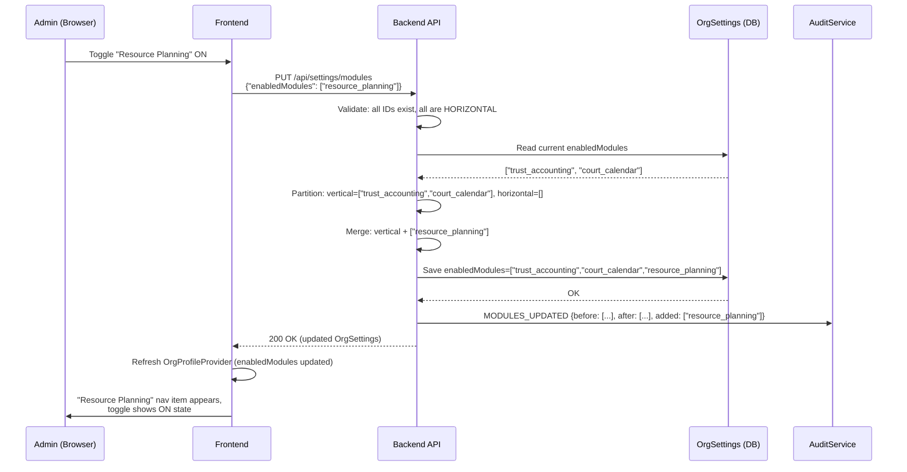
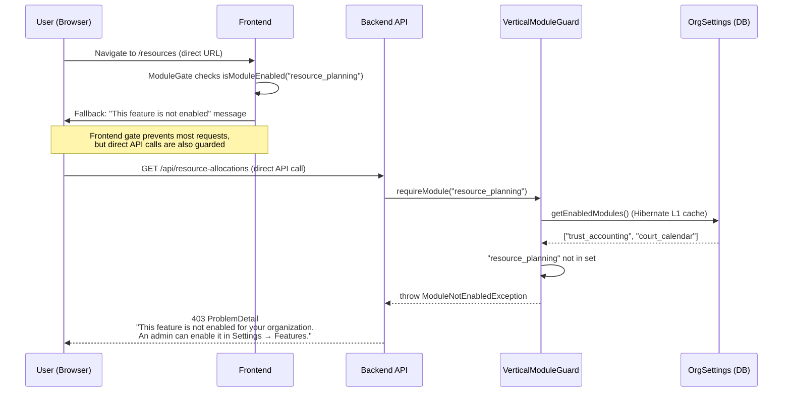

# Phase 62 — Feature Module Gating (Progressive Disclosure)

> Standalone architecture document for Phase 62. Reference from ARCHITECTURE.md Section 11 index if needed.

---

## 1. Overview

After 61 phases of feature development, the product surface area is large. A new 3–5 person firm sees resource planning grids, bulk billing wizards, and automation rule builders on first login — features designed for power users managing dozens of concurrent engagements. This creates onboarding friction and increases the risk of misconfiguration in areas where incorrect settings have real financial consequences.

Phase 62 extends the module gating infrastructure built in Phase 49 to cover **horizontal** (cross-vertical) power-user features. Phase 49 introduced module definitions, a guard component, and a registry — but only for vertical-specific features (trust accounting, court calendar, etc.) that are auto-assigned by profile selection. Phase 62 adds three new modules that are **manually toggled by org admins** in a new Settings section, hidden by default for all profiles, and gated at both the service layer and frontend.

This is a **wiring phase**, not a feature phase. No new entities, no migrations, no new reusable UI components beyond `ModuleDisabledFallback` and the `settings/features/page.tsx` page. The work is: register modules, add guards, wrap components, and expose a toggle API.

### What's New

| Capability | Before Phase 62 | After Phase 62 |
|---|---|---|
| Module categories | All modules are vertical (auto-assigned by profile) | Modules have a `category` field: `VERTICAL` or `HORIZONTAL` |
| Resource Planning visibility | Always visible to all orgs | Hidden by default; admin toggles on in Settings |
| Bulk Billing visibility | Always visible to all orgs | Hidden by default; admin toggles on in Settings |
| Automation Rule Builder visibility | Always visible to all orgs (execution + builder) | Builder UI hidden by default; seeded automations continue executing |
| Module toggle API | None — modules derived entirely from profile selection | `GET/PUT /api/settings/modules` for horizontal module toggling |
| Settings "Features" section | Does not exist | Card-based toggle UI for horizontal modules |
| Module registry size | 5 modules (all vertical) | 8 modules (5 vertical + 3 horizontal) |

### Dependencies on Prior Phases

- **Phase 49** (Vertical Module System): `VerticalModuleRegistry`, `VerticalModuleGuard`, `ModuleGate`, `useOrgProfile()`, `OrgSettings.enabledModules`. This phase extends all of these — it does not replace or fork them.
- **Phase 6** (Audit & Compliance): `AuditService` and `AuditEventBuilder`. Module toggle mutations publish audit events.

### Out of Scope

- **Vertical module toggles in Settings** — Vertical modules (trust_accounting, court_calendar, etc.) remain managed by profile selection. Not shown in the Features section.
- **Per-user module visibility** — Modules are org-wide. No per-member overrides.
- **Usage analytics** — No tracking of which modules are enabled/disabled across tenants.
- **Module dependencies** — No "enable X requires Y" logic. Each module is independent.
- **Onboarding prompts** — No "did you know you can enable Resource Planning?" suggestions.
- **Nav restructuring** — Features stay in their existing sidebar positions. They are shown or hidden, not moved.

---

## 2. Domain Model Changes

### 2.1 ModuleCategory Enum (New)

A new enum in the `verticals` package to distinguish module management strategies:

```java
package io.b2mash.b2b.b2bstrawman.verticals;

public enum ModuleCategory {
  /** Auto-assigned by vertical profile selection. Not shown in Settings. */
  VERTICAL,

  /** Manually toggled by org admin in Settings → Features. Profile-independent. */
  HORIZONTAL
}
```

**Why an enum and not a boolean `isHorizontal`**: The category is a domain concept with distinct behaviors (vertical modules are managed by profile selection and hidden from Settings; horizontal modules are managed by admin toggle and shown in Settings). An enum makes the distinction explicit and extensible if a third category ever emerges (e.g., `EXPERIMENTAL`).

### 2.2 Extended ModuleDefinition Record

The existing `ModuleDefinition` record gains a `category` field:

```java
public record ModuleDefinition(
    String id,
    String name,
    String description,
    String status,
    ModuleCategory category,
    List<String> defaultEnabledFor,
    List<NavItem> navItems) {}
```

All five existing modules receive `ModuleCategory.VERTICAL`. The three new modules receive `ModuleCategory.HORIZONTAL`.

### 2.3 New Module Definitions

Three new entries in `VerticalModuleRegistry`:

| Module ID | Display Name | Description | Category | Default Enabled For | Nav Items |
|---|---|---|---|---|---|
| `resource_planning` | Resource Planning | Team allocation grid, capacity forecasting, and utilization tracking. Best for firms with 10+ team members managing multiple concurrent projects. | `HORIZONTAL` | None (empty list) | `/resources` (Resources), `/resources/utilization` (Utilization) |
| `bulk_billing` | Bulk Billing Runs | Batch invoice generation across multiple customers in a single run. Best for firms billing 10+ clients per cycle. | `HORIZONTAL` | None (empty list) | `/invoices/billing-runs` (Billing Runs) |
| `automation_builder` | Automation Rule Builder | Create custom workflow automations with triggers, conditions, and actions. Standard automations run automatically — enable this to customize or create new rules. | `HORIZONTAL` | None (empty list) | `/settings/automations` (Automations) |

### 2.4 No New Entities, No Migrations

The `OrgSettings.enabledModules` field is a JSONB `List<String>` (added in migration `V75__add_vertical_modules.sql`). It already stores arbitrary module IDs — no schema change is needed to store `"resource_planning"` alongside `"trust_accounting"`. The module registry is in-memory (Java code), not database-backed. This is why the phase requires zero migrations.

### 2.5 Updated Module Registry (Complete)

After Phase 62, the registry contains 8 modules:

| Module ID | Category | Default Enabled For | Zone |
|---|---|---|---|
| `trust_accounting` | VERTICAL | legal-za | legal |
| `court_calendar` | VERTICAL | legal-za | legal |
| `conflict_check` | VERTICAL | legal-za | legal |
| `lssa_tariff` | VERTICAL | legal-za | finance |
| `regulatory_deadlines` | VERTICAL | accounting-za | clients |
| `resource_planning` | HORIZONTAL | (none) | work |
| `bulk_billing` | HORIZONTAL | (none) | finance |
| `automation_builder` | HORIZONTAL | (none) | work |

---

## 3. Core Flows and Backend Behaviour

### 3.1 Module Toggle Flow

An org admin enables or disables a horizontal module via Settings. The flow:

1. Admin navigates to Settings → Features.
2. Frontend calls `PUT /api/settings/modules` with the updated set of enabled horizontal module IDs.
3. Backend validates: only IDs with `category: HORIZONTAL` are accepted. Unknown IDs or VERTICAL IDs are rejected with 400.
4. Backend reads the current `enabledModules` list from `OrgSettings`.
5. Backend **partitions** the current list into vertical and horizontal sets (using the registry's category field).
6. Backend **replaces** the horizontal set with the request payload, keeps the vertical set unchanged.
7. Backend **merges** both sets and persists the combined list.
8. Backend publishes a `MODULES_UPDATED` audit event with before/after diff.
9. Frontend receives the updated `OrgSettings` response and refreshes `OrgProfileProvider`.

**Why merge instead of replace**: The `enabledModules` JSONB array stores both vertical and horizontal module IDs in a single list. A naive `PUT` that replaces the entire list would strip vertical modules assigned by profile selection. The merge logic ensures the two management strategies (profile-driven vertical, admin-driven horizontal) coexist in one storage field without a second column. See [ADR-239](../adr/ADR-239-horizontal-vs-vertical-module-gating.md) for the full rationale.

### 3.2 Module Guard Enforcement Flow

When a user hits a gated endpoint:

1. Request arrives at the controller, which delegates to the service.
2. The service's first line calls `moduleGuard.requireModule(MODULE_ID)`.
3. `VerticalModuleGuard.requireModule()` reads `OrgSettings.enabledModules` for the current tenant (cached per-request via Hibernate L1 cache).
4. If the module ID is present in the list, execution continues normally.
5. If the module ID is absent, `ModuleNotEnabledException` is thrown — Spring renders it as a 403 ProblemDetail response: *"This feature is not enabled for your organization. An admin can enable it in Settings → Features."*

No changes to `VerticalModuleGuard` itself are needed. The guard is module-ID-agnostic — it checks whether the ID is in the list, regardless of category. This is the same code path used by vertical modules today.

### 3.3 Automation Execution Isolation

Disabling the `automation_builder` module hides the Rule Builder UI and blocks CRUD API calls to `AutomationRuleController`, `AutomationTemplateController`, and `AutomationExecutionController`. However, the automation **execution engine** (`AutomationExecutionService`, trigger matching, action executors) is not gated and continues to run for all orgs.

This is critical because:

- Orgs receive **seeded automation rules** from their vertical profile pack (e.g., "task assigned → notify assignee", "invoice overdue → send reminder"). These run automatically without the org ever seeing the builder.
- Disabling the builder means the admin chose not to customize automations, not that they want automations to stop.
- Re-enabling the builder restores full CRUD access — existing rules (seeded and custom) are still there, unchanged.

The guard is applied at the **service layer** of the CRUD controllers, not at the execution service. This is the same pattern used by the LSSA tariff module: the tariff CRUD is gated, but `InvoiceCreationService` can still reference tariff data when generating invoice lines.

---

## 4. API Surface

### 4.1 List Horizontal Modules

```
GET /api/settings/modules
```

Returns available horizontal modules with their enabled status for the current org.

**Response** (200 OK):

```json
{
  "modules": [
    {
      "id": "resource_planning",
      "name": "Resource Planning",
      "description": "Team allocation grid, capacity forecasting, and utilization tracking. Best for firms with 10+ team members managing multiple concurrent projects.",
      "enabled": false
    },
    {
      "id": "bulk_billing",
      "name": "Bulk Billing Runs",
      "description": "Batch invoice generation across multiple customers in a single run. Best for firms billing 10+ clients per cycle.",
      "enabled": true
    },
    {
      "id": "automation_builder",
      "name": "Automation Rule Builder",
      "description": "Create custom workflow automations with triggers, conditions, and actions. Standard automations run automatically — enable this to customize or create new rules.",
      "enabled": false
    }
  ]
}
```

**Permission**: Any authenticated org member can read module settings. The Features section is visible to all roles (admins see toggles, non-admins see read-only status).

**Implementation note**: The endpoint filters the registry by `category == HORIZONTAL`, then cross-references with the current tenant's `enabledModules` list to set the `enabled` boolean.

### 4.2 Toggle Horizontal Modules

```
PUT /api/settings/modules
```

Updates the set of enabled horizontal modules for the current org.

**Request body**:

```json
{
  "enabledModules": ["resource_planning", "bulk_billing"]
}
```

**Response** (200 OK): The full `OrgSettings` response (same shape as `GET /api/settings` — includes `enabledModules`, `verticalProfile`, and all other settings fields).

**Validation rules**:

| Rule | Error |
|---|---|
| Every ID in `enabledModules` must exist in the registry | 400 — "Unknown module ID: {id}" |
| Every ID in `enabledModules` must have `category: HORIZONTAL` | 400 — "Module {id} cannot be toggled manually (managed by vertical profile)" |
| Request body must not be null | 400 — standard validation error |
| Empty `enabledModules` array is valid | Disables all horizontal modules |

**Permission**: Requires `MANAGE_SETTINGS` capability. In practice, this means Owner or Admin role. Members see a read-only view of the Features section.

**Merge logic** (critical):

```
currentModules = orgSettings.getEnabledModules()        // e.g., ["trust_accounting", "court_calendar", "resource_planning"]
verticalModules = currentModules.filter(id -> registry.getModule(id).category == VERTICAL)
                                                          // e.g., ["trust_accounting", "court_calendar"]
newHorizontal = request.enabledModules                    // e.g., ["bulk_billing"]
merged = verticalModules + newHorizontal                  // e.g., ["trust_accounting", "court_calendar", "bulk_billing"]
orgSettings.setEnabledModules(merged)
```

---

## 5. Sequence Diagrams

### 5.1 Admin Toggles a Module ON



### 5.2 User Hits a Gated Endpoint When Module is OFF



---

## 6. Frontend Changes

### 6.1 Nav Item Gating

The sidebar navigation items for gated features are wrapped in `ModuleGate`. When a module is disabled, its nav items do not render — no "locked" indicators, no greyed-out state, clean absence.

| Module | Nav Items to Wrap | Location |
|---|---|---|
| `resource_planning` | "Resources", "Utilization" | Sidebar nav (work zone) |
| `bulk_billing` | "Billing Runs" | Sidebar nav (finance zone) |
| `automation_builder` | "Automations" (in Settings sidebar) | Settings nav |

**Pattern** (in `lib/nav-items.ts` or wherever nav items are rendered):

```tsx
<ModuleGate module="resource_planning">
  <SidebarNavItem href={`/org/${slug}/resources`} icon={Users}>
    Resources
  </SidebarNavItem>
</ModuleGate>
```

### 6.2 Page-Level Gating

Pages for gated features are wrapped in `ModuleGate` with a redirect fallback. If a user bookmarks a gated URL and navigates to it after the module is disabled, they see a clear message instead of an error.

| Module | Pages to Gate |
|---|---|
| `resource_planning` | `/resources`, `/resources/utilization`, Project detail Staffing tab |
| `bulk_billing` | `/invoices/billing-runs`, `/invoices/billing-runs/[id]`, `/invoices/billing-runs/new` |
| `automation_builder` | `/settings/automations`, `/settings/automations/[id]`, `/settings/automations/new`, `/settings/automations/executions` |

**Pattern** (in the page component):

```tsx
<ModuleGate
  module="resource_planning"
  fallback={<ModuleDisabledFallback moduleName="Resource Planning" />}
>
  {/* existing page content */}
</ModuleGate>
```

The `ModuleDisabledFallback` is a small shared component (the only new UI component in this phase) that renders: "This feature is not enabled for your organization. An admin can enable it in Settings → Features." with a link to the Features settings page.

### 6.3 Dashboard Widget Gating

Dashboard widgets for gated features are wrapped in `ModuleGate` with no fallback (the widget silently disappears, and the dashboard grid adjusts naturally).

| Module | Widgets to Gate |
|---|---|
| `resource_planning` | Utilization widget, Capacity widget (if present) |
| `bulk_billing` | Recent billing runs widget (if present) |
| `automation_builder` | Recent automation executions widget (if present) |

### 6.4 Settings "Features" Section

A new section in the Settings layout where org admins toggle horizontal modules.

**UI design**:
- **Section header**: "Features" with subtitle: "Enable additional features for your organization. These can be turned on or off at any time."
- Each module renders as a Shadcn `Card` with: module name (bold), description (muted text), and a Shadcn `Switch` on the right.
- Toggle calls `PUT /api/settings/modules` with the updated set of enabled module IDs.
- No confirmation dialog — toggles are instantly reversible.
- No data loss warning — disabling a module hides the UI but does not delete data. Re-enabling restores everything.
- Non-admin users see the cards without the toggle switch (read-only state).

**Settings nav placement**: A new "Features" group is added to `settings-nav-groups.ts`:

```typescript
{
  id: "features",
  label: "Features",
  items: [
    { label: "Features", href: "features" },
  ],
}
```

> **Note**: The nav item is NOT `adminOnly`. All members can view the Features page. Non-admins see module cards in read-only mode (no toggle switches). Admins see the toggle switches. The page conditionally renders based on role, not nav visibility.

This becomes the 7th group in the settings sidebar, positioned before "Access & Integrations" (the final group). Placement rationale: feature toggles are an org-level configuration concern, logically adjacent to the access/integrations section but distinct from domain-specific settings (Finance, Work, etc.).

### 6.5 API Client Functions

Two new functions in the frontend API client:

```typescript
// lib/actions/module-settings.ts (or equivalent)
export async function getModuleSettings(): Promise<ModuleSettingsResponse> {
  return apiGet("/api/settings/modules");
}

export async function updateModuleSettings(
  enabledModules: string[]
): Promise<OrgSettingsResponse> {
  return apiPut("/api/settings/modules", { enabledModules });
}
```

### 6.6 OrgProfileProvider Refresh

After a successful `PUT /api/settings/modules`, the frontend must refresh the `OrgProfileProvider` context so that `ModuleGate` components immediately reflect the new state. The Settings Features page calls `router.refresh()` (or triggers a revalidation of the org layout's server-side data fetch) after the API call succeeds. This causes the org layout to re-fetch `enabledModules` from the backend and pass the updated list to `OrgProfileProvider`.

---

## 7. Service Layer Changes

### 7.1 OrgSettingsService.updateHorizontalModules()

A new method on `OrgSettingsService` that handles the merge logic for horizontal module toggling:

```java
@Transactional
public SettingsResponse updateHorizontalModules(List<String> requestedModuleIds, ActorContext actor) {
    RequestScopes.requireAdminOrOwner();

    // 1. Validate all IDs exist and are HORIZONTAL
    for (String id : requestedModuleIds) {
        var module = moduleRegistry.getModule(id)
            .orElseThrow(() -> new InvalidStateException("Unknown module ID: " + id));
        if (module.category() != ModuleCategory.HORIZONTAL) {
            throw new InvalidStateException(
                "Module " + id + " cannot be toggled manually (managed by vertical profile)");
        }
    }

    // 2. Read current modules
    OrgSettings settings = getOrCreateSettings();
    List<String> before = List.copyOf(settings.getEnabledModules());

    // 3. Partition current modules into vertical and horizontal
    List<String> verticalModules = before.stream()
        .filter(id -> moduleRegistry.getModule(id)
            .map(m -> m.category() == ModuleCategory.VERTICAL)
            .orElse(false))
        .toList();

    // 4. Merge: keep vertical, replace horizontal with request payload
    List<String> merged = new ArrayList<>(verticalModules);
    merged.addAll(requestedModuleIds);
    settings.setEnabledModules(merged);
    orgSettingsRepository.save(settings);

    // 5. Audit
    auditService.log(AuditEventBuilder.builder()
        .action("MODULES_UPDATED")
        .entityType("OrgSettings")
        .entityId(settings.getId())
        .detail("before", before)
        .detail("after", merged)
        .detail("added", /* set difference: merged - before */)
        .detail("removed", /* set difference: before - merged */)
        .build());

    return toSettingsResponse(settings);
}
```

**Why a separate method instead of extending `updateVerticalProfile()`**: The two methods have different authorization semantics (profile selection is Owner-only; module toggling is Admin+), different merge strategies (profile replaces vertical modules atomically; toggle merges with vertical modules), and different side effects (profile triggers pack seeders; toggle does not). Keeping them separate follows the single-responsibility principle and avoids conditional branching inside a method that is already 30+ lines.

### 7.2 Service-Layer Guard Additions

Guards are added to the **service layer** (not controllers), following the established pattern from vertical modules (`ConflictCheckService`, `TrustAccountService`, etc.). Each gated service gets a `private static final String MODULE_ID = "..."` constant and calls `moduleGuard.requireModule(MODULE_ID)` as the first line of every public method.

> **Note**: The requirements prompt references "controller entry point" as the guard location. The authoritative placement is the **service layer**, per established convention in the codebase. All ~15 existing module guard calls are in services, not controllers. This architecture doc follows the service-layer convention.

| Service | Module ID | Notes |
|---|---|---|
| `ResourceAllocationService` | `resource_planning` | All public methods |
| `CapacityService` | `resource_planning` | All public methods |
| `UtilizationService` | `resource_planning` | All public methods |
| `BillingRunService` | `bulk_billing` | All public methods |
| `AutomationRuleService` | `automation_builder` | CRUD methods only |
| `AutomationTemplateService` | `automation_builder` | All public methods |
| `AutomationExecutionService` | (not gated) | Execution engine must keep running |

**`AutomationExecutionController` is a named exception to the service-layer rule.** `AutomationExecutionService` handles both execution log reads AND execution triggering. Adding `requireModule()` to the service would break seeded automation execution. Instead, place the guard directly in `AutomationExecutionController` (at the controller level) for the log-read endpoints only. This keeps the execution engine unguarded while still protecting the log UI.

### 7.3 Audit Event

A single new audit action: `MODULES_UPDATED`. Recorded when `updateHorizontalModules()` succeeds. The event's JSONB `details` field includes:

```json
{
  "before": ["trust_accounting", "court_calendar"],
  "after": ["trust_accounting", "court_calendar", "resource_planning"],
  "added": ["resource_planning"],
  "removed": []
}
```

### 7.4 ModuleSettingsController

A new controller (or endpoints on the existing `OrgSettingsController`) to expose the module toggle API:

```java
@RestController
@RequestMapping("/api/settings/modules")
public class ModuleSettingsController {

    private final OrgSettingsService orgSettingsService;

    @GetMapping
    public ResponseEntity<ModuleSettingsResponse> getModules() {
        return ResponseEntity.ok(orgSettingsService.getHorizontalModuleSettings());
    }

    @PutMapping
    @RequiresCapability("MANAGE_SETTINGS")
    public ResponseEntity<SettingsResponse> updateModules(
            @RequestBody @Valid UpdateModulesRequest request) {
        return ResponseEntity.ok(
            orgSettingsService.updateHorizontalModules(request.enabledModules(), actor()));
    }
}
```

Following the thin-controller rule: each method is a one-liner delegating to the service.

---

## 8. Implementation Guidance

### 8.1 Backend Changes

| File | Change |
|---|---|
| `verticals/ModuleCategory.java` | New enum: `VERTICAL`, `HORIZONTAL` |
| `verticals/VerticalModuleRegistry.java` | Add `category` field to `ModuleDefinition` record. Add 3 new horizontal module entries. Add `getHorizontalModules()` and `getModulesByCategory()` helpers. |
| `settings/OrgSettingsService.java` | Add `updateHorizontalModules()` method. Add `getHorizontalModuleSettings()` method. **Update `updateVerticalProfile()` to preserve horizontal modules during profile changes** (read current horizontal modules, concatenate with profile's vertical modules, write merged result). |
| `settings/ModuleSettingsController.java` | New controller (or new endpoints on existing `OrgSettingsController`) for `GET/PUT /api/settings/modules`. |
| `settings/dto/ModuleSettingsResponse.java` | New response record with `List<ModuleStatus>` where `ModuleStatus(String id, String name, String description, boolean enabled)`. |
| `settings/dto/UpdateModulesRequest.java` | New request record with `List<String> enabledModules`. |
| `capacity/ResourceAllocationService.java` | Add `moduleGuard.requireModule("resource_planning")` to all public methods. |
| `capacity/CapacityService.java` | Add `moduleGuard.requireModule("resource_planning")` to all public methods. |
| `capacity/UtilizationService.java` | Add `moduleGuard.requireModule("resource_planning")` to all public methods. |
| `billingrun/BillingRunService.java` | Add `moduleGuard.requireModule("bulk_billing")` to all public methods. |
| `automation/AutomationRuleService.java` | Add `moduleGuard.requireModule("automation_builder")` to CRUD methods. |
| `automation/template/AutomationTemplateService.java` | Add `moduleGuard.requireModule("automation_builder")` to all public methods. |
| `automation/AutomationExecutionController.java` | Add `moduleGuard.requireModule("automation_builder")` **at the controller level** (named exception — service handles both log reads and execution triggering). Guard only the log-read endpoints (`GET /api/automation-executions`, `GET /api/automation-executions/{id}`, `GET /api/automation-rules/{ruleId}/executions`). |
| `config/SecurityConfig.java` | Permit `/api/settings/modules` through the filter chain (likely already covered by `/api/settings/**` pattern). |

### 8.2 Frontend Changes

| File | Change |
|---|---|
| `components/settings/settings-nav-groups.ts` | Add "Features" group (7th group). |
| `app/(app)/org/[slug]/settings/features/page.tsx` | New page: Feature toggle cards with Shadcn Switch + Card. |
| `lib/actions/module-settings.ts` | New file: `getModuleSettings()`, `updateModuleSettings()` API client functions. |
| `components/module-disabled-fallback.tsx` | New component: "Feature not enabled" message with link to Settings. |
| `components/desktop-sidebar.tsx` (or `lib/nav-items.ts`) | Wrap resource planning, billing runs nav items in `ModuleGate`. |
| `components/settings/settings-sidebar.tsx` | Wrap Automations nav item in `ModuleGate` for `automation_builder`. |
| `app/(app)/org/[slug]/resources/page.tsx` | Wrap in `ModuleGate` with fallback. |
| `app/(app)/org/[slug]/resources/utilization/page.tsx` | Wrap in `ModuleGate` with fallback. |
| `app/(app)/org/[slug]/invoices/billing-runs/page.tsx` | Wrap in `ModuleGate` with fallback. |
| `app/(app)/org/[slug]/invoices/billing-runs/[id]/page.tsx` | Wrap in `ModuleGate` with fallback. |
| `app/(app)/org/[slug]/invoices/billing-runs/new/page.tsx` | Wrap in `ModuleGate` with fallback. |
| `app/(app)/org/[slug]/settings/automations/page.tsx` | Wrap in `ModuleGate` with fallback. |
| `app/(app)/org/[slug]/settings/automations/[id]/page.tsx` | Wrap in `ModuleGate` with fallback. |
| `app/(app)/org/[slug]/settings/automations/new/page.tsx` | Wrap in `ModuleGate` with fallback. |
| `app/(app)/org/[slug]/settings/automations/executions/page.tsx` | Wrap in `ModuleGate` with fallback. |
| `app/(app)/org/[slug]/dashboard/page.tsx` (or widget components) | Wrap utilization/billing run/automation widgets in `ModuleGate`. |

### 8.3 Code Patterns

**Service-layer guard addition** (backend):

```java
@Service
public class ResourceAllocationService {

  private static final String MODULE_ID = "resource_planning";

  private final VerticalModuleGuard moduleGuard;
  // ... other dependencies

  @Transactional(readOnly = true)
  public Page<AllocationDto> listAllocations(Pageable pageable) {
    moduleGuard.requireModule(MODULE_ID);
    // ... existing logic
  }

  @Transactional
  public AllocationDto createAllocation(CreateAllocationRequest request) {
    moduleGuard.requireModule(MODULE_ID);
    // ... existing logic
  }
}
```

**ModuleGate wrapping for nav items** (frontend):

```tsx
// In sidebar or nav-items renderer
import { ModuleGate } from "@/components/module-gate";

// Before:
<NavItem href={`/org/${slug}/resources`} icon={Users}>Resources</NavItem>

// After:
<ModuleGate module="resource_planning">
  <NavItem href={`/org/${slug}/resources`} icon={Users}>Resources</NavItem>
</ModuleGate>
```

**ModuleGate wrapping for pages** (frontend):

```tsx
// In page.tsx
import { ModuleGate } from "@/components/module-gate";
import { ModuleDisabledFallback } from "@/components/module-disabled-fallback";

export default async function ResourcesPage() {
  return (
    <ModuleGate
      module="resource_planning"
      fallback={<ModuleDisabledFallback moduleName="Resource Planning" />}
    >
      {/* existing page content */}
    </ModuleGate>
  );
}
```

### 8.4 Testing Strategy

| Test Area | Type | Key Assertions |
|---|---|---|
| Module guard (resource_planning) | Backend integration | 403 when module disabled, 200 when enabled, for all 3 controller groups |
| Module guard (bulk_billing) | Backend integration | 403 on BillingRunController when disabled, 200 when enabled |
| Module guard (automation_builder) | Backend integration | 403 on rule CRUD when disabled, 200 when enabled |
| Automation execution isolation | Backend integration | Seeded rule fires even when automation_builder is disabled |
| Module toggle API | Backend integration | PUT merges correctly; rejects unknown IDs; rejects VERTICAL IDs; empty array disables all horizontal |
| Profile change preserves horizontal modules | Backend integration | Enable `resource_planning`, call `updateVerticalProfile("accounting-za")`, assert `enabled_modules` still contains `resource_planning` |
| Audit event | Backend integration | MODULES_UPDATED event created with before/after/added/removed |
| Nav item visibility | Frontend (Vitest) | Nav items render when module enabled, absent when disabled |
| Page-level gating | Frontend (Vitest) | Fallback renders when module disabled, content renders when enabled |
| Settings Features section | Frontend (Vitest) | All 3 modules shown, toggles call API, state updates after toggle |
| Dashboard widget gating | Frontend (Vitest) | Widgets absent when module disabled |

---

## 9. Permission Model Summary

| Action | Required Role | Mechanism |
|---|---|---|
| View available modules | Any authenticated member | `GET /api/settings/modules` — no capability check |
| Toggle modules on/off | Owner, Admin | `PUT /api/settings/modules` — `@RequiresCapability("MANAGE_SETTINGS")` |
| Access gated feature (when enabled) | Per existing capability | Unchanged — resource planning requires `RESOURCE_PLANNING`, billing runs require `INVOICING`, etc. |
| Access gated feature (when disabled) | N/A | 403 from `VerticalModuleGuard` with message: "This feature is not enabled for your organization. An admin can enable it in Settings → Features." |

The module guard is evaluated **before** capability checks — if the module is off, the user gets a module-not-enabled error (403), not an access-denied error. This is the correct UX: the issue is that the feature is turned off for the org, not that the user lacks permission.

Module visibility is **org-wide only**. There is no per-member module override. If an admin enables Resource Planning, every member with the `RESOURCE_PLANNING` capability can use it.

---

## 10. Capability Slices

### Slice A — Backend: Module Registry, Toggle API, Service Guards

**Scope**: All backend changes — registry extension, new endpoint, service-layer guards, audit event.

**Key deliverables**:
- `ModuleCategory` enum
- Extended `ModuleDefinition` record with `category` field
- 3 new horizontal module registrations in `VerticalModuleRegistry`
- `OrgSettingsService.updateHorizontalModules()` with merge logic
- `OrgSettingsService.updateVerticalProfile()` updated to preserve horizontal modules during profile changes
- `OrgSettingsService.getHorizontalModuleSettings()` for GET endpoint
- `ModuleSettingsController` (or endpoints on `OrgSettingsController`)
- Request/response DTOs
- Service-layer guards on 6 services (ResourceAllocation, Capacity, Utilization, BillingRun, AutomationRule, AutomationTemplate) + controller-level guard on `AutomationExecutionController` (log-read endpoints only)
- `MODULES_UPDATED` audit event
- Updated `ModuleNotEnabledException` error message to reference Settings → Features

**Dependencies**: None (extends existing Phase 49 infrastructure).

**Test expectations**:
- ~16 backend integration tests: guard tests for each gated controller (3 modules x 2 states = 6 minimum), toggle API tests (valid toggle, reject unknown, reject vertical, empty array, merge correctness), profile change preserves horizontal modules, automation execution isolation, audit event verification.

### Slice B — Frontend: Nav/Page/Widget Gating + Settings Features Section

**Scope**: All frontend changes — ModuleGate wrappers, new Settings page, API client functions, OrgProfileProvider refresh.

**Key deliverables**:
- "Features" group in `settings-nav-groups.ts`
- `settings/features/page.tsx` — Feature toggle cards (Shadcn Card + Switch)
- `ModuleDisabledFallback` component
- `ModuleGate` wrappers on nav items (sidebar), pages (10+ pages), dashboard widgets
- API client functions (`getModuleSettings`, `updateModuleSettings`)
- OrgProfileProvider refresh after toggle

**Dependencies**: Slice A (needs the `GET/PUT /api/settings/modules` endpoints).

**Test expectations**:
- ~10 frontend tests: nav item visibility (3 modules x 2 states), page-level fallback, Settings Features section rendering and toggle interaction, dashboard widget gating.

---

## 11. ADR Index

| ADR | Title | Status |
|---|---|---|
| [ADR-239](../adr/ADR-239-horizontal-vs-vertical-module-gating.md) | Horizontal vs. Vertical Module Gating | Accepted |
