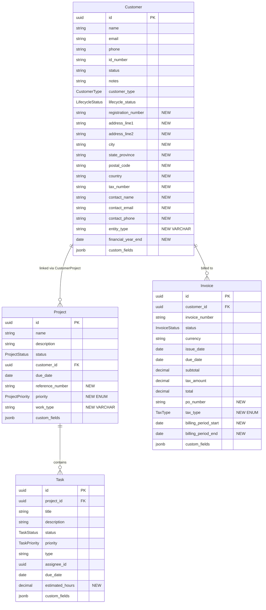

> Merge into architecture/ as standalone Phase 63 document.
> Depends on: Phase 11 (custom fields system), Phase 33 (prerequisite contexts), Phase 12 (template rendering)

# Phase 63 -- Custom Field Graduation: Promoting Structural Fields Across All Entities

---

## 63.1 Overview

Phase 11 introduced an EAV-style custom fields system where field packs seed `FieldDefinition` records per vertical profile, and entity values live in JSONB `custom_fields` columns on Customer, Project, Task, and Invoice. This system was the right choice at launch -- the platform had no vertical domain knowledge, and every field beyond the core schema was speculative.

Over 50+ phases of domain building, approximately 21 "custom" fields have proven to be structurally necessary. They are queried in service logic (`ConflictCheckService` reads `registration_number` from JSONB for conflict matching), required for core flows (`PrerequisiteService` checks JSONB for `address_line1` before invoice generation), rendered in every template, and present for every tenant in every vertical. They are "custom" in name only.

Phase 63 promotes these 21 fields to proper entity columns across four entities, removes them from field pack JSON files, and updates services, templates, and frontend forms to use structural columns directly. The custom fields system remains for genuinely custom, tenant-defined, or vertical-specific fields.

**What this phase does NOT do**: migrate existing data. All new columns are nullable. Existing entities keep their JSONB data untouched. New entity creation and edits write to structural columns. There is no backfill migration.

### What Changes

| Entity | Columns Added | Already Structural | Pack Fields Removed |
|--------|--------------|-------------------|-------------------|
| Customer | `registration_number`, `address_line1`, `address_line2`, `city`, `state_province`, `postal_code`, `country`, `tax_number`, `contact_name`, `contact_email`, `contact_phone`, `entity_type`, `financial_year_end` (13) | `name`, `email`, `phone`, `id_number`, `status`, `customer_type`, `lifecycle_status`, `notes` | 8 from common-customer, 8 from accounting-za-customer, 4 from legal-za-customer (1 was already structural) |
| Project | `reference_number`, `priority`, `work_type` (3) | `name`, `description`, `status`, `customer_id`, `due_date` | 2 from common-project, 1 from accounting-za-project, 1 from legal-za-project |
| Task | `estimated_hours` (1) | `title`, `description`, `status`, `priority`, `type`, `assignee_id`, `due_date` | 2 from common-task (`priority` already structural, `estimated_hours` promoted) |
| Invoice | `po_number`, `tax_type`, `billing_period_start`, `billing_period_end` (4) | `invoice_number`, `status`, `currency`, `issue_date`, `due_date`, `subtotal`, `tax_amount`, `total`, `notes`, `payment_terms`, `payment_reference`, `customer_name`, `customer_email`, `customer_address` | 5 from common-invoice (entire pack deleted) |

---

## 63.2 Domain Model Changes

### 63.2.1 Customer Entity -- 13 New Columns

The Customer entity gains address, contact, and business-detail columns. All nullable -- existing customers must not break.

| Column | Java Field | Type | Nullable | Notes |
|--------|-----------|------|----------|-------|
| `registration_number` | `registrationNumber` | `VARCHAR(100)` | Yes | Company/trust registration. Used by `ConflictCheckService` for matching. |
| `address_line1` | `addressLine1` | `VARCHAR(255)` | Yes | Street address. Prerequisite for `INVOICE_GENERATION` and `PROPOSAL_SEND`. |
| `address_line2` | `addressLine2` | `VARCHAR(255)` | Yes | Suite, unit, building, floor. |
| `city` | `city` | `VARCHAR(100)` | Yes | City or locality. Prerequisite for `INVOICE_GENERATION`. |
| `state_province` | `stateProvince` | `VARCHAR(100)` | Yes | State, province, or region. |
| `postal_code` | `postalCode` | `VARCHAR(20)` | Yes | ZIP or postal code. |
| `country` | `country` | `VARCHAR(2)` | Yes | ISO 3166-1 alpha-2 (ZA, US, GB, etc.). Prerequisite for `INVOICE_GENERATION`. |
| `tax_number` | `taxNumber` | `VARCHAR(100)` | Yes | Universal tax ID (VAT, EIN, GST). Replaces both common pack `tax_number` and accounting-za `vat_number`. Prerequisite for `INVOICE_GENERATION`. |
| `contact_name` | `contactName` | `VARCHAR(255)` | Yes | Primary contact person. Prerequisite for `PROPOSAL_SEND`. |
| `contact_email` | `contactEmail` | `VARCHAR(255)` | Yes | Primary contact email. Prerequisite for `PROPOSAL_SEND`. |
| `contact_phone` | `contactPhone` | `VARCHAR(50)` | Yes | Primary contact phone. |
| `entity_type` | `entityType` | `VARCHAR(30)` | Yes | Granular legal entity form: PTY_LTD, SOLE_PROPRIETOR, CC, TRUST, PARTNERSHIP, NPC, ESTATE, GOVERNMENT, etc. VARCHAR because values differ per vertical (see [ADR-238](../adr/ADR-238-entity-type-varchar-vs-enum.md)). |
| `financial_year_end` | `financialYearEnd` | `DATE` | Yes | Used by `DeadlineCalculationService`. Stored as `LocalDate` -- no more string parsing from JSONB. |

**Relationship to `customer_type`**: The existing `CustomerType` enum (INDIVIDUAL, COMPANY, TRUST) is a broad classification that drives UI layout and validation rules. The new `entity_type` column is the granular legal entity form within that classification. A `customer_type` of COMPANY could have `entity_type` of PTY_LTD, CC, or NPC. These are complementary, not duplicative.

**Indexes**:
- `idx_customers_registration_number` on `registration_number` -- enables `ConflictCheckService` to do a proper `WHERE registration_number = ?` instead of JSONB extraction.
- `idx_customers_tax_number` on `tax_number` -- frequently used in duplicate detection and invoice lookups.
- `idx_customers_entity_type` on `entity_type` -- list filtering and reporting.

### 63.2.2 Project Entity -- 3 New Columns

| Column | Java Field | Type | Nullable | Notes |
|--------|-----------|------|----------|-------|
| `reference_number` | `referenceNumber` | `VARCHAR(100)` | Yes | External reference (PO number, matter number, case reference). |
| `priority` | `priority` | `VARCHAR(20)` | Yes | Java enum `ProjectPriority` (LOW, MEDIUM, HIGH) with `@Enumerated(EnumType.STRING)`. Nullable -- existing projects have no priority. |
| `work_type` | `workType` | `VARCHAR(50)` | Yes | Unifies accounting-za `engagement_type` and legal-za `matter_type`. VARCHAR with service-layer validation per vertical profile (see [ADR-238](../adr/ADR-238-entity-type-varchar-vs-enum.md)). |

**Index**:
- `idx_projects_work_type` on `work_type` -- enables filtering by engagement type or matter type in list views and profitability reports.

### 63.2.3 Task Entity -- 1 New Column

| Column | Java Field | Type | Nullable | Notes |
|--------|-----------|------|----------|-------|
| `estimated_hours` | `estimatedHours` | `DECIMAL(8,2)` | Yes | Java `BigDecimal` with `@DecimalMin("0")`. Feeds into budget utilization and profitability calculations. |

Task already has a structural `priority` column (`TaskPriority` enum: LOW, MEDIUM, HIGH, URGENT) -- no change needed there. The common-task pack's `priority` field is redundant and will be removed from the pack file.

### 63.2.4 Invoice Entity -- 4 New Columns

| Column | Java Field | Type | Nullable | Notes |
|--------|-----------|------|----------|-------|
| `po_number` | `poNumber` | `VARCHAR(100)` | Yes | Customer's purchase order number. Standard B2B invoicing field. |
| `tax_type` | `taxType` | `VARCHAR(20)` | Yes | Java enum `TaxType` (VAT, GST, SALES_TAX, NONE) with `@Enumerated(EnumType.STRING)`. Drives tax calculation display. |
| `billing_period_start` | `billingPeriodStart` | `DATE` | Yes | Java `LocalDate`. For recurring/retainer invoices. |
| `billing_period_end` | `billingPeriodEnd` | `DATE` | Yes | Java `LocalDate`. For recurring/retainer invoices. |

Invoice already has a structural `payment_reference` column -- no change needed there. The common-invoice pack's `payment_reference` field is redundant and will be removed.

### 63.2.5 Entity Relationship Diagram



---

## 63.3 Migration

**Single tenant migration**: `V{next}__promote_structural_custom_fields.sql`. No global migration needed -- all four entities are tenant-scoped tables.

> **Important**: V85 is the latest migration at time of writing. Verify the highest existing migration before naming the file: `ls backend/src/main/resources/db/migration/tenant/V8*.sql | sort -V | tail -1`. If Phases 60/61 have added V86+ by the time this is implemented, increment accordingly.

All columns are nullable. No default values. No data backfill. This is a pure additive DDL change.

```sql
-- V{next}__promote_structural_custom_fields.sql
-- Phase 63: Promote ~21 custom fields to structural columns across 4 entities.
-- All columns nullable -- existing entities are unaffected.
-- No data backfill from JSONB.

-- ============================================================
-- Customer: 13 new columns
-- ============================================================
ALTER TABLE customers ADD COLUMN registration_number VARCHAR(100);
ALTER TABLE customers ADD COLUMN address_line1 VARCHAR(255);
ALTER TABLE customers ADD COLUMN address_line2 VARCHAR(255);
ALTER TABLE customers ADD COLUMN city VARCHAR(100);
ALTER TABLE customers ADD COLUMN state_province VARCHAR(100);
ALTER TABLE customers ADD COLUMN postal_code VARCHAR(20);
ALTER TABLE customers ADD COLUMN country VARCHAR(2);
ALTER TABLE customers ADD COLUMN tax_number VARCHAR(100);
ALTER TABLE customers ADD COLUMN contact_name VARCHAR(255);
ALTER TABLE customers ADD COLUMN contact_email VARCHAR(255);
ALTER TABLE customers ADD COLUMN contact_phone VARCHAR(50);
ALTER TABLE customers ADD COLUMN entity_type VARCHAR(30);
ALTER TABLE customers ADD COLUMN financial_year_end DATE;

CREATE INDEX idx_customers_registration_number ON customers(registration_number);
CREATE INDEX idx_customers_tax_number ON customers(tax_number);
CREATE INDEX idx_customers_entity_type ON customers(entity_type);

-- ============================================================
-- Project: 3 new columns
-- ============================================================
ALTER TABLE projects ADD COLUMN reference_number VARCHAR(100);
ALTER TABLE projects ADD COLUMN priority VARCHAR(20);
ALTER TABLE projects ADD COLUMN work_type VARCHAR(50);

CREATE INDEX idx_projects_work_type ON projects(work_type);

-- ============================================================
-- Task: 1 new column
-- ============================================================
ALTER TABLE tasks ADD COLUMN estimated_hours DECIMAL(8,2);

-- ============================================================
-- Invoice: 4 new columns
-- ============================================================
ALTER TABLE invoices ADD COLUMN po_number VARCHAR(100);
ALTER TABLE invoices ADD COLUMN tax_type VARCHAR(20);
ALTER TABLE invoices ADD COLUMN billing_period_start DATE;
ALTER TABLE invoices ADD COLUMN billing_period_end DATE;
```

**Why all nullable**: Existing entities were created before these columns existed. Adding a NOT NULL constraint would require a default value for every existing row, which would be misleading (an empty string is worse than null -- it implies the field was actively set to blank). Null means "not yet provided," which is accurate.

---

## 63.4 Backend Changes

### 63.4.1 Entity Updates

Four entities gain `@Column` fields. All follow the established pattern: explicit `name` and `length` attributes on `@Column`, manual getters/setters (no Lombok), `updatedAt` set in setters.

**Customer.java** (`io.b2mash.b2b.b2bstrawman.customer`):
- Add 13 fields with `@Column` annotations. `financialYearEnd` uses `java.time.LocalDate`. `entityType` is `String` (not an enum -- see ADR-238). All other fields are `String`.
- Add getters and setters. Setters update `this.updatedAt = Instant.now()` per the existing convention.
- The `anonymize()` method should clear promoted PII fields: `contactName`, `contactEmail`, `contactPhone`, `addressLine1`, `addressLine2`, `city`, `stateProvince`, `postalCode`, `country`, `taxNumber`, `registrationNumber`, `financialYearEnd`.

**Project.java** (`io.b2mash.b2b.b2bstrawman.project`):
- Add 3 fields. `priority` uses the new `ProjectPriority` enum with `@Enumerated(EnumType.STRING)`. `workType` is `String`. `referenceNumber` is `String`.
- Update the `update()` method signature to accept the new fields.

**Task.java** (`io.b2mash.b2b.b2bstrawman.task`):
- Add `estimatedHours` as `BigDecimal` with `@Column(name = "estimated_hours", precision = 8, scale = 2)`.
- Add `@DecimalMin("0")` for validation.
- Update the `update()` method signature to accept `estimatedHours`.

**Invoice.java** (`io.b2mash.b2b.b2bstrawman.invoice`):
- Add 4 fields. `taxType` uses the new `TaxType` enum with `@Enumerated(EnumType.STRING)`. `billingPeriodStart` and `billingPeriodEnd` are `LocalDate`. `poNumber` is `String`.
- The `updateDraft()` method should accept the new fields alongside existing draft-edit parameters.

### 63.4.2 New Enums

**ProjectPriority** (`io.b2mash.b2b.b2bstrawman.project`):

Values: `LOW`, `MEDIUM`, `HIGH`. Universal across all verticals. Used with `@Enumerated(EnumType.STRING)`.

**TaxType** (`io.b2mash.b2b.b2bstrawman.invoice`):

Values: `VAT`, `GST`, `SALES_TAX`, `NONE`. Universal across all verticals. Drives tax calculation display on invoice templates and detail pages.

Both enums use Java enums (not VARCHAR) because their value sets are fixed and universal. See [ADR-238](../adr/ADR-238-entity-type-varchar-vs-enum.md) for the boundary between enum and VARCHAR fields.

### 63.4.3 DTO Updates

Each entity's request and response DTOs gain the promoted fields as optional parameters.

**CustomerRequest / CustomerResponse**: Add all 13 fields. `CustomerResponse` continues to include the `customFields` map for remaining genuinely custom fields (SARS reference, FICA status, trust details, etc.).

**ProjectRequest / ProjectResponse**: Add `referenceNumber` (String), `priority` (String, validated against ProjectPriority enum values), `workType` (String, validated per vertical profile).

**TaskRequest / TaskResponse**: Add `estimatedHours` (BigDecimal).

**InvoiceRequest / InvoiceResponse**: Add `poNumber` (String), `taxType` (String, validated against TaxType enum values), `billingPeriodStart` (LocalDate), `billingPeriodEnd` (LocalDate).

### 63.4.4 Service Layer Updates

**ConflictCheckService** (`io.b2mash.b2b.b2bstrawman.verticals.legal.conflictcheck`):

Currently reads `registration_number` from JSONB for conflict matching. The JSONB path requires `customer.getCustomFields().get("registration_number")` with null checks and string extraction. Update to `customer.getRegistrationNumber()` -- a direct typed accessor. This enables the repository to use a proper `WHERE registration_number = ?` query (hitting the new `idx_customers_registration_number` index) instead of JSONB extraction (`custom_fields->>'registration_number'`).

**DeadlineCalculationService** (`io.b2mash.b2b.b2bstrawman.deadline`):

Currently does:
1. `customFields.get("financial_year_end")` -- returns `Object`, must be cast and parsed as `LocalDate`
2. `fields.get("engagement_type")` -- returns `Object`, used as `String`
3. `fields.get("tax_year")` -- returns `Object`, used as `String`

After Phase 63:
1. `customer.getFinancialYearEnd()` -- returns `LocalDate` directly. No parsing, no `DateTimeParseException` handling.
2. `project.getWorkType()` -- returns `String` directly. No JSONB extraction.
3. `fields.get("tax_year")` -- stays as JSONB read. `tax_year` is accounting-specific and not promoted.

**PrerequisiteService** (`io.b2mash.b2b.b2bstrawman.prerequisite`):

Currently checks JSONB for required fields before actions like invoice generation and proposal sending. The `checkStructural()` method already handles some structural checks (customer email, portal contact). Phase 63 extends `checkStructural()` to include the promoted field null-checks:

- `INVOICE_GENERATION` context: check `customer.getAddressLine1() != null`, `customer.getCity() != null`, `customer.getCountry() != null`, `customer.getTaxNumber() != null`
- `PROPOSAL_SEND` context: check `customer.getContactName() != null`, `customer.getContactEmail() != null`, check `customer.getAddressLine1() != null`

These checks run alongside the existing custom field prerequisite checks. The caller receives the same `PrerequisiteCheck` response -- it does not know whether a violation came from a structural field or a custom field. See Section 63.7 for the detailed design.

**CustomerService / ProjectService / TaskService / InvoiceService**:

Update `create()` and `update()` methods to accept and persist the new structural fields. Standard setter calls in the service layer. No special logic beyond the existing field-setting pattern.

For `CustomerService`: the `entity_type` value should be validated against the tenant's vertical profile using the validation registry described in ADR-238. Invalid values produce an `InvalidStateException`.

For `ProjectService`: the `work_type` value should be validated against the tenant's vertical profile in the same way. The `priority` value is validated by the `ProjectPriority` enum -- invalid values produce a standard `IllegalArgumentException`.

### 63.4.5 CustomFieldFilterUtil Update

File: `backend/src/main/java/io/b2mash/b2b/b2bstrawman/view/CustomFieldFilterUtil.java`

Currently filters list views by extracting JSONB custom field values with Postgres `custom_fields->>'slug'` expressions. For promoted fields, update to use proper column-based `WHERE` clauses instead.

When the filter field slug matches a promoted column name (e.g., `city`, `country`, `entity_type`, `work_type`), the `CustomFieldFilterUtil` should generate a standard column predicate (`WHERE city = ?`) rather than a JSONB extraction predicate (`WHERE custom_fields->>'city' = ?`). This is a significant query performance improvement -- column predicates hit B-tree indexes, while JSONB extraction requires a sequential scan or GIN index.

The mapping from slug to column can be a static `Set<String>` of promoted field slugs, checked before falling through to the JSONB path.

### 63.4.6 Template Context Builder Updates

**CustomerContextBuilder** (`io.b2mash.b2b.b2bstrawman.template`):

Expose promoted fields as direct template variables alongside the existing `customFields` map:

```
customer.registrationNumber      -- from entity getter
customer.addressLine1            -- from entity getter
customer.city                    -- from entity getter
customer.country                 -- from entity getter
customer.taxNumber               -- from entity getter
customer.contactName             -- from entity getter
customer.contactEmail            -- from entity getter
customer.entityType              -- from entity getter
customer.financialYearEnd        -- from entity getter (formatted as date string)
customer.customFields.tax_number -- ALIAS for backward compatibility (reads from entity getter)
customer.customFields.address_line1 -- ALIAS for backward compatibility
```

The backward compatibility aliases ensure that existing templates referencing `${customer.customFields.tax_number}` continue to work. The aliases are populated from the entity getter, not from the JSONB map. This is a one-phase deprecation window -- the aliases can be removed in a follow-up phase once tenants have updated their templates.

**ProjectContextBuilder** (`io.b2mash.b2b.b2bstrawman.template`):

Add to the `projectMap`:
- `project.referenceNumber` -- from entity getter
- `project.priority` -- from entity getter (enum name)
- `project.workType` -- from entity getter

**InvoiceContextBuilder** (`io.b2mash.b2b.b2bstrawman.template`):

Add to the `invoiceMap`:
- `invoice.poNumber` -- from entity getter
- `invoice.taxType` -- from entity getter (enum name)
- `invoice.billingPeriodStart` -- from entity getter (formatted as date string)
- `invoice.billingPeriodEnd` -- from entity getter (formatted as date string)

Also update the `customerVatNumber` convenience alias: currently reads from `resolvedCustomFields.get("vat_number")`. After Phase 63, reads from `customer.getTaxNumber()` directly, with JSONB fallback for pre-Phase-63 entities.

### 63.4.7 VariableMetadataRegistry Update

File: `backend/src/main/java/io/b2mash/b2b/b2bstrawman/template/VariableMetadataRegistry.java`

Promoted fields should appear in the structural variable groups (e.g., "Customer", "Project", "Invoice") rather than the dynamically-loaded "Custom Fields" group. This means:

- `registerCustomerVariables()`: add `VariableInfo` entries for `customer.registrationNumber`, `customer.addressLine1`, `customer.city`, `customer.country`, `customer.taxNumber`, `customer.contactName`, `customer.contactEmail`, `customer.contactPhone`, `customer.entityType`, `customer.financialYearEnd` to the "Customer" group.
- `registerProjectVariables()`: add `VariableInfo` entries for `project.referenceNumber`, `project.priority`, `project.workType` to the "Project" group.
- `registerInvoiceVariables()` (method to be created or existing invoice registration to be extended): add `VariableInfo` entries for `invoice.poNumber`, `invoice.taxType`, `invoice.billingPeriodStart`, `invoice.billingPeriodEnd` to the "Invoice" group.

The `appendCustomFieldGroups()` method continues to work as-is -- it dynamically loads remaining `FieldDefinition` records. Since the promoted fields are removed from pack files, new tenants will not have those `FieldDefinition` records, and the custom fields group will be shorter. Existing tenants retain the old `FieldDefinition` records (orphaned but harmless -- they will appear in the custom fields group alongside the structural entries until manually cleaned up or hidden via the `active` flag).

---

## 63.5 Frontend Changes

### 63.5.1 Customer Form Restructuring

Move promoted fields out of `CustomFieldSection` and into the main customer create/edit form as proper typed inputs organized into logical sections:

**Address Section**:
- `addressLine1` -- text input (label: "Address Line 1")
- `addressLine2` -- text input (label: "Address Line 2")
- `city` -- text input (label: "City")
- `stateProvince` -- text input (label: "State / Province")
- `postalCode` -- text input (label: "Postal Code")
- `country` -- select input with ISO 3166-1 alpha-2 options (label: "Country"). Ship with the same country list as the former common-customer pack's dropdown: US, CA, GB, AU, ZA, DE, FR, NL, NZ. Expandable later.

**Contact Section**:
- `contactName` -- text input (label: "Primary Contact Name")
- `contactEmail` -- email input with validation (label: "Primary Contact Email")
- `contactPhone` -- tel input (label: "Primary Contact Phone")

**Business Details Section**:
- `registrationNumber` -- text input (label: "Registration Number")
- `taxNumber` -- text input (label: "Tax Number")
- `entityType` -- select input (label: "Entity Type"). Options loaded from the vertical profile's allowed values. If no vertical profile is configured, show all known values.
- `financialYearEnd` -- date picker (label: "Financial Year-End")

All inputs use existing Shadcn components (Input, Select, DatePicker). No new component library additions. All fields are optional in the form -- no client-side required validation (server-side prerequisite checks handle context-dependent requirements).

The `CustomFieldSection` continues to render below these sections for remaining genuinely custom fields (SARS reference, FICA status, trust details, referred_by, etc.).

### 63.5.2 Project Form Additions

Add to the main project create/edit form:

- `referenceNumber` -- text input (label: "Reference Number")
- `priority` -- select input (label: "Priority", options: Low, Medium, High)
- `workType` -- select input (label: "Work Type"). Options context-dependent on vertical profile. For accounting-za: the engagement type options. For legal-za: the matter type options. If no vertical profile, the field is hidden or shows a freeform text input.

### 63.5.3 Task Form Addition

Add to the main task create/edit form:

- `estimatedHours` -- number input (label: "Estimated Hours", min: 0, step: 0.25)

Remove `priority` from the `CustomFieldSection` rendering for tasks (already structural on the Task entity). Remove `estimated_hours` from `CustomFieldSection` rendering for tasks (now structural).

### 63.5.4 Invoice Form Additions

Add to the invoice create/edit form:

- `poNumber` -- text input (label: "PO Number")
- `taxType` -- select input (label: "Tax Type", options: VAT, GST, Sales Tax, None)
- `billingPeriodStart` -- date picker (label: "Billing Period Start")
- `billingPeriodEnd` -- date picker (label: "Billing Period End")

Remove `payment_reference` from `CustomFieldSection` rendering for invoices (already structural). After this phase, invoices have no remaining custom fields in the common pack -- `CustomFieldSection` is hidden for invoices unless the tenant has added tenant-specific custom fields.

### 63.5.5 Detail Page Updates

**Customer Detail Page**:
- Display promoted fields in their proper sections rather than in the custom fields panel.
- Address fields render as a formatted address block (multi-line: address_line1, address_line2, city, state_province, postal_code, country).
- Contact fields render in a contact card with clickable email and phone links.
- Business details (registration_number, tax_number, entity_type, financial_year_end) render in a "Business Details" section.

**Project Detail Page**:
- Display `referenceNumber` in the project header or metadata section.
- Display `priority` as a badge (matching the existing task priority badge pattern).
- Display `workType` in the project metadata section.

**Invoice Detail Page**:
- Display `poNumber` in the invoice metadata section.
- Display `taxType` alongside existing tax amount display.
- Display `billingPeriodStart` / `billingPeriodEnd` as a date range in the invoice metadata section.

### 63.5.6 CustomFieldSection Scope Reduction

The `CustomFieldSection` component itself does not change structurally. However, after pack cleanup, new tenants will have fewer custom fields rendered by this component:

- Customer: address/contact/business fields no longer appear in `CustomFieldSection`. Remaining: SARS references, FICA fields, trust fields, industry, trading_as, postal_address, referred_by, preferred_correspondence.
- Project: reference_number and priority no longer appear. Remaining: category, tax_year, SARS deadline, reviewer, complexity, case details, court details.
- Task: priority and estimated_hours no longer appear. Remaining: category.
- Invoice: all common-invoice fields are gone. `CustomFieldSection` is hidden for invoices unless the tenant has tenant-specific custom fields.

For existing tenants, the orphaned `FieldDefinition` records will still cause `CustomFieldSection` to render the old fields. This is harmless but visually redundant -- the structural form fields and the custom fields panel both show the same data. A future cleanup task can deactivate (set `active = false`) the orphaned `FieldDefinition` records for existing tenants.

---

## 63.6 Pack JSON Cleanup

### 63.6.1 Per-Pack Changes

**`common-customer.json`** -- Remove all 8 fields (entire "Contact & Address" group):
- `address_line1`, `address_line2`, `city`, `state_province`, `postal_code`, `country`, `tax_number`, `phone`
- **Result**: file deleted entirely (group has no remaining fields).
- **Note**: The `contact_name`, `contact_email`, `contact_phone` promoted columns map to fields from the **vertical packs** (accounting-za's `primary_contact_name/email/phone`), not from this common pack. The common pack only contained address and tax fields.

**`accounting-za-customer.json`** -- Remove 8 promoted fields:
- `acct_company_registration_number` (promoted to `registration_number` column)
- `vat_number` (promoted to `tax_number` column)
- `acct_entity_type` (promoted to `entity_type` column)
- `financial_year_end` (promoted to `financial_year_end` column)
- `primary_contact_name` (promoted to `contact_name` column)
- `primary_contact_email` (promoted to `contact_email` column)
- `primary_contact_phone` (promoted to `contact_phone` column)
- `registered_address` (promoted to `address_line1` column)
- **Remaining**: `trading_as`, `sars_tax_reference`, `sars_efiling_profile`, `industry_sic_code`, `postal_address`, `fica_verified`, `fica_verification_date`, `referred_by`

**`legal-za-customer.json`** -- Remove 4 fields (3 promoted in this phase, 1 already structural):
- `client_type` (promoted to `entity_type` column)
- `id_passport_number` (already structural as `id_number` on Customer -- removing redundant pack entry from a prior phase oversight)
- `registration_number` (promoted to `registration_number` column)
- `physical_address` (promoted to `address_line1` column)
- **Remaining**: `postal_address`, `preferred_correspondence`, `referred_by`

**`common-project.json`** -- Remove 2 promoted fields:
- `reference_number` (promoted to `reference_number` column)
- `priority` (promoted to `priority` column)
- **Remaining**: `category`

**`accounting-za-project.json`** -- Remove 1 promoted field:
- `engagement_type` (promoted to `work_type` column)
- **Remaining**: `tax_year`, `sars_submission_deadline`, `assigned_reviewer`, `complexity`

**`legal-za-project.json`** -- Remove 1 promoted field:
- `matter_type` (promoted to `work_type` column)
- **Remaining**: `case_number`, `court_name`, `opposing_party`, `opposing_attorney`, `advocate_name`, `date_of_instruction`, `estimated_value`

**`common-task.json`** -- Remove 2 promoted fields:
- `priority` (already structural on Task entity)
- `estimated_hours` (promoted to `estimated_hours` column)
- **Remaining**: `category`

**`common-invoice.json`** -- Remove all 5 fields:
- `purchase_order_number` (promoted to `po_number` column)
- `payment_reference` (already structural on Invoice entity)
- `tax_type` (promoted to `tax_type` column)
- `billing_period_start` (promoted to `billing_period_start` column)
- `billing_period_end` (promoted to `billing_period_end` column)
- **Result**: file deleted entirely (no remaining fields). Remove the `common-invoice` pack reference from `FieldPackSeeder`.

### 63.6.2 Impact on FieldPackSeeder

`FieldPackSeeder` reads from `classpath:field-packs/*.json`. After cleanup:
- Two pack files are deleted (`common-customer.json`, `common-invoice.json`)
- Six pack files are slimmed (fewer fields per pack)
- New tenants provisioned after this phase get fewer `FieldDefinition` records seeded
- Existing tenants are unaffected -- their already-seeded `FieldDefinition` and `FieldValue` records remain (orphaned but harmless)

The `FieldPackSeeder` code does not change -- it simply processes fewer fields from the remaining pack files.

---

## 63.7 Prerequisite Service Updates

### 63.7.1 StructuralPrerequisiteCheck Concept

The existing `PrerequisiteService.checkStructural()` method already handles some structural checks (customer email for invoice delivery, portal contact for proposals). Phase 63 extends this method with null-checks on promoted columns.

The approach is a mapping from `PrerequisiteContext` to a list of structural field checks on the entity:

| Context | Entity | Structural Field Checks |
|---------|--------|------------------------|
| `INVOICE_GENERATION` | Customer | `addressLine1 != null`, `city != null`, `country != null`, `taxNumber != null` |
| `PROPOSAL_SEND` | Customer | `contactName != null`, `contactEmail != null`, `addressLine1 != null` |

These checks produce the same `PrerequisiteViolation` records as the existing custom field checks, using the `"STRUCTURAL"` violation type that `checkStructural()` already uses. The caller receives a unified `PrerequisiteCheck` response with no awareness of whether violations came from structural or custom field checks.

### 63.7.2 Implementation Approach

Extend the `INVOICE_GENERATION` case in `checkStructural()`:

After the existing email/portal-contact check, add null-checks on the promoted Customer columns. Each missing field produces a `PrerequisiteViolation` with:
- type: `"STRUCTURAL"`
- message: `"{Field Name} is required for Invoice Generation"`
- entityType: `"CUSTOMER"`
- entityId: the customer's UUID
- fieldSlug: the column name (e.g., `"address_line1"`)
- suggestion: `"Fill the {Field Name} field on the customer profile"`

Similarly, extend the `PROPOSAL_SEND` case with null-checks on `contactName`, `contactEmail`, and `addressLine1`.

### 63.7.3 Removing Redundant Custom Field Checks

After pack cleanup, new tenants will not have `FieldDefinition` records with `requiredForContexts` for promoted fields. The custom field prerequisite check loop will naturally skip these because the `FieldDefinition` no longer exists for new tenants.

For existing tenants, the custom field check will still run (the `FieldDefinition` records still exist with `requiredForContexts`), but the structural check will also run. This produces duplicate violations for the same field. To avoid duplicates, the `checkStructural()` method should collect the field slugs it checks, and the custom field check loop should skip any `FieldDefinition` whose slug matches a promoted structural field. A static `Set<String>` of promoted field slugs (shared with `CustomFieldFilterUtil`) provides this filter.

---

## 63.8 Template Backward Compatibility

### 63.8.1 Alias Strategy

Existing templates reference promoted fields via the JSONB custom fields path: `${customer.customFields.tax_number}`, `${customer.customFields.address_line1}`, etc. These references would break after promotion because the values are no longer in the JSONB map for newly created entities.

The context builders maintain backward compatibility by injecting aliases into the `customFields` map within the context (not the entity):

```
// In CustomerContextBuilder.buildContext():
// After populating customerMap with structural fields...
Map<String, Object> resolvedCustomFields = ...;  // existing custom fields from JSONB

// Inject structural field aliases — structural column wins when non-null,
// JSONB is fallback only for old entities never edited since Phase 63.
if (customer.getTaxNumber() != null) {
    resolvedCustomFields.put("tax_number", customer.getTaxNumber());
} // else: JSONB value (if any) remains for pre-Phase-63 entities

if (customer.getAddressLine1() != null) {
    resolvedCustomFields.put("address_line1", customer.getAddressLine1());
}

if (customer.getRegistrationNumber() != null) {
    resolvedCustomFields.put("registration_number", customer.getRegistrationNumber());
}
// ... same pattern for all 13 promoted customer fields

// Also inject aliases for renamed slugs (old pack slug → structural column value):
if (customer.getTaxNumber() != null) {
    resolvedCustomFields.put("vat_number", customer.getTaxNumber());  // accounting-za slug
}
if (customer.getContactName() != null) {
    resolvedCustomFields.put("primary_contact_name", customer.getContactName());  // accounting-za slug
}
if (customer.getContactEmail() != null) {
    resolvedCustomFields.put("primary_contact_email", customer.getContactEmail());
}
if (customer.getContactPhone() != null) {
    resolvedCustomFields.put("primary_contact_phone", customer.getContactPhone());
}
if (customer.getEntityType() != null) {
    resolvedCustomFields.put("acct_entity_type", customer.getEntityType());  // accounting-za slug
    resolvedCustomFields.put("client_type", customer.getEntityType());  // legal-za slug
}
if (customer.getAddressLine1() != null) {
    resolvedCustomFields.put("registered_address", customer.getAddressLine1());  // accounting-za slug
    resolvedCustomFields.put("physical_address", customer.getAddressLine1());  // legal-za slug
}
```

**Precedence rule**: Structural column wins when non-null. JSONB is the fallback only for pre-Phase-63 entities that have never been edited (and therefore have null structural columns but populated JSONB). After Phase 63, new writes go to structural columns and nothing writes to JSONB, so the structural column is always the authoritative source for edited entities.

**Slug renames**: Several promoted fields had different slugs across vertical packs (e.g., `primary_contact_name` in accounting-za → `contact_name` column, `vat_number` in accounting-za → `tax_number` column, `acct_entity_type` / `client_type` → `entity_type` column). Both the old-slug and new-slug aliases must be injected to maintain backward compatibility with existing templates that reference either slug.

This is a one-phase deprecation window. In a follow-up phase, the aliases (including renamed-slug aliases) can be removed and templates updated to use the direct paths (`${customer.taxNumber}` instead of `${customer.customFields.tax_number}` or `${customer.customFields.vat_number}`).

### 63.8.2 InvoiceContextBuilder.customerVatNumber

The `InvoiceContextBuilder` currently exposes a top-level `customerVatNumber` variable by reading `resolvedCustomFields.get("vat_number")`. After Phase 63, this should read from `customer.getTaxNumber()` directly as the primary source, with the JSONB value as fallback for old entities.

---

## 63.9 Implementation Guidance

### 63.9.1 Backend Changes

| File | Change Description |
|------|-------------------|
| `db/migration/tenant/V{next}__promote_structural_custom_fields.sql` | New migration: 21 columns across 4 tables + 4 indexes (verify latest migration number before naming) |
| `customer/Customer.java` | Add 13 `@Column` fields, getters/setters, update `anonymize()` |
| `customer/CustomerRequest.java` / `CustomerResponse.java` | Add 13 optional DTO fields |
| `customer/CustomerService.java` | Update `create()` and `update()` to accept/persist new fields; add `entity_type` validation |
| `customer/CustomerController.java` | No change (thin controller delegates to service) |
| `project/Project.java` | Add 3 `@Column` fields, update `update()` method |
| `project/ProjectPriority.java` | New enum: LOW, MEDIUM, HIGH |
| `project/ProjectRequest.java` / `ProjectResponse.java` | Add 3 optional DTO fields |
| `project/ProjectService.java` | Update `create()` and `update()` to accept/persist new fields; add `work_type` validation |
| `task/Task.java` | Add `estimatedHours` `@Column` field, update `update()` method |
| `task/TaskRequest.java` / `TaskResponse.java` | Add `estimatedHours` DTO field |
| `task/TaskService.java` | Update `create()` and `update()` to accept/persist `estimatedHours` |
| `invoice/Invoice.java` | Add 4 `@Column` fields, update `updateDraft()` method |
| `invoice/TaxType.java` | New enum: VAT, GST, SALES_TAX, NONE |
| `invoice/InvoiceRequest.java` / `InvoiceResponse.java` | Add 4 optional DTO fields |
| `invoice/InvoiceService.java` | Update creation and draft-update flows to accept new fields |
| `verticals/legal/conflictcheck/ConflictCheckService.java` | Replace JSONB extraction with `customer.getRegistrationNumber()` |
| `deadline/DeadlineCalculationService.java` | Replace `customFields.get("financial_year_end")` with `customer.getFinancialYearEnd()`; replace `fields.get("engagement_type")` with `project.getWorkType()` |
| `prerequisite/PrerequisiteService.java` | Extend `checkStructural()` with promoted field null-checks; add promoted slug filter to avoid duplicate violations |
| `view/CustomFieldFilterUtil.java` | Route promoted field slugs to column-based WHERE clauses |
| `template/CustomerContextBuilder.java` | Add promoted fields to `customerMap`; inject backward-compat aliases into `customFields` |
| `template/ProjectContextBuilder.java` | Add promoted fields to `projectMap` |
| `template/InvoiceContextBuilder.java` | Add promoted fields to `invoiceMap`; update `customerVatNumber` source |
| `template/VariableMetadataRegistry.java` | Add promoted fields to structural variable groups |
| `field-packs/common-customer.json` | Delete file |
| `field-packs/common-invoice.json` | Delete file |
| `field-packs/accounting-za-customer.json` | Remove 8 promoted fields |
| `field-packs/legal-za-customer.json` | Remove 4 promoted fields |
| `field-packs/common-project.json` | Remove 2 promoted fields |
| `field-packs/accounting-za-project.json` | Remove 1 promoted field |
| `field-packs/legal-za-project.json` | Remove 1 promoted field |
| `field-packs/common-task.json` | Remove 2 promoted fields |

### 63.9.2 Frontend Changes

| File / Area | Change Description |
|-------------|-------------------|
| Customer create/edit form | Restructure into Address, Contact, Business Details sections with typed inputs |
| Customer detail page | Display promoted fields in formatted sections (address block, contact card, business details) |
| Project create/edit form | Add `referenceNumber`, `priority`, `workType` inputs |
| Project detail page | Display `referenceNumber`, `priority` badge, `workType` in metadata section |
| Task create/edit form | Add `estimatedHours` number input |
| Invoice create/edit form | Add `poNumber`, `taxType`, `billingPeriodStart`, `billingPeriodEnd` inputs |
| Invoice detail page | Display promoted fields in metadata section |
| API client types | Update TypeScript interfaces for all four entity request/response types |

### 63.9.3 Testing Strategy

**Backend integration tests**:
- Test that new columns are persisted and returned in API responses (CRUD for all 4 entities)
- Test that `ConflictCheckService` reads `registrationNumber` from entity column (not JSONB)
- Test that `DeadlineCalculationService` reads `financialYearEnd` from entity column (not JSONB)
- Test that `PrerequisiteService` checks structural columns for `INVOICE_GENERATION` and `PROPOSAL_SEND` contexts
- Test that `CustomFieldFilterUtil` generates column-based WHERE for promoted field slugs
- Test template context builders include promoted fields and backward-compat aliases
- Test that `VariableMetadataRegistry` includes promoted fields in structural groups

**Frontend tests**:
- Test customer form renders Address, Contact, and Business Details sections
- Test project form renders `referenceNumber`, `priority`, `workType` inputs
- Test task form renders `estimatedHours` input
- Test invoice form renders `poNumber`, `taxType`, `billingPeriodStart`, `billingPeriodEnd` inputs
- Test detail pages display promoted fields in their structural sections

---

## 63.10 Capability Slices

### Slice 440A: Migration + Entity/DTO Updates (Backend Only)

**Scope**: Backend

**Key Deliverables**:
- V{next} migration adding 21 columns and 4 indexes (verify latest migration number)
- Entity updates: Customer (13 fields), Project (3 fields), Task (1 field), Invoice (4 fields)
- New enums: `ProjectPriority`, `TaxType`
- DTO updates: request/response records for all 4 entities
- Service updates: `create()` and `update()` methods accept and persist new fields
- Entity-type/work-type validation registry (service-layer validation per vertical profile)

**Dependencies**: None -- this is the foundation slice.

**Test Expectations**:
- Migration applies cleanly to all tenant schemas
- CRUD operations accept and return the new fields via API
- Existing entities without the new fields return null for those fields
- `ProjectPriority` and `TaxType` enum serialization/deserialization works correctly
- Invalid `entity_type` values for a given vertical profile are rejected

### Slice 440B: Service Layer Updates (Backend Only)

**Scope**: Backend

**Key Deliverables**:
- `ConflictCheckService`: reads `registrationNumber` from entity column
- `DeadlineCalculationService`: reads `financialYearEnd` and `workType` from entity columns
- `PrerequisiteService`: structural null-checks for promoted fields, promoted slug deduplication filter
- `CustomFieldFilterUtil`: column-based WHERE clauses for promoted field slugs
- `Customer.anonymize()` updated to clear promoted PII fields

**Dependencies**: Slice 440A (entities must have the new columns).

**Test Expectations**:
- `ConflictCheckService` finds conflicts by `registrationNumber` column (not JSONB)
- `DeadlineCalculationService` uses `financialYearEnd` as `LocalDate` (no string parsing)
- `PrerequisiteService` produces violations for missing `addressLine1`, `city`, `country`, `taxNumber` on invoice generation; missing `contactName`, `contactEmail` on proposal send
- No duplicate violations for promoted fields (structural + custom field checks)
- `CustomFieldFilterUtil` generates SQL with column predicates for promoted slugs

### Slice 440C: Template Context + Pack JSON Cleanup (Backend Only)

**Scope**: Backend

**Key Deliverables**:
- `CustomerContextBuilder`: promoted fields in `customerMap`, backward-compat aliases in `customFields`
- `ProjectContextBuilder`: promoted fields in `projectMap`
- `InvoiceContextBuilder`: promoted fields in `invoiceMap`, `customerVatNumber` source update
- `VariableMetadataRegistry`: promoted fields added to structural variable groups
- Pack file cleanup: delete `common-customer.json`, delete `common-invoice.json`, slim 6 other pack files

**Dependencies**: Slice 440A (entities must have the new columns to read from).

**Test Expectations**:
- Template context includes promoted fields at both `${customer.taxNumber}` and `${customer.customFields.tax_number}` paths
- `VariableMetadataRegistry` response includes promoted fields in "Customer" / "Project" / "Invoice" groups
- `FieldPackSeeder` still processes remaining pack files without errors
- New tenant provisioning seeds fewer `FieldDefinition` records (no common-customer, no common-invoice fields)

### Slice 440D: Frontend Form Restructuring

**Scope**: Frontend

**Key Deliverables**:
- Customer form: Address, Contact, Business Details sections with typed inputs
- Project form: `referenceNumber`, `priority`, `workType` inputs
- Task form: `estimatedHours` number input
- Invoice form: `poNumber`, `taxType`, `billingPeriodStart`, `billingPeriodEnd` inputs
- Updated TypeScript API client types for all 4 entities

**Dependencies**: Slice 440A (API must accept and return the new fields).

**Test Expectations**:
- Customer form renders 13 new inputs in 3 sections
- Project form renders 3 new inputs
- Task form renders 1 new input
- Invoice form renders 4 new inputs
- Form submissions send promoted fields as top-level request properties (not inside `customFields`)
- All inputs use existing Shadcn components

### Slice 440E: Detail Pages + CustomFieldSection Scope Reduction

**Scope**: Frontend

**Key Deliverables**:
- Customer detail page: formatted address block, contact card, business details section
- Project detail page: reference number, priority badge, work type display
- Invoice detail page: PO number, tax type, billing period display
- `CustomFieldSection` renders fewer fields for new tenants (promoted fields removed from packs)

**Dependencies**: Slice 440D (form components should exist before detail pages reference the same fields).

**Test Expectations**:
- Customer detail page shows address as formatted block
- Project detail page shows priority as a badge
- Invoice detail page shows billing period as date range
- `CustomFieldSection` does not render promoted fields for entities created after this phase

---

## 63.11 ADR Index

| ADR | Title | Decision |
|-----|-------|----------|
| [ADR-237](../adr/ADR-237-structural-vs-custom-field-boundary.md) | Structural vs. Custom Field Boundary | Scoring rubric: promote when a field scores 2+ on (service-layer read, query performance, core flow dependency, cross-vertical presence) |
| [ADR-238](../adr/ADR-238-entity-type-varchar-vs-enum.md) | Entity Type and Work Type as VARCHAR vs. Enum | VARCHAR with service-layer validation for vertical-dependent fields; Java enum for universal fixed-value fields |
