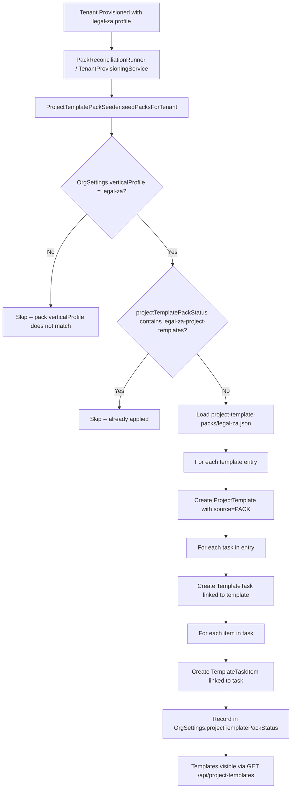
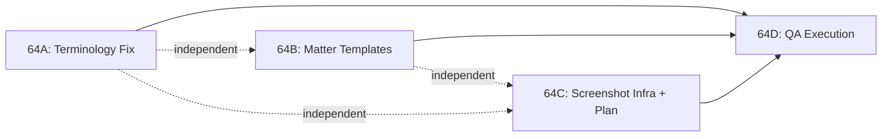

> Phase 64 architecture document. No ARCHITECTURE.md merge needed -- standalone reference for QA phase.
> Depends on: Phase 61 (legal compliance refinements), Phase 60 (trust accounting), Phase 55 (legal foundations), Phase 48 (QA gap closure -- terminology system)

# Phase 64 -- Legal Vertical QA: Terminology, Matter Templates & 90-Day Lifecycle

---

## 64.1 Overview

Phase 64 is a **quality assurance and content phase** for the legal vertical. No new backend entities, no new API endpoints, no database migrations. The phase produces four deliverables:

1. **Corrected terminology map** -- the `legal-za` entry in `frontend/lib/terminology-map.ts` has incorrect and incomplete mappings that make the UI feel generic rather than purpose-built for SA law firms.
2. **Four matter-type project templates** -- Litigation, Estates, Collections, and Commercial -- seeded via a new `ProjectTemplatePackSeeder` that follows the established `AbstractPackSeeder<D>` pattern.
3. **Screenshot infrastructure** -- Playwright `toHaveScreenshot()` configuration and a dual-path capture utility for regression baselines and curated walkthrough shots.
4. **90-day lifecycle QA execution** -- a step-by-step test plan for "Mathebula & Partners," a fictional Johannesburg general-practice firm, validating every legal module end-to-end.

### What's New

| Capability | Before Phase 64 | After Phase 64 |
|---|---|---|
| Legal terminology | 7 mappings, 3 incorrect (`Time Entry -> Fee Note`, `Document -> Pleading`, ambiguous `Task -> Work Item`) | 22+ mappings covering Invoice, Expense, Budget, Retainer, Rate Card, Time Entry -- all correct for SA legal practice |
| Matter templates | None -- project templates created manually by each firm | 4 pre-populated templates with action items seeded automatically for `legal-za` tenants |
| Visual regression | `screenshot: 'only-on-failure'` only | `toHaveScreenshot()` baselines for legal pages + curated high-res captures |
| End-to-end legal workflow validation | Per-feature integration tests | Full 90-day lifecycle covering all 4 legal modules, trust accounting, billing, and compliance |
| Screenshot library | None | Curated screenshots of every legal feature for documentation, blog, and investor deck |

### Explicit Scope Boundaries

- **Content changes**: terminology map entries, project template pack JSON files
- **Test infrastructure**: Playwright config, screenshot helper, new E2E test files
- **Backend Java**: one new seeder class (`ProjectTemplatePackSeeder`) + pack definition record + OrgSettings field + wiring into provisioning chain
- **No new database migrations**: the `project_templates`, `template_tasks`, and `template_task_items` tables already exist
- **No new API endpoints**: templates are seeded server-side and appear via the existing `GET /api/project-templates` endpoint
- **No changes to TerminologyProvider infrastructure**: only the static map data changes ([ADR-185](../adr/ADR-185-terminology-switching-approach.md))

---

## 64.2 Terminology Corrections

### 64.2.1 Current State (Incorrect)

The `legal-za` entry in `frontend/lib/terminology-map.ts` currently has 14 entries across 7 term pairs. Three are wrong:

| Current Mapping | Issue |
|---|---|
| `Time Entry -> Fee Note` | **Wrong.** "Fee Note" is the SA legal term for Invoice, not Time Entry. Time recordings should remain "Time Entry" or become "Time Recording." |
| `Document -> Pleading` | **Too narrow.** Pleadings are litigation-specific. A general practice handles estates, commercial, and collections where "Pleading" is nonsensical. |
| `Task -> Work Item` | **Non-standard.** SA law firms typically say "Action Item" or just "Task." "Work Item" is acceptable but not idiomatic. |

### 64.2.2 Corrected Terminology Map

The corrected map adds 10 new term pairs, fixes 3 existing pairs, and removes 1 pair:

| Generic Term | Legal Term (en-ZA) | Change Type | Rationale |
|---|---|---|---|
| `Project` / `project` | `Matter` / `matter` | Unchanged | Standard SA legal terminology |
| `Projects` / `projects` | `Matters` / `matters` | Unchanged | -- |
| `Customer` / `customer` | `Client` / `client` | Unchanged | Universal legal usage |
| `Customers` / `customers` | `Clients` / `clients` | Unchanged | -- |
| `Proposal` / `proposal` | `Engagement Letter` / `engagement letter` | Unchanged | Standard SA legal engagement instrument |
| `Proposals` / `proposals` | `Engagement Letters` / `engagement letters` | Unchanged | -- |
| `Rate Card` / `Rate Cards` | `Tariff Schedule` / `Tariff Schedules` | Unchanged | LSSA uses "tariff" terminology |
| `Task` / `task` | `Action Item` / `action item` | **Fix** | "Action Item" is more common than "Work Item" in SA legal practice management |
| `Tasks` / `tasks` | `Action Items` / `action items` | **Fix** | -- |
| `Time Entry` | `Time Recording` | **Fix** | Neutral formal term; "Fee Note" was incorrect (Fee Note = Invoice) |
| `Time Entries` | `Time Recordings` | **Fix** | -- |
| `Invoice` / `invoice` | `Fee Note` / `fee note` | **New** | "Fee Note" or "Statement of Account" -- Fee Note is more common in SA practice |
| `Invoices` / `invoices` | `Fee Notes` / `fee notes` | **New** | -- |
| `Expense` / `expense` | `Disbursement` / `disbursement` | **New** | Standard legal billing term for costs advanced on client's behalf |
| `Expenses` / `expenses` | `Disbursements` / `disbursements` | **New** | -- |
| `Budget` | `Fee Estimate` | **New** | Law firms estimate fees, not "budget" work |
| `Retainer` / `retainer` | `Mandate` / `mandate` | **New** | SA legal term for ongoing client engagement |
| `Retainers` / `retainers` | `Mandates` / `mandates` | **New** | -- |
| `Document` / `Documents` | -- | **Remove** | Removed: "Pleading" mapping was too narrow for general practice |

### 64.2.3 Implementation

**Single file change**: `frontend/lib/terminology-map.ts`

The corrected `legal-za` object:

```typescript
"legal-za": {
  Project: "Matter",
  Projects: "Matters",
  project: "matter",
  projects: "matters",
  Customer: "Client",
  Customers: "Clients",
  customer: "client",
  customers: "clients",
  Proposal: "Engagement Letter",
  Proposals: "Engagement Letters",
  proposal: "engagement letter",
  proposals: "engagement letters",
  Task: "Action Item",
  Tasks: "Action Items",
  task: "action item",
  tasks: "action items",
  Invoice: "Fee Note",
  Invoices: "Fee Notes",
  invoice: "fee note",
  invoices: "fee notes",
  Expense: "Disbursement",
  Expenses: "Disbursements",
  expense: "disbursement",
  expenses: "disbursements",
  Budget: "Fee Estimate",
  "Time Entry": "Time Recording",
  "Time Entries": "Time Recordings",
  "Rate Card": "Tariff Schedule",
  "Rate Cards": "Tariff Schedules",
  Retainer: "Mandate",
  Retainers: "Mandates",
  retainer: "mandate",
  retainers: "mandates",
},
```

### 64.2.4 Terminology Namespace Linkage

**Important**: The `legal-za.json` vertical profile sets `"terminologyOverrides": "en-ZA-legal"`, which is stored as `OrgSettings.terminologyNamespace` (`terminology_namespace` column). The frontend `TERMINOLOGY` map uses the key `"legal-za"`. The `TerminologyProvider` must resolve `"en-ZA-legal"` to the `"legal-za"` map key -- verify this mapping exists in the provider's resolution logic during Slice 64A implementation. If the provider looks up `TERMINOLOGY[terminologyNamespace]` directly, it will find nothing and the entire terminology fix will silently fail.

**Resolution options** (check codebase to determine which applies):
1. The provider already has a mapping/alias table -- verify `"en-ZA-legal"` resolves to `"legal-za"`
2. The provider uses `OrgSettings.verticalProfile` (which is `"legal-za"`) instead of `terminologyNamespace` -- no issue
3. Neither -- add a test that explicitly verifies the resolution chain end-to-end

### 64.2.5 Verification Strategy

Per [ADR-185](../adr/ADR-185-terminology-switching-approach.md), terminology overrides apply to approximately 30-40 high-visibility locations: sidebar navigation, page headings, breadcrumbs, major buttons, and empty states. Deeply nested component text, form labels, and tooltips are explicitly out of scope.

Verification approach:

1. **Unit tests**: Update `frontend/__tests__/terminology.test.ts` -- assert each corrected mapping and the removal of `Document -> Pleading`. Include passthrough assertions: `t('Document')` returns `'Document'` and `t('Documents')` returns `'Documents'` (confirming the old `Pleading`/`Pleadings` mappings are gone).
2. **Integration tests**: Update `frontend/__tests__/terminology-integration.test.ts` -- verify the `t()` function returns correct values with `legal-za` profile active.
3. **Visual walkthrough**: Navigate all major pages with legal-za profile active and confirm no "Project," "Customer," "Invoice," "Expense," "Budget," or "Retainer" labels visible in high-visibility locations. This is executed as part of Day 0 of the QA lifecycle (step 0.2).

---

## 64.3 Matter Template Seeding Strategy

This is the key architectural section. Project templates exist as first-class entities (`ProjectTemplate`, `TemplateTask`, `TemplateTaskItem` in `projecttemplate/` package), but there is no pack seeder for them. Document templates (for PDF generation) have `TemplatePackSeeder` in `template/` -- that is a different system entirely. Project templates are currently created manually via the `POST /api/project-templates` endpoint.

### 64.3.1 Why a Pack Seeder

The platform already has 8 pack seeders following the `AbstractPackSeeder<D>` pattern:

| Seeder | Entity Created | OrgSettings Tracking |
|---|---|---|
| `FieldPackSeeder` | `FieldDefinition`, `FieldGroup`, `FieldGroupMember` | `fieldPackStatus` |
| `TemplatePackSeeder` | `DocumentTemplate` (PDF document templates) | `templatePackStatus` |
| `ClausePackSeeder` | `Clause`, `TemplateClause` | `clausePackStatus` |
| `CompliancePackSeeder` | `ChecklistTemplate`, `ChecklistTemplateItem` | `compliancePackStatus` |
| `RequestPackSeeder` | `RequestTemplate`, `RequestTemplateItem` | `requestPackStatus` |
| `AutomationTemplateSeeder` | `AutomationRule`, `AutomationAction` | `automationPackStatus` |
| `RatePackSeeder` | `BillingRate`, `CostRate` | `ratePackStatus` |
| `SchedulePackSeeder` | `RecurringSchedule` | `schedulePackStatus` |

Creating a `ProjectTemplatePackSeeder` is the consistent approach. It ensures:

- **Idempotency**: tracked via a new `projectTemplatePackStatus` JSONB column on `OrgSettings`, following the exact pattern of all other pack seeders.
- **Vertical filtering**: legal-za templates are only seeded for tenants with `verticalProfile = "legal-za"`. The accounting vertical could add its own project templates later without conflict.
- **Automatic provisioning**: new tenants get templates on first provisioning. Existing tenants get them on the next pack reconciliation run (`PackReconciliationRunner`).
- **Consistency**: every content-seeding pattern in the codebase uses `AbstractPackSeeder<D>`. Introducing an ad-hoc seeder or using SQL INSERT statements would be a convention violation.

### 64.3.2 Pack Definition Records

Two new records, placed in the `projecttemplate/` package alongside the entities they seed:

```java
package io.b2mash.b2b.b2bstrawman.projecttemplate;

import com.fasterxml.jackson.annotation.JsonIgnoreProperties;
import java.math.BigDecimal;
import java.util.List;

@JsonIgnoreProperties(ignoreUnknown = true)
public record ProjectTemplatePackDefinition(
    String packId,
    int version,
    String verticalProfile,
    String name,
    String description,
    List<ProjectTemplatePackEntry> templates) {}
```

```java
@JsonIgnoreProperties(ignoreUnknown = true)
public record ProjectTemplatePackEntry(
    String templateKey,
    String name,
    String namePattern,
    String description,
    boolean billableDefault,
    String matterType,
    List<ProjectTemplatePackTask> tasks) {}
```

```java
@JsonIgnoreProperties(ignoreUnknown = true)
public record ProjectTemplatePackTask(
    String name,
    String description,
    BigDecimal estimatedHours,
    int sortOrder,
    boolean billable,
    String assigneeRole,
    List<ProjectTemplatePackTaskItem> items) {}
```

```java
@JsonIgnoreProperties(ignoreUnknown = true)
public record ProjectTemplatePackTaskItem(
    String title,
    int sortOrder) {}
```

The `matterType` field on `ProjectTemplatePackEntry` is stored as metadata for future auto-suggestion when a user selects a matter type during project creation. It is not a database column on `ProjectTemplate` -- the seeder can store it in the template's `description` field as a hint, or a future slice can add a `metadata` JSONB column. For Phase 64, the link is informational only.

### 64.3.3 Seeder Class Design

```java
package io.b2mash.b2b.b2bstrawman.projecttemplate;

@Service
public class ProjectTemplatePackSeeder extends AbstractPackSeeder<ProjectTemplatePackDefinition> {

  private static final String PACK_LOCATION = "classpath:project-template-packs/*.json";
  private static final UUID SYSTEM_MEMBER_ID = new UUID(0, 0);

  private final ProjectTemplateRepository templateRepository;
  private final TemplateTaskRepository taskRepository;
  private final TemplateTaskItemRepository taskItemRepository;

  public ProjectTemplatePackSeeder(
      ResourcePatternResolver resourceResolver,
      ObjectMapper objectMapper,
      OrgSettingsRepository orgSettingsRepository,
      TenantTransactionHelper tenantTransactionHelper,
      ProjectTemplateRepository templateRepository,
      TemplateTaskRepository taskRepository,
      TemplateTaskItemRepository taskItemRepository) {
    super(resourceResolver, objectMapper, orgSettingsRepository, tenantTransactionHelper);
    this.templateRepository = templateRepository;
    this.taskRepository = taskRepository;
    this.taskItemRepository = taskItemRepository;
  }

  @Override protected String getPackResourcePattern() { return PACK_LOCATION; }
  @Override protected Class<ProjectTemplatePackDefinition> getPackDefinitionType() { ... }
  @Override protected String getPackTypeName() { return "project-template"; }
  @Override protected String getPackId(ProjectTemplatePackDefinition pack) { return pack.packId(); }
  @Override protected String getPackVersion(ProjectTemplatePackDefinition pack) { ... }
  @Override protected String getVerticalProfile(ProjectTemplatePackDefinition pack) { ... }

  @Override
  protected boolean isPackAlreadyApplied(OrgSettings settings, String packId) {
    if (settings.getProjectTemplatePackStatus() == null) return false;
    return settings.getProjectTemplatePackStatus().stream()
        .anyMatch(entry -> packId.equals(entry.get("packId")));
  }

  @Override
  protected void recordPackApplication(OrgSettings settings, ProjectTemplatePackDefinition pack) {
    settings.recordProjectTemplatePackApplication(pack.packId(), pack.version());
  }

  @Override
  protected void applyPack(ProjectTemplatePackDefinition pack, Resource packResource, String tid) {
    for (ProjectTemplatePackEntry entry : pack.templates()) {
      var template = new ProjectTemplate(
          entry.name(), entry.namePattern(), entry.description(),
          entry.billableDefault(), "PACK", null, SYSTEM_MEMBER_ID);
      template = templateRepository.save(template);

      for (ProjectTemplatePackTask taskDef : entry.tasks()) {
        var task = new TemplateTask(
            template.getId(), taskDef.name(), taskDef.description(),
            taskDef.estimatedHours(), taskDef.sortOrder(),
            taskDef.billable(), taskDef.assigneeRole());
        task = taskRepository.save(task);

        if (taskDef.items() != null) {
          for (ProjectTemplatePackTaskItem itemDef : taskDef.items()) {
            taskItemRepository.save(new TemplateTaskItem(
                task.getId(), itemDef.title(), itemDef.sortOrder()));
          }
        }
      }
    }
  }
}
```

Key design decisions:

- **`source = "PACK"`**: distinguishes seeded templates from manually created ones (`source = "MANUAL"`) or project-derived ones (`source = "PROJECT"`). The `ProjectTemplate.source` column is `VARCHAR(20)` and already supports arbitrary values.
- **`SYSTEM_MEMBER_ID = UUID(0, 0)`**: a sentinel value for the `createdBy` FK on seeded templates, since there is no user context during provisioning. This follows the same pattern used by other seeders.
- **Pack location**: `classpath:project-template-packs/*.json` -- a new directory separate from `template-packs/` (which holds document/PDF templates) to avoid confusion.

### 64.3.4 OrgSettings Extension

`OrgSettings` needs a new JSONB column for idempotency tracking:

```java
@JdbcTypeCode(SqlTypes.JSON)
@Column(name = "project_template_pack_status", columnDefinition = "jsonb")
private List<Map<String, Object>> projectTemplatePackStatus;
```

Plus the standard getter, setter, and `recordProjectTemplatePackApplication()` methods following the exact pattern of `templatePackStatus`, `fieldPackStatus`, etc.

**No database migration needed**: the `org_settings` table uses JSONB columns, and Hibernate adds nullable columns automatically on schema validation. However, if the project uses `validate` (not `update`) for Hibernate DDL mode, a migration **will** be needed. Check `spring.jpa.hibernate.ddl-auto` in the application config. If a migration is required, it would be a single `ALTER TABLE org_settings ADD COLUMN project_template_pack_status JSONB` in the tenant migration path.

### 64.3.5 Provisioning Chain Wiring

The new seeder must be injected into two classes:

1. **`TenantProvisioningService`** -- called during initial tenant creation. Add `projectTemplatePackSeeder.seedPacksForTenant(schemaName, clerkOrgId)` after the existing `schedulePackSeeder` call.
2. **`PackReconciliationRunner`** -- called on startup for existing tenants. Same injection pattern.

### 64.3.6 Pack JSON Structure

File: `backend/src/main/resources/project-template-packs/legal-za.json`

```json
{
  "packId": "legal-za-project-templates",
  "version": 1,
  "verticalProfile": "legal-za",
  "name": "Legal (South Africa) Matter Templates",
  "description": "Project templates for common SA law firm matter types",
  "templates": [
    {
      "templateKey": "litigation-personal-injury",
      "name": "Litigation (Personal Injury / General)",
      "namePattern": "{client} - {type}",
      "description": "Standard litigation workflow for personal injury and general civil matters. Matter type: LITIGATION",
      "billableDefault": true,
      "matterType": "LITIGATION",
      "tasks": [
        {
          "name": "Initial consultation & case assessment",
          "description": "Taking instructions, evaluating merits",
          "estimatedHours": 2.0,
          "sortOrder": 1,
          "billable": true,
          "assigneeRole": "PROJECT_LEAD",
          "items": []
        },
        {
          "name": "Letter of demand",
          "description": "Pre-litigation demand per Prescription Act",
          "estimatedHours": 1.5,
          "sortOrder": 2,
          "billable": true,
          "assigneeRole": "PROJECT_LEAD",
          "items": []
        },
        {
          "name": "Issue summons / combined summons",
          "description": "Court filing",
          "estimatedHours": 3.0,
          "sortOrder": 3,
          "billable": true,
          "assigneeRole": "PROJECT_LEAD",
          "items": []
        },
        {
          "name": "File plea / exception / counterclaim",
          "description": "Defensive pleading",
          "estimatedHours": 4.0,
          "sortOrder": 4,
          "billable": true,
          "assigneeRole": "PROJECT_LEAD",
          "items": []
        },
        {
          "name": "Discovery -- request & exchange documents",
          "description": "Rule 35 discovery",
          "estimatedHours": 6.0,
          "sortOrder": 5,
          "billable": true,
          "assigneeRole": "ANY_MEMBER",
          "items": []
        },
        {
          "name": "Pre-trial conference preparation",
          "description": "Rule 37 conference",
          "estimatedHours": 4.0,
          "sortOrder": 6,
          "billable": true,
          "assigneeRole": "PROJECT_LEAD",
          "items": []
        },
        {
          "name": "Trial / hearing attendance",
          "description": "Court appearance",
          "estimatedHours": 8.0,
          "sortOrder": 7,
          "billable": true,
          "assigneeRole": "PROJECT_LEAD",
          "items": []
        },
        {
          "name": "Post-judgment -- taxation of costs / appeal",
          "description": "If applicable",
          "estimatedHours": 3.0,
          "sortOrder": 8,
          "billable": true,
          "assigneeRole": "PROJECT_LEAD",
          "items": []
        },
        {
          "name": "Execution -- warrant / attachment",
          "description": "If judgment in favour",
          "estimatedHours": 2.0,
          "sortOrder": 9,
          "billable": true,
          "assigneeRole": "ANY_MEMBER",
          "items": []
        }
      ]
    }
  ]
}
```

The full JSON includes all 4 templates (Litigation, Estates, Collections, Commercial) with their respective task lists as defined in the requirements (Section 2.2). The above shows the Litigation template as a representative example. The remaining 3 templates follow an identical structure with their tasks from the requirements.

### 64.3.7 Assignee Role Mapping

The `TemplateTask.assigneeRole` column accepts three values per ADR-069:

| Value | Meaning | Requirements Mapping |
|---|---|---|
| `PROJECT_LEAD` | Assigned to the project lead (attorney on the matter) | "Attorney" or "Senior Attorney" in the template definitions |
| `ANY_MEMBER` | Assigned to any team member | "Candidate Attorney" in the template definitions |
| `UNASSIGNED` | No default assignment | Not used in legal templates |

The mapping is based on seniority: tasks marked "Attorney" or "Senior Attorney" in the requirements map to `PROJECT_LEAD` (the attorney of record on the matter). Tasks marked "Candidate Attorney" map to `ANY_MEMBER` (delegated work).

### 64.3.8 Vertical Profile Update

The `legal-za.json` vertical profile needs a new `project-template` entry in the `packs` section:

```json
{
  "profileId": "legal-za",
  "packs": {
    "field": ["legal-za-customer", "legal-za-project"],
    "compliance": ["fica-kyc-za"],
    "template": ["legal-za"],
    "project-template": ["legal-za-project-templates"]
  }
}
```

This entry is informational -- the `AbstractPackSeeder` uses classpath scanning and `verticalProfile` filtering, not the profile manifest, to determine which packs to apply. The manifest serves as documentation and could be used by a future profile configuration UI.

### 64.3.9 Seeding Flow



---

## 64.4 Screenshot Infrastructure

### 64.4.1 Playwright `toHaveScreenshot()` Configuration

Playwright's `toHaveScreenshot()` assertion generates and compares screenshots against committed baselines. The legal lifecycle tests need this configured in a way that does not affect the existing test suite.

**Configuration approach**: A project-level `expect` configuration in the Playwright config, combined with per-test overrides for legal lifecycle tests.

Add to `frontend/e2e/playwright.config.ts`:

```typescript
expect: {
  toHaveScreenshot: {
    maxDiffPixelRatio: 0.01,
    animations: 'disabled',
  },
},
```

The `animations: 'disabled'` setting prevents flaky comparisons from Motion/CSS transitions. The `maxDiffPixelRatio: 0.01` allows minor anti-aliasing differences across environments.

**Baseline storage**: Playwright stores baselines alongside the test file by default: `frontend/e2e/tests/legal-lifecycle.spec.ts-snapshots/`. These are committed to git as the approved visual state.

### 64.4.2 Dual-Path Screenshot Capture

Two categories of screenshots serve different purposes:

| Category | Purpose | Storage | Naming | Capture Method |
|---|---|---|---|---|
| Regression baselines | Detect visual regressions | `frontend/e2e/tests/*.spec.ts-snapshots/` (Playwright default) | Auto-generated by Playwright | `expect(page).toHaveScreenshot('name.png')` |
| Curated walkthrough | Documentation, blog, investor deck | `documentation/screenshots/legal-vertical/` | Descriptive: `trust-dashboard-overview.png` | `page.screenshot({ fullPage: true })` |

### 64.4.3 Screenshot Helper Utility

A helper that captures both regression and curated screenshots in a single call, placed at `frontend/e2e/helpers/screenshot.ts`:

```typescript
import { Page, expect } from '@playwright/test';
import * as path from 'path';
import * as fs from 'fs';

const CURATED_DIR = path.resolve(__dirname, '../../../documentation/screenshots/legal-vertical');

interface CaptureOptions {
  /** Playwright regression baseline name (e.g., 'day-00-dashboard-legal-nav') */
  baseline: string;
  /** Curated screenshot filename (e.g., 'trust-dashboard-overview.png') */
  curated?: string;
  /** Capture full page (default: true) */
  fullPage?: boolean;
  /** Optional locator for component-level capture */
  locator?: import('@playwright/test').Locator;
}

export async function captureScreenshot(page: Page, options: CaptureOptions): Promise<void> {
  const { baseline, curated, fullPage = true, locator } = options;

  // 1. Regression baseline via Playwright assertion
  if (locator) {
    await expect(locator).toHaveScreenshot(`${baseline}.png`);
  } else {
    await expect(page).toHaveScreenshot(`${baseline}.png`, { fullPage });
  }

  // 2. Curated capture (only if name provided)
  if (curated) {
    fs.mkdirSync(CURATED_DIR, { recursive: true });
    const curatedPath = path.join(CURATED_DIR, curated);

    if (locator) {
      await locator.screenshot({ path: curatedPath });
    } else {
      await page.screenshot({ path: curatedPath, fullPage });
    }
  }
}
```

### 64.4.4 Naming Conventions

**Regression baselines** follow a day-based scheme:

```
day-{DD}-{feature}-{state}.png
```

Examples:
- `day-00-dashboard-legal-nav.png`
- `day-01-conflict-check-clear.png`
- `day-14-conflict-check-adverse-match.png`
- `day-30-fee-note-tariff-lines.png`
- `day-45-bank-reconciliation-matched.png`
- `day-60-interest-run-lpff-split.png`
- `day-90-section-35-report.png`

**Curated screenshots** use descriptive names for content reuse:

```
{feature}-{detail}.png
```

Examples:
- `trust-dashboard-overview.png`
- `conflict-check-clear-result.png`
- `conflict-check-adverse-match.png`
- `fee-note-tariff-disbursement.png`
- `bank-reconciliation-matched.png`
- `interest-run-lpff-split.png`
- `section-35-report.png`

### 64.4.5 Device Scale and Resolution

Curated screenshots should use 2x device scale factor for retina-quality images. This can be configured per-test:

```typescript
test.use({ viewport: { width: 1280, height: 720 }, deviceScaleFactor: 2 });
```

This produces 2560x1440 images at retina density -- suitable for blog posts and presentations without upscaling artifacts.

---

## 64.5 QA Lifecycle Test Plan Design

### 64.5.1 Test Firm Profile

| Attribute | Value |
|---|---|
| Firm name | Mathebula & Partners |
| Type | General/mixed practice |
| Size | 4 attorneys (3 E2E users) |
| Location | Johannesburg |
| Vertical profile | `legal-za` |
| Currency | ZAR |
| Stack | E2E mock-auth (port 3001 / backend 8081 / Mailpit 8026) |

**Team composition**:

| User | Role | Billing Rate | Cost Rate | Persona |
|---|---|---|---|---|
| Alice | Owner | R2,500/hr | R1,000/hr | Senior Partner, 20yr experience |
| Bob | Admin | R1,200/hr | R500/hr | Associate, 8yr experience |
| Carol | Member | R550/hr | R200/hr | Candidate Attorney, 1yr articles |

### 64.5.2 Client Archetypes

Each client exercises a different legal module stack:

| # | Client | Entity Type | Matter Type | Template | Primary Modules Exercised |
|---|---|---|---|---|---|
| 1 | Sipho Ndlovu | Individual | Litigation (personal injury) | Litigation template | Court calendar, prescription tracking, hourly + tariff billing |
| 2 | Apex Holdings (Pty) Ltd | Company | Commercial (shareholder agreement) | Commercial template | Fixed-fee billing, disbursements, fee estimate tracking |
| 3 | Moroka Family Trust | Trust | Estates (deceased estate) | Estates template | Trust deposits, client ledger, interest, investments, Section 35 |
| 4 | QuickCollect Services | Company | Collections (debt recovery) | Collections template | Bulk matters, letter of demand workflow, default judgment |

### 64.5.3 Day-by-Day Outline

| Day | Theme | Key Verifications | Modules Exercised |
|---|---|---|---|
| 0 | Firm setup | Legal-za profile active, terminology correct, trust account created, rates set, modules enabled, templates visible | Settings, terminology, trust accounting |
| 1-3 | Client onboarding (4 clients) | Conflict checks (all clear), FICA/KYC, matter creation from templates, custom fields populated | Conflict check, templates, custom fields, FICA |
| 7 | First week of work | Time logging by 3 users, rate snapshots, court date creation for Ndlovu, comments on matters, My Work view | Time tracking, court calendar, comments |
| 14 | Trust deposits & conflict detection | 2 trust deposits approved for Moroka estate, client ledger balances, conflict check with adverse party match on new enquiry | Trust accounting, conflict check |
| 30 | First billing cycle | 4 fee notes: hourly+tariff (Ndlovu), fixed-fee (Apex), trust fee transfer (Moroka), collections (QuickCollect). LSSA tariff lines, disbursements, VAT. | Invoicing, tariffs, disbursements |
| 45 | Reconciliation & prescription | Bank CSV upload, 3-way reconciliation, prescription tracking for Ndlovu, court date lifecycle (hearing scheduled), payment recording | Reconciliation, prescription, court calendar |
| 60 | Interest run & second billing | Interest calculation with LPFF split, section 86(3)/(4) investment placement, second billing cycle, trust reports | Interest, investments, trust reports |
| 75 | Complex engagement & adverse parties | Multi-matter per client (Apex adds second matter), adverse party registry growth, conflict stress test (partial match), estate progression for Moroka | Conflict check, adverse parties |
| 90 | Quarter review & Section 35 | Portfolio review, Section 35 report, trust reports, profitability by matter type, dashboard KPIs, role-based access verification, final screenshot gallery | Reports, Section 35, profitability, RBAC |

### 64.5.4 Coverage Matrix

```
                      Day  0   1-3   7   14   30   45   60   75   90
Terminology             X    X    X    X    X    X    X    X    X
Trust Accounting             X         X    X    X    X    X    X
Court Calendar                    X              X         X    X
Conflict Check               X         X                   X    X
LSSA Tariff                                 X              X    X
Prescription                      X              X         X    X
Invoicing/Fee Notes                         X         X         X
Time Tracking                     X    X    X    X    X    X    X
Profitability                                          X         X
Section 35 Report                                     X         X
FICA/KYC                     X                                   X
Project Templates            X                                   X
```

### 64.5.5 Prerequisites

1. **Phase 61 complete**: the section 86(3)/(4) investment distinction is tested on Day 60. Without Phase 61, the interest calculation and investment placement steps will fail.
2. **E2E stack supports legal-za profile**: the seed data in `compose/seed/` must provision the `e2e-test-org` tenant with `verticalProfile = "legal-za"` in `OrgSettings`, or Day 0 must include a step to set it via the Settings UI.
3. **Pack reconciliation runs on startup**: the E2E backend must run `PackReconciliationRunner` so that the new project template pack and existing legal packs are applied to the E2E tenant.

### 64.5.6 Full Test Plan Document

The detailed step-by-step plan is written to `tasks/qa-legal-lifecycle-test-plan.md` (already exists as a draft). It follows the exact format of the accounting vertical plan (`tasks/qa-lifecycle-test-plan.md`) with:

- Steps numbered as `{day}.{step}` (e.g., 0.1, 1.14, 30.5)
- Actor callout before each section
- Camera emoji marks screenshot-required steps
- Checkpoint blocks after each day for verification
- Realistic SA business names, ZAR currency, real compliance flows

---

## 64.6 Implementation Guidance

### 64.6.1 File Change Table

| File | Change | Slice |
|---|---|---|
| `frontend/lib/terminology-map.ts` | Replace `legal-za` object with corrected 22+ mappings | 64A |
| `frontend/__tests__/terminology.test.ts` | Update assertions for corrected mappings | 64A |
| `frontend/__tests__/terminology-integration.test.ts` | Update integration test expectations | 64A |
| `backend/.../projecttemplate/ProjectTemplatePackDefinition.java` | New record: pack definition DTO | 64B |
| `backend/.../projecttemplate/ProjectTemplatePackEntry.java` | New record: template entry DTO | 64B |
| `backend/.../projecttemplate/ProjectTemplatePackTask.java` | New record: task definition DTO | 64B |
| `backend/.../projecttemplate/ProjectTemplatePackTaskItem.java` | New record: task item DTO | 64B |
| `backend/.../projecttemplate/ProjectTemplatePackSeeder.java` | New class: extends `AbstractPackSeeder` | 64B |
| `backend/.../settings/OrgSettings.java` | Add `projectTemplatePackStatus` field + methods | 64B |
| `backend/src/main/resources/project-template-packs/legal-za.json` | New JSON: 4 matter templates | 64B |
| `backend/src/main/resources/vertical-profiles/legal-za.json` | Add `project-template` pack reference | 64B |
| `backend/.../provisioning/TenantProvisioningService.java` | Inject + call `ProjectTemplatePackSeeder` | 64B |
| `backend/.../provisioning/PackReconciliationRunner.java` | Inject + call `ProjectTemplatePackSeeder` | 64B |
| `backend/src/test/.../projecttemplate/ProjectTemplatePackSeederTest.java` | New test: seeder integration test | 64B |
| `backend/src/main/resources/db/migration/tenant/V88__add_project_template_pack_status.sql` | Add column (only if Hibernate DDL = validate) | 64B |
| `frontend/e2e/playwright.config.ts` | Add `toHaveScreenshot` config | 64C |
| `frontend/e2e/helpers/screenshot.ts` | New utility: dual-path screenshot capture | 64C |
| `frontend/e2e/tests/legal-lifecycle.spec.ts` | New test file: 90-day lifecycle | 64D |
| `documentation/screenshots/legal-vertical/` | New directory: curated screenshots | 64D |
| `tasks/qa-legal-lifecycle-test-plan.md` | Update with final step-by-step plan | 64C |

### 64.6.2 Backend Changes Summary

The backend changes are limited to the seeder infrastructure:

- **4 new record files** in `projecttemplate/`: pack definition DTOs
- **1 new class** in `projecttemplate/`: `ProjectTemplatePackSeeder`
- **1 modified entity**: `OrgSettings` (new JSONB column + methods)
- **2 modified services**: `TenantProvisioningService`, `PackReconciliationRunner` (inject new seeder)
- **1 new JSON file**: `project-template-packs/legal-za.json`
- **1 modified JSON file**: `vertical-profiles/legal-za.json`
- **1 optional migration**: `V88__add_project_template_pack_status.sql`
- **1 new test file**: `ProjectTemplatePackSeederTest.java`

No new controllers, no new API endpoints, no changes to `ProjectTemplateService` or `ProjectTemplateController`.

### 64.6.3 Frontend Changes Summary

- **1 modified file**: `frontend/lib/terminology-map.ts` (content update)
- **2 modified test files**: terminology test suites
- **1 modified config**: `frontend/e2e/playwright.config.ts`
- **1 new helper**: `frontend/e2e/helpers/screenshot.ts`
- **1 new test file**: `frontend/e2e/tests/legal-lifecycle.spec.ts`
- **1 new directory**: `documentation/screenshots/legal-vertical/`

---

## 64.7 Capability Slices

### Slice 64A -- Terminology Fix

**Scope**: Fix and extend the `legal-za` terminology map. Frontend-only.

**Key deliverables**:
- Updated `legal-za` object in `frontend/lib/terminology-map.ts` with 22+ corrected mappings
- Remove `Document -> Pleading` mapping
- Fix `Time Entry -> Fee Note` to `Time Entry -> Time Recording`
- Fix `Task -> Work Item` to `Task -> Action Item`
- Add `Invoice -> Fee Note`, `Expense -> Disbursement`, `Budget -> Fee Estimate`, `Retainer -> Mandate`
- Updated unit tests in `frontend/__tests__/terminology.test.ts`
- Updated integration tests in `frontend/__tests__/terminology-integration.test.ts`

**Dependencies**: None. Can start immediately.

**Test expectations**:
- All existing tests pass (no regressions)
- New test cases verify each corrected and added mapping
- `t('Invoice')` returns `'Fee Note'` with `legal-za` profile
- `t('Document')` returns `'Document'` (passthrough -- no override)
- `t('Documents')` returns `'Documents'` (passthrough -- old `Pleadings` mapping removed)
- `t('Time Entry')` returns `'Time Recording'` (not `'Fee Note'`)

**Estimated scope**: Small. Single file content change + test updates. ~30 minutes for an agent.

---

### Slice 64B -- Matter Template Seeding

**Scope**: Create `ProjectTemplatePackSeeder`, pack definition records, pack JSON, and wire into provisioning. Backend + minimal frontend verification.

**Key deliverables**:
- `ProjectTemplatePackDefinition`, `ProjectTemplatePackEntry`, `ProjectTemplatePackTask`, `ProjectTemplatePackTaskItem` records in `projecttemplate/` package
- `ProjectTemplatePackSeeder` class extending `AbstractPackSeeder<ProjectTemplatePackDefinition>`
- `projectTemplatePackStatus` field added to `OrgSettings` with getter, setter, and `recordProjectTemplatePackApplication()` method
- `project-template-packs/legal-za.json` with 4 templates (Litigation: 9 tasks, Estates: 9 tasks, Collections: 9 tasks, Commercial: 9 tasks)
- `ProjectTemplatePackSeeder` injected into `TenantProvisioningService` and `PackReconciliationRunner`
- `vertical-profiles/legal-za.json` updated with `project-template` pack reference
- Integration test verifying seeder creates templates correctly
- Optional: `V88__add_project_template_pack_status.sql` migration

**Dependencies**: None. Can run in parallel with 64A.

**Test expectations**:
- `ProjectTemplatePackSeederTest`: provision a `legal-za` tenant, verify 4 `ProjectTemplate` records created with `source = "PACK"`
- Verify each template has the correct number of `TemplateTask` records (9 each)
- Verify idempotency: running the seeder twice does not create duplicates
- Verify vertical filtering: a non-legal tenant does not receive the templates
- Verify templates appear in `GET /api/project-templates` response

**Estimated scope**: Medium. New seeder class + pack JSON + OrgSettings extension + provisioning wiring + tests. ~2-3 hours for an agent.

---

### Slice 64C -- Screenshot Infrastructure & QA Plan

**Scope**: Set up Playwright screenshot configuration, create the screenshot helper utility, and finalize the QA test plan document.

**Key deliverables**:
- `toHaveScreenshot` configuration in `frontend/e2e/playwright.config.ts`
- `frontend/e2e/helpers/screenshot.ts` dual-path capture utility
- `documentation/screenshots/legal-vertical/` directory (with `.gitkeep`)
- Finalized `tasks/qa-legal-lifecycle-test-plan.md` with all day segments, step numbers, actor callouts, checkpoint blocks, and screenshot markers

**Dependencies**: None for infrastructure setup. The test plan content references features from 64A (terminology) and 64B (templates) but the document itself can be written independently.

**Test expectations**:
- Playwright config loads without errors
- Screenshot helper can be imported without type errors
- QA plan document follows the format established in `tasks/qa-lifecycle-test-plan.md`

**Estimated scope**: Small-medium. Config changes + utility file + plan document. ~1-2 hours for an agent.

---

### Slice 64D -- QA Execution

**Scope**: Execute the 90-day lifecycle QA plan against the E2E mock-auth stack. Capture screenshots. Document results.

**Key deliverables**:
- `frontend/e2e/tests/legal-lifecycle.spec.ts` -- Playwright test implementing the lifecycle
- Regression baseline screenshots committed to git
- Curated walkthrough screenshots in `documentation/screenshots/legal-vertical/`
- Gap report documenting any failures, frictions, or missing capabilities discovered
- Updated `tasks/qa-legal-lifecycle-test-plan.md` with checkboxes marked and notes

**Dependencies**: 64A, 64B, 64C must all be complete. Phase 61 must be merged to main. E2E stack must be running with legal-za profile active.

**Test expectations**:
- All lifecycle steps pass without blocking failures
- Screenshots captured for all camera-marked steps
- Gap report produced (even if empty -- confirms thoroughness)

**Estimated scope**: Large. Full lifecycle execution against live E2E stack. ~4-8 hours depending on gap count.

### Slice Dependency Graph



64A, 64B, and 64C can run in parallel. 64D depends on all three being complete.

---

## 64.8 Out of Scope

| Item | Reason |
|---|---|
| Conveyancing template | Too many conditional paths (bond types, sectional title, etc.). Deferred to vertical fork. |
| Matter closure workflow | No formal archive/close process exists in the platform. Would require new entity states. |
| Dedicated disbursements module | The `Expense` entity covers disbursements adequately. No separate legal costs tracking needed. |
| Smart deadline-to-calendar scheduling | Prescription dates are calculated and tracked but not auto-scheduled as calendar events. |
| Deeply nested component terminology | Per [ADR-185](../adr/ADR-185-terminology-switching-approach.md), only ~30-40 high-visibility locations are overridden (nav, headings, breadcrumbs, buttons, empty states). Form labels, tooltips, and error messages remain generic. |
| Multi-language i18n | English-only. Terminology switching is English-to-English domain term replacement, not translation. |
| Auto-suggestion of templates by matter type | The `matterType` field is stored in the pack JSON for future use, but the "New Matter" flow does not auto-select a template based on the `matter_type` custom field value. This is a future enhancement. |
| New ADRs | This phase extends existing infrastructure ([ADR-185](../adr/ADR-185-terminology-switching-approach.md) terminology, existing `AbstractPackSeeder` pattern, existing Playwright setup). No new architectural decisions are needed. |
