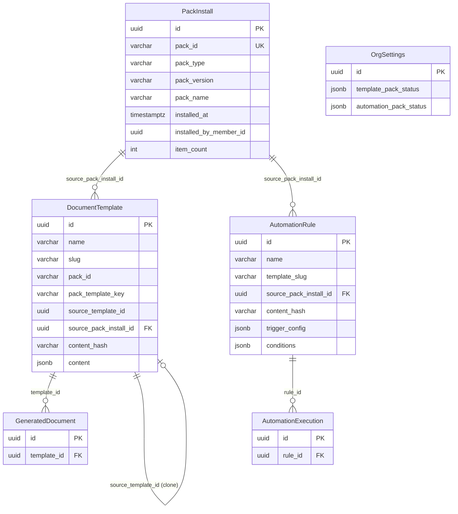
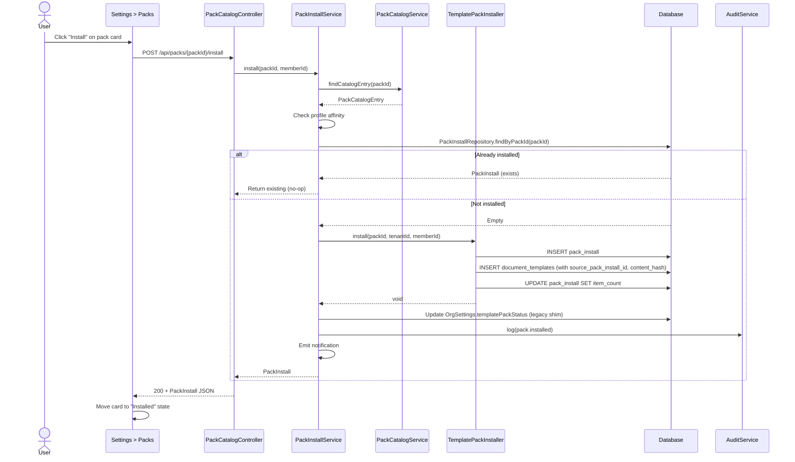
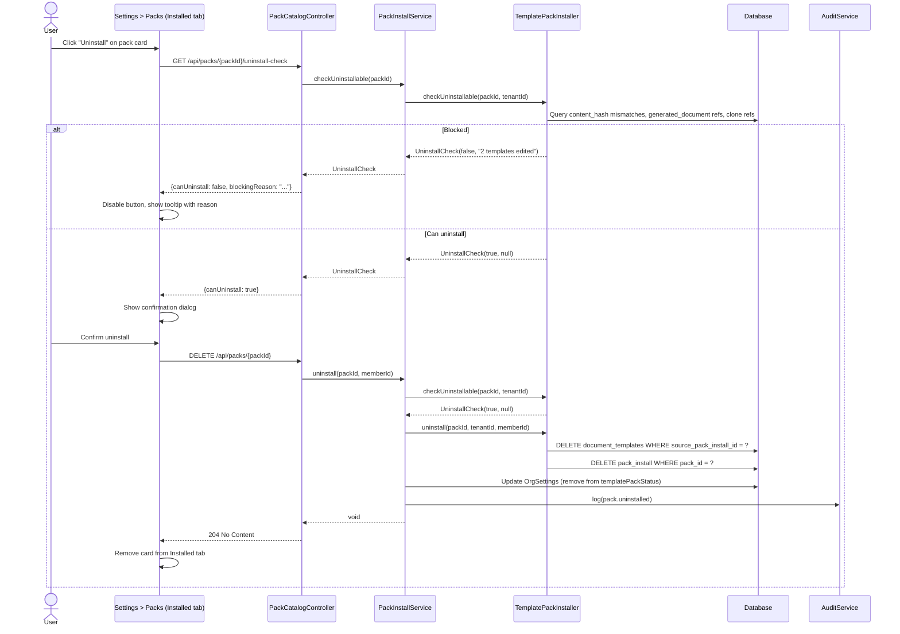
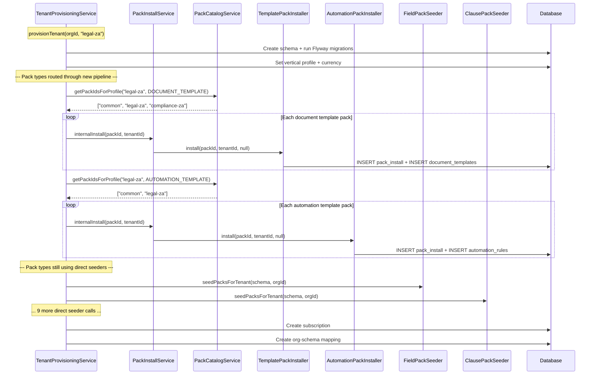

# Phase 65 — Kazi Packs Catalog & Install Pipeline

> Standalone architecture doc. ADR files in `adr/`.

---

## 65.1 Overview

Phase 65 introduces **Kazi Packs** as a first-class product surface — a unified catalog of pre-built content packs, a tenant-visible install/uninstall flow exposed in Settings, and a refactoring of profile-provisioning so that all pack application flows through a single pipeline.

Over the previous ~30 phases, Kazi has accumulated 13 distinct pack seeders, each with its own classpath scanner, its own OrgSettings tracking field, and its own provisioning call site. The result is a fragmented system: no unified catalog, no post-provisioning install path, no uninstall path, and weak attribution between installed content and the pack that created it. Phase 65 addresses all four gaps for a scoped subset of pack types.

**Scope boundary**: Only **Document Templates** and **Automation Templates** are migrated to the new pipeline in this phase. The remaining 11 pack types keep their existing direct-seeder paths unchanged. The `PackInstaller` interface is designed for future extension, but this phase ships exactly two implementations.

**Dependencies on prior phases**:
- **Phase 12** (Document Templates): `DocumentTemplate` entity, `TemplatePackSeeder`, `GeneratedDocument`, `source_template_id` clone tracking
- **Phase 6** (Audit): `AuditService` and `AuditEventBuilder` for `pack.installed` / `pack.uninstalled` events
- **Phase 6.5** (Notifications): Notification pipeline for install/uninstall confirmations
- **Phase 13** (Dedicated Schema): No `@Filter`, no `tenant_id` column — schema isolation handles multitenancy
- **Phase 44** (Settings Layout): Settings sidebar structure and `@RequiresCapability("TEAM_OVERSIGHT")` pattern
- **Phase 8** (OrgSettings): `OrgSettings` entity with JSONB pack status fields

### What's New

| Capability | Before Phase 65 | After Phase 65 |
|---|---|---|
| Pack discovery | Per-type classpath scan, no unified view | Single `PackCatalogService` aggregating all registered `PackInstaller` entries |
| Post-provisioning install | Not possible — packs only applied at provisioning/startup | `POST /api/packs/{packId}/install` + Settings UI |
| Uninstall | Not possible | `DELETE /api/packs/{packId}` with strict "never used" gate |
| Install tracking | Per-type JSONB fields in `OrgSettings` | First-class `PackInstall` entity with FK linkage to content rows |
| Content attribution | Loose `pack_id VARCHAR(100)` on `document_template`; nothing on `automation_rule` | `source_pack_install_id UUID FK` on both tables |
| Edit detection | None | `content_hash VARCHAR(64)` on both `document_template` and `automation_rule` |
| Settings UI | None | Settings > Packs page with Available and Installed tabs |

**Out of scope**: Other 11 pack types, pack versioning/updates, paid/entitlement-gated packs, third-party pack authoring, pack dependencies, partial uninstall, global/cross-tenant catalog management, pack preview, soft delete on uninstall, cleanup of legacy `OrgSettings` pack status fields. See requirements for the full exclusion list.

---

## 65.2 Domain Model

Phase 65 introduces one new tenant-scoped entity (`PackInstall`), one new enum (`PackType`), three new records (`PackCatalogEntry`, `UninstallCheck`, `PackInstallResponse`), and one new interface (`PackInstaller`). It also adds columns to two existing entities (`DocumentTemplate`, `AutomationRule`). All new entities follow the Phase 13 convention: no `@Filter`, no `tenant_id` column — schema isolation handles multitenancy. Standard `JpaRepository` with no multitenancy boilerplate.

### 65.2.1 PackInstall Entity (New)

Tenant-scoped entity tracking every pack installed in a tenant schema. Mapped to `pack_install` table.

| Field | Java Type | DB Column | DB Type | Constraints | Notes |
|---|---|---|---|---|---|
| `id` | `UUID` | `id` | `UUID` | PK, default `gen_random_uuid()` | Auto-generated |
| `packId` | `String` | `pack_id` | `VARCHAR(128)` | NOT NULL, UNIQUE | e.g., `litigation-templates-2026-v1` |
| `packType` | `PackType` | `pack_type` | `VARCHAR(64)` | NOT NULL | Enum: `DOCUMENT_TEMPLATE`, `AUTOMATION_TEMPLATE` |
| `packVersion` | `String` | `pack_version` | `VARCHAR(32)` | NOT NULL | Display-only version string |
| `packName` | `String` | `pack_name` | `VARCHAR(256)` | NOT NULL | Captured at install time |
| `installedAt` | `Instant` | `installed_at` | `TIMESTAMPTZ` | NOT NULL, default `now()` | |
| `installedByMemberId` | `UUID` | `installed_by_member_id` | `UUID` | Nullable | Null for system installs (provisioning, backfill) |
| `itemCount` | `int` | `item_count` | `INT` | NOT NULL, default `0` | Number of content rows created |

**Constraints**:
- `UNIQUE (pack_id)` — at most one install of a given pack per tenant schema. Schema isolation enforces per-tenant uniqueness.
- `pack_type` stored as `VARCHAR(64)` with `@Enumerated(EnumType.STRING)` — future pack types added by extending the enum.

**Design decision — entity vs. OrgSettings JSONB**: The existing `OrgSettings` JSONB fields (`templatePackStatus`, `automationPackStatus`, etc.) are flat lists with no relational linkage. A first-class entity enables FK relationships to content rows, supports rich queries (list all installs, check install state by pack ID), and provides a clean target for the uninstall cascade. The OrgSettings fields remain as compatibility shims during the transition period.

### 65.2.2 PackType Enum

```java
public enum PackType {
    DOCUMENT_TEMPLATE,
    AUTOMATION_TEMPLATE
    // Future: CLAUSE, FIELD_DEFINITION, COMPLIANCE_CHECKLIST, ...
}
```

Extensible for future phases. Each value maps 1:1 to a `PackInstaller` implementation.

### 65.2.3 PackCatalogEntry Record

Immutable record returned by the catalog API. Computed at read time from classpath metadata + `PackInstall` lookup.

```java
public record PackCatalogEntry(
    String packId,
    String name,
    String description,
    String version,
    PackType type,
    String verticalProfile,  // nullable — null = universal
    int itemCount,
    boolean installed,
    String installedAt       // ISO-8601 timestamp, null if not installed
) {}
```

**Note**: `installed` and `installedAt` are tenant-specific — computed by joining catalog entries with the `PackInstall` repository for the current tenant.

### 65.2.4 PackInstaller Interface

```java
public interface PackInstaller {
    PackType type();
    List<PackCatalogEntry> availablePacks();
    void install(String packId, String tenantId, String memberId);
    UninstallCheck checkUninstallable(String packId, String tenantId);
    void uninstall(String packId, String tenantId, String memberId);
}
```

- `availablePacks()` returns the full list regardless of tenant profile. Profile filtering and install-state enrichment happen in `PackCatalogService`.
- `install()` is idempotent — installing a pack that is already installed is a no-op.
- `checkUninstallable()` returns a non-destructive precheck. The UI calls this to enable/disable the uninstall button.
- `uninstall()` MUST call `checkUninstallable()` first and throw `ResourceConflictException` if blocked (maps to 409 via `GlobalExceptionHandler`).

Concrete implementations for this phase: `TemplatePackInstaller`, `AutomationPackInstaller`.

### 65.2.5 UninstallCheck Record

```java
public record UninstallCheck(
    boolean canUninstall,
    String blockingReason   // null if canUninstall is true
) {}
```

### 65.2.6 Existing Entity Modifications

**DocumentTemplate** — add two columns:

| Field | Java Type | DB Column | DB Type | Notes |
|---|---|---|---|---|
| `sourcePackInstallId` | `UUID` | `source_pack_install_id` | `UUID` | Nullable FK to `pack_install.id`. Null for user-created templates. |
| `contentHash` | `String` | `content_hash` | `VARCHAR(64)` | SHA-256 hex of canonical JSON content. Populated at pack install time. Null for user-created templates. |

**AutomationRule** — add two columns:

| Field | Java Type | DB Column | DB Type | Notes |
|---|---|---|---|---|
| `sourcePackInstallId` | `UUID` | `source_pack_install_id` | `UUID` | Nullable FK to `pack_install.id`. Null for user-created rules. |
| `contentHash` | `String` | `content_hash` | `VARCHAR(64)` | SHA-256 hex of canonical JSON of trigger_config + conditions + actions payload. Populated at pack install time. Null for user-created rules. |

### 65.2.7 ER Diagram



**What stays unchanged**: The `OrgSettings` JSONB pack status fields, the `document_template.pack_id` VARCHAR column, the `document_template.pack_template_key` column, the `automation_rule.source` enum, and the `automation_rule.template_slug` column all remain populated by the install pipeline as compatibility shims. The 11 other pack seeders and their OrgSettings tracking fields are completely untouched.

---

## 65.3 Core Flows and Backend Behaviour

### 65.3.1 Catalog Discovery

The catalog is a read-only, runtime-computed index built from classpath scans. There is no mutable database store for catalog entries — pack JSON files in `src/main/resources/` are the source of truth.

**Flow**:

1. Each `PackInstaller` implementation calls into the existing `AbstractPackSeeder` infrastructure to scan the classpath and deserialize pack JSON files.
2. `PackCatalogService` collects entries from all registered `PackInstaller` beans via Spring's `List<PackInstaller>` injection.
3. **Profile filtering**: By default, the catalog API filters entries to those whose `verticalProfile` is null (universal) or matches the current tenant's `OrgSettings.verticalProfile`. The `?all=true` query parameter bypasses this filter.
4. **Install-state enrichment**: For each catalog entry, the service queries `PackInstallRepository.findByPackId(packId)`. If a `PackInstall` row exists, `installed = true` and `installedAt` is populated. Otherwise, `installed = false`.
5. The enriched list is returned as `List<PackCatalogEntry>`.

**`getPackIdsForProfile(String verticalProfile, PackType type): List<String>`** — returns the pack IDs that match the given profile and type. Called by `TenantProvisioningService` to determine which packs to install for a new tenant. Implementation: calls `availablePacks()` on the installer for the given `PackType`, filters entries whose `verticalProfile` is null (universal) or matches the given profile, and returns the pack IDs. This replaces the profile-resolution logic that was previously hardcoded in the provisioning service.

**Design decision — classpath scan vs. DB catalog**: The catalog is built from classpath scans because pack content lives in version-controlled JSON files shipped with the application. A database-backed catalog would duplicate this metadata, require sync logic, and create a mutable surface that could diverge from the actual pack files. The classpath is the single source of truth. See [ADR-240](../adr/ADR-240-unified-pack-catalog-install-pipeline.md).

### 65.3.2 Install Flow

**Caller**: `PackInstallService.install(String packId, String memberId)` (reads `tenantId` from `RequestScopes.TENANT_ID`) or `PackInstallService.internalInstall(String packId, String tenantId)` (explicit `tenantId` for system callers outside HTTP scope).

```
1. Resolve packId → PackCatalogEntry via PackCatalogService
   └─ Throws ResourceNotFoundException if not in catalog
2. Profile affinity check (skipped for internalInstall)
   └─ If pack.verticalProfile != null && != tenant profile → InvalidStateException
3. Idempotency check: PackInstallRepository.findByPackId(packId)
   └─ If exists → return existing PackInstall (no-op)
4. Resolve PackInstaller for the pack's type (from installer registry map)
5. Delegate to PackInstaller.install(packId, tenantId, memberId)
   └─ Installer creates PackInstall row
   └─ Installer creates content rows with source_pack_install_id set
   └─ Installer computes content_hash for each content row
   └─ Installer sets item_count on PackInstall row
6. Update legacy OrgSettings compatibility shim
   └─ templatePackStatus / automationPackStatus JSONB field
   └─ document_template.pack_id column (for template packs)
7. Emit audit event: pack.installed
8. Emit notification to installing member (info-level)
9. Return PackInstall
```

**Idempotency**: Installing a pack that is already installed returns the existing `PackInstall` row as a no-op. No content is duplicated. This is critical because both provisioning and the UI may attempt to install the same pack.

### 65.3.3 Uninstall Flow

**Caller**: `PackInstallService.uninstall(String packId, String memberId)`.

```
1. Find PackInstall by packId
   └─ Throws ResourceNotFoundException if not installed
2. Resolve PackInstaller for the pack's type
3. Call PackInstaller.checkUninstallable(packId, tenantId)
   └─ If blocked → throw ResourceConflictException with blockingReason (maps to 409)
   └─ Emit pack.uninstall_blocked audit event
4. [If uninstallable]:
   a. DELETE all content rows WHERE source_pack_install_id = install.id
   b. DELETE the PackInstall row
   c. Remove pack ID from legacy OrgSettings JSONB field
   d. Emit pack.uninstalled audit event
5. Return (204 No Content)
```

**Hard gate — no soft delete, no archive**: The uninstall is a hard delete or nothing. If any content row has been edited, referenced, or cloned, the entire uninstall is blocked. This prevents data loss and avoids the complexity of partial or soft-delete states. See [ADR-242](../adr/ADR-242-never-used-uninstall-rule.md).

### 65.3.4 Uninstall Check Details

#### Document Templates — `TemplatePackInstaller.checkUninstallable`

A document template pack is uninstallable if and only if ALL templates with `source_pack_install_id = <install.id>` satisfy:

1. **Unedited**: Template's current content hash matches the `content_hash` captured at install time. Hash: SHA-256 over canonical JSON of the Tiptap `content` JSONB field.
2. **Not referenced by any GeneratedDocument**: `SELECT COUNT(*) FROM generated_documents WHERE template_id IN (SELECT id FROM document_templates WHERE source_pack_install_id = ?)` must be zero.
3. **Not cloned**: No other template references this one via `source_template_id`. `SELECT COUNT(*) FROM document_templates WHERE source_template_id IN (SELECT id FROM document_templates WHERE source_pack_install_id = ?)` must be zero.

Blocking reason format examples:
- `"3 of 6 templates have been edited"`
- `"2 templates have been used to generate documents"`
- `"1 template has been cloned"`
- Multiple: `"2 of 6 templates have been edited; 1 template has been used to generate documents"`

#### Automation Templates — `AutomationPackInstaller.checkUninstallable`

An automation template pack is uninstallable if and only if ALL automation rules with `source_pack_install_id = <install.id>` satisfy:

1. **Unedited**: Rule's current content hash matches the `content_hash` captured at install time. Hash: SHA-256 over canonical JSON of `trigger_config` + `conditions` + `actions` payload. Because `AutomationAction` is a child entity, the hash must include the serialized actions list (sorted by action order) so that action edits are also detected.
2. **Never executed**: No row in `automation_executions` references the rule. `SELECT COUNT(*) FROM automation_executions WHERE rule_id IN (SELECT id FROM automation_rules WHERE source_pack_install_id = ?)` must be zero.
3. **Not cloned**: `automation_rule` has no clone/lineage column today, so this check does not apply in this phase. If clone tracking is added later, this check activates automatically.

### 65.3.5 Profile Provisioning Refactor

**Current state**: `TenantProvisioningService` calls `templatePackSeeder.seedPacksForTenant(schemaName, clerkOrgId)` and `automationTemplateSeeder.seedPacksForTenant(schemaName, clerkOrgId)` directly. `PackReconciliationRunner` does the same for all tenant schemas at startup.

**After Phase 65**: For document template and automation template packs:

1. `TenantProvisioningService` calls `PackCatalogService.getPackIdsForProfile(verticalProfile, packType)` to resolve pack IDs, then `PackInstallService.internalInstall(packId, tenantId)` for each. The existing direct seeder calls for these two types are removed.
2. `PackReconciliationRunner` similarly routes through `PackInstallService.internalInstall(packId, tenantId)` for these two types. The direct seeder calls are removed for these types only.
3. All other 11 pack types continue to use their existing direct seeder calls unchanged.

**`internalInstall(String packId, String tenantId)`** accepts an explicit `tenantId` parameter because provisioning and reconciliation run outside the HTTP request scope where `RequestScopes.TENANT_ID` is not bound. It bypasses the profile affinity check (provisioning knows what it is doing) but uses the same install pipeline: `PackInstall` row creation, `source_pack_install_id` tagging, content hashing, legacy OrgSettings update. The only difference from the public `install()` is: explicit `tenantId` instead of reading `RequestScopes`, no profile check, and `installedByMemberId = null`.

**Design decision — dropping `manifestProfileIds`**: The requirements suggest `internalInstall(String packId, List<String> manifestProfileIds)`. This architecture simplifies the signature to `internalInstall(String packId, String tenantId)`. The caller (`TenantProvisioningService`) already resolves the correct pack IDs for the profile via `PackCatalogService.getPackIdsForProfile()` before calling `internalInstall`. Profile validation at the install level would be redundant — provisioning trusts its own pack list. The `manifestProfileIds` parameter added no safety and complicated the interface.

**Acceptance criterion**: A newly provisioned tenant with profile `legal-za` ends up with identical content to today, but every document template and automation rule from a pack has a non-null `source_pack_install_id` and a corresponding `PackInstall` row.

### 65.3.6 Backfill Strategy

Tenants provisioned before Phase 65 have pre-existing content rows with no `source_pack_install_id` and no `PackInstall` rows. A Flyway migration (V95) backfills synthetic data:

**Document templates** (high confidence):
- The existing `document_template.pack_id` VARCHAR column provides direct attribution. For each distinct `pack_id` value found in `document_templates`, create a synthetic `PackInstall` row and update all templates with that `pack_id` to reference the new install.

**Automation rules** (best-effort):
- `automation_rule` has no `pack_id` column. Attribution relies on the `OrgSettings.automation_pack_status` JSONB field, which records each pack's `packId` and `appliedAt` timestamp. For each pack ID in `automation_pack_status`, update `automation_rule` rows whose `created_at` falls within a 60-second window of the pack's `appliedAt` timestamp and whose `source = 'TEMPLATE'`. Accept that this is a coarse heuristic — rules created outside the window or during overlapping pack applications remain unattributed (`source_pack_install_id = NULL`).

**Tradeoff**: The automation rule backfill is explicitly best-effort. Unattributed rules cannot be uninstalled (safe default — `checkUninstallable` returns blocked for any pack with unattributed rules). This is documented in the migration's leading comment block.

### 65.3.7 RBAC

All pack endpoints require `TEAM_OVERSIGHT` capability, consistent with every other settings controller in the codebase. The `@RequiresCapability("TEAM_OVERSIGHT")` annotation is applied to all `PackCatalogController` methods.

`internalInstall()` is called from system context (provisioning, reconciliation) which does not go through the HTTP filter chain, so no RBAC check is applied — the caller is the application itself.

### 65.3.8 Legacy Compatibility

The following legacy fields are retained and populated by the new install pipeline as compatibility shims:

| Legacy Field (Java getter / DB column) | Populated By | Read By | Removal Phase |
|---|---|---|---|
| `OrgSettings.templatePackStatus` / `template_pack_status` (JSONB) | `PackInstallService.install()` | `PackReconciliationRunner`, `TemplatePackSeeder.isPackAlreadyApplied()` | Future |
| `OrgSettings.automationPackStatus` / `automation_pack_status` (JSONB) | `PackInstallService.install()` | `PackReconciliationRunner`, `AutomationTemplateSeeder.isPackAlreadyApplied()` | Future |
| `DocumentTemplate.packId` / `document_template.pack_id` (VARCHAR) | `TemplatePackInstaller.install()` | Template listing UI, `TemplatePackSeeder` | Future |
| `DocumentTemplate.packTemplateKey` / `document_template.pack_template_key` (VARCHAR) | `TemplatePackInstaller.install()` | Template listing UI | Future |

The `PackInstall` entity + `source_pack_install_id` FK is the new source of truth. These shims ensure that `PackReconciliationRunner` (which still runs for all 13 pack types) correctly skips already-installed packs for document templates and automation templates.

---

## 65.4 API Surface

New controller: `packs/PackCatalogController.java`. Thin controller discipline — all logic in `PackCatalogService` and `PackInstallService`.

| Method | Path | Capability | Description |
|---|---|---|---|
| `GET` | `/api/packs/catalog` | `TEAM_OVERSIGHT` | List catalog entries. Default: profile-filtered. `?all=true` shows all. |
| `GET` | `/api/packs/installed` | `TEAM_OVERSIGHT` | List installed packs for the current tenant. |
| `GET` | `/api/packs/{packId}/uninstall-check` | `TEAM_OVERSIGHT` | Non-destructive precheck for uninstall feasibility. |
| `POST` | `/api/packs/{packId}/install` | `TEAM_OVERSIGHT` | Install a pack. Idempotent. |
| `DELETE` | `/api/packs/{packId}` | `TEAM_OVERSIGHT` | Uninstall a pack. 409 if blocked. |

### Request/Response Shapes

**GET /api/packs/catalog**

```json
[
  {
    "packId": "legal-za",
    "name": "Legal (South Africa) Templates",
    "description": "10 matter and engagement templates for South African law firms",
    "version": "1.0",
    "type": "DOCUMENT_TEMPLATE",
    "verticalProfile": "legal-za",
    "itemCount": 10,
    "installed": true,
    "installedAt": "2026-03-15T10:30:00Z"
  },
  {
    "packId": "common",
    "name": "Common Templates",
    "description": "3 universal templates for all verticals",
    "version": "1.0",
    "type": "DOCUMENT_TEMPLATE",
    "verticalProfile": null,
    "itemCount": 3,
    "installed": false,
    "installedAt": null
  }
]
```

**GET /api/packs/installed**

Same shape as catalog, but only entries where `installed = true`.

**GET /api/packs/{packId}/uninstall-check**

```json
{
  "canUninstall": false,
  "blockingReason": "2 of 10 templates have been edited; 1 template has been used to generate documents"
}
```

**POST /api/packs/{packId}/install** — Response (200):

```json
{
  "id": "550e8400-e29b-41d4-a716-446655440000",
  "packId": "legal-za",
  "packType": "DOCUMENT_TEMPLATE",
  "packVersion": "1.0",
  "packName": "Legal (South Africa) Templates",
  "installedAt": "2026-04-14T12:00:00Z",
  "installedByMemberId": "660e8400-e29b-41d4-a716-446655440001",
  "itemCount": 10
}
```

**DELETE /api/packs/{packId}** — 204 No Content on success, 409 with ProblemDetail on block:

```json
{
  "type": "about:blank",
  "title": "Invalid State",
  "status": 409,
  "detail": "2 of 10 templates have been edited; 1 template has been used to generate documents"
}
```

Note: The 409 response uses `ResourceConflictException` → `ProblemDetail` mapping via `GlobalExceptionHandler`. `InvalidStateException` is not used here because it maps to 400 (Bad Request). The blocked-uninstall semantics are a state conflict (the pack's content is in use), which aligns with `ResourceConflictException`'s 409 status.

---

## 65.5 Sequence Diagrams

### 65.5.1 Pack Install Flow



### 65.5.2 Pack Uninstall Flow (with Blocked Path)



### 65.5.3 Profile Provisioning (Refactored Path)



---

## 65.6 Frontend

### 65.6.1 Settings > Packs Page

Add a new Settings sidebar nav item **"Packs"** in the org-level configuration group, consistent with the Phase 44 settings layout.

**Route**: `frontend/app/(app)/org/[slug]/settings/packs/page.tsx`

### 65.6.2 Page Layout

Two tabs using Shadcn `Tabs`: **Available** and **Installed**.

**Available tab**:
- **Header**: "Kazi Packs -- extend your workspace with pre-built content"
- **Toggle**: Shadcn `Switch` labeled "Show all packs" (off by default). When off, only packs matching the current org profile are visible. When on, all packs across all profiles are shown.
- **Grid**: Responsive grid of Shadcn `Card` components. Each card displays:
  - Pack name + version (card title)
  - Short description (card body)
  - Item count `Badge` (e.g., "6 templates", "3 rules")
  - Pack type `Badge` (Document Templates / Automation Templates)
  - Profile affinity `Badge` (e.g., "Legal - ZA", "Universal")
  - Primary action: `Button` — "Install" (primary variant) or "Installed" (disabled state with check icon if already installed)

**Installed tab**:
- **Header**: "Installed Packs"
- **Grid**: Same card layout. Each card additionally shows:
  - `Installed on <date>` + `by <member name>` (or "by system" for provisioning/backfill installs where `installedByMemberId` is null)
  - Primary action: "Uninstall" `Button`. If `uninstall-check` returns blocked, the button is disabled with a `Tooltip` showing the `blockingReason`.
  - Clicking enabled "Uninstall" shows an `AlertDialog` confirmation: "This will remove <item_count> items. Only allowed because none have been used. Continue?"

### 65.6.3 API Client

Add functions to the existing frontend API layer (e.g., `lib/api/packs.ts`):

```typescript
export async function listPackCatalog(opts?: { all?: boolean }): Promise<PackCatalogEntry[]>
export async function listInstalledPacks(): Promise<PackCatalogEntry[]>
export async function checkPackUninstallable(packId: string): Promise<UninstallCheck>
export async function installPack(packId: string): Promise<PackInstallResponse>
export async function uninstallPack(packId: string): Promise<void>
```

Types:

```typescript
interface PackCatalogEntry {
  packId: string
  name: string
  description: string
  version: string
  type: 'DOCUMENT_TEMPLATE' | 'AUTOMATION_TEMPLATE'
  verticalProfile: string | null
  itemCount: number
  installed: boolean
  installedAt: string | null
}

interface UninstallCheck {
  canUninstall: boolean
  blockingReason: string | null
}

interface PackInstallResponse {
  id: string
  packId: string
  packType: string
  packVersion: string
  packName: string
  installedAt: string
  installedByMemberId: string | null
  itemCount: number
}
```

### 65.6.4 Empty States

- **Available tab, no packs for profile**: "No Kazi Packs available for your current profile. Toggle 'Show all packs' to browse everything."
- **Installed tab, none installed**: "No packs installed yet. Browse the Available tab to add templates and workflow automations to your workspace."

### 65.6.5 Component Reuse

Reuse existing Shadcn primitives — `Card`, `Button`, `Badge`, `Tabs`, `TabsList`, `TabsTrigger`, `TabsContent`, `Tooltip`, `TooltipTrigger`, `TooltipContent`, `Switch`, `AlertDialog`, `AlertDialogTrigger`, `AlertDialogContent`, `AlertDialogAction`, `AlertDialogCancel`. No new component library work. Match the visual language of the Settings hub.

---

## 65.7 Database Migrations

### V94 — Create `pack_install` table and add FK columns

```sql
-- V94__create_pack_install.sql
--
-- Phase 65: Kazi Packs Catalog & Install Pipeline
--
-- Creates the pack_install table to track installed packs per tenant.
-- Adds source_pack_install_id FK and content_hash columns to
-- document_templates and automation_rules.

-- 1. Create pack_install table
CREATE TABLE IF NOT EXISTS pack_install (
    id                      UUID            DEFAULT gen_random_uuid() PRIMARY KEY,
    pack_id                 VARCHAR(128)    NOT NULL,
    pack_type               VARCHAR(64)     NOT NULL,
    pack_version            VARCHAR(32)     NOT NULL,
    pack_name               VARCHAR(256)    NOT NULL,
    installed_at            TIMESTAMPTZ     NOT NULL DEFAULT now(),
    installed_by_member_id  UUID,
    item_count              INT             NOT NULL DEFAULT 0,

    CONSTRAINT uq_pack_install_pack_id UNIQUE (pack_id)
);

-- 2. Add source_pack_install_id to document_templates
ALTER TABLE document_templates
    ADD COLUMN IF NOT EXISTS source_pack_install_id UUID
        REFERENCES pack_install(id) ON DELETE SET NULL;

CREATE INDEX IF NOT EXISTS idx_document_templates_source_pack_install
    ON document_templates (source_pack_install_id)
    WHERE source_pack_install_id IS NOT NULL;

-- 3. Add content_hash to document_templates
ALTER TABLE document_templates
    ADD COLUMN IF NOT EXISTS content_hash VARCHAR(64);

-- 4. Add source_pack_install_id to automation_rules
ALTER TABLE automation_rules
    ADD COLUMN IF NOT EXISTS source_pack_install_id UUID
        REFERENCES pack_install(id) ON DELETE SET NULL;

CREATE INDEX IF NOT EXISTS idx_automation_rules_source_pack_install
    ON automation_rules (source_pack_install_id)
    WHERE source_pack_install_id IS NOT NULL;

-- 5. Add content_hash to automation_rules
ALTER TABLE automation_rules
    ADD COLUMN IF NOT EXISTS content_hash VARCHAR(64);
```

**Design note on FK ON DELETE**: The FK uses `ON DELETE SET NULL` rather than `ON DELETE CASCADE` because the uninstall flow explicitly deletes content rows first, then deletes the `PackInstall` row. `SET NULL` is a safety net — if a `PackInstall` row is ever deleted without going through the proper uninstall flow (e.g., manual DB intervention), content rows are preserved with a null FK rather than being silently cascade-deleted. This is the conservative choice for a production system.

### V95 — Backfill existing pack installs

```sql
-- V95__backfill_pack_installs.sql
--
-- Phase 65: Backfill synthetic PackInstall rows for tenants provisioned
-- before Phase 65. Creates PackInstall rows from OrgSettings pack status
-- JSONB fields and links existing content rows.
--
-- IMPORTANT TRADEOFF: The automation_rule backfill uses a creation-timestamp
-- heuristic because automation_rule has no pack_id column. Rules whose
-- created_at falls within 60 seconds of a pack's appliedAt timestamp AND
-- whose source = 'TEMPLATE' are attributed to that pack. Rules outside
-- this window or with overlapping windows remain unattributed
-- (source_pack_install_id = NULL). This is explicitly best-effort.
-- Consequence: checkUninstallable() returns blocked for packs with
-- unattributed rules on legacy tenants — this is the safe default.

-- ============================================================
-- Part 1: Backfill document template pack installs
-- ============================================================
-- document_template.pack_id provides direct attribution (high confidence).
-- For each distinct pack_id in document_templates, create a PackInstall
-- row and link all templates with that pack_id.

DO $$
DECLARE
    v_settings_id UUID;
    v_pack_status JSONB;
    v_pack JSONB;
    v_pack_id TEXT;
    v_pack_version TEXT;
    v_install_id UUID;
    v_template_count INT;
BEGIN
    -- Find OrgSettings for this tenant schema
    SELECT id, template_pack_status
    INTO v_settings_id, v_pack_status
    FROM org_settings
    LIMIT 1;

    -- Skip if no OrgSettings or no template pack status
    IF v_settings_id IS NULL OR v_pack_status IS NULL THEN
        RETURN;
    END IF;

    -- Iterate each pack in template_pack_status
    FOR v_pack IN SELECT jsonb_array_elements(v_pack_status)
    LOOP
        v_pack_id := v_pack ->> 'packId';
        v_pack_version := COALESCE(v_pack ->> 'version', '1.0');

        -- Skip if no pack_id or if already backfilled
        IF v_pack_id IS NULL THEN
            CONTINUE;
        END IF;

        IF EXISTS (SELECT 1 FROM pack_install WHERE pack_id = v_pack_id) THEN
            CONTINUE;
        END IF;

        -- Count templates attributed to this pack
        SELECT COUNT(*)
        INTO v_template_count
        FROM document_templates
        WHERE pack_id = v_pack_id;

        -- Create synthetic PackInstall row
        v_install_id := gen_random_uuid();
        INSERT INTO pack_install (id, pack_id, pack_type, pack_version, pack_name,
                                  installed_at, installed_by_member_id, item_count)
        VALUES (v_install_id, v_pack_id, 'DOCUMENT_TEMPLATE', v_pack_version,
                v_pack_id,  -- Use pack_id as name; catalog resolves display name at read time
                COALESCE((v_pack ->> 'appliedAt')::timestamptz, now()),
                NULL,       -- System install — no member
                v_template_count);

        -- Link existing templates to the backfilled install
        UPDATE document_templates
        SET source_pack_install_id = v_install_id
        WHERE pack_id = v_pack_id
          AND source_pack_install_id IS NULL;
    END LOOP;
END $$;

-- ============================================================
-- Part 2: Backfill automation template pack installs
-- ============================================================
-- automation_rule has no pack_id column. Use a timestamp heuristic:
-- for each pack in automation_pack_status, attribute rules whose
-- created_at falls within 60 seconds of the pack's appliedAt timestamp
-- and whose source = 'TEMPLATE'.
--
-- KNOWN LIMITATION: Rules created outside the window, or during
-- overlapping pack applications, remain unattributed. This is safe:
-- uninstall checks will block for packs with unattributed rules.

DO $$
DECLARE
    v_settings_id UUID;
    v_pack_status JSONB;
    v_pack JSONB;
    v_pack_id TEXT;
    v_pack_version TEXT;
    v_applied_at TIMESTAMPTZ;
    v_install_id UUID;
    v_rule_count INT;
BEGIN
    -- Find OrgSettings for this tenant schema
    SELECT id, automation_pack_status
    INTO v_settings_id, v_pack_status
    FROM org_settings
    LIMIT 1;

    -- Skip if no OrgSettings or no automation pack status
    IF v_settings_id IS NULL OR v_pack_status IS NULL THEN
        RETURN;
    END IF;

    -- Iterate each pack in automation_pack_status
    FOR v_pack IN SELECT jsonb_array_elements(v_pack_status)
    LOOP
        v_pack_id := v_pack ->> 'packId';
        v_pack_version := COALESCE(v_pack ->> 'version', '1.0');
        v_applied_at := (v_pack ->> 'appliedAt')::timestamptz;

        -- Skip if no pack_id or if already backfilled
        IF v_pack_id IS NULL THEN
            CONTINUE;
        END IF;

        IF EXISTS (SELECT 1 FROM pack_install WHERE pack_id = v_pack_id) THEN
            CONTINUE;
        END IF;

        -- Count rules attributable via the timestamp heuristic
        -- Window: appliedAt - 60s to appliedAt + 60s
        IF v_applied_at IS NOT NULL THEN
            SELECT COUNT(*)
            INTO v_rule_count
            FROM automation_rules
            WHERE source = 'TEMPLATE'
              AND source_pack_install_id IS NULL
              AND created_at >= v_applied_at - INTERVAL '60 seconds'
              AND created_at <= v_applied_at + INTERVAL '60 seconds';
        ELSE
            -- No appliedAt timestamp — cannot attribute any rules
            v_rule_count := 0;
        END IF;

        -- Create synthetic PackInstall row
        v_install_id := gen_random_uuid();
        INSERT INTO pack_install (id, pack_id, pack_type, pack_version, pack_name,
                                  installed_at, installed_by_member_id, item_count)
        VALUES (v_install_id, v_pack_id, 'AUTOMATION_TEMPLATE', v_pack_version,
                v_pack_id,  -- Use pack_id as name; catalog resolves display name at read time
                COALESCE(v_applied_at, now()),
                NULL,       -- System install — no member
                v_rule_count);

        -- Link rules via timestamp heuristic
        IF v_applied_at IS NOT NULL THEN
            UPDATE automation_rules
            SET source_pack_install_id = v_install_id
            WHERE source = 'TEMPLATE'
              AND source_pack_install_id IS NULL
              AND created_at >= v_applied_at - INTERVAL '60 seconds'
              AND created_at <= v_applied_at + INTERVAL '60 seconds';
        END IF;
    END LOOP;
END $$;
```

---

## 65.8 Implementation Guidance

### 65.8.1 Backend Changes

| File | Change |
|---|---|
| `packs/PackType.java` | New enum: `DOCUMENT_TEMPLATE`, `AUTOMATION_TEMPLATE` |
| `packs/PackCatalogEntry.java` | New record |
| `packs/UninstallCheck.java` | New record |
| `packs/PackInstallResponse.java` | New record (API response DTO) |
| `packs/PackInstaller.java` | New interface |
| `packs/PackInstall.java` | New entity |
| `packs/PackInstallRepository.java` | New `JpaRepository<PackInstall, UUID>` with `findByPackId(String)`, `findAll()` |
| `packs/PackCatalogService.java` | New service: aggregates `PackInstaller` entries, profile filtering, install-state enrichment, `getPackIdsForProfile(verticalProfile, packType)` |
| `packs/PackInstallService.java` | New service: `install(packId, memberId)`, `internalInstall(packId, tenantId)`, `uninstall(packId, memberId)`, `checkUninstallable(packId)` |
| `packs/PackCatalogController.java` | New controller: 5 endpoints, thin delegation |
| `packs/TemplatePackInstaller.java` | New `PackInstaller` impl: wraps `TemplatePackSeeder` logic |
| `packs/AutomationPackInstaller.java` | New `PackInstaller` impl: wraps `AutomationTemplateSeeder` logic |
| `packs/ContentHashUtil.java` | New utility: SHA-256 over canonical JSON |
| `template/DocumentTemplate.java` | Add `sourcePackInstallId` (UUID), `contentHash` (String) fields |
| `template/DocumentTemplateRepository.java` | Add `countBySourcePackInstallId(UUID)`, `findBySourcePackInstallId(UUID)` |
| `automation/AutomationRule.java` | Add `sourcePackInstallId` (UUID), `contentHash` (String) fields |
| `automation/AutomationRuleRepository.java` | Add `countBySourcePackInstallId(UUID)`, `findBySourcePackInstallId(UUID)` |
| `automation/AutomationExecutionRepository.java` | Add `existsByRuleIdIn(List<UUID>)` |
| `template/GeneratedDocumentRepository.java` | Add `existsByTemplateIdIn(List<UUID>)` |
| `provisioning/TenantProvisioningService.java` | Replace `templatePackSeeder` and `automationTemplateSeeder` calls with `PackCatalogService.getPackIdsForProfile()` + `PackInstallService.internalInstall(packId, tenantId)` |
| `provisioning/PackReconciliationRunner.java` | Replace `templatePackSeeder` and `automationTemplateSeeder` calls with `PackInstallService.internalInstall(packId, tenantId)` |
| `template/TemplatePackSeeder.java` | Expose `applyPack()` as package-private for `TemplatePackInstaller` reuse |
| `automation/template/AutomationTemplateSeeder.java` | Expose `applyPack()` as package-private for `AutomationPackInstaller` reuse |
| `db/migration/tenant/V94__create_pack_install.sql` | Create table + add FK columns + content_hash columns |
| `db/migration/tenant/V95__backfill_pack_installs.sql` | Backfill synthetic PackInstall rows |

### 65.8.2 Frontend Changes

| File | Change |
|---|---|
| `app/(app)/org/[slug]/settings/packs/page.tsx` | New page: Available + Installed tabs |
| `lib/api/packs.ts` | New API client functions |
| Settings sidebar nav component | Add "Packs" nav item |

### 65.8.3 Entity Code Pattern

```java
package io.b2mash.b2b.b2bstrawman.packs;

import jakarta.persistence.Column;
import jakarta.persistence.Entity;
import jakarta.persistence.EnumType;
import jakarta.persistence.Enumerated;
import jakarta.persistence.GeneratedValue;
import jakarta.persistence.GenerationType;
import jakarta.persistence.Id;
import jakarta.persistence.Table;
import java.time.Instant;
import java.util.UUID;

@Entity
@Table(name = "pack_install")
public class PackInstall {

    @Id
    @GeneratedValue(strategy = GenerationType.UUID)
    private UUID id;

    @Column(name = "pack_id", nullable = false, length = 128)
    private String packId;

    @Enumerated(EnumType.STRING)
    @Column(name = "pack_type", nullable = false, length = 64)
    private PackType packType;

    @Column(name = "pack_version", nullable = false, length = 32)
    private String packVersion;

    @Column(name = "pack_name", nullable = false, length = 256)
    private String packName;

    @Column(name = "installed_at", nullable = false, updatable = false)
    private Instant installedAt;

    @Column(name = "installed_by_member_id")
    private UUID installedByMemberId;

    @Column(name = "item_count", nullable = false)
    private int itemCount;

    protected PackInstall() {}

    public PackInstall(String packId, PackType packType, String packVersion,
                       String packName, UUID installedByMemberId) {
        this.packId = packId;
        this.packType = packType;
        this.packVersion = packVersion;
        this.packName = packName;
        this.installedAt = Instant.now();
        this.installedByMemberId = installedByMemberId;
        this.itemCount = 0;
    }

    // Getters and setters...
    public void setItemCount(int itemCount) { this.itemCount = itemCount; }
    // ...
}
```

No `@Filter`, no `tenant_id` column. Schema isolation handles multitenancy (Phase 13 convention).

### 65.8.4 Repository Pattern

```java
package io.b2mash.b2b.b2bstrawman.packs;

import java.util.Optional;
import java.util.UUID;
import org.springframework.data.jpa.repository.JpaRepository;

public interface PackInstallRepository extends JpaRepository<PackInstall, UUID> {
    Optional<PackInstall> findByPackId(String packId);
}
```

### 65.8.5 Testing Strategy

| Test Category | Test Class | What It Verifies |
|---|---|---|
| Catalog listing | `PackCatalogIntegrationTest` | Profile filtering, `?all=true`, install-state enrichment |
| Install idempotency | `PackInstallIntegrationTest` | Double-install creates only one `PackInstall` row |
| Profile affinity | `PackInstallIntegrationTest` | Cross-profile install blocked via public API, allowed via `internalInstall` |
| Content attribution | `PackInstallIntegrationTest` | `source_pack_install_id` populated on all content rows after install |
| Content hash | `PackInstallIntegrationTest` | `content_hash` populated on all content rows; changes after edit |
| Uninstall clean | `PackUninstallIntegrationTest` | Install + immediate uninstall removes all content + `PackInstall` + legacy OrgSettings entry |
| Uninstall blocked (edited) | `PackUninstallIntegrationTest` | Edit template content, uninstall returns 409 with "edited" reason |
| Uninstall blocked (generated) | `PackUninstallIntegrationTest` | Generate document from pack template, uninstall returns 409 |
| Uninstall blocked (cloned) | `PackUninstallIntegrationTest` | Clone pack template, uninstall returns 409 |
| Uninstall blocked (executed) | `PackUninstallIntegrationTest` | Trigger automation execution, uninstall returns 409 |
| Provisioning refactor | `TenantProvisioningIntegrationTest` | New tenant has `PackInstall` rows + attributed content |
| Legacy compatibility | `PackInstallIntegrationTest` | `OrgSettings.templatePackStatus` updated by install |
| Audit events | `PackInstallIntegrationTest` | `pack.installed` and `pack.uninstalled` events emitted |
| Frontend: catalog render | `PacksPage.test.tsx` | Available tab lists packs, profile filter works, "Show all packs" toggle |
| Frontend: install flow | `PacksPage.test.tsx` | Install button triggers API call, moves card to installed state |
| Frontend: uninstall check | `PacksPage.test.tsx` | Uninstall button disabled with tooltip when blocked |
| Frontend: empty states | `PacksPage.test.tsx` | Correct empty state text for each tab |
| E2E | `packs.spec.ts` | Full flow: install > verify content > edit > blocked uninstall > revert > uninstall succeeds |

---

## 65.9 Permission Model Summary

| Endpoint | Capability | Notes |
|---|---|---|
| `GET /api/packs/catalog` | `TEAM_OVERSIGHT` | Read-only catalog listing |
| `GET /api/packs/installed` | `TEAM_OVERSIGHT` | Read-only installed list |
| `GET /api/packs/{packId}/uninstall-check` | `TEAM_OVERSIGHT` | Non-destructive precheck |
| `POST /api/packs/{packId}/install` | `TEAM_OVERSIGHT` | Mutating — creates content |
| `DELETE /api/packs/{packId}` | `TEAM_OVERSIGHT` | Mutating — deletes content |
| `internalInstall()` (Java method) | None (system context) | Called from provisioning/reconciliation — no HTTP filter chain |

`TEAM_OVERSIGHT` is the standard capability for all org-level settings operations, consistent with rate management, billing settings, template management, and other settings controllers.

---

## 65.10 Capability Slices

### Slice 65A — PackInstall Entity + Migrations

**Scope**: Backend only.

**Key deliverables**:
- `PackInstall` entity in `packs/` package
- `PackInstallRepository` with `findByPackId(String)`
- `PackType` enum
- `UninstallCheck` record
- `PackCatalogEntry` record
- `ContentHashUtil` utility class
- `V94__create_pack_install.sql` — create `pack_install` table, add `source_pack_install_id` FK and `content_hash` columns to `document_templates` and `automation_rules`
- `V95__backfill_pack_installs.sql` — backfill synthetic `PackInstall` rows from OrgSettings
- Add `sourcePackInstallId` and `contentHash` fields to `DocumentTemplate` and `AutomationRule` entities
- Add repository methods: `DocumentTemplateRepository.findBySourcePackInstallId()`, `AutomationRuleRepository.findBySourcePackInstallId()`, `AutomationExecutionRepository.existsByRuleIdIn()`, `GeneratedDocumentRepository.existsByTemplateIdIn()`

**Dependencies**: None (foundational slice).

**Tests**: Migration V94 runs without error. Migration V95 runs on a tenant with pre-existing pack-seeded content and produces: (a) `PackInstall` rows for each pack ID in `OrgSettings.templatePackStatus`, (b) non-null `source_pack_install_id` on `document_templates` that have a `pack_id`, (c) `PackInstall` rows for each pack ID in `OrgSettings.automationPackStatus`. `PackInstall` CRUD works. `ContentHashUtil` produces consistent SHA-256 hashes (same input → same output, different input → different output).

---

### Slice 65B — PackInstaller Interface + Implementations

**Scope**: Backend only.

**Key deliverables**:
- `PackInstaller` interface
- `TemplatePackInstaller` — wraps `TemplatePackSeeder.applyPack()` logic with `PackInstall` row creation, `source_pack_install_id` tagging, and `content_hash` computation
- `AutomationPackInstaller` — wraps `AutomationTemplateSeeder.applyPack()` logic with the same additions
- Refactor `TemplatePackSeeder` and `AutomationTemplateSeeder` to expose their `applyPack()` logic as package-private methods callable by the installers
- Each installer implements `checkUninstallable()` with the precise gate logic (edit detection, reference checks, clone checks)

**Dependencies**: Slice 65A (entities and repositories).

**Tests**: Install a document template pack — all templates have `source_pack_install_id` and `content_hash`. Install an automation pack — all rules have `source_pack_install_id` and `content_hash`. `checkUninstallable` returns correct results for clean, edited, referenced, and cloned content.

---

### Slice 65C — PackCatalogService + PackInstallService

**Scope**: Backend only.

**Key deliverables**:
- `PackCatalogService` — aggregates catalog entries from all `PackInstaller` beans, profile filtering, install-state enrichment, `getPackIdsForProfile()`
- `PackInstallService` — `install()`, `internalInstall()`, `uninstall()`, `checkUninstallable()`, legacy OrgSettings compatibility shim updates, audit event emission, notification emission

**Dependencies**: Slice 65B (installers).

**Tests**: Install idempotency (double-install = one row). Profile affinity enforcement (cross-profile blocked for public, allowed for internal). Uninstall clean path. Uninstall blocked paths. Legacy OrgSettings field updated on install. Audit events emitted.

---

### Slice 65D — Profile Provisioning Refactor

**Scope**: Backend only.

**Key deliverables**:
- Modify `TenantProvisioningService` to call `PackCatalogService.getPackIdsForProfile()` + `PackInstallService.internalInstall(packId, tenantId)` for document template and automation template packs instead of direct seeder calls
- Modify `PackReconciliationRunner` to route these two pack types through `PackInstallService.internalInstall(packId, tenantId)` instead of direct seeder calls
- Keep all other 11 pack type seeder calls unchanged

**Dependencies**: Slice 65C (PackInstallService).

**Tests**: Newly provisioned tenant has `PackInstall` rows for all document template and automation template packs in its profile. All content rows have `source_pack_install_id` set. Legacy OrgSettings fields are still populated. PackReconciliationRunner correctly uses new pipeline for these two types and direct seeders for the other 11.

---

### Slice 65E — PackCatalogController + REST API

**Scope**: Backend only.

**Key deliverables**:
- `PackCatalogController` with 5 endpoints (catalog list, installed list, uninstall check, install, uninstall)
- `@RequiresCapability("TEAM_OVERSIGHT")` on all endpoints
- `PackInstallResponse` record (API response DTO)
- Request validation (packId format, etc.)

**Dependencies**: Slice 65C (services).

**Tests**: HTTP-level integration tests for all 5 endpoints. 200 on install, 204 on uninstall, 409 on blocked uninstall, 404 on unknown packId. Profile-filtered catalog response. `?all=true` bypasses profile filter.

---

### Slice 65F — Frontend: Settings > Packs Page

**Scope**: Frontend only.

**Key deliverables**:
- `app/(app)/org/[slug]/settings/packs/page.tsx` — Available + Installed tabs
- `lib/api/packs.ts` — API client functions
- Settings sidebar nav update — add "Packs" entry
- Empty states for both tabs
- Install flow with success toast
- Uninstall flow with precheck, disabled button + tooltip, confirmation dialog

**Dependencies**: Slice 65E (REST API must be deployed).

**Tests**: Component tests for catalog rendering, profile filter toggle, install button states, uninstall button states (enabled/disabled + tooltip), empty states, confirmation dialog.

---

### Slice 65G — Integration Tests + E2E

**Scope**: Backend + E2E.

**Key deliverables**:
- Comprehensive integration tests covering the full matrix (install, uninstall, blocked paths, provisioning, backfill, audit events, legacy compatibility)
- One Playwright E2E test: login > Settings > Packs > install a pack > verify content in Templates page > edit one template > attempt uninstall (blocked) > revert edit > uninstall succeeds

**Dependencies**: Slices 65E + 65F (full stack deployed).

**Tests**: All tests listed in Section 65.8.5.

---

### Slice Dependency Graph

```
65A ─── 65B ─── 65C ─┬── 65D
                      │
                      └── 65E ─── 65F ─── 65G
```

Slices 65D and 65E are independent of each other (can run in parallel after 65C). Slice 65F depends on 65E. Slice 65G depends on both 65E and 65F.

---

## 65.11 ADR Index

| ADR | Title | Link |
|---|---|---|
| ADR-240 | Unified Pack Catalog & Install Pipeline | [ADR-240](../adr/ADR-240-unified-pack-catalog-install-pipeline.md) |
| ADR-241 | Add-Only Pack Semantics | [ADR-241](../adr/ADR-241-add-only-pack-semantics.md) |
| ADR-242 | "Never Used" Uninstall Rule | [ADR-242](../adr/ADR-242-never-used-uninstall-rule.md) |
| ADR-243 | Scope: Two Pack Types for v1 | [ADR-243](../adr/ADR-243-scope-two-pack-types-for-v1.md) |
