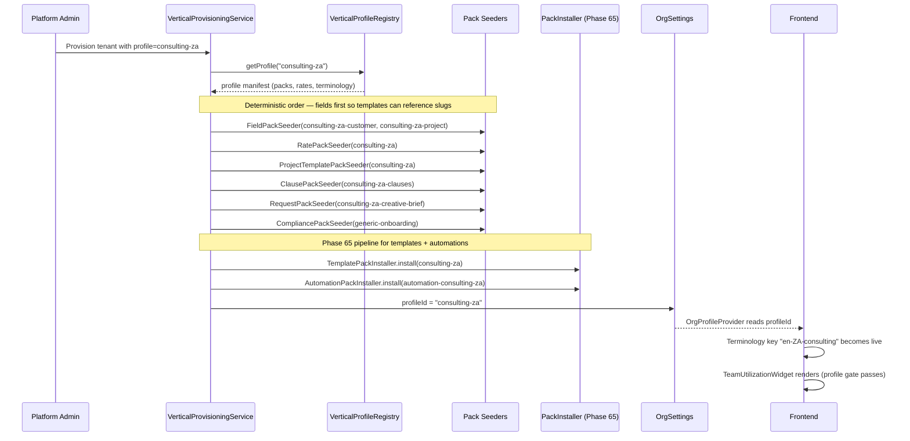

# Phase 66 — `consulting-za` Vertical Profile (Pack-Only Agency Content)

> Standalone architecture doc — no changes to `architecture/ARCHITECTURE.md`.
> No new database migrations (global high-water remains V18, tenant remains V95).
> No new backend entities, services, or controllers.
> One new frontend component.

---

## 66.1 — Overview

Kazi supports two deep vertical rails today — `legal-za` (trust accounting, court calendar, matter templates) and `accounting-za` (SARS deadlines, FICA, engagement letters) — and one near-empty shell, `consulting-generic`, which provides only a profile manifest and a rate pack. Phase 66 closes the third demo rail by delivering `consulting-za`, a South-African-flavoured agency/consulting profile that is **demo-ready for the Zolani Creative 90-day lifecycle** without adding any new backend primitives.

The guiding insight is that a digital agency's operational model — projects, retainers, time tracking, proposals, utilization, profitability — is already expressible in the horizontal stack. Legal needed a trust ledger. Accounting needed a filing calendar. Consulting needs nothing the platform doesn't already have. Phase 66 therefore ships **pure pack content** (JSON, Tiptap docs, terminology keys) and **one small frontend widget** that surfaces existing Phase 38 utilization data in an agency-framed KPI card.

All content is ZA-localised: ZAR rates based on 2026 mid-market Johannesburg/Cape Town benchmarks, VAT 15%, en-ZA locale, POPIA-era consent assumptions, and the compliance pack reuses the existing `generic-onboarding` checklist (FICA does not apply to non-regulated agencies).

### What's new

| Area | Existing capability | What Phase 66 adds |
|---|---|---|
| Vertical profiles | 3 profiles (`legal-za`, `accounting-za`, `consulting-generic`) | 4th profile `consulting-za` (SA-localised agency variant) |
| Field packs | Legal + accounting + common | Customer + project field packs for agency (`campaign_type`, `retainer_tier`, MSA tracking, etc.) |
| Rate packs | `accounting-za`, `consulting-generic` | `consulting-za` — 8 agency roles in ZAR |
| Project templates | Accounting (4), legal (matter templates) | 5 agency templates: Website Build, Social Retainer, Brand Identity, SEO, Content Retainer |
| Automations | Legal, accounting, common | 6 agency automations (budget, retainer close, unbilled time, blocked task, proposal follow-up) |
| Document templates | Legal, accounting, compliance-za, common | `consulting-za` pack with 4 Tiptap templates: creative brief, SOW, engagement letter, monthly retainer report |
| Clause packs | Legal, accounting, standard | `consulting-za-clauses` — 8 agency SOW clauses (IP, revisions, kill fee, NDA, payment, change, 3rd-party, termination) |
| Request packs | Tax return, year-end info, monthly bookkeeping, etc. | Creative-brief questionnaire (~10 questions) |
| Terminology | `en-ZA-accounting`, `en-ZA-legal` | `en-ZA-consulting` (3–5 overrides only) |
| Dashboards | Phase 53 company/personal dashboards | `TeamUtilizationWidget` (profile-gated to `consulting-za`) |

### Explicit non-scope

- No new backend entities, services, repositories, controllers, or endpoints.
- No global or tenant migrations (global stays at V18, tenant stays at V95).
- No new automation triggers, variable-registry entries, or pack-loader types.
- No changes to the Phase 65 install pipeline beyond adding two new pack files that flow through it.

---

## 66.2 — Architectural Principle: Pack-Only Verticals

Kazi's vertical profile system (Phase 49, ADRs 181/189/192) supports two shapes of vertical:

- **Module-bearing verticals** activate backend modules (entities, services, controllers) because the vertical introduces primitives the horizontal stack cannot express. `legal-za` introduces a trust-account ledger and conflict-check primitive. `accounting-za` introduces filing deadlines and a SARS-shaped calendar. These cannot be modelled as JSONB custom fields without losing referential and transactional guarantees.
- **Pack-only verticals** leave `enabledModules` empty and carry their entire semantic through pack content (fields, rates, templates, automations, clauses, requests) plus terminology overrides and optional profile-gated UI surfacings. Consulting is this shape: every agency concept (campaign type, deliverable, retainer period, creative brief, SOW) fits inside existing entities — projects carry `campaign_type` as a custom field, retainers use the Phase 17 `RetainerAgreement`, briefs use the Phase 27 request/questionnaire system, SOWs use the Phase 31 Tiptap document model.

### Decision rule

| Question | Answer → Vertical shape |
|---|---|
| Does the vertical have a primitive the horizontal stack can't express (e.g., a ledger, a regulated calendar, a unique invariant)? | Yes → **module-bearing** (add backend module + packs) |
| Can every domain concept be represented by existing entities plus custom fields? | Yes → **pack-only** (packs + terminology + optional profile-gated widgets) |
| Is there a unique legal/regulatory compliance primitive? | Yes → **module-bearing** |
| Is every vertical-specific surface a re-framing of horizontal data? | Yes → **pack-only** |

`consulting-za` answers "no → yes → no → yes", so it is pack-only. This rule is captured formally in **[ADR-244](../adr/ADR-244-pack-only-vertical-profiles.md)**.

---

## 66.3 — Pack Inventory

Every asset below is additive — no existing pack is modified. Paths are relative to `backend/src/main/resources/` unless noted.

| # | Pack | File(s) | Installer | Content summary |
|---|---|---|---|---|
| 1 | Profile manifest | `vertical-profiles/consulting-za.json` | `VerticalProfileRegistry` (classpath scan) | Registers enabled modules (empty), pack references, rate defaults, VAT 15%, terminology key `en-ZA-consulting` |
| 2 | Customer field pack | `field-packs/consulting-za-customer.json` | `FieldPackSeeder` | 5 fields: industry, company size, primary stakeholder, MSA signed + MSA start date |
| 3 | Project field pack | `field-packs/consulting-za-project.json` | `FieldPackSeeder` | 5 fields: campaign_type (required), channel, deliverable_type, retainer_tier (conditional), creative_brief_url |
| 4 | Rate pack | `rate-packs/consulting-za.json` | `RatePackSeeder` | 8 SA agency roles (ZAR billing + cost rates) |
| 5 | Project template pack | `project-template-packs/consulting-za.json` | `ProjectTemplatePackSeeder` | 5 templates: Website Build, Social Retainer, Brand Identity, SEO Campaign, Content Retainer |
| 6 | Automation pack | `automation-templates/consulting-za.json` | **Phase 65** `AutomationPackInstaller` | 6 rules: budget 80%, budget exceeded, retainer closing, blocked task, unbilled time, proposal follow-up |
| 7 | Document template pack | `template-packs/consulting-za/` (directory + `pack.json` + 4 Tiptap JSONs) | **Phase 65** `TemplatePackInstaller` | Creative brief, SOW, engagement letter, monthly retainer report |
| 8 | Clause pack | `clause-packs/consulting-za-clauses/pack.json` | `ClausePackSeeder` | 8 clauses: IP ownership, revisions, kill fee, NDA, payment terms, change requests, third-party costs, termination |
| 9 | Request pack | `request-packs/consulting-za-creative-brief.json` | `RequestPackSeeder` | ~10-question creative brief questionnaire |
| 10 | Compliance pack (reference) | `compliance-packs/generic-onboarding/` (existing — **no new content**) | `CompliancePackSeeder` | Standard customer onboarding checklist; FICA deliberately not included |
| 11 | Terminology key | `frontend/lib/terminology-map.ts` — add `en-ZA-consulting` | Frontend (bundled) | 3–5 overrides (Customer → Client, Time Entry → Time Log, Rate Card → Billing Rates) |

### Install-path routing

| Pack type | Route | Rationale |
|---|---|---|
| Profile manifest | `VerticalProfileRegistry` classpath scan | Profile metadata, not tenant data |
| Field pack | Direct `FieldPackSeeder` | Pre-Phase 65 pack type; not migrated |
| Rate pack | Direct `RatePackSeeder` | Pre-Phase 65 pack type; not migrated |
| Project template pack | Direct `ProjectTemplatePackSeeder` | Pre-Phase 65 pack type; not migrated |
| **Automation pack** | **Phase 65 `AutomationPackInstaller`** | Migrated in Phase 65 (ADR-243) |
| **Document template pack** | **Phase 65 `TemplatePackInstaller`** | Migrated in Phase 65 (ADR-243) |
| Clause pack | Direct `ClausePackSeeder` | Pre-Phase 65 pack type; not migrated |
| Request pack | Direct `RequestPackSeeder` | Pre-Phase 65 pack type; not migrated |
| Compliance pack | Direct `CompliancePackSeeder` (reuses existing pack) | No new pack file added |

This routing mirrors what `accounting-za` uses today — Phase 66 introduces no new install paths.

---

## 66.4 — Profile Activation Flow

None of this flow is new. Phase 66 only registers a new profile and lets the existing Phase 49 + Phase 65 machinery activate it.



### Ordering constraint

Field packs install first because project templates may reference custom-field slugs as default values (e.g., a template sets `campaign_type = WEBSITE_BUILD` when used). Installing a template pack before its field pack would leave the default value dangling until the next install pass. The existing provisioning service already enforces this order — Phase 66 piggybacks on it.

### What changes vs. `consulting-generic`

Only the manifest's `packs`, `rateCardDefaults`, `taxDefaults`, and `terminologyOverrides` are richer. The activation flow itself is byte-identical.

---

## 66.5 — Custom Field → Template → Automation → Document Variable Chain

The `campaign_type` custom field is the connective tissue. It is defined once in the field pack, stored on the Project as JSONB custom-field data, defaulted by project templates, matched by automation conditions, and interpolated into document templates as a Tiptap variable. No resolver code changes — the existing Phase 31 `VariableResolver` already exposes custom-field values as `{{campaign_type}}`.

```mermaid
flowchart TD
    FP[field-packs/consulting-za-project.json<br/>slug: campaign_type<br/>type: ENUM] -->|FieldPackSeeder| FD[(FieldDefinition<br/>per-tenant)]
    FD --> UI[Project create form<br/>renders enum dropdown]
    UI -->|user selects WEBSITE_BUILD| PROJ[(Project.customFields JSONB<br/>campaign_type = WEBSITE_BUILD)]
    PTP[project-template-packs/consulting-za.json<br/>template: Website Build<br/>defaults.campaign_type = WEBSITE_BUILD] -->|ProjectTemplatePackSeeder| PT[(ProjectTemplate)]
    PT -->|clone on "Use template"| PROJ
    PROJ --> VR[VariableResolver<br/>exposes customFields<br/>as top-level variables]
    VR --> DOC[Document template<br/>{{campaign_type}}]
    VR --> AR[Automation rule condition<br/>campaign_type == SOCIAL_MEDIA_RETAINER]
    AR --> ACTION[Send notification<br/>{{project.name}} budget alert]
```

### Why no resolver changes

The Phase 31 `VariableResolver` already flattens `Project.customFields` into the render context. Any slug registered through the field-pack pipeline is immediately available to Tiptap templates without a registry entry. This is the intentional symmetry behind the pack-only design — adding a field adds a variable for free.

---

## 66.6 — Retainer Pattern (no new entity)

Two of the five project templates are retainer-shaped (Social Media Retainer, Content Marketing Retainer). Phase 66 does **not** introduce a "retainer template" entity — it reuses two existing primitives in tandem:

| Primitive | Source | Role in retainer flow |
|---|---|---|
| **Project template** | Phase 16 (`ProjectTemplatePackSeeder`) | Carries *seed* content: default task list, suggested `retainer_tier`, suggested monthly hour bank. Installed once per tenant. |
| **`RetainerAgreement`** | Phase 17 entity | Carries *runtime* state: hour bank, period start/end, consumed hours, auto-invoice settings. Created manually by the owner after they spin up a project from the template. |

### Flow

1. Owner selects the **Social Media Management Retainer** template on project creation.
2. Project is created with `campaign_type = SOCIAL_MEDIA_RETAINER`, `retainer_tier = GROWTH` (both as custom-field JSONB), and the 6 recurring tasks seeded.
3. Owner manually creates a `RetainerAgreement` tied to the project, using the template's hint: "suggested monthly hour bank = 40". No magic.
4. Monthly retainer report (document template in pack 7) renders against the `RetainerAgreement` at period close.

### Template vs. runtime — explicit distinction

- **Template**: seed content in `project-template-packs/consulting-za.json`. Static, classpath resource, organisation-agnostic.
- **Runtime**: `RetainerAgreement` row in the tenant schema. Dynamic, tracks real hours consumed per billing cycle.

### Out of scope (flagged for future phase)

Auto-creating the `RetainerAgreement` when a retainer-shaped project template is used would shave a step but requires a new template→entity binding in `ProjectTemplatePackSeeder`. Parked — the manual step is fine for v1 and matches how accounting currently handles engagement-letter follow-up.

---

## 66.7 — Terminology Overrides (`en-ZA-consulting`)

Consulting is close enough to the horizontal stack that only a small terminology layer is needed. The `campaign_type` field already carries most of the agency semantic; deep noun swaps would re-introduce the kind of breakage Phase 64 had to clean up on the legal side (when Matter/Engagement overrides leaked into deeply nested components).

### Overrides (3)

Each row seeds six terminology-map keys (singular, plural, lower-singular, lower-plural, and cased variants) per the established pattern in `en-ZA-legal` / `en-ZA-accounting`.

| Generic term | `en-ZA-consulting` | Plural | Rationale |
|---|---|---|---|
| Customer | Client | Clients | Standard agency usage |
| Time Entry | Time Log | Time Logs | Reads more naturally for agencies |
| Rate Card | Billing Rates | Billing Rates | "Rate card" is fine; "billing rates" is plainer |

### Explicitly NOT overridden

- **Project → Engagement** — this was the override that most often broke legal UI in Phase 64. `campaign_type` already carries "engagement" semantic.
- **Task → Deliverable** — tasks already display a `deliverable_type` custom field when the project template is agency-shaped.
- **Invoice, Proposal, Member** — generic terms match agency usage fine.

### Touch points

| File / component | Change |
|---|---|
| `frontend/lib/terminology-map.ts` | Add `"en-ZA-consulting": { ... }` entry to the `TERMINOLOGY` record |
| `TerminologyProvider` (`frontend/lib/terminology.tsx`) | No change — already reads the map by key |
| `useTerminology()` hook | No change |
| `<TerminologyText />` component | No change |
| `frontend/__tests__/terminology.test.ts` | Add assertions for the new key |
| `frontend/__tests__/terminology-integration.test.ts` | Add coverage |

Decision captured in **[ADR-185](../adr/ADR-185-terminology-switching-approach.md)** (existing) — Phase 66 only adds a new key, does not change the switching mechanism.

---

## 66.8 — Team Utilization Dashboard Widget

The one bit of new UI this phase ships. It surfaces existing Phase 38 utilization data in an agency-framed KPI card on the company dashboard.

### Purpose & placement

A glanceable "% billable this week" card on the company dashboard (`frontend/app/(app)/org/[slug]/dashboard/page.tsx`), sized as 1× `KpiCard`. Visible only when the active profile is `consulting-za`.

### Content

- **Headline KPI**: `teamAverages.avgBillableUtilizationPct` → "68% billable this week"
- **Secondary**: delta vs. prior week ("+4 pp" / "−2 pp")
- **Chart**: 4-week sparkline using the existing `sparkline.tsx` / `sparkline-chart.tsx` primitive
- **CTA link**: "Team utilization →" navigates to the full utilization page at `frontend/app/(app)/org/[slug]/resources/utilization/page.tsx`

### Data source

Existing `GET /api/utilization/team?weekStart=YYYY-MM-DD&weekEnd=YYYY-MM-DD`. The controller enforces `weekStart` is a Monday. Response shape (from `TeamUtilizationResponse`): `{ members: [...], teamAverages: { avgBillableUtilizationPct } }`.

### Trend assembly (4-week chart)

The widget issues **4 sequential calls** to `/api/utilization/team` with different `weekStart`/`weekEnd` pairs (current week back to 3 weeks prior). The sparkline plots the 4 `teamAverages.avgBillableUtilizationPct` values. A future bulk variant of the endpoint (accepting a range + bucket unit) would reduce this to 1 call — **noted as out of scope** for this phase.

### Component structure

```
<TeamUtilizationWidget>
  ├─ useProfile() → returns "consulting-za" | "legal-za" | "accounting-za" | "consulting-generic"
  ├─ if profile !== "consulting-za" → return null
  ├─ useTeamUtilization(weeks=4) → fetches 4 weeks via existing lib/api/capacity.ts client
  └─ <KpiCard>
       ├─ label: "Team Billable Utilization"
       ├─ value: `${avgBillableUtilizationPct}%`
       ├─ delta: prior-week comparison
       └─ <Sparkline data={4weekTrend} />
     </KpiCard>
```

### New files

| File | Purpose |
|---|---|
| `frontend/app/(app)/org/[slug]/(dashboard)/components/TeamUtilizationWidget.tsx` | The widget component |
| `frontend/lib/hooks/useProfile.ts` | Small helper reading `OrgProfileProvider` context (if a helper doesn't already exist) |

### Profile gating

Utilization is a horizontal feature (Phase 38) — it is not a module. A `<ModuleGate>` would be the wrong primitive. The widget instead uses a `useProfile()` check; this pattern is captured in **[ADR-246](../adr/ADR-246-profile-gated-dashboard-widgets.md)**.

### No backend changes

The endpoint, controller, service, and DTO are all Phase 38 code, unchanged.

---

## 66.9 — Pack Content Specifications

Concrete shapes for each pack. Engineers author these JSON files directly against the tables below.

### 66.9.1 Profile manifest

File: `backend/src/main/resources/vertical-profiles/consulting-za.json`

```json
{
  "profileId": "consulting-za",
  "name": "South African Agency & Consulting Firm",
  "description": "Configuration for SA digital agencies, creative studios, management consultancies, and professional services firms: campaign-oriented field packs, engagement templates, retainer and SOW content, automation rules for utilization and budget visibility.",
  "locale": "en-ZA",
  "currency": "ZAR",
  "enabledModules": [],
  "packs": {
    "field": ["consulting-za-customer", "consulting-za-project"],
    "template": ["consulting-za"],
    "clause": ["consulting-za-clauses"],
    "automation": ["automation-consulting-za"],
    "request": ["consulting-za-creative-brief"],
    "compliance": ["generic-onboarding"]
  },
  "rateCardDefaults": {
    "currency": "ZAR",
    "billingRates": [
      { "roleName": "Owner", "hourlyRate": 1800 },
      { "roleName": "Admin", "hourlyRate": 1200 },
      { "roleName": "Member", "hourlyRate": 750 }
    ],
    "costRates": [
      { "roleName": "Owner", "hourlyRate": 850 },
      { "roleName": "Admin", "hourlyRate": 550 },
      { "roleName": "Member", "hourlyRate": 375 }
    ]
  },
  "taxDefaults": [
    { "name": "VAT", "rate": 15.00, "default": true }
  ],
  "terminologyOverrides": "en-ZA-consulting"
}
```

### 66.9.2 Customer field pack

File: `field-packs/consulting-za-customer.json` — `entityType: "CUSTOMER"`, `group.autoApply: true`.

| Slug | Label | Type | Required | Options / conditional visibility |
|---|---|---|---|---|
| `industry` | Industry | ENUM (DROPDOWN) | no | `RETAIL`, `FINANCIAL_SERVICES`, `TECH`, `HEALTHCARE`, `MANUFACTURING`, `PROFESSIONAL_SERVICES`, `HOSPITALITY`, `PUBLIC_SECTOR`, `NONPROFIT`, `OTHER` |
| `company_size` | Company Size | ENUM | no | `SOLO` (1), `SMALL` (2–10), `MEDIUM` (11–50), `LARGE` (51–250), `ENTERPRISE` (250+) |
| `primary_stakeholder` | Primary Stakeholder | TEXT | no | — |
| `msa_signed` | MSA Signed | BOOLEAN | no | — |
| `msa_start_date` | MSA Start Date | DATE | no | Visible only when `msa_signed = true` (Phase 23 conditional visibility) |

### 66.9.3 Project field pack

File: `field-packs/consulting-za-project.json` — `entityType: "PROJECT"`, `group.autoApply: true`.

| Slug | Label | Type | Required | Options / conditional visibility |
|---|---|---|---|---|
| `campaign_type` | Campaign / Engagement Type | ENUM | **yes** | `WEBSITE_BUILD`, `BRAND_IDENTITY`, `SOCIAL_MEDIA_RETAINER`, `SEO_CAMPAIGN`, `CONTENT_MARKETING`, `PAID_MEDIA`, `DESIGN_SPRINT`, `STRATEGY_CONSULTING`, `OTHER` |
| `channel` | Primary Channel | ENUM | no | `WEB`, `SOCIAL`, `EMAIL`, `PAID_SEARCH`, `PAID_SOCIAL`, `OOH`, `PRINT`, `MULTI_CHANNEL` |
| `deliverable_type` | Deliverable Type | ENUM | no | `DESIGN`, `COPY`, `CODE`, `STRATEGY_DOC`, `CAMPAIGN_ASSETS`, `VIDEO`, `AUDIO`, `MIXED` |
| `retainer_tier` | Retainer Tier | ENUM | no | `NONE`, `STARTER`, `GROWTH`, `ENTERPRISE`. Visible only when `campaign_type IN (SOCIAL_MEDIA_RETAINER, CONTENT_MARKETING)` |
| `creative_brief_url` | Creative Brief URL | URL | no | Link to external brief (Notion, Google Doc, etc.) |

### 66.9.4 Rate pack

File: `rate-packs/consulting-za.json`. 8 SA agency roles in ZAR (Johannesburg/Cape Town mid-market, 2026 benchmarks).

| Role | Billing Rate (ZAR/hr) | Cost Rate (ZAR/hr) |
|---|---|---|
| Creative Director | 1800 | 850 |
| Strategist | 1600 | 750 |
| Art Director | 1400 | 650 |
| Account Manager | 1200 | 550 |
| Senior Designer / Developer | 1100 | 500 |
| Copywriter | 950 | 450 |
| Designer / Developer | 850 | 400 |
| Producer / Junior | 600 | 300 |

Manifest `rateCardDefaults` block (Section 66.9.1) provides Owner/Admin/Member fallbacks for tenants that haven't customised their role list yet.

### 66.9.5 Project template pack

File: `project-template-packs/consulting-za.json`. 5 templates.

| Template | campaign_type | Budget | Tasks (priority / suggested role) |
|---|---|---|---|
| **Website Design & Build** | `WEBSITE_BUILD` | 120 hrs / R120k | 1. Discovery workshop (HIGH, Strategist) · 2. Sitemap & IA (HIGH, Strategist) · 3. Wireframes & flows (HIGH, Art Director) · 4. Visual design system (HIGH, Senior Designer) · 5. Page design (HIGH, Designer) · 6. Frontend dev (HIGH, Developer) · 7. CMS / content (MEDIUM, Developer) · 8. QA & cross-browser (MEDIUM, Producer) · 9. Launch & handover (MEDIUM, Account Manager) |
| **Social Media Management Retainer** | `SOCIAL_MEDIA_RETAINER`, retainer_tier=`GROWTH`, 40 hrs/month | Monthly bank | 1. Content planning (HIGH, Strategist) · 2. Content creation (HIGH, Copywriter+Designer) · 3. Scheduling & publishing (MEDIUM, Account Manager) · 4. Community management (MEDIUM, Account Manager) · 5. Paid boost mgmt (LOW, Strategist) · 6. Monthly report (HIGH, Strategist) |
| **Brand Identity** | `BRAND_IDENTITY` | 80 hrs / R110k | 1. Brand discovery workshop (HIGH, Strategist) · 2. Competitive audit (MEDIUM, Strategist) · 3. Brand positioning & voice (HIGH, Creative Director) · 4. Logo exploration (HIGH, Art Director) · 5. Logo refinement (HIGH, Art Director) · 6. Visual identity system (HIGH, Senior Designer) · 7. Brand guidelines doc (HIGH, Senior Designer) · 8. Core assets (MEDIUM, Designer) · 9. Brand rollout support (LOW, Account Manager) |
| **SEO Campaign** | `SEO_CAMPAIGN` | 60 hrs / R65k + monthly | 1. Technical SEO audit (HIGH, Strategist) · 2. Keyword research (HIGH, Strategist) · 3. On-page optimisation (HIGH, Developer) · 4. Content brief (MEDIUM, Strategist) · 5. Content production (MEDIUM, Copywriter) · 6. Link-building (LOW, Account Manager) · 7. Monthly ranking report (MEDIUM, Strategist) |
| **Content Marketing Retainer** | `CONTENT_MARKETING`, retainer_tier=`STARTER`, 25 hrs/month | Monthly bank | 1. Editorial calendar (HIGH, Strategist) · 2. Article drafting (HIGH, Copywriter) · 3. Editing & SEO (MEDIUM, Strategist) · 4. Imagery / hero visuals (MEDIUM, Designer) · 5. Publishing & distribution (MEDIUM, Account Manager) · 6. Monthly reporting (MEDIUM, Strategist) |

Each template sets `campaign_type` automatically on project creation — same pattern legal uses for `matter_type` in Phase 64.

### 66.9.6 Automation pack

File: `automation-templates/consulting-za.json`, `packId: "automation-consulting-za"`. 6 rules. Triggers must use existing Phase 37 / Phase 48 verbs — no new trigger types.

| # | Rule slug | Trigger | Condition | Action | Variables |
|---|---|---|---|---|---|
| 1 | `consulting-budget-80` | `BUDGET_THRESHOLD_REACHED` | `thresholdPercent: 80` | Notify project owner | `{{project.name}}`, `{{budget.usedPct}}` |
| 2 | `consulting-budget-exceeded` | `BUDGET_THRESHOLD_REACHED` | `thresholdPercent: 100` | Notify owner + org admins (high priority) | `{{project.name}}`, `{{budget.usedPct}}` |
| 3 | `consulting-retainer-closing` | `FIELD_DATE_APPROACHING` | `fieldName: retainer.periodEnd`, 3 days before | Notify project owner | `{{retainer.customerName}}`, `{{retainer.periodEnd}}` |
| 4 | `consulting-task-blocked-7d` | `TASK_STATUS_UNCHANGED` | `status = BLOCKED AND days_since_update >= 7` | Notify assignee + project owner | `{{task.title}}`, `{{project.name}}` |
| 5 | `consulting-unbilled-30d` | `FIELD_DATE_APPROACHING` (applied to time entry age — nearest existing trigger) | `is_billable = true AND is_invoiced = false AND days_old >= 30` | Notify project owner | `{{project.name}}`, `{{unbilled_hours}}` |
| 6 | `consulting-proposal-followup` | `PROPOSAL_SENT` | `delay 5 days, status still SENT` | Notify proposal owner | `{{proposal.customerName}}`, `{{proposal.total}}` |

If rule 5's trigger shape (time-entry age) cannot be expressed cleanly with `FIELD_DATE_APPROACHING`, use the nearest available scheduled trigger and record the gap as a follow-up for a future automation-trigger phase — **do not invent a new trigger type**.

### 66.9.7 Document template pack

Directory: `template-packs/consulting-za/` — one `pack.json` manifest + 4 Tiptap JSONs.

| Template key | File | Variables used |
|---|---|---|
| `creative-brief` | `creative-brief.json` | `{{customer.name}}`, `{{project.name}}`, `{{campaign_type}}`, `{{creative_brief_url}}`, `{{project.startDate}}`, `{{project.dueDate}}`, `{{org.name}}` |
| `statement-of-work` | `statement-of-work.json` | `{{customer.name}}`, `{{project.name}}`, `{{deliverable_type}}`, `{{project.budgetTotal}}`, `{{project.startDate}}`, `{{project.dueDate}}`, owner signature block, client signature block |
| `engagement-letter` | `engagement-letter.json` | `{{customer.name}}`, `{{customer.address}}`, `{{project.name}}`, `{{org.name}}`, `{{org.vatNumber}}`, owner + client signature blocks |
| `monthly-retainer-report` | `monthly-retainer-report.json` | `{{customer.name}}`, `{{retainer.periodStart}}`, `{{retainer.periodEnd}}`, `{{retainer.hoursUsed}}`, `{{retainer.hourBank}}`, `{{project.name}}`, activity summary table |

Manifest shape mirrors `template-packs/accounting-za/pack.json` (packId, version, verticalProfile, name, description, templates[]).

### 66.9.8 Clause pack

Directory: `clause-packs/consulting-za-clauses/` with a single `pack.json`. 8 clauses, each a Tiptap doc with optional variable nodes.

| Clause slug | Purpose |
|---|---|
| `ip-ownership` | IP transfer on final payment; pre-existing IP retained |
| `revision-rounds` | Two rounds included; further rounds billed at hourly rate |
| `kill-fee` | 50% kill fee on scope cancelled post-approval |
| `nda-mutual` | Mutual NDA with standard exceptions |
| `payment-terms` | Deposit + progress + final; interest on overdue; 30-day net for retainers |
| `change-requests` | Written change-request process; scope-change fees |
| `third-party-costs` | Stock, licences, hosting, production billed at cost + 15% |
| `termination` | 30-day notice either side; WIP billed to termination date |

`templateAssociations` binds relevant clauses into the SOW and engagement-letter templates with sensible required subsets (e.g., `payment-terms`, `ip-ownership` required on every SOW).

### 66.9.9 Request pack

File: `request-packs/consulting-za-creative-brief.json`. Auto-assigned to new customers when agency engagement starts.

| # | Question | Type |
|---|---|---|
| 1 | Brand & company description | Long text |
| 2 | Target audience — primary + secondary | Long text |
| 3 | Core business goals this engagement supports | Long text |
| 4 | Competitive landscape / reference brands | Long text |
| 5 | Must-have deliverables | Checkbox list |
| 6 | Known constraints or brand guidelines | File upload |
| 7 | Existing assets or content | File upload |
| 8 | Tone of voice preferences | Short text + optional file |
| 9 | Key stakeholders + decision-making process | Structured |
| 10 | Launch / milestone dates | Date fields |

### 66.9.10 Compliance pack

References existing `compliance-packs/generic-onboarding/` — **no new compliance pack is authored**. Agencies are not FICA-regulated. POPIA is covered org-wide by Phase 50 and does not need a vertical-specific checklist.

---

## 66.10 — Variable Registry Check

Every variable used by the 4 document templates, checked against Phase 31 `VariableResolver`. No registry changes this phase — any gap is composed from existing variables.

| Variable | Used by | Exists today? | Action |
|---|---|---|---|
| `{{customer.name}}` | brief, SOW, engagement, retainer report | Yes | — |
| `{{customer.address}}` | engagement letter | Yes | — |
| `{{project.name}}` | all 4 | Yes | — |
| `{{project.startDate}}` | brief, SOW | Yes | — |
| `{{project.dueDate}}` | brief, SOW | Yes | — |
| `{{project.budgetTotal}}` | SOW | Yes | — |
| `{{org.name}}` | brief, engagement | Yes | — |
| `{{org.vatNumber}}` | engagement | Yes (`OrgSettings.vatNumber`) | — |
| `{{campaign_type}}` | brief | **Via custom-field flattening** | — (no change — Phase 31 flattener covers it) |
| `{{creative_brief_url}}` | brief | **Via custom-field flattening** | — |
| `{{deliverable_type}}` | SOW | **Via custom-field flattening** | — |
| `{{retainer.periodStart}}` | retainer report | Yes | — |
| `{{retainer.periodEnd}}` | retainer report | Yes | — |
| `{{retainer.hoursUsed}}` | retainer report | Yes | — |
| `{{retainer.hourBank}}` | retainer report | Yes | — |
| `{{retainer.hoursRemaining}}` | monthly retainer report (conceptually) | Unclear / possibly missing | **Do not emit** — template authors compose inline as `{{ retainer.hourBank - retainer.hoursUsed }}`. The template's variable list in 66.9.7 deliberately omits this name for that reason. |
| `{{retainer.customerName}}` | automation rule 3 | Derivable via `{{customer.name}}` in same scope | Prefer `{{customer.name}}` |
| `{{proposal.customerName}}` | automation rule 6 | Yes (Phase 32 proposal context) | — |
| `{{proposal.total}}` | automation rule 6 | Yes | — |
| Owner/client signature blocks | SOW, engagement | Yes (Tiptap signature node) | — |

**Explicit decision**: no variable-registry entries are added in Phase 66. Where a variable appears genuinely missing, the template uses a composition of existing variables.

---

## 66.11 — No API Surface Changes

Phase 66 adds, modifies, and removes zero HTTP endpoints. The team-utilization widget consumes the existing `GET /api/utilization/team` endpoint unchanged.

---

## 66.12 — No Database Migrations

No global or tenant migrations are added this phase. Global high-water remains **V18** (`V18__subscription_billing_method.sql`); tenant high-water remains **V95** (`V95__backfill_pack_installs.sql`).

---

## 66.13 — Implementation Guidance

### Backend files to author

| File | Purpose |
|---|---|
| `backend/src/main/resources/vertical-profiles/consulting-za.json` | Profile manifest (66.9.1) |
| `backend/src/main/resources/field-packs/consulting-za-customer.json` | Customer field pack (66.9.2) |
| `backend/src/main/resources/field-packs/consulting-za-project.json` | Project field pack (66.9.3) |
| `backend/src/main/resources/rate-packs/consulting-za.json` | Rate pack (66.9.4) |
| `backend/src/main/resources/project-template-packs/consulting-za.json` | Project template pack (66.9.5) |
| `backend/src/main/resources/automation-templates/consulting-za.json` | Automation pack (66.9.6) |
| `backend/src/main/resources/template-packs/consulting-za/pack.json` | Document template manifest (66.9.7) |
| `backend/src/main/resources/template-packs/consulting-za/creative-brief.json` | Tiptap doc |
| `backend/src/main/resources/template-packs/consulting-za/statement-of-work.json` | Tiptap doc |
| `backend/src/main/resources/template-packs/consulting-za/engagement-letter.json` | Tiptap doc |
| `backend/src/main/resources/template-packs/consulting-za/monthly-retainer-report.json` | Tiptap doc |
| `backend/src/main/resources/clause-packs/consulting-za-clauses/pack.json` | Clause pack (66.9.8) |
| `backend/src/main/resources/request-packs/consulting-za-creative-brief.json` | Request pack (66.9.9) |

### Frontend files to author / modify

| File | Change |
|---|---|
| `frontend/lib/terminology-map.ts` | **Modify** — add `en-ZA-consulting` key (66.7) |
| `frontend/app/(app)/org/[slug]/(dashboard)/components/TeamUtilizationWidget.tsx` | **Add** — new widget component (66.8) |
| `frontend/lib/hooks/useProfile.ts` | **Add** if not already present — small hook reading `OrgProfileProvider` |
| `frontend/app/(app)/org/[slug]/dashboard/page.tsx` | **Modify** — render `<TeamUtilizationWidget />` in the dashboard grid |
| `frontend/__tests__/terminology.test.ts` | **Modify** — assert new key |
| `frontend/__tests__/terminology-integration.test.ts` | **Modify** — add integration coverage |

### Testing strategy

| Test level | Target | Approach |
|---|---|---|
| Integration (backend) | `VerticalProvisioningService` with profile `consulting-za` | Provision a test tenant, assert every pack seeder runs without error and expected rows land (field definitions, rate card, project templates, automation templates, document templates, clauses, request questions) |
| Unit (backend) | Each pack JSON | Deserialise against its loader schema; fail on unknown slugs, unknown trigger types, or invalid Tiptap nodes |
| Unit (frontend) | `terminology-map.ts` | Assert `en-ZA-consulting` key exists with the 5 expected overrides |
| Component (frontend) | `TeamUtilizationWidget` | Render with mocked hook: visible under `consulting-za`, null under `legal-za` / `accounting-za` / `consulting-generic`; loading / empty / error state snapshots |
| E2E (Playwright) | Zolani Creative 90-day script | Update lifecycle script to target `consulting-za`; capture screenshot baselines under `e2e/screenshots/consulting-lifecycle/` |

---

## 66.14 — Capability Slices (for `/breakdown`)

Six slices. A–D are pure pack content (backend resources only), E mixes frontend + minor backend, F is QA.

### Slice A — Profile + Field Packs

- **Scope**: backend-only
- **Deliverables**: `consulting-za.json` profile manifest; `consulting-za-customer.json`, `consulting-za-project.json` field packs; auto-apply enabled on both
- **Dependencies**: none
- **Tests**: profile registry loads the manifest; field pack seeder runs cleanly in an integration test; custom-field conditional visibility works on `msa_start_date` and `retainer_tier`
- **Effort**: S

### Slice B — Rate Pack + Project Template Pack

- **Scope**: backend-only
- **Deliverables**: `rate-packs/consulting-za.json` (8 roles); `project-template-packs/consulting-za.json` (5 templates with campaign_type defaults and task lists)
- **Dependencies**: Slice A (templates reference `campaign_type` and `retainer_tier` slugs)
- **Tests**: rate pack seeds 8 rates; template seeder creates 5 templates; "use template" flow produces a project with correct `campaign_type` custom field value
- **Effort**: M

### Slice C — Automation Pack + Document Template Pack

- **Scope**: backend-only (both route through Phase 65 pipeline)
- **Deliverables**: `automation-templates/consulting-za.json` (6 rules); `template-packs/consulting-za/` (manifest + 4 Tiptap JSONs)
- **Dependencies**: Slice B (document templates render against projects created from templates; automation rules reference project fields)
- **Tests**: Phase 65 `AutomationPackInstaller` installs 6 rules; `TemplatePackInstaller` installs 4 templates; each template's variable list resolves without error against a seeded test project
- **Effort**: L

### Slice D — Clause Pack + Request Pack

- **Scope**: backend-only
- **Deliverables**: `clause-packs/consulting-za-clauses/pack.json` (8 clauses + template associations); `request-packs/consulting-za-creative-brief.json` (10 questions)
- **Dependencies**: Slice C (clauses associate with the SOW + engagement-letter template keys)
- **Tests**: clause seeder creates 8 clauses; SOW template renders with `payment-terms` + `ip-ownership` included by default; creative-brief request assigns on customer creation
- **Effort**: M

### Slice E — Terminology Key + Team Utilization Widget

- **Scope**: frontend (primarily) + zero backend
- **Deliverables**: `en-ZA-consulting` entry in `terminology-map.ts`; `TeamUtilizationWidget.tsx`; `useProfile.ts` hook (if missing); dashboard page update; terminology tests updated
- **Dependencies**: Slice A (profile must exist so the profile check returns `consulting-za`)
- **Tests**: component renders only under `consulting-za`; terminology tests assert new key; sparkline renders 4-week trend
- **Effort**: M

### Slice F — QA Lifecycle Script + Screenshot Baselines

- **Scope**: QA / docs
- **Deliverables**: update `qa/testplan/demos/consulting-agency-90day-keycloak.md` to target `consulting-za`; Playwright baselines under `e2e/screenshots/consulting-lifecycle/`; curated screenshots under `documentation/screenshots/consulting-vertical/`
- **Dependencies**: Slices A–E (script exercises every pack and the widget)
- **Tests**: full 90-day script passes end-to-end against a fresh tenant provisioned with `consulting-za`
- **Effort**: M

---

## 66.15 — Out of Scope

- **Campaigns** as a parent-of-projects grouping — parked; architecturally interesting, deserves its own design pass.
- **Creative review rounds** (distinct approval loop from document acceptance) — parked.
- **Agency-specific backend module** — consulting has no unique backend primitive; pack-only is enough.
- **International consulting variants** — only `consulting-za` this phase; `consulting-generic` untouched; no UK/US/EU variants.
- **Project → Engagement terminology override** — intentionally omitted; `campaign_type` carries the semantic and avoids the breakage Phase 64 had to clean up.
- **New automation triggers** — reuse Phase 37 / Phase 48 trigger set only.
- **Variable-registry expansion** — compose from existing variables; any new variable is a last resort.
- **Graduating `campaign_type` to a native column** — it is agency-specific, not universal. Phase 63 only graduated universal fields.
- **Mobile-specific widget variant** — responsive breakpoints are sufficient.
- **Auto-create `RetainerAgreement` from retainer templates** — manual step for v1; flagged as future enhancement.
- **Bulk utilization endpoint** — widget issues 4 calls for the 4-week trend; bulk is nice-to-have.

---

## 66.16 — ADR Index

| ADR | Title | Status |
|---|---|---|
| [ADR-181](../adr/ADR-181-vertical-profile-structure.md) | Vertical Profile Structure | Accepted (existing) |
| [ADR-184](../adr/ADR-184-vertical-scoped-pack-filtering.md) | Vertical-Scoped Pack Filtering | Accepted (existing) |
| [ADR-185](../adr/ADR-185-terminology-switching-approach.md) | Terminology Switching Approach | Accepted (existing) |
| [ADR-189](../adr/ADR-189-vertical-profile-storage.md) | Vertical Profile Storage | Accepted (existing) |
| [ADR-192](../adr/ADR-192-enabled-modules-authority.md) | Enabled Modules Authority | Accepted (existing) |
| [ADR-239](../adr/ADR-239-horizontal-vs-vertical-module-gating.md) | Horizontal vs. Vertical Module Gating | Accepted (existing) |
| [ADR-240](../adr/ADR-240-unified-pack-catalog-install-pipeline.md) | Unified Pack Catalog & Install Pipeline | Accepted (existing) |
| [ADR-243](../adr/ADR-243-scope-two-pack-types-for-v1.md) | Scope: Two Pack Types for v1 | Accepted (existing) |
| [ADR-244](../adr/ADR-244-pack-only-vertical-profiles.md) | Pack-Only Vertical Profiles | **New** |
| [ADR-245](../adr/ADR-245-localized-profile-derivatives.md) | Localized Profile as Derivative of Generic Profile | **New** |
| [ADR-246](../adr/ADR-246-profile-gated-dashboard-widgets.md) | Profile-Gated Dashboard Widgets | **New** |
