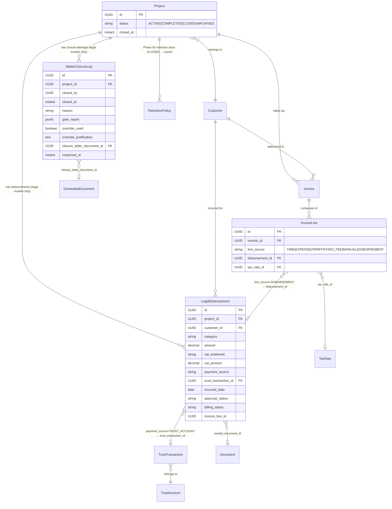
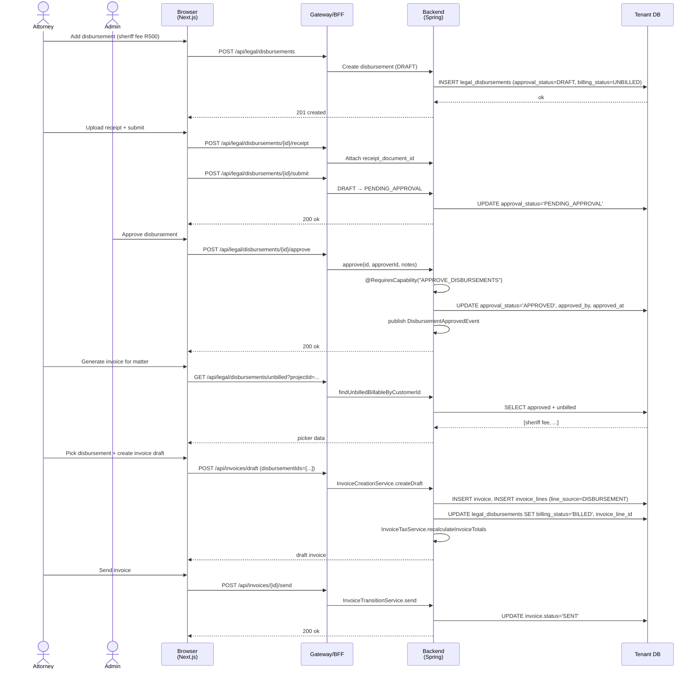
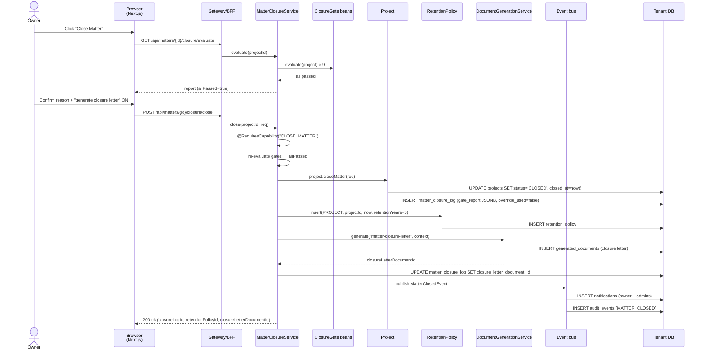
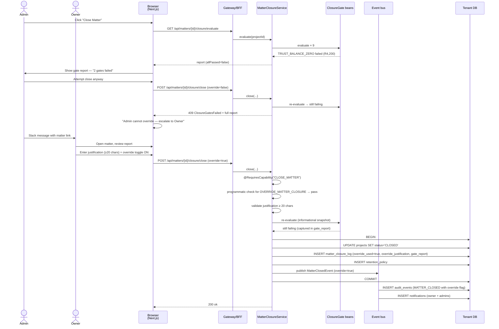

# Phase 67 — Legal Depth II: Daily Operational Loop

> This is a standalone phase architecture document — no changes are made to `architecture/ARCHITECTURE.md` (whose numbered sections stop at Phase 4). New phase docs live as sibling files under `architecture/` per convention since Phase 5.

---

## 67.1 — Overview

Phase 55 gave `legal-za` its foundation (court calendar, conflict check, LSSA tariff, adverse parties). Phase 60 added the trust ledger. Phase 61 sharpened the Section 86 investment distinction and KYC. Phase 64 retargeted terminology and shipped three matter templates plus a 90-day QA script. What `legal-za` still cannot do today — and what a real SA small law firm does every week — is: record disbursements on a matter with trust-vs-office payment sourcing and proper SARS VAT treatment; run the compliance-gated closure that the Legal Practice Act implicitly requires on every matter wind-down; issue a Statement of Account on demand; and open a conveyancing file. Phase 67 closes those four gaps without touching any other vertical.

The phase is deliberately additive. It introduces exactly two new entities (`LegalDisbursement`, `MatterClosureLog`), extends two existing ones (`Project` gains a `CLOSED` status and `closedAt`; `InvoiceLine` gains a `disbursementId` FK and a new `DISBURSEMENT` value on its `line_source` discriminator), ships one new system template (`statement-of-account`) and one new flow (`matter-closure-letter`), and drops one pack (`conveyancing-za`) through the Phase 65 pipeline. All new backend surfaces sit under `verticals/legal/` and are gated by `VerticalModuleGuard`; non-legal tenants never see disbursement columns populated, never get a matter-closure prompt, and never render a Statement of Account button, even though their tenant schemas carry the new tables (per the same "table exists in every schema, module guard controls access" rule Phase 55 established). There are no changes to `legal-generic`, `accounting-za`, `consulting-za`, or `consulting-generic`.

Two fork-in-the-road decisions from the requirements file were resolved before drafting this doc. First, disbursements are a sibling entity to `Expense` rather than a superset — SA legal practice forbids markup on disbursements, requires pre-bill approval, requires trust-vs-office source, and has pass-through VAT semantics, none of which belong on the horizontal `Expense` primitive. Second, the invoice-pipeline integration uses the parallel-path pattern (already in use for time entries vs. expenses in `InvoiceCreationService`) rather than introducing a shared `Billable` interface — there is no such interface in the codebase today, and retrofitting one across `TimeEntry`, `Expense`, and `LegalDisbursement` to solve one integration point costs far more than adding a third `List<UUID>` parameter to `createDraft(...)`. Both decisions are captured as ADRs in §67.11.

### What's new

| Area | Existing (Phases 55 / 60 / 61 / 64 / 65) | Phase 67 adds |
|---|---|---|
| Legal operational entities | Court dates, prescriptions, conflict checks, adverse parties, trust accounts/transactions/ledger cards, LSSA tariff | `LegalDisbursement`, `MatterClosureLog` |
| Matter (Project) lifecycle | ACTIVE → COMPLETED → ARCHIVED | + `CLOSED` (legal-specific, starts retention clock), + reopen path |
| Invoice line sources | `TIME`, `EXPENSE`, `TARIFF`, `FIXED_FEE`, `MANUAL` | + `DISBURSEMENT` with FK to `legal_disbursements` |
| Unbilled billable surface | Time entries + expenses | + approved-unbilled disbursements (when `disbursements` module enabled) |
| Tax treatments on lines | Standard 15%, zero-rated, exempt (via `TaxRate` lookup on `InvoiceLine.taxRateId`) | Unchanged mechanism — disbursements carry a `vatTreatment` field that drives which existing `TaxRate` the invoice line references |
| Matter documents | Trust docs, tariff exports, matter templates | `statement-of-account` (Tiptap template + context builder), `matter-closure-letter` (Tiptap template) |
| Conveyancing | None | Field pack + project template append + 10 clauses + 4 Tiptap templates + intake request pack |
| RBAC capabilities | `VIEW_LEGAL`, `MANAGE_LEGAL`, `VIEW_TRUST`, `MANAGE_TRUST`, `APPROVE_TRUST_PAYMENT`, existing horizontals | `MANAGE_DISBURSEMENTS`, `APPROVE_DISBURSEMENTS`, `WRITE_OFF_DISBURSEMENTS`, `CLOSE_MATTER`, `OVERRIDE_MATTER_CLOSURE`, `GENERATE_STATEMENT_OF_ACCOUNT` |
| Retention | Phase 50 `RetentionPolicy` + scheduled job | Matter closure inserts a `RetentionPolicy` row (`retention_start = closure_date`) using existing primitives |
| Migrations | Tenant high-water V95 | Tenant V96 (legal_disbursements) + V97 (matter closure + invoice_line extension) |

### Out of scope

See §67.12 for the full list (unified deadline calendar, counsel brief management, fee-notes-as-entity, deeds-office API, bulk CSV disbursement import, statement auto-scheduling, and a handful of others) — all deferred to a later phase.

---

## 67.2 — Domain Model

Phase 67 introduces two new tenant-scoped entities and extends two existing ones. All follow the patterns codified across Phases 55/60 (schema-per-tenant, bare `UUID` FKs, no `@ManyToOne`, status stored as varchar per [ADR-238](../adr/ADR-238-entity-type-varchar-vs-enum.md), `Instant` for timestamps, `LocalDate` for business dates, protected no-arg constructor, `@PrePersist` sets `createdAt`).

### 67.2.1 `LegalDisbursement`

Package: `verticals/legal/disbursement/`. Represents an out-of-pocket cost incurred by the firm on behalf of a client on a specific matter (sheriff fee, deeds-office fee, counsel's fee, etc.). Distinct from `Expense` because: SA legal practice forbids markup on disbursements; disbursements have a pre-bill approval workflow; they can be paid out of either the office account or the trust account (with the trust path linking to an existing approved `TrustTransaction`); and their VAT treatment is often zero-rated pass-through rather than standard 15%.

| Field | Java type | SQL | Constraints | Notes |
|---|---|---|---|---|
| `id` | `UUID` | `UUID` | PK, `DEFAULT gen_random_uuid()` | |
| `projectId` | `UUID` | `UUID` | NOT NULL | Matter (project) the disbursement belongs to |
| `customerId` | `UUID` | `UUID` | NOT NULL | Denormalised for per-customer queries (matches `Expense`) |
| `category` | `String` | `VARCHAR(30)` | NOT NULL + CHECK | `SHERIFF_FEES`, `COUNSEL_FEES`, `SEARCH_FEES`, `DEEDS_OFFICE_FEES`, `COURT_FEES`, `ADVOCATE_FEES`, `EXPERT_WITNESS`, `TRAVEL`, `OTHER` |
| `description` | `String` | `TEXT` | NOT NULL | Free text, e.g. "Sheriff service fee — Edenvale" |
| `amount` | `BigDecimal` | `DECIMAL(15,2)` | NOT NULL, > 0 | Always positive; ZAR |
| `vatTreatment` | `String` | `VARCHAR(30)` | NOT NULL + CHECK | `STANDARD_15`, `ZERO_RATED_PASS_THROUGH`, `EXEMPT` — drives later `TaxRate` lookup at invoice time |
| `vatAmount` | `BigDecimal` | `DECIMAL(15,2)` | NOT NULL, >= 0 | Computed at write time from `amount` + `vatTreatment`; stored for reporting stability |
| `paymentSource` | `String` | `VARCHAR(20)` | NOT NULL + CHECK | `OFFICE_ACCOUNT`, `TRUST_ACCOUNT` |
| `trustTransactionId` | `UUID` | `UUID` | Nullable, FK → `trust_transactions(id)` | Required iff `payment_source = 'TRUST_ACCOUNT'`; enforced in service + CHECK |
| `incurredDate` | `LocalDate` | `DATE` | NOT NULL | When the disbursement was actually incurred |
| `supplierName` | `String` | `VARCHAR(200)` | NOT NULL | Counsel / sheriff / deeds office / vendor |
| `supplierReference` | `String` | `VARCHAR(100)` | Nullable | Supplier's invoice / receipt number |
| `receiptDocumentId` | `UUID` | `UUID` | Nullable, FK → `documents(id)` | Uploaded receipt (S3 via Phase 9/21 `DocumentService`) |
| `approvalStatus` | `String` | `VARCHAR(20)` | NOT NULL + CHECK, default `'DRAFT'` | `DRAFT`, `PENDING_APPROVAL`, `APPROVED`, `REJECTED` |
| `approvedBy` | `UUID` | `UUID` | Nullable | Member who approved / rejected |
| `approvedAt` | `Instant` | `TIMESTAMPTZ` | Nullable | |
| `approvalNotes` | `String` | `TEXT` | Nullable | Approver's note on approve or reject |
| `billingStatus` | `String` | `VARCHAR(20)` | NOT NULL + CHECK, default `'UNBILLED'` | `UNBILLED`, `BILLED`, `WRITTEN_OFF` |
| `invoiceLineId` | `UUID` | `UUID` | Nullable | Set when `billing_status` moves to `BILLED` |
| `writeOffReason` | `String` | `TEXT` | Nullable | Required when `billing_status = 'WRITTEN_OFF'` |
| `createdBy` | `UUID` | `UUID` | NOT NULL | |
| `createdAt` | `Instant` | `TIMESTAMPTZ` | NOT NULL, default `now()` | Set in `@PrePersist` |
| `updatedAt` | `Instant` | `TIMESTAMPTZ` | NOT NULL, default `now()` | Updated on any mutation |

**Why a sibling entity, not an `Expense` extension.** See [ADR-247](../adr/ADR-247-legal-disbursement-sibling-entity.md) for the long-form rationale. In short: adding four nullable columns to every tenant's `expenses` table to carry legal-specific state (trust-link, VAT treatment override, approval workflow) would bloat a horizontal entity for a feature only one vertical uses; `Expense.markup` and `Expense.billable` have different semantics on a disbursement (markup forbidden, billable always true). The price of duplication is one extra service class and one extra repository method per query; the benefit is a clean boundary.

**Why explicit `vatAmount` storage rather than compute-on-read.** Disbursements can be edited between creation and billing but retain their original VAT calculation for audit. Storing `vatAmount` at write time prevents retroactive re-computation drift if a `TaxRate` entry is edited later. Reporting (Statement of Account) aggregates `vatAmount` directly from the row — no re-calc required.

**Why `trustTransactionId` is a bare UUID, not a `@ManyToOne`.** Matches the rest of the legal vertical ([Phase 55/60 pattern](../architecture/phase60-trust-accounting.md)): joins happen at the service layer, not in entity graphs. The FK exists at the DB level for referential integrity.

### 67.2.2 `MatterClosureLog`

Package: `verticals/legal/closure/`. Audit trail for every closure attempt on a matter — successful or not. Separate from `AuditEvent` because the closure-gate report is rich structured data that deserves first-class storage (not a JSONB blob inside a generic audit row).

| Field | Java type | SQL | Constraints | Notes |
|---|---|---|---|---|
| `id` | `UUID` | `UUID` | PK, `DEFAULT gen_random_uuid()` | |
| `projectId` | `UUID` | `UUID` | NOT NULL | The matter |
| `closedBy` | `UUID` | `UUID` | NOT NULL | Member who triggered the close |
| `closedAt` | `Instant` | `TIMESTAMPTZ` | NOT NULL | When the transition happened |
| `reason` | `String` | `VARCHAR(40)` | NOT NULL + CHECK | `CONCLUDED`, `CLIENT_TERMINATED`, `REFERRED_OUT`, `OTHER` |
| `notes` | `String` | `TEXT` | Nullable | Free-text closure notes |
| `gateReport` | `String` (JSONB) | `JSONB` | NOT NULL | Full per-gate result at the moment of close — see §67.3.4 shape |
| `overrideUsed` | `boolean` | `BOOLEAN` | NOT NULL, default `false` | True iff closure proceeded despite a failing gate |
| `overrideJustification` | `String` | `TEXT` | Nullable | Required iff `overrideUsed = true`; enforced ≥ 20 chars at service layer |
| `closureLetterDocumentId` | `UUID` | `UUID` | Nullable, FK → `generated_documents(id)` | Set when `generateClosureLetter = true` succeeds |
| `reopenedAt` | `Instant` | `TIMESTAMPTZ` | Nullable | Set if/when matter is reopened; one row per closure attempt |
| `reopenedBy` | `UUID` | `UUID` | Nullable | |
| `reopenNotes` | `String` | `TEXT` | Nullable | Required on reopen |
| `createdAt` | `Instant` | `TIMESTAMPTZ` | NOT NULL, default `now()` | |

**Why a separate table, not a JSONB column on `Project`.** Closure is an event log, not a state snapshot. A matter can be closed → reopened → re-closed; each attempt needs its own audited row with its own gate report. Storing the latest attempt on `Project` discards history; storing all attempts as a JSONB array on `Project` makes querying closures-this-quarter awkward. A sibling table with `projectId` + `closedAt` composite index is the natural shape.

### 67.2.3 Extensions to existing entities

**`Project`** (`project/Project.java`):
- Existing `ProjectStatus` enum gains `CLOSED` value. The DB CHECK constraint on `projects.status` is extended in migration V97 to include `'CLOSED'`. Stored as varchar per [ADR-238](../adr/ADR-238-entity-type-varchar-vs-enum.md).
- New field `closedAt: Instant` (nullable). Set by the new `Project.closeMatter(ClosureRequest)` domain method (mirrors `Project.complete()` / `Project.archive()` / `Project.reopen()` pattern in the existing `ProjectLifecycleGuard` code). Cleared on reopen.
- `ProjectLifecycleGuard.requireTransition(...)` gains two new legal valid transitions: `ACTIVE|COMPLETED → CLOSED` and `CLOSED → ACTIVE`. Non-legal tenants cannot reach `CLOSED` because the only call sites are `MatterClosureService` methods, which are module-guarded.

**`ProjectStatus`** (`project/ProjectStatus.java`):
- Add `CLOSED` enum constant.

**`InvoiceLine`** (`invoice/InvoiceLine.java`):
- New field `disbursementId: UUID` (nullable), FK to `legal_disbursements(id)`. Mirrors existing `timeEntryId`, `expenseId`, `tariffItemId` on the same entity.
- The existing `line_source` varchar column's CHECK constraint is extended to include `'DISBURSEMENT'`. The `lineSource` is a string per the actual codebase (no `InvoiceLineSource` entity exists — verified from the context inventory).
- No change to `taxRateId` mechanism: `InvoiceTaxService` continues to resolve and apply a `TaxRate` to each line. Disbursement lines get their `taxRateId` populated at creation time based on the source disbursement's `vatTreatment` (§67.3.3).

### 67.2.4 ER diagram (Phase 67 neighbourhood)

Only the entities that interact with Phase 67 surfaces — not the full 101-entity graph.



---

## 67.3 — Core Flows and Backend Behaviour

### 67.3.1 Disbursement lifecycle

A disbursement moves through two orthogonal axes: an **approval** axis (`DRAFT → PENDING_APPROVAL → APPROVED | REJECTED`) and a **billing** axis (`UNBILLED → BILLED | WRITTEN_OFF`). Only `APPROVED`-and-`UNBILLED` disbursements are eligible to be pulled into an invoice draft.

```
Approval:   DRAFT ──submit──▶ PENDING_APPROVAL ──approve──▶ APPROVED
                                      └─reject──▶ REJECTED

Billing:    UNBILLED ──includeInInvoice──▶ BILLED
                    └─writeOff──▶ WRITTEN_OFF
```

**Tenant boundary.** `LegalDisbursement` lives under `verticals/legal/disbursement/` and every controller method carries `@VerticalModuleGuard` for the `disbursements` module. Non-legal tenants cannot reach these endpoints — the guard throws 404 before the controller runs. The `legal_disbursements` table physically exists in every tenant schema (per the Phase 55 convention) but remains empty for non-legal tenants because no code path writes to it. This is the same model the trust module uses.

**`DisbursementService` — conceptual method signatures.**

```java
@Service
public class DisbursementService {

  // Create a DRAFT disbursement. Validates trust link (if TRUST_ACCOUNT).
  LegalDisbursement create(CreateDisbursementRequest req, UUID createdBy);

  // Mutate DRAFT or PENDING_APPROVAL. APPROVED rows are immutable (must be rejected first).
  LegalDisbursement update(UUID id, UpdateDisbursementRequest req);

  // DRAFT → PENDING_APPROVAL.
  void submitForApproval(UUID id);

  // PENDING_APPROVAL → APPROVED. Fires DisbursementApprovedEvent.
  // Capability: APPROVE_DISBURSEMENTS.
  void approve(UUID id, UUID approverId, String notes);

  // PENDING_APPROVAL → REJECTED. Fires DisbursementRejectedEvent.
  // Capability: APPROVE_DISBURSEMENTS.
  void reject(UUID id, UUID approverId, String notes);

  // UNBILLED → WRITTEN_OFF. Reason required.
  // Capability: WRITE_OFF_DISBURSEMENTS.
  void writeOff(UUID id, String reason);

  // UNBILLED → BILLED; called by InvoiceCreationService on commit.
  // Internal — no public controller.
  void markBilled(UUID id, UUID invoiceLineId);

  // Unbilled-for-project read model — used by MatterClosureService gate and
  // (indirectly via UnbilledTimeService) by invoice draft creation.
  List<UnbilledDisbursementDto> listUnbilledForProject(UUID projectId);

  // Period-scoped read model used by StatementOfAccountContextBuilder.
  List<DisbursementStatementDto> listForStatement(
      UUID projectId, LocalDate periodStart, LocalDate periodEnd);
}
```

**Capability mapping per operation.**

| Operation | Capability | Default role bindings |
|---|---|---|
| `create`, `update`, `submitForApproval` | `MANAGE_DISBURSEMENTS` | Owner, Admin, Member |
| `approve`, `reject` | `APPROVE_DISBURSEMENTS` | Owner, Admin |
| `writeOff` | `WRITE_OFF_DISBURSEMENTS` | Owner, Admin |
| `listUnbilledForProject`, `listForStatement`, read endpoints | `VIEW_LEGAL` (existing) | Owner, Admin, Member |

Capabilities are enforced with the custom `@RequiresCapability("NAME")` annotation that already governs the `MANAGE_LEGAL` / `VIEW_LEGAL` surfaces — **not** `@PreAuthorize("@capabilities.has(...)")`, which does not exist in this codebase. See `orgrole/RequiresCapability.java` / `CapabilityAuthorizationManager.java` for the interceptor that resolves the check against `CapabilityAuthorizationService`.

**Validation rules on create / update.**

- `amount > 0` (CHECK + service).
- `category` must be one of the nine values (CHECK + service).
- `vatTreatment` defaults to the category's conventional default (see §67.3.1 default table below) but may be overridden by the caller.
- If `paymentSource = 'TRUST_ACCOUNT'`:
  - `trustTransactionId` is required.
  - The referenced `TrustTransaction` must exist, have `status = 'APPROVED'`, and `transaction_type = 'DISBURSEMENT_PAYMENT'` (a value on the existing `trust_transactions.transaction_type` column — Phase 60 introduced the string, Phase 67 uses it without schema change).
  - The trust transaction's `projectId` must equal the disbursement's `projectId` (same matter).
  - Trust balance at `incurredDate` must cover the disbursement amount — this is a soft warning at the service layer because Phase 60 already enforces non-negative balance on the `ClientLedgerCard`; a disbursement cannot reference a trust transaction that over-drew the client ledger.
- If `paymentSource = 'OFFICE_ACCOUNT'`:
  - `trustTransactionId` must be null (CHECK + service).

**Default VAT treatment per category** — applied on create if caller does not specify:

| Category | Default `vatTreatment` | Rationale |
|---|---|---|
| `SHERIFF_FEES` | `ZERO_RATED_PASS_THROUGH` | Sheriffs charge no VAT; firm passes through at cost |
| `DEEDS_OFFICE_FEES` | `ZERO_RATED_PASS_THROUGH` | Deeds office fees are zero-rated |
| `COURT_FEES` | `ZERO_RATED_PASS_THROUGH` | Court filing fees are zero-rated |
| `COUNSEL_FEES` / `ADVOCATE_FEES` | `STANDARD_15` | Assumes counsel is VAT-registered (most are) |
| `SEARCH_FEES` | `STANDARD_15` | Typical private search providers charge VAT |
| `EXPERT_WITNESS` | `STANDARD_15` | |
| `TRAVEL` | `STANDARD_15` | |
| `OTHER` | `STANDARD_15` | Conservative default |

Caller can override any of these on a per-disbursement basis; the override is what persists on the row.

### 67.3.2 Trust-linked disbursements

A disbursement with `paymentSource = 'TRUST_ACCOUNT'` records a payment already made out of the firm's trust account on behalf of a client. The sequence is always **trust transaction first, disbursement second** — never the reverse. Phase 60's `TrustTransaction` is the source of truth for trust movement; the disbursement references it.

This ordering exists because trust transactions carry dual-approval semantics and non-negative-balance guarantees ([Phase 60 §4](phase60-trust-accounting.md)). A disbursement cannot be allowed to cause a trust withdrawal — it can only *record* an approved withdrawal that already happened. If a conveyancer needs to pay the deeds office R500 out of trust, the flow is: record a `DISBURSEMENT_PAYMENT` trust transaction (goes through trust approval, debits the client ledger), then record the `LegalDisbursement` referencing that transaction.

**Trust balance and matter-match validation** (service layer, conceptual SQL):

```sql
SELECT t.id, t.status, t.transaction_type, t.project_id, t.amount
FROM trust_transactions t
WHERE t.id = :trustTransactionId;

-- Service-layer assertions:
-- status = 'APPROVED'
-- transaction_type = 'DISBURSEMENT_PAYMENT'
-- project_id = :disbursementProjectId
-- (amount is informational — the trust module already enforced balance at approval time)
```

If any assertion fails, service throws a semantic `IllegalStateException` that the controller converts to a 422 ProblemDetail. No partial disbursement is persisted.

**Why not auto-create the trust transaction from the disbursement.** Trust approval is a legally distinct act with its own role-based workflow (dual-approval above threshold, Section 86 disclosure) — the firm wants conscious approval, not a side-effect of recording a disbursement. Keeping the two flows separate also means a disbursement funded from the office account (by far the most common case) doesn't touch trust approval at all.

### 67.3.3 Disbursement inclusion in invoicing (parallel-path integration)

The codebase today uses a **parallel-path** pattern for time entries and expenses: `InvoiceCreationService.createDraft(...)` takes explicit `timeEntryIds` + `expenseIds` from the caller and pulls them via their respective repositories. There is no shared `Billable` interface. The requirements file floated an `UnbilledBillableItem` interface as a candidate refactor; that has been dropped in favour of adding disbursements as a third parallel track.

**Why no shared interface.** Retrofitting `TimeEntry` and `Expense` behind a common contract for the sake of one integration point costs more than it saves. `TimeEntry` uses a direct `setInvoiceId(...)` mutator; `Expense` encapsulates `markBilled(UUID)`, `unbill()`, `writeOff()`, `restore()`. Aligning their surfaces requires touching Phase 5 and Phase 30 code that is otherwise stable. The parallel-path pattern has worked since Phase 10 and adds zero new abstraction for a third sibling. This decision is formalised in [ADR-247](../adr/ADR-247-legal-disbursement-sibling-entity.md).

**Extension to `UnbilledTimeService.getUnbilledTime(...)`.** The existing method returns an `UnbilledTimeResponse` containing `timeEntries: List<...>` + `expenses: List<...>`. Phase 67 extends the DTO with a new `disbursements: List<UnbilledDisbursementDto>` field. The service populates this list *only when the tenant has the `disbursements` module enabled* — checked via `VerticalModuleRegistry.isEnabled("disbursements", tenantId)`. Non-legal tenants continue to see the two-list response, byte-compatible with today.

Repository addition on the disbursement side (mirroring the existing `ExpenseRepository.findUnbilledBillableByCustomerId`):

```java
public interface DisbursementRepository extends JpaRepository<LegalDisbursement, UUID> {

  @Query("""
      SELECT d FROM LegalDisbursement d
      WHERE d.customerId = :customerId
        AND d.approvalStatus = 'APPROVED'
        AND d.billingStatus = 'UNBILLED'
        AND (:projectId IS NULL OR d.projectId = :projectId)
      ORDER BY d.incurredDate ASC, d.createdAt ASC
      """)
  List<LegalDisbursement> findUnbilledBillableByCustomerId(
      @Param("customerId") UUID customerId,
      @Param("projectId") UUID projectId);
}
```

**Extension to `InvoiceCreationService.createDraft(...)`.** The `CreateInvoiceRequest` gains an optional `disbursementIds: List<UUID>` field. The service adds a third private helper:

```java
private void createDisbursementLines(
    Invoice invoice, List<UUID> disbursementIds, UUID customerId, int sortOffset) {
  // 1. Fetch each LegalDisbursement by id, guard approval + billing status.
  // 2. Guard projectId matches invoice scope (if scoped).
  // 3. For each:
  //    - Look up TaxRate by disbursement.vatTreatment:
  //        STANDARD_15            → TaxRate with rate = 15.00 and default
  //        ZERO_RATED_PASS_THROUGH → TaxRate flagged zero-rated
  //        EXEMPT                 → TaxRate flagged exempt
  //      (TaxRate resolution is a single query on tax_rates filtered by rate + flags;
  //       this leaves Phase 26 InvoiceTaxService in charge of the subsequent
  //       recalculateInvoiceTotals pass.)
  //    - Build InvoiceLine with line_source = "DISBURSEMENT",
  //      disbursementId = d.id,
  //      description = formatDisbursementLineDescription(d),
  //      amount = d.amount,
  //      taxRateId = resolvedTaxRate.id.
  //    - Save the line; capture the line id.
  //    - disbursementService.markBilled(d.id, line.id).
}
```

`formatDisbursementLineDescription` follows LSSA convention: `"{category-label}: {description} ({supplier}, {incurred_date})"`, e.g. `"Sheriff fees: Service on defendant (Sheriff Edenvale, 2026-04-10)"`.

The `markBilled` side-effect runs inside the same `@Transactional` scope as invoice creation, so a rollback unbinds the disbursement.

**Why not auto-include unbilled disbursements.** Same reason expenses are not auto-included: the caller (UI or API client) decides which items go on the draft. The matter-closure gate (§67.3.4) and the "Add Disbursements" picker on the invoice editor both consume `DisbursementRepository.findUnbilledBillableByCustomerId` to surface the eligible set, but selection is explicit.

### 67.3.4 Matter closure gate evaluation

A matter cannot close cleanly unless every compliance gate passes. Closure is attempted via `POST /api/matters/{projectId}/closure/close`, but a preview endpoint `GET /api/matters/{projectId}/closure/evaluate` lets the UI render the pre-closure report without side effects. The preview is stateless — it only reads.

**`ClosureGate` interface.**

```java
public interface ClosureGate {
  String code();                       // e.g. "TRUST_BALANCE_ZERO"
  GateResult evaluate(Project project); // { passed, code, message, detail }
  int order();                         // stable display order
}

public record GateResult(
    boolean passed,
    String code,
    String message,      // human-readable; interpolated with counts / amounts
    Map<String, Object> detail // optional structured drill-down
) {}
```

Each gate is a tiny `@Component` that the service discovers via Spring constructor injection into a `List<ClosureGate>`. Adding a gate in a future phase (e.g. "all FICA compliance items closed") is a single class drop with no change to `MatterClosureService`.

**The 9 gates.**

| Order | Gate code | Check | Failure message template | Backing query / service call |
|---|---|---|---|---|
| 1 | `TRUST_BALANCE_ZERO` | Client ledger balance for this matter is R0.00 | `"Matter trust balance is R{balance}. Transfer to client or office before closure."` | `ClientLedgerService.getBalanceForMatter(projectId)` (Phase 60) |
| 2 | `ALL_DISBURSEMENTS_APPROVED` | No `LegalDisbursement` rows in `DRAFT` / `PENDING_APPROVAL` | `"{count} disbursements are unapproved."` | `SELECT COUNT(*) FROM legal_disbursements WHERE project_id = ? AND approval_status IN ('DRAFT','PENDING_APPROVAL')` |
| 3 | `ALL_DISBURSEMENTS_SETTLED` | No `LegalDisbursement` rows in `UNBILLED` | `"{count} approved disbursements are unbilled."` | `SELECT COUNT(*) FROM legal_disbursements WHERE project_id = ? AND billing_status = 'UNBILLED' AND approval_status = 'APPROVED'` |
| 4 | `FINAL_BILL_ISSUED` | At least one `Invoice` with status `SENT` / `PAID`; no unbilled time remains | `"No final bill issued. {unbilled_hours}h of unbilled time + R{unbilled_amount} of unbilled items remain."` | Join across `invoices`, `time_entries.invoice_id IS NULL AND billable = true`, `legal_disbursements.billing_status = 'UNBILLED'` |
| 5 | `NO_OPEN_COURT_DATES` | No `CourtDate` in `SCHEDULED` / `POSTPONED` | `"{count} future court dates scheduled."` | `SELECT COUNT(*) FROM court_dates WHERE project_id = ? AND status IN ('SCHEDULED','POSTPONED') AND date >= CURRENT_DATE` |
| 6 | `NO_OPEN_PRESCRIPTIONS` | No `PrescriptionTracker` in `RUNNING` / `WARNED` | `"{count} prescription timers still running."` | `SELECT COUNT(*) FROM prescription_trackers WHERE project_id = ? AND status IN ('RUNNING','WARNED')` |
| 7 | `ALL_TASKS_RESOLVED` | No `Task` in `IN_PROGRESS` / `BLOCKED` | `"{count} tasks remain open."` | `SELECT COUNT(*) FROM tasks WHERE project_id = ? AND status IN ('IN_PROGRESS','BLOCKED')` |
| 8 | `ALL_INFO_REQUESTS_CLOSED` | No `InformationRequest` in `PENDING` | `"{count} client information requests outstanding."` | `SELECT COUNT(*) FROM information_requests WHERE project_id = ? AND status = 'PENDING'` |
| 9 | `ALL_ACCEPTANCE_REQUESTS_FINAL` | No `AcceptanceRequest` in `PENDING` | `"{count} document acceptances pending."` | `SELECT COUNT(*) FROM acceptance_requests WHERE project_id = ? AND status = 'PENDING'` |

**Aggregation in `MatterClosureService.evaluate`.**

```java
public MatterClosureReport evaluate(UUID projectId) {
  Project project = projectRepository.findById(projectId).orElseThrow();
  verticalModuleGuard.requireEnabled("matter_closure");

  List<GateResult> results = gates.stream()
      .sorted(Comparator.comparingInt(ClosureGate::order))
      .map(g -> g.evaluate(project))
      .toList();

  boolean allPassed = results.stream().allMatch(GateResult::passed);
  return new MatterClosureReport(projectId, allPassed, results, Instant.now());
}
```

`MatterClosureReport` is the JSONB payload serialised into `matter_closure_log.gate_report` on a successful close attempt.

### 67.3.5 Matter closure transaction

The happy path through `MatterClosureService.close(UUID projectId, ClosureRequest req)`:

1. **Capability check.** `@RequiresCapability("CLOSE_MATTER")` on the controller. If `req.override = true`, additional programmatic check for `OVERRIDE_MATTER_CLOSURE` — throws 403 if missing.
2. **Module guard.** `VerticalModuleGuard.requireEnabled("matter_closure")` — non-legal tenants cannot reach this call site; frontend `<ModuleGate>` already hides the UI.
3. **Pre-close evaluate.** Internally calls `evaluate(projectId)`. If any gate failed and `req.override = false`, throws a semantic `ClosureGateFailedException` → 409 ProblemDetail with the full report in the response body.
4. **Override validation.** If `req.override = true`:
   - Caller must have `OVERRIDE_MATTER_CLOSURE` (re-checked).
   - `req.overrideJustification` required, must be ≥ 20 non-whitespace characters (service-layer assertion).
5. **Project transition.** `project.closeMatter(req)` — a new domain method on `Project.java` that mirrors the existing `complete()` / `archive()` methods. It calls `ProjectLifecycleGuard.requireTransition(ACTIVE|COMPLETED → CLOSED)`, sets `status = CLOSED`, sets `closedAt = Instant.now()`, and saves.
6. **Closure log insert.** One `MatterClosureLog` row with: `projectId`, `closedBy` (the current member), `closedAt`, `reason`, `notes`, serialised `gateReport` (the pre-evaluated report), `overrideUsed = req.override`, `overrideJustification`.
7. **Retention clock start.** Insert a `RetentionPolicy` row (Phase 50): `entityType = 'PROJECT'`, `entityId = projectId`, `retentionStart = now()`, `retentionYears` pulled from `OrgSettings.legalMatterRetentionYears` (default `5`). This is the legal retention timer; the scheduled Phase 50 job takes over from here.
8. **Optional closure letter.** If `req.generateClosureLetter = true`, call `DocumentGenerationService.generate(systemTemplate = "matter-closure-letter", context = MatterClosureContextBuilder.build(projectId, req))`. The resulting `GeneratedDocument.id` is stamped onto `matter_closure_log.closure_letter_document_id`. Generation failure does not fail the transaction — the closure still commits, a log warning is emitted, and the closure log row records `closure_letter_document_id = null` so the UI can offer a retry.
9. **Domain event.** `applicationEventPublisher.publishEvent(new MatterClosedEvent(projectId, closureLogId, req.reason, req.override))`.
10. **Notifications.** `MatterClosureNotificationHandler` (Phase 6.5 handler pattern, listens on `MatterClosedEvent`) sends in-app notifications to the matter owner and all org admins.
11. **Audit.** Standard `AuditEvent` insert with `action = 'MATTER_CLOSED'`, details include reason, override flag, gate-report snapshot reference (the closure log id).

Steps 5–8 run inside a single `@Transactional` scope. Notifications + audit emit on the event bus after commit (existing synchronous-fanout pattern).

Sequence diagrams for the full flow — including the override branch — appear in §67.5.

### 67.3.6 Matter reopen

`POST /api/matters/{projectId}/closure/reopen` transitions a `CLOSED` matter back to `ACTIVE`. Owner-only (capability `CLOSE_MATTER`; reopen is treated as another CLOSE-class action). Body requires a `notes` field (≥ 10 chars).

Behaviour:

- `ProjectLifecycleGuard.requireTransition(CLOSED → ACTIVE)` runs.
- `project.closedAt` is cleared.
- The most recent `MatterClosureLog` row for this project has `reopenedAt`, `reopenedBy`, `reopenNotes` populated (rather than inserting a new row — the reopen is a closure of the previous closure).
- `RetentionPolicy` row for this project: if `retentionStart + retentionYears` has not yet elapsed, the policy is soft-cancelled (add a nullable `cancelledAt` column via the same migration — see §67.8). If retention has elapsed and data has already been purged by the Phase 50 job, reopen is **not permitted** — the service throws `RetentionElapsedException` → 409.
- A `MatterReopenedEvent` fires; owner + admin receive a notification.

### 67.3.7 Statement of Account generation

A Statement of Account is an informational document rendered from a Tiptap template plus a context bundle. It is **not** a new entity — it rides Phase 12's `DocumentTemplate` + `GeneratedDocument` primitives. See [ADR-250](../adr/ADR-250-statement-of-account-template-and-context.md).

**`StatementOfAccountContextBuilder`** — new class in `verticals/legal/statement/`.

```java
@Component
public class StatementOfAccountContextBuilder {

  public Map<String, Object> build(
      UUID projectId, LocalDate periodStart, LocalDate periodEnd) {
    // Returns a variable bundle that Phase 31's VariableResolver can flatten.
    // Top-level keys are the namespaces shown in §67.6.
  }
}
```

Return shape is a `Map<String, Object>` because that is what Phase 31's Tiptap variable resolver consumes (it flattens dotted keys through nested maps). This matches the Phase 12 context-builder pattern (`ProjectContextBuilder`, `CustomerContextBuilder`, `InvoiceContextBuilder`).

**Query strategy.** Four sub-queries compose into one bundle:

1. **Fees.** `TimeEntryService.findBillableInPeriod(projectId, periodStart, periodEnd)` — returns the time entries grouped by date and member, with billable rate applied.
2. **Disbursements.** `DisbursementService.listForStatement(projectId, periodStart, periodEnd)` — returns `LegalDisbursement` rows grouped by `category`.
3. **Trust activity.** `ClientLedgerService.getActivityForMatter(projectId, periodStart, periodEnd)` — returns opening balance, deposits, payments, closing balance (Phase 60 already exposes this shape).
4. **Prior-balance rollup.** `InvoiceService.getBalanceSummary(customerId, projectId, asOf = periodStart)` — previous-balance owing + any payments received since.

**Empty-period handling.** Every sub-query returns an empty list / zero aggregate for an empty period. The template renders sections conditionally — Phase 31 Tiptap supports `` blocks through the resolver.

**Endpoint.**

```
POST /api/matters/{projectId}/statements
Body: { periodStart, periodEnd, templateId? (default: system "statement-of-account") }
Returns: GeneratedDocument (with htmlPreview + pdfUrl)
```

Internally this is a thin wrapper: build context → `DocumentGenerationService.generate(templateId, context)` → emit `StatementOfAccountGeneratedEvent` → audit event. No new entity is persisted beyond the `GeneratedDocument` that Phase 12 already writes for every generation.

**Template seeding.** The system-owned template lands under `template-packs/legal-za/statement-of-account.json`. Phase 65's `TemplatePackInstaller` places it on the tenant at provisioning or on a pack upgrade pass. Users can clone it through the standard Phase 12 "clone and edit" action to customise branding or wording.

### 67.3.8 Conveyancing pack install

Conveyancing is pack-only content — no backend code changes. The pack flows through the Phase 65 install pipeline exactly like `accounting-za` and `consulting-za` do today.

| Pack type | File(s) | Installer |
|---|---|---|
| Field pack (project) | `field-packs/conveyancing-za-project.json` | `FieldPackSeeder` |
| Project template pack append | `project-template-packs/legal-za.json` (edit in place to add Property Transfer template) | `ProjectTemplatePackSeeder` |
| Clause pack | `clause-packs/conveyancing-za-clauses/pack.json` + 10 Tiptap JSONs | `ClausePackSeeder` |
| Document template pack append | `template-packs/legal-za/` (add 4 Tiptap JSONs + extend `pack.json` manifest) | Phase 65 `TemplatePackInstaller` |
| Request pack | `request-packs/conveyancing-intake-za.json` | `RequestPackSeeder` |
| Profile manifest update | `vertical-profiles/legal-za.json` (append pack references) | `VerticalProfileRegistry` re-scan |

**New metadata: `acceptanceEligible` flag on template manifest entries.** A new optional boolean field on each entry in a template pack's `pack.json`. When `true`, the Phase 28 Send-for-Acceptance UI surfaces the template as a first-class option in the acceptance-request flow. Conveyancing ships with `acceptanceEligible: true` on `offer-to-purchase` and `power-of-attorney-transfer`. This is a general-purpose flag — legal, accounting, and consulting templates can opt in. See [ADR-251](../adr/ADR-251-acceptance-eligible-template-manifest-flag.md).

**Manifest shape extension:**

```json
{
  "packId": "legal-za",
  "templates": [
    {
      "key": "offer-to-purchase",
      "file": "offer-to-purchase.json",
      "name": "Offer to Purchase",
      "acceptanceEligible": true
    },
    {
      "key": "deed-of-transfer",
      "file": "deed-of-transfer.json",
      "acceptanceEligible": false
    }
  ]
}
```

Templates that omit the flag default to `false` — existing packs remain byte-compatible.

### 67.3.9 Multi-vertical coexistence

Disbursements, matter closure, and Statement of Account are all legal-only surfaces. The coexistence story:

- **Backend**: every new controller is annotated with the appropriate `@VerticalModuleGuard` (`disbursements` or `matter_closure`). A non-legal tenant hitting `/api/legal/disbursements` gets a 404 from the guard before any handler runs. Tables (`legal_disbursements`, `matter_closure_log`) exist in every tenant schema per the Phase 55 convention, but stay empty for non-legal tenants because the only writer is the module-guarded service.
- **Frontend**: every new UI surface wraps in `<ModuleGate module="disbursements">` or `<ModuleGate module="matter_closure">`. Non-legal profiles never render the matter-closure dialog, never show the Disbursements tab, never display the "Generate Statement of Account" action.
- **Conveyancing pack**: only installed for tenants on `legal-za` — the profile manifest is the gate.
- **Trust-linked disbursements**: require both `disbursements` AND `trust_accounting` modules enabled (the trust-transaction picker only opens when the trust module is live). Legal tenants without trust (rare but possible — a pure collections or advisory firm) see `TRUST_ACCOUNT` greyed out on the payment-source toggle.
- **Extension to `MultiVerticalCoexistenceTest`**: add assertions that `accounting-za` and `consulting-za` tenants cannot enumerate disbursements, cannot evaluate matter closure, and do not have the conveyancing field group applied to their projects.

---

## 67.4 — API Surface

All endpoints follow the `@RequiresCapability("NAME")` annotation pattern. Pagination on list endpoints uses the standard `page`, `size`, `sort` query parameters (Spring Data `Pageable`).

### 67.4.1 Disbursements

Base path: `/api/legal/disbursements` (guarded by `@VerticalModuleGuard("disbursements")`).

| Method | Path | Description | Capability | R/W |
|---|---|---|---|---|
| `POST` | `/api/legal/disbursements` | Create a DRAFT disbursement | `MANAGE_DISBURSEMENTS` | W |
| `GET` | `/api/legal/disbursements/{id}` | Fetch one | `VIEW_LEGAL` | R |
| `PATCH` | `/api/legal/disbursements/{id}` | Update DRAFT or PENDING_APPROVAL rows | `MANAGE_DISBURSEMENTS` | W |
| `GET` | `/api/legal/disbursements?projectId=&approvalStatus=&billingStatus=&category=&page=&size=&sort=` | List with filters | `VIEW_LEGAL` | R |
| `GET` | `/api/legal/disbursements/unbilled?projectId=` | Approved + unbilled only (used by invoice picker) | `VIEW_LEGAL` | R |
| `POST` | `/api/legal/disbursements/{id}/submit` | DRAFT → PENDING_APPROVAL | `MANAGE_DISBURSEMENTS` | W |
| `POST` | `/api/legal/disbursements/{id}/approve` | PENDING_APPROVAL → APPROVED | `APPROVE_DISBURSEMENTS` | W |
| `POST` | `/api/legal/disbursements/{id}/reject` | PENDING_APPROVAL → REJECTED | `APPROVE_DISBURSEMENTS` | W |
| `POST` | `/api/legal/disbursements/{id}/write-off` | UNBILLED → WRITTEN_OFF | `WRITE_OFF_DISBURSEMENTS` | W |
| `POST` | `/api/legal/disbursements/{id}/receipt` | Upload / replace receipt (multipart) | `MANAGE_DISBURSEMENTS` | W |

**`POST /api/legal/disbursements` request body:**

```json
{
  "projectId": "b5e3...-...",
  "customerId": "8a2d...-...",
  "category": "SHERIFF_FEES",
  "description": "Service on defendant — Edenvale Sheriff",
  "amount": 500.00,
  "vatTreatment": "ZERO_RATED_PASS_THROUGH",
  "paymentSource": "OFFICE_ACCOUNT",
  "trustTransactionId": null,
  "incurredDate": "2026-04-10",
  "supplierName": "Sheriff Edenvale",
  "supplierReference": "SH-2026-0412",
  "receiptDocumentId": null
}
```

Response `201 Created`:

```json
{
  "id": "fe12...-...",
  "projectId": "b5e3...-...",
  "customerId": "8a2d...-...",
  "category": "SHERIFF_FEES",
  "description": "Service on defendant — Edenvale Sheriff",
  "amount": 500.00,
  "vatTreatment": "ZERO_RATED_PASS_THROUGH",
  "vatAmount": 0.00,
  "paymentSource": "OFFICE_ACCOUNT",
  "trustTransactionId": null,
  "incurredDate": "2026-04-10",
  "supplierName": "Sheriff Edenvale",
  "supplierReference": "SH-2026-0412",
  "receiptDocumentId": null,
  "approvalStatus": "DRAFT",
  "approvedBy": null,
  "approvedAt": null,
  "approvalNotes": null,
  "billingStatus": "UNBILLED",
  "invoiceLineId": null,
  "createdBy": "6c1f...-...",
  "createdAt": "2026-04-17T09:22:14Z",
  "updatedAt": "2026-04-17T09:22:14Z"
}
```

**`POST /api/legal/disbursements/{id}/approve` request body:**

```json
{
  "notes": "Receipt attached; standard sheriff fee for this jurisdiction."
}
```

Response `200 OK` with the updated disbursement row (`approvalStatus: "APPROVED"`, `approvedBy`, `approvedAt` populated).

**`GET /api/legal/disbursements/unbilled?projectId=...` response:**

```json
{
  "projectId": "b5e3...-...",
  "currency": "ZAR",
  "items": [
    {
      "id": "fe12...-...",
      "incurredDate": "2026-04-10",
      "category": "SHERIFF_FEES",
      "description": "Service on defendant — Edenvale Sheriff",
      "amount": 500.00,
      "vatTreatment": "ZERO_RATED_PASS_THROUGH",
      "vatAmount": 0.00,
      "supplierName": "Sheriff Edenvale"
    }
  ],
  "totalAmount": 500.00,
  "totalVat": 0.00
}
```

### 67.4.2 Matter closure

Base path: `/api/matters/{projectId}/closure` (guarded by `@VerticalModuleGuard("matter_closure")`).

| Method | Path | Description | Capability | R/W |
|---|---|---|---|---|
| `GET` | `/api/matters/{projectId}/closure/evaluate` | Run all gates, return report (no side effects) | `VIEW_LEGAL` | R |
| `POST` | `/api/matters/{projectId}/closure/close` | Attempt closure | `CLOSE_MATTER` (+ `OVERRIDE_MATTER_CLOSURE` if `override=true`) | W |
| `POST` | `/api/matters/{projectId}/closure/reopen` | CLOSED → ACTIVE | `CLOSE_MATTER` | W |
| `GET` | `/api/matters/{projectId}/closure/log` | All closure log rows for this matter (audit view) | `VIEW_LEGAL` | R |

**`GET /api/matters/{projectId}/closure/evaluate` response:**

```json
{
  "projectId": "b5e3...-...",
  "evaluatedAt": "2026-04-17T10:14:30Z",
  "allPassed": false,
  "gates": [
    {
      "order": 1,
      "code": "TRUST_BALANCE_ZERO",
      "passed": false,
      "message": "Matter trust balance is R4,200.00. Transfer to client or office before closure.",
      "detail": { "balance": 4200.00 }
    },
    {
      "order": 2,
      "code": "ALL_DISBURSEMENTS_APPROVED",
      "passed": true,
      "message": "All disbursements approved.",
      "detail": null
    },
    {
      "order": 3,
      "code": "ALL_DISBURSEMENTS_SETTLED",
      "passed": true,
      "message": "All approved disbursements are billed.",
      "detail": null
    }
    // ...remaining 6 gates
  ]
}
```

**`POST /api/matters/{projectId}/closure/close` — happy path body:**

```json
{
  "reason": "CONCLUDED",
  "notes": "Matter successfully concluded. Final bill issued and paid.",
  "generateClosureLetter": true,
  "override": false,
  "overrideJustification": null
}
```

Response `200 OK`:

```json
{
  "projectId": "b5e3...-...",
  "status": "CLOSED",
  "closedAt": "2026-04-17T10:15:02Z",
  "closureLogId": "a1c8...-...",
  "closureLetterDocumentId": "e9f4...-...",
  "retentionPolicyId": "d4b2...-...",
  "retentionEndsAt": "2031-04-17"
}
```

**`POST /api/matters/{projectId}/closure/close` — failing gates, no override:**

Response `409 Conflict` (ProblemDetail):

```json
{
  "type": "https://kazi.app/problems/closure-gates-failed",
  "title": "Matter closure gates failed",
  "status": 409,
  "detail": "2 of 9 closure gates failed.",
  "report": {
    "projectId": "b5e3...-...",
    "evaluatedAt": "2026-04-17T10:16:11Z",
    "allPassed": false,
    "gates": [ ...full gate report... ]
  }
}
```

**`POST /api/matters/{projectId}/closure/close` — override body:**

```json
{
  "reason": "REFERRED_OUT",
  "notes": "Referring to specialist firm per client instruction.",
  "generateClosureLetter": false,
  "override": true,
  "overrideJustification": "Client has referred the matter externally; trust balance will be transferred on next banking day."
}
```

If caller has `OVERRIDE_MATTER_CLOSURE`, response `200 OK` with the same shape as the happy path plus `overrideUsed: true` on the closure log.

### 67.4.3 Statement of Account

Base path: `/api/matters/{projectId}/statements` (guarded by `@VerticalModuleGuard("disbursements")` — statements aggregate fees + disbursements + trust activity, so they are co-gated with the disbursements module per [ADR-250](../adr/ADR-250-statement-of-account-template-and-context.md)).

| Method | Path | Description | Capability | R/W |
|---|---|---|---|---|
| `POST` | `/api/matters/{projectId}/statements` | Generate a statement for a period | `GENERATE_STATEMENT_OF_ACCOUNT` | W |
| `GET` | `/api/matters/{projectId}/statements?page=&size=` | List previously generated statements for this matter | `VIEW_LEGAL` | R |
| `GET` | `/api/matters/{projectId}/statements/{id}` | Fetch one (returns HTML preview + PDF URL) | `VIEW_LEGAL` | R |

**`POST /api/matters/{projectId}/statements` request body:**

```json
{
  "periodStart": "2026-01-01",
  "periodEnd": "2026-04-17",
  "templateId": null
}
```

Response `201 Created`:

```json
{
  "id": "e9f4...-...",
  "templateId": "t-soa-system-...",
  "generatedAt": "2026-04-17T10:30:00Z",
  "htmlPreview": "<html>...</html>",
  "pdfUrl": "/api/documents/e9f4.../pdf",
  "matter": { "projectId": "b5e3...-...", "name": "Smith v Jones" },
  "summary": {
    "totalFees": 42000.00,
    "totalDisbursements": 3200.00,
    "previousBalanceOwing": 0.00,
    "paymentsReceived": 15000.00,
    "closingBalanceOwing": 30200.00,
    "trustBalanceHeld": 10000.00
  }
}
```

---

## 67.5 — Sequence Diagrams

### 67.5.1 Disbursement approval and billing



### 67.5.2 Matter closure — all gates pass



### 67.5.3 Matter closure — failing gate + owner override



---

## 67.6 — Statement of Account Template and Variable Surface

### 67.6.1 Variable namespaces

The `StatementOfAccountContextBuilder` emits a flat-dotted variable bundle that Phase 31's `VariableResolver` flattens on render.

| Namespace / variable | Type | Source |
|---|---|---|
| `statement.period_start` | `LocalDate` | request body |
| `statement.period_end` | `LocalDate` | request body |
| `statement.generation_date` | `LocalDate` | `LocalDate.now()` |
| `statement.reference` | `String` | auto: `"SOA-{projectIdShort}-{yyyyMMdd}"` |
| `matter.name` | `String` | `Project.name` |
| `matter.file_reference` | `String` | `Project.fileReference` (custom field, if present) |
| `matter.opened_date` | `LocalDate` | `Project.startDate` |
| `customer.name` | `String` | `Customer.name` |
| `customer.address` | `String` | Composed multi-line address |
| `fees.entries` | `List<FeeLineDto>` | time entries grouped by date + member |
| `fees.total_hours` | `BigDecimal` | sum `timeEntry.hours` where `billable = true` |
| `fees.total_amount_excl_vat` | `BigDecimal` | sum `hours * billingRate` |
| `fees.vat_amount` | `BigDecimal` | sum of line-level VAT (via existing tax resolver) |
| `fees.total_amount_incl_vat` | `BigDecimal` | `total_amount_excl_vat + vat_amount` |
| `disbursements.entries` | `List<DisbursementLineDto>` | `LegalDisbursement` rows in period, grouped by category |
| `disbursements.total` | `BigDecimal` | sum of `amount + vatAmount` |
| `trust.opening_balance` | `BigDecimal` | `ClientLedgerService.getBalanceAt(projectId, periodStart)` |
| `trust.deposits` | `List<TrustTxDto>` | `TrustTransaction.type='DEPOSIT'` in period |
| `trust.payments` | `List<TrustTxDto>` | `TrustTransaction.type IN ('PAYMENT','DISBURSEMENT_PAYMENT')` in period |
| `trust.closing_balance` | `BigDecimal` | `ClientLedgerService.getBalanceAt(projectId, periodEnd)` |
| `summary.total_fees` | `BigDecimal` | = `fees.total_amount_incl_vat` |
| `summary.total_disbursements` | `BigDecimal` | = `disbursements.total` |
| `summary.previous_balance_owing` | `BigDecimal` | prior invoice outstanding balance at `periodStart` |
| `summary.payments_received` | `BigDecimal` | sum `PaymentEvent.amount` in period |
| `summary.closing_balance_owing` | `BigDecimal` | previous + new charges − payments |
| `summary.trust_balance_held` | `BigDecimal` | = `trust.closing_balance` |
| `org.*` | (usual) | `OrgSettings` (name, address, VAT number, footer, banking details) |

`FeeLineDto`, `DisbursementLineDto`, `TrustTxDto` are records exposing their fields as further dotted keys — the resolver handles nested flattening (Phase 31 pattern).

### 67.6.2 Template shape

System-owned Tiptap template `template-packs/legal-za/statement-of-account.json`. Canonical SA legal statement layout:

1. **Firm header** — `{{org.name}}`, VAT number, address, logo.
2. **Recipient block** — `{{customer.name}}` + address.
3. **Matter reference** — `{{matter.name}}`, file reference, period covered.
4. **Fees section** — iterating `` with date, member, narrative, hours, rate, amount.
5. **Disbursements section** — iterating `` grouped by category.
6. **Trust activity section** — opening balance, deposits/payments list, closing balance.
7. **Summary table** — six-line summary with running totals.
8. **Payment instructions footer** — `{{org.bankingDetails}}`.

Conditional sections render only if their list is non-empty (Phase 31 ``).

### 67.6.3 Seeding and cloning

Seeding:

- The template file ships under `backend/src/main/resources/template-packs/legal-za/statement-of-account.json`.
- The `legal-za` pack manifest gains the entry `{"key": "statement-of-account", "file": "statement-of-account.json", "isSystem": true}`.
- Phase 65's `TemplatePackInstaller` places it in every legal-za tenant at provisioning.

Cloning:

- Users with `MANAGE_LEGAL` can clone the template via the standard Phase 12 "Clone and edit" action. The clone is tenant-owned, editable, and passes a `clonedFromTemplateId` on generation so the system template remains the upstream source of truth.

---

## 67.7 — Permission Model

All capabilities are new additions to `orgrole/Capability.java` (the fixed enum that governs `@RequiresCapability` lookups — see [ADR-162]).

| Capability | Purpose | Default: Owner | Default: Admin | Default: Member |
|---|---|:---:|:---:|:---:|
| `MANAGE_DISBURSEMENTS` | Create, edit, submit-for-approval, upload receipts | ✅ | ✅ | ✅ |
| `APPROVE_DISBURSEMENTS` | Approve / reject pending disbursements | ✅ | ✅ | ❌ |
| `WRITE_OFF_DISBURSEMENTS` | Write off an unbilled disbursement | ✅ | ✅ | ❌ |
| `CLOSE_MATTER` | Close / reopen when gates pass | ✅ | ✅ | ❌ |
| `OVERRIDE_MATTER_CLOSURE` | Close despite failing gates (with justification) | ✅ | ❌ | ❌ |
| `GENERATE_STATEMENT_OF_ACCOUNT` | Generate a Statement of Account | ✅ | ✅ | ✅ |

Read-side endpoints (GET list, evaluate, statement preview) continue to use the existing `VIEW_LEGAL` capability — no new read capability is introduced to keep the matrix scannable.

**Default bindings registered in** the standard `OrgRoleSeeder` via a small append to the legal capability set. Tenant org-admins can customise the assignments through the Phase 41 role-editor UI, but the `OVERRIDE_MATTER_CLOSURE` capability is intentionally siloed to the Owner role by default — the act of overriding a compliance gate is the strongest escalation the workflow offers and should be deliberately delegated.

---

## 67.8 — Database Migrations

Two tenant migrations. No global migrations. Tenant high-water: **V95** → **V97**.

### 67.8.1 `V96__create_legal_disbursements.sql`

```sql
CREATE TABLE legal_disbursements (
    id                    UUID PRIMARY KEY DEFAULT gen_random_uuid(),
    project_id            UUID NOT NULL REFERENCES projects(id) ON DELETE RESTRICT,
    customer_id           UUID NOT NULL REFERENCES customers(id) ON DELETE RESTRICT,
    category              VARCHAR(30) NOT NULL,
    description           TEXT NOT NULL,
    amount                DECIMAL(15,2) NOT NULL,
    vat_treatment         VARCHAR(30) NOT NULL,
    vat_amount            DECIMAL(15,2) NOT NULL DEFAULT 0,
    payment_source        VARCHAR(20) NOT NULL,
    trust_transaction_id  UUID REFERENCES trust_transactions(id) ON DELETE RESTRICT,
    incurred_date         DATE NOT NULL,
    supplier_name         VARCHAR(200) NOT NULL,
    supplier_reference    VARCHAR(100),
    receipt_document_id   UUID REFERENCES documents(id) ON DELETE SET NULL,
    approval_status       VARCHAR(20) NOT NULL DEFAULT 'DRAFT',
    approved_by           UUID,
    approved_at           TIMESTAMPTZ,
    approval_notes        TEXT,
    billing_status        VARCHAR(20) NOT NULL DEFAULT 'UNBILLED',
    invoice_line_id       UUID,
    write_off_reason      TEXT,
    created_by            UUID NOT NULL,
    created_at            TIMESTAMPTZ NOT NULL DEFAULT now(),
    updated_at            TIMESTAMPTZ NOT NULL DEFAULT now(),

    CONSTRAINT ck_legal_disbursements_amount_positive
        CHECK (amount > 0),
    CONSTRAINT ck_legal_disbursements_category
        CHECK (category IN (
            'SHERIFF_FEES','COUNSEL_FEES','SEARCH_FEES','DEEDS_OFFICE_FEES',
            'COURT_FEES','ADVOCATE_FEES','EXPERT_WITNESS','TRAVEL','OTHER')),
    CONSTRAINT ck_legal_disbursements_vat_treatment
        CHECK (vat_treatment IN (
            'STANDARD_15','ZERO_RATED_PASS_THROUGH','EXEMPT')),
    CONSTRAINT ck_legal_disbursements_payment_source
        CHECK (payment_source IN ('OFFICE_ACCOUNT','TRUST_ACCOUNT')),
    CONSTRAINT ck_legal_disbursements_trust_link
        CHECK ((payment_source = 'TRUST_ACCOUNT' AND trust_transaction_id IS NOT NULL)
            OR (payment_source = 'OFFICE_ACCOUNT' AND trust_transaction_id IS NULL)),
    CONSTRAINT ck_legal_disbursements_approval_status
        CHECK (approval_status IN ('DRAFT','PENDING_APPROVAL','APPROVED','REJECTED')),
    CONSTRAINT ck_legal_disbursements_billing_status
        CHECK (billing_status IN ('UNBILLED','BILLED','WRITTEN_OFF')),
    CONSTRAINT ck_legal_disbursements_writeoff_reason
        CHECK (billing_status <> 'WRITTEN_OFF' OR write_off_reason IS NOT NULL)
);

CREATE INDEX idx_legal_disbursements_project
    ON legal_disbursements (project_id);
CREATE INDEX idx_legal_disbursements_customer
    ON legal_disbursements (customer_id);
CREATE INDEX idx_legal_disbursements_billing_status
    ON legal_disbursements (billing_status)
    WHERE billing_status = 'UNBILLED';
CREATE INDEX idx_legal_disbursements_approval_status
    ON legal_disbursements (approval_status)
    WHERE approval_status = 'PENDING_APPROVAL';
CREATE INDEX idx_legal_disbursements_trust_tx
    ON legal_disbursements (trust_transaction_id)
    WHERE trust_transaction_id IS NOT NULL;
```

**Index rationale.** The two partial indexes on `billing_status` and `approval_status` cover the dominant access patterns — unbilled-for-picker and pending-for-approval lists — without bloating the index for the long tail of billed/approved rows. The trust-tx partial index covers the "what disbursements fund this trust transaction" back-reference.

### 67.8.2 `V97__matter_closure_and_invoice_line_disbursement.sql`

```sql
-- 1. Project CLOSED status + closed_at
ALTER TABLE projects
    DROP CONSTRAINT IF EXISTS ck_projects_status;

ALTER TABLE projects
    ADD CONSTRAINT ck_projects_status
    CHECK (status IN ('ACTIVE','COMPLETED','ARCHIVED','CLOSED'));

ALTER TABLE projects
    ADD COLUMN closed_at TIMESTAMPTZ;

-- 2. Matter closure log
CREATE TABLE matter_closure_log (
    id                          UUID PRIMARY KEY DEFAULT gen_random_uuid(),
    project_id                  UUID NOT NULL REFERENCES projects(id) ON DELETE RESTRICT,
    closed_by                   UUID NOT NULL,
    closed_at                   TIMESTAMPTZ NOT NULL,
    reason                      VARCHAR(40) NOT NULL,
    notes                       TEXT,
    gate_report                 JSONB NOT NULL,
    override_used               BOOLEAN NOT NULL DEFAULT false,
    override_justification      TEXT,
    closure_letter_document_id  UUID REFERENCES generated_documents(id) ON DELETE SET NULL,
    reopened_at                 TIMESTAMPTZ,
    reopened_by                 UUID,
    reopen_notes                TEXT,
    created_at                  TIMESTAMPTZ NOT NULL DEFAULT now(),

    CONSTRAINT ck_matter_closure_log_reason
        CHECK (reason IN ('CONCLUDED','CLIENT_TERMINATED','REFERRED_OUT','OTHER')),
    CONSTRAINT ck_matter_closure_log_override_justification
        CHECK (override_used = false OR (override_justification IS NOT NULL
                                     AND length(trim(override_justification)) >= 20)),
    CONSTRAINT ck_matter_closure_log_reopen_consistent
        CHECK ((reopened_at IS NULL AND reopened_by IS NULL AND reopen_notes IS NULL)
            OR (reopened_at IS NOT NULL AND reopened_by IS NOT NULL AND reopen_notes IS NOT NULL))
);

CREATE INDEX idx_matter_closure_log_project
    ON matter_closure_log (project_id, closed_at DESC);
CREATE INDEX idx_matter_closure_log_override
    ON matter_closure_log (closed_at DESC)
    WHERE override_used = true;

-- 3. Invoice line gains disbursement FK + DISBURSEMENT line source
ALTER TABLE invoice_lines
    DROP CONSTRAINT IF EXISTS ck_invoice_lines_line_source;

ALTER TABLE invoice_lines
    ADD CONSTRAINT ck_invoice_lines_line_source
    CHECK (line_source IN ('TIME','EXPENSE','TARIFF','FIXED_FEE','MANUAL','DISBURSEMENT'));

ALTER TABLE invoice_lines
    ADD COLUMN disbursement_id UUID REFERENCES legal_disbursements(id) ON DELETE RESTRICT;

CREATE INDEX idx_invoice_lines_disbursement
    ON invoice_lines (disbursement_id)
    WHERE disbursement_id IS NOT NULL;

-- 4. Retention policy — allow soft-cancel on reopen (adds column if absent)
ALTER TABLE retention_policy
    ADD COLUMN IF NOT EXISTS cancelled_at TIMESTAMPTZ;

-- 5. Document template — acceptance-eligible flag (per ADR-251)
ALTER TABLE document_templates
    ADD COLUMN acceptance_eligible BOOLEAN NOT NULL DEFAULT false;
```

**Backfill notes.** None. Every change is additive — new columns are nullable or have DEFAULTs, new CHECK-constraint values are supersets of the existing sets, new table is empty. Existing tenants migrate forward without data touch. Existing `document_templates` rows receive `acceptance_eligible = false` via the DEFAULT; a targeted data patch in the same migration (or a separate `V98` — at implementation-time preference) flips the flag to `true` on the Phase 32 proposal template + Phase 67 engagement letter / offer-to-purchase / power-of-attorney templates.

**Ordering.** V96 must land before V97 because V97's `invoice_lines.disbursement_id` FK references `legal_disbursements(id)` created in V96.

---

## 67.9 — Implementation Guidance

### 67.9.1 Backend changes

| File / package | Change |
|---|---|
| `verticals/legal/disbursement/LegalDisbursement.java` | **New** entity (§67.2.1) |
| `verticals/legal/disbursement/DisbursementRepository.java` | **New** JpaRepository with `findUnbilledBillableByCustomerId` |
| `verticals/legal/disbursement/DisbursementService.java` | **New** service (signatures in §67.3.1) |
| `verticals/legal/disbursement/DisbursementController.java` | **New** REST controller (endpoints in §67.4.1) |
| `verticals/legal/disbursement/DisbursementCategory.java` | **New** enum (Java-side; DB is varchar) |
| `verticals/legal/disbursement/VatTreatment.java` | **New** enum |
| `verticals/legal/disbursement/DisbursementPaymentSource.java` | **New** enum |
| `verticals/legal/disbursement/DisbursementApprovalStatus.java` | **New** enum |
| `verticals/legal/disbursement/DisbursementBillingStatus.java` | **New** enum |
| `verticals/legal/disbursement/dto/...` | **New** request/response records |
| `verticals/legal/disbursement/event/DisbursementApprovedEvent.java` | **New** domain event |
| `verticals/legal/disbursement/event/DisbursementRejectedEvent.java` | **New** domain event |
| `verticals/legal/disbursement/event/DisbursementBilledEvent.java` | **New** domain event (fires on `markBilled` during invoice generation) |
| `verticals/legal/closure/MatterClosureService.java` | **New** service |
| `verticals/legal/closure/MatterClosureContextBuilder.java` | **New** context builder — assembles closure-letter variables (matter totals, trust summary, closure reason) for the `matter-closure-letter` template |
| `verticals/legal/closure/MatterClosureController.java` | **New** controller |
| `verticals/legal/closure/ClosureGate.java` | **New** interface |
| `verticals/legal/closure/gates/TrustBalanceZeroGate.java` | **New** gate impl |
| `verticals/legal/closure/gates/AllDisbursementsApprovedGate.java` | **New** |
| `verticals/legal/closure/gates/AllDisbursementsSettledGate.java` | **New** |
| `verticals/legal/closure/gates/FinalBillIssuedGate.java` | **New** |
| `verticals/legal/closure/gates/NoOpenCourtDatesGate.java` | **New** |
| `verticals/legal/closure/gates/NoOpenPrescriptionsGate.java` | **New** |
| `verticals/legal/closure/gates/AllTasksResolvedGate.java` | **New** |
| `verticals/legal/closure/gates/AllInfoRequestsClosedGate.java` | **New** |
| `verticals/legal/closure/gates/AllAcceptanceRequestsFinalGate.java` | **New** |
| `verticals/legal/closure/MatterClosureLog.java` | **New** entity |
| `verticals/legal/closure/MatterClosureLogRepository.java` | **New** |
| `verticals/legal/closure/event/MatterClosedEvent.java` | **New** domain event |
| `verticals/legal/closure/event/MatterReopenedEvent.java` | **New** domain event |
| `verticals/legal/closure/event/MatterClosureNotificationHandler.java` | **New** Phase 6.5 handler |
| `verticals/legal/statement/StatementOfAccountContextBuilder.java` | **New** context builder |
| `verticals/legal/statement/StatementController.java` | **New** |
| `verticals/legal/statement/event/StatementOfAccountGeneratedEvent.java` | **New** |
| `project/Project.java` | **Modify** — add `closedAt` field, `closeMatter(ClosureRequest)` and `reopen()`-adjacent domain method |
| `project/ProjectStatus.java` | **Modify** — add `CLOSED` |
| `project/ProjectLifecycleGuard.java` | **Modify** — allow `ACTIVE|COMPLETED → CLOSED` and `CLOSED → ACTIVE` transitions |
| `invoice/InvoiceLine.java` | **Modify** — add `disbursementId` field |
| `invoice/InvoiceCreationService.java` | **Modify** — add `createDisbursementLines(...)`, accept `disbursementIds` from request |
| `invoice/CreateInvoiceRequest.java` | **Modify** — add `disbursementIds` optional field |
| `invoice/UnbilledTimeService.java` | **Modify** — add `disbursements` list to response (when module enabled) |
| `invoice/UnbilledTimeResponse.java` | **Modify** — add `disbursements: List<UnbilledDisbursementDto>` |
| `verticals/VerticalModuleRegistry.java` | **Modify** — register `disbursements` and `matter_closure` modules, auto-enabled under `legal-za` |
| `orgrole/Capability.java` | **Modify** — add 6 new enum values (§67.7) |
| `orgrole/OrgRoleSeeder.java` | **Modify** — append default bindings |
| `settings/OrgSettings.java` | **Modify** — add `legalMatterRetentionYears: Integer` (default 5) |
| `template/manifest/TemplatePackManifestEntry.java` (or equivalent) | **Modify** — add optional `acceptanceEligible: boolean` (defaults false) |
| `template/TemplatePackSeeder.java` | **Modify** — wire `acceptanceEligible` through to the new `document_templates.acceptance_eligible` column (DDL in §67.8.2 step 5) |
| `template/DocumentTemplate.java` | **Modify** — add `acceptanceEligible: boolean` field mapped to the new column |
| `backend/src/main/resources/template-packs/legal-za/matter-closure-letter.json` | **New** system Tiptap template |
| `backend/src/main/resources/template-packs/legal-za/statement-of-account.json` | **New** system Tiptap template |
| `backend/src/main/resources/template-packs/legal-za/pack.json` | **Modify** — append both new entries |

**Conveyancing pack files:**

| File | Type |
|---|---|
| `backend/src/main/resources/field-packs/conveyancing-za-project.json` | Field pack |
| `backend/src/main/resources/project-template-packs/legal-za.json` | **Modify** — append Property Transfer template |
| `backend/src/main/resources/clause-packs/conveyancing-za-clauses/pack.json` | Clause pack manifest |
| `backend/src/main/resources/clause-packs/conveyancing-za-clauses/voetstoots.json` | Clause |
| `backend/src/main/resources/clause-packs/conveyancing-za-clauses/occupation-date.json` | Clause |
| `backend/src/main/resources/clause-packs/conveyancing-za-clauses/suspensive-bond.json` | Clause |
| `backend/src/main/resources/clause-packs/conveyancing-za-clauses/transfer-duty-liability.json` | Clause |
| `backend/src/main/resources/clause-packs/conveyancing-za-clauses/fica-compliance.json` | Clause |
| `backend/src/main/resources/clause-packs/conveyancing-za-clauses/sectional-title-levies.json` | Clause |
| `backend/src/main/resources/clause-packs/conveyancing-za-clauses/body-corporate-clearance.json` | Clause |
| `backend/src/main/resources/clause-packs/conveyancing-za-clauses/rates-clearance.json` | Clause |
| `backend/src/main/resources/clause-packs/conveyancing-za-clauses/cost-of-cancellation.json` | Clause |
| `backend/src/main/resources/clause-packs/conveyancing-za-clauses/jurisdiction-za.json` | Clause |
| `backend/src/main/resources/template-packs/legal-za/offer-to-purchase.json` | Tiptap template (`acceptanceEligible: true`) |
| `backend/src/main/resources/template-packs/legal-za/deed-of-transfer.json` | Tiptap template |
| `backend/src/main/resources/template-packs/legal-za/power-of-attorney-transfer.json` | Tiptap template (`acceptanceEligible: true`) |
| `backend/src/main/resources/template-packs/legal-za/bond-cancellation-instruction.json` | Tiptap template |
| `backend/src/main/resources/request-packs/conveyancing-intake-za.json` | Request pack |
| `backend/src/main/resources/vertical-profiles/legal-za.json` | **Modify** — append pack references |

**Migrations:**

| File | Change |
|---|---|
| `backend/src/main/resources/db/migration/tenant/V96__create_legal_disbursements.sql` | **New** (§67.8.1) |
| `backend/src/main/resources/db/migration/tenant/V97__matter_closure_and_invoice_line_disbursement.sql` | **New** (§67.8.2) |

### 67.9.2 Frontend changes

| File | Change |
|---|---|
| `frontend/app/(app)/org/[slug]/legal/disbursements/page.tsx` | **New** — list view with filters |
| `frontend/app/(app)/org/[slug]/legal/disbursements/[id]/page.tsx` | **New** — detail view with approval + receipt actions |
| `frontend/components/legal/create-disbursement-dialog.tsx` | **New** |
| `frontend/components/legal/disbursement-approval-panel.tsx` | **New** |
| `frontend/components/legal/disbursement-list-view.tsx` | **New** — reusable list |
| `frontend/components/legal/trust-transaction-link-dialog.tsx` | **New** — picker for approved trust transactions on this matter |
| `frontend/app/(app)/org/[slug]/projects/[id]/(tabs)/disbursements.tsx` | **New** — matter-scoped tab (`<ModuleGate module="disbursements">`) |
| `frontend/components/legal/matter-closure-dialog.tsx` | **New** — 3-step (gates → form → override/confirm) |
| `frontend/components/legal/matter-closure-report.tsx` | **New** — per-gate pass/fail UI with "fix this" deep links |
| `frontend/components/legal/statement-of-account-dialog.tsx` | **New** — period picker + preview + generate |
| `frontend/app/(app)/org/[slug]/projects/[id]/(tabs)/statements.tsx` | **New** — list of generated statements for this matter |
| `frontend/app/(app)/org/[slug]/invoices/[id]/edit/(components)/add-disbursements-picker.tsx` | **New** — invoice-editor picker (module-gated) |
| `frontend/app/(app)/org/[slug]/projects/[id]/page.tsx` | **Modify** — add "Close Matter" / "Reopen Matter" / "Generate Statement of Account" actions; add `CLOSED` chip on status badge |
| `frontend/app/(app)/org/[slug]/projects/page.tsx` | **Modify** — add `CLOSED` filter chip; default view excludes closed matters |
| `frontend/components/project/unbilled-summary.tsx` | **Modify** — add "Unbilled Disbursements" sub-total when module enabled |
| `frontend/lib/api/legal-disbursements.ts` | **New** — API client |
| `frontend/lib/api/matter-closure.ts` | **New** |
| `frontend/lib/api/statement-of-account.ts` | **New** |

### 67.9.3 Entity code pattern — `LegalDisbursement`

Follows the `TrustTransaction` convention exactly (see context inventory §7): no `@Filter` annotations, `@GeneratedValue(GenerationType.UUID)`, `@PrePersist` for `createdAt`, status as `String` (varchar) with Java-side enum for type safety, bare `UUID` FKs, `precision = 15, scale = 2` for money, protected no-arg constructor, public constructor taking required fields, state-transition methods on the entity.

```java
@Entity
@Table(name = "legal_disbursements")
public class LegalDisbursement {

  @Id
  @GeneratedValue(strategy = GenerationType.UUID)
  private UUID id;

  @Column(name = "project_id", nullable = false)
  private UUID projectId;

  @Column(name = "customer_id", nullable = false)
  private UUID customerId;

  @Column(name = "category", nullable = false, length = 30)
  private String category;               // see DisbursementCategory enum

  @Column(name = "description", columnDefinition = "TEXT", nullable = false)
  private String description;

  @Column(name = "amount", nullable = false, precision = 15, scale = 2)
  private BigDecimal amount;

  @Column(name = "vat_treatment", nullable = false, length = 30)
  private String vatTreatment;

  @Column(name = "vat_amount", nullable = false, precision = 15, scale = 2)
  private BigDecimal vatAmount;

  @Column(name = "payment_source", nullable = false, length = 20)
  private String paymentSource;

  @Column(name = "trust_transaction_id")
  private UUID trustTransactionId;

  @Column(name = "incurred_date", nullable = false)
  private LocalDate incurredDate;

  @Column(name = "supplier_name", nullable = false, length = 200)
  private String supplierName;

  @Column(name = "supplier_reference", length = 100)
  private String supplierReference;

  @Column(name = "receipt_document_id")
  private UUID receiptDocumentId;

  @Column(name = "approval_status", nullable = false, length = 20)
  private String approvalStatus;

  @Column(name = "approved_by")
  private UUID approvedBy;

  @Column(name = "approved_at")
  private Instant approvedAt;

  @Column(name = "approval_notes", columnDefinition = "TEXT")
  private String approvalNotes;

  @Column(name = "billing_status", nullable = false, length = 20)
  private String billingStatus;

  @Column(name = "invoice_line_id")
  private UUID invoiceLineId;

  @Column(name = "write_off_reason", columnDefinition = "TEXT")
  private String writeOffReason;

  @Column(name = "created_by", nullable = false)
  private UUID createdBy;

  @Column(name = "created_at", nullable = false, updatable = false)
  private Instant createdAt;

  @Column(name = "updated_at", nullable = false)
  private Instant updatedAt;

  protected LegalDisbursement() {}

  public LegalDisbursement(
      UUID projectId, UUID customerId, String category, String description,
      BigDecimal amount, String vatTreatment, BigDecimal vatAmount,
      String paymentSource, UUID trustTransactionId, LocalDate incurredDate,
      String supplierName, UUID createdBy) {
    // field assignments...
    this.approvalStatus = "DRAFT";
    this.billingStatus = "UNBILLED";
  }

  @PrePersist
  protected void onCreate() {
    Instant now = Instant.now();
    this.createdAt = now;
    this.updatedAt = now;
  }

  @PreUpdate
  protected void onUpdate() {
    this.updatedAt = Instant.now();
  }

  // State-transition methods (mirroring Expense): submitForApproval, approve,
  // reject, markBilled, writeOff, restore.
  public void submitForApproval() { /* DRAFT → PENDING_APPROVAL guard + set */ }
  public void approve(UUID approverId, String notes) { /* guard + set */ }
  public void reject(UUID approverId, String notes) { /* guard + set */ }
  public void markBilled(UUID invoiceLineId) { /* UNBILLED → BILLED */ }
  public void writeOff(String reason) { /* UNBILLED → WRITTEN_OFF */ }
  // getters/setters elided...
}
```

### 67.9.4 Repository query pattern

```java
public interface DisbursementRepository extends JpaRepository<LegalDisbursement, UUID> {

  @Query("""
      SELECT d FROM LegalDisbursement d
      WHERE d.customerId = :customerId
        AND d.approvalStatus = 'APPROVED'
        AND d.billingStatus = 'UNBILLED'
        AND (:projectId IS NULL OR d.projectId = :projectId)
      ORDER BY d.incurredDate ASC, d.createdAt ASC
      """)
  List<LegalDisbursement> findUnbilledBillableByCustomerId(
      @Param("customerId") UUID customerId,
      @Param("projectId") UUID projectId);

  List<LegalDisbursement> findByProjectIdAndApprovalStatusIn(
      UUID projectId, Collection<String> statuses);

  long countByProjectIdAndBillingStatus(UUID projectId, String billingStatus);

  @Query("""
      SELECT d FROM LegalDisbursement d
      WHERE d.projectId = :projectId
        AND d.incurredDate BETWEEN :from AND :to
      ORDER BY d.category, d.incurredDate
      """)
  List<LegalDisbursement> findForStatement(
      @Param("projectId") UUID projectId,
      @Param("from") LocalDate from,
      @Param("to") LocalDate to);
}
```

### 67.9.5 Testing strategy

| Test | Scope | File path hint |
|---|---|---|
| `DisbursementServiceIntegrationTest` | CRUD + approval workflow, trust-link validation, write-off | `backend/src/test/java/.../verticals/legal/disbursement/` |
| `DisbursementControllerIntegrationTest` | Capability enforcement on each endpoint | same package |
| `DisbursementInvoiceIntegrationTest` | `createDraft` with `disbursementIds` → lines with correct tax, `markBilled` called | `backend/src/test/java/.../invoice/` |
| `UnbilledTimeServiceDisbursementTest` | Response shape with/without `disbursements` module enabled | same |
| `MatterClosureServiceIntegrationTest` | Each of 9 gates in isolation, all-pass path, override path, reopen path | `backend/src/test/java/.../verticals/legal/closure/` |
| `MatterClosureControllerIntegrationTest` | 409 on failing gates, 403 on override without capability, 200 on happy path | same |
| `ClosureGateUnitTests` | One test class per gate | `backend/src/test/java/.../verticals/legal/closure/gates/` |
| `StatementOfAccountContextBuilderTest` | Context assembly: fees, disbursements, trust, summary correctness | `backend/src/test/java/.../verticals/legal/statement/` |
| `StatementOfAccountControllerTest` | Endpoint + capability + empty-period handling | same |
| `MultiVerticalCoexistenceTest` (extend) | `accounting-za` and `consulting-za` tenants cannot reach disbursements / closure / SOA | `backend/src/test/java/.../verticals/` |
| `CreateDisbursementDialogTest` | Category picker, payment-source toggle, VAT override, form validation | `frontend/__tests__/legal/` |
| `DisbursementApprovalPanelTest` | Visibility by capability, approve/reject submission | same |
| `MatterClosureDialogTest` | 3-step flow, override visibility by role, gate-report rendering | same |
| `StatementOfAccountDialogTest` | Period defaults, preview, generate action | same |
| `ConveyancingMatterCreationTest` (Playwright) | Create Property Transfer matter → custom fields visible → generate OTP → send for acceptance | `e2e/tests/legal/` |

---

## 67.10 — Capability Slices (for `/breakdown`)

Eight epics / approximately 14 slices. Slices are sequenced so that each can be reviewed and merged independently; parallel tracks are called out.

### Epic A — Disbursement entity + service + module registration

**A1 — Entity, migration, module registration**
- Scope: backend-only
- Deliverables: `LegalDisbursement` entity + repo; V96 migration; register `disbursements` module in `VerticalModuleRegistry` (auto-enabled under `legal-za`); 6 new enums; DTOs; validation bean
- Dependencies: none
- Tests: repository CRUD, migration applied cleanly, module guard blocks non-legal tenants
- Effort: M

**A2 — Service CRUD + approval workflow**
- Scope: backend-only
- Deliverables: `DisbursementService` (create, update, submit, approve, reject, writeOff, listUnbilled, listForStatement); 2 domain events; controller for `/api/legal/disbursements/*` endpoints except `/unbilled` and receipt
- Dependencies: A1
- Tests: full approval lifecycle, trust-link validation (both paths), capability enforcement, module guard
- Effort: M

### Epic B — Disbursement invoicing integration (parallel-path)

**B1 — Unbilled read-model extension**
- Scope: backend-only
- Deliverables: `DisbursementRepository.findUnbilledBillableByCustomerId`; extend `UnbilledTimeService` + response DTO; new `/unbilled` endpoint; extend per-project unbilled summary
- Dependencies: A2
- Tests: response shape with/without module; query performance; correct filter
- Effort: S

**B2 — Invoice line + `createDraft` integration**
- Scope: backend-only
- Deliverables: `InvoiceLine.disbursementId`; V97 migration (invoice_line extension only — see B2/D1 coordination); `createDisbursementLines` in `InvoiceCreationService`; tax-rate resolution by VAT treatment; `markBilled` side-effect; `DisbursementBilledEvent`
- Dependencies: B1
- Tests: draft creation with disbursements → correct lines + tax + markBilled; rollback unbinds; mixed time+expense+disbursement draft
- Effort: M

> Note: the V97 migration is a single file covering both the invoice_line extension and the matter-closure additions. Either B2 or D1 owns the migration — flip a coin and the other slice depends on it. The architecture doc treats B2 as ordering-neutral with D1.

### Epic C — Disbursement frontend

**C1 — List, create dialog, project tab**
- Scope: frontend
- Deliverables: list page, detail page, create dialog (with category picker, VAT override, payment-source toggle), project-detail disbursement tab (module-gated), unbilled summary widget extension
- Dependencies: B1 (API must exist)
- Tests: dialog validation, module-gate visibility, filters, list rendering
- Effort: M

**C2 — Approval panel, trust-link dialog, invoice-editor picker**
- Scope: frontend
- Deliverables: approval panel (capability-gated visibility), trust-link dialog (approved trust-tx picker), invoice-editor "Add Disbursements" picker
- Dependencies: C1, B2
- Tests: approval action, trust-link filter correctness, invoice-editor integration
- Effort: M

### Epic D — Matter closure workflow

**D1 — Gates + service + migration + retention wiring**
- Scope: backend-only
- Deliverables: V97 migration (project CLOSED + closure log + invoice_line disbursement_id); `ClosureGate` interface + 9 implementations; `MatterClosureService.evaluate` + `close` + `reopen`; `Project.closeMatter`; `ProjectLifecycleGuard` extension; retention-policy insert wiring; 2 domain events; notification handler
- Dependencies: A1 (disbursement entity referenced by 2 gates)
- Tests: each gate in isolation, all-pass path, one-gate-failing path, override path, reopen path, retention-policy created with correct end date
- Effort: L

**D2 — Closure letter template + REST controller**
- Scope: backend
- Deliverables: `matter-closure-letter.json` Tiptap template + seeder entry; `MatterClosureContextBuilder`; `/api/matters/{projectId}/closure/*` endpoints
- Dependencies: D1
- Tests: controller integration, letter generation, document attached to closure log
- Effort: M

### Epic E — Matter closure frontend

**E1 — Closure dialog + gate report**
- Scope: frontend
- Deliverables: `matter-closure-dialog.tsx` (3-step), `matter-closure-report.tsx`, deep links to fix each gate
- Dependencies: D2
- Tests: gate report rendering, override visibility by role, success flow, 409 handling
- Effort: M

**E2 — Reopen + CLOSED filter + matter list chip**
- Scope: frontend
- Deliverables: reopen action on matter detail, matter list `CLOSED` filter chip, default filter excludes closed, status-badge update
- Dependencies: E1
- Tests: reopen flow, list filter correctness
- Effort: S

### Epic F — Statement of Account

**F1 — Context builder + template + endpoint**
- Scope: backend
- Deliverables: `StatementOfAccountContextBuilder`; `statement-of-account.json` Tiptap template; `/api/matters/{projectId}/statements` endpoints; event + audit
- Dependencies: A2 (disbursement read-model for statement inclusion)
- Tests: context assembly correctness, period filtering, trust activity inclusion, empty-period handling, capability enforcement
- Effort: M

**F2 — Frontend generate dialog + document list**
- Scope: frontend
- Deliverables: `statement-of-account-dialog.tsx`, statements tab on matter detail, preview/download/save flow
- Dependencies: F1
- Tests: dialog defaults, preview, save
- Effort: S

### Epic G — Conveyancing pack

**G1 — Field pack + project template append + clauses**
- Scope: backend (pack content only)
- Deliverables: `conveyancing-za-project.json` field pack; Property Transfer template appended to `project-template-packs/legal-za.json`; `conveyancing-za-clauses` pack with 10 clauses; profile manifest update
- Dependencies: none
- Tests: field pack auto-apply on `matter_type = CONVEYANCING`; template seeder creates template; clause pack loads
- Effort: M

**G2 — Document templates + acceptance flag + request pack**
- Scope: backend + minor core change
- Deliverables: 4 Tiptap templates (OTP, deed of transfer, POA transfer, bond cancellation); extend template-pack manifest schema with `acceptanceEligible` flag; wire through to `DocumentTemplate` (new nullable column or derived at install — resolve in slice); `conveyancing-intake-za` request pack
- Dependencies: G1
- Tests: template pack install, acceptance-eligible flag surfaces templates in Phase 28 UI, request pack assigns on new customer
- Effort: M

### Epic H — QA + screenshots + gap report

**H1 — Retarget 90-day legal QA script and run**
- Scope: QA / docs
- Deliverables: updated `qa/testplan/demos/legal-small-firm-90day-keycloak.md` with new Day 5 / Day 14 / Day 30 / Day 45 / Day 75 / Day 85 checkpoints; Playwright screenshot baselines under `e2e/screenshots/legal-depth-ii/`; curated screenshots under `documentation/screenshots/legal-vertical/`; `tasks/phase67-gap-report.md`
- Dependencies: Slices A–G all merged
- Tests: full 90-day run end-to-end against fresh `legal-za` tenant
- Effort: L

**Parallelism.** After A1 lands, A2 + B1 + C1 can run in parallel (C1 stubs the API client against the A2 contract). D1 + B2 share the V97 migration — coordinate between the two slices. G1 + G2 are independent of all other slices and can run in parallel with any of them. H1 is the capstone.

---

## 67.11 — ADR Index

Five new ADRs — **ADR-247 through ADR-251**. These are produced as separate files under `adr/`; this section is an index only.

| ADR | Title | Summary |
|---|---|---|
| [ADR-247](../adr/ADR-247-legal-disbursement-sibling-entity.md) | Sibling entity for legal disbursements vs `Expense` extension | `LegalDisbursement` ships as a sibling to `Expense` rather than extending it, because SA legal disbursements have materially different billing rules (no markup, pre-bill approval, trust-vs-office source, pass-through VAT); the parallel-path invoicing pattern (already used for time entries vs expenses) is preferred over a shared `Billable` interface. |
| [ADR-248](../adr/ADR-248-matter-closure-distinct-state-with-gates.md) | Matter closure as a distinct `CLOSED` state with compliance gates | Adds `CLOSED` to `ProjectStatus` as a legal-specific terminal state, distinct from horizontal `COMPLETED` / `ARCHIVED`; enforces 9 compliance gates at close time; `OVERRIDE_MATTER_CLOSURE` is Owner-only with required justification. |
| [ADR-249](../adr/ADR-249-retention-clock-starts-on-closure.md) | Retention clock starts on matter closure, not on archival | The Phase 50 `RetentionPolicy` timer starts when a matter moves to `CLOSED` (a legal compliance fact), not when a user archives it (a visibility fact); reopen soft-cancels the policy unless retention has already elapsed. |
| [ADR-250](../adr/ADR-250-statement-of-account-template-and-context.md) | Statement of Account as a template + context builder, not a new entity | Statement of Account is an informational artifact, not a domain fact; it rides Phase 12's `DocumentTemplate` + `GeneratedDocument` primitives plus a `StatementOfAccountContextBuilder` — no new entity. |
| [ADR-251](../adr/ADR-251-acceptance-eligible-template-manifest-flag.md) | Acceptance-eligible template manifest flag | A new optional `acceptanceEligible: boolean` field on template-pack manifest entries surfaces templates (e.g. Offer to Purchase, Power of Attorney) in the Phase 28 Send-for-Acceptance UI as first-class options; generalises beyond conveyancing. |

---

## 67.12 — Out of Scope

The following are deliberately parked for later phases, in order to keep Phase 67 shippable within the 8-epic budget:

- **Unified deadline calendar** aggregating prescription + court + task + custom-date + auto-seeding derived deadlines from matter events. Interesting design, large scope (15+ slices), deserves its own phase.
- **Advocate / counsel brief management** beyond recording a disbursement — no brief-to-counsel workflow, advocate selection UI, or counsel fee-quote lifecycle.
- **Fee notes / pro-forma bills** as a distinct entity from invoices. Invoice drafts cover this sufficiently for v1.
- **Deeds-office API integration** — Lightstone, LexisNexis CourtOnline, e-Lodgement. Integration phase work, not product-depth work.
- **Bulk disbursement import** from bank CSV exports. Leverages Phase 60's bank-statement import pipeline in a later phase.
- **Section 86(5) trust-interest distinction** inside Statement of Account — statement shows summarised trust balance only. Phase 61's investment register handles the Section 86 nuance separately.
- **Mobile-specific matter closure flow** — existing responsive breakpoints are sufficient.
- **Disbursement markup modes** — SA legal practice forbids marking up disbursements; the entity intentionally has no markup field. Non-negotiable.
- **Office-account bank reconciliation** for disbursements — trust reconciliation is Phase 60; office-account reconciliation is a later integrations-phase topic.
- **Statement of Account scheduled auto-generation** — manual generation only this phase.
- **Conveyancing calculators** (transfer duty, bond cost) — content/UI polish, deferred.
- **Multi-currency disbursements** — ZAR only.
- **Non-SA jurisdictions** — no changes to `legal-generic`; no UK/AU/international legal variants.
