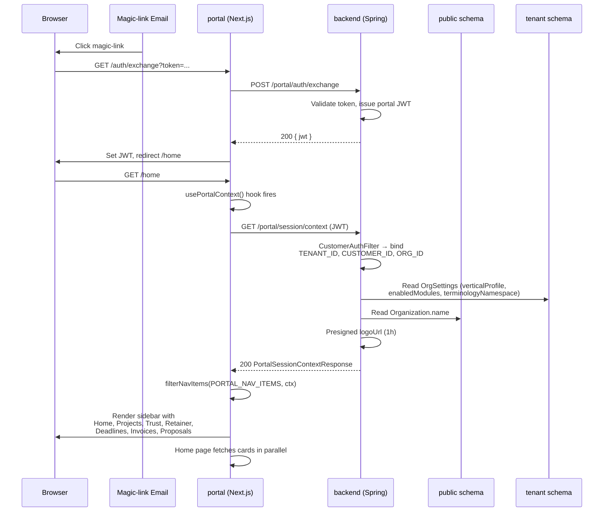
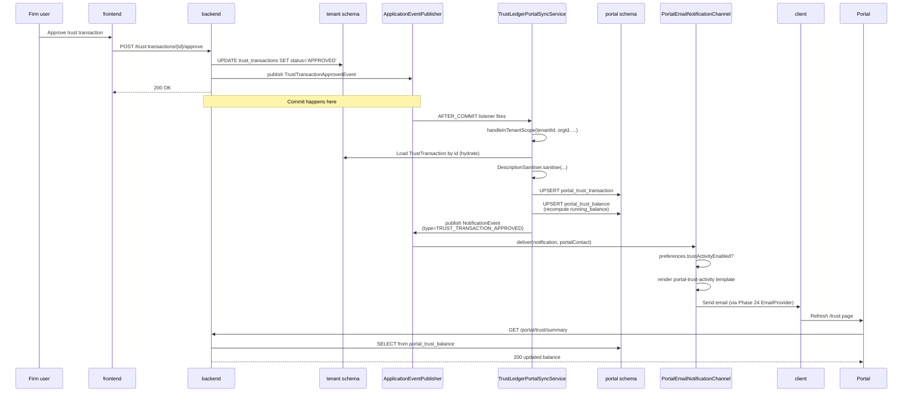
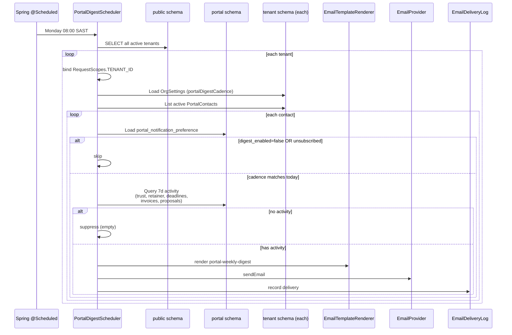
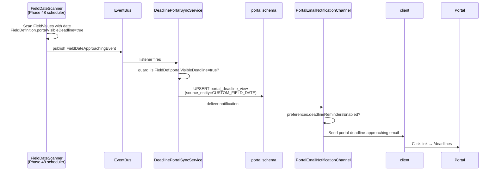

# Phase 68 — Portal Redesign & Vertical Parity

> **Canonical location**: this standalone `architecture/phase68-*.md` file. Phase 5+ convention is that each phase lives in its own file; `ARCHITECTURE.md` stops at Section 10 (Phase 4) and gets a one-paragraph pointer to each phase doc. The `11.x` numbering inside this file is a local organising device for cross-references *within* the doc — it is NOT a claim on an `ARCHITECTURE.md` section slot. If a future consolidation pass folds phase docs back into `ARCHITECTURE.md`, the numbering will be renormalised at that time.

---

## 11.1 — Overview

The Kazi customer portal has been frozen in time since Phase 22 (frontend scaffolding) and only quietly extended since — Phase 25 added online payments, Phase 28 added document acceptance, Phase 32 added proposals, Phase 34 added information requests. Meanwhile six months of vertical work has landed firm-side: trust accounting (Phase 60), interest posting and Section 86 refinements (Phase 61), regulatory deadlines (Phase 51), retainer agreements and hour-bank consumption (Phase 17). None of it is visible to clients. A law firm's client cannot see the trust balance the firm holds on their behalf; a consulting firm's client cannot see the hours remaining on their retainer; an accounting firm's client cannot see the filing deadlines the firm is working to. Every new surface shipped a firm-side tab and stopped there.

Phase 68 closes that gap without introducing any new firm-side entities. Everything the portal exposes is a **read-model extension** — new tables under the existing `portal.*` schema, populated by after-commit sync handlers that listen to the firm-side domain events that already exist. The pattern has been stable since [ADR-031](../adr/ADR-031-separate-portal-read-model-schema.md) ("separate portal read-model schema") and [ADR-109](../adr/ADR-109-portal-read-model-sync-granularity.md) ("portal read-model sync granularity"); Phase 68 replicates it for three new surfaces (trust, retainer, deadlines) and layers a nav restructure on top that scales beyond the current three top-nav entries.

The phase also ships the first client-POV 90-day lifecycle QA script — every firm-side vertical has one (Phase 47, 64, 66); no script has ever run from the portal side — plus a notification layer (weekly digest + per-event nudges for the new surfaces) so clients who don't have an active info request or pending acceptance still have a reason to come back. Mobile polish is a one-time investment across every portal page, not a per-feature concern.

### What's new

| Area | Existing (Phases 22 / 25 / 28 / 32 / 34) | Phase 68 adds |
|---|---|---|
| Portal nav | Top-nav with 3 entries: Projects, Proposals, Invoices | Slim left-rail sidebar (desktop) + mobile drawer; ≤10 entries gated by profile/module; Home page landing |
| Portal session awareness | `GET /portal/branding` (pre-auth, orgId query param, cacheable) | `GET /portal/session/context` (post-auth, tenant from JWT, per-tenant modules + terminology) |
| Portal module gating | None — controllers 404 on missing read-model rows | `VerticalModuleGuard` applied at controller level; `<PortalModuleGate>` component client-side |
| Trust visibility on portal | None | `portal.portal_trust_balance`, `portal.portal_trust_transaction`, `/portal/trust/*` endpoints, `trust/` + `trust/[matterId]/` pages |
| Retainer visibility on portal | None | `portal.portal_retainer_summary`, `portal.portal_retainer_consumption_entry`, `/portal/retainers/*` endpoints, `retainer/` + `retainer/[id]/` pages |
| Deadlines on portal | None | `portal.portal_deadline_view` (polymorphic), `/portal/deadlines` endpoints, `deadlines/` page |
| Portal notifications | Magic-link login (Phase 24); transactional for proposals (32), acceptance (28), info requests (34), invoices (24) | `PortalEmailNotificationChannel` for trust/deadline/retainer events + `PortalDigestScheduler` weekly job + `portal_notification_preference` table + `/settings/notifications` page |
| Mobile polish | Ad-hoc per page | One-time responsive pass across all portal pages; Playwright visual-regression baselines at `sm`/`md`/`lg` |
| Firm-side config surface | Custom-field settings UI, OrgSettings UI | `FieldDefinition.portalVisibleDeadline` toggle, `OrgSettings.portalRetainerMemberDisplay`, `OrgSettings.portalDigestCadence` |
| Client-POV QA script | None | `qa/testplan/demos/portal-client-90day-keycloak.md` — 11 checkpoints across 90 days |
| Migrations | Portal global high-water V18; tenant high-water V99 | Portal global V19 (`portal_vertical_parity`); tenant V110 (`phase68_firm_side_additions`, number shifted to leave space for Phase 67) |

### What's out of scope

See §11.13 for the full list. Highlights: no firm-side audit log viewer or portal activity-trail (Phase 69); no multi-contact / per-client roles on portal; no two-way DM; no portal i18n; no disbursement portal view (Phase 67 is still in flight); no PWA / offline / native shell; no `⌘K` palette on portal; no dark mode.

---

## 11.2 — Nav, Layout & Session Context

### 11.2.1 Target shape

The portal adopts a slim left-rail sidebar — deliberately distinct from the firm-app zoned sidebar + command palette shipped in Phase 44 ([ADR-252](../adr/ADR-252-portal-slim-left-rail-nav.md)).

```
┌───────────────────────────────────────┐
│  Logo / Org Name           Name · v   │  48px top bar: branding + user menu
├────────────┬──────────────────────────┤
│  ● Home    │                          │
│  ● Projects│                          │
│  ● Trust   │                          │
│  ● Retainer│       page content       │
│  ● Deadlines       (max-w-4xl)        │
│  ● Invoices│                          │
│  ● Proposals                          │
│  ● Requests│                          │
│  ● Acceptance                         │
│  ● Documents                          │
│            │                          │
│  Settings  │                          │
│  Logout    │                          │
└────────────┴──────────────────────────┘
```

- **Left rail**: 240px on `lg` and above; active route highlighted with a brand-colour indicator bar on the left edge; icon + label per entry.
- **Top bar**: 48px, logo + org name on the left, user menu (name + dropdown: profile, logout) on the right. Intentionally slim — it is branding + identity, not navigation.
- **Content area**: `max-w-4xl` centred inside the remaining viewport (narrower than today's `max-w-6xl` because the rail now occupies 240px).

Below `md`, the rail collapses into a hamburger-triggered drawer; the top bar stays visible with the hamburger to the left of the logo.

### 11.2.2 Nav item registry

Centralised in `portal/lib/nav-items.ts`. Every route that might appear in the sidebar is defined once here, with declarative profile/module predicates. This is the single source of truth for portal navigation.

```ts
// portal/lib/nav-items.ts
import type { LucideIcon } from "lucide-react";
import {
  Home, Folder, Landmark, Clock, CalendarClock,
  Receipt, FileText, ClipboardList, PenTool, Files,
} from "lucide-react";

export type PortalProfile =
  | "legal-za"
  | "legal-generic"
  | "accounting-za"
  | "consulting-za"
  | "consulting-generic";

export type PortalNavItem = {
  href: string;
  label: string;          // English default
  labelKey?: string;      // terminology lookup key (e.g. "portal.nav.matters")
  icon: LucideIcon;
  profiles?: PortalProfile[];   // undefined = show for every profile
  module?: string;              // must be in enabledModules; undefined = always enabled
  requiresFlag?: string;        // optional feature flag / branding flag
};

export type PortalSessionContext = {
  tenantProfile: PortalProfile;
  enabledModules: string[];
  terminologyKey: string;       // e.g. "en-ZA-legal"
  brandColor: string;
  orgName: string;
  logoUrl: string | null;
};

export const PORTAL_NAV_ITEMS: readonly PortalNavItem[] = [
  { href: "/home",       label: "Home",                 icon: Home },
  { href: "/projects",   label: "Projects",             labelKey: "portal.nav.projects", icon: Folder },
  { href: "/trust",      label: "Trust Account",        icon: Landmark,
    profiles: ["legal-za"],                          module: "trust_accounting" },
  { href: "/retainer",   label: "Retainer",             icon: Clock,
    profiles: ["legal-za", "consulting-za"],         module: "retainer_agreements" },
  { href: "/deadlines",  label: "Deadlines",            icon: CalendarClock,
    profiles: ["accounting-za", "legal-za"],         module: "regulatory_deadlines" },
  { href: "/invoices",   label: "Invoices",             icon: Receipt },
  { href: "/proposals",  label: "Proposals",            icon: FileText },
  { href: "/requests",   label: "Information Requests", icon: ClipboardList,
                                                     module: "information_requests" },
  { href: "/acceptance", label: "Pending Acceptance",   icon: PenTool,
                                                     module: "document_acceptance" },
  { href: "/documents",  label: "Documents",            icon: Files },
] as const;

export function filterNavItems(
  items: readonly PortalNavItem[],
  ctx: PortalSessionContext,
): PortalNavItem[] {
  return items.filter((item) => {
    if (item.profiles && !item.profiles.includes(ctx.tenantProfile)) return false;
    if (item.module && !ctx.enabledModules.includes(item.module)) return false;
    return true;
  });
}
```

Three of the module IDs used above — `retainer_agreements`, `information_requests`, `document_acceptance` — are **not registered in `VerticalModuleRegistry` today** (the context inventory flagged this). Phase 68 registers them in Epic A as part of the session-context work: entries in `VerticalModuleRegistry` with `ModuleCategory.HORIZONTAL` (because retainers are used by both legal and consulting, and information-requests/acceptance span every profile). `trust_accounting` and `regulatory_deadlines` already exist.

**Naming correction**: the Phase 68 requirements prose referred to the deadlines module as `"deadlines"`. The existing registered module ID is `regulatory_deadlines` (registered in Phase 51). Phase 68 uses the existing `regulatory_deadlines` ID throughout — no new registration, no rename. A `/breakdown` agent reading the requirements should substitute `regulatory_deadlines` wherever the requirements say `deadlines` in a module-ID context (route prefix stays `/portal/deadlines` — that is a URL path, not a module ID).

### 11.2.3 Session context endpoint

New controller `backend/.../customerbackend/controller/PortalSessionContextController.java` (co-located with other authenticated portal controllers). The requirements raised the option of extending the existing `PortalSummaryController`; rejected because `PortalSummaryController` today returns per-entity counts (projects / invoices / requests) for the home-page tiles, which is a different concern with different caching characteristics (session context is stable for the life of the JWT; entity counts change on every fetch). Keeping them as separate controllers lets each evolve independently and lets the session-context response be aggressively cached at the frontend.

```
GET /portal/session/context       → 200 PortalSessionContextResponse
                                   → 401 if JWT missing / invalid
```

Response shape:

```json
{
  "tenantProfile": "legal-za",
  "enabledModules": [
    "trust_accounting",
    "retainer_agreements",
    "information_requests",
    "document_acceptance",
    "regulatory_deadlines"
  ],
  "terminologyKey": "en-ZA-legal",
  "brandColor": "#0f766e",
  "orgName": "Example Attorneys",
  "logoUrl": "https://s3.../logos/abc.png?X-Amz-..."
}
```

**Why a new endpoint rather than extending `PortalBrandingController`.** `PortalBrandingController` is pre-auth (used on the login page, takes `orgId` as a query param, `Cache-Control: max-age=3600, public`). `/portal/session/context` is post-auth — the tenant comes from the portal JWT, not a query param — and must not be long-lived cacheable because the module list can change when a firm adjusts its vertical profile. Merging them would collapse two auth models and two cache strategies into one endpoint; keeping them separate is cleaner.

Resolution sequence:

1. `CustomerAuthFilter` has already bound `RequestScopes.TENANT_ID`, `RequestScopes.CUSTOMER_ID`, `RequestScopes.ORG_ID` from the JWT.
2. Controller reads `OrgSettings` from the current tenant schema (standard `OrgSettingsService.getOrCreate()` — tenancy boundary enforced by `search_path`).
3. Looks up `Organization.name` from the `public` schema via `OrganizationRepository.findByClerkOrgId(orgId)` (same pattern `PortalBrandingController` uses, because `ORG_ID` is bound at request scope but `Organization` lives in `public`).
4. Generates a 1-hour presigned URL for `OrgSettings.logoS3Key` via `StorageService`.
5. Returns the DTO. No `Cache-Control: public` header — the response is per-tenant and module-list-sensitive; the frontend caches it for the lifetime of the SPA via the `use-portal-context` hook.

### 11.2.4 Profile & module resolution — frontend

New hook `portal/hooks/use-portal-context.ts`:

```ts
// portal/hooks/use-portal-context.ts
"use client";

import useSWR from "swr";
import { portalGet } from "@/lib/api-client";
import type { PortalSessionContext } from "@/lib/nav-items";

export function usePortalContext() {
  const { data, error, isLoading } = useSWR<PortalSessionContext>(
    "/portal/session/context",
    (url) => portalGet<PortalSessionContext>(url),
    { revalidateOnFocus: false, revalidateIfStale: false },
  );
  return { ctx: data, error, isLoading };
}

export function useProfile(): PortalProfile | null {
  return usePortalContext().ctx?.tenantProfile ?? null;
}

export function useModules(): string[] {
  return usePortalContext().ctx?.enabledModules ?? [];
}

export function useIsModuleEnabled(moduleId: string): boolean {
  return useModules().includes(moduleId);
}
```

`use-branding` continues to exist as a thin shim that pulls `brandColor` + `orgName` + `logoUrl` out of `usePortalContext` — keeps existing pages working without a mass-rename.

### 11.2.5 `<PortalModuleGate>` component (new)

Portal had no client-side module gate today (only firm-side `frontend/components/module-gate.tsx`). Phase 68 introduces the portal equivalent:

```tsx
// portal/components/portal-module-gate.tsx
"use client";
import { useIsModuleEnabled } from "@/hooks/use-portal-context";

export function PortalModuleGate({
  module, fallback = null, children,
}: { module: string; fallback?: React.ReactNode; children: React.ReactNode }) {
  if (!useIsModuleEnabled(module)) return <>{fallback}</>;
  return <>{children}</>;
}
```

Page layouts for `/trust`, `/retainer`, `/deadlines`, `/requests`, `/acceptance` wrap in `<PortalModuleGate module="...">` and — via Next.js 16 middleware — redirect to `/home` if the module is not enabled (so a direct URL hit never shows a stale page; it lands on Home instead).

### 11.2.6 Terminology pass-through

Each `PortalNavItem.labelKey` is looked up via `terminologyKey + labelKey` against the existing Phase 43 327A terminology map. If the current session is `terminologyKey: "en-ZA-legal"` and an item has `labelKey: "portal.nav.projects"`, the resolved label is "Matters"; otherwise the English default "Projects" renders. The map is delivered client-side once on app mount via `/portal/session/context` (embedded in the response under a `terminology: Record<string, string>` field — omitted above for brevity, added in the actual response).

No new backend terminology infrastructure is introduced — portal consumes the existing map.

### 11.2.7 Home page composition

`portal/app/(authenticated)/home/page.tsx` — a composed landing page that answers "what do I need to do, and what's happened since I last checked?". Cards, each independently module-gated:

| Card | Data source | Shown when |
|---|---|---|
| Pending info requests | `GET /portal/requests?status=OPEN` | `module: information_requests` enabled and ≥1 open |
| Pending acceptance | `GET /portal/acceptance?status=PENDING` | `module: document_acceptance` enabled and ≥1 pending |
| Upcoming deadlines (next 14d) | `GET /portal/deadlines?from=today&to=+14d` | `module: regulatory_deadlines` enabled and ≥1 upcoming |
| Trust balance snapshot | `GET /portal/trust/summary` | `module: trust_accounting` enabled and ≥1 balance row |
| Retainer hour-bank snapshot | `GET /portal/retainers` | `module: retainer_agreements` enabled and ≥1 active retainer |
| Recent invoices | `GET /portal/invoices?limit=5` | Always |
| Recent proposals | `GET /portal/proposals?limit=3` | Always |

Each card is a Server Component boundary stub that the client-side page composes; empty states collapse (don't render). The root route `/` middleware redirects to `/home` for authenticated sessions.

### 11.2.8 Desktop + mobile layout primitives

- Desktop: `portal/app/(authenticated)/layout.tsx` renders `<PortalTopbar>` + `<PortalSidebar>` + `<main>` in a CSS grid.
- Mobile (`< md`): sidebar absent from grid; `<PortalMobileDrawer>` slides over `<main>` when `mobileMenuOpen` (pattern preserved from today's `portal-header.tsx`).
- Tablet (`md`): rail collapses to icon-only (48px wide), tooltips on hover; content widens.

---

## 11.3 — Domain Model

Phase 68 introduces **no new JPA entities**. This is a deliberate constraint rooted in [ADR-253](../adr/ADR-253-portal-surfaces-as-read-model-extensions.md) ("portal vertical surfaces are read-model extensions, not new entities"). Everything visible on the portal is either:

- a new **raw SQL table in the `portal.*` schema** (global-scope Flyway), populated by after-commit sync handlers, read by `JdbcClient` (not Hibernate), OR
- a **column addition to an existing firm-side entity** (tenant-scope Flyway) carrying per-tenant portal configuration.

### 11.3.1 Portal read-model tables (new)

All five tables live in the portal schema (`portal.*`), created by `V19__portal_vertical_parity.sql` in `backend/src/main/resources/db/migration/global/`. Access is via `@Qualifier("portalJdbcClient") JdbcClient` — never JPA. The `portal_notification_preference` table is the sixth new table but is pragmatically grouped with notifications; it is included in the same V19 migration.

#### `portal_trust_balance`

One row per (customer, matter). Updated on every trust transaction approval or interest post.

| Column | SQL type | Constraints | Notes |
|---|---|---|---|
| `customer_id` | `UUID` | PK (composite) | |
| `matter_id` | `UUID` | PK (composite) | Firm-side `Project.id` for legal-za matters |
| `org_id` | `VARCHAR(255)` | NOT NULL | For filtering + cross-tenant safety |
| `current_balance` | `DECIMAL(15,2)` | NOT NULL, DEFAULT 0 | ZAR |
| `last_transaction_at` | `TIMESTAMPTZ` | Nullable | |
| `last_synced_at` | `TIMESTAMPTZ` | NOT NULL, DEFAULT now() | |

Indexes: `idx_portal_trust_balance_customer` on `(customer_id, org_id)`.

#### `portal_trust_transaction`

Paginated history. One row per firm-side `TrustTransaction` with status `APPROVED`.

| Column | SQL type | Constraints | Notes |
|---|---|---|---|
| `id` | `UUID` | PK | Mirrors firm-side `TrustTransaction.id` |
| `customer_id` | `UUID` | NOT NULL | |
| `matter_id` | `UUID` | NOT NULL | |
| `org_id` | `VARCHAR(255)` | NOT NULL | |
| `transaction_type` | `VARCHAR(20)` | NOT NULL | From firm-side `TrustTransaction.transactionType` (mapped `length = 20`). Values per the `V85__create_trust_accounting_tables.sql` CHECK constraint: `DEPOSIT`, `WITHDRAWAL`, `TRANSFER_IN`, `TRANSFER_OUT`, `FEE_TRANSFER`, `PAYMENT`, `REFUND`, `INTEREST_CREDIT`, `INTEREST_LPFF`, `REVERSAL`. Portal mirrors the firm-side string verbatim — NO invented values (earlier drafts referenced `INTEREST_POSTED`; that value does not exist in the codebase). |
| `amount` | `DECIMAL(15,2)` | NOT NULL | Positive; direction inferred from `transaction_type` |
| `running_balance` | `DECIMAL(15,2)` | NOT NULL | Balance after this transaction |
| `occurred_at` | `TIMESTAMPTZ` | NOT NULL | From firm-side `transactionDate` (promoted to TIMESTAMPTZ using midnight in the tenant's timezone) |
| `description` | `TEXT` | Nullable | Sanitised — see §11.4.6 |
| `reference` | `VARCHAR(200)` | NOT NULL | Firm-side transaction reference |
| `last_synced_at` | `TIMESTAMPTZ` | NOT NULL, DEFAULT now() | |

Indexes: `idx_portal_trust_tx_customer_matter_date` on `(customer_id, matter_id, occurred_at DESC)`; `idx_portal_trust_tx_org` on `(org_id)`.

#### `portal_retainer_summary`

One row per active firm-side `RetainerAgreement`, rolled on period close.

| Column | SQL type | Constraints | Notes |
|---|---|---|---|
| `id` | `UUID` | PK | Mirrors `RetainerAgreement.id` |
| `customer_id` | `UUID` | NOT NULL | |
| `org_id` | `VARCHAR(255)` | NOT NULL | |
| `name` | `VARCHAR(200)` | NOT NULL | Agreement label |
| `period_type` | `VARCHAR(20)` | NOT NULL | `MONTHLY` / `QUARTERLY` / `ANNUAL` |
| `hours_allotted` | `DECIMAL(10,2)` | NOT NULL | |
| `hours_consumed` | `DECIMAL(10,2)` | NOT NULL, DEFAULT 0 | Current period |
| `hours_remaining` | `DECIMAL(10,2)` | NOT NULL | Computed `allotted + rollover − consumed` |
| `period_start` | `DATE` | NOT NULL | |
| `period_end` | `DATE` | NOT NULL | |
| `rollover_hours` | `DECIMAL(10,2)` | NOT NULL, DEFAULT 0 | Carried from previous period |
| `next_renewal_date` | `DATE` | Nullable | |
| `status` | `VARCHAR(20)` | NOT NULL | `ACTIVE` / `EXPIRED` / `PAUSED` |
| `last_synced_at` | `TIMESTAMPTZ` | NOT NULL, DEFAULT now() | |

Indexes: `idx_portal_retainer_customer` on `(customer_id, org_id)` WHERE `status = 'ACTIVE'`.

#### `portal_retainer_consumption_entry`

One row per time-entry that hit a retainer. Sanitised description; member display per `OrgSettings.portalRetainerMemberDisplay` ([ADR-255](../adr/ADR-255-portal-retainer-member-display.md)).

| Column | SQL type | Constraints | Notes |
|---|---|---|---|
| `id` | `UUID` | PK | Mirrors firm-side `TimeEntry.id` |
| `retainer_id` | `UUID` | NOT NULL | FK-style ref to `portal_retainer_summary.id` (no hard FK — they're in the same schema but we treat portal tables as write-independent) |
| `customer_id` | `UUID` | NOT NULL | |
| `org_id` | `VARCHAR(255)` | NOT NULL | |
| `occurred_at` | `DATE` | NOT NULL | Date of the time-entry |
| `hours` | `DECIMAL(10,2)` | NOT NULL | |
| `description` | `TEXT` | Nullable | Sanitised |
| `member_display_name` | `VARCHAR(200)` | NOT NULL | Rendered per `OrgSettings.portalRetainerMemberDisplay` at sync time |
| `last_synced_at` | `TIMESTAMPTZ` | NOT NULL, DEFAULT now() | |

Indexes: `idx_portal_retainer_consumption_retainer_date` on `(retainer_id, occurred_at DESC)`.

#### `portal_deadline_view`

Polymorphic — one row per deadline regardless of firm-side source ([ADR-256](../adr/ADR-256-polymorphic-portal-deadline-view.md)).

| Column | SQL type | Constraints | Notes |
|---|---|---|---|
| `id` | `UUID` | PK | |
| `customer_id` | `UUID` | NOT NULL | |
| `matter_id` | `UUID` | Nullable | For deadlines tied to a specific project; null for customer-level |
| `org_id` | `VARCHAR(255)` | NOT NULL | |
| `deadline_type` | `VARCHAR(20)` | NOT NULL | `FILING`, `COURT_DATE`, `PRESCRIPTION`, `CUSTOM_DATE` |
| `source_entity` | `VARCHAR(30)` | NOT NULL | `FILING_STATUS`, `COURT_DATE`, `PRESCRIPTION_TRACKER`, `CUSTOM_FIELD_DATE` — **note: `FILING_STATUS` (not `FILING_SCHEDULE`) because `FilingSchedule` does not exist in the codebase; Phase 51 uses `FilingStatus`** |
| `source_id` | `UUID` | NOT NULL | ID of the firm-side row (`FilingStatus.id`, etc.) |
| `label` | `VARCHAR(300)` | NOT NULL | Display label (e.g. "VAT201 — Feb 2026") |
| `due_date` | `DATE` | NOT NULL | |
| `status` | `VARCHAR(20)` | NOT NULL | `UPCOMING`, `DUE_SOON`, `OVERDUE`, `COMPLETED`, `CANCELLED` — derived at sync time from firm-side state + distance to due_date |
| `description_sanitised` | `TEXT` | Nullable | |
| `last_synced_at` | `TIMESTAMPTZ` | NOT NULL, DEFAULT now() | |

Indexes: `idx_portal_deadline_customer_due` on `(customer_id, due_date)` WHERE `status IN ('UPCOMING', 'DUE_SOON', 'OVERDUE')`; `idx_portal_deadline_source` on `(source_entity, source_id)` — for idempotent upserts.

#### `portal_notification_preference`

One row per `portal_contact_id`. Lives in the global portal schema so it can be read without tenant-scope binding during digest scheduling ([ADR-258](../adr/ADR-258-portal-notification-no-double-send.md) rationale, see §11.6).

| Column | SQL type | Constraints | Notes |
|---|---|---|---|
| `portal_contact_id` | `UUID` | PK | Mirrors firm-side `PortalContact.id` |
| `org_id` | `VARCHAR(255)` | NOT NULL | |
| `digest_enabled` | `BOOLEAN` | NOT NULL, DEFAULT true | |
| ~~`digest_cadence_override`~~ | — | — | Intentionally omitted. The requirements' out-of-scope list explicitly forbids per-contact cadence overrides beyond a single enable/disable toggle — `digest_enabled` is the only lever. Org-wide cadence lives on `OrgSettings.portalDigestCadence`. |
| `trust_activity_enabled` | `BOOLEAN` | NOT NULL, DEFAULT true | |
| `retainer_updates_enabled` | `BOOLEAN` | NOT NULL, DEFAULT true | |
| `deadline_reminders_enabled` | `BOOLEAN` | NOT NULL, DEFAULT true | |
| `action_required_enabled` | `BOOLEAN` | NOT NULL, DEFAULT true | Covers invoice / proposal / acceptance / info-request — events already wired in prior phases |
| `unsubscribed_all_at` | `TIMESTAMPTZ` | Nullable | Set by unsubscribe-all landing page |
| `updated_at` | `TIMESTAMPTZ` | NOT NULL, DEFAULT now() | |

**Placement: new table in the global portal schema** (`portal.portal_notification_preference`). Three placements were weighed:

1. **Columns on the firm-side `portal_contacts` JPA entity (tenant schema)** — rejected: mixes behavioural config with identity PII, forces every preference change through the tenant JPA path, and the portal preference controller (which reads via `JdbcClient`) does not have clean access to the tenant JPA layer.
2. **New table in the tenant schema, keyed by `portal_contact_id`** — rejected despite being technically cleaner from a referential-integrity standpoint (a tenant-schema FK to `portal_contacts` would be enforceable). The blocker: the digest scheduler iterates *all portal contacts across all tenants* and would have to fan out one tenant-bound `JdbcClient` call per tenant per run. Keeping preferences in the global schema — alongside the other portal read-model tables — lets the scheduler issue a single query joining preferences against `portal_trust_balance` / `portal_retainer_summary` / `portal_deadline_view` (all already global). The trade-off is explicit: we lose FK enforcement to `portal_contacts`, and upsert logic in the sync path must be tolerant of a preference row whose `portal_contact_id` no longer corresponds to a live contact. Orphan cleanup runs during the nightly portal-read-model reconciliation job.
3. **New table in the global portal schema (chosen)** — keyed by `portal_contact_id` (UUID mirror of the tenant `PortalContact.id`). Read/written directly by the portal controller via `JdbcClient`. Matches the pattern of every other portal read-model table since Phase 7.

The choice aligns with [ADR-253](../adr/ADR-253-portal-surfaces-as-read-model-extensions.md) (portal surfaces are read-model extensions, not new JPA entities) and scales cleanly as preferences grow.

### 11.3.2 Firm-side entity additions (tenant scope)

Three small column additions. All are plain column adds — no new entity classes.

#### `OrgSettings` (`settings/OrgSettings.java`)

- `portalRetainerMemberDisplay: String` (column `portal_retainer_member_display`, `VARCHAR(20)`, NOT NULL, DEFAULT `'FIRST_NAME_ROLE'`). Enum values: `FULL_NAME`, `FIRST_NAME_ROLE`, `ROLE_ONLY`, `ANONYMISED`. Controls how a time-logger is shown on the portal retainer consumption list ([ADR-255](../adr/ADR-255-portal-retainer-member-display.md)).
- `portalDigestCadence: String` (column `portal_digest_cadence`, `VARCHAR(20)`, NOT NULL, DEFAULT `'WEEKLY'`). Enum values: `WEEKLY`, `BIWEEKLY`, `OFF`. Org-wide default for digest scheduler cadence; per-contact override lives in `portal_notification_preference`.

#### `FieldDefinition` (`fielddefinition/FieldDefinition.java`)

- `portalVisibleDeadline: boolean` (column `portal_visible_deadline`, `BOOLEAN`, NOT NULL, DEFAULT `false`). Per [ADR-257](../adr/ADR-257-custom-field-portal-visibility-opt-in.md), only custom date fields with this flag set are candidates for promotion into `portal_deadline_view` as `CUSTOM_DATE` rows. Most custom dates are internal — opt-in keeps the portal feed signal-over-noise.

### 11.3.3 ER diagram — Phase 68 neighbourhood

Read-model tables + their firm-side sources of truth. Dashed lines are the sync direction (firm → portal, after commit). No cross-schema FKs — portal tables reference firm-side IDs but don't enforce referential integrity at the DB level (the firm schema lives in a different schema, and `JdbcClient` upserts are idempotent + tolerant of deletes).

```mermaid
erDiagram
    PortalContact ||--|| PortalNotificationPreference : "1:1"
    PortalContact ||--o{ PortalTrustBalance : "visible to"
    PortalContact ||--o{ PortalRetainerSummary : "visible to"
    PortalContact ||--o{ PortalDeadlineView : "visible to"

    PortalTrustBalance ||--o{ PortalTrustTransaction : "has transactions"
    PortalRetainerSummary ||--o{ PortalRetainerConsumptionEntry : "has entries"

    TrustTransaction }..|> PortalTrustTransaction : "sync on APPROVED"
    TrustTransaction }..|> PortalTrustBalance : "updates balance"
    RetainerAgreement }..|> PortalRetainerSummary : "sync on lifecycle"
    TimeEntry }..|> PortalRetainerConsumptionEntry : "sync when retainer-backed"
    FilingStatus }..|> PortalDeadlineView : "sync on Phase 51 events"
    FieldValue }..|> PortalDeadlineView : "sync when portalVisibleDeadline=true"

    OrgSettings {
        string portalRetainerMemberDisplay "FIRST_NAME_ROLE default"
        string portalDigestCadence "WEEKLY default"
    }

    FieldDefinition {
        boolean portalVisibleDeadline "opt-in"
    }

    PortalTrustBalance {
        UUID customer_id PK
        UUID matter_id PK
        DECIMAL current_balance
        TIMESTAMPTZ last_synced_at
    }
    PortalTrustTransaction {
        UUID id PK
        UUID customer_id
        UUID matter_id
        VARCHAR transaction_type
        DECIMAL amount
        DECIMAL running_balance
        TIMESTAMPTZ occurred_at
        TEXT description "sanitised"
    }
    PortalRetainerSummary {
        UUID id PK
        UUID customer_id
        VARCHAR name
        VARCHAR period_type
        DECIMAL hours_allotted
        DECIMAL hours_consumed
        DECIMAL hours_remaining
        DATE period_end
        VARCHAR status
    }
    PortalRetainerConsumptionEntry {
        UUID id PK
        UUID retainer_id FK
        DATE occurred_at
        DECIMAL hours
        VARCHAR member_display_name
    }
    PortalDeadlineView {
        UUID id PK
        UUID customer_id
        UUID matter_id "nullable"
        VARCHAR deadline_type
        VARCHAR source_entity
        DATE due_date
        VARCHAR status
    }
    PortalNotificationPreference {
        UUID portal_contact_id PK
        BOOLEAN digest_enabled
        BOOLEAN trust_activity_enabled
        BOOLEAN retainer_updates_enabled
        BOOLEAN deadline_reminders_enabled
    }
```

**Explicit note**: no new JPA `@Entity` classes are added in Phase 68. The only new Java types tied to storage are raw `record` DTOs colocated with the sync services and controllers — they don't map to anything Hibernate manages.

---

## 11.4 — Sync Architecture (Firm → Portal Read-Model)

All portal read-model writes follow the same shape that [`ProposalPortalSyncService`](../backend/src/main/java/io/b2mash/b2b/b2bstrawman/proposal/ProposalPortalSyncService.java) established:

1. A firm-side service (or a `@TransactionalEventListener(phase = AFTER_COMMIT)` handler) calls the sync service with hydrated domain data.
2. The sync service uses `@Qualifier("portalJdbcClient") JdbcClient` to issue a raw SQL upsert.
3. If the call is from an AFTER_COMMIT listener, the handler wraps the call in `handleInTenantScope(tenantId, orgId, () -> ...)` (the same helper `PortalEventHandler` uses) so any JPA hydration reads within the handler are tenant-scoped.

### 11.4.1 `TrustLedgerPortalSyncService`

Package: `verticals/legal/trustaccounting/portal/`. Listens to firm-side trust events.

Events subscribed to:

- `TrustTransactionApprovedEvent` → upsert `portal_trust_transaction` + update `portal_trust_balance` (increment/decrement based on `transactionType`).
- `InterestPostedEvent` → same as above; arrives with `transactionType = 'INTEREST_CREDIT'` or `'INTEREST_LPFF'` depending on the Phase 61 investment-basis distinction. Both values flow through unchanged.
- `ReconciliationCompletedEvent` → recompute `current_balance` from the firm-side source of truth and refresh `portal_trust_balance.current_balance`. This is the one path that does a full re-read (rather than trust the delta), because reconciliation can include corrective entries that are not single-transaction events.

Upsert shape (transaction row):

```java
jdbc.sql("""
    INSERT INTO portal.portal_trust_transaction
      (id, customer_id, matter_id, org_id, transaction_type, amount,
       running_balance, occurred_at, description, reference, last_synced_at)
    VALUES (?, ?, ?, ?, ?, ?, ?, ?, ?, ?, now())
    ON CONFLICT (id) DO UPDATE SET
      amount = EXCLUDED.amount,
      running_balance = EXCLUDED.running_balance,
      description = EXCLUDED.description,
      last_synced_at = now()
    """)
  .params(tx.id, tx.customerId, tx.projectId, orgId,
          tx.transactionType, tx.amount, runningBalance,
          Timestamp.from(tx.occurredAt()),
          sanitiseDescription(tx.description), tx.reference)
  .update();
```

Backfill: when a tenant enables the `trust_accounting` module, `PortalBackfillService` (new) runs a one-shot populate: for every matter with ≥1 `APPROVED` `TrustTransaction`, upsert the balance + last 50 transactions. Also exposed as an admin endpoint `POST /internal/portal-resync/trust` that existing `PortalResyncController` routes to (Phase 68 extends `PortalResyncController` rather than adding a new one).

### 11.4.2 `RetainerPortalSyncService`

Package: `retainer/portal/`. Listens to retainer lifecycle events + time-entry events.

Events subscribed to:

- `RetainerAgreementCreatedEvent` / `RetainerAgreementUpdatedEvent` → upsert `portal_retainer_summary`.
- `RetainerPeriodClosedEvent` → roll summary (reset `hours_consumed`, carry `rollover_hours` per policy, advance `period_start`/`period_end`/`next_renewal_date`); archive the closed-period consumption entries — keep them visible via `GET /portal/retainers/{id}/consumption?period=2026-Q1`.
- `TimeEntryLoggedEvent` (existing firm-side event) — when the time entry's project belongs to a customer with an active retainer, upsert a `portal_retainer_consumption_entry` row AND update the summary's `hours_consumed` / `hours_remaining`.
- `TimeEntryDeletedEvent` — delete the corresponding consumption entry and decrement consumption.

Member display resolution happens at sync time (not render time), so changing `OrgSettings.portalRetainerMemberDisplay` takes effect on new entries only — existing rows are refreshed by the admin `POST /internal/portal-resync/retainer` endpoint.

```java
String displayName = switch (orgSettings.getPortalRetainerMemberDisplay()) {
  case "FULL_NAME"        -> member.fullName();
  case "FIRST_NAME_ROLE"  -> "%s (%s)".formatted(member.firstName(), member.roleLabel());
  case "ROLE_ONLY"        -> member.roleLabel();
  case "ANONYMISED"       -> "Team member";
  default                 -> "%s (%s)".formatted(member.firstName(), member.roleLabel());
};
```

Backfill: on `retainer_agreements` module activation, populate current-period summary + current-period consumption entries for every active retainer.

### 11.4.3 `DeadlinePortalSyncService`

Package: `deadline/portal/`. Listens to heterogeneous deadline sources — Phase 51 filings, Phase 55 court / prescription (when those events exist), Phase 48 custom-field-date approaching.

Events subscribed to:

- `FilingStatusCreatedEvent` / `FilingStatusChangedEvent` (Phase 51) → upsert `portal_deadline_view` with `deadline_type='FILING'`, `source_entity='FILING_STATUS'`, `source_id=filingStatus.id`. **Note: the Phase 68 requirements referenced `FilingSchedule`; the codebase only has `FilingStatus`. This sync keys off `FilingStatus`.**
- `CourtDateCreatedEvent` / `CourtDateChangedEvent` (Phase 55 — dormant today, handler exists for when events land) → `deadline_type='COURT_DATE'`, `source_entity='COURT_DATE'`.
- `PrescriptionTrackerEvent` (Phase 55 — dormant) → `deadline_type='PRESCRIPTION'`.
- `FieldDateApproachingEvent` (Phase 48 — existing) → **guarded** by `fieldDefinition.portalVisibleDeadline == true`. Only flagged custom-field dates reach the portal ([ADR-257](../adr/ADR-257-custom-field-portal-visibility-opt-in.md)).

Polymorphic upsert — the same SQL shape handles every source; `source_entity` + `source_id` composite key is used for idempotency:

```java
jdbc.sql("""
    INSERT INTO portal.portal_deadline_view
      (id, customer_id, matter_id, org_id, deadline_type,
       source_entity, source_id, label, due_date, status,
       description_sanitised, last_synced_at)
    VALUES (?, ?, ?, ?, ?, ?, ?, ?, ?, ?, ?, now())
    ON CONFLICT (source_entity, source_id) DO UPDATE SET
      due_date = EXCLUDED.due_date,
      status = EXCLUDED.status,
      label = EXCLUDED.label,
      description_sanitised = EXCLUDED.description_sanitised,
      last_synced_at = now()
    """).params(...).update();
```

Status derivation (`UPCOMING`, `DUE_SOON`, `OVERDUE`, `COMPLETED`, `CANCELLED`) happens in the sync service, not the controller — so the controller's query is a pure read.

Backfill: on module activation, enumerate `FilingStatus` rows for the tenant + scan `FieldDefinition`s with `portalVisibleDeadline=true` and populate.

### 11.4.4 Sync service class template

Every Phase 68 sync service follows this shape (derived from `ProposalPortalSyncService`):

```java
@Service
public class TrustLedgerPortalSyncService {

  private final JdbcClient jdbc;
  private final TrustTransactionRepository trustTxRepo;   // for hydration if needed
  private final DescriptionSanitiser sanitiser;            // new shared service, §11.4.6

  public TrustLedgerPortalSyncService(
      @Qualifier("portalJdbcClient") JdbcClient jdbc,
      TrustTransactionRepository trustTxRepo,
      DescriptionSanitiser sanitiser) {
    this.jdbc = jdbc;
    this.trustTxRepo = trustTxRepo;
    this.sanitiser = sanitiser;
  }

  public void syncTransaction(TrustTransaction tx, String orgId) { /* upsert */ }
  public void refreshBalance(UUID customerId, UUID matterId, String orgId) { /* compute + update */ }
}
```

Each sync service is paired with a `@Component` event-handler class (pattern from `ProposalPortalSyncEventHandler`) that owns the `@TransactionalEventListener` methods and calls the sync service. Keeps the sync service independently testable.

### 11.4.5 Backfill strategy

One-shot sync on module enable. Exposed via `PortalResyncController` (extend existing, don't add new):

```
POST /internal/portal-resync/trust?customerId={uuid}     → re-sync one customer
POST /internal/portal-resync/trust                       → re-sync entire tenant
POST /internal/portal-resync/retainer
POST /internal/portal-resync/deadline
```

Admin-only (existing auth on the `/internal/` path). Used by:

- Phase 68 rollout migration to populate read-model rows for tenants with the modules already enabled.
- Support escalation if a sync event is dropped.
- Schema changes (e.g. changing `portalRetainerMemberDisplay` and wanting existing entries refreshed).

### 11.4.6 Description sanitisation pipeline

Per [ADR-254](../adr/ADR-254-portal-description-sanitisation.md), every portal-visible text field that originates from firm-side free-text flows through a single shared `DescriptionSanitiser`:

```java
// backend/.../portal/sanitisation/DescriptionSanitiser.java
@Component
public class DescriptionSanitiser {

  private static final int MAX_LEN = 140;
  private static final Pattern INTERNAL_PREFIX = Pattern.compile("(?i)^\\s*\\[internal\\]");

  public String sanitise(String raw, String fallback) {
    if (raw == null) return fallback;
    if (INTERNAL_PREFIX.matcher(raw).find()) return fallback;
    String cleaned = raw.strip();
    if (cleaned.isEmpty()) return fallback;
    return cleaned.length() > MAX_LEN ? cleaned.substring(0, MAX_LEN - 1) + "…" : cleaned;
  }
}
```

Fields sanitised:

- `portal_trust_transaction.description` (source: `TrustTransaction.description`)
- `portal_retainer_consumption_entry.description` (source: `TimeEntry.description`)
- `portal_deadline_view.description_sanitised` (source: deadline notes, varies per source)

The sanitiser is injected into every sync service; a simple unit-test contract ensures the `[internal]` stripping and 140-char truncation stay in lockstep.

---

## 11.5 — Portal REST API Surface

All new endpoints use the **`/portal/*` prefix** (matching existing `PortalInvoiceController`, `PortalProposalController`, etc.). The Phase 68 requirements prose used `/api/portal/*` but that does not match the codebase convention; Phase 68 standardises on `/portal/*`. Every endpoint is module-gated — if the authenticated portal contact's tenant does not have the relevant module enabled, the endpoint returns **404** (not 403 — we don't want to leak "the firm has a trust account but we won't show it to you").

### 11.5.1 Session context

| Method | Path | Description | Auth | R/W |
|---|---|---|---|---|
| GET | `/portal/session/context` | Returns tenant profile, enabled modules, terminology key, branding | Portal JWT | R |

Response: `PortalSessionContextResponse` (see §11.2.3).

### 11.5.2 Trust

| Method | Path | Description | Auth | R/W | Module |
|---|---|---|---|---|---|
| GET | `/portal/trust/summary` | Per-matter balance summary for the authenticated customer | Portal JWT | R | `trust_accounting` |
| GET | `/portal/trust/matters/{matterId}/transactions` | Paginated transaction list | Portal JWT | R | `trust_accounting` |
| GET | `/portal/trust/matters/{matterId}/statement-documents` | List of firm-generated Statement of Account documents (Phase 67 artefacts, if present) | Portal JWT | R | `trust_accounting` |

`GET /portal/trust/summary`:

```json
[
  {
    "matterId": "b3c6...",
    "matterName": "Estate of Smith",
    "currentBalance": 45000.00,
    "currency": "ZAR",
    "lastTransactionAt": "2026-04-15T09:22:00Z"
  }
]
```

`GET /portal/trust/matters/{matterId}/transactions?page=0&size=25&from=2026-01-01&to=2026-03-31`:

```json
{
  "content": [
    {
      "id": "...",
      "transactionType": "DEPOSIT",
      "amount": 50000.00,
      "runningBalance": 50000.00,
      "occurredAt": "2026-01-15T00:00:00Z",
      "description": "Initial deposit — Edenvale transfer",
      "reference": "TX-2026-0012"
    }
  ],
  "page": 0,
  "size": 25,
  "totalElements": 48
}
```

### 11.5.3 Retainer

| Method | Path | Description | Auth | R/W | Module |
|---|---|---|---|---|---|
| GET | `/portal/retainers` | Active retainer summaries for the customer | Portal JWT | R | `retainer_agreements` |
| GET | `/portal/retainers/{id}/consumption` | Consumption entries for a retainer (default: current period) | Portal JWT | R | `retainer_agreements` |

`GET /portal/retainers`:

```json
[
  {
    "id": "...",
    "name": "Monthly Advisory Retainer",
    "periodType": "MONTHLY",
    "hoursAllotted": 20.0,
    "hoursConsumed": 11.5,
    "hoursRemaining": 8.5,
    "periodStart": "2026-04-01",
    "periodEnd": "2026-04-30",
    "rolloverHours": 0.0,
    "nextRenewalDate": "2026-05-01",
    "status": "ACTIVE"
  }
]
```

`GET /portal/retainers/{id}/consumption?from=2026-04-01&to=2026-04-30`:

```json
[
  {
    "id": "...",
    "occurredAt": "2026-04-03",
    "hours": 2.5,
    "description": "Phone call — acquisition structure",
    "memberDisplayName": "Alice (Attorney)"
  }
]
```

### 11.5.4 Deadlines

| Method | Path | Description | Auth | R/W | Module |
|---|---|---|---|---|---|
| GET | `/portal/deadlines` | Upcoming/overdue deadlines for the customer (default: next 60 days) | Portal JWT | R | `regulatory_deadlines` |
| GET | `/portal/deadlines/{id}` | Detail for side-panel | Portal JWT | R | `regulatory_deadlines` |

`GET /portal/deadlines?from=2026-04-18&to=2026-06-17&status=UPCOMING,DUE_SOON`:

```json
[
  {
    "id": "...",
    "matterId": "...",
    "matterName": "Estate of Smith",
    "deadlineType": "FILING",
    "sourceEntity": "FILING_STATUS",
    "label": "VAT201 — Apr 2026",
    "dueDate": "2026-05-25",
    "status": "UPCOMING",
    "description": "Monthly VAT submission to SARS"
  }
]
```

### 11.5.5 Notifications

| Method | Path | Description | Auth | R/W |
|---|---|---|---|---|
| GET | `/portal/notifications/preferences` | Current preferences for the authenticated contact | Portal JWT | R |
| PUT | `/portal/notifications/preferences` | Update preferences | Portal JWT | W |
| POST | `/portal/notifications/unsubscribe-all` | Set `unsubscribed_all_at = now()`; reachable via email link | Public + signed token | W |

`GET /portal/notifications/preferences`:

```json
{
  "digestEnabled": true,
  "trustActivityEnabled": true,
  "retainerUpdatesEnabled": true,
  "deadlineRemindersEnabled": true,
  "actionRequiredEnabled": true,
  "effectiveCadence": "WEEKLY"
}
```

`effectiveCadence` is the org-wide `OrgSettings.portalDigestCadence` — per-contact cadence override is out of scope for Phase 68 (per the requirements). The field is returned to the frontend so the preferences UI can render "Your firm sends a weekly digest" copy without a second round-trip.

### 11.5.6 Controller implementation pattern

New portal controllers under `backend/.../customerbackend/controller/` (read-model controllers) and under vertical packages for gated controllers (trust under `verticals/legal/trustaccounting/portal/`). Every new controller:

1. `@RequestMapping("/portal/...")` — no `/api/` prefix.
2. Constructor-injects `VerticalModuleGuard` AND the relevant read-model service (`PortalReadModelService` or a new peer like `PortalTrustReadModelService`).
3. Each handler starts with `moduleGuard.requireModule("trust_accounting")` — throws `ModuleNotEnabledException` which a shared `@RestControllerAdvice` translates to `404 Not Found` body `{"error": "not_found"}` (not the default 403 the guard raises, because 403 leaks module existence).
4. Pulls `RequestScopes.requireCustomerId()` + `RequestScopes.requireOrgId()`.
5. Delegates to the read-model service; returns `ResponseEntity.ok(...)`.
6. Nested `record` DTOs at the bottom of the file.

---

## 11.6 — Notifications: Digest + Per-Event

### 11.6.1 Strategy: no double-send

[ADR-258](../adr/ADR-258-portal-notification-no-double-send.md) records the rule: events that already email portal contacts in prior phases (24 invoices, 28 acceptance, 32 proposals, 34 info requests) are left alone — Phase 68 does not re-route them through the new `PortalEmailNotificationChannel`. Phase 68 adds channel wiring only for events not previously routed to portal contacts (trust, deadlines, retainers).

### 11.6.2 Digest scheduler

New class `backend/.../portal/notification/PortalDigestScheduler.java`:

```java
@Component
public class PortalDigestScheduler {

  private final PortalContactRepository portalContactRepo;
  private final OrgSettingsService orgSettingsService;
  private final JdbcClient portalJdbc;
  private final PortalEmailService portalEmailService;
  private final PortalDigestBuilder digestBuilder;

  // ...constructor

  @Scheduled(cron = "0 0 8 * * MON", zone = "Africa/Johannesburg")
  public void runWeeklyDigest() {
    // Iterate all tenants (via OrgSchemaMappingRepository, public schema)
    // For each tenant, bind tenant scope, iterate active PortalContacts
    // Resolve effective cadence per contact (preference override > org setting)
    // If today's firing matches cadence (WEEKLY always; BIWEEKLY every other week; OFF skip)
    // Query portal read-model for activity in lookback window (7d)
    // Suppress if empty
    // Render + send
  }
}
```

Per-contact loop:

1. Read preferences from `portal.portal_notification_preference` (global schema — no tenant bind needed).
2. If `unsubscribed_all_at` set → skip.
3. If `digest_enabled = false` → skip.
4. Resolve effective cadence; if today's Monday doesn't match → skip.
5. Query portal read-model (`JdbcClient`) for activity in the 7-day window across enabled categories (trust transactions, retainer period closes, deadlines crossing to `DUE_SOON`, invoices, proposals, acceptances, info requests).
6. If nothing to report → skip (suppress empty digest).
7. Render template `portal-weekly-digest` via Phase 24 `EmailTemplateRenderer`.
8. Send via `PortalEmailService.sendDigest(contact, renderedEmail, unsubscribeUrl)`.
9. Record in `EmailDeliveryLog` with `referenceType="PORTAL_DIGEST"`.

**Why the scheduler lives in `portal/notification/` rather than `notification/`**: portal notifications target `PortalContact` (not `Member`), use portal templates, and should be visibly segregated from the firm-side notification package. Keeps ownership clean.

### 11.6.3 `PortalEmailNotificationChannel`

Sibling to existing `notification/channel/EmailNotificationChannel` — same `NotificationChannel` interface, but routes to portal contacts. Under `portal/notification/channel/`:

```java
@Component
public class PortalEmailNotificationChannel implements NotificationChannel {

  @Override public String channelId() { return "PORTAL_EMAIL"; }

  @Override
  public boolean isEnabled(Notification n, PortalContact contact) {
    var prefs = preferenceRepo.findByContactId(contact.getId());
    return switch (n.getType()) {
      case "TRUST_TRANSACTION_APPROVED"  -> prefs.isTrustActivityEnabled();
      case "FILING_DEADLINE_APPROACHING" -> prefs.isDeadlineRemindersEnabled();
      case "RETAINER_PERIOD_CLOSED"      -> prefs.isRetainerUpdatesEnabled();
      default -> true;
    };
  }

  @Override
  public void deliver(Notification n, PortalContact contact) {
    var context = contextBuilder.buildBaseContext(contact.getDisplayName(), unsubscribeUrl(contact));
    context.putAll(eventVariables(n));
    var rendered = renderer.render(templateFor(n.getType()), context);
    var message = EmailMessage.withTracking(
        contact.getEmail(), rendered.subject(), rendered.htmlBody(), rendered.plainTextBody(),
        null, "PORTAL_NOTIFICATION", n.getId().toString(), RequestScopes.TENANT_ID.get());
    try {
      emailProvider.sendEmail(message);
      deliveryLog.record(message, "SENT");
    } catch (Exception e) {
      deliveryLog.record(message, "FAILED");
    }
  }

  private String templateFor(String notificationType) {
    return switch (notificationType) {
      case "TRUST_TRANSACTION_APPROVED"  -> "portal-trust-activity";
      case "FILING_DEADLINE_APPROACHING" -> "portal-deadline-approaching";
      case "RETAINER_PERIOD_CLOSED"      -> "portal-retainer-period-closed";
      default -> "portal-generic-nudge";
    };
  }
}
```

Events wired to this channel (new for Phase 68):

| Event | Template | Preference gate |
|---|---|---|
| `TrustTransactionApprovedEvent` | `portal-trust-activity` | `trustActivityEnabled` |
| `FieldDateApproachingEvent` (only for `portalVisibleDeadline=true` fields) | `portal-deadline-approaching` | `deadlineRemindersEnabled` |
| `FilingStatusApproachingEvent` (Phase 51 — if event exists; if not, the deadline sync service fires a synthetic event) | `portal-deadline-approaching` | `deadlineRemindersEnabled` |
| `RetainerPeriodClosedEvent` | `portal-retainer-period-closed` | `retainerUpdatesEnabled` |

Events NOT wired (left to Phase 24 / 28 / 32 / 34 as-is):

- `InvoiceApprovedEvent`, `InvoiceSentEvent`, `InvoicePaidEvent`, `InvoiceVoidedEvent` — Phase 24 already emails the customer.
- `AcceptanceRequestSentEvent` — Phase 28 already emails.
- `ProposalSentEvent` — Phase 32 already emails.
- `InformationRequestSentEvent` — Phase 34 already emails.

### 11.6.4 Email templates (new)

All four are Thymeleaf, live under `backend/src/main/resources/email-templates/` (same directory as existing `portal-magic-link`), registered via the Phase 24 `EmailTemplate` entity seed:

| Template slug | Subject variable | Body variables |
|---|---|---|
| `portal-weekly-digest` | `{{orgName}} — your weekly update` | `orgName`, `contactName`, `activityGroups[]` (each with `groupLabel` + `items[]`), `unsubscribeUrl`, `portalUrl` |
| `portal-trust-activity` | `New trust activity on {{matterName}}` | `orgName`, `contactName`, `matterName`, `transactionType`, `amount`, `runningBalance`, `occurredAt`, `portalUrl` |
| `portal-deadline-approaching` | `Upcoming deadline: {{label}}` | `orgName`, `contactName`, `deadlineLabel`, `dueDate`, `daysUntil`, `portalUrl` |
| `portal-retainer-period-closed` | `{{retainerName}} — period closed` | `orgName`, `contactName`, `retainerName`, `periodLabel`, `hoursConsumed`, `hoursAllotted`, `rolloverHours`, `portalUrl` |

Template naming follows the existing `portal-*` convention (matches `portal-magic-link`).

### 11.6.5 Unsubscribe flow

Reuses Phase 24 172's signed-token unsubscribe mechanism. Every portal email carries:

- A `List-Unsubscribe` RFC 2369 header with a signed URL.
- An in-body unsubscribe link leading to `POST /portal/notifications/unsubscribe-all?token=...` (no auth; token is HMAC-signed with contact ID + timestamp).
- The unsubscribe landing page is `portal/app/unsubscribe/[token]/page.tsx`, which confirms the action and optionally lets the user log in to adjust granular preferences.

---

## 11.7 — Sequence Diagrams

### 11.7.1 Session context resolution

How a client lands on the portal and sees the right nav for their firm's vertical.



### 11.7.2 Trust transaction sync

How a firm-side approval ends up visible on the portal.



### 11.7.3 Weekly digest



### 11.7.4 Deadline approaching nudge (optional)

Useful reference for how custom-field-date deadlines become both a portal row and an email.



---

## 11.8 — Mobile Polish & Responsive Architecture

### 11.8.1 Breakpoint strategy

Tailwind default breakpoints, with explicit contracts per page:

| Breakpoint | Px | Behaviour |
|---|---|---|
| `sm` | < 640 | Sidebar collapses to drawer; tables → card-list where feasible; sticky bottom action bar if single primary CTA |
| `md` | 640–1024 | Sidebar becomes icon-only rail (48px); content uses `max-w-2xl` |
| `lg` | ≥ 1024 | Full sidebar (240px); content `max-w-4xl` |

### 11.8.2 Layout primitives

All pages compose from the same set:

- Shadcn `Card`, `CardHeader`, `CardContent`, `CardFooter`
- Shadcn `Button`, `Badge`, `Skeleton`
- New `<PortalPageHeader>` (title + breadcrumb + optional right-side actions)
- New `<PortalEmptyState>` (icon + headline + body + optional CTA)
- New `<PortalErrorState>` (standard error surface with retry callback)
- New `<PortalLoadingSkeleton>` variants (`Card`, `List`, `Table`)

### 11.8.3 Screenshot baseline strategy

Playwright visual regression, Playwright config gets a new project `portal-visual`:

```
e2e/screenshots/portal-v2/
├── sm/
│   ├── home-populated.png
│   ├── trust-matter-list.png
│   ├── trust-matter-detail.png
│   ├── retainer-list.png
│   ├── retainer-detail.png
│   ├── deadlines-list.png
│   ├── invoices-list.png
│   ├── proposal-detail.png
│   └── settings-notifications.png
├── md/  (same set)
└── lg/  (same set)
```

Three profiles × three breakpoints × ~10 key pages ≈ 90 baselines. Stored in-repo with `expect(page).toHaveScreenshot(...)` — the Playwright default. Snapshots are committed under `e2e/screenshots/portal-v2/` and CI compares.

### 11.8.4 Tap-target + accessibility rules

- Every interactive element ≥ 44×44 px tap target on mobile (the WCAG 2.2 AA target).
- Focus ring on all nav items + buttons (no `focus:outline-none` without replacement).
- Skip-to-content link on `<PortalTopbar>` (screen-reader first-child).
- Drawer open/close announces to aria-live.
- Colour contrast: ≥ 4.5:1 on body text against backgrounds (branded theme test fixtures validate this against two firm brand colours).

### 11.8.5 Empty / loading / error state pattern

Every data-fetching page composes the same pattern:

```tsx
// pseudo
const { data, isLoading, error } = usePortalData(...);

if (isLoading) return <PortalLoadingSkeleton variant="list" />;
if (error)     return <PortalErrorState retry={mutate} />;
if (!data || data.length === 0) return <PortalEmptyState ... />;
return <PageContent data={data} />;
```

The three state components live in `portal/components/state/` and are covered by unit tests.

---

## 11.9 — Security & Tenancy Considerations

### 11.9.1 Physical schema isolation

The portal read-model lives in the **`portal.*` schema**, distinct from every tenant's firm schema. Portal controllers' `JdbcClient` is bound to a data source whose `search_path` is `portal, public`. There is no SQL path from any portal controller to any firm-side table; cross-tenant data can only reach the portal by:

1. An explicit sync call (`TrustLedgerPortalSyncService.syncTransaction(...)`) initiated by a firm-side handler inside a tenant-bound scope, with the sync writing rows scoped to `org_id` + `customer_id`.
2. An explicit admin backfill call via `PortalResyncController` — tenant-bound and `org_id`-stamped the same way.

This is the design invariant: **portal controllers never touch firm schemas, firm controllers never write to portal schemas directly — only sync services do, and only in a tenant-bound scope**.

### 11.9.2 Controller-level module enablement

Every module-gated portal controller invokes `VerticalModuleGuard.requireModule("...")` as the first statement in each handler. Failure throws `ModuleNotEnabledException`, which Phase 68 wires to a portal-specific `@RestControllerAdvice` translating it to **404 Not Found** (rather than the 403 the default handler returns). 404 prevents a module-existence leak: a non-legal tenant's portal hitting `/portal/trust/summary` should see the same response as hitting `/portal/does-not-exist`.

### 11.9.3 Sanitisation vs gate

Two different concerns, two different mechanisms:

- **Access-level gating** (module guard): is this tenant allowed to see any trust data at all?
- **Content-level sanitisation** (description sanitiser): given a row that IS shown, strip firm-internal notes from free-text fields.

The sanitiser runs at sync time, not render time — so the portal read-model never stores an `[internal]`-prefixed description in the first place. Even if a portal frontend bug rendered raw `description`, there is nothing harmful to render.

### 11.9.4 Cross-tenant leakage prevention in sync

Every after-commit sync handler re-binds tenant scope using the event's `tenantId` + `orgId` fields (the pattern `PortalEventHandler.handleInTenantScope(...)` established). The upsert itself carries `org_id` as a column — so even if a sync handler somehow ran under the wrong tenant scope, the row it writes would be tagged with the correct tenant's `org_id` (from the event), not whatever schema the handler happens to be bound to. Portal controllers always filter `WHERE org_id = :orgId` (from the JWT), so a mis-tagged row could not leak anyway.

### 11.9.5 Session context endpoint — minimum information

The response deliberately excludes firm-side config not needed for portal rendering. It DOES include:

- Tenant profile (to drive nav + terminology)
- Enabled modules (to drive nav + gates)
- Terminology key + map (for label lookup)
- Branding (org name, logo, brand colour)

It does NOT include:

- Firm-side enabled capabilities (e.g. `APPROVE_TRUST_PAYMENT`) — portal contacts never hold firm-side roles.
- Firm member directory.
- Any `OrgSettings` field not consumed by portal rendering (billing model, retention policies, etc.).

### 11.9.6 Rate limiting

Portal session context + new read-model endpoints ride the existing per-tenant rate limiter established in Phase 7. Digest-sending also goes through `EmailRateLimiter.tryAcquire(tenantSchema, providerId)` (from Phase 24) — so a 500-contact tenant can't accidentally DoS its email provider on Monday mornings.

### 11.9.7 Portal JWT scoping

Continues to identify `customerId` + `tenantId` only (established in Phase 22). No member ID, no role — portal users have no firm-side capabilities. `CustomerAuthFilter` binds `RequestScopes.CUSTOMER_ID` + `TENANT_ID` + `ORG_ID`.

---

## 11.10 — Database Migrations

### 11.10.1 Portal global migration — V19

File: `backend/src/main/resources/db/migration/global/V19__portal_vertical_parity.sql`

Creates all six new portal-schema tables + their indexes.

```sql
-- backend/src/main/resources/db/migration/global/V19__portal_vertical_parity.sql

SET search_path TO portal;

-- ── portal_trust_balance ──────────────────────────────────────────────
CREATE TABLE portal_trust_balance (
    customer_id         UUID         NOT NULL,
    matter_id           UUID         NOT NULL,
    org_id              VARCHAR(255) NOT NULL,
    current_balance     DECIMAL(15,2) NOT NULL DEFAULT 0,
    last_transaction_at TIMESTAMPTZ,
    last_synced_at      TIMESTAMPTZ  NOT NULL DEFAULT now(),
    PRIMARY KEY (customer_id, matter_id)
);
CREATE INDEX idx_portal_trust_balance_customer
    ON portal_trust_balance (customer_id, org_id);

-- ── portal_trust_transaction ──────────────────────────────────────────
CREATE TABLE portal_trust_transaction (
    id                UUID         PRIMARY KEY,
    customer_id       UUID         NOT NULL,
    matter_id         UUID         NOT NULL,
    org_id            VARCHAR(255) NOT NULL,
    transaction_type  VARCHAR(30)  NOT NULL,
    amount            DECIMAL(15,2) NOT NULL,
    running_balance   DECIMAL(15,2) NOT NULL,
    occurred_at       TIMESTAMPTZ  NOT NULL,
    description       TEXT,
    reference         VARCHAR(200) NOT NULL,
    last_synced_at    TIMESTAMPTZ  NOT NULL DEFAULT now()
);
CREATE INDEX idx_portal_trust_tx_customer_matter_date
    ON portal_trust_transaction (customer_id, matter_id, occurred_at DESC);
CREATE INDEX idx_portal_trust_tx_org
    ON portal_trust_transaction (org_id);

-- ── portal_retainer_summary ───────────────────────────────────────────
CREATE TABLE portal_retainer_summary (
    id                  UUID         PRIMARY KEY,
    customer_id         UUID         NOT NULL,
    org_id              VARCHAR(255) NOT NULL,
    name                VARCHAR(200) NOT NULL,
    period_type         VARCHAR(20)  NOT NULL,
    hours_allotted      DECIMAL(10,2) NOT NULL,
    hours_consumed      DECIMAL(10,2) NOT NULL DEFAULT 0,
    hours_remaining     DECIMAL(10,2) NOT NULL,
    period_start        DATE         NOT NULL,
    period_end          DATE         NOT NULL,
    rollover_hours      DECIMAL(10,2) NOT NULL DEFAULT 0,
    next_renewal_date   DATE,
    status              VARCHAR(20)  NOT NULL,
    last_synced_at      TIMESTAMPTZ  NOT NULL DEFAULT now(),
    CHECK (status IN ('ACTIVE', 'EXPIRED', 'PAUSED')),
    CHECK (period_type IN ('MONTHLY', 'QUARTERLY', 'ANNUAL'))
);
CREATE INDEX idx_portal_retainer_customer_active
    ON portal_retainer_summary (customer_id, org_id)
    WHERE status = 'ACTIVE';

-- ── portal_retainer_consumption_entry ─────────────────────────────────
CREATE TABLE portal_retainer_consumption_entry (
    id                   UUID         PRIMARY KEY,
    retainer_id          UUID         NOT NULL,
    customer_id          UUID         NOT NULL,
    org_id               VARCHAR(255) NOT NULL,
    occurred_at          DATE         NOT NULL,
    hours                DECIMAL(10,2) NOT NULL,
    description          TEXT,
    member_display_name  VARCHAR(200) NOT NULL,
    last_synced_at       TIMESTAMPTZ  NOT NULL DEFAULT now()
);
CREATE INDEX idx_portal_retainer_consumption_retainer_date
    ON portal_retainer_consumption_entry (retainer_id, occurred_at DESC);

-- ── portal_deadline_view ──────────────────────────────────────────────
CREATE TABLE portal_deadline_view (
    id                     UUID         PRIMARY KEY,
    customer_id            UUID         NOT NULL,
    matter_id              UUID,
    org_id                 VARCHAR(255) NOT NULL,
    deadline_type          VARCHAR(20)  NOT NULL,
    source_entity          VARCHAR(30)  NOT NULL,
    source_id              UUID         NOT NULL,
    label                  VARCHAR(300) NOT NULL,
    due_date               DATE         NOT NULL,
    status                 VARCHAR(20)  NOT NULL,
    description_sanitised  TEXT,
    last_synced_at         TIMESTAMPTZ  NOT NULL DEFAULT now(),
    CHECK (deadline_type IN ('FILING', 'COURT_DATE', 'PRESCRIPTION', 'CUSTOM_DATE')),
    CHECK (source_entity IN ('FILING_STATUS', 'COURT_DATE', 'PRESCRIPTION_TRACKER', 'CUSTOM_FIELD_DATE')),
    CHECK (status IN ('UPCOMING', 'DUE_SOON', 'OVERDUE', 'COMPLETED', 'CANCELLED')),
    UNIQUE (source_entity, source_id)
);
CREATE INDEX idx_portal_deadline_customer_due
    ON portal_deadline_view (customer_id, due_date)
    WHERE status IN ('UPCOMING', 'DUE_SOON', 'OVERDUE');

-- ── portal_notification_preference ────────────────────────────────────
-- Per-contact toggles only; cadence is org-wide (OrgSettings.portalDigestCadence),
-- per the Phase 68 requirements' out-of-scope list.
CREATE TABLE portal_notification_preference (
    portal_contact_id           UUID         PRIMARY KEY,
    org_id                      VARCHAR(255) NOT NULL,
    digest_enabled              BOOLEAN      NOT NULL DEFAULT true,
    trust_activity_enabled      BOOLEAN      NOT NULL DEFAULT true,
    retainer_updates_enabled    BOOLEAN      NOT NULL DEFAULT true,
    deadline_reminders_enabled  BOOLEAN      NOT NULL DEFAULT true,
    action_required_enabled     BOOLEAN      NOT NULL DEFAULT true,
    unsubscribed_all_at         TIMESTAMPTZ,
    updated_at                  TIMESTAMPTZ  NOT NULL DEFAULT now()
);
CREATE INDEX idx_portal_notif_pref_org
    ON portal_notification_preference (org_id);
```

Index rationale:

- `idx_portal_trust_balance_customer` — primary lookup is "balances for this customer".
- `idx_portal_trust_tx_customer_matter_date` — supports the paginated-by-date query on the detail page.
- `idx_portal_trust_tx_org` — tenant-boundary check on rare admin queries.
- `idx_portal_retainer_customer_active` — partial index: 80%+ of retainer summary reads ask for active only.
- `idx_portal_retainer_consumption_retainer_date` — consumption detail page grouped by date.
- `idx_portal_deadline_customer_due` — partial on non-terminal statuses; the deadline list ignores COMPLETED/CANCELLED by default.
- `UNIQUE (source_entity, source_id)` on `portal_deadline_view` — supports the idempotent upsert `ON CONFLICT` clause for polymorphic sources.

### 11.10.2 Tenant migration — V110

File: `backend/src/main/resources/db/migration/tenant/V110__phase68_firm_side_additions.sql`

**V-number choice**: V99 is the high-water on `main`. Phase 67 is in-flight and expected to consume V100 + V101. To leave headroom for Phase 67 + intra-phase fixes without renumber churn, Phase 68 uses **V110**. Builders must re-check at merge time and shift only if strictly necessary; single-source-of-truth rule still applies.

```sql
-- backend/src/main/resources/db/migration/tenant/V110__phase68_firm_side_additions.sql

-- ── OrgSettings additions ─────────────────────────────────────────────
ALTER TABLE org_settings
    ADD COLUMN portal_retainer_member_display VARCHAR(20)
        NOT NULL DEFAULT 'FIRST_NAME_ROLE',
    ADD COLUMN portal_digest_cadence VARCHAR(20)
        NOT NULL DEFAULT 'WEEKLY';

ALTER TABLE org_settings
    ADD CONSTRAINT org_settings_portal_retainer_display_check
    CHECK (portal_retainer_member_display IN
        ('FULL_NAME', 'FIRST_NAME_ROLE', 'ROLE_ONLY', 'ANONYMISED'));

ALTER TABLE org_settings
    ADD CONSTRAINT org_settings_portal_digest_cadence_check
    CHECK (portal_digest_cadence IN ('WEEKLY', 'BIWEEKLY', 'OFF'));

-- ── FieldDefinition additions ─────────────────────────────────────────
ALTER TABLE field_definitions
    ADD COLUMN portal_visible_deadline BOOLEAN NOT NULL DEFAULT false;

-- Partial index to support the DeadlinePortalSyncService scanner
CREATE INDEX idx_field_definitions_portal_visible_deadline
    ON field_definitions (id)
    WHERE portal_visible_deadline = true;
```

### 11.10.3 Rollout backfill

After `V19` lands in a running environment, a one-shot job runs per-tenant for tenants with any of `trust_accounting`, `retainer_agreements`, `regulatory_deadlines` in their `enabledModules`:

1. For each tenant, bind `TENANT_ID` scope.
2. Invoke `PortalBackfillService.backfillAll(orgId)` — which in turn calls into each sync service to populate the current state.
3. Log counts per table per tenant.

Exposed via `POST /internal/portal-resync/all?tenantId=...` on the existing `PortalResyncController`. Safe to re-run: all upserts are idempotent.

---

## 11.11 — Implementation Guidance

### 11.11.1 Backend changes

| File | Change |
|---|---|
| `backend/.../customerbackend/controller/PortalSessionContextController.java` | **NEW** — `GET /portal/session/context` |
| `backend/.../customerbackend/service/PortalSessionContextService.java` | **NEW** — assembles profile + modules + terminology + branding |
| `backend/.../verticals/legal/trustaccounting/portal/TrustLedgerPortalSyncService.java` | **NEW** — trust read-model writer |
| `backend/.../verticals/legal/trustaccounting/portal/TrustLedgerPortalSyncEventHandler.java` | **NEW** — `@EventListener` for trust events |
| `backend/.../verticals/legal/trustaccounting/portal/PortalTrustController.java` | **NEW** — `/portal/trust/*` |
| `backend/.../verticals/legal/trustaccounting/portal/PortalTrustReadModelService.java` | **NEW** — JdbcClient-backed reads |
| `backend/.../retainer/portal/RetainerPortalSyncService.java` | **NEW** |
| `backend/.../retainer/portal/RetainerPortalSyncEventHandler.java` | **NEW** |
| `backend/.../retainer/portal/PortalRetainerController.java` | **NEW** |
| `backend/.../retainer/portal/PortalRetainerReadModelService.java` | **NEW** |
| `backend/.../deadline/portal/DeadlinePortalSyncService.java` | **NEW** |
| `backend/.../deadline/portal/DeadlinePortalSyncEventHandler.java` | **NEW** |
| `backend/.../deadline/portal/PortalDeadlineController.java` | **NEW** |
| `backend/.../deadline/portal/PortalDeadlineReadModelService.java` | **NEW** |
| `backend/.../portal/sanitisation/DescriptionSanitiser.java` | **NEW** — shared `[internal]`-strip + truncate |
| `backend/.../portal/notification/PortalDigestScheduler.java` | **NEW** — weekly `@Scheduled` |
| `backend/.../portal/notification/PortalDigestBuilder.java` | **NEW** — assembles digest content from read-model |
| `backend/.../portal/notification/channel/PortalEmailNotificationChannel.java` | **NEW** — per-event portal email channel |
| `backend/.../portal/notification/PortalNotificationPreferenceService.java` | **NEW** — CRUD on preference rows |
| `backend/.../portal/notification/PortalNotificationPreferenceController.java` | **NEW** — `/portal/notifications/preferences` |
| `backend/.../portal/PortalEmailService.java` | **EXTEND** — add `sendDigest(...)`, `sendTrustActivityNudge(...)`, `sendDeadlineApproachingNudge(...)`, `sendRetainerPeriodClosedNudge(...)` |
| `backend/.../customerbackend/controller/PortalResyncController.java` | **EXTEND** — add trust/retainer/deadline resync paths |
| `backend/.../verticals/VerticalModuleRegistry.java` | **EXTEND** — register `retainer_agreements`, `information_requests`, `document_acceptance` |
| `backend/.../settings/OrgSettings.java` | **EXTEND** — `portalRetainerMemberDisplay`, `portalDigestCadence` columns + getters/setters |
| `backend/.../fielddefinition/FieldDefinition.java` | **EXTEND** — `portalVisibleDeadline` column + getter/setter |
| `backend/src/main/resources/db/migration/global/V19__portal_vertical_parity.sql` | **NEW** |
| `backend/src/main/resources/db/migration/tenant/V110__phase68_firm_side_additions.sql` | **NEW** |
| `backend/src/main/resources/email-templates/portal-weekly-digest.html` | **NEW** |
| `backend/src/main/resources/email-templates/portal-trust-activity.html` | **NEW** |
| `backend/src/main/resources/email-templates/portal-deadline-approaching.html` | **NEW** |
| `backend/src/main/resources/email-templates/portal-retainer-period-closed.html` | **NEW** |
| `backend/src/main/resources/email-templates/*.properties` | **NEW** — plain-text variants + subject line for each template |
| `backend/.../exception/ModuleNotEnabledException.java` | **EXTEND** — ensure portal `@RestControllerAdvice` translates to 404 |

### 11.11.2 Portal frontend changes

| File | Change |
|---|---|
| `portal/lib/nav-items.ts` | **NEW** — nav registry + `filterNavItems` + types |
| `portal/hooks/use-portal-context.ts` | **NEW** — session context SWR hook + `useProfile` / `useModules` / `useIsModuleEnabled` |
| `portal/components/portal-topbar.tsx` | **NEW** — 48px branding + user menu |
| `portal/components/portal-sidebar.tsx` | **NEW** — desktop rail |
| `portal/components/portal-mobile-drawer.tsx` | **NEW** — drawer variant |
| `portal/components/portal-module-gate.tsx` | **NEW** — client-side module gate |
| `portal/components/state/portal-empty-state.tsx` | **NEW** |
| `portal/components/state/portal-error-state.tsx` | **NEW** |
| `portal/components/state/portal-loading-skeleton.tsx` | **NEW** |
| `portal/components/portal-header.tsx` | **DELETE** (replaced by topbar + sidebar) |
| `portal/app/(authenticated)/layout.tsx` | **REWRITE** — compose topbar + sidebar + main grid |
| `portal/app/page.tsx` or middleware | **EDIT** — redirect `/` → `/home` for authenticated sessions |
| `portal/app/(authenticated)/home/page.tsx` | **NEW** — composed landing |
| `portal/app/(authenticated)/trust/page.tsx` | **NEW** — matter list + snapshot |
| `portal/app/(authenticated)/trust/[matterId]/page.tsx` | **NEW** — paginated transactions |
| `portal/app/(authenticated)/retainer/page.tsx` | **NEW** |
| `portal/app/(authenticated)/retainer/[id]/page.tsx` | **NEW** |
| `portal/app/(authenticated)/deadlines/page.tsx` | **NEW** |
| `portal/app/(authenticated)/settings/notifications/page.tsx` | **NEW** |
| `portal/app/(authenticated)/requests/page.tsx` | **PROMOTE** — Phase 34 info-request surface becomes top-level authenticated page (no backend changes) |
| `portal/app/(authenticated)/acceptance/page.tsx` | **PROMOTE** — list of pending acceptances (separate from the public `accept/[token]/` landing) |
| `portal/app/(authenticated)/documents/page.tsx` | **NEW** — consolidated docs list (data already exists via `portal_documents`) |
| `portal/app/unsubscribe/[token]/page.tsx` | **NEW** — public unsubscribe landing |
| `portal/components/trust/balance-card.tsx` | **NEW** |
| `portal/components/trust/transaction-list.tsx` | **NEW** |
| `portal/components/trust/matter-selector.tsx` | **NEW** |
| `portal/components/retainer/hour-bank-card.tsx` | **NEW** |
| `portal/components/retainer/consumption-list.tsx` | **NEW** |
| `portal/components/deadlines/deadline-list.tsx` | **NEW** |
| `portal/components/deadlines/deadline-detail-panel.tsx` | **NEW** |
| `portal/components/notifications/preferences-form.tsx` | **NEW** |
| `portal/lib/api/trust.ts` | **NEW** — typed client for `/portal/trust/*` |
| `portal/lib/api/retainer.ts` | **NEW** |
| `portal/lib/api/deadlines.ts` | **NEW** |
| `portal/lib/api/session-context.ts` | **NEW** |
| `portal/lib/api/notifications.ts` | **NEW** |
| `portal/hooks/use-branding.ts` | **REFACTOR** — thin adapter over `use-portal-context` (keeps API back-compat) |
| `portal/middleware.ts` | **NEW or EDIT** — `/` → `/home` redirect; module-gated redirects |
| Playwright: `e2e/portal-v2/*.spec.ts` | **NEW** — smoke + visual-regression per page per breakpoint |
| `e2e/screenshots/portal-v2/**` | **NEW** — baseline artefacts |

### 11.11.3 Firm-side frontend additions (small)

| File | Change |
|---|---|
| `frontend/app/(app)/org/[slug]/settings/custom-fields/[fieldId]/page.tsx` | **EDIT** — add `portalVisibleDeadline` toggle for date-type fields |
| `frontend/app/(app)/org/[slug]/settings/portal/page.tsx` | **NEW** (or extend existing portal settings) — surface `portalRetainerMemberDisplay` + `portalDigestCadence` |
| `frontend/lib/api/settings.ts` | **EDIT** — include the new fields in `OrgSettings` DTO |
| `frontend/lib/api/custom-fields.ts` | **EDIT** — include `portalVisibleDeadline` in `FieldDefinition` DTO |

### 11.11.4 Sync service code pattern (annotated)

```java
package io.b2mash.b2b.b2bstrawman.verticals.legal.trustaccounting.portal;

import io.b2mash.b2b.b2bstrawman.portal.sanitisation.DescriptionSanitiser;
import io.b2mash.b2b.b2bstrawman.verticals.legal.trustaccounting.transaction.TrustTransaction;
import java.math.BigDecimal;
import java.sql.Timestamp;
import java.time.ZoneId;
import java.util.UUID;
import org.springframework.beans.factory.annotation.Qualifier;
import org.springframework.jdbc.core.simple.JdbcClient;
import org.springframework.stereotype.Service;

/**
 * Syncs approved trust transactions + interest postings to the portal read-model.
 * Uses the portal JdbcClient (separate data source, {@code portal.*} schema) — not JPA.
 * Pattern mirrors {@link io.b2mash.b2b.b2bstrawman.proposal.ProposalPortalSyncService}.
 */
@Service
public class TrustLedgerPortalSyncService {

  private final JdbcClient jdbc;
  private final DescriptionSanitiser sanitiser;

  public TrustLedgerPortalSyncService(
      @Qualifier("portalJdbcClient") JdbcClient jdbc,
      DescriptionSanitiser sanitiser) {
    this.jdbc = jdbc;
    this.sanitiser = sanitiser;
  }

  /** Upsert a transaction row + recompute balance. */
  public void syncTransaction(TrustTransaction tx, String orgId, BigDecimal runningBalance) {
    String fallback = "%s — %s".formatted(tx.getTransactionType(), tx.getReference());
    String description = sanitiser.sanitise(tx.getDescription(), fallback);

    jdbc.sql("""
        INSERT INTO portal.portal_trust_transaction
          (id, customer_id, matter_id, org_id, transaction_type, amount,
           running_balance, occurred_at, description, reference, last_synced_at)
        VALUES (?, ?, ?, ?, ?, ?, ?, ?, ?, ?, now())
        ON CONFLICT (id) DO UPDATE SET
          amount = EXCLUDED.amount,
          running_balance = EXCLUDED.running_balance,
          description = EXCLUDED.description,
          last_synced_at = now()
        """)
      .params(
          tx.getId(), tx.getCustomerId(), tx.getProjectId(), orgId,
          tx.getTransactionType(), tx.getAmount(), runningBalance,
          Timestamp.from(tx.getTransactionDate()
              .atStartOfDay(ZoneId.of("Africa/Johannesburg")).toInstant()),
          description, tx.getReference())
      .update();

    upsertBalance(tx.getCustomerId(), tx.getProjectId(), orgId, runningBalance);
  }

  private void upsertBalance(UUID customerId, UUID matterId, String orgId, BigDecimal balance) {
    jdbc.sql("""
        INSERT INTO portal.portal_trust_balance
          (customer_id, matter_id, org_id, current_balance, last_transaction_at, last_synced_at)
        VALUES (?, ?, ?, ?, now(), now())
        ON CONFLICT (customer_id, matter_id) DO UPDATE SET
          current_balance = EXCLUDED.current_balance,
          last_transaction_at = EXCLUDED.last_transaction_at,
          last_synced_at = now()
        """)
      .params(customerId, matterId, orgId, balance)
      .update();
  }
}
```

### 11.11.5 Portal controller code pattern (annotated)

```java
package io.b2mash.b2b.b2bstrawman.verticals.legal.trustaccounting.portal;

import io.b2mash.b2b.b2bstrawman.multitenancy.RequestScopes;
import io.b2mash.b2b.b2bstrawman.verticals.VerticalModuleGuard;
import java.math.BigDecimal;
import java.time.Instant;
import java.time.LocalDate;
import java.util.List;
import java.util.UUID;
import org.springframework.http.ResponseEntity;
import org.springframework.web.bind.annotation.*;

/**
 * Portal trust ledger endpoints. Read-only for the authenticated customer.
 * Module-gated: returns 404 if the tenant does not have {@code trust_accounting} enabled.
 */
@RestController
@RequestMapping("/portal/trust")
public class PortalTrustController {

  private static final String MODULE_ID = "trust_accounting";

  private final VerticalModuleGuard moduleGuard;
  private final PortalTrustReadModelService readModel;

  public PortalTrustController(
      VerticalModuleGuard moduleGuard, PortalTrustReadModelService readModel) {
    this.moduleGuard = moduleGuard;
    this.readModel = readModel;
  }

  @GetMapping("/summary")
  public ResponseEntity<List<TrustBalanceResponse>> getSummary() {
    moduleGuard.requireModule(MODULE_ID);
    UUID customerId = RequestScopes.requireCustomerId();
    String orgId = RequestScopes.requireOrgId();
    return ResponseEntity.ok(readModel.listBalances(orgId, customerId));
  }

  @GetMapping("/matters/{matterId}/transactions")
  public ResponseEntity<PageResponse<TrustTransactionResponse>> listTransactions(
      @PathVariable UUID matterId,
      @RequestParam(defaultValue = "0") int page,
      @RequestParam(defaultValue = "25") int size,
      @RequestParam(required = false) LocalDate from,
      @RequestParam(required = false) LocalDate to) {
    moduleGuard.requireModule(MODULE_ID);
    UUID customerId = RequestScopes.requireCustomerId();
    String orgId = RequestScopes.requireOrgId();
    return ResponseEntity.ok(
        readModel.listTransactions(orgId, customerId, matterId, from, to, page, size));
  }

  public record TrustBalanceResponse(
      UUID matterId, String matterName, BigDecimal currentBalance,
      String currency, Instant lastTransactionAt) {}

  public record TrustTransactionResponse(
      UUID id, String transactionType, BigDecimal amount, BigDecimal runningBalance,
      Instant occurredAt, String description, String reference) {}

  public record PageResponse<T>(
      List<T> content, int page, int size, long totalElements) {}
}
```

### 11.11.6 Portal frontend page pattern (annotated)

```tsx
// portal/app/(authenticated)/trust/page.tsx
"use client";

import useSWR from "swr";
import Link from "next/link";
import { portalGet } from "@/lib/api-client";
import { usePortalContext } from "@/hooks/use-portal-context";
import { PortalModuleGate } from "@/components/portal-module-gate";
import { PortalEmptyState } from "@/components/state/portal-empty-state";
import { PortalErrorState } from "@/components/state/portal-error-state";
import { PortalLoadingSkeleton } from "@/components/state/portal-loading-skeleton";
import { BalanceCard } from "@/components/trust/balance-card";
import { Landmark } from "lucide-react";

type TrustBalance = {
  matterId: string;
  matterName: string;
  currentBalance: number;
  currency: string;
  lastTransactionAt: string | null;
};

export default function TrustPage() {
  const { ctx } = usePortalContext();

  return (
    <PortalModuleGate module="trust_accounting">
      <TrustContent orgName={ctx?.orgName ?? ""} />
    </PortalModuleGate>
  );
}

function TrustContent({ orgName }: { orgName: string }) {
  const { data, error, isLoading, mutate } = useSWR<TrustBalance[]>(
    "/portal/trust/summary",
    (url) => portalGet<TrustBalance[]>(url),
  );

  if (isLoading) return <PortalLoadingSkeleton variant="list" />;
  if (error)     return <PortalErrorState retry={() => mutate()} />;
  if (!data || data.length === 0) {
    return (
      <PortalEmptyState
        icon={Landmark}
        headline="No trust activity yet"
        body={`${orgName} has not recorded any trust transactions on your matters.`}
      />
    );
  }

  return (
    <div className="space-y-4">
      <h1 className="text-2xl font-semibold">Trust Account</h1>
      {data.map((b) => (
        <Link key={b.matterId} href={`/trust/${b.matterId}`}>
          <BalanceCard balance={b} />
        </Link>
      ))}
    </div>
  );
}
```

### 11.11.7 Testing strategy

| Test name | Scope | Layer |
|---|---|---|
| `PortalSessionContextControllerTest` | Returns profile + modules + terminology for each profile; 401 without JWT | Backend integration (MockMvc) |
| `TrustLedgerPortalSyncServiceTest` | Upsert on `TrustTransactionApprovedEvent`; idempotency; description sanitisation | Backend integration |
| `PortalTrustControllerTest` | List + paginated transactions; 404 when `trust_accounting` disabled; customer isolation | Backend integration |
| `RetainerPortalSyncServiceTest` | Sync on time-entry; period rollover; member display config applied | Backend integration |
| `DeadlinePortalSyncServiceTest` | Polymorphic upsert for `FilingStatus`; `portalVisibleDeadline` gate for custom dates | Backend integration |
| `PortalDigestSchedulerTest` | Empty suppression; cadence gating; preference override; multi-tenant iteration | Backend integration |
| `PortalEmailNotificationChannelTest` | Per-event template routing; preference gate; no double-send assertion against Phase 24 channels | Backend integration |
| `DescriptionSanitiserTest` | `[internal]` strip; 140-char truncation; fallback substitution | Backend unit |
| `filter-nav-items.test.ts` | Profile + module predicates; falsy/undefined filters | Frontend unit (vitest) |
| `use-portal-context.test.tsx` | SWR fetch; error surfacing; no revalidate-on-focus | Frontend unit |
| `portal-module-gate.test.tsx` | Renders children only when module enabled | Frontend unit |
| `trust-page.spec.ts` | Empty state, populated list, module-gate 404 path | Playwright (mock-auth) |
| `retainer-page.spec.ts` | Hour-bank rendering; period selector | Playwright |
| `deadlines-page.spec.ts` | List + filter + detail panel | Playwright |
| `notifications-preferences.spec.ts` | Save preferences; unsubscribe-all; default-state | Playwright |
| `portal-shell.visual.spec.ts` | Screenshot baselines per profile per breakpoint | Playwright visual regression |
| `portal-client-90day.spec.ts` (indirect) | 11-checkpoint lifecycle via `/qa-cycle-kc` | QA cycle + Playwright |

---

## 11.12 — Capability Slices

Seven epics (A–G) aligning to the requirements breakdown in Section 8. Each is designed to be independently reviewable; dependencies are called out so `/breakdown` can sequence parallel work.

### Epic A — Portal session context + nav infrastructure

- **Scope**: Backend + Frontend
- **Deliverables**:
  - `GET /portal/session/context` controller + service
  - Register `retainer_agreements`, `information_requests`, `document_acceptance` in `VerticalModuleRegistry`
  - `use-portal-context.ts` hook + `nav-items.ts` registry + `filterNavItems`
  - `<PortalTopbar>` + `<PortalSidebar>` + `<PortalMobileDrawer>` + `<PortalModuleGate>`
  - Rewrite `(authenticated)/layout.tsx`
  - New `/home` composed landing page
  - Delete `portal-header.tsx`
- **Dependencies**: None (blocks every other epic)
- **Test expectations**: Session context integration tests (one per profile); nav filter unit tests; Playwright smoke of shell rendering on all three profiles × two breakpoints

### Epic B — Portal trust ledger

- **Scope**: Backend + Frontend
- **Deliverables**:
  - Migration V19 portal tables (trust slice)
  - `TrustLedgerPortalSyncService` + event handler + backfill
  - `PortalTrustController` + read-model service
  - `trust/` + `trust/[matterId]/` pages + components + API client
- **Dependencies**: Epic A (session context + module gate)
- **Test expectations**: Sync integration tests (event → row); controller 404 on non-legal profile; sanitisation coverage; frontend list + pagination + empty state

### Epic C — Portal retainer usage

- **Scope**: Backend + Frontend
- **Deliverables**:
  - Retainer read-model tables (in V19)
  - `RetainerPortalSyncService` + event handler + backfill
  - `PortalRetainerController` + read-model service
  - `OrgSettings.portalRetainerMemberDisplay` column + firm-side settings UI
  - `retainer/` + `retainer/[id]/` pages + components + API client
- **Dependencies**: Epic A; parallelisable with B/D
- **Test expectations**: Sync on time-entry; period rollover; member display variants; frontend hour-bank render + period selector

### Epic D — Portal deadline visibility

- **Scope**: Backend + Frontend
- **Deliverables**:
  - Deadline read-model table (in V19)
  - `DeadlinePortalSyncService` + event handler + backfill (including `portalVisibleDeadline` guard)
  - `FieldDefinition.portalVisibleDeadline` column + firm-side settings UI toggle
  - `PortalDeadlineController` + read-model service
  - `deadlines/` page + components + API client
- **Dependencies**: Epic A; parallelisable with B/C
- **Test expectations**: Polymorphic sync coverage; custom-field opt-in gate; frontend list + detail + filter

### Epic E — Portal notifications

- **Scope**: Backend + Frontend
- **Deliverables**:
  - `portal_notification_preference` table (in V19)
  - `OrgSettings.portalDigestCadence` column + firm-side settings UI
  - `PortalDigestScheduler` + `PortalDigestBuilder`
  - `PortalEmailNotificationChannel` wired to trust/deadline/retainer events
  - 4 new email templates
  - `PortalNotificationPreferenceController` + `/portal/notifications/preferences`
  - `settings/notifications/` page + `/unsubscribe/[token]/` public page
- **Dependencies**: At least one of B/C/D landed for something to notify about; scaffolding can start in parallel
- **Test expectations**: Digest composition (empty suppression, cadence gating); per-event channel with preference gate; no-double-send assertion; unsubscribe flow

### Epic F — Mobile polish & responsive pass

- **Scope**: Frontend only
- **Deliverables**:
  - Responsive audit of every portal page (existing + new)
  - Empty / loading / error state harmonisation (all use the shared primitives)
  - Sticky bottom-action bars on single-CTA pages below `md`
  - Playwright visual-regression baselines at `sm`/`md`/`lg`
  - Tap-target + a11y pass (44px minimum, focus rings, skip-to-content)
- **Dependencies**: Epics A–E landed (pages exist to polish)
- **Test expectations**: Visual-regression suite passes; keyboard-only nav spec; contrast-ratio smoke

### Epic G — Client-POV 90-day QA script + screenshots + gap report

- **Scope**: Process / E2E
- **Deliverables**:
  - `qa/testplan/demos/portal-client-90day-keycloak.md` — 11-checkpoint script
  - Screenshot baseline set under `documentation/screenshots/portal/`
  - `tasks/phase68-gap-report.md` — run findings + recommendations
  - Runs via `/qa-cycle-kc`, iterated to green
- **Dependencies**: Epic F (polish) complete
- **Test expectations**: End-to-end lifecycle green; all 11 checkpoints passed; screenshot baselines committed; gap report reviewed

Parallelism: after A lands, B + C + D proceed in parallel. E scaffolding can start once A is done. F waits for E; G waits for F.

---

## 11.13 — ADR Index

### New ADRs (Phase 68)

| ADR | Title | Decision |
|---|---|---|
| [ADR-252](../adr/ADR-252-portal-slim-left-rail-nav.md) | Portal nav shape: slim left rail, not mirror-of-firm-app | Left rail + mobile drawer; no zoned groups, no palette |
| [ADR-253](../adr/ADR-253-portal-surfaces-as-read-model-extensions.md) | Portal vertical surfaces are read-model extensions, not new entities | `portal.*` tables + `JdbcClient` + sync services — no new JPA entities |
| [ADR-254](../adr/ADR-254-portal-description-sanitisation.md) | Description sanitisation for portal-visible domain text | Shared `DescriptionSanitiser`: strip `[internal]`, truncate 140 chars, fallback |
| [ADR-255](../adr/ADR-255-portal-retainer-member-display.md) | Retainer member display on portal | Default `FIRST_NAME_ROLE`, configurable on OrgSettings |
| [ADR-256](../adr/ADR-256-polymorphic-portal-deadline-view.md) | Polymorphic `portal_deadline_view` over per-source tables | One table keyed `(source_entity, source_id)` |
| [ADR-257](../adr/ADR-257-custom-field-portal-visibility-opt-in.md) | Custom-field-date portal visibility: opt-in | `FieldDefinition.portalVisibleDeadline = false` default; firm toggles per field |
| [ADR-258](../adr/ADR-258-portal-notification-no-double-send.md) | Portal notification no-double-send rule | Reuse existing email paths for already-wired events; new channel only for new events |

### Existing ADRs referenced

| ADR | Title |
|---|---|
| [ADR-030](../adr/ADR-030-portal-read-model.md) | Portal read-model (pattern baseline) |
| [ADR-031](../adr/ADR-031-separate-portal-read-model-schema.md) | Separate portal read-model schema |
| [ADR-064](../adr/ADR-064-dedicated-schema-for-all-tenants.md) | Dedicated schema for all tenants (Phase 13 — applies to firm-side additions) |
| [ADR-085](../adr/ADR-085-auth-provider-abstraction.md) | Auth provider abstraction (portal auth context) |
| [ADR-109](../adr/ADR-109-portal-read-model-sync-granularity.md) | Portal read-model sync granularity |
| [ADR-170](../adr/ADR-170-email-byoak-provider-port.md) | Email BYOAK provider port (Phase 24) |
| [ADR-171](../adr/ADR-171-email-template-rendering-approach.md) | Email template rendering (Thymeleaf, Phase 24) |
| [ADR-172](../adr/ADR-172-unsubscribe-and-preferences.md) | Unsubscribe + preferences mechanism (Phase 24) |
| [ADR-198](../adr/ADR-198-phase51-deadlines-model.md) | Phase 51 deadline model (`FilingStatus` basis) |
| [ADR-238](../adr/ADR-238-entity-type-varchar-vs-enum.md) | Entity type as varchar vs enum |
| [ADR-244](../adr/ADR-244-pack-only-vertical-profiles.md) | Pack-only vertical profiles |
| [ADR-250](../adr/ADR-250-statement-of-account-template-and-context.md) | Statement of Account (Phase 67 — referenced by trust page's document list) |

**We deliberately diverge from**:

- [ADR-168](../adr/ADR-168-navigation-zones-and-command-palette.md) / Phase 44 — Firm-side zoned sidebar + `⌘K` palette. Portal adopts a flat rail instead; rationale in ADR-252.

---

## 11.14 — Out of Scope (consolidated)

Parked, explicitly:

- Firm-side audit log viewer and portal activity-trail view — **Phase 69**.
- Multi-contact / per-client user roles on portal (still 1:1 `PortalContact` ↔ `Customer`).
- Two-way messaging / DM between firm and client.
- Portal i18n / multi-language rendering — English (en-ZA) only.
- Portal PWA / offline mode / native-app shell.
- Disbursement portal view — follows Phase 67 stabilisation.
- Statement-of-Account auto-delivery — manual generation + attach from Phase 67 is sufficient.
- `⌘K` command palette on portal.
- Zoned / grouped portal sidebar (flat rail is the shape).
- Per-portal-contact cadence overrides beyond the single preference toggle (org cadence is authoritative; contact can override only WEEKLY/BIWEEKLY/OFF).
- Dark mode on portal.
- Portal search across entities.
- Multi-currency on portal views (ZAR only, inherited from firm).
