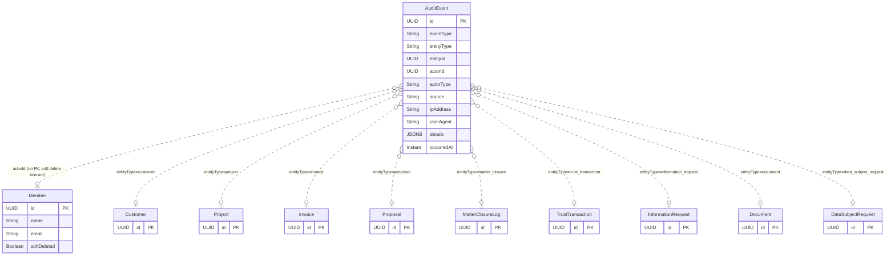
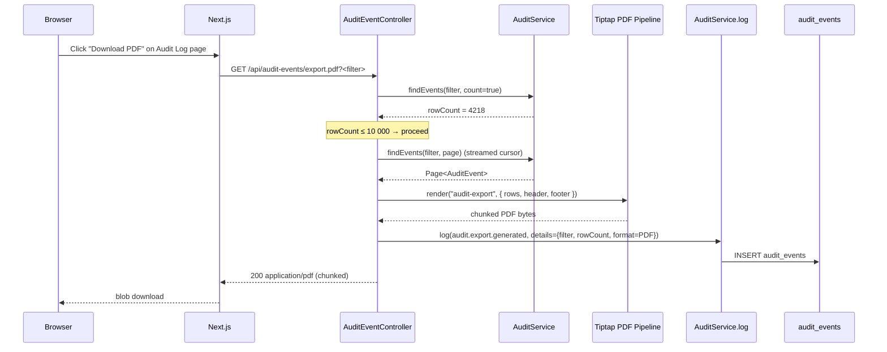
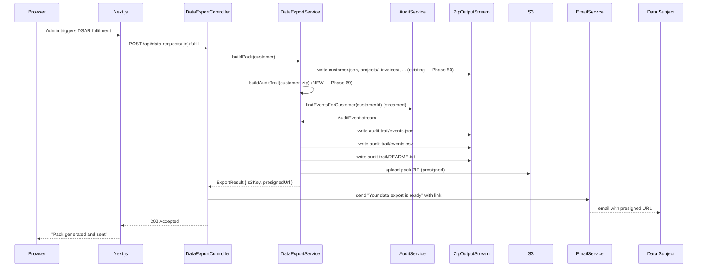
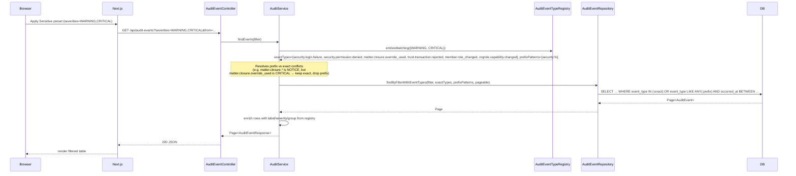

# Phase 69 — Firm Audit View (Admin Surface)

> **Canonical location**: this standalone `architecture/phase69-*.md` file. Phase 5+ convention is that each phase lives in its own file; `ARCHITECTURE.md` stops at Section 10 (Phase 4) and gets a one-paragraph pointer to each phase doc. The `12.x` numbering inside this file is a local organising device for cross-references *within* the doc — it is NOT a claim on an `ARCHITECTURE.md` section slot. If a future consolidation pass folds phase docs back into `ARCHITECTURE.md`, the numbering will be renormalised at that time.

---

## 12.1 — Overview

Kazi has been quietly writing to an immutable audit log since [Phase 6](phase6-audit-compliance-foundations.md). The infrastructure has matured well — `audit_events` is append-only, the table has a DB trigger that rejects UPDATEs, the `AuditEvent` entity is `@Immutable`, and writers across the codebase emit events for projects, tasks, customers, invoices, proposals, documents, comments, time entries, rate cards, budgets, retainers, notifications, trust transactions, trust approvals, interest postings, reconciliations, matter-closure overrides, disbursements, engagement prerequisites, information requests, acceptances, automations, data-protection actions (DSAR / export / anonymisation / retention), member role changes, capability changes, and security events (login failure, permission denied). What has never existed is a way for a firm administrator to **read** any of this. The data is dutifully recorded, then quietly invisible. A compliance officer asking "who approved the closure of Matter 0042 and why?" today has no recourse short of a `psql` session against the tenant schema.

Phase 69 closes that gap on the firm-admin side without adding a single new write path. Everything in this phase is a read project — a filterable global log page, a reusable per-entity timeline component for sensitive entity detail pages, compliance-grade CSV and PDF export for disclosure, integration with the Phase 50 DSAR pack, and a small dashboard widget surfacing recent CRITICAL/WARNING events. The capability gate is the existing `"TEAM_OVERSIGHT"` (no new capability is introduced). There are zero migrations: severity is derived from an in-code metadata registry at read time, not persisted on `audit_events`. The set of events being emitted today is treated as already correct and sufficient; any gap discovered during build or QA goes into the Phase 70+ gap report rather than scope-creeping this phase. That discipline is captured in [ADR-259](../adr/ADR-259-audit-ui-read-only-no-write-changes.md).

The portal-side activity trail ("when did my firm log in / view my documents") is **explicitly out of scope** — that is a separate Phase 68-adjacent surface and the founder confirmed the deferral on 2026-04-20. Phase 69 ships the firm-admin surface only.

### What's new

| Area | Existing (today) | Phase 69 adds |
|---|---|---|
| Global audit list | `GET /api/audit-events` (paginated, filter-by-id only) | Filter facet endpoints (`/facets/{actors,event-types,entity-types}`); `severity` filter; settings page `Audit Log` rendering filters + paginated rows + diff viewer + deep links |
| Per-entity drilldown | `GET /api/audit-events/{entityType}/{entityId}` exists but is unconsumed | Reusable `<AuditTimeline>` component dropped into Customer / Project / Invoice / TrustTransaction / MatterClosure / Proposal / InformationRequest detail pages as a new "Audit" tab |
| Filter facets | None — controller accepts filter params, but no way to enumerate valid values | Three facet endpoints returning distinct actors / event-types / entity-types with counts in a date range |
| Exports | None — pagination only | CSV streaming (`/export.csv`) + PDF via Tiptap pipeline (`/export.pdf`); both reflexively audited via `audit.export.generated` |
| DSAR audit-trail folder | Phase 50 DSAR pack omits the subject's audit log entirely | New `audit-trail/` folder in the export ZIP — `events.json`, `events.csv`, `README.txt`, unsanitised per POPIA §23 |
| Sensitive-events surfacing | Matter-closure overrides, trust approvals, data-protection actions all invisible to compliance officers | Dashboard widget (top-5 recent CRITICAL+WARNING in last 7 days) + Sensitive preset on the global log page |
| Event-type metadata | None — event types are bare strings (`"matter.closure.override_used"`) | In-code `AuditEventTypeRegistry` (record-based catalogue): `eventType` (or glob prefix) → `label`, `severity`, `group`. Longest-prefix-wins resolver |
| Severity classification | Not present anywhere | `AuditSeverity` enum: `INFO | NOTICE | WARNING | CRITICAL`; derived at read time from registry — no migration, no backfill ([ADR-261](../adr/ADR-261-audit-severity-derived-read-time.md)) |
| Event grouping | Not present | `AuditEventGroup` enum: `SECURITY | COMPLIANCE | FINANCIAL | DATA | STANDARD`; powers the filter presets |

### What's out of scope

Reproduced from the requirements; see §12.13 for the full list.

- **Portal activity trail** — clients seeing "when did my firm log in / view my documents / download my files". Explicitly deferred; founder call 2026-04-20.
- **Template-per-event-type registry** — full handcrafted human summary for each of ~60 event types. Generic viewer + title-case labels ships this phase; bespoke templates are a polish phase ([ADR-260](../adr/ADR-260-audit-generic-diff-over-event-templates-v1.md)).
- **Streaming / websocket live tail.** HTTP pagination only.
- **Alert routing** (email / Slack / webhook on sensitive events). Deferred to integrations phase.
- **Retention-policy UI.** `AuditRetentionProperties` is config-driven; no UI for it.
- **Saved custom filters / named queries.** Built-in presets only.
- **Per-user activity heatmaps / behavioural analytics.** Not what this product is.
- **Tamper-proof / hash-chained audit log.** `audit_events` is append-only at DB trigger level; cryptographic chaining is a future phase.
- **Audit-log-as-a-report-type** in the Phase 19 reporting engine. Dedicated page + export is sufficient.
- **Sensitive-event in-app push notifications.** Bell / toast surfacing is deferred.
- **Event aggregation / deduplication.** Each event is shown individually.
- **Free-text search across `details` JSONB.** Filtering by structured fields only.
- **Multi-tenant cross-tenant audit view** for platform admins. Each tenant sees its own log; platform-admin cross-tenant forensics is a Phase 39-adjacent surface.

---

## 12.2 — Domain Model & Existing Schema (No Changes)

This phase ships **zero new entities**, **zero new tables**, and **zero migrations**. Read that twice — it is the most consequential constraint of the phase. The only new domain-layer Java type is the in-code `AuditEventTypeRegistry`, which is a record-based catalogue, explicitly **not** an `@Entity`.

### 12.2.1 Existing `AuditEvent` shape

The existing `AuditEvent` entity (path: `backend/src/main/java/io/b2mash/b2b/b2bstrawman/audit/AuditEvent.java`) is annotated `@Immutable, append-only`, has no `@Version`, no setters, and no `updatedAt` column. The DB trigger `audit_events_no_update` rejects any UPDATE statement at the database level. Hibernate's `@Immutable` annotation is essential because the JSONB `details` column triggers false dirty-detection on otherwise-unmodified rows.

| Field | Type | Notes |
|---|---|---|
| `id` | `UUID` | PK, generated |
| `eventType` | `String(100)` | Dot-namespaced; e.g. `task.claimed`, `matter.closure.override_used` |
| `entityType` | `String(50)` | Polymorphic pointer label; e.g. `task`, `customer`, `matter_closure` |
| `entityId` | `UUID` | Polymorphic pointer ID — no FK |
| `actorId` | `UUID` (nullable) | `Member.id` when `actorType = USER` |
| `actorType` | `String(20)` | `USER`, `SYSTEM`, `PORTAL_CONTACT`, `API_KEY`, `AUTOMATION` |
| `source` | `String(30)` | `API`, `INTERNAL`, `WEBHOOK`, `SCHEDULER`, etc. |
| `ipAddress` | `String(45)` (nullable) | IPv4 / IPv6 |
| `userAgent` | `String(500)` (nullable) | Truncated at builder layer |
| `details` | `JSONB` (nullable) | Free-form; commonly an `AuditDeltaBuilder` `{before, after, changedFields}` shape |
| `occurredAt` | `Instant` | Set at construction; never updated |

### 12.2.2 ER context

`AuditEvent` is intentionally untethered — it has no foreign keys. `entityType` + `entityId` is a polymorphic pointer that can target any entity in the tenant schema. `actorId` correlates to `Member.id` but is also not a FK (so a hard-deleted member's history survives). The diagram below shows the read-time correlations the Phase 69 services use, **not** referential integrity edges.



`AuditEvent` is annotated `@Immutable` — Hibernate will not issue UPDATE statements against it, which is essential because the DB trigger would reject them anyway. Tenancy is enforced by the `search_path` connection-provider hook ([ADR-T001](../adr/ADR-T001-schema-per-tenant-over-row-level-isolation.md)), not by a `tenant_id` column. There are no `@Filter` quirks on `AuditEvent` — schema separation does the work.

### 12.2.3 New domain enums (in-code, no migration)

```java
public enum AuditSeverity {
  INFO,      // routine read/write, e.g. task.updated, customer.viewed
  NOTICE,    // notable but expected, e.g. trust.transaction.approved
  WARNING,   // deserves attention, e.g. security.permission.denied, member.role_changed
  CRITICAL   // must be reviewed, e.g. matter.closure.override_used
}
```

```java
public enum AuditEventGroup {
  SECURITY,    // login, permission, role/capability changes
  COMPLIANCE,  // matter-closure, audit-log-export, regulatory
  FINANCIAL,   // invoice, proposal, trust, billing-run
  DATA,        // DSAR, export, anonymisation, retention
  STANDARD     // everything else (project, task, document, …)
}
```

Both enums are derived properties — the DB never stores them. See [ADR-261](../adr/ADR-261-audit-severity-derived-read-time.md) for the rationale.

---

## 12.3 — Backend Extensions

All new endpoints live on the existing `AuditEventController` (or, where they are sufficiently distinct, on adjacent controllers within the `audit` package). All are gated `@RequiresCapability("TEAM_OVERSIGHT")`. Controllers remain one-line delegates per the [Backend Controller Discipline](../backend/CLAUDE.md).

### 12.3.1 Facet Endpoints

The list endpoint accepts filter parameters (`actorId`, `entityType`, `eventType`) but provides no way to enumerate the valid values currently present in the data. Three new facet endpoints fix that.

| Endpoint | Response shape | Cap | Notes |
|---|---|---|---|
| `GET /api/audit-events/facets/actors?from=&to=` | `[{ actorId, actorDisplayName, actorType, eventCount }]` | Top 500 by `eventCount` | Joins to `Member` for the display name; falls back per §12.3.4 |
| `GET /api/audit-events/facets/event-types?from=&to=` | `[{ eventType, label, severity, group, count }]` | Uncapped (real distinct count is bounded by registry size + a long tail) | `label`/`severity`/`group` enriched from registry (§12.3.3) |
| `GET /api/audit-events/facets/entity-types?from=&to=` | `[{ entityType, label, count }]` | Uncapped | `label` is title-cased `entityType` if no registry hit |

All three endpoints back onto a single service method, `AuditService.facets(Instant from, Instant to)`, which returns a `FacetSnapshot` record holding all three lists. Don't fragment into three repository calls per request when one transactional read covers it.

```java
public record FacetSnapshot(
    List<ActorFacet> actors,
    List<EventTypeFacet> eventTypes,
    List<EntityTypeFacet> entityTypes
) {}
```

The actors-facet SQL is the most non-trivial — `Member` is in the same tenant schema, so a simple JOIN is safe:

```sql
SELECT
  ae.actor_id,
  COALESCE(m.name, 'Former member (' || ae.actor_id || ')') AS actor_display_name,
  ae.actor_type,
  COUNT(*) AS event_count
FROM audit_events ae
LEFT JOIN members m ON m.id = ae.actor_id
WHERE ae.actor_id IS NOT NULL
  AND ae.occurred_at >= :from
  AND ae.occurred_at <  :to
GROUP BY ae.actor_id, m.name, ae.actor_type
ORDER BY event_count DESC
LIMIT 500;
```

Capability gate (`TEAM_OVERSIGHT`) applies to all three endpoints. A non-owner without this capability gets a 403 ProblemDetail.

### 12.3.2 Export Endpoints

Two endpoints, both reusing the same filter parameter set as `GET /api/audit-events`.

| Endpoint | Format | Cap | Streaming model |
|---|---|---|---|
| `GET /api/audit-events/export.csv?<filter>` | RFC 4180 CSV, `Content-Disposition: attachment` | None — true streaming | `StreamingResponseBody` writes row-by-row from the `Page` cursor |
| `GET /api/audit-events/export.pdf?<filter>` | PDF via existing Tiptap → PDF pipeline | **10 000 rows** | Pre-flight count; if over cap, return 413 ProblemDetail; otherwise generate and stream the chunked PDF response |

**CSV columns** (RFC 4180, header row first):

```
occurredAt, eventType, label, severity, entityType, entityId,
actorId, actorDisplayName, actorType, source, ipAddress,
userAgent, detailsJson
```

`detailsJson` is the compact-form serialisation of the `details` JSONB column (no whitespace). `label` and `severity` are resolved from the metadata registry at write time per row.

**Filename format**: `audit-events-{tenantSlug}-{fromDate}-{toDate}.csv` / `.pdf`. Date format: `YYYY-MM-DD`.

**PDF contents**:

- Header: org branding (logo + name), date range covered, filter summary (one line per non-default filter), generation timestamp (ISO 8601 with timezone), exporting actor name + ID.
- Body: landscape table of events, one row per event. Severity rendered as a coloured badge in-line with the event-type label.
- Footer: `Page N of M` · tenant hash · `Generated by Kazi audit export`.

The PDF uses the existing Tiptap → PDF pipeline ([Phase 12](phase12-document-templates.md), [Phase 31](phase31-templates-and-partials.md), [Phase 42](phase42-pdf-engine-cutover.md), [ADR-056](../adr/ADR-056-pdf-engine-selection.md), [ADR-165](../adr/ADR-165-pdf-conversion-strategy.md)) with a new `audit-export` template in the existing template pack — no new rendering library, no new infrastructure. See [ADR-263](../adr/ADR-263-audit-pdf-via-tiptap-pipeline.md).

**The 10 000-row PDF cap.** Over-cap requests return a 413 ProblemDetail:

```json
{
  "type": "https://kazi.app/problems/audit-export-too-large",
  "title": "Audit export too large",
  "status": 413,
  "detail": "PDF export limited to 10,000 events. Narrow the date range or filters.",
  "rowCount": 47238,
  "cap": 10000
}
```

CSV has no row cap because it streams without buffering — a 100k-row CSV remains a constant-memory operation.

**The reflexive audit event.** Both export endpoints emit an `audit.export.generated` event:

```java
auditService.log(AuditEventBuilder.builder()
    .eventType("audit.export.generated")
    .entityType("audit_export")
    .entityId(UUID.randomUUID())  // synthetic — exports have no persistent entity
    .details(Map.of(
        "filter",   filterAsMap,
        "rowCount", rowCount,
        "format",   "PDF"  // or "CSV"
    ))
    .build());
```

This is itself an audit event; an admin who runs an export later sees that they (or a colleague) ran it. See [ADR-264](../adr/ADR-264-audit-export-is-auditable.md).

### 12.3.3 Event-Type Metadata Registry

The registry is the single source of truth for label, severity, and group per event type. It is in-code, not table-backed — see [ADR-261](../adr/ADR-261-audit-severity-derived-read-time.md) for why.

```java
package io.b2mash.b2b.b2bstrawman.audit;

public record AuditEventTypeMetadata(
    String eventType,        // exact string OR glob prefix ending in ".*"
    String label,            // human label, e.g. "Matter Closure Override Used"
    AuditSeverity severity,  // INFO | NOTICE | WARNING | CRITICAL
    AuditEventGroup group    // SECURITY | COMPLIANCE | FINANCIAL | DATA | STANDARD
) {}
```

Resolution is **longest-prefix-wins**. The registry is loaded once at startup into a `Map<String, AuditEventTypeMetadata>` keyed by the registered string (suffix `.*` stripped). Lookup walks the input event-type string from the most-specific prefix to the least, returning the first hit:

```java
public AuditEventTypeMetadata resolve(String eventType) {
  // 1) exact match
  if (registry.containsKey(eventType)) return registry.get(eventType);
  // 2) longest matching prefix
  String s = eventType;
  while (s.contains(".")) {
    s = s.substring(0, s.lastIndexOf('.'));
    var hit = registry.get(s + ".*");
    if (hit != null) return hit;
  }
  // 3) default
  return DEFAULT.withEventType(eventType);
}
```

Full registry table (verbatim from the requirements):

| eventType / prefix | Label | Severity | Group |
|---|---|---|---|
| `security.login.failure` | Login Failed | WARNING | Security |
| `security.permission.denied` | Permission Denied | WARNING | Security |
| `security.*` | Security Event | NOTICE | Security |
| `matter.closure.override_used` | Matter Closure Override Used | CRITICAL | Compliance |
| `matter.closure.*` | Matter Closure | NOTICE | Compliance |
| `trust.transaction.approved` | Trust Transaction Approved | NOTICE | Financial |
| `trust.transaction.rejected` | Trust Transaction Rejected | WARNING | Financial |
| `trust.*` | Trust Activity | NOTICE | Financial |
| `dataprotection.dsar.*` | Data Subject Request | NOTICE | Data |
| `dataprotection.export.*` | Data Export | NOTICE | Data |
| `dataprotection.anonymization.*` | Data Anonymization | NOTICE | Data |
| `dataprotection.*` | Data Protection | NOTICE | Data |
| `audit.export.generated` | Audit Log Exported | NOTICE | Compliance |
| `member.role_changed` | Member Role Changed | WARNING | Security |
| `orgrole.capability.changed` | Role Capabilities Changed | WARNING | Security |
| `invoice.*` | Invoice | INFO | Financial |
| `proposal.*` | Proposal | INFO | Financial |
| `(default)` | (title-case of eventType) | INFO | Standard |

**Catalogue exposure.** The frontend needs the registry up-front, not just per-row enrichment, because it must render the severity pill on rows the user has not yet filtered to (the global table is paginated; the registry is small). The decision: ship a single `GET /api/audit-events/metadata` endpoint that returns the full catalogue, and **do not also ship the per-facet-enrichment-only route** — exactly one canonical surface keeps the frontend simple.

```
GET /api/audit-events/metadata
→ 200 [{ eventType, label, severity, group }, ...]
```

The facet endpoint `/facets/event-types` (§12.3.1) does also enrich its results with `label/severity/group`, because it already projects per-eventType aggregates and the enrichment is free at that point. The two surfaces co-exist without duplication: the metadata endpoint returns the static catalogue (registered prefixes), and the facets endpoint returns per-eventType counts in a date range, both pulling enrichment from the same `AuditEventTypeRegistry` bean.

> **Deviation note (vs requirements §1.3).** The requirements line "Builder picks one — do not ship both" is intended to prevent two parallel *catalogue* surfaces. The architecture interprets the two endpoints as serving different shapes — `/metadata` is the static catalogue (what classifications exist), `/facets/event-types` is the date-ranged distribution (what's actually present in the log right now) — so they are not redundant. The frontend consumes `/metadata` once per session for pill rendering and consumes `/facets/event-types` per filter-panel-open for the dropdown counts. The single `AuditEventTypeRegistry` bean is the shared source of truth; there is no parallel mapping. If the builder revisits this and decides the per-facet enrichment is sufficient on its own, drop the `/metadata` endpoint and have the frontend fetch facets at session bootstrap with a wide date range. This architecture doc's recommendation is the two-endpoint shape because it keeps the static-catalogue cost (one tiny response per session) decoupled from the date-range fetch.

### 12.3.4 Actor Display Resolution

Audit events store `actorId` (a `Member.id`) but not a display name — the member may have been renamed, soft-deleted, or hard-removed since the event. The backend resolves display names at read time via a single LEFT JOIN to `members` (one query, no N+1). Fallbacks:

| Condition | Render |
|---|---|
| `actorType == "USER"` AND `Member` resolves | `Member.name` |
| `actorType == "USER"` AND `Member` does not resolve | `"Former member ({actorId})"` |
| `actorType == "PORTAL_CONTACT"` | `"Portal Contact"` |
| `actorType == "SYSTEM"` | `"System"` |
| `actorType == "AUTOMATION"` | `"Automation"` |
| `actorType == "API_KEY"` | `"API Key"` |

The list endpoint, the per-entity endpoint, the facets/actors endpoint, and the export endpoints all use this resolver. It is a service-layer concern; controllers do not see it.

### 12.3.5 `AuditEventFilter` Severity Extension

The existing `AuditEventFilter` record is extended (not replaced) with a `Set<AuditSeverity> severities` field. `null` or empty `Set` means "no severity filter" (current behaviour); a populated set restricts to events whose registry-resolved severity is in the set.

```java
public record AuditEventFilter(
    String entityType,
    UUID entityId,
    UUID actorId,
    String eventType,
    Instant from,
    Instant to,
    Set<AuditSeverity> severities    // NEW — nullable / empty = no filter
) {}
```

Severity is **derived at read time** from the metadata registry; it is not a column on `audit_events`. Two implementation patterns are possible:

1. **In-memory post-filter.** Query everything matching the other filters in the date range, resolve severity per row in Java, drop rows that don't match. Simple, but allocates the full filtered result set in memory and breaks pagination semantics.
2. **Pre-flight `eventType` set + DB filter.** Walk the registry entries to compute the set of registered eventType strings (and prefixes) whose `severity` is in the requested set. Convert the prefix entries to a `LIKE` predicate. Add `eventType IN (:exactSet) OR eventType LIKE ANY(:prefixSet)` to the existing filter query. The DB does the work; pagination is honoured.

**Choose option 2.** It is more code, but it is the only option that respects pagination and avoids loading an entire month of events into memory just to filter most of them out.

```java
// Pseudocode — actual implementation lives in AuditService.findEvents
Set<String> exactTypes = registry.entries().stream()
    .filter(e -> requestedSeverities.contains(e.severity()))
    .filter(e -> !e.eventType().endsWith(".*"))
    .map(AuditEventTypeMetadata::eventType)
    .collect(toSet());
Set<String> prefixPatterns = registry.entries().stream()
    .filter(e -> requestedSeverities.contains(e.severity()))
    .filter(e -> e.eventType().endsWith(".*"))
    .map(e -> e.eventType().substring(0, e.eventType().length() - 1) + "%")  // ".*" → "%"
    .collect(toSet());
// Then: pass exactTypes + prefixPatterns to the JPQL query as :eventTypeExacts / :eventTypePrefixes
```

There is a subtle ordering issue: a registry entry like `matter.closure.override_used` has severity `CRITICAL`, but the prefix `matter.closure.*` has severity `NOTICE`. If the user requests `severities = {NOTICE}`, the pre-flight must include the prefix `matter.closure.%` but **exclude** the exact string `matter.closure.override_used` (because that exact string resolves to `CRITICAL`, not `NOTICE`). The pre-flight resolver re-runs `resolve()` for each candidate to confirm the final severity matches. This is computed once per request (registry size is small — ~30 entries), not per row.

### 12.3.6 Tests

Per requirements §1.5, ~6 backend integration tests (named with the `*IntegrationTest` convention, embedded Postgres, `@Import(TestcontainersConfiguration.class)`):

1. **Facet endpoints.** Empty range returns empty arrays for all three; populated range returns expected counts; actors facet caps at 500.
2. **CSV export.** Header row matches the spec; row count matches the filter; `Content-Disposition` filename format is correct; large results stream (assert no `OutOfMemoryError` on a 50k-row test fixture).
3. **PDF export.** Hash-comparison against a golden PDF baseline (rendered fixture); 10 001-row request returns 413 ProblemDetail with `rowCount` and `cap` fields.
4. **Reflexive audit event.** Running an export emits exactly one `audit.export.generated` event with `details.format`, `details.rowCount`, `details.filter`.
5. **Registry resolution.** Longest-prefix-wins (`matter.closure.override_used` → CRITICAL, `matter.closure.something_else` → NOTICE, `matter.created` → INFO via default).
6. **Actor display resolution.** Live member → name; soft-deleted member → `"Former member ({actorId})"`; non-USER actorType → label per §12.3.4.
7. **Capability gate.** Non-owner without `TEAM_OVERSIGHT` → 403 ProblemDetail on every new endpoint.

(That is technically seven; the requirements asked for "~6" — close enough. The build agent may collapse 5+6 into a single fixture if it shortens the suite.)

---

## 12.4 — Global Audit Log Page (Frontend)

### 12.4.1 Route & shell

New page: `frontend/app/(authenticated)/settings/audit-log/page.tsx`. The settings hub from [Phase 44](phase44-frontend-information-architecture.md) already includes a `/settings/audit-log` slot in its sidebar — the implementation defers to that hub layout. Gated client-side by `<CapabilityGate capability="TEAM_OVERSIGHT">`. Members without the capability see a 404 fallback (the route is gated server-side too via the existing tenant-scoped Next.js middleware).

### 12.4.2 Layout

```
┌──────────────────────────────────────────────────────────┐
│ Audit Log                                [Export ▼]      │
├──────────────────────────────────────────────────────────┤
│ Filters:                                                 │
│  Date range: [Last 7 days ▾]   Severity: [All ▾]         │
│  Actor: [Any ▾]    Event type: [Any ▾]    Entity: [Any ▾]│
│  Preset: [None ▾]  (Sensitive | Compliance | Security…)  │
├──────────────────────────────────────────────────────────┤
│ Time        Severity  Event              Actor    Entity │
│ 14:02:13    WARNING   Permission Denied  Alice   Task 42 │
│ 13:58:07    CRITICAL  Closure Override   Bob     Matter 7│
│  ▼ (expanded)                                            │
│    Justification: "Client returned funds — all…"         │
│    Details (before / after): [diff viewer]               │
│    Source: UI   IP: 41.x.x.x   Agent: Firefox/…          │
│ …                                                        │
│ [Load more]                                              │
└──────────────────────────────────────────────────────────┘
```

The table uses simple paginated pagination (stable page numbers over time, suitable for audit semantics) rather than infinite scroll — auditors quote URLs that pin to specific results.

### 12.4.3 Filter spec

| UI control | API param | Type | Notes |
|---|---|---|---|
| Date range | `from` + `to` | ISO 8601 | Defaults to last 7 days |
| Severity | `severities` (multi) | `Set<AuditSeverity>` | Comma-separated; empty = all |
| Actor | `actorId` | UUID | Populated from `/facets/actors` |
| Event type | `eventType` | string (prefix match) | Populated from `/facets/event-types` |
| Entity | `entityType` + `entityId` | string + UUID | Populated from `/facets/entity-types`; selecting an entityType narrows the entity-id picker |

### 12.4.4 Filter presets

The Preset dropdown offers four built-in combinations. **All four are client-side filter combinations** — there is no backend preset table, no persisted named filters. Selecting a preset populates the other filters in the URL query string and re-runs the list query.

| Preset | Filters applied |
|---|---|
| Sensitive (Last 30 days) | `severities=WARNING,CRITICAL`, `from=now-30d` |
| Compliance | `group=COMPLIANCE` (resolved client-side via the metadata catalogue → `eventType` set), `from=now-90d` |
| Security | `group=SECURITY`, `from=now-7d` |
| Financial approvals | `eventType` ∈ `{trust.transaction.approved, trust.transaction.rejected, invoice.sent, invoice.voided}`, `from=now-30d` |

### 12.4.5 Row expansion

Rows are collapsed by default. An expander chevron in the leftmost column toggles a detail panel beneath the row showing:

- **Diff viewer** — when `details` matches the `AuditDeltaBuilder` shape (`{ before, after, changedFields }` or `{ field: { from, to } }`), render a side-by-side or inline diff viewer with `from` on the left and `to` on the right.
- **JSON tree viewer** — fallback when `details` is some other shape (e.g. matter-closure override carries `details.justification` as a free-string). Use a lightweight library (`react-json-view` or a hand-rolled component). **Do NOT pull in a heavy editor** (Monaco, CodeMirror) just to pretty-print JSON — this is a read-only, click-to-expand surface; the bundle cost is unjustified.
- **Metadata footer** — `Source: API` · `IP: 41.x.x.x` · `Agent: Mozilla/5.0…` rendered as small grey text. Null fields hidden.

**Empty-state copy** (per requirements §2.5):

- No events in range: "No audit events in this range. Try widening the date range or changing filters."
- No events ever (fresh tenant): "The audit log is empty. Activity is logged automatically once team members start working in Kazi."

Both reuse the Phase 43 `<EmptyState>` pattern.

### 12.4.6 Severity rendering

| Severity | Pill colour | Tailwind class hint |
|---|---|---|
| `INFO` | grey | `bg-slate-100 text-slate-700` |
| `NOTICE` | blue | `bg-blue-100 text-blue-700` |
| `WARNING` | amber | `bg-amber-100 text-amber-800` |
| `CRITICAL` | red | `bg-red-100 text-red-700` |

The pill is small (`text-xs`, `rounded-full`, `px-2 py-0.5`). Group appears as a subtle label next to it (small grey text, no background).

### 12.4.7 Entity cell deep-links

The Entity column renders a deep-link to the entity's detail page when the `entityType` is recognised and the entity still exists. Soft-deleted entities render the same link with `line-through` text. Unknown `entityType` values render the literal `{entityType}:{entityId.short}` (first 8 chars of the UUID) as plain text.

| `entityType` | Frontend route |
|---|---|
| `customer` | `/customers/{id}` |
| `project` | `/projects/{id}` |
| `task` | `/projects/{projectId}/tasks/{id}` |
| `invoice` | `/invoices/{id}` |
| `proposal` | `/proposals/{id}` |
| `information_request` | `/information-requests/{id}` |
| `document` | `/documents/{id}` |
| `trust_transaction` | `/trust-accounting/transactions/{id}` |
| `matter_closure` | `/projects/{id}/closure` |
| `data_subject_request` | `/settings/data-protection/requests/{id}` |
| `org_role` | `/settings/roles/{id}` |
| `member` | `/team#member-{id}` |
| `audit_export` | (no link — synthetic entity) |
| _unknown_ | render `{entityType}:{entityId.short}` literal |

### 12.4.8 Actor cell tooltip

The Actor column renders the resolved display name (per §12.3.4). On hover, a tooltip surfaces the full `actorId`, `actorType`, `source`, and `ipAddress` (where non-null), formatted as a simple key-value list.

### 12.4.9 Export UX

The Export dropdown offers **Download CSV** and **Download PDF**. Both use the current filter state (the URL query string is the source of truth). Both show an in-flight spinner, then trigger a blob download. If the filter exceeds the 10 000-row PDF cap, the PDF option disables with a tooltip: *"Narrow the date range — PDF export limited to 10,000 events."* The cap is checked client-side via a `?count=true` request before enabling the option, with a brief debounce to avoid hammering on every filter keystroke.

### 12.4.10 i18n

All copy flows through the Phase 43 message catalogue. Terminology keys (`projects` vs `matters`, `audit` vs `audit trail`) are pulled per-tenant-profile.

### 12.4.11 Tests

Per requirements §2.6:

- ~4 frontend tests (Vitest + Testing Library): filter combinations map to correct API params; row expansion toggles the diff viewer; preset selection populates the filters and re-queries; export dropdown triggers blob download.
- ~1 Playwright smoke: login as admin → navigate to audit log → apply Sensitive preset → verify row count > 0 after a seeded scenario.

---

## 12.5 — Per-Entity Audit Timeline Component

### 12.5.1 Component spec

New React component at `frontend/components/audit/audit-timeline.tsx`:

```tsx
<AuditTimeline
  entityType="matter"           // or customer, project, invoice, trust_transaction, proposal, information_request
  entityId={matter.id}
  initialPageSize={20}
  showFilters={false}           // compact mode for detail-page tabs
  severityPillSize="sm"         // "sm" | "md"
/>
```

**Data source.** Reuses the existing `GET /api/audit-events/{entityType}/{entityId}` endpoint (no new backend surface for this component). The endpoint is already paginated; the component manages its own page state.

**Visual.** Vertical timeline (not a table) — one node per event, chronological top→bottom, expandable on click. Each node renders:

- Severity pill (sm size by default).
- Event-type label (from registry).
- Actor display name + relative timestamp ("3 hours ago"; full ISO 8601 in tooltip).
- On expand: same diff viewer / JSON tree as §12.4.5, plus the metadata footer.

**Shared primitives** (deduplicated with the global page):

- `<SeverityPill>` — `frontend/components/audit/severity-pill.tsx`
- `<AuditDetailsViewer>` — `frontend/components/audit/audit-details-viewer.tsx` (the diff + JSON fallback)
- `<ActorDisplay>` — same component used in the global table
- `auditEventsClient` — `frontend/lib/api/audit-events.ts`

The global page and the timeline share rendering primitives; only layout differs (table vs vertical-timeline).

### 12.5.2 Integration points

The "Audit" tab is added to the existing tab strips on detail pages. Tab label flows through terminology so the legal-za profile can render it as "Audit Trail" while the default profile renders "Audit". Tab is **capability-gated** — wrapped in `<CapabilityGate capability="TEAM_OVERSIGHT">` at the component level so members without the capability see no tab at all.

| Detail page | Tab position | `entityType` |
|---|---|---|
| Customer Detail (`/customers/{id}`) | Last tab | `customer` |
| Project / Matter Detail (`/projects/{id}`) | Last tab | `project` |
| Invoice Detail (`/invoices/{id}`) | Last tab | `invoice` |
| Trust Transaction Detail (`/trust-accounting/transactions/{id}`) | Last tab (legal-za) | `trust_transaction` |
| Matter Closure detail (`/projects/{id}/closure`) | Last tab (legal-za, if standalone) | `matter_closure` |
| Proposal Detail (`/proposals/{id}`) | Last tab | `proposal` |
| Information Request Detail (`/information-requests/{id}`) | Last tab | `information_request` |

### 12.5.3 Tests

Per requirements §3.3:

- ~3 frontend tests: timeline renders events in DESC order, expansion shows diff viewer, empty state renders correct copy.
- ~1 Playwright: open Matter Closure detail page, verify the "Audit Trail" tab renders the override event with `details.justification` visible on expand.

---

## 12.6 — DSAR Audit-Trail Pack Integration

### 12.6.1 Pack folder structure

Phase 50 `DataExportService` produces a ZIP pack for a Data Subject Access Request. Phase 69 extends the pack with a new top-level folder `audit-trail/`. The rest of the pack is untouched — this is a pure addition.

```
{pack-root}/
├── customer.json               (existing — Phase 50)
├── projects/                   (existing)
├── invoices/                   (existing)
├── documents/                  (existing)
├── ...
└── audit-trail/                (NEW — Phase 69)
    ├── events.json             — full event list as JSON array (machine-readable)
    ├── events.csv              — same data in CSV shape (human-readable)
    └── README.txt              — short plain-text explanation of the file formats
```

### 12.6.2 Scope of events

For a DSAR for customer X, include every `AuditEvent` where **any** of the following is true (preserved verbatim from requirements §4.2):

- `entityType="customer"` AND `entityId=X.id`
- `entityType IN {"project", "invoice", "proposal", "information_request", "document", "trust_transaction", "acceptance_request"}` AND the entity belongs to customer X (the export service already computes this set for its existing folders — reuse that customer-entity resolution).
- The event's `details` JSONB contains a reference to `customerId=X.id` (e.g. `details.customerId`). This is a best-effort JSONB-path query; a dedicated indexed query path is not required for DSAR volumes.

Events older than the retention horizon are not included (already filtered by `AuditRetentionProperties`).

### 12.6.3 Sanitisation policy

**DSAR exports are NOT sanitised.** Unlike the portal sanitisation introduced in [Phase 68](phase68-portal-redesign-vertical-parity.md) for live read-model data, a DSAR export gives the data subject the full internal record that pertains to them — internal notes, raw `details` JSON, IP addresses, user agents, the works. POPIA §23 entitles the subject to that record. This is a deliberate, explicitly-documented decision; see [ADR-262](../adr/ADR-262-dsar-audit-trail-unsanitised.md) for the contrast against Phase 68's portal-side sanitisation.

### 12.6.4 Wiring

Extend `DataExportService` (path: `backend/src/main/java/io/b2mash/b2b/b2bstrawman/datarequest/DataExportService.java`) with a new `buildAuditTrail(customer, zipOutputStream)` step, called as the last step before closing the pack ZIP.

The step:

1. Streams events via `AuditService.findEventsForCustomer(customerId)` — a new service method on `AuditService`. The builder may consolidate via a composite filter passed to the existing `findEvents` if simpler; the contract is "iterate every event in the scope of §12.6.2 in chronological order."
2. Writes `audit-trail/events.json` directly to the ZIP stream — line-delimited JSON or a streaming JSON-array writer (no buffering of the full event list in memory).
3. Writes `audit-trail/events.csv` directly to the ZIP stream — same column set as the export endpoint (§12.3.2).
4. Writes `audit-trail/README.txt` (static content explaining what the JSON and CSV represent and how a recipient should read them).

**Compatibility.** Must not break existing Phase 50 tests. The change is **additive only** — existing assertions about pack contents (`customer.json`, `projects/`, etc.) continue to pass; new assertions are added for the new folder.

### 12.6.5 Tests

Per requirements §4.5:

1. **Happy path.** DSAR pack for customer X includes `audit-trail/` folder with `events.json`, `events.csv`, `README.txt`; events.json is a parseable JSON array; row count in events.csv matches events.json.
2. **Tenant + customer isolation.** Audit-trail excludes events belonging to other customers in the same tenant; audit-trail excludes events from a different tenant entirely (sanity check, schema separation should prevent this anyway).

---

## 12.7 — Sensitive-Events Dashboard Widget

A small surface on the firm admin dashboard that provides an at-a-glance view of recent legally-sensitive events. **This is the cuttable epic** (Epic E in §12.12) if scope tightens — the audit log page itself remains the canonical surface; the widget is a convenience.

### 12.7.1 Component

Path: `frontend/components/dashboard/widgets/sensitive-events-widget.tsx`. Appears on the firm admin dashboard (Phase 9) for members with `TEAM_OVERSIGHT`. Renders:

- Three pills in a row: count of `NOTICE` / `WARNING` / `CRITICAL` events in the last 7 days. **`INFO` is intentionally excluded** — INFO events are routine and would dominate the count, defeating the widget's at-a-glance value; the widget exists to surface attention-worthy activity, not all activity.
- A list of the top 5 most-recent CRITICAL + WARNING events (most recent first), each clickable. Clicking opens the global audit-log page pre-filtered to that specific event (URL-encoded filter state).
- A "View all" link to the global audit-log page with the **Sensitive preset** applied.

### 12.7.2 Data

Reuses `GET /api/audit-events?severities=WARNING,CRITICAL&from=<7d>&size=5`. Requires the list endpoint to accept `severities` as a multi-valued filter — that is the `AuditEventFilter` extension already specified in §12.3.5. No additional backend work.

For the count pills, the widget issues a separate `GET /api/audit-events/facets/event-types?from=<7d>&to=<now>` and aggregates by `severity` client-side (the registry catalogue is already loaded). This keeps the backend honest — one facet endpoint, multiple consumers.

### 12.7.3 Capability gate

Wrapped in `<CapabilityGate capability="TEAM_OVERSIGHT">`. Members without the capability see no widget at all.

### 12.7.4 Tests

Per requirements §5.3:

- 1 backend integration test: `severities=WARNING,CRITICAL` filter returns only events whose registry-resolved severity is in the requested set (covers the §12.3.5 pre-flight pattern).
- 2 frontend tests: widget renders the empty state correctly when no sensitive events; widget deep-links carry the correct filter params in the URL.

---

## 12.8 — Sequence Diagrams

### 12.8.1 PDF Export



If `rowCount > 10000`, `findEvents(filter, count=true)` returns the cap-check value and the controller short-circuits to a 413 ProblemDetail without calling Tiptap.

### 12.8.2 DSAR pack with audit-trail folder



Streaming is end-to-end: `AuditService.findEventsForCustomer` returns a `Stream<AuditEvent>` that is consumed row-by-row; the ZIP entry is written as it goes. A 100k-event pack remains a constant-memory operation.

### 12.8.3 Severity-filtered global query (registry pre-flight)



The registry pre-flight runs once per request (registry size is small — ~30 entries, milliseconds to walk). Pagination is honoured because the DB does the row filtering.

---

## 12.9 — Capability & Security

Every new endpoint and frontend surface uses the **existing** `"TEAM_OVERSIGHT"` capability ([Phase 41](phase41-roles-capabilities.md)). No new capability is introduced. Member role changes that grant or revoke `TEAM_OVERSIGHT` propagate via the existing `OrgRole` mechanism — no audit-specific role plumbing.

Tab- and widget-level gating on the frontend uses the existing `<CapabilityGate>` component (Phase 41 318A pattern). Members without the capability see neither the tab nor the widget — there is no "you don't have permission" visible affordance, which is the existing convention.

| Operation | Capability | Notes |
|---|---|---|
| Read audit log (global) | `TEAM_OVERSIGHT` | Existing — `GET /api/audit-events` already gated |
| Read audit log (per entity) | `TEAM_OVERSIGHT` | Existing — `GET /api/audit-events/{entityType}/{entityId}` already gated |
| Read facet endpoints | `TEAM_OVERSIGHT` | New (Phase 69) — same gate as list endpoint |
| Read metadata catalogue | `TEAM_OVERSIGHT` | New — `GET /api/audit-events/metadata` |
| Export CSV / PDF | `TEAM_OVERSIGHT` | New — also writes a reflexive `audit.export.generated` event |
| DSAR audit-trail (admin-side trigger) | `DATA_PROTECTION` (inherits Phase 50) | Unchanged — Phase 50 already gates DSAR fulfilment |
| Sensitive-events dashboard widget | `TEAM_OVERSIGHT` | Client-side `<CapabilityGate>`; backend is the same list endpoint |

**Soft-deleted member fallback.** Per §12.3.4: when `actorId` does not resolve to a live `Member`, the API renders `"Former member ({actorId})"`. The capability check is independent of the actor history — `TEAM_OVERSIGHT` is checked on the **caller**, not on the historical actor. An audit log row for an action taken by a now-deleted member is still readable by anyone with `TEAM_OVERSIGHT`.

**Data leakage.** Tenancy is enforced by `search_path` in the connection provider; `audit_events` lives in the tenant schema. There is no cross-tenant query path. The export endpoints never write to disk — CSV streams direct to the response, PDF is generated in-memory (capped at 10k rows so the working set is bounded). No artefacts are persisted on the server.

---

## 12.10 — Migrations

**Zero migrations.** The registry is in-code. Severity is derived. No table changes. No schema additions. Both `db/migration/global/` and `db/migration/tenant/` retain their current high-water marks (V22 and V118 respectively).

If a future phase chooses to make the registry table-backed (e.g. to allow per-tenant overrides of the label/severity classification), the next available global migration slot at that time should be claimed — V23 today, but a future phase should re-check before claiming.

---

## 12.11 — Implementation Guidance

### 12.11.1 Backend changes

| File | Change |
|---|---|
| `backend/src/main/java/io/b2mash/b2b/b2bstrawman/audit/AuditEventController.java` | Add three facet endpoints (`/facets/{actors,event-types,entity-types}`); add metadata endpoint (`/metadata`); add two export endpoints (`/export.csv`, `/export.pdf`). All one-line delegates per Controller Discipline. |
| `backend/src/main/java/io/b2mash/b2b/b2bstrawman/audit/AuditService.java` | Add `FacetSnapshot facets(Instant from, Instant to)`; add `Stream<AuditEvent> findEventsForCustomer(UUID customerId)`; extend `findEvents` to honour the new `severities` field on `AuditEventFilter`. |
| `backend/src/main/java/io/b2mash/b2b/b2bstrawman/audit/DatabaseAuditService.java` | Implement the three new service methods. Wire registry pre-flight for severity filtering (per §12.3.5). |
| `backend/src/main/java/io/b2mash/b2b/b2bstrawman/audit/AuditEventFilter.java` | Add `Set<AuditSeverity> severities` field (record expansion). |
| `backend/src/main/java/io/b2mash/b2b/b2bstrawman/audit/AuditEventRepository.java` | Add `findByFilterWithEventTypes` query method that accepts `exactTypes` + `prefixPatterns` for the severity pre-flight. |
| `backend/src/main/java/io/b2mash/b2b/b2bstrawman/audit/AuditEventTypeRegistry.java` (NEW) | In-code registry of `AuditEventTypeMetadata` records + longest-prefix-wins resolver. Loaded once at startup. |
| `backend/src/main/java/io/b2mash/b2b/b2bstrawman/audit/AuditEventTypeMetadata.java` (NEW) | Record. |
| `backend/src/main/java/io/b2mash/b2b/b2bstrawman/audit/AuditSeverity.java` (NEW) | Enum. |
| `backend/src/main/java/io/b2mash/b2b/b2bstrawman/audit/AuditEventGroup.java` (NEW) | Enum. |
| `backend/src/main/java/io/b2mash/b2b/b2bstrawman/audit/export/AuditCsvExporter.java` (NEW) | `StreamingResponseBody` writer; row-by-row CSV emission. |
| `backend/src/main/java/io/b2mash/b2b/b2bstrawman/audit/export/AuditPdfExporter.java` (NEW) | Tiptap pipeline binding for the new `audit-export` template; chunked output. |
| `backend/src/main/resources/templates/audit-export.tiptap.json` (NEW) | New Tiptap template under the existing template pack. |
| `backend/src/main/java/io/b2mash/b2b/b2bstrawman/datarequest/DataExportService.java` | Add `buildAuditTrail(customer, zip)` method; call from existing pack-build flow as the last step. |

### 12.11.2 Frontend changes

| File | Change |
|---|---|
| `frontend/app/(authenticated)/settings/audit-log/page.tsx` (NEW) | Server component shell: capability gate, page title, suspense boundary. |
| `frontend/app/(authenticated)/settings/audit-log/audit-log-client.tsx` (NEW) | Client component: filter state in URL query string, facet fetches, paginated row fetch, export dropdown. |
| `frontend/components/audit/audit-timeline.tsx` (NEW) | Reusable per-entity timeline component. |
| `frontend/components/audit/audit-event-row.tsx` (NEW) | Shared row primitive used by both the global table and the timeline. |
| `frontend/components/audit/severity-pill.tsx` (NEW) | Severity pill with the four-colour scheme. |
| `frontend/components/audit/audit-details-viewer.tsx` (NEW) | Diff viewer (when `AuditDeltaBuilder` shape) + JSON tree fallback. |
| `frontend/components/dashboard/widgets/sensitive-events-widget.tsx` (NEW) | Dashboard widget. |
| `frontend/lib/api/audit-events.ts` (NEW) | Typed client for all six new endpoints + the existing two. |
| `frontend/messages/en.json`, `frontend/messages/en-ZA-legal.json`, etc. | Add audit-log copy keys; map `audit.tab` to "Audit Trail" in the legal-za terminology. |
| `frontend/app/(authenticated)/customers/[id]/page.tsx` etc. (8 detail pages) | Add `<AuditTab>` to the existing tab strip on Customer / Project / Invoice / TrustTransaction / MatterClosure / Proposal / InformationRequest detail pages. |

### 12.11.3 Code patterns

**Java record example for `AuditEventTypeMetadata`** — already shown in §12.3.3.

**JPQL example for severity-filtered query** (illustrative; no `@Filter` quirk because `AuditEvent` is `@Immutable` and tenancy is `search_path`):

```java
@Query("""
    SELECT a FROM AuditEvent a
    WHERE (:entityType IS NULL OR a.entityType = :entityType)
      AND (:entityId   IS NULL OR a.entityId   = :entityId)
      AND (:actorId    IS NULL OR a.actorId    = :actorId)
      AND (:from       IS NULL OR a.occurredAt >= :from)
      AND (:to         IS NULL OR a.occurredAt <  :to)
      AND (
        :hasSeverityFilter = false
        OR a.eventType IN :exactTypes
        OR EXISTS (SELECT 1 FROM :prefixPatterns p WHERE a.eventType LIKE p)
      )
    ORDER BY a.occurredAt DESC
    """)
Page<AuditEvent> findByFilterWithEventTypes(
    @Param("entityType") String entityType,
    @Param("entityId") UUID entityId,
    @Param("actorId") UUID actorId,
    @Param("from") Instant from,
    @Param("to") Instant to,
    @Param("hasSeverityFilter") boolean hasSeverityFilter,
    @Param("exactTypes") Set<String> exactTypes,
    @Param("prefixPatterns") Set<String> prefixPatterns,
    Pageable pageable);
```

(JPQL does not support `EXISTS … FROM <set>` directly; the actual implementation builds the predicate via Spring Data Specifications or a Criteria builder. The above is illustrative.)

**React example for `<AuditTimeline>` usage** — already shown in §12.5.1.

### 12.11.4 Testing strategy

| Test name | Scope | Source section |
|---|---|---|
| `AuditEventControllerFacetsIntegrationTest` | Backend — facet endpoints (empty range, populated range, 500-cap) | §1.5, §12.3.6 |
| `AuditEventControllerExportIntegrationTest` | Backend — CSV shape, PDF golden hash, 10k-cap 413, filter validation | §1.5 |
| `AuditEventTypeRegistryTest` | Backend — longest-prefix resolution unit test | §1.5 |
| `AuditServiceActorDisplayIntegrationTest` | Backend — actor resolution incl. soft-delete fallback | §1.5 |
| `AuditExportReflexiveAuditEventTest` | Backend — export emits `audit.export.generated` | §1.5 |
| `AuditEventControllerCapabilityGateTest` | Backend — non-owner → 403 on every new endpoint | §1.5 |
| `AuditLogPageTest` | Frontend — filter mapping, row expansion, preset select, export trigger | §2.6 |
| `AuditLogPageSmoke.spec.ts` | Playwright — login → navigate → apply Sensitive preset → assert rows | §2.6 |
| `AuditTimelineComponentTest` | Frontend — render, expand, empty state | §3.3 |
| `MatterClosureAuditTabSmoke.spec.ts` | Playwright — closure-detail page Audit tab shows override + justification | §3.3 |
| `DataExportServiceAuditTrailIntegrationTest` | Backend — pack contains audit-trail/ folder; cross-customer isolation | §4.5 |
| `SensitiveEventsWidgetSeverityFilterIntegrationTest` | Backend — severity filter returns only matching rows | §5.3 |
| `SensitiveEventsWidgetTest` | Frontend — empty state + deep-link filter params | §5.3 |
| `qa/testplan/demos/admin-audit-30day-keycloak.md` | E2E — `/qa-cycle-kc` capstone, 30-day admin POV | §6 |

---

## 12.12 — Capability Slices (for `/breakdown`)

Refined version of the requirements §7 epic table with sequencing, dependencies, deliverables, and ready-when criteria. Six epics (A–F), ~10 slices total.

### Epic A — Audit backend extensions

**Sequence**: ships first; B / C / D / E all depend on A1.

#### Slice A1 — Facet endpoints + actor display + metadata registry

- **Scope**: Backend only.
- **Deliverables**:
  - `AuditEventTypeRegistry`, `AuditEventTypeMetadata`, `AuditSeverity`, `AuditEventGroup` (in-code, no migration).
  - Three facet endpoints (`/facets/actors`, `/facets/event-types`, `/facets/entity-types`).
  - Metadata catalogue endpoint (`/metadata`).
  - Actor display resolver in `DatabaseAuditService` (single LEFT JOIN to `members`).
  - `FacetSnapshot` record.
- **Dependencies**: None (greenfield within `audit/` package).
- **Tests**: 3 backend integration (facets empty/populated/cap; registry resolution; actor display incl. soft-delete fallback).
- **Ready when**: `curl /api/audit-events/facets/actors?from=...&to=...` returns the expected shape on the test seed; `curl /api/audit-events/metadata` returns the full registry; capability gate enforced (non-owner → 403).

#### Slice A2 — CSV / PDF export + severity filter + reflexive audit

- **Scope**: Backend only.
- **Deliverables**:
  - `AuditEventFilter.severities` (record expansion).
  - Severity pre-flight in `AuditService.findEvents` (registry → eventType set → DB filter).
  - `AuditCsvExporter` (`StreamingResponseBody`).
  - `AuditPdfExporter` + `audit-export` Tiptap template.
  - 10 000-row PDF cap with 413 ProblemDetail.
  - Reflexive `audit.export.generated` event on every export.
- **Dependencies**: A1 (registry + severity enum required).
- **Tests**: 3 backend integration (CSV shape, PDF golden, cap 413, reflexive event).
- **Ready when**: PDF export of last 7 days produces a parseable PDF with header/body/footer; CSV export streams 10k+ rows without OOM; cap returns 413; the export itself appears in the audit log on the next read.

### Epic B — Global audit log page

**Sequence**: depends on A1 + A2. B1 → B2.

#### Slice B1 — Page shell, filters, paginated table, row expansion

- **Scope**: Frontend.
- **Deliverables**:
  - `app/(authenticated)/settings/audit-log/page.tsx` server component.
  - Client component: filter state in URL query string, facet dropdown population, paginated row fetch.
  - `<SeverityPill>`, `<AuditDetailsViewer>` (diff viewer + JSON fallback), `<ActorDisplay>`, entity-cell deep-link logic.
  - Empty states (no events in range; fresh tenant).
  - i18n keys.
- **Dependencies**: A1 (facet endpoints), A2 (severity filter on the list endpoint).
- **Tests**: 2 frontend (filter mapping; row expansion shows diff viewer).
- **Ready when**: opening `/settings/audit-log` renders the page, filters populate from facets, rows render from the list endpoint, expansion shows the diff for a `task.updated` event in the seed.

#### Slice B2 — Filter presets, export dropdown, Playwright smoke

- **Scope**: Frontend + Playwright.
- **Deliverables**:
  - Four built-in presets (Sensitive / Compliance / Security / Financial approvals).
  - Export dropdown + blob download trigger.
  - PDF cap pre-check + disabled-with-tooltip state.
  - Playwright smoke spec.
- **Dependencies**: B1.
- **Tests**: 2 frontend (preset select; export trigger) + 1 Playwright.
- **Ready when**: Sensitive preset shows non-zero rows on the seed; PDF download saves a file with the correct filename; CSV download saves a file with the correct header row.

### Epic C — Per-entity audit timeline

**Sequence**: depends on A1 only (uses the existing per-entity endpoint + new actor display + new registry). Can run in parallel with B and D.

#### Slice C1 — Component + Customer / Project / Invoice tabs

- **Scope**: Frontend.
- **Deliverables**:
  - `<AuditTimeline>` component reusing B1's `<SeverityPill>`, `<AuditDetailsViewer>`, `<ActorDisplay>`.
  - "Audit" tab on Customer / Project / Invoice detail pages, capability-gated.
  - Terminology key for the tab label.
- **Dependencies**: A1; B1 (shared primitives).
- **Tests**: 2 frontend (timeline render, expansion).
- **Ready when**: Customer detail page → Audit tab renders the customer's history; tab is hidden for members without `TEAM_OVERSIGHT`.

#### Slice C2 — Trust Transaction / Matter Closure / Proposal / Information Request tabs

- **Scope**: Frontend.
- **Deliverables**: Same `<AuditTimeline>` dropped into the four remaining detail pages.
- **Dependencies**: C1.
- **Tests**: 1 frontend (empty state) + 1 Playwright (Matter Closure → override event with justification visible).
- **Ready when**: Matter Closure detail page → Audit Trail tab shows the override event; expanding shows `details.justification`.

### Epic D — DSAR audit-trail integration

**Sequence**: depends on A1 (uses `findEventsForCustomer`). Can run in parallel with B and C.

#### Slice D1 — `DataExportService.buildAuditTrail` + ZIP streaming

- **Scope**: Backend.
- **Deliverables**:
  - `AuditService.findEventsForCustomer(UUID)` — streams events scoped per §12.6.2.
  - `DataExportService.buildAuditTrail(customer, zip)` — writes `events.json`, `events.csv`, `README.txt` to the ZIP stream.
  - Static `README.txt` content.
- **Dependencies**: A1.
- **Tests**: 2 backend integration (pack contains folder with all three files; cross-customer isolation).
- **Ready when**: existing Phase 50 DSAR tests still pass; new tests assert `audit-trail/` folder presence; events for an unrelated customer are absent from the pack.

### Epic E — Sensitive-events dashboard widget (cuttable)

**Sequence**: depends on A2 (severity filter). Can run in parallel with B and C.

#### Slice E1 — Widget + severity filter wiring + deep-link

- **Scope**: Frontend.
- **Deliverables**:
  - `<SensitiveEventsWidget>` on the firm admin dashboard.
  - Three count pills + top-5 list + "View all" link.
  - Deep-link to global audit log with the Sensitive preset.
- **Dependencies**: A2 (`severities` filter on list endpoint), B1 (Sensitive preset URL format).
- **Tests**: 1 backend (severity filter correctness — duplicates A2 coverage; the test exists here to lock the contract from the widget's perspective) + 2 frontend (empty state; deep-link filter params).
- **Ready when**: dashboard renders the widget for an owner; clicking a row deep-links to a pre-filtered audit-log page.

### Epic F — Admin-POV 30-day QA capstone

**Sequence**: last. Depends on all preceding epics.

#### Slice F1 — Script draft + seed scenarios

- **Scope**: E2E / process.
- **Deliverables**:
  - `qa/testplan/demos/admin-audit-30day-keycloak.md` (8 checkpoints per requirements §6.1).
  - Seed-scenario fixtures (login, matter creation, trust deposit, deadline, retainer setup, permission denial, trust approval, closure override, DSAR).
- **Dependencies**: A through E.
- **Tests**: dry-run via `/qa-cycle-kc`.
- **Ready when**: `/qa-cycle-kc qa/testplan/demos/admin-audit-30day-keycloak.md` reaches "ALL CHECKPOINTS PASS".

#### Slice F2 — Run + screenshots + gap report

- **Scope**: E2E / process.
- **Deliverables**:
  - Full execution run.
  - Screenshot baselines under `documentation/screenshots/phase69/` (per requirements §6.2).
  - `tasks/phase69-gap-report.md` (per requirements §6.3) — UX rough edges, missing event coverage, performance observations, Phase 70+ proposals.
- **Dependencies**: F1.
- **Tests**: capstone passes; gap report committed.
- **Ready when**: gap report merged; screenshots baseline-checked.

**Sequencing summary.** A → B; A1 unlocks C, D, E. F is last. **Epic E is the cuttable epic** if scope tightens — the dashboard widget is ROI-positive but not load-bearing; the audit log page (B) and per-entity timeline (C) carry the phase.

---

## 12.13 — Out of Scope

Reproduced verbatim from the requirements:

- **Portal activity trail** — clients seeing "when did my firm log in / view my documents / download my files". Explicitly deferred; founder call 2026-04-20.
- **Template-per-event-type registry** — full handcrafted human summary for each of ~60 event types. Generic viewer + title-case labels ships this phase; bespoke templates are a polish phase.
- **Streaming / websocket live tail.** HTTP pagination only.
- **Alert routing** (email / Slack / webhook on sensitive events). Deferred to integrations phase.
- **Retention-policy UI.** `AuditRetentionProperties` is config-driven; no UI for it in this phase.
- **Saved custom filters / named queries.** Built-in presets only.
- **Per-user activity heatmaps / behavioural analytics.** Not a behavioural analytics product.
- **Tamper-proof / hash-chained audit log.** `audit_events` is append-only at DB trigger level; cryptographic chaining is a future phase.
- **Audit-log-as-a-report-type** in the Phase 19 reporting engine. The dedicated page + export is sufficient; forcing audit into the generic report framework would compromise both surfaces.
- **Sensitive-event push notifications in-app.** Bell / toast surfacing is deferred.
- **Event aggregation / deduplication.** Each event is shown individually; no "10 similar events collapsed into one row" UX.
- **Free-text search across `details` JSONB.** Filtering by structured fields only.
- **Multi-tenant cross-tenant audit view** for platform admins. Each tenant sees its own log; platform-admin cross-tenant forensics is a separate Phase 39-adjacent surface.

---

## 12.14 — ADR Index

### New ADRs (Phase 69)

| ADR | Title | Slug |
|---|---|---|
| [ADR-259](../adr/ADR-259-audit-ui-read-only-no-write-changes.md) | Audit UI is a read layer over existing writes | `audit-ui-read-only-no-write-changes` |
| [ADR-260](../adr/ADR-260-audit-generic-diff-over-event-templates-v1.md) | Generic diff viewer over template-per-event registry for v1 | `audit-generic-diff-over-event-templates-v1` |
| [ADR-261](../adr/ADR-261-audit-severity-derived-read-time.md) | Audit severity derived at read time, not persisted | `audit-severity-derived-read-time` |
| [ADR-262](../adr/ADR-262-dsar-audit-trail-unsanitised.md) | DSAR audit-trail export is unsanitised | `dsar-audit-trail-unsanitised` |
| [ADR-263](../adr/ADR-263-audit-pdf-via-tiptap-pipeline.md) | PDF export rides existing Tiptap → PDF pipeline | `audit-pdf-via-tiptap-pipeline` |
| [ADR-264](../adr/ADR-264-audit-export-is-auditable.md) | Audit export is itself an audited action | `audit-export-is-auditable` |

### Existing ADRs referenced

| ADR | Topic |
|---|---|
| [ADR-025](../adr/ADR-025-audit-storage-location.md) | Audit storage location (per-tenant `audit_events` table) |
| [ADR-026](../adr/ADR-026-audit-event-granularity.md) | Audit event granularity |
| [ADR-027](../adr/ADR-027-audit-retention-strategy.md) | Audit retention strategy (`AuditRetentionProperties`) |
| [ADR-028](../adr/ADR-028-audit-integrity-approach.md) | Audit integrity approach (DB trigger + `@Immutable`) |
| [ADR-029](../adr/ADR-029-audit-logging-abstraction.md) | Audit logging abstraction (`AuditService` + `AuditEventBuilder`) |
| [ADR-035](../adr/ADR-035-activity-feed-direct-audit-query.md) | Activity feed direct audit query |
| [ADR-056](../adr/ADR-056-pdf-engine-selection.md) | PDF engine selection |
| [ADR-165](../adr/ADR-165-pdf-conversion-strategy.md) | PDF conversion strategy (Tiptap pipeline) |
| [ADR-195](../adr/ADR-195-dsar-deadline-calculation.md) | DSAR deadline calculation (Phase 50) |
| [ADR-196](../adr/ADR-196-pre-anonymization-export-storage.md) | Pre-anonymization export storage (Phase 50) |
| [ADR-T001](../adr/ADR-T001-schema-per-tenant-over-row-level-isolation.md) | Schema-per-tenant tenancy model |
| [ADR-T002](../adr/ADR-T002-scopedvalues-over-threadlocal.md) | `ScopedValue` over `ThreadLocal` |
