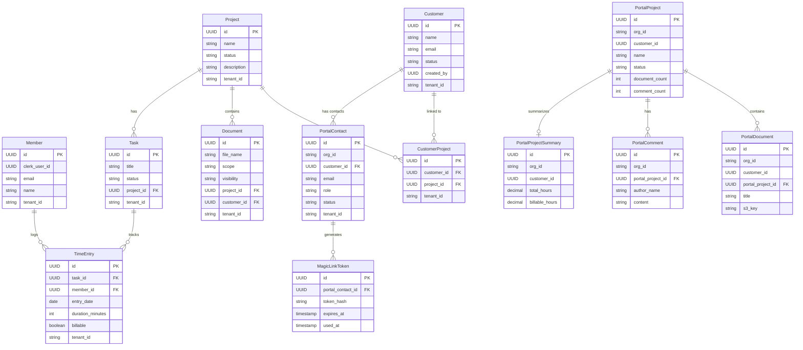

# Phase 7 — Customer Portal Backend Prototype

> Merge into `ARCHITECTURE.md` as **Section 13**. ADR files go in `adr/`.

---

## 13.1 Overview

Phase 7 takes the existing customer portal MVP (built in Phase 4, Epic 43) and evolves it into a **production-grade backend prototype** with proper domain event integration, a dedicated read-model schema, and a developer test harness.

The Phase 4 portal already provides:
- Magic-link authentication with JWT-based sessions (`MagicLinkService`, `PortalJwtService`)
- Customer auth filter chain with `ScopedValue` context binding (`CustomerAuthFilter`)
- Read-only project and document endpoints (`PortalProjectController`, `PortalDocumentController`)
- Frontend Next.js portal app (`/portal/*` routes)

Phase 7 **extends** this foundation with:

| Existing (Phase 4) | New (Phase 7) |
|---------------------|---------------|
| Magic links stored as stateless JWTs with Caffeine-based single-use tracking | `PortalContact` entity + `MagicLinkToken` table for persistent, auditable token management |
| Portal queries directly hit tenant schema tables | Dedicated `portal` schema with denormalized read-model entities |
| No event system — controllers query core entities directly | Spring `ApplicationEvent` publication from core domain; event handlers update read models |
| Next.js frontend portal (production-ready) | Additional Thymeleaf test harness (dev/local profile only) for backend-focused testing |
| Customer identified by `Customer.email` lookup | `PortalContact` entity with role, status, and multi-email support per customer |
| No public comments | `PortalComment` read model for customer-visible comments |
| No project/billing summaries | `PortalProjectSummary` stub for time/billing rollups |

### What's Out of Scope

- Separate microservice deployment for the portal (future phase)
- Payment processor / PSP integration
- Email delivery infrastructure (magic links are returned in API response for now)
- Company-level access control (customers remain contact-level entities)
- Production-grade customer frontend redesign (the existing Next.js portal continues to serve)

---

## 13.2 Domain Model

### 13.2.1 New Entities

#### PortalContact

Bridges a customer's email to their portal access. One `Customer` can have multiple `PortalContact` records (e.g., primary contact, billing contact, general contact).

| Field | Type | Constraints | Notes |
|-------|------|-------------|-------|
| `id` | `UUID` | PK, `gen_random_uuid()` | |
| `org_id` | `VARCHAR(255)` | NOT NULL | Clerk org ID — for cross-schema lookups |
| `customer_id` | `UUID` | NOT NULL, FK → `customers(id)` | Link to core domain |
| `email` | `VARCHAR(255)` | NOT NULL | Contact email address |
| `display_name` | `VARCHAR(255)` | | Human-readable name for portal UI |
| `role` | `VARCHAR(20)` | NOT NULL, DEFAULT `'GENERAL'` | `PRIMARY`, `BILLING`, `GENERAL` |
| `status` | `VARCHAR(20)` | NOT NULL, DEFAULT `'ACTIVE'` | `ACTIVE`, `SUSPENDED`, `ARCHIVED` |
| `tenant_id` | `VARCHAR(255)` | | Hibernate tenant filter |
| `created_at` | `TIMESTAMP` | NOT NULL, DEFAULT `now()` | Immutable |
| `updated_at` | `TIMESTAMP` | NOT NULL, DEFAULT `now()` | Updated on mutation |

**Design decisions:**
- Lives in the **tenant schema** (not the portal read-model schema) because it's an authoritative entity that staff manage, not a derived read model.
- `org_id` is denormalized to avoid a join to `org_schema_mappings` during magic-link request flow — the auth controller needs to resolve org → schema before it can query tenant tables.
- `UNIQUE(email, customer_id)` — one email per customer contact role. A single email can appear across multiple customers (e.g., a consultant who works with several clients).

#### MagicLinkToken

Persistent, auditable token records replacing the current stateless JWT + Caffeine approach.

| Field | Type | Constraints | Notes |
|-------|------|-------------|-------|
| `id` | `UUID` | PK, `gen_random_uuid()` | |
| `portal_contact_id` | `UUID` | NOT NULL, FK → `portal_contacts(id)` | Token is for this contact |
| `token_hash` | `VARCHAR(64)` | NOT NULL, UNIQUE | SHA-256 hash of the opaque token |
| `expires_at` | `TIMESTAMP` | NOT NULL | Created + 15 minutes |
| `used_at` | `TIMESTAMP` | | Set on first (and only) use |
| `created_at` | `TIMESTAMP` | NOT NULL, DEFAULT `now()` | |
| `created_ip` | `VARCHAR(45)` | | IPv4/IPv6 of requester (audit) |

**Design decisions:**
- Store **hash** of token, never the raw value. The raw token is only transmitted in the magic link URL.
- `used_at` NOT NULL means consumed — provides single-use semantics without a separate boolean.
- Lives in the **tenant schema** alongside `PortalContact` — both are authoritative data managed by the core domain.
- Replaces the Caffeine cache approach. The cache was acceptable for MVP but doesn't survive restarts, can't be audited, and doesn't scale to multiple instances.
- Index on `token_hash` for O(1) lookup during login.
- Index on `portal_contact_id` + `created_at DESC` for "resend last link" and rate-limiting queries.

### 13.2.2 Read-Model Entities (Portal Schema)

These entities live in a **dedicated `portal` schema** (not a tenant schema). They are **denormalized projections** maintained by event handlers. See [ADR-031](../adr/ADR-031-separate-portal-read-model-schema.md) for the schema separation rationale.

#### PortalProject

| Field | Type | Constraints | Notes |
|-------|------|-------------|-------|
| `id` | `UUID` | PK | Same as core `projects.id` |
| `org_id` | `VARCHAR(255)` | NOT NULL | Clerk org ID |
| `customer_id` | `UUID` | NOT NULL | Which customer this projection is for |
| `name` | `VARCHAR(255)` | NOT NULL | Copied from core |
| `status` | `VARCHAR(50)` | NOT NULL | Copied from core |
| `description` | `TEXT` | | Copied from core |
| `document_count` | `INT` | NOT NULL, DEFAULT `0` | Count of SHARED-visibility docs |
| `comment_count` | `INT` | NOT NULL, DEFAULT `0` | Count of public comments |
| `created_at` | `TIMESTAMP` | NOT NULL | From core project |
| `updated_at` | `TIMESTAMP` | NOT NULL | Last sync time |

**Key design:**
- Composite primary key: `(id, customer_id)` — the same core project may be linked to multiple customers, each getting their own projection row.
- `document_count` and `comment_count` are maintained by event handlers to avoid N+1 queries on the portal project list page.

#### PortalDocument

| Field | Type | Constraints | Notes |
|-------|------|-------------|-------|
| `id` | `UUID` | PK | Same as core `documents.id` |
| `org_id` | `VARCHAR(255)` | NOT NULL | Clerk org ID |
| `customer_id` | `UUID` | | NULL for org-scoped docs |
| `portal_project_id` | `UUID` | | NULL for non-project docs |
| `title` | `VARCHAR(500)` | NOT NULL | `fileName` from core |
| `content_type` | `VARCHAR(100)` | | MIME type |
| `size` | `BIGINT` | | File size in bytes |
| `scope` | `VARCHAR(20)` | NOT NULL | `PROJECT`, `ORG`, `CUSTOMER` |
| `s3_key` | `VARCHAR(1000)` | NOT NULL | For presigned URL generation |
| `uploaded_at` | `TIMESTAMP` | | From core |
| `synced_at` | `TIMESTAMP` | NOT NULL | When this projection was last updated |

**Key design:**
- Only documents with `visibility = SHARED` are projected into this schema. The event handler filters on visibility before inserting.
- `s3_key` is stored so the portal can generate presigned download URLs without querying the core database.

#### PortalComment

| Field | Type | Constraints | Notes |
|-------|------|-------------|-------|
| `id` | `UUID` | PK | Same as core comment ID |
| `org_id` | `VARCHAR(255)` | NOT NULL | Clerk org ID |
| `portal_project_id` | `UUID` | NOT NULL, FK → `portal_projects(id)` | |
| `author_name` | `VARCHAR(255)` | NOT NULL | Denormalized author display name |
| `content` | `TEXT` | NOT NULL | Comment body |
| `created_at` | `TIMESTAMP` | NOT NULL | From core |
| `synced_at` | `TIMESTAMP` | NOT NULL | When projected |

**Key design:**
- Only comments marked as `customer_visible = true` are projected. This requires adding a `customer_visible BOOLEAN NOT NULL DEFAULT false` column to the relevant core entity (tasks or a future comments table) in migration V14.
- `author_name` is denormalized to avoid cross-schema joins. Updated if member display name changes.

#### PortalProjectSummary

Stub entity for time/billing rollups. Fields are intentionally minimal for Phase 7 — will be enriched when billing integration is added.

| Field | Type | Constraints | Notes |
|-------|------|-------------|-------|
| `id` | `UUID` | PK | Same as `portal_projects.id` |
| `org_id` | `VARCHAR(255)` | NOT NULL | Clerk org ID |
| `customer_id` | `UUID` | NOT NULL | |
| `total_hours` | `DECIMAL(10,2)` | DEFAULT `0` | Aggregated from TimeEntry |
| `billable_hours` | `DECIMAL(10,2)` | DEFAULT `0` | Subset of total |
| `last_activity_at` | `TIMESTAMP` | | Most recent time entry |
| `synced_at` | `TIMESTAMP` | NOT NULL | Last aggregation |

### 13.2.3 Updated ER Diagram



---

## 13.3 Core Flows and Backend Behaviour

### 13.3.1 Magic-Link Authentication Flow (Upgraded)

**Current state (Phase 4):** Magic links are stateless JWTs. Single-use enforcement uses Caffeine cache keyed by JTI. `PortalAuthController` looks up `Customer` by email directly.

**Phase 7 upgrade:** Magic links become persistent `MagicLinkToken` records tied to `PortalContact`. This enables audit trails, rate limiting, and multi-instance deployments.

**Flow:**

1. **Request magic link** — `POST /portal/auth/request-link`
   ```
   Input: { email, orgId }

   1. Resolve org → tenant schema via OrgSchemaMappingRepository
   2. Within tenant scope: find PortalContact by email + org_id
      - If not found → 404 (do not reveal whether email exists)
      - If found but SUSPENDED/ARCHIVED → 403
   3. Rate-limit check: count tokens created for this contact in last 5 minutes
      - If > 3 → 429 Too Many Requests
   4. Generate 32-byte cryptographically random token (SecureRandom)
   5. Hash token with SHA-256
   6. Insert MagicLinkToken(portal_contact_id, token_hash, expires_at = now + 15min, created_ip)
   7. Return { message: "If an account exists, a link has been sent" }
      - In dev profile: also return { magicLink: "/portal/login?token=..." }
   ```

2. **Exchange token** — `POST /portal/auth/exchange`
   ```
   Input: { token }

   1. Hash the provided token with SHA-256
   2. Look up MagicLinkToken by token_hash (cross-tenant: portal_contacts has org_id)
      - Not found → 401
      - expired (expires_at < now) → 401
      - already used (used_at IS NOT NULL) → 401
   3. Mark token as used: SET used_at = now()
   4. Load PortalContact → resolve org_id → tenant schema
   5. Verify customer still exists and is ACTIVE in tenant
   6. Issue portal JWT via PortalJwtService (unchanged: 1h TTL, HMAC-SHA256)
   7. Return { token: "<jwt>", customerName, customerId }
   ```

**Tenant boundary enforcement:**
- `PortalContact.org_id` scopes all portal operations to a single organization.
- `CustomerAuthFilter` resolves `org_id` from the portal JWT claims and binds `RequestScopes.TENANT_ID` — all subsequent Hibernate queries are automatically scoped.
- Portal users can never access data from another organization, even in shared-schema (`tenant_shared`) mode.

**RBAC:**
- Portal contacts have no role hierarchy — all authenticated contacts get the same read-only access to their linked customer's projects and shared documents.
- Staff control what's visible by setting `Document.visibility = SHARED` and linking customers to projects via `CustomerProject`.

### 13.3.2 Read-Model Synchronization via Events

The core domain publishes `ApplicationEvent` instances when authoritative data changes. The `customerbackend` package listens to these events and updates the portal read-model schema.

**Consistency model:** Eventual consistency. Events are processed in-process and synchronously within the same transaction boundary (via `@TransactionalEventListener(phase = AFTER_COMMIT)`). This means read models lag by milliseconds in practice, but are decoupled from the write path.

**Error handling:**
- Event handlers catch and log exceptions — a failed projection must not roll back the core domain transaction.
- `synced_at` timestamps on read-model entities allow detection of stale projections.
- A manual resync endpoint (`POST /internal/portal/resync/{orgId}`) is provided for disaster recovery.

### 13.3.3 Portal API Access Pattern

All portal endpoints follow the same access pattern:

```
1. CustomerAuthFilter extracts portal JWT from Authorization header
2. Resolves org_id → tenant schema
3. Binds ScopedValues: CUSTOMER_ID, TENANT_ID, ORG_ID
4. TenantFilter sets Hibernate search_path (or @Filter for shared schema)
5. Controller calls PortalQueryService (unchanged for project/document reads)
   OR calls new PortalReadModelService (for read-model queries)
6. Service queries portal schema entities — scoped by org_id + customer_id
```

**Starter vs Pro tenants:**
- **Pro** (schema-per-tenant): Portal read model queries use `org_id` as the scoping key. The portal schema is shared across all tenants (it's a flat read model, not multi-tenant itself).
- **Starter** (shared schema `tenant_shared`): Same portal schema, same `org_id` scoping. No difference from the portal's perspective.

### 13.3.4 Thymeleaf Test Harness

A dev/local-only UI served by Spring Boot for backend-focused testing. See [ADR-033](../adr/ADR-033-local-only-thymeleaf-test-harness.md).

**Profile guard:** All Thymeleaf controllers and template resolution are conditional on `@Profile({"local", "dev"})`. In production profiles, these beans are not created and the templates are not served.

**Views:**
1. **Magic Link Generator** (`/portal/dev/generate-link`)
   - Form: email + org ID
   - Creates `PortalContact` if not exists
   - Generates magic link token
   - Displays clickable link on page (no email sending)

2. **Portal Dashboard** (`/portal/dev/dashboard`)
   - After magic-link login: shows project list, documents, comments
   - Exercises the same backend services as the Next.js portal
   - Minimal styling (Thymeleaf + basic CSS)

---

## 13.4 API Surface

### 13.4.1 Authentication Endpoints (Updated)

| Method | Path | Description | Auth | R/W |
|--------|------|-------------|------|-----|
| `POST` | `/portal/auth/request-link` | Request magic link for email | Public | Write |
| `POST` | `/portal/auth/exchange` | Exchange token for portal JWT | Public | Write |

**Request — `POST /portal/auth/request-link`**
```json
{
  "email": "alice@acme.com",
  "orgId": "org_2abc123"
}
```

**Response (dev profile)**
```json
{
  "message": "If an account exists, a link has been sent.",
  "magicLink": "https://localhost:3000/portal?token=a1b2c3d4e5f6..."
}
```

**Response (production profile)**
```json
{
  "message": "If an account exists, a link has been sent."
}
```

**Request — `POST /portal/auth/exchange`**
```json
{
  "token": "a1b2c3d4e5f6..."
}
```

**Response**
```json
{
  "token": "eyJhbGciOiJIUzI1NiJ9...",
  "customerId": "550e8400-e29b-41d4-a716-446655440000",
  "customerName": "Alice Smith"
}
```

### 13.4.2 Portal API Endpoints (Existing + New)

All require valid portal JWT in `Authorization: Bearer <token>` header. Scoped by `PortalContact.org_id` and linked customer.

| Method | Path | Description | Source | Auth |
|--------|------|-------------|--------|------|
| `GET` | `/portal/projects` | List customer's projects | Existing (Phase 4) | Portal JWT |
| `GET` | `/portal/projects/{id}` | Project details | **New** | Portal JWT |
| `GET` | `/portal/projects/{id}/documents` | Project's shared documents | Existing (Phase 4) | Portal JWT |
| `GET` | `/portal/projects/{id}/comments` | Project's public comments | **New** | Portal JWT |
| `GET` | `/portal/projects/{id}/summary` | Time/billing summary stub | **New** | Portal JWT |
| `GET` | `/portal/documents` | All shared documents | Existing (Phase 4) | Portal JWT |
| `GET` | `/portal/documents/{id}/presign-download` | Presigned S3 download URL | Existing (Phase 4) | Portal JWT |
| `GET` | `/portal/me` | Current contact profile | **New** | Portal JWT |

**New endpoint responses:**

**`GET /portal/projects/{id}`**
```json
{
  "id": "550e8400-...",
  "name": "Website Redesign",
  "status": "IN_PROGRESS",
  "description": "Full redesign of corporate website",
  "documentCount": 5,
  "commentCount": 3,
  "createdAt": "2026-01-15T10:00:00Z"
}
```

**`GET /portal/projects/{id}/comments`**
```json
[
  {
    "id": "660e8400-...",
    "authorName": "Jane Doe",
    "content": "Draft v2 is ready for your review.",
    "createdAt": "2026-02-10T14:30:00Z"
  }
]
```

**`GET /portal/projects/{id}/summary`**
```json
{
  "projectId": "550e8400-...",
  "totalHours": 42.5,
  "billableHours": 38.0,
  "lastActivityAt": "2026-02-11T16:00:00Z"
}
```

**`GET /portal/me`**
```json
{
  "contactId": "770e8400-...",
  "customerId": "550e8400-...",
  "customerName": "Acme Corp",
  "email": "alice@acme.com",
  "displayName": "Alice Smith",
  "role": "PRIMARY"
}
```

### 13.4.3 Internal Endpoints

| Method | Path | Description | Auth |
|--------|------|-------------|------|
| `POST` | `/internal/portal/resync/{orgId}` | Re-project all read models for an org | Internal API key |

### 13.4.4 Dev-Only Endpoints (Thymeleaf)

| Method | Path | Description | Profile |
|--------|------|-------------|---------|
| `GET` | `/portal/dev/generate-link` | Magic link generator form | `local`, `dev` |
| `POST` | `/portal/dev/generate-link` | Generate magic link | `local`, `dev` |
| `GET` | `/portal/dev/dashboard` | Portal dashboard (post-login) | `local`, `dev` |

---

## 13.5 Sequence Diagrams

### 13.5.1 Magic Link Login Flow


### 13.5.2 Domain Event → Read Model Projection


---

## 13.6 Event Publication and Consumption

### 13.6.1 Event Types

All events extend a common `PortalDomainEvent` base class. Events are **shaped for future out-of-process messaging** (SQS, etc.) — they carry all necessary data and avoid entity references. See [ADR-032](../adr/ADR-032-spring-application-events-for-portal.md).

```java
public abstract sealed class PortalDomainEvent {
    private final String orgId;       // Clerk org ID
    private final String tenantId;    // Schema name
    private final Instant occurredAt; // Event timestamp
}
```

| Event | Payload | Trigger |
|-------|---------|---------|
| `CustomerCreatedEvent` | `customerId`, `name`, `email`, `orgId` | Staff creates a customer |
| `CustomerUpdatedEvent` | `customerId`, `name`, `email`, `status`, `orgId` | Staff updates customer details |
| `ProjectCreatedEvent` | `projectId`, `name`, `description`, `status`, `orgId` | Staff creates a project |
| `ProjectUpdatedEvent` | `projectId`, `name`, `description`, `status`, `orgId` | Staff updates project details |
| `ProjectStatusChangedEvent` | `projectId`, `status`, `previousStatus`, `orgId` | Project status transitions |
| `CustomerProjectLinkedEvent` | `customerId`, `projectId`, `orgId` | Staff links customer to project |
| `CustomerProjectUnlinkedEvent` | `customerId`, `projectId`, `orgId` | Staff unlinks customer from project |
| `DocumentCreatedEvent` | `documentId`, `projectId`, `customerId`, `fileName`, `scope`, `visibility`, `s3Key`, `size`, `contentType`, `orgId` | Staff uploads document |
| `DocumentVisibilityChangedEvent` | `documentId`, `visibility`, `previousVisibility`, `orgId` | Staff changes doc visibility |
| `DocumentDeletedEvent` | `documentId`, `orgId` | Staff deletes document |
| `TimeEntryAggregatedEvent` | `projectId`, `totalHours`, `billableHours`, `lastActivityAt`, `orgId` | Periodic or on-change time aggregation |

### 13.6.2 Publication Points

Events are published from **service methods** in the core domain, not from controllers or repositories. This ensures events are only published when the business operation succeeds.

```java
// Example: DocumentService.java
@Transactional
public Document createDocument(CreateDocumentRequest request) {
    Document doc = documentRepository.save(new Document(...));

    eventPublisher.publishEvent(new DocumentCreatedEvent(
        doc.getId(),
        doc.getProjectId(),
        doc.getCustomerId(),
        doc.getFileName(),
        doc.getScope().name(),
        doc.getVisibility().name(),
        doc.getS3Key(),
        doc.getSize(),
        doc.getContentType(),
        RequestScopes.requireOrgId(),
        RequestScopes.requireTenantId()
    ));

    return doc;
}
```

### 13.6.3 Event Handlers

A single `PortalEventHandler` class in the `customerbackend` package listens to all domain events and updates the portal read-model schema.

```java
@Component
public class PortalEventHandler {

    private final PortalReadModelRepository readModelRepo;

    @TransactionalEventListener(phase = AFTER_COMMIT)
    public void onDocumentCreated(DocumentCreatedEvent event) {
        if (!"SHARED".equals(event.visibility())) return;

        // Find all customers linked to this project
        List<UUID> customerIds = readModelRepo
            .findCustomerIdsByProjectId(event.projectId(), event.orgId());

        for (UUID customerId : customerIds) {
            readModelRepo.upsertPortalDocument(event, customerId);
            readModelRepo.incrementDocumentCount(event.projectId(), customerId);
        }
    }

    // ... handlers for each event type
}
```

**Error isolation:**
- Each handler method catches exceptions and logs them via SLF4J.
- A failed projection does not affect the core domain transaction (events fire AFTER_COMMIT).
- The `synced_at` field on read-model entities enables staleness detection.

### 13.6.4 Future Migration Path

These in-process events are shaped to map directly to SQS/SNS messages:
- Event class → JSON message body (all fields are serializable primitives)
- `@TransactionalEventListener` → SQS consumer
- `ApplicationEventPublisher.publishEvent()` → `SqsTemplate.send()`
- No behavioral change needed in the handler logic — only the transport changes.

---

## 13.7 Component Architecture

```mermaid
flowchart TB
    subgraph Staff["Staff App (Next.js)"]
        StaffUI[Staff UI<br/>Clerk Auth]
    end

    subgraph Portal["Customer Portal"]
        PortalUI[Next.js Portal<br/>Magic Link Auth]
        DevUI[Thymeleaf Harness<br/>dev/local only]
    end

    subgraph SpringBoot["Spring Boot Application"]
        subgraph CoreDomain["Core Domain"]
            CoreAPI["/api/* Controllers"]
            CoreServices["Services<br/>(Project, Document, Customer, Task)"]
            EventPub["ApplicationEventPublisher"]
        end

        subgraph CustomerBackend["Customer Backend Slice"]
            PortalAPI["/portal/* Controllers"]
            PortalAuth["Auth Controllers<br/>+ MagicLinkService"]
            PortalQuery["PortalQueryService"]
            EventHandler["PortalEventHandler"]
            ReadModelRepo["PortalReadModelRepository"]
            DevControllers["DevPortalController<br/>(local/dev only)"]
        end

        subgraph Security["Security Layer"]
            ClerkFilter["ClerkJwtAuthFilter"]
            CustomerFilter["CustomerAuthFilter"]
            TenantFilter["TenantFilter"]
        end
    end

    subgraph Databases["Data Stores"]
        TenantDB[("Tenant Schema<br/>(projects, documents,<br/>customers, portal_contacts,<br/>magic_link_tokens)")]
        PortalDB[("Portal Schema<br/>(portal_projects,<br/>portal_documents,<br/>portal_comments,<br/>portal_project_summaries)")]
        S3[("S3<br/>Document Files")]
    end

    StaffUI -->|Clerk JWT| ClerkFilter
    ClerkFilter --> TenantFilter
    TenantFilter --> CoreAPI
    CoreAPI --> CoreServices
    CoreServices --> TenantDB
    CoreServices --> S3
    CoreServices -->|publish| EventPub

    PortalUI -->|Portal JWT| CustomerFilter
    DevUI -->|Portal JWT| CustomerFilter
    CustomerFilter --> TenantFilter
    TenantFilter --> PortalAPI
    PortalAPI --> PortalQuery
    PortalQuery --> PortalDB

    PortalUI -->|public| PortalAuth
    DevUI -->|public| PortalAuth
    PortalAuth --> TenantDB

    EventPub -->|@TransactionalEventListener| EventHandler
    EventHandler --> ReadModelRepo
    ReadModelRepo --> PortalDB
```

---

## 13.8 Database Migrations

### 13.8.1 Tenant Schema — V14: Create Portal Contacts and Magic Link Tokens

```sql
-- V14__create_portal_contacts_and_magic_link_tokens.sql

-- PortalContact: bridges customer emails to portal access
CREATE TABLE portal_contacts (
    id          UUID PRIMARY KEY DEFAULT gen_random_uuid(),
    org_id      VARCHAR(255) NOT NULL,
    customer_id UUID NOT NULL REFERENCES customers(id) ON DELETE CASCADE,
    email       VARCHAR(255) NOT NULL,
    display_name VARCHAR(255),
    role        VARCHAR(20) NOT NULL DEFAULT 'GENERAL',
    status      VARCHAR(20) NOT NULL DEFAULT 'ACTIVE',
    tenant_id   VARCHAR(255),
    created_at  TIMESTAMP NOT NULL DEFAULT now(),
    updated_at  TIMESTAMP NOT NULL DEFAULT now()
);

-- One email per customer (can appear across different customers)
CREATE UNIQUE INDEX uq_portal_contacts_email_customer
    ON portal_contacts(email, customer_id);

-- Lookup by email + org (magic link request)
CREATE INDEX idx_portal_contacts_email_org
    ON portal_contacts(email, org_id);

-- Lookup by customer (list contacts for a customer)
CREATE INDEX idx_portal_contacts_customer
    ON portal_contacts(customer_id);

-- Tenant filter
CREATE INDEX idx_portal_contacts_tenant
    ON portal_contacts(tenant_id);

-- RLS policy for shared schema
CREATE POLICY tenant_isolation_portal_contacts ON portal_contacts
    USING (tenant_id = current_setting('app.tenant_id', true));


-- MagicLinkToken: persistent, auditable token records
CREATE TABLE magic_link_tokens (
    id                  UUID PRIMARY KEY DEFAULT gen_random_uuid(),
    portal_contact_id   UUID NOT NULL REFERENCES portal_contacts(id) ON DELETE CASCADE,
    token_hash          VARCHAR(64) NOT NULL,
    expires_at          TIMESTAMP NOT NULL,
    used_at             TIMESTAMP,
    created_at          TIMESTAMP NOT NULL DEFAULT now(),
    created_ip          VARCHAR(45)
);

-- Token lookup (login exchange)
CREATE UNIQUE INDEX uq_magic_link_tokens_hash
    ON magic_link_tokens(token_hash);

-- Rate limiting (count recent tokens per contact)
CREATE INDEX idx_magic_link_tokens_contact_created
    ON magic_link_tokens(portal_contact_id, created_at DESC);

-- Cleanup (find expired/used tokens for batch deletion)
CREATE INDEX idx_magic_link_tokens_expires
    ON magic_link_tokens(expires_at);


-- Add customer_visible flag to tasks (for portal comment projection)
ALTER TABLE tasks ADD COLUMN customer_visible BOOLEAN NOT NULL DEFAULT false;
```

**Notes:**
- `magic_link_tokens` does **not** have a `tenant_id` column — tokens are looked up by `token_hash` across all tenants. The `portal_contact_id` FK provides the tenant association.
- RLS policy on `portal_contacts` uses the same `app.tenant_id` session variable set by `TenantFilterTransactionManager`.
- `ON DELETE CASCADE` ensures cleanup when a customer or contact is removed.

### 13.8.2 Global Schema — V7: Create Portal Read-Model Schema

```sql
-- V7__create_portal_schema.sql

-- Create the portal schema for read-model entities
CREATE SCHEMA IF NOT EXISTS portal;

-- PortalProject: denormalized project view per customer
CREATE TABLE portal.portal_projects (
    id              UUID NOT NULL,
    org_id          VARCHAR(255) NOT NULL,
    customer_id     UUID NOT NULL,
    name            VARCHAR(255) NOT NULL,
    status          VARCHAR(50) NOT NULL,
    description     TEXT,
    document_count  INT NOT NULL DEFAULT 0,
    comment_count   INT NOT NULL DEFAULT 0,
    created_at      TIMESTAMP NOT NULL,
    updated_at      TIMESTAMP NOT NULL DEFAULT now(),
    PRIMARY KEY (id, customer_id)
);

CREATE INDEX idx_portal_projects_org_customer
    ON portal.portal_projects(org_id, customer_id);

-- PortalDocument: shared-visibility documents
CREATE TABLE portal.portal_documents (
    id                  UUID PRIMARY KEY,
    org_id              VARCHAR(255) NOT NULL,
    customer_id         UUID,
    portal_project_id   UUID,
    title               VARCHAR(500) NOT NULL,
    content_type        VARCHAR(100),
    size                BIGINT,
    scope               VARCHAR(20) NOT NULL,
    s3_key              VARCHAR(1000) NOT NULL,
    uploaded_at         TIMESTAMP,
    synced_at           TIMESTAMP NOT NULL DEFAULT now()
);

CREATE INDEX idx_portal_documents_project
    ON portal.portal_documents(portal_project_id);

CREATE INDEX idx_portal_documents_org_customer
    ON portal.portal_documents(org_id, customer_id);

-- PortalComment: customer-visible comments
CREATE TABLE portal.portal_comments (
    id                  UUID PRIMARY KEY,
    org_id              VARCHAR(255) NOT NULL,
    portal_project_id   UUID NOT NULL,
    author_name         VARCHAR(255) NOT NULL,
    content             TEXT NOT NULL,
    created_at          TIMESTAMP NOT NULL,
    synced_at           TIMESTAMP NOT NULL DEFAULT now()
);

CREATE INDEX idx_portal_comments_project
    ON portal.portal_comments(portal_project_id);

-- PortalProjectSummary: time/billing rollup stub
CREATE TABLE portal.portal_project_summaries (
    id              UUID NOT NULL,
    org_id          VARCHAR(255) NOT NULL,
    customer_id     UUID NOT NULL,
    total_hours     DECIMAL(10,2) NOT NULL DEFAULT 0,
    billable_hours  DECIMAL(10,2) NOT NULL DEFAULT 0,
    last_activity_at TIMESTAMP,
    synced_at       TIMESTAMP NOT NULL DEFAULT now(),
    PRIMARY KEY (id, customer_id)
);
```

**Notes:**
- The `portal` schema is **not** tenant-scoped — it uses `org_id` as the partitioning key. All organizations' read models coexist in one schema.
- This is a deliberate simplification for Phase 7. If the read model grows large, it can be partitioned by `org_id` or moved to a separate database (the schema boundary makes this straightforward).
- No RLS policies on portal schema — access control is enforced at the application layer by `CustomerAuthFilter` + `PortalQueryService`.
- Composite PKs `(id, customer_id)` on `portal_projects` and `portal_project_summaries` allow the same core project to be projected for multiple customers.

---

## 13.9 Implementation Guidance

### 13.9.1 Backend Changes

| File / Package | Change |
|----------------|--------|
| `portal/PortalContact.java` | **New** — JPA entity, `@FilterDef`/`@Filter`, `TenantAware` |
| `portal/PortalContactRepository.java` | **New** — JPQL `findByEmailAndOrgId()`, `findByCustomerId()` |
| `portal/MagicLinkToken.java` | **New** — JPA entity (no tenant filter — cross-tenant lookup) |
| `portal/MagicLinkTokenRepository.java` | **New** — `findByTokenHash()`, `countByContactAndCreatedAfter()` |
| `portal/MagicLinkService.java` | **Modify** — Replace JWT+Caffeine approach with DB-backed tokens |
| `portal/PortalAuthController.java` | **Modify** — Use `PortalContact` instead of direct `Customer` lookup |
| `portal/CustomerAuthFilter.java` | **Modify** — Resolve `PortalContact` from JWT `customerId` claim, bind existing `CUSTOMER_ID` |
| `customerbackend/` | **New package** — event handlers, read-model entities, repositories |
| `customerbackend/event/PortalDomainEvent.java` | **New** — Sealed base class for domain events |
| `customerbackend/event/DocumentCreatedEvent.java` | **New** — Event record (+ similar for all event types) |
| `customerbackend/handler/PortalEventHandler.java` | **New** — `@TransactionalEventListener` handlers |
| `customerbackend/model/PortalProject.java` | **New** — Read-model entity (portal schema) |
| `customerbackend/model/PortalDocument.java` | **New** — Read-model entity (portal schema) |
| `customerbackend/model/PortalComment.java` | **New** — Read-model entity (portal schema) |
| `customerbackend/model/PortalProjectSummary.java` | **New** — Read-model entity (portal schema) |
| `customerbackend/repository/PortalReadModelRepository.java` | **New** — JDBC-based repo for portal schema |
| `customerbackend/service/PortalReadModelService.java` | **New** — Query facade for read models |
| `customerbackend/controller/PortalCommentController.java` | **New** — `GET /portal/projects/{id}/comments` |
| `customerbackend/controller/PortalSummaryController.java` | **New** — `GET /portal/projects/{id}/summary` |
| `customerbackend/controller/PortalProfileController.java` | **New** — `GET /portal/me` |
| `portal/PortalProjectController.java` | **Modify** — Add `GET /portal/projects/{id}` detail endpoint |
| `config/PortalDataSourceConfig.java` | **New** — DataSource bean for portal schema |
| `config/DevPortalConfig.java` | **New** — `@Profile({"local","dev"})` Thymeleaf config |
| `dev/DevPortalController.java` | **New** — Thymeleaf controllers (dev only) |
| `document/DocumentService.java` | **Modify** — Publish `DocumentCreatedEvent` after save |
| `project/ProjectService.java` | **Modify** — Publish `ProjectCreatedEvent`/`ProjectUpdatedEvent` |
| `customer/CustomerService.java` | **Modify** — Publish `CustomerCreatedEvent`/`CustomerUpdatedEvent` |
| `customer/CustomerProjectService.java` | **Modify** — Publish link/unlink events |
| `security/SecurityConfig.java` | **Modify** — Add `/portal/dev/**` to dev-only permit rules |

### 13.9.2 Frontend Changes

**No frontend changes in Phase 7.** The existing Next.js portal routes from Phase 4 continue to function for basic project/document access. New Phase 7 APIs (comments, summaries, profile) are exercised via the Thymeleaf dev harness only. The production portal frontend will be built as a separate application in a future phase.

### 13.9.3 Entity Code Pattern — PortalContact

```java
@Entity
@Table(name = "portal_contacts")
@FilterDef(name = "tenantFilter", parameters = @ParamDef(name = "tenantId", type = String.class))
@Filter(name = "tenantFilter", condition = "tenant_id = :tenantId")
@EntityListeners(TenantAwareEntityListener.class)
public class PortalContact implements TenantAware {

    @Id
    @GeneratedValue(strategy = GenerationType.UUID)
    private UUID id;

    @Column(name = "org_id", nullable = false)
    private String orgId;

    @Column(name = "customer_id", nullable = false)
    private UUID customerId;

    @Column(nullable = false)
    private String email;

    @Column(name = "display_name")
    private String displayName;

    @Column(nullable = false)
    @Enumerated(EnumType.STRING)
    private ContactRole role;

    @Column(nullable = false)
    @Enumerated(EnumType.STRING)
    private ContactStatus status;

    @Column(name = "tenant_id")
    private String tenantId;

    @Column(name = "created_at", nullable = false, updatable = false)
    private Instant createdAt;

    @Column(name = "updated_at", nullable = false)
    private Instant updatedAt;

    protected PortalContact() {} // JPA

    public PortalContact(String orgId, UUID customerId, String email,
                         String displayName, ContactRole role) {
        this.orgId = orgId;
        this.customerId = customerId;
        this.email = email;
        this.displayName = displayName;
        this.role = role;
        this.status = ContactStatus.ACTIVE;
        this.createdAt = Instant.now();
        this.updatedAt = this.createdAt;
    }

    // ... getters, TenantAware impl

    public enum ContactRole { PRIMARY, BILLING, GENERAL }
    public enum ContactStatus { ACTIVE, SUSPENDED, ARCHIVED }
}
```

### 13.9.4 Read-Model Repository Pattern

Read-model entities live in the `portal` schema and are managed via **JDBC** (not JPA/Hibernate) to avoid multi-`EntityManagerFactory` complexity. A single `JdbcClient` bean configured with the portal DataSource handles all read-model operations.

```java
@Repository
public class PortalReadModelRepository {

    private final JdbcClient jdbc;

    public PortalReadModelRepository(@Qualifier("portalJdbcClient") JdbcClient jdbc) {
        this.jdbc = jdbc;
    }

    public void upsertPortalProject(UUID projectId, UUID customerId,
                                     String orgId, String name,
                                     String status, String description,
                                     Instant createdAt) {
        jdbc.sql("""
            INSERT INTO portal.portal_projects
                (id, customer_id, org_id, name, status, description, created_at, updated_at)
            VALUES (?, ?, ?, ?, ?, ?, ?, now())
            ON CONFLICT (id, customer_id)
            DO UPDATE SET name = EXCLUDED.name,
                          status = EXCLUDED.status,
                          description = EXCLUDED.description,
                          updated_at = now()
            """)
            .params(projectId, customerId, orgId, name, status, description, createdAt)
            .update();
    }

    public List<PortalProjectView> findProjectsByCustomer(String orgId, UUID customerId) {
        return jdbc.sql("""
            SELECT id, name, status, description, document_count, comment_count, created_at
            FROM portal.portal_projects
            WHERE org_id = ? AND customer_id = ?
            ORDER BY created_at DESC
            """)
            .params(orgId, customerId)
            .query(PortalProjectView.class)
            .list();
    }
}
```

### 13.9.5 Testing Strategy

| Test | Scope | Description |
|------|-------|-------------|
| `PortalContactIntegrationTest` | Integration | CRUD operations, tenant isolation, email uniqueness |
| `MagicLinkTokenIntegrationTest` | Integration | Token creation, hash lookup, single-use enforcement, expiry |
| `MagicLinkServiceTest` | Unit | Token generation, rate limiting, hash verification |
| `PortalAuthFlowIntegrationTest` | Integration | Full request-link → exchange → JWT → API access flow |
| `PortalEventHandlerTest` | Unit | Each event type → correct read model update |
| `PortalReadModelIntegrationTest` | Integration | Event → projection → query round-trip |
| `PortalResyncIntegrationTest` | Integration | Full resync rebuilds read models correctly |
| `DevPortalControllerTest` | Integration | Thymeleaf views render, magic link generation works |
| `PortalCommentControllerTest` | Integration | Comment listing, project access validation |
| `PortalSummaryControllerTest` | Integration | Summary stub data, project access validation |
| `PortalProfileControllerTest` | Integration | Contact profile retrieval |
| `CrossTenantPortalIsolationTest` | Integration | Customer from org A cannot access org B data |

---

## 13.10 Permission Model Summary

### Portal Access Control

| Entity / Operation | Who Can Access | How Scoped |
|--------------------|---------------|------------|
| Request magic link | Anyone (public) | Rate-limited per email |
| Exchange token | Anyone with valid token | Token scoped to PortalContact |
| List projects | Authenticated portal contact | Contact's customer → CustomerProject links |
| View project details | Authenticated portal contact | Must be linked to project via CustomerProject |
| List documents | Authenticated portal contact | Only `visibility = SHARED` documents |
| Download document | Authenticated portal contact | Must be accessible via project or customer link |
| View comments | Authenticated portal contact | Only `customer_visible = true` comments |
| View summary | Authenticated portal contact | Derived from linked project's time entries |
| View profile (`/me`) | Authenticated portal contact | Own PortalContact record only |

### Staff Operations on Portal Entities

| Operation | Required Role | Notes |
|-----------|--------------|-------|
| Create PortalContact | Admin, Owner, Project Lead | Must have project access to the linked customer's projects |
| Update PortalContact | Admin, Owner | Role/status changes |
| Suspend PortalContact | Admin, Owner | Immediately invalidates magic links |
| Generate magic link (dev) | Dev profile only | Test harness access |
| Trigger resync | Internal API key | Disaster recovery |

### Role Hierarchy (unchanged)

`Owner > Admin > Project Lead > Contributor`

Portal contacts have no role hierarchy — all authenticated contacts get equal read-only access to their linked customer's data.

---

## 13.11 Capability Slices

### Slice A — PortalContact & Persistent Magic Links (Backend)

**Scope:** Backend only
**Dependencies:** None (builds on existing portal package)

**Deliverables:**
- `PortalContact` entity, repository, service
- `MagicLinkToken` entity, repository
- Upgraded `MagicLinkService` (DB-backed tokens, rate limiting)
- Updated `PortalAuthController` (PortalContact-based lookup)
- Updated `RequestScopes` (add `PORTAL_CONTACT_ID`)
- Tenant migration V14

**Tests:** `PortalContactIntegrationTest`, `MagicLinkTokenIntegrationTest`, `PortalAuthFlowIntegrationTest`

### Slice B — Portal Read-Model Schema & Event Infrastructure (Backend)

**Scope:** Backend only
**Dependencies:** Slice A (for PortalContact references)

**Deliverables:**
- Global migration V7 (create `portal` schema + tables)
- `PortalDataSourceConfig` (second DataSource for portal schema)
- `PortalReadModelRepository` (JDBC-based)
- `PortalDomainEvent` base class + all event records
- `PortalEventHandler` with `@TransactionalEventListener`
- Event publication in `DocumentService`, `ProjectService`, `CustomerService`, `CustomerProjectService`
- Internal resync endpoint

**Tests:** `PortalEventHandlerTest`, `PortalReadModelIntegrationTest`, `PortalResyncIntegrationTest`

### Slice C — Portal Comments & Summary APIs (Backend)

**Scope:** Backend only
**Dependencies:** Slice B (for read-model schema and events)

**Deliverables:**
- `PortalCommentController` (`GET /portal/projects/{id}/comments`)
- `PortalSummaryController` (`GET /portal/projects/{id}/summary`)
- `PortalProfileController` (`GET /portal/me`)
- Updated `PortalProjectController` (add project detail endpoint)
- `PortalReadModelService` (query facade)

**Tests:** `PortalCommentControllerTest`, `PortalSummaryControllerTest`, `PortalProfileControllerTest`, `CrossTenantPortalIsolationTest`

### Slice D — Thymeleaf Dev Harness (Backend)

**Scope:** Backend only (Thymeleaf templates)
**Dependencies:** Slices A, B, C

**Deliverables:**
- `spring-boot-starter-thymeleaf` dependency
- `DevPortalConfig` (`@Profile({"local","dev"})`)
- `DevPortalController` (magic link generator, portal dashboard views)
- Thymeleaf templates: `generate-link.html`, `dashboard.html`, `project-detail.html`
- Documentation: dev harness usage guide

**Tests:** `DevPortalControllerTest`

### Slice E — Frontend Portal Enhancements (Deferred)

**Status:** Deferred — do not implement in Phase 7.

The production customer portal will be a **separate frontend application** (separate Next.js repo/deployment), not part of the staff app. Adding more portal code to the current frontend increases entropy for the eventual separation. The existing Phase 4 portal routes (`/portal/*`) remain functional for basic project/document access but should not be extended.

**Instead:** Use the Thymeleaf dev harness (Slice D) to exercise all new Phase 7 backend APIs. When the production portal UI ships (future phase), it will consume these APIs from a clean, dedicated frontend.

---

## 13.12 ADR Index

| ADR | Title | Status |
|-----|-------|--------|
| [ADR-017](../adr/ADR-017-customer-as-org-child.md) | Customers as Children of Organization | Accepted |
| [ADR-018](../adr/ADR-018-document-scope-model.md) | Document Scope Representation | Accepted |
| [ADR-019](../adr/ADR-019-task-claim-workflow.md) | Task Claim Workflow | Accepted |
| [ADR-020](../adr/ADR-020-customer-portal-approach.md) | Customer Portal Authentication Approach | Accepted |
| [ADR-030](../adr/ADR-030-magic-link-auth-for-customers.md) | Magic Link Auth for Customers | Accepted |
| [ADR-031](../adr/ADR-031-separate-portal-read-model-schema.md) | Separate Portal Read-Model Schema | Accepted |
| [ADR-032](../adr/ADR-032-spring-application-events-for-portal.md) | Spring Application Events for Portal Sync | Accepted |
| [ADR-033](../adr/ADR-033-local-only-thymeleaf-test-harness.md) | Local-Only Thymeleaf Test Harness | Accepted |
