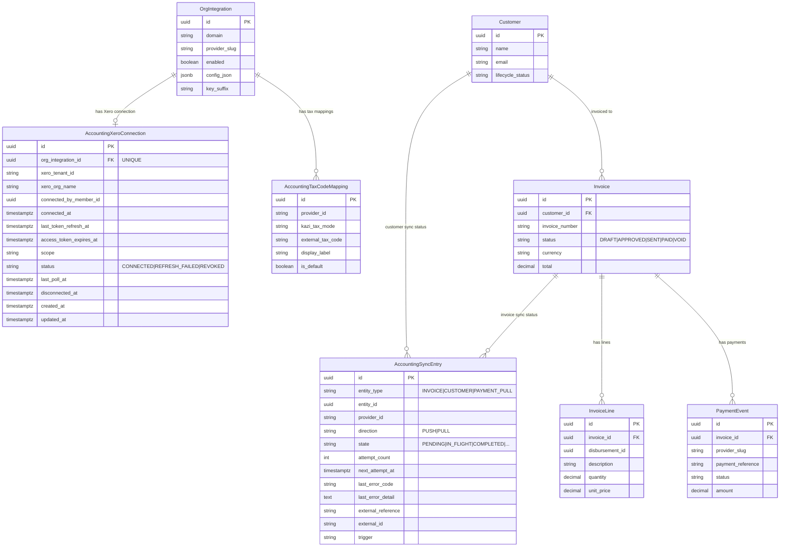
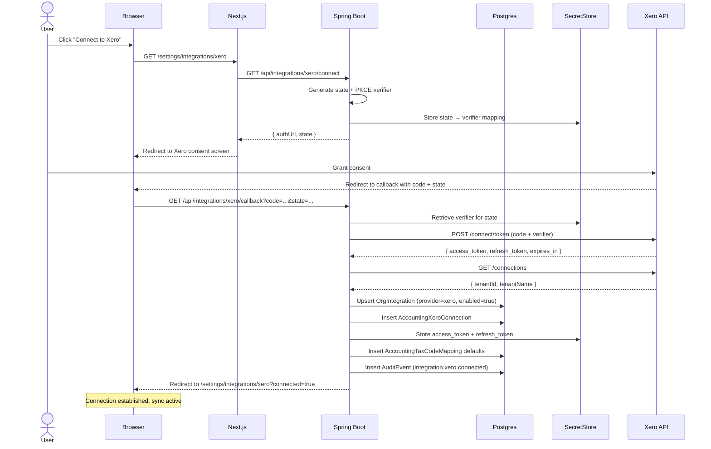
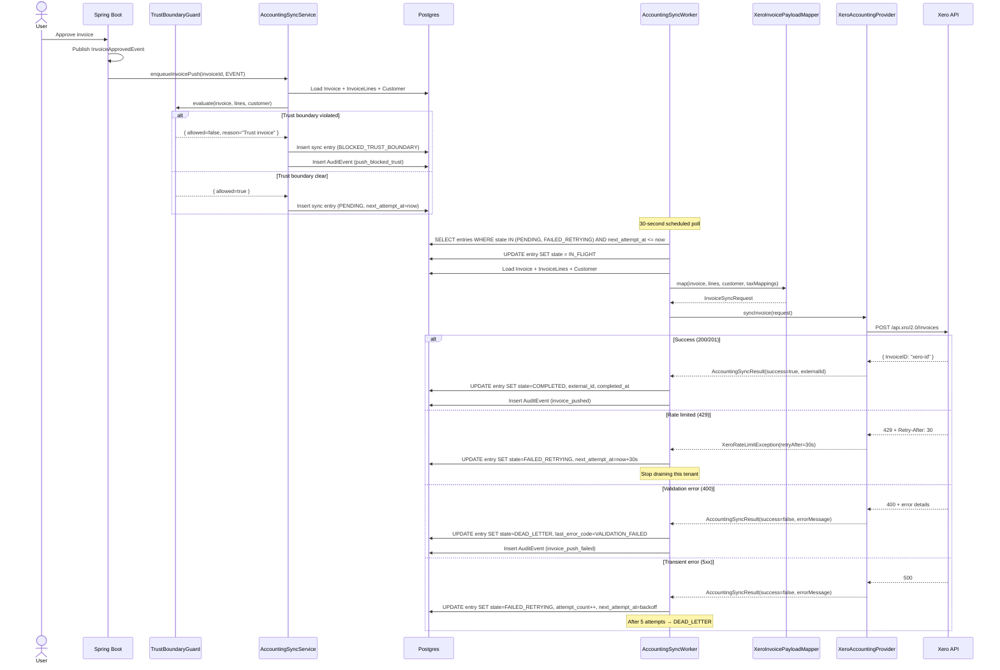
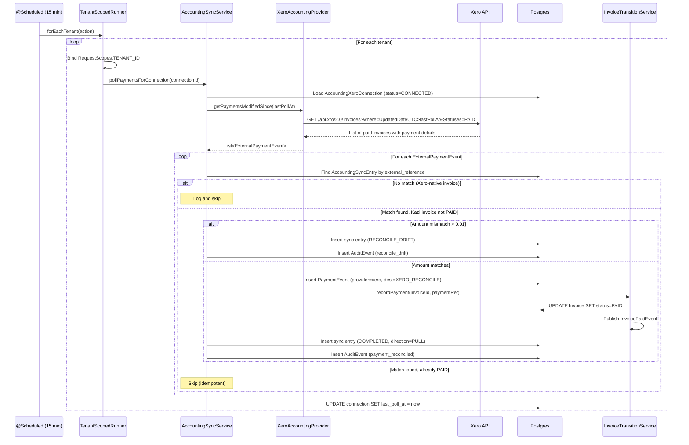
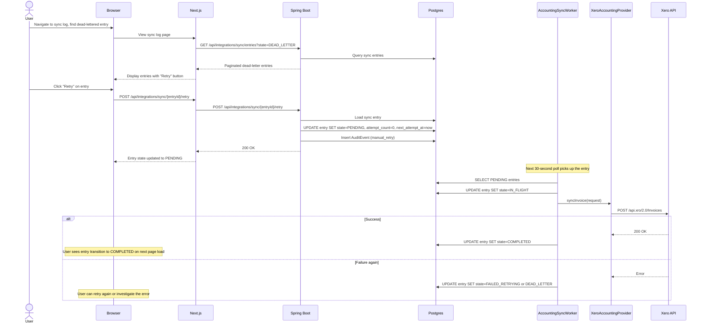

# Phase 71 — Xero Accounting Integration (One-Way Sync)

> Merge into ARCHITECTURE.md as **Section 11**.

---

## 11.1 Overview

Phase 71 delivers the first external accounting integration for Kazi: a tenant-connectable, OAuth2-based **Xero integration** that pushes invoices and customers from Kazi to Xero on approval, pulls payment status from Xero on a schedule, and surfaces sync state in the settings UI. The integration is the primary **commercial unlock** for the accounting-za vertical -- small SA accounting practices cannot adopt a system that does not push invoices into the accountant's general ledger -- and is a quality-of-life unlock for legal-za and consulting-za firms whose bookkeeper already lives in Xero.

The phase builds on three existing subsystems. Phase 21 (Integration Ports + BYOAK) provides the `IntegrationRegistry`, `OrgIntegration` entity, `SecretStore`, and the `AccountingProvider` port with its `InvoiceSyncRequest`, `CustomerSyncRequest`, and `AccountingSyncResult` contracts. Phase 10 (Invoicing & Billing) provides the `Invoice` entity with its `DRAFT -> APPROVED -> SENT -> PAID` lifecycle and existing domain events (`InvoiceApprovedEvent`, `InvoiceSentEvent`, `InvoicePaidEvent`). Phase 25 (Online Payment Collection) provides the `PaymentEvent` entity that Phase 71 reuses for Xero-originated payments. No new port abstraction is needed for invoice and customer push; one new sibling port (`AccountingPaymentSource`) is added for payment pull per the interface-segregation principle ([ADR-279](../adr/ADR-279-sibling-payment-source-port.md)).

All sync orchestration is owned by a dedicated `AccountingSyncService` -- not the Phase 37 rule engine ([ADR-274](../adr/ADR-274-dedicated-accounting-sync-service-not-rule-engine.md)). Trust-accounting data (Phase 60/61) is guarded by a fail-closed `TrustBoundaryGuard` that refuses to push any trust-related invoice to Xero, with an auditable explanation ([ADR-276](../adr/ADR-276-trust-accounting-hard-guard-export.md)).

### What's New

| Existing Capability | New Capability |
|---|---|
| `AccountingProvider` port with `NoOpAccountingProvider` | `XeroAccountingProvider` — real Xero adapter (push invoices + customers) |
| `OrgIntegration` + `SecretStore` model API-key credentials only | OAuth2 lifecycle with `AccountingXeroConnection` — refresh-token, token-expiry, Xero-tenant-id |
| Invoice approved in Kazi sits in Kazi; bookkeeper re-keys into Xero | Automatic push to Xero on `InvoiceApprovedEvent` / `InvoiceSentEvent` |
| Payment received in Xero never reaches Kazi's AR aging | Scheduled payment pull from Xero — `PaymentEvent` of source `XERO_RECONCILE` |
| No "did this invoice make it to Xero" UI | Sync log page, invoice status chips, dead-letter retry |
| No customer import from existing accounting system | One-time customer import from Xero contacts on first connect |
| No tax code mapping | Editable Kazi-to-Xero tax code mapping with ZA defaults |

### Scope Boundaries

**In scope**: Xero OAuth2 connect/disconnect/refresh, invoice push, customer push, payment pull (polling), sync queue with retry/dead-letter, trust-accounting guard, tax code mapping, one-time customer import, sync log UI, invoice status chips, capability-gated access control.

**Out of scope**: Sage Pastel / QuickBooks adapters, bidirectional sync, time-entry sync, multi-currency invoices, Xero webhooks, Phase 37 rule action for sync, AI-assisted reconciliation, bulk re-sync tool, Xero file attachments, VAT201 reporting, `PlanTier` reintroduction. See [Section 9 of the requirements](../requirements/claude-code-prompt-phase71.md) for the full exclusion list.

---

## 11.2 Domain Model

### 11.2.1 `AccountingXeroConnection`

Tracks OAuth2 connection metadata for a tenant's Xero org. One row per `OrgIntegration` (unique constraint). Refresh tokens and access tokens live in `SecretStore`, never in this table ([ADR-275](../adr/ADR-275-oauth2-augmentation-org-integration.md)).

| Field | Type | Constraints | Notes |
|---|---|---|---|
| `id` | `UUID` | PK, auto-generated | |
| `org_integration_id` | `UUID` | FK to `OrgIntegration.id`, UNIQUE, NOT NULL | One Xero connection per integration config |
| `xero_tenant_id` | `VARCHAR(50)` | NOT NULL | Xero's UUID for the connected Xero org -- distinct from Kazi tenant |
| `xero_org_name` | `VARCHAR(255)` | NOT NULL | Display name from Xero |
| `connected_by_member_id` | `UUID` | NOT NULL | Member who initiated the OAuth flow |
| `connected_at` | `TIMESTAMPTZ` | NOT NULL | When the connection was established |
| `last_token_refresh_at` | `TIMESTAMPTZ` | | Last successful token refresh |
| `access_token_expires_at` | `TIMESTAMPTZ` | NOT NULL | When the current access token expires |
| `scope` | `VARCHAR(500)` | NOT NULL | Granted OAuth scopes (comma-separated) |
| `status` | `VARCHAR(20)` | NOT NULL | `CONNECTED`, `REFRESH_FAILED`, `REVOKED` |
| `last_poll_at` | `TIMESTAMPTZ` | | Last successful payment poll timestamp |
| `disconnected_at` | `TIMESTAMPTZ` | | Null until disconnected |
| `created_at` | `TIMESTAMPTZ` | NOT NULL, immutable | |
| `updated_at` | `TIMESTAMPTZ` | NOT NULL | |

**Design decisions**:
- Separate table rather than extending `OrgIntegration` because the OAuth metadata is Xero-specific and does not apply to API-key-based providers. Adding 10 nullable columns to `OrgIntegration` for one provider would violate single-responsibility. If Sage Pastel lands later, it gets its own connection table.
- `last_poll_at` lives here rather than on a separate polling config entity because there is exactly one poll cursor per connection and the additional table would be over-normalised for the current requirements.
- `status` is a string enum rather than a boolean `connected` flag because three distinct states require different UI treatments (connected = green, refresh failed = amber reconnect banner, revoked = red disconnected).

### 11.2.2 `AccountingSyncEntry`

The sync queue and state machine for all outbound pushes and inbound pull records. Each row tracks one sync operation (one invoice push, one customer push, or one payment pull record).

| Field | Type | Constraints | Notes |
|---|---|---|---|
| `id` | `UUID` | PK, auto-generated | |
| `entity_type` | `VARCHAR(20)` | NOT NULL | `INVOICE`, `CUSTOMER`, `PAYMENT_PULL` |
| `entity_id` | `UUID` | NOT NULL | References the Kazi invoice / customer / invoice-being-reconciled |
| `provider_id` | `VARCHAR(20)` | NOT NULL | `"xero"` |
| `direction` | `VARCHAR(10)` | NOT NULL | `PUSH`, `PULL` |
| `state` | `VARCHAR(30)` | NOT NULL | See state machine below |
| `attempt_count` | `INT` | NOT NULL, DEFAULT 0 | |
| `next_attempt_at` | `TIMESTAMPTZ` | | Null when completed or blocked |
| `last_error_code` | `VARCHAR(50)` | | Machine-readable error classification |
| `last_error_detail` | `TEXT` | | Human-readable error message or Xero response body |
| `external_reference` | `VARCHAR(100)` | | Kazi-side dedup key, e.g. `KAZI-INV-{uuid}` |
| `external_id` | `VARCHAR(100)` | | Xero-side ID once known |
| `trigger` | `VARCHAR(30)` | NOT NULL | `EVENT`, `MANUAL_RETRY`, `FORCE_RESYNC` |
| `created_at` | `TIMESTAMPTZ` | NOT NULL, immutable | |
| `updated_at` | `TIMESTAMPTZ` | NOT NULL | |
| `completed_at` | `TIMESTAMPTZ` | | When the sync completed successfully |

**State machine**:

```
PENDING ──────────────► IN_FLIGHT ──────────► COMPLETED
                            │
                            ├──► FAILED_RETRYING ──► (back to IN_FLIGHT on next attempt)
                            │         │
                            │         └──► DEAD_LETTER (max retries exceeded)
                            │
                            └──► DEAD_LETTER (4xx validation error, no retry)

BLOCKED_TRUST_BOUNDARY (permanent, written directly on enqueue)
RECONCILE_DRIFT (payment pull: amounts don't match)
```

**Error codes**: `RATE_LIMITED`, `VALIDATION_FAILED`, `AUTH_EXPIRED`, `TRUST_BOUNDARY`, `MULTI_CURRENCY`, `DRIFT_DETECTED`, `NETWORK_ERROR`, `SERVER_ERROR`, `UNKNOWN`.

**Design decisions**:
- Single table for all entity types rather than per-type tables because the sync worker drains a unified queue sorted by `next_attempt_at`, and reporting/UI queries benefit from a single source.
- `external_reference` is the Kazi-side idempotency key. For invoices it is `KAZI-INV-{invoice.id}`; for customers it is `KAZI-CUST-{customer.id}`. This is written to the Xero record's `Reference` field so re-pushes update rather than duplicate ([ADR-278](../adr/ADR-278-idempotent-push-via-external-reference.md)).
- `trigger` captures why the entry was created (automated event, manual retry, force resync) for audit trail correlation.

### 11.2.3 `AccountingTaxCodeMapping`

Maps Kazi tax modes to the tenant's chosen Xero tax codes. Pre-seeded with ZA defaults on first connect; editable in the integration settings UI.

| Field | Type | Constraints | Notes |
|---|---|---|---|
| `id` | `UUID` | PK, auto-generated | |
| `provider_id` | `VARCHAR(20)` | NOT NULL | `"xero"` |
| `kazi_tax_mode` | `VARCHAR(30)` | NOT NULL | `STANDARD_15`, `ZERO_RATED`, `EXEMPT`, `OUT_OF_SCOPE`, `STANDARD_OTHER` |
| `external_tax_code` | `VARCHAR(50)` | NOT NULL | Xero tax code string (e.g. `OUTPUT2`) |
| `display_label` | `VARCHAR(100)` | NOT NULL | Human-readable label for UI |
| `is_default` | `BOOLEAN` | NOT NULL, DEFAULT true | Pre-seeded rows are defaults |
| `created_at` | `TIMESTAMPTZ` | NOT NULL, immutable | |
| `updated_at` | `TIMESTAMPTZ` | NOT NULL | |

**Unique constraint**: `(provider_id, kazi_tax_mode)` -- one mapping per Kazi tax mode per provider.

**Design decisions**:
- `STANDARD_OTHER` accommodates non-ZA tenants or future SA VAT rate changes. The rate percentage is not stored here -- it is the Xero tax code that matters for the push payload.
- `is_default` differentiates pre-seeded rows from tenant overrides. When the tenant resets to defaults, rows with `is_default = true` are restored.

### 11.2.4 Unchanged Entities

The following existing entities are consumed but not modified by Phase 71:

- **`Invoice`** -- read for push payload construction. The trust flag is stored in `Invoice.customFields` JSONB as key `"is_trust_invoice"` (set by Phase 60 legal vertical flows). No new columns added.
- **`InvoiceLine`** -- read for line-item mapping. `disbursement_id` linkage checked by trust boundary guard.
- **`Customer`** -- read for customer push payload construction and import dedup. No new columns added.
- **`PaymentEvent`** -- new rows written by payment pull with `provider_slug = "xero"` and `payment_destination = "XERO_RECONCILE"`. No schema change needed.
- **`OrgIntegration`** -- existing row used to link the Xero connection. No schema change needed.
- **`OrgSecret`** -- existing table used to store Xero access and refresh tokens. No schema change needed.

### 11.2.5 ER Diagram



---

## 11.3 Core Flows and Backend Behaviour

### 11.3.1 OAuth2 Connection Flow

**Purpose**: Connect a tenant's Kazi org to their Xero org via OAuth2 authorization code flow.

**Service-layer signatures**:

```java
// XeroOAuthService
public record XeroConnectResult(String authorizationUrl, String state) {}
public record XeroCallbackResult(UUID connectionId, String xeroOrgName) {}

XeroConnectResult initiateConnect(UUID memberId);
XeroCallbackResult handleCallback(String code, String state, UUID memberId);
void disconnect(UUID memberId);
void refreshAccessToken(UUID connectionId);
```

**Flow**:

1. **Initiate** -- `GET /api/integrations/xero/connect`. `XeroOAuthService.initiateConnect()` generates a PKCE code verifier, builds the Xero authorization URL with `offline_access openid profile email accounting.transactions accounting.contacts` scopes, persists the `state` parameter in a short-lived cache (or `SecretStore` keyed by state), returns `{ authUrl, state }`.
2. **Callback** -- `GET /api/integrations/xero/callback?code=...&state=...`. `XeroOAuthService.handleCallback()` validates state, exchanges code for tokens via Xero's token endpoint, calls Xero's `/connections` endpoint to retrieve the Xero tenant ID and org name, upserts `OrgIntegration` with `provider_slug = "xero"` and `enabled = true`, creates `AccountingXeroConnection`, stores tokens in `SecretStore` (`{orgIntegrationId}:xero:access`, `{orgIntegrationId}:xero:refresh`), pre-seeds `AccountingTaxCodeMapping` defaults for ZA, emits audit event `integration.xero.connected`.
3. **Token refresh** -- Automatic and silent in `XeroApiClient` on HTTP 401. `XeroOAuthService.refreshAccessToken()` retrieves the refresh token from `SecretStore`, calls Xero's token endpoint, stores new access and refresh tokens, updates `AccountingXeroConnection.last_token_refresh_at` and `access_token_expires_at`. After three consecutive refresh failures: connection status moves to `REFRESH_FAILED`, audit event `integration.xero.refresh_failed` emitted, outbound sync pauses (entries queue but do not push).
4. **Disconnect** -- `DELETE /api/integrations/xero/connection`. Revokes the Xero-side refresh token via Xero's revocation endpoint, marks connection `REVOKED`, sets `disconnected_at`, deletes tokens from `SecretStore`, disables `OrgIntegration`, emits audit event `integration.xero.disconnected`. Existing sync entries are left as historical record.

**Tenant boundary**: Entire flow runs within the requesting member's tenant context (`RequestScopes.TENANT_ID` bound by `TenantFilter`). The Xero connection is scoped to the tenant schema.

**RBAC**: All three endpoints require `@RequiresCapability("INTEGRATION_MANAGE")`.

**Error handling**:
- Invalid/expired state parameter: `InvalidStateException` (400).
- Xero token exchange failure: `IntegrationConnectionException` (502) with Xero error details.
- Refresh failure cascade (3 consecutive): connection transitions to `REFRESH_FAILED`, sync pauses, UI surfaces reconnect banner.

### 11.3.2 Invoice Push Flow

**Purpose**: Push an approved/sent/voided invoice from Kazi to Xero.

**Service-layer signatures**:

```java
// AccountingSyncService
void enqueueInvoicePush(UUID invoiceId, SyncTrigger trigger);

// AccountingSyncWorker (internal)
void drainPendingEntries();

// XeroAccountingProvider
AccountingSyncResult syncInvoice(InvoiceSyncRequest request);
```

**Flow**:

1. **Domain event fires** -- `InvoiceApprovedEvent`, `InvoiceSentEvent`, or `InvoiceVoidedEvent` published by `InvoiceTransitionService`.
2. **Event listener** -- `AccountingSyncEventListener.onInvoiceApproved()` calls `AccountingSyncService.enqueueInvoicePush(invoiceId, SyncTrigger.EVENT)`.
3. **Trust boundary guard** -- `TrustBoundaryGuard.evaluate(invoice)` runs. If refused: sync entry created with `state = BLOCKED_TRUST_BOUNDARY`, `last_error_code = TRUST_BOUNDARY`, audit event `integration.xero.push_blocked_trust` emitted. No further processing. See Section 11.6 for guard logic.
4. **Currency check** -- If `invoice.currency` does not match `OrgSettings.currency`, sync entry created with `state = DEAD_LETTER`, `last_error_code = MULTI_CURRENCY`. No retry.
5. **Enqueue** -- Sync entry created with `state = PENDING`, `next_attempt_at = now`, `external_reference = "KAZI-INV-{invoice.id}"`. Idempotent: if a `PENDING` or `IN_FLIGHT` entry already exists for this `(entity_type=INVOICE, entity_id)`, the enqueue is a no-op (log and return).
6. **Worker drain** -- `AccountingSyncWorker` (30-second `@Scheduled` poll) queries entries where `state IN ('PENDING', 'FAILED_RETRYING') AND next_attempt_at <= now`, ordered by `next_attempt_at ASC`, limited to 25 per tenant. For each entry:
   a. Marks `state = IN_FLIGHT`.
   b. Loads `Invoice` + `InvoiceLine` list + `Customer`.
   c. Builds `InvoiceSyncRequest` via `XeroInvoicePayloadMapper`.
   d. Calls `XeroAccountingProvider.syncInvoice(request)`.
   e. Classifies result:
      - Success: `state = COMPLETED`, `external_id` set, `completed_at = now`. Audit event `integration.xero.invoice_pushed`.
      - Rate limited (429): `state = FAILED_RETRYING`, `last_error_code = RATE_LIMITED`, `next_attempt_at` set to `Retry-After` header value. Worker stops draining for this tenant.
      - Transient error (5xx, network): `state = FAILED_RETRYING`, `attempt_count++`, `next_attempt_at` computed from back-off schedule. If `attempt_count >= 5`: `state = DEAD_LETTER`. Audit event `integration.xero.dead_letter`.
      - Validation error (4xx): `state = DEAD_LETTER`, `last_error_code = VALIDATION_FAILED`. No retry. Audit event `integration.xero.invoice_push_failed`.
      - Auth expired (401 after refresh attempt): `state = FAILED_RETRYING`, `last_error_code = AUTH_EXPIRED`. Worker pauses this tenant until connection is re-established.

**Tenant boundary**: The sync worker uses `TenantScopedRunner.forEachTenant()` to iterate active tenants. Each tenant's entries are drained within `RequestScopes.TENANT_ID` binding. Per-tenant exception isolation means one tenant's Xero failures do not block other tenants.

**RBAC**: The automated event-driven path has no RBAC gate (system-initiated). The manual "force resync" path requires `INTEGRATION_VIEW_SYNC_STATUS`.

### 11.3.3 Customer Push Flow

**Purpose**: Push a new or updated customer from Kazi to Xero.

**Service-layer signatures**:

```java
// AccountingSyncService
void enqueueCustomerPush(UUID customerId, SyncTrigger trigger);

// XeroAccountingProvider
AccountingSyncResult syncCustomer(CustomerSyncRequest request);
```

**Flow**:

1. **Domain event fires** -- `CustomerCreatedEvent` or `CustomerUpdatedEvent` published by `CustomerService`.
2. **Event listener** -- `AccountingSyncEventListener.onCustomerCreated()` or `onCustomerUpdated()` calls `AccountingSyncService.enqueueCustomerPush(customerId, SyncTrigger.EVENT)`.
3. **Connection check** -- If no `CONNECTED` Xero connection exists for this tenant, skip silently (no-op provider fallback).
4. **Enqueue** -- Sync entry created with `state = PENDING`, `external_reference = "KAZI-CUST-{customer.id}"`. Idempotent: if a pending entry exists, update the entry's `updated_at` to indicate re-enqueue rather than creating a duplicate.
5. **Worker drain** -- Same unified worker as invoice push. Builds `CustomerSyncRequest` via `XeroContactPayloadMapper`, calls `XeroAccountingProvider.syncCustomer(request)`. Same result classification and retry logic.

**Tenant boundary**: Same as invoice push -- `TenantScopedRunner.forEachTenant()`.

**RBAC**: System-initiated (no gate). No manual customer re-push UI; re-push happens automatically on the next customer update.

### 11.3.4 Payment Pull Flow

**Purpose**: Poll Xero for invoices that moved to `PAID` and create `PaymentEvent` records in Kazi.

**Service-layer signatures**:

```java
// AccountingSyncService
PaymentPollSummary pollPaymentsForConnection(UUID connectionId);

// AccountingPaymentSource (new port — ADR-279)
List<ExternalPaymentEvent> getPaymentsModifiedSince(Instant since);
```

**Flow**:

1. **Scheduled worker** -- `AccountingPaymentPollWorker` runs every 15 minutes (`@Scheduled(fixedDelay = 900_000)`). Uses `TenantScopedRunner.forEachTenant()` to iterate tenants. For each tenant, loads all `AccountingXeroConnection` rows with `status = CONNECTED`.
2. **Poll Xero** -- For each connection, calls `XeroAccountingProvider.getPaymentsModifiedSince(connection.lastPollAt)`. Returns a list of `ExternalPaymentEvent` records.
3. **Match** -- For each `ExternalPaymentEvent`:
   a. Look up Kazi invoice via `external_reference` on `AccountingSyncEntry` where `external_reference` matches the event's `externalInvoiceReference`. If not found: log as Xero-native invoice, skip.
   b. If found and Kazi invoice is not yet `PAID`:
      - **Amount check**: If `|event.amount - invoice.total| > 0.01`: create sync entry with `state = RECONCILE_DRIFT`, `last_error_code = DRIFT_DETECTED`. Audit event `integration.xero.reconcile_drift`. Skip auto-transition.
      - **Match**: Write `PaymentEvent` with `provider_slug = "xero"`, `payment_reference = event.externalPaymentId`, `payment_destination = "XERO_RECONCILE"`, `amount = event.amount`. Transition invoice to `PAID` via `InvoiceTransitionService.recordPayment()`. Emit `InvoicePaidEvent`. Create sync entry with `state = COMPLETED`, `direction = PULL`. Audit event `integration.xero.payment_reconciled`.
   c. If found and Kazi invoice is already `PAID`: skip (idempotent; `PaymentEvent` dedup by `(invoice_id, payment_reference)`).
4. **Update cursor** -- Set `connection.lastPollAt = now` after successful poll.

**Tenant boundary**: `TenantScopedRunner.forEachTenant()` with exception isolation per tenant.

**RBAC**: System-initiated (no gate). Manual reconciliation for drift cases requires `FINANCIAL_RECONCILE`.

**Error handling**:
- Xero API error during poll: log, skip this connection, try again next cycle.
- Rate limit during poll: honour `Retry-After`, skip remaining connections for this cycle.

### 11.3.5 One-Time Customer Import

**Purpose**: Import existing Xero contacts as Kazi customers on first connection.

**Service-layer signatures**:

```java
// XeroCustomerImportService
public record CustomerImportSummary(int created, int skippedDuplicate, int skippedNoEmail, int total) {}
CustomerImportSummary importCustomersFromXero(UUID connectionId, UUID actorMemberId);
```

**Flow**:

1. **Initiate** -- `POST /api/integrations/xero/import-customers`. Requires `INTEGRATION_MANAGE`.
2. **Guard** -- Checks `AccountingXeroConnection.status = CONNECTED`. Checks that import has not already been run (flag stored in `AccountingXeroConnection.config_json` or a dedicated boolean). Returns 409 if already imported.
3. **Paginate** -- Calls `XeroApiClient.getContacts(page)` in a loop until all pages are consumed. Xero returns contacts in pages of 100.
4. **Dedup** -- For each Xero contact:
   a. Skip if no email address (`skippedNoEmail++`).
   b. Match against existing Kazi customers by email (case-insensitive). If match: `skippedDuplicate++`, set `external_reference` on the existing customer for future push dedup.
   c. If no match: match by `(name, taxNumber)`. If match: `skippedDuplicate++`, set `external_reference`.
   d. If no match: create new `Customer` with `lifecycleStatus = PROSPECT`, `external_reference = xeroContactId`, tag `IMPORTED_FROM_XERO`.
5. **Audit** -- Emit `integration.xero.customers_imported` with summary counts.
6. **Return** -- `CustomerImportSummary` to the caller.

**Tenant boundary**: Request-scoped (`TenantFilter`).

**RBAC**: `@RequiresCapability("INTEGRATION_MANAGE")`.

### 11.3.6 Trust Boundary Guard

See Section 11.6 for full specification.

### 11.3.7 Retry and Dead-Letter

**Retry policy**: Exponential back-off with fixed offsets.

| Attempt | Delay | Cumulative |
|---|---|---|
| 1 | 1 minute | 1 minute |
| 2 | 5 minutes | 6 minutes |
| 3 | 15 minutes | 21 minutes |
| 4 | 1 hour | 1 hour 21 minutes |
| 5 | 6 hours | 7 hours 21 minutes |

After attempt 5: `state = DEAD_LETTER`. The entry is visible in the sync log UI with a manual "Retry" action.

**Never-retry conditions** (go straight to `DEAD_LETTER`):
- HTTP 400-class errors from Xero (validation failures).
- `MULTI_CURRENCY` -- invoice currency does not match org default.
- `TRUST_BOUNDARY` -- blocked by trust guard (permanent, not retryable).

**Manual retry** (`POST /api/integrations/sync/{entryId}/retry`):
- Resets `attempt_count = 0`, `state = PENDING`, `next_attempt_at = now`.
- Requires `INTEGRATION_VIEW_SYNC_STATUS`.
- Emits audit event `integration.xero.manual_retry`.

### 11.3.8 Rate Limit Handling

Xero rate limits: 60 calls/minute and 5000 calls/day per tenant connection.

**Strategy**:

1. `XeroApiClient` reads `X-Rate-Limit-Remaining` and `Retry-After` response headers on every API call.
2. When `X-Rate-Limit-Remaining < 5`: `XeroApiClient` throws `XeroRateLimitException` with the `retryAfter` duration.
3. The sync worker catches `XeroRateLimitException` and:
   a. Marks the current entry `FAILED_RETRYING` with `last_error_code = RATE_LIMITED` and `next_attempt_at = now + retryAfter`.
   b. Stops draining entries for this tenant for the remainder of this worker cycle. Other tenants continue.
4. Daily limit (5000 calls): tracked in-memory per connection via an `AtomicInteger` counter reset at UTC midnight. When the counter reaches 4900: log a warning. When it reaches 5000: pause all sync for this connection until the next UTC day.

---

## 11.4 API Surface

### 11.4.1 Xero Connection Management (OAuth2)

All endpoints on `XeroIntegrationController` under `/api/integrations/xero/`.

| Method | Path | Description | Capability | Notes |
|---|---|---|---|---|
| `GET` | `/api/integrations/xero/connect` | Initiate OAuth2 flow, return authorization URL | `INTEGRATION_MANAGE` | Returns `{ authUrl, state }` |
| `GET` | `/api/integrations/xero/callback` | Complete OAuth2 handshake | `INTEGRATION_MANAGE` | Query params: `code`, `state`. Redirects to settings page on success |
| `GET` | `/api/integrations/xero/connection` | Get current connection status | `INTEGRATION_MANAGE` | Returns connection metadata or 404 |
| `DELETE` | `/api/integrations/xero/connection` | Disconnect from Xero | `INTEGRATION_MANAGE` | Revokes tokens, marks REVOKED |

**Connect response**:
```json
{
  "authUrl": "https://login.xero.com/identity/connect/authorize?...",
  "state": "random-state-token"
}
```

**Connection status response**:
```json
{
  "id": "uuid",
  "xeroOrgName": "Smith & Associates",
  "status": "CONNECTED",
  "connectedAt": "2026-05-09T10:30:00Z",
  "lastTokenRefreshAt": "2026-05-09T14:00:00Z",
  "accessTokenExpiresAt": "2026-05-09T14:30:00Z",
  "scope": "openid,profile,accounting.transactions,accounting.contacts",
  "lastPollAt": "2026-05-09T14:15:00Z"
}
```

### 11.4.2 Sync Operations

| Method | Path | Description | Capability | Notes |
|---|---|---|---|---|
| `POST` | `/api/integrations/sync/{entryId}/retry` | Retry a dead-lettered entry | `INTEGRATION_VIEW_SYNC_STATUS` | Resets attempt count, re-enqueues |
| `POST` | `/api/integrations/sync/invoice/{invoiceId}/resync` | Force resync an invoice | `INTEGRATION_VIEW_SYNC_STATUS` | Creates new sync entry with `trigger = FORCE_RESYNC` |

### 11.4.3 Sync Status and Log

| Method | Path | Description | Capability | Notes |
|---|---|---|---|---|
| `GET` | `/api/integrations/sync/summary` | Sync dashboard counts | `INTEGRATION_VIEW_SYNC_STATUS` | Counts by state, oldest pending |
| `GET` | `/api/integrations/sync/entries` | Paginated sync log | `INTEGRATION_VIEW_SYNC_STATUS` | Filterable by `state`, `entityType`, `direction` |
| `GET` | `/api/integrations/sync/entries/{id}` | Single entry detail | `INTEGRATION_VIEW_SYNC_STATUS` | |
| `GET` | `/api/integrations/sync/invoice/{invoiceId}/status` | Sync status for one invoice | `INTEGRATION_VIEW_SYNC_STATUS` | Returns latest sync entry for this invoice |

**Sync summary response**:
```json
{
  "pending": 3,
  "inFlight": 1,
  "completedLast24h": 42,
  "failedRetrying": 0,
  "deadLetter": 1,
  "blockedTrustBoundary": 2,
  "reconcileDrift": 0,
  "oldestPendingAt": "2026-05-09T14:10:00Z",
  "lastCompletedAt": "2026-05-09T14:12:00Z"
}
```

**Sync entry response**:
```json
{
  "id": "uuid",
  "entityType": "INVOICE",
  "entityId": "uuid",
  "providerId": "xero",
  "direction": "PUSH",
  "state": "COMPLETED",
  "attemptCount": 1,
  "externalReference": "KAZI-INV-abc123",
  "externalId": "xero-invoice-id-456",
  "lastErrorCode": null,
  "lastErrorDetail": null,
  "trigger": "EVENT",
  "createdAt": "2026-05-09T14:00:00Z",
  "completedAt": "2026-05-09T14:00:05Z"
}
```

### 11.4.4 Customer Import

| Method | Path | Description | Capability | Notes |
|---|---|---|---|---|
| `POST` | `/api/integrations/xero/import-customers` | One-time customer import | `INTEGRATION_MANAGE` | Returns summary; 409 if already run |

**Import response**:
```json
{
  "created": 45,
  "skippedDuplicate": 12,
  "skippedNoEmail": 3,
  "total": 60
}
```

### 11.4.5 Tax Code Mapping

| Method | Path | Description | Capability | Notes |
|---|---|---|---|---|
| `GET` | `/api/integrations/xero/tax-mappings` | List current mappings | `INTEGRATION_MANAGE` | Returns all rows |
| `PUT` | `/api/integrations/xero/tax-mappings/{id}` | Update a mapping | `INTEGRATION_MANAGE` | Updates `external_tax_code` and `display_label` |
| `POST` | `/api/integrations/xero/tax-mappings/reset` | Reset to defaults | `INTEGRATION_MANAGE` | Restores pre-seeded ZA defaults |
| `GET` | `/api/integrations/xero/tax-rates` | Fetch available Xero tax rates | `INTEGRATION_MANAGE` | Proxies Xero `TaxRates` API for dropdown population |

### 11.4.6 Settings

| Method | Path | Description | Capability | Notes |
|---|---|---|---|---|
| `GET` | `/api/integrations/xero/settings` | Get sync settings | `INTEGRATION_MANAGE` | Poll interval, push trigger |
| `PUT` | `/api/integrations/xero/settings` | Update sync settings | `INTEGRATION_MANAGE` | |

**Settings request/response**:
```json
{
  "paymentPollIntervalMinutes": 15,
  "pushTrigger": "APPROVED",
  "autoSyncEnabled": true
}
```

### 11.4.7 Manual Reconciliation

| Method | Path | Description | Capability | Notes |
|---|---|---|---|---|
| `POST` | `/api/integrations/sync/{entryId}/reconcile` | Manually mark reconcile drift as resolved | `FINANCIAL_RECONCILE` | Closes the drift entry, records decision |

---

## 11.5 Sequence Diagrams

### 11.5.1 OAuth2 Connect + Callback



### 11.5.2 Invoice Push (Event to Xero API)



### 11.5.3 Payment Poll (Xero to Kazi)



### 11.5.4 Dead-Letter Retry



---

## 11.6 Trust Accounting Guard

The trust boundary guard is a regulatory safeguard mandated by the Legal Practice Act Section 86. Trust ledgers must not flow to a tenant's operating-account general ledger in Xero. The guard is deterministic Java code -- no LLM, no AI, no human bypass ([ADR-276](../adr/ADR-276-trust-accounting-hard-guard-export.md)).

### Guard Logic

The guard evaluates three conditions. If **any** condition is true, the push is **refused**.

| # | Condition | How Checked | Rationale |
|---|---|---|---|
| 1 | Invoice is trust-related | `Invoice.customFields` contains `is_trust_invoice = true` (Phase 60 field) | Trust invoices represent client fund movements, not fee billing |
| 2 | Any line item sourced from a trust account | `InvoiceLine.disbursement_id` IS NOT NULL AND the linked `LegalDisbursement.trust_account_id` IS NOT NULL | Line items drawn from trust accounts are trust money flows |
| 3 | Customer has active trust balances | `ClientLedgerCard` has any row with non-zero `balance` for `customer_id` | A customer with active trust balances could have trust-commingled billing |

### Fail-Closed Behaviour

- If any trust-related entity lookup fails (database error, missing data): the guard **refuses** the push. Trust boundary violations are worse than missed syncs.
- If the Phase 60 trust accounting tables do not exist in this tenant's schema (e.g. non-legal vertical): the guard **allows** the push. The check is skipped entirely for tenants that have never provisioned trust accounting.

### Java Pseudocode

```java
@Service
public class TrustBoundaryGuard {

    private final LegalDisbursementRepository disbursementRepository;
    private final ClientLedgerCardRepository clientLedgerCardRepository;

    public TrustBoundaryGuard(
            LegalDisbursementRepository disbursementRepository,
            ClientLedgerCardRepository clientLedgerCardRepository) {
        this.disbursementRepository = disbursementRepository;
        this.clientLedgerCardRepository = clientLedgerCardRepository;
    }

    public TrustBoundaryDecision evaluate(Invoice invoice, List<InvoiceLine> lines, Customer customer) {
        // Condition 1: Invoice-level trust flag
        Object trustFlag = invoice.getCustomFields().get("is_trust_invoice");
        if (Boolean.TRUE.equals(trustFlag)) {
            return TrustBoundaryDecision.refused(
                "Invoice is flagged as trust-related (is_trust_invoice=true)");
        }

        // Condition 2: Line items from trust accounts
        for (InvoiceLine line : lines) {
            if (line.getDisbursementId() != null) {
                var disbursement = disbursementRepository.findOneById(line.getDisbursementId());
                if (disbursement.isPresent() && disbursement.get().getTrustAccountId() != null) {
                    return TrustBoundaryDecision.refused(
                        "Line item '%s' is sourced from trust account %s"
                            .formatted(line.getDescription(), disbursement.get().getTrustAccountId()));
                }
            }
        }

        // Condition 3: Customer has active trust balances (via ClientLedgerCard materialized view)
        BigDecimal trustBalance = clientLedgerCardRepository
            .sumNonZeroBalancesForCustomer(customer.getId());
        if (trustBalance != null && trustBalance.compareTo(BigDecimal.ZERO) != 0) {
            return TrustBoundaryDecision.refused(
                "Customer '%s' has active trust balance of %s"
                    .formatted(customer.getName(), trustBalance));
        }

        return TrustBoundaryDecision.allowed();
    }
}

public record TrustBoundaryDecision(boolean allowed, String reason) {
    public static TrustBoundaryDecision allowed() {
        return new TrustBoundaryDecision(true, null);
    }
    public static TrustBoundaryDecision refused(String reason) {
        return new TrustBoundaryDecision(false, reason);
    }
}
```

### Audit Event Structure

When the guard refuses a push, the `AccountingSyncService` emits:

```json
{
  "eventType": "integration.xero.push_blocked_trust",
  "entityType": "INVOICE",
  "entityId": "invoice-uuid",
  "actorType": "SYSTEM",
  "source": "ACCOUNTING_SYNC",
  "details": {
    "reason": "Invoice is flagged as trust-related (is_trust_invoice=true)",
    "invoiceNumber": "INV-001",
    "customerName": "Smith Trust",
    "syncEntryId": "sync-entry-uuid"
  }
}
```

### UI Surface

- **Invoice detail page**: Passive notice "Not pushed to Xero -- trust-related invoice" with a link to the audit event. No action button, no bypass.
- **Sync log**: Entry appears with `state = BLOCKED_TRUST_BOUNDARY` badge. No retry action available.
- **Integration card**: Blocked count included in the sync summary widget.

---

## 11.7 Database Migrations

### V121 — Xero Accounting Integration Tables

All three tables are tenant-scoped (created in each `tenant_*` schema). No global migration needed.

**File**: `backend/src/main/resources/db/migration/tenant/V121__add_xero_accounting_integration_tables.sql`

```sql
-- =============================================================================
-- V121: Xero Accounting Integration Tables
-- Phase 71 — accounting_xero_connection, accounting_sync_entry, accounting_tax_code_mapping
-- =============================================================================

-- -----------------------------------------------------------------------------
-- 1. accounting_xero_connection
-- Tracks OAuth2 connection metadata for a tenant's Xero org.
-- One row per OrgIntegration (unique constraint on org_integration_id).
-- Refresh tokens live in SecretStore (org_secrets table), never here.
-- -----------------------------------------------------------------------------
CREATE TABLE IF NOT EXISTS accounting_xero_connection (
    id                      UUID PRIMARY KEY DEFAULT gen_random_uuid(),
    org_integration_id      UUID NOT NULL,
    xero_tenant_id          VARCHAR(50) NOT NULL,
    xero_org_name           VARCHAR(255) NOT NULL,
    connected_by_member_id  UUID NOT NULL,
    connected_at            TIMESTAMPTZ NOT NULL DEFAULT now(),
    last_token_refresh_at   TIMESTAMPTZ,
    access_token_expires_at TIMESTAMPTZ NOT NULL,
    scope                   VARCHAR(500) NOT NULL,
    status                  VARCHAR(20) NOT NULL DEFAULT 'CONNECTED',
    last_poll_at            TIMESTAMPTZ,
    disconnected_at         TIMESTAMPTZ,
    created_at              TIMESTAMPTZ NOT NULL DEFAULT now(),
    updated_at              TIMESTAMPTZ NOT NULL DEFAULT now(),

    CONSTRAINT fk_axc_org_integration
        FOREIGN KEY (org_integration_id) REFERENCES org_integrations(id),
    CONSTRAINT uq_axc_org_integration
        UNIQUE (org_integration_id),
    CONSTRAINT ck_axc_status
        CHECK (status IN ('CONNECTED', 'REFRESH_FAILED', 'REVOKED'))
);

-- Index: lookup by status for payment poll worker
CREATE INDEX IF NOT EXISTS idx_axc_status
    ON accounting_xero_connection (status);

-- -----------------------------------------------------------------------------
-- 2. accounting_sync_entry
-- Sync queue and state machine for outbound pushes and inbound pull records.
-- The sync worker drains entries sorted by (state, next_attempt_at).
-- The invoice detail page looks up entries by (entity_type, entity_id).
-- -----------------------------------------------------------------------------
CREATE TABLE IF NOT EXISTS accounting_sync_entry (
    id                  UUID PRIMARY KEY DEFAULT gen_random_uuid(),
    entity_type         VARCHAR(20) NOT NULL,
    entity_id           UUID NOT NULL,
    provider_id         VARCHAR(20) NOT NULL,
    direction           VARCHAR(10) NOT NULL,
    state               VARCHAR(30) NOT NULL DEFAULT 'PENDING',
    attempt_count       INT NOT NULL DEFAULT 0,
    next_attempt_at     TIMESTAMPTZ,
    last_error_code     VARCHAR(50),
    last_error_detail   TEXT,
    external_reference  VARCHAR(100),
    external_id         VARCHAR(100),
    trigger             VARCHAR(30) NOT NULL DEFAULT 'EVENT',
    created_at          TIMESTAMPTZ NOT NULL DEFAULT now(),
    updated_at          TIMESTAMPTZ NOT NULL DEFAULT now(),
    completed_at        TIMESTAMPTZ,

    CONSTRAINT ck_ase_entity_type
        CHECK (entity_type IN ('INVOICE', 'CUSTOMER', 'PAYMENT_PULL')),
    CONSTRAINT ck_ase_direction
        CHECK (direction IN ('PUSH', 'PULL')),
    CONSTRAINT ck_ase_state
        CHECK (state IN (
            'PENDING', 'IN_FLIGHT', 'COMPLETED', 'FAILED_RETRYING',
            'DEAD_LETTER', 'BLOCKED_TRUST_BOUNDARY', 'RECONCILE_DRIFT'
        )),
    CONSTRAINT ck_ase_trigger
        CHECK (trigger IN ('EVENT', 'MANUAL_RETRY', 'FORCE_RESYNC'))
);

-- Index: worker drain query — state + next_attempt_at for efficient polling
-- The worker queries: WHERE state IN ('PENDING', 'FAILED_RETRYING') AND next_attempt_at <= now
CREATE INDEX IF NOT EXISTS idx_ase_drain
    ON accounting_sync_entry (state, next_attempt_at)
    WHERE state IN ('PENDING', 'FAILED_RETRYING');

-- Index: invoice/customer status lookup — "what's the sync status of this invoice?"
CREATE INDEX IF NOT EXISTS idx_ase_entity_lookup
    ON accounting_sync_entry (entity_type, entity_id);

-- Index: external_reference lookup for payment pull matching
CREATE INDEX IF NOT EXISTS idx_ase_external_reference
    ON accounting_sync_entry (external_reference)
    WHERE external_reference IS NOT NULL;

-- -----------------------------------------------------------------------------
-- 3. accounting_tax_code_mapping
-- Maps Kazi tax modes to Xero tax codes. Pre-seeded with ZA defaults.
-- One mapping per (provider_id, kazi_tax_mode) pair.
-- -----------------------------------------------------------------------------
CREATE TABLE IF NOT EXISTS accounting_tax_code_mapping (
    id                  UUID PRIMARY KEY DEFAULT gen_random_uuid(),
    provider_id         VARCHAR(20) NOT NULL,
    kazi_tax_mode       VARCHAR(30) NOT NULL,
    external_tax_code   VARCHAR(50) NOT NULL,
    display_label       VARCHAR(100) NOT NULL,
    is_default          BOOLEAN NOT NULL DEFAULT true,
    created_at          TIMESTAMPTZ NOT NULL DEFAULT now(),
    updated_at          TIMESTAMPTZ NOT NULL DEFAULT now(),

    CONSTRAINT uq_atcm_provider_tax_mode
        UNIQUE (provider_id, kazi_tax_mode),
    CONSTRAINT ck_atcm_kazi_tax_mode
        CHECK (kazi_tax_mode IN (
            'STANDARD_15', 'ZERO_RATED', 'EXEMPT', 'OUT_OF_SCOPE', 'STANDARD_OTHER'
        ))
);

-- -----------------------------------------------------------------------------
-- 4. Pre-seed ZA tax code defaults
-- These are inserted on migration but will also be inserted by XeroOAuthService
-- on first connect if they don't already exist. ON CONFLICT ensures idempotency.
-- NOTE: STANDARD_OTHER is intentionally NOT pre-seeded — it has no universal ZA default.
-- Tenants needing it (non-ZA, or future VAT rate changes) configure it manually via UI.
-- -----------------------------------------------------------------------------
INSERT INTO accounting_tax_code_mapping
    (provider_id, kazi_tax_mode, external_tax_code, display_label, is_default)
VALUES
    ('xero', 'STANDARD_15', 'OUTPUT2', 'Standard Rate (15%)', true),
    ('xero', 'ZERO_RATED', 'ZERORATEDOUTPUT', 'Zero Rated Output', true),
    ('xero', 'EXEMPT', 'EXEMPTOUTPUT', 'Exempt Output', true),
    ('xero', 'OUT_OF_SCOPE', 'NONE', 'No Tax / Out of Scope', true)
ON CONFLICT (provider_id, kazi_tax_mode) DO NOTHING;
```

### Index Rationale

| Index | Purpose | Why |
|---|---|---|
| `idx_axc_status` | Filter connections by status | Payment poll worker queries `WHERE status = 'CONNECTED'`; avoids full table scan across tenants with many connections (unlikely in v1 but forward-looking) |
| `idx_ase_drain` | Worker drain query | Partial index on actionable states with `next_attempt_at` ordering -- the hottest query path in the system (every 30 seconds). Partial index excludes completed/blocked entries from the B-tree |
| `idx_ase_entity_lookup` | Invoice/customer status chip | The invoice detail page queries `WHERE entity_type = 'INVOICE' AND entity_id = ?` to render the Xero status chip. Without this index, every page load scans the full sync log |
| `idx_ase_external_reference` | Payment pull matching | The payment pull worker matches Xero payment events to Kazi invoices via `external_reference`. Partial index excludes null references |
| `uq_atcm_provider_tax_mode` | Dedup constraint | Prevents duplicate mappings for the same (provider, tax mode) pair |

---

## 11.8 Implementation Guidance

### 11.8.1 Backend Changes

| Package / File | Change |
|---|---|
| `integration/accounting/xero/XeroAccountingProvider.java` | **New.** `implements AccountingProvider, AccountingPaymentSource`. `@IntegrationAdapter(domain = ACCOUNTING, slug = "xero")`. Delegates to `XeroApiClient` for HTTP, mappers for payload translation |
| `integration/accounting/xero/XeroApiClient.java` | **New.** Thin `RestClient` wrapper for Xero `api.xro/2.0/` REST surface. Bearer-token attachment, refresh-on-401, `Xero-tenant-id` header, rate-limit observance |
| `integration/accounting/xero/XeroOAuthService.java` | **New.** OAuth2 flow: authorization URL builder, code-exchange, refresh-token rotation. Stores tokens in `SecretStore` |
| `integration/accounting/xero/XeroInvoicePayloadMapper.java` | **New.** Pure function: `InvoiceSyncRequest` + tax mappings -> Xero invoice JSON |
| `integration/accounting/xero/XeroContactPayloadMapper.java` | **New.** Pure function: `CustomerSyncRequest` -> Xero contact JSON |
| `integration/accounting/xero/XeroIntegrationController.java` | **New.** REST endpoints for connect, callback, disconnect, connection status, settings, tax mappings, customer import |
| `integration/accounting/xero/XeroRateLimitException.java` | **New.** Carries `retryAfter` Duration |
| `integration/accounting/xero/XeroConnectionStatus.java` | **New.** Enum: `CONNECTED`, `REFRESH_FAILED`, `REVOKED` |
| `integration/accounting/xero/AccountingXeroConnection.java` | **New.** JPA entity |
| `integration/accounting/xero/AccountingXeroConnectionRepository.java` | **New.** JPA repository |
| `integration/accounting/sync/AccountingSyncEntry.java` | **New.** JPA entity |
| `integration/accounting/sync/AccountingSyncEntryRepository.java` | **New.** JPA repository with drain query |
| `integration/accounting/sync/AccountingSyncService.java` | **New.** Core sync orchestration: enqueue, poll, retry, summary |
| `integration/accounting/sync/AccountingSyncWorker.java` | **New.** `@Scheduled(fixedDelay = 30_000)` worker that drains the sync queue |
| `integration/accounting/sync/AccountingPaymentPollWorker.java` | **New.** `@Scheduled(fixedDelay = 900_000)` worker for payment pull |
| `integration/accounting/sync/AccountingSyncEventListener.java` | **New.** Subscribes to invoice + customer domain events, calls `AccountingSyncService.enqueue*` |
| `integration/accounting/sync/SyncTrigger.java` | **New.** Enum: `EVENT`, `MANUAL_RETRY`, `FORCE_RESYNC` |
| `integration/accounting/sync/SyncState.java` | **New.** Enum with all state machine states |
| `integration/accounting/sync/SyncEntityType.java` | **New.** Enum: `INVOICE`, `CUSTOMER`, `PAYMENT_PULL` |
| `integration/accounting/sync/SyncDirection.java` | **New.** Enum: `PUSH`, `PULL` |
| `integration/accounting/sync/TrustBoundaryGuard.java` | **New.** Trust-accounting guard (Section 11.6) |
| `integration/accounting/sync/TrustBoundaryDecision.java` | **New.** Record: `(boolean allowed, String reason)` |
| `integration/accounting/AccountingPaymentSource.java` | **New.** Sibling port interface for payment pull ([ADR-279](../adr/ADR-279-sibling-payment-source-port.md)) |
| `integration/accounting/ExternalPaymentEvent.java` | **New.** Record for inbound payment data |
| `integration/accounting/NoOpAccountingProvider.java` | **Modified.** Add `implements AccountingPaymentSource` with empty-list return |
| `integration/accounting/AccountingTaxCodeMapping.java` | **New.** JPA entity |
| `integration/accounting/AccountingTaxCodeMappingRepository.java` | **New.** JPA repository |
| `integration/accounting/AccountingTaxCodeMappingService.java` | **New.** Service for CRUD + reset-to-defaults |
| `integration/accounting/xero/XeroCustomerImportService.java` | **New.** One-time customer import logic |
| `integration/accounting/InvoiceSyncRequest.java` | **Modified.** Add `externalReference` field for idempotency key and `taxMode` per line item |
| `integration/accounting/LineItem.java` | **Modified.** Add `taxMode` field (string) |

### 11.8.2 Frontend Changes

| Route / Component | Change |
|---|---|
| `frontend/app/(app)/org/[slug]/settings/integrations/xero/page.tsx` | **New.** Xero integration settings page: connection status, sync summary, tax code mapping editor, import button, settings form |
| `frontend/app/(app)/org/[slug]/settings/integrations/xero/sync-log/page.tsx` | **New.** Paginated sync log with filters and retry actions |
| `frontend/components/integrations/XeroConnectionCard.tsx` | **New.** Connection status display with connect/disconnect/reconnect actions |
| `frontend/components/integrations/XeroSyncSummary.tsx` | **New.** Sync summary widget (counts by state, links to filtered log) |
| `frontend/components/integrations/XeroTaxMappingEditor.tsx` | **New.** Table editor for Kazi-to-Xero tax code mapping |
| `frontend/components/integrations/XeroCustomerImport.tsx` | **New.** One-time import button with progress and summary display |
| `frontend/components/integrations/XeroSettingsForm.tsx` | **New.** Poll interval, push trigger configuration |
| `frontend/components/integrations/SyncLogTable.tsx` | **New.** Reusable table for sync entries with state badges, error display, action menu |
| `frontend/components/integrations/SyncEntryStateBadge.tsx` | **New.** Badge component for sync entry states |
| `frontend/components/invoices/XeroStatusChip.tsx` | **New.** Inline status chip for invoice detail page |
| `frontend/components/customers/XeroContactBadge.tsx` | **New.** Inline badge for customer detail page |
| `frontend/app/(app)/org/[slug]/settings/integrations/page.tsx` | **Modified.** Add Xero card linking to new settings page |
| `frontend/app/(app)/org/[slug]/invoices/[id]/page.tsx` | **Modified.** Add `XeroStatusChip` component |
| `frontend/app/(app)/org/[slug]/customers/[id]/page.tsx` | **Modified.** Add `XeroContactBadge` component |
| `frontend/lib/api/integrations.ts` | **Modified.** Add API client functions for all Xero endpoints |

### 11.8.3 Entity Code Pattern

The `AccountingSyncEntry` entity follows the standard Kazi pattern. No `@FilterDef`/`@Filter`/`TenantAware` annotations are needed because tenant isolation is handled at the schema level (schema-per-tenant via Hibernate `search_path`). This matches all existing entities in the codebase (`OrgIntegration`, `Invoice`, `Customer`, etc.).

```java
package io.b2mash.b2b.b2bstrawman.integration.accounting.sync;

import jakarta.persistence.Column;
import jakarta.persistence.Entity;
import jakarta.persistence.EnumType;
import jakarta.persistence.Enumerated;
import jakarta.persistence.GeneratedValue;
import jakarta.persistence.GenerationType;
import jakarta.persistence.Id;
import jakarta.persistence.PrePersist;
import jakarta.persistence.PreUpdate;
import jakarta.persistence.Table;
import java.time.Instant;
import java.util.UUID;

@Entity
@Table(name = "accounting_sync_entry")
public class AccountingSyncEntry {

    @Id
    @GeneratedValue(strategy = GenerationType.UUID)
    private UUID id;

    @Enumerated(EnumType.STRING)
    @Column(name = "entity_type", nullable = false, length = 20)
    private SyncEntityType entityType;

    @Column(name = "entity_id", nullable = false)
    private UUID entityId;

    @Column(name = "provider_id", nullable = false, length = 20)
    private String providerId;

    @Enumerated(EnumType.STRING)
    @Column(name = "direction", nullable = false, length = 10)
    private SyncDirection direction;

    @Enumerated(EnumType.STRING)
    @Column(name = "state", nullable = false, length = 30)
    private SyncState state;

    @Column(name = "attempt_count", nullable = false)
    private int attemptCount;

    @Column(name = "next_attempt_at")
    private Instant nextAttemptAt;

    @Column(name = "last_error_code", length = 50)
    private String lastErrorCode;

    @Column(name = "last_error_detail", columnDefinition = "TEXT")
    private String lastErrorDetail;

    @Column(name = "external_reference", length = 100)
    private String externalReference;

    @Column(name = "external_id", length = 100)
    private String externalId;

    @Enumerated(EnumType.STRING)
    @Column(name = "trigger", nullable = false, length = 30)
    private SyncTrigger trigger;

    @Column(name = "created_at", nullable = false, updatable = false)
    private Instant createdAt;

    @Column(name = "updated_at", nullable = false)
    private Instant updatedAt;

    @Column(name = "completed_at")
    private Instant completedAt;

    protected AccountingSyncEntry() {}

    public AccountingSyncEntry(
            SyncEntityType entityType,
            UUID entityId,
            String providerId,
            SyncDirection direction,
            SyncTrigger trigger,
            String externalReference) {
        this.entityType = entityType;
        this.entityId = entityId;
        this.providerId = providerId;
        this.direction = direction;
        this.state = SyncState.PENDING;
        this.attemptCount = 0;
        this.nextAttemptAt = Instant.now();
        this.trigger = trigger;
        this.externalReference = externalReference;
    }

    @PrePersist
    void onPrePersist() {
        this.createdAt = Instant.now();
        this.updatedAt = Instant.now();
    }

    @PreUpdate
    void onPreUpdate() {
        this.updatedAt = Instant.now();
    }

    /** Transition to IN_FLIGHT for worker processing. */
    public void markInFlight() {
        this.state = SyncState.IN_FLIGHT;
        this.nextAttemptAt = null;
    }

    /** Mark as successfully completed. */
    public void markCompleted(String externalId) {
        this.state = SyncState.COMPLETED;
        this.externalId = externalId;
        this.completedAt = Instant.now();
        this.nextAttemptAt = null;
        this.lastErrorCode = null;
        this.lastErrorDetail = null;
    }

    /** Mark as failed with retry scheduled. */
    public void markFailedRetrying(String errorCode, String errorDetail, Instant nextAttempt) {
        this.state = SyncState.FAILED_RETRYING;
        this.attemptCount++;
        this.lastErrorCode = errorCode;
        this.lastErrorDetail = errorDetail;
        this.nextAttemptAt = nextAttempt;
    }

    /** Move to dead-letter (no further automatic retry). */
    public void markDeadLetter(String errorCode, String errorDetail) {
        this.state = SyncState.DEAD_LETTER;
        this.lastErrorCode = errorCode;
        this.lastErrorDetail = errorDetail;
        this.nextAttemptAt = null;
    }

    /** Mark as blocked by trust boundary guard. Permanent, no retry. */
    public void markBlockedTrustBoundary(String reason) {
        this.state = SyncState.BLOCKED_TRUST_BOUNDARY;
        this.lastErrorCode = "TRUST_BOUNDARY";
        this.lastErrorDetail = reason;
        this.nextAttemptAt = null;
    }

    /** Reset for manual retry from dead-letter. */
    public void resetForRetry() {
        this.state = SyncState.PENDING;
        this.attemptCount = 0;
        this.nextAttemptAt = Instant.now();
        this.trigger = SyncTrigger.MANUAL_RETRY;
    }

    // Getters (no Lombok)
    public UUID getId() { return id; }
    public SyncEntityType getEntityType() { return entityType; }
    public UUID getEntityId() { return entityId; }
    public String getProviderId() { return providerId; }
    public SyncDirection getDirection() { return direction; }
    public SyncState getState() { return state; }
    public int getAttemptCount() { return attemptCount; }
    public Instant getNextAttemptAt() { return nextAttemptAt; }
    public String getLastErrorCode() { return lastErrorCode; }
    public String getLastErrorDetail() { return lastErrorDetail; }
    public String getExternalReference() { return externalReference; }
    public String getExternalId() { return externalId; }
    public SyncTrigger getTrigger() { return trigger; }
    public Instant getCreatedAt() { return createdAt; }
    public Instant getUpdatedAt() { return updatedAt; }
    public Instant getCompletedAt() { return completedAt; }
}
```

### 11.8.4 Repository Code Pattern

```java
package io.b2mash.b2b.b2bstrawman.integration.accounting.sync;

import java.time.Instant;
import java.util.List;
import java.util.Optional;
import java.util.UUID;
import org.springframework.data.domain.Page;
import org.springframework.data.domain.Pageable;
import org.springframework.data.jpa.repository.JpaRepository;
import org.springframework.data.jpa.repository.Query;
import org.springframework.data.repository.query.Param;

public interface AccountingSyncEntryRepository extends JpaRepository<AccountingSyncEntry, UUID> {

    /** Standard findOneById following Kazi JPQL convention. */
    @Query("SELECT e FROM AccountingSyncEntry e WHERE e.id = :id")
    Optional<AccountingSyncEntry> findOneById(@Param("id") UUID id);

    /** Worker drain query: actionable entries ordered by next_attempt_at. */
    @Query("""
        SELECT e FROM AccountingSyncEntry e
        WHERE e.state IN (
            io.b2mash.b2b.b2bstrawman.integration.accounting.sync.SyncState.PENDING,
            io.b2mash.b2b.b2bstrawman.integration.accounting.sync.SyncState.FAILED_RETRYING
        )
        AND e.nextAttemptAt <= :now
        ORDER BY e.nextAttemptAt ASC
        """)
    List<AccountingSyncEntry> findDrainableEntries(
            @Param("now") Instant now,
            Pageable pageable);

    /** Lookup: latest sync entry for an entity (invoice/customer status chip). */
    @Query("""
        SELECT e FROM AccountingSyncEntry e
        WHERE e.entityType = :entityType AND e.entityId = :entityId
        ORDER BY e.createdAt DESC
        """)
    List<AccountingSyncEntry> findByEntity(
            @Param("entityType") SyncEntityType entityType,
            @Param("entityId") UUID entityId);

    /** Check for existing pending/in-flight entry (idempotent enqueue guard). */
    @Query("""
        SELECT e FROM AccountingSyncEntry e
        WHERE e.entityType = :entityType
        AND e.entityId = :entityId
        AND e.state IN (
            io.b2mash.b2b.b2bstrawman.integration.accounting.sync.SyncState.PENDING,
            io.b2mash.b2b.b2bstrawman.integration.accounting.sync.SyncState.IN_FLIGHT
        )
        """)
    Optional<AccountingSyncEntry> findActiveEntryForEntity(
            @Param("entityType") SyncEntityType entityType,
            @Param("entityId") UUID entityId);

    /** Match by external_reference for payment pull. */
    @Query("""
        SELECT e FROM AccountingSyncEntry e
        WHERE e.externalReference = :ref
        AND e.state = io.b2mash.b2b.b2bstrawman.integration.accounting.sync.SyncState.COMPLETED
        AND e.direction = io.b2mash.b2b.b2bstrawman.integration.accounting.sync.SyncDirection.PUSH
        ORDER BY e.completedAt DESC
        """)
    Optional<AccountingSyncEntry> findCompletedPushByExternalReference(
            @Param("ref") String externalReference);

    /** Paginated sync log with state filter. */
    @Query("""
        SELECT e FROM AccountingSyncEntry e
        WHERE (:state IS NULL OR e.state = :state)
        AND (:entityType IS NULL OR e.entityType = :entityType)
        ORDER BY e.createdAt DESC
        """)
    Page<AccountingSyncEntry> findFiltered(
            @Param("state") SyncState state,
            @Param("entityType") SyncEntityType entityType,
            Pageable pageable);

    /** Summary counts by state. */
    @Query("""
        SELECT e.state, COUNT(e) FROM AccountingSyncEntry e
        GROUP BY e.state
        """)
    List<Object[]> countByState();
}
```

### 11.8.5 Testing Strategy

| Test Class | Scope | What It Verifies |
|---|---|---|
| `AccountingSyncServiceTest` | Service (Spring context) | Enqueue logic, idempotent re-enqueue, trust guard integration, currency check, state transitions |
| `AccountingSyncWorkerTest` | Service | Drain logic, retry back-off calculation, dead-letter after max attempts, per-tenant isolation |
| `AccountingPaymentPollWorkerTest` | Service | Payment pull matching, amount drift detection, PaymentEvent creation, invoice transition |
| `TrustBoundaryGuardTest` | Service | All three guard conditions, fail-closed on missing data, skip for non-legal tenants |
| `XeroInvoicePayloadMapperTest` | Unit | Invoice + lines + tax mapping -> Xero JSON shape |
| `XeroContactPayloadMapperTest` | Unit | Customer -> Xero contact JSON shape |
| `XeroOAuthServiceTest` | Service | Token exchange (mocked Xero), token refresh, refresh failure cascade, disconnect cleanup |
| `XeroIntegrationControllerIntegrationTest` | HTTP (MockMvc) | Connect, callback, disconnect, connection status endpoints; RBAC gate verification |
| `AccountingSyncControllerIntegrationTest` | HTTP (MockMvc) | Sync log pagination, retry, force resync, summary endpoints |
| `XeroCustomerImportServiceTest` | Service | Pagination, dedup by email, dedup by name+tax, skip-no-email, import guard (one-time only) |
| `AccountingTaxCodeMappingServiceTest` | Service | CRUD, reset-to-defaults, ZA pre-seeded values |
| `XeroAccountingProviderTest` | Service | `syncInvoice`, `syncCustomer`, `getPaymentsModifiedSince` with `@MockitoBean` on `XeroApiClient` |

**Testing conventions**:
- `XeroApiClient` is mocked with `@MockitoBean` in all tests -- no WireMock, no fake HTTP server.
- All tests use embedded Postgres (`@Import(TestcontainersConfiguration.class)`).
- No Testcontainers Docker containers.
- `@ActiveProfiles("test")` only.

---

## 11.9 Permission Model Summary

### Capabilities

| Capability | Purpose | Default Roles |
|---|---|---|
| `INTEGRATION_MANAGE` | **Existing.** Connect/disconnect Xero, update settings, manage tax mappings, import customers | `owner`, `admin` |
| `INTEGRATION_VIEW_SYNC_STATUS` | **New.** View sync log, view sync summary, retry dead-lettered entries, force resync | `owner`, `admin` |
| `FINANCIAL_RECONCILE` | **New.** Manually resolve reconciliation drift (mark Kazi invoice paid when auto-match fails) | `owner` |

### Access Control per Operation

| Operation | Capability | Notes |
|---|---|---|
| Connect to Xero | `INTEGRATION_MANAGE` | |
| Disconnect from Xero | `INTEGRATION_MANAGE` | Confirmation dialog in UI |
| View connection status | `INTEGRATION_MANAGE` | |
| Update sync settings | `INTEGRATION_MANAGE` | Poll interval, push trigger |
| Edit tax code mappings | `INTEGRATION_MANAGE` | |
| Import customers from Xero | `INTEGRATION_MANAGE` | One-time only |
| View sync log | `INTEGRATION_VIEW_SYNC_STATUS` | |
| View sync summary | `INTEGRATION_VIEW_SYNC_STATUS` | |
| Retry dead-lettered entry | `INTEGRATION_VIEW_SYNC_STATUS` | |
| Force resync an invoice | `INTEGRATION_VIEW_SYNC_STATUS` | |
| Manually reconcile drift | `FINANCIAL_RECONCILE` | Owner-only by default |

### Capability Seeding

New capabilities are seeded via the existing Phase 41/46 capability seeding pattern. Added to the role defaults in the seeder so new orgs get them automatically:

```java
// In capability seeder (existing pattern)
seedCapability("INTEGRATION_VIEW_SYNC_STATUS", "View accounting sync status and retry failed entries",
    Set.of("owner", "admin"));
seedCapability("FINANCIAL_RECONCILE", "Manually reconcile payment discrepancies",
    Set.of("owner"));
```

---

## 11.10 Capability Slices

### Slice A: Migration + Entities + Repositories

**Scope**: Backend only
**Dependencies**: None (base slice)
**Key deliverables**:
- `V121__add_xero_accounting_integration_tables.sql`
- `AccountingXeroConnection` entity + repository
- `AccountingSyncEntry` entity + repository (including drain query)
- `AccountingTaxCodeMapping` entity + repository
- `SyncState`, `SyncDirection`, `SyncEntityType`, `SyncTrigger` enums
- `AccountingPaymentSource` interface + `ExternalPaymentEvent` record
- Modified `NoOpAccountingProvider` to implement `AccountingPaymentSource`
- Modified `InvoiceSyncRequest` + `LineItem` to add `externalReference` and `taxMode`
- Capability seeding for `INTEGRATION_VIEW_SYNC_STATUS` and `FINANCIAL_RECONCILE`

**Test expectations**: Entity persistence tests, repository query tests, migration runs clean
**Estimated LOC**: ~600

### Slice B: AccountingSyncService + Worker + Event Listeners

**Scope**: Backend only
**Dependencies**: Slice A
**Key deliverables**:
- `AccountingSyncService` -- enqueue, retry, summary, poll orchestration
- `AccountingSyncWorker` -- `@Scheduled` drain worker with retry back-off
- `AccountingPaymentPollWorker` -- `@Scheduled` payment pull worker (skeleton: scheduler, tenant loop, cursor update — wired to `NoOpAccountingProvider` until Slice F completes the real adapter binding)
- `AccountingSyncEventListener` -- subscribes to invoice + customer domain events
- `TrustBoundaryDecision` record

**Test expectations**: Enqueue idempotency, state transitions, back-off schedule, dead-letter after 5 attempts, event listener wiring
**Estimated LOC**: ~700

### Slice C: XeroApiClient + XeroOAuthService

**Scope**: Backend only
**Dependencies**: Slice A (uses `AccountingXeroConnection`, `SecretStore`)
**Key deliverables**:
- `XeroApiClient` -- `RestClient` wrapper with bearer-token, refresh-on-401, rate-limit headers, `Xero-tenant-id` header
- `XeroOAuthService` -- authorization URL builder, code-exchange, refresh-token rotation, disconnect
- `XeroRateLimitException`
- `XeroConnectionStatus` enum

**Test expectations**: Token exchange (mocked), refresh cycle, refresh failure cascade, rate limit header parsing
**Estimated LOC**: ~500

### Slice D: XeroAccountingProvider Adapter + Mappers

**Scope**: Backend only
**Dependencies**: Slice A, Slice C
**Key deliverables**:
- `XeroAccountingProvider` -- `implements AccountingProvider, AccountingPaymentSource`
- `XeroInvoicePayloadMapper`
- `XeroContactPayloadMapper`
- `AccountingTaxCodeMappingService`

**Test expectations**: Invoice mapping accuracy, contact mapping, tax code resolution, `getPaymentsModifiedSince` mapping
**Estimated LOC**: ~500

### Slice E: Trust Boundary Guard

**Scope**: Backend only
**Dependencies**: Slice B (integrates with `AccountingSyncService.enqueueInvoicePush`)
**Key deliverables**:
- `TrustBoundaryGuard` service
- Integration with `AccountingSyncService.enqueueInvoicePush`
- Audit event emission for blocked pushes

**Test expectations**: All three guard conditions, fail-closed on DB error, skip for non-legal tenants, audit event emitted
**Estimated LOC**: ~250

### Slice F: Payment Pull (AccountingPaymentSource + Poll Worker Completion)

**Scope**: Backend only
**Dependencies**: Slice B, Slice D
**Key deliverables**:
- Complete `AccountingPaymentPollWorker` body — wire to `XeroAccountingProvider.getPaymentsModifiedSince` (Slice B delivers the skeleton; this slice wires the real adapter)
- Payment matching logic in `AccountingSyncService.pollPaymentsForConnection`
- `PaymentEvent` creation with `provider_slug = "xero"`
- Invoice transition to `PAID` via `InvoiceTransitionService`
- Amount drift detection and `RECONCILE_DRIFT` state

**Test expectations**: Happy-path payment match, drift detection, idempotent re-poll, Xero-native invoice skip
**Estimated LOC**: ~350

### Slice G: One-Time Customer Import

**Scope**: Backend only
**Dependencies**: Slice C, Slice D
**Key deliverables**:
- `XeroCustomerImportService`
- Pagination of Xero contacts
- Dedup logic (email, then name+taxNumber)
- One-time guard (import already run check)
- Customer creation with `PROSPECT` status and `external_reference`

**Test expectations**: Pagination handling, dedup scenarios, one-time guard, import summary counts
**Estimated LOC**: ~300

### Slice H: Frontend -- Connection Management + Settings

**Scope**: Frontend + backend controller
**Dependencies**: Slice C (OAuth service), Slice D (tax mapping service)
**Key deliverables**:
- `XeroIntegrationController` (all REST endpoints from Section 11.4)
- `frontend/app/(app)/org/[slug]/settings/integrations/xero/page.tsx`
- `XeroConnectionCard.tsx`
- `XeroTaxMappingEditor.tsx`
- `XeroCustomerImport.tsx`
- `XeroSettingsForm.tsx`
- Modified integrations settings page to link to Xero sub-page
- API client functions in `frontend/lib/api/integrations.ts`

**Test expectations**: Controller RBAC gates, frontend renders connection states, settings form submission
**Estimated LOC**: ~800

### Slice I: Frontend -- Sync Log + Invoice/Customer Status Chips

**Scope**: Frontend + backend controller
**Dependencies**: Slice B (sync service), Slice H (settings page)
**Key deliverables**:
- `frontend/app/(app)/org/[slug]/settings/integrations/xero/sync-log/page.tsx`
- `SyncLogTable.tsx`
- `SyncEntryStateBadge.tsx`
- `XeroSyncSummary.tsx`
- `XeroStatusChip.tsx` (invoice detail page)
- `XeroContactBadge.tsx` (customer detail page)
- Sync summary and log controller endpoints
- Modified invoice detail page
- Modified customer detail page

**Test expectations**: Sync log pagination and filtering, state badges render correctly, retry action works, invoice chip shows correct state
**Estimated LOC**: ~600

---

## 11.11 ADR Index

| ADR | Title | Key Decision |
|---|---|---|
| [ADR-272](../adr/ADR-272-xero-only-accounting-adapter-v1.md) | Xero-only adapter for accounting integration v1 | Ship Xero only; Sage Pastel deferred. API maturity, SA SME market share, OAuth2 standardisation |
| [ADR-273](../adr/ADR-273-one-way-accounting-sync-permanent.md) | One-way sync model (push invoices/customers, pull payments) | Permanent product decision. No bidirectional sync, no conflict resolution |
| [ADR-274](../adr/ADR-274-dedicated-accounting-sync-service-not-rule-engine.md) | Dedicated AccountingSyncService instead of Phase 37 rule action | Retry/idempotency/rate-limit semantics don't fit the rule executor |
| [ADR-275](../adr/ADR-275-oauth2-augmentation-org-integration.md) | OAuth2 augmentation of OrgIntegration + SecretStore | New `accounting_xero_connection` table; refresh tokens in SecretStore |
| [ADR-276](../adr/ADR-276-trust-accounting-hard-guard-export.md) | Trust-accounting hard guard against accounting export | Section 86 regulatory boundary; fail-closed; audit-only refusal; no bypass |
| [ADR-277](../adr/ADR-277-poll-over-webhooks-payment-reconciliation-v1.md) | Polling over webhooks for inbound payment reconciliation in v1 | Webhook reliability concerns, public-endpoint config burden; 15-minute SLO acceptable |
| [ADR-278](../adr/ADR-278-idempotent-push-via-external-reference.md) | Idempotent push via Kazi-side external_reference + Xero Reference field | Kazi-side dedup key prevents duplicate invoices in Xero |
| [ADR-279](../adr/ADR-279-sibling-payment-source-port.md) | Sibling AccountingPaymentSource port instead of overloading AccountingProvider | Interface segregation; payment pull is a distinct concern from push |

---

## 11.12 Notification and Audit Integration

### Audit Event Catalogue

All audit events use `actorType = "SYSTEM"` and `source = "ACCOUNTING_SYNC"` unless initiated by a member action.

| Event Type | Entity Type | When Emitted | Actor | Key Details Fields |
|---|---|---|---|---|
| `integration.xero.connected` | `ORG_INTEGRATION` | OAuth2 callback completes | MEMBER | `xeroOrgName`, `xeroTenantId`, `scopes` |
| `integration.xero.disconnected` | `ORG_INTEGRATION` | Member disconnects Xero | MEMBER | `xeroOrgName`, `reason` |
| `integration.xero.refresh_failed` | `ORG_INTEGRATION` | 3 consecutive token refresh failures | SYSTEM | `failureCount`, `lastError` |
| `integration.xero.invoice_pushed` | `INVOICE` | Invoice successfully pushed to Xero | SYSTEM | `invoiceNumber`, `externalId`, `attemptCount` |
| `integration.xero.invoice_push_failed` | `INVOICE` | Invoice push failed (4xx, straight to dead-letter) | SYSTEM | `invoiceNumber`, `errorCode`, `errorDetail` |
| `integration.xero.customer_pushed` | `CUSTOMER` | Customer successfully pushed to Xero | SYSTEM | `customerName`, `externalId` |
| `integration.xero.payment_reconciled` | `INVOICE` | Payment pulled from Xero, invoice marked PAID | SYSTEM | `invoiceNumber`, `amount`, `xeroPaymentId` |
| `integration.xero.push_blocked_trust` | `INVOICE` | Trust boundary guard refused push | SYSTEM | `invoiceNumber`, `customerName`, `reason` |
| `integration.xero.reconcile_drift` | `INVOICE` | Payment amount mismatch detected | SYSTEM | `invoiceNumber`, `kaziAmount`, `xeroAmount`, `xeroPaymentId` |
| `integration.xero.dead_letter` | `INVOICE` or `CUSTOMER` | Sync entry moved to dead-letter after max retries | SYSTEM | `entityType`, `errorCode`, `attemptCount` |
| `integration.xero.manual_retry` | `INVOICE` or `CUSTOMER` | Member manually retried a dead-lettered entry | MEMBER | `syncEntryId`, `previousErrorCode` |
| `integration.xero.customers_imported` | `ORG_INTEGRATION` | One-time customer import completed | MEMBER | `created`, `skippedDuplicate`, `skippedNoEmail`, `total` |

### Notification Rules

Notifications integrate with the existing Phase 6.5 notification system.

| Event | Notification | Default Recipients | Default State |
|---|---|---|---|
| `xero.refresh_failed` | "Xero connection requires reconnection" | Members with `INTEGRATION_MANAGE` capability | **Default-on** for `owner` role |
| `xero.dead_letter` | "Xero sync entry requires attention" (daily digest) | Members with `INTEGRATION_VIEW_SYNC_STATUS` capability | **Default-on** for `owner` role |
| `xero.invoice_pushed` | "Invoice {number} synced to Xero" | Members with `INTEGRATION_VIEW_SYNC_STATUS` capability | **Default-off** (too noisy for most users) |
| `xero.payment_reconciled` | "Payment received for invoice {number} via Xero" | Members with `INTEGRATION_VIEW_SYNC_STATUS` capability | **Default-off** (too noisy for most users) |

Notification preferences are opt-in per member via the existing notification settings UI. The `xero.dead_letter` notification uses a daily digest to avoid noise from batch failures.

### Domain Events Emitted

These are Spring application events published after the database transaction commits (using `@TransactionalEventListener(phase = AFTER_COMMIT)`):

| Domain Event | When Published | Consumed By |
|---|---|---|
| `XeroConnectionEstablishedEvent` | OAuth2 callback completes, connection persisted | NotificationEventHandler, AuditEventHandler |
| `XeroConnectionRevokedEvent` | Member disconnects, connection marked REVOKED | NotificationEventHandler, AuditEventHandler |
| `XeroSyncEntryCompletedEvent` | Sync entry transitions to COMPLETED | NotificationEventHandler (if opted-in) |
| `XeroSyncEntryDeadLetteredEvent` | Sync entry moves to DEAD_LETTER | NotificationEventHandler (daily digest) |
| `XeroPaymentReconciledEvent` | Payment pulled from Xero, invoice transitioned to PAID | NotificationEventHandler (if opted-in), Dashboard aggregation |

### Domain Events Consumed

| Domain Event | Source | Handler |
|---|---|---|
| `InvoiceApprovedEvent` | `InvoiceTransitionService` | `AccountingSyncEventListener.onInvoiceApproved()` |
| `InvoiceSentEvent` | `InvoiceTransitionService` | `AccountingSyncEventListener.onInvoiceSent()` |
| `InvoiceVoidedEvent` | `InvoiceTransitionService` | `AccountingSyncEventListener.onInvoiceVoided()` |
| `CustomerCreatedEvent` | `CustomerService` | `AccountingSyncEventListener.onCustomerCreated()` |
| `CustomerUpdatedEvent` | `CustomerService` | `AccountingSyncEventListener.onCustomerUpdated()` |
