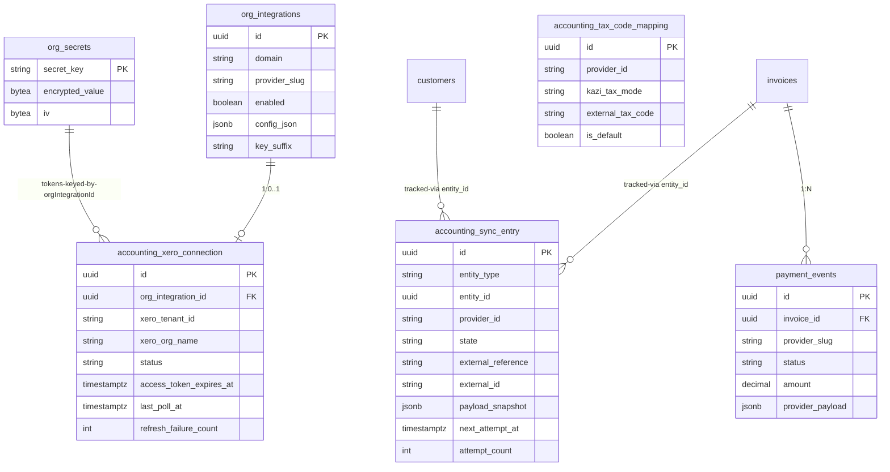
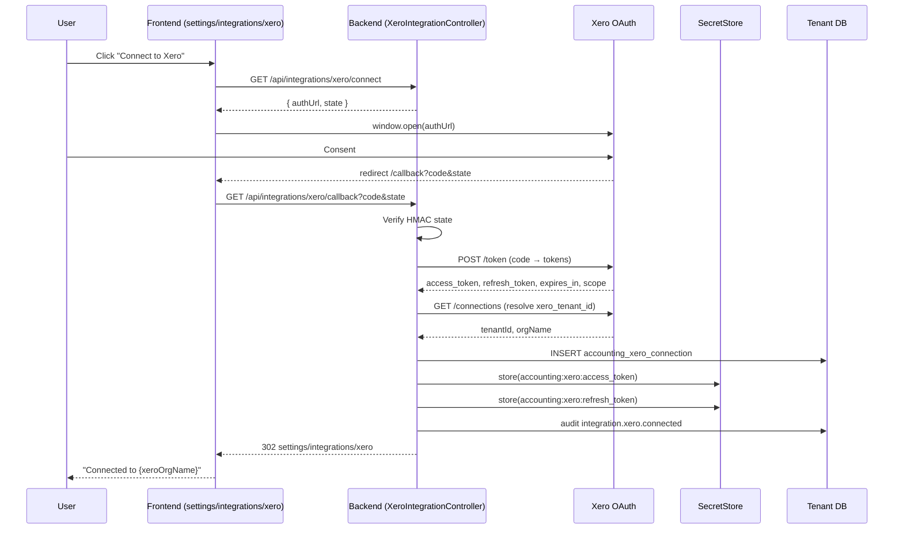
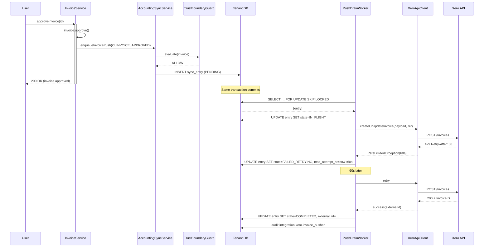

# Phase 71 — Xero Accounting Integration (One-Way Sync)

> **Canonical location**: this standalone `architecture/phase71-*.md` file. Per the Phase 70 / Phase 68 convention, `ARCHITECTURE.md` stops at Section 10 (Phase 4) and gets a one-paragraph stub pointer per phase doc. Local section numbers below (`N.1`, `N.2`, …) are an organising device internal to this phase doc — they are NOT claims on `ARCHITECTURE.md` slots. Standalone phase architecture; cross-referenced from `ARCHITECTURE.md` but not merged.

> **Supersedes / extends**: Phase 21 (`integration/` ports + `OrgIntegration` + `SecretStore` + `IntegrationGuardService` + `IntegrationRegistry`) is the immediate predecessor. Phase 71 does not change Phase 21's `AccountingProvider` port shape, the `OrgIntegration` row layout (additively extends `config_json` JSONB only), the Phase 10 invoice lifecycle (`DRAFT → APPROVED → SENT → PAID → VOID`), the Phase 25 `PaymentEvent` shape, or the Phase 60 trust-accounting ledger. It adds the first real `AccountingProvider` adapter (Xero), an OAuth2 connection sibling table, a dedicated sync engine with outbox semantics, a tax-code mapping table, a payment-pull sibling port, and a hard-coded trust-boundary guard.

> **ADRs**: [ADR-272](../adr/ADR-272-xero-only-accounting-adapter-v1.md), [ADR-273](../adr/ADR-273-one-way-accounting-sync-permanent.md), [ADR-274](../adr/ADR-274-dedicated-accounting-sync-service-not-rule-engine.md), [ADR-275](../adr/ADR-275-oauth2-augmentation-org-integration.md), [ADR-276](../adr/ADR-276-trust-accounting-hard-guard-export.md), [ADR-277](../adr/ADR-277-poll-over-webhooks-payment-reconciliation-v1.md), [ADR-278](../adr/ADR-278-idempotent-push-via-external-reference.md), [ADR-279](../adr/ADR-279-sibling-payment-source-port.md)

> **Migration**: Tenant **V121** — three new tenant-scoped tables (`accounting_xero_connection`, `accounting_sync_entry`, `accounting_tax_code_mapping`) plus seed inserts for ZA tax-code defaults. All under `db/migration/tenant/` per [ADR-T001](../adr/ADR-T001-schema-per-tenant-over-row-level-isolation.md). No global migrations. No backfill — all greenfield tables. `OrgIntegration.config_json` (JSONB) is additively extended at the application layer with a Xero-shaped sealed record; no DDL change is needed for that.

---

## N.1 — Overview

Phase 21 shipped the integration plumbing — `AccountingProvider` port, `NoOpAccountingProvider` no-op, `OrgIntegration` row-per-(domain, providerSlug), `SecretStore` with AES/GCM encryption, `IntegrationGuardService` for module-level on/off, `IntegrationRegistry` with Caffeine-cached resolution, and the `IntegrationController` REST surface. None of it has ever talked to a real accounting system; all production traffic for the `ACCOUNTING` domain still falls through to `NoOpAccountingProvider`. Phase 10 shipped the invoice lifecycle and Phase 25 shipped the payment-event ledger; together they produce a Kazi-internal AR view that is correct on day one and stale by day two because nothing pushes invoices into the firm's general ledger and nothing pulls payment status back when the bookkeeper marks an invoice paid in Xero.

Phase 71 lands the first real `AccountingProvider` adapter (Xero), an OAuth2 connection lifecycle on top of `OrgIntegration` + `SecretStore`, a dedicated `AccountingSyncService` with outbox-style retry/back-off/dead-letter semantics ([ADR-274](../adr/ADR-274-dedicated-accounting-sync-service-not-rule-engine.md)), a 15-minute `@Scheduled` payment-poll worker ([ADR-277](../adr/ADR-277-poll-over-webhooks-payment-reconciliation-v1.md)), a tax-code mapping table seeded for SA, a one-time customer importer, and a hard-coded `TrustBoundaryGuard` that fails closed when an invoice would leak Phase 60 trust-accounting state to Xero ([ADR-276](../adr/ADR-276-trust-accounting-hard-guard-export.md)). The sync model is one-way push of invoices/customers and one-way pull of payments — permanent product decision per the founder ([ADR-273](../adr/ADR-273-one-way-accounting-sync-permanent.md)).

The phase is the first **commercial unlock** for the accounting-za vertical: small SA accounting practices cannot adopt Kazi if it doesn't push to Xero, and small legal-za / consulting-za firms whose bookkeeper lives in Xero get the same QoL win for free. Out of scope: Sage Pastel, QuickBooks, Zoho Books, bidirectional sync, Xero outbound webhooks, time-entry sync, multi-currency push, AI-mediated reconciliation, bulk re-sync tooling, plan-tier reintroduction.

### What's New

| Area | Phase 21 today | Phase 71 adds |
|------|----------------|---------------|
| Accounting adapters | `NoOpAccountingProvider` only | `XeroAccountingProvider` — first real adapter, OAuth2, idempotent push, payment pull |
| `OrgIntegration` shape | Row per (domain, slug); single `apiKey` per row in `SecretStore` | Additively extended: Xero rows store OAuth tokens via multiple `SecretStore` keys (`accounting:xero:client_id`, `…:client_secret`, `…:access_token`, `…:refresh_token`); a sibling `accounting_xero_connection` row holds non-secret connection metadata ([ADR-275](../adr/ADR-275-oauth2-augmentation-org-integration.md)) |
| Sync trigger | None | Outbox row written **inside the same transaction as invoice approval / void / send**; AFTER_COMMIT event listener path used for customer updates only |
| Sync engine | None | Dedicated `AccountingSyncService` + drain worker with retry classification, dead-letter, rate-limit back-pressure, tenant-scoped iteration ([ADR-274](../adr/ADR-274-dedicated-accounting-sync-service-not-rule-engine.md)) |
| Payment reconciliation | Manual UI only; `PaymentEvent` populated by Stripe/PayFast webhooks | `AccountingPaymentSource` sibling port ([ADR-279](../adr/ADR-279-sibling-payment-source-port.md)) + 15-minute scheduled poll → `PaymentEvent` with `provider_slug="xero"` → `InvoicePaidEvent` |
| Tax codes | `TaxRate` table per tenant | `accounting_tax_code_mapping` table — Kazi tax mode → external Xero code; ZA defaults pre-seeded |
| Trust-boundary protection | None | `TrustBoundaryGuard` — three-tier fail-closed Java check; refused pushes get a `BLOCKED_TRUST_BOUNDARY` sync entry + `integration.xero.push_blocked_trust` audit event ([ADR-276](../adr/ADR-276-trust-accounting-hard-guard-export.md)) |
| Customer import | None | One-shot `POST /api/integrations/xero/import-customers`; subsequent runs blocked until reconnect |
| Sync observability UI | None | `/settings/integrations/xero` card + `/settings/integrations/xero/sync-log` paginated log + invoice-detail Xero-status chip + customer-detail Xero-contact line |
| Capability gates | `TEAM_OVERSIGHT` for all integration endpoints | Reuses `TEAM_OVERSIGHT` for connect/disconnect/settings/import/tax-mapping; **introduces** `INTEGRATION_VIEW_SYNC_STATUS` (sync log + retry-from-dead-letter) and `FINANCIAL_RECONCILE` (manual reconcile of drift). **No `INTEGRATION_MANAGE`** — that capability does not exist; the requirements document used a placeholder. |

### Explicitly Not Changing

- **Phase 21 `AccountingProvider` port shape**. The `syncInvoice` / `syncCustomer` / `testConnection` signatures remain. Payment pull is added via a sibling port (`AccountingPaymentSource`) not as a port extension — see [ADR-279](../adr/ADR-279-sibling-payment-source-port.md).
- **`OrgIntegration` table DDL**. No new columns. OAuth-specific structured config rides in `config_json` (JSONB), and OAuth tokens ride in `SecretStore` under named keys; non-secret connection metadata (xero-tenant-id, scopes, refresh-failure state) lives in the sibling `accounting_xero_connection` table.
- **Phase 10 invoice lifecycle**. `DRAFT → APPROVED → SENT → PAID → VOID` is unchanged. `Invoice.status` does not gain a Xero-aware enum value. Xero status is a sibling concept surfaced via `accounting_sync_entry` rows, not by mutating `Invoice`.
- **Phase 25 `PaymentEvent` shape**. Xero-originated payments are written with `provider_slug="xero"` and `payment_destination="OPERATING"`; the existing schema accommodates this without change. The vendor payload lands in `provider_payload` JSONB.
- **Phase 37 rule engine**. Sync is **not** routed through `ActionExecutor`. There is no `INVOKE_ACCOUNTING_SYNC` action type in v1; rules cannot trigger Xero sync. The dedicated `AccountingSyncService` is the only sync entry point ([ADR-274](../adr/ADR-274-dedicated-accounting-sync-service-not-rule-engine.md)).
- **Phase 70 `SCHEDULED` automation trigger**. Reused for **nothing** in this phase. The push-drain and payment-poll workers are plain Spring `@Scheduled` methods on `AccountingSyncService`, mirroring `AutomationScheduler`'s `TenantScopedRunner.forEachTenant()` shape but not its rule-engine glue. Documented in [ADR-274](../adr/ADR-274-dedicated-accounting-sync-service-not-rule-engine.md).
- **`PlanTier`**. Removed from the codebase 2026-04-11 and must not reappear. The stale `tier === "PRO"` block in `frontend/components/integrations/IntegrationCard.tsx` is a known cleanup item and is **not propagated** into Phase 71's new `AccountingIntegrationCard`. See §N.6.

---

## N.2 — Domain Model

Three new tenant-scoped tables. All live in `tenant_<hash>` schemas per ADR-T001. No global tables.

### N.2.1 `accounting_xero_connection`

Sibling to `OrgIntegration` — one row per Xero connection. Carries non-secret connection metadata. Tokens themselves live in `SecretStore`.

| Column | Type | Notes |
|---|---|---|
| `id` | UUID PK | |
| `org_integration_id` | UUID FK → `org_integrations.id`, **unique** | One connection per Xero `OrgIntegration` row |
| `xero_tenant_id` | varchar(64) | Xero's UUID for the connected Xero org (NOT Kazi tenant id) |
| `xero_org_name` | varchar(255) | Display only |
| `connected_by_member_id` | UUID FK → `members.id` | Who completed the OAuth handshake |
| `connected_at` | timestamptz NOT NULL | |
| `last_token_refresh_at` | timestamptz | Updated on every successful 401-driven refresh |
| `access_token_expires_at` | timestamptz | Set from Xero OAuth response `expires_in` |
| `scope` | text | Comma-separated granted scopes |
| `status` | varchar(30) NOT NULL | `CONNECTED`, `REFRESH_FAILED`, `REVOKED` |
| `refresh_failure_count` | int NOT NULL DEFAULT 0 | Three-strike rule — moves to `REFRESH_FAILED` |
| `last_poll_at` | timestamptz | Cursor for `getInvoicesModifiedSince` |
| `customer_import_completed_at` | timestamptz | Set by one-shot import endpoint; non-null blocks re-import |
| `disconnected_at` | timestamptz | Null until disconnected |
| `created_at`, `updated_at` | timestamptz NOT NULL | |

### N.2.2 `accounting_sync_entry`

The outbox / sync-state row. One per logical sync attempt for an entity (invoice / customer / payment-pull cursor).

| Column | Type | Notes |
|---|---|---|
| `id` | UUID PK | |
| `entity_type` | varchar(20) NOT NULL | `INVOICE`, `CUSTOMER`, `PAYMENT_PULL` |
| `entity_id` | UUID NOT NULL | **Polymorphic soft reference** (no FK) — Kazi-side `invoices.id` for `INVOICE`, `customers.id` for `CUSTOMER`, `org_integrations.id` for `PAYMENT_PULL`. See note below. |
| `action` | varchar(16) NOT NULL DEFAULT 'UPSERT' | `UPSERT` (push create-or-update), `VOID` (push void/delete in Xero), `PULL` (payment-poll cursor advance). Determines which adapter method the drain worker calls. |
| `provider_id` | varchar(20) NOT NULL | `"xero"` |
| `direction` | varchar(10) NOT NULL | `PUSH`, `PULL` |
| `state` | varchar(30) NOT NULL | `PENDING`, `IN_FLIGHT`, `COMPLETED`, `FAILED_RETRYING`, `DEAD_LETTER`, `BLOCKED_TRUST_BOUNDARY`, `RECONCILE_DRIFT` |
| `attempt_count` | int NOT NULL DEFAULT 0 | |
| `next_attempt_at` | timestamptz | Null when terminal; populated on `PENDING` / `FAILED_RETRYING` |
| `last_error_code` | varchar(40) | `RATE_LIMITED`, `VALIDATION_FAILED`, `AUTH_EXPIRED`, `TRUST_BOUNDARY`, `MULTI_CURRENCY`, `DRIFT_DETECTED`, `NETWORK`, `SERVER_ERROR` |
| `last_error_detail` | text | |
| `external_reference` | varchar(64) | Kazi-side dedup key — `KAZI-INV-{uuid}` / `KAZI-CUST-{uuid}` ([ADR-278](../adr/ADR-278-idempotent-push-via-external-reference.md)) |
| `external_id` | varchar(64) | Xero-side ID once known |
| `payload_snapshot` | JSONB | Frozen snapshot of the sync request payload at enqueue time — used by drain worker, audited |
| `created_at` | timestamptz NOT NULL | |
| `updated_at` | timestamptz NOT NULL | |
| `completed_at` | timestamptz | Terminal-state timestamp |

Indexes:

- `idx_sync_drain` on `(state, next_attempt_at) WHERE entity_type IN ('INVOICE','CUSTOMER')` — primary drain query for the push worker. **Excludes `PAYMENT_PULL`** rows by partial-index predicate so the push worker cannot accidentally pick them up; the payment-poll worker queries those rows by `entity_type='PAYMENT_PULL'` directly (one cursor row per `org_integration_id`).
- `idx_sync_lookup` on `(entity_type, entity_id, created_at DESC)` — UI "what's the latest sync state of this invoice/customer". Polymorphic by design: callers always include `entity_type` in the predicate, so PAYMENT_PULL rows partition cleanly from invoice/customer rows.
- `idx_sync_external_ref` on `(external_reference)` — payment-pull match.

**Why no FK on `entity_id`**: the column references different tables by row, so a foreign key would force one of three painful options (separate columns per type, three tables, or trigger-enforced polymorphism). The chosen "soft reference + tagged `entity_type`" trades referential-integrity-at-the-database for a simpler model. Orphaned sync rows (e.g. invoice deleted while a sync entry exists) are handled by the drain worker: a `404` lookup of the entity transitions the row to `DEAD_LETTER` with `last_error_code='ENTITY_NOT_FOUND'`. This is rare enough (invoices/customers are soft-deleted, not hard-deleted) to not warrant FK-cascade complexity. Documented as the explicit alternative-to-FK approach.

### N.2.3 `accounting_tax_code_mapping`

Mapping from Kazi-internal tax mode to provider-side tax code. Pre-seeded with ZA defaults; tenant editable via UI.

| Column | Type | Notes |
|---|---|---|
| `id` | UUID PK | |
| `provider_id` | varchar(20) NOT NULL | `"xero"` |
| `kazi_tax_mode` | varchar(30) NOT NULL | `STANDARD_15`, `ZERO_RATED`, `EXEMPT`, `OUT_OF_SCOPE`, `STANDARD_OTHER` |
| `external_tax_code` | varchar(40) NOT NULL | Xero code, e.g. `OUTPUT2`, `ZERORATEDOUTPUT` |
| `display_label` | varchar(120) | Human label from Xero TaxRates API |
| `is_default` | boolean NOT NULL DEFAULT false | Marks a row as the seeded default |
| `created_at`, `updated_at` | timestamptz NOT NULL | |

Unique constraint on `(provider_id, kazi_tax_mode)` — exactly one mapping per mode per provider.

### N.2.4 `OrgIntegration.config_json` Extension

The `OrgIntegration` row for `(domain=ACCOUNTING, providerSlug="xero")` carries a Xero-shaped config record in its existing JSONB column. No DDL change. Application-layer Java sealed-interface pattern (consistent with ADR-148):

```java
public sealed interface AccountingProviderConfig
    permits NoOpAccountingConfig, XeroAccountingConfig {}

public record XeroAccountingConfig(
    Duration paymentPollInterval,    // 5/15/30/60 minutes
    InvoicePushTrigger pushTrigger,  // ON_APPROVED | ON_SENT
    boolean importCustomersOnConnect // user setting before the one-shot import runs
) implements AccountingProviderConfig {}
```

### N.2.5 ER Diagram



---

## N.3 — Core Flows and Backend Behaviour

### N.3.1 OAuth2 Connect Flow

Three new endpoints, in a dedicated `XeroIntegrationController` (kept separate from generic `IntegrationController` because the OAuth callback shape doesn't fit the generic upsert/set-key surface):

- `GET /api/integrations/xero/connect` → returns `{ authUrl, state }`. The frontend opens `authUrl` in a popup; the user consents on Xero's side.
- `GET /api/integrations/xero/callback?code=...&state=...` → exchanges the code, persists `accounting_xero_connection`, writes tokens to `SecretStore`, emits audit event `integration.xero.connected`, redirects back to the integration card.
- `DELETE /api/integrations/xero/connection` → revokes the Xero side, marks row `REVOKED`, emits `integration.xero.disconnected`. Existing sync entries are left as historical record.

State parameter is HMAC-signed with a server-side secret and carries `(memberId, orgId, nonce, ts)` so the callback cannot be CSRF-replayed.

```java
public XeroOAuthService(
    SecretStore secretStore,
    AccountingXeroConnectionRepository connections,
    OrgIntegrationRepository orgIntegrations,
    AuditService auditService,
    XeroOAuthHttpClient httpClient,
    Clock clock) { … }

@Transactional
public ConnectionResult completeAuthorization(String code, OAuthState state) {
    var tokenResponse = httpClient.exchangeCode(code);
    var xeroOrg       = httpClient.fetchConnectedOrg(tokenResponse.accessToken());
    var integration   = orgIntegrations.findByDomainAndSlug(ACCOUNTING, "xero")
        .orElseGet(() -> orgIntegrations.save(new OrgIntegration(ACCOUNTING, "xero")));
    integration.enable();

    secretStore.store(xeroKey(integration, "access_token"),  tokenResponse.accessToken());
    secretStore.store(xeroKey(integration, "refresh_token"), tokenResponse.refreshToken());

    var conn = new AccountingXeroConnection(
        integration.getId(), xeroOrg.tenantId(), xeroOrg.name(),
        state.memberId(), clock.instant(),
        clock.instant().plusSeconds(tokenResponse.expiresIn()),
        tokenResponse.scope());
    connections.save(conn);

    auditService.log(AuditEventBuilder.builder()
        .eventType("integration.xero.connected")
        .entityType("accounting_xero_connection").entityId(conn.getId())
        .details(Map.of("xeroTenantId", xeroOrg.tenantId(),
                        "xeroOrgName",  xeroOrg.name(),
                        "scope",        tokenResponse.scope()))
        .build());
    return new ConnectionResult(conn.getId(), xeroOrg.name());
}
```

Capability: `TEAM_OVERSIGHT` (precedent: existing `IntegrationController`).

### N.3.2 Token Refresh-on-401, Three-Strike Rule

`XeroApiClient` wraps every Xero call:

1. Read `accounting:xero:access_token` from `SecretStore`. Attach as `Authorization: Bearer …`.
2. Attach `Xero-tenant-id: {xero_tenant_id}` from the connection row.
3. On `401`: call `XeroOAuthService.refreshAccessToken(connectionId)`. If success, retry the request once. If failure, increment `refresh_failure_count`. After three consecutive failures move the connection to `status='REFRESH_FAILED'`, emit `integration.xero.refresh_failed`, and the drain worker pauses sync for that connection (entries queue but do not push).
4. On `429`: read `Retry-After` header, mark the sync entry `FAILED_RETRYING` with `next_attempt_at = now + retryAfter`, and back-pressure the per-tenant drain.
5. On `5xx` / network: classify as transient, exponential back-off (1m, 5m, 15m, 1h, 6h), then `DEAD_LETTER`.
6. On `4xx` (other than 401/429): classify as `VALIDATION_FAILED`, **no retry**, straight to `DEAD_LETTER` so the user sees the validation error.

### N.3.3 Invoice Push Enqueue (In-Transaction Outbox)

This is the **deliberate design choice** that distinguishes invoice push from customer push: the sync-entry row is written **inside the same `@Transactional` block as the invoice state change that triggers the sync**, not lazily by an AFTER_COMMIT event listener.

Why: AFTER_COMMIT listeners are fire-and-log — if the listener crashes between commit and outbox write, the sync never happens. For invoices, where "did this push reach Xero" is a money-correctness question, the outbox row must commit atomically with the invoice state change. The Phase 10 `InvoiceService.approveInvoice(...)` method gains an explicit call to `AccountingSyncService.enqueueInvoicePush(...)` rather than relying on the `InvoiceApprovedEvent` listener path.

```java
@Service
public class InvoiceService {
    @Transactional
    public Invoice approveInvoice(UUID invoiceId, UUID approverId) {
        var invoice = invoiceRepository.findById(invoiceId).orElseThrow();
        invoice.approve(invoiceNumberSequence.next(), approverId);
        invoiceRepository.save(invoice);

        // In-transaction outbox write — see Phase 71 §N.3.3 / ADR-274
        accountingSyncService.enqueueInvoicePush(
            invoice.getId(), SyncTrigger.INVOICE_APPROVED);

        eventPublisher.publishEvent(new InvoiceApprovedEvent(...)); // Phase 10 unchanged
        return invoice;
    }
}
```

`AccountingSyncService.enqueueInvoicePush(...)` does:

1. Resolve the `OrgIntegration` for `(ACCOUNTING, …)`. If disabled or no Xero connection → no-op (return without enqueueing).
2. Run `TrustBoundaryGuard.evaluate(invoice)`. If refused → write a sync entry with `state=BLOCKED_TRUST_BOUNDARY`, emit audit event, return. The invoice approval itself does **not** roll back — refusal of Xero export is not a refusal of approval.
3. Validate currency: if `invoice.currency != orgSettings.defaultCurrency` → write `BLOCKED_TRUST_BOUNDARY`-style entry with `last_error_code=MULTI_CURRENCY`, audit, return.
4. Compute `external_reference = "KAZI-INV-" + invoice.id`.
5. Idempotency: if a sync entry already exists for `(INVOICE, invoice.id)` in non-terminal state, **replace its `payload_snapshot` and reset `state=PENDING, next_attempt_at=now, attempt_count=0`** rather than creating a second row. A re-approval after a void should overwrite, not duplicate.
6. Persist the row in the same transaction.

### N.3.4 Invoice Push Drain Worker

```java
@Component
public class AccountingPushDrainWorker {
    private static final long POLL_INTERVAL_MS = 30_000;
    private final TenantScopedRunner tenantRunner;
    private final TransactionTemplate tx;
    private final AccountingSyncEntryRepository entries;
    private final IntegrationRegistry registry;

    @Scheduled(fixedDelay = POLL_INTERVAL_MS)
    public void drain() {
        tenantRunner.forEachTenant((tenantId, orgId) -> drainTenant());
    }

    private int drainTenant() {
        return tx.execute(s -> {
            var due = entries.findDueForDrain(
                List.of("PENDING", "FAILED_RETRYING"), Instant.now(), 25);
            for (var entry : due) processOne(entry);
            return due.size();
        });
    }
    …
}
```

```sql
SELECT id, entity_type, entity_id, action, attempt_count, payload_snapshot, external_reference
FROM accounting_sync_entry
WHERE state IN ('PENDING','FAILED_RETRYING')
  AND next_attempt_at <= :now
  AND provider_id = 'xero'
  AND entity_type IN ('INVOICE','CUSTOMER')   -- exclude PAYMENT_PULL (owned by poll worker)
ORDER BY next_attempt_at
LIMIT 25
FOR UPDATE SKIP LOCKED;
```

Per-tenant batch size 25, mirroring `AutomationScheduler`. `FOR UPDATE SKIP LOCKED` so multiple Spring instances don't fight for the same row. The `entity_type` predicate matches the partial-index condition on `idx_sync_drain` so the query stays index-only.

**Action-based dispatch.** The drain worker reads `action` and dispatches to the adapter accordingly:

| `action` | `entity_type` | Adapter call |
|---|---|---|
| `UPSERT` | `INVOICE` | `provider.syncInvoice(...)` — Xero PUT-or-POST keyed on `external_reference` |
| `VOID` | `INVOICE` | `provider.syncInvoice(...)` with `payload.status = VOIDED` — the adapter inspects status and calls Xero's void endpoint |
| `UPSERT` | `CUSTOMER` | `provider.syncCustomer(...)` |

`VOID` rows are written by `InvoiceService.voidInvoice` in the same transaction as the status flip (mirror of approve/markSent). The `payload_snapshot` includes the post-void invoice state. `XeroAccountingProvider.syncInvoice` branches on `payload.status` — `VOIDED` → call Xero `POST /Invoices/{id}` with `Status=VOIDED`; otherwise create-or-update. This keeps the port surface minimal (no `voidInvoice` method on `AccountingProvider`) while making the action explicit in the outbox row for auditability.

Retry classification:

| HTTP / cause | Class | Action |
|---|---|---|
| 200/201 | success | `state=COMPLETED`, store `external_id` |
| 401 | auth | refresh; re-enqueue at `now`; on 3rd refresh fail → connection `REFRESH_FAILED` |
| 429 | rate-limit | `state=FAILED_RETRYING`, `next_attempt_at = now + Retry-After`, do not increment attempt_count |
| 5xx / network | transient | `state=FAILED_RETRYING`, exponential back-off (1m, 5m, 15m, 1h, 6h); after attempt 5 → `DEAD_LETTER` |
| 4xx (other) | validation | `state=DEAD_LETTER` immediately, `last_error_code=VALIDATION_FAILED` |

### N.3.5 Customer Push Enqueue (Event-Listener Path)

For customer creates/updates the AFTER_COMMIT event listener path is acceptable, **because customer drift between Kazi and Xero is correctable on the next change** (a stale customer name produces a slightly-wrong contact in Xero, not a money error). The cost-of-loss for a missed customer push is much lower than for a missed invoice push.

`AccountingSyncEventListener.onCustomerUpdated(...)` filters: only Xero-relevant fields (name, email, address, tax-id) trigger an enqueue; pure metadata edits don't. The listener calls `AccountingSyncService.enqueueCustomerPush(customerId, trigger)` which is a non-transactional outbox-row insert — if it fails, we log and move on; the customer is still correct in Kazi.

### N.3.6 Payment Poll Worker

```java
@Component
public class AccountingPaymentPollWorker {
    private static final long POLL_INTERVAL_MS = 900_000; // 15m base
    private final TenantScopedRunner tenantRunner;
    private final TransactionTemplate tx;
    private final AccountingXeroConnectionRepository connections;
    private final IntegrationRegistry registry;

    @Scheduled(fixedDelay = POLL_INTERVAL_MS)
    public void poll() {
        tenantRunner.forEachTenant((tenantId, orgId) -> pollTenant());
    }

    private void pollTenant() {
        var connected = connections.findByStatus("CONNECTED");
        for (var conn : connected) {
            if (intervalElapsed(conn)) pollConnection(conn);
        }
    }
    …
}
```

For each connection:

1. Resolve the active `AccountingProvider` via `IntegrationRegistry.resolve(ACCOUNTING, AccountingProvider.class)`, then **narrow with `instanceof AccountingPaymentSource`**. The existing registry resolves by `(domain, portInterface)` and casts to `T`; it does not return `Optional` and would throw `ClassCastException` if a second resolve were attempted on the sibling port for an adapter that doesn't implement it. The poll worker therefore always resolves the primary port and runtime-checks for the sibling capability:

   ```java
   var provider = registry.resolve(IntegrationDomain.ACCOUNTING, AccountingProvider.class);
   if (!(provider instanceof AccountingPaymentSource pullSource)) {
       log.debug("Provider {} does not support payment pull; skipping", provider.providerId());
       return;
   }
   var events = pullSource.getPaymentsModifiedSince(connection.lastPollAt().minus(Duration.ofMinutes(5)));
   ```

   `XeroAccountingProvider` implements both interfaces; `NoOpAccountingProvider` implements only `AccountingProvider` and is silently skipped. Adding a `resolveIfSupports(domain, Class<T>)` helper to `IntegrationRegistry` is an acceptable alternative future cleanup but **not required for Phase 71** — the `instanceof` check is a one-liner per worker and keeps the registry contract unchanged.
2. Call `getPaymentsModifiedSince(connection.lastPollAt - PT5M)` (5-minute backstop window for clock-skew safety).
3. For each `ExternalPaymentEvent`:
   - Look up Kazi invoice by `external_reference`. If not found → log, skip (Xero-native invoice).
   - Dedup against existing `payment_events` rows by `(invoice_id, provider_slug='xero', external_payment_id)` — JSONB lookup into `provider_payload`.
   - Amount tolerance: if `|kaziAmount - xeroAmount| > 0.01` → `state=RECONCILE_DRIFT` on the sync entry, audit `integration.xero.reconcile_drift`, no auto-transition.
   - Else: write a new `PaymentEvent` with `provider_slug='xero'`, `status=PAID`, `payment_destination='OPERATING'`. If invoice is in `SENT` and total now matches, call `invoice.recordPayment(...)`. Phase 10's `InvoicePaidEvent` fires from there.
4. Update `connection.lastPollAt = now`.

### N.3.7 One-Time Customer Import

`POST /api/integrations/xero/import-customers` — capability `TEAM_OVERSIGHT`, owner-initiated.

1. Reject if `connection.customer_import_completed_at IS NOT NULL`.
2. Page through Xero contacts (page-size 100, `if-modified-since` not used — full snapshot).
3. For each contact: dedup against existing Kazi customers by (a) email exact-match (case-insensitive), then (b) tax-id, then (c) name+email-domain. Skip if matched.
4. Else create a `Customer` in `PROSPECT` with `external_reference="XERO-CONTACT-{xeroContactId}"` and a `IMPORTED_FROM_XERO` tag. The `external_reference` is what lets the next push update-not-create.
5. On completion set `connection.customer_import_completed_at = now`.
6. Audit `integration.xero.customers_imported` with `{created, skipped_duplicate, skipped_no_email, total}`.

```sql
SELECT id FROM customers
WHERE LOWER(email) = LOWER(:email)
   OR (tax_id IS NOT NULL AND tax_id = :taxId)
LIMIT 1;
```

Re-running requires disconnect + reconnect (which clears the timestamp via a new connection row).

### N.3.8 Manual Reconcile of Drift

`POST /api/invoices/{invoiceId}/reconcile-xero` — capability `FINANCIAL_RECONCILE` (new).

Inputs: target sync-entry id (must be `RECONCILE_DRIFT`), reconcile-as-amount, reason text.

Behaviour: writes a `PaymentEvent` with `provider_slug='xero'`, `payment_reference="MANUAL-RECONCILE-{member}-{ts}"`, transitions invoice to `PAID`, marks sync entry `COMPLETED`, audits `integration.xero.manual_reconcile`. The manual path is the only way out of `RECONCILE_DRIFT` short of voiding and re-issuing.

### N.3.9 Trust-Boundary Guard

`TrustBoundaryGuard` is plain Java, no LLM, no AI. Evaluation order (short-circuits on first refuse):

1. **`Invoice.isTrustInvoice == true`** (Phase 60 legal-za field).
2. **Any `InvoiceLine.sourceAccount` references a `TrustAccount`** — query: `SELECT 1 FROM invoice_lines il JOIN trust_accounts ta ON il.source_account_id = ta.id WHERE il.invoice_id = :id LIMIT 1`.
3. **Customer has any non-zero open trust balance** via `TrustLedger.openBalanceFor(customerId)`.

If any tier returns true:

```java
public TrustBoundaryDecision evaluate(Invoice invoice) {
    if (Boolean.TRUE.equals(invoice.getIsTrustInvoice())) {
        return TrustBoundaryDecision.refuse(REASON_TRUST_INVOICE_FLAG);
    }
    if (lineRepository.anyLineLinkedToTrustAccount(invoice.getId())) {
        return TrustBoundaryDecision.refuse(REASON_TRUST_ACCOUNT_LINE);
    }
    if (trustLedger.hasOpenBalance(invoice.getCustomerId())) {
        return TrustBoundaryDecision.refuse(REASON_CUSTOMER_TRUST_BALANCE);
    }
    return TrustBoundaryDecision.allow();
}
```

Refusal payload (audit event `integration.xero.push_blocked_trust`):

```json
{
  "invoiceId": "…",
  "invoiceNumber": "INV-2026-0042",
  "reasonCode": "TRUST_ACCOUNT_LINE",
  "reasonDetail": "Invoice line {lineId} sources from trust account {accountId}",
  "guardVersion": 1,
  "evaluatedAt": "2026-…"
}
```

The guard cannot be bypassed via UI or API. There is no override capability. The invoice approval still succeeds; only the Xero push is refused. The frontend invoice-detail Xero chip shows a passive "Not pushed — trust-related" label with a link to the audit event.

### N.3.10 Tax-Code Mapping Resolution

```java
@Service
public class AccountingTaxCodeMappingService {
    public String resolveExternal(String providerId, KaziTaxMode mode) {
        return mappingRepo.findByProviderIdAndKaziTaxMode(providerId, mode)
            .map(AccountingTaxCodeMapping::getExternalTaxCode)
            .orElseThrow(() -> new TaxMappingMissingException(providerId, mode));
    }
}
```

Called by `XeroInvoicePayloadMapper` per line item. A missing mapping is a 4xx-class error — the invoice goes straight to `DEAD_LETTER` so the user sees and fixes it; we do not silently substitute `NONE`.

---

## N.4 — API Surface

### N.4.1 OAuth & Connection (capability: `TEAM_OVERSIGHT`)

| Method | Path | Description |
|---|---|---|
| `GET` | `/api/integrations/xero/connect` | Returns `{authUrl, state}` |
| `GET` | `/api/integrations/xero/callback` | OAuth callback; redirects to settings page |
| `DELETE` | `/api/integrations/xero/connection` | Revokes Xero side, marks `REVOKED` |
| `GET` | `/api/integrations/xero/connection` | Returns connection metadata (no secrets) |

`GET /connection` response:

```json
{
  "connectionId": "uuid",
  "xeroOrgName": "Acme (Pty) Ltd",
  "xeroTenantId": "uuid",
  "status": "CONNECTED",
  "scope": "accounting.transactions accounting.contacts offline_access",
  "connectedAt": "2026-05-03T10:00:00Z",
  "lastTokenRefreshAt": "2026-05-03T11:30:00Z",
  "accessTokenExpiresAt": "2026-05-03T12:00:00Z",
  "lastPollAt": "2026-05-03T11:45:00Z",
  "customerImportCompletedAt": null
}
```

### N.4.2 Sync Observability (capability: `INTEGRATION_VIEW_SYNC_STATUS`)

| Method | Path | Description |
|---|---|---|
| `GET` | `/api/integrations/xero/sync-summary` | Counts by state for the integration card |
| `GET` | `/api/integrations/xero/sync-log` | Paginated list, filterable by `state`, `entityType`, `from`, `to` |
| `POST` | `/api/integrations/xero/sync/{entryId}/retry` | Reset `attempt_count=0`, `state=PENDING`, `next_attempt_at=now` |
| `POST` | `/api/integrations/xero/sync/{entryId}/force-resync` | Re-enqueue from current entity state (drops stale `payload_snapshot`) |

`/sync-summary` response:

```json
{
  "pending": 3,
  "inFlight": 1,
  "completedLast24h": 47,
  "failedRetrying": 2,
  "deadLetter": 1,
  "blockedTrustBoundary": 4,
  "reconcileDrift": 0,
  "oldestPendingAgeSeconds": 120
}
```

### N.4.3 Tax-Code Mapping (capability: `TEAM_OVERSIGHT`)

| Method | Path | Description |
|---|---|---|
| `GET` | `/api/integrations/xero/tax-codes` | List mappings + Xero TaxRates dropdown source |
| `PUT` | `/api/integrations/xero/tax-codes/{kaziTaxMode}` | Update mapping for one mode |

```json
PUT body: {"externalTaxCode": "OUTPUT2", "displayLabel": "VAT (15%)"}
```

### N.4.4 Manual Reconcile (capability: `FINANCIAL_RECONCILE`)

| Method | Path | Description |
|---|---|---|
| `POST` | `/api/invoices/{invoiceId}/reconcile-xero` | Manual close of `RECONCILE_DRIFT` |

```json
{"syncEntryId": "uuid", "reconcileAsAmount": 1234.56, "reason": "Xero split into two invoices, this matches first"}
```

### N.4.5 One-Time Import (capability: `TEAM_OVERSIGHT`)

| Method | Path | Description |
|---|---|---|
| `POST` | `/api/integrations/xero/import-customers` | One-shot customer import; rejects if already run |

```json
Response: {"created": 124, "skippedDuplicate": 18, "skippedNoEmail": 3, "total": 145, "completedAt": "…"}
```

---

## N.5 — Sequence Diagrams

### N.5.1 OAuth2 Connect Happy Path



### N.5.2 Invoice Push With Rate-Limit Retry



### N.5.3 Payment Poll With Drift Branch

```mermaid
sequenceDiagram
    participant Worker as PaymentPollWorker
    participant Conn as AccountingXeroConnection
    participant XeroCli as XeroApiClient
    participant Xero as Xero API
    participant InvRepo as InvoiceRepository
    participant DB as Tenant DB
    participant Inv as Invoice

    Worker->>Conn: forEach status=CONNECTED
    Worker->>XeroCli: getPaymentsModifiedSince(lastPollAt - PT5M)
    XeroCli->>Xero: GET /Invoices?statuses=PAID&modifiedAfter=…
    Xero-->>XeroCli: [paid invoices]
    XeroCli-->>Worker: List<ExternalPaymentEvent>
    loop each event
        Worker->>InvRepo: findByExternalReference(KAZI-INV-…)
        alt not found
            Worker->>Worker: log skip (Xero-native invoice)
        else found and amount matches ±0.01
            Worker->>DB: INSERT payment_events (provider=xero, source=XERO_RECONCILE)
            Worker->>Inv: recordPayment(reference)
            Note over Inv: SENT → PAID, fires InvoicePaidEvent
            Worker->>DB: audit integration.xero.payment_reconciled
        else amount drift > 0.01
            Worker->>DB: UPDATE sync_entry SET state=RECONCILE_DRIFT
            Worker->>DB: audit integration.xero.reconcile_drift
            Note over Inv: Invoice stays SENT; UI shows passive notice
        end
    end
    Worker->>Conn: lastPollAt = now
```

### N.5.4 Trust-Boundary Refusal

```mermaid
sequenceDiagram
    participant User
    participant InvSvc as InvoiceService
    participant Sync as AccountingSyncService
    participant Guard as TrustBoundaryGuard
    participant TrustLedger
    participant DB as Tenant DB
    participant FE as Frontend

    User->>InvSvc: approveInvoice(id)
    InvSvc->>InvSvc: invoice.approve()
    InvSvc->>Sync: enqueueInvoicePush(id)
    Sync->>Guard: evaluate(invoice)
    Guard->>Guard: invoice.isTrustInvoice? false
    Guard->>DB: anyLineLinkedToTrustAccount(invoiceId)?
    DB-->>Guard: yes (line {x} → trust_account {y})
    Guard-->>Sync: REFUSE(TRUST_ACCOUNT_LINE, detail)
    Sync->>DB: INSERT sync_entry (state=BLOCKED_TRUST_BOUNDARY)
    Sync->>DB: audit integration.xero.push_blocked_trust
    InvSvc-->>User: 200 OK (invoice approved)
    Note over InvSvc: Approval succeeds; only Xero push is refused
    User->>FE: Open invoice detail
    FE->>FE: Xero chip = "Not pushed — trust-related"
    FE-->>User: passive notice + audit-log link
```

---

## N.6 — Capability Model & Stale Plan-Tier Cleanup

Three capabilities are involved. **`INTEGRATION_MANAGE` does not exist in the codebase** — the requirements document used a placeholder name. The correct mapping:

| Capability | Status | Phase 71 surfaces |
|---|---|---|
| `TEAM_OVERSIGHT` | **Existing** (Phase 21 precedent — used by all `IntegrationController` endpoints) | OAuth connect/disconnect, settings, tax-code mapping edit, one-time customer import |
| `INTEGRATION_VIEW_SYNC_STATUS` | **New** — adds to `Capability` enum, seeded for owner+admin via V121 | Sync log view, retry from dead-letter, force resync |
| `FINANCIAL_RECONCILE` | **New** — adds to `Capability` enum, seeded for owner+admin via V121 | Manual reconcile of `RECONCILE_DRIFT` |

Endpoint → capability map:

| Endpoint / Surface | Capability |
|---|---|
| `GET /api/integrations/xero/connect` | `TEAM_OVERSIGHT` |
| `GET /api/integrations/xero/callback` | `TEAM_OVERSIGHT` |
| `DELETE /api/integrations/xero/connection` | `TEAM_OVERSIGHT` |
| `GET /api/integrations/xero/connection` | `TEAM_OVERSIGHT` |
| `GET /api/integrations/xero/sync-summary` | `INTEGRATION_VIEW_SYNC_STATUS` |
| `GET /api/integrations/xero/sync-log` | `INTEGRATION_VIEW_SYNC_STATUS` |
| `POST /api/integrations/xero/sync/{id}/retry` | `INTEGRATION_VIEW_SYNC_STATUS` |
| `POST /api/integrations/xero/sync/{id}/force-resync` | `INTEGRATION_VIEW_SYNC_STATUS` |
| `GET /api/integrations/xero/tax-codes` | `TEAM_OVERSIGHT` |
| `PUT /api/integrations/xero/tax-codes/{mode}` | `TEAM_OVERSIGHT` |
| `POST /api/integrations/xero/import-customers` | `TEAM_OVERSIGHT` |
| `POST /api/invoices/{id}/reconcile-xero` | `FINANCIAL_RECONCILE` |
| Invoice-detail Xero chip retry button | `INTEGRATION_VIEW_SYNC_STATUS` |
| `/settings/integrations/xero` (read) | `TEAM_OVERSIGHT` |
| `/settings/integrations/xero/sync-log` (page) | `INTEGRATION_VIEW_SYNC_STATUS` |

### N.6.1 Stale `IntegrationCard` Plan-Tier Check — Do Not Propagate

The existing `frontend/components/integrations/IntegrationCard.tsx` carries a stale `tier === "PRO"` block left over from when the AI integration was plan-gated. Per the **2026-04-11 strategic decision** to remove plan-tier subscriptions, `PlanTier`, `@RequiresPlan`, and `<PlanGate>` were excised; the dead code in `IntegrationCard` is a known cleanup item.

**Phase 71 introduces a fresh `frontend/components/integrations/AccountingIntegrationCard.tsx`** (mirroring the structure of `PaymentIntegrationCard.tsx` — multi-field config UI with both `SecretStore` keys and `configJson` fields), and **does not reuse the stale generic gate**. `PlanTier` must not be reintroduced. There is no Starter/Pro split, no per-plan cap on push volume, no per-plan poll-frequency throttling. Capability gating is the sole authorization mechanism.

---

## N.7 — Database Migrations

**Single migration: `V121__phase71_accounting_xero.sql`** under `backend/src/main/resources/db/migration/tenant/`. No global migrations.

```sql
-- =====================================================================
-- Phase 71 — Xero accounting integration
-- =====================================================================

CREATE TABLE IF NOT EXISTS accounting_xero_connection (
    id                            UUID PRIMARY KEY,
    org_integration_id            UUID NOT NULL UNIQUE
                                   REFERENCES org_integrations(id) ON DELETE CASCADE,
    xero_tenant_id                VARCHAR(64) NOT NULL,
    xero_org_name                 VARCHAR(255) NOT NULL,
    connected_by_member_id        UUID NOT NULL,
    connected_at                  TIMESTAMPTZ NOT NULL,
    last_token_refresh_at         TIMESTAMPTZ,
    access_token_expires_at       TIMESTAMPTZ,
    scope                         TEXT,
    status                        VARCHAR(30) NOT NULL DEFAULT 'CONNECTED',
    refresh_failure_count         INTEGER NOT NULL DEFAULT 0,
    last_poll_at                  TIMESTAMPTZ,
    customer_import_completed_at  TIMESTAMPTZ,
    disconnected_at               TIMESTAMPTZ,
    created_at                    TIMESTAMPTZ NOT NULL DEFAULT NOW(),
    updated_at                    TIMESTAMPTZ NOT NULL DEFAULT NOW(),
    CONSTRAINT chk_xero_status
        CHECK (status IN ('CONNECTED','REFRESH_FAILED','REVOKED'))
);

CREATE INDEX IF NOT EXISTS idx_xero_conn_status
    ON accounting_xero_connection(status);

-- ---------------------------------------------------------------------

CREATE TABLE IF NOT EXISTS accounting_sync_entry (
    id                  UUID PRIMARY KEY,
    entity_type         VARCHAR(20) NOT NULL,
    entity_id           UUID NOT NULL,
    action              VARCHAR(16) NOT NULL DEFAULT 'UPSERT',
    provider_id         VARCHAR(20) NOT NULL,
    direction           VARCHAR(10) NOT NULL,
    state               VARCHAR(30) NOT NULL,
    attempt_count       INTEGER NOT NULL DEFAULT 0,
    next_attempt_at     TIMESTAMPTZ,
    last_error_code     VARCHAR(40),
    last_error_detail   TEXT,
    external_reference  VARCHAR(64),
    external_id         VARCHAR(64),
    payload_snapshot    JSONB,
    created_at          TIMESTAMPTZ NOT NULL DEFAULT NOW(),
    updated_at          TIMESTAMPTZ NOT NULL DEFAULT NOW(),
    completed_at        TIMESTAMPTZ,
    CONSTRAINT chk_sync_entity_type
        CHECK (entity_type IN ('INVOICE','CUSTOMER','PAYMENT_PULL')),
    CONSTRAINT chk_sync_action
        CHECK (action IN ('UPSERT','VOID','PULL')),
    CONSTRAINT chk_sync_direction
        CHECK (direction IN ('PUSH','PULL')),
    CONSTRAINT chk_sync_state
        CHECK (state IN ('PENDING','IN_FLIGHT','COMPLETED','FAILED_RETRYING',
                         'DEAD_LETTER','BLOCKED_TRUST_BOUNDARY','RECONCILE_DRIFT'))
);

-- Drain-query index: push-worker scans (state, next_attempt_at) constantly.
-- Partial WHERE on entity_type EXCLUDES PAYMENT_PULL rows (owned by poll worker).
CREATE INDEX IF NOT EXISTS idx_sync_drain
    ON accounting_sync_entry(state, next_attempt_at)
    WHERE state IN ('PENDING','FAILED_RETRYING')
      AND entity_type IN ('INVOICE','CUSTOMER');

-- "What's the latest sync state of this invoice?" lookup
CREATE INDEX IF NOT EXISTS idx_sync_lookup
    ON accounting_sync_entry(entity_type, entity_id, created_at DESC);

-- Payment-pull match by external_reference
CREATE INDEX IF NOT EXISTS idx_sync_external_ref
    ON accounting_sync_entry(external_reference)
    WHERE external_reference IS NOT NULL;

-- ---------------------------------------------------------------------

CREATE TABLE IF NOT EXISTS accounting_tax_code_mapping (
    id                   UUID PRIMARY KEY,
    provider_id          VARCHAR(20) NOT NULL,
    kazi_tax_mode        VARCHAR(30) NOT NULL,
    external_tax_code    VARCHAR(40) NOT NULL,
    display_label        VARCHAR(120),
    is_default           BOOLEAN NOT NULL DEFAULT FALSE,
    created_at           TIMESTAMPTZ NOT NULL DEFAULT NOW(),
    updated_at           TIMESTAMPTZ NOT NULL DEFAULT NOW(),
    UNIQUE (provider_id, kazi_tax_mode)
);

-- Pre-seed ZA defaults (idempotent — ON CONFLICT keeps the user override)
INSERT INTO accounting_tax_code_mapping
    (id, provider_id, kazi_tax_mode, external_tax_code, display_label, is_default)
VALUES
    (gen_random_uuid(), 'xero', 'STANDARD_15',  'OUTPUT2',          'VAT (15%)',          TRUE),
    (gen_random_uuid(), 'xero', 'ZERO_RATED',   'ZERORATEDOUTPUT',  'Zero-Rated Output',  TRUE),
    (gen_random_uuid(), 'xero', 'EXEMPT',       'EXEMPTOUTPUT',     'Exempt Output',      TRUE),
    (gen_random_uuid(), 'xero', 'OUT_OF_SCOPE', 'NONE',             'No VAT',             TRUE)
ON CONFLICT (provider_id, kazi_tax_mode) DO NOTHING;

-- ---------------------------------------------------------------------
-- Capability seeding — owner + admin
-- ---------------------------------------------------------------------

INSERT INTO org_role_capabilities (org_role_id, capability)
SELECT id, 'INTEGRATION_VIEW_SYNC_STATUS'
FROM org_roles
WHERE slug IN ('owner','admin')
  AND NOT EXISTS (
    SELECT 1 FROM org_role_capabilities
    WHERE org_role_id = org_roles.id AND capability = 'INTEGRATION_VIEW_SYNC_STATUS'
  );

INSERT INTO org_role_capabilities (org_role_id, capability)
SELECT id, 'FINANCIAL_RECONCILE'
FROM org_roles
WHERE slug IN ('owner','admin')
  AND NOT EXISTS (
    SELECT 1 FROM org_role_capabilities
    WHERE org_role_id = org_roles.id AND capability = 'FINANCIAL_RECONCILE'
  );
```

Index rationale:

- `idx_sync_drain` is the worker's hottest query. Partial-index `WHERE state IN ('PENDING','FAILED_RETRYING')` keeps it small (terminal rows accumulate forever; we don't want them in the index).
- `idx_sync_lookup` services the invoice-detail page's "current Xero status" widget; `created_at DESC` lets us `LIMIT 1` for the latest entry.
- `idx_sync_external_ref` services the payment-poll match — partial-index because `PUSH` entries have refs, `PAYMENT_PULL` entries do not.

---

## N.8 — Implementation Guidance

### N.8.1 Backend File Map

| File | Change |
|---|---|
| `integration/accounting/xero/XeroAccountingProvider.java` | NEW — implements `AccountingProvider` + `AccountingPaymentSource`; `@IntegrationAdapter(domain=ACCOUNTING, slug="xero")` |
| `integration/accounting/xero/XeroApiClient.java` | NEW — `RestClient` wrapper, refresh-on-401, rate-limit observance |
| `integration/accounting/xero/XeroOAuthService.java` | NEW — code exchange, refresh-token rotation, state HMAC |
| `integration/accounting/xero/XeroOAuthHttpClient.java` | NEW — OAuth-specific HTTP calls (separate from API client to keep refresh atomic) |
| `integration/accounting/xero/XeroIntegrationController.java` | NEW — connect/callback/disconnect/connection endpoints |
| `integration/accounting/xero/XeroInvoicePayloadMapper.java` | NEW — `InvoiceSyncRequest` + line items → Xero JSON |
| `integration/accounting/xero/XeroContactPayloadMapper.java` | NEW — `CustomerSyncRequest` → Xero contact JSON |
| `integration/accounting/xero/AccountingXeroConnection.java` | NEW — JPA entity |
| `integration/accounting/xero/AccountingXeroConnectionRepository.java` | NEW — JPA repository |
| `integration/accounting/xero/XeroAccountingConfig.java` | NEW — sealed `AccountingProviderConfig` permittee record |
| `integration/accounting/sync/AccountingSyncEntry.java` | NEW — JPA entity |
| `integration/accounting/sync/AccountingSyncEntryRepository.java` | NEW — JPA repository |
| `integration/accounting/sync/AccountingSyncService.java` | NEW — `enqueueInvoicePush`, `enqueueCustomerPush`, `pollPaymentsForConnection`, `retryFromDeadLetter` |
| `integration/accounting/sync/AccountingPushDrainWorker.java` | NEW — `@Scheduled(fixedDelay=30_000)` |
| `integration/accounting/sync/AccountingPaymentPollWorker.java` | NEW — `@Scheduled(fixedDelay=900_000)` |
| `integration/accounting/sync/AccountingSyncEventListener.java` | NEW — customer-update only (invoice path is in-transaction) |
| `integration/accounting/sync/SyncEntryStateMachine.java` | NEW — pure-function state transitions + retry classification |
| `integration/accounting/sync/AccountingSyncController.java` | NEW — sync-log + summary + retry/force-resync endpoints |
| `integration/accounting/sync/AccountingTaxCodeMapping.java` | NEW — JPA entity |
| `integration/accounting/sync/AccountingTaxCodeMappingRepository.java` | NEW |
| `integration/accounting/sync/AccountingTaxCodeMappingService.java` + `…Controller.java` | NEW |
| `integration/accounting/sync/TrustBoundaryGuard.java` | NEW — three-tier deterministic guard |
| `invoice/InvoiceService.java` | EDIT — add `accountingSyncService.enqueueInvoicePush(...)` calls inside `approveInvoice`, `markSent`, `voidInvoice` (in same `@Transactional` block) |
| `invoice/InvoiceReconcileController.java` | NEW — `POST /api/invoices/{id}/reconcile-xero` |
| `member/Capability.java` | EDIT — add `INTEGRATION_VIEW_SYNC_STATUS`, `FINANCIAL_RECONCILE` |
| `db/migration/tenant/V121__phase71_accounting_xero.sql` | NEW |

Controllers are thin (one service call, no business logic — per `backend/CLAUDE.md`).

### N.8.2 Entity Code Pattern

```java
package io.b2mash.b2b.b2bstrawman.integration.accounting.sync;

import jakarta.persistence.*;
import org.hibernate.annotations.JdbcTypeCode;
import org.hibernate.type.SqlTypes;
import java.time.Instant;
import java.util.UUID;

@Entity
@Table(name = "accounting_sync_entry")
public class AccountingSyncEntry {

    @Id @GeneratedValue(strategy = GenerationType.UUID)
    private UUID id;

    @Enumerated(EnumType.STRING)
    @Column(name = "entity_type", nullable = false, length = 20)
    private SyncEntityType entityType;

    @Column(name = "entity_id", nullable = false)
    private UUID entityId;

    @Column(name = "provider_id", nullable = false, length = 20)
    private String providerId;

    @Enumerated(EnumType.STRING)
    @Column(name = "direction", nullable = false, length = 10)
    private SyncDirection direction;

    @Enumerated(EnumType.STRING)
    @Column(name = "state", nullable = false, length = 30)
    private SyncState state;

    @Column(name = "attempt_count", nullable = false)
    private int attemptCount;

    @Column(name = "next_attempt_at")
    private Instant nextAttemptAt;

    @Column(name = "last_error_code", length = 40)
    private String lastErrorCode;

    @Column(name = "last_error_detail", columnDefinition = "text")
    private String lastErrorDetail;

    @Column(name = "external_reference", length = 64)
    private String externalReference;

    @Column(name = "external_id", length = 64)
    private String externalId;

    @JdbcTypeCode(SqlTypes.JSON)
    @Column(name = "payload_snapshot", columnDefinition = "jsonb")
    private String payloadSnapshot;

    @Column(name = "created_at", nullable = false, updatable = false)
    private Instant createdAt;

    @Column(name = "updated_at", nullable = false)
    private Instant updatedAt;

    @Column(name = "completed_at")
    private Instant completedAt;

    protected AccountingSyncEntry() {}

    public AccountingSyncEntry(SyncEntityType type, UUID entityId, String providerId,
                               SyncDirection direction, String externalReference,
                               String payloadSnapshot) { … }

    public void markInFlight()           { this.state = SyncState.IN_FLIGHT; this.attemptCount++; }
    public void markCompleted(String externalId) { … }
    public void markFailedRetrying(String code, String detail, Instant nextAt) { … }
    public void markDeadLetter(String code, String detail) { … }
    public void markBlockedTrust(String reasonCode, String detail) { … }

    @PrePersist void onPrePersist() { this.createdAt = Instant.now(); this.updatedAt = Instant.now(); }
    @PreUpdate  void onPreUpdate()  { this.updatedAt = Instant.now(); }
    // … getters …
}
```

Constructor injection only, no Lombok, semantic exceptions raised in service layer (e.g. `XeroPushBlockedTrustException`, `MultiCurrencyPushNotSupportedException`).

### N.8.3 Repository Pattern (JPQL)

```java
@Repository
public interface AccountingSyncEntryRepository extends JpaRepository<AccountingSyncEntry, UUID> {

    @Query(value = """
        SELECT * FROM accounting_sync_entry
         WHERE state = ANY(:states)
           AND next_attempt_at <= :now
           AND provider_id = :provider
         ORDER BY next_attempt_at
         LIMIT :limit
         FOR UPDATE SKIP LOCKED
        """, nativeQuery = true)
    List<AccountingSyncEntry> findDueForDrain(
        @Param("states") String[] states,
        @Param("now") Instant now,
        @Param("provider") String provider,
        @Param("limit") int limit);

    Optional<AccountingSyncEntry> findFirstByEntityTypeAndEntityIdOrderByCreatedAtDesc(
        SyncEntityType entityType, UUID entityId);

    @Query("""
        SELECT new io.b2mash.b2b.b2bstrawman.integration.accounting.sync.dto.SyncStateCount(
                   e.state, COUNT(e))
          FROM AccountingSyncEntry e
         WHERE e.providerId = :provider
         GROUP BY e.state
        """)
    List<SyncStateCount> countByState(@Param("provider") String provider);
}
```

`FOR UPDATE SKIP LOCKED` on the drain query is mandatory for safe horizontal scaling.

### N.8.4 Worker Pattern (mirror `AutomationScheduler`)

```java
@Component
public class AccountingPushDrainWorker {

    private static final Logger log = LoggerFactory.getLogger(AccountingPushDrainWorker.class);
    private static final long POLL_INTERVAL_MS = 30_000;
    private static final int  BATCH_SIZE       = 25;

    private final TenantScopedRunner tenantRunner;
    private final TransactionTemplate tx;
    private final AccountingSyncEntryRepository entries;
    private final IntegrationRegistry registry;
    private final SyncEntryStateMachine stateMachine;

    public AccountingPushDrainWorker(/* ctor injection */) { … }

    @Scheduled(fixedDelay = POLL_INTERVAL_MS)
    public void drain() {
        int[] processed = {0};
        tenantRunner.forEachTenant((tenantId, orgId) -> processed[0] += drainTenant());
        if (processed[0] > 0) log.info("Drain processed {} sync entries", processed[0]);
    }

    private int drainTenant() {
        Integer n = tx.execute(s -> {
            var due = entries.findDueForDrain(
                new String[]{"PENDING","FAILED_RETRYING"}, Instant.now(), "xero", BATCH_SIZE);
            for (var entry : due) processOne(entry);
            return due.size();
        });
        return n != null ? n : 0;
    }
    …
}
```

### N.8.5 Testing Strategy

| Layer | Approach |
|---|---|
| Unit | `XeroInvoicePayloadMapper`, `XeroContactPayloadMapper`, `SyncEntryStateMachine`, `TrustBoundaryGuard` — pure-function tests |
| Service-level integration | `AccountingSyncService` against embedded Postgres + `@MockitoBean XeroApiClient`; assert outbox row written in same tx as invoice approval |
| Worker integration | `AccountingPushDrainWorker.drainTenant()` against embedded Postgres + mock `XeroApiClient`; cases: 200, 401-then-refresh, 429, 5xx-retry, 4xx-dead-letter |
| OAuth flow | `XeroOAuthService` against `@MockitoBean XeroOAuthHttpClient`; assert state HMAC, token storage, connection row |
| Trust guard | Hand-rolled fixtures: trust-flag invoice, trust-account-line invoice, trust-balance customer; assert refusal + audit payload |
| Controller | Standard `@WebMvcTest` slice + `@MockitoBean` services; assert capability gates + JSON shape |
| End-to-end browser | Manual / Playwright after merge of slice 71J — connect button → callback redirect → sync log appears |

**No Testcontainers, no WireMock dependency.** The `XeroApiClient` interface is mocked at its boundary using `@MockitoBean`. If a slice genuinely needs HTTP-level fidelity, a hand-rolled `FakeXeroHttpServer` test fixture (e.g. `MockRestServiceServer` from Spring Test) is acceptable inside a `@TestConfiguration`.

---

## N.9 — Permission Model Summary

| Surface | Capability | Plan-tier? |
|---|---|---|
| `/api/integrations/xero/*` (connect/disconnect/settings/import) | `TEAM_OVERSIGHT` | **None — no plan-tier gating** |
| `/api/integrations/xero/sync-*`, retry, force-resync | `INTEGRATION_VIEW_SYNC_STATUS` (new) | None |
| `/api/invoices/{id}/reconcile-xero` | `FINANCIAL_RECONCILE` (new) | None |
| `/settings/integrations/xero` (frontend page) | `TEAM_OVERSIGHT` (read) | None |
| `/settings/integrations/xero/sync-log` (frontend page) | `INTEGRATION_VIEW_SYNC_STATUS` | None |
| Invoice-detail Xero chip retry button | `INTEGRATION_VIEW_SYNC_STATUS` | None |

`PlanTier`, `@RequiresPlan`, `<PlanGate>` are **forbidden** in this phase per the 2026-04-11 strategic decision.

---

## N.10 — Capability Slices

Sized at 6–10 files / ~800 LOC per slice. Designed for `/breakdown` skill consumption.

### 71A — Migration + entities + repositories + capability seeding

- **Scope**: backend.
- **Deliverables**: `V121__phase71_accounting_xero.sql`, `AccountingSyncEntry`, `AccountingXeroConnection`, `AccountingTaxCodeMapping` entities + repositories + enums (`SyncState`, `SyncEntityType`, `SyncDirection`); add `INTEGRATION_VIEW_SYNC_STATUS` and `FINANCIAL_RECONCILE` to `Capability` enum.
- **Dependencies**: none.
- **Tests**: migration round-trip on embedded Postgres; capability enum membership; repo method signatures.

### 71B — `XeroApiClient` + OAuth + connection CRUD

- **Scope**: backend.
- **Deliverables**: `XeroApiClient`, `XeroOAuthService`, `XeroOAuthHttpClient`, state HMAC, `XeroIntegrationController` (connect/callback/disconnect/connection endpoints), token persistence in `SecretStore` under named keys.
- **Dependencies**: 71A.
- **Tests**: OAuth state HMAC; mock-based code-exchange; refresh-on-401 with three-strike rule; controller capability gates.

### 71C — `XeroAccountingProvider` adapter + payload mappers + tax-code mapping

- **Scope**: backend.
- **Deliverables**: `XeroAccountingProvider implements AccountingProvider`, `XeroInvoicePayloadMapper`, `XeroContactPayloadMapper`, `AccountingTaxCodeMappingService` + controller, `XeroAccountingConfig` sealed-record, registration via `@IntegrationAdapter`.
- **Dependencies**: 71A, 71B.
- **Tests**: payload mapper unit tests (line items, tax codes, currency, addresses); adapter testConnection happy path.

### 71D — `AccountingPaymentSource` sibling port + Xero impl + `PaymentEvent` writer

- **Scope**: backend.
- **Deliverables**: `AccountingPaymentSource` interface + `ExternalPaymentEvent` record, `XeroAccountingProvider implements AccountingPaymentSource`, payment-event writer (with dedup via `provider_payload` JSONB).
- **Dependencies**: 71A, 71B, 71C.
- **Tests**: `getPaymentsModifiedSince` mapper; payment-event dedup logic.

### 71E — `AccountingSyncService` + outbox writer + push-drain worker

- **Scope**: backend.
- **Deliverables**: `AccountingSyncService.enqueueInvoicePush/enqueueCustomerPush`, outbox-in-transaction wiring into `InvoiceService` (approve/markSent/voidInvoice), `AccountingPushDrainWorker` (`@Scheduled(30_000)`), `SyncEntryStateMachine` retry classification, `AccountingSyncEventListener` for customer-update path.
- **Dependencies**: 71A, 71B, 71C.
- **Tests**: in-transaction outbox write semantics; drain happy path; retry classification (200/401/429/5xx/4xx); dead-letter at attempt 5.

### 71F — Payment-poll worker + drift detection

- **Scope**: backend.
- **Deliverables**: `AccountingPaymentPollWorker` (`@Scheduled(900_000)`), `AccountingSyncService.pollPaymentsForConnection`, drift detection (`> 0.01` tolerance), `RECONCILE_DRIFT` state writes, audit events.
- **Dependencies**: 71A, 71D.
- **Tests**: poll cursor advance; match-and-write happy path; drift branch; clock-skew backstop window.

### 71G — `TrustBoundaryGuard` + invoice-approval integration

- **Scope**: backend.
- **Deliverables**: `TrustBoundaryGuard` three-tier evaluator, `BLOCKED_TRUST_BOUNDARY` sync-entry writes, `integration.xero.push_blocked_trust` audit event, integration into `AccountingSyncService.enqueueInvoicePush`.
- **Dependencies**: 71E, requires Phase 60 trust-accounting entities.
- **Tests**: each of the three refusal paths; allow path; audit payload shape.

### 71H — Manual reconcile + retry/force-resync endpoints

- **Scope**: backend.
- **Deliverables**: `POST /api/invoices/{id}/reconcile-xero` (capability `FINANCIAL_RECONCILE`), `POST /api/integrations/xero/sync/{id}/retry` and `…/force-resync` (capability `INTEGRATION_VIEW_SYNC_STATUS`), `AccountingSyncController` with sync-summary and sync-log endpoints.
- **Dependencies**: 71E, 71F.
- **Tests**: capability gates; manual reconcile transitions invoice + writes payment event; retry resets attempt count.

### 71I — One-time customer import endpoint

- **Scope**: backend.
- **Deliverables**: `POST /api/integrations/xero/import-customers`, paginated Xero contacts pull, dedup logic (email → tax-id → name+email-domain), one-shot guard via `customer_import_completed_at`.
- **Dependencies**: 71B, 71C.
- **Tests**: dedup matrix; one-shot block on second invocation; audit payload.

### 71J — Frontend integration card, sync-log page, invoice chip, tax-mapping UI

- **Scope**: frontend.
- **Deliverables**: `frontend/components/integrations/AccountingIntegrationCard.tsx` (no plan-tier gate), `/settings/integrations/xero/page.tsx`, `/settings/integrations/xero/sync-log/page.tsx`, invoice-detail Xero status chip + retry action, customer-detail Xero contact line, tax-code mapping table editor.
- **Dependencies**: 71B, 71E, 71F, 71H.
- **Tests**: Vitest component tests + Playwright happy-path connect flow; capability-driven visibility tests.

Total: 10 slices. Roughly 14–18 PRs depending on per-slice split during implementation.

---

## N.11 — ADR Index

| ADR | Title | Phase 71 use |
|---|---|---|
| [ADR-272](../adr/ADR-272-xero-only-accounting-adapter-v1.md) | Xero-only accounting adapter for v1 | NEW — scope decision |
| [ADR-273](../adr/ADR-273-one-way-accounting-sync-permanent.md) | One-way accounting sync (push/pull, no merge) | NEW — permanent product decision |
| [ADR-274](../adr/ADR-274-dedicated-accounting-sync-service-not-rule-engine.md) | Dedicated `AccountingSyncService`, not Phase 37 rule engine | NEW — outbox write inside the same transaction |
| [ADR-275](../adr/ADR-275-oauth2-augmentation-org-integration.md) | OAuth2 augmentation via sibling table + `SecretStore` | NEW — `accounting_xero_connection` |
| [ADR-276](../adr/ADR-276-trust-accounting-hard-guard-export.md) | Trust-accounting hard guard against accounting export | NEW — fail-closed Java guard |
| [ADR-277](../adr/ADR-277-poll-over-webhooks-payment-reconciliation-v1.md) | Polling over webhooks for v1 | NEW — 15-minute scheduled poll |
| [ADR-278](../adr/ADR-278-idempotent-push-via-external-reference.md) | Idempotent push via Kazi `external_reference` + Xero `Reference` | NEW — dedup contract |
| [ADR-279](../adr/ADR-279-sibling-payment-source-port.md) | Sibling `AccountingPaymentSource` port | NEW — interface segregation |
| [ADR-201](../adr/ADR-201-integration-guard-service.md) | `IntegrationGuardService` | Reused — module-level on/off |
| [ADR-T001](../adr/ADR-T001-schema-per-tenant-over-row-level-isolation.md) | Schema-per-tenant | Reused — all V121 tables tenant-scoped |
| [ADR-148](../adr/ADR-148-jsonb-sealed-class-config.md) | JSONB + sealed-class config | Reused — `AccountingProviderConfig` permittees |
| [ADR-271](../adr/ADR-271-scheduled-trigger-extension.md) | Phase 70 `SCHEDULED` automation trigger | **Disclaimed non-reuse** — Phase 71 uses plain `@Scheduled` workers, not the rule-engine `SCHEDULED` trigger |

---

## N.12 — Out of Scope (Explicit)

Mirrors requirements §9 verbatim. To keep the phase tractable:

- **Sage Pastel adapter.** Phase 72+.
- **QuickBooks / Zoho Books / Wave adapters.** Indefinite.
- **Bidirectional customer sync.** Permanent decision.
- **Bidirectional invoice sync** (invoices created in Xero appearing in Kazi). Permanent decision.
- **Time-entry → Xero billable expense sync.** Permanent — time stays in Kazi.
- **Multi-currency invoice push.** Refused with clear error in v1.
- **Automatic split/merge when Xero side restructures the invoice.** Drift surfaced for manual handling.
- **Xero outbound webhooks.** Polling sufficient for v1; revisit Phase 72+.
- **Phase 37 rule action `INVOKE_ACCOUNTING_SYNC`.** Not in v1.
- **AI-assisted reconciliation** (Compliance Assistant matching ambiguous payments). Phase 72+.
- **Per-tenant rate-limit reporting / cost dashboards.** Out of scope.
- **Xero file attachments** (PDF push). Deferred.
- **VAT201-style reporting from Kazi.** Out — accountant's job in Xero.
- **Bulk re-sync tool.** Deferred; per-invoice "force resync" is sufficient.
- **`PlanTier` reintroduction** in any form.

---

## N.13 — Open Questions / Assumptions

1. **Xero `Reference` field is the safe idempotency vehicle** — assumption to confirm during 71B implementation by running the Xero sandbox: pushing a second invoice with the same `Reference` either updates the prior invoice or creates a duplicate? If the field is not unique-by-default we may need to switch to PUT-by-`InvoiceID` semantics by storing `external_id` from the first push and re-using it on subsequent updates. [ADR-278](../adr/ADR-278-idempotent-push-via-external-reference.md) frames the contract; the spike during 71B confirms it.
2. **`Invoice.isTrustInvoice` exists per Phase 60** — assumed; verify in slice 71G that the field is in fact present on the `Invoice` entity. If absent, derive trust-ness from line-source-account linkage alone (still safe — that's tier 2 of the guard).
2a. **`InvoiceLine.source_account_id` column exists and references a trust-account-bearing entity** — assumed for tier 2 of the guard SQL (`il.source_account_id = ta.id`). The Phase 10 `InvoiceLine` schema documented in `.arch-context.md` lists `time_entry_id`, `expense_id`, `disbursement_id`, `tariff_item_id`, `line_source` — but **does not show a `source_account_id` column**. Slice 71G must verify before relying on the documented SQL. Two fallback paths if absent:
    - **(a)** derive trust-ness via `disbursement_id → disbursements.trust_account_id` (Phase 60 disbursement linkage), or
    - **(b)** carry a `is_trust_line` boolean on `InvoiceLine` populated at line creation by Phase 60 services.
    Either fallback keeps tier 2 of the guard auditable; pick during 71G after reading the live schema. If neither linkage exists, tier 2 collapses into tier 1 (`Invoice.isTrustInvoice`) and tier 3 (open trust balance on the customer) — still safe but less defence-in-depth. **This is the highest-risk assumption in the phase; address it before writing the guard SQL.**
3. **`TrustLedger.openBalanceFor(customerId)` exists or has equivalent surface** — assumed; verify in 71G. The query is "any non-zero open balance for this customer's trust ledger" — if no convenience method exists, write one in 71G.
4. **`OrgIntegration.config_json` extension does not require a migration** — confirmed: the column is JSONB and any sealed-record shape is accepted at the application layer. If reflection-based config validation discovers a need for a discriminator field, that's a post-71A change handled in 71C.
5. **Backstop window of 5 minutes on `getPaymentsModifiedSince`** — assumed sufficient for clock-skew between Kazi and Xero. If the Xero sandbox shows skew > 5 minutes during 71F, widen to 15 minutes.
6. **`refresh_failure_count` three-strike threshold** — chosen by analogy with similar OAuth integrations; tunable post-launch if real traffic shows spurious refresh failures.
7. **No portal-side surfacing of Xero status** — by design in v1; clients of the firm don't see Xero data. Confirm during slice 71J that the customer portal's invoice view does not need a Xero chip.
