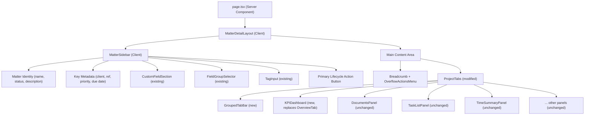
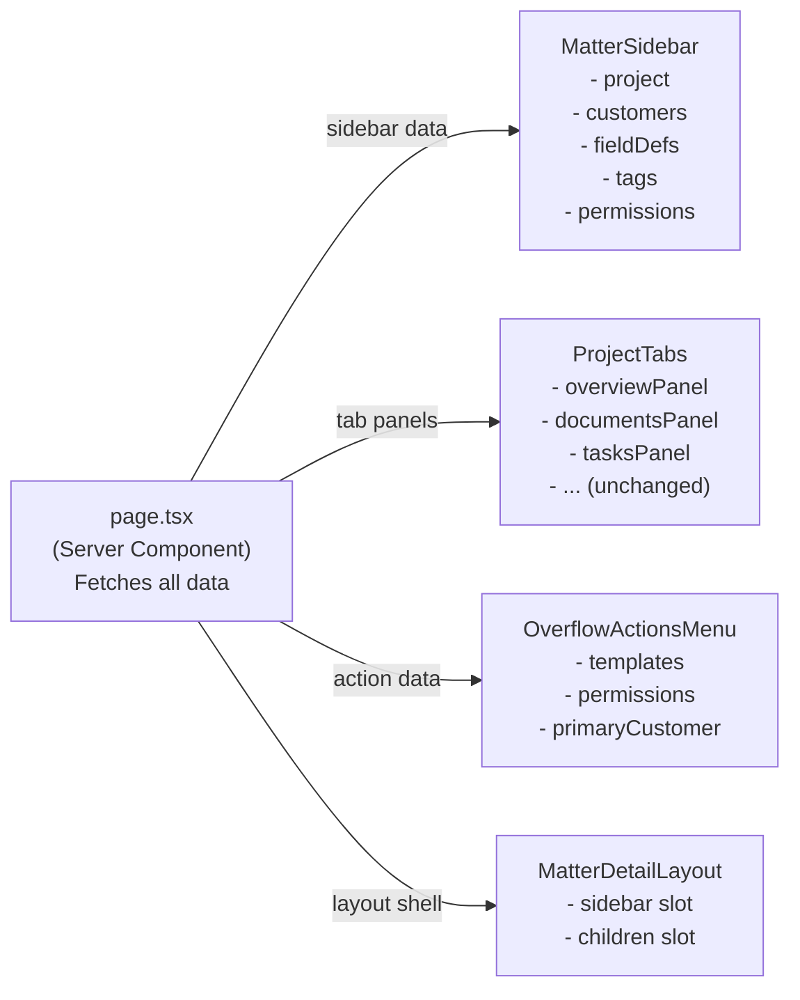
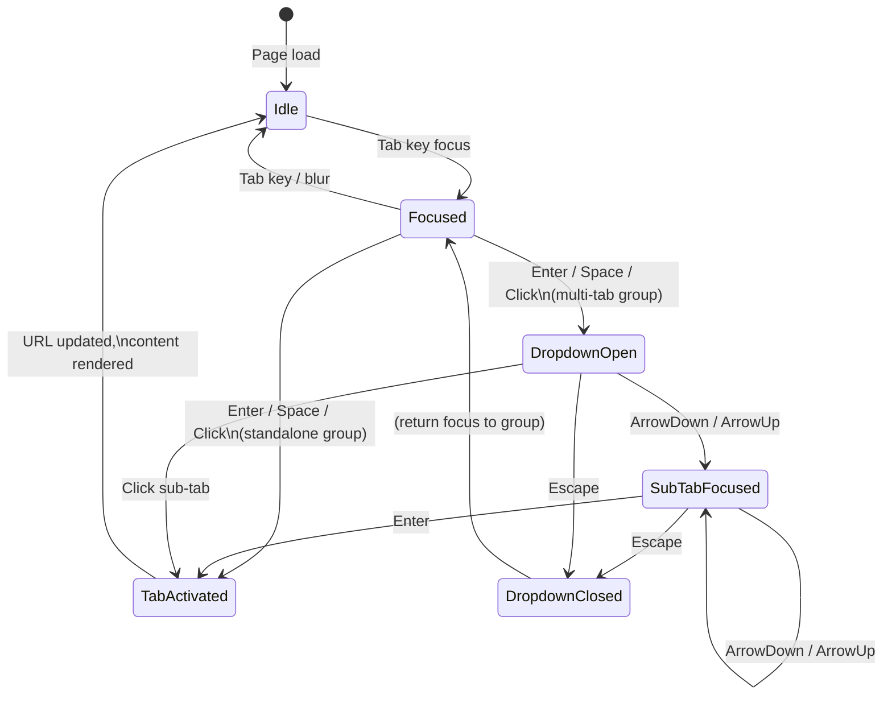

# Phase 73 — Matter Detail Page Redesign (Sidebar + Grouped Tabs)

> Merge into ARCHITECTURE.md as **Section 11**. Phase 73 — Matter Detail Page Redesign.

> **Canonical location**: this standalone `architecture/phase73-matter-detail-redesign.md` file. Per the convention established in `phase68-portal-redesign-vertical-parity.md`, `ARCHITECTURE.md` stops at Section 10 (Phase 4) and gets a one-paragraph stub pointer per phase doc. Local section numbers below (`11.x`) are an organising device internal to this phase doc — they are NOT claims on `ARCHITECTURE.md` slots. If a future consolidation pass folds phase docs back into `ARCHITECTURE.md`, the numbering will be renormalised at that time.

> **Frontend-only phase.** No backend changes, no new entities, no migrations. All data fetching stays the same. The server component in `page.tsx` continues to fetch all the same data; only the rendering structure changes.

> **ADRs**: [ADR-286](../adr/ADR-286-sidebar-layout-entity-detail.md), [ADR-287](../adr/ADR-287-grouped-tabs-dense-navigation.md)

---

## 11.1 Overview

The matter detail page (`/org/[slug]/projects/[id]`) is the most-visited page in Kazi. Attorneys land here multiple times per day to check status, log time, review documents, and manage tasks. Over 72 phases the page has grown organically: it stacks everything vertically — header, custom fields, 21 flat tabs, tab content — and the result is a page where the tab bar (the thing attorneys need) sits below the fold because custom fields and action buttons consume the viewport first.

Phase 73 restructures this page from a **vertical-stack layout** to a **sidebar + main content** layout. Matter identity, metadata, custom fields, tags, and the primary lifecycle action move into a fixed-width collapsible sidebar. The 21 flat tabs collapse into 6 logical groups with dropdown sub-navigation. The Overview tab becomes a single-screen KPI dashboard. Action buttons relocate to the sidebar footer and a compact overflow menu. Long matter names and descriptions are truncated with expand-on-demand, freed from the squeezing flex layout that currently renders them one word per line.

This is a pure frontend restructure. No backend changes, no new API endpoints, no entity changes, no migrations. Every current capability — custom fields, tabs, activity feed, actions — remains, just reorganised. The server component in `page.tsx` continues to fetch all the same data; only the rendering and component composition change.

### What's New

| Current Layout | Phase 73 Layout |
|---|---|
| Single vertical column: header → custom fields → 21 flat tabs → content | Two-panel: 280px sidebar (identity, metadata, custom fields, tags, actions) + fluid main area (grouped tabs + content) |
| 21 flat tabs in a horizontal row, wrapping or scrolling | 6 tab groups (Overview, Work, Finance, Client, Schedule, Activity) with dropdown sub-tabs |
| Overview tab: health header + activity feed + task breakdown + time breakdown + budget + team roster + deadlines + unbilled callout (long scroll) | Overview tab: single-screen KPI dashboard — health ring, 4-6 metric cards, upcoming deadlines list (no activity feed, no team roster, no detailed breakdowns) |
| 6-8 action buttons in the header, wrapping onto multiple rows | Primary lifecycle action in sidebar footer + overflow menu (MoreHorizontal) at top-right of main area |
| Matter name and description in a squeezable `flex-1` column, collapsing to single-word width | Matter name and description in sidebar at fixed 280px width, truncated with expand-on-demand |
| Custom fields rendered between header and tabs, consuming viewport | Custom fields in sidebar scroll area, collapsible accordion groups |

---

## 11.2 Component Architecture

Since this is a frontend-only phase with no new entities, this section covers component architecture rather than domain model.

### 11.2.1 New Components

| Component | File Path | Description |
|---|---|---|
| `MatterDetailLayout` | `frontend/components/projects/matter-detail-layout.tsx` | Client component. CSS Grid shell: sidebar + main content. Manages sidebar collapse state via `localStorage`. |
| `MatterSidebar` | `frontend/components/projects/matter-sidebar.tsx` | Client component. Renders identity, metadata, custom fields, tags, and lifecycle action. Scrolls independently. |
| `GroupedTabBar` | `frontend/components/projects/grouped-tab-bar.tsx` | Client component. Replaces flat tab triggers with grouped dropdown navigation. Manages keyboard navigation and URL state. |
| `KPIDashboard` | `frontend/components/projects/kpi-dashboard.tsx` | Server component. Replaces current Overview tab content with metric cards + deadlines list. |
| `OverflowActionsMenu` | `frontend/components/projects/overflow-actions-menu.tsx` | Client component. DropdownMenu with Generate Document, Generate Statement, New Engagement Letter, Save as Template, Edit, Archive, Delete. |
| `SidebarCollapseToggle` | `frontend/components/projects/sidebar-collapse-toggle.tsx` | Client component. Chevron button that toggles sidebar visibility. |

### 11.2.2 Existing Components to Modify

| Component | File Path | Change Description |
|---|---|---|
| `page.tsx` | `frontend/app/(app)/org/[slug]/projects/[id]/page.tsx` | Remove header section, custom fields section, tags section from main flow. Wrap in `MatterDetailLayout`. Pass sidebar-bound data to `MatterSidebar`, tab-bound data to `GroupedTabBar` + panels. |
| `ProjectTabs` | `frontend/components/projects/project-tabs.tsx` | Replace `TabsPrimitive.List` with `GroupedTabBar`. Keep `TabsPrimitive.Content` blocks. Receive `activeTab` and `onTabChange` from `GroupedTabBar`. |
| `OverviewTab` | `frontend/components/projects/overview-tab.tsx` | Gut and replace with `KPIDashboard`. Remove activity feed, task breakdown card, time breakdown card, team roster card. Keep health header (compact). Add metric cards grid + deadlines list. |

### 11.2.3 Component Tree



### 11.2.4 Props Interfaces

```typescript
// frontend/components/projects/matter-detail-layout.tsx

interface MatterDetailLayoutProps {
  sidebar: ReactNode;
  children: ReactNode;  // main content area
  /** Initial collapsed state read from server (cookie or default) */
  defaultCollapsed?: boolean;
}
```

```typescript
// frontend/components/projects/matter-sidebar.tsx

interface MatterSidebarProps {
  project: Project;
  customers: Customer[];
  slug: string;
  canEdit: boolean;
  canManage: boolean;
  isAdmin: boolean;
  isOwner: boolean;
  /** Custom field data */
  fieldDefinitions: FieldDefinitionResponse[];
  fieldGroups: FieldGroupResponse[];
  groupMembers: Record<string, FieldGroupMemberResponse[]>;
  /** Tags data */
  projectTags: TagResponse[];
  allTags: TagResponse[];
  /** Controls sidebar visibility (managed by parent MatterDetailLayout) */
  collapsed: boolean;
  onCollapsedChange: (collapsed: boolean) => void;
}
```

```typescript
// frontend/components/projects/grouped-tab-bar.tsx

interface TabDefinition {
  id: string;
  label: string;
}

interface TabGroup {
  id: string;
  label: string;
  tabs: TabDefinition[];
  /** Whether this group is visible (module-gating resolved by caller) */
  visible: boolean;
}

interface GroupedTabBarProps {
  groups: TabGroup[];
  activeTab: string;
  onTabChange: (tabId: string) => void;
}
```

```typescript
// frontend/components/projects/kpi-dashboard.tsx

interface MetricCard {
  id: string;
  label: string;
  value: string;
  /** Navigates to this tab when clicked */
  linkTab: string;
  icon: ReactNode;
  visible: boolean;
}

interface KPIDashboardProps {
  projectId: string;
  projectName: string;
  projectStatus: string;
  slug: string;
  canManage: boolean;
  customerName: string | null;
  customerId: string | null;
  /** Setup guidance data (unchanged from current OverviewTab) */
  setupStatus: ProjectSetupStatus | null;
  setupSteps: SetupStep[];
  ficaStatus: FicaStatus | null;
  retentionClockStartedAt: string | null;
  retentionEndsOn: string | null;
}
```

```typescript
// frontend/components/projects/overflow-actions-menu.tsx

interface OverflowActionsMenuProps {
  slug: string;
  projectId: string;
  projectName: string;
  projectStatus: ProjectStatus;
  canEdit: boolean;
  canManage: boolean;
  isAdmin: boolean;
  isOwner: boolean;
  /** Document templates for Generate Document sub-menu */
  templates: TemplateListResponse[];
  /** Primary customer (for engagement letter, statement) */
  primaryCustomer: { id: string; name: string; email: string } | null;
  projectTags: TagResponse[];
}
```

### 11.2.5 Data Flow

The server component `page.tsx` continues to fetch all data exactly as it does today. The change is in how that data is distributed to rendering components:



**Key constraint**: `MatterDetailLayout` and `MatterSidebar` are `"use client"` components (they use `useState` for collapse state and `localStorage`). Per the RSC serialization boundary rules in `frontend/CLAUDE.md`, `page.tsx` must pass only serializable data to them — no functions, no component references. The custom field data, tag data, and project object are all serializable. The `CustomFieldSection` and `TagInput` components (which are already client components) are rendered inside `MatterSidebar`, not passed as props.

---

## 11.3 Layout System

### 11.3.1 CSS Grid Specification

The layout shell uses CSS Grid with two columns — a sidebar and a main content area:

```css
/* Conceptual — implemented via Tailwind utilities */
.matter-detail-layout {
  display: grid;
  grid-template-columns: var(--sidebar-width) 1fr;
  gap: 0;
  min-height: 0;
}

.matter-detail-layout[data-collapsed="true"] {
  grid-template-columns: 0 1fr;
}
```

**Tailwind implementation:**

```tsx
<div
  className={cn(
    "grid min-h-0",
    collapsed ? "grid-cols-[0_1fr]" : "grid-cols-[var(--sidebar-width)_1fr]"
  )}
>
  {/* sidebar */}
  {/* main */}
</div>
```

### 11.3.2 Design Tokens

Define the sidebar width as a CSS custom property in `globals.css` so it can be referenced by both the grid template and the sidebar component:

```css
:root {
  --sidebar-width: 280px;
}
```

**Why 280px**: Wide enough to render custom field labels + values side by side in compact format, narrow enough to leave 700px+ of main content on a 1024px screen. Matches the sidebar width used by Clio Manage and Linear. The existing `desktop-sidebar.tsx` (main navigation sidebar) uses `w-64` (256px) — the matter sidebar is slightly wider because custom field labels are longer than navigation labels.

### 11.3.3 Sidebar Dimensions

| Property | Value | Rationale |
|---|---|---|
| Width (expanded) | `280px` via `--sidebar-width` | Custom field label + value readability |
| Width (collapsed) | `0px` | Full-width main content, no icon rail for v1 |
| Max height | `100%` of parent | Sidebar fills the layout grid cell |
| Overflow | `overflow-y: auto` | Independent vertical scroll |
| Border | `border-r border-slate-200 dark:border-slate-800` | Visual separator from main content |
| Padding | `p-4` (16px) | Consistent inner spacing |
| Transition | `transition-[grid-template-columns] duration-200 ease-in-out` | Smooth collapse/expand animation on the parent grid |

### 11.3.4 Responsive Breakpoints

| Breakpoint | Behaviour |
|---|---|
| `>= lg` (1024px) | Two-column grid. Sidebar visible (or collapsed via toggle). |
| `< lg` (< 1024px) | Single column. Sidebar hidden. Sheet trigger button visible in breadcrumb area. |

Below `lg`, the sidebar renders as a Shadcn `Sheet` (side="left") triggered by a button in the breadcrumb area. The Sheet overlays the main content — no grid column, no layout shift.

---

## 11.4 Grouped Tab Bar Design

### 11.4.1 Tab Group Definitions

| Group ID | Label | Sub-Tab IDs | Module Gates | Notes |
|---|---|---|---|---|
| `overview` | Overview | `overview` | None | Standalone tab — no dropdown |
| `work` | Work | `tasks`, `documents`, `generated`, `staffing` | None | Core operational content |
| `finance` | Finance | `time`, `expenses`, `budget`, `rates`, `financials`, `statements`, `trust` | `trust`: `trust_accounting`; `statements`: `disbursements`; "Expenses" label becomes "Disbursements" when `disbursements` module on | Revenue + cost tracking |
| `client` | Client | `customers`, `requests`, `customer-comments`, `adverse-parties` | `adverse-parties`: `conflict_check` | Client-facing content |
| `schedule` | Schedule | `court-dates` | `court-dates`: `court_calendar` | Entire group hides when module off |
| `activity` | Activity | `activity`, `audit` | `audit`: `TEAM_OVERSIGHT` capability | If only `activity` visible, render as standalone tab (no dropdown) |

**Behaviour rules:**
1. If a group has exactly one visible sub-tab, render it as a plain tab (no dropdown arrow, no dropdown menu). Clicking navigates directly to that tab.
2. If a group has zero visible sub-tabs (all gated off), the group itself hides.
3. Clicking a group label that has multiple sub-tabs opens its first visible sub-tab.
4. The dropdown appears on **click** (not hover) — hover is unreliable on touch devices.
5. Active sub-tab indication: the group label shows which sub-tab is active, e.g. "Finance · Time". When no sub-tab is active, the group label renders normally.

### 11.4.2 URL State Management

The existing `?tab=<id>` URL parameter continues to work without changes. Tab IDs are resolved as follows:

1. `?tab=time` -> Find the group containing `time` -> Finance group -> activate `time` sub-tab
2. `?tab=finance` -> Open Finance group's first visible sub-tab (likely `time`)
3. `?tab=overview` -> Overview (standalone tab)
4. No `?tab` -> Default to `overview`

All 21 existing tab IDs remain valid: `overview`, `documents`, `members`, `customers`, `tasks`, `time`, `expenses`, `budget`, `financials`, `staffing`, `rates`, `generated`, `requests`, `customer-comments`, `court-dates`, `adverse-parties`, `trust`, `disbursements`, `statements`, `activity`, `audit`.

**Note on `members` tab**: The current `members` tab is not present in the grouped tab definitions. The Members panel content moves to Work > Staffing (for allocation view) and the sidebar (for quick team reference). The `?tab=members` URL should resolve to `?tab=staffing` for backward compatibility.

**Implementation**: The `GroupedTabBar` component resolves the `?tab` URL parameter to a group + sub-tab pair. It does NOT rewrite the URL — the URL stays as `?tab=time`, and the component internally maps that to the Finance group with Time selected. This preserves all existing deep links and bookmarks.

### 11.4.3 Keyboard Navigation

| Key | Action |
|---|---|
| `ArrowRight` | Move focus to next group |
| `ArrowLeft` | Move focus to previous group |
| `Enter` / `Space` | Open focused group's dropdown (or activate if standalone) |
| `ArrowDown` | Move focus to next sub-tab within open dropdown |
| `ArrowUp` | Move focus to previous sub-tab within open dropdown |
| `Enter` | Select focused sub-tab, close dropdown |
| `Escape` | Close open dropdown without changing selection |
| `Tab` | Move focus out of the tab bar to next focusable element |

This follows WAI-ARIA Tabs pattern with the addition of dropdown sub-navigation. The `GroupedTabBar` uses `role="tablist"` on the group row, `role="tab"` on each group trigger, and `role="menu"` / `role="menuitem"` on the dropdown sub-tabs.

### 11.4.4 State Diagram



---

## 11.5 Sidebar Design

### 11.5.1 Content Sections

The sidebar contains five sections, top to bottom. The first four scroll together within the sidebar's `overflow-y: auto` area. The fifth (lifecycle action) is sticky at the bottom.

**A. Matter Identity**

```tsx
<div className="space-y-2">
  <div className="flex items-center gap-2">
    <h1 className="line-clamp-3 text-lg font-semibold text-slate-950 dark:text-slate-50">
      {project.name}
    </h1>
    <Badge variant={PROJECT_STATUS_BADGE[project.status].variant}>
      {PROJECT_STATUS_BADGE[project.status].label}
    </Badge>
  </div>
  {/* Description: collapsed by default, expand on demand */}
  <ExpandableText
    text={project.description}
    lineClamp={2}
    className="text-sm text-muted-foreground"
  />
</div>
```

**Why line-clamp-3 for name**: A legal matter name like "Sipho Dlamini v Road Accident Fund --- High Court Johannesburg --- Case No 2026/12345" spans ~80 characters. At 280px width with `text-lg`, this wraps to approximately 3 lines. Clamping at 3 prevents runaway titles while showing enough context to identify the matter. Full text is available via tooltip on hover.

**B. Key Metadata**

Compact key-value list using `text-sm` labels and regular-weight values:

| Field | Source | Display |
|---|---|---|
| Client | `customers[0].name` | Link to `/org/{slug}/customers/{id}` |
| Reference | `project.referenceNumber` | `<code>` chip |
| Work type | `project.workType` | Plain text |
| Priority | `project.priority` | Coloured `Badge` |
| Due date | `project.dueDate` | Date, red text + AlertTriangle if overdue |
| Created | `project.createdAt` | Formatted date |

No card wrapper. Clean vertical list with `space-y-2`.

**C. Custom Fields (Scrollable)**

The existing `CustomFieldSection` renders inside the sidebar, constrained to sidebar width. Each field group is a collapsible accordion section (Shadcn `Accordion`):

- Default: first group expanded, rest collapsed
- The `FieldGroupSelector` renders at the bottom of the custom fields area
- "Save Custom Fields" button appears only when unsaved changes exist, sticky at the bottom of the custom fields area

**Why Accordion instead of open sections**: At 280px width, custom fields are vertically dense. Multiple field groups open simultaneously would push the tags and action sections far below the fold. Accordion ensures only one group is open at a time, preserving vertical space. The first group opens by default because it typically contains the most-used fields (e.g., `matter_type`, `case_number`, `court_name` for legal-za).

**D. Tags**

The existing `TagInput` component renders at sidebar width. No structural changes — it already adapts to its container width.

**E. Actions (Sidebar Footer — Sticky)**

Primary lifecycle action rendered as a full-width button, pinned to the sidebar bottom:

```tsx
<div className="sticky bottom-0 border-t border-slate-200 bg-white p-4 dark:border-slate-800 dark:bg-slate-950">
  {/* Lifecycle action button — full width */}
</div>
```

### 11.5.2 Collapse Behaviour

**Desktop (`>= lg`):**
- Toggle button (ChevronLeft / ChevronRight icon) rendered inside `MatterSidebar` at the top-right of the sidebar header. The button calls `onCollapsedChange(true)`. When collapsed, a floating `SidebarCollapseToggle` button renders in `MatterDetailLayout` (not inside `MatterSidebar`, which is hidden) to re-expand.
- Collapsed state: sidebar width becomes `0px`, main content expands to full width
- No icon-rail intermediate state for v1 — collapsed means hidden
- State persisted in `localStorage` key `kazi-matter-sidebar-collapsed` (boolean)
- **State ownership**: `MatterDetailLayout` owns the `collapsed` boolean (reads from localStorage on mount, writes on change). `MatterSidebar` receives it as a prop for its own toggle button. `SidebarCollapseToggle` is rendered by `MatterDetailLayout` only when `collapsed === true`.

**Mobile (`< lg`):**
- Sidebar renders as a Shadcn `Sheet` (side="left")
- Triggered by a button (PanelLeft icon) in the breadcrumb area
- Sheet overlays main content with backdrop
- Sheet slides in from left per Shadcn Sheet animation defaults

**Why localStorage instead of a cookie or backend preference**: This is a per-device UI preference, not a user setting that syncs across devices. localStorage is the simplest mechanism — no server round-trip, no API endpoint needed, works offline. The collapse state has no security or privacy implications. Server components cannot read localStorage, so the initial render always shows the sidebar expanded; the client component hydrates and collapses immediately if localStorage says so. The brief layout shift is acceptable for v1.

### 11.5.3 Scroll Independence

The sidebar and main content scroll independently. The sidebar has `overflow-y: auto` and fills its grid cell. The main content area has its own scroll context (either the page body scroll or an explicit `overflow-y: auto` depending on final implementation).

This solves the core UX problem: scrolling through tab content does not scroll the sidebar out of view, and scrolling through custom fields does not scroll the tab bar or content.

---

## 11.6 KPI Dashboard (Overview Tab Redesign)

### 11.6.1 Metric Card Definitions

| Metric | Data Source | Visible When | Click Target |
|---|---|---|---|
| Budget consumed (%) | `BudgetStatusResponse.hoursConsumedPct` | Budget is set | `?tab=budget` |
| Hours logged | `ProjectTimeSummary.totalMinutes` (converted) | Always | `?tab=time` |
| Task completion (%) | `tasksDone / totalTasks` from health metrics | Always | `?tab=tasks` |
| Days to deadline | `project.dueDate` minus today | Due date is set | — |
| Trust balance | `TrustBalanceCard` data (trust_accounting module) | `trust_accounting` module on | `?tab=trust` |
| Outstanding invoices | Statements data (disbursements module) | `disbursements` module on | `?tab=statements` |

Each card renders:
- Icon (top-left, `size-5`, `text-slate-400`)
- Metric value (`font-mono text-2xl font-bold tabular-nums`)
- Label (`text-xs text-muted-foreground uppercase tracking-wider`)
- Click behaviour: renders as `<Link href="?tab={linkTab}">` for server-compatible navigation. No `onTabChange` callback — `KPIDashboard` is a Server Component and cannot use client-side handlers. The URL change triggers a re-render that `GroupedTabBar` picks up via its `searchParams` prop.

### 11.6.2 Grid Layout

```
Desktop (>= lg):   3-column grid
Tablet (md):       2-column grid
Mobile (< md):     1-column stack
```

```tsx
<div className="grid gap-4 md:grid-cols-2 lg:grid-cols-3">
  {cards.filter(c => c.visible).map(card => (
    <MetricCard key={card.id} {...card} />
  ))}
</div>
```

### 11.6.3 Health Ring

The existing `HealthBadge` and health header render above the metric grid as a compact band — same structure as the current `project-health-header`, but without the project name (which is now in the sidebar). The health band retains the coloured top border (green/amber/red) and reason badges.

### 11.6.4 Upcoming Deadlines List

Below the metric grid. Max 5 items, sorted by date ascending. Each item:
- Date (formatted, red if overdue)
- Description / title
- Type badge (COURT / REGULATORY)
- Link to relevant entity

"View all" link navigates to `?tab=court-dates` (Schedule group).

The existing `UpcomingDeadlinesTile` component is reused here. It already renders the correct data from `fetchProjectUpcomingDeadlines`.

### 11.6.5 What Was Removed and Where It Went

| Current Overview Content | New Location |
|---|---|
| Recent Activity card (10 items) | Activity tab (standalone, already exists) |
| Team roster (member avatars) | Sidebar metadata section + Work > Staffing |
| Task Status card (MicroStackedBar) | Work > Tasks sub-tab (task list already shows status) |
| Time Breakdown card (DonutChart) | Finance > Time sub-tab (already shows member breakdown) |
| Budget card (progress bar) | KPI metric card (compact) + Finance > Budget sub-tab (detail) |
| Unbilled Time callout | Finance > Time sub-tab (callout banner) |
| FicaStatusCard | KPI dashboard (metric card, visible when customer linked + legal-za module on). Props `ficaStatus`, `retentionClockStartedAt`, `retentionEndsOn` already in `KPIDashboardProps`. |
| RetentionCard | KPI dashboard (metric card, below FicaStatusCard, same visibility condition) |
| Setup checklist bar | KPI dashboard (above metric grid, unchanged) |

---

## 11.7 Action Button Relocation

### 11.7.1 Primary Lifecycle Action (Sidebar Footer)

The primary lifecycle action is context-dependent based on matter status:

| Matter Status | Primary Action | Component |
|---|---|---|
| `ACTIVE` | Complete Matter | `ProjectLifecycleActions` |
| `ACTIVE` (legal-za with closure module) | Close Matter | `MatterClosureAction` |
| `COMPLETED` | Reopen | `MatterReopenAction` |
| `CLOSED` | Reopen | `MatterReopenAction` |
| `ARCHIVED` | Restore | `ProjectLifecycleActions` |

The button renders full-width in the sticky sidebar footer. Only the single most relevant action renders here — not all lifecycle actions simultaneously.

### 11.7.2 Overflow Menu (Main Area)

An `OverflowActionsMenu` component renders at the top-right of the main content area, same row as the breadcrumb. It uses Shadcn `DropdownMenu` with a `MoreHorizontal` icon trigger:

| Menu Item | Gate | Current Location |
|---|---|---|
| Generate Document | `canManage && templates.length > 0` | Header action cluster |
| Generate Statement of Account | module-gated (disbursements) | Header action cluster |
| New Engagement Letter | `canManage && customer linked && customer not offboarded` | Header action cluster |
| Save as Template | `canManage` | Header action cluster |
| Edit Matter | `canEdit` | Header action cluster |
| Archive Matter | `isAdmin` | Header action cluster |
| Delete Matter | `isOwner` (with confirmation dialog) | Header action cluster |

**Permission checks preserved**: Every gate condition from the current `page.tsx` action cluster (lines 1002-1111 in the current source) is preserved identically in the overflow menu. The `OverflowActionsMenu` receives the same capability flags (`canEdit`, `canManage`, `isAdmin`, `isOwner`) and applies the same conditional rendering.

---

## 11.8 Responsive Behaviour

### 11.8.1 Breakpoint Table

| Breakpoint | Sidebar | Tab Groups | Metric Grid | Overall |
|---|---|---|---|---|
| `< md` (< 768px) | Sheet (overlay) | Dropdowns may use full-width popover | 1 column | Single-column stack |
| `md` (768px - 1023px) | Sheet (overlay) | Standard dropdowns | 2 columns | Single-column + sheet |
| `>= lg` (1024px+) | Visible (280px grid column) | Standard dropdowns | 3 columns | Two-column grid |

### 11.8.2 Sidebar Sheet Transition

Below `lg`, the sidebar grid column is removed entirely (`grid-cols-[1fr]`). A `Sheet` trigger button appears in the breadcrumb bar:

```tsx
<Sheet>
  <SheetTrigger asChild>
    <Button variant="ghost" size="icon" className="lg:hidden">
      <PanelLeft className="size-5" />
    </Button>
  </SheetTrigger>
  <SheetContent side="left" className="w-[280px] overflow-y-auto p-0">
    <MatterSidebar {...sidebarProps} collapsed={false} onCollapsedChange={() => {}} />
  </SheetContent>
</Sheet>
```

### 11.8.3 Tab Group Dropdown on Touch Devices

Tab group dropdowns use **click** activation (not hover). On touch devices, a tap opens the dropdown. A second tap on a sub-tab navigates. The dropdown closes on outside tap (standard Radix `DropdownMenu` behaviour).

### 11.8.4 Testing Matrix

| Viewport | Content Scenario | Key Verifications |
|---|---|---|
| 1440x900 (desktop) | Long name + 3 field groups + all modules | Sidebar doesn't overflow, all tab groups visible, metric grid 3-col |
| 1024x768 (lg boundary) | Short name + no custom fields + min modules | Sidebar collapses cleanly, no layout jump |
| 768x1024 (tablet portrait) | Long name + 2 field groups | Sheet opens/closes smoothly, metric grid 2-col |
| 375x812 (iPhone SE) | Long description + all modules | Sheet trigger visible, tab groups readable, metric grid 1-col |
| 1920x1080 (large desktop) | No custom fields + no modules | Main content area uses available width, no excessive whitespace |

---

## 11.9 QA Testplan Impact Assessment

The layout restructure will break every QA lifecycle script that interacts with the matter detail page. This section identifies specific breakages and provides migration guidance.

### 11.9.1 Known Selector Breakages

| QA File | Affected Steps | Current Selector / Action | New Selector / Action |
|---|---|---|---|
| `legal-za-full-lifecycle-keycloak.md` | 3.5 | "Verify matter sidebar tabs include the canonical legal-za set" — references flat tab list | Verify tab groups: Overview, Work (Tasks, Documents, Generated Docs, Staffing), Finance (Time, Expenses, Budget, Rates, Financials, Statements, Trust), Client (Customers, Requests, Client Comments, Adverse Parties), Schedule (Court Dates), Activity |
| `legal-za-full-lifecycle-keycloak.md` | 5.1 | "Navigate to matter RAF-2026-001 -> Info Requests tab" | Navigate to matter -> Client group -> Requests sub-tab |
| `legal-za-full-lifecycle-keycloak.md` | 10.8 | "Navigate to matter -> Trust tab" | Navigate to matter -> Finance group -> Trust sub-tab |
| `legal-za-full-lifecycle-keycloak.md` | 21.1 | "Navigate to matter -> Tasks tab" | Navigate to matter -> Work group -> Tasks sub-tab |
| `legal-za-full-lifecycle-keycloak.md` | 21.6 | "Navigate to Disbursements tab" | Navigate to Finance group -> Disbursements sub-tab |
| `legal-za-full-lifecycle-keycloak.md` | 21.10 | "Navigate to matter Court Calendar tab" | Navigate to Schedule group -> Court Dates sub-tab |
| `legal-za-90day-keycloak.md` | 5.3 | "Verify Tasks tab, Time tab, Documents tab, Comments tab, Activity tab all load" | Verify Work > Tasks, Finance > Time, Work > Documents, Client > Client Comments, Activity all load |
| All scripts | Any "click tab" step | `[role="tablist"] >> text=Time` | `[data-testid="tab-group-finance"] >> [data-testid="tab-item-time"]` |

### 11.9.2 Playwright Selector Migration Guide

| Old Pattern | New Pattern |
|---|---|
| `page.getByRole('tab', { name: 'Time' })` | `page.getByTestId('tab-group-finance').click()` then `page.getByTestId('tab-item-time').click()` |
| `page.getByRole('tab', { name: 'Documents' })` | `page.getByTestId('tab-group-work').click()` then `page.getByTestId('tab-item-documents').click()` |
| `page.locator('[role="tablist"]')` | `page.getByTestId('grouped-tab-bar')` |
| `page.getByText('Complete Matter').click()` (header) | `page.getByTestId('sidebar-lifecycle-action').click()` or find within sidebar |
| `page.getByText('Generate Document').click()` (header) | `page.getByTestId('overflow-actions-trigger').click()` then `page.getByText('Generate Document').click()` |

### 11.9.3 Screenshot Baseline Re-Capture Checklist

After the redesign lands, re-capture baselines for:
- [ ] Matter detail page — desktop (sidebar expanded)
- [ ] Matter detail page — desktop (sidebar collapsed)
- [ ] Matter detail page — mobile (Sheet closed)
- [ ] Matter detail page — mobile (Sheet open)
- [ ] Overview tab — KPI dashboard
- [ ] Tab group dropdown open state (Finance group)
- [ ] Overflow actions menu open state

---

## 11.10 Implementation Guidance

### 11.10.1 File Changes Table

| File Path | Change Type | Description |
|---|---|---|
| `frontend/app/(app)/org/[slug]/projects/[id]/page.tsx` | **Major refactor** | Remove header/custom-fields/tags sections from main flow. Wrap in `MatterDetailLayout`. Split data into sidebar vs main props. |
| `frontend/components/projects/matter-detail-layout.tsx` | **New file** | CSS Grid shell, sidebar collapse state, responsive Sheet wrapper. |
| `frontend/components/projects/matter-sidebar.tsx` | **New file** | Identity, metadata, custom fields, tags, lifecycle action. |
| `frontend/components/projects/grouped-tab-bar.tsx` | **New file** | Grouped dropdown tab navigation, keyboard nav, URL state resolution. |
| `frontend/components/projects/kpi-dashboard.tsx` | **New file** | Metric cards grid, health ring, deadlines list. Replaces OverviewTab body. |
| `frontend/components/projects/overflow-actions-menu.tsx` | **New file** | DropdownMenu with Generate Doc, Statement, Engagement Letter, Template, Edit, Archive, Delete. |
| `frontend/components/projects/sidebar-collapse-toggle.tsx` | **New file** | ChevronLeft/Right button for sidebar toggle. |
| `frontend/components/projects/project-tabs.tsx` | **Modify** | Replace `TabsPrimitive.List` with `GroupedTabBar`. Keep all `TabsPrimitive.Content` blocks. |
| `frontend/components/projects/overview-tab.tsx` | **Major refactor** | Gut current content. Replace with `KPIDashboard`. Remove activity feed, task breakdown, time breakdown, team roster. |
| `frontend/app/globals.css` | **Minor addition** | Add `--sidebar-width: 280px` CSS custom property. |
| `qa/testplan/demos/legal-za-full-lifecycle-keycloak.md` | **Update** | Migrate tab navigation steps to grouped tab pattern. |
| `qa/testplan/demos/legal-za-90day-keycloak.md` | **Update** | Migrate tab navigation steps to grouped tab pattern. |
| `qa/testplan/demos/consulting-agency-90day-keycloak.md` | **Update** | Migrate tab navigation steps to grouped tab pattern. |
| `qa/testplan/demos/portal-client-90day-keycloak.md` | **Update** | Migrate tab navigation steps (if matter detail visited). |
| `qa/testplan/demos/admin-audit-30day-keycloak.md` | **Update** | Migrate tab navigation steps (if matter detail visited). |
| `qa/testplan/demos/accounting-za-90day-keycloak-v2.md` | **Update** | Migrate tab navigation steps (if matter detail visited). |

### 11.10.2 Component Extraction Sequence

Build order matters because components depend on each other:

1. **`MatterDetailLayout`** — the shell. Can be tested with placeholder sidebar/main slots.
2. **`MatterSidebar`** — extract sidebar content from `page.tsx`. Depends on `MatterDetailLayout` for rendering context.
3. **`GroupedTabBar`** — replace flat tabs. Depends on nothing except Radix/Shadcn primitives.
4. **`KPIDashboard`** — replace Overview tab. Depends on nothing except existing dashboard components.
5. **`OverflowActionsMenu`** — relocate actions. Depends on nothing except existing dialog/action components.
6. **`page.tsx` refactor** — wire everything together. Depends on all of the above.

### 11.10.3 Testing Strategy

| Test Type | Tool | Scope |
|---|---|---|
| Component unit tests | Vitest + Testing Library | `GroupedTabBar` keyboard nav, URL resolution, group visibility logic. `MatterDetailLayout` collapse toggle, localStorage persistence. |
| Snapshot tests | Vitest | `KPIDashboard` metric card rendering for different data scenarios (no budget, no trust, all modules). |
| Integration tests | Vitest | `page.tsx` renders correctly with `MatterDetailLayout` wrapper. Data flows to sidebar and tabs. |
| E2E tests | Playwright | Full matter detail page load, sidebar toggle, tab group navigation, action menu items, responsive Sheet. |
| Visual regression | Playwright screenshots | Baseline captures at desktop/tablet/mobile viewports. |

### 11.10.4 Risk Areas

1. **RSC serialization boundary**: `MatterSidebar` is a client component. All data passed to it from `page.tsx` must be serializable. The `CustomFieldSection` and `TagInput` are rendered inside `MatterSidebar`, not passed as props — but their props must also be serializable. Verify no function props leak through.

2. **Layout shift on hydration**: The sidebar collapse state lives in `localStorage`, which is not available during SSR. The server render will always show the sidebar expanded. On hydration, if localStorage says collapsed, the sidebar will collapse — causing a layout shift. Mitigate by matching the server-render default to the most common user state (expanded). For v1, this is acceptable; a future improvement could use a cookie for the collapse state to enable server-side rendering of the correct state.

3. **Tab group dropdown z-index**: The grouped tab bar dropdowns must render above the tab content but below modal dialogs. Use Radix `DropdownMenu` (which uses Radix Portal) to ensure correct stacking. Test with all dialog triggers (Edit, Delete, Generate Document) to verify no z-index conflicts.

4. **Custom field save button positioning**: The "Save Custom Fields" button must be sticky at the bottom of the custom fields area within the sidebar scroll. This requires careful CSS — the button should stick to the bottom of the custom fields section, not the bottom of the sidebar (which is occupied by the lifecycle action). Implementation: wrap custom fields in a relative container, use `sticky bottom-0` on the save button within that container.

5. **`members` tab backward compatibility**: The current `members` tab is being removed from the grouped tabs (team info moves to sidebar and Staffing). The `?tab=members` URL must still resolve. Map it to `?tab=staffing` in the URL resolution logic.

6. **Framer Motion imports in new client components**: Per `frontend/CLAUDE.md`, `motion` is client-only — never import in server components. The existing `project-tabs.tsx` uses Framer Motion for the active tab underline animation. New client components (`GroupedTabBar`, `MatterSidebar`) may naturally want entrance/exit animations. This is fine since they are `"use client"`, but implementers must not accidentally lift a Motion-dependent element into the server component layer during the `page.tsx` refactor.

---

## 11.11 Capability Slices

### Slice 73A: Layout Shell + Sidebar

**Scope**: Create `MatterDetailLayout` and `MatterSidebar`. Extract matter identity, metadata, custom fields, tags from `page.tsx` header into the sidebar. Wire the two-column grid. Implement sidebar collapse toggle with localStorage persistence.

**Key Deliverables**:
- `matter-detail-layout.tsx` with CSS Grid, responsive breakpoint, Sheet wrapper
- `matter-sidebar.tsx` with identity, metadata, custom fields (accordion), tags, sticky footer
- `sidebar-collapse-toggle.tsx`
- `--sidebar-width` CSS variable in `globals.css`
- `page.tsx` refactored to use `MatterDetailLayout` wrapper

**Dependencies**: None (first slice).

**Test Expectations**:
- Vitest: collapse toggle state, localStorage read/write, responsive breakpoint detection
- Manual: sidebar renders correctly at desktop/tablet/mobile, custom fields in accordion, scroll independence works

### Slice 73B: Grouped Tab Bar

**Scope**: Create `GroupedTabBar`. Replace flat `TabsPrimitive.List` in `ProjectTabs` with grouped dropdown navigation. Implement keyboard navigation, URL state resolution, module gating.

**Key Deliverables**:
- `grouped-tab-bar.tsx` with dropdown sub-navigation
- Modified `project-tabs.tsx` using `GroupedTabBar` instead of flat tab triggers
- Tab group definitions with module-gating logic
- URL backward compatibility for all 21 tab IDs
- `?tab=members` -> `?tab=staffing` redirect

**Dependencies**: None. `GroupedTabBar` replaces the tab trigger row inside `ProjectTabs` and can be developed independently of the layout shell. It composes with the existing `ProjectTabs` content panels regardless of whether the sidebar exists yet.

**Test Expectations**:
- Vitest: keyboard navigation (arrow keys, Enter, Escape), URL resolution for all 21 tab IDs, group visibility when modules are off, standalone tab rendering for single-sub-tab groups
- Manual: tab groups open/close, active tab indication, dropdown positioning

### Slice 73C: Overview Tab Redesign

**Scope**: Replace current `OverviewTab` content with `KPIDashboard`. Metric cards grid, compact health header, upcoming deadlines list. Remove activity feed, task breakdown, time breakdown, team roster, budget detail from overview.

**Key Deliverables**:
- `kpi-dashboard.tsx` with metric cards and deadlines list
- Modified `overview-tab.tsx` rendering `KPIDashboard`
- Metric cards: budget %, hours, task completion %, days to deadline, trust balance, outstanding invoices
- Responsive grid (3-col / 2-col / 1-col)

**Dependencies**: Slice 73A (sidebar must exist because team roster relocates to sidebar metadata section; removing it from overview without the sidebar creates a gap). Slice 73B is independent — overview is just one tab.

**Test Expectations**:
- Vitest: metric card visibility based on module gates, metric value formatting, responsive grid classes
- Manual: KPI dashboard fits single screen, no scroll needed for default view, metric cards link to correct tabs

### Slice 73D: Action Button Relocation

**Scope**: Move lifecycle action to sidebar footer. Create `OverflowActionsMenu` for remaining actions. Remove action cluster from page header.

**Key Deliverables**:
- `overflow-actions-menu.tsx` with DropdownMenu
- Sidebar footer with context-dependent lifecycle action
- All permission gates preserved from current implementation
- `page.tsx` header action cluster removed

**Dependencies**: Slice 73A (sidebar footer is the target for lifecycle action).

**Test Expectations**:
- Vitest: menu item visibility based on permissions, lifecycle action mapping based on status
- Manual: overflow menu opens/closes, Generate Document sub-menu works, Delete confirmation dialog renders correctly

### Slice 73E: Responsive Behaviour + Polish

**Scope**: Sheet on mobile, collapse toggle polish, transition animations, edge-case handling (very long names, many field groups, no modules).

**Key Deliverables**:
- Sheet trigger in breadcrumb area for mobile
- Smooth sidebar collapse/expand transition (`transition-[grid-template-columns]`)
- Edge case testing: short names, long names, no custom fields, 3+ field groups, all modules on/off
- Dark mode verification for all new components

**Dependencies**: Slices 73A through 73D (polishes all prior slices).

**Test Expectations**:
- Playwright: viewport resize tests (desktop -> tablet -> mobile), Sheet open/close, sidebar toggle
- Manual: visual inspection of all edge cases in testing matrix (Section 11.8.4)

### Slice 73F: QA Testplan Updates

**Scope**: Migrate all QA lifecycle scripts to use grouped tab navigation. Update Playwright selectors. Re-capture screenshot baselines.

**Key Deliverables**:
- Updated `qa/testplan/demos/*.md` files (all 6 scripts)
- Selector migration per Section 11.9.2
- Screenshot baselines re-captured
- Verification that all lifecycle scripts pass with new selectors

**Dependencies**: Slices 73A through 73E (all layout changes must be complete before updating QA scripts).

**Test Expectations**:
- Run each QA lifecycle script end-to-end with new selectors — verify no step references old layout patterns

---

## 11.12 ADR Index

| ADR | Title | Status |
|---|---|---|
| [ADR-286](../adr/ADR-286-sidebar-layout-entity-detail.md) | Sidebar vs Full-Width Layout for Entity Detail Pages | Accepted |
| [ADR-287](../adr/ADR-287-grouped-tabs-dense-navigation.md) | Grouped Tabs Pattern for Dense Navigation | Accepted |
