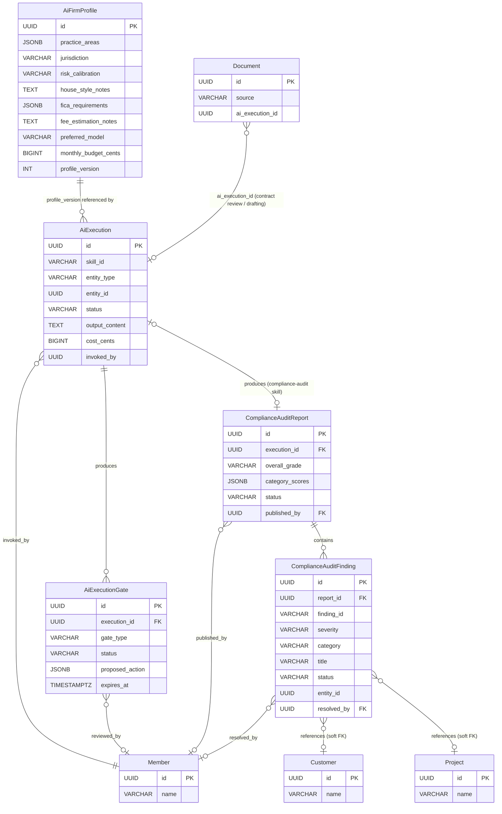
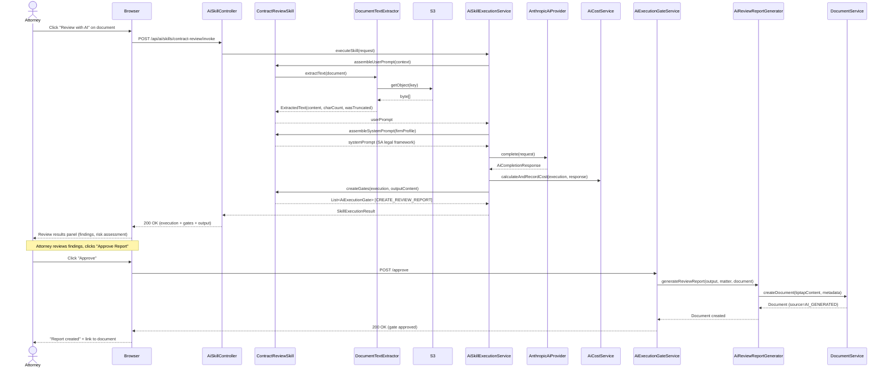
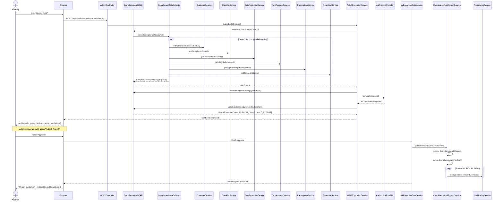

# Phase 74 — AI Intelligence Suite: Contract Review, Drafting & Compliance Audit

> **Canonical location**: this standalone `architecture/phase74-*.md` file. Per the convention established in `phase68-portal-redesign-vertical-parity.md`, `ARCHITECTURE.md` stops at Section 10 (Phase 4) and gets a one-paragraph stub pointer per phase doc. Local section numbers below (`11.x`) are an organising device internal to this phase doc -- they are NOT claims on `ARCHITECTURE.md` slots. If a future consolidation pass folds phase docs back into `ARCHITECTURE.md`, the numbering will be renormalised at that time.

> **Extends**: Phase 72 (`phase72-ai-foundation-client-intelligence.md`) shipped `AiProvider` evolution, `AnthropicAiProvider`, `AiFirmProfile`, `AiExecution`, `AiExecutionGate`, `AiSkill` interface, `AiSkillExecutionService`, `StubAiProvider`, cost metering, and two skills (FICA verification, matter intake). Phase 74 adds three new skills to this infrastructure and one new persistence domain (compliance audit reports + findings).

> **ADRs**: [ADR-288](../adr/ADR-288-contract-review-document-as-report.md), [ADR-289](../adr/ADR-289-template-guided-drafting-over-freeform.md), [ADR-290](../adr/ADR-290-on-demand-compliance-audit-over-scheduled.md), [ADR-291](../adr/ADR-291-compliance-findings-persistent-lifecycle.md), [ADR-292](../adr/ADR-292-ai-generated-document-provenance.md)

> **Migration**: Tenant **V127** -- `compliance_audit_reports`, `compliance_audit_findings` tables + `ALTER TABLE documents` to add `source` and `ai_execution_id` provenance columns ([ADR-292](../adr/ADR-292-ai-generated-document-provenance.md)). V127 follows V126 (Phase 73 field group applicable entity values). All tables are tenant-scoped per [ADR-T001](../adr/ADR-T001-schema-per-tenant-over-row-level-isolation.md). No global migrations. Contract review and drafting skills produce `Document` entities via the existing document pipeline -- no new tables required for them beyond the provenance columns.

---

## 11.1 Overview

Phase 72 built the AI infrastructure layer: the `AiProvider` port, real `AnthropicAiProvider`, firm AI profile, execution gates for attorney approval, per-invocation cost metering, and the `AiSkill` interface. It demonstrated the infrastructure with two skills -- FICA verification and matter intake. Phase 74 delivers on the promise that "AI skills embedded in the system of record beat bolt-on tools because the data is already there." Three new skills -- contract review, template-guided drafting, and compliance audit -- demonstrate capabilities that are impossible from an external AI tool because they operate on data that only exists inside Kazi.

A contract review skill that reads the uploaded contract, the matter context, and SA jurisdiction-specific legal knowledge. A drafting skill that fills template variables from matter and customer data, generates narrative sections using the firm's house style, and recommends relevant clauses. A compliance audit that sweeps the entire client book -- FICA checklists, POPIA processing activities, trust accounting integrity, prescription tracking, record retention -- and produces a graded report with actionable findings. None of these are possible from ChatGPT, Claude.ai, or any bolt-on tool because they require read access to the firm's structured data.

### What's New

| Existing Capability (Phase 72) | Phase 74 Adds |
|---|---|
| 2 AI skills: `fica-verification`, `matter-intake` | 3 new skills: `contract-review`, `drafting`, `compliance-audit` |
| Skills operate on single entities (one customer, one project) | Compliance audit operates firm-wide (all customers, all matters) |
| Skills produce execution gates for entity modifications | Contract review and drafting produce `Document` entities via the existing generation pipeline |
| No document text extraction for review purposes | `DocumentTextExtractorService` -- PDF, DOCX, Tiptap text extraction with size limits |
| No cross-service compliance aggregation | `ComplianceDataCollectorService` -- aggregates data from 6+ services with module guards |
| No persistent compliance audit reports | `ComplianceAuditReport` + `ComplianceAuditFinding` entities with finding lifecycle |
| Documents have no AI provenance metadata | `source` and `ai_execution_id` metadata fields on AI-generated documents ([ADR-292](../adr/ADR-292-ai-generated-document-provenance.md)) |
| AI execution history shows 2 skill types | 5 skill types in the filter dropdown |

### Scope Boundaries

**In scope**: Contract review skill (commercial, employment, corporate, general document types), template-guided drafting skill, on-demand compliance audit skill, `DocumentTextExtractorService` (PDF, DOCX, Tiptap text extraction), `ComplianceDataCollectorService` (6-service aggregation with module guards), `AiReviewReportGenerator` (Tiptap report from review output), `AiDraftDocumentGenerator` (template filling with AI values), `ComplianceAuditReport` and `ComplianceAuditFinding` entities, finding lifecycle (OPEN -> ACKNOWLEDGED -> IN_PROGRESS -> RESOLVED / FALSE_POSITIVE), compliance dashboard AI audit extension, V127 migration, `StubAiProvider` extensions for 3 new skills.

**Out of scope**: Inline document annotations (requires Tiptap annotation extension), freeform drafting without template, scheduled compliance audits, bulk contract review ("review all documents in a matter"), trust accounting watchdog (separate skill), fee note narrative generator (separate skill), regulatory monitor / Government Gazette integration, multi-model support, RAG / vector search, cross-tenant compliance benchmarking, compliance finding auto-remediation.

---

## 11.2 Domain Model

Phase 74 introduces two new tenant-scoped entities for compliance audit persistence. Contract review and drafting skills produce `Document` entities via the existing document pipeline -- no new tables required. The three new skills implement the existing `AiSkill` interface ([ADR-280](../adr/ADR-280-evolve-ai-provider-port-for-skills.md)) and use the existing `AiExecution` + `AiExecutionGate` entities for execution tracking and attorney approval.

### 11.2.1 `ComplianceAuditReport` (New Entity)

Persists the result of an on-demand compliance audit. One report per skill invocation. The report stores the overall grade, assessment, and category-level scores. Linked to the `AiExecution` that produced it. Transitions through DRAFT -> PUBLISHED -> ARCHIVED.

| Field | Type | Constraints | Notes |
|---|---|---|---|
| `id` | `UUID` | PK, auto-generated | |
| `execution_id` | `UUID` | NOT NULL, FK to `ai_executions.id` | Links to the skill invocation that produced this report |
| `overall_grade` | `VARCHAR(5)` | NOT NULL | Letter grade: `A+`, `A`, `A-`, `B+`, `B`, ..., `F` |
| `overall_assessment` | `TEXT` | NOT NULL | Human-readable summary of the firm's compliance posture |
| `category_scores` | `JSONB` | NOT NULL | Per-category breakdown: `{ "fica_cdd": { "grade": "B+", "compliant": 150, ... } }` |
| `status` | `VARCHAR(20)` | NOT NULL, DEFAULT `'DRAFT'` | Enum: `DRAFT`, `PUBLISHED`, `ARCHIVED` |
| `published_by` | `UUID` | NULLABLE | FK to member who approved publication |
| `published_at` | `TIMESTAMPTZ` | NULLABLE | When the report was published |
| `created_at` | `TIMESTAMPTZ` | NOT NULL, immutable | |
| `updated_at` | `TIMESTAMPTZ` | NOT NULL | |
| `created_by` | `UUID` | NOT NULL | FK to member who triggered the audit |
| `updated_by` | `UUID` | NOT NULL | |

**Design decisions**:
- `category_scores` is JSONB because the categories vary by enabled modules (a firm without trust accounting has no `trust_accounting` category). A normalised table would require nullable columns or a sparse EAV pattern. JSONB is read-heavy and never queried by individual category score.
- `status` lifecycle: reports are created in `PUBLISHED` status directly on gate approval (the report entity does not exist before the gate is approved — the AI output lives in `AiExecution.output_content` until then). `ARCHIVED` marks a report superseded by a newer audit. The `DRAFT` value is reserved for future use (e.g., if the team later wants preview-before-publish) but is not used in v1. Default is `'PUBLISHED'` in practice, though the DDL defaults to `'DRAFT'` for forward compatibility.
- `execution_id` is a direct FK rather than polymorphic because compliance audit reports always originate from an `AiExecution`. This is not a generic "report" entity.

### 11.2.2 `ComplianceAuditFinding` (New Entity)

Individual findings within a compliance audit report. Each finding has its own lifecycle: OPEN -> ACKNOWLEDGED -> IN_PROGRESS -> RESOLVED / FALSE_POSITIVE. Findings reference the entity they relate to (customer, project) for navigation.

| Field | Type | Constraints | Notes |
|---|---|---|---|
| `id` | `UUID` | PK, auto-generated | |
| `report_id` | `UUID` | NOT NULL, FK to `compliance_audit_reports.id` | Parent report |
| `finding_id` | `VARCHAR(10)` | NOT NULL | AI-assigned identifier within the report: `F001`, `F002`, etc. |
| `severity` | `VARCHAR(10)` | NOT NULL | Enum: `CRITICAL`, `HIGH`, `MEDIUM`, `LOW`, `INFO` |
| `category` | `VARCHAR(30)` | NOT NULL | Enum: `FICA_CDD`, `POPIA`, `TRUST_ACCOUNTING`, `PRESCRIPTION`, `RECORD_RETENTION` |
| `title` | `VARCHAR(200)` | NOT NULL | Short description of the finding |
| `description` | `TEXT` | NOT NULL | Detailed finding description |
| `regulatory_basis` | `TEXT` | | Statutory reference (e.g., "FICA s21(2) -- ongoing due diligence") |
| `remediation` | `TEXT` | | AI-recommended remediation action |
| `entity_type` | `VARCHAR(30)` | NULLABLE | Referenced entity type: `CUSTOMER`, `PROJECT`, etc. |
| `entity_id` | `UUID` | NULLABLE | Referenced entity ID for navigation |
| `status` | `VARCHAR(20)` | NOT NULL, DEFAULT `'OPEN'` | Enum: `OPEN`, `ACKNOWLEDGED`, `IN_PROGRESS`, `RESOLVED`, `FALSE_POSITIVE` |
| `resolved_by` | `UUID` | NULLABLE | FK to member who resolved the finding |
| `resolved_at` | `TIMESTAMPTZ` | NULLABLE | |
| `resolution_notes` | `TEXT` | NULLABLE | Notes on how the finding was addressed |
| `created_at` | `TIMESTAMPTZ` | NOT NULL, immutable | |
| `updated_at` | `TIMESTAMPTZ` | NOT NULL | |
| `created_by` | `UUID` | NOT NULL | |
| `updated_by` | `UUID` | NOT NULL | |

**Design decisions**:
- `finding_id` is AI-assigned (not DB-generated) because the AI's output references findings by this ID. It is scoped to the report, not globally unique.
- `entity_type` + `entity_id` is a soft reference rather than a polymorphic FK because findings can reference any entity type (customer, project, trust account). Hard FK constraints would require one nullable FK column per entity type. The soft reference is sufficient for navigation links in the UI.
- `status` lifecycle is richer than the report lifecycle because findings have independent resolution paths. Two findings from the same report can be at different stages. Terminal states are `RESOLVED` and `FALSE_POSITIVE`. See [ADR-291](../adr/ADR-291-compliance-findings-persistent-lifecycle.md).
- No `severity_order` column. Severity ordering is derived from the enum ordinal at query time (`CRITICAL` = 0, `HIGH` = 1, ..., `INFO` = 4). This is a read-time concern, not a storage concern.

### 11.2.3 Entity Relationship Diagram



---

## 11.3 Core Flows and Backend Behaviour

All three skills implement the existing `AiSkill` interface. The shared orchestration in `AiSkillExecutionService` handles execution creation, provider invocation, cost metering, and gate creation. Each skill is responsible for prompt assembly and gate interpretation.

```java
// All three new skills implement this interface (from Phase 72)
public interface AiSkill {
    String skillId();
    String assembleSystemPrompt(AiFirmProfile profile);
    String assembleUserPrompt(SkillContext context);
    List<AiExecutionGate> createGates(AiExecution execution, String outputContent);
    boolean requiresVision();
}
```

### 11.3.1 Contract Review Flow

**Trigger**: "Review with AI" button on a document in the matter detail page (documents tab). Requires AI_EXECUTE capability, configured AI profile, and a PDF/DOCX document under the extraction limit.

**Flow**:

1. **Invoke**: Frontend `POST /api/ai/skills/contract-review/invoke` with `{ documentId, projectId }`. The `AiExecution` records `entity_type = DOCUMENT`, `entity_id = documentId` (the primary entity being operated on). The `projectId` is passed through `SkillContext.additionalContext` for use by `AiReviewReportGenerator` when linking the generated report to the matter.
2. **Pre-flight validation**: document exists, is PDF/DOCX, size under limit, AI configured, member has AI_EXECUTE.
3. **Text extraction**: `DocumentTextExtractorService.extractText(document)` fetches the document from S3 and extracts text. PDF via PDFBox text extraction. DOCX via OOXML parsing. Tiptap via JSON traversal. Truncates to 100KB with a warning if larger.
4. **Review type detection**: auto-classifies from document content and matter type into `COMMERCIAL_CONTRACT`, `EMPLOYMENT_CONTRACT`, `CORPORATE_DOCUMENT`, or `GENERAL`.
5. **Prompt assembly**: system prompt loads from `ai/skills/contract-review/system.txt` with SA legal framework injected per review type (sourced from claude-for-legal-sa at build time). User prompt includes extracted text, matter context, and output schema.
6. **AI invocation**: `AiSkillExecutionService` calls `AiProvider.complete()`, creates `AiExecution`, meters cost.
7. **Output parsing**: `ContractReviewOutput` record parsed via Jackson. Contains `document_classification`, `executive_summary`, `findings[]`, `missing_protections[]`, `overall_risk_assessment`, `recommended_actions[]`.
8. **Gate creation**: one gate with `gate_type = CREATE_REVIEW_REPORT`. `proposed_action` contains the parsed review output. `ai_reasoning` contains the executive summary. 72-hour expiry.
9. **On gate approval**: `AiReviewReportGenerator.generateReviewReport()` creates a `Document` entity with `format = TIPTAP`, structured review content (headings, severity-grouped findings, statutory references), `source = AI_GENERATED`, `ai_execution_id` set. The document appears in the matter's documents tab.

**Key service signatures**:

```java
// integration/ai/skill/contractreview/ContractReviewSkill.java
@Component
public class ContractReviewSkill implements AiSkill {
    String skillId();           // "contract-review"
    String assembleSystemPrompt(AiFirmProfile profile);
    String assembleUserPrompt(SkillContext context);   // context.entityId = documentId
    List<AiExecutionGate> createGates(AiExecution execution, String outputContent);
    boolean requiresVision();   // false -- text extraction, not vision
}

// integration/ai/skill/contractreview/ContractReviewOutput.java
public record ContractReviewOutput(
    DocumentClassification documentClassification,
    String executiveSummary,
    List<Finding> findings,
    List<MissingProtection> missingProtections,
    String overallRiskAssessment,
    List<RecommendedAction> recommendedActions
) {}
```

**Error handling**: document too large (truncated with warning), unreadable document (UNSUPPORTED_DOCUMENT failure), unrecognised type (falls back to GENERAL), API errors (Phase 72 pattern).

### 11.3.2 Template-Guided Drafting Flow

**Trigger**: "Draft with AI" button on the matter detail page (documents tab) or "AI Fill" button in the document generation dialog. Requires AI_EXECUTE capability, configured AI profile, at least one document template, and a selected matter.

**Flow**:

1. **Invoke**: Frontend `POST /api/ai/skills/drafting/invoke` with `{ templateId, projectId }`.
2. **Pre-flight validation**: template exists, project exists, customer linked to project exists, AI configured, member has AI_EXECUTE.
3. **Context assembly**: loads template structure + variable metadata, matter context (name, description, type, status, tasks, time entries, custom fields), customer context (name, type, contacts, address, registration numbers, custom fields, lifecycle status), firm AI profile (house style, jurisdiction, fee estimation notes), available clauses filtered by relevance, prior documents of same template type (optional style reference).
4. **Prompt assembly**: system prompt loads from `ai/skills/drafting/system.txt` with SA legal drafting conventions, plain language principles, and output schema. User prompt includes template structure, all assembled context, and clause summaries.
5. **AI invocation**: `AiSkillExecutionService` calls `AiProvider.complete()`, creates `AiExecution`, meters cost.
6. **Output parsing**: `DraftingOutput` record parsed via Jackson. Contains `variable_fills[]` (with source and confidence), `narrative_sections[]`, `clause_recommendations[]`, `warnings[]`, `recommended_actions[]`.
7. **Frontend presentation**: results panel shows variable fills with confidence badges (HIGH = green, MEDIUM = yellow, LOW/UNDETERMINED = red), narrative previews, clause recommendations, and warnings. Attorney edits values before proceeding.
8. **Gate creation**: one gate with `gate_type = CREATE_DRAFT_DOCUMENT`. `proposed_action` contains the (potentially attorney-modified) variable fills and narrative content. 72-hour expiry.
9. **On gate approval**: `AiDraftDocumentGenerator.generateDraft()` calls `DocumentGenerationService` with AI-provided variable values, injects narrative content, creates a `Document` entity with `source = AI_GENERATED` and `ai_execution_id`. The document opens in the Tiptap editor for further attorney editing.

**Key service signatures**:

```java
// integration/ai/skill/drafting/DraftingSkill.java
@Component
public class DraftingSkill implements AiSkill {
    String skillId();           // "drafting"
    String assembleSystemPrompt(AiFirmProfile profile);
    String assembleUserPrompt(SkillContext context);   // context.entityId = projectId
    List<AiExecutionGate> createGates(AiExecution execution, String outputContent);
    boolean requiresVision();   // false
}

// integration/ai/skill/drafting/DraftingOutput.java
public record DraftingOutput(
    UUID templateId,
    List<VariableFill> variableFills,
    List<NarrativeSection> narrativeSections,
    List<ClauseRecommendation> clauseRecommendations,
    List<String> warnings,
    List<RecommendedAction> recommendedActions
) {}
```

**Error handling**: no templates available (skill disabled at frontend), missing customer data (variables flagged as UNDETERMINED), complex template with >50 variables (warning included), API errors (Phase 72 pattern).

### 11.3.3 Compliance Audit Flow

**Trigger**: "Run AI Audit" button on the compliance dashboard. Requires AI_EXECUTE capability, configured AI profile, no concurrent audit in progress for the tenant.

**Flow**:

1. **Invoke**: Frontend `POST /api/ai/skills/compliance-audit/invoke` with `{}` (firm-wide, no entity-specific input).
2. **Pre-flight validation**: AI configured, member has AI_EXECUTE, no other audit currently IN_PROGRESS for this tenant. Concurrent audit prevention uses an application-level check: query `AiExecution` for `skill_id = 'compliance-audit' AND status = 'IN_PROGRESS'` within a `@Transactional` boundary with `PESSIMISTIC_WRITE` lock on the query result. If a row exists, the invocation is rejected with `ResourceConflictException("A compliance audit is already in progress")`. This is safe because compliance audits are infrequent (at most a few per month per tenant) — the lock contention window is negligible.
3. **Data collection**: `ComplianceDataCollectorService.collectComplianceSnapshot()` aggregates compliance data across all relevant services:
   - `CustomerService` -- active customers with checklist completion status
   - `ComplianceChecklistService` -- per-customer checklist item completion rates
   - `DataProtectionService` -- POPIA processing activities, DSAR status
   - `TrustAccountService` -- trust account balances, boundary violations, unreconciled items (if legal module enabled)
   - `PrescriptionTrackerService` -- approaching/expired prescription dates (if legal module enabled)
   - `RetentionService` -- records approaching/past retention expiry
4. **Data aggregation**: raw data is summarised into statistics + outliers to fit within token limits. Example: "150 customers with complete CDD, 35 incomplete (17 overdue >90 days)" rather than 200 individual customer records. Individual details only for flagged items. Module guard: categories for disabled modules are skipped with a note.
5. **Prompt assembly**: system prompt loads from `ai/skills/compliance-audit/system.txt` with SA regulatory framework (FICA Act 38/2001, POPIA Act 4/2013, Attorneys Act s78 / Rule 54, Prescription Act 68/1969). User prompt includes the aggregated compliance snapshot and output schema.
6. **AI invocation**: `AiSkillExecutionService` calls `AiProvider.complete()`, creates `AiExecution`, meters cost.
7. **Output parsing**: `ComplianceAuditOutput` record parsed via Jackson. Contains `overall_grade`, `overall_assessment`, `category_scores`, `findings[]`, `recommendations[]`.
8. **Gate creation**: one gate with `gate_type = PUBLISH_COMPLIANCE_REPORT`. `proposed_action` contains the parsed audit output. `ai_reasoning` contains the overall assessment. 72-hour expiry.
9. **On gate approval**: `ComplianceAuditReportService.publishReport()` persists a `ComplianceAuditReport` (status = PUBLISHED) and creates `ComplianceAuditFinding` entities for each finding. Findings with `CRITICAL` severity trigger notifications to relevant team members.

**Key service signatures**:

```java
// integration/ai/skill/complianceaudit/ComplianceAuditSkill.java
@Component
public class ComplianceAuditSkill implements AiSkill {
    String skillId();           // "compliance-audit"
    String assembleSystemPrompt(AiFirmProfile profile);
    String assembleUserPrompt(SkillContext context);   // context.entityId = tenant sentinel UUID
    List<AiExecutionGate> createGates(AiExecution execution, String outputContent);
    boolean requiresVision();   // false
}

// integration/ai/skill/complianceaudit/ComplianceAuditOutput.java
public record ComplianceAuditOutput(
    String auditDate,
    String overallGrade,
    String overallAssessment,
    Map<String, CategoryScore> categoryScores,
    List<AuditFinding> findings,
    List<Recommendation> recommendations
) {}
```

**Data volume management**: for firms with >500 active customers, the collector produces more aggressive aggregation (fewer individual customer details, higher severity threshold for inclusion). Findings are capped at the top 50 by severity. Token budget target: ~15,000 tokens for the user prompt including all compliance data.

**Error handling**: no active customers (clean report returned), disabled module (category skipped with note), large firm (aggressive aggregation), API errors (Phase 72 pattern).

### 11.3.4 Compliance Finding Lifecycle

Findings follow a linear lifecycle with two terminal states:

```
OPEN -> ACKNOWLEDGED -> IN_PROGRESS -> RESOLVED
                                    -> FALSE_POSITIVE
```

- **OPEN**: finding created from the AI audit. No human action yet.
- **ACKNOWLEDGED**: a team member has seen and accepted the finding as valid. Requires AI_REVIEW capability.
- **IN_PROGRESS**: remediation is underway. Requires AI_REVIEW capability.
- **RESOLVED**: the finding has been addressed. Requires `resolution_notes` explaining how. Requires AI_REVIEW capability. Sets `resolved_by` and `resolved_at`.
- **FALSE_POSITIVE**: the finding was incorrect or not applicable. Requires `resolution_notes` explaining why. Requires AI_REVIEW capability. Sets `resolved_by` and `resolved_at`.

Each status transition emits a `COMPLIANCE_FINDING_STATUS_CHANGED` audit event with the finding ID, old status, and new status. The audit trail provides accountability for compliance oversight.

Backward transitions are not permitted. If a resolved finding recurs, it appears as a new finding in the next audit -- this preserves the audit trail and avoids confusion about resolution dates.

---

## 11.4 API Surface

### 11.4.1 Skill Invocation (Existing Pattern, New Skills)

These endpoints reuse the existing `AiSkillController` pattern. The controller delegates to `AiSkillExecutionService.executeSkill()`.

| Method | Path | Description | Auth |
|---|---|---|---|
| `POST` | `/api/ai/skills/contract-review/invoke` | Invoke contract review on a document | `AI_EXECUTE` |
| `POST` | `/api/ai/skills/drafting/invoke` | Invoke template-guided drafting | `AI_EXECUTE` |
| `POST` | `/api/ai/skills/compliance-audit/invoke` | Invoke firm-wide compliance audit | `AI_EXECUTE` |

**Contract review request**:
```json
{ "documentId": "uuid", "projectId": "uuid" }
```

**Drafting request**:
```json
{ "templateId": "uuid", "projectId": "uuid" }
```

**Compliance audit request**:
```json
{}
```

**Response** (all three, same as existing skills):
```json
{
  "executionId": "uuid",
  "status": "COMPLETED",
  "output": { /* skill-specific JSON */ },
  "gates": [
    {
      "id": "uuid",
      "gateType": "CREATE_REVIEW_REPORT | CREATE_DRAFT_DOCUMENT | PUBLISH_COMPLIANCE_REPORT",
      "status": "PENDING",
      "proposedAction": { /* ... */ },
      "aiReasoning": "...",
      "expiresAt": "2026-05-26T12:00:00Z"
    }
  ],
  "cost": { "costCents": 45, "inputTokens": 8500, "outputTokens": 2100 }
}
```

### 11.4.2 Compliance Audit Report Endpoints (New)

| Method | Path | Description | Auth |
|---|---|---|---|
| `GET` | `/api/compliance/audit-reports` | List audit reports (paginated, descending by date) | `AI_MANAGE` |
| `GET` | `/api/compliance/audit-reports/{id}` | Get audit report with summary | `AI_MANAGE` |
| `GET` | `/api/compliance/audit-reports/{reportId}/findings` | List findings for a report (filterable) | `AI_MANAGE` |
| `PATCH` | `/api/compliance/audit-reports/{reportId}/findings/{findingId}` | Update finding status | `AI_REVIEW` |

**List reports response**:
```json
{
  "content": [
    {
      "id": "uuid",
      "overallGrade": "B",
      "overallAssessment": "Strong CDD compliance, gaps in POPIA registration...",
      "status": "PUBLISHED",
      "categoryScores": {
        "fica_cdd": { "grade": "B+", "compliant": 150, "nonCompliant": 35, "critical": 5 },
        "popia": { "grade": "C", "compliant": 12, "nonCompliant": 8, "critical": 2 }
      },
      "findingCounts": { "critical": 2, "high": 5, "medium": 8, "low": 3, "info": 1 },
      "publishedAt": "2026-05-23T10:30:00Z",
      "publishedBy": { "id": "uuid", "name": "Alice Mokoena" }
    }
  ],
  "page": { "number": 0, "size": 20, "totalElements": 3, "totalPages": 1 }
}
```

**List findings request** (query parameters):
- `severity` -- filter by severity (e.g., `CRITICAL,HIGH`)
- `category` -- filter by category (e.g., `FICA_CDD,POPIA`)
- `status` -- filter by finding status (e.g., `OPEN,ACKNOWLEDGED`)

**List findings response**:
```json
{
  "content": [
    {
      "id": "uuid",
      "findingId": "F001",
      "severity": "CRITICAL",
      "category": "PRESCRIPTION",
      "title": "Two matters approaching prescription with no activity",
      "description": "Matter 'Dlamini v City of Joburg'...",
      "regulatoryBasis": "Prescription Act s12(1)",
      "remediation": "Urgent: file summons or obtain written acknowledgement...",
      "entityType": "PROJECT",
      "entityId": "uuid",
      "entityName": "Dlamini v City of Joburg",
      "status": "OPEN",
      "resolvedBy": null,
      "resolvedAt": null,
      "resolutionNotes": null
    }
  ]
}
```

**Update finding status request**:
```json
{
  "status": "ACKNOWLEDGED | IN_PROGRESS | RESOLVED | FALSE_POSITIVE",
  "resolutionNotes": "Filed summons on 2026-05-24. Court ref: J12345/2026."
}
```

### 11.4.3 Gate Approval Endpoints (Existing)

Gate approval and rejection use the existing `AiExecutionGateController` endpoints from Phase 72. The three new gate types (`CREATE_REVIEW_REPORT`, `CREATE_DRAFT_DOCUMENT`, `PUBLISH_COMPLIANCE_REPORT`) are handled by new `GateActionExecutor` implementations registered with the existing executor registry.

| Method | Path | Description | Auth |
|---|---|---|---|
| `POST` | `/api/ai/executions/{executionId}/gates/{gateId}/approve` | Approve a gate | `AI_REVIEW` |
| `POST` | `/api/ai/executions/{executionId}/gates/{gateId}/reject` | Reject a gate | `AI_REVIEW` |

---

## 11.5 Sequence Diagrams

### 11.5.1 Contract Review Flow



### 11.5.2 Compliance Audit Flow



---

## 11.6 New Services

| Service | Package | Description | Key Methods |
|---|---|---|---|
| `ContractReviewSkill` | `integration/ai/skill/contractreview/` | Implements `AiSkill`. Assembles contract review prompts with SA legal framework. Classifies document type. Creates `CREATE_REVIEW_REPORT` gate. | `skillId()`, `assembleSystemPrompt()`, `assembleUserPrompt()`, `createGates()` |
| `DraftingSkill` | `integration/ai/skill/drafting/` | Implements `AiSkill`. Assembles drafting prompts with template structure, matter/customer context, and house style. Creates `CREATE_DRAFT_DOCUMENT` gate. | `skillId()`, `assembleSystemPrompt()`, `assembleUserPrompt()`, `createGates()` |
| `ComplianceAuditSkill` | `integration/ai/skill/complianceaudit/` | Implements `AiSkill`. Assembles compliance audit prompts with aggregated firm data. Creates `PUBLISH_COMPLIANCE_REPORT` gate. Prevents concurrent audits. | `skillId()`, `assembleSystemPrompt()`, `assembleUserPrompt()`, `createGates()` |
| `DocumentTextExtractorService` | `integration/ai/skill/` | Extracts plain text from documents stored in S3. Supports PDF (PDFBox), DOCX (OOXML), Tiptap (JSON traversal). Enforces 100KB text limit with truncation. | `extractText(Document): ExtractedText` |
| `ComplianceDataCollectorService` | `integration/ai/skill/complianceaudit/` | Aggregates compliance data across 6+ services. Produces summarised statistics + outliers for token efficiency. Respects module guards (skips disabled modules). Tenant context is resolved from `RequestScopes.TENANT_ID` (not passed as a parameter) — consistent with all other tenant-scoped services in the codebase. | `collectComplianceSnapshot(): ComplianceSnapshot` |
| `AiReviewReportGenerator` | `integration/ai/skill/contractreview/` | Converts `ContractReviewOutput` into a Tiptap document. Creates the document via `DocumentService` with AI provenance metadata. | `generateReviewReport(output, matter, document): Document` |
| `AiDraftDocumentGenerator` | `integration/ai/skill/drafting/` | Applies AI variable fills and narrative content to a template. Delegates to `DocumentGenerationService` with AI-sourced values. | `generateDraft(output, template, matter): Document` |
| `ComplianceAuditReportService` | `compliance/` | CRUD for `ComplianceAuditReport` and `ComplianceAuditFinding`. Manages finding lifecycle transitions with validation and audit events. | `publishReport()`, `findReports()`, `findFindings()`, `updateFindingStatus()` |

---

## 11.7 Database Migrations

### V127 -- Compliance Audit Report and Findings

Tenant-scoped migration. Creates two tables for compliance audit persistence and extends the `documents` table with AI provenance columns per [ADR-292](../adr/ADR-292-ai-generated-document-provenance.md). Contract review and drafting produce `Document` entities via the existing pipeline — the `source` and `ai_execution_id` columns track their AI origin.

```sql
-- V127__compliance_audit_tables.sql

-- AI provenance columns on existing documents table (ADR-292)
ALTER TABLE documents ADD COLUMN IF NOT EXISTS source VARCHAR(30) NOT NULL DEFAULT 'MANUAL';
ALTER TABLE documents ADD COLUMN IF NOT EXISTS ai_execution_id UUID REFERENCES ai_executions(id);
CREATE INDEX IF NOT EXISTS idx_documents_source ON documents(source) WHERE source != 'MANUAL';
CREATE INDEX IF NOT EXISTS idx_documents_ai_execution ON documents(ai_execution_id) WHERE ai_execution_id IS NOT NULL;

CREATE TABLE compliance_audit_reports (
    id                  UUID            PRIMARY KEY DEFAULT gen_random_uuid(),
    execution_id        UUID            NOT NULL REFERENCES ai_executions(id),
    overall_grade       VARCHAR(5)      NOT NULL,
    overall_assessment  TEXT            NOT NULL,
    category_scores     JSONB           NOT NULL DEFAULT '{}',
    status              VARCHAR(20)     NOT NULL DEFAULT 'DRAFT',
    published_by        UUID,
    published_at        TIMESTAMPTZ,
    created_at          TIMESTAMPTZ     NOT NULL DEFAULT now(),
    updated_at          TIMESTAMPTZ     NOT NULL DEFAULT now(),
    created_by          UUID            NOT NULL,
    updated_by          UUID            NOT NULL
);

CREATE INDEX idx_compliance_audit_reports_status ON compliance_audit_reports(status);
CREATE INDEX idx_compliance_audit_reports_created_at ON compliance_audit_reports(created_at DESC);
CREATE UNIQUE INDEX idx_compliance_audit_reports_execution ON compliance_audit_reports(execution_id);

CREATE TABLE compliance_audit_findings (
    id                  UUID            PRIMARY KEY DEFAULT gen_random_uuid(),
    report_id           UUID            NOT NULL REFERENCES compliance_audit_reports(id) ON DELETE CASCADE,
    finding_id          VARCHAR(10)     NOT NULL,
    severity            VARCHAR(10)     NOT NULL,
    category            VARCHAR(30)     NOT NULL,
    title               VARCHAR(200)    NOT NULL,
    description         TEXT            NOT NULL,
    regulatory_basis    TEXT,
    remediation         TEXT,
    entity_type         VARCHAR(30),
    entity_id           UUID,
    status              VARCHAR(20)     NOT NULL DEFAULT 'OPEN',
    resolved_by         UUID,
    resolved_at         TIMESTAMPTZ,
    resolution_notes    TEXT,
    created_at          TIMESTAMPTZ     NOT NULL DEFAULT now(),
    updated_at          TIMESTAMPTZ     NOT NULL DEFAULT now(),
    created_by          UUID            NOT NULL,
    updated_by          UUID            NOT NULL
);

CREATE INDEX idx_compliance_audit_findings_report ON compliance_audit_findings(report_id);
CREATE INDEX idx_compliance_audit_findings_severity ON compliance_audit_findings(severity);
CREATE INDEX idx_compliance_audit_findings_status ON compliance_audit_findings(status);
CREATE INDEX idx_compliance_audit_findings_category ON compliance_audit_findings(category);
CREATE UNIQUE INDEX idx_compliance_audit_findings_report_finding
    ON compliance_audit_findings(report_id, finding_id);
```

**Design notes**:
- `documents.source` defaults to `'MANUAL'` — existing documents are unaffected. New values: `AI_GENERATED` (contract review reports, drafts). Partial indexes on `source` and `ai_execution_id` avoid bloating the index for the majority of manually-created documents.
- `execution_id` on `compliance_audit_reports` has a unique index because each execution produces at most one report. Prevents duplicate report creation from retry logic.
- `ON DELETE CASCADE` on `compliance_audit_findings.report_id` -- findings have no independent existence outside their report. Deleting a report (e.g., during tenant cleanup) cascades to findings.
- `finding_id` uniqueness is scoped to the report (`report_id, finding_id` unique index), not globally. Two reports can each have an `F001`.
- No FK on `entity_id` because findings can reference any entity type. The soft reference is validated at application level when navigating to the entity. When the AI output includes multiple `entity_references` for a single finding, the **primary** entity (first in the list) is stored in `entity_type`/`entity_id`; additional entity references are captured in the `description` text. This avoids a separate junction table for a low-frequency relationship.
- The index on `severity` supports the common query pattern: "show me all CRITICAL and HIGH findings across all reports."

---

## 11.8 Implementation Guidance

### 11.8.1 Backend Changes

| Action | Path | Notes |
|---|---|---|
| **New package** | `integration/ai/skill/contractreview/` | `ContractReviewSkill`, `ContractReviewOutput`, `ContractReviewGateExecutor` |
| **New package** | `integration/ai/skill/drafting/` | `DraftingSkill`, `DraftingOutput`, `DraftingGateExecutor` |
| **New package** | `integration/ai/skill/complianceaudit/` | `ComplianceAuditSkill`, `ComplianceAuditOutput`, `ComplianceAuditGateExecutor`, `ComplianceDataCollectorService`, `ComplianceSnapshot` |
| **New file** | `integration/ai/skill/DocumentTextExtractorService.java` | Shared text extraction. Depends on `StorageAdapter`, Apache PDFBox. |
| **New file** | `integration/ai/skill/ExtractedText.java` | Record: `content`, `characterCount`, `wasTruncated`, `truncationWarning` |
| **New file** | `integration/ai/skill/contractreview/AiReviewReportGenerator.java` | Tiptap report builder. Depends on `DocumentService`. |
| **New file** | `integration/ai/skill/drafting/AiDraftDocumentGenerator.java` | Template filler. Depends on `DocumentGenerationService`. |
| **New file** | `compliance/ComplianceAuditReport.java` | JPA entity |
| **New file** | `compliance/ComplianceAuditReportRepository.java` | Spring Data JPA |
| **New file** | `compliance/ComplianceAuditFinding.java` | JPA entity |
| **New file** | `compliance/ComplianceAuditFindingRepository.java` | Spring Data JPA |
| **New file** | `compliance/ComplianceAuditReportService.java` | Report CRUD + finding lifecycle |
| **New file** | `compliance/ComplianceAuditReportController.java` | REST endpoints for reports + findings |
| **New resource** | `resources/ai/skills/contract-review/system.txt` | System prompt with SA legal framework |
| **New resource** | `resources/ai/skills/contract-review/output-schema.json` | JSON schema for structured output |
| **New resource** | `resources/ai/skills/drafting/system.txt` | System prompt with drafting conventions |
| **New resource** | `resources/ai/skills/drafting/output-schema.json` | JSON schema for structured output |
| **New resource** | `resources/ai/skills/compliance-audit/system.txt` | System prompt with SA regulatory framework |
| **New resource** | `resources/ai/skills/compliance-audit/output-schema.json` | JSON schema for structured output |
| **New migration** | `db/migration/tenant/V127__compliance_audit_tables.sql` | See section 11.7 |
| **Modify** | `integration/ai/gate/GateActionRegistry` (or equivalent) | Register three new `GateActionExecutor` implementations |
| **New test resource** | `test/resources/ai/stubs/contract-review/response.json` | Canned response for `StubAiProvider` |
| **New test resource** | `test/resources/ai/stubs/drafting/response.json` | Canned response for `StubAiProvider` |
| **New test resource** | `test/resources/ai/stubs/compliance-audit/response.json` | Canned response for `StubAiProvider` |

### 11.8.2 Frontend Changes

| Action | Path | Notes |
|---|---|---|
| **New component** | `components/ai/contract-review-button.tsx` | "Review with AI" button on document cards in matter documents tab |
| **New component** | `components/ai/contract-review-results.tsx` | Review results panel: risk badge, finding list, executive summary |
| **New component** | `components/ai/drafting-dialog.tsx` | Multi-step dialog: template selector -> AI processing -> results with variable editing -> create draft |
| **New component** | `components/ai/drafting-variable-table.tsx` | Variable fill table with confidence badges and editable values |
| **New component** | `components/ai/compliance-audit-tab.tsx` | "AI Audit" tab on compliance dashboard |
| **New component** | `components/ai/compliance-audit-summary.tsx` | Grade badge, category scores, finding counts |
| **New component** | `components/ai/compliance-finding-list.tsx` | Filterable finding table with severity/category/status filters |
| **New component** | `components/ai/compliance-finding-detail.tsx` | Finding detail dialog with resolution workflow |
| **Modify** | Matter detail documents tab | Add "Review with AI" and "Draft with AI" buttons |
| **Modify** | Compliance dashboard page | Add "AI Audit" tab |
| **Modify** | AI execution history filter | Add `contract-review`, `drafting`, `compliance-audit` to skill type dropdown |
| **New API hooks** | `lib/api/compliance-audit.ts` | React Query hooks for audit report and finding endpoints |

### 11.8.3 Testing Strategy

- **CI tests**: `StubAiProvider` returns canned responses for all three new skills. Canned responses exercise the full downstream flow: output parsing, gate creation, gate approval, document creation (contract review + drafting), report + finding persistence (compliance audit), audit events, notifications.
- **Prompt quality**: manual QA with a real API key using the `test-with-api` profile. Use representative SA legal documents (redacted) for contract review, real matter templates for drafting, and populated compliance data for audit.
- **Integration tests**: new test classes per skill following the pattern from `FicaVerificationSkillTest` and `MatterIntakeSkillTest`. Each test verifies: pre-flight validation, execution creation, gate creation with correct type and proposed action, gate approval triggering the correct downstream action, gate rejection being a no-op, gate expiry.
- **Compliance report tests**: CRUD operations on `ComplianceAuditReport` and `ComplianceAuditFinding`. Finding lifecycle transitions: valid transitions succeed, invalid transitions throw `InvalidStateException`, terminal states are immutable.
- **Document text extraction tests**: unit tests for PDF, DOCX, and Tiptap extraction. Truncation test: verify 100KB limit is enforced and warning is present.

---

## 11.9 Permission Model

Phase 74 reuses the three AI capabilities introduced in Phase 72. No new capabilities are needed.

| Capability | Phase 74 Usage | Required For |
|---|---|---|
| `AI_EXECUTE` | Invoke any of the three new skills | `POST /api/ai/skills/contract-review/invoke`, `POST /api/ai/skills/drafting/invoke`, `POST /api/ai/skills/compliance-audit/invoke` |
| `AI_REVIEW` | Approve/reject execution gates; update compliance finding status | `POST /api/ai/executions/{id}/gates/{id}/approve`, `POST /api/ai/executions/{id}/gates/{id}/reject`, `PATCH /api/compliance/audit-reports/{id}/findings/{id}` |
| `AI_MANAGE` | View audit report history, view execution history | `GET /api/compliance/audit-reports`, `GET /api/compliance/audit-reports/{id}`, `GET /api/compliance/audit-reports/{id}/findings` |

**Default role mappings** (unchanged from Phase 72):
- **Owner**: AI_EXECUTE, AI_REVIEW, AI_MANAGE
- **Admin**: AI_EXECUTE, AI_REVIEW, AI_MANAGE
- **Member**: AI_EXECUTE (can invoke skills but cannot approve gates or resolve findings — remediation of compliance findings is a managing partner/admin responsibility in v1)
- **Viewer**: (none)

---

## 11.10 Capability Slices

Phase 74 is decomposed into 9 independently deployable slices. Each slice produces a working increment that can be merged and verified before the next slice begins.

| Slice | Title | Dependencies | Deliverables |
|---|---|---|---|
| **S1** | Document text extraction infrastructure | Phase 72 merged | Audit existing FICA skill for any prior text extraction utility and extend or create new. `DocumentTextExtractorService`, `ExtractedText` record, unit tests for PDF/DOCX/Tiptap extraction, 100KB truncation logic |
| **S2** | Contract review skill (backend) | S1 | `ContractReviewSkill`, `ContractReviewOutput`, `ContractReviewGateExecutor`, `AiReviewReportGenerator`, system prompt, output schema, canned test response, integration tests |
| **S3** | Contract review frontend | S2 | `contract-review-button.tsx`, `contract-review-results.tsx`, "Review with AI" button on matter documents tab, API hooks, loading/error states |
| **S4** | Drafting skill (backend) | Phase 72 merged | `DraftingSkill`, `DraftingOutput`, `DraftingGateExecutor`, `AiDraftDocumentGenerator`, system prompt, output schema, canned test response, integration tests |
| **S5** | Drafting frontend | S4 | `drafting-dialog.tsx`, `drafting-variable-table.tsx`, "Draft with AI" button, template selector step, variable editing with confidence badges, API hooks |
| **S6** | Compliance data collector + audit skill (backend) | Phase 72 merged | `ComplianceDataCollectorService`, `ComplianceSnapshot`, `ComplianceAuditSkill`, `ComplianceAuditOutput`, system prompt, output schema, canned test response, module guard logic, concurrent audit prevention |
| **S7** | Compliance audit persistence + finding lifecycle | S6 | V127 migration, `ComplianceAuditReport` entity, `ComplianceAuditFinding` entity, `ComplianceAuditReportService`, `ComplianceAuditReportController`, `ComplianceAuditGateExecutor`, finding status transition validation, audit events, notification on CRITICAL findings, integration tests |
| **S8** | Compliance dashboard extension (frontend) | S7 | `compliance-audit-tab.tsx`, `compliance-audit-summary.tsx`, `compliance-finding-list.tsx`, `compliance-finding-detail.tsx`, "Run AI Audit" button, finding resolution workflow UI, audit history panel |
| **S9** | Integration tests + StubAiProvider extensions | S2, S4, S6 | End-to-end integration tests for all three skills, `StubAiProvider` extensions with skill-specific response routing, AI execution history filter update for three new skill types |

**Slice ordering rationale**:
- S1 (text extraction) is foundational -- both contract review and potentially future skills need it.
- S2-S3 (contract review) and S4-S5 (drafting) are independent of each other and could be parallelised, but sequential execution avoids merge conflicts in shared files (`AiSkillController`, gate registry).
- S6-S7-S8 (compliance audit) is the heaviest slice group because it introduces new entities and a new persistence domain.
- S9 (integration tests) runs last because it depends on all three skills being implemented.

---

## 11.11 ADR Index

| ADR | Title | Decision |
|---|---|---|
| [ADR-288](../adr/ADR-288-contract-review-document-as-report.md) | Contract review output as document-as-report over inline annotations | Document-as-report: new Document entity with structured Tiptap content. Fits existing document system, shareable, downloadable. |
| [ADR-289](../adr/ADR-289-template-guided-drafting-over-freeform.md) | Template-guided drafting over freeform generation | Template-guided: AI fills variables and generates narrative sections within template structure. Reduces hallucination, leverages existing template system. |
| [ADR-290](../adr/ADR-290-on-demand-compliance-audit-over-scheduled.md) | On-demand compliance audit over scheduled sweeps | On-demand "Run audit" button. No scheduler infrastructure, no unwanted API spend, firm controls audit timing. |
| [ADR-291](../adr/ADR-291-compliance-findings-persistent-lifecycle.md) | Compliance findings as persistent entities with lifecycle | Dedicated `ComplianceAuditFinding` entity with OPEN -> RESOLVED lifecycle. Own audit trail, doesn't pollute task system. |
| [ADR-292](../adr/ADR-292-ai-generated-document-provenance.md) | AI-generated document provenance tracking | Metadata fields on Document entity (`source`, `ai_execution_id`). Lightweight, queryable, no new entity needed. |
