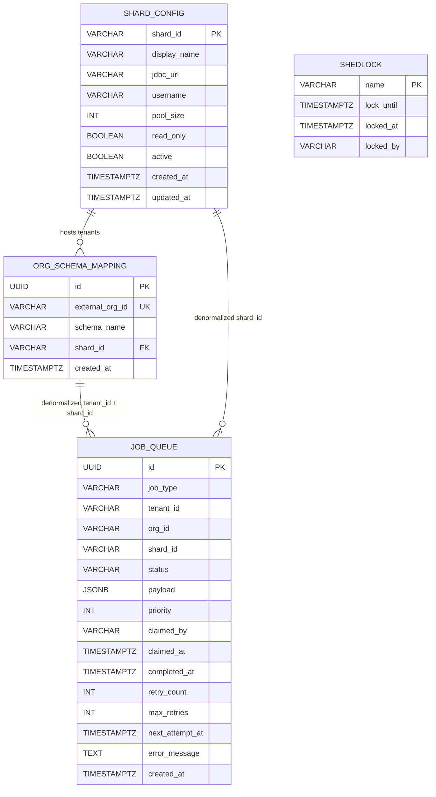
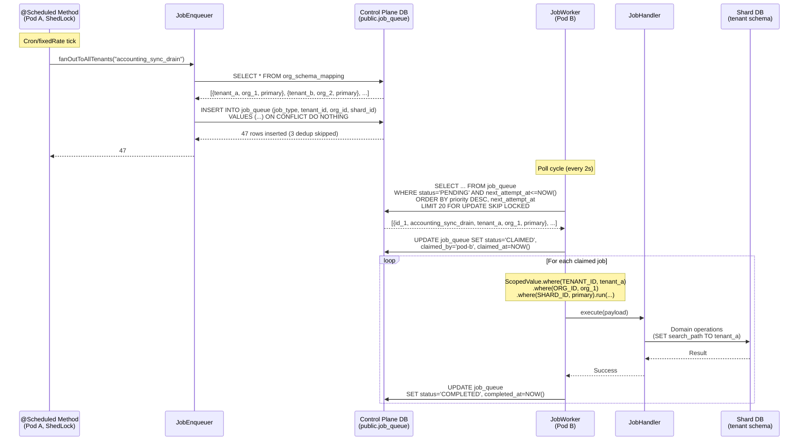
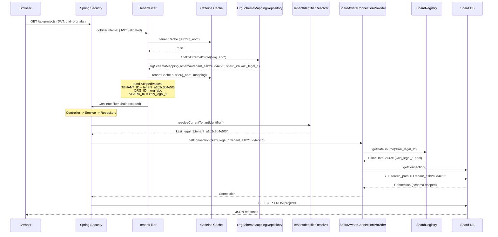
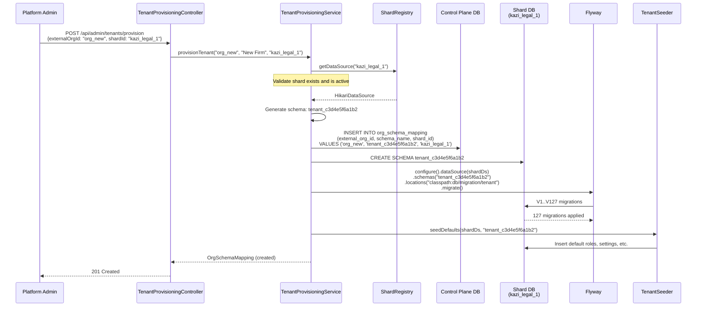

# Phase 75 -- Scalability: Job Queue Fanout + Shard-Aware DB Resolver

> **Canonical location**: this standalone `architecture/phase75-*.md` file. Per the convention established in `phase68-portal-redesign-vertical-parity.md`, `ARCHITECTURE.md` stops at Section 10 (Phase 4) and gets a one-paragraph stub pointer per phase doc. Local section numbers below (`75.x`) are an organising device internal to this phase doc.

> **Extends**: Tier A Scalability (commit `fbd163823`) shipped HikariCP pool sizing (25 max), Prometheus metrics endpoint, bounded AI executor (semaphore-capped at 20), and ShedLock leader election on all 19 `@Scheduled` methods. Phase 75 builds directly on ShedLock and the multitenancy infrastructure (Phase 1/13) to replace sequential tenant iteration with distributed job execution and replace the single-DataSource connection provider with shard-aware routing.

> **ADRs**: [ADR-293](#adr-293-job-queue-table-over-in-process-parallelism), [ADR-294](#adr-294-scheduler-as-enqueuer-pattern), [ADR-295](#adr-295-control-plane--shard-plane-database-split), [ADR-296](#adr-296-composite-tenant-identifier-format), [ADR-297](#adr-297-explicit-shard-assignment-over-automatic-placement)

> **Migrations**: Global **V24** -- `job_queue` table + `stale_job_recovery` ShedLock entry. Global **V25** -- `shard_config` table + `ALTER org_schema_mapping ADD shard_id`. No tenant migrations in this phase.

---

## 75.1 Overview

Phase 75 addresses the two most significant scalability ceilings in the Kazi monolith: sequential tenant iteration in scheduled jobs and the hardcoded single-database assumption in the multitenancy connection provider.

Today, all 19 `@Scheduled` methods use `TenantScopedRunner.forEachTenant()` to iterate tenants one-by-one in a `for` loop. ShedLock prevents concurrent execution across replicas but does not solve throughput -- only one pod processes each job, sequentially. At 1,000 tenants, a scheduler that makes external calls (LLM, Xero sync, email) takes 30+ minutes to complete a single sweep. Meanwhile, `SchemaMultiTenantConnectionProvider` injects a single `DataSource`. All tenant schemas must reside on the same PostgreSQL instance, creating a ceiling of approximately 2,000--5,000 tenants before connection count, shared buffer contention, and vacuum overhead become problems.

Phase 75 replaces the sequential scheduler-then-tenant-loop pattern with a **job queue table** (`public.job_queue`) that distributes work across all replicas using `SELECT ... FOR UPDATE SKIP LOCKED`. Schedulers become enqueuers -- their cron/fixedRate triggers fan out one job per tenant into the queue, and workers on every pod claim and execute jobs concurrently. In parallel, the phase replaces the single-DataSource connection provider with a **shard-aware DB resolver** (`ShardAwareConnectionProvider` + `ShardRegistry`) that routes tenants to the correct PostgreSQL instance based on a composite `{shardId}:{schemaName}` tenant identifier. Both changes are zero-behavioral-change under the current single-shard, single-database deployment: the job queue runs with the same business logic, and shard routing resolves to the primary DataSource until a second shard is configured.

### What's New

| Existing Capability | Phase 75 Adds |
|---|---|
| `TenantScopedRunner.forEachTenant()` iterates tenants sequentially in a `for` loop | Job queue with `FOR UPDATE SKIP LOCKED` distributes tenant-level work items across all pods concurrently |
| ShedLock prevents concurrent execution -- but only one pod runs each job | Workers on every pod claim jobs independently; ShedLock protects only the enqueue wave |
| No execution history for scheduled jobs -- only log files | `public.job_queue` table with status, timing, retry count, error messages; admin API for inspection |
| `SchemaMultiTenantConnectionProvider` injects one `DataSource` | `ShardAwareConnectionProvider` resolves `DataSource` per shard via `ShardRegistry` |
| `TenantIdentifierResolver` returns schema name only (`tenant_xxxxxxxxxxxx`) | Returns composite `{shardId}:{schemaName}` (e.g., `primary:tenant_a1b2c3d4e5f6`) |
| `OrgSchemaMapping` maps orgId to schema name | Extended with `shard_id` column; new `ShardConfig` entity for shard metadata |
| Flyway runs tenant migrations on a single DataSource | Shard-aware Flyway iterates all shards, discovers tenant schemas per shard, runs migrations |
| Tenant provisioning creates schema on the single database | Accepts `shardId` parameter; creates schema on the target shard's DataSource |
| No multi-pod work distribution mechanism | Job queue + SKIP LOCKED enables N pods to process N jobs concurrently |
| `RequestScopes` has 9 ScopedValues | New `SHARD_ID` ScopedValue (10th) bound by `TenantFilter` and `JobWorker` |

### Predecessor Reference

- **Tier A Scalability** (commit `fbd163823`): pool sizing, Prometheus metrics, bounded AI executor, ShedLock. The foundation this phase builds on.
- **Multitenancy infrastructure** (Phase 1/13): `SchemaMultiTenantConnectionProvider`, `TenantIdentifierResolver`, `OrgSchemaMapping`, `TenantScopedRunner`, `RequestScopes`. The classes this phase extends.
- **Scalability assessment** (`requirements/kazi-scalability-req.md`): Tier B/C roadmap. Phase 75 replaces the originally proposed B3 (StructuredTaskScope parallelism) with a more capable job queue approach ([ADR-293](#adr-293-job-queue-table-over-in-process-parallelism)).

---

## 75.2 Domain Model -- Job Queue

### 75.2.1 `JobQueue` Entity

`public.job_queue` is a **global** (public schema) entity. It does NOT use the standard `@FilterDef` / `@Filter` / `TenantAware` / `TenantAwareEntityListener` pattern because it is not tenant-scoped -- it lives in the `public` schema alongside `org_schema_mapping` and `shedlock`. The entity is annotated with `@Table(name = "job_queue", schema = "public")` to pin it to the control plane.

| Field | Type | Constraints | Notes |
|---|---|---|---|
| `id` | `UUID` | PK, `gen_random_uuid()` | Immutable after creation |
| `jobType` | `VARCHAR(100)` | NOT NULL | Machine-readable identifier: `accounting_sync_drain`, `automation_poll_triggers`, etc. |
| `tenantId` | `VARCHAR(50)` | NOT NULL | Schema name (e.g., `tenant_a1b2c3d4e5f6`). Used for `ScopedValue` binding on execution. |
| `orgId` | `VARCHAR(100)` | NOT NULL | External org ID (e.g., Keycloak org ID). Denormalized from `org_schema_mapping`. |
| `shardId` | `VARCHAR(50)` | NOT NULL, DEFAULT `'primary'` | Denormalized from `org_schema_mapping` for worker efficiency. Workers claim jobs without joining the mapping table. |
| `status` | `VARCHAR(20)` | NOT NULL, DEFAULT `'PENDING'` | Enum: `PENDING`, `CLAIMED`, `COMPLETED`, `FAILED`, `DEAD_LETTER`. CHECK constraint enforced. |
| `payload` | `JSONB` | NULLABLE | Job-type-specific data. NULL for most fan-out jobs (all context is in the tenant scope). |
| `priority` | `INT` | NOT NULL, DEFAULT `0` | Higher = sooner. `0` = normal priority. Allows urgent jobs (e.g., real-time sync trigger) to jump the queue. |
| `claimedBy` | `VARCHAR(100)` | NULLABLE | Pod identifier (hostname). Set on claim, cleared on retry. |
| `claimedAt` | `TIMESTAMPTZ` | NULLABLE | When the pod claimed this job. Used for stale detection. |
| `completedAt` | `TIMESTAMPTZ` | NULLABLE | When the job reached terminal state (COMPLETED or DEAD_LETTER). |
| `retryCount` | `INT` | NOT NULL, DEFAULT `0` | Incremented on each failure. When `retryCount >= maxRetries`, job moves to DEAD_LETTER. |
| `maxRetries` | `INT` | NOT NULL, DEFAULT `3` | Per-job override. Most jobs use the system default (3). |
| `nextAttemptAt` | `TIMESTAMPTZ` | NOT NULL, DEFAULT `NOW()` | Enables exponential backoff: `NOW() + (2^retryCount * baseDelay)`. |
| `errorMessage` | `TEXT` | NULLABLE | Last exception message. Truncated to 2000 chars. |
| `createdAt` | `TIMESTAMPTZ` | NOT NULL, DEFAULT `NOW()` | Immutable. |

**Why denormalize `shard_id`?** Workers process jobs at high throughput (batch of 20 per poll cycle). Joining `org_schema_mapping` on every claim would add latency and lock contention on the mapping table. Since shard assignment changes extremely rarely (admin action), the denormalized value is safe.

**Why SKIP LOCKED over a message broker?** The job queue table on the control plane database is sufficient for the monolith deployment model. `SELECT ... FOR UPDATE SKIP LOCKED` is a built-in PostgreSQL primitive that requires no additional infrastructure, has transactional semantics (a crashed worker's claimed jobs are automatically released when the transaction rolls back), and integrates natively with the existing ShedLock and Flyway toolchain. A message broker (RabbitMQ, SNS/SQS) is a Tier C prerequisite for microservice extraction, not a Phase 75 concern. See [ADR-293](#adr-293-job-queue-table-over-in-process-parallelism).

**Why the dedup index?** The `idx_job_queue_dedup` unique partial index on `(job_type, tenant_id) WHERE status IN ('PENDING', 'CLAIMED')` prevents double-enqueue. The enqueuer first queries existing active jobs to filter the insert batch, and the unique index acts as a safety net against race conditions — if two concurrent enqueue waves overlap, the second INSERT fails with a unique violation (caught and treated as no-op). Without this, schedulers would pile up unbounded duplicate work items.

### 75.2.2 `JobStatus` Enum

```java
public enum JobStatus {
    PENDING,       // Enqueued, awaiting claim
    CLAIMED,       // Claimed by a worker pod, execution in progress
    COMPLETED,     // Execution succeeded
    FAILED,        // Execution failed, will retry (retryCount < maxRetries)
    DEAD_LETTER    // Exhausted retries, requires manual intervention
}
```

State transitions:

```
PENDING --> CLAIMED --> COMPLETED
                   \--> FAILED --> PENDING (retry with backoff)
                   \--> DEAD_LETTER (retries exhausted)
```

Stale recovery: `CLAIMED` (stuck > staleClaimTimeout) --> `PENDING` (via `StaleJobRecoveryTask`).

Admin retry: `DEAD_LETTER` --> `PENDING` (via admin API, resets retryCount).

---

## 75.3 Domain Model -- Shard Infrastructure

### 75.3.1 `ShardConfig` Entity

`public.shard_config` is a **global** (public schema) entity. Like `JobQueue`, it does NOT use the tenant-aware pattern.

| Field | Type | Constraints | Notes |
|---|---|---|---|
| `shardId` | `VARCHAR(50)` | PK | Meaningful name: `primary`, `demo`, `kazi_legal_1`, `kazi_accounting_1`. Validation: `^[a-z][a-z0-9_]{0,48}[a-z0-9]$`. |
| `displayName` | `VARCHAR(100)` | NOT NULL | Human-readable label for admin UI: "Primary Database", "Legal Shard 1". |
| `jdbcUrl` | `VARCHAR(500)` | NULLABLE | Metadata only for the `primary` shard (uses default DataSource). Populated for secondary shards. Actual credentials come from env vars, not the database. |
| `username` | `VARCHAR(100)` | NULLABLE | Metadata only. Actual credentials from `KAZI_SHARD_{ID}_USERNAME` env var. |
| `poolSize` | `INT` | NOT NULL, DEFAULT `25` | HikariCP maximum pool size for this shard's DataSource. |
| `readOnly` | `BOOLEAN` | NOT NULL, DEFAULT `FALSE` | Future-proofing for read replicas. Not used in Phase 75. |
| `active` | `BOOLEAN` | NOT NULL, DEFAULT `TRUE` | Inactive shards are excluded from `ShardRegistry`. Shards with missing env var credentials are logged as warnings and marked inactive at startup. |
| `createdAt` | `TIMESTAMPTZ` | NOT NULL, DEFAULT `NOW()` | Immutable. |
| `updatedAt` | `TIMESTAMPTZ` | NOT NULL, DEFAULT `NOW()` | |

**Credentials are NOT stored in the database.** The `jdbc_url` and `username` columns are metadata for admin visibility. Actual connection parameters come from environment variables keyed by shard ID:

- `KAZI_SHARD_PRIMARY_URL` (falls back to `spring.datasource.url`)
- `KAZI_SHARD_PRIMARY_USERNAME` (falls back to `spring.datasource.username`)
- `KAZI_SHARD_PRIMARY_PASSWORD` (falls back to `spring.datasource.password`)
- `KAZI_SHARD_KAZI_LEGAL_1_URL`
- `KAZI_SHARD_KAZI_LEGAL_1_USERNAME`
- `KAZI_SHARD_KAZI_LEGAL_1_PASSWORD`

For the `primary` shard, the existing Spring Boot default `DataSource` is reused directly -- no additional configuration is needed for single-shard deployments.

### 75.3.2 `OrgSchemaMapping` Extension

The existing `OrgSchemaMapping` entity gains a `shard_id` column:

```java
@Column(name = "shard_id", nullable = false)
private String shardId = "primary";
```

The V25 migration adds this column with `DEFAULT 'primary'`, so all existing mappings are automatically assigned to the primary shard. No data migration is required.

### 75.3.3 Composite Tenant Identifier Format

The tenant identifier format changes from a simple schema name to a composite string:

```
{shardId}:{schemaName}
```

Examples:
- `primary:tenant_a1b2c3d4e5f6` -- tenant on the primary shard
- `kazi_legal_1:tenant_b2c3d4e5f6a1` -- tenant on a legal shard
- `primary:public` -- control plane (default when no tenant scope is bound)

The colon delimiter is safe because neither shard IDs (`^[a-z][a-z0-9_]{0,48}[a-z0-9]$`) nor schema names (`^tenant_[0-9a-f]{12}$` or `public`) contain colons. See [ADR-296](#adr-296-composite-tenant-identifier-format).

### 75.3.4 Entity Relationship Diagram



All four tables live in the `public` schema on the **control plane** database. `org_schema_mapping.shard_id` is an FK to `shard_config.shard_id`. `job_queue.shard_id` and `job_queue.tenant_id` are denormalized from `org_schema_mapping` for worker efficiency -- no FK constraints on the job queue to avoid lock contention during high-throughput enqueue/claim cycles.

---

## 75.4 Job Queue -- Core Flows

### 75.4.1 Enqueue Flow

Scheduler ticks (via `@Scheduled` with ShedLock protection) and calls `JobEnqueuer.fanOutToAllTenants()`. The enqueuer reads all active tenant mappings and batch-inserts one job per tenant into `job_queue`. Dedup is enforced by checking for existing PENDING/CLAIMED rows before insert (the unique partial index `idx_job_queue_dedup` acts as a safety net, but PostgreSQL's `ON CONFLICT` cannot reference a partial index with an `IN` predicate — so the enqueuer uses an explicit existence check).

**SQL -- Batch enqueue with dedup:**

```sql
-- Step 1: Collect tenant IDs that already have active jobs for this type
-- (single query, returns set of tenant_ids to skip)
SELECT tenant_id FROM public.job_queue
WHERE job_type = :jobType AND status IN ('PENDING', 'CLAIMED');

-- Step 2: Batch insert only tenants NOT in the skip set
INSERT INTO public.job_queue (id, job_type, tenant_id, org_id, shard_id, status, priority, next_attempt_at, created_at)
VALUES
    (gen_random_uuid(), :jobType, :tenantId1, :orgId1, :shardId1, 'PENDING', :priority, NOW(), NOW()),
    (gen_random_uuid(), :jobType, :tenantId2, :orgId2, :shardId2, 'PENDING', :priority, NOW(), NOW()),
    ...;
-- The unique partial index idx_job_queue_dedup guards against race conditions:
-- if two enqueue waves run concurrently, the second INSERT will fail with a unique
-- violation for any tenant that the first wave already enqueued. The enqueuer catches
-- DataIntegrityViolationException per-row and treats it as a no-op.
```

**Java signatures:**

```java
public interface JobEnqueuer {
    /** Enqueue a single job. No-op if a PENDING/CLAIMED job exists for (jobType, tenantId). */
    void enqueue(String jobType, String tenantId, String orgId, String shardId,
                 @Nullable JsonNode payload);

    /** Fan out one job per active tenant. Returns count of jobs actually enqueued (excludes dedup skips). */
    int fanOutToAllTenants(String jobType, @Nullable JsonNode payload);

    /** Fan out with explicit priority. Higher = sooner. */
    int fanOutToAllTenants(String jobType, @Nullable JsonNode payload, int priority);
}
```

- `fanOutToAllTenants()` reads `OrgSchemaMappingRepository.findAll()` to get all active tenant mappings including `shard_id`.
- Batch INSERT uses JDBC `PreparedStatement.addBatch()` for efficiency (not individual INSERTs).
- Runs in its own `@Transactional` scope. The enqueue wave is atomic -- either all jobs are inserted or none.
- Returns the count of rows actually inserted (Postgres returns affected row count for `ON CONFLICT DO NOTHING`).

### 75.4.2 Claim Flow

Workers run a poll loop on every pod. They are NOT ShedLock-protected -- the entire point is that multiple pods claim work concurrently.

**SQL -- Claim query (SELECT FOR UPDATE SKIP LOCKED):**

```sql
SELECT id, job_type, tenant_id, org_id, shard_id, payload, priority, retry_count, max_retries
FROM public.job_queue
WHERE status = 'PENDING'
  AND next_attempt_at <= NOW()
ORDER BY priority DESC, next_attempt_at ASC
LIMIT :batchSize
FOR UPDATE SKIP LOCKED;
```

**SQL -- Mark claimed:**

```sql
UPDATE public.job_queue
SET status = 'CLAIMED', claimed_by = :podId, claimed_at = NOW()
WHERE id IN (:claimedIds);
```

The `FOR UPDATE SKIP LOCKED` clause is the key primitive: rows locked by another worker's transaction are silently skipped rather than blocking. This enables true concurrent processing without contention. Each worker's claim + mark-claimed happens in a single short transaction, after which the worker processes jobs outside the transaction boundary (each job execution gets its own transaction via the handler).

**Java signatures:**

```java
public interface JobHandler {
    /** The job type this handler processes. Must be unique across all handlers. */
    String jobType();

    /** Execute the job. Tenant scope (TENANT_ID, ORG_ID, SHARD_ID) is already bound via ScopedValue. */
    void execute(@Nullable JsonNode payload);
}

@Component
public class JobHandlerRegistry {
    /** Maps jobType -> JobHandler at startup. Fails fast on duplicate registrations. */
    public JobHandler getHandler(String jobType);
    public Set<String> getRegisteredTypes();
}

@Component
public class JobWorker {
    /** Starts the poll loop. Called on application startup if kazi.job-queue.enabled=true. */
    public void start();
    /** Graceful shutdown: stop polling, wait for in-flight jobs, release uncompleted claims. */
    public void stop();
}
```

### 75.4.3 Retry Flow

When a `JobHandler.execute()` throws an exception:

1. Increment `retry_count`.
2. If `retry_count >= max_retries`: set `status = 'DEAD_LETTER'`, `error_message = exception.getMessage()` (truncated to 2000 chars), `completed_at = NOW()`.
3. Otherwise: set `status = 'PENDING'`, `next_attempt_at = NOW() + (2^retry_count * backoff_base_seconds)`, clear `claimed_by` and `claimed_at`.

**SQL -- Retry with exponential backoff:**

```sql
UPDATE public.job_queue
SET status = 'PENDING',
    retry_count = retry_count + 1,
    next_attempt_at = NOW() + (POWER(2, retry_count + 1) * INTERVAL '1 second' * :backoffBaseSeconds),
    claimed_by = NULL,
    claimed_at = NULL,
    error_message = :errorMessage
WHERE id = :jobId;
```

**SQL -- Dead letter:**

```sql
UPDATE public.job_queue
SET status = 'DEAD_LETTER',
    retry_count = retry_count + 1,
    completed_at = NOW(),
    error_message = :errorMessage
WHERE id = :jobId;
```

Backoff schedule (with default `backoff-base-seconds: 10`):
- Retry 1: 20 seconds
- Retry 2: 40 seconds
- Retry 3: 80 seconds (then dead letter if `max_retries = 3`)

### 75.4.4 Stale Recovery Flow

A ShedLock-protected `@Scheduled(fixedDelay = 60_000)` task (`StaleJobRecoveryTask`) sweeps for jobs stuck in `CLAIMED` status beyond `stale-claim-timeout-minutes` (default 15). This handles pod crashes mid-execution -- the crashed pod's transaction never committed, but the row is still marked CLAIMED in the database.

**SQL -- Stale recovery:**

```sql
UPDATE public.job_queue
SET status = 'PENDING',
    claimed_by = NULL,
    claimed_at = NULL,
    next_attempt_at = NOW()
WHERE status = 'CLAIMED'
  AND claimed_at < NOW() - INTERVAL '1 minute' * :staleMinutes
RETURNING id, job_type, tenant_id;
```

The `RETURNING` clause enables logging of recovered jobs for observability. Stale recovery does NOT increment `retry_count` because the job was never actually executed (it was claimed but the pod died before completion).

---

## 75.5 Shard-Aware Connection Routing -- Core Flows

### 75.5.1 HTTP Request Path

```
Browser HTTP request
  --> Spring Security (JWT validation)
  --> TenantFilter
       |-- Extract orgId from JWT
       |-- Lookup OrgSchemaMapping (includes shard_id)
       |-- Bind ScopedValue.where(TENANT_ID, schemaName)
       |         .where(ORG_ID, orgId)
       |         .where(SHARD_ID, shardId)
       |-- Continue filter chain
  --> Controller --> Service --> Repository
       |-- Hibernate calls TenantIdentifierResolver.resolveCurrentTenantIdentifier()
       |-- Returns "{shardId}:{schemaName}" (e.g., "primary:tenant_a1b2c3d4e5f6")
  --> ShardAwareConnectionProvider.getConnection("{shardId}:{schemaName}")
       |-- Parse composite identifier
       |-- shardRegistry.getDataSource(shardId)
       |-- connection = dataSource.getConnection()
       |-- SET search_path TO {schemaName}
       |-- Return connection
```

**Backward compatibility:** When `kazi.sharding.enabled: false`, `TenantFilter` does not bind `SHARD_ID`, `TenantIdentifierResolver` returns schema name only (no shard prefix), and the legacy `SchemaMultiTenantConnectionProvider` is used. This is a zero-change deployment for existing environments.

### 75.5.2 Scheduled Job Path (via Job Queue)

```
@Scheduled method ticks
  --> ShedLock: only one pod runs the enqueue wave
  --> jobEnqueuer.fanOutToAllTenants(jobType)
       |-- Read all OrgSchemaMappings (includes shard_id)
       |-- Batch INSERT INTO job_queue with ON CONFLICT DO NOTHING
  --> Return (enqueue complete)

JobWorker poll loop (every pod, every 2s)
  --> SELECT ... FOR UPDATE SKIP LOCKED (claim batch)
  --> For each claimed job:
       |-- ScopedValue.where(TENANT_ID, job.tenantId)
       |         .where(ORG_ID, job.orgId)
       |         .where(SHARD_ID, job.shardId)
       |         .run(() -> handler.execute(job.payload))
       |-- Hibernate resolves "{shardId}:{tenantId}" --> correct DataSource + search_path
       |-- On success: mark COMPLETED
       |-- On failure: retry or dead-letter
```

### 75.5.3 Provisioning Path

```
POST /api/admin/tenants/provision { externalOrgId, shardId }
  --> TenantProvisioningService.provisionTenant(orgId, orgName, shardId)
       |-- Validate shardId exists and is active via ShardRegistry
       |-- Generate schema name: tenant_{12-hex-chars}
       |-- INSERT INTO org_schema_mapping (external_org_id, schema_name, shard_id)
       |-- Get DataSource for shardId: shardRegistry.getDataSource(shardId)
       |-- CREATE SCHEMA {schemaName} on shard DataSource
       |-- Run Flyway migrations on {schemaName} using shard DataSource
       |-- Seed default data on shard DataSource
       |-- Return mapping
```

If `shardId` is omitted, it defaults to `primary`. This preserves backward compatibility with existing provisioning flows (Keycloak webhook-driven).

### 75.5.4 Flyway Migration Path

At startup, `TenantMigrationRunner` must be shard-aware:

```
Application startup
  --> FlywayConfig: run global migrations on primary DataSource (unchanged)
  --> TenantMigrationRunner (@Order(50)):
       |-- Read all active shards from ShardRegistry
       |-- For each shard:
       |    |-- Get DataSource
       |    |-- Discover tenant schemas on this shard (from org_schema_mapping WHERE shard_id = ?)
       |    |-- For each schema:
       |    |    |-- Run Flyway.configure().dataSource(shardDs).schemas(schemaName).migrate()
       |    |-- Log per-shard migration summary
       |-- Log overall migration summary
```

Migration SQL files are identical across all shards -- the schema structure is the same everywhere. Only the DataSource differs.

**Backward compatibility:** When `kazi.sharding.enabled: false`, `TenantMigrationRunner` uses the single `migrationDataSource` for all schemas (unchanged behavior).

---

## 75.6 Sequence Diagrams

### 75.6.1 Job Enqueue + Claim + Execute Cycle



### 75.6.2 Shard-Aware HTTP Request Flow



### 75.6.3 Tenant Provisioning on a Non-Primary Shard



---

## 75.7 API Surface

All endpoints are platform-admin only, secured by `PlatformAdminFilter` (requires JWT with `platform-admins` group).

### 75.7.1 Job Queue Admin API

**List jobs:**

```
GET /api/admin/jobs?status=DEAD_LETTER&jobType=accounting_sync_drain&limit=50
```

Response:
```json
{
  "content": [
    {
      "id": "550e8400-e29b-41d4-a716-446655440000",
      "jobType": "accounting_sync_drain",
      "tenantId": "tenant_a1b2c3d4e5f6",
      "orgId": "org_abc123",
      "shardId": "primary",
      "status": "DEAD_LETTER",
      "priority": 0,
      "claimedBy": "pod-a-7f9bc4",
      "claimedAt": "2026-05-27T10:15:00Z",
      "completedAt": "2026-05-27T10:15:30Z",
      "retryCount": 3,
      "maxRetries": 3,
      "nextAttemptAt": "2026-05-27T10:15:00Z",
      "errorMessage": "XeroApiException: Rate limit exceeded (429)",
      "createdAt": "2026-05-27T10:00:00Z"
    }
  ],
  "page": {
    "totalElements": 12,
    "totalPages": 1,
    "size": 50,
    "number": 0
  }
}
```

**Retry a dead-lettered job:**

```
POST /api/admin/jobs/{id}/retry
```

Response:
```json
{
  "id": "550e8400-e29b-41d4-a716-446655440000",
  "status": "PENDING",
  "retryCount": 0,
  "nextAttemptAt": "2026-05-27T12:00:00Z"
}
```

Resets `status` to `PENDING`, `retryCount` to `0`, `claimed_by` and `claimed_at` to NULL, `next_attempt_at` to NOW(). Only allowed for `DEAD_LETTER` jobs.

**Delete a dead-lettered job:**

```
DELETE /api/admin/jobs/{id}
```

Response: `204 No Content`

Hard delete. Only allowed for `DEAD_LETTER` jobs.

**Job queue statistics:**

```
GET /api/admin/jobs/stats
```

Response:
```json
{
  "byStatus": {
    "PENDING": 142,
    "CLAIMED": 20,
    "COMPLETED": 15847,
    "FAILED": 3,
    "DEAD_LETTER": 12
  },
  "byJobType": {
    "accounting_sync_drain": { "PENDING": 50, "CLAIMED": 10, "COMPLETED": 4800, "DEAD_LETTER": 5 },
    "automation_poll_triggers": { "PENDING": 50, "CLAIMED": 10, "COMPLETED": 8000, "DEAD_LETTER": 2 }
  },
  "oldestPending": "2026-05-27T09:58:00Z",
  "oldestClaimed": "2026-05-27T10:14:30Z"
}
```

### 75.7.2 Tenant Provisioning API Extension

The existing provisioning endpoint gains an optional `shardId` parameter:

```
POST /api/admin/tenants/provision
```

Request:
```json
{
  "externalOrgId": "org_abc123",
  "organizationName": "New Law Firm",
  "shardId": "kazi_legal_1"
}
```

- `shardId` is optional. If omitted or `null`, defaults to `"primary"`.
- If `shardId` references an inactive or non-existent shard, returns `400 Bad Request` with a ProblemDetail explaining the validation failure.

Response (unchanged): `201 Created` with the `OrgSchemaMapping` representation.

---

## 75.8 Database Migrations

### 75.8.1 V24 -- Job Queue Table (Global)

File: `backend/src/main/resources/db/migration/global/V24__create_job_queue.sql`

```sql
-- V24: Job queue table for distributed scheduled work execution
-- Phase 75 -- Scalability: Job Queue Fanout

CREATE TABLE IF NOT EXISTS public.job_queue (
    id              UUID PRIMARY KEY DEFAULT gen_random_uuid(),
    job_type        VARCHAR(100)  NOT NULL,
    tenant_id       VARCHAR(50)   NOT NULL,
    org_id          VARCHAR(100)  NOT NULL,
    shard_id        VARCHAR(50)   NOT NULL DEFAULT 'primary',
    status          VARCHAR(20)   NOT NULL DEFAULT 'PENDING',
    payload         JSONB,
    priority        INT           NOT NULL DEFAULT 0,
    claimed_by      VARCHAR(100),
    claimed_at      TIMESTAMPTZ,
    completed_at    TIMESTAMPTZ,
    retry_count     INT           NOT NULL DEFAULT 0,
    max_retries     INT           NOT NULL DEFAULT 3,
    next_attempt_at TIMESTAMPTZ   NOT NULL DEFAULT NOW(),
    error_message   TEXT,
    created_at      TIMESTAMPTZ   NOT NULL DEFAULT NOW(),

    CONSTRAINT chk_job_status CHECK (
        status IN ('PENDING', 'CLAIMED', 'COMPLETED', 'FAILED', 'DEAD_LETTER')
    )
);

-- Claimable jobs: partial index for the worker poll query.
-- Covers: WHERE status = 'PENDING' ORDER BY priority DESC, next_attempt_at ASC.
-- The next_attempt_at <= NOW() filter is applied at query time, not in the index predicate,
-- because PostgreSQL evaluates partial index predicates once at DDL time — NOW() would
-- become a static timestamp and exclude all future rows.
-- This is the hot-path index — workers hit it every 2 seconds per pod.
CREATE INDEX IF NOT EXISTS idx_job_queue_claimable
    ON public.job_queue (priority DESC, next_attempt_at ASC)
    WHERE status = 'PENDING';

-- Dedup index: prevents double-enqueue for the same (job_type, tenant_id)
-- while a PENDING or CLAIMED job exists. The enqueuer uses
-- INSERT ... ON CONFLICT DO NOTHING on this index.
CREATE UNIQUE INDEX IF NOT EXISTS idx_job_queue_dedup
    ON public.job_queue (job_type, tenant_id)
    WHERE status IN ('PENDING', 'CLAIMED');

-- Status + type + time: supports the admin API queries
-- (list by status, filter by job_type, order by created_at).
CREATE INDEX IF NOT EXISTS idx_job_queue_status_type
    ON public.job_queue (job_type, status, created_at);

-- Stale claim detection: supports the StaleJobRecoveryTask query
-- (WHERE status = 'CLAIMED' AND claimed_at < threshold).
CREATE INDEX IF NOT EXISTS idx_job_queue_stale_claims
    ON public.job_queue (claimed_at)
    WHERE status = 'CLAIMED';

-- Register the stale job recovery task in ShedLock
-- (pre-seed so the first execution doesn't require manual setup)
INSERT INTO public.shedlock (name, lock_until, locked_at, locked_by)
VALUES ('stale_job_recovery', NOW(), NOW(), 'migration')
ON CONFLICT (name) DO NOTHING;

COMMENT ON TABLE public.job_queue IS
    'Distributed job queue for scheduled tenant-level work. Workers claim jobs via SELECT FOR UPDATE SKIP LOCKED.';
```

**Index rationale:**

| Index | Purpose | Why partial/composite |
|---|---|---|
| `idx_job_queue_claimable` | Worker poll query (hot path, every 2s per pod) | Partial on `status = 'PENDING'` excludes the vast majority of rows (completed jobs). The `next_attempt_at <= NOW()` filter is applied at query time, not in the index predicate (PostgreSQL evaluates partial index predicates once at DDL time). Composite `(priority DESC, next_attempt_at ASC)` matches the ORDER BY clause exactly. |
| `idx_job_queue_dedup` | Prevent double-enqueue | Unique partial on `status IN ('PENDING', 'CLAIMED')` allows multiple COMPLETED rows for the same (type, tenant) while preventing duplicates in active states. |
| `idx_job_queue_status_type` | Admin API queries | Composite `(job_type, status, created_at)` supports the common filter pattern: "show me all DEAD_LETTER jobs for accounting_sync_drain, newest first." |
| `idx_job_queue_stale_claims` | Stale recovery sweep | Partial on `status = 'CLAIMED'` limits the scan to in-progress jobs. Indexed by `claimed_at` for range queries. |

### 75.8.2 V25 -- Shard Config + OrgSchemaMapping Extension (Global)

File: `backend/src/main/resources/db/migration/global/V25__create_shard_config.sql`

```sql
-- V25: Shard configuration table and org_schema_mapping extension
-- Phase 75 -- Scalability: Shard-Aware DB Resolver

CREATE TABLE IF NOT EXISTS public.shard_config (
    shard_id     VARCHAR(50)  PRIMARY KEY,
    display_name VARCHAR(100) NOT NULL,
    jdbc_url     VARCHAR(500),
    username     VARCHAR(100),
    pool_size    INT          NOT NULL DEFAULT 25,
    read_only    BOOLEAN      NOT NULL DEFAULT FALSE,
    active       BOOLEAN      NOT NULL DEFAULT TRUE,
    created_at   TIMESTAMPTZ  NOT NULL DEFAULT NOW(),
    updated_at   TIMESTAMPTZ  NOT NULL DEFAULT NOW()
);

COMMENT ON TABLE public.shard_config IS
    'Shard metadata. Credentials come from env vars (KAZI_SHARD_{ID}_*), not this table.';

COMMENT ON COLUMN public.shard_config.jdbc_url IS
    'Metadata only for primary shard. Populated for secondary shards. Actual credentials from env vars.';

-- Seed the primary shard (always exists)
INSERT INTO public.shard_config (shard_id, display_name)
VALUES ('primary', 'Primary Database')
ON CONFLICT (shard_id) DO NOTHING;

-- Extend org_schema_mapping with shard assignment
ALTER TABLE public.org_schema_mapping
    ADD COLUMN IF NOT EXISTS shard_id VARCHAR(50) NOT NULL DEFAULT 'primary';

-- Foreign key from org_schema_mapping.shard_id to shard_config.shard_id
-- Using DO $$ block for idempotent constraint creation
DO $$
BEGIN
    IF NOT EXISTS (
        SELECT 1 FROM pg_constraint WHERE conname = 'fk_org_schema_mapping_shard'
    ) THEN
        ALTER TABLE public.org_schema_mapping
            ADD CONSTRAINT fk_org_schema_mapping_shard
            FOREIGN KEY (shard_id) REFERENCES public.shard_config (shard_id);
    END IF;
END $$;

-- Index for shard-aware tenant discovery (used by TenantMigrationRunner)
CREATE INDEX IF NOT EXISTS idx_org_schema_mapping_shard
    ON public.org_schema_mapping (shard_id);

COMMENT ON COLUMN public.org_schema_mapping.shard_id IS
    'Database shard hosting this tenant schema. Defaults to primary.';
```

---

## 75.9 Configuration Reference

### 75.9.1 Job Queue Configuration

```yaml
kazi:
  job-queue:
    enabled: true                       # false disables the worker poll loop and stale recovery
    batch-size: 20                      # max jobs claimed per poll cycle
    poll-interval-ms: 2000              # ms between poll cycles
    stale-claim-timeout-minutes: 15     # CLAIMED jobs older than this are reset to PENDING
    max-retries-default: 3              # default max retries per job (overridable per job type)
    backoff-base-seconds: 10            # exponential backoff base: 10s, 20s, 40s, 80s...
    dual-mode:                          # per-job-type transition flags
      accounting_sync_drain: false      # false = fully migrated to job queue
      automation_poll_triggers: true    # true = both old forEachTenant + new enqueue path active
```

**Test profile (`application-test.yml`):**

```yaml
kazi:
  job-queue:
    enabled: false                      # disabled by default in tests
    poll-interval-ms: 100              # fast polling for integration tests that enable it
```

### 75.9.2 Shard Configuration

```yaml
kazi:
  sharding:
    enabled: true                       # false = legacy single-DataSource mode (SchemaMultiTenantConnectionProvider)
    control-plane-datasource: primary   # always the primary shard for global tables

  shards:
    primary:
      # Uses spring.datasource.* -- no additional config needed for primary
    # Example additional shard (uncomment to activate):
    # kazi_legal_1:
    #   url: ${KAZI_SHARD_KAZI_LEGAL_1_URL}
    #   username: ${KAZI_SHARD_KAZI_LEGAL_1_USERNAME}
    #   password: ${KAZI_SHARD_KAZI_LEGAL_1_PASSWORD}
    #   pool-size: 25
```

**Test profile (`application-test.yml`):**

```yaml
kazi:
  sharding:
    enabled: false                      # tests run in legacy mode by default
```

Multi-shard integration tests use `@TestPropertySource(properties = "kazi.sharding.enabled=true")` and programmatically register a second embedded Postgres DataSource.

### 75.9.3 Environment Variable Naming Convention

Pattern: `KAZI_SHARD_{SHARD_ID_UPPER}_{PROPERTY}`

| Shard ID | URL Env Var | Username Env Var | Password Env Var |
|---|---|---|---|
| `primary` | `KAZI_SHARD_PRIMARY_URL` (fallback: `spring.datasource.url`) | `KAZI_SHARD_PRIMARY_USERNAME` | `KAZI_SHARD_PRIMARY_PASSWORD` |
| `kazi_legal_1` | `KAZI_SHARD_KAZI_LEGAL_1_URL` | `KAZI_SHARD_KAZI_LEGAL_1_USERNAME` | `KAZI_SHARD_KAZI_LEGAL_1_PASSWORD` |
| `demo` | `KAZI_SHARD_DEMO_URL` | `KAZI_SHARD_DEMO_USERNAME` | `KAZI_SHARD_DEMO_PASSWORD` |

The shard ID is uppercased and used as-is in the env var name. Underscores in the shard ID map directly to underscores in the env var name.

---

## 75.10 Implementation Guidance

### 75.10.1 Backend Changes Table

| File Path | What Changes | Why |
|---|---|---|
| **Shard Infrastructure** | | |
| `multitenancy/ShardConfig.java` | **New entity.** `@Entity @Table(schema = "public")`. Fields per 75.3.1. | Persistent shard metadata. |
| `multitenancy/ShardConfigRepository.java` | **New.** `JpaRepository<ShardConfig, String>`. `findByActiveTrue()`. | Query active shards. |
| `multitenancy/ShardRegistry.java` | **New interface + `DefaultShardRegistry` impl.** Manages named `HikariDataSource` instances. Reads `shard_config` at startup, creates DataSources from env vars. `primary` reuses Spring-managed DataSource. | Shard DataSource lifecycle management. |
| `multitenancy/ShardAndSchema.java` | **New record.** `record ShardAndSchema(String shardId, String schemaName)` with `parse(String composite)` and `format()` methods. | Parse/format the composite `{shardId}:{schemaName}` identifier. |
| **Connection Provider** | | |
| `multitenancy/ShardAwareConnectionProvider.java` | **New.** Replaces `SchemaMultiTenantConnectionProvider` when `kazi.sharding.enabled=true`. Implements `MultiTenantConnectionProvider<String>`. Parses composite identifier, resolves DataSource via `ShardRegistry`, sets `search_path`. | Route connections to correct shard. |
| `multitenancy/SchemaMultiTenantConnectionProvider.java` | **Unchanged** but conditionally active. Used when `kazi.sharding.enabled=false`. | Backward compatibility. |
| `multitenancy/HibernateMultiTenancyConfig.java` | Inject either `SchemaMultiTenantConnectionProvider` or `ShardAwareConnectionProvider` based on `kazi.sharding.enabled` property. **Exact conditional wiring:** `SchemaMultiTenantConnectionProvider` gets `@ConditionalOnProperty(name = "kazi.sharding.enabled", havingValue = "false", matchIfMissing = true)`. `ShardAwareConnectionProvider` gets `@ConditionalOnProperty(name = "kazi.sharding.enabled", havingValue = "true")`. `HibernateMultiTenancyConfig` injects `MultiTenantConnectionProvider<String>` (the shared interface) — Spring selects the active bean. Same pattern for `TenantIdentifierResolver` if its behavior diverges (it does — composite vs schema-only identifier). | Toggle between legacy and shard-aware mode. |
| **Tenant Identifier Resolver** | | |
| `multitenancy/TenantIdentifierResolver.java` | When sharding enabled: return `"{shardId}:{schemaName}"` by reading `SHARD_ID` ScopedValue. When sharding disabled: return schema name only (unchanged). | Composite identifier for Hibernate. |
| **Request Scopes** | | |
| `multitenancy/RequestScopes.java` | Add `SHARD_ID` ScopedValue. Add new `runForTenantOnShard(tenantId, orgId, shardId, action)` method that extends the existing `runForTenant()` pattern with shard binding. The internal carrier-building logic adds `SHARD_ID` to the `ScopedValue.Carrier` chain. | Carry shard context through the request. |
| **Tenant Filter** | | |
| `multitenancy/TenantFilter.java` | After resolving `OrgSchemaMapping`, bind `SHARD_ID` in addition to `TENANT_ID` and `ORG_ID`. **Cache change required:** the existing `tenantCache` is `Cache<String, String>` (orgId → schemaName). Replace with `Cache<String, TenantMapping>` where `TenantMapping` is a record: `record TenantMapping(String schemaName, String orgId, String shardId)`. On cache hit, bind all three ScopedValues from the cached record — otherwise `SHARD_ID` will never be bound for cached requests, silently routing all cached tenants to the `primary` shard. | HTTP entry point for shard binding. |
| **Tenant Scoped Runner** | | |
| `multitenancy/TenantScopedRunner.java` | `forEachTenant()` reads `shard_id` from each `OrgSchemaMapping` and binds `SHARD_ID` per iteration. | Scheduled jobs (non-migrated) and any remaining direct callers get shard awareness. |
| `multitenancy/OrgSchemaMapping.java` | Add `shard_id` field with getter/setter. Update constructor. | Store shard assignment per tenant. |
| `multitenancy/OrgSchemaMappingRepository.java` | Add `findByShardId(String shardId)` for shard-aware migration discovery. | TenantMigrationRunner needs to query by shard. |
| **Flyway / Provisioning** | | |
| `provisioning/TenantMigrationRunner.java` | When sharding enabled: iterate all active shards from `ShardRegistry`, get DataSource per shard, discover tenant schemas per shard, run Flyway per schema. When disabled: unchanged single-DataSource behavior. | Shard-aware tenant migration. |
| `config/FlywayConfig.java` | Unchanged -- global migrations always run on primary DataSource. | Global schema is always on control plane. |
| `provisioning/TenantProvisioningService.java` | Accept `shardId` parameter. Validate shard via `ShardRegistry`. Create schema on shard DataSource. Run Flyway on shard DataSource. Insert `OrgSchemaMapping` with `shard_id`. | Provision tenants on non-primary shards. |
| **Job Queue** | | |
| `infrastructure/jobqueue/JobQueue.java` | **New entity.** `@Entity @Table(name = "job_queue", schema = "public")`. Fields per 75.2.1. | Job queue row. |
| `infrastructure/jobqueue/JobStatus.java` | **New enum.** PENDING, CLAIMED, COMPLETED, FAILED, DEAD_LETTER. | Job lifecycle states. |
| `infrastructure/jobqueue/JobQueueRepository.java` | **New.** `JpaRepository<JobQueue, UUID>`. Custom `@Query` methods for claim, stale recovery, stats. | Data access for job queue. |
| `infrastructure/jobqueue/JobEnqueuer.java` | **New interface.** | Contract for enqueue operations. |
| `infrastructure/jobqueue/DefaultJobEnqueuer.java` | **New.** Implements `JobEnqueuer`. Reads `OrgSchemaMappingRepository.findAll()`, filters out tenants with existing PENDING/CLAIMED jobs for the given type, then JDBC batch inserts the remainder. The `idx_job_queue_dedup` unique partial index guards against race conditions — `DataIntegrityViolationException` is caught per-row and treated as a no-op. | Fan-out enqueue implementation. |
| `infrastructure/jobqueue/JobHandler.java` | **New interface.** `String jobType()` + `void execute(JsonNode payload)`. | Contract for job execution. |
| `infrastructure/jobqueue/JobHandlerRegistry.java` | **New.** Discovers all `JobHandler` beans at startup. Maps `jobType -> handler`. Fails fast on duplicates. | Handler dispatch. |
| `infrastructure/jobqueue/JobWorker.java` | **New.** Poll loop using virtual threads. Claims batch via `SELECT FOR UPDATE SKIP LOCKED`. Binds tenant ScopedValues. Dispatches to handler. Manages retry/dead-letter. Graceful shutdown. | Worker poll loop. |
| `infrastructure/jobqueue/JobQueueProperties.java` | **New.** `@ConfigurationProperties("kazi.job-queue")`. Fields: `boolean enabled`, `int batchSize`, `long pollIntervalMs`, `int staleClaimTimeoutMinutes`, `int maxRetriesDefault`, `int backoffBaseSeconds`, `Map<String, Boolean> dualMode` (keys are job_type strings, values are whether dual-mode is active — `true` = both old + new paths, `false`/absent = new path only). Spring Boot relaxed binding maps YAML underscored keys to the map. | Typed configuration binding. |
| `infrastructure/jobqueue/JobQueueConfig.java` | **New.** `@Configuration`. Registers `JobWorker` lifecycle bean. `@ConditionalOnProperty("kazi.job-queue.enabled")`. | Spring wiring. |
| `infrastructure/jobqueue/StaleJobRecoveryTask.java` | **New.** `@Scheduled(fixedDelay = 60_000)` with `@SchedulerLock(name = "stale_job_recovery")`. Resets CLAIMED jobs older than timeout. | Recover from pod crashes. |
| `infrastructure/jobqueue/JobQueueAdminController.java` | **New.** REST endpoints per 75.7.1. Platform-admin only. | Admin visibility and manual retry. |
| **Scheduler Migrations (Batch 1)** | | |
| `automation/AutomationScheduler.java` | `pollScheduledTriggers()` and `pollDelayedActions()`: replace `tenantScopedRunner.forEachTenant(...)` body with `jobEnqueuer.fanOutToAllTenants(jobType)`. Extract business logic to `AutomationPollTriggersHandler` and `AutomationPollDelayedHandler`. | Highest-frequency schedulers, migrate first. |
| `automation/AutomationPollTriggersHandler.java` | **New.** Implements `JobHandler`. Contains the per-tenant trigger polling logic extracted from `AutomationScheduler.pollScheduledTriggers()`. | Job handler for automation triggers. |
| `automation/AutomationPollDelayedHandler.java` | **New.** Implements `JobHandler`. Contains the per-tenant delayed action logic extracted from `AutomationScheduler.pollDelayedActions()`. | Job handler for delayed actions. |
| `integration/accounting/sync/AccountingSyncWorker.java` | `drainPendingEntries()`: replace body with `jobEnqueuer.fanOutToAllTenants("accounting_sync_drain")`. | 30s interval, Xero API calls. |
| `integration/accounting/sync/AccountingSyncDrainHandler.java` | **New.** Implements `JobHandler`. Per-tenant Xero sync logic. | Job handler for accounting sync. |
| `integration/accounting/sync/AccountingPaymentPollWorker.java` | `pollAllConnections()`: replace body with `jobEnqueuer.fanOutToAllTenants("accounting_payment_poll")`. | 15min interval, Xero API calls. |
| `integration/accounting/sync/AccountingPaymentPollHandler.java` | **New.** Implements `JobHandler`. Per-tenant payment polling. | Job handler for payment polling. |
| `schedule/TimeReminderScheduler.java` | `checkTimeReminders()`: replace body with `jobEnqueuer.fanOutToAllTenants("time_reminder_check")`. | 15min interval. |
| `schedule/TimeReminderHandler.java` | **New.** Implements `JobHandler`. Per-tenant time reminder check. | Job handler for time reminders. |
| **Scheduler Migrations (Batch 2)** | | |
| `schedule/RecurringScheduleExecutor.java` | Replace `forEachTenant` with enqueue. New `RecurringScheduleHandler`. | Daily 2:00 UTC. |
| `compliance/DormancyScheduledJob.java` | Replace `forEachTenant` with enqueue. New `DormancyCheckHandler`. | Daily 2:00 UTC. |
| `proposal/ProposalExpiryProcessor.java` | Replace `forEachTenant` with enqueue. New `ProposalExpiryHandler`. | Hourly. |
| `acceptance/AcceptanceExpiryProcessor.java` | Replace `forEachTenant` with enqueue. New `AcceptanceExpiryHandler`. | Hourly. |
| `portal/MagicLinkCleanupService.java` | Replace `forEachTenant` with enqueue. New `MagicLinkCleanupHandler`. | Hourly. |
| `integration/ai/gate/AiExecutionGateService.java` | Replace `expireStaleGates()` with enqueue. New `AiGateExpiryHandler`. | Hourly. |
| `automation/FieldDateScannerJob.java` | Replace `forEachTenant` with enqueue. New `FieldDateScanHandler`. | Daily 6:00 UTC. |
| `informationrequest/RequestReminderScheduler.java` | Replace `forEachTenant` with enqueue. New `RequestReminderHandler`. | 6-hour interval. |
| `billing/SubscriptionExpiryJob.java` | 3 methods: replace each with enqueue. New `TrialExpiryHandler`, `GraceExpiryHandler`, `CancellationEndHandler`. | Daily 3:00--3:10 UTC. |
| `verticals/legal/courtcalendar/CourtDateReminderJob.java` | Replace `forEachTenant` with enqueue. New `CourtDateReminderHandler`. | Daily 6:00 UTC. |
| `assistant/invocation/AiInvocationExpirySweeper.java` | Replace `forEachTenant` with enqueue. New `AiInvocationExpiryHandler`. | Daily 3:00 UTC. |
| `portal/notification/PortalDigestScheduler.java` | Replace `forEachTenant` with enqueue. New `PortalDigestHandler`. | Weekly Monday 8:00 UTC. |
| **Observability** | | |
| `infrastructure/jobqueue/JobQueueMetrics.java` | **New.** Micrometer metrics per 75.12.1. | Job queue observability. |
| `multitenancy/ShardMetrics.java` | **New.** Micrometer metrics per 75.12.2. | Shard pool observability. |

### 75.10.2 Testing Strategy

| Test Type | What it Verifies | Approach |
|---|---|---|
| **Unit: `JobEnqueuer` dedup** | Batch insert with `ON CONFLICT DO NOTHING` works correctly; duplicate jobs are skipped | Embedded Postgres, insert duplicates, assert row count |
| **Unit: Backoff calculation** | Exponential backoff formula produces correct `next_attempt_at` values | Pure function test, no DB |
| **Unit: `ShardAndSchema` parsing** | Composite identifier `parse()` and `format()` round-trip; invalid formats rejected | Pure unit test |
| **Unit: `ShardRegistry` startup** | Creates DataSources for active shards, skips shards with missing credentials | Mock env vars, verify DataSource creation |
| **Integration: Enqueue-claim-execute** | Full cycle with real PostgreSQL. Verify `FOR UPDATE SKIP LOCKED` behavior with concurrent workers. | Embedded Postgres, 2 worker threads, assert each job claimed exactly once |
| **Integration: Stale recovery** | CLAIMED jobs older than timeout are reset to PENDING | Insert stale CLAIMED job, run recovery, assert PENDING |
| **Integration: Dead letter** | Jobs exceeding max retries move to DEAD_LETTER | Execute failing handler 4 times, assert DEAD_LETTER |
| **Characterization: Scheduler handlers** | Each migrated `JobHandler` produces identical side effects to the old `forEachTenant` path | Run old path, capture DB state. Run new path, compare DB state. |
| **Characterization: Single-shard** | Full test suite passes with `kazi.sharding.enabled=true` and only the primary shard configured | Run existing test suite with sharding feature flag enabled |
| **Integration: Multi-shard routing** | Provision tenant on shard 2. CRUD routes to shard 2. Tenant on shard 1 cannot access shard 2 data. | Two embedded Postgres instances, provision on each, verify isolation |
| **Integration: Shard-aware Flyway** | Tenant migrations run on both shards at startup | Two embedded Postgres instances, verify schema version on each |
| **Integration: Admin API** | Job list, retry, delete, stats endpoints work correctly | MockMvc with platform-admin JWT |

---

## 75.11 Scheduler Migration Reference

### 75.11.1 Complete Scheduler Inventory

| # | Class | Method | Schedule | ShedLock Name | New `job_type` | Batch |
|---|---|---|---|---|---|---|
| 1 | `AutomationScheduler` | `pollScheduledTriggers()` | `fixedDelay = 60_000` (60s) | `automation_poll_scheduled_triggers` | `automation_poll_triggers` | 1 |
| 2 | `AutomationScheduler` | `pollDelayedActions()` | `fixedDelay = 900_000` (15m) | `automation_poll_delayed_actions` | `automation_poll_delayed` | 1 |
| 3 | `AccountingSyncWorker` | `drainPendingEntries()` | `fixedDelay = 30_000` (30s) | `accounting_sync_drain_pending_entries` | `accounting_sync_drain` | 1 |
| 4 | `AccountingPaymentPollWorker` | `pollAllConnections()` | `fixedDelay = 900_000` (15m) | `accounting_payment_poll_all_connections` | `accounting_payment_poll` | 1 |
| 5 | `TimeReminderScheduler` | `checkTimeReminders()` | `fixedRate = 900_000` (15m) | `time_reminder_check_time_reminders` | `time_reminder_check` | 1 |
| 6 | `RecurringScheduleExecutor` | `executeSchedules()` | `cron = "0 0 2 * * *"` (daily 2:00 UTC) | `recurring_schedule_execute_schedules` | `recurring_schedule_execute` | 2 |
| 7 | `DormancyScheduledJob` | `executeDormancyCheck()` | `cron = "0 0 2 * * *"` (daily 2:00 UTC) | `dormancy_execute_dormancy_check` | `dormancy_check` | 2 |
| 8 | `ProposalExpiryProcessor` | `processExpiredProposals()` | `fixedRate = 3600000` (1h) | `proposal_process_expired_proposals` | `proposal_expiry` | 2 |
| 9 | `AcceptanceExpiryProcessor` | `processExpired()` | `fixedDelay = 3600000` (1h) | `acceptance_process_expired` | `acceptance_expiry` | 2 |
| 10 | `MagicLinkCleanupService` | `cleanupExpiredTokens()` | `fixedRate = 3600000` (1h) | `magic_link_cleanup_expired_tokens` | `magic_link_cleanup` | 2 |
| 11 | `AiExecutionGateService` | `expireStaleGates()` | `fixedRate = 3600000` (1h) | `ai_gate_expire_stale_gates` | `ai_gate_expiry` | 2 |
| 12 | `FieldDateScannerJob` | `execute()` | `cron = "0 0 6 * * *"` (daily 6:00 UTC) | `field_date_scanner_execute` | `field_date_scan` | 2 |
| 13 | `RequestReminderScheduler` | `checkRequestReminders()` | `fixedRate = 21_600_000` (6h) | `request_reminder_check_request_reminders` | `request_reminder_check` | 2 |
| 14 | `SubscriptionExpiryJob` | `processTrialExpiry()` | `cron = "0 0 3 * * *"` (daily 3:00 UTC) | `subscription_process_trial_expiry` | `subscription_trial_expiry` | 2 |
| 15 | `SubscriptionExpiryJob` | `processGraceExpiry()` | `cron = "0 5 3 * * *"` (daily 3:05 UTC) | `subscription_process_grace_expiry` | `subscription_grace_expiry` | 2 |
| 16 | `SubscriptionExpiryJob` | `processPendingCancellationEnd()` | `cron = "0 10 3 * * *"` (daily 3:10 UTC) | `subscription_process_pending_cancellation_end` | `subscription_cancellation_end` | 2 |
| 17 | `CourtDateReminderJob` | `execute()` | `cron = "0 0 6 * * *"` (daily 6:00 UTC) | `court_date_reminder_execute` | `court_date_reminder` | 2 |
| 18 | `AiInvocationExpirySweeper` | `sweep()` | `cron = "0 0 3 * * *"` (daily 3:00 UTC) | `ai_invocation_expiry_sweep` | `ai_invocation_expiry` | 2 |
| 19 | `PortalDigestScheduler` | `scheduledRun()` | `cron = "0 0 8 ? * MON"` (weekly Mon 8:00 UTC) | `portal_digest_scheduled_run` | `portal_digest` | 2 |

### 75.11.2 Migration Pattern

**Before** (scheduler does the work):

```java
@SchedulerLock(name = "accounting_sync_drain_pending_entries", lockAtLeastFor = "15s")
@Scheduled(fixedDelay = 30_000)
void drainPendingEntries() {
    tenantScopedRunner.forEachTenant((tenantId, orgId) -> {
        // ... expensive per-tenant work (Xero API calls, DB queries)
        transactionTemplate.execute(status -> {
            syncService.drainPending();
            return null;
        });
    });
}
```

**After** (scheduler enqueues, handler executes):

```java
// In the existing scheduler class -- only the body changes
@SchedulerLock(name = "accounting_sync_drain_pending_entries", lockAtLeastFor = "15s")
@Scheduled(fixedDelay = 30_000)
void drainPendingEntries() {
    jobEnqueuer.fanOutToAllTenants("accounting_sync_drain");
}
```

```java
// New class in the same domain package
@Component
class AccountingSyncDrainHandler implements JobHandler {

    private final AccountingSyncService syncService;
    private final TransactionTemplate transactionTemplate;

    AccountingSyncDrainHandler(AccountingSyncService syncService,
                               TransactionTemplate transactionTemplate) {
        this.syncService = syncService;
        this.transactionTemplate = transactionTemplate;
    }

    @Override
    public String jobType() {
        return "accounting_sync_drain";
    }

    @Override
    public void execute(@Nullable JsonNode payload) {
        // Tenant scope (TENANT_ID, ORG_ID, SHARD_ID) is already bound by JobWorker.
        // Same logic as before, minus the forEachTenant wrapper.
        transactionTemplate.execute(status -> {
            syncService.drainPending();
            return null;
        });
    }
}
```

**Key points:**
- ShedLock stays on the scheduler method. It prevents duplicate enqueue waves, not duplicate execution. The dedup index prevents duplicate jobs.
- The `@Scheduled` annotation and its cron/fixedRate expression are unchanged. Only the method body changes.
- The `JobHandler` lives in the same domain package as the original scheduler (e.g., `AccountingSyncDrainHandler` in `integration.accounting.sync`).
- Transaction boundaries are preserved exactly as before. If the original code used `transactionTemplate.execute()`, the handler does the same.

### 75.11.3 Dual-Mode Transition Config

During migration, each scheduler can run in "dual mode" where both paths are active:

```java
@SchedulerLock(name = "accounting_sync_drain_pending_entries", lockAtLeastFor = "15s")
@Scheduled(fixedDelay = 30_000)
void drainPendingEntries() {
    if (jobQueueProperties.isDualMode("accounting_sync_drain")) {
        // Old path: still active during transition
        tenantScopedRunner.forEachTenant((tenantId, orgId) -> {
            transactionTemplate.execute(status -> { syncService.drainPending(); return null; });
        });
    }
    // New path: always enqueue (dedup index prevents double execution if old path already ran)
    jobEnqueuer.fanOutToAllTenants("accounting_sync_drain");
}
```

Once the new path is verified in production, set `kazi.job-queue.dual-mode.accounting_sync_drain: false` and remove the old code path. The dual-mode flag defaults to `false` (new path only).

---

## 75.12 Observability

### 75.12.1 Job Queue Metrics (Prometheus)

| Metric | Type | Labels | Description |
|---|---|---|---|
| `kazi_job_queue_enqueued_total` | Counter | `job_type` | Jobs enqueued (including dedup skips as a separate counter) |
| `kazi_job_queue_completed_total` | Counter | `job_type` | Jobs successfully completed |
| `kazi_job_queue_failed_total` | Counter | `job_type` | Jobs that failed (retriable) |
| `kazi_job_queue_dead_letter_total` | Counter | `job_type` | Jobs that exhausted retries |
| `kazi_job_queue_pending_count` | Gauge | `job_type` | Current PENDING jobs (polled periodically) |
| `kazi_job_queue_claimed_count` | Gauge | `job_type` | Current CLAIMED jobs (in-progress) |
| `kazi_job_queue_execution_seconds` | Histogram | `job_type` | Time from claim to completion/failure |
| `kazi_job_queue_claim_wait_seconds` | Histogram | `job_type` | Time from enqueue (`created_at`) to claim (`claimed_at`) |

### 75.12.2 Shard Metrics (Prometheus)

| Metric | Type | Labels | Description |
|---|---|---|---|
| `kazi_shard_connection_pool_active` | Gauge | `shard_id` | Active connections in the HikariCP pool |
| `kazi_shard_connection_pool_idle` | Gauge | `shard_id` | Idle connections in the pool |
| `kazi_shard_connection_pool_pending` | Gauge | `shard_id` | Threads waiting for a connection |
| `kazi_shard_tenant_count` | Gauge | `shard_id` | Number of tenant schemas on this shard |

Shard metrics are collected by `ShardMetrics` which iterates `ShardRegistry.getActiveShardIds()` and reads HikariCP MBeans for each pool. The `kazi_shard_tenant_count` gauge is refreshed every 60 seconds from `org_schema_mapping` counts.

### 75.12.3 Health Check Extensions

The existing Spring Boot Actuator health check is extended:

```java
@Component
public class ShardHealthIndicator implements HealthIndicator {
    // For each active shard: validate connection with SELECT 1
    // Report UP only if all active shards are reachable
    // Individual shard status in health details
}

@Component
public class JobQueueHealthIndicator implements HealthIndicator {
    // Report UP if job queue is responding to queries
    // Include stats: pending count, oldest pending age, dead letter count
    // Report DOWN if pending queue age exceeds threshold (configurable)
}
```

### 75.12.4 Logging Conventions

Job execution logs follow a structured pattern for searchability:

```
// Job claim
logger.info("job.claimed job_id={} job_type={} tenant_id={} shard_id={} pod={}",
    job.getId(), job.getJobType(), job.getTenantId(), job.getShardId(), podId);

// Job completion
logger.info("job.completed job_id={} job_type={} tenant_id={} duration_ms={}",
    job.getId(), job.getJobType(), job.getTenantId(), durationMs);

// Job failure (with retry)
logger.warn("job.failed job_id={} job_type={} tenant_id={} retry={}/{} next_attempt={}",
    job.getId(), job.getJobType(), job.getTenantId(),
    job.getRetryCount(), job.getMaxRetries(), job.getNextAttemptAt());

// Job dead-lettered
logger.error("job.dead_letter job_id={} job_type={} tenant_id={} error={}",
    job.getId(), job.getJobType(), job.getTenantId(), errorMessage);

// Stale recovery
logger.warn("job.stale_recovered count={} oldest_claimed_at={}",
    recoveredCount, oldestClaimedAt);
```

`JobWorker` must explicitly populate SLF4J MDC fields (`tenantId`, `orgId`, `shardId`, `jobType`, `jobId`) in a `try/finally` block around handler execution — ScopedValue and MDC are independent mechanisms. Call `MDC.put(...)` before dispatching to the handler and `MDC.remove(...)` in the `finally` block. This ensures all log lines during job execution carry the correlation fields for structured logging and log aggregation.

---

## 75.13 Capability Slices

### Slice A: Job Queue Entity + Migration + Enqueuer Service

**Scope**: The job queue data model and the enqueue-side infrastructure. After this slice, schedulers can fan out jobs into the queue, but nothing processes them yet.

**Key deliverables**:
- `JobQueue` entity + `JobStatus` enum + `JobQueueRepository`
- `V24__create_job_queue.sql` migration
- `JobEnqueuer` interface + `DefaultJobEnqueuer` implementation
- `JobQueueProperties` configuration class
- Unit tests: dedup logic, batch insert, configuration binding

**Dependencies**: None (first slice).

**Test expectations**: Enqueue 50 jobs for 50 tenants. Assert 50 rows in `job_queue` with status PENDING. Enqueue again -- assert still 50 (dedup). Mark one COMPLETED, enqueue again -- assert 51.

**Effort**: **S** (Small)

---

### Slice B: Job Worker + Handler Interface + Poll Loop + Stale Recovery

**Scope**: The consume-side infrastructure. After this slice, jobs enqueued in Slice A are claimed and executed by workers.

**Key deliverables**:
- `JobHandler` interface + `JobHandlerRegistry`
- `JobWorker` (poll loop with `FOR UPDATE SKIP LOCKED`)
- `StaleJobRecoveryTask` (`@Scheduled` + `@SchedulerLock`)
- `JobQueueConfig` (lifecycle management, `@ConditionalOnProperty`)
- Graceful shutdown logic
- Integration tests: full enqueue-claim-execute cycle, concurrent worker test, stale recovery, dead letter

**Dependencies**: Slice A.

**Test expectations**: Enqueue 20 jobs. Start 2 worker threads. Assert each job claimed by exactly one worker (no double processing). Insert a CLAIMED job with `claimed_at` 30 minutes ago. Run stale recovery. Assert job is PENDING again.

**Effort**: **M** (Medium)

---

### Slice C: Migrate Batch 1 Schedulers (5 High-Frequency Jobs)

**Scope**: Migrate the 5 highest-frequency and highest-impact schedulers to the enqueue pattern.

**Key deliverables**:
- `AutomationPollTriggersHandler` + update `AutomationScheduler.pollScheduledTriggers()`
- `AutomationPollDelayedHandler` + update `AutomationScheduler.pollDelayedActions()`
- `AccountingSyncDrainHandler` + update `AccountingSyncWorker.drainPendingEntries()`
- `AccountingPaymentPollHandler` + update `AccountingPaymentPollWorker.pollAllConnections()`
- `TimeReminderHandler` + update `TimeReminderScheduler.checkTimeReminders()`
- Dual-mode transition support

**Dependencies**: Slice B.

**Test expectations**: Characterization tests comparing old-path and new-path side effects for each migrated scheduler. Full `./mvnw verify` passes.

**Effort**: **M** (Medium)

---

### Slice D: Migrate Batch 2 Schedulers (14 Remaining Jobs) + Admin API

**Scope**: Complete the scheduler migration and add the admin API for job queue management.

**Key deliverables**:
- 14 new `JobHandler` implementations (one per remaining scheduler method, including 3 for `SubscriptionExpiryJob`)
- Update 12 scheduler classes
- `JobQueueAdminController` (list, retry, delete, stats)
- Remove dual-mode code for Batch 1 schedulers (now stable)

**Dependencies**: Slice C.

**Test expectations**: All 19 schedulers migrated. Admin API integration tests. Full `./mvnw verify` passes.

**Effort**: **L** (Large -- 14 handlers + admin API)

---

### Slice E: ShardConfig Entity + ShardRegistry + Migration

**Scope**: The shard metadata infrastructure. After this slice, the system knows about shards but does not route to them yet.

**Key deliverables**:
- `ShardConfig` entity + `ShardConfigRepository`
- `V25__create_shard_config.sql` migration (includes `org_schema_mapping.shard_id` extension)
- `ShardRegistry` interface + `DefaultShardRegistry` implementation
- `ShardAndSchema` record (composite identifier parsing)
- `OrgSchemaMapping` entity update (add `shard_id` field)
- `OrgSchemaMappingRepository` update (add `findByShardId`)
- Unit tests: ShardRegistry startup, env var resolution, ShardAndSchema parsing

**Dependencies**: None (independent of job queue slices). Can run in parallel with Slices A--D.

**Test expectations**: Startup with primary shard only -- `ShardRegistry.getActiveShardIds()` returns `{"primary"}`. Startup with a configured secondary shard (env vars set) -- returns `{"primary", "kazi_legal_1"}`. Missing credentials log warning and mark shard inactive.

**Effort**: **M** (Medium)

---

### Slice F: ShardAwareConnectionProvider + TenantIdentifierResolver Changes

**Scope**: The core routing change -- Hibernate connections are resolved through the shard-aware provider.

**Key deliverables**:
- `ShardAwareConnectionProvider` implementing `MultiTenantConnectionProvider<String>`
- Updated `TenantIdentifierResolver` (composite identifier format)
- Updated `HibernateMultiTenancyConfig` (conditional provider selection)
- Backward compatibility: `kazi.sharding.enabled=false` uses legacy provider

**Dependencies**: Slice E.

**Test expectations**: Single-shard characterization test: enable sharding with primary only, run full test suite, all tests pass identically. Multi-shard test: provision tenant on shard 2, execute CRUD, verify data on shard 2 and not on shard 1.

**Effort**: **M** (Medium)

---

### Slice G: RequestScopes + TenantFilter + TenantScopedRunner Shard Awareness

**Scope**: Thread the `SHARD_ID` ScopedValue through the HTTP request path and the scheduled job iteration path.

**Key deliverables**:
- `RequestScopes.SHARD_ID` ScopedValue + `runForTenantOnShard()` method
- Updated `TenantFilter` (bind SHARD_ID from OrgSchemaMapping lookup)
- Updated `TenantScopedRunner.forEachTenant()` (bind SHARD_ID per iteration)
- Updated `TenantFilter` cache to include shard_id

**Dependencies**: Slice E (for OrgSchemaMapping.shard_id). Slice F (for the connection provider to consume the composite identifier).

**Test expectations**: HTTP request with JWT resolves to correct shard. `TenantScopedRunner.forEachTenant()` binds `SHARD_ID` for each tenant. Nested ScopedValue bindings work correctly.

**Effort**: **S** (Small)

---

### Slice H: Shard-Aware Provisioning + Flyway Runner

**Scope**: Provision tenants on non-primary shards and run Flyway migrations across all shards at startup.

**Key deliverables**:
- Updated `TenantProvisioningService` (accept `shardId`, create schema on target shard)
- Updated `TenantMigrationRunner` (iterate shards, run Flyway per shard)
- Provisioning API extension (optional `shardId` field)

**Dependencies**: Slice E (ShardRegistry), Slice F (ShardAwareConnectionProvider), Slice G (RequestScopes.SHARD_ID).

**Test expectations**: Provision tenant on shard 2. Verify schema created on shard 2 DataSource. Restart application -- verify Flyway runs on both shards. Provision with invalid shard -- verify 400 error.

**Effort**: **M** (Medium)

---

### Slice I: Integration Tests + Characterization Tests + Observability

**Scope**: Cross-cutting verification and monitoring infrastructure.

**Key deliverables**:
- `JobQueueMetrics` (Micrometer counters, gauges, histograms)
- `ShardMetrics` (per-shard pool metrics)
- `ShardHealthIndicator` + `JobQueueHealthIndicator`
- End-to-end integration test: enqueue on pod A, claim on pod B, execute against shard 2
- Shard isolation test: tenant on shard A cannot access shard B data
- Performance characterization: compare sweep time (old sequential vs new job queue) with 100+ test tenants

**Dependencies**: All prior slices (A--H).

**Test expectations**: Prometheus metrics endpoint includes all `kazi_job_queue_*` and `kazi_shard_*` metrics. Health check reports per-shard status. Shard isolation test fails with expected error when accessing wrong shard.

**Effort**: **M** (Medium)

---

### Slice Dependency Graph

```
Slice A (job queue entity + enqueuer)
  --> Slice B (worker + handler + stale recovery)
       --> Slice C (batch 1 schedulers)
            --> Slice D (batch 2 schedulers + admin API)

Slice E (shard config + registry)  [parallel with A-D]
  --> Slice F (connection provider)
       --> Slice G (request scopes + filters)
            --> Slice H (provisioning + flyway)

All --> Slice I (integration tests + observability)
```

Slices A--D (job queue) and Slices E--H (sharding) are two independent tracks that can progress in parallel. Slice I is the integration capstone that depends on both tracks.

---

## 75.14 ADR Index

| ADR | Title | Decision |
|---|---|---|
| [ADR-293](#adr-293-job-queue-table-over-in-process-parallelism) | Job queue table over in-process parallelism | `SELECT FOR UPDATE SKIP LOCKED` on a `public.job_queue` table distributes work across pods, replacing in-JVM StructuredTaskScope parallelism |
| [ADR-294](#adr-294-scheduler-as-enqueuer-pattern) | Scheduler-as-enqueuer pattern | `@Scheduled` methods keep their cron triggers but only fan out jobs; workers on every pod claim and execute |
| [ADR-295](#adr-295-control-plane--shard-plane-database-split) | Control plane / shard plane database split | Cross-tenant tables (mappings, shedlock, job queue) on the control plane DB; tenant schemas on shard databases |
| [ADR-296](#adr-296-composite-tenant-identifier-format) | Composite tenant identifier format | Hibernate receives `{shardId}:{schemaName}` as a single string; the connection provider parses both components |
| [ADR-297](#adr-297-explicit-shard-assignment-over-automatic-placement) | Explicit shard assignment over automatic placement | Platform admin assigns tenants to named shards during provisioning; no automated placement algorithm |

---

## ADRs

### ADR-293: Job Queue Table Over In-Process Parallelism

**Status**: Accepted

**Context**: Tier A shipped ShedLock on all 19 `@Scheduled` methods, ensuring only one pod runs each job. However, `TenantScopedRunner.forEachTenant()` iterates tenants sequentially. At 1,000 tenants with external calls (LLM, Xero, SMTP), sweeps take 30+ minutes. The scalability spec (B3) originally proposed `StructuredTaskScope` for in-JVM parallelism, but this only scales within a single pod and provides no visibility into execution history.

**Options Considered**:

1. **StructuredTaskScope parallelism (B3 original)** -- Add `forEachTenantParallel()` to `TenantScopedRunner` using Java 25 structured concurrency with bounded virtual thread pool.
   - Pros: Simple implementation. No new infrastructure. `ScopedValue` carrier propagation works natively.
   - Cons: Only scales within one pod (ShedLock still restricts to single-pod execution). No execution history or retry semantics. If the pod crashes mid-sweep, all in-progress work is lost with no recovery. No visibility into which tenants failed or how long each took.

2. **Job queue with `FOR UPDATE SKIP LOCKED` (selected)** -- Schedulers enqueue one job per tenant into a `public.job_queue` table. Workers on every pod claim jobs concurrently using PostgreSQL's row-level locking.
   - Pros: Distributes work across all N pods. Built-in retry with exponential backoff. Dead-letter queue for manual inspection. Full execution history (who ran what, when, how long). Dedup index prevents work pile-up. Stale claim recovery handles pod crashes. Uses existing PostgreSQL -- no new infrastructure.
   - Cons: Additional table and services to maintain. Polling overhead (mitigated by SKIP LOCKED efficiency and configurable poll interval). Slightly higher latency for individual job start (poll interval vs. immediate execution).

3. **External message broker (RabbitMQ/SQS)** -- Replace the job queue table with a message broker for work distribution.
   - Pros: Purpose-built for work distribution. Push-based delivery (no polling). Battle-tested at massive scale.
   - Cons: New infrastructure to provision, monitor, and maintain. Adds operational complexity disproportionate to the current scale (< 5,000 tenants). Breaks the monolith's single-database transactional model. Message ordering and deduplication require additional configuration. This is a Tier C concern -- appropriate when services are extracted, not before.

4. **Spring Batch** -- Use Spring Batch's job/step/chunk framework for tenant iteration.
   - Pros: Mature framework with built-in retry, skip, and restart semantics. JobRepository for execution tracking.
   - Cons: Heavy abstraction for what is fundamentally a simple fan-out pattern. Spring Batch's Reader-Processor-Writer model is designed for ETL workloads, not per-tenant business logic execution. The `ItemReader<OrgSchemaMapping>` + `ItemProcessor` indirection adds complexity without value for this use case. Spring Batch's database schema (10+ tables) conflicts with the schema-per-tenant model.

**Decision**: Job queue with `FOR UPDATE SKIP LOCKED` on the control plane database (Option 2).

**Rationale**: The job queue table provides multi-pod work distribution, execution visibility, retry semantics, and dead-letter handling -- all critical at the 1,000+ tenant scale -- while staying within the monolith's single-database deployment model. Unlike StructuredTaskScope, it distributes work across all N replicas (not just parallelizing within one). Unlike a message broker, it requires no new infrastructure and integrates transactionally with the existing PostgreSQL toolchain. The approach is proven at scale -- Postgres advisory locks and SKIP LOCKED are the standard pattern for in-database work queues.

**Consequences**:
- All 19 `@Scheduled` methods must be migrated to the enqueue pattern (gradual, batch 1 then batch 2).
- A new `infrastructure.jobqueue` package is introduced with ~10 classes.
- Workers add polling load to the control plane database (~1 query every 2 seconds per pod). At 10 pods, this is 5 QPS -- negligible.
- The `COMPLETED` rows in `job_queue` will accumulate and need periodic cleanup (a simple daily `DELETE WHERE status = 'COMPLETED' AND completed_at < NOW() - INTERVAL '7 days'`).

---

### ADR-294: Scheduler-as-Enqueuer Pattern

**Status**: Accepted

**Context**: With the job queue table in place ([ADR-293](#adr-293-job-queue-table-over-in-process-parallelism)), the 19 `@Scheduled` methods need a new execution pattern. The question is whether schedulers should continue to execute work directly (with parallelism added) or whether they should become pure enqueuers that delegate execution to workers.

**Options Considered**:

1. **Keep schedulers as executors + add parallelism** -- Schedulers retain their `forEachTenant` loop but use `forEachTenantParallel()` (StructuredTaskScope) for faster iteration. Job queue is used only for retries and visibility.
   - Pros: Minimal code change -- add parallelism parameter to existing calls. Execution is immediate (no poll interval delay).
   - Cons: ShedLock still restricts each job to one pod. N-1 pods remain idle for scheduled work. Mixed execution model (some work via job queue, some direct) complicates debugging and monitoring.

2. **Schedulers enqueue, workers execute (selected)** -- `@Scheduled` methods keep their cron/fixedRate triggers but their only responsibility is to call `jobEnqueuer.fanOutToAllTenants(jobType)`. Business logic moves into `JobHandler` implementations. Workers on every pod claim and execute.
   - Pros: Clean separation of concerns -- scheduling frequency vs. execution logic. All pods participate in execution. Consistent monitoring (all tenant work flows through the job queue). Gradual migration (one scheduler at a time, dual-mode support). Business logic in handlers is independently testable.
   - Cons: Every scheduler requires a corresponding handler class (19 new classes). Enqueue + claim adds latency vs. direct execution (bounded by poll interval, typically < 2s). ShedLock on the scheduler prevents concurrent enqueue waves, but this is desirable (dedup index handles stragglers).

3. **Replace `@Scheduled` with external cron (Kubernetes CronJob)** -- Remove `@Scheduled` annotations entirely. Use Kubernetes CronJobs to POST to an internal enqueue endpoint.
   - Pros: Cron scheduling is externalized -- JVM restarts don't affect schedule. Kubernetes native.
   - Cons: Adds Kubernetes operational dependency for scheduling. Moves scheduling logic out of the codebase (harder to test, version, review). Not compatible with the `docker compose` local dev workflow. Over-engineering for the current scale.

**Decision**: Schedulers enqueue, workers execute (Option 2).

**Rationale**: The clean separation of scheduling concern from execution concern enables true multi-pod work distribution. ShedLock ensures only one pod runs the enqueue wave (preventing duplicate fan-outs), while the job queue's dedup index provides a second safety net. The 19 new handler classes are boilerplate-light (interface with two methods) and live in their respective domain packages, maintaining feature-centric organization. The dual-mode transition config enables safe, incremental migration.

**Consequences**:
- 19 new `JobHandler` implementation classes across domain packages.
- Each scheduler method body shrinks to a single line: `jobEnqueuer.fanOutToAllTenants(jobType)`.
- `TenantScopedRunner.forEachTenant()` is no longer called from schedulers after migration (but remains available for non-scheduled use cases).
- The `infrastructure.jobqueue.JobHandlerRegistry` must fail fast at startup if any `jobType` string has a duplicate registration.

---

### ADR-295: Control Plane / Shard Plane Database Split

**Status**: Accepted

**Context**: Shard-aware routing means tenant schemas can reside on different PostgreSQL instances. Cross-tenant tables (`org_schema_mapping`, `shedlock`, `job_queue`, `shard_config`, subscriptions) must be accessible from all pods regardless of which shard a particular tenant is on. The question is where these cross-tenant tables live.

**Options Considered**:

1. **Fully shared -- all tables on all shards** -- Every shard has a copy of `org_schema_mapping`, `shedlock`, `job_queue`, etc. Changes are replicated across shards.
   - Pros: Any shard can serve any query. No single point of failure for cross-tenant data.
   - Cons: Multi-master replication of `shedlock` and `job_queue` is extremely complex (conflict resolution for `FOR UPDATE SKIP LOCKED`?). `org_schema_mapping` updates must be atomic across all shards. Replication lag creates consistency windows where different pods see different tenant-to-shard mappings. Operational nightmare.

2. **Control plane + shard plane split (selected)** -- Cross-tenant tables live on the "control plane" database (the primary shard's `public` schema). Tenant schemas live on shard databases. The control plane is always the primary shard -- no additional database for metadata.
   - Pros: Single source of truth for cross-tenant data. `shedlock` and `job_queue` work unchanged (single database, no replication). Shard databases are stateless metadata-wise -- they only hold tenant schemas. Adding a new shard requires only a new PostgreSQL instance and a `shard_config` row, no data migration.
   - Cons: Control plane database is a single point of failure for all cross-tenant operations (scheduling, job claiming, tenant resolution). Mitigation: RDS Multi-AZ for HA.

3. **Shared-nothing -- each shard is fully independent** -- Each shard has its own `org_schema_mapping`, `shedlock`, etc. Pods are shard-affine (each pod serves one shard).
   - Pros: Perfect isolation. Shard failure affects only its tenants.
   - Cons: Destroys the monolith deployment model. Requires shard-aware routing at the load balancer level. Increases operational complexity by N (one deployment per shard). Premature for the current scale -- this is a Tier C+ concern.

**Decision**: Control plane + shard plane split (Option 2).

**Rationale**: The control plane / shard plane split maintains the monolith's operational simplicity while enabling horizontal database scaling. The control plane database (primary shard) holds all global tables and is the single source of truth for tenant-to-shard mappings, job queue state, and distributed locks. Shard databases hold only tenant schemas. This means adding a second shard is a configuration change (add a `shard_config` row and set env vars), not an architectural change. The control plane database is a single point of failure, but this is acceptable at the current scale and mitigated by standard PostgreSQL HA (RDS Multi-AZ). The shared-nothing model (Option 3) is appropriate for Tier C microservice extraction -- not for Phase 75's monolith hardening.

**Consequences**:
- `shedlock`, `job_queue`, `org_schema_mapping`, `shard_config`, and all subscription/billing tables remain on the primary shard's `public` schema.
- Tenant schemas (`tenant_xxxxxxxxxxxx`) can reside on any shard.
- The primary shard's `public` schema has dual responsibility: control plane tables + tenant schemas for tenants assigned to the primary shard.
- Future shard databases contain ONLY tenant schemas in their `public` schema (no global tables).

---

### ADR-296: Composite Tenant Identifier Format

**Status**: Accepted

**Context**: Hibernate's `MultiTenantConnectionProvider<String>` receives a single tenant identifier string. The connection provider must resolve both the shard (which DataSource to use) and the schema name (which `search_path` to set). The question is how to encode both pieces of information.

**Options Considered**:

1. **Composite string `{shardId}:{schemaName}` (selected)** -- A single colon-delimited string carries both shard and schema: `primary:tenant_a1b2c3d4e5f6`. The connection provider parses the string.
   - Pros: Single point of resolution -- `TenantIdentifierResolver` returns one string, `ShardAwareConnectionProvider` parses it. No changes to Hibernate's `MultiTenantConnectionProvider` interface. Simple, auditable, debuggable (the identifier is human-readable in logs). The colon delimiter is safe because neither shard IDs nor schema names contain colons.
   - Cons: String parsing on every connection checkout (negligible -- split on first colon). Existing code that logs or compares tenant identifiers must handle the new format.

2. **Separate ScopedValue + two-step resolution** -- Keep the tenant identifier as schema-name-only. The connection provider reads `RequestScopes.SHARD_ID` directly to determine the DataSource.
   - Pros: No change to Hibernate's tenant identifier format. Existing log patterns unchanged.
   - Cons: The connection provider reads a `ScopedValue` that it doesn't own -- tight coupling between `RequestScopes` and `ShardAwareConnectionProvider`. Breaks Hibernate's contract: the connection provider receives a tenant identifier that does not contain enough information to resolve the connection. If `SHARD_ID` is not bound (e.g., during Flyway migration, data export, or any code path that bypasses the filter chain), the connection provider silently falls back to an incorrect default. Debugging shard misrouting requires correlating two separate values (tenant ID in Hibernate + shard ID in ScopedValue).

3. **Tenant identifier stays schema-only, shard resolved separately** -- A `ShardResolver` service maps schema name to shard ID via `org_schema_mapping`. The connection provider calls this resolver.
   - Pros: Hibernate's tenant identifier format is unchanged.
   - Cons: The connection provider makes a database query on every connection checkout to resolve the shard. This is a hot path (every DB operation). Caching mitigates but introduces staleness. The resolution is redundant -- the shard is already known when the tenant scope is bound.

**Decision**: Composite string `{shardId}:{schemaName}` (Option 1).

**Rationale**: The composite identifier is self-contained -- the connection provider has everything it needs to resolve both the DataSource and the search_path from a single string. This respects Hibernate's design: the tenant identifier uniquely identifies a tenant's connection characteristics. The colon delimiter is safe by construction (shard IDs are `^[a-z][a-z0-9_]+$`, schema names are `^tenant_[0-9a-f]{12}$` or `public`). The format is human-readable in logs and debuggable without cross-referencing multiple context values.

**Consequences**:
- `TenantIdentifierResolver.resolveCurrentTenantIdentifier()` returns `"{shardId}:{schemaName}"` instead of just `"{schemaName}"`.
- `ShardAwareConnectionProvider.getConnection(tenantIdentifier)` parses the composite string.
- Log messages that include the tenant identifier will show the composite format. This is intentionally more informative.
- The `ShardAndSchema` record encapsulates parsing and formatting, ensuring consistent handling across the codebase.
- The default identifier (no tenant scope bound) becomes `"primary:public"` instead of `"public"`.

---

### ADR-297: Explicit Shard Assignment Over Automatic Placement

**Status**: Accepted

**Context**: When provisioning a new tenant, the system must determine which shard to place it on. The question is whether this is an automated decision or a manual one.

**Options Considered**:

1. **Platform admin explicit assignment (selected)** -- The platform admin specifies the shard ID during tenant provisioning. Shard names are meaningful and vertical-aligned: `primary`, `demo`, `kazi_accounting_1`, `kazi_legal_1`.
   - Pros: Full control over tenant placement. Vertical-aligned sharding enables performance tuning per vertical (e.g., legal shards have larger connection pools for trust accounting queries). No algorithmic complexity. Simple to reason about and debug. Meaningful shard names make operational decisions clear.
   - Cons: Manual process -- platform admin must decide. Does not scale beyond ~20 shards without tooling. Risk of unbalanced shards if the admin doesn't monitor load distribution.

2. **Consistent hashing** -- Hash the org ID to determine shard placement. New shards require rehashing and tenant migration.
   - Pros: Deterministic. No manual intervention.
   - Cons: Adding a shard requires migrating a fraction of tenants (expensive pg_dump/pg_restore). No consideration for tenant characteristics (a high-traffic legal firm and a low-traffic accounting firm get equal treatment). Shard names are meaningless hashes.

3. **Least-loaded automatic placement** -- Place each new tenant on the shard with the fewest tenants (or lowest resource utilization).
   - Pros: Balanced distribution. No manual intervention.
   - Cons: "Least loaded" is a simplistic heuristic -- tenant count does not predict resource usage. One large legal firm with trust accounting generates more load than 50 dormant consulting firms. Requires real-time load metrics to be meaningful. Over-engineering for a system with < 5 shards for the foreseeable future.

4. **Vertical-based rules engine** -- Automatically assign based on the tenant's vertical (legal -> legal shard, accounting -> accounting shard).
   - Pros: Vertical alignment without manual intervention.
   - Cons: Vertical is determined at pack installation time, not provisioning time. A firm may install multiple vertical packs. Rules become complex quickly. Still needs a fallback for "default" / "general" tenants.

**Decision**: Platform admin explicit assignment (Option 1).

**Rationale**: At the current and projected scale (< 5 shards for the next 12--18 months), the operational overhead of explicit assignment is negligible, and the benefits of full control are significant. Vertical-aligned shard naming (`kazi_legal_1`, `kazi_accounting_1`) enables the platform admin to make informed placement decisions based on business context (firm size, vertical, expected load). Automated algorithms are appropriate when shard count exceeds what a human can reason about -- that is not the case here. The data model supports future automation (just change how `shardId` is determined at provisioning time) without any schema changes.

**Consequences**:
- The provisioning API accepts an optional `shardId` parameter (defaults to `primary`).
- Platform admin is responsible for shard capacity planning and load monitoring.
- Shard naming convention: `primary`, `demo`, `kazi_{vertical}_{number}` (e.g., `kazi_legal_1`, `kazi_accounting_1`).
- A future platform admin dashboard should show per-shard tenant counts and resource utilization to support placement decisions.
- No automated rebalancing -- if a shard becomes overloaded, the admin must manually migrate tenants (supported by the data model but tooling is out of scope for Phase 75).
