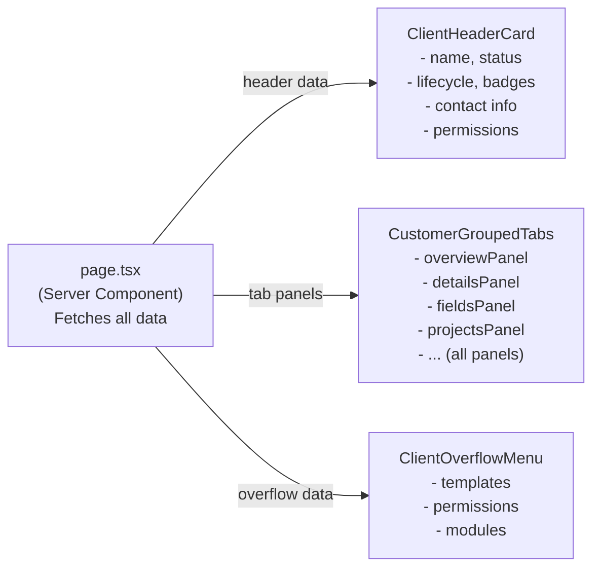
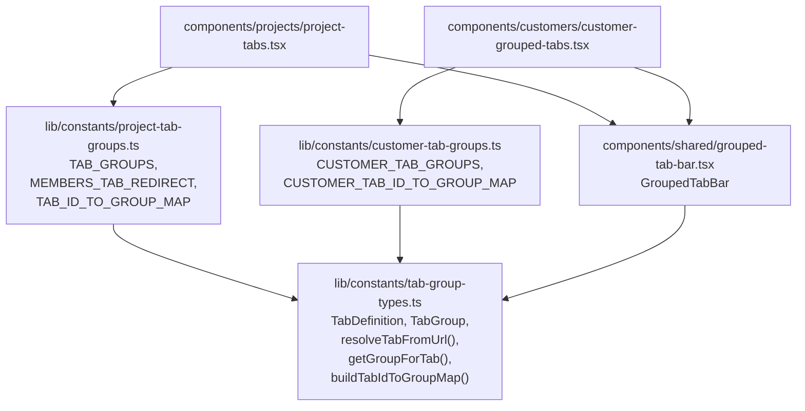
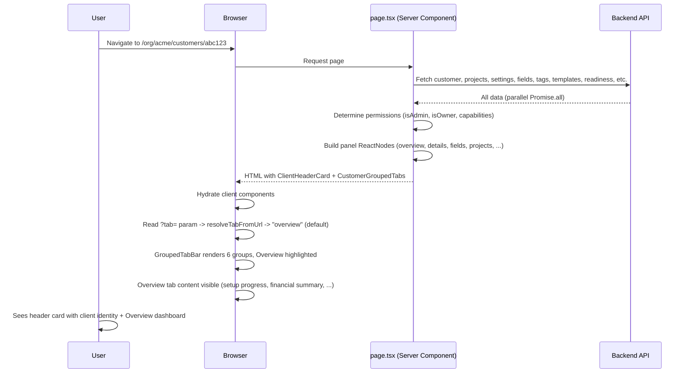
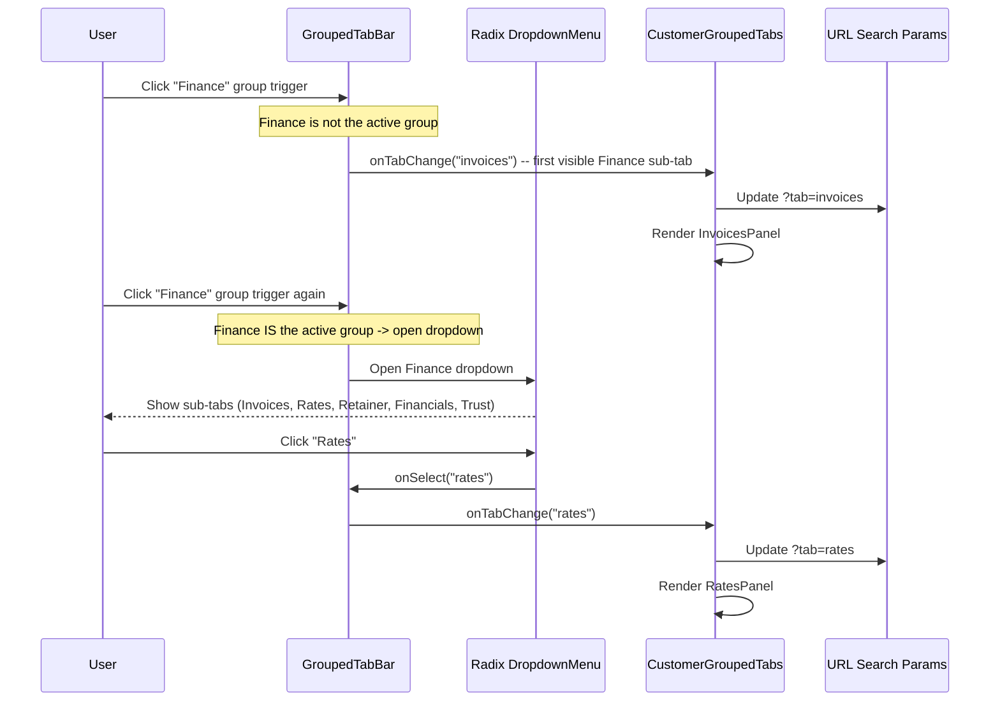
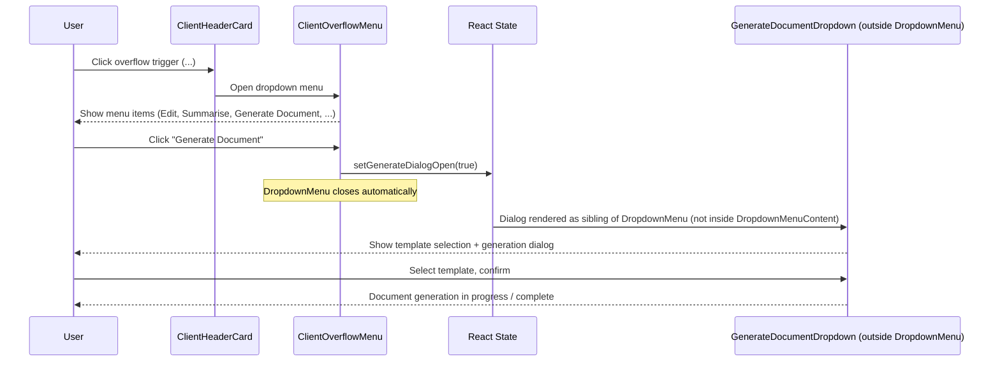
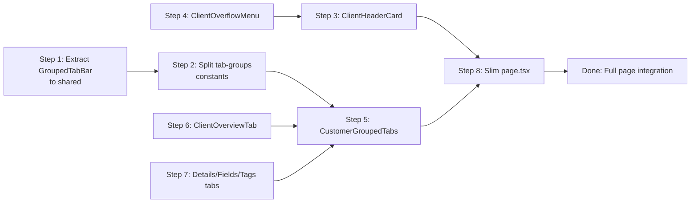

# Phase 77 -- Customer Detail Page Redesign (Header Card + Grouped Tabs)

> Merge into architecture/ as phase77 standalone document.

> **Canonical location**: this standalone `architecture/phase77-*.md` file. Per the convention established in `phase68-portal-redesign-vertical-parity.md`, `ARCHITECTURE.md` stops at Section 10 (Phase 4) and gets a one-paragraph stub pointer per phase doc. Local section numbers below (`77.x`) are an organising device internal to this phase doc.

> **Frontend-only phase.** No backend changes, no new entities, no migrations, no API changes. The server component in `page.tsx` continues to fetch all the same data; only the rendering structure changes.

> **Predecessor**: Phase 73 redesigned the matter detail page using sidebar + grouped tabs, then refined post-73 to header card + tabs (removing the sidebar in favour of `MatterHeaderCard` + Details/Fields tabs). Phase 77 applies that final pattern to the customer detail page.

> **ADRs**: [ADR-298](../adr/ADR-298-shared-grouped-tab-bar.md), [ADR-299](../adr/ADR-299-header-card-entity-detail-layout.md)

---

## 77.1 Overview

The customer detail page (`/org/[slug]/customers/[id]`) is the second most-visited entity detail page in Kazi. Practitioners open it to check client status, review compliance progress, manage documents, view financials, and handle lifecycle transitions. Over successive phases the page has accumulated the same structural problems the matter detail page had before Phase 73:

- **7 action buttons sprawl horizontally** next to the customer name (Summarise Activity, Change Status, Generate Document, Export Data, Anonymize, Edit, Archive). On narrower viewports they wrap or clip.
- **Metadata wall before tabs.** Address card, Primary Contact card, Business Details card, field group selector, custom fields, tags, trust balance, setup progress, unbilled time, template readiness, and lifecycle action prompt stack vertically before the tab bar is visible. Tabs are below the fold.
- **11 flat tabs in a single horizontal row.** Module-gating hides some, but a full accounting-za tenant still sees 8--10 tabs simultaneously. The current `CustomerTabs` component uses a Framer Motion underline animation -- no grouping mechanism.
- **No content hierarchy.** Setup guidance cards, action prompts, and AI panels are interspersed with metadata rather than grouped logically.

Phase 77 restructures the page from a vertical-stack layout to the **header card + grouped tabs** pattern established post-Phase 73 for matters. This is a pure frontend restructure -- every current capability remains, just reorganised.

### What's New

| Current Layout | Phase 77 Layout |
|---|---|
| Customer name + 7 action buttons in header row | `ClientHeaderCard` with name, badges, contact, 1 smart primary action + `ClientOverflowMenu` |
| Address, Contact, Business Details, custom fields, tags inline above tabs | **Details** tab group: Details sub-tab (address, contact, business details), Fields sub-tab (custom fields), Tags sub-tab |
| Setup guidance, unbilled time, template readiness, AI panels interspersed above/below tabs | **Overview** tab (default landing): setup progress, lifecycle prompt, financial summary, template readiness, AI panels |
| 11 flat tabs (Projects, Documents, Onboarding, Invoices, Retainer, Requests, Rates, Generated Docs, Financials, Trust, Audit) | 6 tab groups (Details, Overview, Work, Finance, Compliance, Activity) via shared `GroupedTabBar` |
| No default tab -- defaults to Projects | Default tab is **Overview** |
| Anonymized banner between header and inline fields | Anonymized banner between header card and grouped tab bar |

### What Does NOT Change

- **No backend changes.** No new API endpoints, no entity changes, no migrations, no data fetching changes.
- **No matter detail page changes.** That page already has the target pattern.
- **No customer list page changes.** The list page is a separate concern.
- **No new features.** This is a layout restructure. Every current capability remains.

---

## 77.2 Component Architecture

### 77.2.1 Component Tree

```mermaid
flowchart TD
    PAGE["page.tsx (Server Component)"] --> BACK["Back Link"]
    PAGE --> HEADER["ClientHeaderCard (Client)"]
    PAGE --> BANNER["Anonymized Banner (conditional)"]
    PAGE --> GTABS["CustomerGroupedTabs (Client)"]

    HEADER --> NAME["Customer Name + Status Badges"]
    HEADER --> CONTACT["Contact Summary (email, phone)"]
    HEADER --> CONTEXT["Context Line (since date, engagements)"]
    HEADER --> ACTIONS["Smart Primary Action + ClientOverflowMenu"]

    GTABS --> GTB["GroupedTabBar (shared)"]
    GTABS --> OVERVIEW["ClientOverviewTab"]
    GTABS --> DETAILS["ClientDetailsTab"]
    GTABS --> FIELDS["ClientFieldsTab"]
    GTABS --> TAGS["ClientTagsTab"]
    GTABS --> PROJECTS["CustomerProjectsPanel (existing)"]
    GTABS --> DOCS["CustomerDocumentsPanel (existing)"]
    GTABS --> GENERATED["GeneratedDocumentsList (existing)"]
    GTABS --> INVOICES["CustomerInvoicesTab (existing)"]
    GTABS --> RATES["CustomerRatesTab (existing)"]
    GTABS --> RETAINER["CustomerRetainerTab (existing)"]
    GTABS --> FINANCIALS["CustomerFinancialsTab (existing)"]
    GTABS --> TRUST["TrustBalanceCard (existing)"]
    GTABS --> ONBOARDING["ChecklistInstancePanel (existing)"]
    GTABS --> REQUESTS["RequestList (existing)"]
    GTABS --> AUDIT["AuditTimelineTab (existing)"]

    OVERVIEW --> SETUP["SetupProgressCard (existing)"]
    OVERVIEW --> LIFECYCLE["ActionCard / Lifecycle Prompt (existing)"]
    OVERVIEW --> UNBILLED["Unbilled Time Card (existing)"]
    OVERVIEW --> RETSUM["Retainer Status Card (new)"]
    OVERVIEW --> TEMPLATE["TemplateReadinessCard (existing)"]
    OVERVIEW --> AIWIDGET["PendingSuggestionsWidget (existing)"]
    OVERVIEW --> FICA["FicaVerificationPanel (existing)"]

    DETAILS --> ADDRESS["CustomerAddressBlock (existing)"]
    DETAILS --> CONTACTCARD["CustomerContactCard (existing)"]
    DETAILS --> BUSINESS["Business Details Card"]

    FIELDS --> FGS["FieldGroupSelector (existing)"]
    FIELDS --> CFS["CustomFieldSection (existing)"]

    TAGS --> TAGINPUT["TagInput (existing)"]
```



### 77.2.2 New Components

| Component | File Path | Description |
|---|---|---|
| `ClientHeaderCard` | `frontend/components/customers/client-header-card.tsx` | Client component. Compact header card: name, status badges, contact summary, context line, smart primary action, overflow menu trigger. Mirrors `MatterHeaderCard` pattern. |
| `ClientOverflowMenu` | `frontend/components/customers/client-overflow-menu.tsx` | Client component. DropdownMenu with Edit, Summarise Activity, Generate Document (submenu), Run Conflict Check, Verify KYC, Export Data, Anonymize, Archive. Follows `OverflowActionsMenu` pattern. |
| `CustomerGroupedTabs` | `frontend/components/customers/customer-grouped-tabs.tsx` | Client component. Replaces `CustomerTabs`. Renders shared `GroupedTabBar` with customer-specific tab group configuration. Manages active tab state via URL search params. |
| `ClientOverviewTab` | `frontend/components/customers/client-overview-tab.tsx` | Client component. Aggregates setup guidance, lifecycle prompt, financial summary, template readiness, and AI panels into a dashboard view. |
| `ClientDetailsTab` | `frontend/components/customers/client-details-tab.tsx` | Client component. Renders address block, contact card, and business details in a 2-column grid. |
| `ClientFieldsTab` | `frontend/components/customers/client-fields-tab.tsx` | Client component. Renders FieldGroupSelector + CustomFieldSection. |
| `ClientTagsTab` | `frontend/components/customers/client-tags-tab.tsx` | Client component. Renders TagInput. |

### 77.2.3 Existing Components to Modify

| Component | File Path | Change Description |
|---|---|---|
| `page.tsx` | `frontend/app/(app)/org/[slug]/customers/[id]/page.tsx` | Major refactor. Remove header section, inline metadata, action buttons, setup cards from main flow. Render: back link -> `ClientHeaderCard` -> (optional anonymized banner) -> `CustomerGroupedTabs` with all panels as props. |
| `CustomerTabs` | `frontend/components/customers/customer-tabs.tsx` | **Replaced** by `CustomerGroupedTabs`. The old component is deleted once migration is complete. |
| `GroupedTabBar` | `frontend/components/shared/grouped-tab-bar.tsx` | **Moved** from `components/projects/` to `components/shared/`. No functional changes -- import paths updated. |

### 77.2.4 ClientHeaderCard

Mirrors the `MatterHeaderCard` pattern (`components/projects/matter-header-card.tsx`) but adapted for customer entity data. Both are `"use client"` components rendered inside a Shadcn `Card` with `data-testid` for QA automation.

**Props interface:**

```typescript
// frontend/components/customers/client-header-card.tsx

interface ClientHeaderCardProps {
  customerId: string;
  customerName: string;
  customerStatus: CustomerStatus;       // ACTIVE | ARCHIVED
  lifecycleStatus: LifecycleStatus | null;
  email: string | null;
  phone: string | null;
  lifecycleStatusChangedAt: string | null;
  linkedProjectCount: number;
  kycSummary: KycSummary | null;
  xeroConnected: boolean;
  slug: string;
  isAdmin: boolean;
  isOwner: boolean;
}
```

All props are serializable (no functions, no components) -- required by the RSC serialization boundary since `page.tsx` is a server component.

**Content layout:**

| Row | Content | Styling |
|---|---|---|
| 1 -- Name | Customer name | `font-display text-xl font-semibold`, `line-clamp-2` with tooltip for overflow |
| 2 -- Badges | Customer status (Active/Archived), lifecycle status, KYC status (if configured), Xero badge (if connected) | Inline `Badge` row, `flex-wrap gap-2` |
| 3 -- Contact | Email + phone (if set), separated by middot | `text-sm text-slate-600` |
| 4 -- Context | "Since {date}" (lifecycle duration) + "{N} engagements" | `text-sm text-muted-foreground` |
| 5 -- Actions | Smart primary action button (right-aligned) + overflow menu trigger | `flex shrink-0 items-center gap-2` |

**Comparison with MatterHeaderCard:**

| Aspect | MatterHeaderCard | ClientHeaderCard |
|---|---|---|
| Identity | Project name | Customer name |
| Badges | Project status, work type code chip | Customer status, lifecycle status, KYC, Xero |
| Context line | Customer link, reference number | Contact info (email, phone), engagement count |
| Primary action | Close/Reopen/Lifecycle transitions | Smart action based on lifecycle (see Section 77.2.5) |
| Overflow | `OverflowActionsMenu` (rendered adjacent to card by `page.tsx`) | `ClientOverflowMenu` (rendered inside card) |

> **Note**: `ClientHeaderCard` is a new design that includes the overflow menu trigger internally, whereas `MatterHeaderCard` is the reference pattern for card structure, not a strict template. `ClientHeaderCard` is substantially more complex (5 rows, smart primary action, inline overflow) compared to `MatterHeaderCard` (3 rows, lifecycle actions rendered by a separate component).

### 77.2.5 Smart Primary Action

The visible primary action button changes based on the customer's lifecycle state. This replaces the current 7-button action row with a single context-aware button.

| Lifecycle Status | Primary Action | Button Style |
|---|---|---|
| `PROSPECT` | Start Onboarding | accent (teal) |
| `ONBOARDING` | Activate Customer | accent (teal) |
| `ONBOARDING` (blockers) | Activate Customer (disabled, tooltip shows blockers) | outline, disabled |
| `ACTIVE` | Edit | outline |
| `DORMANT` | Edit | outline |
| `OFFBOARDING` | Complete Offboarding | accent |
| `OFFBOARDED` | -- (no primary) | -- |
| `ANONYMIZED` | -- (no primary, read-only) | -- |
| `ARCHIVED` | Restore | outline |

**Why a smart primary action instead of always showing Edit**: The most frequent user intent varies by lifecycle state. A PROSPECT customer exists to be onboarded. An ONBOARDING customer exists to be activated. Surfacing the contextually correct action as the primary button reduces clicks for the most common workflow at each stage -- the same reasoning behind the matter detail page's lifecycle-dependent primary action.

### 77.2.6 ClientOverflowMenu

Follows the `OverflowActionsMenu` pattern (`components/projects/overflow-actions-menu.tsx`). Uses Shadcn `DropdownMenu` with a `MoreHorizontal` icon trigger.

**Critical: OBS-2103 dialog rendering pattern.** Dialogs triggered from the overflow menu (Generate Document, Export Data, Anonymize, Archive) must be rendered **outside** `DropdownMenuContent` with controlled `open` state — exactly as `OverflowActionsMenu` does (see lines 64–69 of that component). The dropdown menu items set state (`setGenerateDialogOpen(true)`) and the corresponding `<Dialog>` / `<AlertDialog>` renders as a sibling of `<DropdownMenu>`, not inside `<DropdownMenuContent>`. This prevents the OBS-2103 Radix Slot collision. Do NOT use `<DropdownMenuSub>` for Generate Document — use a controlled state trigger instead.

**Menu structure:**

```
Edit Client
Summarise Activity              (AI capability)
------
Generate Document               (opens GenerateDocumentDropdown dialog via controlled state)
Run Conflict Check              (navigates to conflict check page)
Verify KYC                      (navigates to onboarding tab)
------
Export Data                     (opens DataExportDialog via controlled state)
------
Anonymize                       (owner only, destructive, opens AnonymizeCustomerDialog)
Archive                         (admin, destructive, opens ArchiveCustomerDialog)
```

**Gating rules:**

| Item | Gate Condition |
|---|---|
| Edit Client | `!isAnonymized` |
| Summarise Activity | AI provider configured |
| Generate Document | `canManage && templates.length > 0 && !isAnonymized` |
| Run Conflict Check | `conflict_check` module enabled && `!isAnonymized` |
| Verify KYC | KYC configured && not verified && `!isAnonymized` |
| Export Data | Always visible |
| Anonymize | `isOwner && !isAnonymized` |
| Archive | `isAdmin && !isAnonymized` |

When the customer is ANONYMIZED, the overflow menu shows only Export Data (read-only state).

### 77.2.7 CustomerGroupedTabs

Replaces the current `CustomerTabs` component. Follows the same pattern as `ProjectTabs` (`components/projects/project-tabs.tsx`):

1. Receives all tab panel content as `ReactNode` props from the server component.
2. Builds visible groups from `CUSTOMER_TAB_GROUPS` with module-gating and terminology rewriting.
3. Renders `GroupedTabBar` (shared component) with the customer tab group configuration.
4. Manages active tab state via URL `?tab=` search params.
5. Conditionally renders the active tab's panel content via Radix `TabsPrimitive.Content`.

**Props interface:**

```typescript
// frontend/components/customers/customer-grouped-tabs.tsx

interface CustomerGroupedTabsProps {
  // Details group
  detailsPanel: ReactNode;
  fieldsPanel: ReactNode;
  tagsPanel: ReactNode;
  // Overview
  overviewPanel: ReactNode;
  // Work group
  projectsPanel: ReactNode;
  documentsPanel: ReactNode;
  generatedPanel?: ReactNode;
  // Finance group
  invoicesPanel?: ReactNode;
  ratesPanel?: ReactNode;
  retainerPanel?: ReactNode;
  financialsPanel?: ReactNode;
  trustPanel?: ReactNode;
  // Compliance group
  onboardingPanel?: ReactNode;
  requestsPanel?: ReactNode;
  // Activity group
  auditPanel?: ReactNode;
}
```

### 77.2.8 Data Flow

The server component `page.tsx` continues to fetch all data exactly as today. The change is in how that data flows to the new component structure:



**Key constraint**: `ClientHeaderCard` and `CustomerGroupedTabs` are `"use client"` components. Per the RSC serialization boundary rules in `frontend/CLAUDE.md`, `page.tsx` must pass only serializable data to them -- no functions, no component references. The panel `ReactNode` props are serializable because they are rendered server-side and passed as the JSX tree.

---

## 77.3 Shared Component Extraction

### 77.3.1 GroupedTabBar Relocation

`GroupedTabBar` currently lives at `frontend/components/projects/grouped-tab-bar.tsx`. It was built for the matter detail page but is entity-agnostic -- it accepts a `groups: TabGroup[]` prop and renders them. Both the matter and customer detail pages need it.

**Move**: `components/projects/grouped-tab-bar.tsx` -> `components/shared/grouped-tab-bar.tsx`

The component source is unchanged. Only the file location and import paths change.

**Import update strategy:**

| File | Old Import | New Import |
|---|---|---|
| `components/projects/project-tabs.tsx` | `from "@/components/projects/grouped-tab-bar"` | `from "@/components/shared/grouped-tab-bar"` |
| `components/projects/project-tabs.tsx` | `from "@/lib/constants/tab-groups"` (TabGroup type) | `from "@/lib/constants/tab-group-types"` |
| `components/shared/grouped-tab-bar.tsx` | `from "@/lib/constants/tab-groups"` (TabGroup type) | `from "@/lib/constants/tab-group-types"` |
| `components/customers/customer-grouped-tabs.tsx` | (new file) | `from "@/components/shared/grouped-tab-bar"`, `from "@/lib/constants/tab-group-types"` |

A barrel re-export at the old path (`components/projects/grouped-tab-bar.tsx`) is an option to avoid breaking any other imports, but given there is only one consumer (`ProjectTabs`), a direct update is simpler.

### 77.3.2 Tab Groups Constants Split

The current `lib/constants/tab-groups.ts` defines `TAB_GROUPS` for the matter detail page. It also exports the `TabGroup`, `TabDefinition` types and utility functions (`resolveTabFromUrl`, `getGroupForTab`, `TAB_ID_TO_GROUP_MAP`).

**Refactoring plan:**

1. **Rename** `lib/constants/tab-groups.ts` -> `lib/constants/project-tab-groups.ts`. This file retains `TAB_GROUPS` (the matter-specific constant), `MEMBERS_TAB_REDIRECT`, and the `TAB_ID_TO_GROUP_MAP` for projects.

2. **Create** `lib/constants/customer-tab-groups.ts`. This file defines `CUSTOMER_TAB_GROUPS` (the customer-specific constant) and `CUSTOMER_TAB_ID_TO_GROUP_MAP`.

3. **Extract** shared types and utilities to `lib/constants/tab-group-types.ts`:
   - `TabDefinition` interface
   - `TabGroup` interface
   - `resolveTabFromUrl(tabParam, groups)` -- already parameterised by `groups`, fully reusable
   - `getGroupForTab(tabId, groupMap)` -- parameterised by group map
   - `buildTabIdToGroupMap(groups)` -- helper to construct the reverse lookup

Both `project-tab-groups.ts` and `customer-tab-groups.ts` import shared types from `tab-group-types.ts`.

**Why parameterised utilities**: `resolveTabFromUrl` already accepts a `groups` parameter -- it was designed for reuse. `getGroupForTab` currently uses a module-level `TAB_ID_TO_GROUP_MAP` constant, which ties it to the project tab groups. Parameterising it by group map makes it entity-agnostic.

**Call-site audit**: `getGroupForTab` is currently defined in `lib/constants/tab-groups.ts:160` but has **zero external callers** -- it is exported but unused. This makes the refactoring safe: rename to accept a `groupMap` parameter, export from `tab-group-types.ts`, and no existing code breaks. New signature: `getGroupForTab(tabId: string, groupMap: Map<string, string>): string | null`.

**`MEMBERS_TAB_REDIRECT` handling**: The current `resolveTabFromUrl` includes a hardcoded `members → staffing` redirect (step 2) that is matter-specific. When extracting the shared utility, this redirect must **not** move into the shared function body. Instead:
- The shared `resolveTabFromUrl` in `tab-group-types.ts` is a pure group/tab resolver with no entity-specific redirects.
- `ProjectTabs` applies the `members → staffing` redirect **before** calling the shared `resolveTabFromUrl`.
- `CustomerGroupedTabs` calls the shared `resolveTabFromUrl` directly with no redirect pre-processing.

### 77.3.3 Import Dependency After Extraction



---

## 77.4 Tab Group Configuration

### 77.4.1 CUSTOMER_TAB_GROUPS Constant

Follows the exact `TabGroup[]` shape defined in the existing `tab-groups.ts`. Groups are ordered to match the information architecture: identity details first, then the overview dashboard, then operational content, then financial, then compliance, then audit.

```typescript
// frontend/lib/constants/customer-tab-groups.ts

import type { TabGroup } from "./tab-group-types";
import { buildTabIdToGroupMap } from "./tab-group-types";

/**
 * Tab group configuration for the customer detail grouped tab bar.
 *
 * Defines 6 top-level groups and their sub-tabs. Labels are canonical
 * English -- terminology rewriting is applied by the caller when building
 * the `groups` prop for `GroupedTabBar`.
 *
 * Architecture: Section 77.4.1, ADR-298.
 */
export const CUSTOMER_TAB_GROUPS: readonly TabGroup[] = [
  {
    id: "details",
    label: "Details",
    tabs: [
      { id: "details", label: "Details" },
      { id: "fields", label: "Fields" },
      { id: "tags", label: "Tags" },
    ],
    visible: true,
  },
  {
    id: "overview",
    label: "Overview",
    tabs: [{ id: "overview", label: "Overview" }],
    visible: true,
  },
  {
    id: "work",
    label: "Work",
    tabs: [
      { id: "projects", label: "Projects" },
      { id: "documents", label: "Documents" },
      { id: "generated", label: "Generated Docs" },
    ],
    visible: true,
  },
  {
    id: "finance",
    label: "Finance",
    tabs: [
      { id: "invoices", label: "Invoices" },
      { id: "rates", label: "Rates" },
      { id: "retainer", label: "Retainer" },
      { id: "financials", label: "Financials" },
      { id: "trust", label: "Trust" },
    ],
    visible: true,
  },
  {
    id: "compliance",
    label: "Compliance",
    tabs: [
      { id: "onboarding", label: "Onboarding" },
      { id: "requests", label: "Requests" },
    ],
    visible: true,
  },
  {
    id: "activity",
    label: "Activity",
    tabs: [{ id: "audit", label: "Audit" }],
    visible: true,
  },
];

/** Reverse lookup: customer tab ID -> group ID (O(1)). */
export const CUSTOMER_TAB_ID_TO_GROUP_MAP: Record<string, string> =
  buildTabIdToGroupMap(CUSTOMER_TAB_GROUPS);
```

### 77.4.2 Group Visibility Rules

The `CustomerGroupedTabs` component applies module-gating and role-gating by spreading `visible` overrides onto each group and tab, following the same pattern as `ProjectTabs`:

| Group | Sub-tab | Visibility Rule |
|---|---|---|
| **Details** | details | Always |
| **Details** | fields | Always |
| **Details** | tags | Always |
| **Overview** | overview | Always |
| **Work** | projects | Always |
| **Work** | documents | Always |
| **Work** | generated | `!!generatedPanel` |
| **Finance** | invoices | `!!invoicesPanel` (admin-gated in page.tsx) |
| **Finance** | rates | `!!ratesPanel` (admin-gated in page.tsx) |
| **Finance** | retainer | `!!retainerPanel` (non-terminal lifecycle or has retainers) |
| **Finance** | financials | `!!financialsPanel` (admin-gated in page.tsx) |
| **Finance** | trust | `!!trustPanel && isModuleEnabled("trust_accounting")` |
| **Compliance** | onboarding | `!!onboardingPanel` (ONBOARDING lifecycle or has checklists) |
| **Compliance** | requests | `!!requestsPanel` |
| **Activity** | audit | `!!auditPanel && auditVisible` (TEAM_OVERSIGHT capability) |

**Internal hooks required by `CustomerGroupedTabs`**: The component must internally call `useAuditTabVisible()` to determine `auditVisible` — this hook checks the `TEAM_OVERSIGHT` capability. It must also call `useModuleEnabled("trust_accounting")` for trust tab gating (or receive it as a prop). These gates cannot be inferred from `!!panel` alone because the server component may pass a non-null `auditPanel` or `trustPanel` even when the user lacks the required capability/module. The existing `CustomerTabs` already calls `useAuditTabVisible()` at line 103 — replicate this in `CustomerGroupedTabs`.

**Group-level rule**: A group is visible if at least one of its sub-tabs is visible. If all Finance sub-tabs are gated off (non-admin user without trust_accounting module), the Finance group hides entirely.

**Single-tab group behaviour**: If a group resolves to exactly one visible sub-tab, `GroupedTabBar` renders it as a standalone tab (no dropdown arrow, no dropdown menu) -- same as the matter detail page. For example, if Activity only has Audit visible and it renders as a plain "Activity" tab click.

### 77.4.3 URL Resolution Rules

All existing tab IDs continue to work. New tab IDs are added for the new tabs.

**Existing IDs (backward compatible):**
`projects`, `documents`, `onboarding`, `invoices`, `retainer`, `requests`, `rates`, `generated`, `financials`, `trust`, `audit`

**New IDs:**
`details`, `fields`, `tags`, `overview`

**Resolution priority (using shared `resolveTabFromUrl`):**

1. `null` (no `?tab=` param) -> `{ groupId: "overview", tabId: "overview" }` (default)
2. Known tab ID (e.g., `?tab=invoices`) -> find its group -> `{ groupId: "finance", tabId: "invoices" }`
3. Group-level alias (e.g., `?tab=work`) -> first visible sub-tab in that group -> `{ groupId: "work", tabId: "projects" }`
4. Unknown value -> fallback to overview default

**Note on default tab change**: The current `CustomerTabs` defaults to `projects`. Phase 77 changes the default to `overview`. This is intentional -- the Overview tab provides a dashboard summary that orients the user before drilling into specific tabs. Deep links using `?tab=projects` continue to work.

**Note on group-id/tab-id collision**: The `details` group contains a sub-tab also named `details`, and `overview` is both a group ID and a tab ID. This is the same pattern used in the matter detail page's `TAB_GROUPS`. The resolution is safe because **tab IDs take precedence over group aliases** (step 2 runs before step 3). `?tab=details` resolves as the `details` tab within the `details` group, not as a group-level alias. `?tab=overview` resolves as the `overview` tab within the `overview` group. This is expected behaviour, not a bug.

---

## 77.5 State Management

### 77.5.1 URL-Driven Tab State

Tab state is managed via the `?tab=` URL search parameter, consistent with the matter detail page pattern. The `CustomerGroupedTabs` component reads the parameter and resolves it to a group + tab pair using `resolveTabFromUrl`.

```
URL: /org/acme/customers/abc123?tab=invoices
  -> resolveTabFromUrl("invoices", CUSTOMER_TAB_GROUPS)
  -> { groupId: "finance", tabId: "invoices" }
  -> Finance group highlighted, Invoices sub-tab active
```

Tab changes update the URL via `useRouter().replace()` (no history entry for intra-page tab switches) or via `useState` for client-side-only switches that don't need URL persistence -- following the same dual-state pattern as `ProjectTabs`.

### 77.5.2 Default Tab

The default tab (no `?tab=` param) is **overview**. This differs from the current default of `projects` because the Overview tab provides an at-a-glance dashboard that answers "what do I need to know about this client right now?" before the user drills into specific operational tabs.

### 77.5.3 Smart Primary Action State

The primary action button in `ClientHeaderCard` derives its state from the `lifecycleStatus` prop. No additional state management is needed -- the lifecycle status is fetched server-side and passed as a prop. The button variant (accent vs outline vs hidden) is a pure function of lifecycle status (see table in Section 77.2.5).

---

## 77.6 Responsive Behaviour

### 77.6.1 Breakpoint Table

| Breakpoint | Header Card | Tab Groups | Overview Grid | Overall |
|---|---|---|---|---|
| `< md` (< 768px) | Full-width, badges wrap, actions stack below content | Dropdowns may use full-width popover | 1-column stack | Single-column, compact |
| `md` (768px -- 1023px) | Full-width, badges inline, actions right-aligned | Standard dropdowns | 2-column grid | Single-column, spacious |
| `>= lg` (1024px+) | Full-width, all inline | Standard dropdowns | 2-column grid | Full desktop layout |

### 77.6.2 Header Card Responsive Layout

The header card uses flexbox with `flex-wrap` for badges and a `justify-between` layout for the name row and actions area:

- **Desktop**: Name + badges left, primary action + overflow right, same row.
- **Tablet**: Same as desktop (card is full-width, ample horizontal space).
- **Mobile**: Name + badges stack vertically. Actions row below the context line, right-aligned.

### 77.6.3 Grouped Tab Bar Adaptation

`GroupedTabBar` already handles narrow screens -- dropdown menus use Radix `DropdownMenuContent` with `align="start"`, which positions relative to the trigger. On narrow viewports:

- Group labels compress (shorter text, `text-sm`).
- The tab bar scrolls horizontally if groups exceed viewport width (unlikely with 6 groups, but safe).
- Dropdown menus remain within viewport bounds via Radix collision detection.

No additional responsive work is needed for the shared `GroupedTabBar` component.

---

## 77.7 Sequence Diagrams

### 77.7.1 Page Load -- Header Card + Grouped Tabs



### 77.7.2 Tab Group Navigation



### 77.7.3 Overflow Action -- Generate Document (OBS-2103 Safe)



> **OBS-2103 safety**: The dialog is rendered **outside** `DropdownMenuContent` as a controlled component. The dropdown menu item calls `setGenerateDialogOpen(true)` which closes the dropdown and opens the dialog as a sibling element. This avoids the Radix Slot collision that occurs when dialogs are nested inside dropdown content. Same pattern used by `OverflowActionsMenu` in the matter detail page.

---

## 77.8 Migration Path

### 77.8.1 Component Refactoring Strategy

Build order matters because components depend on each other. Each step can be independently verified:

| Step | Description | Risk | Verification |
|---|---|---|---|
| 1 | **Extract `GroupedTabBar` to shared.** Move `components/projects/grouped-tab-bar.tsx` to `components/shared/grouped-tab-bar.tsx`. Update `ProjectTabs` import. | LOW -- single import path change, no functional change | Matter detail page tab navigation still works |
| 2 | **Split tab-groups constants.** Rename `tab-groups.ts` to `project-tab-groups.ts`, extract shared types to `tab-group-types.ts`, create `customer-tab-groups.ts`. | LOW -- type extraction, no runtime change | `ProjectTabs` module-gating and URL resolution unchanged |
| 3 | **Create `ClientHeaderCard`.** Extract name, badges, email, phone, lifecycle from the current header section. Add smart primary action logic. | MEDIUM -- new component, needs visual verification | Header card renders correctly for all lifecycle states |
| 4 | **Create `ClientOverflowMenu`.** Move 7 action buttons into a dropdown with proper gating. | MEDIUM -- permission logic must be preserved exactly | All 7 actions accessible, gating matches current behaviour |
| 5 | **Create `CustomerGroupedTabs`.** Wire up `GroupedTabBar` with `CUSTOMER_TAB_GROUPS`. All panels as `ReactNode` props. | MEDIUM -- replaces core navigation, must preserve all tab IDs | All 15 tab IDs resolve correctly, module-gating works |
| 6 | **Create Overview tab content.** Move setup guidance, action prompts, unbilled time, template readiness, AI panels from inline to Overview tab. | LOW -- existing components relocated, no logic changes | Overview tab shows all guidance/summary content |
| 7 | **Create Details, Fields, Tags tabs.** Move address, contact, business details, custom fields, tags from inline to tab panels. | LOW -- existing components relocated | Details tab shows metadata, Fields tab shows custom fields |
| 8 | **Slim down `page.tsx`.** Wire everything together: back link -> `ClientHeaderCard` -> banner -> `CustomerGroupedTabs`. | HIGH -- the integration step, must not break data flow | Full page renders correctly for all customer states |

### 77.8.2 Component Dependency Graph



Steps 1--2 are sequential (shared extraction). Steps 3--4 are sequential (overflow menu feeds into header card). Steps 5--7 can proceed in parallel (independent tab components). Step 8 depends on all prior steps.

---

## 77.9 QA Testplan Migration

### 77.9.1 Testplan Files Requiring Updates

| File | Impact | What Changes |
|---|---|---|
| `qa/testplan/48-lifecycle-script.md` | HIGH | Steps referencing customer detail tabs, lifecycle transition buttons, Generate Document button |
| `qa/testplan/regression-test-suite.md` | HIGH | Customer CRUD, lifecycle badges, Generate Document, Export/Anonymize, page objects |
| `qa/testplan/demos/accounting-za-90day-keycloak-v2.md` | HIGH | Field promotion checkpoints, Onboarding tab, client detail screenshots, onboarding flow |
| `qa/testplan/demos/legal-za-90day-keycloak.md` | HIGH | Field promotion checkpoints, lifecycle badges |
| `qa/testplan/demos/admin-audit-30day-keycloak.md` | MEDIUM | Customer Audit tab now under Activity group |
| `qa/testplan/legal-onboarding-keycloak.md` | MEDIUM | Client detail page references, lifecycle badges |
| `qa/testplan/qa-legal-lifecycle-test-plan.md` | MEDIUM | Client detail, lifecycle badge, Generate Document |
| `qa/testplan/phase49-document-content-verification.md` | MEDIUM | Custom fields section, Requests tab, Generate Document |
| `qa/testplan/phase74-ai-lifecycle-scenario.md` | LOW | "Verify with AI" button now in Overview tab |
| `qa/testplan/demo-readiness-keycloak-master.md` | LOW | Customer detail page field references |

### 77.9.2 Tab Navigation Selector Migration

| Old (flat tab) | New Group | New Tab ID | New Navigation Pattern |
|---|---|---|---|
| Projects | Work | projects | `tab-group-work` -> `tab-item-projects` |
| Documents | Work | documents | `tab-group-work` -> `tab-item-documents` |
| Generated Docs | Work | generated | `tab-group-work` -> `tab-item-generated` |
| Onboarding | Compliance | onboarding | `tab-group-compliance` -> `tab-item-onboarding` |
| Invoices | Finance | invoices | `tab-group-finance` -> `tab-item-invoices` |
| Retainer | Finance | retainer | `tab-group-finance` -> `tab-item-retainer` |
| Requests | Compliance | requests | `tab-group-compliance` -> `tab-item-requests` |
| Rates | Finance | rates | `tab-group-finance` -> `tab-item-rates` |
| Financials | Finance | financials | `tab-group-finance` -> `tab-item-financials` |
| Trust | Finance | trust | `tab-group-finance` -> `tab-item-trust` |
| Audit | Activity (standalone) | audit | `tab-group-activity` click |
| _(new)_ Details | Details | details | `tab-group-details` -> `tab-item-details` |
| _(new)_ Fields | Details | fields | `tab-group-details` -> `tab-item-fields` |
| _(new)_ Tags | Details | tags | `tab-group-details` -> `tab-item-tags` |
| _(new)_ Overview | Overview (standalone) | overview | `tab-group-overview` click |

### 77.9.3 Action Button Selector Migration

| Old Location | Old Selector | New Location | New Selector |
|---|---|---|---|
| Header row | `page.getByText('Edit')` | Overflow menu | `page.getByTestId('client-overflow-trigger').click()` -> `page.getByText(/edit/i)` |
| Header row | Lifecycle transition dropdown | Header card | `page.getByTestId('client-header-card').getByRole('button', { name: /start onboarding/i })` |
| Header row | `page.getByText('Generate Document')` | Overflow menu | `page.getByTestId('client-overflow-trigger').click()` -> `page.getByText(/generate document/i)` |
| Header row | `page.getByText('Export Data')` | Overflow menu | `page.getByTestId('client-overflow-trigger').click()` -> `page.getByText(/export/i)` |
| Header row | `page.getByText('Anonymize')` | Overflow menu | `page.getByTestId('client-overflow-trigger').click()` -> `page.getByText(/anonymize/i)` |
| Header row | `page.getByText('Archive')` | Overflow menu | `page.getByTestId('client-overflow-trigger').click()` -> `page.getByText(/archive/i)` |
| Header row | `page.getByText('Summarise')` | Overflow menu | `page.getByTestId('client-overflow-trigger').click()` -> `page.getByText(/summarise/i)` |

### 77.9.4 Content Relocation Selector Migration

| Content | Old Location | New Location |
|---|---|---|
| Address block, Contact card, Business Details | Inline above tabs | Details tab (`tab-group-details` -> `tab-item-details`) |
| Custom fields section | Inline above tabs | Fields tab (`tab-group-details` -> `tab-item-fields`) |
| Tags section | Inline above tabs | Tags tab (`tab-group-details` -> `tab-item-tags`) |
| Setup Progress card | Inline above tabs | Overview tab (`tab-group-overview` click) |
| Unbilled Time card | Inline above tabs | Overview tab |
| Template Readiness card | Inline above tabs | Overview tab |
| Lifecycle Action Prompt | Inline above tabs | Overview tab |
| Pending AI Suggestions | Below tabs | Overview tab |
| FICA Verification Panel | Below tabs | Overview tab |

### 77.9.5 Field Promotion Checkpoint Updates

Several testplans verify that promoted field slugs render "inline at the top of the detail page, NOT in the sidebar CustomFieldSection." Post-Phase 77:

- Promoted fields still render as first-class fields on the **Details tab** (address, contact, business details cards).
- The assertion changes from "visible on page load" to "visible when Details tab is active."
- Steps referencing "verify promoted fields inline" must add a navigation step: click Details group -> Details sub-tab first.

**Affected files:**
- `demos/legal-za-90day-keycloak.md` lines 150, 157--158
- `demos/accounting-za-90day-keycloak-v2.md` lines 132, 401, 415

### 77.9.6 Phase 75 Sharding Impact

Phase 75 introduced database sharding (job queue fanout + shard-aware DB resolver). The sharding changes have minimal QA testplan impact because:

1. Sharding is disabled by default (`kazi.sharding.enabled=false`)
2. Single-shard behaviour is backward-compatible
3. QA scripts test user-facing behaviour, not infrastructure routing

The only required update: `qa/testplan/legal-onboarding-keycloak.md` lines 482, 511 reference a direct SQL query `SELECT * FROM public.org_schema_mapping;` which now returns a `shard_id` column. Add a verification note: "verify `shard_id` is `primary` for the new tenant."

---

## 77.10 Capability Slices

### Slice 77A: Shared Component Extraction

**Scope**: Move `GroupedTabBar` to shared location. Split tab-groups constants into shared types + entity-specific configurations. Create `CUSTOMER_TAB_GROUPS` constant.

**Key Deliverables**:
- `components/shared/grouped-tab-bar.tsx` (moved from `components/projects/`)
- `lib/constants/tab-group-types.ts` (shared types + utilities)
- `lib/constants/project-tab-groups.ts` (renamed from `tab-groups.ts`, matter-specific)
- `lib/constants/customer-tab-groups.ts` (new, customer-specific)
- Updated imports in `ProjectTabs`

**Dependencies**: None (first slice).

**Test Expectations**:
- Vitest: all existing `ProjectTabs` tests pass with updated imports
- Vitest: `resolveTabFromUrl` resolves all customer tab IDs correctly with `CUSTOMER_TAB_GROUPS`
- Vitest: `CUSTOMER_TAB_ID_TO_GROUP_MAP` maps all 15 tab IDs to their groups
- Manual: matter detail page tab navigation unchanged

### Slice 77B: ClientHeaderCard + ClientOverflowMenu

**Scope**: Create the header card with name, badges, contact summary, context line, smart primary action, and overflow menu. No page.tsx integration yet -- component developed in isolation.

**Key Deliverables**:
- `components/customers/client-header-card.tsx`
- `components/customers/client-overflow-menu.tsx`
- Smart primary action logic for all 8 lifecycle states
- Overflow menu with all 8 items and gating rules
- `data-testid="client-header-card"`, `data-testid="client-overflow-trigger"`

**Dependencies**: None. Can be developed in parallel with Slice 77A.

**Test Expectations**:
- Vitest: primary action button renders correctly for each lifecycle state
- Vitest: overflow menu items visible/hidden based on permission flags
- Vitest: anonymized state hides all non-Export menu items
- Vitest: badges render for all combinations (active + onboarding + kyc + xero)

### Slice 77C: CustomerGroupedTabs + Tab Panels

**Scope**: Create `CustomerGroupedTabs` (replacing `CustomerTabs`). Create `ClientDetailsTab`, `ClientFieldsTab`, `ClientTagsTab`. Wire up `GroupedTabBar` with customer tab group configuration and module-gating.

**Key Deliverables**:
- `components/customers/customer-grouped-tabs.tsx`
- `components/customers/client-details-tab.tsx`
- `components/customers/client-fields-tab.tsx`
- `components/customers/client-tags-tab.tsx`
- URL state management for all 15 tab IDs
- Module-gating for Finance (trust_accounting), Compliance (onboarding), Activity (audit)

**Dependencies**: Slice 77A (shared `GroupedTabBar` and `CUSTOMER_TAB_GROUPS` must exist).

**Test Expectations**:
- Vitest: all 15 tab IDs resolve correctly
- Vitest: group-level aliases (`?tab=work` -> projects) work
- Vitest: Finance group hides when all sub-tabs are gated off
- Vitest: single-tab groups render as standalone tabs
- Manual: tab navigation, dropdown open/close, keyboard nav

### Slice 77D: ClientOverviewTab

**Scope**: Create the Overview tab that aggregates setup guidance, lifecycle prompt, financial summary (unbilled time + retainer status), template readiness, and AI panels. This is the default landing tab.

**Key Deliverables**:
- `components/customers/client-overview-tab.tsx`
- Client Readiness section (SetupProgressCard)
- Lifecycle Action Prompt section (ActionCard)
- Financial Summary section (2-column grid: unbilled time + retainer status)
- Template Readiness section (TemplateReadinessCard)
- AI sections (PendingSuggestionsWidget, FicaVerificationPanel)
- "Everything looks good" empty state

**Dependencies**: None for the component itself. Integration depends on Slice 77C.

**Test Expectations**:
- Vitest: sections render/hide based on data availability
- Vitest: "everything looks good" state renders when no guidance/prompts/unbilled
- Manual: Overview tab content fits single screen on desktop for typical data

### Slice 77E: Page Integration + Polish

**Scope**: Refactor `page.tsx` to wire everything together. Slim the server component to: back link -> `ClientHeaderCard` -> anonymized banner -> `CustomerGroupedTabs`. Verify all data flows correctly. Handle responsive edge cases.

**Key Deliverables**:
- Refactored `page.tsx` (~983 lines slimmed to ~400 lines of data fetching + component composition)
- Anonymized banner placement between header card and tab bar
- All existing data fetching preserved (no API changes)
- Dark mode verification for all new components
- Edge case testing: short names, long names, no custom fields, 3+ field groups, all modules on/off, anonymized, PROSPECT vs ACTIVE vs OFFBOARDED

**Dependencies**: Slices 77A through 77D (all components must exist).

**Test Expectations**:
- Full `pnpm lint && pnpm build && pnpm test` passes
- Manual: complete page renders for all lifecycle states and role combinations
- Manual: responsive behaviour at desktop/tablet/mobile viewports

### Slice 77F: QA Testplan Updates

**Scope**: Migrate all QA lifecycle scripts to use grouped tab navigation and overflow menu selectors. Update field promotion checkpoints. Add Phase 75 sharding note.

**Key Deliverables**:
- Updated `qa/testplan/` files per Section 77.9.1
- Tab navigation selector migration per Section 77.9.2
- Action button selector migration per Section 77.9.3
- Field promotion checkpoint updates per Section 77.9.5
- Sharding note in `legal-onboarding-keycloak.md` per Section 77.9.6
- Updated `qa/testplan/MIGRATION-NOTES.md` with Customer Detail Migration section

**Dependencies**: Slices 77A through 77E (all layout changes must be complete).

**Test Expectations**:
- Each updated QA script reviewed for completeness -- no references to old flat-tab selectors remain
- No references to inline metadata sections that have moved to tabs

---

## 77.11 Out of Scope

- **Customer list page redesign.** The list page layout is a separate concern.
- **Matter detail page changes.** Already has the target pattern.
- **Backend changes.** No new APIs, no entity changes, no migrations.
- **New data or metrics.** The Overview tab uses existing data -- no new aggregation endpoints.
- **Drag-and-drop tab reordering.** Tab groups are fixed in code.
- **User-configurable tab groups.** No per-user or per-org tab customisation.
- **Mobile-native layouts.** Standard responsive web -- no bottom tabs, no swipe navigation.
- **Dashboard analytics.** No charts, trend graphs, or date-range pickers on the Overview.
- **Sidebar layout.** Phase 73 initially used a sidebar; post-73 refinement moved to header card + tabs. Phase 77 uses the header card pattern directly -- no sidebar for the customer detail page.

---

## 77.12 ADR Index

| ADR | Title | Status |
|---|---|---|
| [ADR-298](../adr/ADR-298-shared-grouped-tab-bar.md) | Shared GroupedTabBar Pattern Across Entity Detail Pages | Accepted |
| [ADR-299](../adr/ADR-299-header-card-entity-detail-layout.md) | Header Card + Grouped Tabs as the Standard Entity Detail Layout | Accepted |
