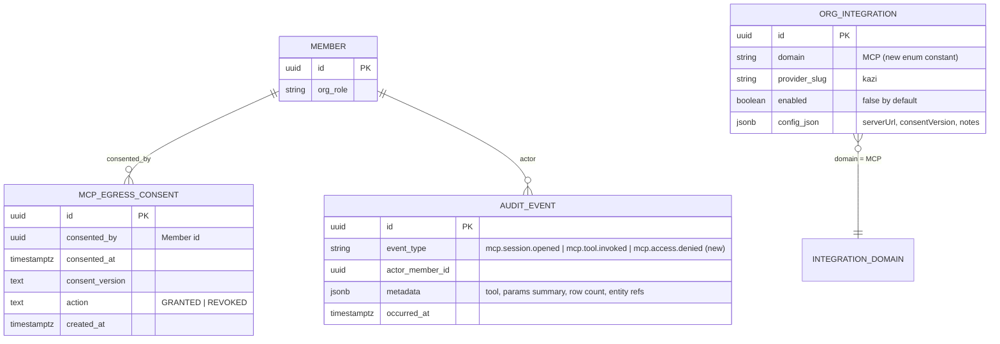
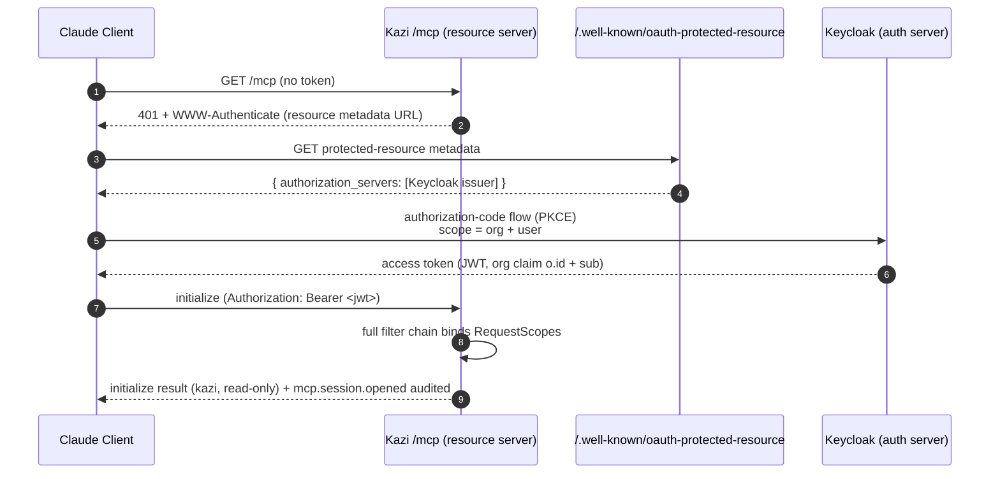
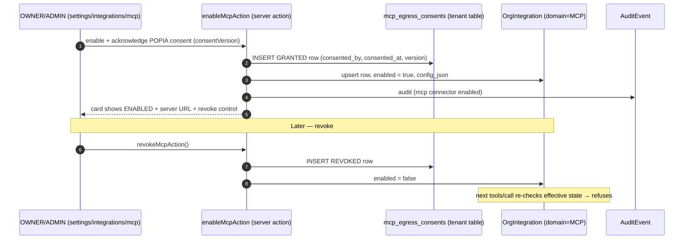

> Merge into ARCHITECTURE.md as **Section 11**.

# 11. Phase 78 — Kazi MCP Server (Read-Only Grounded Context for the Firm's Own Claude)

## 11.1 Overview

Kazi has been **AI-native in-product** since Phase 72/74: the firm's own Anthropic key (BYOAK) powers embedded skills (FICA verification, matter intake, contract review, drafting, compliance audit), each gated behind attorney approval via `AiExecutionGate`. That path is **Kazi calls Claude** — Kazi orchestrates the LLM and bears the token cost on the firm's key.

Phase 78 opens the **second head on the same body: Claude calls Kazi.** A law firm already runs Kazi as its system of record, and its people increasingly work inside Claude (Claude Desktop / Claude Code / claude.ai). Today those worlds are severed — a lawyer asking Claude to summarise a matter, draft a fee-note narrative, or sanity-check a FICA gap must paste context by hand, which is slow, lossy, and a POPIA hazard. Phase 78 ships a **Model Context Protocol (MCP) server** that exposes the firm's own Kazi data to the firm's own Claude, **read-only**, authenticated per-user via Keycloak OAuth and scoped by the member's existing RBAC + project access. Every session and tool call is audited. MCP is per-tenant opt-in behind a recorded POPIA consent, and Kazi makes **zero** outbound LLM calls in this phase — it is a pure data provider; the firm's own Claude subscription pays the token bill.

The design mandate is **"reuse auth — do not fork it."** The MCP endpoint at `/mcp` runs through the *full existing Spring Security filter chain* (JWT validation → `TenantFilter` → `MemberFilter`) so that `RequestScopes.TENANT_ID`, `MEMBER_ID`, `ORG_ROLE` and `CAPABILITIES` are bound exactly as for a normal API request. Consequently `@RequiresCapability`, `ProjectAccessService.requireViewAccess(...)`, and `ActorContext.fromRequestScopes()` work natively, and a member sees via MCP exactly what they would see in the web app — no more, no less. This is the single biggest integration risk and is given its own sequence diagram ([§11.8b](#118-sequence-diagrams)). This phase is **additive, not a pivot**: a firm without the connector loses nothing.

### What's new

| Capability | Existing (Phase 72/74) — *Kazi calls Claude* | New (Phase 78) — *Claude calls Kazi* |
|---|---|---|
| Direction | Outbound: Kazi → Anthropic API | Inbound: Claude client → Kazi `/mcp` |
| Token cost | On firm's BYOAK key, metered by `AiCostService` | **None** — firm's own Claude subscription pays |
| Trigger | In-product skill invocation (attorney clicks) | Member's Claude client issues MCP `tools/call` |
| Auth subject | Member acting in the Kazi web app | Same member, OAuth-authorized Claude client |
| Mutation | Gated writes via `AiExecutionGate` (PENDING → approve) | **Read-only by construction**; writes physically absent from registry |
| Data scope | Skill-specific context Kazi assembles | Member's full RBAC-scoped read surface (matters, clients, time, trust, compliance, docs, invoices, firm profile) |
| Consent | BYOAK key configured | Per-tenant MCP opt-in + recorded POPIA data-egress consent |
| Phase status | Live-verified V0–V12 (2026-06-15) | This phase |

### Out of scope (explicitly NOT built in Phase 78)

- **Any write/mutation tool.** The v1 tool registry contains no mutating operation; a test asserts this. The gated write-back contract is *specified but not built* ([§11.11](#1111-reserved-not-built--v2-gated-write-back-contract)).
- **Outbound LLM calls from Kazi.** No `AiProvider` invocation, no token cost, no `AiExecution` records created by MCP reads.
- **The curated skill pack + Claude-for-Legal bridge** — that is **Phase 79 (Phase C)**. Phase 78 ships the server + a documented connection method only.
- **Local / on-prem stdio MCP transport** — Kazi-hosted remote (Streamable HTTP) only in v1.
- **Client-portal MCP** — firm-staff only; the external client portal (`PortalReadModelService`) is unchanged and is NOT reused ([ADR-302](../adr/ADR-302-mcp-read-scope-model.md)).
- **MCP `prompts` and `sampling` capabilities** — `resources` + `tools` only.
- **Vector search / RAG / embeddings** — tools query structured data via existing services.
- **New analytics or aggregations** — MCP exposes existing reads; it invents nothing.
- **Non-Keycloak auth, API keys, or service accounts** for MCP — OAuth-per-user only.
- **Multi-language tool output** — English only.

---

## 11.2 Domain Model

Phase 78 adds the smallest possible domain surface: **one new capability**, **one new `IntegrationDomain` enum constant** with a per-tenant `OrgIntegration` row, **one new tenant table** for POPIA consent history, and **three new audit event types**. Everything else is reused.

### New capability

`MCP_ACCESS` is added to the existing enum `io.b2mash.b2b.b2bstrawman.orgrole.Capability`. It is the **front-door gate only** — it grants the ability to use the MCP server at all but never widens any per-domain gate. Default roles: OWNER, ADMIN. A member granted `MCP_ACCESS` via a custom role can connect, but each tool still defers to its domain's existing capability or project-access check ([§11.9](#119-permission-model-summary)).

> **Seeding note.** OWNER/ADMIN capability sets are expanded by `OrgRoleService` (the `ALL` pseudo-capability is granted to system roles, whose set is fully expanded). Adding `MCP_ACCESS` to the enum therefore flows to OWNER/ADMIN automatically wherever roles resolve `ALL`. If role-capability mappings are persisted per-tenant (custom roles), a **seeder change** — not a Flyway migration — backfills `MCP_ACCESS` into OWNER/ADMIN role rows. Confirm at `/breakdown` whether the existing role-capability seeding is `ALL`-expanded (no migration needed) or row-materialised (seeder/data backfill needed). No new *global* migration is introduced by the capability addition itself; the enum is a code change.

### IntegrationDomain.MCP + OrgIntegration row ([D4])

Per [D4], add an `MCP` constant to `io.b2mash.b2b.b2bstrawman.integration.IntegrationDomain` and persist a per-tenant `OrgIntegration` row (`domain = MCP`) carrying the enablement flag and connection config in `config_json`. **No `IntegrationAdapter` bean is implemented** — MCP is *inbound read-exposure*, not an outbound port. The `IntegrationAdapter`/`IntegrationRegistry` resolve-an-adapter pattern exists for *outbound* integrations (Xero, SMTP, PSP) and does not fit an inbound surface. The `OrgIntegration` row is used purely as the durable enable/disable flag + config holder, queried directly via `OrgIntegrationRepository.findByDomain(IntegrationDomain.MCP)`.

`config_json` shape (illustrative — versioned, stored as `jsonb`):

```json
{
  "serverUrl": "https://app.kazi.legal/mcp",
  "enabledAt": "2026-06-15T09:12:00Z",
  "consentVersion": "popia-egress-v1",
  "notes": "Connector for firm staff Claude clients"
}
```

The `enabled` boolean on the `OrgIntegration` row is the authoritative on/off switch. Disabled by default (the `OrgIntegration(domain, providerSlug)` constructor sets `enabled = false`). `providerSlug` is `"kazi"` (self-hosted; there is no third-party provider to slug).

### Consent storage — `mcp_egress_consents` (tenant table) ([D2])

POPIA requires an explicit, recorded firm decision before client PII flows into the firm's external AI context. The enablement *flag* lives on the `OrgIntegration` row (above); the **consent history** lives in a dedicated, **append-only** tenant table so that grant/revoke decisions and the consenting member are auditable over time (an `OrgIntegration` config blob cannot represent history).

| Column | Type | Notes |
|---|---|---|
| `id` | `uuid` PK | `GenerationType.UUID` |
| `consented_by` | `uuid` | the `Member` id who granted/revoked (FK by convention; no DB FK across modules, matching house style) |
| `consented_at` | `timestamptz` | when the decision was taken |
| `consent_version` | `text` | the consent-copy version acknowledged, e.g. `popia-egress-v1` |
| `action` | `text` | `GRANTED` \| `REVOKED` |
| `created_at` | `timestamptz` | row insert time (hand-rolled `@PrePersist`) |

Append-only: a revoke inserts a new `REVOKED` row rather than mutating the `GRANTED` row. The *current* consent state is "latest row by `consented_at`, where `action = GRANTED` and no later `REVOKED`". Full SQL in [§11.7](#117-database-migrations).

### New audit event types

Reuse the Phase 6 append-only `AuditEvent` entity (`audit/AuditEvent.java`) — no new audit infrastructure. New event type strings:

- `mcp.session.opened` — emitted on `initialize` handshake (actor, client name/version).
- `mcp.tool.invoked` — emitted on each `tools/call` (tool name, params summary, result row count, entity refs, actor).
- `mcp.access.denied` — emitted when `MCP_ACCESS`, a per-domain capability, or project-access is refused.

### Updated ER diagram



**Unchanged.** No new shared (`global/`) tables. No changes to `Member`, `OrgRole`, `Project`, `Customer`, `Invoice`, `AiFirmProfile`, `AiExecutionGate`, or any read service. The tenant-isolation model is unchanged: pure schema-per-tenant via Hibernate `search_path` from `RequestScopes.TENANT_ID` — **no `@Filter`, no `@FilterDef`, no `tenant_id` column, no RLS**. The new `mcp_egress_consents` entity follows the `AiFirmProfile` convention exactly: no tenant annotation, `@GeneratedValue(strategy = GenerationType.UUID)`, hand-rolled `created_at` via `@PrePersist`, protected no-arg constructor, domain-method construction, no Lombok, no setters.

---

## 11.3 Core Flows & Backend Behaviour

### MCP lifecycle

The MCP server implements the standard JSON-RPC-over-Streamable-HTTP lifecycle at `/mcp`, advertising `resources` and `tools` capabilities only (no `prompts`, no `sampling`):

1. **`initialize`** — capability negotiation. Server advertises name `kazi`, a semantic version, and an instructions string explaining that Kazi is the firm's practice-management system of record and that **all tools are read-only**. Emits `mcp.session.opened` audit event. Succeeds even without `MCP_ACCESS` (so the client can connect), but every subsequent tool returns an authorization error if `MCP_ACCESS` is missing.
2. **`resources/list`** — returns the three stable resources ([§11.4](#114-resources--tools-catalogue)).
3. **`resources/read`** — resolves a `kazi://...` URI to its backing service read.
4. **`tools/list`** — returns the 13 read tools with typed input schemas.
5. **`tools/call`** — executes one tool inside the bound `RequestScopes` context; emits `mcp.tool.invoked`.

### Per-tool gating regimes

Firm-side reads fall into **three** gating regimes (verified against source), NOT a uniform "view" capability. `MCP_ACCESS` is the front door; each tool then inherits its domain's existing regime — MCP never widens access.

| Regime | Mechanism | Applies to |
|---|---|---|
| **Project-access-gated** | `ProjectAccessService.requireViewAccess(projectId, actor)` → 404 (security-by-obscurity) if member not on project; owner/admin see all | matters (get/list), project documents, project activity |
| **Capability-gated (org-wide)** | `@RequiresCapability` / equivalent check on the resolved member's `CAPABILITIES` | invoices + firm-wide unbilled → `INVOICING`; trust → `VIEW_TRUST`; firm audit log → `TEAM_OVERSIGHT`; compliance → `CUSTOMER_MANAGEMENT`; firm AI profile → `AI_MANAGE` ([D1]) |
| **Org-wide, no capability** | any authenticated member with `MCP_ACCESS` | customers (get/list), org/customer-scoped documents |

### ActorContext propagation

Several firm-side reads take an `ActorContext actor` (`ProjectService`, `DocumentService`, `ActivityService`). Because the `/mcp` endpoint runs through the full filter chain (JWT → `TenantFilter` → `MemberFilter`), `MEMBER_ID` and `ORG_ROLE` are bound in `RequestScopes` before any tool executes. Each MCP tool therefore constructs its actor via the **same** call controllers use:

```java
ActorContext actor = ActorContext.fromRequestScopes();  // reads bound MEMBER_ID + ORG_ROLE
```

No anonymous/system actor is ever used. This is why mounting under `/mcp` (JWT path) — and **not** under `/internal/*` (API-key path, where `MemberFilter.shouldNotFilter` excludes the route and leaves `MEMBER_ID`/`ORG_ROLE`/`CAPABILITIES` unbound) — is mandatory ([§11.6](#116-api-surface), [ADR-303](../adr/ADR-303-mcp-authentication.md), [ADR-304](../adr/ADR-304-mcp-tenant-isolation-capability-gating.md)).

### Module-gating caveat (trust)

Every `ClientLedgerService` method calls `moduleGuard.requireModule(MODULE_ID)` first — **trust accounting is module-gated**. For a non-legal tenant (accounting-za, consulting-za) the trust module is disabled, so `get_trust_balance` / `list_trust_transactions` will throw a module-disabled error. MCP tools must **tolerate this gracefully** and return a structured, non-leaking "trust accounting is not enabled for this firm" response rather than a stack trace. The trust tools still appear in `tools/list` (the registry is vertical-agnostic); they simply refuse at call time for tenants without the module.

### Read-only by construction

Read-only is structural, not conventional. The v1 tool registry contains **no** mutating operation — writes are physically absent, not merely discouraged. A registry-assertion test ([§11.12](#1112-implementation-guidance)) iterates the registered tools and fails if any tool delegates to a non-read service method. No `AiProvider` is invoked; no `AiExecution` record is created by any MCP read.

### Service-contract reconciliation callout

> ⚠️ **The requirements file's Section 3.2 table contains several WRONG service signatures.** The catalogue below uses the **verified** signatures from the context inventory (`.arch-context.md` §7), not the requirements' Section 3.2. Implementing engineers: **do not** copy signatures from the requirements doc. The corrections are:
>
> | Requirements doc said | Verified reality |
> |---|---|
> | `CustomerService.listCustomers()` → `List<CustomerResponse>` | Returns raw `Customer` **entities**. `CustomerResponse` is built in `CustomerController` via `CustomerResponse.from(customer, tags, memberNames)` (enriches with tags + resolved member display-names). |
> | `getCustomer(id)` includes linked projects | Linked projects come from a **separate** `CustomerService.listProjectsForCustomer(...)` → `LinkedProjectResponse`, NOT from `getCustomer`. |
> | `ClientLedgerService.getTotalBalance(...)` | Method is **`getTotalTrustBalance(UUID trustAccountId)`** (only `trustAccountId`). Every method is **module-gated** via `moduleGuard.requireModule`. |
> | `UnbilledTimeService.getUnbilledSummary(...)` → single summary | Returns `List<BillingRunDtos.CustomerUnbilledSummary>` (per-customer **period rollup**); args are `(periodFrom, periodTo, currency)`. Per-project = `setupstatus.UnbilledTimeSummaryService.getProjectUnbilledSummary(UUID projectId)`. |
> | `AuditService.findEventsForCustomer` → enriched | Returns `Stream<AuditEvent>` (RAW, not enriched). For enriched per-customer data call `findEventsEnriched(filter, pageable)` with a customer-scoped filter. `AuditService` is an **interface** (impl `DatabaseAuditService`); ordering is **fixed `occurredAt DESC`** (Pageable `Sort` discarded). |
> | `DocumentService...PresignedUrlResult` | Type is **`PresignDownloadResult(String url, long expiresInSeconds)`**. |
> | `ProjectService.getProject` → flat `ProjectResponse` | Returns **`ProjectWithRole(Project project, String projectRole)`** wrapping the **entity**. `ProjectResponse` is a **controller-private** record (`project/ProjectController.java`). |
> | `ClientLedgerService.getClientTransactionHistory(trustAccountId, customerId, Pageable)` | Argument order is reversed: verified is **`getClientTransactionHistory(UUID customerId, UUID trustAccountId, Pageable)`** — `customerId` first. |
>
> **Consequence for the DTO strategy:** because (a) several response records are controller-private, (b) some services return entities, the MCP layer **defines its own thin DTOs** in `mcp/.../dto`, projecting from the service return types. It does NOT reuse controller-private records and does NOT serialise ORM entities.

---

## 11.4 Resources & Tools Catalogue

All return token-efficient JSON: flat named fields, short enums, money as **minor units + currency**, dates as **ISO-8601**, nested collections capped with explicit truncation signalling (`"truncated": true, "total": N`) — never raw ORM graphs. Every tool delegates to an existing firm-side service; MCP adds no new query logic. Package: `mcp/tool/`, `mcp/resource/`, DTOs in `mcp/dto/`.

> **Service-contract reconciliation** applies throughout this section — see the callout at the end of [§11.3](#113-core-flows--backend-behaviour). The FQNs and return types below are the **verified** ones.

### Resources (3)

| Resource URI | Backing read (verified FQN) | MCP DTO shape (projected) | Access gate |
|---|---|---|---|
| `kazi://firm-profile` | `integration.ai.profile.AiFirmProfileService.getOrCreateProfile()` → `AiFirmProfile` entity (no args) | `{ practiceAreas[], jurisdiction, riskCalibration, houseStyleNotes, feeEstimationNotes }` (NOT budget/key/model fields) | **`AI_MANAGE`** ([D1] — gate retained, NOT relaxed) |
| `kazi://matter/{id}` | `project.ProjectService.getProject(UUID id, ActorContext actor)` → `ProjectWithRole(Project, String role)` | `{ id, name, status, customerId, customerName, startDate, dueDate, role }` (projected from `ProjectWithRole.project()` entity) | project-access (`requireViewAccess` → 404) |
| `kazi://client/{id}` | `customer.CustomerService.getCustomer(UUID id)` → `Customer` entity **+** `listProjectsForCustomer(...)` → `LinkedProjectResponse[]` | `{ id, name, type, lifecycleStatus, contacts[], linkedMatters[] }` (projected from entity; linked matters from the separate call) | org-wide (authenticated + `MCP_ACCESS`) |

> [D1] **Firm profile gate retained.** `kazi://firm-profile` keeps its existing `AI_MANAGE` gate. A member with `MCP_ACCESS` but no `AI_MANAGE` gets a clean authorization error **on this resource only** — other resources/tools are unaffected. Rationale and trade-off in [ADR-304](../adr/ADR-304-mcp-tenant-isolation-capability-gating.md).

### Tools (13)

| Tool | Backing service method (verified FQN) | Input schema (typed; required\*) | MCP DTO return shape | Access gate |
|---|---|---|---|---|
| `list_matters` | `project.ProjectService.listProjects(UUID view, String status, LocalDate dueBefore, UUID customerId, Map<String,String> params, ActorContext actor)` → `List<ProjectResponse>` (controller-private record). **Always use this 6-arg filtered overload; pass `null` for unused filters. Do NOT fall back to the `listProjects(ActorContext)` unfiltered overload — it returns a different type (`List<ProjectWithRole>`).** | `view?:uuid, status?:enum, dueBefore?:date, customerId?:uuid, page?:int, size?:int(≤50)` | `{ items: [{id,name,status,customerName,dueDate}], page, size, total, truncated }` | project-access (member → assigned only; owner/admin → all) |
| `get_matter` | `project.ProjectService.getProject(UUID id, ActorContext actor)` → `ProjectWithRole` | `id*:uuid` | `{ id,name,status,customerId,customerName,startDate,dueDate,role }` | project-access (`requireViewAccess` → 404) |
| `list_clients` | `customer.CustomerService.listCustomers()` / `listCustomersByLifecycleStatus(LifecycleStatus)` → `List<Customer>` (entities) | `lifecycleStatus?:enum, page?:int, size?:int(≤50)` | `{ items: [{id,name,type,lifecycleStatus}], page, size, total, truncated }` | org-wide |
| `get_client` | `customer.CustomerService.getCustomer(UUID id)` → `Customer` + `listProjectsForCustomer(...)` → `LinkedProjectResponse[]` | `id*:uuid` | `{ id,name,type,lifecycleStatus,contacts[],linkedMatters:[{id,name,createdAt}] }` | org-wide |
| `get_unbilled_time` | firm-wide: `invoice.UnbilledTimeService.getUnbilledSummary(LocalDate periodFrom, LocalDate periodTo, String currency)` → `List<BillingRunDtos.CustomerUnbilledSummary>`; per-matter: `setupstatus.UnbilledTimeSummaryService.getProjectUnbilledSummary(UUID projectId)` → `UnbilledTimeSummary` | `periodFrom?:date, periodTo?:date, currency?:string, projectId?:uuid` (projectId switches to per-matter path) | `{ items: [{customerId,customerName,amountMinor,currency}], total, truncated }` or `{ projectId, amountMinor, currency, ... }` | `INVOICING` (firm-wide); per-matter also project-access |
| `list_compliance_gaps` | `informationrequest.InformationRequestService.getFicaStatus(UUID customerId)` → `FicaStatusResponse`; item detail via `checklist.ChecklistInstanceService.getInstancesWithItemsForCustomer(UUID customerId)` | `customerId*:uuid` | `{ customerId, ficaStatus, items: [{name,status,required}], truncated }` | `CUSTOMER_MANAGEMENT` |
| `get_trust_balance` | `verticals.legal.trustaccounting.ledger.ClientLedgerService.getClientLedger(UUID customerId, UUID trustAccountId)` → `ClientLedgerCardResponse`; total: `getTotalTrustBalance(UUID trustAccountId)` → `TotalBalanceResponse` | `customerId?:uuid, trustAccountId*:uuid` | `{ trustAccountId, customerId?, balanceMinor, currency }` | `VIEW_TRUST` **+ module-gated** (refuses for non-legal tenants) |
| `list_trust_transactions` | `ClientLedgerService.getClientTransactionHistory(UUID customerId, UUID trustAccountId, Pageable)` → `Page<TrustTransactionResponse>` | `customerId*:uuid, trustAccountId*:uuid, page?:int, size?:int(≤50)` | `{ items: [{date,type,amountMinor,currency,reference}], page, size, total }` | `VIEW_TRUST` **+ module-gated** |
| `list_invoices` | `invoice.InvoiceService.findAll(UUID customerId, InvoiceStatus status, UUID projectId)` → `List<InvoiceResponse>` | `customerId?:uuid, status?:enum, projectId?:uuid, page?:int, size?:int(≤50)` | `{ items: [{id,number,status,totalMinor,currency,dueDate}], page, size, total, truncated }` | `INVOICING` |
| `get_invoice` | `invoice.InvoiceService.findById(UUID invoiceId)` → `InvoiceResponse`; `getPaymentEvents(UUID invoiceId)` → `List<PaymentEventResponse>` | `id*:uuid` | `{ id,number,status,totalMinor,currency,lines:[...],payments:[...],truncated }` | `INVOICING` |
| `search_documents` | project scope: `document.DocumentService.listDocumentResponses(UUID projectId, ActorContext actor)`; org/customer scope: `listDocumentsByScope(String scope, UUID customerId)` → `List<DocumentResponse>` (metadata only) | `projectId?:uuid, scope?:enum(ORG\|CUSTOMER), customerId?:uuid, page?:int, size?:int(≤50)` | `{ items: [{id,name,scope,contentType,sizeBytes,createdAt}], page, size, total, truncated }` (metadata only, no bytes) | project-access (project scope) / org-wide (ORG/CUSTOMER scope) |
| `get_document_url` | `document.DocumentService.getPresignedDownloadUrl(UUID documentId, ActorContext actor)` → `PresignDownloadResult(String url, long expiresInSeconds)` | `documentId*:uuid` | `{ url, expiresInSeconds }` (1-hour presigned S3 URL, never inlined bytes) | project-access (enforced in-service) |
| `get_matter_activity` | `activity.ActivityService.getProjectActivity(UUID projectId, String entityType, Instant since, Pageable, ActorContext actor)` → `Page<ActivityItem>` (calls `requireViewAccess` internally) | `projectId*:uuid, entityType?:string, since?:datetime, page?:int, size?:int(≤50)` | `{ items: [{occurredAt,entityType,action,actor}], page, size, total }` | project-access |
| `get_audit_events` | `audit.AuditService.findEventsEnriched(AuditEventFilter, Pageable)` → `Page<AuditEventMetadataResolver.EnrichedAuditEvent>`; per-customer via the same with a customer-scoped filter (NOT `findEventsForCustomer`, which is a raw `Stream<AuditEvent>`) | `customerId?:uuid, eventType?:string, page?:int, size?:int(≤200)` | `{ items: [{occurredAt,eventType,actor,summary}], page, size, total }` (ordering fixed `occurredAt DESC`) | `TEAM_OVERSIGHT` |

`get_document_url` returns a 1-hour presigned URL — never inlined bytes ([§11.4](#114-resources--tools-catalogue) document tools return metadata + URL only).

---

## 11.5 Per-Tenant Enablement & POPIA Consent

MCP is **disabled by default** and gated behind a recorded POPIA data-egress consent. The control surface is the existing Integrations settings hub, with a new "Claude / MCP Connector" card at `integrations/mcp`.

### Enablement model ([D4])

The enable/disable flag is the `enabled` boolean on the per-tenant `OrgIntegration` row (`domain = MCP`, `providerSlug = "kazi"`). When no row exists, MCP is treated as disabled. Enabling creates/updates the row (`enable()`), persists connection config in `config_json`, and **requires** a successful consent record (below) in the same server action. No `IntegrationAdapter` bean is involved — the row is a flag, not an outbound adapter ([D4]).

### POPIA consent flow ([D2])

Because client PII flows into the firm's external AI context, POPIA requires an explicit, recorded firm decision; the firm is the responsible party. An OWNER/ADMIN must acknowledge the egress consent before any tool returns data. The act of consenting **appends** a `GRANTED` row to `mcp_egress_consents` (`consented_by`, `consented_at`, `consent_version`, `action = GRANTED`). The table is append-only history, so a later policy change (new `consent_version`) or revoke is a new row — the audit trail of "who agreed to what, when" is preserved.

**Effective state** is the conjunction of:
1. `OrgIntegration(domain=MCP).enabled == true`, **and**
2. The latest `mcp_egress_consents` row (by `consented_at`) has `action = GRANTED` (no later `REVOKED`).

If either is false, the server refuses tool calls with a **non-leaking** error — it does not disclose tenant data, member existence, or whether a matter exists; it returns a generic "the MCP connector is not enabled for this firm" message. `initialize` may still succeed (so a misconfigured client gets a clear, actionable message rather than a cryptic transport failure), but `tools/call` refuses.

### Revoke control

The settings card exposes a "Revoke / disable" control. Revoking (a) sets `OrgIntegration.enabled = false` and (b) appends a `REVOKED` row to `mcp_egress_consents`. Existing OAuth tokens held by Claude clients become inert immediately — every `tools/call` re-checks effective state per request, so revoke takes effect on the next call without waiting for token expiry.

### Settings card content

The card surfaces: enablement toggle (with the consent acknowledgement modal), the MCP **server URL**, copy-paste instructions for adding the connector to Claude Desktop/Code, the current consent version + who consented + when, and the revoke control. Connection mechanics and distribution are server-side documentation only ([§11.1](#111-overview) out-of-scope: the curated skill pack is Phase 79).

---

## 11.6 API Surface

### The `/mcp` endpoint

- **Path:** `/mcp` (Streamable HTTP). It runs through the **full** Spring Security filter chain so the bearer token lands in `RequestScopes` before any tool executes ([§11.8b](#118-sequence-diagrams)). It is **NOT** mounted under `/internal/*` (API-key path) — that would leave `MEMBER_ID`/`ORG_ROLE`/`CAPABILITIES` unbound because `MemberFilter.shouldNotFilter` excludes `/internal/*`, `/actuator/*`, `/portal/*`.
- **Transport/SDK:** Spring AI 2.0 milestone starter `org.springframework.ai:spring-ai-starter-mcp-server-webmvc` with `spring.ai.mcp.server.protocol=STREAMABLE` ([D3], [ADR-300](../adr/ADR-300-mcp-transport-and-sdk.md)). Spring AI 2.0 is the Boot-4-aligned line (GA 1.0.x targets Boot 3.x). **Milestone-maturity risk is explicit:** if the milestone starter proves not Boot-4-ready, the documented fallback is a **hand-rolled JSON-RPC-over-Streamable-HTTP endpoint** reusing the same filter chain and tool registry — fallback only, never primary.
- **JSON-RPC methods:** `initialize`, `resources/list`, `resources/read`, `tools/list`, `tools/call`. `prompts/*` and `sampling/*` are NOT advertised.

### Protected-resource metadata (OAuth discovery)

The MCP server is an OAuth 2.1 protected resource. It publishes the **protected-resource metadata** document (`/.well-known/oauth-protected-resource`) pointing the Claude client at the Keycloak authorization server so the client can run the authorization-code flow and obtain a token bound to the firm (org) + user ([ADR-303](../adr/ADR-303-mcp-authentication.md)). Token validation reuses the existing Keycloak JWT validation (`ClerkJwtAuthenticationConverter`).

### `initialize` request/response (illustrative)

> The `protocolVersion` string below is illustrative only — the actual negotiated version is determined by the Spring AI MCP SDK ([ADR-300](../adr/ADR-300-mcp-transport-and-sdk.md)) and the connecting client. Do **not** hard-code `2025-06-18`; let the SDK supply it.

```json
// → request
{ "jsonrpc": "2.0", "id": 1, "method": "initialize",
  "params": { "protocolVersion": "2025-06-18",
    "capabilities": {}, "clientInfo": { "name": "Claude Desktop", "version": "1.x" } } }

// ← response
{ "jsonrpc": "2.0", "id": 1, "result": {
    "protocolVersion": "2025-06-18",
    "capabilities": { "resources": {}, "tools": {} },
    "serverInfo": { "name": "kazi", "version": "1.0.0" },
    "instructions": "Kazi is this firm's practice-management system of record. All tools are READ-ONLY; use them to ground your answers in live matter, client, time, trust, compliance, document and invoice data." } }
```

### `tools/call` example (`get_matter`)

```json
// → request
{ "jsonrpc": "2.0", "id": 7, "method": "tools/call",
  "params": { "name": "get_matter",
    "arguments": { "id": "9f1c…-matter-uuid" } } }

// ← success (member has project access)
{ "jsonrpc": "2.0", "id": 7, "result": {
    "content": [ { "type": "text", "text": "{\"id\":\"9f1c…\",\"name\":\"Smith v Jones\",\"status\":\"ACTIVE\",\"customerId\":\"…\",\"customerName\":\"Smith Holdings\",\"dueDate\":\"2026-08-01\",\"role\":\"LEAD\"}" } ],
    "isError": false } }

// ← auth-denied (member not on project → requireViewAccess 404, surfaced as a tool error)
{ "jsonrpc": "2.0", "id": 7, "result": {
    "content": [ { "type": "text", "text": "{\"error\":\"not_found\",\"message\":\"Matter not found or you do not have access.\"}" } ],
    "isError": true } }
```

Auth/access failures are returned as **tool-level errors** (`isError: true`) with non-leaking messages, not protocol errors — and a `mcp.access.denied` audit event is emitted ([§11.10](#1110-audit--observability)).

### Settings server actions (frontend)

Under `frontend/app/(app)/org/[slug]/settings/integrations/mcp/actions.ts`:

- `enableMcpAction(consentVersion)` — appends `GRANTED` consent row + enables the `OrgIntegration` row (atomic; consent first).
- `revokeMcpAction()` — appends `REVOKED` consent row + disables the row.
- `getMcpStatusAction()` — returns effective state + current consent metadata for the card.

---

## 11.7 Database Migrations

Exactly **one** Flyway tenant migration: `V129` ([D2], next free tenant number per inventory §3). The `IntegrationDomain.MCP` enum constant is a **code change, not a migration** — the `org_integrations.domain` column is already `varchar(30)` and stores the enum name as a string. The `MCP_ACCESS` capability is likewise a code change (enum addition); any role-capability backfill is a **seeder** change, not a migration ([§11.2](#112-domain-model)).

`backend/src/main/resources/db/migration/tenant/V129__create_mcp_egress_consents.sql`:

```sql
-- V129: POPIA data-egress consent history for the MCP connector (Phase 78).
-- Append-only: GRANTED / REVOKED rows form the audit trail of firm consent decisions.
-- Tenant-scoped: runs per-schema at provisioning AND at startup. Idempotent.
CREATE TABLE IF NOT EXISTS mcp_egress_consents (
    id              uuid         PRIMARY KEY,
    consented_by    uuid         NOT NULL,             -- Member id (no cross-module FK, house style)
    consented_at    timestamptz  NOT NULL,
    consent_version text         NOT NULL,             -- e.g. 'popia-egress-v1'
    action          text         NOT NULL CHECK (action IN ('GRANTED', 'REVOKED')),
    created_at      timestamptz  NOT NULL DEFAULT now()
);

-- Latest-decision lookup ("current consent state" = newest row by consented_at).
CREATE INDEX IF NOT EXISTS idx_mcp_egress_consents_consented_at
    ON mcp_egress_consents (consented_at DESC);

-- Per-member consent history (who consented, audit/POPIA reporting).
CREATE INDEX IF NOT EXISTS idx_mcp_egress_consents_member
    ON mcp_egress_consents (consented_by, consented_at DESC);
```

**Rationale.**
- `idx_mcp_egress_consents_consented_at (DESC)` — the hot path is "what is the latest consent decision for this tenant?" (checked on every `tools/call` to compute effective state). A descending index on `consented_at` makes that an index-first lookup.
- `idx_mcp_egress_consents_member` — supports POPIA reporting ("which member consented and when") without a full scan.
- **Inline `CHECK` on `action`** — defends the two-value domain at the database, matching house style for enumerated string columns. Declared inline in `CREATE TABLE` (not a separate `ALTER TABLE ADD CONSTRAINT`) so the whole migration is **idempotent by construction** — a separate `ADD CONSTRAINT` is not natively idempotent in Postgres and would fail on a re-run against an already-created table.
- **No FK to `members`** — consistent with the codebase convention of no cross-module DB foreign keys (referential integrity is enforced in the service layer; isolation is by schema).

> **Idempotency / per-schema note.** `CREATE TABLE IF NOT EXISTS` + the inline `CHECK` + `CREATE INDEX IF NOT EXISTS` make the migration safe to re-run by construction. Tenant migrations run per-schema both at provisioning and at startup; a given `V129` runs once per tenant schema via Flyway's per-schema history.

---

## 11.8 Sequence Diagrams

### 11.8a — OAuth authorization-code flow (Claude client → Keycloak → `/mcp`)



### 11.8b — `tools/call` through the filter chain (the linchpin) with AUTH-DENIED branch

```mermaid
sequenceDiagram
    autonumber
    participant C as Claude Client
    participant BTF as BearerTokenAuthFilter +<br/>ClerkJwtAuthenticationConverter
    participant TF as TenantFilter
    participant MF as MemberFilter
    participant T as MCP Tool (mcp/tool)
    participant PAS as ProjectAccessService /<br/>@RequiresCapability
    participant S as Firm-side Service
    participant DTO as MCP DTO (mcp/dto)

    C->>BTF: tools/call (Bearer JWT)
    BTF->>BTF: validate JWT (identity only)
    BTF->>TF: authenticated request
    TF->>TF: bind RequestScopes.TENANT_ID + ORG_ID (from o.id)
    TF->>MF: 
    MF->>MF: resolveCapabilities(memberId)<br/>bind MEMBER_ID, ORG_ROLE, CAPABILITIES (line 80)
    MF->>T: runScoped(...) → tool executes inside ScopedValue context
    T->>T: actor = ActorContext.fromRequestScopes()
    alt MCP_ACCESS missing (front door)
        T-->>C: { isError:true, "not_authorized" }
        Note over T: short-circuit — PAS / domain gate NOT called; emit mcp.access.denied
    else MCP_ACCESS present but per-domain gate fails
        T->>PAS: requireViewAccess / capability check
        PAS-->>T: AccessDenied / 404
        T-->>C: { isError:true, "not_found / not_authorized" }
        Note over T: emit mcp.access.denied (non-leaking)
    else authorized
        T->>PAS: requireViewAccess(projectId, actor) (project-scoped tools)
        PAS-->>T: ProjectAccess OK
        T->>S: read (entity / Page / List)
        S-->>T: service return type
        T->>DTO: project to thin MCP DTO (cap nested, page-slice)
        DTO-->>C: { isError:false, content:[json] }
        Note over T: emit mcp.tool.invoked (tool, params summary, row count)
    end
```

### 11.8c — Enablement + POPIA consent (settings UI → server action)



---

## 11.9 Permission Model Summary

`MCP_ACCESS` is the **front door**: without it, `initialize` may succeed but every tool/resource returns an authorization error. With it, each tool/resource defers to its domain's **existing** gate — MCP never widens access.

### Resources

| Resource | Front door | Domain gate |
|---|---|---|
| `kazi://firm-profile` | `MCP_ACCESS` | **`AI_MANAGE`** ([D1] — retained; clean auth error for `MCP_ACCESS`-only members, **this resource only**) |
| `kazi://matter/{id}` | `MCP_ACCESS` | project-access (`requireViewAccess` → 404) |
| `kazi://client/{id}` | `MCP_ACCESS` | org-wide (authenticated member) |

### Tools

| Tool(s) | Front door | Domain gate |
|---|---|---|
| `list_matters`, `get_matter`, `get_matter_activity` | `MCP_ACCESS` | project-access |
| `search_documents` (project scope), `get_document_url` | `MCP_ACCESS` | project-access |
| `list_clients`, `get_client`, `search_documents` (ORG/CUSTOMER scope) | `MCP_ACCESS` | org-wide |
| `list_invoices`, `get_invoice`, `get_unbilled_time` | `MCP_ACCESS` | `INVOICING` |
| `get_trust_balance`, `list_trust_transactions` | `MCP_ACCESS` | `VIEW_TRUST` **+ trust module enabled** |
| `list_compliance_gaps` | `MCP_ACCESS` | `CUSTOMER_MANAGEMENT` |
| `get_audit_events` | `MCP_ACCESS` | `TEAM_OVERSIGHT` |

A member with `MCP_ACCESS` but no `VIEW_TRUST` sees matters but not trust data; a member not assigned to a matter gets a 404 for it. This is **identical** to the web app — the same `ProjectAccessService` and capability checks fire. Cross-tenant reads are impossible by construction (tenant schema is resolved from the token's `o.id` claim by `TenantFilter`; there is no tenant-id parameter any tool can override). See [ADR-304](../adr/ADR-304-mcp-tenant-isolation-capability-gating.md).

---

## 11.10 Audit & Observability

Reuse the Phase 6 append-only `AuditEvent` — no new audit infrastructure. Three new event types:

| Event type | Emitted on | Metadata captured |
|---|---|---|
| `mcp.session.opened` | `initialize` handshake | actor (member id), client name + version |
| `mcp.tool.invoked` | every `tools/call` | tool name, **params summary** (sanitised — ids/enums, not free-text PII), **result row count**, **entity refs** (e.g. matter/customer/invoice ids touched), actor |
| `mcp.access.denied` | `MCP_ACCESS`, per-domain capability, or project-access refusal | tool name, denied gate, actor |

This gives the firm a **POPIA-defensible record** of which user pulled which client data into AI, and when — the property the whole strategy depends on. Audit attribution is correct because the actor is the real member resolved by `MemberFilter`, not a system/service account.

**Metrics.** Per-tenant MCP call counts and latency via the existing observability hooks. **No PII in metric labels** — labels carry tenant schema, tool name, and outcome (`ok`/`denied`/`error`), never member names, client names, or entity ids.

---

## 11.11 Reserved (NOT built) — v2 Gated Write-Back Contract

To avoid reinventing safety machinery later, the architecture **specifies but does not implement** the write-back path. Phase 78 ships none of this; the design simply must not foreclose it.

- A future `propose_*` tool (e.g. `propose_kyc_complete`, `propose_fee_note`) does **NOT** mutate domain state. It creates an `AiExecutionGate` in **PENDING** status exactly as the in-product Phase 72 skills do.
- Approval happens **inside Kazi** (existing `AiExecutionGateController` + Reviews UI), **never** inside the Claude client. The attorney remains the committing actor.
- The audit trail records "AI-suggested (via MCP) → attorney-approved" with actor + timestamp.
- This is non-foreclosed because: (a) the MCP **tool registry is extensible** (adding a tool is a registration, not a re-architecture); (b) `AiExecutionGate` creation is already a solved server-side capability; (c) `MCP_ACCESS` + per-domain capabilities already provide the gating substrate; and (d) the read-only registry-assertion test would be updated to allow a clearly-namespaced `propose_*` family that provably creates gates rather than mutating state.

---

## 11.12 Implementation Guidance

### Backend changes

| File / area | Change |
|---|---|
| `backend/pom.xml` | Add Spring AI 2.0 milestone BOM + `spring-ai-starter-mcp-server-webmvc`; set `spring.ai.mcp.server.protocol=STREAMABLE` ([D3]). Verify Boot-4 alignment; fallback = hand-rolled endpoint. |
| `orgrole/Capability.java` | Add `MCP_ACCESS` enum constant. |
| `seeder/...` | Backfill `MCP_ACCESS` into OWNER/ADMIN role definitions if role-capability mappings are row-materialised (no-op if `ALL`-expanded). |
| `integration/IntegrationDomain.java` | Add `MCP("kazi")` constant ([D4]) — `providerSlug` `"kazi"` is authoritative (self-hosted; §11.2). No `IntegrationAdapter` bean. |
| `mcp/McpServerConfig.java` | MCP server identity (`kazi`, version, read-only instructions), capability advertisement (`resources`, `tools` only), Spring Security wiring so `/mcp` runs the full filter chain. |
| `mcp/resource/` | 3 resource handlers (`firm-profile`, `matter`, `client`) delegating to verified services. |
| `mcp/tool/` | 13 read tools delegating to verified services; per-tool gate enforcement; pagination normalisation. |
| `mcp/dto/` | Thin token-efficient DTOs projecting from service return types (entities / controller-private records / Page / List). |
| `mcp/consent/McpEgressConsent.java` (entity) + repository + `McpConsentService` | Append-only consent (AiFirmProfile pattern). |
| `mcp/McpEnablementService.java` | Effective-state check (OrgIntegration.enabled AND latest consent GRANTED). |
| `audit/...` | Emit `mcp.session.opened` / `mcp.tool.invoked` / `mcp.access.denied`. |
| `db/migration/tenant/V129__create_mcp_egress_consents.sql` | The consent table ([§11.7](#117-database-migrations)). |

### Frontend changes

| File | Change |
|---|---|
| `frontend/app/(app)/org/[slug]/settings/integrations/mcp/page.tsx` | "Claude / MCP Connector" card: status, server URL, connection instructions, consent metadata, revoke control. |
| `frontend/app/(app)/org/[slug]/settings/integrations/mcp/actions.ts` | `enableMcpAction`, `revokeMcpAction`, `getMcpStatusAction` server actions. |
| `frontend/app/(app)/org/[slug]/settings/integrations/page.tsx` | Link/surface the new MCP card on the integrations hub. |

### MCP tool registration pattern (conceptual — annotated)

```java
// mcp/tool/MatterTools.java — CONCEPTUAL pattern, not final code.
// Spring AI exposes @Tool-annotated methods; the server auto-registers them as MCP tools.
@Component
class MatterTools {

  private final ProjectService projectService;   // existing firm-side service — no new query logic

  @Tool(name = "get_matter",
        description = "Read one matter (status, customer, dates, your role). Read-only.")
  McpMatterDto getMatter(@ToolParam(description = "matter id") UUID id) {
    // Runs inside the bound RequestScopes context (full filter chain → MEMBER_ID/ORG_ROLE bound).
    ActorContext actor = ActorContext.fromRequestScopes();        // same call controllers use
    ProjectWithRole pwr = projectService.getProject(id, actor);   // requireViewAccess → 404 if no access
    auditService.record("mcp.tool.invoked", /* tool, params summary, row count, entity refs */);
    return McpMatterDto.from(pwr);                                // project to thin MCP DTO
  }
}
```

### MCP DTO pattern (conceptual)

```java
// mcp/dto/McpMatterDto.java — flat, token-efficient, projects from ProjectWithRole (entity wrapper).
record McpMatterDto(UUID id, String name, String status, UUID customerId,
                    String customerName, LocalDate startDate, LocalDate dueDate, String role) {
  static McpMatterDto from(ProjectWithRole pwr) {
    Project p = pwr.project();                       // unwrap entity; never serialise the entity directly
    return new McpMatterDto(p.getId(), p.getName(), p.getStatus().name(),
        p.getCustomerId(), /* resolved name */ null, p.getStartDate(), p.getDueDate(), pwr.projectRole());
  }
}
// List DTOs add { items, page, size, total, truncated } and slice unbounded service results at the MCP layer.
```

### Testing strategy

> **No live Claude in CI.** Integration tests drive the `/mcp` endpoint directly (in-process MockMvc / WebTestClient against the JSON-RPC methods). A **manual QA step** connects a real Claude Desktop against a dev tenant before release.

| Test | What it asserts |
|---|---|
| Protocol handshake | `initialize` negotiates `resources` + `tools` only; advertises `kazi` + read-only instructions. |
| Auth enforcement | No/invalid token → 401 + resource-metadata hint; `MCP_ACCESS`-less member → tool returns authorization error; `mcp.access.denied` emitted. |
| Capability gating | `MCP_ACCESS` member without `VIEW_TRUST` sees matters but trust tools deny; without `AI_MANAGE` the firm-profile resource denies ([D1]); `INVOICING`/`CUSTOMER_MANAGEMENT`/`TEAM_OVERSIGHT` enforced per their tools. |
| Tenant isolation | Token bound to tenant A cannot read tenant B data; cross-tenant impossible by construction (no tenant param exists to override). |
| Pagination cap | List tools enforce hard server max (50 / audit 200); unbounded service results are sliced; `truncated`/`total` surfaced; oversized call → "narrow your query" error. |
| Read-only registry assertion | Iterate registered tools; fail if any delegates to a non-read service method. |
| Audit emission | `mcp.session.opened` on initialize; `mcp.tool.invoked` (with row count + entity refs) on call; `mcp.access.denied` on refusal. |
| Module-gating tolerance | Non-legal tenant calling `get_trust_balance` gets a clean module-disabled response, not a stack trace. |
| Enablement/consent | Disabled tenant (or revoked consent) → non-leaking refusal at `tools/call`; revoke takes effect on next call. |

---

## 11.13 Capability Slices

Five independently deployable slices for `/breakdown`. Each is shippable on its own and gated by the merge bar (`./mvnw verify` clean + frontend `lint && build && test`).

### S1 — MCP runtime + transport + auth skeleton
- **Scope:** Spring AI MCP server starter wired in-process at `/mcp`; full filter-chain integration so the bearer token binds `RequestScopes` before tools run; `MCP_ACCESS` capability added + seeded; protected-resource metadata endpoint; `initialize`/`tools/list`/`resources/list` handshake with an empty (or one trivial) registry; `mcp.session.opened` audit.
- **Deliverables:** `pom.xml` deps, `mcp/McpServerConfig`, capability enum + seeder, OAuth discovery, handshake.
- **Deps:** none.
- **Test expectations:** protocol handshake test; auth-enforcement test (401 + metadata hint, `MCP_ACCESS` front door); audit emission for session-open. **No tools yet** — proves the auth linchpin in isolation (the biggest risk, derisked first).

### S2 — Read catalogue batch 1 (project-access + org-wide)
- **Scope:** `list_matters`, `get_matter`, `list_clients`, `get_client`, `search_documents`, `get_document_url`, `get_matter_activity`; `kazi://matter/{id}`, `kazi://client/{id}` resources. MCP DTOs in `mcp/dto/`; pagination normalisation; `ActorContext.fromRequestScopes()` propagation; `mcp.tool.invoked` audit.
- **Deps:** S1.
- **Test expectations:** project-access gating (404 for non-members), org-wide access, pagination cap, presigned-URL (no inlined bytes), audit emission.

### S3 — Read catalogue batch 2 (capability-gated)
- **Scope:** `get_trust_balance`, `list_trust_transactions`, `list_invoices`, `get_invoice`, `get_unbilled_time`, `list_compliance_gaps`, `get_audit_events`; `kazi://firm-profile` resource ([D1] `AI_MANAGE` gate).
- **Deps:** S1 (S2 recommended for shared DTO/pagination utilities).
- **Test expectations:** `INVOICING`/`VIEW_TRUST`/`CUSTOMER_MANAGEMENT`/`TEAM_OVERSIGHT`/`AI_MANAGE` gating; **trust module-gating tolerance** for non-legal tenants; audit fixed `occurredAt DESC` ordering honoured.

### S4 — Enablement + POPIA consent + settings UI
- **Scope:** `IntegrationDomain.MCP` constant + `OrgIntegration` row; `V129` consent migration + entity/repo/service; effective-state gate on every `tools/call`; non-leaking refusal when disabled; settings card at `integrations/mcp` (enable/consent/revoke server actions); connection instructions.
- **Deps:** S1 (gate hooks into the tool path; can land after S2/S3 are mergeable).
- **Test expectations:** disabled/revoked tenant → non-leaking refusal; consent append-only history; revoke effective on next call; enablement/consent test.

### S5 — Audit/observability + isolation/read-only hardening
- **Scope:** finalise `mcp.*` metadata (params summary sanitisation, row counts, entity refs); per-tenant metrics (no PII labels); the **tenant-isolation** test (cross-tenant impossible), **read-only registry-assertion** test, **pagination-cap** test as a dedicated hardening pass; manual QA step (real Claude Desktop against a dev tenant).
- **Deps:** S1–S4.
- **Test expectations:** isolation, read-only registry, pagination cap, audit completeness; documented manual-QA evidence.

---

## 11.14 ADR Index

| ADR | Title | Decision summary |
|---|---|---|
| [ADR-300](../adr/ADR-300-mcp-transport-and-sdk.md) | MCP transport & SDK | Spring AI 2.0 milestone `spring-ai-starter-mcp-server-webmvc`, `protocol=STREAMABLE`, Streamable HTTP at `/mcp`. Boot-4-aligned line; milestone-maturity risk noted; hand-rolled JSON-RPC-over-Streamable-HTTP as **fallback only**. Not stdio, not hand-rolled-primary. ([D3]) |
| [ADR-301](../adr/ADR-301-mcp-deployment-topology.md) | Deployment topology | MCP in-process in `backend` behind `/mcp` (reuses filters + service layer); separate module deferred. Gateway-vs-direct routing, TLS, public-endpoint considerations. |
| [ADR-302](../adr/ADR-302-mcp-read-scope-model.md) | Read-scope model | Firm-side RBAC-scoped reads via the service layer; **NOT** `PortalReadModelService` (customer-scoped → would wrongly restrict a firm member to one client). Portal `Portal*View` projections are a *shape* reference only. Project-access enforced per tool. |
| [ADR-303](../adr/ADR-303-mcp-authentication.md) | MCP authentication | OAuth 2.1 resource server reusing Keycloak + `TenantFilter`/`MemberFilter`; protected-resource metadata discovery; token scoped to org (`o.id`) + user (`sub`); `/mcp` on the JWT path, never `/internal/*`. |
| [ADR-304](../adr/ADR-304-mcp-tenant-isolation-capability-gating.md) | Tenant isolation & capability gating | Structural cross-tenant impossibility (schema-from-token); `MCP_ACCESS` front door + per-domain gates; **firm-profile retains `AI_MANAGE`** ([D1], not relaxed); isolation/read-only test strategy. |
| [ADR-305](../adr/ADR-305-mcp-popia-consent-audit.md) | POPIA data-egress consent, per-tenant enablement & MCP audit | Per-tenant opt-in via `OrgIntegration(domain=MCP)` enable flag ([D4], no `IntegrationAdapter`); dedicated append-only `mcp_egress_consents` table ([D2]); `mcp.*` audit events; responsible-party position. |
| [ADR-306](../adr/ADR-306-mcp-tool-contract-design.md) | Tool/resource contract design | Resources vs tools; flat token-efficient DTOs (money minor-units + currency, ISO-8601, explicit truncation); pagination/size caps; schema versioning (breaking change = new tool name); reserved write-back extension point. |

**Referenced existing ADRs:** [ADR-T008](../adr/ADR-T008-tenant-scoped-runner.md) (request-scope binding — `RequestScopes.runForTenantWithMember`, the sanctioned scope API); the Phase 72 AI-core ADRs (`AiFirmProfile`, `AiExecutionGate`, `AiCostService`) reused as the grounding-resource and reserved write-back substrate; [ADR-292](../adr/ADR-292-ai-generated-document-provenance.md) (AI provenance) as a related audit-of-AI-actions precedent.
