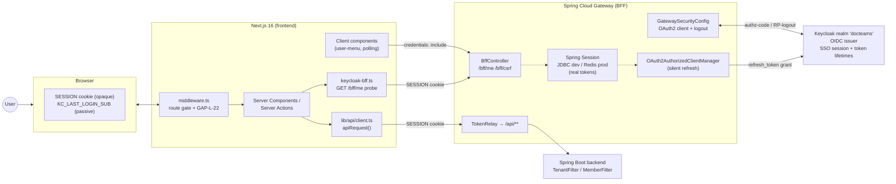
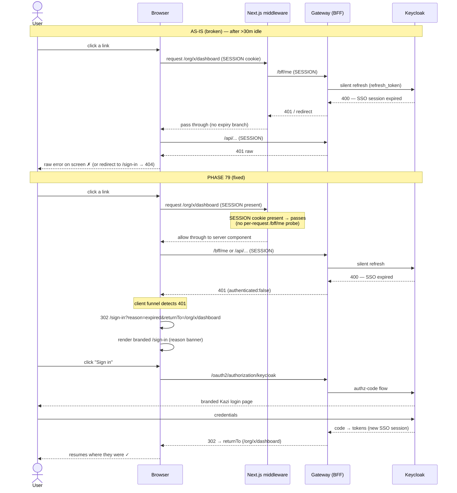
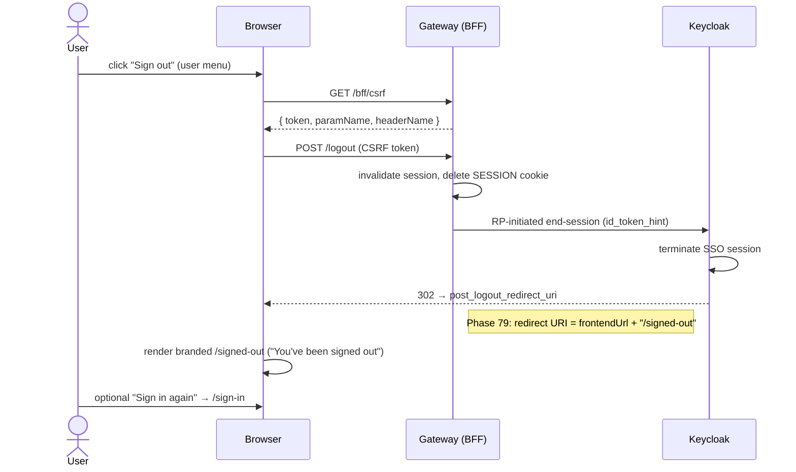
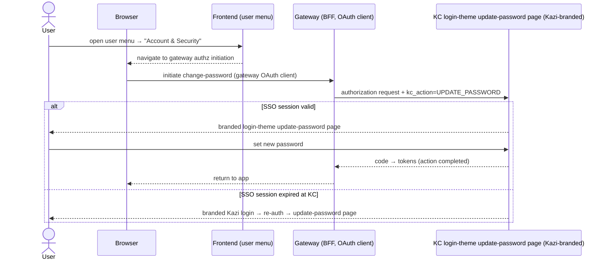

> Merge into ARCHITECTURE.md as **Section 11**.

## 11. Phase 79 — Session Lifecycle & Auth Experience Hardening

### 11.1 Overview

Phase 79 is a **pure platform-hardening** phase. It introduces **no new domain entities, no new database tables, and no Flyway migrations**. The entire surface area is configuration (Keycloak realm, gateway session/security), frontend auth glue (the API client, middleware, the BFF probe, the user menu), a small set of new branded first-party routes, and the existing Keycloak (Keycloakify) theme. It hardens the *edges* of the existing BFF (backend-for-frontend) OIDC architecture — edges that today surface as real user-facing defects.

The root cause that motivates the phase is a **lifetime mismatch** in the BFF model. The gateway holds the real OAuth2 tokens server-side in Spring Session (8h timeout, `gateway/src/main/resources/application.yml:26`), while the Keycloak realm has **zero** explicit token/SSO lifespan settings (`compose/keycloak/realm-export.json` — no `accessTokenLifespan`/`ssoSessionIdleTimeout`/`ssoSessionMaxLifespan`), so Keycloak runs at server defaults (~5m access, ~30m idle, ~10h max). After a period of inactivity, Keycloak kills the SSO session while the gateway still believes its session is live; the silent refresh via `OAuth2AuthorizedClientManager` fails, and because expired-session handling is incomplete, **raw errors leak to the UI** ("clicking anything leads to errors"). Compounding this, the dangling `/sign-in` redirect target — referenced in `client.ts` and middleware but never rendered as a route — turns an expired 401 into a **404**.

Phase 79 closes these edges so that sessions expire predictably and recover gracefully (never a raw error on click), logout and expiry land on **branded** first-party pages (killing the whitelabel leak), users can change their own password from inside the app via Keycloak's `kc_action=UPDATE_PASSWORD` (rendered by the branded login theme), and the Keycloak theme is rebranded **Kazi** and covers every page (login, email, error, info, logout). Because this is a fork-friendly foundation phase, every vertical fork (legal, accounting) inherits these auth guarantees for free.

**What's new (current → new behaviour):**

| Area | Current behaviour | New behaviour |
|---|---|---|
| Session lifetimes | KC defaults (implicit ~5m / ~30m / ~10h); gateway session 8h — can drift out of alignment | Explicit realm lifetimes: access **5m**, SSO idle **30m**, SSO max **10h**; gateway session aligned to **10h** (SSO max). Env-overridable. |
| Expired-session UX | Only server-action 401s caught (`client.ts:164-166`); client fetches / polling / `/bff/me` probe leak raw errors | **Single expiry funnel**: every fetch entry-point + middleware + `/bff/me` probe detects expiry, clears state, redirects to branded re-login carrying a validated return-to |
| `/sign-in` route | **Does not exist** — redirect target → 404 | New branded `/sign-in` route: initiates Keycloak login, renders a reason banner (expired vs first-time), honours return-to |
| Logout landing | Lands on frontend root `/`, unstyled (`GatewaySecurityConfig.java:108`, `realm-export.json:63`) | Lands on branded `/signed-out` confirmation page with a "Sign in again" CTA |
| Change password | Does not exist anywhere in-app | "Account & Security" menu item initiates Keycloak's `kc_action=UPDATE_PASSWORD`, rendered by the already-branded login theme, returning to the app |
| Keycloak theme | `docteams`-branded; login + email themed, but error/info/logout pages leak stock/whitelabel | Visible-brand rebranded **Kazi**; every page (login, email, **error.ftl**, **info.ftl**, logout) covered. Realm id / theme identifier deliberately unchanged. |

**Out of scope (explicit):** idle-warning countdown modal; keep-alive / auto-refresh while the tab is active; native in-app change-password form; MFA / passkeys / TOTP enrolment UI; app-wide dark-mode / design-token audit; renaming the Keycloak realm id or theme directory; portal magic-link auth rework; any new domain entity, table, or business feature.

---

### 11.2 Current Auth Architecture (as-is)

*(This subsection replaces the usual domain-model section — Phase 79 has no domain model.)*

Kazi authenticates the firm-facing app with a **BFF (backend-for-frontend) OIDC pattern**. The browser never holds an OAuth token. Instead:

- The **Spring Cloud Gateway** is the OAuth2 client. On login it runs the authorization-code flow against Keycloak and stores the resulting tokens **server-side** in Spring Session — `store-type: jdbc` (table `SPRING_SESSION` / `SPRING_SESSION_ATTRIBUTES`) in dev, **Redis** in production (`application-production.yml:1-11`).
- The browser carries only an **opaque `SESSION` cookie** (HttpOnly, `secure:false` dev / `true` prod, SameSite=Lax — `application.yml:4-9`).
- **Token refresh is automatic and transparent** via Spring Security's `OAuth2AuthorizedClientManager`. When the access token is near expiry, the manager uses the stored refresh token to obtain a new one — *provided Keycloak still considers the SSO session valid*. This is precisely the link that breaks under the lifetime mismatch.
- Data calls flow through the gateway's **`TokenRelay`** filter on `/api/**` (`GatewaySecurityConfig.java:52`, `application.yml:46-53`), which injects the current access token toward the backend (`TenantFilter`/`MemberFilter` downstream).
- The frontend reads identity via **`GET /bff/me`** (`BffController.java:72-92`), returning `{ authenticated, userId, email, name, picture, orgId, orgSlug, groups }`. Unauthenticated returns an all-null `BffUserInfo.unauthenticated()`.
- **Exception handling**: `/api/**` unauthenticated requests get an `HttpStatusEntryPoint(401)` (`GatewaySecurityConfig.java:78-82`) — a JSON-ish 401, not a redirect. Non-`/api` unauthenticated requests fall to the default oauth2 entry point → redirect to Keycloak.
- **Session fixation**: the chain uses `sessionFixation().changeSessionId()` (`GatewaySecurityConfig.java:83-87`) — the session id rotates on authentication.
- **GAP-L-22 passive signal**: on login success the gateway sets a short-lived (`maxAge=120s`), HttpOnly `KC_LAST_LOGIN_SUB` cookie carrying the OIDC subject (`GatewaySecurityConfig.java:116-152`). It is a **passive signal only** — it never invalidates a session. The Next.js middleware reads it and cross-checks it against the live `/bff/me` subject (`middleware.ts:74-143`) to catch a *stale handoff* (user A's `SESSION` cookie now resolving to user B). It does **not** cover generic expiry.
- **Middleware route-matching**: `frontend/lib/auth/middleware.ts` gates the authenticated shell. `PUBLIC_ROUTES` (lines 7–16) pass through; no `SESSION` cookie → redirect to `${GATEWAY_URL}/oauth2/authorization/keycloak`; otherwise let the server component resolve the org via `/bff/me`. **`/sign-in` is whitelisted as public but renders no route.**

**BFF auth topology:**



**As-is gaps (symptom → root cause → file:line):**

| User symptom | Root cause | Evidence |
|---|---|---|
| After long inactivity, clicking anything throws raw errors | Gateway session (8h) outlives KC SSO idle/max → silent refresh fails; no comprehensive expiry handler | `application.yml:26`; `realm-export.json` (no lifespan keys); `client.ts:164-166` |
| Expired bounce lands on a 404 | `/sign-in` is a dangling redirect target with no route | `client.ts:79,166`, `mock-login/page.tsx:9`, `middleware.ts:9` (whitelisted, not rendered) |
| Client-component fetches / polling / `/bff/me` leak errors instead of redirecting | No global 401 boundary; only the server-action path is handled | `client.ts:164-166`; `keycloak-bff.ts:29-46` (throws on non-ok); `user-menu-bff.tsx:21-47` (silent-fails) |
| Logout/expiry land on an unstyled page | Post-logout redirect targets frontend root `/`; no branded `/signed-out` | `GatewaySecurityConfig.java:105-110`; `realm-export.json:63` |
| No way to change password in-app | No menu entry, no deep-link, portal profile read-only | `user-menu-bff.tsx:104-161`; `portal/app/(authenticated)/profile/page.tsx` |
| Keycloak error/info/logout pages read stock / "DocTeams" | Theme covers login + email only; error/info uncovered; visible brand stale | `compose/keycloak/theme/src/login/pages/{Error,Info}.tsx`; `realm-export.json:5-6` |
| PII in logs on every page load | `/bff/me` logs full OIDC claims | `BffController.java:78` |

---

### 11.3 Configuration Changes

*(This subsection replaces the usual migration section — Phase 79 adds no migrations.)*

#### 11.3.1 Keycloak realm lifetimes

The realm export currently sets **no** token/session lifetimes, so Keycloak applies server defaults. Phase 79 makes them explicit and tunable. Add the following keys to `compose/keycloak/realm-export.json` (realm-level, alongside `id`/`realm`/`loginTheme`):

| Key | Value | Meaning |
|---|---|---|
| `accessTokenLifespan` | `300` | Access token TTL — 5 minutes |
| `ssoSessionIdleTimeout` | `1800` | SSO session idle timeout — 30 minutes |
| `ssoSessionMaxLifespan` | `36000` | SSO session absolute max — 10 hours |

```jsonc
{
  "id": "docteams",
  "realm": "docteams",
  "loginTheme": "docteams",
  "emailTheme": "docteams",
  // --- Phase 79: explicit session/token lifetimes ---
  "accessTokenLifespan": 300,
  "ssoSessionIdleTimeout": 1800,
  "ssoSessionMaxLifespan": 36000,
  // ...
}
```

**Env-override strategy.** Realm-export values are import-time only; a firm may want a shorter idle in production. Two override layers, in priority order:
1. A realm `PUT` in `compose/scripts/keycloak-bootstrap.sh` (runs after every realm import; currently sets no lifetimes — this is the script-driven hook), parameterised by env vars, e.g. `KC_ACCESS_TOKEN_LIFESPAN`, `KC_SSO_IDLE_TIMEOUT`, `KC_SSO_MAX_LIFESPAN`, defaulting to the realm-export values. This mirrors the existing bootstrap pattern of post-import realm/component `PUT`s.
2. The realm-export values are the committed defaults (the dev/CI baseline).

**`offline_access` interaction.** The realm already grants `offline_access` as a default role / client scope (`realm-export.json:24,28`). Offline tokens are governed by *separate* `offlineSessionIdleTimeout` / `offlineSessionMaxLifespan` settings, **not** by `ssoSession*`. Phase 79 does **not** issue offline tokens to the gateway-bff client (its scope is `openid,profile,email,organization` — no `offline_access`, `application.yml:31-40`), so the SSO idle/max settings fully govern the gateway's refresh path. We document this explicitly and set no `offlineSession*` keys so as not to create a refresh path that silently outlives the SSO idle window (ADR-307). If a future feature requests `offline_access` for this client, the offline lifetimes must be set alongside.

#### 11.3.2 Gateway session alignment

Align the gateway Spring session timeout to the SSO **max** so the BFF session can neither outlive nor undershoot the IdP session in a way that produces the stale-session failure. Change `gateway/src/main/resources/application.yml`:

```yaml
spring:
  session:
    store-type: jdbc
    jdbc:
      initialize-schema: always
      table-name: SPRING_SESSION
    timeout: ${GATEWAY_SESSION_TIMEOUT:10h}   # was 8h — aligned to KC ssoSessionMaxLifespan (10h)
```

Production uses Redis (`application-production.yml:1-11`) and does **not** override `timeout`, so it inherits the base `10h` — Redis parity is automatic. The `GATEWAY_SESSION_TIMEOUT` env var gives prod a hardening knob without code change.

**Lifetime relationship.** The invariant is:

```
accessTokenLifespan (5m)  <  ssoSessionIdleTimeout (30m)  <  ssoSessionMaxLifespan (10h)  ==  gateway session timeout (10h)
```

- Access < idle: the access token expires frequently and is silently refreshed *as long as the SSO session is alive* — normal operation, invisible to the user.
- Idle < max: an inactive user is logged out at 30m; an active user is hard-capped at 10h.
- **Max == gateway session**: the two session anchors are equal, so the gateway can never believe its session is live after Keycloak has ended the SSO session at the 10h ceiling. This kills the stale-session class where the gateway's 8h belief diverged from KC's lifetimes. (Idle-driven expiry still happens earlier at 30m, but that path is now *handled gracefully* by the §11.4 funnel rather than leaking errors.)

---

### 11.4 Core Flows & Backend/Frontend Behaviour

#### 11.4.1 The graceful expiry funnel (a)

The fix for "clicking anything leads to errors" is a **single funnel** every authenticated fetch result passes through. Today only the server-action path is handled (`client.ts:164-166`). Phase 79 makes one detector, used everywhere.

**Detection signals (any of):** a `401` from `/api/**`; a `3xx` redirect-to-Keycloak intercepted on a `redirect:"manual"` fetch (already mapped to `ApiError(401)` at `client.ts:96-99`); a failed or `authenticated:false` `/bff/me` response.

**Entry-point classes that MUST route through the funnel:**

| Entry-point | File | Today | Phase 79 |
|---|---|---|---|
| Server actions / server-side `apiRequest` | `lib/api/client.ts` | 401 → `redirect("/sign-in")` (route 404s) | Funnel → `redirect` to real `/sign-in?reason=expired&returnTo=…` |
| `/bff/me` server probe | `lib/auth/providers/keycloak-bff.ts:29-46` | throws on non-ok → can surface raw | Funnel: non-ok / unauthenticated → graceful redirect, never a thrown raw error |
| Middleware route gate | `lib/auth/middleware.ts` | no SESSION → KC; GAP-L-22 mismatch → KC | Adds: explicit expired-session branch (only when the GAP-L-22 `/bff/me` cross-check already fires) → `/sign-in?reason=expired&returnTo=<path>` |
| Client-component fetches | `components/auth/user-menu-bff.tsx:21-47` and peers | silent-fail to fallback | On 401/unauth → `window.location` to `/sign-in?reason=expired&returnTo=<path>` |
| Polling / interval refetch | (any client `setInterval` fetch) | unhandled | Same client funnel as above |
| SSE / streaming | *none present in repo (audited)* | n/a | Documented: if added later, must use the same client funnel |

**Single funnel, conceptually:**

```ts
// lib/auth/expiry.ts (new) — shared detector + redirect builder
export function isSessionExpired(res: Response | { status: number } | null): boolean;
// server-side (server actions / probe): throw a typed redirect via next/navigation
export function redirectToReLogin(returnTo: string, reason: "expired" = "expired"): never;
// client-side (client components / polling): hard navigation
export function clientRedirectToReLogin(returnTo: string, reason?: "expired"): void;
```

The funnel **clears client-held auth/UI state** before redirecting (any cached `/bff/me` identity in client components) and **always** redirects to the real branded `/sign-in` route with a validated `returnTo` (§11.4.2). It composes with the existing GAP-L-22 check (which remains the *user-mismatch* guard) — generic expiry is a new, separate branch; the two never conflict because GAP-L-22 only fires when `KC_LAST_LOGIN_SUB` is present and the subject differs.

**Middleware does NOT probe `/bff/me` on every request.** The Next.js middleware only checks for **SESSION cookie presence**; the GAP-L-22 `/bff/me` cross-check fires *only* when `KC_LAST_LOGIN_SUB` is present (the short-lived post-login signal). A stale-but-present `SESSION` cookie therefore **passes** middleware on a normal navigation — Phase 79 does **not** add a per-request `/bff/me` probe. Expiry of such a session is caught **downstream**: the subsequent `/api/**` call (or the server component's `/bff/me` identity load) returns `401`, which the funnel turns into the branded re-login redirect. The middleware's explicit expired-session branch is therefore scoped to the case where the GAP-L-22 cross-check is already running.

#### 11.4.2 Return-to capture & allowlist validation (b)

On bounce-out, capture the current path (`pathname + search`) and carry it through the round-trip as `?returnTo=`. After successful Keycloak login the `/sign-in` route (or its post-login resolution) sends the user back to it.

```ts
// lib/auth/return-to.ts (new)
export function captureReturnTo(req: { nextUrl: URL } | { pathname: string; search: string }): string;
// Validation — the open-redirect guard:
export function safeReturnTo(raw: string | null): string; // returns a safe internal path or "/dashboard"
```

`safeReturnTo` enforces: must start with a single `/` (not `//` or `/\`), must not contain a scheme (`http:`/`https:`/`javascript:`), must be a same-origin **path only** (no absolute URL), and should match a small allowlist of app path prefixes (`/dashboard`, `/org/`, `/platform-admin`, `/create-org`). Anything else → default `/dashboard`. External or malformed targets are never reflected (ADR-309).

#### 11.4.3 The new `/sign-in` route (c)

`/sign-in` currently 404s. Phase 79 creates it as a **branded first-party route** (`frontend/app/(auth)/sign-in/page.tsx`, public per middleware allowlist). Behaviour:

- Reads `reason` and `returnTo` query params.
- Renders a branded card (Kazi logo, slate+teal, matching the app shell) with copy keyed off `reason`:
  - `reason=expired` → "Your session expired for security. Sign in to continue."
  - no reason (first-time / direct) → standard "Sign in to Kazi".
- The primary CTA initiates the Keycloak login by navigating to `${GATEWAY_URL}/oauth2/authorization/keycloak`. The gateway success handler uses `alwaysUseDefaultTargetUrl=true` (`GatewaySecurityConfig.java:113`), so it **always** lands on `/dashboard` and ignores Spring's SavedRequest — `returnTo` cannot survive the redirect via the gateway. **Chosen mechanism (no gateway change):** the `/sign-in` route persists the validated `returnTo` in the browser (`sessionStorage`) **before** initiating the Keycloak login redirect; after login the gateway lands the user on `/dashboard`, and a small client-side step reads `returnTo` from `sessionStorage`, navigates there, and clears it. **Rejected for now:** removing `alwaysUseDefaultTargetUrl` (or threading `returnTo` through KC `state`) — it touches the gateway and all login flows. The allowlist validation (ADR-309) applies to the value both before it is stored and before navigation.
- It is **not** a credential form — Kazi never collects credentials; Keycloak owns that screen.

```ts
// frontend/app/(auth)/sign-in/page.tsx (new, server component)
export default function SignInPage({ searchParams }: { searchParams: { reason?: string; returnTo?: string } });
```

#### 11.4.4 Branded `/signed-out` + post-logout wiring (d)

Add `frontend/app/(auth)/signed-out/page.tsx` — a branded "You've been signed out" confirmation with a "Sign in again" CTA, no app chrome, no authed data. Wire two ends so logout terminates here:

1. **Gateway**: change `OidcClientInitiatedLogoutSuccessHandler.setPostLogoutRedirectUri(...)` from `frontendUrl` to `frontendUrl + "/signed-out"` (`GatewaySecurityConfig.java:105-110`).
2. **Keycloak**: `post.logout.redirect.uris` (`realm-export.json:63`) already wildcards `…/*` for both localhost and `app-dev.heykazi.com`, so `/signed-out` is already an allowed target — no allowlist change needed, but verify across all configured origins (dev + `app-dev` + prod).

The logout *initiation* (CSRF form POST in `user-menu-bff.tsx:69-97`) is unchanged.

#### 11.4.5 Change-password via `kc_action=UPDATE_PASSWORD` (e)

Add an **"Account & Security"** item to the user menu (`user-menu-bff.tsx`, inline dropdown at lines 140–158) that initiates Keycloak's `UPDATE_PASSWORD` action through the **authorization endpoint**:

```
${KEYCLOAK_BASE}/realms/{realm}/protocol/openid-connect/auth?...&kc_action=UPDATE_PASSWORD
```

This renders Keycloak's `login-update-password` page under the **login theme — which is already Kazi-branded** (the Keycloakify JAR) — then returns the user to the app. The decision (account-console deep-link vs `kc_action=UPDATE_PASSWORD` vs native form) is in ADR-311 — **`kc_action=UPDATE_PASSWORD` is chosen** because the account console runs `accountThemeImplementation: none` (`vite.config.ts:12`) and renders **stock/unbranded**, whereas the login theme is branded. The account console is therefore intentionally **not** used.

Because the frontend never talks to Keycloak directly (only via the gateway), the flow goes through the gateway's OAuth client: the app initiates change-password via a gateway endpoint that adds `kc_action=UPDATE_PASSWORD` to its authorization request. The exact wiring — gateway-added param vs a direct authorization-endpoint link — is an implementation detail for `/breakdown`. The `login-update-password` page must be confirmed/branded under the Kazi login theme (§11.4.6 / §11.7).

```ts
// conceptual
function initiateUpdatePassword(): void; // navigates to the gateway authz initiation that adds kc_action=UPDATE_PASSWORD
```

#### 11.4.6 Theme visible-brand audit + page coverage (f)

Two strands, both **visible-brand only** (no realm/identifier rename — ADR-312):

- **Visible-brand audit**: sweep the Keycloakify login pages (`compose/keycloak/theme/src/login/pages/*.tsx`) and email templates (`compose/keycloak/themes/docteams/email/html/*.ftl`) for user-facing "DocTeams" copy/logo/title/palette and replace with **Kazi** (slate + teal). The directory and `loginTheme`/`emailTheme` identifier remain `docteams`.
- **Page coverage**: ensure `Error.tsx` and `Info.tsx` (and the logout/SSO-logout surfaces) render under the Kazi theme — these are the current whitelabel leaks. Login, username/password split, reset-password, verify-email, and register are already themed; confirm and brand-audit them.

---

### 11.5 Sequence Diagrams

**(1) Stale-session failure (as-is) vs graceful re-login (Phase 79):**



**(2) Logout → branded /signed-out:**



**(3) Change-password via `kc_action=UPDATE_PASSWORD` round-trip:**



---

### 11.6 Security Considerations

- **Return-to open-redirect guard.** `safeReturnTo` (§11.4.2) is the single chokepoint. It rejects absolute URLs, scheme-bearing strings, protocol-relative `//host`, and `/\` tricks, and allowlists known app path prefixes; anything else defaults to `/dashboard`. Reflecting an unvalidated `returnTo` into a redirect would be a classic open-redirect / phishing vector — never do it (ADR-309).
- **PII in logs (optional hardening).** `BffController.java:78` logs full OIDC claims on every `/bff/me`, which fires on every page load — a recurring PII-in-logs leak, POPIA-relevant. Reduce to non-PII fields (subject id + org slug) or drop to `debug`. Treated as low-risk, in-scope-if-cheap, non-blocking (§11.10 slice 6).
- **Session fixation.** Already mitigated — `sessionFixation().changeSessionId()` rotates the session id on authentication (`GatewaySecurityConfig.java:83-87`). Phase 79 does not change this; noted so re-login flows preserve the rotation.
- **Logout completeness.** Logout must clear (a) the `SESSION` cookie (`.deleteCookies("SESSION")`, already present), (b) the Keycloak SSO session (RP-initiated end-session via `OidcClientInitiatedLogoutSuccessHandler`, already present — verify end-to-end the IdP session is gone, not just the local cookie), and (c) the `SPRING_SESSION` row. The row is left until session-store GC today; confirm GC is acceptable (JDBC store expires by timeout; Redis by TTL) or trigger explicit cleanup. No new token is left valid after logout.
- **Lifetimes are a security/UX tradeoff.** Shorter idle = more secure, more re-logins; the chosen 30m idle / 10h max balances a professional-services workday against unattended-session risk. Made env-overridable so a security-conscious firm can shorten idle in prod (ADR-307).

---

### 11.7 Frontend Route & Theme Inventory

**New / changed frontend routes:**

| Route | Status | Behaviour |
|---|---|---|
| `frontend/app/(auth)/sign-in/page.tsx` | **NEW** | Branded sign-in; initiates KC login; reason banner (expired/first-time); honours return-to. Public. |
| `frontend/app/(auth)/signed-out/page.tsx` | **NEW** | Branded "signed out" confirmation + "Sign in again". Public, no chrome. |
| Expiry banner | NEW (within `/sign-in`) | `?reason=expired` renders the non-alarming security banner. |

**Changed Keycloak theme pages (`compose/keycloak/theme/src/login/pages/`):**

| Page | Status | Change |
|---|---|---|
| `Login.tsx`, `LoginUsername.tsx`, `LoginPassword.tsx`, `LoginResetPassword.tsx`, `LoginVerifyEmail.tsx`, `Register.tsx` | already themed | Visible-brand audit → Kazi copy/logo/palette |
| `LoginUpdatePassword.tsx` (`login-update-password`) | confirm / brand | The `kc_action=UPDATE_PASSWORD` change-password page (§11.4.5) renders here under the login theme — confirm it is Kazi-branded |
| `Error.tsx` | **coverage gap** | Bring under Kazi theme (current whitelabel leak) |
| `Info.tsx` | **coverage gap** | Bring under Kazi theme (current whitelabel leak) |
| logout / SSO-logout surface | **coverage gap** | Brand the post-logout/SSO-logout page |
| Email templates `themes/docteams/email/html/*.ftl` | already themed | Re-confirm Kazi branding |

**Portal parity.** The portal has its own authenticated user menu (`portal/components/portal-topbar.tsx`) but uses **separate magic-link auth** (ADR-T005), not the gateway BFF. Phase 79 adds only: a branded **/signed-out** equivalent and a **change-password** entry **where applicable to portal's auth model**. It does **not** rework the magic-link flow, the gateway funnel, or KC session lifetimes for portal customers. If portal's password management is not part of its magic-link model, the change-password entry is omitted there and noted as out of scope.

---

### 11.8 Implementation Guidance

**Backend / gateway changes:**

| File | Change |
|---|---|
| `gateway/src/main/resources/application.yml:26` | `timeout: 8h` → `${GATEWAY_SESSION_TIMEOUT:10h}` |
| `gateway/.../config/GatewaySecurityConfig.java:105-110` | `setPostLogoutRedirectUri(frontendUrl + "/signed-out")` |
| `gateway/.../controller/BffController.java:78` | Reduce `/bff/me` claim logging to non-PII / debug (optional) |
| `gateway/.../config/GatewaySecurityConfig.java` (or `BffController.java`) | Change-password initiation that adds `kc_action=UPDATE_PASSWORD` to the gateway's authorization request (exact wiring TBD at `/breakdown`); rides the existing OAuth client. No account-console URL helper needed. |

**Frontend changes:**

| File | Change |
|---|---|
| `frontend/app/(auth)/sign-in/page.tsx` | **New** branded sign-in route |
| `frontend/app/(auth)/signed-out/page.tsx` | **New** branded signed-out route |
| `frontend/lib/auth/expiry.ts` | **New** single expiry detector + redirect builders |
| `frontend/lib/auth/return-to.ts` | **New** capture + `safeReturnTo` allowlist guard |
| `frontend/lib/api/client.ts:76-80,163-188` | Route 401/redirect/`redirect("/sign-in")` through the funnel with `reason`+`returnTo` |
| `frontend/lib/auth/providers/keycloak-bff.ts:29-46` | Probe failure → graceful path, not a raw throw |
| `frontend/lib/auth/middleware.ts:59-101` | Add explicit expired-session branch → `/sign-in?reason=expired&returnTo=…` |
| `frontend/components/auth/user-menu-bff.tsx:140-158` | Add "Account & Security" item that initiates the gateway `kc_action=UPDATE_PASSWORD` change-password flow; client fetches route through client funnel |
| `portal/components/portal-topbar.tsx` | Add /signed-out + change-password entry **where applicable** to magic-link model |

**Keycloak / theme changes:**

| File | Change |
|---|---|
| `compose/keycloak/realm-export.json` (realm-level) | Add `accessTokenLifespan:300`, `ssoSessionIdleTimeout:1800`, `ssoSessionMaxLifespan:36000` |
| `compose/scripts/keycloak-bootstrap.sh` | Add env-parameterised realm `PUT` for lifetime overrides (optional override layer) |
| `compose/keycloak/theme/src/login/pages/Error.tsx`, `Info.tsx` | Bring under Kazi theme |
| `compose/keycloak/theme/src/login/pages/LoginUpdatePassword.tsx` | Confirm/brand the `login-update-password` page (rendered by `kc_action=UPDATE_PASSWORD`, §11.4.5) under the Kazi login theme |
| `compose/keycloak/theme/src/login/pages/*.tsx` | Visible-brand audit → Kazi |
| `compose/keycloak/theme/vite.config.ts:12` | `accountThemeImplementation` stays `none` — the account console is intentionally **not** themed and not used (no account-theme build is a deliverable) |
| `compose/keycloak/themes/docteams/email/html/*.ftl` | Re-confirm Kazi branding |
| `compose/keycloak/theme/dist_keycloak/` + `compose/keycloak/providers/keycloak-theme.jar` | Rebuild + redeploy theme JAR (`build-keycloak-theme`) |

**Testing strategy:**

| Test | Scope |
|---|---|
| Realm lifetime import assertion | Backend/integration: import realm-export, assert `accessTokenLifespan=300`, `ssoSessionIdleTimeout=1800`, `ssoSessionMaxLifespan=36000` |
| Gateway session timeout config test | Backend: assert resolved `spring.session.timeout` == 10h (and Redis prod profile inherits it) |
| Expiry-funnel unit tests (per entry-point) | Frontend (vitest): mock a 401 from each entry-point class → assert branded redirect to `/sign-in?reason=expired&returnTo=…` |
| Return-to allowlist tests | Frontend: `safeReturnTo` rejects `http://evil`, `//evil`, `/\evil`, `javascript:…`; accepts `/dashboard`, `/org/x/...`; defaults rejected → `/dashboard` |
| Playwright e2e — logout | Logout lands on branded `/signed-out` (mock-auth + KC dev stack) |
| Playwright e2e — expiry | Expired session lands on branded `/sign-in?reason=expired`; resumes via return-to |
| Playwright e2e — change password | "Account & Security" initiates `kc_action=UPDATE_PASSWORD` → renders the Kazi-branded `login-update-password` page → returns to app |
| Manual KC-dev reproduction | Induce a real idle expiry on the Keycloak dev stack → confirm graceful re-login + resume (reproduce-before-fix gate) |
| Theme render verification | Browser-verify Error/Info/logout pages render Kazi (not inferred from source) |

---

### 11.9 Permission / Scope Notes

Phase 79 introduces **no new capabilities, roles, or RBAC entries** — there is no permission matrix to extend. Specifically:

- **Change password** is per-user self-service against the user's own Keycloak account; it requires no Kazi-side capability and is available to every authenticated user regardless of `org_role`.
- **Session lifetimes** apply **realm-wide** (all users, all tenants) — they are an IdP-level policy, not a per-tenant or per-role setting.
- The expiry funnel, branded routes, and theme changes are infrastructure visible to all authenticated users; no gating.

No RBAC matrix is needed for this phase.

---

### 11.10 Capability Slices

Six independently shippable slices, aligned to the requirements' five sections (slice 6 folds in the optional PII hardening). Designed for `/breakdown`.

**Slice 1 — Session lifetimes + gateway alignment (root-cause fix).**
- Scope: Keycloak (realm-export + bootstrap), gateway (application.yml).
- Deliverables: explicit `accessTokenLifespan`/`ssoSessionIdleTimeout`/`ssoSessionMaxLifespan`; gateway `timeout` 8h→10h env-overridable; Redis prod parity; offline_access decision documented.
- Dependencies: none (foundation).
- Tests: realm lifetime import assertion; gateway session timeout config test; manual KC-dev idle reproduction confirms the *mismatch* is gone (errors now handled by Slice 2).

**Slice 2 — Expiry funnel + `/sign-in` route + return-to.**
- Scope: frontend (client.ts, keycloak-bff.ts, middleware.ts, new `expiry.ts`, `return-to.ts`, new `(auth)/sign-in` route).
- Deliverables: single funnel across all entry-points; real branded `/sign-in` with reason banner; `safeReturnTo` allowlist guard.
- Dependencies: Slice 1 (so expiry is predictable to reproduce).
- Tests: per-entry-point funnel unit tests; return-to allowlist tests; Playwright expiry e2e.

**Slice 3 — Branded `/signed-out` + logout wiring.**
- Scope: frontend (new `(auth)/signed-out` route), gateway (`setPostLogoutRedirectUri`), Keycloak (verify `post.logout.redirect.uris`).
- Deliverables: branded signed-out page; gateway post-logout redirect → `/signed-out`; logout-completeness verification (cookie + IdP session + row GC).
- Dependencies: Slice 2 (shared `(auth)` route group + branding).
- Tests: Playwright logout e2e; logout-completeness check.

**Slice 4 — Change-password via `kc_action=UPDATE_PASSWORD`.**
- Scope: frontend (user-menu "Account & Security"), gateway (`kc_action=UPDATE_PASSWORD` initiation on the OAuth client), portal where applicable.
- Deliverables: change-password initiated via the gateway authorization request with `kc_action=UPDATE_PASSWORD`, rendered by the branded login theme; clean return-to-app. No account-console URL surface; no account-theme build.
- Dependencies: Slice 5 confirms/brands the `login-update-password` page (the page is in the login theme set; full branded flow needs Slice 5).
- Tests: Playwright "Account & Security" → `login-update-password` page → returns to app.

**Slice 5 — Theme visible-brand rebrand + page coverage.**
- Scope: Keycloak theme (login pages, email templates, Error.tsx, Info.tsx, logout), JAR rebuild/redeploy.
- Deliverables: Kazi visible brand across all KC pages; error/info/logout coverage; consistency with `/sign-in`/`/signed-out` and app shell.
- Dependencies: none functionally, but coordinate visual tokens with Slices 2–3.
- Tests: browser render verification of every KC page (login/email/error/info/logout) as Kazi.

**Slice 6 — Optional: PII-in-logs hardening.**
- Scope: gateway (`BffController.java:78`).
- Deliverables: reduce `/bff/me` claim logging to non-PII / debug.
- Dependencies: none.
- Tests: assert no full-claims line at info level. Low-risk, non-blocking; may fold into Slice 3.

---

### 11.11 ADR Index

| ADR | Title | Summary |
|---|---|---|
| [ADR-307](../adr/ADR-307-session-lifetime-policy.md) | Session lifetime policy | 5m access / 30m idle / 10h max; gateway session anchored to SSO max; env override; offline_access interaction |
| [ADR-308](../adr/ADR-308-expired-session-handling.md) | Expired-session handling architecture | Single funnel across all fetch entry-points + middleware + `/bff/me`; composes with client.ts 401 path + GAP-L-22 |
| [ADR-309](../adr/ADR-309-return-to-redirect-safety.md) | Return-to redirect safety | Same-origin / allowlist validation; open-redirect guard |
| [ADR-310](../adr/ADR-310-branded-auth-landing-strategy.md) | Branded landing strategy | First-party frontend routes vs KC theme pages; which failure lands where |
| [ADR-311](../adr/ADR-311-change-password-approach.md) | Change-password approach | `kc_action=UPDATE_PASSWORD` via the branded login theme (chosen) vs account-console deep-link (unbranded, rejected) vs native form |
| [ADR-312](../adr/ADR-312-visible-brand-rebrand-scope.md) | Visible-brand rebrand scope | Render-only rebrand; realm id / theme identifier deliberately unchanged |

**Referenced existing ADRs:** GAP-L-22 stale-handoff mechanism (`GatewaySecurityConfig.java:116-152` + `middleware.ts:74-143`); ADR-T005 (portal magic-link auth, why portal is mostly out of scope).
