# Phase 8 — Rate Cards, Budgets & Profitability

> Merge into `ARCHITECTURE.md` as **Section 11**. ADR files go in `adr/`.

> **Section Numbering Note**: Phases 5, 6, and 6.5 were documented externally in separate architecture files and have not yet been merged into ARCHITECTURE.md. When all phases are merged, the section numbers will need reconciliation. This document uses Section 11 numbering as the next available in ARCHITECTURE.md.

---

## 11. Phase 8 — Rate Cards, Budgets & Profitability

Phase 8 adds the **revenue infrastructure layer** to the DocTeams platform — the bridge between tracked work and financial insight. Until now, the platform records *what* people do and *how long* they spend doing it. This phase answers the follow-up questions: *what is that time worth?*, *what does it cost us?*, *are we within budget?*, and *are we profitable?*

The phase introduces four new entities (`BillingRate`, `CostRate`, `ProjectBudget`, `OrgSettings`), enriches the existing `TimeEntry` entity with rate snapshots and currency-aware valuation, and adds query-derived profitability views. All additions are evolutionary — they reuse the existing tenant isolation model, entity patterns, audit infrastructure (Phase 6), and notification pipeline (Phase 6.5).

**Dependencies on prior phases**:
- **Phase 5** (Task & Time Lifecycle): `TimeEntry` entity, project time rollups, "My Work" view. This phase alters `TimeEntry` to add rate snapshots.
- **Phase 6** (Audit & Compliance): `AuditService` and `AuditEventBuilder`. All rate/budget mutations publish audit events.
- **Phase 6.5** (Notifications, Comments & Activity): `ApplicationEvent` publication pattern, `NotificationEventHandler`, `DomainEvent` sealed interface. Budget threshold alerts use this pipeline.

### What's New

| Capability | Before Phase 8 | After Phase 8 |
|---|---|---|
| Billing rates | Manual `rate_cents` field on TimeEntry (user-supplied, no resolution) | Three-level rate hierarchy (member default → customer override → project override) with effective date ranges |
| Cost rates | — | Per-member internal cost rates for margin calculation |
| Time entry valuation | `rate_cents` integer, no currency | Automatic rate snapshot on create, billable/cost values computed from `BigDecimal` rates with explicit currency |
| Project budgets | — | Hours and/or monetary budgets with threshold-based alerts |
| Profitability views | — | Project P&L, customer lifetime value, team utilization — all query-derived |
| Currency support | — | Org default currency, per-rate currency, multi-currency aggregation (group by currency, no conversion) |
| Organization settings | — | Extensible `OrgSettings` entity for org-level configuration |

**Out of scope**: Invoice generation and lifecycle, PSP integration (Stripe, Paystack), currency conversion and exchange rates, recurring retainers and hour banks, resource planning and capacity forecasting, phased or milestone-based budgets, expense tracking, approval workflows for rates or budgets. See the requirements document for the full exclusion list.

---

### 11.1 Overview

Phase 8 establishes the foundation for revenue management without introducing invoicing or payment processing. The design is intentionally generic and industry-agnostic — billing rates, cost rates, budgets, and profitability analysis are universal to all professional services verticals. No legal, accounting, or agency-specific concepts are encoded.

The core abstractions:

1. **BillingRate** — What a member's time is worth to the client. Supports three scopes (member default, customer override, project override) with effective date ranges.
2. **CostRate** — What a member's time costs the organization internally. Simpler model: member-only, no project/customer overrides.
3. **Rate Snapshot** — When a time entry is created, the resolved billing and cost rates are frozen into the entry. This ensures historical accuracy — changing a rate does not retroactively revalue past work.
4. **ProjectBudget** — Hours and/or monetary caps per project with configurable alert thresholds. Budget status is computed on read from time entry aggregates.
5. **OrgSettings** — Extensible org-level configuration, starting with `default_currency`.
6. **Profitability Views** — Query-derived analytics: project margin, customer lifetime value, team utilization. No materialized tables.

All monetary amounts use `BigDecimal` (Java) / `DECIMAL` (Postgres). Currency is always explicit — stored alongside every monetary value. No implicit currency, no floating-point arithmetic.

---

### 11.2 Domain Model

Phase 8 introduces three new tenant-scoped entities (`BillingRate`, `CostRate`, `ProjectBudget`), one new tenant-scoped settings entity (`OrgSettings`), and alters the existing `TimeEntry` entity. All new entities follow the established pattern: `TenantAware` interface, `@FilterDef`/`@Filter` for shared-schema tenants, `@EntityListeners(TenantAwareEntityListener.class)`, UUID-based loose references (no JPA `@ManyToOne`).

#### 11.2.1 OrgSettings Entity (New)

Organization-level settings, starting with `default_currency`. This is a tenant-scoped entity rather than a column on the global `Organization` table because:

1. **Extensibility**: Future settings (billing preferences, fiscal year start, rounding rules, notification defaults) can be added as columns without global migration.
2. **Tenant isolation consistency**: Follows the same `TenantAware` pattern as all other domain entities. No special global-schema access needed.
3. **No provisioning coupling**: OrgSettings is lazily created on first use. If no row exists, the system defaults to `"USD"`. This avoids adding provisioning steps.

| Field | Java Type | DB Column | DB Type | Constraints | Notes |
|-------|-----------|-----------|---------|-------------|-------|
| `id` | `UUID` | `id` | `UUID` | PK, default `gen_random_uuid()` | Auto-generated |
| `defaultCurrency` | `String` | `default_currency` | `VARCHAR(3)` | NOT NULL, default `'USD'` | ISO 4217 code. Used as the default for new rates and budgets |
| `tenantId` | `String` | `tenant_id` | `VARCHAR(255)` | UNIQUE | One settings row per tenant. Uniqueness enforced at DB level |
| `createdAt` | `Instant` | `created_at` | `TIMESTAMPTZ` | NOT NULL, default `now()` | |
| `updatedAt` | `Instant` | `updated_at` | `TIMESTAMPTZ` | NOT NULL, default `now()` | |

**Constraints**:
- `UNIQUE (tenant_id)` — at most one settings row per tenant. For dedicated-schema tenants (where `tenant_id` is NULL), uniqueness is guaranteed by schema isolation itself (each tenant has its own schema), not by the SQL UNIQUE constraint (PostgreSQL allows multiple NULLs in UNIQUE indexes). For shared-schema tenants, the UNIQUE index enforces one row per `tenant_id` value.
- `CHECK (char_length(default_currency) = 3)` — ISO 4217 codes are exactly 3 characters.

**Design decision — tenant-scoped vs. global**: The global `Organization` entity in the `public` schema has minimal fields (`id`, `clerkOrgId`, `name`, `slug`, `schemaName`, `tier`, `provisioningStatus`, `createdAt`, `updatedAt`). Adding `default_currency` there would require a global migration (V7) and cross-schema access from tenant-scoped services. A tenant-scoped `OrgSettings` entity is cleaner: it lives alongside the data it configures, uses the same access patterns, and is naturally extensible for future org-level settings. The trade-off is one extra query per tenant for settings resolution, mitigated by the small table size (one row per tenant).

#### 11.2.2 BillingRate Entity (New)

A BillingRate represents the hourly billing rate for a specific member, optionally scoped to a project or customer. Rates have effective date ranges to support historical and future rate changes.

| Field | Java Type | DB Column | DB Type | Constraints | Notes |
|-------|-----------|-----------|---------|-------------|-------|
| `id` | `UUID` | `id` | `UUID` | PK, default `gen_random_uuid()` | Auto-generated |
| `memberId` | `UUID` | `member_id` | `UUID` | NOT NULL, FK → members | Whose rate this is |
| `projectId` | `UUID` | `project_id` | `UUID` | Nullable, FK → projects | If set, this is a project-specific override |
| `customerId` | `UUID` | `customer_id` | `UUID` | Nullable, FK → customers | If set, this is a customer-negotiated rate |
| `currency` | `String` | `currency` | `VARCHAR(3)` | NOT NULL | ISO 4217 code. Defaults to org's `default_currency` on the frontend |
| `hourlyRate` | `BigDecimal` | `hourly_rate` | `DECIMAL(12,2)` | NOT NULL, CHECK > 0 | Billing amount per hour |
| `effectiveFrom` | `LocalDate` | `effective_from` | `DATE` | NOT NULL | When this rate becomes active |
| `effectiveTo` | `LocalDate` | `effective_to` | `DATE` | Nullable | Null means "current / no end date" |
| `tenantId` | `String` | `tenant_id` | `VARCHAR(255)` | | Shared-schema discriminator |
| `createdAt` | `Instant` | `created_at` | `TIMESTAMPTZ` | NOT NULL, default `now()` | |
| `updatedAt` | `Instant` | `updated_at` | `TIMESTAMPTZ` | NOT NULL, default `now()` | |

**Scope semantics**:

| `project_id` | `customer_id` | Scope | Meaning |
|---|---|---|---|
| NULL | NULL | Member default | Base rate for the member across all projects and customers |
| Set | NULL | Project override | Rate when the member works on this specific project |
| NULL | Set | Customer override | Rate when the member works for this specific customer |
| Set | Set | *(invalid)* | Compound overrides are not supported — see [ADR-039](../adr/ADR-039-rate-resolution-hierarchy.md) |

**Constraints**:
- `CHECK (NOT (project_id IS NOT NULL AND customer_id IS NOT NULL))` — project and customer overrides are mutually exclusive.
- `CHECK (hourly_rate > 0)` — rates must be positive.
- `CHECK (effective_to IS NULL OR effective_to >= effective_from)` — end date cannot precede start date.
- `CHECK (char_length(currency) = 3)` — ISO 4217 validation.
- No overlapping effective date ranges for the same `(member_id, project_id, customer_id)` combination. Enforced at the service layer with a validation query before insert/update (database-level exclusion constraints with nullable columns are complex; service-level enforcement is simpler and produces better error messages).

**Indexes**:
- `idx_billing_rates_resolution` — `(member_id, project_id, customer_id, effective_from)` — primary rate resolution query.
- `idx_billing_rates_project` — `(project_id) WHERE project_id IS NOT NULL` — list project-specific overrides.
- `idx_billing_rates_customer` — `(customer_id) WHERE customer_id IS NOT NULL` — list customer-specific overrides.
- `idx_billing_rates_tenant` — `(tenant_id) WHERE tenant_id IS NOT NULL` — shared-schema isolation.

**Design decisions**:
- **`DECIMAL(12,2)` precision**: Supports rates up to 9,999,999,999.99, which covers any currency denomination. South African Rand (R1,800/hr) and US Dollar ($500/hr) are both well within range.
- **Effective date ranges**: Rates evolve over time (annual raises, renegotiated client contracts). Date ranges allow historical accuracy without versioning the rate entity. The system resolves the rate applicable *at the time entry's date*, not at the current date.
- **No compound project+customer overrides**: Supporting a rate that applies to a specific member on a specific project for a specific customer introduces combinatorial complexity. The three-level hierarchy (project > customer > member default) covers the vast majority of real-world scenarios. See [ADR-039](../adr/ADR-039-rate-resolution-hierarchy.md).

#### 11.2.3 CostRate Entity (New)

A CostRate represents the organization's internal cost for a member's time. Unlike BillingRate, cost rates do not have project or customer overrides — the internal cost of a member's time is the same regardless of which project or customer the time is billed to.

| Field | Java Type | DB Column | DB Type | Constraints | Notes |
|-------|-----------|-----------|---------|-------------|-------|
| `id` | `UUID` | `id` | `UUID` | PK, default `gen_random_uuid()` | Auto-generated |
| `memberId` | `UUID` | `member_id` | `UUID` | NOT NULL, FK → members | Whose cost rate this is |
| `currency` | `String` | `currency` | `VARCHAR(3)` | NOT NULL | ISO 4217 code |
| `hourlyCost` | `BigDecimal` | `hourly_cost` | `DECIMAL(12,2)` | NOT NULL, CHECK > 0 | Internal cost per hour |
| `effectiveFrom` | `LocalDate` | `effective_from` | `DATE` | NOT NULL | When this cost rate becomes active |
| `effectiveTo` | `LocalDate` | `effective_to` | `DATE` | Nullable | Null means "current / no end date" |
| `tenantId` | `String` | `tenant_id` | `VARCHAR(255)` | | Shared-schema discriminator |
| `createdAt` | `Instant` | `created_at` | `TIMESTAMPTZ` | NOT NULL, default `now()` | |
| `updatedAt` | `Instant` | `updated_at` | `TIMESTAMPTZ` | NOT NULL, default `now()` | |

**Constraints**:
- `CHECK (hourly_cost > 0)` — costs must be positive.
- `CHECK (effective_to IS NULL OR effective_to >= effective_from)` — end date cannot precede start date.
- `CHECK (char_length(currency) = 3)` — ISO 4217 validation.
- No overlapping effective date ranges per member. Enforced at the service layer.

**Indexes**:
- `idx_cost_rates_resolution` — `(member_id, effective_from)` — cost rate resolution query.
- `idx_cost_rates_tenant` — `(tenant_id) WHERE tenant_id IS NOT NULL` — shared-schema isolation.

**Design decision — no project/customer overrides on cost rates**: Cost rates model the organization's internal expense for a member's time (salary, benefits, overhead allocation). This cost does not change based on which client the time is billed to. Billing rates vary by client; cost rates vary by employee. This separation keeps the model clean and avoids confusing "what we charge" with "what it costs us."

#### 11.2.4 ProjectBudget Entity (New)

A ProjectBudget tracks hours and/or monetary caps for a project. There is exactly one budget per project (enforced by a unique constraint on `project_id`). This simplification covers fixed-fee projects, retainer hour caps, and simple project caps. Phased or milestone-based budgets are explicitly deferred — see [ADR-042](../adr/ADR-042-single-budget-per-project.md).

| Field | Java Type | DB Column | DB Type | Constraints | Notes |
|-------|-----------|-----------|---------|-------------|-------|
| `id` | `UUID` | `id` | `UUID` | PK, default `gen_random_uuid()` | Auto-generated |
| `projectId` | `UUID` | `project_id` | `UUID` | NOT NULL, UNIQUE, FK → projects | One budget per project |
| `budgetHours` | `BigDecimal` | `budget_hours` | `DECIMAL(10,2)` | Nullable | Hour budget (e.g., 200.00 hours) |
| `budgetAmount` | `BigDecimal` | `budget_amount` | `DECIMAL(14,2)` | Nullable | Monetary budget (e.g., 50000.00) |
| `budgetCurrency` | `String` | `budget_currency` | `VARCHAR(3)` | Nullable | Required if `budget_amount` is set. ISO 4217 |
| `alertThresholdPct` | `int` | `alert_threshold_pct` | `INTEGER` | NOT NULL, default 80 | Percentage at which to trigger budget alert notification |
| `thresholdNotified` | `boolean` | `threshold_notified` | `BOOLEAN` | NOT NULL, default false | Prevents duplicate threshold notifications. Reset when budget values change |
| `notes` | `String` | `notes` | `TEXT` | Nullable | Optional context (e.g., "Includes discovery phase only") |
| `tenantId` | `String` | `tenant_id` | `VARCHAR(255)` | | Shared-schema discriminator |
| `createdAt` | `Instant` | `created_at` | `TIMESTAMPTZ` | NOT NULL, default `now()` | |
| `updatedAt` | `Instant` | `updated_at` | `TIMESTAMPTZ` | NOT NULL, default `now()` | |

**Constraints**:
- `UNIQUE (project_id)` — one budget per project.
- `CHECK (budget_hours IS NOT NULL OR budget_amount IS NOT NULL)` — at least one budget dimension must be set.
- `CHECK (budget_hours IS NULL OR budget_hours > 0)` — positive hours if set.
- `CHECK (budget_amount IS NULL OR budget_amount > 0)` — positive amount if set.
- `CHECK (budget_amount IS NULL OR budget_currency IS NOT NULL)` — currency required when amount is set.
- `CHECK (alert_threshold_pct >= 50 AND alert_threshold_pct <= 100)` — threshold between 50% and 100%.
- `CHECK (budget_currency IS NULL OR char_length(budget_currency) = 3)` — ISO 4217 validation.

**Indexes**:
- `idx_project_budgets_project` — `(project_id)` UNIQUE — primary lookup.
- `idx_project_budgets_tenant` — `(tenant_id) WHERE tenant_id IS NOT NULL` — shared-schema isolation.

**Design decisions**:
- **`DECIMAL(14,2)` for amounts**: Supports budgets up to 999,999,999,999.99 — sufficient for any project budget in any currency.
- **Single budget per project**: See [ADR-042](../adr/ADR-042-single-budget-per-project.md). The migration path to phased budgets is adding a `phase` or `milestone` column and changing the unique constraint from `(project_id)` to `(project_id, phase)`.
- **`threshold_notified` flag**: Prevents notification spam. When a time entry pushes the budget past the threshold, the flag is set. Subsequent time entries do not re-trigger the alert. The flag resets when the budget values are updated (because the user may have increased the budget).
- **Hour budgets include all time entries, not just billable**: Non-billable time still consumes project capacity. A project with a 200-hour budget should track all 200 hours regardless of billability. The monetary budget, however, only considers billable time with matching currency. This distinction is documented in 11.3.3.

#### 11.2.5 TimeEntry Alterations

The existing `TimeEntry` entity (Phase 5, V13) gains four new columns for rate snapshots and billable valuation.

| New Field | Java Type | DB Column | DB Type | Constraints | Notes |
|-----------|-----------|-----------|---------|-------------|-------|
| `billingRateSnapshot` | `BigDecimal` | `billing_rate_snapshot` | `DECIMAL(12,2)` | Nullable | Billing rate at time of entry creation. Null if no rate was configured |
| `billingRateCurrency` | `String` | `billing_rate_currency` | `VARCHAR(3)` | Nullable | Currency of the billing rate snapshot |
| `costRateSnapshot` | `BigDecimal` | `cost_rate_snapshot` | `DECIMAL(12,2)` | Nullable | Cost rate at time of entry creation. Null if no cost rate was configured |
| `costRateCurrency` | `String` | `cost_rate_currency` | `VARCHAR(3)` | Nullable | Currency of the cost rate snapshot |

**`rateCents` deprecation strategy**:
- The existing `rate_cents` column (INTEGER, nullable) was a user-supplied value with no resolution logic. It stays in the schema for backward compatibility — existing code that reads `rate_cents` continues to work.
- New code uses `billing_rate_snapshot` + `billing_rate_currency` exclusively. The `rateCents` field on the Java entity is annotated `@Deprecated` and excluded from new API responses.
- V19 migration adds the new columns without touching `rate_cents`. A future migration (post-Phase 8) can drop `rate_cents` once all consumers have migrated.
- During the transition: if `billing_rate_snapshot` is null but `rate_cents` is non-null, profitability views ignore the entry's monetary value (they only use snapshot values). This is acceptable because `rate_cents` was never reliably populated.

**Computed values** (not stored, derived in API responses):
- `billableValue = durationMinutes / 60.0 × billingRateSnapshot` — null if either value is null or if `billable = false`.
- `costValue = durationMinutes / 60.0 × costRateSnapshot` — null if `costRateSnapshot` is null. Includes billable AND non-billable entries (cost is incurred regardless of billability).

#### 11.2.6 Updated Entity-Relationship Diagram

The diagram below shows the complete tenant-schema entity relationships after Phase 8. New entities are `org_settings`, `billing_rates`, `cost_rates`, and `project_budgets`. The `time_entries` table gains rate snapshot columns. `AuditEvent` is included as infrastructure.

```mermaid
erDiagram
    projects {
        uuid id PK
        varchar name "NOT NULL"
        text description
        uuid created_by FK "→ members"
        varchar tenant_id
        timestamp created_at
        timestamp updated_at
    }

    members {
        uuid id PK
        varchar clerk_user_id "NOT NULL"
        varchar email "NOT NULL"
        varchar name
        varchar avatar_url
        varchar org_role "NOT NULL"
        varchar tenant_id
        timestamp created_at
        timestamp updated_at
    }

    project_members {
        uuid id PK
        uuid project_id FK "→ projects"
        uuid member_id FK "→ members"
        varchar project_role "lead, contributor"
        uuid added_by FK "→ members"
        varchar tenant_id
        timestamp created_at
    }

    customers {
        uuid id PK
        varchar name "NOT NULL"
        varchar email "NOT NULL"
        varchar status "ACTIVE, ARCHIVED"
        uuid created_by FK "→ members"
        varchar tenant_id
        timestamp created_at
        timestamp updated_at
    }

    customer_projects {
        uuid id PK
        uuid customer_id FK "→ customers"
        uuid project_id FK "→ projects"
        uuid linked_by FK "→ members"
        varchar tenant_id
        timestamp created_at
    }

    documents {
        uuid id PK
        varchar scope "ORG, PROJECT, CUSTOMER"
        uuid project_id FK "→ projects (nullable)"
        uuid customer_id FK "→ customers (nullable)"
        varchar visibility "INTERNAL, SHARED"
        varchar file_name "NOT NULL"
        varchar status "PENDING, UPLOADED, FAILED"
        uuid uploaded_by FK "→ members"
        varchar tenant_id
        timestamp created_at
    }

    tasks {
        uuid id PK
        uuid project_id FK "→ projects"
        varchar title "NOT NULL"
        text description
        varchar status "OPEN, IN_PROGRESS, DONE, CANCELLED"
        varchar priority "LOW, MEDIUM, HIGH, URGENT"
        varchar type "Optional"
        uuid assignee_id FK "→ members (nullable)"
        uuid created_by FK "→ members"
        date due_date
        integer version "Optimistic lock"
        varchar tenant_id
        timestamp created_at
        timestamp updated_at
    }

    time_entries {
        uuid id PK
        uuid task_id FK "→ tasks"
        uuid member_id FK "→ members"
        date date "NOT NULL"
        integer duration_minutes "NOT NULL"
        boolean billable "NOT NULL DEFAULT true"
        integer rate_cents "DEPRECATED"
        decimal billing_rate_snapshot "NEW — nullable"
        varchar billing_rate_currency "NEW — nullable"
        decimal cost_rate_snapshot "NEW — nullable"
        varchar cost_rate_currency "NEW — nullable"
        text description
        varchar tenant_id
        timestamp created_at
        timestamp updated_at
    }

    comments {
        uuid id PK
        varchar entity_type "TASK, DOCUMENT"
        uuid entity_id
        uuid project_id FK "→ projects"
        uuid author_member_id FK "→ members"
        text body "NOT NULL"
        varchar visibility "INTERNAL, SHARED"
        uuid parent_id "reserved"
        varchar tenant_id
        timestamp created_at
        timestamp updated_at
    }

    notifications {
        uuid id PK
        uuid recipient_member_id FK "→ members"
        varchar type "NOT NULL"
        varchar title "NOT NULL"
        text body
        varchar reference_entity_type
        uuid reference_entity_id
        uuid reference_project_id
        boolean is_read "NOT NULL"
        varchar tenant_id
        timestamp created_at
    }

    notification_preferences {
        uuid id PK
        uuid member_id FK "→ members"
        varchar notification_type "NOT NULL"
        boolean in_app_enabled "NOT NULL"
        boolean email_enabled "NOT NULL"
        varchar tenant_id
    }

    audit_events {
        uuid id PK
        varchar event_type "NOT NULL"
        varchar entity_type "NOT NULL"
        uuid entity_id "NOT NULL"
        uuid actor_id
        varchar actor_type "USER, SYSTEM"
        varchar source "API, INTERNAL"
        varchar ip_address
        varchar user_agent
        jsonb details
        varchar tenant_id
        timestamp occurred_at
    }

    org_settings {
        uuid id PK
        varchar default_currency "NOT NULL DEFAULT USD"
        varchar tenant_id "UNIQUE"
        timestamp created_at
        timestamp updated_at
    }

    billing_rates {
        uuid id PK
        uuid member_id FK "→ members"
        uuid project_id FK "→ projects (nullable)"
        uuid customer_id FK "→ customers (nullable)"
        varchar currency "NOT NULL"
        decimal hourly_rate "NOT NULL"
        date effective_from "NOT NULL"
        date effective_to "nullable"
        varchar tenant_id
        timestamp created_at
        timestamp updated_at
    }

    cost_rates {
        uuid id PK
        uuid member_id FK "→ members"
        varchar currency "NOT NULL"
        decimal hourly_cost "NOT NULL"
        date effective_from "NOT NULL"
        date effective_to "nullable"
        varchar tenant_id
        timestamp created_at
        timestamp updated_at
    }

    project_budgets {
        uuid id PK
        uuid project_id FK "→ projects UNIQUE"
        decimal budget_hours "nullable"
        decimal budget_amount "nullable"
        varchar budget_currency "nullable"
        integer alert_threshold_pct "NOT NULL DEFAULT 80"
        boolean threshold_notified "NOT NULL DEFAULT false"
        text notes
        varchar tenant_id
        timestamp created_at
        timestamp updated_at
    }

    projects ||--o{ documents : "scope = PROJECT"
    projects ||--o{ project_members : "has"
    projects ||--o{ customer_projects : "linked to"
    projects ||--o{ tasks : "contains"
    projects ||--o| project_budgets : "has budget"
    projects ||--o{ billing_rates : "project overrides"
    projects ||--o{ comments : "has comments"

    members ||--o{ project_members : "assigned to"
    members ||--o{ tasks : "assigned (optional)"
    members ||--o{ time_entries : "logs"
    members ||--o{ billing_rates : "has rates"
    members ||--o{ cost_rates : "has cost rates"
    members ||--o{ comments : "authored"
    members ||--o{ notifications : "receives"
    members ||--o{ notification_preferences : "configures"

    customers ||--o{ customer_projects : "linked to"
    customers ||--o{ documents : "scope = CUSTOMER"
    customers ||--o{ billing_rates : "customer overrides"

    tasks ||--o{ time_entries : "tracked against"
    tasks ||--o{ comments : "commented on"
    documents ||--o{ comments : "commented on"
```



**Total entities in tenant schema after Phase 8**: 16 (12 existing + 4 new: OrgSettings, BillingRate, CostRate, ProjectBudget). Plus `AuditEvent` as infrastructure.

---

### 11.3 Core Flows and Backend Behaviour

#### 11.3.1 Rate Resolution

Given a `(memberId, projectId, date)` tuple, the system resolves the effective billing rate using a three-level cascade. See [ADR-039](../adr/ADR-039-rate-resolution-hierarchy.md) for the full design rationale.

**Resolution order** (first match wins):

1. **Project override**: A `BillingRate` where `member_id = :memberId`, `project_id = :projectId`, `customer_id IS NULL`, and `date` falls within `[effective_from, effective_to]`.
2. **Customer override**: Resolve the project's customer via `customer_projects`, then find a `BillingRate` where `member_id = :memberId`, `customer_id = :customerId`, `project_id IS NULL`, and `date` is within range.
3. **Member default**: A `BillingRate` where `member_id = :memberId`, `project_id IS NULL`, `customer_id IS NULL`, and `date` is within range.

If no rate is found at any level, return `Optional.empty()` — the time entry will have a null billing rate snapshot and cannot be valued monetarily.

**Customer resolution for step 2**: A project can have multiple customers via the `customer_projects` join table. For rate resolution, the system uses the **first customer** linked to the project (ordered by `customer_projects.created_at ASC`). This is a documented simplification — most projects have exactly one customer. For the rare multi-customer project, the first-linked customer determines the fallback rate. This is acceptable because project-level overrides (step 1) take precedence anyway, so multi-customer projects will typically have explicit project overrides.

**SQL query for rate resolution** (conceptual — actual implementation uses three sequential JPQL queries with early return):

```sql
-- Step 1: Project override
SELECT br.* FROM billing_rates br
WHERE br.member_id = :memberId
  AND br.project_id = :projectId
  AND br.customer_id IS NULL
  AND br.effective_from <= :date
  AND (br.effective_to IS NULL OR br.effective_to >= :date)
ORDER BY br.effective_from DESC
LIMIT 1;

-- Step 2: Customer override (if step 1 returned no result)
SELECT br.* FROM billing_rates br
WHERE br.member_id = :memberId
  AND br.customer_id = (
    SELECT cp.customer_id FROM customer_projects cp
    WHERE cp.project_id = :projectId
    ORDER BY cp.created_at ASC
    LIMIT 1
  )
  AND br.project_id IS NULL
  AND br.effective_from <= :date
  AND (br.effective_to IS NULL OR br.effective_to >= :date)
ORDER BY br.effective_from DESC
LIMIT 1;

-- Step 3: Member default (if step 2 returned no result)
SELECT br.* FROM billing_rates br
WHERE br.member_id = :memberId
  AND br.project_id IS NULL
  AND br.customer_id IS NULL
  AND br.effective_from <= :date
  AND (br.effective_to IS NULL OR br.effective_to >= :date)
ORDER BY br.effective_from DESC
LIMIT 1;
```

**Service method**:

```java
public record ResolvedRate(
    BigDecimal hourlyRate,
    String currency,
    String source  // "PROJECT_OVERRIDE", "CUSTOMER_OVERRIDE", "MEMBER_DEFAULT"
) {}

public Optional<ResolvedRate> resolveRate(UUID memberId, UUID projectId, LocalDate date) {
    // 1. Try project override
    var projectRate = billingRateRepository.findProjectOverride(memberId, projectId, date);
    if (projectRate.isPresent()) {
        return Optional.of(new ResolvedRate(
            projectRate.get().getHourlyRate(),
            projectRate.get().getCurrency(),
            "PROJECT_OVERRIDE"
        ));
    }

    // 2. Try customer override
    var customerId = customerProjectRepository.findFirstCustomerByProjectId(projectId);
    if (customerId.isPresent()) {
        var customerRate = billingRateRepository.findCustomerOverride(
            memberId, customerId.get(), date
        );
        if (customerRate.isPresent()) {
            return Optional.of(new ResolvedRate(
                customerRate.get().getHourlyRate(),
                customerRate.get().getCurrency(),
                "CUSTOMER_OVERRIDE"
            ));
        }
    }

    // 3. Try member default
    var defaultRate = billingRateRepository.findMemberDefault(memberId, date);
    return defaultRate.map(br -> new ResolvedRate(
        br.getHourlyRate(), br.getCurrency(), "MEMBER_DEFAULT"
    ));
}
```

**Edge cases**:
- **No rate found**: Returns `Optional.empty()`. The time entry's `billing_rate_snapshot` and `billing_rate_currency` are set to null. The entry contributes to hour-based summaries but not monetary calculations.
- **Overlapping date ranges**: Prevented at creation time by a validation query. If overlapping ranges are found, the service throws `ResourceConflictException` with a clear error message identifying the conflicting rate.
- **Future-dated rate**: A rate with `effective_from` in the future is valid but will not resolve for time entries dated before that date. This supports proactively configuring future rate changes.
- **Multiple active rates for same scope**: The `ORDER BY effective_from DESC LIMIT 1` ensures the most recently effective rate is chosen if multiple rates cover the same date (which should not happen due to the overlap constraint, but defensive ordering prevents unexpected behavior).

#### 11.3.2 Rate Snapshot on TimeEntry

Rate snapshots are the bridge between rate configuration and time entry valuation. See [ADR-040](../adr/ADR-040-point-in-time-rate-snapshotting.md) for the design rationale.

**On time entry create**:

1. `TimeEntryService.createTimeEntry()` is called with task, date, duration, billable flag, etc.
2. After validating the task and project access, the service calls `billingRateService.resolveRate(memberId, projectId, date)`.
3. If a billing rate is resolved, snapshot `hourlyRate` and `currency` into the time entry's `billingRateSnapshot` and `billingRateCurrency` fields.
4. The service calls `costRateService.resolveCostRate(memberId, date)`.
5. If a cost rate is resolved, snapshot `hourlyCost` and `currency` into the time entry's `costRateSnapshot` and `costRateCurrency` fields.
6. Persist the time entry. The rate snapshots are now frozen.

**On time entry update (date or project changed)**:

1. `TimeEntryService.updateTimeEntry()` detects that `date` or `projectId` (via task reassignment) has changed.
2. Re-resolve billing and cost rates for the new `(memberId, projectId, newDate)`.
3. Update the snapshot fields with the newly resolved rates.
4. Audit the change with delta details: `{"billing_rate_snapshot": {"from": "150.00", "to": "175.00"}}`.

**On time entry update (only duration, description, or billable changed)**:

Rate snapshots are NOT re-resolved. The snapshot represents the rate that was in effect when the work context (member + project + date) was established.

**Rate snapshots are read-only after create**: Changing a `BillingRate` or `CostRate` does NOT retroactively update existing time entries. This is intentional — it ensures:
- Historical reports remain stable (no "surprise" revaluation).
- Invoicing (future phase) can rely on time entry valuations being immutable.
- Auditors can trace the exact rate that was applied at the time of entry.

**Billable value calculation** (computed on read, not stored):

```
billableValue = billable ? (durationMinutes / 60.0) × billingRateSnapshot : null
costValue = (durationMinutes / 60.0) × costRateSnapshot   // null if costRateSnapshot is null
```

Cost value includes both billable and non-billable entries because cost is incurred regardless of whether the time is billed to the client.

#### 11.3.3 Budget Status Calculation

Budget status is computed from time entry aggregates on every read. No stored status, no background jobs. See [ADR-042](../adr/ADR-042-single-budget-per-project.md).

**Hours consumed**: Total hours from ALL time entries (billable and non-billable) on the project. Non-billable time still consumes project capacity.

```sql
SELECT COALESCE(SUM(te.duration_minutes), 0) / 60.0 AS hours_consumed
FROM time_entries te
JOIN tasks t ON te.task_id = t.id
WHERE t.project_id = :projectId;
```

**Amount consumed**: Sum of billable value for entries whose `billing_rate_currency` matches the budget's `budget_currency`. Entries in other currencies or without rate snapshots are excluded from the monetary budget calculation.

```sql
SELECT COALESCE(SUM(
    CAST(te.billing_rate_snapshot AS DECIMAL(14,2))
    * te.duration_minutes / 60.0
), 0) AS amount_consumed
FROM time_entries te
JOIN tasks t ON te.task_id = t.id
WHERE t.project_id = :projectId
  AND te.billable = true
  AND te.billing_rate_currency = :budgetCurrency
  AND te.billing_rate_snapshot IS NOT NULL;
```

**Status determination**:

```java
public enum BudgetStatus {
    ON_TRACK,     // consumption < alert threshold
    AT_RISK,      // consumption >= alert threshold AND < 100%
    OVER_BUDGET   // consumption >= 100%
}

// For hours
BigDecimal hoursConsumedPct = hoursConsumed.divide(budgetHours, 4, RoundingMode.HALF_UP)
    .multiply(BigDecimal.valueOf(100));

// For amount
BigDecimal amountConsumedPct = amountConsumed.divide(budgetAmount, 4, RoundingMode.HALF_UP)
    .multiply(BigDecimal.valueOf(100));

// Overall status is the worse of the two (if both are set)
BudgetStatus hoursStatus = statusFromPct(hoursConsumedPct, alertThresholdPct);
BudgetStatus amountStatus = statusFromPct(amountConsumedPct, alertThresholdPct);
BudgetStatus overall = worse(hoursStatus, amountStatus);
```

**Response shape**:

```json
{
  "projectId": "...",
  "budgetHours": 200.00,
  "budgetAmount": 50000.00,
  "budgetCurrency": "ZAR",
  "alertThresholdPct": 80,
  "hoursConsumed": 165.50,
  "hoursRemaining": 34.50,
  "hoursConsumedPct": 82.75,
  "amountConsumed": 37800.00,
  "amountRemaining": 12200.00,
  "amountConsumedPct": 75.60,
  "hoursStatus": "AT_RISK",
  "amountStatus": "ON_TRACK",
  "overallStatus": "AT_RISK",
  "notes": "Includes discovery phase only"
}
```

#### 11.3.4 Budget Alert Notifications

Budget alerts use the existing `ApplicationEvent` + `NotificationEventHandler` pipeline from Phase 6.5. No new scheduled jobs or background workers.

**Trigger flow**:

1. `TimeEntryService.createTimeEntry()` or `updateTimeEntry()` completes successfully.
2. After persisting the time entry, the service calls `budgetCheckService.checkAndAlert(projectId)`.
3. `BudgetCheckService`:
   a. Loads the `ProjectBudget` for the project. If none exists, return immediately.
   b. If `thresholdNotified` is already true, return immediately (deduplication).
   c. Computes the budget status (hours and amount).
   d. If either dimension's consumed percentage >= `alertThresholdPct`:
      - Set `thresholdNotified = true` on the budget and save.
      - Publish `BudgetThresholdEvent` via `applicationEventPublisher.publishEvent(...)`.
4. `NotificationEventHandler.onBudgetThreshold(BudgetThresholdEvent)`:
   a. Determines recipients: project leads + org admins/owners for the project.
   b. Checks notification preferences for `BUDGET_ALERT` type.
   c. Creates `Notification` rows with type `BUDGET_ALERT`.
   d. Title template: `"Project \"{projectName}\" has reached {pct}% of its {dimension} budget"`.
   e. Reference entity: `PROJECT` with the project ID for deep-linking.

**Deduplication via `threshold_notified`**:
- Set to `true` when the threshold alert fires.
- Reset to `false` when the budget is updated via `PUT /api/projects/{projectId}/budget` (because the user may have increased the budget, making re-notification appropriate).
- This means each budget edit gets at most one threshold notification per threshold crossing.

**New domain event** (added to the `DomainEvent` sealed interface):

```java
public record BudgetThresholdEvent(
    String eventType,       // "budget.threshold_reached"
    String entityType,      // "project_budget"
    UUID entityId,          // budget ID
    UUID projectId,
    UUID actorMemberId,     // member whose time entry triggered the alert
    String actorName,
    String tenantId,
    String orgId,
    Instant occurredAt,
    Map<String, Object> details  // {"project_name": "...", "dimension": "hours|amount", "consumed_pct": 85}
) implements DomainEvent {}
```

**New notification type**: `BUDGET_ALERT` — added to the `NotificationPreference` type enum. Default: in-app enabled, email disabled.

#### 11.3.5 Profitability Aggregation

All profitability views are query-derived — no materialized tables, no separate storage. Results are grouped by currency (no cross-currency aggregation). See [ADR-043](../adr/ADR-043-margin-aware-profitability.md).

**Project profitability** (`GET /api/projects/{projectId}/profitability`):

The implementation uses **two separate aggregation queries** to avoid mixing billing and cost currencies:

**Revenue query** (grouped by `billing_rate_currency`):

```sql
SELECT
    te.billing_rate_currency AS currency,
    SUM(CASE WHEN te.billable THEN te.duration_minutes ELSE 0 END) / 60.0
        AS total_billable_hours,
    SUM(CASE WHEN NOT te.billable THEN te.duration_minutes ELSE 0 END) / 60.0
        AS total_non_billable_hours,
    SUM(te.duration_minutes) / 60.0
        AS total_hours,
    SUM(CASE WHEN te.billable AND te.billing_rate_snapshot IS NOT NULL
        THEN te.billing_rate_snapshot * te.duration_minutes / 60.0
        ELSE 0 END)
        AS billable_value
FROM time_entries te
JOIN tasks t ON te.task_id = t.id
WHERE t.project_id = :projectId
  AND te.billing_rate_currency IS NOT NULL
  AND (:fromDate IS NULL OR te.date >= CAST(:fromDate AS DATE))
  AND (:toDate IS NULL OR te.date <= CAST(:toDate AS DATE))
GROUP BY te.billing_rate_currency;
```

**Cost query** (grouped by `cost_rate_currency`):

```sql
SELECT
    te.cost_rate_currency AS currency,
    SUM(te.cost_rate_snapshot * te.duration_minutes / 60.0) AS cost_value
FROM time_entries te
JOIN tasks t ON te.task_id = t.id
WHERE t.project_id = :projectId
  AND te.cost_rate_snapshot IS NOT NULL
  AND (:fromDate IS NULL OR te.date >= CAST(:fromDate AS DATE))
  AND (:toDate IS NULL OR te.date <= CAST(:toDate AS DATE))
GROUP BY te.cost_rate_currency;
```

The service layer merges the two result sets. **Margin is only computed when billing and cost currencies match** — when they differ, the API response returns both values with their respective currencies, and `margin` / `marginPercent` are `null` for that currency group. The frontend displays both but shows "N/A" for margin in cross-currency situations.

**Note on cross-currency cost**: In practice, most orgs use a single currency for cost rates (their operating currency) while billing in the client's currency. This dual-query approach ensures costs are never summed across different currencies. The API response shape accommodates this with separate `revenueBreakdown` and `costBreakdown` arrays alongside a merged `profitability` array where currencies align.

**Customer profitability** (`GET /api/customers/{customerId}/profitability`):

Aggregates across all projects linked to the customer via `customer_projects`. Uses the same dual-query approach as project profitability:

**Revenue query**:
```sql
SELECT
    te.billing_rate_currency AS currency,
    SUM(CASE WHEN te.billable THEN te.duration_minutes ELSE 0 END) / 60.0
        AS total_billable_hours,
    SUM(te.duration_minutes) / 60.0 AS total_hours,
    SUM(CASE WHEN te.billable AND te.billing_rate_snapshot IS NOT NULL
        THEN te.billing_rate_snapshot * te.duration_minutes / 60.0
        ELSE 0 END)
        AS billable_value
FROM time_entries te
JOIN tasks t ON te.task_id = t.id
JOIN customer_projects cp ON t.project_id = cp.project_id
WHERE cp.customer_id = :customerId
  AND te.billing_rate_currency IS NOT NULL
  AND (:fromDate IS NULL OR te.date >= CAST(:fromDate AS DATE))
  AND (:toDate IS NULL OR te.date <= CAST(:toDate AS DATE))
GROUP BY te.billing_rate_currency;
```

**Cost query**: same structure as project profitability cost query, with the `customer_projects` join.

**Team utilization** (`GET /api/reports/utilization`):

```sql
SELECT
    te.member_id,
    m.name AS member_name,
    SUM(te.duration_minutes) / 60.0 AS total_hours,
    SUM(CASE WHEN te.billable THEN te.duration_minutes ELSE 0 END) / 60.0
        AS billable_hours,
    SUM(CASE WHEN NOT te.billable THEN te.duration_minutes ELSE 0 END) / 60.0
        AS non_billable_hours
FROM time_entries te
JOIN tasks t ON te.task_id = t.id
JOIN members m ON te.member_id = m.id
WHERE te.date >= CAST(:fromDate AS DATE)
  AND te.date <= CAST(:toDate AS DATE)
GROUP BY te.member_id, m.name
ORDER BY billable_hours DESC;
```

Utilization percentage is computed in the service layer: `billableHours / totalHours × 100`. Per-currency billable value and cost value breakdowns are fetched with a separate grouped query per member (or batched as a single query with `member_id` in the GROUP BY alongside `billing_rate_currency`).

**Org profitability** (`GET /api/reports/profitability`):

Aggregates across all projects, grouped by project + currency. Uses the same dual-query approach:

**Revenue query** (grouped by project + `billing_rate_currency`):
```sql
SELECT
    t.project_id,
    p.name AS project_name,
    te.billing_rate_currency AS currency,
    SUM(CASE WHEN te.billable THEN te.duration_minutes ELSE 0 END) / 60.0
        AS billable_hours,
    SUM(CASE WHEN te.billable AND te.billing_rate_snapshot IS NOT NULL
        THEN te.billing_rate_snapshot * te.duration_minutes / 60.0
        ELSE 0 END)
        AS billable_value
FROM time_entries te
JOIN tasks t ON te.task_id = t.id
JOIN projects p ON t.project_id = p.id
WHERE te.billing_rate_currency IS NOT NULL
  AND (:fromDate IS NULL OR te.date >= CAST(:fromDate AS DATE))
  AND (:toDate IS NULL OR te.date <= CAST(:toDate AS DATE))
GROUP BY t.project_id, p.name, te.billing_rate_currency
ORDER BY billable_value DESC;
```

**Cost query** (grouped by project + `cost_rate_currency`):
```sql
SELECT
    t.project_id,
    te.cost_rate_currency AS currency,
    SUM(te.cost_rate_snapshot * te.duration_minutes / 60.0) AS cost_value
FROM time_entries te
JOIN tasks t ON te.task_id = t.id
WHERE te.cost_rate_snapshot IS NOT NULL
  AND (:fromDate IS NULL OR te.date >= CAST(:fromDate AS DATE))
  AND (:toDate IS NULL OR te.date <= CAST(:toDate AS DATE))
GROUP BY t.project_id, te.cost_rate_currency;
```

The service layer merges revenue and cost by project+currency, computing margin only where currencies align.

**Graceful degradation when cost rates are not configured**: If no cost rates are configured for an org's members, `costRateSnapshot` will be null on all time entries. Profitability queries return `costValue: 0`, `margin: null`, `marginPercent: null`. The frontend displays revenue data and shows "N/A" for margin. This allows orgs to get value from billing rate tracking alone, adding cost rates later when they are ready.

---

### 11.4 API Surface

#### 11.4.1 Settings Endpoints

| Method | Path | Description | Auth | Notes |
|--------|------|-------------|------|-------|
| `GET` | `/api/settings` | Get org settings | Admin/Owner | Returns settings or defaults |
| `PUT` | `/api/settings` | Update org settings | Admin/Owner | Upsert |

**GET /api/settings**

Response (`200 OK`):
```json
{
  "defaultCurrency": "ZAR"
}
```

If no `OrgSettings` row exists for the tenant, returns `{ "defaultCurrency": "USD" }` (system default). The GET endpoint never returns 404.

**PUT /api/settings**

Request:
```json
{
  "defaultCurrency": "ZAR"
}
```

- `defaultCurrency` — required, 3-character ISO 4217 code.

Response (`200 OK`): Updated settings object.

Creates the `OrgSettings` row if it does not exist (upsert). Changing the default currency does NOT retroactively change existing rates or budgets — it only affects the default for new ones.

Audit event: `org_settings.updated` with `{"default_currency": {"from": "USD", "to": "ZAR"}}`.

#### 11.4.2 Billing Rate Endpoints

All billing rate endpoints require a valid Clerk JWT. Tenant scoping is automatic via the filter chain.

| Method | Path | Description | Auth | Notes |
|--------|------|-------------|------|-------|
| `GET` | `/api/billing-rates` | List billing rates | Admin/Owner (all), Lead (project-scoped), Member (own) | Filter by memberId, projectId, customerId, activeOnly |
| `POST` | `/api/billing-rates` | Create billing rate | Admin/Owner (all scopes), Lead (project overrides only) | Validates no overlapping date ranges |
| `PUT` | `/api/billing-rates/{id}` | Update billing rate | Admin/Owner (all scopes), Lead (project overrides only) | |
| `DELETE` | `/api/billing-rates/{id}` | Delete billing rate | Admin/Owner (all scopes), Lead (project overrides only) | |
| `GET` | `/api/billing-rates/resolve` | Resolve effective rate | Any member (own rate), Admin/Owner (any member) | Query params: memberId, projectId, date |

**GET /api/billing-rates**

Query parameters:
- `memberId` — optional UUID, filter to a specific member.
- `projectId` — optional UUID, filter to project overrides for this project.
- `customerId` — optional UUID, filter to customer overrides for this customer.
- `activeOnly` — optional boolean, default `false`. If true, filters to rates where today's date falls within `[effective_from, effective_to]`.

Response (`200 OK`):
```json
{
  "content": [
    {
      "id": "a1b2c3d4-...",
      "memberId": "b2c3d4e5-...",
      "memberName": "Alice Johnson",
      "projectId": null,
      "projectName": null,
      "customerId": null,
      "customerName": null,
      "scope": "MEMBER_DEFAULT",
      "currency": "ZAR",
      "hourlyRate": "1800.00",
      "effectiveFrom": "2026-01-01",
      "effectiveTo": null,
      "createdAt": "2026-01-01T00:00:00Z",
      "updatedAt": "2026-01-01T00:00:00Z"
    }
  ]
}
```

Permission rules:
- Admin/Owner: see all rates.
- Project Lead: can call with `projectId` filter to see project overrides for projects they lead. Cannot see customer overrides or other projects' rates.
- Regular Member: can call with `memberId` filter set to their own ID to see their own rates.

**POST /api/billing-rates**

Request:
```json
{
  "memberId": "b2c3d4e5-...",
  "projectId": null,
  "customerId": null,
  "currency": "ZAR",
  "hourlyRate": "1800.00",
  "effectiveFrom": "2026-01-01",
  "effectiveTo": null
}
```

- `memberId` — required.
- `projectId` — optional. If set, creates a project override.
- `customerId` — optional. If set, creates a customer override.
- `projectId` and `customerId` cannot both be non-null (400 error).
- `currency` — required, 3-character ISO 4217. Defaults to org `default_currency` on the frontend.
- `hourlyRate` — required, positive `BigDecimal`.
- `effectiveFrom` — required, `LocalDate`.
- `effectiveTo` — optional, `LocalDate`. Must be >= `effectiveFrom` if set.

Validation: checks for overlapping date ranges for the same `(memberId, projectId, customerId)` scope. Returns `409 Conflict` if overlap found.

Response (`201 Created`): Created billing rate object.

Audit event: `billing_rate.created` with full rate details.

**PUT /api/billing-rates/{id}**

Request:
```json
{
  "hourlyRate": "2000.00",
  "currency": "ZAR",
  "effectiveFrom": "2026-07-01",
  "effectiveTo": null
}
```

Updatable fields: `hourlyRate`, `currency`, `effectiveFrom`, `effectiveTo`. The `memberId`, `projectId`, and `customerId` are immutable after creation (to change scope, delete and recreate).

Response (`200 OK`): Updated billing rate object.

Audit event: `billing_rate.updated` with delta details.

**DELETE /api/billing-rates/{id}**

Response: `204 No Content`.

Audit event: `billing_rate.deleted` with the deleted rate's details.

**GET /api/billing-rates/resolve**

Query parameters:
- `memberId` — required UUID.
- `projectId` — required UUID.
- `date` — required, `LocalDate` (ISO 8601 format, e.g., `2026-03-15`).

Response (`200 OK`):
```json
{
  "hourlyRate": "1800.00",
  "currency": "ZAR",
  "source": "CUSTOMER_OVERRIDE",
  "billingRateId": "a1b2c3d4-..."
}
```

Returns `200 OK` with `null` values if no rate is resolved:
```json
{
  "hourlyRate": null,
  "currency": null,
  "source": null,
  "billingRateId": null
}
```

Permission: any member can resolve their own rate. Admin/Owner can resolve any member's rate.

#### 11.4.3 Cost Rate Endpoints

All cost rate endpoints are restricted to org admins/owners only.

| Method | Path | Description | Auth | Notes |
|--------|------|-------------|------|-------|
| `GET` | `/api/cost-rates` | List cost rates | Admin/Owner | Filter by memberId |
| `POST` | `/api/cost-rates` | Create cost rate | Admin/Owner | |
| `PUT` | `/api/cost-rates/{id}` | Update cost rate | Admin/Owner | |
| `DELETE` | `/api/cost-rates/{id}` | Delete cost rate | Admin/Owner | |

**GET /api/cost-rates**

Query parameters:
- `memberId` — optional UUID, filter to a specific member's cost rates.

Response (`200 OK`):
```json
{
  "content": [
    {
      "id": "c3d4e5f6-...",
      "memberId": "b2c3d4e5-...",
      "memberName": "Alice Johnson",
      "currency": "ZAR",
      "hourlyCost": "900.00",
      "effectiveFrom": "2026-01-01",
      "effectiveTo": null,
      "createdAt": "2026-01-01T00:00:00Z",
      "updatedAt": "2026-01-01T00:00:00Z"
    }
  ]
}
```

**POST /api/cost-rates**

Request:
```json
{
  "memberId": "b2c3d4e5-...",
  "currency": "ZAR",
  "hourlyCost": "900.00",
  "effectiveFrom": "2026-01-01",
  "effectiveTo": null
}
```

Validation: checks for overlapping date ranges for the same `memberId`. Returns `409 Conflict` if overlap found.

Response (`201 Created`): Created cost rate object.

Audit events: `cost_rate.created`, `cost_rate.updated`, `cost_rate.deleted`.

**PUT /api/cost-rates/{id}**

Request:
```json
{
  "hourlyCost": "1000.00",
  "currency": "ZAR",
  "effectiveFrom": "2026-07-01",
  "effectiveTo": null
}
```

Response (`200 OK`): Updated cost rate object.

**DELETE /api/cost-rates/{id}**

Response: `204 No Content`.

#### 11.4.4 Budget Endpoints

| Method | Path | Description | Auth | Notes |
|--------|------|-------------|------|-------|
| `GET` | `/api/projects/{projectId}/budget` | Get budget + status | Project member | 404 if no budget |
| `GET` | `/api/projects/{projectId}/budget/status` | Lightweight budget status | Project member | For dashboard widgets |
| `PUT` | `/api/projects/{projectId}/budget` | Upsert budget | Lead/Admin/Owner | Resets `threshold_notified` |
| `DELETE` | `/api/projects/{projectId}/budget` | Remove budget | Lead/Admin/Owner | |

**GET /api/projects/{projectId}/budget**

Response (`200 OK`):
```json
{
  "projectId": "d4e5f6a7-...",
  "budgetHours": 200.00,
  "budgetAmount": 50000.00,
  "budgetCurrency": "ZAR",
  "alertThresholdPct": 80,
  "notes": "Includes discovery phase only",
  "hoursConsumed": 165.50,
  "hoursRemaining": 34.50,
  "hoursConsumedPct": 82.75,
  "amountConsumed": 37800.00,
  "amountRemaining": 12200.00,
  "amountConsumedPct": 75.60,
  "hoursStatus": "AT_RISK",
  "amountStatus": "ON_TRACK",
  "overallStatus": "AT_RISK"
}
```

Returns `404 Not Found` if no budget is set for the project.

All project members can view budget status. The `ProjectAccessService.requireViewAccess()` check is sufficient.

**GET /api/projects/{projectId}/budget/status**

Lightweight endpoint for dashboard widgets. Returns only the computed status without budget configuration details:

Response (`200 OK`):
```json
{
  "hoursConsumedPct": 82.75,
  "amountConsumedPct": 75.60,
  "hoursStatus": "AT_RISK",
  "amountStatus": "ON_TRACK",
  "overallStatus": "AT_RISK"
}
```

Returns `404 Not Found` if no budget is set. Same `ProjectAccessService.requireViewAccess()` check as the full budget endpoint.

**PUT /api/projects/{projectId}/budget**

Request:
```json
{
  "budgetHours": 200.00,
  "budgetAmount": 50000.00,
  "budgetCurrency": "ZAR",
  "alertThresholdPct": 80,
  "notes": "Includes discovery phase only"
}
```

- At least one of `budgetHours` or `budgetAmount` must be non-null.
- `budgetCurrency` is required when `budgetAmount` is set.
- `alertThresholdPct` — optional, defaults to 80 on create. Range: 50–100.

Upsert behavior: if a budget already exists for the project, update it. If budget values (`budgetHours`, `budgetAmount`, `budgetCurrency`) change, reset `thresholdNotified` to false.

Response (`200 OK`): Budget with computed status (same shape as GET response).

Audit event: `budget.created` or `budget.updated` depending on whether this is a new budget or an update.

**DELETE /api/projects/{projectId}/budget**

Response: `204 No Content`. Returns `404` if no budget exists.

Audit event: `budget.deleted`.

#### 11.4.5 Profitability / Report Endpoints

| Method | Path | Description | Auth | Notes |
|--------|------|-------------|------|-------|
| `GET` | `/api/projects/{projectId}/profitability` | Project profitability | Lead/Admin/Owner | Per-currency breakdown |
| `GET` | `/api/customers/{customerId}/profitability` | Customer profitability | Admin/Owner | Aggregated across customer projects |
| `GET` | `/api/reports/utilization` | Team utilization | Admin/Owner (all), Member (self only) | Required: from, to |
| `GET` | `/api/reports/profitability` | Org profitability | Admin/Owner | Per-project+currency |

**GET /api/projects/{projectId}/profitability**

Query parameters:
- `from` — optional, `LocalDate`. Start of date range.
- `to` — optional, `LocalDate`. End of date range.

Response (`200 OK`):
```json
{
  "projectId": "d4e5f6a7-...",
  "projectName": "Website Redesign",
  "currencies": [
    {
      "currency": "ZAR",
      "totalBillableHours": 120.50,
      "totalNonBillableHours": 15.00,
      "totalHours": 135.50,
      "billableValue": "216900.00",
      "costValue": "108450.00",
      "margin": "108450.00",
      "marginPercent": 50.00
    },
    {
      "currency": "USD",
      "totalBillableHours": 10.00,
      "totalNonBillableHours": 2.00,
      "totalHours": 12.00,
      "billableValue": "2500.00",
      "costValue": null,
      "margin": null,
      "marginPercent": null
    }
  ]
}
```

When `costValue` is null (no cost rates configured for those entries), `margin` and `marginPercent` are also null. The frontend displays "N/A" for margin.

**GET /api/customers/{customerId}/profitability**

Same response structure as project profitability, aggregated across all projects linked to this customer.

Query parameters: `from`, `to` (both optional).

**GET /api/reports/utilization**

Query parameters:
- `from` — required, `LocalDate`.
- `to` — required, `LocalDate`.
- `memberId` — optional UUID. If set, filter to a specific member. Regular members can only query their own utilization.

Response (`200 OK`):
```json
{
  "from": "2026-01-01",
  "to": "2026-01-31",
  "members": [
    {
      "memberId": "b2c3d4e5-...",
      "memberName": "Alice Johnson",
      "totalHours": 168.00,
      "billableHours": 140.00,
      "nonBillableHours": 28.00,
      "utilizationPercent": 83.33,
      "currencies": [
        {
          "currency": "ZAR",
          "billableValue": "252000.00",
          "costValue": "151200.00"
        }
      ]
    }
  ]
}
```

**GET /api/reports/profitability**

Query parameters:
- `from` — optional, `LocalDate`.
- `to` — optional, `LocalDate`.
- `customerId` — optional UUID, filter to projects linked to a specific customer.

Response (`200 OK`):
```json
{
  "projects": [
    {
      "projectId": "d4e5f6a7-...",
      "projectName": "Website Redesign",
      "customerName": "Acme Corp",
      "currency": "ZAR",
      "billableHours": 120.50,
      "billableValue": "216900.00",
      "costValue": "108450.00",
      "margin": "108450.00",
      "marginPercent": 50.00
    }
  ]
}
```

Sorted by `margin DESC` (most profitable first). One entry per project + currency combination.

#### 11.4.6 TimeEntry Changes

| Method | Path | Description | Auth | Notes |
|--------|------|-------------|------|-------|
| `PATCH` | `/api/projects/{projectId}/time-entries/{id}/billable` | Toggle billable flag | Creator or Lead/Admin/Owner | |

**PATCH /api/projects/{projectId}/time-entries/{id}/billable**

Request:
```json
{
  "billable": false
}
```

Response (`200 OK`): Updated time entry with all fields including rate snapshots and computed billable/cost values.

This endpoint exists for quick reclassification without a full PUT. Useful for batch review workflows where a lead goes through entries and toggles billability.

**Existing endpoint changes** (POST and PUT):
- `POST /api/projects/{projectId}/time-entries` accepts optional `billable` field (default `true`). Response now includes `billingRateSnapshot`, `billingRateCurrency`, `costRateSnapshot`, `costRateCurrency`, `billableValue`, `costValue`.
- `PUT /api/projects/{projectId}/time-entries/{id}` accepts `billable` field. If `date` changes, rate snapshots are re-resolved.
- List endpoints (`GET /api/projects/{projectId}/time-entries`) support optional `billable` query parameter for filtering.

#### 11.4.7 Admin Re-Snapshot Endpoint

| Method | Path | Description | Auth | Notes |
|--------|------|-------------|------|-------|
| `POST` | `/api/admin/time-entries/re-snapshot` | Re-resolve and snapshot rates for historical entries | Admin/Owner | Batch operation |

**POST /api/admin/time-entries/re-snapshot**

Re-resolves billing and cost rates for historical time entries and updates their snapshots. This is a convenience endpoint for backfilling rate data on entries created before rates were configured, or after correcting a rate entry.

Request:
```json
{
  "projectId": "d4e5f6a7-...",
  "memberId": "a1b2c3d4-...",
  "fromDate": "2026-01-01",
  "toDate": "2026-01-31"
}
```

- `projectId` — optional. If set, only re-snapshots entries in this project.
- `memberId` — optional. If set, only re-snapshots entries for this member.
- `fromDate` — optional. If set, only entries on or after this date.
- `toDate` — optional. If set, only entries on or before this date.
- At least one filter must be provided (no unbounded re-snapshot of all entries).

Response (`200 OK`):
```json
{
  "entriesProcessed": 47,
  "entriesUpdated": 32,
  "entriesSkipped": 15
}
```

- `entriesSkipped` — entries where the resolved rate is the same as the existing snapshot (no change needed).

Audit event: `time_entry.rate_re_snapshot` with details including the filter parameters and counts. This is an admin operation and is logged as a single audit event (not one per entry).

**Important**: This endpoint is intentionally not included in the standard CRUD flow. Rate snapshots are normally immutable after creation ([ADR-040](../adr/ADR-040-point-in-time-rate-snapshotting.md)). This endpoint exists for exceptional administrative corrections only.

---

### 11.5 Sequence Diagrams

#### 11.5.1 Rate Resolution on Time Entry Creation


#### 11.5.2 Budget Threshold Alert


#### 11.5.3 Profitability Query


---

### 11.6 Multi-Currency Model

Phase 8 introduces multi-currency support with a "store in original, aggregate by currency" strategy. See [ADR-041](../adr/ADR-041-multi-currency-store-in-original.md).

**Principles**:

1. **Currency is always explicit**: Every monetary value has an accompanying `currency` field. There is no implicit currency, no system-wide base currency, and no derived-from-context currency.

2. **Org default currency**: `OrgSettings.defaultCurrency` (defaults to `"USD"` if not set) is used as the UI default when creating new rates and budgets. It does NOT mean "all values are in this currency." It is purely a convenience default for the frontend currency selector.

3. **No automatic conversion**: The system never converts between currencies. A ZAR billing rate applied to a time entry produces a ZAR `billingRateSnapshot`. A USD cost rate on the same entry produces a USD `costRateSnapshot`. These coexist independently.

4. **Aggregation groups by currency**: All aggregation queries (`SUM`, `AVG`) include `GROUP BY currency`. A project profitability response may have multiple currency sections. The frontend renders each currency section separately.

5. **Budget currency matching**: A project budget with `budget_currency = "ZAR"` only counts time entries where `billing_rate_currency = "ZAR"`. Entries in other currencies are excluded from the monetary budget calculation (but still count toward hour budgets, which are currency-agnostic).

**Frontend display conventions**:
- Always show the ISO 4217 code alongside monetary amounts: `R1,800.00 ZAR`, `$500.00 USD`.
- Use `Intl.NumberFormat` with the currency code for locale-appropriate formatting.
- Group profitability tables by currency. Multi-currency projects show one row per currency.
- Budget status shows currency-matched amounts only, with a note if entries in other currencies exist.

**Future conversion path**: If currency conversion becomes necessary (Phase N+2), the approach would be:
1. Add an `exchange_rates` table with daily rates from a feed (e.g., ECB, Open Exchange Rates).
2. Add a `base_currency` field to `OrgSettings`.
3. Convert on read: `value_in_base = value × exchange_rate(from_currency, base_currency, date)`.
4. Add a `convertedValue` field to aggregation responses alongside the original-currency values.
5. Never modify stored values — conversion is always applied at query time.

---

### 11.7 Database Migrations

#### 11.7.1 V18__create_billing_cost_rate_budget_tables.sql (Tenant Migration)

```sql
-- V18: Create billing_rates, cost_rates, project_budgets, and org_settings tables
-- Phase 8 — Rate Cards, Budgets & Profitability

-- =============================================================================
-- org_settings
-- =============================================================================

CREATE TABLE IF NOT EXISTS org_settings (
    id                UUID PRIMARY KEY DEFAULT gen_random_uuid(),
    default_currency  VARCHAR(3) NOT NULL DEFAULT 'USD',
    tenant_id         VARCHAR(255),
    created_at        TIMESTAMP WITH TIME ZONE NOT NULL DEFAULT now(),
    updated_at        TIMESTAMP WITH TIME ZONE NOT NULL DEFAULT now(),

    CONSTRAINT chk_org_settings_currency_len CHECK (char_length(default_currency) = 3)
);

CREATE UNIQUE INDEX IF NOT EXISTS idx_org_settings_tenant
    ON org_settings (tenant_id);

ALTER TABLE org_settings ENABLE ROW LEVEL SECURITY;

DO $$
BEGIN
  IF NOT EXISTS (SELECT 1 FROM pg_policies WHERE policyname = 'tenant_isolation_org_settings') THEN
    EXECUTE 'CREATE POLICY tenant_isolation_org_settings ON org_settings
      USING (tenant_id = current_setting(''app.current_tenant'', true) OR tenant_id IS NULL)';
  END IF;
END $$;

-- =============================================================================
-- billing_rates
-- =============================================================================

CREATE TABLE IF NOT EXISTS billing_rates (
    id              UUID PRIMARY KEY DEFAULT gen_random_uuid(),
    member_id       UUID NOT NULL REFERENCES members(id),
    project_id      UUID REFERENCES projects(id) ON DELETE CASCADE,
    customer_id     UUID REFERENCES customers(id) ON DELETE CASCADE,
    currency        VARCHAR(3) NOT NULL,
    hourly_rate     DECIMAL(12,2) NOT NULL,
    effective_from  DATE NOT NULL,
    effective_to    DATE,
    tenant_id       VARCHAR(255),
    created_at      TIMESTAMP WITH TIME ZONE NOT NULL DEFAULT now(),
    updated_at      TIMESTAMP WITH TIME ZONE NOT NULL DEFAULT now(),

    CONSTRAINT chk_billing_rate_positive CHECK (hourly_rate > 0),
    CONSTRAINT chk_billing_rate_dates CHECK (effective_to IS NULL OR effective_to >= effective_from),
    CONSTRAINT chk_billing_rate_scope CHECK (NOT (project_id IS NOT NULL AND customer_id IS NOT NULL)),
    CONSTRAINT chk_billing_rate_currency_len CHECK (char_length(currency) = 3)
);

-- Indexes
CREATE INDEX IF NOT EXISTS idx_billing_rates_resolution
    ON billing_rates (member_id, project_id, customer_id, effective_from);

CREATE INDEX IF NOT EXISTS idx_billing_rates_project
    ON billing_rates (project_id) WHERE project_id IS NOT NULL;

CREATE INDEX IF NOT EXISTS idx_billing_rates_customer
    ON billing_rates (customer_id) WHERE customer_id IS NOT NULL;

CREATE INDEX IF NOT EXISTS idx_billing_rates_tenant
    ON billing_rates (tenant_id) WHERE tenant_id IS NOT NULL;

-- Row-Level Security
ALTER TABLE billing_rates ENABLE ROW LEVEL SECURITY;

DO $$
BEGIN
  IF NOT EXISTS (SELECT 1 FROM pg_policies WHERE policyname = 'tenant_isolation_billing_rates') THEN
    EXECUTE 'CREATE POLICY tenant_isolation_billing_rates ON billing_rates
      USING (tenant_id = current_setting(''app.current_tenant'', true) OR tenant_id IS NULL)';
  END IF;
END $$;

-- =============================================================================
-- cost_rates
-- =============================================================================

CREATE TABLE IF NOT EXISTS cost_rates (
    id              UUID PRIMARY KEY DEFAULT gen_random_uuid(),
    member_id       UUID NOT NULL REFERENCES members(id),
    currency        VARCHAR(3) NOT NULL,
    hourly_cost     DECIMAL(12,2) NOT NULL,
    effective_from  DATE NOT NULL,
    effective_to    DATE,
    tenant_id       VARCHAR(255),
    created_at      TIMESTAMP WITH TIME ZONE NOT NULL DEFAULT now(),
    updated_at      TIMESTAMP WITH TIME ZONE NOT NULL DEFAULT now(),

    CONSTRAINT chk_cost_rate_positive CHECK (hourly_cost > 0),
    CONSTRAINT chk_cost_rate_dates CHECK (effective_to IS NULL OR effective_to >= effective_from),
    CONSTRAINT chk_cost_rate_currency_len CHECK (char_length(currency) = 3)
);

-- Indexes
CREATE INDEX IF NOT EXISTS idx_cost_rates_resolution
    ON cost_rates (member_id, effective_from);

CREATE INDEX IF NOT EXISTS idx_cost_rates_tenant
    ON cost_rates (tenant_id) WHERE tenant_id IS NOT NULL;

-- Row-Level Security
ALTER TABLE cost_rates ENABLE ROW LEVEL SECURITY;

DO $$
BEGIN
  IF NOT EXISTS (SELECT 1 FROM pg_policies WHERE policyname = 'tenant_isolation_cost_rates') THEN
    EXECUTE 'CREATE POLICY tenant_isolation_cost_rates ON cost_rates
      USING (tenant_id = current_setting(''app.current_tenant'', true) OR tenant_id IS NULL)';
  END IF;
END $$;

-- =============================================================================
-- project_budgets
-- =============================================================================

CREATE TABLE IF NOT EXISTS project_budgets (
    id                  UUID PRIMARY KEY DEFAULT gen_random_uuid(),
    project_id          UUID NOT NULL REFERENCES projects(id) ON DELETE CASCADE,
    budget_hours        DECIMAL(10,2),
    budget_amount       DECIMAL(14,2),
    budget_currency     VARCHAR(3),
    alert_threshold_pct INTEGER NOT NULL DEFAULT 80,
    threshold_notified  BOOLEAN NOT NULL DEFAULT false,
    notes               TEXT,
    tenant_id           VARCHAR(255),
    created_at          TIMESTAMP WITH TIME ZONE NOT NULL DEFAULT now(),
    updated_at          TIMESTAMP WITH TIME ZONE NOT NULL DEFAULT now(),

    CONSTRAINT chk_budget_at_least_one CHECK (budget_hours IS NOT NULL OR budget_amount IS NOT NULL),
    CONSTRAINT chk_budget_hours_positive CHECK (budget_hours IS NULL OR budget_hours > 0),
    CONSTRAINT chk_budget_amount_positive CHECK (budget_amount IS NULL OR budget_amount > 0),
    CONSTRAINT chk_budget_currency_required CHECK (budget_amount IS NULL OR budget_currency IS NOT NULL),
    CONSTRAINT chk_budget_currency_len CHECK (budget_currency IS NULL OR char_length(budget_currency) = 3),
    CONSTRAINT chk_budget_threshold_range CHECK (alert_threshold_pct >= 50 AND alert_threshold_pct <= 100)
);

-- Indexes
CREATE UNIQUE INDEX IF NOT EXISTS idx_project_budgets_project
    ON project_budgets (project_id);

CREATE INDEX IF NOT EXISTS idx_project_budgets_tenant
    ON project_budgets (tenant_id) WHERE tenant_id IS NOT NULL;

-- Row-Level Security
ALTER TABLE project_budgets ENABLE ROW LEVEL SECURITY;

DO $$
BEGIN
  IF NOT EXISTS (SELECT 1 FROM pg_policies WHERE policyname = 'tenant_isolation_project_budgets') THEN
    EXECUTE 'CREATE POLICY tenant_isolation_project_budgets ON project_budgets
      USING (tenant_id = current_setting(''app.current_tenant'', true) OR tenant_id IS NULL)';
  END IF;
END $$;
```

#### 11.7.2 V19__add_time_entry_rate_snapshots.sql (Tenant Migration)

```sql
-- V19: Add rate snapshot columns to time_entries
-- Phase 8 — Point-in-time rate snapshotting for billable/cost valuation

ALTER TABLE time_entries
    ADD COLUMN IF NOT EXISTS billing_rate_snapshot DECIMAL(12,2),
    ADD COLUMN IF NOT EXISTS billing_rate_currency VARCHAR(3),
    ADD COLUMN IF NOT EXISTS cost_rate_snapshot    DECIMAL(12,2),
    ADD COLUMN IF NOT EXISTS cost_rate_currency    VARCHAR(3);

-- Constraint: if billing_rate_snapshot is set, currency must also be set (and vice versa)
-- Using a check constraint rather than NOT NULL because existing rows will have NULLs
DO $$
BEGIN
  IF NOT EXISTS (
    SELECT 1 FROM information_schema.table_constraints
    WHERE constraint_name = 'chk_billing_snapshot_currency'
    AND table_name = 'time_entries'
  ) THEN
    ALTER TABLE time_entries
      ADD CONSTRAINT chk_billing_snapshot_currency
        CHECK (
          (billing_rate_snapshot IS NULL AND billing_rate_currency IS NULL)
          OR
          (billing_rate_snapshot IS NOT NULL AND billing_rate_currency IS NOT NULL)
        );
  END IF;

  IF NOT EXISTS (
    SELECT 1 FROM information_schema.table_constraints
    WHERE constraint_name = 'chk_cost_snapshot_currency'
    AND table_name = 'time_entries'
  ) THEN
    ALTER TABLE time_entries
      ADD CONSTRAINT chk_cost_snapshot_currency
        CHECK (
          (cost_rate_snapshot IS NULL AND cost_rate_currency IS NULL)
          OR
          (cost_rate_snapshot IS NOT NULL AND cost_rate_currency IS NOT NULL)
        );
  END IF;
END $$;

-- Index for profitability aggregation queries
CREATE INDEX IF NOT EXISTS idx_time_entries_billing_currency
    ON time_entries (billing_rate_currency)
    WHERE billing_rate_currency IS NOT NULL;

-- Note: The existing rate_cents column is NOT removed in this migration.
-- It is deprecated and will be removed in a future migration once all
-- consumers have migrated to billing_rate_snapshot.
```

**No global migration (V7) needed**: `OrgSettings` is a tenant-scoped entity, stored in each tenant's schema alongside the other domain entities. This avoids modifying the global `public` schema and keeps the organization entity clean.

---

### 11.8 Implementation Guidance

#### 11.8.1 Backend Changes

**New packages**:

| Package | Files (est.) | Purpose |
|---------|-------------|---------|
| `settings/` | 4 | `OrgSettings` entity, repository, service, controller |
| `billingrate/` | 6 | `BillingRate` entity, repository, service (with rate resolution), controller, `ResolvedRate` record |
| `costrate/` | 5 | `CostRate` entity, repository, service (with cost rate resolution), controller |
| `budget/` | 6 | `ProjectBudget` entity, repository, service, controller, `BudgetStatus` record, `BudgetCheckService` |
| `report/` | 4 | `ReportService` (profitability queries), `ReportController`, projection interfaces |

**Modified packages**:

| Package | Changes |
|---------|---------|
| `timeentry/` | Add rate snapshot fields to entity. Modify `TimeEntryService.createTimeEntry()` and `updateTimeEntry()` to call `BillingRateService.resolveRate()` and `CostRateService.resolveCostRate()`. Add `BudgetCheckService.checkAndAlert()` call after create/update. Add `PATCH /billable` endpoint to controller. |
| `event/` | Add `BudgetThresholdEvent` record. Update `DomainEvent` sealed interface permits list. |
| `notification/` | Add `BUDGET_ALERT` notification type handling to `NotificationEventHandler`. |

**Entity pattern** (BillingRate as example):

```java
package io.b2mash.b2b.b2bstrawman.billingrate;

import io.b2mash.b2b.b2bstrawman.multitenancy.TenantAware;
import io.b2mash.b2b.b2bstrawman.multitenancy.TenantAwareEntityListener;
import jakarta.persistence.*;
import java.math.BigDecimal;
import java.time.Instant;
import java.time.LocalDate;
import java.util.UUID;
import org.hibernate.annotations.Filter;
import org.hibernate.annotations.FilterDef;
import org.hibernate.annotations.ParamDef;

@Entity
@Table(name = "billing_rates")
@FilterDef(name = "tenantFilter", parameters = @ParamDef(name = "tenantId", type = String.class))
@Filter(name = "tenantFilter", condition = "tenant_id = :tenantId")
@EntityListeners(TenantAwareEntityListener.class)
public class BillingRate implements TenantAware {

    @Id
    @GeneratedValue(strategy = GenerationType.UUID)
    private UUID id;

    @Column(name = "member_id", nullable = false)
    private UUID memberId;

    @Column(name = "project_id")
    private UUID projectId;

    @Column(name = "customer_id")
    private UUID customerId;

    @Column(name = "currency", nullable = false, length = 3)
    private String currency;

    @Column(name = "hourly_rate", nullable = false, precision = 12, scale = 2)
    private BigDecimal hourlyRate;

    @Column(name = "effective_from", nullable = false)
    private LocalDate effectiveFrom;

    @Column(name = "effective_to")
    private LocalDate effectiveTo;

    @Column(name = "tenant_id")
    private String tenantId;

    @Column(name = "created_at", nullable = false, updatable = false)
    private Instant createdAt;

    @Column(name = "updated_at", nullable = false)
    private Instant updatedAt;

    protected BillingRate() {}

    public BillingRate(UUID memberId, UUID projectId, UUID customerId,
                       String currency, BigDecimal hourlyRate,
                       LocalDate effectiveFrom, LocalDate effectiveTo) {
        this.memberId = memberId;
        this.projectId = projectId;
        this.customerId = customerId;
        this.currency = currency;
        this.hourlyRate = hourlyRate;
        this.effectiveFrom = effectiveFrom;
        this.effectiveTo = effectiveTo;
        this.createdAt = Instant.now();
        this.updatedAt = Instant.now();
    }

    // Getters and setters following project convention (no Lombok)
    // Implements TenantAware.getTenantId() / setTenantId()
}
```

**Repository pattern** (JPQL for rate resolution):

```java
public interface BillingRateRepository extends JpaRepository<BillingRate, UUID> {

    @Query("SELECT br FROM BillingRate br WHERE br.id = :id")
    Optional<BillingRate> findOneById(@Param("id") UUID id);

    @Query("""
        SELECT br FROM BillingRate br
        WHERE br.memberId = :memberId
          AND br.projectId = :projectId
          AND br.customerId IS NULL
          AND br.effectiveFrom <= :date
          AND (br.effectiveTo IS NULL OR br.effectiveTo >= :date)
        ORDER BY br.effectiveFrom DESC
        """)
    List<BillingRate> findProjectOverride(
        @Param("memberId") UUID memberId,
        @Param("projectId") UUID projectId,
        @Param("date") LocalDate date
    );

    @Query("""
        SELECT br FROM BillingRate br
        WHERE br.memberId = :memberId
          AND br.customerId = :customerId
          AND br.projectId IS NULL
          AND br.effectiveFrom <= :date
          AND (br.effectiveTo IS NULL OR br.effectiveTo >= :date)
        ORDER BY br.effectiveFrom DESC
        """)
    List<BillingRate> findCustomerOverride(
        @Param("memberId") UUID memberId,
        @Param("customerId") UUID customerId,
        @Param("date") LocalDate date
    );

    @Query("""
        SELECT br FROM BillingRate br
        WHERE br.memberId = :memberId
          AND br.projectId IS NULL
          AND br.customerId IS NULL
          AND br.effectiveFrom <= :date
          AND (br.effectiveTo IS NULL OR br.effectiveTo >= :date)
        ORDER BY br.effectiveFrom DESC
        """)
    List<BillingRate> findMemberDefault(
        @Param("memberId") UUID memberId,
        @Param("date") LocalDate date
    );

    // For overlap validation
    @Query("""
        SELECT br FROM BillingRate br
        WHERE br.memberId = :memberId
          AND (br.projectId = :projectId OR (br.projectId IS NULL AND :projectId IS NULL))
          AND (br.customerId = :customerId OR (br.customerId IS NULL AND :customerId IS NULL))
          AND br.id != :excludeId
          AND br.effectiveFrom <= :endDate
          AND (br.effectiveTo IS NULL OR br.effectiveTo >= :startDate)
        """)
    List<BillingRate> findOverlapping(
        @Param("memberId") UUID memberId,
        @Param("projectId") UUID projectId,
        @Param("customerId") UUID customerId,
        @Param("startDate") LocalDate startDate,
        @Param("endDate") LocalDate endDate,
        @Param("excludeId") UUID excludeId
    );
}
```

Note: Using `List` return type and taking `.stream().findFirst()` in the service instead of `LIMIT 1` in JPQL (which requires `Pageable`). The overlap constraint ensures at most one result per scope+date combination.

#### 11.8.2 Frontend Changes

**New pages**:

| Route | Page | Description |
|-------|------|-------------|
| `/org/[slug]/settings/rates` | Rates & Currency | Org-level billing/cost rate management + currency selector |
| `/org/[slug]/profitability` | Profitability | Utilization, project profitability, customer profitability tabs |

**New tabs on existing pages**:

| Parent Page | New Tab | Description |
|-------------|---------|-------------|
| Project Detail (`/projects/[id]`) | Financials | Project profitability + budget panel |
| Project Detail (`/projects/[id]`) | Budget | Budget configuration and status visualization |
| Customer Detail (`/customers/[id]`) | Financials | Customer lifetime profitability |
| Project Settings (inline) | Rates | Project-level rate overrides per member |
| Customer Detail (`/customers/[id]`) | Rates | Customer-negotiated rate overrides per member |

**Modified components**:

| Component | Change |
|-----------|--------|
| `LogTimeDialog` | Add "Billable" checkbox (default checked). Show resolved rate and estimated value below duration field |
| `TimeEntryList` | Add billable indicator column (icon/badge). Add filter toggle: All / Billable / Non-billable |
| `EditTimeEntryDialog` | Billable flag editable. Rate snapshot shown read-only |
| Sidebar navigation | Add "Profitability" nav item (admin/owner only) |
| `settings/page.tsx` | Add "Rates & Currency" link |

**Key frontend patterns**:
- Use `Intl.NumberFormat` with currency code for all monetary display.
- Currency selector component: searchable dropdown with common currencies prioritized (ZAR, USD, GBP, EUR, AUD, CAD).
- Budget progress bars: green (on track) / amber (at risk) / red (over budget) with percentage labels.
- Profitability tables: sortable by margin, grouped by currency. "N/A" for missing cost data.
- Rate resolution preview: when logging time, call `/api/billing-rates/resolve` to show the live rate before submitting.

#### 11.8.3 Testing Strategy

| Test Class | Scope | Count (est.) |
|------------|-------|-------------|
| `OrgSettingsIntegrationTest` | Settings CRUD, defaults, currency validation | 6 |
| `BillingRateIntegrationTest` | Rate CRUD, overlap validation, permission checks | 14 |
| `BillingRateResolutionTest` | Three-level cascade, edge cases, no-rate scenarios | 10 |
| `CostRateIntegrationTest` | Cost rate CRUD, overlap validation, admin-only access | 8 |
| `TimeEntryRateSnapshotTest` | Snapshot on create, re-snapshot on date change, billable toggle | 10 |
| `ProjectBudgetIntegrationTest` | Budget CRUD, status calculation, threshold alerts | 12 |
| `BudgetAlertNotificationTest` | Alert publication, deduplication, threshold reset | 6 |
| `ProjectProfitabilityTest` | Per-currency breakdown, date range filtering | 8 |
| `CustomerProfitabilityTest` | Cross-project aggregation, customer join | 6 |
| `UtilizationReportTest` | Team utilization, self-service access, date ranges | 6 |
| `OrgProfitabilityTest` | Org-wide rollup, customer filter | 4 |
| `MultiCurrencyTest` | Mixed currency scenarios, budget currency matching | 6 |
| Frontend: Settings/Rates | Rate management UI, currency selector | 8 |
| Frontend: Budget | Budget form, progress bars, status display | 6 |
| Frontend: Profitability | Tables, sorting, currency grouping | 6 |
| Frontend: TimeEntry changes | Billable toggle, rate preview, filter | 6 |
| **Total** | | **~122** |

---

### 11.9 Permission Model Summary

#### Access Control Matrix

| Entity/Operation | Owner | Admin | Project Lead | Contributor | Member (self) |
|---|---|---|---|---|---|
| **OrgSettings** — view | Yes | Yes | No | No | No |
| **OrgSettings** — update | Yes | Yes | No | No | No |
| **BillingRate (member default)** — manage | Yes | Yes | No | No | No |
| **BillingRate (customer override)** — manage | Yes | Yes | No | No | No |
| **BillingRate (project override)** — manage | Yes | Yes | Yes (own projects) | No | No |
| **BillingRate** — view own rate | Yes | Yes | Yes | Yes | Yes |
| **BillingRate** — view all rates | Yes | Yes | No | No | No |
| **BillingRate** — resolve | Yes | Yes | Yes (any) | Yes (own) | Yes (own) |
| **CostRate** — manage | Yes | Yes | No | No | No |
| **CostRate** — view | Yes | Yes | No | No | No |
| **ProjectBudget** — create/update | Yes | Yes | Yes (own projects) | No | No |
| **ProjectBudget** — delete | Yes | Yes | Yes (own projects) | No | No |
| **ProjectBudget** — view status | Yes | Yes | Yes | Yes | No |
| **Project Profitability** — view | Yes | Yes | Yes (own projects) | No | No |
| **Customer Profitability** — view | Yes | Yes | No | No | No |
| **Utilization** — view all | Yes | Yes | No | No | No |
| **Utilization** — view own | Yes | Yes | Yes | Yes | Yes |
| **Org Profitability** — view | Yes | Yes | No | No | No |
| **TimeEntry** — toggle billable | Yes (any) | Yes (any) | Yes (own projects) | No | Yes (own entries) |

**Role hierarchy**: Owner > Admin > Project Lead > Contributor > Member.

**Self-service rules**:
- Members can always see the resolved billing rate for their own time entries (it is part of the time entry response).
- Members can resolve their own rate via `GET /api/billing-rates/resolve?memberId={self}`.
- Members cannot see raw `BillingRate` or `CostRate` entities (they see the resolved result, not the configuration).
- Members can query their own utilization via `GET /api/reports/utilization?memberId={self}`.
- Cost rate snapshots on time entries are visible to the entry creator and project leads/admins/owners. Regular members can see their own entries' `costRateSnapshot` but not other members' entries.

---

### 11.10 Capability Slices

Phase 8 is decomposed into 7 independently deployable capability slices. Epic numbering starts at 67, following Phase 6.5 (Epics 59–66) as the most recently numbered phase (Phase 7 uses Epics 54–58, which were numbered before Phase 6.5 was added). Each slice is a vertical feature slice (backend + frontend where noted) that can be implemented, tested, and merged independently.

#### Slice 67A — OrgSettings + Currency Foundation

**Scope**: Backend + Frontend

**Key deliverables**:
- `OrgSettings` entity, repository, service, controller.
- V18 migration (OrgSettings table only — other tables can be created in subsequent slices, but it is simpler to include all V18 tables in one migration run during the first slice).
- `GET /api/settings` and `PUT /api/settings` endpoints.
- Frontend: Currency selector on settings page.
- Audit integration for settings changes.

**Dependencies**: None — this is the foundation slice.

**Test expectations**: ~6 backend integration tests + ~4 frontend tests.

#### Slice 67B — BillingRate Entity, CRUD & Resolution

**Scope**: Backend

**Key deliverables**:
- `BillingRate` entity, repository, service (including three-level rate resolution), controller.
- V18 migration includes `billing_rates` table (part of the combined V18 migration).
- All 5 billing rate API endpoints.
- Overlap validation logic.
- `ResolvedRate` record.
- Audit integration for rate CRUD.

**Dependencies**: Slice 67A (for currency defaults).

**Test expectations**: ~24 backend integration tests (14 CRUD + 10 resolution).

#### Slice 67C — CostRate Entity, CRUD & Resolution

**Scope**: Backend

**Key deliverables**:
- `CostRate` entity, repository, service (with resolution), controller.
- V18 migration includes `cost_rates` table (part of the combined V18 migration).
- All 4 cost rate API endpoints.
- Overlap validation logic.
- Audit integration.

**Dependencies**: Slice 67A (for currency defaults). Can be implemented in parallel with Slice 67B.

**Test expectations**: ~8 backend integration tests.

#### Slice 68A — TimeEntry Rate Snapshots + Billable Enrichment

**Scope**: Backend + Frontend

**Key deliverables**:
- V19 migration: add rate snapshot columns to `time_entries`.
- Modify `TimeEntry` entity: add `billingRateSnapshot`, `billingRateCurrency`, `costRateSnapshot`, `costRateCurrency` fields. Deprecate `rateCents`.
- Modify `TimeEntryService`: call `BillingRateService.resolveRate()` and `CostRateService.resolveCostRate()` on create/update.
- `PATCH /api/projects/{projectId}/time-entries/{id}/billable` endpoint.
- Updated time entry API responses with rate snapshots and computed values.
- Frontend: "Billable" checkbox in LogTimeDialog, rate preview, billable indicator in list, filter toggle.

**Dependencies**: Slice 67B (BillingRate resolution) and Slice 67C (CostRate resolution).

**Test expectations**: ~10 backend integration tests + ~6 frontend tests.

#### Slice 68B — ProjectBudget Entity, CRUD & Alerts

**Scope**: Backend + Frontend

**Key deliverables**:
- `ProjectBudget` entity, repository, service, controller.
- V18 migration includes `project_budgets` table (part of the combined V18 migration).
- `BudgetCheckService` for threshold checking.
- `BudgetThresholdEvent` domain event.
- Integration with `NotificationEventHandler` for `BUDGET_ALERT` type.
- Budget status computation logic.
- All 3 budget API endpoints.
- Frontend: Budget tab on project detail page — configuration form, progress bars, status indicators.
- Audit integration.

**Dependencies**: Slice 68A (time entries must have rate snapshots for monetary budget calculation).

**Test expectations**: ~18 backend integration tests (12 budget + 6 alert) + ~6 frontend tests.

#### Slice 69A — Profitability Views & Reports

**Scope**: Backend + Frontend

**Key deliverables**:
- `ReportService` with native SQL aggregation queries.
- `ReportController` with all 4 profitability/report endpoints.
- Spring Data projection interfaces for query results.
- Frontend: Profitability page (sidebar nav item) with utilization, project profitability, and customer profitability sections.

**Dependencies**: Slice 68A (time entries must have rate snapshots for monetary aggregation).

**Test expectations**: ~24 backend integration tests (8 project + 6 customer + 6 utilization + 4 org) + ~6 frontend tests.

#### Slice 69B — Frontend: Rates UI, Budget UI & Financials Tabs

**Scope**: Frontend (primarily)

**Key deliverables**:
- Settings → "Rates & Currency" page: member rate table with inline billing/cost rate management.
- Project Settings → "Rates" tab: project-level rate overrides table.
- Customer Detail → "Rates" tab: customer-negotiated rate overrides table.
- Project Detail → "Financials" tab: project profitability data + budget panel integration.
- Customer Detail → "Financials" tab: customer lifetime profitability.
- Project list: optional budget status indicator.

**Dependencies**: Slices 67B, 67C, 68B, 69A (all backend APIs must be available).

**Test expectations**: ~14 frontend tests.

#### Slice Dependency Graph

```
67A (OrgSettings)
 ├──► 67B (BillingRate)  ─┐
 └──► 67C (CostRate)    ──┤
                           ▼
                     68A (TimeEntry Snapshots)
                      ├──► 68B (Budget + Alerts)
                      └──► 69A (Profitability Views)
                               │
        67B, 67C, 68B, 69A ───┴──► 69B (Frontend: Rates, Budget, Financials)
```

**Parallelism opportunities**:
- 67B and 67C can be implemented in parallel (both depend only on 67A).
- 68B and 69A can be implemented in parallel (both depend only on 68A).
- 69B should be the final slice, as it integrates frontend UI for all backend APIs.

---

### 11.11 ADR Index

| ADR | Title | Key Decision |
|-----|-------|-------------|
| [ADR-039](../adr/ADR-039-rate-resolution-hierarchy.md) | Rate Resolution Hierarchy | Three-level cascade (project > customer > member default). No compound project+customer overrides |
| [ADR-040](../adr/ADR-040-point-in-time-rate-snapshotting.md) | Point-in-Time Rate Snapshotting | Freeze billing and cost rates into TimeEntry at creation. No retroactive revaluation |
| [ADR-041](../adr/ADR-041-multi-currency-store-in-original.md) | Multi-Currency: Store in Original | Store values in original currency. Aggregate by currency, no conversion. Future conversion via exchange rate table |
| [ADR-042](../adr/ADR-042-single-budget-per-project.md) | Single Budget Per Project | One budget per project (not phased/milestone). Covers 80% of use cases. Migration path to phased budgets via additional column |
| [ADR-043](../adr/ADR-043-margin-aware-profitability.md) | Margin-Aware Profitability | Include cost rates from day one to avoid historical data gaps. Graceful degradation when cost rates are not configured |
