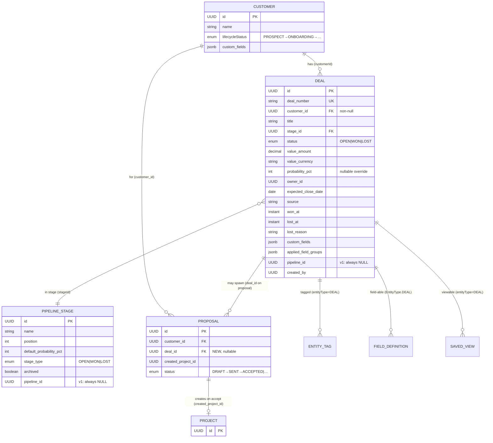
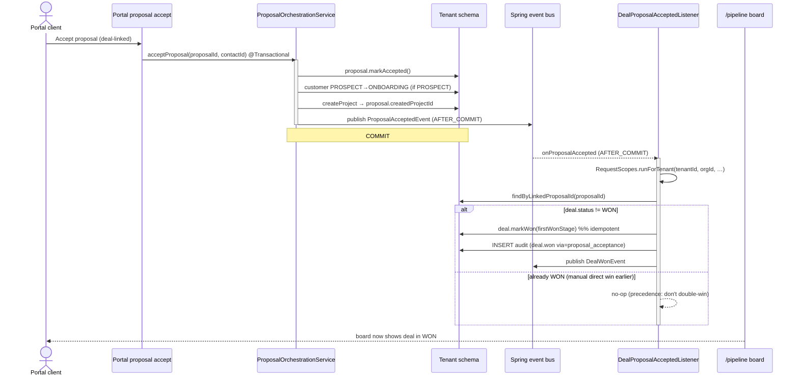

> Merge into ARCHITECTURE.md as **Section 11**.

# 11. Phase 80 — CRM / Sales Pipeline (Deals, Stages & the Win→Proposal Loop)

## 11.1 Overview

Kazi's revenue engine is complete end-to-end **except its entry point**. Today the funnel starts mid-stream: a `Customer` already exists, a firm member writes a `Proposal`, acceptance creates a `Project`, and the `Project` produces `Invoice`s. There is no concept of an *enquiry that has not yet been won* — no pipeline, no weighted forecast, no win/loss tracking. A "prospect" today is nothing more than a `Customer` sitting in the `PROSPECT` `LifecycleStatus`; there is no opportunity record, no stage, and no board on which to manage live deals. Phase 80 adds exactly that missing top-of-funnel layer and wires its "won" exit into the *existing* proposal→project orchestration.

Phase 80 introduces a single new bounded context — `crm` — containing two entities, `PipelineStage` (the org-configurable, vertical-seeded ordered stages) and `Deal` (the opportunity that always belongs to a `Customer`). It is a **foundation-quality, fork-friendly** domain: every vertical fork (legal, consulting, accounting, agency) inherits a sales pipeline, default-on, with vertically-appropriate default stages seeded at provisioning. The design is deliberately small in surface and maximal in reuse: a `Deal` links to the existing `Customer`; winning a deal reuses the existing `Proposal → Project` orchestration; and the deal becomes a first-class field-able / taggable / saved-view / audited / commentable entity by *registering with the existing registries*, not by re-implementing them.

This phase explicitly **reuses, does not rebuild**: `Customer` (intake creates a PROSPECT customer + deal atomically), `Proposal` (`ProposalOrchestrationService.acceptProposal` and `ProposalAcceptedEvent` close the loop), the custom-fields / field-pack / tags / saved-views subsystems, the audit / activity / notification subsystems, the pack-seeding infrastructure for vertical defaults, the Phase 77 grouped-tabs customer detail page, the capability gating (`@RequiresCapability`) pattern, and the dashboard-widget pattern (`TeamUtilizationWidget`). The only genuinely new code is the two entities, the `DealTransitionService` (a guarded lifecycle service mirroring the existing task/project lifecycle services), one thin event-driven listener that marks a deal WON on proposal acceptance, one pipeline-summary aggregation endpoint, and the frontend board/list/detail/settings surfaces.

### What's new

| Existing capability | New capability (Phase 80) |
|---|---|
| `Customer` carries a `PROSPECT` lifecycle state — but a prospect is just a customer, with no opportunity record | `Deal` — a first-class opportunity entity, always linked to a `Customer`, with title, value+currency, stage, owner, source, expected close |
| Proposals are authored against an already-existing customer | An **enquiry** is captured as one intake action: PROSPECT `Customer` + open `Deal` created atomically |
| No pipeline, no stages | `PipelineStage` — one org-configurable, vertical-seeded ordered set with `OPEN`/`WON`/`LOST` `stageType` semantics |
| No forecast | Weighted pipeline value `Σ(value × effectiveProbability)` over OPEN deals; win rate; per-stage totals — a pipeline-summary endpoint + dashboard widget |
| Proposal acceptance silently advances the customer lifecycle | The same acceptance now also marks the deal-linked `Deal` **WON** so the board reflects reality |
| Win/loss invisible | Guarded `DealTransitionService` move/win/lose with `wonAt`/`lostAt`, required `lostReason`, re-open semantics, audit + activity + notifications |
| Customer detail has Phase 77 grouped tabs | A new **Deals** tab on the customer page; a `/pipeline` Kanban board + list view; a `settings/pipeline` stage-config page |

This phase does **not** add: a separate pre-customer Lead entity, multiple pipelines per org, a parallel win-orchestration engine, inbound-email lead capture, lead scoring / AI auto-qualification, marketing automation, forecasting/quota, full `ReportDefinition`-based pipeline reports, or any portal exposure of deals (deals are firm-internal). See §11.10 "Out of scope" callouts throughout and the explicit list at the end of this section.

> **Out of scope (verbatim from requirements):** separate pre-customer **Lead** entity & Lead↔Customer conversion plumbing; **multiple pipelines** per org + pipeline selector (schema stays multi-pipeline-ready, only one ships); **full win auto-orchestration** (auto proposal+project+kickoff in one click); **email/inbox auto-capture** of leads; **lead scoring / AI auto-qualification** beyond the `intake-triage` integration *seam* (door left open, not built); **marketing automation** (sequences, campaigns, drip, public web-form capture); **forecasting / quota / sales targets**; **full `ReportDefinition` pipeline reports, exports, scheduled delivery** (v1 = summary endpoint + widget); **portal exposure of deals**.

---

## 11.2 Domain Model

Two new entities live in the per-tenant schema. Both follow the **exact** tenant-aware entity pattern of `Proposal` (§7a of the context inventory): `@Entity` with a plain `@Table` name and **no `tenant_id` column** (isolation is pure schema-per-tenant via Hibernate `search_path`), a UUID `@Id` via `GenerationType.UUID`, cross-aggregate foreign keys held as **raw `UUID` columns** (not JPA `@ManyToOne`), status/type enums as `@Enumerated(EnumType.STRING)` with terminal-set semantics, `@PrePersist`/`@PreUpdate` timestamp callbacks, and **rich-domain guarded transition methods** that throw `InvalidStateException`.

### 11.2.1 `PipelineStage` (`crm/PipelineStage.java`, table `pipeline_stages`)

| Field | Type | Constraints | Notes |
|---|---|---|---|
| `id` | `UUID` | PK, `@GeneratedValue(UUID)` | |
| `name` | `String` | not null, ≤80 | e.g. "Qualified", "Engagement letter" |
| `position` | `int` | not null, ≥0 | Ordered display position; unique per org (enforced by repository ordering + UI guard, not a hard DB constraint, to keep reorders cheap) |
| `defaultProbabilityPct` | `int` | not null, 0–100 | The stage's default win-probability; a `Deal`'s effective probability falls back to this when the deal has no override |
| `stageType` | `StageType` enum | not null, `EnumType.STRING`, len 10 | `OPEN \| WON \| LOST` — **data-driven terminal semantics** (see decision below) |
| `archived` | `boolean` | not null, default false | Soft-hide: an archived stage stops appearing in the board/config but historical deals keep referencing it |
| `createdBy` | `UUID` | nullable | Member who created the stage (null for seeded stages) |
| `createdAt` | `Instant` | not null | `@PrePersist` |
| `updatedAt` | `Instant` | not null | `@PreUpdate` |

**`StageType` enum** (`crm/StageType.java`): `OPEN, WON, LOST`.

**Invariants** (enforced in `PipelineStageService`, mirroring the existing delete-guard pattern):
- At least one `OPEN`, at least one `WON`, and at least one `LOST` stage must always exist (seeded at provisioning; the config UI blocks removing the last of each type).
- Deleting a stage that has deals attached is **blocked** — archive instead (reuse the existing `DeleteGuard`).

**Design decision — why `stageType` is data-driven (`OPEN`/`WON`/`LOST`), not name-matched:** terminal behaviour (does moving a deal here mean "won"?) must be a property of the data, not a fragile string match on a localised, org-renamable stage name. A legal fork's "Engagement" and a consulting fork's "Negotiation" are both `OPEN`; each fork's "(Won)"/"(Lost)" carry `stageType=WON`/`LOST`. Exactly the `WON`/`LOST` stages drive `Deal.status` on transition. This keeps the transition service generic across verticals and lets orgs rename stages freely. See [ADR-314](adr/ADR-314-pipeline-stage-model.md).

**Design decision — single-pipeline-but-multi-pipeline-ready schema:** v1 ships exactly one pipeline per org (no `Pipeline` entity, no selector). To avoid a painful future migration, `pipeline_stages` reserves a nullable `pipeline_id UUID` column (always NULL in v1) so a future `Pipeline` parent and a `Deal.pipeline_id` can be added without rewriting the stage table or backfilling a synthetic default. v1 code ignores the column entirely. See [ADR-314](adr/ADR-314-pipeline-stage-model.md).

### 11.2.2 `Deal` (`crm/Deal.java`, table `deals`)

| Field | Type | Constraints | Notes |
|---|---|---|---|
| `id` | `UUID` | PK, `@GeneratedValue(UUID)` | |
| `dealNumber` | `String` | not null, unique | Human-friendly counter (`DealCounter` + `DealNumberService`), mirrors `proposal_number` |
| `customerId` | `UUID` | **not null** | Raw UUID ref to `Customer` (never `@ManyToOne`). Every deal belongs to a customer — no separate Lead |
| `title` | `String` | not null, ≤200 | e.g. "Acme — annual retainer" |
| `stageId` | `UUID` | not null | Raw UUID ref to `PipelineStage` |
| `status` | `DealStatus` enum | not null, `EnumType.STRING`, len 10 | `OPEN \| WON \| LOST` — **derived from the stage's `stageType` on transition**, never written directly by clients |
| `valueAmount` | `BigDecimal` | not null, precision 19 scale 2, default 0 | The deal's monetary value |
| `valueCurrency` | `String` | not null, len 3 (ISO-4217) | Defaults from `OrgSettings` currency at create time |
| `probabilityPct` | `Integer` | nullable, 0–100 | **Per-deal override**; null ⇒ fall back to the stage's `defaultProbabilityPct` |
| `expectedCloseDate` | `LocalDate` | nullable | |
| `ownerId` | `UUID` | not null | Member UUID; defaults to the creator |
| `source` | `String` | nullable, ≤40 | Free-form/configurable (e.g. Referral, Website, Inbound, Existing-client) — kept a string, not an enum, so forks can extend without a migration |
| `wonAt` | `Instant` | nullable | Set on WON transition, cleared on re-open |
| `lostAt` | `Instant` | nullable | Set on LOST transition, cleared on re-open |
| `lostReason` | `String` | nullable, ≤500 | **Required when transitioning to LOST**; cleared on re-open |
| `customFields` | `Map<String,Object>` jsonb | nullable | Flat key→value — the custom-fields seam (mirrors `Customer.custom_fields`) |
| `appliedFieldGroups` | `List<UUID>` jsonb | nullable | Which auto-apply field groups were attached at create time (mirrors `Customer.applied_field_groups`) |
| `pipelineId` | `UUID` | nullable, always NULL in v1 | Reserved for the future multi-pipeline parent (see §11.2.1) |
| `createdBy` | `UUID` | not null | Member who created the deal |
| `createdAt` | `Instant` | not null | `@PrePersist` |
| `updatedAt` | `Instant` | not null | `@PreUpdate` |

**`DealStatus` enum** (`crm/DealStatus.java`): `OPEN, WON, LOST`. `TERMINAL_STATUSES = Set.of(WON, LOST)`.

**Rich-domain methods** (guarded; throw `InvalidStateException` via a private `requireStatus(Set<DealStatus>, action)`):
- `moveToOpenStage(stageId, newProbabilityOverride)` — move between OPEN stages (current status must be OPEN); recomputes effective probability. `DealTransitionService` routes a terminal→OPEN target to `reopen` instead (§11.3b).
- `markWon(wonStageId, now)` — sets `status=WON`, `stageId`, `wonAt=now`, probability override→100 semantics; idempotent guard rejects double-won (current status must be OPEN).
- `markLost(lostStageId, lostReason, now)` — requires non-blank `lostReason`; sets `status=LOST`, `lostAt`, probability→0 semantics.
- `reopen(openStageId)` — from WON/LOST back to an OPEN stage; clears `wonAt`/`lostAt`/`lostReason` (`updatedAt` bumped via `@PreUpdate`).
- Guarded setters (`updateValue`, `updateOwner`, `updateExpectedClose`, `updateProbabilityOverride`, `updateSource`, `updateTitle`) — editable in any status (deals stay editable even when closed, unlike Proposals; only the win/lose *transition* is guarded). Result references (e.g. linking a proposal) are not guarded.
- `effectiveProbabilityPct()` — `WON ⇒ 100`, `LOST ⇒ 0`; else `probabilityPct` if non-null, else the *caller passes* the stage's `defaultProbabilityPct` (the entity is given the resolved value, since it holds no `@ManyToOne` to the stage).
- `weightedValue()` — `valueAmount × effectiveProbability / 100`, half-up rounded to scale 2.

**Design decision — Deal-linked-to-Customer, not a separate Lead:** an inbound enquiry is captured as a single intake action that creates a `PROSPECT` `Customer` **and** an open `Deal` in one transaction. This reuses the existing `PROSPECT` lifecycle, avoids Lead↔Customer duplication and dual-mode code paths, and means a deal's `customerId` is always non-null. A separate lightweight pre-customer Lead and a dual-mode deal were both considered and rejected for v1. See [ADR-313](adr/ADR-313-crm-lead-model.md).

**Design decision — effective probability & weighted value derivation:** `effectiveProbability = probabilityPct (override) ?? stage.defaultProbabilityPct`, clamped to `100` for WON and `0` for LOST regardless of override. `weightedValue = valueAmount × effectiveProbability / 100`. Pipeline weighted value = `Σ weightedValue` over **OPEN** deals only (WON deals are realised, LOST contribute 0). This keeps the forecast honest: an open deal at "Qualified/20%" contributes 20% of its value; a WON deal leaves the forecast and becomes realised revenue. See [ADR-318](adr/ADR-318-pipeline-metrics.md).

### 11.2.3 The Deal↔Proposal link

A `Deal` may have **zero or more** associated `Proposal`s. The link is modelled as a **nullable `deal_id UUID` column on the existing `proposals` table** (FK to `deals.id`), **not** a join table.

**Design decision — FK on `proposals`, not a join table:** the relationship is one-deal-to-many-proposals (a deal might spawn a revised proposal after a decline), so the "many" side (`proposals`) carries the FK — the standard relational choice and the lowest-impact change. A join table would imply a many-to-many we don't have and add a query hop. The column is nullable so existing proposals (and proposals authored outside the CRM flow) are unaffected. This is the **only** change to the `proposals` table; no `Proposal` *internals* (lifecycle, orchestration) change. See [ADR-315](adr/ADR-315-win-proposal-conversion-reuse.md).

### 11.2.4 ER diagram (relevant neighbourhood)



**Unchanged:** `Customer`, `Proposal` (except the one new nullable `deal_id` FK column), `Project`, `FieldDefinition`/`FieldGroup`, `Tag`/`EntityTag`, `SavedView`, `AuditEvent` — all reused as-is. No `Customer` or `Proposal` internal behaviour changes beyond the thin event-driven glue (§11.3c) and the link column.

---

## 11.3 Core Flows and Backend Behaviour

All flows are tenant- and member-scoped automatically: the `TenantFilter` → `MemberFilter` → `RequestScopes` chain binds `TENANT_ID` (driving the Hibernate `search_path` to the tenant's schema) and `MEMBER_ID`/`ORG_ROLE`/`CAPABILITIES`. **Pure schema-per-tenant** — there is no `tenant_id` column, no `@Filter`, and no RLS policy anywhere in the codebase (per `backend/CLAUDE.md`: "Pure schema boundary — no `@Filter`, no RLS policies, no `tenant_id` columns"). A standard `JpaRepository.findById()` is tenant-safe. There is no shared-schema tier, so no RLS discussion applies.

### 11.3a Intake — create PROSPECT customer + deal atomically

`DealIntakeService.intake(IntakeRequest)` (`@Transactional`) either attaches a `Deal` to an existing `Customer` (by `customerId`) **or** creates a new `PROSPECT` `Customer` *and* the `Deal` in one transaction, reusing the existing customer-creation service (no duplicated validation):

```java
@Transactional
public DealResponse intake(IntakeRequest req) {
    UUID memberId = RequestScopes.requireMemberId();
    UUID customerId = (req.customerId() != null)
        ? customerService.requireExisting(req.customerId()).getId()
        : customerService.createProspect(req.toCustomerCreate(), memberId).getId(); // reuse, default PROSPECT
    PipelineStage stage = (req.stageId() != null)
        ? stageRepository.findOneById(req.stageId())
        : stageService.firstOpenStage();                 // default to first OPEN stage
    Deal deal = Deal.create(customerId, req.title(), stage,
        req.valueAmount(), orgSettings.defaultCurrency(), req.ownerId() != null ? req.ownerId() : memberId,
        req.source(), memberId);
    dealRepository.save(deal);
    auditService.log(AuditEventBuilder.builder()
        .eventType("deal.created").entityType("DEAL").entityId(deal.getId())
        .details(Map.of("deal_number", deal.getDealNumber(), "customer_id", customerId.toString())).build());
    return DealResponse.from(deal, stage);
}
```

`IntakeRequest` is a clean, **not UI-coupled** DTO so the legal `intake-triage` AI specialist can call the same path programmatically (the integration *seam*; wiring is out of scope). RBAC: `@RequiresCapability("MANAGE_DEALS")`.

### 11.3b Stage transition — `DealTransitionService` (move / win / lose / re-open)

`DealTransitionService` mirrors the existing `TaskLifecycleService` / project lifecycle transition services and the `InvalidStateException` guard pattern. It is the **only** path that writes `Deal.status`, `wonAt`, `lostAt`, `lostReason` — clients never write those directly.

```java
@Transactional
public DealResponse transition(UUID dealId, TransitionRequest req) {
    Deal deal = dealRepository.findOneById(dealId);              // bypasses no @Filter; schema-scoped
    PipelineStage target = stageRepository.findOneById(req.targetStageId());
    Instant now = Instant.now();
    switch (target.getStageType()) {
        case OPEN -> {
            // Dispatch by CURRENT status: re-opening a closed deal vs moving between open stages.
            if (TERMINAL.contains(deal.getStatus())) {        // WON/LOST → OPEN: re-open
                deal.reopen(target.getId());                  // clears wonAt/lostAt/lostReason (updatedAt via @PreUpdate)
                publish(new DealStageChangedEvent(dealId, target.getId(), tenant(), org()));
                audit("deal.reopened", deal, Map.of("stage_id", target.getId().toString()));
            } else {                                          // OPEN → OPEN: plain move
                deal.moveToOpenStage(target.getId(), req.probabilityOverride());
                publish(new DealStageChangedEvent(dealId, target.getId(), tenant(), org()));
                audit("deal.stage_changed", deal, Map.of("stage_id", target.getId().toString()));
            }
        }
        case WON -> {
            deal.markWon(target.getId(), now);                                    // rejects double-won
            customerNudge(deal.getCustomerId());                                 // PROSPECT→ONBOARDING only
            publish(new DealWonEvent(dealId, deal.getCustomerId(), deal.getOwnerId(), tenant(), org()));
            audit("deal.won", deal, Map.of("value", deal.getValueAmount().toString()));
            notify(deal.getOwnerId(), NotificationType.DEAL_WON);
        }
        case LOST -> {
            if (isBlank(req.lostReason())) throw new InvalidStateException("lostReason required to lose a deal");
            deal.markLost(target.getId(), req.lostReason(), now);
            publish(new DealLostEvent(dealId, req.lostReason(), tenant(), org()));
            audit("deal.lost", deal, Map.of("lost_reason", req.lostReason()));
        }
    }
    return DealResponse.from(deal, target);
}

/** Only-if-PROSPECT, never downgrade. */
private void customerNudge(UUID customerId) {
    Customer c = customerRepository.findOneById(customerId);
    if (c.getLifecycleStatus() == LifecycleStatus.PROSPECT) {
        c.transitionLifecycleStatus(LifecycleStatus.ONBOARDING, RequestScopes.requireMemberId());
    }   // ACTIVE/DORMANT/etc → no-op; we never downgrade a customer because a deal closed
}
```

- **Move within OPEN:** update `stageId`, recompute effective probability, emit `DealStageChangedEvent`, audit + activity.
- **Win:** set `status=WON`, `wonAt`, effective probability→100; **nudge `Customer` PROSPECT→ONBOARDING only if currently PROSPECT** (the lifecycle enum guard already rejects illegal transitions; a non-PROSPECT customer is a deliberate no-op — never a downgrade); emit `DealWonEvent`; audit + activity + notification.
- **Lose:** require `lostReason` (else `InvalidStateException` → 400); set `status=LOST`, `lostAt`, effective probability→0; emit `DealLostEvent`; audit + activity.
- **Re-open:** WON/LOST → an OPEN stage; clears `wonAt`/`lostAt`/`lostReason`; audited (`deal.reopened`).

All operations are `@RequiresCapability("CLOSE_DEALS")` for win/lose/re-open and `MANAGE_DEALS` for OPEN moves (§11.9). See [ADR-314](adr/ADR-314-pipeline-stage-model.md), [ADR-315](adr/ADR-315-win-proposal-conversion-reuse.md).

### 11.3c Win→Proposal loop — reuse, do not rebuild

From a `Deal`, a member can **create** a new `Proposal` (pre-populated with the deal's `customerId` + `valueAmount`, link set via `proposal.deal_id`) or **link** an existing proposal. The `Proposal` domain owns drafting/sending/acceptance **unchanged**; `ProposalOrchestrationService.acceptProposal(...)` (§8 of the context inventory) already creates the `Project` and nudges the customer lifecycle.

This phase adds **one** thin listener: when a *deal-linked* proposal is accepted, also mark the `Deal` **WON** so the board reflects reality. It is a listener on the **existing** `ProposalAcceptedEvent`, **not** a modification of proposal internals. The reverse lookup (`findByLinkedProposalId`) resolves via the new mapped `Proposal.dealId` column (§11.8 backend changes), exposed as `@Column(name = "deal_id") private UUID dealId` — a mapped column, **not** a JPA association — so a derived `ProposalRepository.findByDealId(...)` / `DealRepository` lookup is valid JPQL without an `@ManyToOne`:

```java
@Component
public class DealProposalAcceptedListener {
  @TransactionalEventListener(phase = TransactionPhase.AFTER_COMMIT)
  public void onProposalAccepted(ProposalAcceptedEvent ev) {
    RequestScopes.runForTenant(ev.tenantId(), ev.orgId(), () -> {     // copy the exact pattern
      dealRepository.findByLinkedProposalId(ev.proposalId()).ifPresent(deal -> {
        if (deal.getStatus() != DealStatus.WON) {                     // precedence: don't double-win
          PipelineStage wonStage = stageService.firstWonStage();
          deal.markWon(wonStage.getId(), Instant.now());
          dealRepository.save(deal);
          auditService.log(AuditEventBuilder.builder()
            .eventType("deal.won").entityType("DEAL").entityId(deal.getId())
            .details(Map.of("via", "proposal_acceptance", "proposal_id", ev.proposalId().toString())).build());
          eventPublisher.publishEvent(new DealWonEvent(deal.getId(), deal.getCustomerId(), deal.getOwnerId(), ev.tenantId(), ev.orgId()));
        }
      });
    });
  }
}
```

**`DealWonEvent`** record shape (mirrors `ProposalAcceptedEvent`): `DealWonEvent(UUID dealId, UUID customerId, UUID ownerId, String tenantId, String orgId)`. Its own `AFTER_COMMIT` handler (`DealWonEventHandler`, `runForTenant`) dispatches the deal-won notification.

**Precedence (so a deal isn't double-won):**
- Direct win (`DealTransitionService.transition` → WON stage) is **status-only** — it does **not** force-create a proposal/project. The two paths are complementary.
- Proposal-acceptance win is **idempotent**: the listener marks WON only `if (status != WON)`. If the user already manually won the deal, acceptance is a no-op on the deal (the proposal still creates its project via the existing orchestration).
- There is **no** parallel project-creation path, no second customer-activation engine, no bundled "win→everything" macro. The only new orchestration is the event-driven glue above.

See [ADR-315](adr/ADR-315-win-proposal-conversion-reuse.md).

### 11.3d Pipeline aggregation

`PipelineSummaryService.getSummary(SummaryFilter)` (`@Transactional(readOnly = true)`, schema-scoped automatically). Definitions (per [ADR-318](adr/ADR-318-pipeline-metrics.md)):

- **Per-stage breakdown:** deal count, total value, weighted value, grouped by OPEN stage.
- **Open weighted pipeline value** = `Σ(valueAmount × effectiveProbability / 100)` over **OPEN** deals.
- **Win rate** over a date window (default **trailing 90 days** by close date): `won / (won + lost)` counting deals whose `wonAt`/`lostAt` fall inside the window. The widget and the endpoint share the same window so they never disagree.
- **Average deal size**, optional **average days-to-close** (`wonAt − createdAt` over won deals in window).
- **Currency assumption:** single org currency for v1 (defaulted from `OrgSettings`); aggregation sums `valueAmount` directly without FX conversion. Mixed-currency deals are out of scope and documented as a v1 limitation.

Effective probability and `WON=100`/`LOST=0` are applied in SQL so the aggregation is a single query rather than N+1 entity loads:

```sql
-- Open weighted pipeline value + per-stage breakdown (current snapshot; OPEN deals only)
SELECT s.id            AS stage_id,
       s.name          AS stage_name,
       s.position      AS stage_position,
       COUNT(d.id)     AS deal_count,
       COALESCE(SUM(d.value_amount), 0) AS total_value,
       COALESCE(SUM(
         d.value_amount *
         COALESCE(d.probability_pct, s.default_probability_pct) / 100.0
       ), 0)           AS weighted_value
FROM pipeline_stages s
LEFT JOIN deals d
       ON d.stage_id = s.id
      AND d.status   = 'OPEN'
WHERE s.stage_type = 'OPEN'
  AND s.archived = false
GROUP BY s.id, s.name, s.position
ORDER BY s.position;
```

```sql
-- Win rate over a date window (trailing 90 days by close date)
SELECT
  COUNT(*) FILTER (WHERE status = 'WON')  AS won_count,
  COUNT(*) FILTER (WHERE status = 'LOST') AS lost_count
FROM deals
WHERE (status = 'WON'  AND won_at  >= :windowStart)
   OR (status = 'LOST' AND lost_at >= :windowStart);
-- winRate = won_count / NULLIF(won_count + lost_count, 0)
```

Filtered list / board query (JPQL, backing both views; optional saved-view / tag predicates appended):

```java
// DealRepository
@Query("""
  SELECT d FROM Deal d
  WHERE (:stageId   IS NULL OR d.stageId   = :stageId)
    AND (:ownerId   IS NULL OR d.ownerId   = :ownerId)
    AND (:customerId IS NULL OR d.customerId = :customerId)
    AND (:status    IS NULL OR d.status     = :status)
    AND (:source    IS NULL OR d.source     = :source)
    AND (:fromDate  IS NULL OR d.expectedCloseDate >= :fromDate)
    AND (:toDate    IS NULL OR d.expectedCloseDate <= :toDate)
  ORDER BY d.updatedAt DESC
""")
Page<Deal> findFiltered(/* @Param ... */ Pageable pageable);
```

RBAC: read paths gated `@RequiresCapability("VIEW_DEALS")`; summary additionally admin/owner-scoped consistent with other dashboard widgets (§11.9).

---

## 11.4 API Surface

All write endpoints carry `@RequiresCapability(...)` with the new **`CRM`** capability family (default-on, §11.6). Paths follow the `/api/...` convention. Pagination follows the `VIA_DTO` page-serialization convention.

### Deals — CRUD, intake, transition

| Method | Path | Description | Auth/Capability | R/W |
|---|---|---|---|---|
| POST | `/api/deals/intake` | Intake: attach to existing customer or create PROSPECT + deal atomically | `MANAGE_DEALS` | W |
| GET | `/api/deals` | Filtered/paginated list (board + list) | `VIEW_DEALS` | R |
| GET | `/api/deals/{id}` | Deal detail (overview, stage, linked proposals) | `VIEW_DEALS` | R |
| POST | `/api/deals` | Create a deal against an existing customer | `MANAGE_DEALS` | W |
| PUT | `/api/deals/{id}` | Update value, owner, expected close, probability override, source, title, custom fields | `MANAGE_DEALS` | W |
| DELETE | `/api/deals/{id}` | Guarded delete (blocked if linked proposals exist; archive/soft consistent with codebase) | `MANAGE_DEALS` | W |
| POST | `/api/deals/{id}/transition` | Move / win / lose / re-open via `DealTransitionService` | `MANAGE_DEALS` (move) / `CLOSE_DEALS` (win/lose/reopen) | W |

### Pipeline stages — configuration

| Method | Path | Description | Auth/Capability | R/W |
|---|---|---|---|---|
| GET | `/api/pipeline/stages` | List stages (ordered, incl. archived flag) | `VIEW_DEALS` | R |
| POST | `/api/pipeline/stages` | Create a stage | `MANAGE_PIPELINE` | W |
| PUT | `/api/pipeline/stages/{id}` | Edit name / default probability / stage type | `MANAGE_PIPELINE` | W |
| PUT | `/api/pipeline/stages/reorder` | Reorder (array of `{id, position}`) | `MANAGE_PIPELINE` | W |
| POST | `/api/pipeline/stages/{id}/archive` | Archive (guard: not the last OPEN/WON/LOST; deals→archive not delete) | `MANAGE_PIPELINE` | W |
| DELETE | `/api/pipeline/stages/{id}` | Delete (blocked if deals attached — `DeleteGuard`) | `MANAGE_PIPELINE` | W |

### Pipeline summary

| Method | Path | Description | Auth/Capability | R/W |
|---|---|---|---|---|
| GET | `/api/dashboard/pipeline-summary` | Weighted value, per-stage breakdown, win rate (date window, optional owner filter) | `VIEW_DEALS` (admin/owner-scoped) | R |

### Deal ↔ Proposal link

| Method | Path | Description | Auth/Capability | R/W |
|---|---|---|---|---|
| GET | `/api/deals/{id}/proposals` | List proposals linked to a deal (status chips) | `VIEW_DEALS` | R |
| POST | `/api/deals/{id}/proposals` | Create a new proposal pre-filled from the deal (delegates to `ProposalService`) | `MANAGE_DEALS` | W |
| POST | `/api/deals/{id}/proposals/{proposalId}/link` | Link an existing proposal to the deal | `MANAGE_DEALS` | W |

### Key request/response JSON shapes

**`POST /api/deals/intake`** — request (no `customerId` ⇒ create PROSPECT inline):
```json
{
  "customerId": null,
  "customer": { "name": "Acme Pty Ltd", "email": "ops@acme.example", "customerType": "COMPANY" },
  "title": "Acme — annual retainer",
  "stageId": null,
  "valueAmount": 120000.00,
  "ownerId": null,
  "source": "Referral",
  "expectedCloseDate": "2026-08-31"
}
```
Response `201 Created` (`Location: /api/deals/{id}`):
```json
{
  "id": "…", "dealNumber": "DEAL-0001", "customerId": "…", "title": "Acme — annual retainer",
  "stageId": "…", "stageName": "Lead", "status": "OPEN",
  "valueAmount": 120000.00, "valueCurrency": "ZAR",
  "probabilityPct": null, "effectiveProbabilityPct": 20, "weightedValue": 24000.00,
  "ownerId": "…", "source": "Referral", "expectedCloseDate": "2026-08-31",
  "createdAt": "2026-06-21T10:00:00Z"
}
```

**`POST /api/deals/{id}/transition`** — win:
```json
{ "targetStageId": "…won-stage…" }
```
— lose (reason required; missing ⇒ `400` `InvalidStateException`):
```json
{ "targetStageId": "…lost-stage…", "lostReason": "Went with incumbent" }
```
Response `200 OK`: the updated `DealResponse` with `status: "WON"|"LOST"`, `wonAt`/`lostAt` set.

**`GET /api/dashboard/pipeline-summary?from=2026-03-23&to=2026-06-21&ownerId=`**:
```json
{
  "openWeightedValue": 312500.00,
  "currency": "ZAR",
  "winRate": 0.62,
  "windowFrom": "2026-03-23", "windowTo": "2026-06-21",
  "averageDealSize": 85000.00,
  "averageDaysToClose": 41,
  "stages": [
    { "stageId": "…", "stageName": "Lead",       "dealCount": 8, "totalValue": 410000.00, "weightedValue": 82000.00 },
    { "stageId": "…", "stageName": "Qualified",   "dealCount": 5, "totalValue": 520000.00, "weightedValue": 208000.00 },
    { "stageId": "…", "stageName": "Proposal sent","dealCount": 2, "totalValue": 90000.00, "weightedValue": 22500.00 }
  ]
}
```

**Query params for the filtered list/board** (`GET /api/deals`): `stageId`, `ownerId`, `customerId`, `status` (`OPEN|WON|LOST`), `source`, `fromDate`/`toDate` (expected close window), `tag` (tag id, via `EntityTag` join), `savedViewId` (resolves stored filter set), `page`, `size`, `sort`.

---

## 11.5 Sequence Diagrams

### 11.5.1 Enquiry intake → board

```mermaid
sequenceDiagram
    actor User as Firm member
    participant B as Browser (/pipeline)
    participant SA as Next.js server action (lib/api/crm.ts)
    participant API as DealController
    participant SVC as DealIntakeService
    participant CUST as CustomerService
    participant DB as Tenant schema (Postgres)

    User->>B: Click "New enquiry", fill title/value/source (new customer)
    B->>SA: intake(payload)
    SA->>API: POST /api/deals/intake  (JWT)
    Note over API: TenantFilter→MemberFilter bind RequestScopes;<br/>@RequiresCapability("MANAGE_DEALS")
    API->>SVC: intake(IntakeRequest)
    activate SVC
    SVC->>CUST: createProspect(customer)  %% reuse, default PROSPECT
    CUST->>DB: INSERT customers (lifecycle=PROSPECT)
    SVC->>DB: INSERT deals (status=OPEN, stage=first OPEN)
    SVC->>DB: INSERT audit_events (deal.created)
    deactivate SVC
    SVC-->>API: DealResponse
    API-->>SA: 201 Created
    SA-->>B: deal card data
    B-->>User: New card appears in first OPEN column
```

### 11.5.2 Win via proposal acceptance (AFTER_COMMIT → DealWonEvent → board WON + customer nudge)



### 11.5.3 Direct status-only win with a guard path (lose-without-reason rejected)

```mermaid
sequenceDiagram
    actor User as Firm member
    participant B as Browser (board drag-drop)
    participant API as DealController
    participant TS as DealTransitionService
    participant DB as Tenant schema

    User->>B: Drag card onto "Lost" column
    B->>API: POST /api/deals/{id}/transition {targetStageId: lost}  (no lostReason)
    API->>TS: transition(id, req)
    activate TS
    TS->>DB: findOneById(id) / stage(lost)
    TS-->>API: throw InvalidStateException("lostReason required")
    deactivate TS
    API-->>B: 400 ProblemDetail
    B-->>User: "Reason required" — open lose dialog
    User->>B: Enter reason, confirm
    B->>API: POST …/transition {targetStageId: lost, lostReason}
    API->>TS: transition(id, req)
    TS->>DB: deal.markLost(lost, reason, now); audit deal.lost
    TS-->>API: DealResponse(status=LOST)
    API-->>B: 200 OK → card moves to Lost
```

---

## 11.6 Registry Integration (the reuse seams)

Each subsection names the **exact file** the change lands in. The guiding principle: *register a new entity type with the existing registries, do not re-implement them.*

### (a) Custom fields — `EntityType.DEAL` + V131 widening migration

- **`backend/.../fielddefinition/EntityType.java`** — add `DEAL` to the enum. Current values are exactly `PROJECT, TASK, CUSTOMER, INVOICE` (verified at source); becomes `PROJECT, TASK, CUSTOMER, INVOICE, DEAL`.
- **`backend/.../db/migration/tenant/V131__add_deal_entity_type_constraint.sql`** — mirror the **V126** pattern (`ALTER TABLE field_groups ... ADD COLUMN IF NOT EXISTS ...` idempotent shape). V126 added the `applicable_entity_values jsonb` column; V131 ensures the field-group applicable-entity machinery accepts `"DEAL"` (and, if a CHECK/allowed-values constraint on `field_groups.applicable_entity` exists in the tenant DDL, widens it to include `DEAL`). Because the codebase enforces the entity type at the Java enum boundary rather than a DB CHECK on `field_definitions`, V131's primary job is the field-group applicable-entity widening — see §11.7 for the SQL.
- **`Deal` entity columns** — `custom_fields jsonb` + `applied_field_groups jsonb` (mirror `Customer`, §7b). Optional: a field-pack JSON (`resources/field-packs/*.json`, `"entityType":"DEAL"`) discovered by the existing `FieldPackSeeder`.

See [ADR-316](adr/ADR-316-deal-as-registered-entity.md).

### (b) Tags + saved views — free-form `entityType="DEAL"`, no schema change

- **`tag/EntityTagService.java`** — `EntityTag` uses a free-form `entityType` String discriminator + `entityId UUID`; **zero registration** needed. Deals are taggable immediately by passing `entityType="DEAL"`.
- **`view/SavedViewService.java`** — `SavedView.entityType` is an untyped String column; **zero registration** needed. Pass `entityType="DEAL"` when creating/querying views. The deal list/board filter UI reuses the saved-views component.

### (c) Audit metadata — `AuditEventTypeRegistry` entries

- **`audit/AuditEventTypeRegistry.java`** — add `AuditEventTypeMetadata` rows (longest-dotted-prefix-wins, per ADR-261):

| eventType | label | severity | group |
|---|---|---|---|
| `deal.created` | "Deal created" | INFO | CRM/SALES |
| `deal.stage_changed` | "Deal stage changed" | INFO | CRM/SALES |
| `deal.won` | "Deal won" | INFO | CRM/SALES |
| `deal.lost` | "Deal lost" | INFO | CRM/SALES |
| `deal.reopened` | "Deal re-opened" | NOTICE | CRM/SALES |

(Choose concrete `AuditSeverity` / `AuditEventGroup` values from the existing enums; add a `SALES`/`CRM` group constant to `audit/AuditEventGroup.java` if none fits.) Audit writes go through `AuditEventBuilder.builder().eventType("deal.won").entityType("DEAL").entityId(id).details(...).build()`.

### (d) Activity feed — `ActivityMessageFormatter` switch cases

- **`activity/ActivityMessageFormatter.java`** — add `case "deal.created"`, `"deal.stage_changed"`, `"deal.won"`, `"deal.lost"`, `"deal.reopened"` branches to `formatMessage()` producing human-readable text. No separate registry — the activity feed reads audit events; formatting is opt-in. Deals appear in the global audit log and the deal-detail activity tab automatically once the audit events (c) are emitted with `entityType="DEAL"`.

### (e) Capability gating — `Capability.CRM` family, default-on

- **`orgrole/Capability.java`** — add the CRM capability constants: `VIEW_DEALS`, `MANAGE_DEALS`, `CLOSE_DEALS`, `MANAGE_PIPELINE`. These are **default-on for every fork** (granted to the standard roles in the default `OrgRole` capability sets, like `CUSTOMER_MANAGEMENT` / `PROJECT_MANAGEMENT`), not gated behind a vertical module.
- **Controllers** annotated `@RequiresCapability("VIEW_DEALS" | "MANAGE_DEALS" | "CLOSE_DEALS" | "MANAGE_PIPELINE")`.

**Capability vs module — why CRM is a capability, not a module:** the codebase has two orthogonal axes. **Capabilities** answer "does this role get to do X?" (resolved from `OrgRole` by `MemberFilter`). **Modules** (`VerticalModuleGuard` + `OrgSettings.enabledModules`) answer "is this whole feature area switched on for the org?" — `resource_planning` and `trust_accounting` are modules: vertical-gated, default-**off**, toggled in Settings → Features. CRM is **core practice management**, not a vertical add-on — every fork should have a pipeline out of the box. So we deliberately use the *capability* axis (default-on permissions) and **do not** register a `pipeline_crm` `VerticalModuleGuard` module. This is the explicit contrast with `resource_planning`. See [ADR-317](adr/ADR-317-crm-capability-gating.md).

### (f) Pack-seeding — `AbstractPackSeeder` + `vertical-profiles/*.json` for default stages

- **New seeder** `seeder/DealPipelinePackSeeder.java extends AbstractPackSeeder` (mirror `seeder/FieldPackSeeder.java`), reading `resources/deal-pipeline-packs/*.json` (each declaring `verticalProfile` + ordered stages with name/position/defaultProbabilityPct/stageType).
- **`resources/vertical-profiles/*.json`** — add a `deal_pipeline` key to each profile's `packs` map (`legal-za.json`, `consulting-za.json`, `accounting-za.json`, and the default).
- **`settings/OrgSettings.PackStatusSettings`** — extend the embeddable with a `deal_pipeline` tracking field for idempotency (re-provisioning safe).
- Invoke at tenant provisioning + via `verticals/VerticalProfileReconciliationSeeder.java`. **No hand-written per-tenant SQL** for stages.

Default stage sets (each with `defaultProbabilityPct` + correct `stageType`):
- **legal-za:** Enquiry → Conflict check → Engagement → (Won) / (Lost) — aligned with `intake-triage` vocabulary.
- **consulting-za:** Lead → Qualified → Proposal sent → Negotiation → (Won) / (Lost).
- **accounting-za:** Enquiry → Scoping → Engagement letter → (Won) / (Lost).
- **default (no profile):** Lead → Qualified → Proposal → Won / Lost.

See [ADR-317](adr/ADR-317-crm-capability-gating.md).

---

## 11.7 Database Migrations

Schema-per-tenant: **no `tenant_id` columns and no RLS policies** (confirmed against `backend/CLAUDE.md`: "Pure schema boundary — no `@Filter`, no RLS policies, no `tenant_id` columns. There is no shared schema."). All migrations are idempotent and run per tenant schema at provisioning **and** at startup. **Global migrations are not needed** — every new table is per-tenant. **Backfill: none** (new tables). Stage seeding is **not SQL** — it is idempotent pack-seeding (§11.6f).

> Numbering (verified against source; the requirements file's "latest tenant is V99" is **stale**): latest tenant migration is **V129**. New CRM tables → **V130**; field-group applicable-entity widening → **V131**.

### `V130__create_crm_pipeline_tables.sql`

```sql
-- ============================================================
-- V130__create_crm_pipeline_tables.sql  (Phase 80 — CRM / Sales Pipeline)
-- Per-tenant schema. No tenant_id column (pure schema-per-tenant), no RLS.
-- ============================================================

-- Pipeline stages (org-configurable, vertical-seeded)
CREATE TABLE IF NOT EXISTS pipeline_stages (
    id                       UUID         PRIMARY KEY,
    pipeline_id              UUID,                              -- reserved: always NULL in v1 (multi-pipeline-ready)
    name                     VARCHAR(80)  NOT NULL,
    position                 INTEGER      NOT NULL,
    default_probability_pct  INTEGER      NOT NULL DEFAULT 0
                                 CHECK (default_probability_pct BETWEEN 0 AND 100),
    stage_type               VARCHAR(10)  NOT NULL
                                 CHECK (stage_type IN ('OPEN','WON','LOST')),
    archived                 BOOLEAN      NOT NULL DEFAULT FALSE,
    created_by               UUID,
    created_at               TIMESTAMPTZ  NOT NULL DEFAULT NOW(),
    updated_at               TIMESTAMPTZ  NOT NULL DEFAULT NOW()
);

-- Deals (opportunities) — always linked to a Customer
CREATE TABLE IF NOT EXISTS deals (
    id                   UUID          PRIMARY KEY,
    deal_number          VARCHAR(40)   NOT NULL,
    pipeline_id          UUID,                                 -- reserved: always NULL in v1
    customer_id          UUID          NOT NULL,               -- raw UUID ref (no FK to enforce, matches codebase convention; see note)
    title                VARCHAR(200)  NOT NULL,
    stage_id             UUID          NOT NULL,
    status               VARCHAR(10)   NOT NULL DEFAULT 'OPEN'
                             CHECK (status IN ('OPEN','WON','LOST')),
    value_amount         NUMERIC(19,2) NOT NULL DEFAULT 0,
    value_currency       VARCHAR(3)    NOT NULL,
    probability_pct      INTEGER       CHECK (probability_pct BETWEEN 0 AND 100),  -- nullable override
    expected_close_date  DATE,
    owner_id             UUID          NOT NULL,
    source               VARCHAR(40),
    won_at               TIMESTAMPTZ,
    lost_at              TIMESTAMPTZ,
    lost_reason          VARCHAR(500),
    custom_fields        JSONB,
    applied_field_groups JSONB,
    created_by           UUID          NOT NULL,
    created_at           TIMESTAMPTZ   NOT NULL DEFAULT NOW(),
    updated_at           TIMESTAMPTZ   NOT NULL DEFAULT NOW(),
    CONSTRAINT fk_deal_stage FOREIGN KEY (stage_id) REFERENCES pipeline_stages (id),
    CONSTRAINT uq_deal_number UNIQUE (deal_number)
);

-- The deal↔proposal link: FK column on the existing proposals table (one-deal-to-many-proposals).
ALTER TABLE proposals
    ADD COLUMN IF NOT EXISTS deal_id UUID;
-- (No NOT NULL: proposals authored outside the CRM flow have deal_id = NULL.)

-- Indexes (rationale inline)
CREATE INDEX IF NOT EXISTS idx_deals_stage         ON deals (stage_id);                 -- board columns / per-stage aggregation
CREATE INDEX IF NOT EXISTS idx_deals_customer      ON deals (customer_id);              -- customer "Deals" tab
CREATE INDEX IF NOT EXISTS idx_deals_owner         ON deals (owner_id);                 -- "my deals" filter / owner summary
CREATE INDEX IF NOT EXISTS idx_deals_status        ON deals (status);                   -- OPEN-only aggregation, win-rate counts
-- Partial index: the hot path is the OPEN board/forecast; keeps it lean as WON/LOST history grows.
CREATE INDEX IF NOT EXISTS idx_deals_open_by_stage ON deals (stage_id) WHERE status = 'OPEN';
-- Win-rate window scans by close timestamp:
CREATE INDEX IF NOT EXISTS idx_deals_won_at        ON deals (won_at)  WHERE status = 'WON';
CREATE INDEX IF NOT EXISTS idx_deals_lost_at       ON deals (lost_at) WHERE status = 'LOST';
-- Resolve a deal from an accepted proposal (win-loop listener):
CREATE INDEX IF NOT EXISTS idx_proposals_deal      ON proposals (deal_id) WHERE deal_id IS NOT NULL;
```

> **FK note:** `customer_id` and `owner_id` are raw UUID references (the codebase deliberately uses UUID cross-aggregate refs, not JPA `@ManyToOne`). A DB-level FK on `stage_id → pipeline_stages` is kept because both live in the same aggregate/schema and it cheaply protects the board's integrity; a FK on `customer_id`/`owner_id` is optional and may be omitted to match the prevailing convention (the Proposal table holds `customer_id` without a JPA relation). Choose consistently with the most recent sibling migration at implementation time.

### `V131__add_deal_entity_type_constraint.sql`

```sql
-- ============================================================
-- V131__add_deal_entity_type_constraint.sql  (Phase 80)
-- Make Deal a field-able entity. Mirrors V126's idempotent ALTER pattern.
-- EntityType is enforced at the Java enum boundary (fielddefinition/EntityType.java,
-- now incl. DEAL); this migration widens any DB-level applicable-entity guard so
-- field groups may target "DEAL".
-- ============================================================

-- Idempotent: ensure the applicable-entity-values column exists (added in V126);
-- no CHECK constraint on field_definitions.entity_type is named in current DDL, so
-- adding DEAL to the Java enum is sufficient there. This migration is a no-op-safe
-- guard that keeps the field-group machinery consistent across all tenant schemas.
ALTER TABLE field_groups
    ADD COLUMN IF NOT EXISTS applicable_entity_values jsonb;

-- If a tenant carries a CHECK constraint restricting field_groups.applicable_entity,
-- widen it to include DEAL (drop-and-recreate is idempotent because we DROP IF EXISTS):
-- ALTER TABLE field_groups DROP CONSTRAINT IF EXISTS ck_field_groups_applicable_entity;
-- ALTER TABLE field_groups ADD  CONSTRAINT ck_field_groups_applicable_entity
--     CHECK (applicable_entity IN ('PROJECT','TASK','CUSTOMER','INVOICE','DEAL'));
-- (Uncomment only if the named CHECK exists in the tenant baseline — verify before applying.)
```

> If, at implementation time, no DB-level CHECK on entity type exists (the current baseline enforces it in Java), V131 collapses to the column-existence guard above — or is folded entirely into V130. The decision is "verify the tenant baseline DDL, then choose"; the numbering reservation (V131) stands regardless.

---

## 11.8 Implementation Guidance

### Backend changes

| File | Change |
|---|---|
| `crm/PipelineStage.java`, `crm/StageType.java` | New entity + enum |
| `crm/Deal.java`, `crm/DealStatus.java` | New aggregate root + status enum (rich-domain, guarded transitions) |
| `crm/DealCounter.java`, `crm/DealNumberService.java` | Human-friendly `deal_number` (mirror `ProposalCounter`/`ProposalNumberService`) |
| `crm/DealRepository.java`, `crm/PipelineStageRepository.java` | Spring Data repos + `findOneById`, `findFiltered`, `findByLinkedProposalId` |
| `crm/DealService.java` | CRUD + filtered list |
| `crm/DealIntakeService.java` | Atomic customer+deal intake (reuse `CustomerService`) |
| `crm/DealTransitionService.java` | Guarded move/win/lose/re-open + customer nudge |
| `crm/PipelineStageService.java` | Stage config + invariants + `DeleteGuard` |
| `crm/PipelineSummaryService.java` | Aggregation (weighted value, win rate, per-stage) |
| `crm/event/*.java` | `DealStageChangedEvent`, `DealWonEvent`, `DealLostEvent`, `DealWonEventHandler` |
| `crm/DealProposalAcceptedListener.java` | `@TransactionalEventListener(AFTER_COMMIT)` on `ProposalAcceptedEvent` → mark deal WON |
| `crm/DealController.java`, `crm/PipelineStageController.java` | Thin controllers (one service call each) |
| `crm/dto/*.java` | `IntakeRequest`, `TransitionRequest`, `DealResponse`, `StageDto`, `PipelineSummaryResponse` |
| `fielddefinition/EntityType.java` | Add `DEAL` |
| `orgrole/Capability.java` | Add `VIEW_DEALS`, `MANAGE_DEALS`, `CLOSE_DEALS`, `MANAGE_PIPELINE` (default-on grants) |
| `audit/AuditEventTypeRegistry.java`, `audit/AuditEventGroup.java` | Register `deal.*` event metadata (+ `SALES`/`CRM` group if needed) |
| `activity/ActivityMessageFormatter.java` | `case "deal.*"` formatting branches |
| `dashboard/DashboardController.java`, `dashboard/DashboardService.java`, `dashboard/dto/` | `GET /api/dashboard/pipeline-summary` one-liner + service + DTO |
| `seeder/DealPipelinePackSeeder.java` | Vertical stage seeding (mirror `FieldPackSeeder`) |
| `settings/OrgSettings.java` (PackStatusSettings embeddable) | `deal_pipeline` idempotency tracking field |
| `proposal/Proposal.java` | Add nullable `deal_id` UUID column + getter/`setDealId` (result-ref, ungated) |
| `resources/deal-pipeline-packs/*.json`, `resources/vertical-profiles/*.json` | Stage packs + profile wiring |
| `db/migration/tenant/V130__*.sql`, `V131__*.sql` | Tables + field-able widening |

### Frontend changes

| File | Change |
|---|---|
| `frontend/app/(app)/org/[slug]/pipeline/page.tsx` | Kanban board (drag-to-move → transition) + list view toggle; header weighted value + win rate |
| `frontend/app/(app)/org/[slug]/pipeline/[id]/page.tsx` (or sheet) | Deal detail: overview, stage history, linked customer, linked proposals (status chips + create/send), comments, `<AuditTimeline>` activity |
| `frontend/app/(app)/org/[slug]/customers/[id]/...` (`CustomerGroupedTabs`) | New **Deals** tab listing the customer's deals + inline "new deal" intake |
| `frontend/app/(app)/org/[slug]/settings/pipeline/page.tsx` | Stage config: reorder, edit name/probability/type, archive, with guards (mirror `settings/capacity`) |
| `frontend/components/dashboard/pipeline-summary-widget.tsx` | Dashboard widget (mirror `TeamUtilizationWidget`; SWR poll) |
| `frontend/app/(app)/org/[slug]/dashboard/page.tsx` | Compose `<PipelineSummaryWidget />` into the grid |
| `frontend/lib/api/crm.ts` | API module (mirror `capacity.ts`): deal CRUD, list/filter, transition, intake, summary, stage config, proposal link/create |
| `frontend/lib/dashboard-types.ts` | `PipelineSummaryResponse` TS interface |
| Reused components | saved-views / tags / custom-fields filter components, `<AuditTimeline>` |

### Annotated `Deal` entity pattern (matching `Proposal`)

```java
@Entity
@Table(name = "deals")
public class Deal {
  @Id @GeneratedValue(strategy = GenerationType.UUID) private UUID id;

  @Column(name = "deal_number", nullable = false, unique = true) private String dealNumber;
  @Column(name = "customer_id", nullable = false) private UUID customerId;   // raw UUID ref, NOT @ManyToOne
  @Column(nullable = false) private String title;
  @Column(name = "stage_id", nullable = false) private UUID stageId;
  @Column(name = "pipeline_id") private UUID pipelineId;                      // reserved: always NULL in v1 (§11.2.1)

  @Enumerated(EnumType.STRING) @Column(nullable = false, length = 10)
  private DealStatus status = DealStatus.OPEN;
  private static final Set<DealStatus> TERMINAL = Set.of(DealStatus.WON, DealStatus.LOST);

  @Column(name = "value_amount", nullable = false, precision = 19, scale = 2)
  private BigDecimal valueAmount = BigDecimal.ZERO;
  @Column(name = "value_currency", nullable = false, length = 3) private String valueCurrency;
  @Column(name = "probability_pct") private Integer probabilityPct;          // nullable override
  @Column(name = "expected_close_date") private LocalDate expectedCloseDate;
  @Column(name = "owner_id", nullable = false) private UUID ownerId;
  private String source;
  @Column(name = "won_at") private Instant wonAt;
  @Column(name = "lost_at") private Instant lostAt;
  @Column(name = "lost_reason", length = 500) private String lostReason;

  @JdbcTypeCode(SqlTypes.JSON) @Column(name = "custom_fields", columnDefinition = "jsonb")
  private Map<String, Object> customFields = new HashMap<>();
  @JdbcTypeCode(SqlTypes.JSON) @Column(name = "applied_field_groups", columnDefinition = "jsonb")
  private List<UUID> appliedFieldGroups = new ArrayList<>();

  @Column(name = "created_by", nullable = false) private UUID createdBy;
  private Instant createdAt;
  private Instant updatedAt;

  @PrePersist void onCreate() { var n = Instant.now(); createdAt = n; updatedAt = n; }
  @PreUpdate  void onUpdate() { updatedAt = Instant.now(); }

  /** WON ⇒ 100, LOST ⇒ 0, else override ?? stage default (resolvedStageDefault passed in). */
  public int effectiveProbabilityPct(int resolvedStageDefault) {
    return switch (status) {
      case WON -> 100; case LOST -> 0;
      case OPEN -> probabilityPct != null ? probabilityPct : resolvedStageDefault;
    };
  }
  public BigDecimal weightedValue(int effectiveProb) {
    return valueAmount.multiply(BigDecimal.valueOf(effectiveProb))
                      .divide(BigDecimal.valueOf(100), 2, RoundingMode.HALF_UP);
  }

  public void markWon(UUID wonStageId, Instant now) {
    requireStatus(EnumSet.of(DealStatus.OPEN), "win");       // rejects double-won
    this.stageId = wonStageId; this.status = DealStatus.WON;
    this.wonAt = now; this.lostAt = null;
  }
  public void markLost(UUID lostStageId, String reason, Instant now) {
    requireStatus(EnumSet.of(DealStatus.OPEN), "lose");
    if (reason == null || reason.isBlank()) throw new InvalidStateException("lostReason required");
    this.stageId = lostStageId; this.status = DealStatus.LOST;
    this.lostReason = reason; this.lostAt = now;
  }
  public void reopen(UUID openStageId) {
    if (!TERMINAL.contains(status)) throw new InvalidStateException("deal is not closed");
    this.stageId = openStageId; this.status = DealStatus.OPEN;
    this.wonAt = null; this.lostAt = null; this.lostReason = null;
  }
  private void requireStatus(Set<DealStatus> allowed, String action) {
    if (!allowed.contains(status))
      throw new InvalidStateException("Cannot %s a deal in status %s".formatted(action, status));
  }
}
```

### Repository JPQL pattern (`findOneById`, matching convention)

```java
public interface DealRepository extends JpaRepository<Deal, UUID> {

  /** Tenant-safe single fetch — schema-per-tenant means findById is already isolated;
   *  findOneById throws ResourceNotFoundException, matching the codebase convention. */
  default Deal findOneById(UUID id) {
    return findById(id).orElseThrow(() -> new ResourceNotFoundException("Deal not found: " + id));
  }

  @Query("SELECT d FROM Deal d WHERE d.customerId = :customerId ORDER BY d.updatedAt DESC")
  List<Deal> findByCustomerId(UUID customerId);

  /** Win-loop: resolve a deal from an accepted proposal via the mapped proposals.deal_id column.
   *  Correlated subquery (not an implicit cross-join); requires Proposal.dealId be a mapped @Column. */
  @Query("SELECT d FROM Deal d WHERE d.id = (SELECT p.dealId FROM Proposal p WHERE p.id = :proposalId)")
  Optional<Deal> findByLinkedProposalId(UUID proposalId);
}
```

### Testing strategy

| Test | Scope |
|---|---|
| `DealCrudIntegrationTest` | Create/read/update/delete + intake (existing customer & inline PROSPECT) via MockMvc; asserts 201/200/404 + JSON shape |
| `DealTransitionServiceTest` | move/win/lose/re-open; **customer PROSPECT→ONBOARDING nudge** fires only when PROSPECT, never downgrades ACTIVE; lose-without-reason → 400 |
| `DealProposalWinLoopTest` | Accept a deal-linked proposal → `ProposalAcceptedEvent` AFTER_COMMIT → deal marked WON; idempotent when already WON (no double-win) |
| `PipelineSummaryServiceTest` | Aggregation math: weighted value `Σ(value×effProb)` over OPEN only; win rate over window; per-stage totals; effective probability override vs stage default |
| `DealCapabilityGatingTest` | `VIEW_DEALS`/`MANAGE_DEALS`/`CLOSE_DEALS`/`MANAGE_PIPELINE` enforced; member without capability → 403 |
| `DealTenantIsolationTest` | **Mandatory** — tenant B cannot read/transition tenant A's deals; cross-tenant `findById` returns not-found under B's schema |
| `PipelineStageInvariantsTest` | Cannot remove the last OPEN/WON/LOST; delete-with-deals blocked (archive instead) |
| `DealPipelinePackSeederTest` | Idempotent vertical stage seeding; re-provision safe; default profile stages present |
| E2E (Playwright, mock-auth + KC) | enquiry → move across stages → link/send proposal → win → assert customer advanced + proposal/project path reachable |

Backend bar: full `./mvnw verify` clean. Frontend: `pnpm lint && pnpm build && pnpm test` + prettier `format:check`.

---

## 11.9 Permission Model Summary

Role hierarchy: **Owner > Admin > Project Lead > Contributor**. CRM capabilities are **default-on** (granted in the standard role capability sets), contrasting with the vertical-gated, default-off `resource_planning` module.

| Operation | Capability | Owner | Admin | Project Lead | Contributor |
|---|---|---|---|---|---|
| View pipeline / board / deals | `VIEW_DEALS` | ✅ | ✅ | ✅ | ✅ |
| Create / intake / edit a deal | `MANAGE_DEALS` | ✅ | ✅ | ✅ | ✅ |
| Move a deal between OPEN stages | `MANAGE_DEALS` | ✅ | ✅ | ✅ | ✅ |
| Win / lose / re-open a deal | `CLOSE_DEALS` | ✅ | ✅ | ✅ | ⚠️ optional* |
| Configure pipeline stages | `MANAGE_PIPELINE` | ✅ | ✅ | ❌ | ❌ |
| View pipeline summary (dashboard widget) | `VIEW_DEALS` (admin/owner-scoped) | ✅ | ✅ | (own deals) | (own deals) |
| Delete a deal | `MANAGE_DEALS` (guarded — blocked if linked proposals) | ✅ | ✅ | ⚠️ optional* | ❌ |

\* `CLOSE_DEALS` for Contributors and deletion for Project Leads are policy choices for the default role grants — recommend granting `CLOSE_DEALS` broadly (closing deals is everyday sales work) and keeping `MANAGE_PIPELINE` (stage config) admin/owner-only (it's a structural change affecting the whole org). Final grants live in the default `OrgRole` capability sets and are an orchestrator/user call.

---

## 11.10 Capability Slices (for `/breakdown`)

Eight independently-deployable slices mirroring the 8-epic shape. Each ships behind the default-on `CRM` capability with full `./mvnw verify` + frontend gates green.

**Slice 1 — Entities, migration, capability, stage seed.**
- *Backend:* `PipelineStage`/`Deal` entities + enums; `V130`/`V131`; `Capability` constants (default-on); `DealPipelinePackSeeder` + `deal-pipeline-packs/*.json` + vertical-profile wiring + `PackStatusSettings` field.
- *Deliverables:* tables created per tenant; default + vertical stages seeded idempotently.
- *Depends on:* none.
- *Tests:* `PipelineStageInvariantsTest`, `DealPipelinePackSeederTest`; verify provisioning seeds stages.

**Slice 2 — Deal CRUD + intake + filtered list.**
- *Backend:* `DealService`, `DealIntakeService`, `DealRepository.findFiltered`, `DealController`, DTOs.
- *Deliverables:* `POST /api/deals/intake`, `/api/deals` CRUD + filtered list.
- *Depends on:* Slice 1.
- *Tests:* `DealCrudIntegrationTest`, `DealCapabilityGatingTest`, `DealTenantIsolationTest`.

**Slice 3 — `DealTransitionService` + customer nudge + events/audit/activity.**
- *Backend:* `DealTransitionService`, `crm/event/*`, audit-metadata registration, `ActivityMessageFormatter` cases, deal-won notification.
- *Deliverables:* `POST /api/deals/{id}/transition` (move/win/lose/re-open); PROSPECT→ONBOARDING nudge.
- *Depends on:* Slice 2.
- *Tests:* `DealTransitionServiceTest` (incl. nudge only-if-PROSPECT, lose-without-reason 400, re-open clears).

**Slice 4 — Deal↔Proposal link + win-loop event glue.**
- *Backend:* `proposals.deal_id` column (in V130) + `Proposal.dealId`; `DealProposalAcceptedListener` (AFTER_COMMIT, `runForTenant`); `/api/deals/{id}/proposals` create/link/list.
- *Deliverables:* accepting a deal-linked proposal marks the deal WON (idempotent).
- *Depends on:* Slice 3.
- *Tests:* `DealProposalWinLoopTest` (incl. no-double-win precedence).

**Slice 5 — Field / tag / saved-view / audit-metadata registration.**
- *Backend:* `EntityType.DEAL`; `deal custom_fields`/`applied_field_groups`; optional `field-packs/*.json` `"entityType":"DEAL"`; confirm tag/saved-view free-form `DEAL`; audit-group constant.
- *Deliverables:* deals are field-able / taggable / saved-view-able / audited.
- *Depends on:* Slice 2 (entity exists), Slice 3 (audit events).
- *Tests:* custom-field round-trip on a deal; saved-view + tag filter in `findFiltered`.

**Slice 6 — Pipeline summary aggregation + dashboard widget (backend).**
- *Backend:* `PipelineSummaryService`, `GET /api/dashboard/pipeline-summary`, `PipelineSummaryResponse`.
- *Deliverables:* weighted value, win rate (90-day window), per-stage breakdown.
- *Depends on:* Slice 2.
- *Tests:* `PipelineSummaryServiceTest`.

**Slice 7 — Frontend board + list + intake + settings.**
- *Frontend:* `/pipeline` board (drag→transition) + list; intake action; `settings/pipeline` stage config; `lib/api/crm.ts`.
- *Deliverables:* usable Kanban + list + stage admin.
- *Depends on:* Slices 2, 3, 6.
- *Tests:* `pnpm lint/build/test` + format:check; Playwright move-across-stages.

**Slice 8 — Frontend deal detail + customer Deals tab + dashboard widget + vertical packs QA.**
- *Frontend:* deal detail (proposals chips, activity tab, comments); `CustomerGroupedTabs` Deals tab; `<PipelineSummaryWidget />` composed into dashboard.
- *Deliverables:* full deal lifecycle in the UI; full E2E win flow.
- *Depends on:* Slices 4, 6, 7.
- *Tests:* E2E enquiry→stages→proposal→win→customer advanced; widget renders.

---

## 11.11 ADR Index

| ADR | Title | Summary |
|---|---|---|
| [ADR-313](adr/ADR-313-crm-lead-model.md) | Lead model — `Deal`-linked-to-`Customer` | Single-entity model reusing the `PROSPECT` lifecycle; intake creates customer+deal atomically; separate Lead & dual-mode deal rejected (§11.2.2, §11.3a) |
| [ADR-314](adr/ADR-314-pipeline-stage-model.md) | Pipeline & stage model | Single configurable pipeline; `stageType` `OPEN`/`WON`/`LOST` data-driven terminals; probability = stage default + deal override; multi-pipeline-ready schema without shipping it (§11.2.1) |
| [ADR-315](adr/ADR-315-win-proposal-conversion-reuse.md) | Win→Proposal/Project conversion reuse | Reuse `ProposalOrchestrationService.acceptProposal` + a listener on `ProposalAcceptedEvent`; customer nudge; no-double-win precedence; no parallel engine (§11.3c) |
| [ADR-316](adr/ADR-316-deal-as-registered-entity.md) | `Deal` as a registered field-able/taggable/saved-view/audited entity | Plugs into existing registries (`EntityType.DEAL` + V131; free-form tags/views; audit metadata) rather than bespoke impls (§11.6) |
| [ADR-317](adr/ADR-317-crm-capability-gating.md) | CRM capability default-on vs vertical-module gating | Why CRM is a default-on *capability* (not a vertical *module* like `resource_planning`); vertical stage seeding via pack-install (§11.6e, §11.6f) |
| [ADR-318](adr/ADR-318-pipeline-metrics.md) | Pipeline metrics definitions | Weighted value `Σ(value×effProb)` over OPEN; win rate window/counting; single-org-currency v1 assumption; summary endpoint over `ReportDefinition` (§11.3d) |

**Referenced existing ADRs:** ADR-261 (audit metadata longest-dotted-prefix resolution, §11.6c). The customer-lifecycle transition graph and the proposal-acceptance orchestration are documented in the `Customer`/`Proposal` source (§7b, §8 of the architecture context inventory) and reused unchanged.
