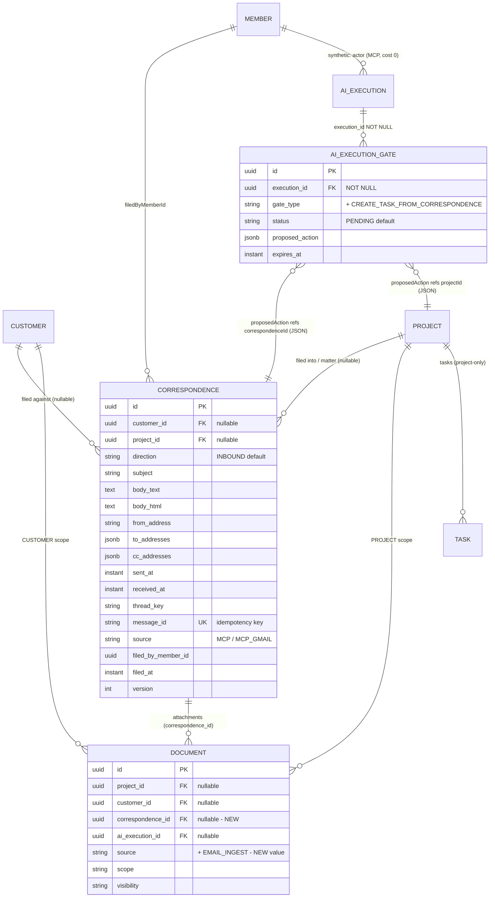
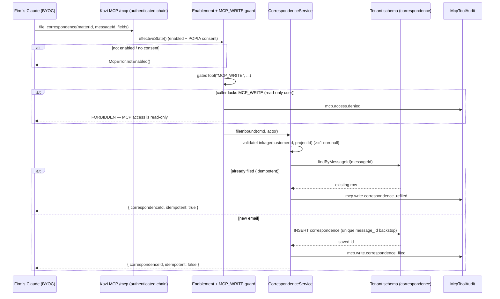
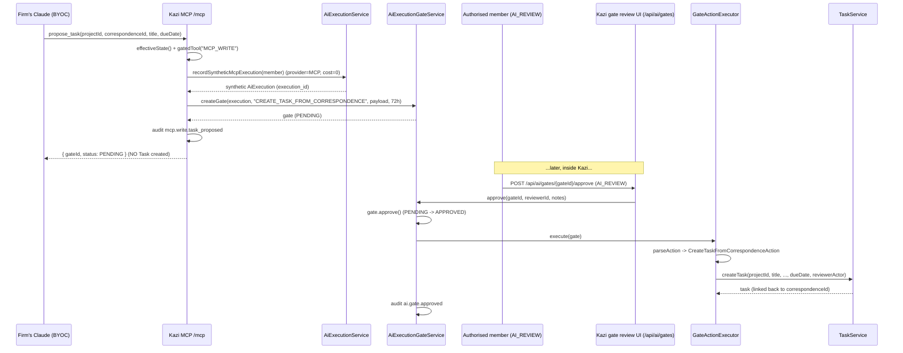

> Merge as a standalone phase doc (consistent with phase5–80 docs). Conceptually Section 11 if folded into ARCHITECTURE.md.

# Phase 81 — Inbound Correspondence & the First Gated MCP Write-Back (Email → Kazi)

## N.1 Overview

Kazi shipped a **read-only MCP server** in Phase 78 so that a firm's own Claude (Claude Code / Desktop / claude.ai) can be grounded in the firm's live data — the "bring your own Claude; Kazi provides the grounded context" play. That server has ~12 read tools, every call authenticated per-user (OAuth, ADR-303), per-tenant, enablement- and POPIA-egress-consent-gated (`McpEnablementService.effectiveState()`), and audited. It cannot write anything. So when a South African law firm's lawyer is sitting in Claude with a Gmail connector and an email arrives that belongs to a matter, filing it into Kazi is still fully manual copy-paste: download the attachment, re-upload it, retype the deadline as a task, paste the body into a note — slow, error-prone, and a POPIA exposure each time client data crosses the clipboard.

Phase 81 opens the **gated write-back chapter** reserved in the MCP plugin strategy, using **email-filing as the lighthouse use case**. It adds two things. First, a **net-new `correspondence` bounded context** in Kazi that stores a filed email (headers, body, thread key, direction) against a matter and/or a customer, with attachments persisted as first-class `Document`s through the existing `DocumentService`. Second, the **first write tools on the Kazi MCP server**, layered onto the *existing* Phase 78 pipeline rather than forking it: `resolve_matter_by_email` (read helper), `file_correspondence` and `attach_document` (Tier-1 direct, audited writes), and `propose_task` (Tier-2 gated write). The Tier-2 tool does not create a `Task` — it creates an `AiExecutionGate` in `PENDING` that an authorised member approves *inside Kazi*, at which point the existing `GateActionExecutor` runs `TaskService.createTask`. This is the **first time `AiExecutionGate` creation is exposed over MCP**, proven end-to-end by exactly one Tier-2 tool.

The governing constraint is **BYOC ingestion: Kazi does NOT integrate Gmail.** No OAuth-to-Google, no IMAP/POP, no inbound webhook, no mail poll, no email sync, and **no LLM/Anthropic/extraction call inside the Kazi backend**. The firm's own Claude holds the Gmail connector and the Kazi MCP server, reads the mailbox, performs the extraction, and calls the Kazi write tools with already-structured input. Kazi *receives* and *validates* (tenant, capability, linkage, idempotency) but never *reads the mailbox* and never *reasons*. This preserves the "the firm pays the tokens" cost model, keeps the Kazi attack surface small, and keeps Kazi's POPIA posture clean — the data moving over these tools flows *into* Kazi (the lower-risk direction), already filtered by a human-supervised Claude.

### What's new vs existing

| Existing capability | New capability (Phase 81) |
|---|---|
| Read-only Kazi MCP server (~12 read tools), Phase 78 — enablement + POPIA-egress consent + OAuth + per-call read audit (`mcp.tool.invoked`) | **First MCP write tools** — `file_correspondence`, `attach_document`, `propose_task` — reusing the same auth/enablement/consent pipeline, gated by a new `MCP_WRITE` capability, with a distinct `mcp.write.*` audit family |
| Outbound notification email only (`integration/email/` — `EmailMessage`, `EmailNotificationChannel`, SMTP/SendGrid) | **Inbound `correspondence` domain** — a filed-email record (headers, body, thread, direction) against a matter/customer, idempotent on a client-supplied message id |
| `AiExecutionGate` created *only* by in-product AI skill execution; approved in-product (`AI_REVIEW`) | **Gate creation exposed over MCP** (`propose_task`) — a synthetic `AiExecution` backs the gate so the `execution_id NOT NULL` invariant holds; approval still happens *only* inside Kazi |
| `DocumentService` files documents into PROJECT/CUSTOMER/ORG scope; `Document` links to `aiExecutionId` only | A nullable `correspondence_id` column on `documents` (mirrors `ai_execution_id`) ties an attachment to its correspondence; no new storage path |
| `CustomerRepository.findByEmail` resolves a customer by email (internal use) | `resolve_matter_by_email` read tool exposes it over MCP so Claude can disambiguate and pass an **explicit** target — Kazi never auto-files on a guess |
| The firm's Claude can read Gmail and read Kazi, but is the manual copy-paste bridge to write | The firm's Claude reads Gmail, reasons, and **writes the filed result back into the right matter** — Tier-1 directly, Tier-2 behind a human approval |

**Out of scope (verbatim from requirements):** any Gmail / email-provider integration inside Kazi (OAuth, IMAP/POP, inbound webhooks, polling, sync); any LLM / extraction call in the Kazi backend; Tier-2 beyond the one `propose_task` proof (bulk task extraction, deadline/calendar entities, auto-creating multiple tasks, new contact/party detection & creation — all v2); outbound correspondence writing / "send email from Kazi" (the `OUTBOUND` enum value is modelled but no send path ships); threaded conversation / full inbox UI, reply tracking, read receipts; portal exposure of correspondence (it is firm-internal); the consumer Claude skill (Gmail-read → reason → call Kazi tools) — that ships in `../claude-for-legal-sa`, not this repo; any MCP write tool other than the three named, plus the one `resolve_matter_by_email` read helper.

---

## N.2 Domain Model

One new bounded context, `correspondence/`, contains the `Correspondence` entity, its repository, service, DTOs, an event, and in-package enums. It follows the **exact** tenant-aware entity pattern of `TimeEntry`/`AiExecutionGate` (context inventory §10): `@Entity` with a plain `@Table` name and **no `tenant_id` column** (isolation is pure schema-per-tenant via Hibernate `search_path`), a UUID `@Id` via `GenerationType.UUID`, cross-aggregate foreign keys held as **raw `UUID` columns** (not JPA `@ManyToOne`), enums as `@Enumerated(EnumType.STRING)`, JSONB collections via `@JdbcTypeCode(SqlTypes.JSON)`, `@Version` optimistic locking, and `@PrePersist`/`@PreUpdate` timestamp callbacks. The richer template is `AiExecutionGate` (JSONB + `@Version`), not the leaner `TimeEntry`.

### N.2.1 `Correspondence` (`correspondence/Correspondence.java`, table `correspondence`)

| Field | Type | Constraints | Notes |
|---|---|---|---|
| `id` | `UUID` | PK, `@GeneratedValue(UUID)` | |
| `customerId` | `UUID` | nullable, raw FK → `customers.id` | Client the email belongs to. **At least one of `customerId`/`projectId` must be non-null** (see invariant). |
| `projectId` | `UUID` | nullable, raw FK → `projects.id` | The matter the email is filed into. Matters are `Project`s in Kazi. |
| `direction` | `Direction` enum | not null, `EnumType.STRING`, len 10, default `INBOUND` | `INBOUND \| OUTBOUND`. Only `INBOUND` is written in v1; `OUTBOUND` is modelled now to avoid a future enum migration but has no send path. |
| `subject` | `String` | nullable, ≤500 | Email subject as supplied by Claude. Nullable because some emails have no subject. |
| `bodyText` | `String` | nullable, `TEXT` | Plain-text body. The canonical body Kazi indexes/displays. |
| `bodyHtml` | `String` | nullable, `TEXT` | Optional HTML body. Stored verbatim; **never rendered as raw HTML** in Kazi UI (sanitise or render as text) to avoid stored-XSS. |
| `fromAddress` | `String` | not null, ≤320 | RFC-5321 max local+domain length. Single sender. |
| `toAddresses` | `List<String>` | `@JdbcTypeCode(JSON)`, jsonb, nullable | Recipient list. JSON, not a child table — see decision below. |
| `ccAddresses` | `List<String>` | `@JdbcTypeCode(JSON)`, jsonb, nullable | CC list. JSON. |
| `sentAt` | `Instant` | nullable | From the email `Date:` header, supplied by Claude. Nullable — Claude may not always extract it. |
| `receivedAt` | `Instant` | nullable | When the firm received it (header-derived). Distinct from `filedAt`. |
| `threadKey` | `String` | nullable, ≤255 | Provider thread id (e.g. Gmail thread id). Enables future thread grouping without a thread entity. |
| `messageId` | `String` | **not null**, ≤512 | The **idempotency key** — RFC-822 `Message-ID` or a Claude-supplied `externalId`. Unique per tenant (see N.2.2). |
| `source` | `String` | not null, ≤30, default `MCP` | Provenance, e.g. `MCP_GMAIL` / `MCP`. String constant (matches `Document.source` convention), not a JPA enum. |
| `filedByMemberId` | `UUID` | not null | The member whose MCP credentials filed it (the real authenticated MCP caller, from `RequestScopes.requireMemberId()`). |
| `filedAt` | `Instant` | not null, `@PrePersist` | When Kazi persisted the record (server clock). |
| `createdAt` | `Instant` | not null, immutable, `@PrePersist` | |
| `updatedAt` | `Instant` | not null, `@PreUpdate` | |
| `version` | `int` | `@Version` | Optimistic locking. |

**`Direction` enum** (`correspondence/Direction.java`): `INBOUND, OUTBOUND`.

**Invariant — at least one linkage target.** A `Correspondence` must attach to a matter and/or a client: `customerId IS NOT NULL OR projectId IS NOT NULL`. **Why both nullable + a `CHECK`, rather than one mandatory field:** an email can legitimately arrive before a matter is opened (filed against the client only), or be matter-only (a court email Claude tied to a matter whose client linkage is ambiguous). Forcing either field alone would reject a real case. The constraint is enforced both in `CorrespondenceService.validateLinkage()` (friendly error to Claude) and as a table `CHECK` (defence in depth). See [ADR-319](../adr/ADR-319-inbound-correspondence-domain.md).

**Design decision — recipients as JSONB, not a child table.** `toAddresses`/`ccAddresses` are stored as `jsonb` arrays on the row, mirroring `Task.appliedFieldGroups`/`customFields`. **Why:** recipients are write-once, read-as-a-whole, never queried individually, and never updated piecemeal in v1 — a child `correspondence_recipients` table would add a join, a second migration, and zero query value. If v2 needs "all correspondence to address X", a GIN index on the jsonb column covers it without a schema change.

**Design decision — single `Correspondence` entity, not a thread+message split.** v1 models each filed email as one flat `Correspondence` row carrying an optional `threadKey`. **Why:** thread reconstruction is explicitly v2; a `Thread`→`Message` two-entity model would be premature normalisation for a use case (file *this* email into *this* matter) that never needs the parent today. `threadKey` is the forward-compatible hook. See [ADR-319](../adr/ADR-319-inbound-correspondence-domain.md).

### N.2.2 Idempotency

A unique constraint on `(message_id)` within the tenant schema (the schema *is* the tenant boundary, so `message_id` alone is tenant-scoped) makes re-filing a no-op. **Dedupe contract:** `file_correspondence` looks up `findByMessageId(messageId)` first; if a row exists, it returns that row's id with an `idempotent: true` flag and emits no second persist (it *may* emit a low-severity `mcp.write.correspondence_refiled` audit for the trail). It does **not** mutate the existing row, and it does **not** re-link it to a different matter — a re-file with the same `messageId` but a different `matterId` returns the *existing* record and is reported as a no-op collision (Claude is told the email is already filed elsewhere; a human moves it in Kazi if needed). The unique constraint is the hard backstop against a race between the find and the insert. See [ADR-319](../adr/ADR-319-inbound-correspondence-domain.md).

### N.2.3 The synthetic `AiExecution` backing an MCP-created gate

`AiExecutionGate.execution_id` is **NOT NULL** (context inventory §5.1) — every gate today hangs off an `AiExecution` produced by in-product AI skill execution. `propose_task` has no such execution. Rather than make the FK nullable (which would weaken an invariant relied on across the gate subsystem and the `GateActionExecutor`, which calls `gate.getExecution().getId()`), Phase 81 creates a **lightweight synthetic `AiExecution`** at propose time:

| Field | Value for an MCP proposal |
|---|---|
| `actorId` / member | the authenticated MCP member (`RequestScopes.requireMemberId()`) |
| `provider` | `"MCP"` (BYOC — Kazi made no provider call) |
| `source` | `"MCP"` / `"BYOC"` |
| `model` | `null` / `"byoc"` (no Kazi-side model invocation) |
| input/output tokens | `0` |
| cost | `0` (the firm paid the tokens in their own Claude) |
| status | `EXTERNALLY_EXECUTED` — a terminal "externally executed / BYOC" state (no Kazi-side run to track; no token cost, no provider call) |

**Why synthetic, not nullable:** it preserves the `execution_id NOT NULL` invariant and the `gate.getExecution().getId()` contract verbatim, gives the cost-metering surface an honest zero-cost record of an AI-proposed action, and means the gate review UI can show "proposed via MCP by <member>" with no special-casing. The token-cost = 0 is itself the BYOC cost-model signal. See [ADR-322](../adr/ADR-322-tiered-write-safety-and-gate-over-mcp.md).

**Status value — `EXTERNALLY_EXECUTED` (recommended).** The synthetic execution carries status `EXTERNALLY_EXECUTED` (BYOC — no token cost, no provider call). `/breakdown`/implementation must first confirm whether `AiExecution.status` is a **closed enum** (→ add a new enum value `EXTERNALLY_EXECUTED`) or a **free `String`** (→ just use the constant), by checking the live `integration/ai/execution` package before coding.

### N.2.4 The `Document.correspondence_id` addition

`Document` has no generic source-reference field — only `source` (String) and `aiExecutionId` (nullable UUID, used when `source=AI_GENERATED`). Phase 81 adds a **nullable `correspondence_id` UUID column** to `documents`, mirroring the `ai_execution_id` pattern, plus a setter and an extra `source` constant `EMAIL_INGEST`. An attachment filed via `attach_document` is a normal `Document` (CUSTOMER- or PROJECT-scoped, visibility `INTERNAL`) that *additionally* carries `correspondence_id`. **Why this over a generalised `source_reference_type`+`source_reference_id`:** YAGNI — one nullable FK column matches the only link Phase 81 needs, mirrors an existing pattern reviewers already understand, and avoids the churn of migrating every `Document` to a polymorphic reference. See [ADR-319](../adr/ADR-319-inbound-correspondence-domain.md).

### N.2.5 What is unchanged

`Document`, `DocumentService`, S3 key structure, `AiExecutionGate` entity/lifecycle/expiry scheduler, `AiExecutionGateController` (approve/reject, `AI_REVIEW`), the approval UI, `TaskService.createTask`, `Task`, `Customer`, `CustomerRepository.findByEmail`, the MCP auth/enablement/consent pipeline, `McpCapabilityGuard`, `McpToolAudit`, the audit/activity registries' mechanism, and the `Capability` enforcement machinery (`@RequiresCapability` / `CapabilityAuthorizationManager`) are all reused **as-is**. The only edits outside the new context are: the `documents.correspondence_id` column + setter, the `MCP_WRITE` capability enum value, one new `GateAction` record + parse/execute arm, one new public `AiExecutionGateService` creation method, the `mcp.write.*` audit-family registration + activity formatter arms, and the new MCP write-tool component.

### N.2.6 ER diagram (relevant neighbourhood)



`CUSTOMER`, `PROJECT`, `MEMBER`, `TASK`, `AI_EXECUTION`, and `AI_EXECUTION_GATE` are existing entities, drawn only to show the relevant links. `CORRESPONDENCE` and the `DOCUMENT.correspondence_id` column / `EMAIL_INGEST` source value and the `CREATE_TASK_FROM_CORRESPONDENCE` gate type are net-new.

---

## N.3 Core Flows & Backend Behaviour

Every MCP write tool runs the **same inline guard preamble** (there is no central `tools/call` interceptor in Spring AI 2.0.0-M6, so cross-cutting concerns are inline per tool — context inventory §4.2):

```
1. enablement.effectiveState()  → false ? return McpError.notEnabled()   (integration enabled AND POPIA consent granted)
2. McpCapabilityGuard.gatedTool("MCP_WRITE", toolName, ...) wraps the body  → no MCP_WRITE ? mcp.access.denied audit + McpError.forbidden()
3. validate inputs (linkage, ids, idempotency key)                          → bad ? McpError.invalidRequest(...)
4. perform the write through the existing domain service
5. emit mcp.write.* audit via McpToolAudit (member, tenant, tool, target entity, outcome)
```

`resolve_matter_by_email` (read) keeps the Phase 78 read shape: `effectiveState()`, then the **read** capability (`MCP_ACCESS`), then `mcp.tool.invoked` audit — it does **not** require `MCP_WRITE`. A read-only MCP user (holds `MCP_ACCESS` but not `MCP_WRITE`) can call `resolve_matter_by_email` but is rejected by step 2 on all three write tools.

**Tenant boundary.** Every tool rides the standard authenticated Spring Security filter chain (context inventory §4.3/§4.5): `TenantFilter` binds `TENANT_ID`/`ORG_ID` (sets the Hibernate `search_path`), `MemberFilter` binds `MEMBER_ID`/`ORG_ROLE`/`CAPABILITIES`. By the time a tool body runs, all writes hit the caller's tenant schema only; a `Correspondence`/`Document`/gate created via MCP is visible exclusively within its tenant. A mandatory tenant-isolation test asserts a member in tenant A cannot file into, or read, tenant B's correspondence.

### N.3.a `file_correspondence` (Tier-1, direct write — idempotent upsert)

Conceptual service method:

```java
// correspondence/CorrespondenceService.java
@Transactional
public FileCorrespondenceResult fileInbound(FileCorrespondenceCommand cmd, ActorContext actor) {
  validateLinkage(cmd.customerId(), cmd.projectId());          // >= 1 non-null, else InvalidStateException
  return correspondenceRepository.findByMessageId(cmd.messageId())
      .map(existing -> FileCorrespondenceResult.idempotent(existing.getId()))   // no-op, return existing id
      .orElseGet(() -> {
        var c = new Correspondence(/* direction=INBOUND, fields from cmd */,
                                   actor.memberId(), cmd.source());
        var saved = correspondenceRepository.save(c);          // unique(message_id) is the race backstop
        return FileCorrespondenceResult.created(saved.getId());
      });
}
```

`FileCorrespondenceCommand` carries explicit `matterId`/`customerId`, the email fields, and `messageId`. On a unique-constraint violation thrown by a concurrent insert, the service catches it and re-reads `findByMessageId` to return the winner's id (idempotent under race). The tool emits `mcp.write.correspondence_filed` (created) or `mcp.write.correspondence_refiled` (no-op), with `details = {correspondenceId, matterId, customerId, idempotent}`. RBAC: `MCP_WRITE`. No gate.

### N.3.b `attach_document` (Tier-1, direct write — presigned-upload reuse)

Byte transfer reuses `DocumentService`'s **presigned-upload + confirm** pattern (the same mechanism the web UI uses), *not* inline base64. **Why presigned:** attachments can be multi-MB (PDFs, scans); inline base64 would bloat the MCP JSON payload past sane limits, hold bytes in the JVM heap, and diverge from the one storage path the codebase already trusts. `attach_document` is **one MCP tool with a required `phase` enum param (`INITIATE | CONFIRM`)** — *not* two tools. This keeps the "exactly four MCP tools" invariant true; the two-step handshake is carried by the `phase` param, not a second tool name. The flow is two calls to the *same* tool:

```java
// attach_document(phase=INITIATE, correspondenceId, fileName, contentType, size) -> returns presigned PUT URL + documentId
UploadInitResult init = documentService.initiateCustomerUpload(customerId, fileName, contentType, size); // or initiateUpload(projectId,...)
// Claude PUTs the bytes to init.presignedUrl(), then calls the SAME tool with phase=CONFIRM:
// attach_document(phase=CONFIRM, documentId)  -> server confirms + stamps correspondence_id
Document doc = documentService.confirmUpload(documentId, actor);
doc.setCorrespondenceId(correspondenceId);   // NEW setter
doc.setSource("EMAIL_INGEST");
```

(The architecture mandates the single-tool-with-`phase`-param shape, presigned-upload reuse, and the `correspondence_id` stamp on confirm.) Scope = CUSTOMER (or PROJECT when a matter is known), visibility = `INTERNAL`, `source = EMAIL_INGEST`. The attachment appears in the matter's existing documents list (it *is* a `Document`). Audit: `mcp.write.document_attached`, `details = {documentId, correspondenceId, fileName}`. RBAC: `MCP_WRITE`. No gate.

### N.3.c `resolve_matter_by_email` (read helper)

```java
// reuses CustomerRepository.findByEmail -> Optional<Customer>, then that customer's matters
Optional<Customer> customer = customerRepository.findByEmail(email.trim().toLowerCase());
List<McpMatterDto> matters = customer.map(c ->
    customerProjectService.listProjectsForCustomer(c.getId(), actor)).orElse(List.of());
return new ResolveResult(customer.map(McpClientDto::from).orElse(null), matters);   // zero or many -> return all
```

**Zero/many behaviour:** if no customer matches, returns `{customer: null, matters: []}` — Claude is told there is no match and must not file blindly. If a customer matches but has multiple matters, returns *all* of them; Claude disambiguates and passes an explicit `matterId` to the write tools. Kazi never auto-files on a guess. Optional `subjectHint`/`reference` params are passed through to help Claude rank, but Kazi does **no** fuzzy matching server-side. Audit: `mcp.tool.invoked` (read family) — `resolve_matter_by_email` is a **read**, so it never emits an `mcp.write.*` event. RBAC: read capability (`MCP_ACCESS`). See [ADR-323](../adr/ADR-323-email-matter-linking.md).

### N.3.d `propose_task` → synthetic execution → gate PENDING → in-Kazi approval → executor → task

`propose_task` **never** creates a `Task`. It creates a synthetic `AiExecution`, then a `PENDING` `AiExecutionGate` whose JSON payload describes the proposed task, and returns the gate id.

**Mandatory v1 open-gate guard (dedupe).** Before creating any synthetic execution or gate, `propose_task` checks for an existing **PENDING** gate with the same `(correspondenceId, gate_type=CREATE_TASK_FROM_CORRESPONDENCE)` pair (via `aiExecutionGateService` / a repository lookup that filters PENDING gates whose `proposedAction->>'correspondence_id'` matches). If one exists, the tool returns that existing `gateId` with `duplicate: true` (and does **not** create a second synthetic execution or gate). This stops a re-run of the same proposal from stacking duplicate gates for a reviewer to triage. The *fuller* dedupe (idempotency keys across all action params, cross-tenant request replay) stays v2; the open-gate guard ships in v1.

```java
// correspondence/ or mcp: propose_task tool body (after MCP_WRITE guard)
// v1 open-gate guard: one PENDING gate per (correspondence, CREATE_TASK_FROM_CORRESPONDENCE)
Optional<UUID> existing = aiExecutionGateService.findPendingGateForCorrespondence(
    correspondenceId, "CREATE_TASK_FROM_CORRESPONDENCE");
if (existing.isPresent()) return ProposeTaskResult.duplicate(existing.get());  // { gateId, duplicate: true }

AiExecution synthetic = aiExecutionService.recordSyntheticMcpExecution(actor.memberId());   // provider=MCP, cost=0
Map<String,Object> payload = Map.of(
    "correspondence_id", correspondenceId.toString(),
    "project_id", projectId.toString(),
    "title", title, "description", description,
    "due_date", dueDate == null ? null : dueDate.toString(),
    "assignee_id", assigneeId == null ? null : assigneeId.toString());
UUID gateId = aiExecutionGateService.createGate(
    synthetic, "CREATE_TASK_FROM_CORRESPONDENCE", payload,
    /* aiReasoning */ "Proposed from filed email " + correspondenceId, /* expiresAt */ now.plus(72h));
// audit: mcp.write.task_proposed {gateId, correspondenceId, projectId}
```

`createGate(...)` is the **new public creation method** on `AiExecutionGateService` (none exists today — gate creation was internal to skill execution). The gate is `PENDING`, 72h expiry via the existing scheduler. Later, an authorised member (capability `AI_REVIEW`) approves it via the **existing** `AiExecutionGateController` `POST /api/ai/gates/{id}/approve`. On approval, `AiExecutionGateService.approve` calls `gateActionExecutor.execute(gate)`, which parses `CREATE_TASK_FROM_CORRESPONDENCE` into the new `CreateTaskFromCorrespondenceAction` record and dispatches to a helper calling `TaskService.createTask(projectId, title, …, dueDate, reviewerActor, …)`. The created task links back to the correspondence via the `customFields` param — `Map.of("correspondenceId", correspondenceId.toString())` — since `Task` has no FK to correspondence. The gate review UI shows the originating correspondence so approval is informed. RBAC: `MCP_WRITE` to propose; `AI_REVIEW` to approve. See [ADR-322](../adr/ADR-322-tiered-write-safety-and-gate-over-mcp.md).

**Idempotency / dedupe rule recap.** `file_correspondence` dedupes on `messageId` (N.2.2). `attach_document` is naturally idempotent per `documentId` (confirm is safe to retry). `propose_task` carries a **v1 open-gate guard**: a second proposal for a correspondence that already has a PENDING `CREATE_TASK_FROM_CORRESPONDENCE` gate returns the existing `gateId` with `duplicate: true` instead of creating a second gate (N.3.d). The *fuller* dedupe (idempotency keys over all params) stays v2.

**Paging/filtering for the correspondence list.** The read-only correspondence list (matter detail tab, N.4) is paginated via the existing `McpPagination`/Spring `Pageable` pattern — `findByProjectIdOrderByReceivedAtDesc(projectId, pageable)` and `findByCustomerIdOrderByReceivedAtDesc(customerId, pageable)`, default page size 50, capped (mirrors the read-tool pagination ceiling).

---

## N.4 API / Tool Surface

### MCP tools (the complete Phase 81 surface — exactly four)

| Tool | Params | R/W | Capability | Gated? | Audit family |
|---|---|---|---|---|---|
| `resolve_matter_by_email` | `email` (req), `subjectHint` (opt), `reference` (opt) | Read | `MCP_ACCESS` | No | `mcp.tool.invoked` |
| `file_correspondence` | `matterId`/`customerId` (≥1 req), `subject`, `bodyText`, `bodyHtml?`, `fromAddress`, `toAddresses[]`, `ccAddresses[]?`, `sentAt?`, `receivedAt?`, `threadKey?`, `messageId` (req) | Write (Tier-1, direct) | `MCP_WRITE` | No | `mcp.write.correspondence_filed` / `…_refiled` |
| `attach_document` | `phase` enum `INITIATE \| CONFIRM` (req); INITIATE: `correspondenceId` (req), `fileName` (req), `contentType`, `size`; CONFIRM: `documentId` (req) | Write (Tier-1, direct) | `MCP_WRITE` | No | `mcp.write.document_attached` |
| `propose_task` | `projectId` (req), `correspondenceId` (req), `title` (req), `description?`, `dueDate?`, `assigneeId?` | Write (Tier-2, gated) | `MCP_WRITE` | **Yes** (creates `AiExecutionGate` PENDING; `AI_REVIEW` approves) | `mcp.write.task_proposed` |

Grouped by capability area: **read** = `resolve_matter_by_email` (`MCP_ACCESS`); **direct writes** = `file_correspondence` + `attach_document` (`MCP_WRITE`); **gated write** = `propose_task` (`MCP_WRITE` to create, `AI_REVIEW` to approve in-product).

### JSON request/response shapes

**`resolve_matter_by_email`**
```json
// request
{ "email": "jane@acme.co.za", "subjectHint": "RE: Lease dispute" }
// response
{ "customer": { "id": "c-uuid", "name": "Acme (Pty) Ltd", "email": "jane@acme.co.za" },
  "matters": [ { "id": "p-uuid-1", "name": "Acme v Beta — lease" },
               { "id": "p-uuid-2", "name": "Acme — POPIA compliance" } ] }
// zero match
{ "customer": null, "matters": [] }
```

**`file_correspondence`**
```json
// request
{ "matterId": "p-uuid-1", "customerId": "c-uuid",
  "subject": "RE: Lease dispute — settlement", "bodyText": "Dear ...",
  "fromAddress": "jane@acme.co.za", "toAddresses": ["attorney@firm.co.za"],
  "ccAddresses": [], "sentAt": "2026-06-20T09:14:00Z", "receivedAt": "2026-06-20T09:14:05Z",
  "threadKey": "gmail-thread-abc", "messageId": "<CA+abc123@mail.gmail.com>" }
// response (created)
{ "correspondenceId": "k-uuid", "idempotent": false }
// response (re-file no-op)
{ "correspondenceId": "k-uuid", "idempotent": true }
```

**`attach_document`** (one tool; the `phase` param selects the step)
```json
// request (phase=INITIATE)
{ "phase": "INITIATE", "correspondenceId": "k-uuid", "fileName": "settlement-offer.pdf",
  "contentType": "application/pdf", "size": 248113 }
// response (INITIATE) -> Claude PUTs bytes to presignedUrl, then confirms
{ "documentId": "d-uuid", "presignedUrl": "https://...", "expiresInSeconds": 900 }
// request (phase=CONFIRM)  { "phase": "CONFIRM", "documentId": "d-uuid" }
// response (CONFIRM) { "documentId": "d-uuid", "status": "UPLOADED", "correspondenceId": "k-uuid" }
```

**`propose_task`**
```json
// request
{ "projectId": "p-uuid-1", "correspondenceId": "k-uuid",
  "title": "File answering affidavit", "description": "Per opposing counsel email",
  "dueDate": "2026-07-04", "assigneeId": null }
// response (new gate)
{ "gateId": "g-uuid", "status": "PENDING", "duplicate": false,
  "message": "Task proposed. An authorised member must approve it in Kazi before it is created." }
// response (duplicate — an open gate already exists for this correspondence)
{ "gateId": "g-uuid", "status": "PENDING", "duplicate": true,
  "message": "A task for this email is already awaiting approval in Kazi." }
```

**Read-only-user-rejected error (any write tool, caller lacks `MCP_WRITE`)**
```json
{ "error": { "code": "FORBIDDEN",
  "message": "This action requires the MCP_WRITE capability. Your MCP access is read-only." } }
```

### Thin REST surface

No new approval REST is needed — `propose_task` reuses `AiExecutionGateController` (`/api/ai/gates`) verbatim. The only candidate new REST is a **read-only** correspondence list for the matter-detail tab:

```
GET /api/projects/{projectId}/correspondence?page=&size=   -> Page<CorrespondenceListResponse>
GET /api/customers/{customerId}/correspondence?page=&size= -> Page<CorrespondenceListResponse>
```
Both `@PreAuthorize("isAuthenticated()")`, tenant-scoped, returning `{id, subject, fromAddress, receivedAt, attachmentCount, direction}`. **Access control:** these are in-app REST reads, so they require an **authenticated member + tenant scope + the existing project/customer view-access check** (the same check that gates listing a matter's documents) — they do **NOT** require any MCP capability. MCP capabilities (`MCP_ACCESS`/`MCP_WRITE`) gate MCP *tools*, not in-app REST; a member who can view the matter can read its correspondence list whether or not MCP is enabled for them. No write REST (writes are MCP-only by design).

---

## N.5 Sequence Diagrams

### N.5.1 `file_correspondence` happy path + idempotent re-file branch + read-only rejection



### N.5.2 `propose_task` end-to-end (Claude proposes → synthetic execution + PENDING gate → attorney approves in Kazi → executor → task)



The read-only-user rejection path is shown inline in N.5.1 (the `alt caller lacks MCP_WRITE` branch); it applies identically to `attach_document` and `propose_task`.

---

## N.6 Additional Concerns

### POPIA / egress symmetry for writes

Phase 78 gates *reads* behind egress consent because reads move client data *out* of Kazi into the firm's Claude. Writes move client data *into* Kazi — the lower-risk direction. **Decision: writes are gated by MCP enablement (the same `effectiveState()` integration flag) but do NOT require a separate write-consent flag, and they emit a distinct `mcp.write.*` audit family.** **Why no separate consent flag:** the POPIA risk that consent addresses is *egress* (data leaving the firm's control); ingress into Kazi does not create a new egress, so a second consent toggle would be ceremony without a matching risk. Enablement (is the MCP integration on at all?) is the correct gate. The `mcp.write.*` audit family gives the firm a POPIA-defensible record of *what AI wrote* (member, tenant, target entity, tool, outcome), separate from *what it read* (`mcp.tool.invoked`). If a firm later wants a "no AI writes" posture without disabling reads, that is a v2 capability-revocation (don't grant `MCP_WRITE`), not a consent flag. See [ADR-321](../adr/ADR-321-mcp-write-tool-category.md).

### BYOC trust boundary — what Kazi trusts vs validates

| Kazi **trusts** Claude to have done (BYOC) | Kazi **validates** server-side (never trusts) |
|---|---|
| Read the right mailbox; extract subject/body/headers correctly | The authenticated member + tenant (OAuth → `TenantFilter`/`MemberFilter`) |
| Pick the correct matter/customer to file into (disambiguation) | `MCP_WRITE` capability before any write; `AI_REVIEW` before any approval |
| Pay the LLM tokens (cost model) | The ≥1-non-null linkage rule; that `matterId`/`customerId` exist in *this* tenant |
| Supply a stable `messageId` | Idempotency (dedupe on `messageId`, unique-constraint backstop) |
| Summarise/propose a task accurately | That `propose_task` creates only a gate — never a `Task` directly (no bypass path exists) |

Kazi never reasons about whether the filing *should* happen — that is the human-supervised Claude's job — but it enforces every authorization, tenant, linkage, and idempotency invariant before persisting. See [ADR-320](../adr/ADR-320-byoc-ingestion-boundary.md).

### S3 key structure for correspondence attachments

Attachments **reuse the existing document key structure** (context inventory §6.3) — no new prefix. A CUSTOMER-scoped attachment lands at `org/{orgId}/customer/{customerId}/{documentId}`; a PROJECT-scoped one at `org/{orgId}/project/{projectId}/{documentId}`. The `correspondence_id` link lives in the DB row, not the S3 key. **Why:** the attachment *is* a normal document and must appear in the matter's documents list and obey the same retention/access rules; a bespoke correspondence key prefix would split it off from the one storage path the codebase trusts and break the documents-list query.

---

## N.7 Database Migrations

One tenant migration, `V130__create_correspondence_tables.sql`, contains **both** the `correspondence` table and the `documents.correspondence_id` ALTER. **Why one migration, not two:** they are a single atomic feature unit (a correspondence is meaningless without the document link, and the link FK references the new table), they ship together, and a single file keeps the dependency ordering explicit (table created before the FK). The new `MCP_WRITE` capability is auto-granted to owner/admin in code (`OrgRoleService`); a row-grant for other roles, if desired, is a separate idempotent migration following the `V77` pattern — not required for v1.

```sql
-- db/migration/tenant/V130__create_correspondence_tables.sql
-- Phase 81: inbound correspondence domain + Document->Correspondence link.
-- Per-tenant schema (search_path = tenant). No tenant_id column (schema-per-tenant isolation).

CREATE TABLE correspondence (
    id                 UUID PRIMARY KEY,
    customer_id        UUID,                       -- nullable FK -> customers(id)
    project_id         UUID,                       -- nullable FK -> projects(id)  (matter)
    direction          VARCHAR(10)  NOT NULL DEFAULT 'INBOUND',
    subject            VARCHAR(500),
    body_text          TEXT,
    body_html          TEXT,
    from_address       VARCHAR(320) NOT NULL,
    to_addresses       JSONB,
    cc_addresses       JSONB,
    sent_at            TIMESTAMPTZ,
    received_at        TIMESTAMPTZ,
    thread_key         VARCHAR(255),
    message_id         VARCHAR(512) NOT NULL,
    source             VARCHAR(30)  NOT NULL DEFAULT 'MCP',
    filed_by_member_id UUID         NOT NULL,
    filed_at           TIMESTAMPTZ  NOT NULL,
    created_at         TIMESTAMPTZ  NOT NULL,
    updated_at         TIMESTAMPTZ  NOT NULL,
    version            INTEGER      NOT NULL DEFAULT 0,
    CONSTRAINT chk_correspondence_linkage CHECK (customer_id IS NOT NULL OR project_id IS NOT NULL)
);

-- Idempotency key: re-filing the same email is a no-op (find-then-insert; this is the race backstop).
-- message_id is tenant-scoped because the schema IS the tenant boundary.
CREATE UNIQUE INDEX ux_correspondence_message_id ON correspondence (message_id);

-- List a matter's / client's correspondence newest-first (matter-detail tab, paginated).
CREATE INDEX ix_correspondence_project  ON correspondence (project_id, received_at DESC);
CREATE INDEX ix_correspondence_customer ON correspondence (customer_id, received_at DESC);

-- Thread grouping hook (v2); cheap to add now, avoids a later migration.
CREATE INDEX ix_correspondence_thread   ON correspondence (thread_key);

-- Link a filed attachment (a Document) back to its correspondence. Mirrors documents.ai_execution_id.
ALTER TABLE documents ADD COLUMN correspondence_id UUID;   -- nullable; set on attach_document confirm
CREATE INDEX ix_documents_correspondence ON documents (correspondence_id);
```

**Index rationale:**
- `ux_correspondence_message_id` (UNIQUE) — enforces the idempotency contract and is the concurrency backstop for the find-then-insert in `fileInbound`.
- `ix_correspondence_project` / `ix_correspondence_customer` `(… , received_at DESC)` — serve the paginated matter/customer correspondence list directly (composite covers the `WHERE` + `ORDER BY`).
- `ix_correspondence_thread` — cheap forward-compat for v2 thread grouping; no v1 query yet but avoids a later schema touch.
- `ix_documents_correspondence` — serves the "attachments for this correspondence" lookup and the per-correspondence attachment count.

**RLS for shared-schema tenants.** Kazi's primary isolation is schema-per-tenant (search_path), so these tables carry no `tenant_id` and no RLS in the schema-per-tenant deployment — matching every existing tenant table (`time_entries`, `tasks`, `documents`, `ai_execution_gates`). The `V25__create_shard_config.sql` shared-schema/shard path (global migrations) governs any future shared-schema deployment; if a tenant ever runs shared-schema, the correspondence table inherits the *same* RLS policy mechanism the existing tenant tables use there — no Phase-81-specific RLS is introduced, because introducing a one-off policy here would diverge from the established pattern.

**Backfill:** none. `correspondence` is a new table; `documents.correspondence_id` is nullable and defaults to NULL for all existing rows (existing documents have no correspondence — correct).

**Prerequisites:** `customers`, `projects`, `documents`, `members` tables (all pre-existing). `V130` is the confirmed next free tenant migration (highest = `V129__create_mcp_egress_consents.sql`). **V130 confirmed next-free tenant migration as of 2026-06-21 per `.arch-context.md §3`; re-verify before implementing Slice 1 (another phase may land first).**

---

## N.8 Implementation Guidance

### Backend changes

| File | Change |
|---|---|
| `correspondence/Correspondence.java` | **New** entity (mirror `AiExecutionGate`: JSONB collections, `@Version`, `@PrePersist`/`@PreUpdate`). |
| `correspondence/Direction.java` | **New** enum `INBOUND, OUTBOUND`. |
| `correspondence/CorrespondenceRepository.java` | **New** — `findByMessageId`, `findByProjectIdOrderByReceivedAtDesc(pageable)`, `findByCustomerIdOrderByReceivedAtDesc(pageable)`. |
| `correspondence/CorrespondenceService.java` | **New** — `fileInbound` (idempotent), `validateLinkage`, list methods, attachment-count. |
| `correspondence/dto/*` | **New** — `FileCorrespondenceCommand`, `FileCorrespondenceResult`, `CorrespondenceListResponse`, `ResolveResult`. |
| `correspondence/CorrespondenceController.java` | **New** — read-only `GET …/correspondence` list endpoints. |
| `mcp/tool/CorrespondenceWriteTools.java` | **New** `@Component` — the **three write** tools (`file_correspondence`, `attach_document` with `phase` param, `propose_task`), each with the inline write-guard preamble (`MCP_WRITE`). |
| `mcp/tool/ClientTools.java` (or new `CorrespondenceReadTools.java`) | **Edit/New** — host the **read** tool `resolve_matter_by_email` (`MCP_ACCESS`, `mcp.tool.invoked` audit) alongside the existing read tools; the `CustomerRepository`/matter-lookup deps live here, not in `CorrespondenceWriteTools`. |
| `mcp/dto/*` | **New** read/write MCP DTOs for the tools' responses. |
| `document/Document.java` | **Edit** — add nullable `correspondenceId` + setter; add `EMAIL_INGEST` source constant. |
| `orgrole/Capability.java` | **Edit** — add `MCP_WRITE` enum value. |
| `integration/ai/gate/GateAction.java` | **Edit** — add `CreateTaskFromCorrespondenceAction` to `permits` + record. |
| `integration/ai/gate/GateActionExecutor.java` | **Edit** — add `parseAction` arm + `execute` switch arm + `executeCreateTask` helper (calls `TaskService.createTask`). **Add `TaskService` as a new constructor dependency** — it currently injects only `ChecklistInstanceService`, `ConflictCheckService`, `AiReviewReportGenerator`, `AiDraftDocumentGenerator`, `ComplianceAuditReportService`, `ObjectMapper` (context inventory §5.5); `TaskService` is **not** among them and must be added. |
| `integration/ai/gate/AiExecutionGateService.java` | **Edit** — add public `createGate(execution, gateType, payload, reasoning, expiresAt)`. |
| `integration/ai/execution/…` | **Edit** — add `recordSyntheticMcpExecution(memberId)` (provider=MCP, cost=0, status `EXTERNALLY_EXECUTED`). Confirm whether `AiExecution.status` is a closed enum (→ add `EXTERNALLY_EXECUTED` value) or a free `String` (→ use the constant) by checking the live `integration/ai/execution` package first. |
| `audit/AuditEventTypeRegistry.java` | **Edit** — register `mcp.write.*` family (`NOTICE`, `STANDARD`). |
| `activity/ActivityMessageFormatter.java` | **Edit** — add `mcp.write.correspondence_filed` / `…_document_attached` / `…_task_proposed` formatter arms + `correspondence` entity-name resolver. |
| `db/migration/tenant/V130__create_correspondence_tables.sql` | **New** migration (N.7). V130 confirmed next-free tenant migration as of 2026-06-21 per `.arch-context.md §3`; re-verify before implementing Slice 1 (another phase may land first). |

### Frontend changes (lean)

| File | Change |
|---|---|
| `frontend/app/(app)/org/[slug]/projects/[projectId]/…` (matter detail) | **Add** a read-only "Correspondence" tab: subject, from, date, attachment count, link to documents. Reuse the existing detail-tab + timeline components. |
| `frontend/app/(app)/org/[slug]/ai/…` (gate review queue) | **Edit** — show the originating correspondence (subject + link) on a `CREATE_TASK_FROM_CORRESPONDENCE` gate so approval is informed. |
| (attachments) | **No new UI** — attachments appear in the matter's existing documents list (they are `Document`s). |

### Annotated entity pattern (`Correspondence` mirroring `AiExecutionGate`/`TimeEntry`)

```java
@Entity
@Table(name = "correspondence")
public class Correspondence {
  @Id @GeneratedValue(strategy = GenerationType.UUID) private UUID id;

  @Column(name = "customer_id") private UUID customerId;   // raw UUID FK, not @ManyToOne
  @Column(name = "project_id")  private UUID projectId;

  @Enumerated(EnumType.STRING) @Column(name="direction", nullable=false, length=10)
  private Direction direction = Direction.INBOUND;

  @Column(name="subject", length=500) private String subject;
  @Column(name="body_text", columnDefinition="TEXT") private String bodyText;
  @Column(name="body_html", columnDefinition="TEXT") private String bodyHtml;
  @Column(name="from_address", nullable=false, length=320) private String fromAddress;

  @JdbcTypeCode(SqlTypes.JSON) @Column(name="to_addresses", columnDefinition="jsonb")
  private List<String> toAddresses;
  @JdbcTypeCode(SqlTypes.JSON) @Column(name="cc_addresses", columnDefinition="jsonb")
  private List<String> ccAddresses;

  @Column(name="sent_at") private Instant sentAt;
  @Column(name="received_at") private Instant receivedAt;
  @Column(name="thread_key", length=255) private String threadKey;
  @Column(name="message_id", nullable=false, length=512) private String messageId; // idempotency key
  @Column(name="source", nullable=false, length=30) private String source = "MCP";
  @Column(name="filed_by_member_id", nullable=false) private UUID filedByMemberId;
  @Column(name="filed_at", nullable=false) private Instant filedAt;
  @Column(name="created_at", nullable=false, updatable=false) private Instant createdAt;
  @Column(name="updated_at", nullable=false) private Instant updatedAt;
  @Version private int version;

  protected Correspondence() {}
  @PrePersist void onCreate(){ var n=Instant.now(); createdAt=n; updatedAt=n; if(filedAt==null) filedAt=n; }
  @PreUpdate  void onUpdate(){ updatedAt=Instant.now(); }
  // constructor + getters/setters ...
}
```

### Repository JPQL pattern

```java
public interface CorrespondenceRepository extends JpaRepository<Correspondence, UUID> {
  Optional<Correspondence> findByMessageId(String messageId);   // idempotency lookup
  @Query("SELECT c FROM Correspondence c WHERE c.projectId = :pid ORDER BY c.receivedAt DESC")
  Page<Correspondence> findByProjectId(@Param("pid") UUID projectId, Pageable pageable);
  @Query("SELECT c FROM Correspondence c WHERE c.customerId = :cid ORDER BY c.receivedAt DESC")
  Page<Correspondence> findByCustomerId(@Param("cid") UUID customerId, Pageable pageable);
}
```
(Plain `findById` is inherited and tenant-safe via search_path; no `findOneById` convention in this repo — context inventory §10.)

### MCP write-tool annotated skeleton (mirrors the read-tool, with inline guards)

`resolve_matter_by_email` is a **read** tool and lives with the existing read-tool family (alongside `ClientTools`), **not** in `CorrespondenceWriteTools`. `CorrespondenceWriteTools` holds only the three write tools (`file_correspondence`, `attach_document`, `propose_task`); the customer/matter-lookup dependencies (`CustomerRepository`, `CustomerProjectService`) move to the read-tool class that hosts `resolve_matter_by_email`.

```java
@Component
public class CorrespondenceWriteTools {           // 3 WRITE tools only — resolve_matter_by_email lives in the read-tool family
  // ctor: CorrespondenceService, DocumentService, AiExecutionGateService, AiExecutionService,
  //       AuditService, McpEnablementService, McpMetrics, ObjectMapper
  //   (CustomerRepository / CustomerProjectService are NOT here — they move to the read-tool class
  //    that hosts resolve_matter_by_email, e.g. ClientTools or a new CorrespondenceReadTools.)

  @McpTool(name="file_correspondence",
      description="File an inbound email into a matter and/or client. Idempotent on messageId.")
  public Object fileCorrespondence(
      @McpToolParam(required=false, description="Matter (project) id.") UUID matterId,
      @McpToolParam(required=false, description="Client (customer) id.") UUID customerId,
      @McpToolParam(description="Stable RFC-822 Message-ID or externalId (idempotency key).") String messageId,
      /* subject, bodyText, fromAddress, toAddresses, ... */) {

    if (!enablement.effectiveState())                                  // 1. enablement + POPIA consent
      return McpToolErrors.asResult(McpError.notEnabled(), objectMapper);
    return McpCapabilityGuard.gatedTool("MCP_WRITE", "file_correspondence",  // 2. write capability gate
        auditService, metrics, objectMapper, startNanos -> {
          var actor = ActorContext.fromRequestScopes();
          var result = correspondenceService.fileInbound(                 // 4. domain write
              new FileCorrespondenceCommand(matterId, customerId, messageId, /* ... */), actor);
          var meta = McpAuditMetadata.builder().rowCount(1)
              .entityRef(result.correspondenceId()).param("idempotent", result.idempotent()).build();
          // 5. audit family mcp.write.* via the guard's success path / McpToolAudit
          return result;
        });
  }
  // attach_document(phase, ...), propose_task(...) follow the same shape.
  // resolve_matter_by_email(... read capability MCP_ACCESS ...) is NOT here — it ships in the read-tool family.
}
```

### New `GateAction` record + executor arm

```java
// GateAction.java — add CreateTaskFromCorrespondenceAction to the sealed permits clause
public sealed interface GateAction
    permits GateAction.MarkKycCompleteAction,
        GateAction.SelectMatterTemplateAction,
        GateAction.ClearConflictAction,
        GateAction.CreateReviewReportAction,
        GateAction.CreateDraftDocumentAction,
        GateAction.PublishComplianceReportAction,
        GateAction.CreateTaskFromCorrespondenceAction {   // NEW — 7th subtype
  // ... existing six records ...
  record CreateTaskFromCorrespondenceAction(
      UUID correspondenceId, UUID projectId, String title, String description,
      LocalDate dueDate, UUID assigneeId) implements GateAction {}
}

// GateActionExecutor.execute(...) — new exhaustive switch arm (compiler enforces this)
case GateAction.CreateTaskFromCorrespondenceAction a -> executeCreateTask(a, reviewerId);

// parseAction(...) — new arm
case "CREATE_TASK_FROM_CORRESPONDENCE" -> new GateAction.CreateTaskFromCorrespondenceAction(
    UUID.fromString((String) p.get("correspondence_id")),
    UUID.fromString((String) p.get("project_id")),
    (String) p.get("title"), (String) p.get("description"),
    p.get("due_date")==null ? null : LocalDate.parse((String) p.get("due_date")),
    p.get("assignee_id")==null ? null : UUID.fromString((String) p.get("assignee_id")));

// executeCreateTask helper — writes the correspondence back-link via the customFields param
// (Task has no FK to correspondence; the back-link is a custom field).
private void executeCreateTask(GateAction.CreateTaskFromCorrespondenceAction a, UUID reviewerId) {
  taskService.createTask(a.projectId(), a.title(), a.description(), "MEDIUM", null,
      a.dueDate(), ActorContext.forMember(reviewerId),
      Map.of("correspondenceId", a.correspondenceId().toString()),   // customFields: back-link to correspondence
      null, a.assigneeId(), null, null, null);
}
```

### New `AiExecutionGateService.createGate(...)` method

Gate creation is internal to AI skill execution today — no public creation method exists (context inventory §5.2). Phase 81 adds one, mirroring the shape of the existing `approve`/`reject` methods (`@Transactional`, persist, then emit a domain event):

```java
// AiExecutionGateService.java — NEW public creation method
@Transactional
public AiExecutionGate createGate(
    AiExecution execution,            // the synthetic MCP-backed execution (execution_id NOT NULL holds)
    String gateType,                  // "CREATE_TASK_FROM_CORRESPONDENCE"
    Map<String, Object> proposedAction, // jsonb payload (correspondence_id, project_id, title, ...)
    String aiReasoning,               // human-readable proposal rationale (TEXT NOT NULL)
    Instant expiresAt) {              // now + 72h; the existing expiry scheduler reaps it
  var gate = new AiExecutionGate(execution, gateType, proposedAction, aiReasoning, expiresAt);
  var saved = gateRepository.save(gate);   // status defaults PENDING
  eventPublisher.publishEvent(new AiGatePendingEvent(saved.getId()));  // mirror approve/reject event emission
  // audit ai.gate.created (entityType ai_execution_gate) — same emission shape as ai.gate.approved
  return saved;
}
```

Note: whether a dedicated `AiGatePendingEvent` already exists or must be added is an implementation call for `/breakdown` — the existing service emits `AiGateApprovedEvent`/`AiGateRejectedEvent`/`AiGateExpiredEvent` (context inventory §5.2), so a pending/created event follows the same pattern. If no listener needs it in v1, the event emission may be omitted; the audit row is mandatory.

### Testing strategy

| Test | Asserts |
|---|---|
| `CorrespondenceService` create | filing persists a row with INBOUND + correct linkage. |
| Idempotent re-file | second `fileInbound(sameMessageId)` returns the same id, persists nothing new. |
| Linkage invariant | both-null linkage is rejected (service + DB `CHECK`). |
| `attach_document` | a `Document` is created via `DocumentService` with `correspondence_id` + `source=EMAIL_INGEST`. |
| `resolve_matter_by_email` | reuses `findByEmail`; zero match → empty; multi-matter → all returned. |
| MCP write-capability gate | a member with `MCP_ACCESS` but no `MCP_WRITE` is rejected on all three write tools (and `mcp.access.denied` audited). |
| `propose_task` creates gate only | a PENDING gate exists; **no `Task` is created** until approval. |
| Synthetic execution | the gate's `execution_id` is non-null (synthetic AiExecution, provider=MCP, cost=0). |
| Approval executes | approving the gate (`AI_REVIEW`) creates the task via `GateActionExecutor`/`TaskService`. |
| Tenant isolation (**mandatory**) | tenant A cannot file into or read tenant B's correspondence. |
| Boundary asserts | no Gmail/Google/IMAP dependency, no inbound webhook/poll, no LLM call added (review-time grep + dependency check). |

Full `./mvnw verify` clean (not narrowed). "PASS means observed" — exercise the tools against a running MCP server (Claude or an MCP test client) → backend log → DB row / S3 object / gate record; reproduce-before-fix for any bug. No testcontainers (in-memory/mock).

---

## N.9 Permission Model Summary

| Operation | Capability required | Tenant scope | Notes |
|---|---|---|---|
| `resolve_matter_by_email` (read) | `MCP_ACCESS` | caller's tenant | Read-only; read audit. Does NOT require `MCP_WRITE`. |
| `file_correspondence` (Tier-1 write) | `MCP_WRITE` | caller's tenant | Direct, audited, idempotent. |
| `attach_document` (Tier-1 write) | `MCP_WRITE` | caller's tenant | Direct; presigned upload via `DocumentService`. |
| `propose_task` (Tier-2 — create gate) | `MCP_WRITE` | caller's tenant | Creates `AiExecutionGate` PENDING only; never a `Task`. |
| Approve/reject a gate (in Kazi) | `AI_REVIEW` | caller's tenant | Existing `AiExecutionGateController`; on approve → executor → task. |
| Correspondence list REST | authenticated member + tenant scope + existing project/customer view-access check | caller's tenant | Read-only matter/customer tab. In-app REST — **no MCP capability required** (MCP caps gate MCP tools, not REST); same access check as listing matter documents. |

`MCP_WRITE` is a distinct capability from the read `MCP_ACCESS` and from gate-approval `AI_REVIEW`: a read-only MCP user (has `MCP_ACCESS`, lacks `MCP_WRITE`) **cannot write**; a member who can approve gates (`AI_REVIEW`) is not thereby able to file correspondence over MCP. `MCP_WRITE` is auto-granted to owner/admin by `OrgRoleService`; other roles need an explicit grant. Tenant isolation is enforced by the standard `TenantFilter`/`MemberFilter` chain on every call — no Phase-81-specific isolation code.

---

## N.10 Capability Slices

Six independently deployable slices, mapping to the ~6 epics. Each is sized for `/breakdown`.

**Slice 1 — Correspondence entity + migration.** Scope: `correspondence/` entity, enum, repository, service (`fileInbound` + idempotency + linkage validation), DTOs, `V130` migration (table + `documents.correspondence_id` ALTER + `EMAIL_INGEST` source). Deliverables: entity/repo/service, migration, unit + idempotency + linkage-invariant tests. Deps: none (foundation). Tests: create, idempotent re-file, both-null rejected, schema applies clean.

**Slice 2 — `file_correspondence` + MCP write capability + audit family.** Scope: `MCP_WRITE` capability enum + `OrgRoleService` auto-grant; `CorrespondenceWriteTools.fileCorrespondence` with inline guards; `mcp.write.*` registry + activity formatter arms. Deliverables: write tool, capability, audit family, read-only-user-rejected test. Deps: Slice 1. Tests: file via MCP, `mcp.write.correspondence_filed` emitted, read-only user rejected, tenant isolation.

**Slice 3 — `attach_document`.** Scope: `attach_document` tool reusing `DocumentService` presigned-upload + confirm; stamp `correspondence_id` + `EMAIL_INGEST` on confirm. Deliverables: the tool, `Document` setter, S3 reuse. Deps: Slices 1–2. Tests: presigned URL returned, confirm stamps `correspondence_id`, attachment appears in matter documents list.

**Slice 4 — `resolve_matter_by_email`.** Scope: read tool reusing `CustomerRepository.findByEmail` + `listProjectsForCustomer`; zero/many behaviour; read audit. Deliverables: the read tool + DTOs. Deps: Slice 2 (tool component exists). Tests: match → customer+matters; no match → empty; multi-matter → all; uses `MCP_ACCESS` not `MCP_WRITE`.

**Slice 5 — Gate-over-MCP `propose_task` + synthetic execution + executor arm.** Scope: `recordSyntheticMcpExecution`; `AiExecutionGateService.createGate`; new `GateAction.CreateTaskFromCorrespondenceAction` + parse/execute arm + `executeCreateTask`; `propose_task` tool. Deliverables: synthetic-execution path, gate creation, executor arm, the tool. Deps: Slices 1–2. Tests: propose creates PENDING gate + synthetic execution (cost 0), **no task** before approval, approval (`AI_REVIEW`) creates the task, exhaustive-switch compiles.

**Slice 6 — Frontend correspondence list + gate-origin display + QA capstone.** Scope: read-only "Correspondence" tab on matter detail; show originating correspondence on the gate review screen; correspondence list REST endpoints. Deliverables: tab, gate-origin display, REST. Deps: Slices 1–5. Tests: tab renders filed correspondence + attachment count; gate shows source email; full `./mvnw verify` + frontend `lint && build && test` + prettier; **observed** end-to-end run (MCP tool → backend log → DB/S3/gate → UI), tenant-isolation regression.

---

## N.11 ADR Index

| ADR | Title | Summary |
|---|---|---|
| [ADR-319](../adr/ADR-319-inbound-correspondence-domain.md) | Inbound-correspondence domain | `Correspondence` entity, ≥1-non-null linkage rule, attachments-as-`Document`s (`correspondence_id` FK, no new storage), idempotency key/dedupe contract. |
| [ADR-320](../adr/ADR-320-byoc-ingestion-boundary.md) | BYOC ingestion boundary | Why Kazi does NOT integrate Gmail / run extraction; the trust boundary (Claude extracts, Kazi receives + validates). |
| [ADR-321](../adr/ADR-321-mcp-write-tool-category.md) | MCP write-tool category & capability | First writes on the read-only server; inline-per-tool enforcement; `MCP_WRITE` vs read capability; `mcp.write.*` audit; POPIA/enablement symmetry. |
| [ADR-322](../adr/ADR-322-tiered-write-safety-and-gate-over-mcp.md) | Tiered write safety & gate-over-MCP | Tier-1 direct vs Tier-2 gated by tool identity; gate CREATION over MCP, approval in-product; synthetic-AiExecution preserves `execution_id NOT NULL`; one Tier-2 proof. |
| [ADR-323](../adr/ADR-323-email-matter-linking.md) | Email→matter linking | `resolve_matter_by_email` (reuse `findByEmail`); Claude disambiguates with explicit target; zero/many-match behaviour; no server-side auto-file/fuzzy-match. |
| **Referenced existing** | | |
| [ADR-303](../adr/ADR-303-mcp-authentication.md) | MCP authentication | OAuth 2.1 protected resource reusing Keycloak JWT; `/mcp` on the authenticated chain binds TENANT/MEMBER/CAPABILITIES. Foundation for `MCP_WRITE`. |
| [ADR-304](../adr/ADR-304-mcp-tenant-isolation-capability-gating.md) | MCP tenant isolation & capability gating | The read `MCP_ACCESS` capability + gating model that `MCP_WRITE` is layered alongside. |
| [ADR-305](../adr/ADR-305-mcp-popia-consent-audit.md) | POPIA consent + audit | Egress-consent gates reads; ADR-321 decides write symmetry (enablement-gated, `mcp.write.*` audit). |
| [ADR-281](../adr/ADR-281-execution-gate-pattern-attorney-liability.md) | Execution-gate pattern (attorney liability) | The existing gate/write-safety machinery; reused verbatim for approval; ADR-322 extends only its *creation* path. |
