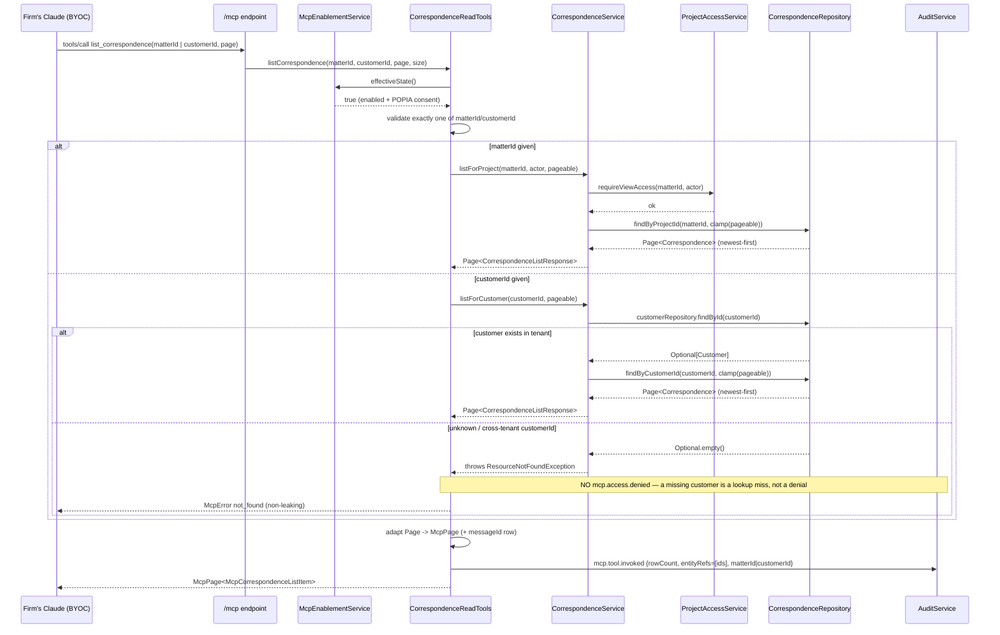
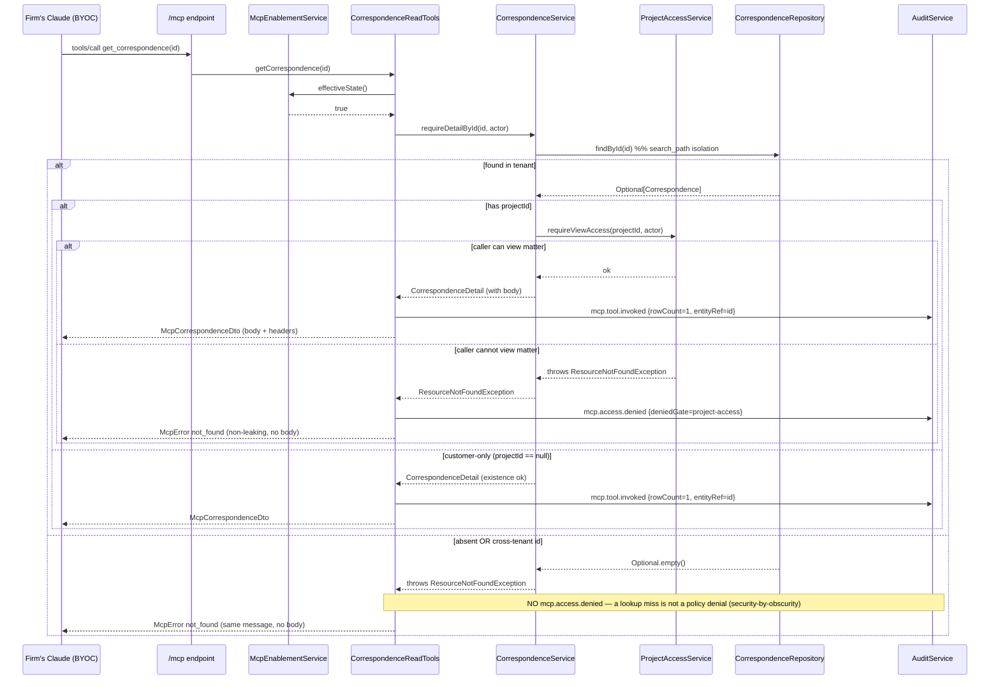

> Merge into ARCHITECTURE.md as **Section 11**.

# 11. Phase 82 — Correspondence Read-Back over MCP

## 11.1 Overview

Phase 81 made the Kazi MCP server able to **write** correspondence — a firm's own Claude (BYOC) can file an inbound email into the right matter (`file_correspondence`), attach its documents (`attach_document`), and propose follow-up tasks for in-Kazi approval (`propose_task`). It left a read/write asymmetry: **Claude can write correspondence into Kazi but cannot read it back over MCP.** The only correspondence read surface is the in-app REST "Correspondence" tab (Epic 586A), which is not an MCP tool. A "what's happening across my matters' inboxes — what needs a reply, what implies a deadline" digest skill is therefore impossible to ground today, because the deadlines and obligations live in the *body*, which no MCP tool exposes.

Phase 82 closes that asymmetry with exactly **two MCP read tools** over the existing `correspondence/` bounded context: `list_correspondence(matterId | customerId, page)` returns the existing metadata projection as an `McpPage`; `get_correspondence(id)` returns a single record **with body** + headers via one net-new service method and one new detail DTO. Both are gated, audited, and tenant-isolated exactly like the existing matter/document read tools.

This is a **thin exposure layer**, not a new domain. There is **no new entity, table, migration, write tool, LLM, or Gmail integration.** The `Correspondence` entity already persists every field the read tools need; `CorrespondenceService` already lists correspondence (`listForProject`/`listForCustomer`, returning `Page<CorrespondenceListResponse>` clamped to 50). The only net-new backend code is two `@McpTool` read methods on a new `CorrespondenceReadTools` bean, one `CorrespondenceService` detail method (`requireDetailById`), one detail record (`CorrespondenceDetail`), and one MCP boundary DTO (`McpCorrespondenceDto`). The consumer `correspondence-digest` skill that uses these tools ships in `../claude-for-legal-sa`, not in this repo.

### What's new

| MCP read catalogue | Tool | Status | Backing |
|--------------------|------|--------|---------|
| Clients | `list_clients`, `get_client`, `resolve_matter_by_email` | existing | `CustomerService`, `CustomerRepository` |
| Matters | `list_matters`, `get_matter` | existing | `ProjectService` (project-access) |
| Documents | `search_documents`, `get_document_url` | existing | `DocumentService` (project-access) |
| Trust / Billing / Compliance / Activity / Audit | `list_*`, `get_*` | existing | respective services |
| **Correspondence** | **`list_correspondence`** | **NEW (82A)** | reuses `CorrespondenceService.listForProject`/`listForCustomer` |
| **Correspondence** | **`get_correspondence`** | **NEW (82B)** | one new `CorrespondenceService.requireDetailById` + `McpCorrespondenceDto` |

No new domain, no new write path, no new audit family, no migration.

## 11.2 Tool Contracts

Both tools live on a new `CorrespondenceReadTools` bean (`backend/.../mcp/tool/CorrespondenceReadTools.java`). They sit behind the same per-request `McpEnablementService.effectiveState()` enablement + POPIA-consent gate as every MCP tool (first statement of each method), and emit the existing `mcp.tool.invoked` read audit on success. The gating model is **project view-access**, matching `get_matter` / `search_documents` / `get_document_url` — **not** the org-wide `MCP_ACCESS` capability gate (see §11.5 and ADR-324). The enablement gate is distinct from the capability gate: a tool can be enablement-gated and project-access-gated without ever calling `McpCapabilityGuard.gatedTool`.

### 11.2.1 `list_correspondence` (read)

- **Inputs:** exactly one of `matterId` (the projectId) or `customerId`, plus optional `page`/`size`.
- **Argument validation:** reject **both** "neither given" and "both given" with `McpError.invalidRequest("provide exactly one of matterId or customerId")` — mirroring `resolve_matter_by_email`'s argument discipline. Validation runs after the enablement check, before any service call.
- **Behaviour:** when `matterId` is given → `CorrespondenceService.listForProject(matterId, actor, pageable)` (already calls `projectAccessService.requireViewAccess` and clamps page size to 50); when `customerId` is given → `CorrespondenceService.listForCustomer(customerId, pageable)` (existence-in-tenant + search_path isolation, clamps to 50). Both methods return `Page<CorrespondenceListResponse>` ordered newest-first (JPQL-hardcoded `COALESCE(receivedAt, filedAt) DESC`). The tool adapts the Spring `Page` to an `McpPage` (see §11.3). **No body** in the list — the body comes from `get_correspondence`.
- **Row shape:** `id`, `subject`, `fromAddress`, `receivedAt`, `attachmentCount`, `direction`, **`messageId`** (recommended addition — see note below).
- **Output (`McpPage`):**

```json
{
  "items": [
    {
      "id": "a1b2c3d4-0000-0000-0000-000000000001",
      "subject": "RE: Transfer of erf 1234 — signed offer attached",
      "fromAddress": "client@example.co.za",
      "receivedAt": "2026-06-24T08:15:00Z",
      "attachmentCount": 2,
      "direction": "INBOUND",
      "messageId": "<CAB+abc123@mail.gmail.com>"
    }
  ],
  "page": 0,
  "size": 50,
  "total": 1,
  "truncated": false
}
```

- **Gating:** project view-access on the `matterId` path (via `listForProject`); existence-in-tenant on the `customerId` path (via `listForCustomer`). A caller who cannot view the matter, or a cross-tenant `matterId`/`customerId`, gets a non-leaking `not_found` (the underlying `ResourceNotFoundException` is caught and surfaced via `McpToolErrors`).
- **Audit:** `mcp.tool.invoked` with `McpAuditMetadata` carrying `rowCount` + the page's correspondence ids as `entityRefs`, plus a `matterId`/`customerId` param ref. **Never** subject/from/body.
- **Error cases:** `not_enabled` (connector off); `invalid_request` (neither/both id args); `not_found` in two distinct cases:
  - **matter path** — inaccessible/cross-tenant `matterId`: `requireViewAccess` (inside `listForProject`) throws → `not_found`, and on this access-denial path emit `mcp.access.denied` (`deniedGate = "project-access"`) before returning.
  - **customer path** — unknown/cross-tenant `customerId`: `listForCustomer` does `customerRepository.findById(customerId).orElseThrow(ResourceNotFoundException)` **before** listing, so an unknown `customerId` returns a non-leaking `not_found`, **not** a silent empty page. (No `mcp.access.denied` here — a missing customer is a lookup miss, not a policy denial.)

> **Recommendation — add `messageId` to the MCP list row.** The current `CorrespondenceListResponse` REST DTO omits `messageId`. Adding it to the **MCP** row (not necessarily the REST DTO) lets the digest skill cross-check a listed row against the `messageId` that `file_correspondence` filed (the idempotency key Claude already holds). Trade-off: it is one extra column in the response payload and, if added to the shared `CorrespondenceListResponse`, would also appear in the REST tab. **It exposes no new PII** — `messageId` is an opaque RFC-5322 Message-ID header, already filed and already returned in full by `get_correspondence`. Preferred shape: a dedicated `McpCorrespondenceListItem` record (id, subject, fromAddress, receivedAt, attachmentCount, direction, messageId) so the REST DTO stays untouched and the MCP row gains the cross-check field. If the breakdown chooses to keep things minimal, reusing `CorrespondenceListResponse` verbatim (no `messageId`) is acceptable and the digest cross-checks by id instead.

### 11.2.2 `get_correspondence` (read, with body)

- **Input:** `id` (the correspondence id).
- **Behaviour:** one new `@Transactional(readOnly = true)` service method `requireDetailById(UUID id, ActorContext actor)` returns a body-bearing `CorrespondenceDetail` record (never the JPA entity). The tool maps that record to `McpCorrespondenceDto`. Resolve the correspondence's scope; if it has a `projectId` → `requireViewAccess(projectId, actor)`; if customer-only (`projectId == null`) → existence-in-tenant only. An unknown or cross-tenant id, or a matter the caller cannot view, throws `ResourceNotFoundException` → non-leaking `not_found`.
- **Output (`McpCorrespondenceDto`):**

```json
{
  "id": "a1b2c3d4-0000-0000-0000-000000000001",
  "customerId": "c0000000-0000-0000-0000-000000000009",
  "projectId": "90000000-0000-0000-0000-000000000007",
  "direction": "INBOUND",
  "subject": "RE: Transfer of erf 1234 — signed offer attached",
  "bodyText": "Dear Sir, please find attached the signed offer. We must lodge before 30 June…",
  "bodyHtml": "<p>Dear Sir, please find attached…</p>",
  "fromAddress": "client@example.co.za",
  "toAddresses": ["conveyancer@firm.co.za"],
  "ccAddresses": [],
  "sentAt": "2026-06-24T08:10:00Z",
  "receivedAt": "2026-06-24T08:15:00Z",
  "threadKey": "transfer-erf-1234",
  "messageId": "<CAB+abc123@mail.gmail.com>",
  "attachmentCount": 2,
  "filedAt": "2026-06-24T09:01:00Z"
}
```

- **`McpCorrespondenceDto` field table:**

| Field | Type | Source entity field | Notes |
|-------|------|---------------------|-------|
| `id` | UUID | `Correspondence.id` | |
| `customerId` | UUID (nullable) | `Correspondence.customerId` | raw FK; null when matter-only |
| `projectId` | UUID (nullable) | `Correspondence.projectId` | the matter; null when customer-only; ≥1 of customerId/projectId is non-null |
| `direction` | String | `Correspondence.direction` | enum short name (e.g. `INBOUND`) |
| `subject` | String | `Correspondence.subject` | |
| `bodyText` | String | `Correspondence.bodyText` | the read-back payload; egresses under existing read-egress consent |
| `bodyHtml` | String (nullable) | `Correspondence.bodyHtml` | optional; present when filed with HTML |
| `fromAddress` | String | `Correspondence.fromAddress` | |
| `toAddresses` | List\<String> | `Correspondence.toAddresses` | |
| `ccAddresses` | List\<String> | `Correspondence.ccAddresses` | |
| `sentAt` | Instant (nullable) | `Correspondence.sentAt` | ISO-8601 |
| `receivedAt` | Instant (nullable) | `Correspondence.receivedAt` | ISO-8601 |
| `threadKey` | String (nullable) | `Correspondence.threadKey` | |
| `messageId` | String | `Correspondence.messageId` | RFC-5322 Message-ID; cross-check key |
| `attachmentCount` | long | `CorrespondenceRepository.countAttachments(id)` | computed, not a column |
| `filedAt` | Instant | `Correspondence.filedAt` | NOT NULL |

- **Gating:** project view-access when `projectId` present; existence-in-tenant when customer-only. Mirrors `search_documents`' scope-dependent shape and `CorrespondenceService.listForProject`/`listForCustomer`.
- **Body egress:** rides the **existing** read-egress consent (same posture as `get_matter` / `get_client`). NOT a new consent flag, NOT a new gate, NOT a new audit family (ADR-324, decision 2).
- **Audit:** `mcp.tool.invoked` with `rowCount=1` and `entityRef = id` only. **Never** subject/from/body. `mcp.access.denied` (`deniedGate = "project-access"`) is emitted **only** on the path where the correspondence **is found** with a `projectId` and `requireViewAccess` refuses — never for an absent or cross-tenant id (mirrors `get_matter` exactly).
- **Error cases:** `not_enabled`; `not_found` in three sub-cases with an identical, non-leaking message (security-by-obscurity):
  - **unknown / cross-tenant id** — `findById` returns `Optional.empty()` → `ResourceNotFoundException` → `McpError.notFound("correspondence")` with **NO** `mcp.access.denied` (a lookup miss must not be logged as a policy denial).
  - **inaccessible matter** — the record **is found** with a `projectId`, but `requireViewAccess` throws → `McpError.notFound("correspondence")` **with** `emitDenied("get_correspondence","project-access",…)`. This is the only path that emits `mcp.access.denied`.
  - (customer-only correspondence resolves on existence-in-tenant; no access.denied applies.)

## 11.3 Backend Behaviour & Reuse

**`list_correspondence` reuses the existing service methods verbatim.** No new list path. The tool calls `listForProject(matterId, actor, pageable)` or `listForCustomer(customerId, pageable)` — both already enforce access (view-access / existence) and clamp page size to 50 via `McpPagination.clampSize`. The tool constructs a `Pageable` from `page`/`size` (unsorted — the clamp rejects client-supplied sorts; newest-first is JPQL-hardcoded) and adapts the returned `Page<CorrespondenceListResponse>` to an `McpPage`:

```
McpPage.of(page.getContent(), page.getNumber(), page.getSize(), page.getTotalElements(), page.hasNext())
```

> **Call the access-gated methods, NOT the package-private ones.** The tool MUST call the public, access-gated `listForProject` / `listForCustomer` — which enforce view-access + existence and apply the `McpPagination` page clamp. It must **not** call the lower-level package-private `listByProject` / `listByCustomer`, which bypass both the access check and the clamp. (The requirements doc loosely uses the `listBy*` names; that is the wrong method here — wiring it would skip the gate and the 50-row clamp.)

> **Deliberate deviation from the materialise-then-paginate pattern.** The other `list_*` MCP tools materialise an unbounded `List`, call `McpPagination.exceedsResponseCeiling`, then `McpPagination.paginate`. `list_correspondence` instead reuses the **DB-paginated** `Page`-returning service methods, because the correspondence domain already paginates at the repository level (Spring Data `Pageable` + JPQL ordering). This is the more honest fit (no full-table materialisation; reuses the existing access + clamp), at the cost of not sharing the exact materialise-then-paginate code path. The response ceiling does not apply because the query is already page-bounded.

**`get_correspondence` adds exactly one service method.** There is no existing method that returns a single correspondence with its body — `requireScopeById` returns only the body-less `CorrespondenceScope` (ids). Phase 82 adds:

```
@Transactional(readOnly = true)
CorrespondenceDetail requireDetailById(UUID id, ActorContext actor)
```

It uses the inherited `CorrespondenceRepository.findById(id)` (tenant-safe via search_path), maps the entity to a new `CorrespondenceDetail` record **inside the service** (the JPA entity never crosses the MCP boundary — mirroring the `CorrespondenceScope` / `requireScopeById` discipline), and applies the access check: if `projectId != null` → `projectAccessService.requireViewAccess(projectId, actor)`; otherwise existence-in-tenant only. A missing row or a failed view-access both throw `ResourceNotFoundException`. `attachmentCount` is filled from `correspondenceRepository.countAttachments(id)`.

> **No new repository method.** `findById` + in-service mapping is sufficient and matches `requireScopeById`. A JPQL projection that selects only the detail columns is *cleaner on paper* (avoids loading the `version`/audit columns), but the entity is a single row with no joins beyond the attachment count, so the projection saves nothing material and adds a second query shape to maintain. **Prefer reusing `findById` + in-service mapping.** `CorrespondenceDetail` is the boundary record the service returns; `McpCorrespondenceDto` is the MCP-facing shape the tool maps it to (the two may be merged if the breakdown finds the indirection gratuitous — but keep the entity off the MCP boundary either way).

**Tenant boundary.** All reads run under schema-per-tenant search_path isolation: a cross-tenant `id` is simply invisible to `findById`, so `get_correspondence(B's id)` from tenant A returns `Optional.empty()` → `ResourceNotFoundException` → non-leaking `not_found`, never the body. `list_correspondence` for a matter/customer in tenant A returns nothing for tenant B for the same reason.

## 11.4 Sequence Diagrams

### 11.4.1 `list_correspondence` — happy path (matter scope)



### 11.4.2 `get_correspondence` — happy path AND no-access / cross-tenant path



## 11.5 Security, POPIA & Audit

- **Body egress under existing read-egress consent.** Reading a correspondence body egresses client PII to the firm's Claude under the **same** consent posture that already governs `get_matter` / `get_client` / `list_trust_transactions`. It is not a new POPIA category and does **not** introduce a new consent flag or gate (ADR-324, decision 2). The founder decision rejected re-hydrating the body from Gmail precisely so the body comes from Kazi under Kazi's own egress consent.
- **Audit — safe refs only.** Both tools emit the pre-existing `mcp.tool.invoked` event with `McpAuditMetadata` carrying only `entityRef`(s) (correspondence id, plus matterId/customerId param on the list) — **never** subject, from-address, to/cc, or body. This mirrors `resolve_matter_by_email`'s "entityRefs carries matter ids only, never the resolved email/customer name (POPIA)" and the `SAFE_TOKEN` rule. The body and headers are *returned* to the LLM (that is the point of a read tool) but are *never written into audit details*.
- **Enablement gate.** The first statement of each tool is `if (!enablement.effectiveState()) return McpToolErrors.asResult(McpError.notEnabled(), objectMapper);` — the per-request enablement + POPIA-egress-consent guard every MCP tool shares. Disabling the connector or revoking consent turns both tools off uniformly.
- **Tenant isolation.** Schema-per-tenant search_path makes cross-tenant ids invisible; a cross-tenant `get_correspondence` returns `not_found` with no body, and a cross-tenant `list_correspondence` returns nothing.
- **Gating model = project view-access, not the org-wide capability gate.** `get_correspondence` (and `list_correspondence`'s matter path) enforce `requireViewAccess(projectId)`, matching the in-app REST tab and the sibling `get_matter`/`get_document_url` tools. An `MCP_ACCESS` capability gate would be *less* restrictive than the UI (a member could read correspondence on a matter they cannot see in the app) and is in any case not yet a live front-door — so it would leave the tool effectively ungated. ADR-324 records this. Customer-only correspondence (no projectId) falls back to existence-in-tenant, matching `listForCustomer` and `search_documents`' CUSTOMER scope. **The requirements doc's `McpCapabilityGuard.gatedTool("MCP_ACCESS", …)` suggestion is superseded by ADR-324 — the two new read tools do NOT call `McpCapabilityGuard` at all, matching `get_matter`/`get_document_url`.**

## 11.6 Test Impact

| Test / area | Change | Why |
|-------------|--------|-----|
| `McpReadOnlyRegistryTest` | **one line:** add `CorrespondenceReadTools` to `ALLOWED_TOOL_BEANS`. **No** regex edit, **no** `READ_NAME_EXEMPTIONS` entry. | `list_correspondence`/`get_correspondence` match `^(list\|get\|search)_` and start with no mutating verb. Every `@McpTool` bean must be in `ALLOWED_TOOL_BEANS` or `ALLOWED_WRITE_TOOL_BEANS`; the new read bean goes in the former. It must **not** go on `CorrespondenceWriteTools` (allowlisted as a *write* bean). |
| `AuditEventTypeRegistryTest` | **NO change** — stays `hasSize(36)`. | The tools emit the pre-existing `mcp.tool.invoked` / `mcp.access.denied`, which are **not** catalogued (they resolve via the default fallback). No new audit event type → no count bump. Do not "helpfully" bump the count. |
| New: `list_correspondence` tests | pagination + `clampSize` (request size > 50 clamped to 50); newest-first ordering; reject neither/both id args (`invalid_request`); matter-path view-access denial → `not_found`; customer-path existence. | |
| New: `get_correspondence` tests | returns body for an in-tenant id; returns `not_found` for a fabricated id and a cross-tenant id (never the body); customer-only correspondence resolves on existence; matter-scoped correspondence denied for a non-member → `not_found` + `mcp.access.denied`. | |
| New: enablement/consent | both tools return `not_enabled` when MCP disabled or consent revoked. | first-statement guard. |
| New: tenant-isolation | tenant A's `get_correspondence(B's id)` → `not_found`, no body; `list_correspondence` for A's matter → empty for B. | mandatory per spec. |
| New: audit content | assert `mcp.tool.invoked` details carry only `entityRef`(s) — no subject/from/body. | POPIA `SAFE_TOKEN`. |
| Optional: `Phase82BoundaryTest` | if added, scope to phase-82 sources only (not whole-backend). | mirrors `Phase81BoundaryTest` lesson. |

> **Only the full `./mvnw verify` catches the cross-package registry/count tests** (CLAUDE.md §5). `McpReadOnlyRegistryTest` and `AuditEventTypeRegistryTest` live outside the correspondence/mcp tool packages; a targeted `-Dtest=` run will not exercise them. The merge bar is a clean full verify.

## 11.7 Implementation Guidance

| File | Change |
|------|--------|
| `backend/.../mcp/tool/CorrespondenceReadTools.java` | **NEW** — `@Component` bean with two `@McpTool` methods (`list_correspondence`, `get_correspondence`); injects `CorrespondenceService`, `AuditService`, `ObjectMapper`, `McpEnablementService`, `McpMetrics`. Enablement-first guard; arg validation; project-access (not capability) gating; `mcp.tool.invoked` / `mcp.access.denied` audit. **Call the access-gated `listForProject`/`listForCustomer` — NOT the package-private `listByProject`/`listByCustomer`, which bypass view-access and the page clamp.** |
| `backend/.../correspondence/CorrespondenceService.java` | **+1 method** — `requireDetailById(UUID id, ActorContext actor)` returning a new `CorrespondenceDetail` record; `findById` + in-service map + view-access-when-projectId / existence-when-customer-only. |
| `backend/.../correspondence/CorrespondenceDetail.java` | **NEW** — body-bearing boundary record the service returns (entity never crosses the MCP boundary). |
| `backend/.../mcp/dto/McpCorrespondenceDto.java` | **NEW** — flat MCP detail DTO (ISO-8601 dates), mapped from `CorrespondenceDetail` in the tool. Fields per §11.2.2. |
| `backend/.../mcp/dto/McpCorrespondenceListItem.java` *(optional)* | **NEW (recommended)** — MCP list row = `CorrespondenceListResponse` fields **+ `messageId`** for digest cross-check (keeps the REST DTO untouched). If skipped, reuse `CorrespondenceListResponse`. |
| `backend/.../mcp/McpReadOnlyRegistryTest.java` | **+1 line** — add `CorrespondenceReadTools` to `ALLOWED_TOOL_BEANS`. |
| `../claude-for-legal-sa/kazi-legal-za/data/mcp-catalogue.json` | **cross-repo, informational** — the consumer plugin's catalogue references the two new tools so the `correspondence-digest` skill stays groundable. Specified in the consumer-repo PRD (`project/prd-correspondence-skills.md`), **not** built in this phase. |

**Explicitly NOT changed:** no frontend changes; no migration; no new entity/table; no write tool; no LLM; no Gmail/IMAP; no new audit event type; no `AuditEventTypeRegistry` entry. If a migration or entity appears in the diff, scope has been left.

## 11.8 Capability Slices

Small phase — **1 epic, 2 slices.** 82B has a **soft dependency** on the `CorrespondenceReadTools` bean established in 82A: if 82B is worked standalone it must create that bean first, so 82A is the natural prerequisite. **Do 82A first.** Both must pass a clean full `./mvnw verify`.

### Slice 82A — `list_correspondence`
- **Scope:** the metadata list tool, reusing `listForProject`/`listForCustomer`.
- **Deliverables:** `CorrespondenceReadTools` bean (created here) with `list_correspondence`; optional `McpCorrespondenceListItem` (with `messageId`); `Page → McpPage` adapter; `ALLOWED_TOOL_BEANS` one-liner.
- **Dependencies:** none beyond existing Phase 81 service methods.
- **Test expectations:** pagination + clamp; newest-first; reject neither/both id args; matter-path view-access denial → `not_found` + `mcp.access.denied`; customer-path existence; enablement off → `not_enabled`; tenant isolation; audit safe-refs-only.

### Slice 82B — `get_correspondence`
- **Scope:** the body-bearing detail tool.
- **Deliverables:** `CorrespondenceService.requireDetailById` + `CorrespondenceDetail` record; `McpCorrespondenceDto`; `get_correspondence` method on `CorrespondenceReadTools`.
- **Dependencies:** soft dependency on 82A — needs the `CorrespondenceReadTools` bean to exist (established in 82A; must be created first if 82B is run standalone). 82A is the natural prerequisite.
- **Test expectations:** returns body for in-tenant id; `not_found` for fabricated/cross-tenant id (no body); customer-only resolves on existence; non-member denied → `not_found` + `mcp.access.denied`; enablement/consent off → `not_enabled`; audit carries `entityRef=id` only, never subject/from/body.

## 11.9 ADR Index

| ADR | Title | Relation to Phase 82 |
|-----|-------|----------------------|
| [ADR-324](../adr/ADR-324-correspondence-readback-over-mcp.md) | Correspondence Read-Back over MCP | **NEW** — the read-back design, body-via-Kazi vs body-via-Gmail, project-access gating, consent inheritance |
| [ADR-319](../adr/ADR-319-inbound-correspondence-domain.md) | Inbound Correspondence Domain | the domain these tools read |
| [ADR-321](../adr/ADR-321-mcp-write-tool-category.md) | MCP Write-Tool Category | the read/write capability split (`MCP_ACCESS` vs `MCP_WRITE`) — reads stay read-capability |
| [ADR-322](../adr/ADR-322-tiered-write-safety-and-gate-over-mcp.md) | Tiered Write-Safety and Gate-over-MCP | Phase 81 write-safety context |
| [ADR-323](../adr/ADR-323-email-matter-linking.md) | Email→Matter Linking — `resolve_matter_by_email` | closest read-tool precedent; argument-discipline + POPIA-safe-audit pattern |
| ADR-304 | MCP Tenant Isolation & Capability Gating | the capability/tenant model reused |
| ADR-306 | MCP Pagination / `McpPage` envelope | the page envelope `list_correspondence` returns |
