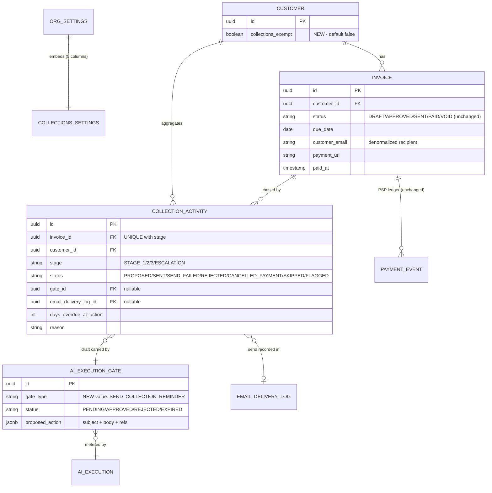
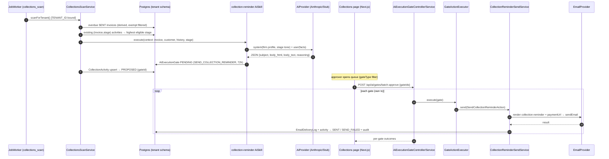

# Phase 83 — Collections & Cash Intelligence

> **Standalone phase architecture document** (per-phase file convention; `architecture/ARCHITECTURE.md` holds the core platform sections). Derived from [`requirements/claude-code-prompt-phase83.md`](../requirements/claude-code-prompt-phase83.md) (founder decisions 2026-07-09). ADRs: [ADR-325](../adr/ADR-325-collections-domain-dunning-engine.md) … [ADR-329](../adr/ADR-329-trust-aware-collections-extension-seam.md). Tenant migration: **V133** (latest on main is `V132__create_correspondence_tables.sql` — re-confirm the next free number at build time).

## 1. Overview

The revenue engine today ends at `SENT`. Time becomes rates, rates become invoices, invoices get taxed, emailed with a portal payment link, synced to Xero, and reconciled when a webhook or the Xero payment poll reports money — but if the client simply doesn't pay, nothing happens. No reminder ever goes out, nobody watches the debtor book, and the owner has no periodic read on lockup. Phase 83 closes that loop with three layers that reuse almost everything already built:

1. **A deterministic dunning engine** — a graduated reminder policy on `OrgSettings` (new `CollectionsSettings` embeddable), a per-customer exclusion flag, and a `CollectionActivity` ledger recording every chase action per `(invoice, stage)`. A daily `collections_scan` job (Phase 75 job queue) derives overdue invoices at query time (`status = SENT AND due_date < today` — **no `OVERDUE` status is added**) and produces work.
2. **An AI layer on top** — a `collection-reminder` `AiSkill` drafts each due reminder in the firm's house style (`AiFirmProfile`), aware of relationship age, payment history, prior ignored reminders, and stage tone. Every draft lands as a **PENDING `AiExecutionGate`** (new sealed `GateAction` variant `SEND_COLLECTION_REMINDER`); a human approves — singly or via a new **batch-approve** endpoint — and only the `GateActionExecutor` can send, through the existing invoice-email pipeline (provider registry, rate limiter, `EmailDeliveryLog`, `paymentUrl`/`portalUrl` in the template). **There is no auto-send code path and no direct send endpoint, by construction.**
3. **A weekly cash digest** — a `cash_digest` job (modelled on `PortalDigestHandler`) assembles the numbers deterministically (aging buckets, billed vs collected, stale WIP, reminder activity, triage top-risks), asks the `cash-digest` skill to narrate them, and delivers in-app + email to owners/admins. With AI disabled the digest degrades to a numbers-only email — the figures never come from the model in either mode.

The whole domain is fork-neutral. The only vertical-aware behaviour is an extension seam (`CollectionsAdvisor`, no-op by default) that legal-za implements over `ClientLedgerService` to annotate "client has funds in trust — consider a fee transfer instead of a demand", mirroring `TrustBoundaryGuard`'s tolerance of absent trust tables.

### What's new

| Capability | Before Phase 83 | After Phase 83 |
|---|---|---|
| Overdue chasing | Nothing after `SENT`; aging visible only in the `invoice-aging` report | Daily scan → staged, gated, AI-drafted reminder emails with payment links |
| Reminder policy | — | `CollectionsSettings` embeddable: enable + 4 stage thresholds; per-customer exclusion |
| Chase audit trail | — | `CollectionActivity` ledger per `(invoice, stage)` + 5 new audit event types |
| Send safety | n/a | Every send passes `AiExecutionGate` approval; batch-approve endpoint; payment cancels pending gates on all three payment routes |
| Escalation | — | Deterministic "flag for partner call" at the final threshold (notification + ledger row; no email, no gate) |
| Debtor intelligence | — | Deterministic triage signals (drifting, serial-late, gone-quiet, trust-funds-available) on the debtors surface and in the digest |
| Owner cash visibility | Dashboards on demand | Weekly AI-narrated cash digest (in-app + email); numbers-only fallback when AI is disabled |

### Explicitly out of scope (restated from requirements)

Auto-send at any stage; the month-end WIP-to-bill run (Phase 84 candidate); partial payments / `amountPaid` / interest / late fees / payment plans; SMS/WhatsApp or external debt-collection integrations; portal changes; per-stage template editors or arbitrary custom stages; statement-of-account generation inside reminders; MCP exposure of collections data.

## 2. Domain Model

### 2.1 `CollectionsSettings` — new `OrgSettings` embeddable

Follows `TimeReminderSettings` exactly (`@Embeddable` + `@AttributeOverride` wiring on `OrgSettings`, lazy-init getter that never returns null). One NOT NULL primitive `boolean` guarantees the group never reloads as a NULL reference, so `OrgSettingsEmbeddableNullReloadTest` needs no new all-nullable case; `OrgSettingsSchemaSnapshotTest` gets a deliberate pin update for the five new columns (V133).

| Field | Column | Type | Constraints | Notes |
|---|---|---|---|---|
| `collectionsEnabled` | `collections_enabled` | `boolean` | NOT NULL, default `false` | Master switch; scan is a no-op per tenant when false |
| `stage1DaysOverdue` | `collections_stage1_days` | `Integer` | nullable, default 7 (ctor) | Gentle nudge threshold |
| `stage2DaysOverdue` | `collections_stage2_days` | `Integer` | nullable, default 21 | Firm reminder threshold |
| `stage3DaysOverdue` | `collections_stage3_days` | `Integer` | nullable, default 45 | Final demand threshold |
| `escalateDaysOverdue` | `collections_escalate_days` | `Integer` | nullable, default 60 | Flag-for-partner-call threshold (no email) |

Service validation (not DB constraints): thresholds strictly increasing, each ≥ 1. **Why an embeddable, not a new entity**: policy is a single per-tenant value object with no lifecycle of its own — exactly what the Wave-3.5 embeddable pattern exists for; a `collection_policies` table would be a one-row table per tenant with joins for nothing ([ADR-325](../adr/ADR-325-collections-domain-dunning-engine.md)).

### 2.2 `CollectionActivity` — the chase ledger (new entity, table `collection_activities`)

One row per `(invoice, stage)`, ever. The row is created when the scan first acts on that stage and then transitions in place — it is a *ledger with state*, not an append-only log (the append-only trail lives in the audit plane). This is the idempotency backbone: the partial-unique index on `(invoice_id, stage)` makes double-proposal impossible no matter how often the scan re-runs.

| Field | Column | Type | Constraints | Notes |
|---|---|---|---|---|
| `id` | `id` | `UUID` | PK, generated | `GenerationType.UUID` |
| `invoiceId` | `invoice_id` | `UUID` | NOT NULL | Raw UUID FK (convention: no `@ManyToOne` across aggregates) |
| `customerId` | `customer_id` | `UUID` | NOT NULL | Denormalized from the invoice at creation for customer-page queries |
| `stage` | `stage` | `CollectionStage` STRING(20) | NOT NULL | `STAGE_1` \| `STAGE_2` \| `STAGE_3` \| `ESCALATION` |
| `status` | `status` | `CollectionActivityStatus` STRING(20) | NOT NULL | See state machine below |
| `gateId` | `gate_id` | `UUID` | nullable | The `AiExecutionGate` carrying the current/last draft. Null only when no draft was ever attempted (`ESCALATION`; `SKIPPED` with reason `no_recipient`/`superseded_by_higher_stage`/`draft_failed`/`draft_unavailable`); **retained** on `SKIPPED(gate_expired)`/`SKIPPED(rate_limited)` so the last-known draft stays traceable until the next re-proposal overwrites it |
| `emailDeliveryLogId` | `email_delivery_log_id` | `UUID` | nullable | Set on `SENT`/`SEND_FAILED` by the executor |
| `daysOverdueAtAction` | `days_overdue_at_action` | `int` | NOT NULL | Snapshot at proposal/flag time (drafting context + reporting) |
| `reason` | `reason` | `varchar(255)` | nullable | Machine-readable cause for `SKIPPED`/`CANCELLED_PAYMENT` (e.g. `no_recipient`, `superseded_by_higher_stage`, `gate_expired`, `invoice_paid`) |
| `createdAt` / `updatedAt` | — | `Instant` | NOT NULL | `@PrePersist`/`@PreUpdate` |
| `version` | `version` | `int` | `@Version` | Optimistic locking (scan vs approval vs payment race) |

**Status state machine** (`CollectionActivityStatus`):

```
PROPOSED ──approve──▶ SENT                     (terminal)
PROPOSED ──approve, provider failure──▶ SEND_FAILED   (scan-retryable)
PROPOSED ──reject──▶ REJECTED                  (terminal for this stage — ADR-326)
PROPOSED ──gate expires (72h)──▶ SKIPPED(gate_expired)   (scan-retryable)
PROPOSED ──invoice PAID/VOID──▶ CANCELLED_PAYMENT        (terminal)
SKIPPED  ──next scan, condition cleared──▶ PROPOSED      (row updated in place, new gate)
SEND_FAILED ──next scan──▶ PROPOSED                      (fresh draft; email never left)
FLAGGED  (ESCALATION stage only)               (terminal)
```

*Retryable vs terminal, and why*: `SKIPPED` and `SEND_FAILED` mean **no email ever reached the client** — the scan may safely re-propose (the row transitions back to `PROPOSED` with a fresh gate; the unique index is untouched because it is the same row). `REJECTED` means a human decided *not* to chase this invoice at this stage — the scan must not nag the approver with the same stage again; the invoice simply progresses to the next stage when its threshold passes. `SENT` and `CANCELLED_PAYMENT` are self-evidently terminal.

### 2.3 `Customer.collectionsExempt` — per-customer exclusion

A single new column on the existing `Customer` entity: `collections_exempt boolean NOT NULL DEFAULT false`, exposed on the customer detail page (admin/owner edit). **Why a column, not a settings-side list or a new entity**: the scan already joins `customers` to resolve the invoice's customer; a flag on the row is one predicate in the scan query, is visible exactly where firms think about the client, and avoids a parallel lookup structure that can drift. Excluded customers produce **no** `CollectionActivity` rows at all (not `SKIPPED` rows — exclusion is a standing policy, not a per-scan condition, and materialising rows for every excluded invoice forever would bloat the ledger).

### 2.4 What is deliberately NOT modelled

- **No `OVERDUE` in `InvoiceStatus`** (`DRAFT, APPROVED, SENT, PAID, VOID` unchanged). Overdue stays a query-time derivation exactly as `InvoiceAgingReportQuery` already computes it. A stored status would need lifecycle transitions in every invoice flow (payment, void, due-date edit) for zero informational gain.
- **No `Invoice` column changes.** No `amountPaid` — payment remains all-or-nothing (`paidAt`); collections treats an invoice as outstanding until `PAID`/`VOID`.
- **No new `DomainEvent` records.** Cancellation listens to the existing `InvoicePaidEvent`/`InvoiceVoidedEvent`/`InvoicePaymentReversedEvent`; notifications are created directly via `NotificationService`. The sealed `DomainEvent` permits-list is untouched — a deliberate design win, not an accident.
- **No new recipient model.** Reminders go to `invoice.customerEmail`, exactly like invoice delivery.
- **No AI output persisted as domain state.** Drafts live in the gate's `proposed_action` JSONB; triage signals are computed, not stored.

### 2.5 ER diagram (collections domain + immediate neighbours)



All tables live in the per-tenant schema (schema-per-tenant: no `tenant_id` columns, no `@Filter`; isolation via `RequestScopes.TENANT_ID` → search_path).

## 3. Core Flows & Backend Behaviour

New bounded context: `collections/` (entity + repository + services + controller + enums, feature-package convention). AI pieces live in `integration/ai/skill/collections/` beside the existing skills; the legal advisor lives in `verticals/legal/collections/`.

### 3.1 Daily collections scan (`collections_scan`)

Thin `JobHandler` → `CollectionsScanService.scanForTenant()` (tenant scope pre-bound by `JobWorker` via ScopedValue — same shape as `AccountingPaymentPollHandler`). Steps:

1. **Policy load** — `orgSettingsService.get().getCollections()`; return immediately if `!collectionsEnabled`.
2. **Candidate query** — overdue derivation at query time (native SQL, tenant search_path already bound):

```sql
SELECT i.id            AS invoice_id,
       i.customer_id,
       i.customer_email,
       i.due_date,
       (CURRENT_DATE - i.due_date) AS days_overdue
FROM   invoices i
JOIN   customers c ON c.id = i.customer_id
WHERE  i.status = 'SENT'
  AND  i.due_date < CURRENT_DATE
  AND  c.collections_exempt = false
ORDER  BY i.due_date;
```

3. **Stage selection — at most one reminder per invoice per scan.** For each candidate, compute the *highest* eligible stage (`days_overdue >= threshold`) that has no `CollectionActivity` row in a non-retryable status. Lower un-actioned stages are recorded as `SKIPPED(reason=superseded_by_higher_stage)` so the `(invoice, stage)` ledger stays complete. *Why*: an invoice first seen at 50 days overdue must get one stage-3 letter, not three escalating letters in one batch; and a complete ledger means "stage 1 never went out for this invoice" is queryable, not inferred.
4. **Escalation check** — if `days_overdue >= escalateDaysOverdue` and no `ESCALATION` row exists: create `CollectionActivity(stage=ESCALATION, status=FLAGGED)`, notify admins/owners (`COLLECTION_ESCALATED` via `NotificationService.notifyAdminsAndOwners`), write `collections.escalation.flagged` audit. **No gate, no AI, no email** — flagging a partner for a phone call is an internal, deterministic act; gates exist to protect client-facing AI output, and nothing here faces the client ([ADR-326](../adr/ADR-326-gated-send-safety-model.md)).
5. **Recipient check** — `customer_email` blank → upsert `SKIPPED(reason=no_recipient)` (retryable; re-evaluated every scan, so adding an email later resumes chasing).
6. **Draft** — delegate to the `ReminderComposer` seam (below). The production composer (slice 83-3) invokes the `collection-reminder` skill through `AiSkillExecutionService` (system-invoked from job context; see §6.4); the skill's `createGates` produces one PENDING `SEND_COLLECTION_REMINDER` gate (72 h expiry, existing gate convention) and the activity row is created/updated to `PROPOSED` with `gateId`. AI provider failure → activity `SKIPPED(reason=draft_failed)`, retryable next scan; the batch continues (one bad draft must not sink the tenant's scan).

**The `ReminderComposer` seam** (lets slice 83-2 ship and test the scan before the AI slice lands):

```java
/** Produces the gated draft for one due reminder. Implementations decide how. */
public interface ReminderComposer {
  /** Returns the PENDING gate carrying the draft, or empty when drafting is unavailable. */
  Optional<AiExecutionGate> compose(CollectionActivity activity, Invoice invoice, Customer customer);
}
```

Slice 83-2 ships `NoOpReminderComposer` (`@ConditionalOnMissingBean`-style default): returns `Optional.empty()`, and the scan records `SKIPPED(reason=draft_unavailable)` — retryable, so every activity is re-proposed automatically once the real composer deploys. Slice 83-3 replaces it with `AiReminderComposer` (the skill invocation above). The scan's stage arithmetic, exclusion, supersede, and cancellation logic are thereby fully integration-testable in 83-2 without any AI machinery.

Conceptual service surface:

```java
@Service
public class CollectionsScanService {
  /** Runs one tenant's daily scan. Returns counts for the job log. */
  @Transactional
  public ScanResult scanForTenant();                       // steps 1-6 above

  record ScanResult(int proposed, int skipped, int escalated, int superseded) {}
}
```

Scheduling: register `collections_scan` (daily) and `cash_digest` (weekly) with the same per-tenant recurring enqueue mechanism that drives `portal_digest` and `accounting_payment_poll` (job-queue fanout; exact wiring point resolved at build alongside those handlers' registration).

### 3.2 Send-on-approve — the only send path

New sealed variant + executor branch (the standard "adding a gate type" checklist: `GateAction` permits-list + record, `parseAction` case, `execute` switch case, executor method):

```java
record SendCollectionReminderAction(
    UUID collectionActivityId,
    UUID invoiceId,
    UUID customerId,
    String stage,           // CollectionStage name, for the audit/details payload
    String subject,         // AI-drafted
    String bodyHtml,        // AI-drafted letter body (paragraphs only)
    String bodyText)
    implements GateAction {}
```

`proposed_action` JSONB keys are snake_case (`collection_activity_id`, `body_html`, …) per the existing `parseAction` convention. On approval (`AI_REVIEW` capability, existing controller), `GateActionExecutor.executeSendCollectionReminder(...)` delegates to a new `CollectionReminderSendService` that mirrors `InvoiceEmailService` step for step: resolve provider via `IntegrationRegistry` → `EmailContextBuilder.buildBaseContext(...)` (org name, vertical-aware `invoiceTerm`) → render the new `collection-reminder` Thymeleaf template → rate-limit check (`EmailRateLimiter`; on limit: `SKIPPED(reason=rate_limited)`, retryable) → `EmailMessage.withTracking(..., referenceType="COLLECTION_REMINDER", referenceId=activityId, ...)` → `provider.sendEmail(...)` → `EmailDeliveryLogService.record(...)` → activity `SENT` (or `SEND_FAILED`) + `collections.reminder.sent` audit.

**Template vs draft split**: the Thymeleaf template owns the *frame* — branding, invoice facts table (number, amount, due date), the payment CTA (`paymentUrl`, with `portalUrl` fallback exactly like `invoice-delivery.html` GAP-L-64), unsubscribe/footer. The AI owns only the *letter paragraphs* (subject + body). The approver therefore reviews exactly the human-language part; the mechanical parts cannot be hallucinated. *Why not let the AI produce the whole email*: a wrong amount or a broken payment link is a worse failure than a clumsy sentence, and both are preventable by keeping facts template-rendered.

**Rejection** (`POST /api/ai/gates/{id}/reject`, existing): the `AiGateRejectedEvent` listener in `collections/` transitions the activity to `REJECTED` — terminal for that stage. **Gate expiry** (72 h, existing `AiGateExpiryHandler`): the `AiGateExpiredEvent` listener transitions to `SKIPPED(reason=gate_expired)` — retryable, because an unpaid invoice still needs chasing and the stale draft should be re-generated with current days-overdue context.

**Batch approval**: `POST /api/ai/gates/batch-approve` on the existing `AiExecutionGateController` — `{ "gateIds": [...], "notes": "..." }`, iterates the existing single-gate approve path (each gate in its own transaction so one failure doesn't roll back the batch), returns per-gate outcomes. Works for any gate type; built for the reminder queue. *Why extend the gate controller rather than add a collections endpoint*: approval semantics, capability check (`AI_REVIEW`), and audit belong to the gate machinery; a collections-side approve would be a second approval surface — exactly what ADR-322 forbade for MCP.

### 3.3 Payment cancellation — all three routes, one listener

All three payment routes already converge on `InvoiceService.recordPayment(...)` → `InvoiceTransitionService` publishing `InvoicePaidEvent` (and `InvoiceVoidedEvent` for voids):

| Route | Entry point | Event published |
|---|---|---|
| PSP webhook (Stripe/PayFast) | `PaymentReconciliationService.processWebhookResult` → `recordPayment(..., fromWebhook=true)` | `InvoicePaidEvent` |
| Xero payment pull | `AccountingPaymentPollWorker.pollForTenant()` → `recordPayment` | `InvoicePaidEvent` |
| Manual record-payment | Invoice UI → `recordPayment` | `InvoicePaidEvent` |
| Void | Invoice UI → transition | `InvoiceVoidedEvent` |

A single `CollectionsPaymentListener` (`@TransactionalEventListener(phase = AFTER_COMMIT)`, same pattern as `InvoiceEmailEventListener`) handles both: load PENDING `SEND_COLLECTION_REMINDER` gates whose `proposed_action.invoice_id` matches (resolved via the activity ledger: `findByInvoiceIdAndStatus(invoiceId, PROPOSED)` → `gateId`), expire each gate through `AiExecutionGateService` (status → `EXPIRED`, review note `invoice_paid`), transition activities to `CANCELLED_PAYMENT(reason=invoice_paid|invoice_voided)`, write `collections.reminder.cancelled` audit. **Race**: approval and payment can interleave — the activity's `@Version` plus the gate's own PENDING-check make the outcome deterministic (whichever transaction commits second sees the state change and no-ops or refuses); see sequence diagram §5.2. `InvoicePaymentReversedEvent` (payment reversed, invoice back to SENT) requires no action: the next scan simply sees the invoice as overdue again, and terminal `CANCELLED_PAYMENT` rows for already-passed stages mean chasing resumes at the *next* un-actioned stage — acceptable, documented behaviour.

*Why event listeners rather than hooks inside the three call sites*: one listener covers all routes including future ones (any path that marks an invoice paid must publish `InvoicePaidEvent` or invoice email/notification behaviour would already be broken); and AFTER_COMMIT ordering guarantees we never cancel gates for a payment that rolled back.

### 3.4 Debtor triage — deterministic signals, AI narration only

`CollectionsTriageService` computes per-customer signals from data already on hand — **no AI, no persistence**:

| Signal | Derivation |
|---|---|
| `DRIFTING` | Current oldest `days_overdue` exceeds the customer's median days-to-pay (from `paid_at - due_date` over historical PAID invoices) by > 14 days |
| `SERIAL_LATE` | Median days-to-pay > 30 but customer always pays → suppress urgency (don't nag a reliable-if-slow payer) |
| `GONE_QUIET` | ≥ 2 activities `SENT` on the same invoice chain with no payment and no newer invoice paid |
| `ESCALATED` | An `ESCALATION` row is `FLAGGED` |
| `TRUST_FUNDS_AVAILABLE` | Contributed by the `CollectionsAdvisor` seam (legal-za only, §6.5) |

Signals surface in two places: annotations on the debtors page (always available, zero AI cost, works with AI disabled) and as context handed to the `cash-digest` skill, which *ranks and narrates* the top risks but never invents them. *Why triage is not its own AI skill*: the requirements allowed either; a separate skill would add a second metered execution and a second output schema for judgment that is (a) mostly arithmetic and (b) only consumed by the digest — folding narration into the digest skill is strictly smaller ([ADR-327](../adr/ADR-327-ai-reminder-drafting-debtor-triage.md)).

### 3.5 Weekly cash digest (`cash_digest`)

Thin `JobHandler` → `CashDigestService.processTenant()`:

1. **Assemble numbers deterministically** (`CashDigestData` record): total outstanding + aging buckets (reusing the `InvoiceAgingReportQuery` bucket logic — extract its bucket SQL into a shared package-visible helper rather than duplicating it); billed vs collected for the trailing period; stale unbilled WIP (unbilled `TimeEntry` older than 30 days, via the existing unbilled-time query surface); reminder activity summary (counts by status from `CollectionActivity`); triage signals (§3.4).
2. **Narrate** — if AI is enabled and configured: invoke the `cash-digest` skill; output is a short narrative + ranked top-3 risks (JSON, schema-validated by `LlmJsonParser`). If AI is disabled/unconfigured: **skip narration, keep the numbers** — the email template renders the figures without the narrative block (one Thymeleaf conditional). *Why numbers-only fallback rather than skipping the digest*: the assembly work exists regardless (it feeds the narrative), the template exists regardless, so the fallback is one conditional — and a lockup summary without prose is still the owner-facing value.
3. **Deliver** — in-app `CASH_DIGEST` notification to owner/admin members (`createIfEnabled`, so members can mute it in preferences) + email per owner/admin via the standard pipeline (`cash-digest` template, `referenceType="CASH_DIGEST"`, delivery-logged). Audit `collections.digest.sent`.

Digest numbers are computed at send time and live in the email/notification — no digest archive entity (out of scope).

### 3.6 Tenant boundary, RBAC, paging

- **Tenant boundary**: every table is per-tenant-schema; the scan and digest run per tenant via job-queue fanout with `TENANT_ID` pre-bound. No cross-tenant query surface exists; the mandatory tenant-isolation test (§8.5) proves activities/gates/digests are invisible across schemas.
- **RBAC** (detail in §9): debtors/collections read mirrors the invoice-area permission; policy + exclusion edits are admin/owner; gate approve/reject (single and batch) stays behind `AI_REVIEW`; scan/digest are system jobs with no user principal.
- **Paging**: the debtors page reads a paged native query (same shape as `InvoiceAgingReportQuery.execute(parameters, pageable)`); the pending-reminder queue reuses `GET /api/ai/gates?gateType=SEND_COLLECTION_REMINDER&status=PENDING&page=&size=` unchanged; activity history on the customer page is paged by `customerId`.

## 4. API Surface

All endpoints are firm-app REST (gateway-fronted, Keycloak principal → tenant/member resolution). No portal and no MCP endpoints in this phase.

### 4.1 Collections read APIs

| Method | Path | Description | Auth | R/W |
|---|---|---|---|---|
| GET | `/api/collections/debtors` | Paged debtor book: per-customer outstanding total, oldest days overdue, aging bucket split, triage signals, last activity | Invoice-area view (see §9) | R |
| GET | `/api/collections/debtors/{customerId}` | One customer's outstanding invoices + full chase history (paged activities) | Invoice-area view | R |
| GET | `/api/collections/activities?invoiceId=` | Activity ledger for one invoice (invoice detail tab) | Invoice-area view | R |

`GET /api/collections/debtors` response shape (page envelope as elsewhere):

```json
{
  "content": [
    {
      "customerId": "…", "customerName": "Naidoo & Co",
      "outstandingTotal": 412000.00, "currency": "ZAR",
      "invoiceCount": 3, "oldestDaysOverdue": 62,
      "buckets": { "current": 0, "d30": 120000.00, "d60": 180000.00, "d90plus": 112000.00 },
      "signals": ["GONE_QUIET", "TRUST_FUNDS_AVAILABLE"],
      "collectionsExempt": false,
      "lastActivity": { "stage": "STAGE_3", "status": "SENT", "at": "2026-07-02T08:11:00Z" }
    }
  ],
  "totalElements": 9, "totalPages": 1, "number": 0, "size": 25
}
```

### 4.2 Policy & exclusion

| Method | Path | Description | Auth | R/W |
|---|---|---|---|---|
| GET | `/api/settings/collections` | Read `CollectionsSettings` | Member | R |
| PUT | `/api/settings/collections` | Update policy (enable + 4 thresholds; validated strictly increasing) | Admin/Owner | W |
| PUT | `/api/customers/{id}/collections-exemption` | Set/clear `collectionsExempt` | Admin/Owner | W |

`PUT /api/settings/collections` request:

```json
{ "collectionsEnabled": true, "stage1DaysOverdue": 7, "stage2DaysOverdue": 21,
  "stage3DaysOverdue": 45, "escalateDaysOverdue": 60 }
```

Policy updates audit as `collections.policy.updated` (old/new values in details — numbers only, no PII).

### 4.3 Gate approval (extension of the existing surface)

| Method | Path | Description | Auth | R/W |
|---|---|---|---|---|
| GET | `/api/ai/gates?gateType=SEND_COLLECTION_REMINDER&status=PENDING` | Pending reminder queue (existing endpoint, existing params) | `AI_REVIEW` or admin/owner | R |
| POST | `/api/ai/gates/{id}/approve` | Approve one reminder (existing, unchanged) | `AI_REVIEW` | W |
| POST | `/api/ai/gates/{id}/reject` | Reject one reminder (existing, unchanged) | `AI_REVIEW` | W |
| POST | `/api/ai/gates/batch-approve` | **New.** Approve many gates; per-gate transactions; per-gate outcomes | `AI_REVIEW` | W |

`POST /api/ai/gates/batch-approve`:

```json
// request
{ "gateIds": ["g1", "g2", "g3"], "notes": "Weekly collections batch" }
// response — 200 always; per-gate disposition
{ "results": [
    { "gateId": "g1", "outcome": "APPROVED_EXECUTED" },
    { "gateId": "g2", "outcome": "FAILED", "error": "gate not PENDING (EXPIRED)" },
    { "gateId": "g3", "outcome": "APPROVED_EXECUTED" } ] }
```

*Why 200-with-dispositions rather than failing the batch*: a reminder batch is N independent client emails; one paid-in-the-meantime invoice (gate already expired by the payment listener) must not block the other nine.

## 5. Sequence Diagrams

### 5.1 Scan → draft → batch approve → send



### 5.2 Payment races a pending reminder (webhook route shown; Xero pull and manual are identical from the event on)

```mermaid
sequenceDiagram
    autonumber
    participant PSP as Stripe/PayFast webhook
    participant Rec as PaymentReconciliationService
    participant Inv as InvoiceService/TransitionService
    participant Ev as InvoicePaidEvent (AFTER_COMMIT)
    participant CL as CollectionsPaymentListener
    participant GateS as AiExecutionGateService
    participant Appr as Approver (batch-approve)

    PSP->>Rec: processWebhookResult(COMPLETED)
    Rec->>Inv: recordPayment(invoiceId, ref, fromWebhook=true)
    Inv->>Inv: SENT → PAID, paidAt=now, publish event
    Inv-->>Ev: commit
    Ev->>CL: on InvoicePaidEvent
    CL->>GateS: expire PENDING SEND_COLLECTION_REMINDER gates (invoice)
    CL->>CL: activities → CANCELLED_PAYMENT + audit collections.reminder.cancelled
    alt approver approves concurrently
        Appr->>GateS: approve(gateId)
        GateS-->>Appr: refused — gate not PENDING (EXPIRED: invoice_paid)
        Note over Appr: batch outcome FAILED for this gate; no email sent
    else listener runs after an approve committed first
        CL->>CL: activity already SENT → no-op (terminal); gate not PENDING → skip
        Note over CL: client was chased moments before paying — unavoidable, logged
    end
```

The race resolves safely in both orders: the executor only acts on PENDING gates, the listener only expires PENDING gates, and the activity's `@Version` prevents lost updates. The residual "reminder sent seconds before payment" window is inherent to any dunning system and is bounded by human approval latency, not code.

## 6. AI Skill Design

### 6.1 `collection-reminder` skill

`@Component` in `integration/ai/skill/collections/`, registered by existence (constructor-collected `Map<skillId, AiSkill>`). Prompt assets on the classpath per convention: `ai/skills/collection-reminder/system.txt` + `output-schema.json`.

- **System prompt**: firm profile block (`AiFirmProfileService.assembleProfileBlock()` — house style, tone, letterhead conventions) + stage-tone instructions block selected by the `{stage}` placeholder (STAGE_1 friendly nudge / STAGE_2 firm professional / STAGE_3 final-notice gravity, explicitly stopping short of a formal letter of demand — that is an attorney act, out of scope) + `{output_schema}`.
- **User prompt** (assembled deterministically from `SkillContext`, entityType `collection_activity`): invoice facts (number, total, currency, due date, days overdue), relationship context (customer since, lifetime billed, median days-to-pay), chase history (which stages sent/ignored, from `CollectionActivity`), advisor annotations (§6.5) as *context the drafter may acknowledge*, never as instructions to promise trust transfers.
- **Output** (schema-validated via `LlmJsonParser`): `{ "subject": …, "body_html": …, "body_text": …, "reasoning": … }`. `createGates` wraps it in one `new AiExecutionGate(execution, "SEND_COLLECTION_REMINDER", proposedAction, reasoning, now+72h)`.
- `requiresVision()` → `false`.

### 6.2 `cash-digest` skill

Same package. Input: the serialized `CashDigestData` numbers + triage signals. Output schema: `{ "narrative": …, "topRisks": [{ "customerName", "why", "suggestedAction" }] }` (max 3). The prompt instructs the model to reference only figures present in the input — the template prints the authoritative numbers from `CashDigestData` regardless, so a hallucinated figure in prose cannot change what the table shows.

### 6.3 Cost metering & volume

Both skills run through `AiSkillExecutionService` → `AiExecution` rows (model, tokens, `costCents` via `AiCostService`) exactly like the five existing skills. Expected volume is modest — reminders are bounded by overdue invoices per day and drafts happen once per (invoice, stage) except explicit retries; the digest is one execution per tenant per week. Per-reminder metering (N drafts = N metered executions) is therefore acceptable and keeps cost attribution per-action ([ADR-327](../adr/ADR-327-ai-reminder-drafting-debtor-triage.md)).

### 6.4 System invocation from jobs

Existing skills are user-invoked (`AiSkillController`, `invokedBy` = member). Phase 83 invokes both skills from job context with **no user principal**: `invokedBy` is recorded as `null` (system). If `ai_executions.invoked_by` carries a NOT NULL constraint, V133 relaxes it (conditional — verify at build; see §7). The AI-enablement check (provider configured, firm profile present) happens before invocation; when it fails, the scan marks `SKIPPED(reason=ai_unavailable)` and the digest falls back to numbers-only — the jobs themselves never crash on AI unavailability.

### 6.5 `CollectionsAdvisor` — the trust extension seam

```java
/** Vertical contribution point for per-customer collections context. Core ships a no-op. */
public interface CollectionsAdvisor {
  /** Advice for one customer; empty when the advisor has nothing to say. */
  List<CollectionsAdvice> adviseFor(UUID customerId);

  record CollectionsAdvice(String signal, String detail) {}   // e.g. ("TRUST_FUNDS_AVAILABLE", "R 84 200,00 held in trust")
}
```

Core collects all `CollectionsAdvisor` beans (Spring list injection; default is an empty list plus a no-op). `verticals/legal/collections/TrustAwareCollectionsAdvisor` queries `ClientLedgerCardRepository.sumBalancesForCustomer(customerId)`; a positive balance yields `TRUST_FUNDS_AVAILABLE` advice suggesting a s86(4) fee transfer *for the attorney to consider* — the advisor never moves money and never blocks a reminder. Non-legal tenants: the advisor catches `DataAccessException` ("trust tables absent") and returns empty — the exact `TrustBoundaryGuard` tolerance pattern, except advice fails *open* (no advice) where the sync guard fails *closed*, because advice is informational and the guard protects a boundary ([ADR-329](../adr/ADR-329-trust-aware-collections-extension-seam.md)). Core code has no imports from `verticals/legal`.

### 6.6 `StubAiProvider` parity

The stub gains canned, schema-valid outputs for both new skill ids (deterministic subject/body incorporating the input invoice number; fixed narrative + risks). This keeps the full loop — scan → gate → approve → Mailpit — exercisable in `./mvnw verify` and the E2E stack with zero live tokens, matching the Phase 74 precedent.

## 7. Database Migrations

One tenant migration: **`V133__create_collections_tables.sql`** (latest on main is V132 — re-confirm the next free number at build time; idempotent per convention). No global migration.

```sql
-- Collections policy columns on org_settings (new CollectionsSettings embeddable group).
-- NOTE: org_settings shape is pinned by OrgSettingsSchemaSnapshotTest — pin update required.
ALTER TABLE org_settings ADD COLUMN IF NOT EXISTS collections_enabled boolean NOT NULL DEFAULT false;
ALTER TABLE org_settings ADD COLUMN IF NOT EXISTS collections_stage1_days integer;
ALTER TABLE org_settings ADD COLUMN IF NOT EXISTS collections_stage2_days integer;
ALTER TABLE org_settings ADD COLUMN IF NOT EXISTS collections_stage3_days integer;
ALTER TABLE org_settings ADD COLUMN IF NOT EXISTS collections_escalate_days integer;

-- Per-customer standing exclusion from collections.
ALTER TABLE customers ADD COLUMN IF NOT EXISTS collections_exempt boolean NOT NULL DEFAULT false;

-- The chase ledger: one row per (invoice, stage), transitions in place.
CREATE TABLE IF NOT EXISTS collection_activities (
    id                      uuid PRIMARY KEY,
    invoice_id              uuid NOT NULL,
    customer_id             uuid NOT NULL,
    stage                   varchar(20) NOT NULL,
    status                  varchar(20) NOT NULL,
    gate_id                 uuid,
    email_delivery_log_id   uuid,
    days_overdue_at_action  integer NOT NULL,
    reason                  varchar(255),
    created_at              timestamptz NOT NULL,
    updated_at              timestamptz NOT NULL,
    version                 integer NOT NULL DEFAULT 0,
    CONSTRAINT ck_collection_stage  CHECK (stage IN ('STAGE_1','STAGE_2','STAGE_3','ESCALATION')),
    CONSTRAINT ck_collection_status CHECK (status IN
        ('PROPOSED','SENT','SEND_FAILED','REJECTED','CANCELLED_PAYMENT','SKIPPED','FLAGGED'))
);

-- Idempotency backbone: at most one activity per invoice per stage, ever.
CREATE UNIQUE INDEX IF NOT EXISTS ux_collection_activity_invoice_stage
    ON collection_activities (invoice_id, stage);

-- Scan hot path: "does a non-retryable activity exist for this invoice?" + payment-listener lookup.
CREATE INDEX IF NOT EXISTS ix_collection_activity_invoice_status
    ON collection_activities (invoice_id, status);

-- Customer chase-history page + debtor-book aggregation.
CREATE INDEX IF NOT EXISTS ix_collection_activity_customer_created
    ON collection_activities (customer_id, created_at DESC);

-- Conditional (verify at build): system-invoked skills record no member.
-- ALTER TABLE ai_executions ALTER COLUMN invoked_by DROP NOT NULL;
```

Index rationale: the unique index is the correctness constraint (double-proposal impossible under concurrent/re-run scans); `(invoice_id, status)` serves both the scan's per-invoice status check and the payment listener's `findByInvoiceIdAndStatus(…, PROPOSED)`; `(customer_id, created_at DESC)` serves the paged history on the customer/debtor pages. No RLS policies — the platform is dedicated-schema-only since Phase 13. No backfill: all additions are new columns with defaults or a new table. Prerequisite indexes on `invoices (status, due_date)` are not added preemptively — the scan is a once-daily batch over one tenant's invoices; add only if observed slow (avoid speculative indexes).

## 8. Implementation Guidance

### 8.1 Backend changes

| Location | Change |
|---|---|
| `collections/CollectionActivity.java` (+ `CollectionStage`, `CollectionActivityStatus`) | New entity + enums, Correspondence conventions (UUID pk, raw UUID FKs, explicit snake_case columns, `@PrePersist`/`@PreUpdate`, `@Version`, no Lombok) |
| `collections/CollectionActivityRepository.java` | JPQL: `findOneById`, `findByInvoiceIdAndStage`, `findByInvoiceIdAndStatus`, paged `findByCustomerId` |
| `collections/CollectionsScanService.java` | §3.1 scan; native candidate query; stage selection; delegates drafting to `ReminderComposer` |
| `collections/ReminderComposer.java` + `NoOpReminderComposer.java` (83-2) / `AiReminderComposer.java` (83-3) | §3.1 drafting seam: no-op default → `SKIPPED(draft_unavailable)`; AI composer invokes the skill |
| `collections/CollectionsScanHandler.java` | `JobHandler`, jobType `collections_scan`, thin delegate |
| `collections/CollectionsPaymentListener.java` | AFTER_COMMIT on `InvoicePaidEvent`/`InvoiceVoidedEvent`; also listens `AiGateRejectedEvent`/`AiGateExpiredEvent` for activity transitions |
| `collections/CollectionReminderSendService.java` | Mirror of `InvoiceEmailService` for the `collection-reminder` template, referenceType `COLLECTION_REMINDER` |
| `collections/CollectionsTriageService.java` | §3.4 deterministic signals |
| `collections/CollectionsAdvisor.java` (+ no-op default) | §6.5 seam |
| `collections/CollectionsController.java` | §4.1 read endpoints + exclusion endpoint delegate |
| `collections/CashDigestService.java` + `CashDigestHandler.java` | §3.5; jobType `cash_digest` |
| `integration/ai/skill/collections/CollectionReminderSkill.java` + `CashDigestSkill.java` | §6.1/§6.2 + classpath prompt assets + output records |
| `integration/ai/gate/GateAction.java` | Add `SendCollectionReminderAction` to permits + record |
| `integration/ai/gate/GateActionExecutor.java` | `parseAction` case + `executeSendCollectionReminder` delegating to `CollectionReminderSendService` |
| `integration/ai/gate/AiExecutionGateController.java` / `AiExecutionGateService.java` | `POST /api/ai/gates/batch-approve` (per-gate tx, dispositions) |
| `settings/CollectionsSettings.java` + `OrgSettings.java` + service/controller | New embeddable + `@Embedded`/`@AttributeOverride` wiring + `getCollections()` lazy-init + GET/PUT `/api/settings/collections` |
| `customer/Customer.java` + service/controller | `collectionsExempt` + `PUT /api/customers/{id}/collections-exemption` |
| `audit/AuditEventTypeRegistry.java` | +5 types: `collections.reminder.sent`, `collections.reminder.cancelled`, `collections.escalation.flagged`, `collections.digest.sent`, `collections.policy.updated` (gate propose/approve/reject already audited by `ai.gate.*`); **catalogue-count assertion 36 → 41** |
| `activity/ActivityMessageFormatter.java` | Messages for the 5 types; entity display case `"collection_activity"` (lowercase — audit-plane casing rule, PR #1503) |
| `notification/NotificationService.java` | `NOTIFICATION_TYPES` + `COLLECTION_ESCALATED`, `CASH_DIGEST`; call sites in scan/digest |
| `integration/ai/StubAiProvider` (e2e/test stub) | Canned outputs for both skill ids |
| `templates/email/collection-reminder.html`, `cash-digest.html` | Frame-owns-facts templates (§3.2, §3.5); digest narrative block conditional |

### 8.2 Frontend changes

| Location | Change |
|---|---|
| `app/(app)/org/[slug]/invoices/collections/page.tsx` (+ client components, `actions.ts`) | Debtors page: aging overview, per-customer drill-in (chase history), triage badges, pending-reminder queue with multi-select + preview (`ExecutionGateCard` reuse) + batch approve |
| `app/(app)/org/[slug]/settings/collections/page.tsx` + `actions.ts` | Policy card (enable + 4 thresholds, increasing-order client validation) |
| `customers/[id]` detail | Exclusion toggle (admin/owner) + collections history section |
| `invoices/[id]` detail | Activity ledger tab/section for the invoice |
| `lib/api/ai.ts` | `batchApproveAiGates(gateIds, notes?)` |
| `lib/api/collections.ts` | Debtors/activities/settings/exemption clients |

Conventions: Next.js 16 (params are Promises), RSC pages + server actions, Shadcn UI; capability guard mirrors `ai/reviews/page.tsx` (`fetchMyCapabilities()`).

### 8.3 Entity and repository patterns

`CollectionActivity` follows `Correspondence` verbatim in style (schema-per-tenant: no `tenant_id`, no `@Filter`):

```java
@Entity
@Table(name = "collection_activities")
public class CollectionActivity {
  @Id @GeneratedValue(strategy = GenerationType.UUID) private UUID id;
  @Column(name = "invoice_id", nullable = false) private UUID invoiceId;   // raw UUID FK
  @Enumerated(EnumType.STRING) @Column(name = "stage", nullable = false, length = 20)
  private CollectionStage stage;
  // … §2.2 fields; @PrePersist/@PreUpdate timestamps; @Version int version
}
```

```java
public interface CollectionActivityRepository extends Repository<CollectionActivity, UUID> {
  @Query("select a from CollectionActivity a where a.id = :id")
  Optional<CollectionActivity> findOneById(UUID id);          // JPQL convention, not findById
  @Query("select a from CollectionActivity a where a.invoiceId = :invoiceId and a.status = :status")
  List<CollectionActivity> findByInvoiceIdAndStatus(UUID invoiceId, CollectionActivityStatus status);
}
```

Jackson split (recurring gotcha): job payloads `com.fasterxml.jackson.databind.JsonNode`; skill JSON `tools.jackson.databind.ObjectMapper`.

### 8.4 Testing strategy

| Test | Scope |
|---|---|
| `CollectionsScanServiceTest` | Seeded overdue invoices → correct stage per threshold; highest-stage-only + `superseded_by_higher_stage`; exemption produces nothing; `no_recipient` → SKIPPED retryable; no-op composer → `SKIPPED(draft_unavailable)` |
| `CollectionsEscalationTest` | Past `escalateDaysOverdue` → `FLAGGED` row created once (idempotent), `COLLECTION_ESCALATED` notification to admins/owners only, `collections.escalation.flagged` audit event present |
| `CollectionsScanIdempotencyTest` | Re-run scan same day → zero new gates/activities (unique index + status filter) |
| `SendCollectionReminderExecutorTest` | Approve → GreenMail/Mailpit-observed email with payment CTA; `EmailDeliveryLog` row; activity SENT; audit `collections.reminder.sent`; provider failure → SEND_FAILED |
| `BatchApproveTest` | Mixed batch (PENDING + EXPIRED) → per-gate dispositions; one failure doesn't roll back siblings |
| `CollectionsPaymentCancellationTest` | **All three routes** (webhook reconciliation, Xero poll worker, manual recordPayment) + void → pending gates EXPIRED, activities CANCELLED_PAYMENT; approve-after-pay refused |
| `GateLifecycleTransitionsTest` | Reject → REJECTED terminal (next scan skips stage); expiry → SKIPPED(gate_expired) then re-proposed next scan |
| `CashDigestServiceTest` | Numbers assembled deterministically; AI-enabled narrative present; AI-disabled numbers-only fallback; notification + email delivered to owners/admins only |
| `CollectionsTriageServiceTest` | Signal derivations incl. SERIAL_LATE suppression |
| `TrustAwareCollectionsAdvisorTest` | legal-za: positive trust balance → advice; non-legal tenant (absent tables) → empty, no error |
| `CollectionsTenantIsolationTest` | **Mandatory**: activities/gates/settings invisible across tenant schemas |
| `OrgSettingsSchemaSnapshotTest` / `OrgSettingsEmbeddableNullReloadTest` | Deliberate pin update for 5 columns; NOT-NULL boolean means no null-reload case |

Merge bar: full `./mvnw verify` clean; frontend `pnpm lint && pnpm build && pnpm test` + `format:check`; **PASS means observed** (run scan job → gate in UI → approve → Mailpit email → activity/delivery-log rows); no testcontainers.

## 9. Permission Model Summary

| Operation | Owner | Admin | Member (invoice-area access) | Member (none) |
|---|---|---|---|---|
| View debtors / activities | ✅ | ✅ | ✅ (mirror the existing invoice list permission — same data sensitivity) | ❌ |
| Edit collections policy | ✅ | ✅ | ❌ | ❌ |
| Set customer exclusion | ✅ | ✅ | ❌ | ❌ |
| View pending reminder queue | ✅ | ✅ | `AI_REVIEW` holders | ❌ |
| Approve/reject (single or batch) | via `AI_REVIEW` | via `AI_REVIEW` | `AI_REVIEW` holders | ❌ |
| Receive escalation/digest | ✅ | ✅ | ❌ (owner/admin fan-out) | ❌ |
| Trigger scan/digest | System job only — no user-facing trigger endpoint in v1 | | | |

Gate approval capability is exactly the existing `AI_REVIEW` — no new capability is introduced ([ADR-326](../adr/ADR-326-gated-send-safety-model.md)). Controllers stay pure delegation with `@RequiresCapability`; services throw semantic exceptions (`ResourceNotFoundException` doubling as access-denial obscurity).

## 10. Capability Slices

| Slice | Scope | Key deliverables | Deps | Test expectations |
|---|---|---|---|---|
| **83-1 Foundation & Policy** | Backend + Frontend | V133; `CollectionsSettings` embeddable + wiring + snapshot-pin update; `Customer.collectionsExempt` + endpoint + UI toggle; `CollectionActivity` entity/repo/enums; audit registry +5 (count 36→41) + formatter entries; `NOTIFICATION_TYPES` + `COLLECTION_ESCALATED` + `CASH_DIGEST` registration; settings API + settings page | — | Snapshot/null-reload pins green; settings round-trip; exemption persisted |
| **83-2 Scan Engine & Payment Cancellation** | Backend | `CollectionsScanService` + `collections_scan` handler; `ReminderComposer` seam + `NoOpReminderComposer` (§3.1); stage selection + supersede + skip semantics; escalation flagging + `COLLECTION_ESCALATED` notification emit; `CollectionsPaymentListener` (paid/void/reject/expiry transitions); recurring enqueue registration | 83-1 | Scan correctness, idempotent re-run, escalation (row + notification + audit), cancellation on all three routes, exemption |
| **83-3 Drafting Skill & Send Executor** | Backend | `CollectionReminderSkill` + prompts/schema; `SendCollectionReminderAction` + executor branch; `CollectionReminderSendService` + `collection-reminder` template; StubAiProvider outputs; gate reject/expiry ↔ activity transitions end-to-end | 83-2 | Approve → Mailpit-observed email; SEND_FAILED path; stub-driven full loop in verify |
| **83-4 Batch Approval & Collections Frontend** | Both | `POST /api/ai/gates/batch-approve`; debtors page + queue (multi-select, preview, batch approve); invoice/customer history surfaces; `lib/api` clients | 83-3 | Batch dispositions; UI drives approve → email observed; frontend gates green |
| **83-5 Triage & Trust Seam** | Backend + Frontend | `CollectionsTriageService`; `CollectionsAdvisor` + no-op + `TrustAwareCollectionsAdvisor` (legal-za); triage badges on debtors page | 83-2 (83-4 for badges) | Signal derivations; non-legal tolerance; no legal imports in core (boundary test) |
| **83-6 Cash Digest** | Backend | `CashDigestData` assembly (shared aging-bucket helper extraction); `CashDigestSkill`; `cash_digest` handler + weekly enqueue; `cash-digest` template + `CASH_DIGEST` notification emit (type registered in 83-1); AI-disabled fallback | 83-2, 83-5 | Digest observed in Mailpit + bell; fallback renders numbers-only; owner/admin-only fan-out |
| **83-7 QA Capstone** | E2E/Process | Browser-driven lifecycle: seed overdue → scan → queue → batch approve → Mailpit → pay via webhook sim → cancellation verified; screenshots; gap report | 83-1…83-6 | PASS-means-observed evidence trail |

## 11. ADR Index

| ADR | Title | Status |
|---|---|---|
| [ADR-325](../adr/ADR-325-collections-domain-dunning-engine.md) | Collections Domain & Dunning Engine — derived overdue, ledger idempotency, policy-as-embeddable, scan-on-job-queue, payment cancellation | Accepted |
| [ADR-326](../adr/ADR-326-gated-send-safety-model.md) | Gated-Send Safety Model — no send path outside gate execution; batch approval; rejection/re-proposal; auto-send deferred | Accepted |
| [ADR-327](../adr/ADR-327-ai-reminder-drafting-debtor-triage.md) | AI Reminder Drafting & Debtor Triage — frame-owns-facts drafting; deterministic triage, AI narrates | Accepted |
| [ADR-328](../adr/ADR-328-weekly-cash-digest.md) | Weekly Cash Digest — deterministic numbers + AI narration; numbers-only fallback | Accepted |
| [ADR-329](../adr/ADR-329-trust-aware-collections-extension-seam.md) | Trust-Aware Collections Extension Seam — no-op-default advisor; legal-za over ClientLedgerService | Accepted |

Key existing ADRs relied on: ADR-322 (gate approval stays in-product, one approval surface), the Phase 72 AI-foundation ADRs (280–285: provider, gates, metering), Phase 75 job-queue decisions, ADR-319 (Correspondence entity conventions mirrored here).
