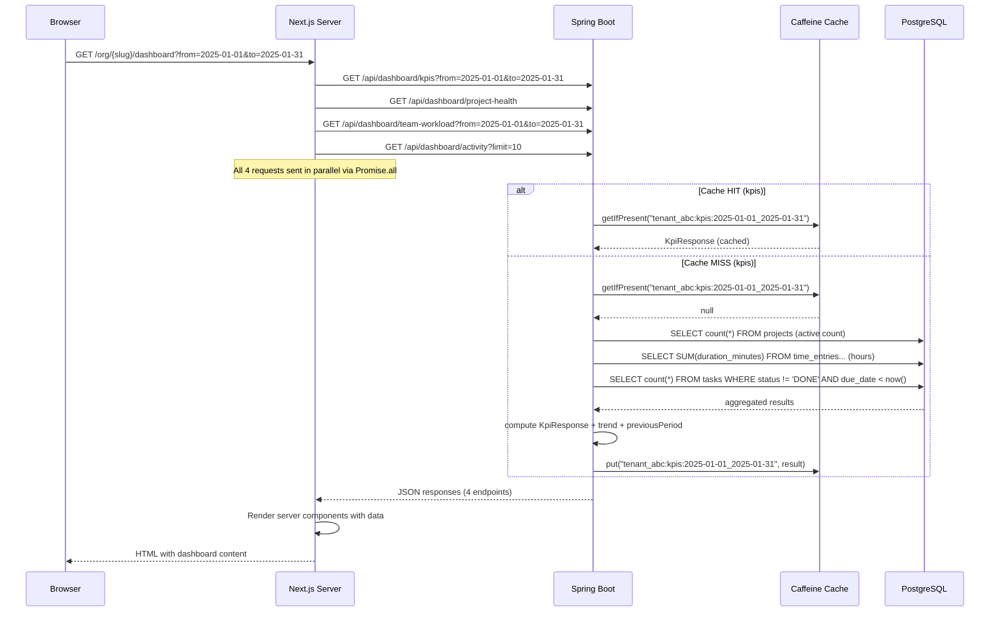
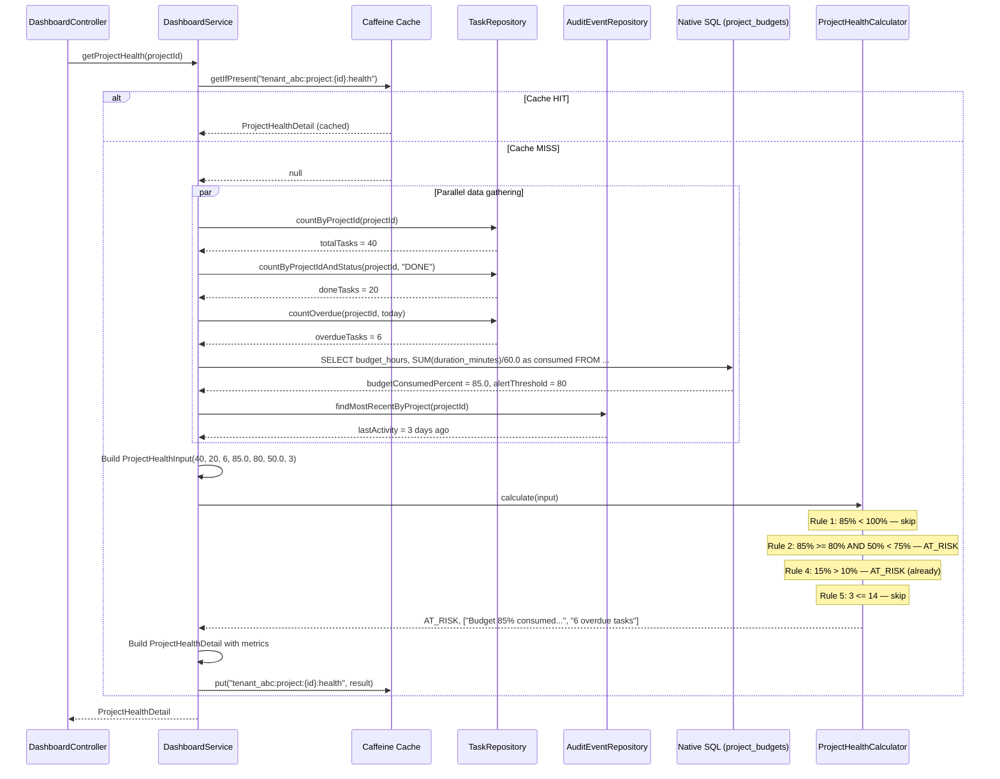
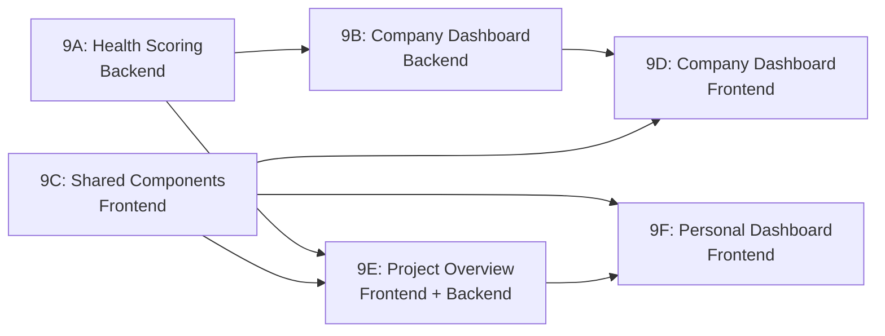

> Merge into `architecture/ARCHITECTURE.md` as a standalone Phase 9 reference document.
> Depends on: Phase 5 (time tracking), Phase 6.5 (activity feed), Phase 8 (rates, budgets, profitability).

# Phase 9 — Operational Dashboards

## 9.1 Overview

Phase 9 adds the **operational dashboards layer** — the connective tissue that turns existing data into at-a-glance situational awareness. Until now, every entity (projects, customers, tasks, time entries) lives on its own page behind two to three clicks. Users cannot answer "how is my business doing?" without navigating to half a dozen different screens. This phase transforms raw operational data into three purpose-built dashboards: a Company Dashboard for org-level situational awareness, a Project Overview tab for per-project health at a glance, and an enhanced Personal Dashboard for individual productivity context.

Phase 9 introduces **no new persistent entities**. All dashboard data is derived from existing entities — Projects, Tasks, TimeEntries, Members, ProjectBudgets, BillingRates, CostRates — through aggregation queries executed at read time and cached in memory with short TTLs. The design philosophy is: compute on read, cache in process, degrade gracefully when upstream data is incomplete. This means the dashboard layer has zero write-path impact and can be deployed alongside the remaining Phase 8 epics without coordination.

The backend additions center on a new `dashboard/` package containing `DashboardService`, `DashboardController`, and `ProjectHealthCalculator`. The frontend introduces a shared component library (`KpiCard`, `HealthBadge`, `SparklineChart`, etc.) that establishes a visual vocabulary for data visualization, then uses those components to build three dashboard experiences. A new cross-project activity endpoint fills the one gap that existing APIs leave: org-level activity aggregation.

### What's New

| Before Phase 9 | After Phase 9 |
|---|---|
| Basic landing page showing project count and placeholders | Company Dashboard with KPI cards, project health, team workload, activity |
| Project detail opens to Tasks tab; no summary view | Overview tab as default with health badge, metrics strip, mini-lists |
| My Work page shows task list and time entries only | Personal Dashboard with utilization KPIs, time breakdown chart, urgency grouping |
| No project health scoring | Deterministic rule-based health status (HEALTHY / AT_RISK / CRITICAL / UNKNOWN) |
| Activity feed is project-scoped only | Cross-project activity endpoint for org-level feed |
| No dashboard caching infrastructure | Caffeine-backed aggregation cache with per-tenant isolation |
| No data visualization components | Shared KpiCard, HealthBadge, SparklineChart, HorizontalBarChart, DateRangeSelector |

### Out of Scope

- **Custom/configurable dashboard layouts** — widget drag-and-drop, widget selection, user preferences persistence. Opinionated fixed layout only ([ADR-047](../adr/ADR-047-dashboard-layout-strategy.md)).
- **Saved dashboard views or dashboard sharing** — URLs with date range params provide basic shareability.
- **PDF/CSV export of dashboard data** — deferred to a future reporting phase.
- **Scheduled dashboard email digests** — deferred.
- **Real-time or live-updating dashboards** — load on visit, manual refresh. Consistent with [ADR-038](../adr/ADR-038-polling-for-notification-delivery.md).
- **Customer-facing dashboards (portal scope)** — the portal has its own views via Phase 7.
- **Historical trend data beyond 12 weeks** — dashboards show current state plus recent trends, not long-range analytics.
- **Drill-down charts** — each widget links to its corresponding detail page, not to a filtered dashboard state.
- **New database migrations** — no schema changes. If indexes are recommended for performance, they are added as a new migration version (V20).

---

## 9.2 Domain Model (Computed, Not Persisted)

Phase 9 introduces no new `@Entity` classes. All data structures are **transient DTOs** — computed on read, cached in memory via Caffeine, and never persisted to the database. This section describes the computed data structures that flow from backend services through API responses to frontend components.

### 9.2.1 HealthStatus

A discrete enum representing a project's operational health:

| Value | Color | Meaning |
|-------|-------|---------|
| `HEALTHY` | Green | No risk indicators triggered |
| `AT_RISK` | Yellow/Amber | One or more warning-level indicators |
| `CRITICAL` | Red | One or more critical-level indicators |
| `UNKNOWN` | Gray | Insufficient data to assess (e.g., zero tasks) |

This is a **Java enum** in the `dashboard/` package, serialized as a string in API responses.

### 9.2.2 DTO Relationships

```mermaid
classDiagram
    class HealthStatus {
        <<enumeration>>
        HEALTHY
        AT_RISK
        CRITICAL
        UNKNOWN
    }

    class ProjectHealth {
        UUID projectId
        String projectName
        String customerName
        HealthStatus healthStatus
        List~String~ healthReasons
        int tasksDone
        int tasksTotal
        double completionPercent
        Double budgetConsumedPercent
        double hoursLogged
    }

    class ProjectHealthDetail {
        HealthStatus healthStatus
        List~String~ healthReasons
        ProjectHealthMetrics metrics
    }

    class ProjectHealthMetrics {
        int tasksDone
        int tasksInProgress
        int tasksTodo
        int tasksOverdue
        int totalTasks
        double completionPercent
        Double budgetConsumedPercent
        double hoursThisPeriod
        int daysSinceLastActivity
    }

    class TaskSummary {
        int todo
        int inProgress
        int inReview
        int done
        int total
        int overdueCount
        +Note: status is free~form String, not enum
    }

    class KpiResponse {
        int activeProjectCount
        double totalHoursLogged
        Double billablePercent
        int overdueTaskCount
        Double averageMarginPercent
        List~TrendPoint~ trend
        KpiValues previousPeriod
    }

    class KpiValues {
        int activeProjectCount
        double totalHoursLogged
        Double billablePercent
        int overdueTaskCount
        Double averageMarginPercent
    }

    class TrendPoint {
        String period
        double value
    }

    class TeamWorkloadEntry {
        UUID memberId
        String memberName
        double totalHours
        double billableHours
        List~ProjectHoursEntry~ projects
    }

    class ProjectHoursEntry {
        UUID projectId
        String projectName
        double hours
    }

    class MemberHoursEntry {
        UUID memberId
        String memberName
        double totalHours
        double billableHours
    }

    class PersonalDashboard {
        UtilizationSummary utilization
        List~ProjectBreakdownEntry~ projectBreakdown
        int overdueTaskCount
        List~UpcomingDeadline~ upcomingDeadlines
        List~TrendPoint~ trend
    }

    class UtilizationSummary {
        double totalHours
        double billableHours
        Double billablePercent
    }

    class ProjectBreakdownEntry {
        UUID projectId
        String projectName
        double hours
        double percent
    }

    class UpcomingDeadline {
        UUID taskId
        String taskName
        String projectName
        LocalDate dueDate
    }

    class CrossProjectActivityItem {
        UUID eventId
        String eventType
        String description
        String actorName
        UUID projectId
        String projectName
        Instant occurredAt
    }

    ProjectHealth --> HealthStatus
    ProjectHealthDetail --> HealthStatus
    ProjectHealthDetail --> ProjectHealthMetrics
    KpiResponse --> TrendPoint
    KpiResponse --> KpiValues
    TeamWorkloadEntry --> ProjectHoursEntry
    PersonalDashboard --> UtilizationSummary
    PersonalDashboard --> ProjectBreakdownEntry
    PersonalDashboard --> UpcomingDeadline
    PersonalDashboard --> TrendPoint
```



All of these are **Java records** in the `dashboard/` package. They are constructed by `DashboardService` methods, serialized as JSON by Spring's `ObjectMapper`, and consumed by the Next.js frontend. None are annotated with `@Entity` or persisted to any table.

---

## 9.3 Project Health Scoring Algorithm

### 9.3.1 Algorithm Specification

Project health is computed by `ProjectHealthCalculator`, a stateless utility class with a single public method: `calculate(ProjectHealthInput) -> ProjectHealthResult`. The algorithm is deterministic and rule-based — the same inputs always produce the same output. Health is never stored; it is computed from current data every time it is requested (with short-TTL caching at the service layer).

The algorithm was chosen over a weighted numeric score for its **explainability** — users see not just a color but a list of human-readable reasons *why* the project is in a given state. See [ADR-045](../adr/ADR-045-project-health-scoring.md) for the full decision rationale.

**Input record:**

```java
public record ProjectHealthInput(
    int totalTasks,
    int doneTasks,
    int overdueTasks,
    Double budgetConsumedPercent,   // null if no budget
    int alertThresholdPct,          // from ProjectBudget, default 80
    double completionPercent,       // doneTasks / totalTasks * 100
    int daysSinceLastActivity       // from most recent AuditEvent
) {}
```

**Output record:**

```java
public record ProjectHealthResult(
    HealthStatus status,
    List<String> reasons
) {}
```

**Algorithm pseudocode:**

```
function calculate(input):
    status = HEALTHY
    reasons = []

    // Rule 1: Budget overrun (CRITICAL)
    if input.budgetConsumedPercent != null AND input.budgetConsumedPercent >= 100:
        status = escalate(status, CRITICAL)
        reasons.add("Over budget")

    // Rule 2: Budget at risk — high consumption with low task completion
    if input.budgetConsumedPercent != null
       AND input.budgetConsumedPercent >= input.alertThresholdPct
       AND input.completionPercent < input.budgetConsumedPercent - 10:
        status = escalate(status, AT_RISK)
        reasons.add("Budget {budgetConsumedPercent}% consumed but only {completionPercent}% of tasks complete")

    // Rule 3: High overdue ratio (CRITICAL)
    if input.totalTasks > 0 AND input.overdueTasks / input.totalTasks > 0.3:
        status = escalate(status, CRITICAL)
        reasons.add("{overdueTasks} of {totalTasks} tasks overdue")

    // Rule 4: Moderate overdue ratio (AT_RISK)
    else if input.totalTasks > 0 AND input.overdueTasks / input.totalTasks > 0.1:
        status = escalate(status, AT_RISK)
        reasons.add("{overdueTasks} overdue tasks")

    // Rule 5: Stale project (AT_RISK)
    if input.totalTasks > 0 AND input.daysSinceLastActivity > 14:
        status = escalate(status, AT_RISK)
        reasons.add("No activity in {daysSinceLastActivity} days")

    // Rule 6: No tasks (UNKNOWN)
    if input.totalTasks == 0:
        status = UNKNOWN
        reasons = ["No tasks created yet"]

    return ProjectHealthResult(status, reasons)

function escalate(current, candidate):
    // CRITICAL > AT_RISK > HEALTHY > UNKNOWN
    return max(current, candidate) by severity ordering
```

**Key design decisions:**

- **Severity escalation**: When multiple rules fire, the worst status wins. A project that is both over budget (CRITICAL) and stale (AT_RISK) is reported as CRITICAL, but *both* reasons appear in the list.
- **Budget is optional**: If `budgetConsumedPercent` is null (no budget configured), Rules 1 and 2 are skipped entirely. The project can still be AT_RISK or CRITICAL based on task metrics alone.
- **UNKNOWN is terminal**: If `totalTasks == 0`, the project is UNKNOWN regardless of other signals. There is nothing to assess.
- **Thresholds**: The 30% (critical) and 10% (at-risk) overdue ratios, the 14-day inactivity window, and the budget alert threshold are constants in the calculator class. A future enhancement could make these configurable per org via `OrgSettings`.

### 9.3.2 `ProjectHealthCalculator` Class Design

```java
package io.b2mash.b2b.b2bstrawman.dashboard;

/**
 * Pure function: computes project health from operational metrics.
 * No side effects, no database access, no Spring dependencies.
 * Fully testable with unit tests.
 */
public final class ProjectHealthCalculator {

    private static final double OVERDUE_CRITICAL_THRESHOLD = 0.3;
    private static final double OVERDUE_AT_RISK_THRESHOLD = 0.1;
    private static final int INACTIVITY_DAYS_THRESHOLD = 14;
    private static final int DEFAULT_BUDGET_ALERT_THRESHOLD = 80;

    private ProjectHealthCalculator() {} // utility class

    public static ProjectHealthResult calculate(ProjectHealthInput input) {
        // ... implementation per pseudocode above
    }

    private static HealthStatus escalate(HealthStatus current, HealthStatus candidate) {
        return current.severity() >= candidate.severity() ? current : candidate;
    }
}
```

The class is `final` with a private constructor — it is a utility class, not a Spring bean. It takes no dependencies and can be called from any context. `DashboardService` calls it after gathering the raw metrics from repositories.

### 9.3.3 Input Sourcing

| Input Field | Source | Query Type |
|---|---|---|
| `totalTasks` | `TaskRepository` — count by project | JPQL (Hibernate @Filter applies) |
| `doneTasks` | `TaskRepository` — count by project where status = 'DONE' | JPQL |
| `overdueTasks` | `TaskRepository` — count by project where status != 'DONE' and dueDate < today | JPQL |
| `budgetConsumedPercent` | `project_budgets` table — native SQL query joining time_entries for hours consumed vs budget_hours. **Note**: The `ProjectBudget` JPA entity does not exist yet (Phase 8 in progress); queries use native SQL directly against the table created by V19 migration. | Native SQL (RLS applies) |
| `alertThresholdPct` | `project_budgets.alert_threshold_pct` — default 80. Returns `null` if no budget row exists → health scoring skips budget rules. | Native SQL (same query as above) |
| `completionPercent` | Derived: `doneTasks / totalTasks * 100.0` | Computed in service |
| `daysSinceLastActivity` | `AuditEventRepository` — most recent `occurred_at` for the project | Native SQL via JSONB index `idx_audit_project` |

### 9.3.4 Worked Example

Consider a project "Website Redesign" with:
- 40 total tasks, 20 done (50% complete), 6 overdue (15% ratio)
- Budget: 200 hours, 170 hours consumed (85%), alert threshold 80%
- Last activity: 3 days ago

**Evaluation:**

1. Rule 1 (budget >= 100%): 85% < 100% — **skipped**
2. Rule 2 (budget >= alertThreshold AND completion < budget - 10): 85% >= 80% AND 50% < 75% — **fires AT_RISK** — reason: "Budget 85% consumed but only 50% of tasks complete"
3. Rule 3 (overdue ratio > 30%): 15% <= 30% — **skipped**
4. Rule 4 (overdue ratio > 10%): 15% > 10% — **fires AT_RISK** — reason: "6 overdue tasks"
5. Rule 5 (inactive > 14 days): 3 <= 14 — **skipped**
6. Rule 6 (no tasks): 40 > 0 — **skipped**

**Result**: `AT_RISK` with reasons: `["Budget 85% consumed but only 50% of tasks complete", "6 overdue tasks"]`

---

## 9.4 Backend Services & Caching

### 9.4.1 DashboardService Design

`DashboardService` is the primary backend service for Phase 9. It encapsulates all aggregation queries, caching logic, and DTO assembly. Each public method corresponds to one or more API endpoints.

```java
package io.b2mash.b2b.b2bstrawman.dashboard;

@Service
public class DashboardService {

    private final TaskRepository taskRepository;
    private final TimeEntryRepository timeEntryRepository;
    private final ProjectRepository projectRepository;
    private final MemberRepository memberRepository;
    private final ProjectMemberRepository projectMemberRepository;
    private final AuditEventRepository auditEventRepository;

    // Org-level cache: 3 min TTL
    private final Cache<String, Object> orgCache = Caffeine.newBuilder()
        .maximumSize(1_000)
        .expireAfterWrite(Duration.ofMinutes(3))
        .build();

    // Project-level cache: 1 min TTL
    private final Cache<String, Object> projectCache = Caffeine.newBuilder()
        .maximumSize(5_000)
        .expireAfterWrite(Duration.ofMinutes(1))
        .build();

    // --- Company Dashboard methods ---
    public KpiResponse getCompanyKpis(String tenantId, LocalDate from, LocalDate to) { ... }
    public List<ProjectHealth> getProjectHealthList(String tenantId, UUID memberId, String orgRole) { ... }
    // orgRole determines project visibility: admins/owners see all org projects; members see only projects they belong to (via project_members join)
    public List<TeamWorkloadEntry> getTeamWorkload(String tenantId, UUID memberId, String orgRole, LocalDate from, LocalDate to) { ... }

    // --- Project Overview methods ---
    public ProjectHealthDetail getProjectHealth(UUID projectId) { ... }
    public TaskSummary getTaskSummary(UUID projectId) { ... }
    public List<MemberHoursEntry> getProjectMemberHours(UUID projectId, LocalDate from, LocalDate to) { ... }

    // --- Personal Dashboard methods ---
    public PersonalDashboard getPersonalDashboard(UUID memberId, LocalDate from, LocalDate to) { ... }

    // --- Cross-Project Activity ---
    public List<CrossProjectActivityItem> getCrossProjectActivity(UUID memberId, String orgRole, int limit) { ... }
}
```

### 9.4.2 Caffeine Cache Configuration

The dashboard uses **two separate Caffeine caches** with different TTLs, following the existing inline cache pattern from `TenantFilter` and `MemberFilter`:

| Cache | Max Entries | TTL | Purpose |
|---|---|---|---|
| `orgCache` | 1,000 | 3 minutes | Org-level aggregations: KPIs, project health list, team workload |
| `projectCache` | 5,000 | 1 minute | Project-level metrics: health detail, task summary, member hours |

**Cache key format:** `"{tenantId}:{namespace}[:{id}]:{params}"`

The key has three to four segments: (1) tenant schema name for isolation, (2) endpoint namespace, (3) optional entity/user ID for per-resource or per-user caching, (4) date range or other parameters. Each endpoint's full cache key is documented in Section 9.5.

Examples:
- `"tenant_abc123:kpis:2025-01-01_2025-01-31"` — org KPIs for January
- `"tenant_abc123:project-health:all"` — project health list (no date range)
- `"tenant_abc123:project:{projectId}:task-summary:none"` — task summary (no date range)
- `"tenant_abc123:personal:{memberId}:2025-01-01_2025-01-31"` — personal dashboard

**Cache access pattern** (consistent with existing codebase — [ADR-044](../adr/ADR-044-dashboard-aggregation-caching.md)):

```java
// CORRECT: getIfPresent() + put() — avoids NPE from cache.get(key, loader)
@SuppressWarnings("unchecked")
public KpiResponse getCompanyKpis(String tenantId, LocalDate from, LocalDate to) {
    String key = tenantId + ":kpis:" + from + "_" + to;
    KpiResponse cached = (KpiResponse) orgCache.getIfPresent(key);
    if (cached != null) {
        return cached;
    }
    KpiResponse result = computeCompanyKpis(tenantId, from, to);
    orgCache.put(key, result);
    return result;
}
```

**Per-tenant isolation** is achieved through the cache key prefix. Because `tenantId` (the schema name) is the first segment of every key, a tenant's cached data is never returned to another tenant. Additionally, the Hibernate `@Filter` and RLS policies on the underlying queries provide defense-in-depth — even if a cache key collision somehow occurred, the raw queries are tenant-scoped.

**No write-through eviction**: Short TTLs (1-3 minutes) handle staleness acceptably. When a user creates a task and then views the dashboard, the dashboard may show stale data for up to 3 minutes. This is an acceptable trade-off for a read-only dashboard — the task itself is immediately visible on the task list, and the dashboard catches up shortly.

### 9.4.3 Trend Computation

Several endpoints return `trend` arrays — time-series data points for sparklines. The granularity adapts to the date range:

| Date Range | Granularity | Example Periods |
|---|---|---|
| 1-7 days | Daily | `2025-01-13`, `2025-01-14`, ... |
| 8-90 days | Weekly | `2025-W03`, `2025-W04`, ... |
| 91+ days | Monthly | `2025-01`, `2025-02`, ... |

The trend always includes the **last 6 periods** at the computed granularity. The backend generates period boundaries and runs a single GROUP BY query per trend, formatting the period labels as ISO strings.

### 9.4.4 Previous Period Computation

The KPI response includes a `previousPeriod` object for computing delta/change indicators. The previous period mirrors the shape of the requested period:

- Requested: `2025-01-01` to `2025-01-31` (31 days) → Previous: `2024-12-01` to `2024-12-31`
- Requested: `2025-01-06` to `2025-01-12` (7 days) → Previous: `2024-12-30` to `2025-01-05`

The change percentage is: `((current - previous) / previous) * 100`. If the previous value is zero, the change indicator shows "+100%" for non-zero current or "0%" for zero current.

---

## 9.5 API Surface

### 9.5.1 Company Dashboard Endpoints

| Method | Path | Description | Auth | Cache TTL |
|---|---|---|---|---|
| `GET` | `/api/dashboard/kpis?from=&to=` | Org-level KPI values with trend and previous period | Clerk JWT (ORG_MEMBER+) | 3 min |
| `GET` | `/api/dashboard/project-health` | Project health list for accessible projects | Clerk JWT (ORG_MEMBER+) | 3 min |
| `GET` | `/api/dashboard/team-workload?from=&to=` | Team hours distribution by member and project | Clerk JWT (ORG_MEMBER+) | 3 min |
| `GET` | `/api/dashboard/activity?limit=10` | Cross-project activity feed | Clerk JWT (ORG_MEMBER+) | 3 min |

#### `GET /api/dashboard/kpis`

**Auth**: Valid Clerk JWT. All org members can call. Financial fields (`billablePercent`, `averageMarginPercent`) are null for non-admin/non-owner callers.

**Query params**: `from` (LocalDate, required), `to` (LocalDate, required)

**Response** (`200 OK`):

```json
{
  "activeProjectCount": 12,
  "totalHoursLogged": 847.5,
  "billablePercent": 72.3,
  "overdueTaskCount": 8,
  "averageMarginPercent": 34.2,
  "trend": [
    { "period": "2025-W01", "value": 120.0 },
    { "period": "2025-W02", "value": 145.5 },
    { "period": "2025-W03", "value": 138.0 },
    { "period": "2025-W04", "value": 152.0 },
    { "period": "2025-W05", "value": 141.5 },
    { "period": "2025-W06", "value": 150.5 }
  ],
  "previousPeriod": {
    "activeProjectCount": 11,
    "totalHoursLogged": 792.0,
    "billablePercent": 68.5,
    "overdueTaskCount": 5,
    "averageMarginPercent": 31.8
  }
}
```

**Cache key**: `"{tenantId}:kpis:{from}_{to}"`

**Permission notes**: Regular members see `billablePercent` and `averageMarginPercent` as `null`. The backend checks `RequestScopes.getOrgRole()` and nulls out financial fields before returning.

**`averageMarginPercent` calculation**: Weighted average across all projects with financial data (i.e., projects where at least one time entry has rate snapshot data). The weight is each project's billable value (hours × billing rate). Projects with no rate data are excluded from the average. If no projects have rate data, the field is `null`. This calculation depends on Phase 8's rate snapshot fields on `TimeEntry` (not yet implemented) — until then, the field returns `null` and the KPI card shows the empty state.

#### `GET /api/dashboard/project-health`

**Auth**: Valid Clerk JWT. Returns only projects the caller has access to. Admins/owners see all projects; members see only projects they belong to.

**Response** (`200 OK`):

```json
{
  "projects": [
    {
      "projectId": "550e8400-e29b-41d4-a716-446655440001",
      "projectName": "Website Redesign",
      "customerName": "Acme Corp",
      "healthStatus": "AT_RISK",
      "healthReasons": ["Budget 85% consumed but only 50% of tasks complete", "6 overdue tasks"],
      "tasksDone": 20,
      "tasksTotal": 40,
      "completionPercent": 50.0,
      "budgetConsumedPercent": 85.0,
      "hoursLogged": 170.0
    },
    {
      "projectId": "550e8400-e29b-41d4-a716-446655440002",
      "projectName": "Mobile App",
      "customerName": null,
      "healthStatus": "HEALTHY",
      "healthReasons": [],
      "tasksDone": 15,
      "tasksTotal": 20,
      "completionPercent": 75.0,
      "budgetConsumedPercent": null,
      "hoursLogged": 95.5
    }
  ]
}
```

**Sort order**: CRITICAL first, then AT_RISK, then HEALTHY, then UNKNOWN. Within each severity group, sorted by `completionPercent` ascending (least complete first).

**Cache key**: `"{tenantId}:project-health:{memberId}:{orgRole}"` — per-user because project visibility varies by role.

#### `GET /api/dashboard/team-workload`

**Auth**: Valid Clerk JWT. Admins/owners see all members. Regular members see only their own entry.

**Query params**: `from` (LocalDate, required), `to` (LocalDate, required)

**Response** (`200 OK`):

```json
{
  "members": [
    {
      "memberId": "550e8400-e29b-41d4-a716-446655440010",
      "memberName": "Alice Johnson",
      "totalHours": 42.5,
      "billableHours": 35.0,
      "projects": [
        { "projectId": "...", "projectName": "Website Redesign", "hours": 20.0 },
        { "projectId": "...", "projectName": "Mobile App", "hours": 12.5 },
        { "projectId": "...", "projectName": "API Migration", "hours": 8.0 },
        { "projectId": "...", "projectName": "Other", "hours": 2.0 }
      ]
    }
  ]
}
```

Each member's `projects` array is sorted by hours descending, capped at the **top 5 projects** plus an "Other" aggregate for the remainder. Only members with logged hours in the period are included.

**Cache key**: `"{tenantId}:team-workload:{orgRole}:{from}_{to}"` — admins get the full list; members get their single-entry view. The `orgRole` segment differentiates.

#### `GET /api/dashboard/activity`

**Auth**: Valid Clerk JWT (ORG_MEMBER+). Returns activity only for projects the caller has access to.

**Query params**: `limit` (int, optional, default 10, max 50)

**Response** (`200 OK`):

```json
{
  "items": [
    {
      "eventId": "550e8400-e29b-41d4-a716-446655440099",
      "eventType": "task.created",
      "description": "Alice created task 'Fix login bug'",
      "actorName": "Alice Johnson",
      "projectId": "550e8400-e29b-41d4-a716-446655440001",
      "projectName": "Website Redesign",
      "occurredAt": "2025-01-15T10:30:00Z"
    }
  ]
}
```

This is a **new endpoint** not covered by the existing project-scoped `GET /api/projects/{projectId}/activity`. It aggregates recent audit events across all projects the caller can access. For admins/owners, this is all projects in the tenant. For regular members, it filters to projects they are a member of, using the same `project_members` join pattern as the existing activity feed.

**Cache key**: `"{tenantId}:activity:{memberId}:{orgRole}:{limit}"`

### 9.5.2 Project Overview Endpoints

| Method | Path | Description | Auth | Cache TTL |
|---|---|---|---|---|
| `GET` | `/api/projects/{projectId}/health` | Project health with metrics | Clerk JWT + project view access | 1 min |
| `GET` | `/api/projects/{projectId}/task-summary` | Task counts by status | Clerk JWT + project view access | 1 min |
| `GET` | `/api/projects/{projectId}/member-hours?from=&to=` | Member hours breakdown | Clerk JWT + project view access | 1 min |

#### `GET /api/projects/{projectId}/health`

**Auth**: `ProjectAccessService.requireViewAccess()` — any project member, admin, or owner.

**Response** (`200 OK`):

```json
{
  "healthStatus": "AT_RISK",
  "healthReasons": ["Budget 85% consumed but only 50% of tasks complete", "6 overdue tasks"],
  "metrics": {
    "tasksDone": 20,
    "tasksInProgress": 10,
    "tasksTodo": 4,
    "tasksOverdue": 6,
    "totalTasks": 40,
    "completionPercent": 50.0,
    "budgetConsumedPercent": 85.0,
    "hoursThisPeriod": 32.5,
    "daysSinceLastActivity": 3
  }
}
```

**Budget graceful degradation**: If no `project_budgets` row exists for the project, `budgetConsumedPercent` is `null` and budget-related health rules are skipped.

**Cache key**: `"{tenantId}:project:{projectId}:health"`

#### `GET /api/projects/{projectId}/task-summary`

**Auth**: `ProjectAccessService.requireViewAccess()`

**Response** (`200 OK`):

```json
{
  "todo": 4,
  "inProgress": 10,
  "inReview": 0,
  "done": 20,
  "total": 40,
  "overdueCount": 6
}
```

**Note on status values**: Task status is a free-form string (see Section 9.3.3). The task summary query uses conditional counting:
- `todo` = count where `status = 'OPEN'`
- `inProgress` = count where `status = 'IN_PROGRESS'`
- `inReview` = count where `status = 'IN_REVIEW'`
- `done` = count where `status = 'DONE'`
- `total` = count all
- `overdueCount` = count where `status != 'DONE'` and `due_date < CURRENT_DATE`

Tasks with non-standard status values are included in `total` but not in the named buckets. This is intentional — the summary shows known statuses, and the total always reconciles.

**Cache key**: `"{tenantId}:project:{projectId}:task-summary"`

#### `GET /api/projects/{projectId}/member-hours`

**Auth**: `ProjectAccessService.requireViewAccess()`

**Query params**: `from` (LocalDate, required), `to` (LocalDate, required)

**Response** (`200 OK`):

```json
{
  "members": [
    {
      "memberId": "550e8400-e29b-41d4-a716-446655440010",
      "memberName": "Alice Johnson",
      "totalHours": 20.0,
      "billableHours": 16.5
    },
    {
      "memberId": "550e8400-e29b-41d4-a716-446655440011",
      "memberName": "Bob Smith",
      "totalHours": 12.5,
      "billableHours": 10.0
    }
  ]
}
```

Sorted by `totalHours` descending. This uses a native SQL aggregation query joining `time_entries` to `tasks` (to scope by project) and `members` (for names). The query is similar to the existing `ProjectTimeSummaryController`'s by-member endpoint but returns `totalHours` as decimal hours rather than `totalMinutes`.

**Cache key**: `"{tenantId}:project:{projectId}:member-hours:{from}_{to}"`

### 9.5.3 Personal Dashboard Endpoint

| Method | Path | Description | Auth | Cache TTL |
|---|---|---|---|---|
| `GET` | `/api/dashboard/personal?from=&to=` | Current member's personal dashboard data | Clerk JWT (self-scoped) | 1 min |

#### `GET /api/dashboard/personal`

**Auth**: Self-scoped via `RequestScopes.MEMBER_ID`. No `ProjectAccessService` call needed — `WHERE member_id = :id` is its own authorization per [ADR-023](../adr/ADR-023-my-work-cross-project-query.md).

**Query params**: `from` (LocalDate, required), `to` (LocalDate, required)

**Response** (`200 OK`):

```json
{
  "utilization": {
    "totalHours": 38.5,
    "billableHours": 30.0,
    "billablePercent": 77.9
  },
  "projectBreakdown": [
    { "projectId": "...", "projectName": "Website Redesign", "hours": 20.0, "percent": 51.9 },
    { "projectId": "...", "projectName": "Mobile App", "hours": 12.5, "percent": 32.5 },
    { "projectId": "...", "projectName": "API Migration", "hours": 6.0, "percent": 15.6 }
  ],
  "overdueTaskCount": 2,
  "upcomingDeadlines": [
    { "taskId": "...", "taskName": "Fix login bug", "projectName": "Website Redesign", "dueDate": "2025-01-20" },
    { "taskId": "...", "taskName": "Design review", "projectName": "Mobile App", "dueDate": "2025-01-22" }
  ],
  "trend": [
    { "period": "2025-W01", "value": 36.0 },
    { "period": "2025-W02", "value": 40.0 },
    { "period": "2025-W03", "value": 38.5 }
  ]
}
```

This endpoint consolidates data that would otherwise require multiple calls (`/my-work/time-summary`, `/my-work/tasks`, etc.) into a single response. The `billablePercent` is derived from the `billable` flag on time entries — it does not require billing rates. If no time entries exist, `utilization` shows zeros and `projectBreakdown` is an empty array.

**Cache key**: `"{tenantId}:personal:{memberId}:{from}_{to}"`

### 9.5.4 Existing Endpoints Consumed by Dashboards

The Project Overview tab also consumes existing endpoints that are not part of the `dashboard/` package:

| Endpoint | Source | Used By |
|---|---|---|
| `GET /api/projects/{id}/budget/status` | Phase 8 (not yet implemented) | Project Overview — budget widget |
| `GET /api/projects/{id}/profitability` | Phase 8 (not yet implemented) | Project Overview — margin metric |
| `GET /api/projects/{id}/activity?limit=5` | Phase 6.5 `ActivityController` | Project Overview — recent activity |
| `GET /api/projects/{id}/time-summary` | Phase 5 `ProjectTimeSummaryController` | (Indirect — DashboardService queries directly) |

When Phase 8 endpoints do not yet exist, the frontend catches the 404 and renders the appropriate empty/placeholder state. This is consistent with the graceful degradation strategy.

---

## 9.6 Company Dashboard (Frontend)

### 9.6.1 Route and Layout

**Route**: `/dashboard` (replaces the existing `frontend/app/(app)/org/[slug]/dashboard/page.tsx`)

The current dashboard page shows 4 static stat cards (projects count, placeholder "—" values), quick action buttons, and hardcoded activity data. Phase 9 replaces it entirely.

**Page layout (desktop >= 1024px):**

```
+-------------------------------------------------------+
| Org Name                      [Date Range Selector]    |
+-------------------------------------------------------+
| [KPI Card] [KPI Card] [KPI Card] [KPI Card] [KPI Card]|
+-------------------------------------------------------+
| Project Health (wider)    | Team Workload              |
|                           |                            |
| [Filter: All|AtRisk|Crit] | [Stacked Bar Chart]       |
| [Project rows...]         |                            |
|                           |----------------------------|
|                           | Recent Activity             |
|                           | [Activity items...]         |
| [View all projects ->]    | [View all activity ->]     |
+-------------------------------------------------------+
```

**Tablet (768-1023px):** KPIs in a 2x3 grid (last row has 1 card centered). Main content stacks: Project Health, Team Workload, Recent Activity in a single column.

**Mobile (<768px):** KPIs in a horizontally scrollable strip. All widgets stacked vertically.

### 9.6.2 KPI Cards

Five cards in a responsive flex row using the shared `KpiCard` component:

| Card | Label | Value | Change Direction Logic | Link | Admin Only? |
|---|---|---|---|---|---|
| 1 | Active Projects | count | More is "positive" (green up arrow) | `/projects` | No |
| 2 | Hours Logged | total hours (period) | More is "positive" | `/my-work` | No |
| 3 | Billable % | `billablePercent` | Higher is "positive" | Utilization report (Phase 8) | Yes |
| 4 | Overdue Tasks | count | Fewer is "positive" (down arrow green, up arrow red) | Task list filtered to overdue | No |
| 5 | Avg. Margin | `averageMarginPercent` | Higher is "positive" | Profitability page (Phase 8) | Yes |

Cards 3 and 5 are **hidden for non-admin/non-owner members** using the same role check already established in the frontend. When hidden, the remaining 3 cards expand to fill the row.

**Sparkline**: Each card includes a sparkline from the `trend` array in the KPI response (last 6 periods). The sparkline for Avg. Margin may be null if no rate data exists.

**Empty states**:
- No time logged: Hours = "0h", sparkline hidden, change indicator hidden
- No rate data: Billable % and Avg. Margin show "Set up rates to track" with a link to the Phase 8 rate configuration page (when available)
- No projects: Active Projects = "0", prompt "Create your first project"

### 9.6.3 Project Health Widget

Occupies the left column (approximately 60% width on desktop). Content:

- **Filter tabs** above the list: "All" / "At Risk" / "Critical". Clicking a tab filters the list client-side (no API call). "All" is the default.
- **Project rows** (max 10 visible):
  - Health badge (colored dot via `HealthBadge` component)
  - Project name (bold) + customer name (muted, if set)
  - Completion progress bar (percentage label inside)
  - Health reasons as small muted text below the project name
- **Sort**: CRITICAL first, then AT_RISK, then HEALTHY, then UNKNOWN. Within each group, sorted by `completionPercent` ascending.
- **Row click**: Navigates to project detail Overview tab (`/org/{slug}/projects/{id}`)
- **Footer**: "View all projects" link to `/org/{slug}/projects`

**Empty state**: "No projects yet — create your first project to see health metrics here."

### 9.6.4 Team Workload Widget

Occupies the right column, top section. Uses the `HorizontalBarChart` component.

- Each bar represents a team member (Y-axis: member name)
- Bar segments represent projects, color-coded (consistent palette)
- X-axis: hours
- Hover/tap reveals a tooltip with the breakdown: project name and hours
- Below the chart: legend showing project names with their colors (top projects by total hours across all members)
- **Admin/owner view**: All members with logged hours
- **Member view**: Only the caller's own bar, with a muted note: "Contact an admin to see team-wide data"

**Empty state**: "No time logged this period. Start tracking time to see workload distribution."

### 9.6.5 Recent Activity Widget

Occupies the right column, below Team Workload.

- Reuses the existing `ActivityItem` rendering pattern from Phase 6.5
- Shows the 10 most recent activities across all accessible projects (via the new cross-project activity endpoint)
- Each entry: activity icon/avatar, description, project name badge (pill), relative timestamp
- Footer: "View all activity" link (navigates to the project list or a future org-level activity page)

**Empty state**: "No recent activity across your projects."

### 9.6.6 Date Range Selector

The `DateRangeSelector` component sits in the page header. It controls the date range for KPIs, team workload, and sparklines. The project health list is date-independent (shows current state).

- **Presets**: "This Week" (Mon-Sun), "This Month", "Last 30 Days", "This Quarter", "Custom" (opens a date picker)
- **URL sync**: The selected range is reflected in URL search params (`?from=2025-01-01&to=2025-01-31`). This makes dashboard states bookmarkable and shareable.
- **Default**: "This Month" on first visit (no URL params)
- **Refresh button**: A small refresh icon next to the selector clears caches and re-fetches all data.

### 9.6.7 Server Component Strategy

The dashboard page is a **Next.js server component** that fetches all widget data in parallel:

```typescript
// frontend/app/(app)/org/[slug]/dashboard/page.tsx
export default async function DashboardPage({ searchParams }) {
  const { from, to } = resolveDateRange(searchParams);

  // Promise.all is intentional here: all 4 endpoints are Phase 9 endpoints
  // that we control — they should always be available. Contrast with the
  // Project Overview tab (Section 9.7.6) which uses Promise.allSettled
  // because it calls Phase 8 endpoints that may not exist yet.
  const [kpis, projectHealth, teamWorkload, activity] = await Promise.all([
    fetchDashboardKpis(from, to),
    fetchProjectHealth(),
    fetchTeamWorkload(from, to),
    fetchDashboardActivity(10),
  ]);

  return (
    <DashboardLayout>
      <KpiCardRow kpis={kpis} />
      <div className="grid grid-cols-1 lg:grid-cols-5 gap-6">
        <div className="lg:col-span-3">
          <ProjectHealthWidget projects={projectHealth} />
        </div>
        <div className="lg:col-span-2 space-y-6">
          <TeamWorkloadWidget data={teamWorkload} />
          <RecentActivityWidget items={activity} />
        </div>
      </div>
    </DashboardLayout>
  );
}
```

Each widget is independent — if one API call fails, the others still render. The failing widget shows an error state ("Unable to load project health. Please try again.") rather than crashing the entire page. This is achieved via individual try/catch blocks in the fetch functions, not React error boundaries (since this is a server component).

---

## 9.7 Project Overview Tab (Frontend)

### 9.7.1 Tab Structure

The Project Overview tab is added as the **first tab** in the project detail page, becoming the default landing when navigating to a project.

**Current tab order**: Tasks | Documents | Time | Activity
**New tab order**: Overview | Tasks | Documents | Time | Activity

The existing `frontend/app/(app)/org/[slug]/projects/[id]/page.tsx` needs to be updated to default to the Overview tab. The Overview content is a new server component that fetches multiple endpoints in parallel.

### 9.7.2 Layout

```
+------------------------------------------------------------+
| [HEALTH BADGE]  Project Name                               |
|                 Customer: Acme Corp                          |
|                 AT_RISK: Budget 85% consumed...              |
|                 [Log Time] [Add Task]                        |
+------------------------------------------------------------+
| [Tasks]          [Hours]        [Budget]       [Margin]     |
| 20/40 complete   32.5h logged   85% used       34.2%        |
| [progress ring]  this month     [progress bar] leads only   |
+------------------------------------------------------------+
| Tasks                          | Team Hours                 |
| !! Fix login (3d overdue)      | Alice: 20.0h [======]     |
| !! Review docs (1d overdue)    | Bob: 12.5h   [====]       |
|    API endpoint (due Jan 20)   | Carol: 8.0h  [==]         |
|    Design review (due Jan 22)  |                            |
|    Deploy staging (due Jan 25) |----------------------------|
| [View all tasks ->]            | Recent Activity            |
|                                | Alice created task ...     |
|                                | Bob logged 2h on ...       |
|                                | [View all ->]              |
+------------------------------------------------------------+
```

### 9.7.3 Top Row — Health and Actions

- **Health badge** (large `HealthBadge` with `size="lg"`): colored dot + text label ("At Risk", "Healthy", etc.)
- **Health reasons**: displayed as small pill badges below the project name. Colors match severity: red for CRITICAL reasons, amber for AT_RISK reasons.
- **Quick actions**: "Log Time" and "Add Task" buttons. Only shown if the user has edit access (`canEdit` from `ProjectAccessService`).

### 9.7.4 Metrics Strip

Four compact `KpiCard` variants (without sparkline, smaller size) in a single row:

| Metric | Source | Visibility | Empty State |
|---|---|---|---|
| Tasks: `{done}/{total}` complete | `/api/projects/{id}/task-summary` | All members | "No tasks yet" |
| Hours: `{hours}h` logged | `/api/projects/{id}/member-hours` (sum) | All members | "0h" |
| Budget: `{consumed}%` used | `/api/projects/{id}/budget/status` (Phase 8) | All members | "No budget" with link |
| Margin: `{margin}%` | `/api/projects/{id}/profitability` (Phase 8) | Leads/admins/owners only | "—" if no rate data |

The Tasks metric uses the `MiniProgressRing` component instead of a sparkline.

### 9.7.5 Two-Column Body

**Left column — Tasks mini-list:**
- **Overdue section** (if any): Tasks where `status != 'DONE'` and `dueDate < today`, highlighted with red left border and "X days overdue" badge
- **Upcoming section**: Next 5 tasks by due date
- Footer: "View all tasks" link navigates to the Tasks tab

**Right column — top (Team Hours):**
- Mini horizontal bars showing each member's hours for the current month
- Uses the `HorizontalBarChart` component with a compact configuration
- Footer: "View time details" link navigates to the Time tab

**Right column — bottom (Recent Activity):**
- Last 5 activity items from the existing `GET /api/projects/{id}/activity?limit=5` endpoint
- Reuses the existing activity item rendering from Phase 6.5
- Footer: "View all" link navigates to the Activity tab

### 9.7.6 Server Component Strategy

```typescript
// frontend/components/projects/overview-tab.tsx
export default async function OverviewTab({ projectId, access }: Props) {
  const thisMonth = getThisMonthRange();

  const [health, taskSummary, memberHours, budgetStatus, profitability, activity] =
    await Promise.allSettled([
      fetchProjectHealth(projectId),
      fetchTaskSummary(projectId),
      fetchMemberHours(projectId, thisMonth.from, thisMonth.to),
      fetchBudgetStatus(projectId),      // Phase 8 — may 404
      fetchProfitability(projectId),     // Phase 8 — may 404
      fetchProjectActivity(projectId, 5),
    ]);

  // Each settled promise is checked: fulfilled → data, rejected → null
  // Components render with null-safe props (empty/placeholder states)
}
```

Using `Promise.allSettled` instead of `Promise.all` ensures that a 404 from not-yet-implemented Phase 8 endpoints does not block the entire tab from rendering. Each widget handles its own missing-data state independently.

### 9.7.7 Financial Metrics Visibility

Budget and margin metrics in the metrics strip are **conditionally visible** based on the caller's access level:

- **Budget** (`budgetConsumedPercent`): Visible to all project members. Budget data is not considered sensitive — it helps everyone on the team understand resource constraints.
- **Margin** (`marginPercent`): Visible only to project leads, org admins, and org owners. Regular project members see a "—" placeholder. This is enforced on the backend (`ProjectAccessService.canEdit()` checks) and reflected in the frontend via the `access` prop.

---

## 9.8 Personal Dashboard (Frontend)

### 9.8.1 Enhancement Strategy

The Personal Dashboard enhances the existing My Work page (`frontend/app/(app)/org/[slug]/my-work/page.tsx`) rather than replacing it. A new **dashboard header section** is added above the existing task and time entry lists.

### 9.8.2 Dashboard Header

```
+------------------------------------------------------------+
| My Work                           [Date Range Selector]    |
+------------------------------------------------------------+
| [Hours This Week]  [Billable %]  [Overdue Tasks]          |
|  38.5h             77.9%          2                         |
|  [sparkline]       [—if no rates] [red if > 0]             |
+------------------------------------------------------------+
| Time Breakdown                                              |
| Website Redesign  [====================]  20.0h  52%       |
| Mobile App        [============]          12.5h  32%       |
| API Migration     [======]                 6.0h  16%       |
+------------------------------------------------------------+
| Upcoming Deadlines                                          |
| Fix login bug     Website Redesign   Jan 20   (5 days)     |
| Design review     Mobile App         Jan 22   (7 days)     |
+------------------------------------------------------------+
| [Existing: Assigned Tasks | Available Tasks | Time Entries] |
+------------------------------------------------------------+
```

### 9.8.3 My KPIs Row

Three `KpiCard` components:

| Card | Label | Value | Sparkline | Empty State |
|---|---|---|---|---|
| Hours This Period | "Hours {period}" | total hours | Last 6 periods trend | "0h" |
| Billable % | "Billable %" | percent | None | "—" (no rates configured) |
| Overdue Tasks | "Overdue Tasks" | count | None | "0" (green) |

The "Hours" card label adapts to the selected date range: "Hours This Week" for weekly, "Hours This Month" for monthly.

### 9.8.4 Time Breakdown Chart

A `HorizontalBarChart` showing hours per project for the selected period. Single-segment bars (no stacking — personal view is not split by project sub-categories). Color-coded with consistent project colors. Shows top 5 projects plus "Other" aggregate.

### 9.8.5 Enhanced Task List

The existing `AssignedTaskList` component is enhanced with:

- **Urgency indicators**: Overdue tasks get a red left border and a "X days overdue" badge
- **Grouping**: The task list is divided into sections:
  1. "Overdue" (red header, sorted by overdue days descending — most overdue first)
  2. "Due This Week" (amber header if any tasks due within 2 days)
  3. "Upcoming" (tasks with due dates beyond this week)
  4. "No Due Date" (tasks with null `dueDate`)
- The grouping is computed client-side from the existing task response data

### 9.8.6 Upcoming Deadlines Section

A simple list showing the next 5 deadlines across all projects:

| Column | Content |
|---|---|
| Task name | Linked to the task |
| Project name | Small badge/pill |
| Due date | Formatted date |
| Days remaining | "5 days", "2 days" (amber if <= 2), "Overdue" (red if past) |

Data comes from the `upcomingDeadlines` field of the personal dashboard response.

### 9.8.7 Date Range Selector

The same `DateRangeSelector` component used on the Company Dashboard, with the same presets and URL param synchronization. Default: "This Week".

Changing the date range re-fetches the personal dashboard data (KPIs, time breakdown, trend). The task list is **not** affected by the date range — it always shows current assignments regardless of period.

---

## 9.9 Shared Dashboard Components

All components live in `frontend/components/dashboard/` and follow the existing Shadcn UI design language (same border radii, shadows, colors, typography).

### 9.9.1 KpiCard

```typescript
interface KpiCardProps {
  label: string;
  value: string | number;
  changePercent?: number | null;
  changeDirection?: "positive" | "negative" | "neutral";
  trend?: number[] | null;
  href?: string | null;
  emptyState?: string | null;
}
```

**Visual**: Card with subtle border (`border` from Shadcn), padding. Large value (text-2xl font-bold), small label above (text-sm text-muted-foreground). Below the value: change indicator (small arrow up/down with percent, colored green/red/gray) and sparkline side by side. If `emptyState` is set and value is null/zero, the card shows the empty state message instead of the value. If `href` is set, the entire card is wrapped in a `Link` and shows hover state.

**Implementation**: Pure presentational component. No data fetching.

### 9.9.2 HealthBadge

```typescript
interface HealthBadgeProps {
  status: "HEALTHY" | "AT_RISK" | "CRITICAL" | "UNKNOWN";
  reasons?: string[] | null;
  size?: "sm" | "md" | "lg";
}
```

**Visual**:
- `sm`: Colored dot only (8px)
- `md`: Dot + text label ("Healthy", "At Risk", "Critical", "Unknown")
- `lg`: Dot + text label + reasons list below

Colors: HEALTHY=green-500, AT_RISK=amber-500, CRITICAL=red-500, UNKNOWN=gray-400

**Tooltip**: On `sm` and `md` sizes, reasons are shown in a Shadcn `Tooltip` on hover. On `lg` size, reasons are displayed inline below the label as small muted text.

### 9.9.3 MiniProgressRing

```typescript
interface MiniProgressRingProps {
  value: number; // 0-100
  size?: number; // px, default 32
  color?: string; // auto if omitted
}
```

**Visual**: SVG circular progress indicator. Background circle in `muted`, foreground arc in the computed color. Number shown in center (text-xs) if `size >= 40`.

**Auto-color logic**: value > 66 = green-500, > 33 = amber-500, <= 33 = red-500.

**Implementation**: Pure SVG — no charting library dependency. `stroke-dasharray` and `stroke-dashoffset` for the arc.

### 9.9.4 SparklineChart

```typescript
interface SparklineChartProps {
  data: number[];
  width?: number;  // default 80
  height?: number; // default 24
  color?: string;  // default "currentColor"
}
```

**Visual**: Minimal SVG polyline with no axes, labels, or grid. The data is normalized to fill the available height. A subtle gradient fill below the line for visual weight.

**Implementation**: Pure SVG — custom component, not Recharts. The simplicity of a sparkline (a single polyline) does not justify a library dependency. See [ADR-046](../adr/ADR-046-dashboard-charting-approach.md).

### 9.9.5 HorizontalBarChart

```typescript
interface HorizontalBarChartProps {
  data: Array<{
    label: string;
    segments: Array<{
      label: string;
      value: number;
      color: string;
    }>;
  }>;
  maxValue?: number; // auto-calculated if omitted
  showLegend?: boolean;
}
```

**Visual**: Stacked horizontal bars. Y-axis shows labels (member names or project names), bars grow to the right proportional to values. Segments are color-coded. Tooltip on hover shows segment label and value.

**Implementation**: **Recharts** `BarChart` with `layout="vertical"`. Recharts handles the layout engine, stacking, tooltip positioning, and responsive resizing. This is the one component that justifies the library dependency — implementing stacked bar chart layout, responsive sizing, and interactive tooltips from scratch in SVG would be substantial effort with marginal benefit. See [ADR-046](../adr/ADR-046-dashboard-charting-approach.md).

### 9.9.6 DateRangeSelector

```typescript
interface DateRangeSelectorProps {
  value: { from: Date; to: Date };
  onChange: (range: { from: Date; to: Date }) => void;
  presets?: Array<{ label: string; from: Date; to: Date }>;
}
```

**Presets**:
- "This Week" — Monday to Sunday of the current week
- "This Month" — 1st to last day of the current month
- "Last 30 Days" — today minus 30 days to today
- "This Quarter" — Q1 Jan-Mar, Q2 Apr-Jun, Q3 Jul-Sep, Q4 Oct-Dec
- "Custom" — opens a Shadcn `DatePickerWithRange` (uses `react-day-picker` already bundled with Shadcn)

**URL sync**: The component reads initial values from `searchParams` and updates them via `useRouter().push()` with shallow navigation. Format: `?from=2025-01-01&to=2025-01-31`.

**Refresh button**: A small `RefreshCw` icon (from `lucide-react`, already a project dependency) next to the date range triggers a full page re-fetch by appending a cache-bust param or calling `router.refresh()`.

---

## 9.10 Sequence Diagrams

### 9.10.1 Company Dashboard Page Load



### 9.10.2 Project Health Computation Flow



---

## 9.11 Query Optimization & Indexes

### 9.11.1 Key Aggregation Queries

**1. Org-level KPIs — Total hours and billable hours (native SQL)**

```sql
SELECT
    COALESCE(SUM(te.duration_minutes), 0) AS total_minutes,
    COALESCE(SUM(CASE WHEN te.billable THEN te.duration_minutes ELSE 0 END), 0) AS billable_minutes
FROM time_entries te
JOIN tasks t ON te.task_id = t.id
WHERE te.date >= :from AND te.date <= :to
```

This uses **native SQL** because it is a cross-project aggregation. Native SQL bypasses Hibernate `@Filter` but is covered by RLS (`app.current_tenant` set by `TenantFilterTransactionManager`). Do NOT add manual `tenant_id` WHERE clauses.

**2. Overdue task count (JPQL)**

```sql
SELECT COUNT(t) FROM Task t
WHERE t.status <> 'DONE' AND t.dueDate < :today
```

Uses **JPQL** because Hibernate `@Filter` handles tenant isolation. Simple filter — no joins needed.

**3. Task summary by project (JPQL)**

```sql
SELECT
    SUM(CASE WHEN t.status = 'OPEN' THEN 1 ELSE 0 END) as todo,
    SUM(CASE WHEN t.status = 'IN_PROGRESS' THEN 1 ELSE 0 END) as inProgress,
    SUM(CASE WHEN t.status = 'IN_REVIEW' THEN 1 ELSE 0 END) as inReview,
    SUM(CASE WHEN t.status = 'DONE' THEN 1 ELSE 0 END) as done,
    COUNT(t) as total,
    SUM(CASE WHEN t.status <> 'DONE' AND t.dueDate < :today THEN 1 ELSE 0 END) as overdueCount
FROM Task t
WHERE t.projectId = :projectId
```

Single query, no N+1. Returns all summary data in one round-trip.

**4. Team workload — hours by member and project (native SQL)**

```sql
SELECT
    m.id AS member_id,
    m.name AS member_name,
    t.project_id,
    p.name AS project_name,
    SUM(te.duration_minutes) AS total_minutes,
    SUM(CASE WHEN te.billable THEN te.duration_minutes ELSE 0 END) AS billable_minutes
FROM time_entries te
JOIN tasks t ON te.task_id = t.id
JOIN members m ON te.member_id = m.id
JOIN projects p ON t.project_id = p.id
WHERE te.date >= :from AND te.date <= :to
GROUP BY m.id, m.name, t.project_id, p.name
ORDER BY SUM(te.duration_minutes) DESC
```

Native SQL for the complex multi-table join. RLS handles isolation. The service layer post-processes this flat result set to group by member, cap at 5 projects per member, and aggregate the remainder as "Other".

**5. Cross-project activity (native SQL)**

```sql
SELECT ae.id, ae.event_type, ae.entity_type, ae.entity_id,
       ae.actor_id, ae.details, ae.occurred_at,
       (ae.details->>'project_id')::uuid AS project_id
FROM audit_events ae
WHERE (ae.details->>'project_id') IS NOT NULL
ORDER BY ae.occurred_at DESC
LIMIT :limit
```

For admin/owner callers, this returns all recent events. For regular members, an additional filter restricts to projects they belong to:

```sql
AND (ae.details->>'project_id')::uuid IN (
    SELECT pm.project_id FROM project_members pm WHERE pm.member_id = :memberId
)
```

**6. Budget consumption for a project (native SQL)**

```sql
SELECT
    pb.budget_hours,
    pb.budget_amount,
    pb.budget_currency,
    pb.alert_threshold_pct,
    COALESCE(SUM(te.duration_minutes), 0) / 60.0 AS consumed_hours
FROM project_budgets pb
LEFT JOIN tasks t ON t.project_id = pb.project_id
LEFT JOIN time_entries te ON te.task_id = t.id
WHERE pb.project_id = :projectId
GROUP BY pb.id, pb.budget_hours, pb.budget_amount, pb.budget_currency, pb.alert_threshold_pct
```

Returns null (empty result set) if no budget exists for the project. The service interprets this as "budget not configured" and passes `null` for `budgetConsumedPercent` to the health calculator.

### 9.11.2 Index Analysis

**Existing indexes that support dashboard queries:**

| Index | Table | Columns | Dashboard Use |
|---|---|---|---|
| `idx_tasks_project_id_status` | tasks | `(project_id, status)` | Task summary by status per project |
| `idx_tasks_project_id` | tasks | `(project_id)` | Overdue task count per project |
| `idx_time_entries_member_id_date` | time_entries | `(member_id, date)` | Personal dashboard hours, team workload |
| `idx_time_entries_task_id` | time_entries | `(task_id)` | Budget consumption via task join |
| `idx_audit_project` | audit_events | expression on `(details->>'project_id')` | Cross-project activity, days since last activity |
| `idx_project_budgets_project` | project_budgets | `(project_id)` UNIQUE | Budget lookup per project |

**Recommended new indexes (V20 migration):**

| Index | Table | Columns | Justification |
|---|---|---|---|
| `idx_time_entries_date` | time_entries | `(date)` | Org-level period-scoped aggregation. The existing `(member_id, date)` composite index is suboptimal for queries that do not filter by member. |
| `idx_tasks_due_date_status` | tasks | `(due_date, status)` WHERE `due_date IS NOT NULL` | Org-level overdue count and personal dashboard upcoming deadlines. The existing `(project_id, status)` index does not cover `due_date` filtering without a table scan. |

These indexes are small (no new columns, partial index on non-null due_date) and have minimal write overhead. They should be evaluated with `EXPLAIN ANALYZE` on representative data before adding.

### 9.11.3 JPQL vs Native SQL Decision

| Query | Type | Why |
|---|---|---|
| Task counts (per-project, org-wide overdue) | JPQL | Simple single-table queries; Hibernate `@Filter` provides tenant isolation |
| Time aggregation (hours, billable, by-member) | Native SQL | Multi-table joins for aggregation; RLS covers isolation |
| Budget consumption | Native SQL | Joins `project_budgets` + `tasks` + `time_entries`; RLS covers isolation |
| Cross-project activity | Native SQL | JSONB `details->>'project_id'` access; expression index; RLS covers isolation |
| Days since last activity | Native SQL | Same JSONB pattern as activity queries |

The pattern is consistent: simple entity queries use JPQL (benefiting from `@Filter`), while complex aggregations and JSONB access use native SQL (relying on RLS). This matches the established codebase pattern — see the `AuditEventRepository.findByProjectId()` native query.

---

## 9.12 Permission Model Summary

### 9.12.1 Endpoint Access Control

| Endpoint | ORG_MEMBER | ORG_ADMIN | ORG_OWNER | Notes |
|---|---|---|---|---|
| `GET /api/dashboard/kpis` | Partial: financial fields null | Full | Full | `billablePercent` and `averageMarginPercent` nulled for members |
| `GET /api/dashboard/project-health` | Own projects only | All projects | All projects | Filtered by `project_members` for regular members |
| `GET /api/dashboard/team-workload` | Own entry only | All members | All members | Single-row response for regular members |
| `GET /api/dashboard/activity` | Own projects only | All projects | All projects | Same project filter as health list |
| `GET /api/dashboard/personal` | Self only | Self only | Self only | Self-scoped; no cross-member visibility |
| `GET /api/projects/{id}/health` | Requires project view access | Always if project exists | Always if project exists | Via `ProjectAccessService.requireViewAccess()` |
| `GET /api/projects/{id}/task-summary` | Requires project view access | Always | Always | Same as above |
| `GET /api/projects/{id}/member-hours` | Requires project view access | Always | Always | Same as above |

### 9.12.2 Financial Metric Restrictions

Financial metrics (billable percentage, margin, billable value) are sensitive because they reveal pricing strategy and internal economics. The permission model:

| Metric | Visible To | Hidden From | Notes |
|---|---|---|---|
| Total hours logged | Everyone | — | Non-sensitive operational data |
| Billable % (org-level) | Admin, Owner | Member | Aggregate billability reveals pricing strategy |
| Avg. Margin % (org-level) | Admin, Owner | Member | Internal cost structure |
| Billable % (personal) | Self | Others | Your own billability is yours to see |
| Budget consumed % (project) | All project members | Non-members | Helps team manage scope |
| Margin % (project) | Lead, Admin, Owner | Regular member | Project-level profitability |

### 9.12.3 Implementation Pattern

Financial field nulling is done **in the service layer**, not the controller:

```java
public KpiResponse getCompanyKpis(String tenantId, String orgRole, LocalDate from, LocalDate to) {
    KpiResponse full = computeCompanyKpis(tenantId, from, to);
    if (!Roles.isAdminOrOwner(orgRole)) {
        return full.withFinancialsRedacted();
    }
    return full;
}
```

The `withFinancialsRedacted()` method returns a copy with `billablePercent = null` and `averageMarginPercent = null`. This keeps the controller thin and the permission logic testable.

---

## 9.13 Implementation Guidance

### 9.13.1 Backend Changes

| File | Package | Change |
|---|---|---|
| `dashboard/HealthStatus.java` | `dashboard` | New enum: HEALTHY, AT_RISK, CRITICAL, UNKNOWN |
| `dashboard/ProjectHealthCalculator.java` | `dashboard` | New utility class: static `calculate()` method |
| `dashboard/ProjectHealthInput.java` | `dashboard` | New record: input to health calculator |
| `dashboard/ProjectHealthResult.java` | `dashboard` | New record: output from health calculator |
| `dashboard/DashboardService.java` | `dashboard` | New service: aggregation queries + caching |
| `dashboard/DashboardController.java` | `dashboard` | New controller: company + personal dashboard endpoints |
| `dashboard/dto/*.java` | `dashboard/dto` | New records: KpiResponse, KpiValues, TrendPoint, TeamWorkloadEntry, ProjectHoursEntry, ProjectHealth, ProjectHealthDetail, ProjectHealthMetrics, TaskSummary, MemberHoursEntry, PersonalDashboard, UtilizationSummary, ProjectBreakdownEntry, UpcomingDeadline, CrossProjectActivityItem |
| `task/TaskRepository.java` | `task` | Add: `countByProjectId()`, `countByProjectIdAndStatus()`, `countOverdue()`, `countOrgOverdue()`, `findUpcomingByAssignee()` |
| `timeentry/TimeEntryRepository.java` | `timeentry` | Add: native SQL aggregation queries for dashboard |
| `audit/AuditEventRepository.java` | `audit` | Add: `findMostRecentByProject()`, cross-project activity query |
| `project/ProjectController.java` | `project` | Add: health, task-summary, member-hours endpoints (or add to DashboardController scoped under `/api/projects/{id}/`) |

The project-scoped endpoints (`/api/projects/{projectId}/health`, etc.) can be placed in `DashboardController` with `@RequestMapping` scoped paths, or split into a `ProjectOverviewController` in the `dashboard/` package. Either approach is acceptable — the key is that all dashboard logic lives in the `dashboard/` package.

### 9.13.2 Frontend Changes

| File | Directory | Change |
|---|---|---|
| `components/dashboard/kpi-card.tsx` | `components/dashboard/` | New shared component |
| `components/dashboard/health-badge.tsx` | `components/dashboard/` | New shared component |
| `components/dashboard/mini-progress-ring.tsx` | `components/dashboard/` | New shared component |
| `components/dashboard/sparkline-chart.tsx` | `components/dashboard/` | New shared component |
| `components/dashboard/horizontal-bar-chart.tsx` | `components/dashboard/` | New shared component (Recharts) |
| `components/dashboard/date-range-selector.tsx` | `components/dashboard/` | New shared component |
| `app/(app)/org/[slug]/dashboard/page.tsx` | `app/...` | **Replace**: current basic dashboard with company dashboard |
| `components/dashboard/project-health-widget.tsx` | `components/dashboard/` | New: project health list with filter tabs |
| `components/dashboard/team-workload-widget.tsx` | `components/dashboard/` | New: team workload chart |
| `components/dashboard/recent-activity-widget.tsx` | `components/dashboard/` | New: cross-project activity feed |
| `components/projects/overview-tab.tsx` | `components/projects/` | New: project overview tab content |
| `app/(app)/org/[slug]/projects/[id]/page.tsx` | `app/...` | **Modify**: add Overview as first/default tab |
| `app/(app)/org/[slug]/my-work/page.tsx` | `app/...` | **Modify**: add dashboard header above existing content |
| `components/my-work/personal-kpis.tsx` | `components/my-work/` | New: personal KPI cards |
| `components/my-work/time-breakdown.tsx` | `components/my-work/` | New: time breakdown chart |
| `components/my-work/upcoming-deadlines.tsx` | `components/my-work/` | New: deadlines list |
| `lib/actions/dashboard.ts` | `lib/actions/` | New: server-side fetch functions for dashboard endpoints |

**Recharts dependency**: Add `recharts` via `pnpm add recharts`. Tree-shake to import only `BarChart`, `Bar`, `XAxis`, `YAxis`, `Tooltip`, `Legend`, `ResponsiveContainer`.

### 9.13.3 Testing Strategy

**Unit tests (backend)**:
- `ProjectHealthCalculatorTest`: Exhaustive coverage of the health scoring algorithm. Test each rule individually and in combination. Edge cases: zero tasks, zero budget, null budget, all tasks overdue, 14-day inactivity boundary.
- `DashboardServiceTest`: Mock repositories, verify correct DTO assembly, cache behavior (mock Caffeine or verify calls).

**Integration tests (backend)**:
- `DashboardControllerIntegrationTest`: Full Spring context with Testcontainers. Seed projects, tasks, time entries, budgets. Verify:
  - KPI calculations against known data
  - Permission-based field redaction (member vs admin)
  - Project health list sorted correctly
  - Team workload filtered by role
  - Cross-project activity scoped by membership
  - Personal dashboard self-scoped
- `ProjectOverviewIntegrationTest`: Verify project-scoped endpoints with different access levels.

**Frontend tests**:
- `KpiCard.test.tsx`: Render with various props, verify change indicators, sparkline presence, empty states, link behavior.
- `HealthBadge.test.tsx`: Verify colors, text, tooltip rendering for each status.
- `MiniProgressRing.test.tsx`: SVG arc calculations at boundary values (0, 33, 67, 100).
- `SparklineChart.test.tsx`: SVG polyline rendering with various data shapes.
- `DateRangeSelector.test.tsx`: Preset selection, custom range, URL param sync.

**Estimated test counts**: ~15 unit tests (health calculator), ~25 integration tests (dashboard endpoints + permissions), ~15 frontend component tests. Total: ~55 new tests.

---

## 9.14 Capability Slices

Phase 9 is decomposed into 6 independently deployable slices. Each slice can be implemented, reviewed, and merged without blocking the others (except where dependencies are noted).

### Slice 9A — Health Scoring + Project Health Endpoints (Backend Only)

**Scope**: Backend

**Key deliverables**:
- `HealthStatus` enum
- `ProjectHealthCalculator` with `ProjectHealthInput` and `ProjectHealthResult`
- `DashboardService` (partial — project health methods only)
- `GET /api/projects/{projectId}/health` endpoint
- `GET /api/projects/{projectId}/task-summary` endpoint
- New `TaskRepository` query methods (count by status, overdue count)
- Caffeine project-level cache
- Unit tests for `ProjectHealthCalculator` (~15 tests)
- Integration tests for project health and task summary endpoints (~8 tests)

**Dependencies**: None (first slice)

**Test expectations**: ~23 tests

---

### Slice 9B — Company Dashboard Backend

**Scope**: Backend

**Key deliverables**:
- `DashboardController` with company dashboard endpoints
- `DashboardService` — KPI, project health list, team workload, cross-project activity methods
- `GET /api/dashboard/kpis` endpoint
- `GET /api/dashboard/project-health` endpoint
- `GET /api/dashboard/team-workload` endpoint
- `GET /api/dashboard/activity` endpoint (new cross-project activity)
- KPI, team workload, and activity DTOs
- Caffeine org-level cache
- Trend and previous-period computation
- Native SQL aggregation queries in repositories
- Permission-based financial field redaction
- Integration tests for all company dashboard endpoints with role-based assertions (~12 tests)

**Dependencies**: Slice 9A (health calculator reused for project health list)

**Test expectations**: ~12 tests

---

### Slice 9C — Shared Dashboard Components (Frontend Only)

**Scope**: Frontend

**Key deliverables**:
- `KpiCard` component
- `HealthBadge` component
- `MiniProgressRing` component
- `SparklineChart` component
- `HorizontalBarChart` component (Recharts dependency added)
- `DateRangeSelector` component
- Recharts dependency in `package.json`
- Component tests for all 6 components (~15 tests)

**Dependencies**: None (can be built in parallel with backend slices)

**Test expectations**: ~15 tests

---

### Slice 9D — Company Dashboard Frontend

**Scope**: Frontend

**Key deliverables**:
- Replace `dashboard/page.tsx` with the full company dashboard
- `ProjectHealthWidget` component (list with filter tabs)
- `TeamWorkloadWidget` component
- `RecentActivityWidget` component
- `KpiCardRow` component
- `DashboardLayout` component
- Dashboard fetch functions in `lib/actions/dashboard.ts`
- Date range URL param handling
- Responsive layout (desktop/tablet/mobile)
- Permission-based KPI visibility (admin vs member)
- Empty states for all widgets

**Dependencies**: Slice 9B (backend endpoints must exist), Slice 9C (shared components)

**Test expectations**: ~5 integration/component tests

---

### Slice 9E — Project Overview Tab (Frontend + Backend)

**Scope**: Both

**Key deliverables**:
- `GET /api/projects/{projectId}/member-hours` backend endpoint + integration tests
- `PersonalDashboard` backend endpoint (`GET /api/dashboard/personal`) + integration tests
- `OverviewTab` server component
- Add Overview as first/default tab in project detail page
- Health badge, metrics strip, tasks mini-list, team hours, activity sections
- Graceful degradation for Phase 8 endpoints (budget, profitability)
- `Promise.allSettled` fetch pattern for mixed-availability endpoints

**Dependencies**: Slice 9A (health + task-summary endpoints), Slice 9C (shared components)

**Test expectations**: ~8 tests (5 backend + 3 frontend)

---

### Slice 9F — Personal Dashboard (Frontend)

**Scope**: Frontend (backend endpoint from Slice 9E)

**Key deliverables**:
- Enhance My Work page with dashboard header
- `PersonalKpis` component
- `TimeBreakdown` component (horizontal bar chart)
- `UpcomingDeadlines` component
- Enhanced `AssignedTaskList` with urgency indicators and grouping
- Date range selector integration on My Work page
- Personal dashboard fetch function in `lib/actions/dashboard.ts`

**Dependencies**: Slice 9E (personal dashboard backend endpoint), Slice 9C (shared components)

**Test expectations**: ~5 tests

---

### Slice Dependency Graph



Slices 9A and 9C have no dependencies and can start immediately in parallel. The critical path is: 9A → 9B → 9D (company dashboard end-to-end) and 9A → 9E → 9F (project overview → personal dashboard).

---

## 9.15 ADR Index

### New ADRs (Phase 9)

| ADR | Title | File |
|---|---|---|
| ADR-044 | Dashboard Data Strategy — Query-Time Aggregation with In-Memory Caching | [ADR-044](../adr/ADR-044-dashboard-aggregation-caching.md) |
| ADR-045 | Project Health Scoring — Discrete Rule-Based Algorithm | [ADR-045](../adr/ADR-045-project-health-scoring.md) |
| ADR-046 | Dashboard Charting — Hybrid SVG + Recharts | [ADR-046](../adr/ADR-046-dashboard-charting-approach.md) |
| ADR-047 | Dashboard Layout — Opinionated Fixed Layout | [ADR-047](../adr/ADR-047-dashboard-layout-strategy.md) |

### Referenced Existing ADRs

| ADR | Title | Relevance |
|---|---|---|
| [ADR-023](../adr/ADR-023-my-work-cross-project-query.md) | My Work Cross-Project Query | Self-scoped queries: `WHERE member_id = :id` is its own authorization |
| [ADR-038](../adr/ADR-038-polling-for-notification-delivery.md) | Polling for Notification Delivery | No real-time updates — load on visit, manual refresh |
| [ADR-039](../adr/ADR-039-rate-resolution-hierarchy.md) | Rate Resolution Hierarchy | Billing rate 3-level cascade for margin calculation |
| [ADR-043](../adr/ADR-043-margin-aware-profitability.md) | Margin-Aware Profitability | Cost rates and graceful degradation when missing |
