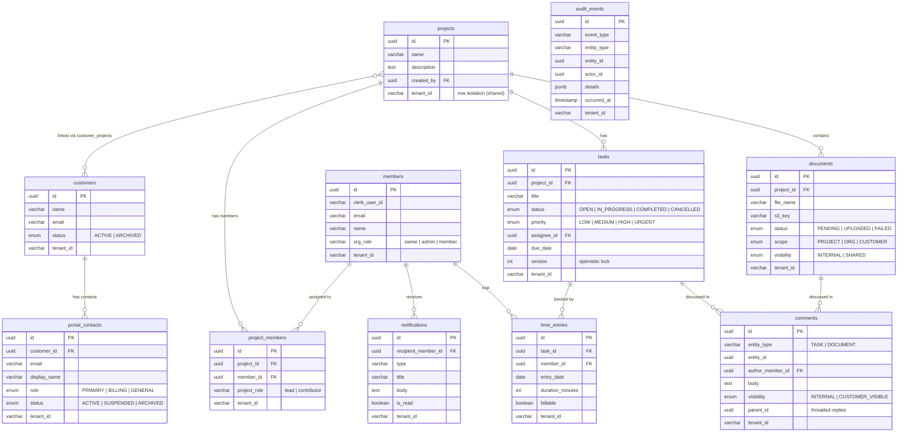

# DocTeams — System Mental Model

> A visual guide to the architecture, actors, domain model, and key workflows of the DocTeams multi-tenant B2B SaaS platform.

---

## 1. System Context — Who Talks to What

```mermaid
flowchart TB
    subgraph Actors
        Owner["🔑 Org Owner"]
        Admin["⚙️ Org Admin"]
        Member["👤 Org Member"]
        Portal["🔗 Portal Contact<br/>(external client)"]
    end

    subgraph "DocTeams Platform"
        FE["Next.js 16 Frontend<br/>(App Router, React 19)"]
        BE["Spring Boot 4 Backend<br/>(Java 25, Hibernate 7)"]
    end

    subgraph "External Services"
        Clerk["Clerk<br/>(Auth, Orgs, RBAC, Webhooks)"]
        S3["AWS S3<br/>(File Storage)"]
        PG[("PostgreSQL 16<br/>(Neon — schema-per-tenant)")]
    end

    Owner --> FE
    Admin --> FE
    Member --> FE
    Portal -->|"magic link"| FE

    FE -->|"Bearer JWT"| BE
    FE -->|"Svix webhooks"| BE
    Clerk -->|"webhooks"| FE
    FE --> Clerk
    BE --> PG
    BE -->|"presigned URLs"| S3
    FE -->|"direct upload"| S3
```



---

## 2. High-Level Architecture


---

## 3. Actor Model & Roles

```mermaid
flowchart LR
    subgraph "Org Roles (from Clerk JWT)"
        Owner["🔑 org:owner<br/>→ ROLE_ORG_OWNER"]
        Admin["⚙️ org:admin<br/>→ ROLE_ORG_ADMIN"]
        Member["👤 org:member<br/>→ ROLE_ORG_MEMBER"]
    end

    subgraph "Project Roles (app-managed)"
        Lead["📋 project_lead<br/>(creator or assigned)"]
        Contrib["🔧 contributor<br/>(added to project)"]
    end

    subgraph "External"
        PortalContact["🔗 Portal Contact<br/>(magic link, no Clerk)"]
        System["🤖 System<br/>(webhooks, cron)"]
    end

    Owner -->|"full access<br/>+ billing + delete + team"| Lead
    Admin -->|"project CRUD<br/>+ customer mgmt"| Lead
    Member -->|"access depends<br/>on project membership"| Contrib
    PortalContact -->|"read-only<br/>+ comment"| Contrib
```



### Permission Matrix

| Action | Owner | Admin | Member (no project role) | Project Lead | Contributor | Portal Contact |
|--------|:-----:|:-----:|:------------------------:|:------------:|:-----------:|:--------------:|
| Create Project | ✅ | ✅ | ✅ | — | — | — |
| Edit Project | ✅ | ✅ | — | ✅ | — | — |
| Delete Project | ✅ | — | — | — | — | — |
| Upload Document | ✅ | ✅ | — | ✅ | ✅ | — |
| Manage Tasks | ✅ | ✅ | — | ✅ | — | — |
| Claim Task | ✅ | ✅ | — | ✅ | ✅ | — |
| Log Time | ✅ | ✅ | — | ✅ | ✅ | — |
| Add Comment | ✅ | ✅ | — | ✅ | ✅ | ✅ (visible only) |
| Manage Team | ✅ | — | — | — | — | — |
| Manage Billing | ✅ | — | — | — | — | — |
| View Portal | — | — | — | — | — | ✅ |

> **Security-by-obscurity**: Unauthorized users receive `404 Not Found` instead of `403 Forbidden` — `ProjectAccessService` returns "not found" for projects the caller can't see.

---

## 4. Domain Model

### 4.1 Global Schema (`public`)


### 4.2 Tenant Schema (per-org)



### 4.3 Portal Read-Model Schema (`portal`)


---

## 5. Multitenancy — How Isolation Works


### Why Both Hibernate @Filter AND Postgres RLS?

| Layer | Protects Against | Mechanism |
|-------|-----------------|-----------|
| **Hibernate @Filter** | JPQL/HQL queries returning wrong tenant's data | `WHERE tenant_id = :tenantId` appended to all queries |
| **Postgres RLS** | Native SQL / raw JDBC bypassing Hibernate | `USING (tenant_id = current_setting('app.current_tenant'))` |
| **Schema isolation (Pro)** | Everything — data physically separated | `SET search_path TO tenant_<hash>` |

---

## 6. Request Lifecycle — Security Filter Chain


### ScopedValue Bindings (Java 25 — JEP 506)


> **Why ScopedValue over ThreadLocal?** Auto-cleanup when lambda exits (no try-finally), immutable within scope (no mid-request mutation), O(1) memory with virtual threads (no copying), and `StructuredTaskScope` inherits bindings automatically.

---

## 7. Key Use Cases

### 7.1 Organization Onboarding


### 7.2 Starter → Pro Upgrade


### 7.3 Document Upload (Presigned URL)


### 7.4 Task & Time Tracking Workflow


### 7.5 Customer Portal Access


### 7.6 Notification & Event Flow


---

## 8. Webhook & Internal API Topology


---

## 9. Infrastructure & Deployment


### Connection Architecture


---

## 10. Frontend Application Map


---

## 11. Backend Package Map

```mermaid
flowchart TB
    subgraph "Cross-Cutting Infrastructure"
        config["config/<br/>Security, Hibernate, S3,<br/>Flyway, Retry"]
        multitenancy["multitenancy/<br/>RequestScopes, ScopedFilterChain,<br/>TenantFilter, ConnectionProvider,<br/>TenantFilterTransactionManager"]
        security["security/<br/>JWT filter, API key filter,<br/>ClerkJwtAuthConverter, Roles"]
        event["event/<br/>10 domain event records"]
        exception["exception/<br/>ResourceNotFound,<br/>Forbidden, PlanLimit"]
    end

    subgraph "Core Domain (tenant-scoped)"
        project["project/<br/>Project, Controller,<br/>Service, ProjectAccess"]
        document["document/<br/>Document, presigned URLs,<br/>scopes + visibility"]
        member["member/<br/>Member, ProjectMember,<br/>MemberSyncService,<br/>ProjectAccessService"]
        customer["customer/<br/>Customer, CustomerProject,<br/>linking + archive"]
        task["task/<br/>Task, claim/release,<br/>status + priority"]
    end

    subgraph "Supporting Domain (tenant-scoped)"
        timeentry["timeentry/<br/>TimeEntry, projections,<br/>project summaries"]
        comment["comment/<br/>Comment, threaded,<br/>visibility control"]
        notification["notification/<br/>Notification, preferences,<br/>templates, channels"]
        audit["audit/<br/>AuditEvent (immutable),<br/>query API, builder"]
        activity["activity/<br/>Feed aggregation<br/>(query-time, not stored)"]
        mywork["mywork/<br/>Cross-project view<br/>(self-scoped queries)"]
    end

    subgraph "Platform Services"
        provisioning["provisioning/<br/>TenantProvisioning,<br/>TenantUpgrade,<br/>Organization, Tier"]
        billing["billing/<br/>Subscription,<br/>PlanSyncService"]
        portal["portal/<br/>PortalContact, MagicLink,<br/>auth, read-model sync"]
        customerbackend["customerbackend/<br/>Portal read-model repos,<br/>event handlers (JDBC)"]
    end
```

---

## 12. Database Schema Map (4 schemas)

```mermaid
flowchart TB
    subgraph "public schema"
        orgs["organizations"]
        mapping["org_schema_mapping"]
        subs["subscriptions"]
        webhooks["processed_webhooks"]
    end

    subgraph "tenant_shared (Starter orgs — RLS)"
        sp["projects"]
        sd["documents"]
        sm["members"]
        spm["project_members"]
        sc["customers"]
        st["tasks"]
        ste["time_entries"]
        scm["comments"]
        sn["notifications"]
        sa["audit_events"]
        spc["portal_contacts"]
        smlt["magic_link_tokens"]
    end

    subgraph "tenant_hash (each Pro org)"
        dp["projects"]
        dd["documents"]
        dm["members"]
        dpm["project_members"]
        dc["customers"]
        dt["tasks"]
        dte["time_entries"]
        dcm["comments"]
        dn["notifications"]
        da["audit_events"]
        dpc["portal_contacts"]
        dmlt["magic_link_tokens"]
    end

    subgraph "portal schema (read-model)"
        pp["portal_projects"]
        pd["portal_documents"]
        pcm["portal_comments"]
        ps["portal_project_summaries"]
    end

    mapping -->|"STARTER"| sp
    mapping -->|"PRO"| dp
    orgs --> mapping
```

---

## 13. Development Phase Timeline

```mermaid
gantt
    title DocTeams Development Phases
    dateFormat X
    axisFormat Phase %s

    section Core Platform
    Scaffolding + Auth + Multitenancy     :done, p1a, 0, 1
    Core API + UI + Infra + CI/CD         :done, p1b, 1, 2

    section Billing
    Tiered Tenancy + Plan Enforcement     :done, p2, 2, 3
    Self-Managed Subscriptions            :done, p2b, 3, 4

    section Design
    Frontend Design Overhaul              :done, p3, 4, 5

    section Customers and Tasks
    Customers + Doc Scopes + Tasks + Portal :done, p4, 5, 6

    section Time Tracking
    Time Entries + My Work                :done, p5, 6, 7

    section Audit
    Audit Infrastructure + Events + Query :done, p6, 7, 8

    section Social
    Comments + Notifications + Activity   :done, p65, 8, 9

    section Portal Backend
    Read-Model + Domain Events            :active, p7, 9, 10
    Portal APIs + Thymeleaf Harness       :p7b, 10, 11

    section Financials
    Rate Cards + Budgets                  :p8a, 11, 12
    Profitability Reports                 :p8b, 12, 13
```

### Stats

| Metric | Count |
|--------|------:|
| Backend packages | 22 |
| Domain entities | 26 |
| REST controllers | 24 |
| API endpoints | ~80 |
| Domain events | 21 |
| DB migrations | 25 |
| Frontend pages | ~15 |
| Frontend components | ~60 |
| Backend tests | ~600 |
| Frontend tests | ~230 |

---

## Glossary

| Term | Definition |
|------|-----------|
| **Tenant** | An organization's isolated data partition — either a dedicated schema or row-filtered view |
| **Schema-per-tenant** | Pro orgs get `tenant_<hash>` — full PostgreSQL schema isolation |
| **Shared schema** | Starter orgs share `tenant_shared` with Hibernate `@Filter` + Postgres RLS |
| **ScopedValue** | Java 25 (JEP 506) replacement for ThreadLocal — immutable, auto-cleanup, virtual-thread safe |
| **Portal Contact** | External client who accesses via magic link — no Clerk account, time-limited JWT |
| **Domain Event** | In-process Spring `ApplicationEvent` for audit, notifications, and portal sync |
| **Read-Model** | Denormalized `portal` schema — maintained by event handlers, queried by portal APIs |
| **Magic Link** | 32-byte random token (SHA-256 hashed, 15min TTL, single-use) for portal authentication |
| **ProjectAccess** | Record from `ProjectAccessService.checkAccess()` — canView, canEdit, canManage, canDelete, projectRole |
| **TenantInfo** | Cached tuple of (schemaName, tier) resolved from org_schema_mapping |
