# Security Architecture — DocTeams

> **Status**: Living document
> **Last updated**: 2026-03-09
> **Auth provider**: Keycloak (self-hosted)
> **Deployment target**: AWS ECS Fargate

---

## Table of Contents

1. [Architecture Overview](#1-architecture-overview)
2. [Authentication Flows](#2-authentication-flows)
3. [Authorization Model](#3-authorization-model)
4. [Tenant Isolation](#4-tenant-isolation)
5. [Gateway (BFF) Layer](#5-gateway-bff-layer)
6. [Backend Security](#6-backend-security)
7. [Customer Portal Security](#7-customer-portal-security)
8. [Keycloak Configuration](#8-keycloak-configuration)
9. [Network & Infrastructure](#9-network--infrastructure)
10. [Secrets Management](#10-secrets-management)
11. [Current Dev-Only Settings (Must Change for Production)](#11-current-dev-only-settings-must-change-for-production)
12. [Essential Improvements](#12-essential-improvements)
13. [Production Readiness Plan](#13-production-readiness-plan)
14. [Threat Model](#14-threat-model)

---

## 1. Architecture Overview

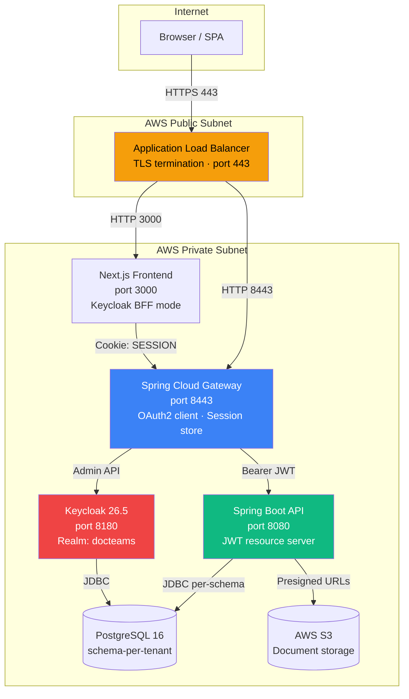

### Component Responsibilities

| Component | Security Role |
|-----------|--------------|
| **ALB** | TLS termination, HTTP→HTTPS redirect, rate limiting (future) |
| **Frontend** | Route protection via middleware, CSRF token forwarding, no secrets in browser |
| **Gateway** | OAuth2 login/logout orchestration, session management (JDBC), token relay, admin proxy, CSRF |
| **Backend** | JWT validation, tenant resolution, RBAC enforcement, audit logging |
| **Keycloak** | Identity provider, org management, brute force protection, password policies |
| **Portal** | Separate auth (magic links), isolated from employee auth |

---

## 2. Authentication Flows

### 2.1 Employee Login (OAuth2 Authorization Code)

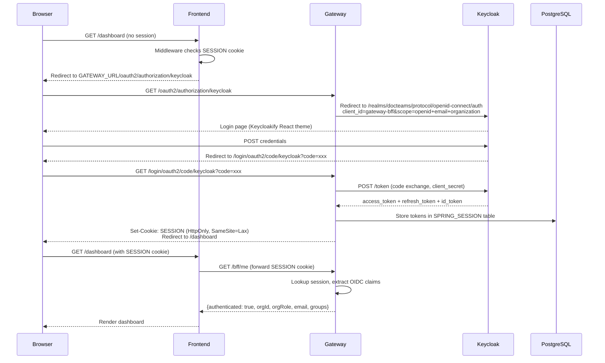

### 2.2 Authenticated API Request (Token Relay)

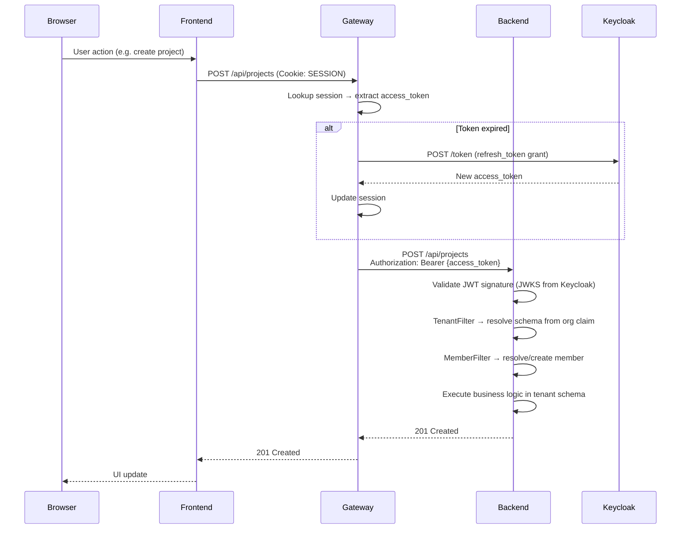

### 2.3 Employee Logout (CSRF-Protected POST)

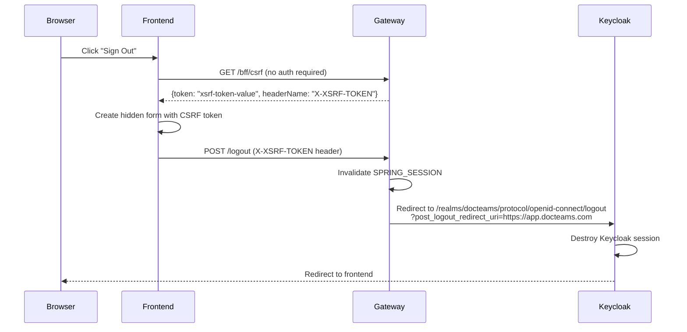

### 2.4 Customer Portal Login (Magic Link)

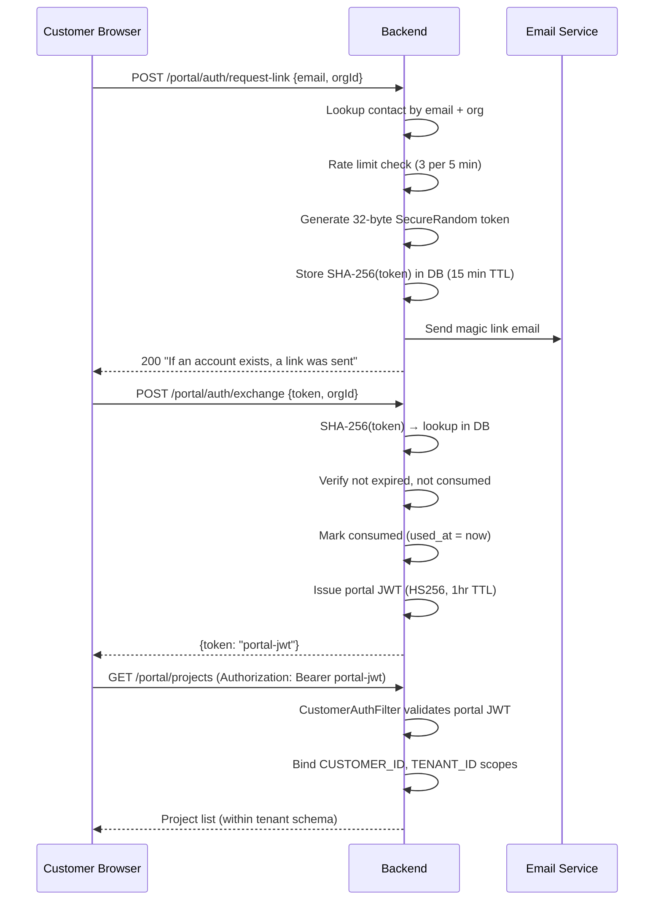

---

## 3. Authorization Model

### 3.1 Role Hierarchy

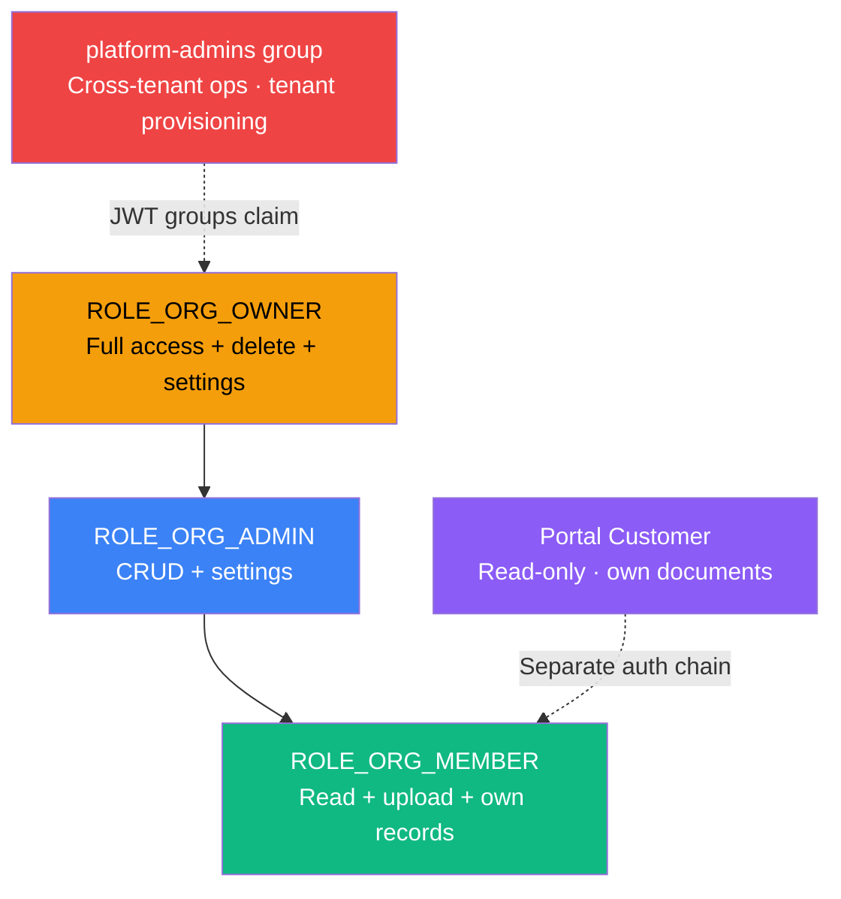

### 3.2 Enforcement Points

| Layer | Mechanism | Example |
|-------|-----------|---------|
| **Frontend middleware** | Route matcher, `/bff/me` role check | Redirect unauthenticated to login |
| **Gateway** | `@PreAuthorize` on `/bff/admin/**` | Only admin/owner can manage team |
| **Backend controllers** | `@PreAuthorize("hasAnyRole('ORG_ADMIN','ORG_OWNER')")` | 86+ annotated endpoints |
| **Backend filters** | `MemberFilter` binds role to `RequestScopes.ORG_ROLE` | Per-request scope |
| **Backend services** | `CustomerLifecycleGuard` blocks ops for PROSPECT status | Business rule enforcement |
| **Database** | Schema boundary — no cross-tenant queries possible | Physical isolation |

### 3.3 Keycloak JWT Claim Structure

```json
{
  "sub": "user-uuid",
  "email": "alice@example.com",
  "name": "Alice Owner",
  "preferred_username": "alice@example.com",
  "organization": {
    "org-slug": {
      "id": "org-uuid",
      "roles": ["owner"]
    }
  },
  "groups": ["platform-admins"],
  "iss": "https://auth.docteams.com/realms/docteams",
  "aud": "account",
  "iat": 1709299700,
  "exp": 1709303300
}
```

Backend extracts via `ClerkJwtUtils`:
- `extractOrgId(jwt)` → first org UUID from `organization` claim
- `extractOrgRole(jwt)` → first role, normalizes `"org:owner"` → `"owner"`
- `extractOrgSlug(jwt)` → org alias key
- `extractGroups(jwt)` → group memberships (e.g. `platform-admins`)

---

## 4. Tenant Isolation

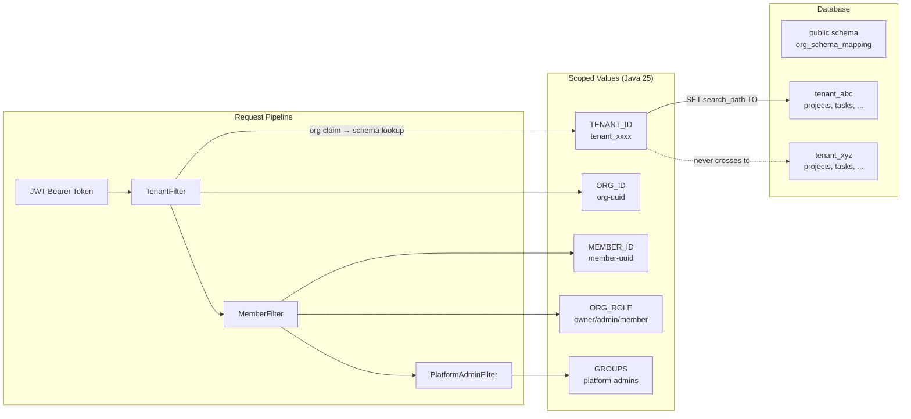

### Isolation Guarantees

| Property | Mechanism |
|----------|-----------|
| **Schema boundary** | Hibernate `TenantIdentifierResolver` sets `search_path` per request |
| **No shared tables** | Phase 13 removed all `tenant_id` columns — pure schema isolation |
| **Cache isolation** | Caffeine cache keyed by `clerkOrgId`, 1hr TTL, max 10K entries |
| **Request scope cleanup** | Java 25 `ScopedValue` — automatic cleanup, no ThreadLocal leaks |
| **Cross-tenant prevention** | Portal JWT `orgId` verified against contact's org |
| **No cross-schema joins** | All queries run within single tenant schema |

---

## 5. Gateway (BFF) Layer

### 5.1 Security Configuration

```
GatewaySecurityConfig.java
├── OAuth2 Login
│   ├── Provider: Keycloak
│   ├── Client: gateway-bff (confidential)
│   ├── Scopes: openid, profile, email, organization
│   └── Success URL: /dashboard
├── Session Management
│   ├── Store: PostgreSQL (spring-session-jdbc)
│   ├── Cookie: SESSION (HttpOnly, SameSite=Lax)
│   ├── Timeout: 8 hours
│   └── Fixation: changeSessionId() on login
├── CSRF Protection
│   ├── Repository: CookieCsrfTokenRepository (JS-readable)
│   ├── Handler: SpaCsrfTokenRequestHandler (XOR BREACH mitigation)
│   └── Ignored: /bff/**, /api/** (stateless, bearer token)
├── CORS
│   ├── Origins: frontendUrl only
│   ├── Credentials: true
│   └── Headers: Content-Type, Authorization, X-XSRF-TOKEN
└── Authorization
    ├── /bff/me, /bff/csrf → permitAll
    ├── /actuator/health → permitAll
    ├── /api/access-requests → permitAll
    ├── /internal/** → denyAll (never exposed via gateway)
    └── /api/** → authenticated
```

### 5.2 Token Relay

Gateway route `/api/**` applies `TokenRelay=` filter:
1. Extracts `OAuth2AuthorizedClient` from session
2. If access token expired → uses refresh token transparently
3. Attaches `Authorization: Bearer <access_token>` to backend request
4. Backend validates JWT signature against Keycloak JWKS

### 5.3 Admin Proxy (`/bff/admin/**`)

- Protected by `@PreAuthorize("@bffSecurity.isAdmin()")` (admin or owner)
- Proxies team management to Keycloak Admin REST API
- Operations: invite member, list members, update role, revoke invitation
- Uses cached admin token (password grant) with 30s safety margin before expiry

---

## 6. Backend Security

### 6.1 Filter Chain Architecture

```mermaid
graph TD
    subgraph "Portal Chain (Order 1)"
        P1["/portal/**"]
        P2[CustomerAuthFilter<br/>Portal JWT validation]
        P3[Bind CUSTOMER_ID, TENANT_ID]
    end

    subgraph "Main API Chain (Order 2)"
        A1["/api/**, /internal/**"]
        A2[ApiKeyAuthFilter<br/>X-API-KEY for /internal/*]
        A3[OAuth2 BearerTokenFilter<br/>JWT signature validation]
        A4[TenantFilter<br/>Org claim → schema resolution]
        A5[MemberFilter<br/>Lazy member create, role binding]
        A6[PlatformAdminFilter<br/>Groups claim extraction]
        A7[TenantLoggingFilter<br/>MDC: tenantId, userId, requestId]
    end

    P1 --> P2 --> P3
    A1 --> A2 --> A3 --> A4 --> A5 --> A6 --> A7
```

### 6.2 Public Endpoints (No Auth)

| Endpoint | Purpose |
|----------|---------|
| `/actuator/health,info` | Health checks (details: when-authorized) |
| `/api/webhooks/email/**` | Inbound email webhooks |
| `/api/webhooks/payment/**` | Payment provider webhooks |
| `/api/email/unsubscribe` | One-click unsubscribe |
| `/api/portal/acceptance/**` | Document acceptance |
| `/api/access-requests/**` | Public tenant registration |

### 6.3 Key Security Properties

| Property | Implementation |
|----------|---------------|
| **JWT validation** | Spring Security OAuth2 Resource Server, JWKS from Keycloak |
| **API key auth** | `MessageDigest.isEqual()` — constant-time comparison (timing-safe) |
| **SQL injection** | All queries parameterized (JPA + native queries with `:param` placeholders) |
| **Encryption at rest** | AES-256-GCM for integration secrets (`EncryptedDatabaseSecretStore`) |
| **File uploads** | 10MB max file, 15MB max request, presigned S3 URLs (org-scoped paths) |
| **Audit logging** | Structured ECS format, `audit_events` table, security event logging |
| **CSRF** | Disabled (stateless API with Bearer tokens — implicit CSRF protection) |
| **Error handling** | RFC 9457 ProblemDetail, no stack traces in production |

### 6.4 Spring Profiles & JWT Source

| Profile | JWT Issuer | JWT JWKS | Notes |
|---------|------------|----------|-------|
| `keycloak` | `http://keycloak:8180/realms/docteams` | Keycloak JWKS endpoint | Dev + staging |
| `e2e` | Mock IDP (`localhost:8090`) | Mock IDP JWKS | E2E testing only |
| `prod` | `https://auth.docteams.com/realms/docteams` | Production Keycloak JWKS | Production |

---

## 7. Customer Portal Security

### 7.1 Comparison: Employee vs Customer Auth

| Feature | Employee (OAuth2) | Customer (Magic Link) |
|---------|-------------------|----------------------|
| **Auth provider** | Keycloak (org login) | Backend-issued magic link |
| **Token type** | Keycloak JWT (RS256, asymmetric) | Portal JWT (HS256, symmetric) |
| **Token storage** | Server-side session (PostgreSQL) | Client-side (Authorization header) |
| **Token TTL** | Configurable (default ~5 min access) | 1 hour |
| **Refresh** | Yes (refresh token via gateway) | No (re-request magic link) |
| **MFA** | Keycloak TOTP/OTP (configurable) | No (magic link is single factor) |
| **Rate limiting** | Keycloak brute force protection | 3 requests / 5 min per contact |
| **RBAC** | owner / admin / member | Read-only (no role system) |
| **Audit trail** | Keycloak events + app audit table | App audit table only |

### 7.2 Portal Security Controls

- **Token generation**: `SecureRandom.getInstanceStrong()` + Base64 (32 bytes)
- **Token storage**: SHA-256 hash in DB (raw token never persisted)
- **Single-use**: `used_at` column set on exchange
- **TTL**: 15 minutes for magic link, 1 hour for session JWT
- **Email enumeration**: Generic response on all outcomes
- **Cross-tenant**: `orgId` in JWT verified against contact's actual org
- **Secret minimum**: Portal JWT secret requires 32+ bytes (enforced at startup)

---

## 8. Keycloak Configuration

### 8.1 Realm: `docteams`

| Setting | Current Value | Production Target |
|---------|---------------|-------------------|
| `sslRequired` | `"none"` | `"external"` or `"all"` |
| `registrationAllowed` | `false` | `false` (admin-approved only) |
| `verifyEmail` | `false` | `true` |
| `bruteForceProtected` | `true` | `true` |
| `passwordPolicy` | Not configured | See §12.3 |
| `organizationsEnabled` | `true` | `true` |
| `loginTheme` | `docteams` (Keycloakify) | `docteams` |
| `emailTheme` | `docteams` | `docteams` |

### 8.2 OAuth2 Clients

**`gateway-bff`** (Confidential Client)
- Grant type: Authorization Code
- Direct access grants: Disabled
- Service accounts: Disabled
- Redirect URIs: `http://localhost:8443/login/oauth2/code/keycloak` → **must update for prod**
- Post-logout redirect: `http://localhost:3000` → **must update for prod**
- Web origins: `http://localhost:3000` → **must update for prod**
- Scopes: `openid, profile, email, organization`
- Protocol mappers: `groups` claim → JWT

**`admin-cli`** (Public Client)
- Grant type: Direct Access (password grant) — for admin token acquisition
- Used by: Gateway `KeycloakAdminClient`, Backend `KeycloakProvisioningClient`

### 8.3 Keycloak Docker Configuration (Dev)

```yaml
keycloak:
  image: quay.io/keycloak/keycloak:26.5.0
  command: start-dev --import-realm --features=scripts
  environment:
    KC_DB: postgres
    KC_HOSTNAME_STRICT: "false"      # Must be true in prod
    KC_HTTP_ENABLED: "true"          # Behind ALB in prod
    KC_HTTP_PORT: 8180
    KC_BOOTSTRAP_ADMIN_USERNAME: admin
    KC_BOOTSTRAP_ADMIN_PASSWORD: admin  # Must rotate for prod
```

### 8.4 Tenant Provisioning via Keycloak

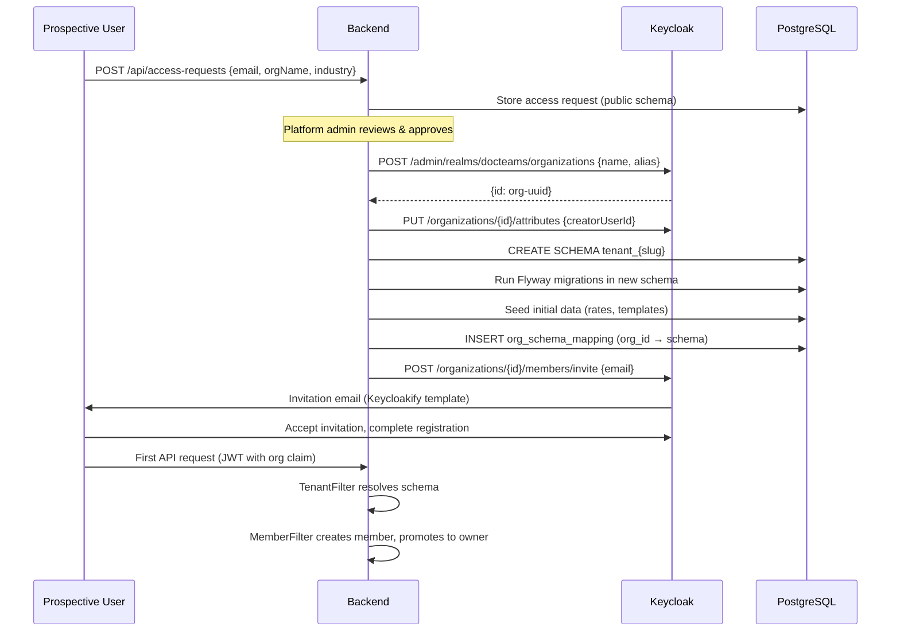

---

## 9. Network & Infrastructure

### 9.1 AWS Network Topology

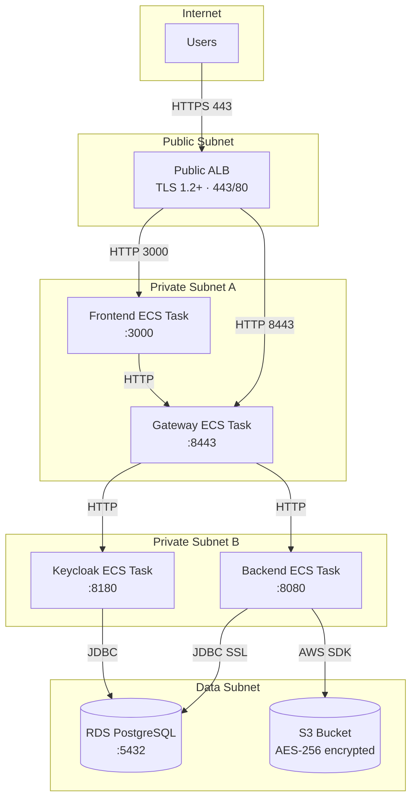

### 9.2 Security Groups

| Security Group | Ingress | Source | Notes |
|----------------|---------|--------|-------|
| **Public ALB** | 443, 80 | `0.0.0.0/0` | TLS termination, HTTP→HTTPS redirect |
| **Frontend** | 3000 | Public ALB SG | Only ALB can reach frontend |
| **Gateway** | 8443 | Public ALB SG + Frontend SG | ALB + frontend can reach gateway |
| **Backend** | 8080 | Gateway SG | Only gateway can reach backend |
| **Keycloak** | 8180 | Gateway SG + Backend SG | Gateway and backend reach Keycloak |
| **Database** | 5432 | Backend SG + Keycloak SG | Only backend and Keycloak reach DB |

### 9.3 TLS Configuration

| Segment | TLS? | Notes |
|---------|------|-------|
| Browser → ALB | **Yes** (TLS 1.2+) | `ELBSecurityPolicy-TLS13-1-2-2021-06` |
| ALB → Frontend | No (HTTP) | Private VPC, same AZ |
| ALB → Gateway | No (HTTP) | Private VPC |
| Gateway → Backend | No (HTTP) | Private VPC |
| Gateway → Keycloak | No (HTTP) | Private VPC |
| Backend → RDS | **Yes** (SSL mode) | `sslmode=require` in production |
| Backend → S3 | **Yes** (HTTPS) | AWS SDK default |

### 9.4 S3 Security

- **Public access**: All blocked (`block_public_acls`, `block_public_policy`, etc.)
- **Encryption**: AES-256 server-side encryption
- **Versioning**: Enabled
- **Access**: Presigned URLs scoped by org: `org/{orgId}/project/{projectId}/{documentId}`
- **CORS**: Restricted to frontend domain origin
- **Lifecycle**: Abort incomplete multipart uploads after N days

---

## 10. Secrets Management

### 10.1 AWS Secrets Manager (Production)

| Secret | Env Var | Used By |
|--------|---------|---------|
| `docteams/prod/database-url` | `DATABASE_URL` | Backend, Gateway |
| `docteams/prod/database-migration-url` | `DATABASE_MIGRATION_URL` | Backend |
| `docteams/prod/internal-api-key` | `INTERNAL_API_KEY` | Frontend → Backend |
| `docteams/prod/keycloak-admin-password` | `KEYCLOAK_ADMIN_PASSWORD` | Gateway, Backend |
| `docteams/prod/keycloak-client-secret` | `KEYCLOAK_CLIENT_SECRET` | Gateway |
| `docteams/prod/portal-jwt-secret` | `PORTAL_JWT_SECRET` | Backend |
| `docteams/prod/portal-magic-link-secret` | `PORTAL_MAGIC_LINK_SECRET` | Backend |
| `docteams/prod/integration-encryption-key` | `INTEGRATION_ENCRYPTION_KEY` | Backend |

**Injection**: ECS Fargate retrieves secrets at task launch via `valueFrom` ARN references. Never in task definition or logs.

### 10.2 Dev Secrets (Hardcoded — MUST NOT reach production)

| Secret | Dev Value | Location |
|--------|-----------|----------|
| Postgres password | `postgres` | `.env.keycloak` |
| Keycloak admin | `admin` / `admin` | `.env.keycloak`, `keycloak-seed.sh` |
| Keycloak client secret | `docteams-web-secret` | `.env.keycloak` |
| Internal API key | `local-dev-api-key-change-in-production` | `.env.keycloak` |
| Portal JWT secret | `local-dev-portal-secret-...` | `.env.keycloak` |
| LocalStack credentials | `test` / `test` | `.env.keycloak` |
| Seed user passwords | `password` | `keycloak-seed.sh` |

---

## 11. Current Dev-Only Settings (Must Change for Production)

These settings were explicitly set for local development and **MUST be changed** before any non-local deployment.

### 11.1 Keycloak

| Setting | Dev Value | Why It's Wrong for Prod | Fix |
|---------|-----------|------------------------|-----|
| `command` | `start-dev` | HTTP only, caching disabled, hot reload | `start --optimized` |
| `KC_HOSTNAME_STRICT` | `false` | Accepts any hostname, allows token substitution | `true` + `KC_HOSTNAME` |
| `KC_HTTP_ENABLED` | `true` | Plain HTTP | `false` (use proxy TLS) or keep true behind ALB with `KC_PROXY_HEADERS=xforwarded` |
| `sslRequired` (realm) | `NONE` | No TLS requirement for admin console | `external` or `all` |
| `sslRequired` (master) | `NONE` (set by `dev-up.sh`) | Admin console over HTTP | `external` |
| Admin password | `admin` | Default credential | Rotate to strong password via Secrets Manager |
| Client redirect URIs | `http://localhost:*` | Allows any localhost redirect | Production domain only |
| `verifyEmail` | `false` | Unverified emails can log in | `true` |
| Token lifetimes | Keycloak defaults | May be too long | Configure explicitly (§12.3) |
| Password policy | None | Weak passwords accepted | Configure (§12.3) |

### 11.2 Gateway

| Setting | Dev Value | Fix |
|---------|-----------|-----|
| Session cookie `secure` | `false` | `true` (requires HTTPS) |
| `frontend-url` | `http://localhost:3000` | `https://app.docteams.com` |
| Keycloak issuer URI | `http://keycloak:8180/...` | `https://auth.docteams.com/...` |
| Session schema init | `always` | Flyway migration |
| CORS origins | `http://localhost:3000` | Production domain |

### 11.3 Backend

| Setting | Dev Value | Fix |
|---------|-----------|-----|
| JWT issuer URI | `http://keycloak:8180/realms/docteams` | Production Keycloak URL |
| S3 endpoint override | `http://localstack:4566` | Remove (use real AWS S3) |
| S3 presigner endpoint | `http://localhost:4566` | Remove |
| Logging level | `DEBUG` for app packages | `INFO` or `WARN` |
| Portal dev harness | Accessible at `/portal/dev/**` | Disable via profile |

### 11.4 Can We Deploy Keycloak First and Test Against It?

**Yes, with caveats.** The HTTP/HTTPS mixture is the main concern:

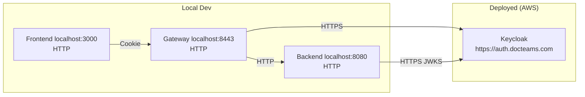

**What works:**
- Gateway can do OAuth2 code exchange with a remote HTTPS Keycloak ✓
- Backend can fetch JWKS over HTTPS from remote Keycloak ✓
- Token validation works (JWKS is just a GET request) ✓

**What needs adjustment:**
- **Redirect URIs**: Keycloak client must include `http://localhost:8443/login/oauth2/code/keycloak` in allowed redirects
- **Post-logout redirects**: Must include `http://localhost:3000`
- **Web origins**: Must include `http://localhost:3000` for CORS
- **Cookie secure flag**: Must stay `false` for local HTTP
- **Keycloak hostname**: `KC_HOSTNAME_STRICT=true` with `KC_HOSTNAME=auth.docteams.com` will reject token requests from `localhost` origin — need `KC_HOSTNAME_STRICT_BACKCHANNEL=false` to allow backend-to-Keycloak backchannel over different hostname

**Recommended approach:**
1. Deploy Keycloak to AWS with production settings
2. Create a `dev-remote` Spring profile that points JWT/OIDC URIs to the deployed Keycloak
3. Add `http://localhost:*` to client redirect URIs temporarily (remove before go-live)
4. Test full login/logout/provisioning flow locally against remote Keycloak
5. Remove localhost URIs from Keycloak client before production traffic

---

## 12. Essential Improvements

### Priority 1 — Critical (Before Any Deployment)

#### 12.1 Keycloak Production Mode

```
# Production start command
KC_DB=postgres
KC_DB_URL=jdbc:postgresql://rds-endpoint:5432/keycloak
KC_DB_USERNAME=<from secrets>
KC_DB_PASSWORD=<from secrets>
KC_HOSTNAME=auth.docteams.com
KC_HOSTNAME_STRICT=true
KC_HOSTNAME_STRICT_BACKCHANNEL=false
KC_PROXY_HEADERS=xforwarded
KC_HTTP_ENABLED=true              # ALB terminates TLS
KC_HTTP_PORT=8180
KC_HEALTH_ENABLED=true
KC_METRICS_ENABLED=true
```

Run: `start --optimized` (requires prior `build` step in Dockerfile)

#### 12.2 Rotate All Secrets

Every secret listed in §10.2 must be replaced with cryptographically random values:
- Keycloak admin password: 20+ chars
- Client secret: 32+ chars
- Portal JWT secret: 32+ bytes (Base64)
- Integration encryption key: 32 bytes (Base64, AES-256)
- Internal API key: 32+ chars
- Database password: 20+ chars

#### 12.3 Keycloak Realm Hardening

```json
{
  "sslRequired": "external",
  "verifyEmail": true,
  "passwordPolicy": "length(12) and maxLength(128) and notUsername and notEmail and specialChars(1) and upperCase(1) and lowerCase(1) and digits(1) and passwordHistory(3)",
  "bruteForceProtected": true,
  "permanentLockout": false,
  "maxFailureWaitSeconds": 900,
  "minimumQuickLoginWaitSeconds": 60,
  "waitIncrementSeconds": 60,
  "quickLoginCheckMilliSeconds": 1000,
  "maxDeltaTimeSeconds": 43200,
  "failureFactor": 10,
  "accessTokenLifespan": 300,
  "accessTokenLifespanForImplicitFlow": 300,
  "ssoSessionIdleTimeout": 1800,
  "ssoSessionMaxLifespan": 36000,
  "offlineSessionIdleTimeout": 2592000,
  "accessCodeLifespan": 60,
  "accessCodeLifespanLogin": 1800
}
```

#### 12.4 Client Redirect URI Lockdown

Replace all `localhost` redirect URIs with production domains:
```
Redirect URIs:        https://app.docteams.com/login/oauth2/code/keycloak
Post-logout URIs:     https://app.docteams.com
Web Origins:          https://app.docteams.com
```

#### 12.5 Gateway Session Cookie Hardening

```yaml
server:
  servlet:
    session:
      cookie:
        secure: true          # HTTPS only
        same-site: lax        # CSRF protection
        http-only: true       # Not accessible to JS
        max-age: 28800        # 8 hours
```

### Priority 2 — High (Before Go-Live)

#### 12.6 Content Security Policy Headers

Add to Next.js middleware or `next.config.ts`:
```
Content-Security-Policy:
  default-src 'self';
  script-src 'self' 'unsafe-inline' 'unsafe-eval';
  style-src 'self' 'unsafe-inline';
  img-src 'self' data: https:;
  font-src 'self';
  connect-src 'self' https://auth.docteams.com;
  frame-ancestors 'none';
  base-uri 'self';
  form-action 'self' https://auth.docteams.com;
```

Plus: `X-Frame-Options: DENY`, `X-Content-Type-Options: nosniff`, `Referrer-Policy: strict-origin-when-cross-origin`

#### 12.7 Rate Limiting at ALB/CloudFront

- CloudFront or WAF rate limit: 1000 req/min per IP
- Keycloak login: Already protected by brute force settings
- API endpoints: Consider per-tenant rate limiting in backend

#### 12.8 Pin Docker Base Images

Replace tag-only references with digest-pinned versions:
```dockerfile
# Before (vulnerable to supply chain)
FROM eclipse-temurin:25-jre-alpine

# After (pinned)
FROM eclipse-temurin:25-jre-alpine@sha256:<digest>
```

#### 12.9 Replace Admin Password Grant

Gateway and Backend use Keycloak admin credentials via password grant. Replace with:
- **Service account** with `client_credentials` grant
- Scoped to only required admin operations (org management)
- No human credentials stored in application config

#### 12.10 Spring Session Schema via Flyway

Replace `spring.session.jdbc.initialize-schema: always` with a Flyway migration:
```sql
-- V100__create_spring_session.sql (in public schema)
CREATE TABLE IF NOT EXISTS SPRING_SESSION (...);
CREATE TABLE IF NOT EXISTS SPRING_SESSION_ATTRIBUTES (...);
```

### Priority 3 — Medium (Post-Launch Hardening)

#### 12.11 Portal JWT Migration to RS256

Currently uses symmetric HMAC-SHA256. Migrate to asymmetric RS256:
- Enables key rotation without downtime
- Keycloak can issue portal tokens via a dedicated client
- Or: Backend rotates RSA key pair, publishes JWKS endpoint

#### 12.12 Webhook Signature Verification

Verify HMAC signatures on inbound webhooks:
- `/api/webhooks/email/**` — verify SendGrid/Mailpit signature
- `/api/webhooks/payment/**` — verify PSP signature

#### 12.13 Dependency Scanning

- Backend: OWASP Dependency-Check Maven plugin
- Frontend: `pnpm audit` in CI
- Container: Trivy or Snyk scanning in ECR

#### 12.14 Keycloak Audit Logging

Enable event listeners in realm:
```json
{
  "eventsEnabled": true,
  "eventsListeners": ["jboss-logging"],
  "enabledEventTypes": [
    "LOGIN", "LOGIN_ERROR", "LOGOUT", "REGISTER",
    "CODE_TO_TOKEN", "CODE_TO_TOKEN_ERROR",
    "CLIENT_LOGIN", "CLIENT_LOGIN_ERROR"
  ],
  "adminEventsEnabled": true,
  "adminEventsDetailsEnabled": true
}
```

---

## 13. Production Readiness Plan

### Phase A — Infrastructure (Week 1)

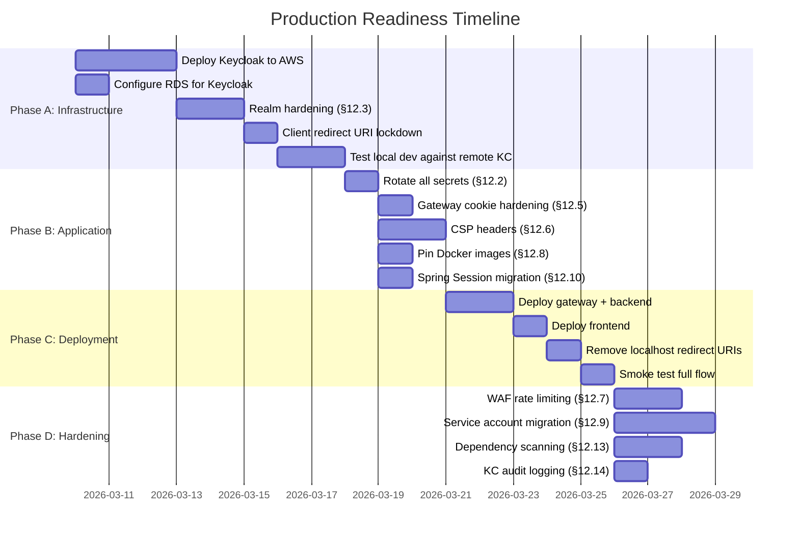

### Phase A: Infrastructure (Days 1–7)

**A1. Deploy Keycloak to AWS**

1. Create ECR repository for Keycloak image
2. Build production Keycloak image:
   ```dockerfile
   FROM quay.io/keycloak/keycloak:26.5.0@sha256:<pin> AS builder
   COPY realm-export.json /opt/keycloak/data/import/
   COPY providers/ /opt/keycloak/providers/
   COPY themes/ /opt/keycloak/themes/
   RUN /opt/keycloak/bin/kc.sh build

   FROM quay.io/keycloak/keycloak:26.5.0@sha256:<pin>
   COPY --from=builder /opt/keycloak/ /opt/keycloak/
   ENTRYPOINT ["/opt/keycloak/bin/kc.sh"]
   CMD ["start", "--optimized", "--import-realm"]
   ```
3. Create ECS task definition with production env vars (§12.1)
4. Create ALB target group for Keycloak (health: `/health/ready`)
5. Create Route 53 record: `auth.docteams.com` → ALB
6. Create ACM certificate for `auth.docteams.com`

**A2. Configure RDS**

- Separate database `keycloak` on same RDS instance (or dedicated)
- SSL mode: `verify-full`
- Credentials via Secrets Manager

**A3. Realm Hardening**

Apply all settings from §12.3 via Keycloak Admin Console or updated `realm-export.json`.

**A4. Client Redirect URIs**

- Add production URIs alongside localhost URIs (temporarily keep both)
- Test OAuth2 flow works with production Keycloak

**A5. Test Local Dev Against Remote Keycloak**

Create `application-dev-remote.yml`:
```yaml
spring:
  security:
    oauth2:
      client:
        provider:
          keycloak:
            issuer-uri: https://auth.docteams.com/realms/docteams
      resourceserver:
        jwt:
          issuer-uri: https://auth.docteams.com/realms/docteams
          jwk-set-uri: https://auth.docteams.com/realms/docteams/protocol/openid-connect/certs
```

### Phase B: Application Changes (Days 5–9)

**B1. Rotate Secrets** — Generate and store in AWS Secrets Manager
**B2. Cookie Hardening** — `secure: true`, verify SameSite behavior
**B3. CSP Headers** — Add to Next.js, test with Report-Only first
**B4. Pin Images** — Get current digests, update all Dockerfiles
**B5. Session Migration** — Write Flyway migration, remove `initialize-schema: always`

### Phase C: Deployment (Days 8–12)

**C1. Deploy Services** — Gateway + backend to ECS, pointing to remote Keycloak
**C2. Deploy Frontend** — Build with `NEXT_PUBLIC_AUTH_MODE=keycloak`, production gateway URL
**C3. Lock Down** — Remove all `localhost` redirect URIs from Keycloak client
**C4. Smoke Test** — Full login → dashboard → API call → logout → portal magic link

### Phase D: Post-Launch Hardening (Days 10–15)

**D1. WAF** — AWS WAF on ALB with rate limiting rules
**D2. Service Account** — Replace admin password grant with client_credentials
**D3. Scanning** — OWASP Dependency-Check, Trivy in CI/CD pipeline
**D4. Audit** — Enable Keycloak event listeners, verify logs in CloudWatch

---

## 14. Threat Model

```mermaid
graph TD
    subgraph "External Threats"
        BF[Brute Force Login]
        CSRF_A[CSRF Attack]
        XSS[Cross-Site Scripting]
        SQLi[SQL Injection]
        SSRF[Server-Side Request Forgery]
        SC[Supply Chain Attack]
    end

    subgraph "Internal Threats"
        XT[Cross-Tenant Access]
        PE[Privilege Escalation]
        SH[Session Hijacking]
        ML[Magic Link Theft]
    end

    subgraph "Mitigations"
        KC_BF[Keycloak brute force<br/>10 failures → 15 min lock]
        CSRF_M[CSRF tokens<br/>XOR BREACH mitigation]
        CSP[CSP headers<br/>frame-ancestors none]
        PARAM[Parameterized queries<br/>JPA + native]
        VPC[Private VPC<br/>no public endpoints]
        PIN[Image digest pinning<br/>dependency scanning]
        SCHEMA[Schema-per-tenant<br/>ScopedValue binding]
        RBAC[Role checks<br/>86+ @PreAuthorize]
        COOKIE[HttpOnly + Secure + SameSite]
        RATE[3/5min rate limit<br/>SHA-256 + single-use]
    end

    BF --> KC_BF
    CSRF_A --> CSRF_M
    XSS --> CSP
    SQLi --> PARAM
    SSRF --> VPC
    SC --> PIN
    XT --> SCHEMA
    PE --> RBAC
    SH --> COOKIE
    ML --> RATE
```

### Risk Register

| Risk | Likelihood | Impact | Mitigation | Status |
|------|-----------|--------|------------|--------|
| Brute force on Keycloak login | Medium | High | Keycloak brute force protection | ✅ In place |
| Cross-tenant data leakage | Low | Critical | Schema-per-tenant, ScopedValue | ✅ In place |
| Session hijacking | Low | High | HttpOnly, Secure, SameSite cookies | ⚠️ `secure: false` in dev |
| CSRF on gateway endpoints | Low | Medium | Cookie CSRF + XOR BREACH mitigation | ✅ In place |
| Magic link brute force | Low | Medium | Rate limiting + SHA-256 + single-use | ✅ In place |
| SQL injection | Very Low | Critical | All queries parameterized | ✅ In place |
| Supply chain (dependencies) | Low | High | No scanning configured | ❌ Needs work (§12.13) |
| XSS via HTML injection | Low | Medium | No CSP headers yet | ❌ Needs work (§12.6) |
| Credential exposure | Low | Critical | Secrets Manager in prod | ⚠️ Dev has hardcoded |
| Default admin credentials | Medium | Critical | Must rotate before prod | ❌ Needs work (§12.2) |
| Unpatched base images | Low | High | No digest pinning | ❌ Needs work (§12.8) |

---

## Appendix: Key Source Files

| File | Purpose |
|------|---------|
| `gateway/src/main/java/.../GatewaySecurityConfig.java` | Gateway CORS, CSRF, OAuth2, session |
| `gateway/src/main/java/.../BffController.java` | `/bff/me`, `/bff/csrf` endpoints |
| `gateway/src/main/java/.../AdminProxyController.java` | Team management proxy |
| `gateway/src/main/java/.../KeycloakAdminClient.java` | Keycloak admin API client |
| `backend/src/main/java/.../security/SecurityConfig.java` | Two filter chains (portal + main) |
| `backend/src/main/java/.../security/ClerkJwtUtils.java` | JWT claim extraction (Keycloak format) |
| `backend/src/main/java/.../security/ApiKeyAuthFilter.java` | Internal API key auth |
| `backend/src/main/java/.../multitenancy/TenantFilter.java` | Org → schema resolution |
| `backend/src/main/java/.../multitenancy/MemberFilter.java` | Member creation/role binding |
| `backend/src/main/java/.../multitenancy/RequestScopes.java` | ScopedValue definitions |
| `backend/src/main/java/.../portal/CustomerAuthFilter.java` | Portal JWT validation |
| `backend/src/main/java/.../portal/PortalJwtService.java` | Portal JWT issue/verify |
| `backend/src/main/java/.../portal/MagicLinkService.java` | Magic link generation |
| `backend/src/main/java/.../accessrequest/KeycloakProvisioningClient.java` | Tenant provisioning |
| `frontend/lib/auth/providers/keycloak-bff.ts` | Frontend Keycloak BFF provider |
| `frontend/lib/auth/middleware.ts` | Route protection |
| `frontend/lib/api.ts` | Server-side API client with CSRF |
| `compose/keycloak/realm-export.json` | Keycloak realm configuration |
| `compose/scripts/keycloak-seed.sh` | Dev user/org provisioning |
| `infra/modules/security-groups/main.tf` | AWS security group rules |
| `infra/modules/alb/main.tf` | TLS termination, health checks |
| `infra/modules/secrets/main.tf` | AWS Secrets Manager |
| `infra/modules/s3/main.tf` | S3 bucket security |
