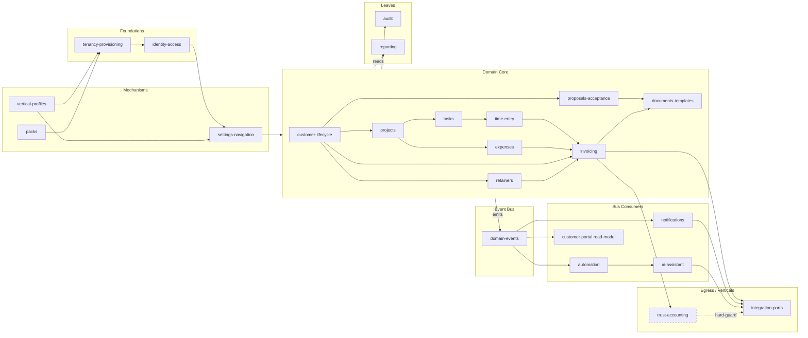

# Kazi — Bounded Contexts Module Map

**Purpose:** Single load-bearing index of every bounded context in Kazi — what it owns, who it depends on, and how the multi-vertical mechanism threads through it. When a human or agent asks "what modules does Kazi have, who owns this entity, who emits this event?" — they read this file first.

**How to read:** Section 1 is the at-a-glance directory. Section 2 has a one-screen entry per context with anchored `→ path:line` references back to source. Section 3 shows the dependency shape. Section 4 is the multi-vertical seam (mandatory reading for anyone touching modules, terminology, or vertical profiles). Section 5 is the glossary cross-link.

**Last-updated:** 2026-05-10. **Synthesised from:** `_discovery/A1-backend-map.md`, `_discovery/A2-frontend-map.md`, `_discovery/A3-portal-gateway-map.md`, `_discovery/A6-cross-cutting.md`. Deeper per-module detail lives in `30-modules/<slug>.md`. Cross-cutting concerns live in `20-cross-cutting/`. Vertical specifics live in `60-verticals/`.

---

## 1. Module Map at a Glance

```
FOUNDATIONS
├── tenancy-provisioning            schema-per-tenant, Flyway, tenant scoping
├── identity-access                 JWT, members, capabilities, custom roles
└── platform-administration         access-request OTP, platform billing, demo provisioning

DOMAIN CORE
├── customer-lifecycle              customer aggregate, lifecycle, dormancy, retention
├── projects                        project aggregate, project membership, status machine
├── tasks                           task aggregate, recurrence, claim/release
├── time-entry                      time logging, billable snapshots, weekly grid
├── expenses                        expense aggregate, billable + markup, disbursements
├── documents-templates             docs (S3), Tiptap+DOCX templates, GeneratedDocument
└── custom-fields-tags-views        FieldDefinition, FieldGroup, Tag, SavedView

MONEY
├── invoicing                       Invoice, lines, payments, tax, batch (BillingRun)
├── retainers                       agreements, periods, consumption, rollover
└── trust-accounting   [vertical]   GENERAL/INVESTMENT/SECTION_86, dual-approval, LPFF

OPERATIONS
├── audit                           append-only event log + DSAR data-protection ops
├── domain-events                   sealed DomainEvent bus (35+ records)
├── automation                      rules, triggers, conditions, actions, AI specialists
├── notifications                   in-app + email channel, prefs, time reminders
├── reporting                       parameterised queries, CSV/PDF export
├── capacity-planning               weekly capacity, project allocations, utilization
├── proposals-acceptance            sales pipeline, e-sign, expiry processors
├── information-requests            structured client data collection, reminders
├── checklists                      compliance checklists, auto-instantiate per type
└── project-templates               recurring project schedules, blueprint templates

SURFACES
├── customer-portal                 portal app + portal read-model + magic-link auth
├── ai-assistant                    BYOAK LLM, tool framework, SSE chat
└── settings-navigation             OrgSettings aggregate, terminology key, nav tree

MECHANISMS
├── integration-ports               accounting/AI/email/payment/KYC/signing adapters
├── packs                           PackInstaller SPI, catalog, install/uninstall
└── vertical-profiles               JSON profile registry + reconciliation seeder

VERTICAL OVERLAYS  (thin pointers; detail in 60-verticals/)
├── legal-za                        court calendar, conflict, tariffs, trust, prescription
├── accounting-za                   regulatory deadlines, accounting terminology
└── consulting-za / consulting-generic   utilization, rate cards, generic terminology
```

**Count:** 22 contexts (vs A1's 20). **Deviations from A1:**
- **Split** A1's "Notifications & Activity" → `audit`, `domain-events`, `notifications`. Audit is its own concern (immutable storage + DSAR + retention clocks per A6 §3, §8). Events are the bus; notifications are one of many subscribers. Bundling them obscured the event-bus-as-backbone discovery.
- **Split** A1's "Tasks & Time" → `tasks`, `time-entry`, `expenses`. Three different aggregates with three different lifecycles; bundling hid that `time-entry` is the seam between tasks and invoicing.
- **Split** A1's "Customer Lifecycle" → `customer-lifecycle` and the cross-cutting `checklists` context (the latter is also used by projects per `Checklist*` controller scope).
- **Split** A1's "Integrations & Pack System" → `integration-ports` and `packs` (different SPIs, different lifecycles — pack installs are content; integration adapters are runtime calls).
- **Merged** A1's "Customer Lifecycle" + "Compliance" data-protection bits into one context (DSAR/PAIA/anonymization is operationally a customer-lifecycle concern; the package was relocated to `datarequest/` per A6 §3).

---

## 2. Per-Context Entries

### tenancy-provisioning

- **Purpose:** Schema-per-tenant isolation, JIT tenant provisioning, ScopedValue carriers used by every request.
- **Owns:** `Organization` (public) `→ provisioning/Organization.java` ; `OrgSchemaMapping` `→ multitenancy/OrgSchemaMapping.java:14` ; REST `POST /internal/orgs/provision`. No frontend route — the platform-admin demo controller wraps it.
- **Depends on:** `vertical-profiles` (sets profile at provision), `packs` (installs pack pipeline), `identity-access` (creates default OrgRoles).
- **Depended on by:** Everything. Every backend filter chain reads `RequestScopes.TENANT_ID`. Every `@Scheduled` job iterates via `TenantScopedRunner.forEachTenant`.
- **Cross-cutting touchpoints:** Multi-tenancy origin (`TenantFilter.java:50`); audit on tenant creation; emits no domain events (provisioning is imperative).
- **Vertical relevance:** Verticalisation mechanism — `provisionTenant(orgId, name, "legal-za", "ZA")` is the entry point that wires profile + packs + reconciler.
- **Active ADRs:** ADR-064 (dedicated-schema-only).
- **Module page:** `30-modules/tenancy-provisioning.md`.

### identity-access

- **Purpose:** Validate JWT, sync members JIT, enforce capability-based RBAC.
- **Owns:** `Member` `→ member/Member.java:22` ; `ProjectMember` `→ member/ProjectMember.java:14` ; `OrgRole` `→ orgrole/OrgRole.java:23` ; `PendingInvitation` `→ invitation/PendingInvitation.java:22` ; REST `/api/members`, `/api/org-roles`, `/internal/members`. Frontend `/team`, `/settings/roles`.
- **Depends on:** `tenancy-provisioning` (TenantFilter must run first per A6 §2).
- **Depended on by:** Everything (capabilities gate every controller method). `projects` reads `ProjectMember` for access control. `audit` records `actorId` from MEMBER_ID.
- **Cross-cutting touchpoints:** Filter chain (`SecurityConfig.java:140`) ; `@RequiresCapability` `→ orgrole/Capability.java:7` (19 values) ; emits no events; emits audit on role/member changes.
- **Vertical relevance:** Core. Capabilities like `MANAGE_TRUST` / `APPROVE_TRUST_PAYMENT` exist universally but are only granted in legal-vertical roles.
- **Active ADRs:** ADR-T002 (ScopedValue migration), ADR-076 (capability identity).
- **Module page:** `30-modules/identity-access.md`.

### platform-administration

- **Purpose:** Admin-gated org sign-up, platform-tier subscription billing, demo provisioning.
- **Owns:** `AccessRequest` `→ accessrequest/AccessRequest.java:18` ; `Subscription` `→ billing/Subscription.java:19` ; `SubscriptionPayment` `→ billing/SubscriptionPayment.java:19` ; REST `/api/platform-admin/*`, `/api/billing/*`. Frontend `/settings/billing`, platform-admin pages.
- **Depends on:** `tenancy-provisioning` (provisions on approval), `integration-ports` (PayFast adapter), `notifications` (OTP email).
- **Depended on by:** `SubscriptionGuardFilter` (filter chain) reads subscription status to gate non-owner access during PAST_DUE/SUSPENDED.
- **Cross-cutting touchpoints:** Public-schema entities; `SubscriptionEnforcementScheduler` daily; emits audit on transitions.
- **Vertical relevance:** Core. No vertical variation (platform-tier billing is uniform).
- **Active ADRs:** None recent.
- **Module page:** `30-modules/platform-administration.md`.

### customer-lifecycle

- **Purpose:** Customer aggregate + status machine + dormancy/retention + DSAR/PAIA data-protection ops.
- **Owns:** `Customer` `→ customer/Customer.java:23` ; `CustomerProject` `→ customer/CustomerProject.java:14` ; `DataSubjectRequest` `→ datarequest/` ; REST `/api/customers/*`. Frontend `/customers`, `/compliance`.
- **Depends on:** `custom-fields-tags-views` (custom field auto-apply), `checklists` (auto-instantiate on type), `prerequisite` (transition gates), `documents-templates` (FICA/KYC docs), `integration-ports` (KYC adapter).
- **Depended on by:** `projects`, `invoicing`, `proposals-acceptance`, `customer-portal` (PortalContact links here), `information-requests`, `retainers`, `trust-accounting`.
- **Cross-cutting touchpoints:** Emits `CustomerStatusChangedEvent` ; `DormancyScheduledJob` daily ; ADR-062 anonymization-over-deletion (`LifecycleStatus = PROSPECT|ONBOARDING|ACTIVE|DORMANT|OFFBOARDING|OFFBOARDED|ANONYMIZED`); audit on every transition.
- **Vertical relevance:** Core, terminology-overlaid (legal: Customer→Client; accounting: Customer; consulting: Client). PAIA jurisdiction is ZA-only; non-ZA tenants get generic defaults `→ datarequest/JurisdictionDefaults.java`.
- **Active ADRs:** ADR-062 (anonymization-over-deletion), ADR-249 (retention-clock anchor).
- **Module page:** `30-modules/customer-lifecycle.md`.

### projects

- **Purpose:** Project aggregate, status machine (`ACTIVE→COMPLETED→CLOSED→ARCHIVED`), retention clock, project member access.
- **Owns:** `Project` `→ project/Project.java:24` ; ProjectMember (shared with identity-access) ; REST `/api/projects/*` (~18 endpoints). Frontend `/projects`, `/projects/[id]`.
- **Depends on:** `customer-lifecycle` (FK), `identity-access` (ProjectMember access), `custom-fields-tags-views`.
- **Depended on by:** `tasks`, `time-entry`, `expenses`, `documents-templates`, `comments`, `invoicing` (line→project), `capacity-planning`.
- **Cross-cutting touchpoints:** Emits `ProjectCompletedEvent`, `ProjectArchivedEvent`, `ProjectReopenedEvent` ; `retentionClockStartedAt` per ADR-249 (`Project.java:259`, `:303`, `:311`); audit on every transition.
- **Vertical relevance:** Core, terminology-overlaid (legal: Project→Matter; accounting: Project→Engagement).
- **Active ADRs:** ADR-249 (retention clock).
- **Module page:** `30-modules/projects.md`.

### tasks

- **Purpose:** Task aggregate, recurrence rules, claim/release/complete/cancel/reopen state machine.
- **Owns:** `Task` `→ task/Task.java:26` ; REST `/api/projects/{projectId}/tasks/*` + `/api/tasks/*` (~16 endpoints). Frontend `/projects/[id]` (tasks tab), `/my-work`, `/calendar`.
- **Depends on:** `projects`, `identity-access` (assignee).
- **Depended on by:** `time-entry` (FK to task), `automation` (TaskAssigned/Completed triggers), `notifications`, `expenses`.
- **Cross-cutting touchpoints:** Emits `TaskStatusChangedEvent`, `TaskCompletedEvent`, `TaskAssignedEvent`, `TaskClaimedEvent`, `TaskRecurrenceCreatedEvent`, etc. (~7 events). Heavy automation-trigger surface.
- **Vertical relevance:** Core, terminology-overlaid (legal: Task→Action Item).
- **Active ADRs:** None specific.
- **Module page:** `30-modules/tasks.md`.

### time-entry

- **Purpose:** Time logging with billable + rate snapshots; the seam between tasks (effort) and invoicing (revenue).
- **Owns:** `TimeEntry` `→ timeentry/TimeEntry.java:17` ; REST `/api/time-entries`, `/api/projects/{projectId}/time` (~10 endpoints). Frontend embedded in `/projects/[id]` and `/my-work`.
- **Depends on:** `tasks`, `identity-access` (member), `invoicing` (rate snapshots come from rate cards in settings; FK to invoiceId).
- **Depended on by:** `invoicing` (unbilled-time → invoice lines), `capacity-planning`, `dashboard` (utilization), `reporting`.
- **Cross-cutting touchpoints:** Emits `TimeEntryChangedEvent` ; `TimeReminderScheduler` weekly per OrgSettings; audit on edits.
- **Vertical relevance:** Core, terminology-overlaid (consulting: Time Entry→Time Log).
- **Active ADRs:** None specific.
- **Module page:** `30-modules/time-entry.md`.

### expenses

- **Purpose:** Expense aggregate with billable flag, markup, category, invoice linking; surfaces as "Disbursements" in legal.
- **Owns:** `Expense` `→ expense/Expense.java:19` ; REST `/api/expenses`, `/api/projects/{projectId}/expenses`. Frontend embedded in project detail.
- **Depends on:** `projects`, `tasks`, `identity-access`, `invoicing` (FK invoiceId).
- **Depended on by:** `invoicing` (expense lines), `reporting`.
- **Cross-cutting touchpoints:** Emits `ExpenseCreatedEvent`, `ExpenseDeletedEvent` ; audit on every change.
- **Vertical relevance:** Core, terminology-overlaid (legal: Expense→Disbursement).
- **Active ADRs:** None specific.
- **Module page:** `30-modules/expenses.md`.

### documents-templates

- **Purpose:** Document upload/download (S3-backed), Tiptap + Mustache + DOCX rendering, generated-document lifecycle.
- **Owns:** `Document` `→ document/Document.java:16` ; `DocumentTemplate` `→ template/DocumentTemplate.java:22` ; `GeneratedDocument` `→ template/GeneratedDocument.java:22` ; clauses (DocumentClause). REST `/api/documents`, `/api/projects/{id}/documents`, `/api/templates/*`. Frontend `/settings/templates`, `/settings/clauses`.
- **Depends on:** `projects`, `customer-lifecycle`, `integration-ports` (StorageService port → S3 adapter), `packs` (template packs).
- **Depended on by:** `proposals-acceptance` (proposal PDF), `invoicing` (invoice PDF), `customer-portal` (download), `automation` (generate-document action).
- **Cross-cutting touchpoints:** Emits `DocumentUploadedEvent`, `DocumentGeneratedEvent` ; portal read-model listens; audit on uploads.
- **Vertical relevance:** Core. Vertical-specific document templates ship as installable packs (legal-za templates, accounting-za templates).
- **Active ADRs:** Tiptap-not-Thymeleaf (codified in user feedback rules).
- **Module page:** `30-modules/documents-templates.md`.

### custom-fields-tags-views

- **Purpose:** Org-defined custom fields, field groups (auto-apply by type), tags, saved views with server-side SQL filter application.
- **Owns:** `FieldDefinition` `→ fielddefinition/FieldDefinition.java:22` ; `FieldGroup` `→ fielddefinition/FieldGroup.java:19` ; `Tag` `→ tag/Tag.java:15` ; `EntityTag` `→ tag/EntityTag.java:14` ; `SavedView` `→ view/SavedView.java:19` ; REST `/api/field-definitions`, `/api/field-groups`, `/api/tags`, `/api/views`. Frontend `/settings/custom-fields`, `/settings/tags`.
- **Depends on:** `packs` (field packs).
- **Depended on by:** Almost every domain entity (custom fields auto-applied per entity type) ; saved views drive list pages ; tags surface across lists.
- **Cross-cutting touchpoints:** No events ; pack-installable ; audit on definition changes.
- **Vertical relevance:** Verticalisation mechanism — vertical-specific field packs (e.g. legal "FICA fields") ship via PackInstaller.
- **Active ADRs:** None specific.
- **Module page:** `30-modules/custom-fields-tags-views.md`.

### invoicing

- **Purpose:** Invoice + line aggregate, lifecycle (`DRAFT→APPROVED→SENT→PAID|VOID`), tax application, billing-run batches, retainer integration, payment-event recording.
- **Owns:** `Invoice` `→ invoice/Invoice.java:24` ; `InvoiceLine` `→ invoice/InvoiceLine.java:19` ; `TaxRate` `→ tax/TaxRate.java:19` ; `BillingRun` `→ billingrun/BillingRun.java:18` ; REST `/api/invoices/*` (~18), `/api/billing-runs/*` (~14), `/api/tax-rates`. Frontend `/invoices`, `/invoices/billing-runs` (module-gated `bulk_billing`).
- **Depends on:** `customer-lifecycle`, `time-entry`, `expenses`, `retainers`, `documents-templates` (PDF), `integration-ports` (PAYMENT, ACCOUNTING).
- **Depended on by:** `customer-portal` (invoice list/PDF), `notifications`, `reporting` (profitability), `automation` (InvoicePaid trigger).
- **Cross-cutting touchpoints:** Emits 6 invoice events + `BudgetThresholdEvent` ; audit per state change ; trust-boundary guard runs in accounting-sync (ADR-276).
- **Vertical relevance:** Core, terminology-overlaid (legal: Invoice→Fee Note). Tariff-line type (`InvoiceLineType.TARIFF`) is legal-only. Trust-flagged invoices are blocked from accounting export.
- **Active ADRs:** ADR-272 (Xero-only adapter v1), ADR-276 (trust hard-guard), ADR-278 (idempotent push).
- **Module page:** `30-modules/invoicing.md`.

### retainers

- **Purpose:** Retainer agreements with periodic consumption, hour-banks, rollover policy, invoice generation per period.
- **Owns:** `RetainerAgreement` `→ retainer/RetainerAgreement.java:18` ; `RetainerPeriod` `→ retainer/RetainerPeriod.java:18` ; REST `/api/retainers/*` (~12). Frontend `/retainers` (module-gated `retainer_agreements`).
- **Depends on:** `customer-lifecycle`, `time-entry` (consumption), `invoicing` (period→invoice), `projects` (linked).
- **Depended on by:** `customer-portal` (hour-bank widget), `reporting`.
- **Cross-cutting touchpoints:** No events of its own; uses invoice events. Audit on agreement changes.
- **Vertical relevance:** Core, terminology-overlaid (legal: Retainer→Mandate). Profile-gated nav for legal-za + consulting-za.
- **Active ADRs:** None specific.
- **Module page:** `30-modules/retainers.md`.

### trust-accounting  *(legal vertical)*

- **Purpose:** Legal-only third-party trust money: GENERAL/INVESTMENT/SECTION_86 accounts, dual approval, LPFF interest runs, reconciliation.
- **Owns:** `TrustAccount`, `TrustTransaction`, client ledgers, LPFF interest runs, Section 86 investments (entities under `verticals/legal/trustaccounting/`); REST `/api/trust/*`. Frontend `/trust-accounting/*` (6 sub-routes), `/settings/trust-accounting`.
- **Depends on:** `invoicing` (trust-flagged invoices), `customer-lifecycle`, `documents-templates` (statements), `audit` (heavy use), `identity-access` (`MANAGE_TRUST`/`APPROVE_TRUST_PAYMENT`/`VIEW_TRUST` capabilities).
- **Depended on by:** `customer-portal` (per-matter ledger), `accounting-sync` (TrustBoundaryGuard cross-checks).
- **Cross-cutting touchpoints:** Module-guarded at every service entry (`TrustAccountService.java:26`). Hard guard `TrustBoundaryGuard` blocks trust-flagged invoices from being pushed to Xero (ADR-276) — fail-closed; no LLM, no human bypass.
- **Vertical relevance:** Vertical-specific (legal-za only). Nine-layer module enforcement (A6 §4).
- **Active ADRs:** ADR-276 (trust hard-guard), Section 86 advisory.
- **Module page:** `30-modules/trust-accounting.md`. See also `60-verticals/legal-za.md`.

### audit

- **Purpose:** Append-only audit event log; field-level diff utility; query API; data-protection (DSAR/PAIA/anonymization).
- **Owns:** `AuditEvent` `→ audit/AuditEvent.java:29` ; REST `/api/audit-events`, DSAR endpoints under `datarequest/*`. Frontend `/settings/audit-log`.
- **Depends on:** Nothing (terminal — every service calls `auditService.log` directly).
- **Depended on by:** Every mutating service. Filter chain emission (login, role change, etc.).
- **Cross-cutting touchpoints:** Two-layer immutability (JPA `@Immutable` + Postgres trigger `prevent_audit_update` + companion `prevent_audit_delete`, A6 §3). Belt + braces. NOT event-bus driven (audit shares the source transaction so it cannot lie about a rollback).
- **Vertical relevance:** Core. PAIA manual generation is ZA-jurisdiction-specific.
- **Active ADRs:** ADR-062 (anonymization-over-deletion), ADR-249 (retention clock).
- **Module page:** `30-modules/audit.md`.

### domain-events

- **Purpose:** Sealed `DomainEvent` interface (35+ records) — the inter-module communication backbone.
- **Owns:** `DomainEvent` `→ event/DomainEvent.java:17` and the 35-class permit list. No entities, no controllers.
- **Depends on:** Nothing.
- **Depended on by:** Every domain context. The bus is the central spine.
- **Cross-cutting touchpoints:** Universal subscriber: `AutomationEventListener.java:25` (no transactional phase — automation needs in-flight access). Secondary subscribers (notifications, portal-read-model, portal-email) all use `@TransactionalEventListener(AFTER_COMMIT)` because email is irreversible and read-model writes must reflect committed state (A6 §6).
- **Vertical relevance:** Mechanism. Pure infrastructure.
- **Active ADRs:** No formal ADR; pattern documented in `20-cross-cutting/event-bus.md`.
- **Module page:** `30-modules/domain-events.md`.

### automation

- **Purpose:** Rule-engine: trigger matching, condition evaluation, action execution (send email, create task, AI specialist, generate document, etc.), delayed/scheduled actions, cron triggers.
- **Owns:** `AutomationRule` `→ automation/AutomationRule.java:20` ; `AutomationAction` `→ automation/AutomationAction.java:19` ; `AutomationExecution` `→ automation/AutomationExecution.java:19` ; AI invocation tables (Phase 515 series). REST `/api/automation-rules/*` (~11). Frontend `/settings/automations`, `/settings/automations/ai-queue`.
- **Depends on:** `domain-events` (AutomationEventListener), `notifications` (action), `tasks` (create-task action), `documents-templates` (generate action), `ai-assistant` (specialist invocation).
- **Depended on by:** Tenants drive their own workflows; no other module reads from automation.
- **Cross-cutting touchpoints:** `AutomationScheduler` polls delayed (15min) + cron (60s) ; `FieldDateScannerJob` daily emits `FieldDateApproachingEvent` ; reaper jobs (ADR-271) ; module-gated `automation_builder`.
- **Vertical relevance:** Core mechanism; vertical-specific automation rules ship as `AUTOMATION_TEMPLATE` packs.
- **Active ADRs:** ADR-271 (scheduled-trigger extension), ADR-273 (one-way accounting sync), ADR-274 (dedicated sync service not rule engine).
- **Module page:** `30-modules/automation.md`.

### notifications

- **Purpose:** In-app notifications + email channel; per-member preferences; weekly time reminders.
- **Owns:** `Notification` `→ notification/Notification.java:13` ; `NotificationPreference` `→ notification/NotificationPreference.java:13` ; REST `/api/notifications`. Frontend `/notifications`, `/settings/notifications`.
- **Depends on:** `domain-events` (consumer of ~16 event types), `identity-access` (recipient), `integration-ports` (EMAIL).
- **Depended on by:** Nothing — notifications are a leaf consumer.
- **Cross-cutting touchpoints:** All listeners use `@TransactionalEventListener(AFTER_COMMIT)` for email irreversibility ; `TimeReminderScheduler` weekly per OrgSettings.
- **Vertical relevance:** Core; notification copy uses terminology overrides via the frontend at render time.
- **Active ADRs:** None specific.
- **Module page:** `30-modules/notifications.md`.

### reporting

- **Purpose:** Tenant-defined report definitions, parameterised execution, CSV/PDF export.
- **Owns:** `ReportDefinition` `→ reporting/ReportDefinition.java:17` ; REST `/api/report-definitions`. Frontend `/reports`, `/profitability`.
- **Depends on:** Reads from many tenant tables (time, expense, invoice, project) directly ; `identity-access` for FIN_VIS capability.
- **Depended on by:** Nothing.
- **Cross-cutting touchpoints:** Heavy capability gate (`FINANCIAL_VISIBILITY`) ; no events.
- **Vertical relevance:** Core. Vertical-specific reports could ship as packs (not yet a pack type).
- **Active ADRs:** None specific.
- **Module page:** `30-modules/reporting.md`.

### capacity-planning

- **Purpose:** Member weekly capacity, project allocations, utilization analytics.
- **Owns:** `MemberCapacity` `→ capacity/MemberCapacity.java:16` ; `ResourceAllocation` `→ capacity/ResourceAllocation.java:16` ; REST `/api/capacity`, `/api/allocations`. Frontend `/resources`, `/resources/utilization` (module-gated `resource_planning`).
- **Depends on:** `identity-access`, `projects`, `time-entry` (utilization).
- **Depended on by:** `dashboard` (TeamUtilizationWidget — consulting-za only), `reporting`.
- **Cross-cutting touchpoints:** No events ; utilization widget is profile-gated to `consulting-za`.
- **Vertical relevance:** Core entity; visibility is profile-gated (consulting-za primary user).
- **Active ADRs:** None specific.
- **Module page:** `30-modules/capacity-planning.md`.

### proposals-acceptance

- **Purpose:** Sales pipeline (proposal lifecycle) + lightweight e-sign (acceptance requests with token+expiry).
- **Owns:** `Proposal` `→ proposal/Proposal.java:31` ; `AcceptanceRequest` `→ acceptance/AcceptanceRequest.java:22` ; REST `/api/proposals`, `/api/acceptance-requests`. Frontend `/proposals`.
- **Depends on:** `customer-lifecycle`, `customer-portal` (PortalContact recipient), `documents-templates` (PDF), `notifications`.
- **Depended on by:** `customer-portal` (proposal/acceptance pages), `automation` (ProposalSent/Accepted triggers).
- **Cross-cutting touchpoints:** Emits 7 events ; `ProposalExpiryProcessor` + `AcceptanceExpiryProcessor` hourly.
- **Vertical relevance:** Core, terminology-overlaid (accounting: Proposal→Engagement Letter).
- **Active ADRs:** None specific.
- **Module page:** `30-modules/proposals-acceptance.md`.

### information-requests

- **Purpose:** Structured client data-collection workflow (request templates → request items → portal upload + submit).
- **Owns:** `RequestTemplate` `→ informationrequest/RequestTemplate.java:16` ; `InformationRequest` `→ informationrequest/InformationRequest.java:22` ; `RequestItem` `→ informationrequest/RequestItem.java:21` ; REST `/api/information-requests`, `/api/request-templates`. Frontend `/settings/request-templates`.
- **Depends on:** `customer-lifecycle`, `customer-portal` (uploads), `documents-templates`, `notifications`.
- **Depended on by:** `customer-portal` (request pages), `automation`.
- **Cross-cutting touchpoints:** Emits 7 events ; `InformationRequestReminderScheduler` daily.
- **Vertical relevance:** Core ; module-gated `information_requests` for portal exposure.
- **Active ADRs:** None specific.
- **Module page:** `30-modules/information-requests.md`.

### checklists

- **Purpose:** Compliance checklist templates + per-customer instances; auto-instantiate by customer type.
- **Owns:** `ChecklistTemplate` `→ checklist/ChecklistTemplate.java:16` ; `ChecklistInstance` `→ checklist/ChecklistInstance.java:14` ; REST `/api/checklist-templates`, `/api/checklist-instances`. Frontend `/settings/checklists`.
- **Depends on:** `customer-lifecycle`, `packs` (CompliancePack seeders).
- **Depended on by:** `customer-lifecycle` (gating completion), `prerequisite`.
- **Cross-cutting touchpoints:** Pack-installable ; audit on item completion.
- **Vertical relevance:** Verticalisation mechanism — vertical-specific compliance packs (FICA for legal-za, etc.).
- **Active ADRs:** None specific.
- **Module page:** `30-modules/checklists.md`.

### project-templates

- **Purpose:** Project blueprint templates + recurring schedules (cron-driven project instantiation).
- **Owns:** `ProjectTemplate` `→ projecttemplate/ProjectTemplate.java:18` and Schedule entity; REST `/api/project-templates`. Frontend `/settings/project-templates`, `/schedules`.
- **Depends on:** `projects`, `tasks`, `custom-fields-tags-views` (required field gates).
- **Depended on by:** `automation` (template-instantiate action).
- **Cross-cutting touchpoints:** Emits `RecurringProjectCreatedEvent`, `ScheduleCompletedEvent`, `ScheduleSkippedEvent` ; daily scheduler.
- **Vertical relevance:** Core mechanism; vertical-specific templates ship as packs.
- **Active ADRs:** None specific.
- **Module page:** `30-modules/project-templates.md`.

### customer-portal

- **Purpose:** End-customer portal app + portal read-model + magic-link auth + portal-facing controllers.
- **Owns:** `PortalContact` `→ portal/PortalContact.java:16` ; `MagicLinkToken` `→ portal/MagicLinkToken.java:19` ; portal read-model tables (under tenant schema, populated via listeners) ; REST `/portal/*`, `/api/portal/*`. Portal app at `portal/` (port 3002, separate Next.js bundle).
- **Depends on:** `customer-lifecycle` (portal contacts attach to customers), `domain-events` (read-model sync), `documents-templates`, `invoicing`, `proposals-acceptance`, `information-requests`, `retainers`, `trust-accounting` (per-matter ledger).
- **Depended on by:** Nothing.
- **Cross-cutting touchpoints:** Separate auth filter chain (`SecurityConfig.java:79` order=1, `securityMatcher("/portal/**")`) ; bypasses gateway ; magic-link cleanup hourly ; portal-email channel handlers per A6 §6.
- **Vertical relevance:** Core surface ; profile-gated nav (trust+retainer+deadlines for legal-za) ; module-gated pages.
- **Active ADRs:** ADR-031, ADR-078 (portal read-model projection).
- **Module page:** `30-modules/customer-portal.md`.

### ai-assistant

- **Purpose:** BYOAK in-app assistant with tool framework (read/write tools), specialist registry, SSE streaming.
- **Owns:** Assistant tables (AI invocations, results) ; REST `POST /api/assistant/chat` (SSE). Frontend `AssistantPanel` + `useAssistantChat` hook (the only client-side direct backend fetch).
- **Depends on:** `integration-ports` (AI domain — provider registry resolves Anthropic/OpenAI etc.), `automation` (AI specialist queue), every read tool talks to its target context.
- **Depended on by:** `automation` (AI-specialist actions).
- **Cross-cutting touchpoints:** SSE re-binds ScopedValues per stream chunk ; `AiInvocationExpirySweeper` + `AiInvocationReaper` daily (ADR-271 reaper pattern) ; integration-guarded (`AI` is feature-gated).
- **Vertical relevance:** Core. Vertical-aware via tool-context (an assistant in a legal-za tenant gets trust-aware tools).
- **Active ADRs:** ADR-271 (scheduled-trigger reaper).
- **Module page:** `30-modules/ai-assistant.md`.

### settings-navigation

- **Purpose:** Single OrgSettings aggregate (~25 fields), terminology key, vertical profile, enabledModules, branding, frontend nav tree.
- **Owns:** `OrgSettings` `→ settings/OrgSettings.java:34` ; REST `/api/settings`, `/api/me/capabilities`. Frontend `/settings/general` and 20+ sub-pages, `lib/nav-items.ts`, `lib/org-profile.tsx`, `lib/terminology.tsx`, `lib/terminology-map.ts`.
- **Depends on:** `vertical-profiles` (profile change applies reconciler), `packs` (pack-status fields), `integration-ports` (feature flags).
- **Depended on by:** Everything reads OrgSettings — feature flags, terminology key, currency, branding.
- **Cross-cutting touchpoints:** Single-row-per-tenant aggregate (configuration store, not bounded context proper) ; emits no events ; audit via `AuditDeltaBuilder`.
- **Vertical relevance:** Verticalisation surface — `verticalProfile`, `enabledModules`, `terminologyNamespace` all live here.
- **Active ADRs:** ADR-076 (module identity contract).
- **Module page:** `30-modules/settings-navigation.md`.

### integration-ports

- **Purpose:** Per-tenant adapter registry for the six canonical integration domains; encrypted secret store.
- **Owns:** `OrgIntegration` `→ integration/OrgIntegration.java:20` ; `IntegrationDomain` enum (ACCOUNTING/AI/DOCUMENT_SIGNING/EMAIL/KYC_VERIFICATION/PAYMENT) ; `SecretStore` port + `EncryptedDatabaseSecretStore` (AES-GCM) ; `IntegrationRegistry` (boot-time scan) ; REST `/api/integrations/*`. Frontend `/settings/integrations`.
- **Depends on:** Nothing.
- **Depended on by:** `invoicing` (PAYMENT, ACCOUNTING), `notifications` (EMAIL), `customer-lifecycle` (KYC), `proposals-acceptance` (DOCUMENT_SIGNING), `ai-assistant` (AI), `documents-templates` (StorageService).
- **Cross-cutting touchpoints:** `IntegrationGuardService.requireEnabled(domain)` — PAYMENT/EMAIL/KYC always pass (foundational); ACCOUNTING/AI/DOCUMENT_SIGNING are feature-flagged. Adapter resolution by `(domain, slug)` from `OrgIntegration.providerSlug`.
- **Vertical relevance:** Mechanism. Phase 71 Xero adapter is the worked example.
- **Active ADRs:** ADR-272/273/274/275/277/278/279 (Xero family).
- **Module page:** `30-modules/integration-ports.md`. See `20-cross-cutting/integration-ports.md`.

### packs

- **Purpose:** Content-pack SPI (PackInstaller) for shipping vertical content as installable units: field packs, compliance packs, document templates, automation templates, clauses, checklists.
- **Owns:** `PackInstall` `→ packs/PackInstall.java:17` ; `PackInstaller` SPI `→ packs/PackInstaller.java:20` ; `PackCatalogService` `→ packs/PackCatalogService.java:23` ; `PackType` enum ; REST `/api/packs/*`.
- **Depends on:** Nothing structural ; uses each domain's seeder beans.
- **Depended on by:** `tenancy-provisioning` (install pipeline), each domain (custom-fields, checklists, templates, automation, clauses, project-templates).
- **Cross-cutting touchpoints:** Idempotent install + all-or-nothing uninstall (per-tenant `pack_install` table). Boot-time fail-fast on duplicate `(PackType, packId)`.
- **Vertical relevance:** Verticalisation mechanism — all vertical content rides this rail.
- **Active ADRs:** None specific.
- **Module page:** `30-modules/packs.md`.

### vertical-profiles

- **Purpose:** Classpath JSON profile registry; reconciliation seeder; module identity registry.
- **Owns:** `VerticalProfileRegistry` `→ verticals/VerticalProfileRegistry.java:24` ; `VerticalProfileReconciliationSeeder` ; `VerticalModuleRegistry` `→ verticals/VerticalModuleRegistry.java:24` ; `VerticalModuleGuard.requireModule(slug)` ; REST `/api/vertical-profiles`. Profile JSON files at `backend/src/main/resources/vertical-profiles/*.json` (legal-za, accounting-za, consulting-za, consulting-generic).
- **Depends on:** Nothing.
- **Depended on by:** `tenancy-provisioning`, `settings-navigation`, every module that self-checks via `requireModule`.
- **Cross-cutting touchpoints:** See Section 4 in full. ADR-076 module identity contract.
- **Vertical relevance:** This IS the verticalisation mechanism.
- **Active ADRs:** ADR-076 (module identity contract).
- **Module page:** `30-modules/vertical-profiles.md`. See `20-cross-cutting/multi-vertical.md`, `60-verticals/seeds-and-packs.md`.

---

## 3. Dependency Overview



**Shape (3 paragraphs).** Three contexts are foundational and load-bearing for every request: `tenancy-provisioning` (sets the schema), `identity-access` (resolves the actor + capabilities), and `settings-navigation` (provides feature flags and terminology key). `vertical-profiles` and `packs` are mechanisms that customise the system at provisioning time and on-demand thereafter. The five together make up Foundations + Mechanisms.

The domain core is mostly a tree rooted at `customer-lifecycle` with `projects → tasks → time-entry → invoicing` as the load-bearing spine. `expenses`, `retainers`, and `documents-templates` are siblings on this tree. `automation`, `notifications`, and `customer-portal`'s read-model are bus-coupled — they listen to events and rarely call APIs back into the domain. `audit` and `reporting` are leaves: nothing depends on them, but they read from everywhere. `audit` is the oddity — it shares the source transaction (not bus-coupled) so it cannot lie about a rollback.

`integration-ports` is the universal egress (anywhere Kazi talks to a third-party). `trust-accounting` is the only context that is conditionally present — when the legal vertical is active, it adds nine layers of defense including a hard-guard on the integration egress (so trust-flagged invoices cannot be exported to Xero). The dependency graph is **moderately dense at the foundation** (everything reads OrgSettings, every controller is capability-gated) and **sparse at the periphery** (most business contexts depend on 2–4 others).

---

## 4. Multi-Vertical Seam

Kazi's vertical strategy is **fork-the-template, not fork-the-codebase**. One JAR runs every tenant; verticality is a runtime configuration of three orthogonal knobs stored on `OrgSettings`: a *vertical profile* (string identifier loaded from a classpath JSON file), a list of *enabled modules* (string slugs), and a *terminology namespace* (also a string).

**How a vertical's specifics enter the running system.** Profiles live as JSON at `backend/src/main/resources/vertical-profiles/{legal-za,accounting-za,consulting-za,consulting-generic}.json`. `VerticalProfileRegistry` loads them at startup into an immutable map; each entry carries `profileId, name, description, enabledModules, terminologyNamespace, rateCardDefaults, taxDefaults`. Adding a new vertical means adding one JSON file — no code change. At provisioning, `TenantProvisioningService.provisionTenant(orgId, name, "legal-za", "ZA")` runs five steps (`TenantProvisioningService.java:170-189`): resolve currency from country → set OrgSettings.verticalProfile + enabledModules + terminologyNamespace → install universal document-template packs → install profile-specific document and automation packs → run `VerticalProfileReconciliationSeeder` (idempotent merge of enabledModules).

**Three kinds of contexts under verticalisation.** *Terminology-overlaid* contexts are universally present but read different labels: customers, projects, tasks, invoices, expenses, retainers, proposals — these have a single backend table everywhere, but the frontend's `TerminologyProvider` (seeded from `terminologyNamespace`) renders "Customer" or "Client" or "Matter" or "Engagement" depending on the profile. *Conditionally-present* contexts are gated by enabledModules: court-calendar, conflict-check, tariffs, deadlines, retainers, resource-planning, bulk-billing, automation-builder. Their backend services self-defend at every public method via `verticalModuleGuard.requireModule(slug)`. *Vertical-specific* contexts only exist in the legal codebase: trust-accounting (with its nine-layer enforcement), tariffs, prescription tracking. They live under `verticals/legal/`.

**The trust-accounting nine-layer defense** is the canonical illustration: profile registry (`legal-za.json` is the only one with `"trust_accounting"` in enabledModules) → backend service guards on every method → invoice-export hard-guard `TrustBoundaryGuard` → frontend nav-item gate → frontend page-level server gate → frontend `<ModuleGate>` component → frontend capability gate (`VIEW_TRUST`/`MANAGE_TRUST`/`APPROVE_TRUST_PAYMENT`) → portal nav gate (profile + module) → portal page redirect. The load-bearing layers are #2 (backend service gate) and #3 (the export hard-guard, which is fail-closed Java code with no LLM/human bypass per ADR-276).

**Known fragility.** `VerticalProfileReconciliationSeeder.reconcile(...)` only *adds* modules; switching a tenant from `legal-za` back to `consulting-generic` does not uninstall legal packs nor disable trust-accounting services — orphaned legal templates and trust accounts remain visible (but module-gated, so unreachable from UI). Profile change is therefore one-way-safe but not reversible-clean. Tracked as a documented gap in A6 §4.

**See also:** `20-cross-cutting/multi-vertical.md` (full mechanism walkthrough), `60-verticals/seeds-and-packs.md` (per-vertical pack inventory), `60-verticals/legal-za.md`, `60-verticals/accounting-za.md`, `60-verticals/consulting-za.md`.

---

## 5. Glossary Cross-Link

Every domain term used in this file (Customer, Project, Matter, Task, Invoice, Fee Note, Trust Account, Tariff, Acceptance, Information Request, Pack, Vertical Profile, Capability, OrgSetting, Integration Domain, Module Slug, etc.) appears in `glossary.md` with its canonical definition, vertical synonyms, owning context, and source path. Refer to that file when terms feel ambiguous — especially the terminology overlay synonyms (Customer↔Client↔Matter; Invoice↔Fee Note; Expense↔Disbursement; Retainer↔Mandate; Project↔Engagement) which differ across verticals.
