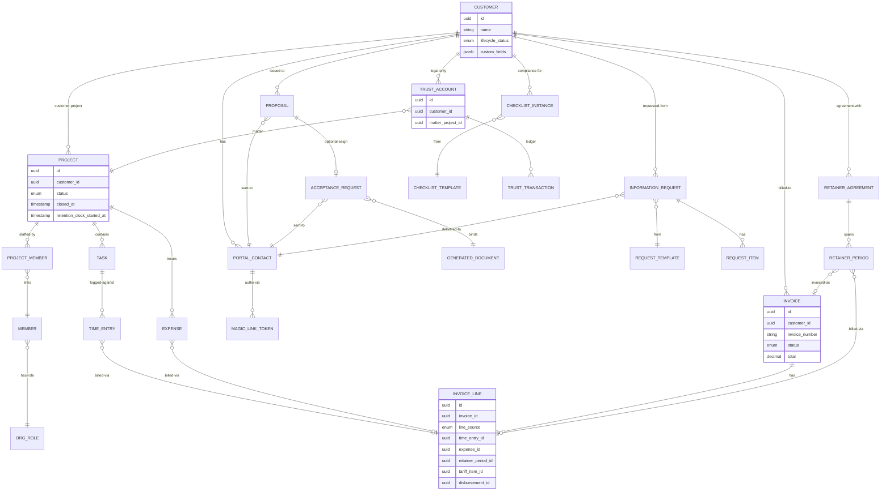

# 40 — Data Model Overview

**Purpose.** One-page bird's-eye view of Kazi's domain data model: how entities relate across module boundaries, which tables live in the public (cross-tenant) schema vs the per-tenant schema, what the FK web looks like at the aggregate level, and how the four polymorphic cross-cutting joins (audit, comment, tag, notification) thread through everything.

This page is **deliberately not exhaustive.** Detail per module — every column, every index, every nullable flag — lives in `30-modules/<slug>.md`. The entity catalogue with field-level breakdown lives in `_discovery/A1-backend-map.md` § 2. This file is the cross-aggregate skeleton you read first when orienting on the domain.

**Synthesised from:** `_discovery/A1-backend-map.md` § 2 (entity catalogue), every `30-modules/*.md` (per-module entity sections), `20-cross-cutting/multitenancy.md` (schema boundary), `20-cross-cutting/audit-and-compliance.md` (polymorphic audit), `glossary.md`. Approximately **55–60 JPA entity classes across 30+ packages** (`A1-backend-map.md:369`).

---

## 1. Tenant Boundary

Every entity is **tenant-scoped (per-org schema)** unless explicitly listed as shared. Cross-link: `20-cross-cutting/multitenancy.md` for the mechanism (schema-per-tenant, `RequestScopes.TENANT_ID` → `search_path`).

### 1.1 Public schema (shared, cross-tenant) — 5 entities

| Entity | Table | Owning module | Purpose |
|---|---|---|---|
| [`Organization`](#anchor-organization) | `organizations` | `tenancy-provisioning` | Tenant root record (`A1-backend-map.md:98`). |
| [`OrgSchemaMapping`](#anchor-orgschemamapping) | `org_schema_mapping` | `tenancy-provisioning` | `externalOrgId` → `schemaName` index (`A1-backend-map.md:103`). |
| [`AccessRequest`](#anchor-accessrequest) | `access_requests` | `platform-administration` | Admin-gated sign-up + OTP (`A1-backend-map.md:118`). |
| [`Subscription`](#anchor-subscription) | `subscriptions` | `platform-administration` | Platform-tier billing per org (`A1-backend-map.md:110`). |
| [`SubscriptionPayment`](#anchor-subscriptionpayment) | `subscription_payments` | `platform-administration` | PayFast payment events (`A1-backend-map.md:111`). |

These five tables are the **only** rows queried without a `search_path` switch. They drive provisioning (find/create the schema), platform billing (gate non-owner access during PAST_DUE/SUSPENDED via `SubscriptionGuardFilter`), and admin-gated org sign-up.

### 1.2 Tenant schema (per-org) — ~55 entities

Everything else. Each tenant gets a dedicated Postgres schema named `tenant_<orgId>` (ADR-064, dedicated-schema-only). Cross-tenant joins are **structurally impossible** because the tables don't exist in the same schema. See `20-cross-cutting/multitenancy.md` § Mechanism.

The polymorphic joins (`audit_events`, `comments`, `entity_tags`, `notifications`) all live per-tenant — there is no global audit log, no global comment thread.

---

## 2. Aggregate Roots

The load-bearing aggregates ordered by centrality in the FK web. Each links to its module page for full detail.

**`Customer`** — `customer-lifecycle` (`30-modules/customer-lifecycle.md`)
The hub of the domain. Rows in `customers` (`A1-backend-map.md:154`) carry `lifecycleStatus` (`PROSPECT|ONBOARDING|ACTIVE|DORMANT|OFFBOARDING|OFFBOARDED|ANONYMIZED`), `customerType`, `idNumber`, `offboardedAt`, `customFields jsonb`. Companion entity `CustomerProject` (`A1-backend-map.md:155`) is the link table to `Project`. ChecklistInstances auto-instantiate per type. Source of truth for billable identity: every invoice, proposal, retainer, information-request, trust account, and portal-contact ultimately FKs back to a row here.

**`Project`** — `projects` (`30-modules/projects.md`)
`projects` table (`A1-backend-map.md:147`) carries `customerId`, `status` (`ACTIVE→COMPLETED→CLOSED→ARCHIVED`), `closedAt`, `retentionClockStartedAt` (ADR-249), `priority`, `workType`, `customFields jsonb`. Children: `Task`, `TimeEntry` (via Task), `Expense`, `ProjectMember`. Aggregate-internal status machine; one-way retention clock anchors to `closedAt`.

**`Invoice`** — `invoicing` (`30-modules/invoicing.md`)
`invoices` table (`A1-backend-map.md:205`) carries `customerId`, `invoiceNumber`, `status` (`DRAFT→APPROVED→SENT→PAID|VOID`), `currency`, `subtotal`, `taxAmount`, `total`, `dueDate`, `paidAt`. Children: `InvoiceLine` (`A1-backend-map.md:206`) which carries `lineSource` discriminator + nullable FKs `timeEntryId | retainerPeriodId | expenseId | tariffItemId | disbursementId` (the seam where billing pulls revenue from operations). Trust-flagged invoices are blocked from accounting export by `TrustBoundaryGuard` (ADR-276).

**`Proposal`** — `proposals-acceptance` (`30-modules/proposals-acceptance.md`)
`proposals` table (`A1-backend-map.md:242`) carries `customerId`, `portalContactId`, `feeModel`, `status`, `expiresAt`. Optionally generates an `AcceptanceRequest` for e-sign. Sales-pipeline aggregate.

**`AcceptanceRequest`** — `proposals-acceptance` (`30-modules/proposals-acceptance.md`)
`acceptance_requests` table (`A1-backend-map.md:249`) carries `generatedDocumentId`, `portalContactId`, `customerId`, `requestToken`, `expiresAt`, `acceptedAt`. Token-gated lightweight e-sign — FKs to **either** a `GeneratedDocument` or (via portal-contact + proposal flow) a `Proposal`. Hourly expiry processor.

**`RetainerAgreement`** — `retainers` (`30-modules/retainers.md`)
`retainer_agreements` table (`A1-backend-map.md:220`) carries `customerId`, `type`, `frequency`, `allocatedHours`, `periodFee`, `rolloverPolicy`. Children: `RetainerPeriod` (`A1-backend-map.md:221`) carries `periodStart`, `periodEnd`, `consumedHours`, `rolloverHoursIn`, `invoiceId` (period→invoice link).

**`AutomationRule`** — `automation` (`30-modules/automation.md`)
`automation_rules` (`A1-backend-map.md:272`) carries `triggerType`, `triggerConfig jsonb`, `conditions jsonb`. Children: `AutomationAction` (sortOrder + actionType + actionConfig jsonb + delayDuration), `AutomationExecution` (run history with `status`, `startedAt`, `errorMessage`). Driven by the `domain-events` bus.

**`DocumentTemplate`** — `documents-templates` (`30-modules/documents-templates.md`)
`document_templates` (`A1-backend-map.md:256`) carries `slug`, `category`, `primaryEntityType`, `content jsonb`, `source`, `packId`. Generates `GeneratedDocument` rows with polymorphic `(primaryEntityType, primaryEntityId)`, `s3Key`, `documentId` (FK to physical Document upload).

**`InformationRequest`** — `information-requests` (`30-modules/information-requests.md`)
`information_requests` (`A1-backend-map.md:320`) carries `requestTemplateId`, `customerId`, `portalContactId`, `dueDate`, `reminderIntervalDays`. Children: `RequestItem` rows with `responseType`, `required`, `status`. Backed by `RequestTemplate` (`A1-backend-map.md:319`).

**`ChecklistTemplate`** — `checklists` (`30-modules/checklists.md`)
`checklist_templates` (`A1-backend-map.md:304`) carries `customerType`, `source`, `packId`, `autoInstantiate`. Auto-creates `ChecklistInstance` (`A1-backend-map.md:305`) per matching customer; instance carries `templateId`, `customerId`, `status`, `startedAt`, `completedAt`.

**`TrustAccount`** — `trust-accounting` *(legal-vertical only)* (`30-modules/trust-accounting.md`)
Lives under `verticals/legal/trustaccounting/`. Companion entities: `TrustTransaction`, client ledgers, LPFF interest runs, Section 86 investments. FK to matter (`Project`) and customer. Module-gated at every service entry. Hard-guarded against accounting-sync export (ADR-276). See `60-verticals/legal-za.md`.

**`PortalContact`** — `customer-portal` (`30-modules/customer-portal.md`)
`portal_contacts` (`A1-backend-map.md:264`) carries `customerId`, `email`, `displayName`, `role`, `status`. Authenticated via `MagicLinkToken` (`A1-backend-map.md:265`) with `tokenHash`, `expiresAt`, `usedAt`. Hourly cleanup job. Note UI naming divergence — see § 10.

**`Notification`** — `notifications` (`30-modules/notifications.md`)
`notifications` (`A1-backend-map.md:190`) carries `recipientMemberId` (FK→Member), `type`, `title`, `referenceEntityType`, `referenceEntityId` (polymorphic), `isRead`. Sibling `NotificationPreference` per `(memberId, notificationType)`.

**`Member`** — `identity-access` (`30-modules/identity-access.md`)
`members` (`A1-backend-map.md:125`) carries `clerkUserId`, `email`, `orgRoleId`, `capabilityOverrides`. Companion `ProjectMember` (`A1-backend-map.md:126`) links member↔project with `projectRole`. `OrgRole` (`A1-backend-map.md:140`) carries `slug`, `isSystem`, `capabilities` (`@ElementCollection`).

**`OrgSettings`** — `settings-navigation` (`30-modules/settings-navigation.md`)
**Singleton per tenant.** `org_settings` (`A1-backend-map.md:357`) — one row per tenant carrying ~25+ fields: `defaultCurrency`, `brandColor`, `logoS3Key`, `dormancyThresholdDays`, `verticalProfile`, `enabledModules`, `terminologyNamespace`, `fieldPackStatus jsonb`, `templatePackStatus jsonb`, etc. Referenced by virtually every domain service for feature flags, terminology key, and currency.

**`AuditEvent`** — `audit` (`30-modules/audit.md`)
`audit_events` (`A1-backend-map.md:198`) carries `eventType`, `entityType`, `entityId`, `actorId`, `actorType`, `source`, `ipAddress`, `details jsonb`. **Immutable** (JPA `@Immutable` + Postgres trigger `prevent_audit_update` + companion `prevent_audit_delete` per A6 §3). **No FK** — `(entityType, entityId)` is polymorphic so the table can record events about anything without schema churn. Cross-link: `20-cross-cutting/audit-and-compliance.md`.

---

## 3. ER Diagram — Cross-Aggregate FK Web

Only the cross-aggregate FKs that span module boundaries. Intra-aggregate links (e.g. Task↔TimeEntry within the projects spine) are shown but per-aggregate detail lives on each module page.

**What the diagram does NOT show** (look at module pages):
- Custom-field jsonb columns on every aggregate (see § 6).
- Tag overlay rows in `entity_tags` (see § 7).
- Audit/comment/notification polymorphic joins (see § 8).
- Pack provenance — `packId` columns on `DocumentTemplate`, `FieldDefinition`, `FieldGroup`, `ChecklistTemplate`, `RequestTemplate`, `ProjectTemplate` (origin tracking; see `30-modules/packs.md`).
- Tax: `TaxRate` and `BillingRun` are referenced by Invoice but not drawn here — see `30-modules/invoicing.md`.
- Capacity: `MemberCapacity` and `ResourceAllocation` reference Member/Project — see `30-modules/capacity-planning.md`.

---

## 4. Audit Trigger Note

Every mutating service calls `AuditService.log(eventType, entityType, entityId, details)` **inside the source transaction** (not via the event bus). The `audit_events` row stores `(entityType, entityId)` as a polymorphic discriminator pair — there is no FK to the target row. Two consequences:

1. The audit table is **entity-agnostic**. Adding a new aggregate root requires zero audit-table schema change. The trade-off is no referential integrity: the audit row outlives the entity it references (intentional — you need to know what was deleted).
2. The audit write is **transactional with the change** so a rolled-back domain mutation cannot leave a phantom audit record (A6 §3). Belt-and-braces immutability: JPA `@Immutable` on the entity + Postgres `prevent_audit_update` + `prevent_audit_delete` triggers on the table.

Cross-link: `20-cross-cutting/audit-and-compliance.md`. Module page: `30-modules/audit.md`.

---

## 5. Custom-Field Overlay

Per **ADR-052** (jsonb-vs-eav-custom-field-storage), custom field **schema** lives in `field_definitions` and **values** live as a `custom_fields jsonb` column on each owning entity row (Project, Task, Customer, Invoice, etc.). There is no parallel EAV table.

- `FieldDefinition` (`A1-backend-map.md:281`) — per-tenant copy of one field schema: `entityType`, `slug` (immutable post-create per ADR-093), `fieldType`, `required`, `options jsonb`, `validation jsonb`, `visibilityCondition jsonb`, `requiredForContexts jsonb`, `packId`, `portalVisibleDeadline`.
- `FieldGroup` (`A1-backend-map.md:282`) — bundle of field defs with `autoApply`, `dependsOn jsonb`, `applicableWorkTypes jsonb`, `packId`.
- **Values** live on the entity row — e.g. `projects.custom_fields jsonb`, `customers.custom_fields jsonb`. GIN-indexed for `@>` containment. Range queries cast through `(custom_fields ->> 'slug')::numeric` and are **not** GIN-indexed (see `30-modules/custom-fields-tags-views.md` L60-61, ADR-052 § Consequences L67-69 — per-tenant expression indexes added on hot fields).

**Tenant isolation inherits from the entity row** — values can't leak across tenants because the owning row is in a per-tenant schema. Cross-link: `30-modules/custom-fields-tags-views.md`.

**Trade-off:** great read perf inside one entity (single-row jsonb scan) but bad for cross-entity field-aggregation ("show me every entity using slug `fica_status`") — those queries fan out to per-entity tables. See § 10.

---

## 6. Tag Overlay

`Tag` (`A1-backend-map.md:289`) carries `name`, `slug`, `color`. Polymorphic link `EntityTag` (`A1-backend-map.md:290`) carries `(tagId FK, entityType, entityId)`. `ON DELETE CASCADE` on `entity_tags.tagId` so tag delete is O(1). **No FK on the entity side** — application-level integrity (ADR-054 § Consequences).

Cross-entity-type queries ("which entities use tag X?") go through `entity_tags` directly — that's what the polymorphic shape buys you. Cross-link: `30-modules/custom-fields-tags-views.md`.

---

## 7. Polymorphic / Cross-Cutting Joins

Four polymorphic `(entityType, entityId)` shapes recur. Listed explicitly because grep-based reasoning misses them — they are **not** wired with foreign keys.

| Table | Discriminator columns | Notes |
|---|---|---|
| `audit_events` | `entityType`, `entityId` | Append-only, tenant-scoped, entity-agnostic. § 4. |
| `comments` | `entityType`, `entityId`, `parentId` (thread chain) | Carries `projectId` for fast project-comments queries. `→ comment/Comment.java:15`. |
| `entity_tags` | `entityType`, `entityId` (FK to `tags.id`) | Cross-entity tag queries. § 6. |
| `notifications` | `referenceEntityType`, `referenceEntityId` | Recipient FK→`members`; reference is polymorphic. `→ notification/Notification.java:13`. |

A fifth weakly-polymorphic shape: `GeneratedDocument(primaryEntityType, primaryEntityId)` (`A1-backend-map.md:257`) — generated docs reference whichever entity drove the template (Customer, Project, Invoice…). Same pattern; included here so you don't grep past it.

---

## 8. Cross-Vertical Impact

Per `60-verticals/legal-za.md` and `20-cross-cutting/multi-vertical.md`, **legal-vertical adds entities but does not modify core entities.** The legal-only tables live under `verticals/legal/` packages:

- `TariffSchedule` + `TariffItem` (`A1-backend-map.md:364-365`) — court-tariff pricing.
- `TrustAccount`, `TrustTransaction`, client ledgers, LPFF interest runs, Section 86 investments — `verticals/legal/trustaccounting/`.

Universal core tables (`Customer`, `Project`, `Invoice`, etc.) carry **no legal-specific columns**. Vertical-specific behaviour is enforced by:

1. `enabledModules` on `OrgSettings` (e.g. `"trust_accounting"` is only present when `verticalProfile = legal-za`).
2. `verticalModuleGuard.requireModule(slug)` at every legal service's public method.
3. `TrustBoundaryGuard` on the accounting-sync egress (ADR-276 — fail-closed Java, no LLM/human bypass).

Switching a tenant's profile away from legal does **not** drop legal tables — orphaned trust accounts remain in the schema but are unreachable from UI (documented gap in `10-bounded-contexts.md` § 4 "Known fragility"). Cross-link: `60-verticals/legal-za.md`, `60-verticals/seeds-and-packs.md`.

---

## 9. Open / Known Issues

These are documented gaps surfaced by discovery (A1, A4 ADR triage) and the glossary; they are not bugs but they are facts the data model carries today.

1. **Two retention clocks that don't cascade.** `Customer.offboardedAt` (set at lifecycle transition to OFFBOARDED) and `Project.retentionClockStartedAt` (set at project close per ADR-249) are independent. Closing all of a customer's projects does not advance the customer-side clock and vice versa. Affects DSAR/anonymization scheduling. See `30-modules/customer-lifecycle.md` and `30-modules/projects.md`.
2. **Three `BillingStatus` enums.** `TimeEntry.billable`, `Expense.billable`, plus a Disbursement billable flag (legal vertical). Per `glossary.md`, these are not unified — each carries its own semantics (e.g. expense billable depends on category default; time-entry billable depends on task default). Reporting must handle all three independently.
3. **PortalContact ↔ Customer Contact UI naming divergence.** Backend entity is `PortalContact` (`portal_contacts`); UI surfaces it as "Customer Contact" or "Client Contact" depending on terminology overlay. Not a data-model bug but a frequent source of confusion when reading code vs UI. See `30-modules/customer-portal.md`.
4. **Custom-field values in jsonb on entity rows.** Per ADR-052 (§ 5 above), this is a deliberate trade-off — excellent read perf inside one entity, weak support for cross-entity field aggregation. "Show me everything tagged with custom-field slug `fica_status`" requires a UNION across `customers`, `projects`, `tasks`, etc.; there is no central index. Hot fields can be promoted via per-tenant expression indexes (ADR-052 § Consequences L67-69), but this is a manual escape hatch.
5. **Vertical profile change is one-way-safe but not reversible-clean.** Per `10-bounded-contexts.md` § 4, switching a tenant from `legal-za` back to `consulting-generic` leaves orphaned legal tables (trust accounts, tariff schedules) in the schema. Module-gated, so unreachable from UI, but they exist on disk.

---

## 10. Cross-Links

Every aggregate root maps to its module page:

- Customer → `30-modules/customer-lifecycle.md`
- Project → `30-modules/projects.md`
- Invoice → `30-modules/invoicing.md`
- Proposal, AcceptanceRequest → `30-modules/proposals-acceptance.md`
- RetainerAgreement → `30-modules/retainers.md`
- AutomationRule → `30-modules/automation.md`
- DocumentTemplate, GeneratedDocument → `30-modules/documents-templates.md`
- InformationRequest → `30-modules/information-requests.md`
- ChecklistTemplate → `30-modules/checklists.md`
- TrustAccount → `30-modules/trust-accounting.md` and `60-verticals/legal-za.md`
- PortalContact, MagicLinkToken → `30-modules/customer-portal.md`
- Notification → `30-modules/notifications.md`
- Member, OrgRole, ProjectMember → `30-modules/identity-access.md`
- OrgSettings → `30-modules/settings-navigation.md`
- AuditEvent → `30-modules/audit.md` and `20-cross-cutting/audit-and-compliance.md`
- FieldDefinition, Tag, SavedView → `30-modules/custom-fields-tags-views.md`
- Organization, OrgSchemaMapping → `30-modules/tenancy-provisioning.md` and `20-cross-cutting/multitenancy.md`
- AccessRequest, Subscription, SubscriptionPayment → `30-modules/platform-administration.md`
- TariffSchedule → `60-verticals/legal-za.md`
- ProjectTemplate → `30-modules/project-templates.md`
- MemberCapacity, ResourceAllocation → `30-modules/capacity-planning.md`
- ReportDefinition → `30-modules/reporting.md`
- OrgIntegration → `30-modules/integration-ports.md` and `20-cross-cutting/integration-ports.md`
- PackInstall → `30-modules/packs.md`
- TaxRate, BillingRun → `30-modules/invoicing.md`

For the source-anchored entity catalogue with every column, every nullable flag, and every package path, see `_discovery/A1-backend-map.md` § 2. For terminology synonyms across verticals, see `glossary.md`.
