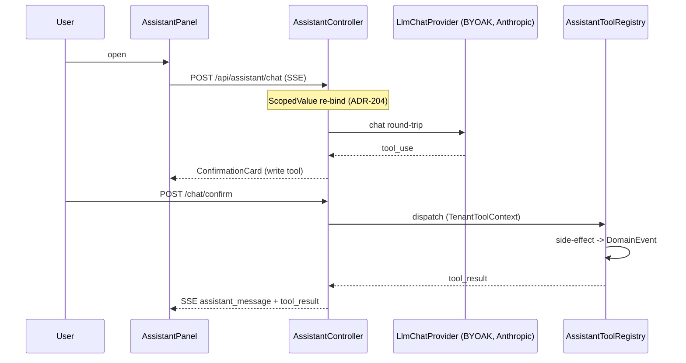
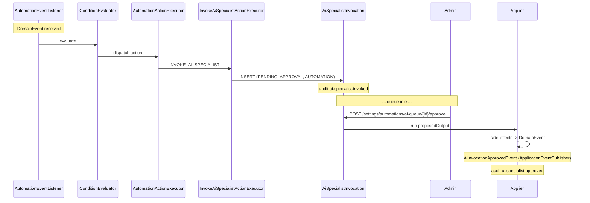

# AI Specialist Invocation

## 1. What this flow shows

How an **AI Specialist** is invoked, end-to-end, across three entry points:

1. **Automation-initiated** — `INVOKE_AI_SPECIALIST` action fires from a rule and lands in the **AI Queue** (`PENDING_APPROVAL`) for human review (ADR-267 default).
2. **Chat-mode** — user opens `AssistantPanel`, an SSE stream runs the LLM tool loop with in-flight `ConfirmationCard` confirmations on writes (ADR-204 ScopedValue re-bind).
3. **Inline launcher** — entity-page `SpecialistLauncherButton` opens a specialist chat with the entity ref pre-bound (ADR-266 inline-primary).

The single carve-out from "human approval is default" is **direct-mode** Inbox-summary posting from the scheduled inbox sweep (ADR-267, ADR-271).

## 2. Cast

- **User** (member with `AI_ASSISTANT_USE`) — chat / launcher / queue reviewer.
- **`AssistantPanel`** + **`useAssistantChat`** `→ frontend/components/assistant/assistant-panel.tsx`, `→ frontend/hooks/use-assistant-chat.ts:128` — SSE client (only browser-direct backend call in the FE).
- **`AssistantController`** `→ backend/.../assistant/AssistantController.java:33` — SSE endpoint `POST /api/assistant/chat`.
- **`SpecialistRegistry`** `→ assistant/specialist/SpecialistRegistry.java:21` — id → system prompt + tool ids + JSONB `OutputPayload` shape (ADR-265, ADR-270).
- **`AssistantToolRegistry`** `→ assistant/tool/AssistantToolRegistry.java:20` — capability-filtered tool catalogue.
- **`TenantToolContext`** `→ assistant/tool/TenantToolContext.java:32` — carries TENANT_ID, MEMBER_ID, ORG_ROLE, capabilities for tool dispatch.
- **AI Invocation** queue — `AiSpecialistInvocation` rows `→ assistant/invocation/AiSpecialistInvocation.java:29` (status enum at `InvocationStatus.java:4`, source enum at `InvocationSource.java:4`).
- **`LlmChatProvider`** `→ assistant/provider/LlmChatProvider.java:12` — provider SPI; `AnthropicLlmProvider` is the only impl today (`provider/anthropic/AnthropicLlmProvider.java:35`).
- **`OrgIntegration` / `SecretStore`** `→ integration/OrgIntegration.java:20`, `→ integration/secret/EncryptedDatabaseSecretStore.java:19` — BYOAK API key, AES-GCM at rest.
- **AI Queue UI** `→ frontend/app/(app)/org/[slug]/settings/automations/ai-queue/page.tsx`.
- **Output JSONB** — `OutputPayload` sealed iface `→ assistant/invocation/payload/OutputPayload.java` (per-specialist proposed/applied shapes).

## 3. Step-by-step — automation-mode (REVIEW, default)

1. **Rule fires.** Domain event hits `AutomationEventListener.onDomainEvent(DomainEvent)` `→ automation/AutomationEventListener.java:25,54`. Trigger-type matched, conditions pass, ordered actions iterate (see `automation-trigger-to-action.md`).
2. **`INVOKE_AI_SPECIALIST` action executes.** `InvokeAiSpecialistActionExecutor` builds an `AiSpecialistInvocation` row with `invokedBy=AUTOMATION`, `automationActionExecutionId` set, `status=PENDING_APPROVAL`. Direct-mode is rejected here for any specialist/tool combination not on the ADR-267 carve-out list.
3. **Audit emits** `ai.specialist.invoked` (per ADR-270 uniform audit surface).
4. **Admin reviews** at `/settings/automations/ai-queue` — `AiSpecialistInvocationController.java:39` lists, `:58` shows detail with proposed JSONB.
5. **Approve** `POST /api/assistant/invocations/{id}/approve` (capability `AI_ASSISTANT_USE`). Optimistic-locking via `@Version` (ADR-270) handles race vs. expiry sweeper.
6. **Applier runs.** Specialist's apply path consumes `proposedOutput`, writes domain entities (creates Task, posts comment, etc.). Each side-effect publishes its own `DomainEvent` through normal module paths — no special channel.
7. **`AiInvocationApprovedEvent`** published `→ assistant/invocation/AiInvocationApprovedEvent.java:14` (Spring `ApplicationEventPublisher`, **not** in the sealed `DomainEvent` hierarchy).
8. **Reject path** `POST .../reject` records `rejectReason`, fires `AiInvocationRejectedEvent` and audit `ai.specialist.rejected`. No applier runs.

## 4. Step-by-step — chat-mode

1. **User opens `AssistantPanel`.** Module gate: `OrgSettings.aiEnabled` (server-checked in org layout). `IntegrationGuardService.requireEnabled(AI)` is the second gate.
2. **SSE connect.** `useAssistantChat` (`:128`) issues `POST /api/assistant/chat` (the **only** browser-direct fetch in the FE — see `_discovery/A2-frontend-map.md:271`).
3. **ScopedValue re-bind.** Controller captures `RequestScopes.{TENANT_ID, MEMBER_ID, ORG_ID, ORG_ROLE, CAPABILITIES}` on the request thread, submits to a virtual-thread executor, **re-binds** before the LLM loop runs (`AssistantController.java:36-59`, ADR-204). Without this re-bind, tools see unbound TENANT_ID and fail.
4. **Provider resolved.** `LlmChatProviderRegistry` reads `OrgIntegration` for domain `AI`, picks `providerSlug`, fetches BYOAK key from `SecretStore` (key shape `ai:{slug}:api_key`).
5. **Tool list.** `AssistantToolRegistry.getToolsForUser(capabilities)` (`:49`) filters the ~26 tools by `requiredCapabilities()`.
6. **LLM loop.** Each round-trip ledgered to `AiLlmCall`. Tool calls dispatched via `TenantToolContext.fromRequestScopes()` (`:32`).
7. **Write tools** stream a `ConfirmationCard` to the panel; user confirms via `POST /api/assistant/chat/confirm` (`AssistantController.java:64`); tool then runs (ADR-203 completable-future contract).
8. **Result stream** flows back as SSE events (ADR-202 `Consumer<StreamEvent>`, no Flux).

## 5. Step-by-step — inline launcher (ADR-266)

1. User on entity page (e.g. customer detail). `SpecialistLauncherButton` visible iff `SpecialistRegistry.visibleTo(member, route)` (`:77`) — caller has `AI_ASSISTANT_USE` AND current route matches a `Launcher`.
2. Click opens `SpecialistPanel` with `specialistId` and entity ref captured in `LauncherContext`.
3. Panel issues the same `/api/assistant/chat` SSE call as chat-mode, but with `specialistId` set; system prompt swapped, tool subset narrowed, output schema bound. Same ScopedValue re-bind, same BYOAK resolution.

## 6. Direct mode — single carve-out (ADR-267)

The Inbox specialist's `PostInboxSummary` tool, invoked from the **scheduled** inbox-sweep automation (ADR-271 `SCHEDULED` trigger), runs **without** queueing. The invocation row is written with `status=AUTO_APPLIED`; the comment posts immediately with "Posted by Inbox Assistant" attribution. `InvokeAiSpecialistActionExecutor` enforces this at execution time **and** rule-save time — any other specialist/tool with `mode=DIRECT` is rejected. See `30-modules/ai-assistant.md` §6.

## 7. Sequence diagrams — chat-mode and automation-mode

### Chat-mode (SSE, in-flight confirm)

### Automation-mode (queued, async approve)

## 8. Failure modes

- **LLM rate limit / network error** — `AnthropicLlmProvider` surfaces a stream error; chat-mode renders `ErrorCard`; automation-mode marks invocation `FAILED` with `errorMessage`. **No automatic retry**; admin uses `POST .../{id}/retry` which calls `AiSpecialistInvocation.resetToRunning()` (`:170`) clearing stale outputs.
- **Tool execution exception** — captured on the invocation; status `FAILED`; audit `ai.specialist.failed`. No retry-with-backoff.
- **Missing / invalid BYOAK key** — `IntegrationGuardService.requireEnabled(AI)` throws → HTTP 403 in chat-mode; in automation-mode the invocation row is rejected at executor time with a provider-config error message; admin must paste a key in `/settings/integrations`.
- **Insufficient capability at tool call** — `AssistantToolRegistry.getTool` (`:79`) raises `InsufficientToolCapabilityException`; LLM may retry with a different tool, otherwise loop terminates.
- **Pending-approval expiry** — `AiInvocationExpirySweeper` (`assistant/invocation/AiInvocationExpirySweeper.java`) daily-sweeps overdue `PENDING_APPROVAL` rows → `EXPIRED` (ADR-271 reaper pattern).
- **AI Queue backlog growth** — no documented TTL beyond expiry sweep, no max-depth, no backpressure into the firing rule. Burst of invocations from a high-volume rule can pile up. Tracked in `30-modules/automation.md` §10.
- **Token cost / per-tenant rate limit** — `AiLlmCall` records per-round-trip token counts; **no tenant-level monthly aggregate, no rate-limit, no cost-cap**. Acceptable at firm-pilot scale (BYOAK = tenant pays direct). Open question per `30-modules/ai-assistant.md` §"Open questions".
- **Retention** — `AiInvocationReaper` (`AiInvocationReaper.java`) ages old rows; `nullOutputsForRetention()` (`:164`) keeps the status row as audit shadow but nulls the JSONB payload (POPIA §14 alignment).

## 9. Vertical overlays

Specialists are vertical-aware **via prompt content, not registry partitioning** (ADR-269) — every tenant gets the same registry; SA register and legal-vs-accounting voice ride the system-prompt markdown under `backend/src/main/resources/assistant/specialists/*.md`. Vertical-specific automation rules that invoke specialists ship as `AUTOMATION_TEMPLATE` packs (e.g. legal-za seeds court-deadline reminders, accounting-za seeds invoice-overdue prompts) — see `30-modules/automation.md` §7. Tool subset narrows by **capability** (e.g. `MANAGE_TRUST` only granted on legal roles), not by vertical flag.

## 10. Cross-links

- `30-modules/ai-assistant.md` — module overview, REST surface, ScopedValue re-bind, reapers.
- `30-modules/automation.md` — rule engine, `INVOKE_AI_SPECIALIST` as first-class action, scheduled triggers.
- `30-modules/integration-ports.md` — `OrgIntegration` for AI domain, BYOAK secret store, `IntegrationGuardService.requireEnabled(AI)`.
- `50-flows/automation-trigger-to-action.md` — upstream flow that produces the `INVOKE_AI_SPECIALIST` action invocation.
- ADRs: [265](../../adr/ADR-265-specialist-as-prompt-tools-launcher-metadata.md), [266](../../adr/ADR-266-inline-launchers-primary-chat-panel-secondary.md), [267](../../adr/ADR-267-human-approval-default-direct-mode-exception.md), [268](../../adr/ADR-268-ocr-via-claude-vision-byoak-no-separate-vendor.md), [269](../../adr/ADR-269-sa-specialisation-in-prompts-not-fine-tuning.md), [270](../../adr/ADR-270-ai-specialist-invocation-jsonb-output.md), [271](../../adr/ADR-271-scheduled-trigger-extension.md). Also ADR-200/202/203/204 (chat infra).
- Glossary: AI Specialist, AI Invocation, AI Queue, Invocation Source, Invocation Status, BYOAK.
