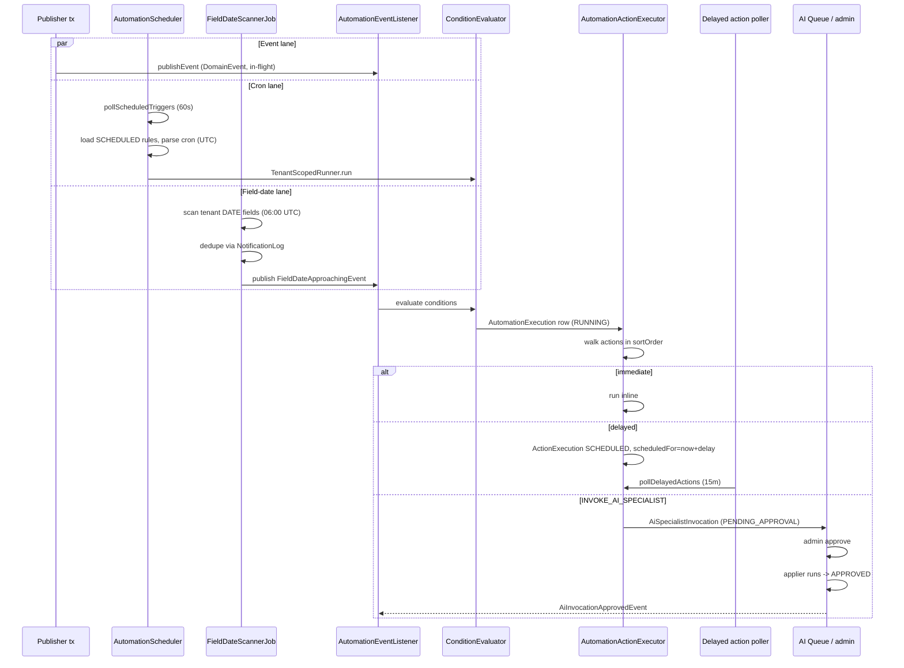

# Automation Trigger to Action

**Status:** filled (Phase D part 2).
**Cross-links:** [`30-modules/automation.md`](../30-modules/automation.md), [`30-modules/domain-events.md`](../30-modules/domain-events.md), [`30-modules/ai-assistant.md`](../30-modules/ai-assistant.md), [`50-flows/ai-specialist-invocation.md`](ai-specialist-invocation.md).

## 1. What this flow shows

How an `AutomationRule` fires from one of three trigger sources — a published `DomainEvent`, the cron-driven `AutomationScheduler`, or the daily `FieldDateScannerJob` — through condition matching to ordered, possibly delayed action execution. Includes the `INVOKE_AI_SPECIALIST` action path that lands in the human-approval queue (ADR-267).

## 2. Cast

| Actor | Anchor |
|---|---|
| `DomainEvent` (sealed root, 41 permits) | `→ backend/.../event/DomainEvent.java:17` |
| `AutomationRule` | `→ backend/.../automation/AutomationRule.java:20` |
| `AutomationAction` | `→ backend/.../automation/AutomationAction.java:19` |
| `AutomationExecution` + `ActionExecution` | `→ backend/.../automation/AutomationExecution.java:19` |
| `AutomationEventListener` (universal `@EventListener`) | `→ backend/.../automation/AutomationEventListener.java:25,54` |
| `AutomationScheduler` (two pollers) | `→ backend/.../automation/AutomationScheduler.java:24,61,78` |
| `FieldDateScannerJob` | `→ backend/.../automation/FieldDateScannerJob.java:30,60` |
| `AutomationActionExecutor` | `→ backend/.../automation/AutomationActionExecutor.java` |
| `InvokeAiSpecialistActionExecutor` (AI bridge) | `→ backend/.../automation/InvokeAiSpecialistActionExecutor.java` |
| AI Specialist queue | see [`ai-specialist-invocation.md`](ai-specialist-invocation.md) |

## 3. Three trigger types

### 3a. Event trigger

1. Publisher (e.g. `TaskService`, `InvoiceService`, `CustomerLifecycleService`) calls `ApplicationEventPublisher.publishEvent(domainEvent)` inside its transaction.
2. `AutomationEventListener.onDomainEvent(DomainEvent)` (`AutomationEventListener.java:54`) receives the event **in-flight** — `@EventListener`, **not** `@TransactionalEventListener`, by design (`30-modules/automation.md` §5; rationale: needs in-flight scope to bind `RequestScopes.AUTOMATION_EXECUTION_ID` and schedule delayed actions on the same tx — `domain-events.md` §"AFTER_COMMIT vs in-transaction").
3. Listener resolves event class → `TriggerType` via `TriggerTypeMapping`. Unmapped events drop silently (`AutomationEventListener.java:70-74`).
4. Cycle-detection short-circuit on `event.automationExecutionId()` (currently a placeholder — `AutomationEventListener.java:77`, ADR-146).
5. `TriggerConfigMatcher` walks every enabled rule for the tenant, matching `triggerType` and the `triggerConfig` JSONB filter (e.g. status enum, project type).
6. For each match, `ConditionEvaluator` evaluates the rule's `conditions` JSONB against the event payload (`ConditionOperator` from `glossary.md:84`).
7. Pass → `AutomationExecution` row created (`status=RUNNING`, `triggerEventType` set), then ordered `AutomationAction.sortOrder` actions enqueue through `AutomationActionExecutor` (§4).

### 3b. Scheduled trigger (cron)

1. `AutomationScheduler.pollScheduledTriggers` (`@Scheduled(fixedDelay = 60s)` — `AutomationScheduler.java:78`) iterates `AutomationRule` rows with `triggerType=SCHEDULED`.
2. Cron expression parsed via Spring `CronExpression`, **UTC-only** (`AutomationScheduler.java:155-157`). DST drift is a known consequence (`automation.md` §10).
3. Due rules fire under `TenantScopedRunner` to re-bind tenant context, then take the same `ConditionEvaluator → AutomationActionExecutor` path as event triggers. ADR-271.

### 3c. Field-date trigger

1. `FieldDateScannerJob.scan()` runs daily at **06:00 UTC** (`@Scheduled(cron = "${app.automation.field-date-scan-cron:0 0 6 * * *}")` — `FieldDateScannerJob.java:60`).
2. Scans tenant DATE-typed custom fields against configured "approaching" thresholds; dedupes via `FieldDateNotificationLog` keyed by `(entityId, fieldId, threshold)`.
3. Publishes `FieldDateApproachingEvent` (`→ backend/.../automation/fielddate/FieldDateApproachingEvent.java`, `glossary.md:132`) — the only event automation itself emits.
4. The event re-enters `AutomationEventListener` exactly like 3a, with `TriggerType=FIELD_DATE_APPROACHING`. Self-loop into the universal subscriber.

## 4. Action execution

`AutomationActionExecutor` walks the rule's actions in `sortOrder`. Per-action behaviour:

- **Immediate** — `delayDuration` null/zero. Executor invokes the per-`ActionType` handler synchronously inside the same call stack as the listener / scheduler tick.
- **Delayed** — `delayDuration > 0` (with `DelayUnit ∈ MINUTES, HOURS, DAYS`). Inserts an `ActionExecution` row with `status=SCHEDULED` and `scheduledFor = now + delay`. `AutomationScheduler.pollDelayedActions` (`@Scheduled(fixedDelay = 15 min)` — `AutomationScheduler.java:61`) picks up due rows and runs them. Implements ADR-147.

Action types (`ActionType` enum, `glossary.md:34`):

| Type | Handler effect |
|---|---|
| `SEND_EMAIL` / `SEND_NOTIFICATION` | Renders `actionConfig` template via `VariableResolver` (`automation/VariableResolver.java`); writes a `Notification` row and (preference allowing) emits via the EMAIL integration port. |
| `CREATE_TASK` | `TaskService.create(...)` with config-derived title / due-offset / assignee. |
| `ASSIGN_MEMBER` / `UPDATE_STATUS` | Mutates the source entity inline. |
| `CREATE_PROJECT` | Spawns project, optionally from a `ProjectTemplate`. |
| `INVOKE_AI_SPECIALIST` | See below. |

Webhook + template-render actions are referenced in product surfaces but are not in the current `ActionType` enum at HEAD (`glossary.md:34`) — verify before relying on them.

### 4.1 AI specialist action

`INVOKE_AI_SPECIALIST` is dispatched to `InvokeAiSpecialistActionExecutor`:

1. Creates an `AiSpecialistInvocation` row (`→ assistant/invocation/AiSpecialistInvocation.java:29`) with `invokedBy=AUTOMATION`, `automationActionExecutionId` set, `status=RUNNING`.
2. **Default mode is queue-for-review** per ADR-267: when the specialist runs and produces an `OutputPayload`, status moves to `PENDING_APPROVAL`. The action returns; the rule's downstream actions continue.
3. AI Queue page (`frontend/.../settings/automations/ai-queue/`) surfaces the row. Admin approves → applier runs → `AiInvocationApprovedEvent`. Reject → `REJECTED`.
4. **Direct-mode carve-out**: only the Inbox specialist's `PostInboxSummaryTool` in scheduled mode may auto-apply (`status=AUTO_APPLIED`). Enforced both at rule-save time and at execution time by the executor.

Full sub-flow: [`50-flows/ai-specialist-invocation.md`](ai-specialist-invocation.md).

## 5. Sequence diagram (three lanes)

## 6. Failure modes

- **Action handler exception** → `ActionExecution.status=FAILED`, `errorMessage` populated. **No retry by default.** The parent `AutomationExecution` is marked `FAILED` once any action fails; subsequent ordered actions are skipped (`30-modules/automation.md` §10). Re-firing requires a new triggering event or scheduler tick.
- **Rule cycle** — Rule X creates entity Y → triggers Rule Z → creates an X-shaped entity → re-triggers X. Cycle detection on `event.automationExecutionId()` is **a placeholder** at `AutomationEventListener.java:77` (ADR-146 specifies the contract; promotion is open). A real cycle today would loop until something else caps it.
- **Universal-subscription cost** — every `DomainEvent` walks every enabled rule for the tenant; with N rules and M event types, per-event cost is O(N). No opt-out, no per-event-type SQL filter at the listener boundary (`automation.md` §6.3, §10).
- **UTC-only cron** — `pollScheduledTriggers` (`AutomationScheduler.java:155-157`) parses cron strings in UTC. Tenants expressing local-time schedules must precompute the offset; DST shifts twice a year (`automation.md` §10).
- **Field-date scanner cadence is daily** — fine for "due in 7 days"; too coarse for sub-day reminders. A timer-per-due-date job is the documented alternative (`automation.md` §10).
- **AI Queue backlog** — the queue is human-paced. No documented TTL, no max-depth, no backpressure into the firing rule. `AiInvocationExpirySweeper` ages `PENDING_APPROVAL` rows past a TTL into `EXPIRED` (`ai-assistant.md` §"Reaper / sweeper jobs", ADR-271).
- **Cross-rule action ordering undefined** — when N rules match one event, `AutomationAction.sortOrder` orders actions *within* a rule; cross-rule order is repository iteration order (`automation.md` §10).

## 7. Vertical overlays

- **Pack-seeded rule templates.** Vertical-specific default rules ship as `AUTOMATION_TEMPLATE` packs (`PackType` enum, `glossary.md:193`). `AutomationRule.templateSlug` ties pack-shipped rules back to their seed for re-keying after pack upgrades. `AutomationRule.source` is `MANUAL | PACK | SYSTEM` (`automation.md` §6.6). Examples: legal-za seeds court-deadline reminders + conflict-check follow-ups; accounting-za seeds invoice-overdue + bank-reconciliation prompts (`automation.md` §7).
- **Module gate.** `automation_builder` module gate (`glossary.md:174`) decides whether a tenant sees the rule-builder UI at all; the engine itself is universal.
- **Carve-out: accounting sync is not an automation rule.** ADR-274 — Xero push runs through a dedicated sync service, not via `INVOKE_AI_SPECIALIST` or any `ActionType`. Don't model it here.

## 8. Cross-links

- Producer-side: every event in [`30-modules/domain-events.md`](../30-modules/domain-events.md) is a potential entry to lane 3a.
- Action-side notifications: [`30-modules/notifications.md`](../30-modules/notifications.md) for the email channel + `Notification` row writes from `SEND_EMAIL`/`SEND_NOTIFICATION`.
- Action-side tasks: [`30-modules/tasks.md`](../30-modules/tasks.md) for `CREATE_TASK` semantics.
- AI sub-flow: [`50-flows/ai-specialist-invocation.md`](ai-specialist-invocation.md).
- ADRs (cluster): ADR-145 (rule-engine shape), ADR-146 (cycle detection), ADR-147 (delayed actions), ADR-148 (JSONB config), ADR-198 (post-create exec), ADR-265 / ADR-266 / ADR-267 / ADR-270 (AI specialist surfaces), ADR-271 (scheduled-trigger extension), ADR-274 (accounting carve-out).
