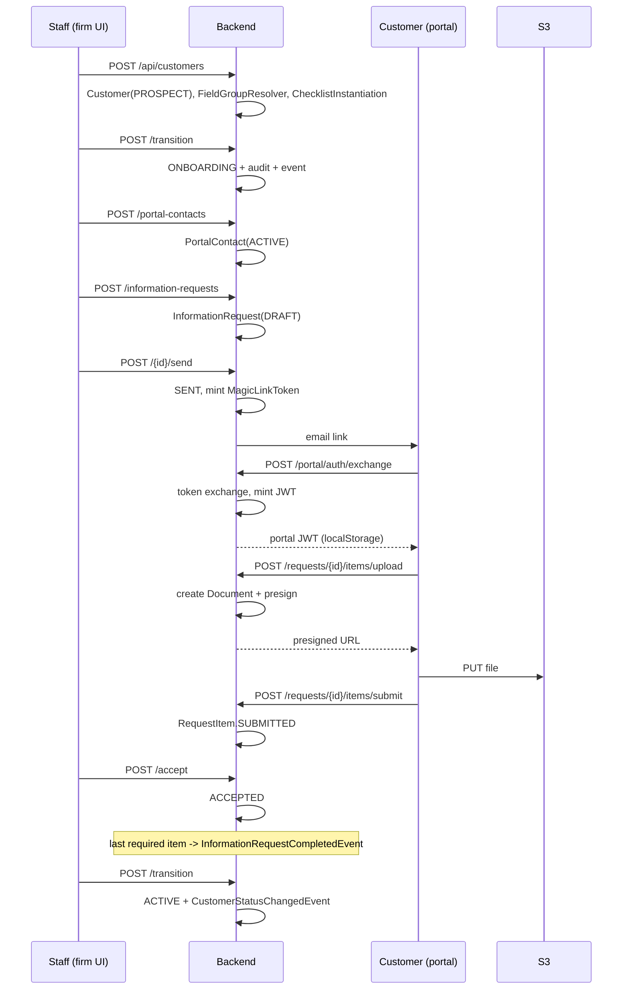

# Customer Onboarding and KYC

## What this flow shows

The end-to-end path a new customer takes from creation (`PROSPECT`) through active intake (`ONBOARDING`) to fully transacting (`ACTIVE`), including KYC document collection driven through the customer portal. The flow is the load-bearing case for four sibling modules: [`customer-lifecycle`](../30-modules/customer-lifecycle.md), [`checklists`](../30-modules/checklists.md) (compliance-pack auto-instantiation), [`information-requests`](../30-modules/information-requests.md) (FICA document intake), and [`customer-portal`](../30-modules/customer-portal.md) (magic-link authentication). Heavily verticalised — the legal-za FICA shape differs materially from the base `consulting-generic` profile.

## Cast

- **Customer** — root aggregate; `LifecycleStatus` machine + `customerType`. `→ customer-lifecycle.md` "Entities owned".
- **FieldGroup auto-apply** — `FieldGroupResolver` evaluates `autoApply` at create. `→ custom-fields-tags-views.md` "Cross-cutting touchpoints" L62.
- **ChecklistInstance** — materialised from `ChecklistTemplate` by `ChecklistInstantiationService.instantiateForCustomer`. `→ checklists.md` "Cross-cutting touchpoints" L72.
- **RequestTemplate → InformationRequest** — FICA pack template → drafted request → SENT to a portal contact. `→ information-requests.md` "Entities owned" L11–14.
- **PortalContact** — auto-provisioned by `PortalContactAutoProvisioner` (`@EventListener`, in-tx). `→ customer-portal.md` `PortalContact.java:16`.
- **MagicLinkToken** — DB-backed one-time token; `tokenHash` only, raw token emailed. `→ customer-portal.md` "Entities owned".
- **Document** — created at upload-init time via `StorageService.generateUploadUrl` (ADR-136). `→ information-requests.md` "Cross-cutting touchpoints" L123.

## Step-by-step

1. **Create customer (PROSPECT default)** — `POST /api/customers`. `Customer.lifecycleStatus = PROSPECT`. `→ customer-lifecycle.md` REST table `:190`. ADR-060 (lifecycle as first-class field).
2. **Auto-apply field groups by `customerType`** — `FieldGroupResolver.resolve(customer)` runs in the create transaction; legal-za "FICA fields" group has `autoApply=true` and matches `customerType ∈ {INDIVIDUAL, COMPANY, TRUST}`. `appliedFieldGroups` JSONB updated. `→ custom-fields-tags-views.md` L62; `→ customer-lifecycle.md` L119.
3. **Auto-instantiate compliance-pack checklists** — `ChecklistInstantiationService.instantiateForCustomer(customer)` queries `findByActiveAndAutoInstantiateAndCustomerTypeIn(true, true, [customerType, "ANY"])`, applies most-specific-match (typed wins over `ANY`), creates one `ChecklistInstance` per template. `→ checklists.md` L72; `customer-lifecycle.md` L118.
4. **Staff transitions PROSPECT → ONBOARDING** — `POST /api/customers/{id}/transition`. `PrerequisiteService` gates on required fields; `CustomerLifecycleService` flips status, writes audit (in-tx), publishes `CustomerStatusChangedEvent`. `→ customer-lifecycle.md` REST `:367`; emit `:178`.
5. **Staff creates a PortalContact** — `POST /api/customers/{customerId}/portal-contacts` (or auto-provisioned by an outbound flow). `PortalContact.role = PRIMARY`, `status = ACTIVE`. `→ customer-portal.md` `PortalContact.java:16`.
6. **Staff drafts an InformationRequest from RequestTemplate** — `POST /api/information-requests` with `requestTemplateId` of the FICA pack template; auto-creates `RequestItem`s from `RequestTemplateItem`s. Emits `InformationRequestDraftCreatedEvent`. `→ information-requests.md` REST `:32`; event `:372`.
7. **Staff sends the request** — `POST /api/information-requests/{id}/send`. DRAFT → SENT. Emits `InformationRequestSentEvent`. `AFTER_COMMIT` listener calls `MagicLinkService` to mint a token + sends email with a link landing on `/requests/{id}`. `→ information-requests.md` event `:414`; listener `:53`; magic-link `customer-portal.md` `MagicLinkToken.java:19`.
8. **Customer arrives at the portal via magic link** — clicks email → `POST /portal/auth/exchange` with `{token, orgId}`. `MagicLinkToken.markUsed()` (single-use), `PortalJwtService` mints HS256 JWT (1h TTL, ADR-077). `→ customer-portal.md` REST table; portal flow [`portal-magic-link-to-task-completion.md`](portal-magic-link-to-task-completion.md).
9. **Customer uploads documents per RequestItem** — `POST /portal/requests/{id}/items/{itemId}/upload` returns presigned S3 URL + creates `Document` row immediately (ADR-136). Customer PUTs the file to S3 directly. `→ information-requests.md` portal sub-surface `:76`.
10. **Customer submits items** — `POST /portal/requests/{id}/items/{itemId}/submit`. `RequestItem.status = SUBMITTED`, `documentId` linked. Emits `RequestItemSubmittedEvent` (firm in-app notification fires). `→ information-requests.md` portal `:93`; event `:666`.
11. **Staff reviews each item** — `POST /api/information-requests/{id}/items/{itemId}/accept` or `/reject`. Reject flips back to PENDING with `rejectionReason`; `RequestItemRejectedEvent` triggers a resubmit email. Auto-completion fires `InformationRequestCompletedEvent` when the last `required` item is `ACCEPTED`. `→ information-requests.md` REST `:80`/`:87`; auto-complete `:572`.
12. **Checklist items auto-tick on completion** — items linked to the FICA request are flipped `PENDING → COMPLETED` via service-level coupling (today by polling `CustomerReadiness`; an explicit completion event is the documented future hook — see [`checklists.md`](../30-modules/checklists.md) "Open question" #3).
13. **Staff transitions ONBOARDING → ACTIVE** — `POST /api/customers/{id}/transition`. `PrerequisiteService` checks required fields and FICA-status (`GET /api/customers/{id}/fica-status`). Emits `CustomerStatusChangedEvent`. Automation rules can subscribe (`TriggerType.CUSTOMER_STATUS_CHANGED`). `→ customer-lifecycle.md` REST `:317`/`:367`; downstream L108.

## Sequence diagram

## Failure modes

- **Magic-link expired / used** — `MagicLinkToken.isExpired()` true or `usedAt != null` → exchange returns 401. Customer requests a fresh link via `POST /portal/auth/request-link`. No automatic re-issue. `→ customer-portal.md` `MagicLinkToken.java:55-59`.
- **Item rejected** — `RequestItemRejectedEvent` triggers email; item status flips to `PENDING`-equivalent (per `RequestItem.SUBMITTABLE_STATUSES`). Customer resubmits a new file → new `Document` row (the previous remains as a "ghost" document, no janitor today — see [`information-requests.md`](../30-modules/information-requests.md) "Open question" L151).
- **Reminder fires before customer reads email** — six-hourly `RequestReminderScheduler` only checks `now - referenceTime > intervalDays`; no deliverability back-off. A bouncing portal-contact email keeps receiving reminders until the request completes/cancels. `→ information-requests.md` "Cross-cutting" L119; "Open question" L152.
- **Prerequisite gate fails on ONBOARDING → ACTIVE** — `PrerequisiteService` raises `InvalidStateException` if required fields (e.g. legal-za `idNumber`) or FICA-status are unmet. Customer stays in `ONBOARDING`. `→ customer-lifecycle.md` L116.
- **Portal contact suspended mid-flow** — magic-link issuance refuses `SUSPENDED`/`ARCHIVED` contacts; existing tokens not actively revoked (token-revocation gap, [`customer-portal.md`](../30-modules/customer-portal.md) §6).

## Vertical overlays

- **legal-za** — FICA field group auto-applies (id number, source-of-funds, PEP flag); pack `fica-onboarding-pack` (typed variants `legal-za-individual-onboarding`, `legal-za-trust-onboarding` post PR #996) materialises both `RequestTemplate`s and `ChecklistTemplate`s. Section-86 onboarding checklist gates the ACTIVE transition. `→ checklists.md` L81; `→ information-requests.md` L129.
- **accounting-za** — AML pack ships `monthly-bookkeeping` + `annual-audit` request templates; SARS tax-number + entity-type custom fields auto-apply by `customerType`. Same engine, different seed. `→ checklists.md` L82; `→ information-requests.md` L129.
- **consulting-za** — `consulting-za-creative-brief` request pack only; lighter onboarding (no FICA, no compliance checklist). `information_requests` module enabled. `→ information-requests.md` L129.
- **consulting-generic** — `information_requests` module **absent** from `enabledModules`; portal `/requests` 404, no platform packs install. The KYC arm of this flow is effectively a no-op; ONBOARDING → ACTIVE is gated only by required custom fields. `→ information-requests.md` "Vertical specifics" L131.

## Cross-links

- [`customer-lifecycle.md`](../30-modules/customer-lifecycle.md) — owns the state machine, prerequisite gates, audit.
- [`checklists.md`](../30-modules/checklists.md) — owns `ChecklistInstantiationService`, KYC verification fields on items.
- [`information-requests.md`](../30-modules/information-requests.md) — owns the FICA intake workflow, reminder scheduler, portal upload sub-surface.
- [`custom-fields-tags-views.md`](../30-modules/custom-fields-tags-views.md) — owns `FieldGroupResolver` auto-apply.
- [`customer-portal.md`](../30-modules/customer-portal.md) — owns magic-link auth, portal JWT, read-model.
- [`50-flows/portal-magic-link-to-task-completion.md`](portal-magic-link-to-task-completion.md) — zooms in on the magic-link half.
- [`50-flows/pack-install-and-vertical-onboarding.md`](pack-install-and-vertical-onboarding.md) — how the FICA / AML packs land in a tenant.
- ADRs: ADR-060 (lifecycle field), ADR-062 (anonymisation), ADR-093 (template required fields), ADR-094 (conditional visibility), ADR-134 (info-request as first-class), ADR-135 (reminder strategy), ADR-136 (portal upload), ADR-240 (unified pack catalog).
