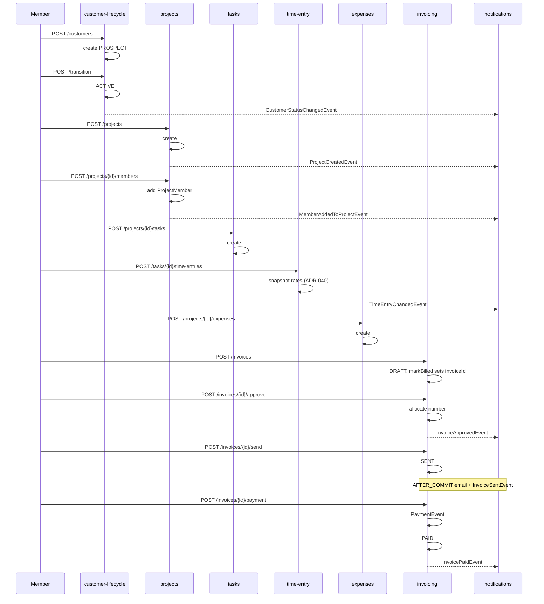

# Matter to Cash

## What this flow shows

The headline professional-services revenue lifecycle: a `Customer` is created and onboarded, a `Project` is opened against them, members log time and expenses, and an `Invoice` materialises those entries, gets approved, sent, and recorded as paid. This is the path that ties [`customer-lifecycle`](../30-modules/customer-lifecycle.md), [`projects`](../30-modules/projects.md), [`tasks`](../30-modules/tasks.md), [`time-entry`](../30-modules/time-entry.md), [`expenses`](../30-modules/expenses.md), and [`invoicing`](../30-modules/invoicing.md) into one money-out chain.

## Cast

- **Member** — staff actor (timekeeper, biller, approver) `→ backend/src/main/java/io/b2mash/b2b/b2bstrawman/member/Member.java`
- **Customer** — billable counterparty `→ backend/src/main/java/io/b2mash/b2b/b2bstrawman/customer/Customer.java:23`
- **Project** — unit of delivery `→ backend/src/main/java/io/b2mash/b2b/b2bstrawman/project/Project.java:24`
- **CustomerProject** — many-to-many link `→ backend/src/main/java/io/b2mash/b2b/b2bstrawman/customer/CustomerProject.java:14`
- **ProjectMember** — per-project access grant `→ backend/src/main/java/io/b2mash/b2b/b2bstrawman/member/ProjectMember.java:14`
- **Task** — work unit `→ backend/src/main/java/io/b2mash/b2b/b2bstrawman/task/Task.java:26`
- **TimeEntry** — billable hour with frozen rate snapshot `→ backend/src/main/java/io/b2mash/b2b/b2bstrawman/timeentry/TimeEntry.java:17`
- **Expense** — reimbursable cost `→ backend/src/main/java/io/b2mash/b2b/b2bstrawman/expense/Expense.java:19`
- **Invoice + InvoiceLine** — the bill itself `→ backend/src/main/java/io/b2mash/b2b/b2bstrawman/invoice/Invoice.java:24`, `→ backend/src/main/java/io/b2mash/b2b/b2bstrawman/invoice/InvoiceLine.java:19`
- Modules in scope: [`customer-lifecycle`](../30-modules/customer-lifecycle.md), [`projects`](../30-modules/projects.md), [`tasks`](../30-modules/tasks.md), [`time-entry`](../30-modules/time-entry.md), [`expenses`](../30-modules/expenses.md), [`invoicing`](../30-modules/invoicing.md).

## Step-by-step sequence

1. **Customer created (`PROSPECT`).** `POST /api/customers` defaults the new row to `LifecycleStatus.PROSPECT`; audit row written in-tx; checklist templates auto-instantiate per vertical pack. `→ backend/src/main/java/io/b2mash/b2b/b2bstrawman/customer/CustomerController.java:190`, status default `→ backend/src/main/java/io/b2mash/b2b/b2bstrawman/customer/Customer.java:69`.
2. **Customer transitioned to `ACTIVE`.** `POST /api/customers/{id}/transition` runs the prerequisite gate, flips lifecycle, emits `CustomerStatusChangedEvent`. Automation rules with `TriggerType.CUSTOMER_STATUS_CHANGED` may fire downstream. `→ backend/src/main/java/io/b2mash/b2b/b2bstrawman/customer/CustomerController.java:367`, emit at `→ backend/src/main/java/io/b2mash/b2b/b2bstrawman/compliance/CustomerLifecycleService.java:178`, event record `→ backend/src/main/java/io/b2mash/b2b/b2bstrawman/event/CustomerStatusChangedEvent.java:11`.
3. **Project created and linked.** `POST /api/projects` creates `Project` (`status=ACTIVE`) and `POST /api/customers/{id}/projects/{projectId}` writes a `CustomerProject` join row. `ProjectCreatedEvent` is published. `→ backend/src/main/java/io/b2mash/b2b/b2bstrawman/project/ProjectController.java:201`, link endpoint `→ backend/src/main/java/io/b2mash/b2b/b2bstrawman/customer/CustomerController.java:276`, emit `→ backend/src/main/java/io/b2mash/b2b/b2bstrawman/project/ProjectService.java:271`.
4. **Project members added.** `POST /api/projects/{projectId}/members` creates `ProjectMember` rows; `MemberAddedToProjectEvent` notifies `notification/NotificationService`. Access is now visible via `ProjectAccessService`. `→ backend/src/main/java/io/b2mash/b2b/b2bstrawman/member/ProjectMemberController.java:39`, emit `→ backend/src/main/java/io/b2mash/b2b/b2bstrawman/member/ProjectMemberService.java:87`, gate `→ backend/src/main/java/io/b2mash/b2b/b2bstrawman/member/ProjectAccessService.java:13`.
5. **Tasks created (optionally from a template).** `POST /api/projects/{projectId}/tasks` adds tasks; project-template instantiation may seed many at once via `ProjectScheduleService`. `→ backend/src/main/java/io/b2mash/b2b/b2bstrawman/task/TaskController.java:50`. See [`30-modules/project-templates.md`](../30-modules/project-templates.md).
6. **Time logged with rate snapshot frozen at create (ADR-040).** `POST /api/tasks/{taskId}/time-entries` (or batch) calls `RateSnapshotService` to resolve and freeze `(billingRateSnapshot, costRateSnapshot)` on the row. `TimeEntryChangedEvent action=CREATED` published. `→ backend/src/main/java/io/b2mash/b2b/b2bstrawman/timeentry/TimeEntryController.java:38`, snapshotter `→ backend/src/main/java/io/b2mash/b2b/b2bstrawman/timeentry/RateSnapshotService.java`, event `→ backend/src/main/java/io/b2mash/b2b/b2bstrawman/event/TimeEntryChangedEvent.java:7`.
7. **Expenses logged.** `POST /api/projects/{projectId}/expenses` creates `Expense` rows with `billable=true` (default) and a per-expense `markupPercent` override; markup is **applied at invoice generation time**, not stored on the expense (ADR-115). `→ backend/src/main/java/io/b2mash/b2b/b2bstrawman/expense/ExpenseController.java:44`, computation `→ backend/src/main/java/io/b2mash/b2b/b2bstrawman/expense/Expense.java:133`.
8. **Unbilled work accumulates.** `GET /api/customers/{id}/unbilled-time` and `GET /api/invoices/unbilled-summary` aggregate billable `TimeEntry` and `Expense` rows where `invoiceId IS NULL` (ADR-022 — on-the-fly aggregation, no materialised summary). `→ backend/src/main/java/io/b2mash/b2b/b2bstrawman/customer/CustomerController.java:300`, `→ backend/src/main/java/io/b2mash/b2b/b2bstrawman/invoice/InvoiceController.java:86`.
9. **Invoice drafted (`DRAFT`).** `POST /api/invoices` creates the draft; `InvoiceCreationService` consumes selected unbilled entries into `InvoiceLine` rows (`lineType ∈ {TIME, EXPENSE, MANUAL, FIXED_FEE, RETAINER, …}`) and calls `markBilled` on each, setting the source row's `invoiceId` (ADR-050). Tax snapshots written per line (ADR-103). `→ backend/src/main/java/io/b2mash/b2b/b2bstrawman/invoice/InvoiceController.java:50`, line creation `→ backend/src/main/java/io/b2mash/b2b/b2bstrawman/invoice/InvoiceCreationService.java:912`.
10. **Invoice approved (`APPROVED`).** `POST /api/invoices/{id}/approve` allocates `invoiceNumber` via the per-tenant `InvoiceCounter` (ADR-048), freezes lines, stamps `approvedBy`, emits `InvoiceApprovedEvent`. From here the financial substance is locked. `→ backend/src/main/java/io/b2mash/b2b/b2bstrawman/invoice/InvoiceController.java:167`, emit `→ backend/src/main/java/io/b2mash/b2b/b2bstrawman/invoice/InvoiceTransitionService.java:188`, counter `→ backend/src/main/java/io/b2mash/b2b/b2bstrawman/invoice/InvoiceNumberService.java:42`.
11. **Invoice sent (`SENT`).** `POST /api/invoices/{id}/send` transitions to `SENT` and emits `InvoiceSentEvent`; `PortalEmailNotificationChannel` listens at `AFTER_COMMIT` so a rolled-back send fires no email (irreversibility — `→ ADR-099`). Optional payment link minted via `PaymentLinkService` (ADR-100). `→ backend/src/main/java/io/b2mash/b2b/b2bstrawman/invoice/InvoiceController.java:174`, emit `→ backend/src/main/java/io/b2mash/b2b/b2bstrawman/invoice/InvoiceTransitionService.java:242`.
12. **Payment recorded (`PAID`).** `POST /api/invoices/{id}/payment` writes a `PaymentEvent` and, when the balance is zero, flips the invoice to `PAID` and emits `InvoicePaidEvent`. PSP-poll path (Phase 71, ADR-277) lands at the same terminal state via `PaymentReconciliationService`. `→ backend/src/main/java/io/b2mash/b2b/b2bstrawman/invoice/InvoiceController.java:181`, emit `→ backend/src/main/java/io/b2mash/b2b/b2bstrawman/invoice/InvoiceTransitionService.java:371`.
13. **Downstream consumers fan out.** `notification` sends receipt confirmations, `portal` read-model updates the customer-facing invoice list, Phase 71 accounting-sync queues the invoice for Xero push (subject to `TrustBoundaryGuard` — ADR-276). All `AFTER_COMMIT`. `→ backend/src/main/java/io/b2mash/b2b/b2bstrawman/notification/NotificationService.java`.

## Sequence diagram

## Failure modes and reaper behaviour

- **Time entry edited after invoice issued.** `TimeEntry.invoiceId` is non-null once `markBilled` runs. The admin re-snapshot endpoint explicitly skips invoiced entries `→ backend/src/main/java/io/b2mash/b2b/b2bstrawman/timeentry/AdminTimeEntryController.java:24`. Edit attempts on billed rows are gated in `TimeEntryService` (delete refuses, billable toggle is project-scoped only on unbilled). Double-billing is structurally impossible because every "unbilled" query filters on `invoiceId IS NULL` (ADR-050).
- **Expense edited after billing.** `Expense.update()` throws `IllegalStateException` once `invoiceId` is set `→ backend/src/main/java/io/b2mash/b2b/b2bstrawman/expense/Expense.java:162`. `unbill()` is the only legitimate reverse path, called from `InvoiceCreationService` on void/delete-draft `→ backend/src/main/java/io/b2mash/b2b/b2bstrawman/invoice/InvoiceCreationService.java:639, :400`.
- **Project completed/archived with unbilled time.** `GET /api/projects/{id}/unbilled-summary` surfaces the figure on the project detail page; the lifecycle transitions (`PATCH /{id}/complete`, `/archive`) do not currently hard-block on unbilled time but the UI shows the warning. `Project.isReadOnly()` returns true once `ARCHIVED` so further time/expense entry is blocked at the service layer `→ backend/src/main/java/io/b2mash/b2b/b2bstrawman/project/Project.java:323`. Open question: behavioural threshold for blocking vs warning is not in an ADR — flagged in `30-modules/projects.md` Open Questions.
- **Email-send failure on `SENT`.** `InvoiceSentEvent` dispatches the email at `AFTER_COMMIT`; if the SMTP call throws, the invoice has already transitioned to `SENT` (commit happened). The retry path is operator-driven via the same `POST /api/invoices/{id}/send` (idempotent against `SENT` — see `InvoiceTransitionService` send-from-sent guard). No automatic reaper retries SMTP failures today.
- **Invoice voided after lines consumed.** `POST /api/invoices/{id}/void` clears `invoiceId` on every linked time/expense/disbursement row `→ backend/src/main/java/io/b2mash/b2b/b2bstrawman/invoice/InvoiceCreationService.java:639`; entries return to `UNBILLED`. Number is **not** reissued (gap-free per-tenant counter, ADR-048).
- **Optimistic lock on project lifecycle race.** `Project.@Version` (`Project.java:41`) prevents two concurrent matter closures from both succeeding; loser receives 409 and re-fetches.

## Vertical overlays

- **legal-za.** UI relabels: Project → Matter, Invoice → Fee Note, Expense → Disbursement, Retainer → Mandate `→ frontend/lib/terminology-map.ts:21,79`. `LegalDisbursement` is a sibling aggregate to `Expense` carrying `DisbursementPaymentSource` (firm/trust/advanced) — see [`30-modules/expenses.md`](../30-modules/expenses.md) §7 and ADR-247. Trust-flagged invoices follow the same approve→send→pay path here, but trust-money allocation and the export hard guard live in [`50-flows/payment-receipt-to-trust-allocation.md`](payment-receipt-to-trust-allocation.md) and `30-modules/trust-accounting.md` (ADR-276).
- **accounting-za.** UI relabel: Project → Engagement `→ frontend/lib/terminology-map.ts:45`. Invoice keeps its label. No sibling-aggregate split for expenses; no trust gating.
- **consulting-za.** UI relabel: Time Entry → Time Log. Capacity-planning weaves in via [`30-modules/capacity-planning.md`](../30-modules/capacity-planning.md) — member capacity is tracked alongside time logs but is not load-bearing for the invoice flow.
- **consulting-generic.** Canonical labels everywhere; no terminology overrides.

## Cross-links

- [`30-modules/customer-lifecycle.md`](../30-modules/customer-lifecycle.md) — steps 1–2.
- [`30-modules/projects.md`](../30-modules/projects.md) — steps 3–4, project-state failure modes.
- [`30-modules/tasks.md`](../30-modules/tasks.md) — step 5.
- [`30-modules/time-entry.md`](../30-modules/time-entry.md) — step 6, ADR-040 snapshot, post-invoice edit guards.
- [`30-modules/expenses.md`](../30-modules/expenses.md) — step 7, markup at invoice time (ADR-115).
- [`30-modules/invoicing.md`](../30-modules/invoicing.md) — steps 8–13, all lifecycle events.
- [`30-modules/retainers.md`](../30-modules/retainers.md) — orthogonal billing path; consumes the same `time_entries` source-of-truth via ADR-074.
- [`50-flows/proposal-to-engagement-to-billing.md`](proposal-to-engagement-to-billing.md) — preceding flow when the engagement starts from a proposal.
- [`50-flows/payment-receipt-to-trust-allocation.md`](payment-receipt-to-trust-allocation.md) — legal-vertical specialisation downstream of step 12.
- [`50-flows/automation-trigger-to-action.md`](automation-trigger-to-action.md) — consumers of `CustomerStatusChangedEvent`, `InvoiceApprovedEvent`, `InvoicePaidEvent`, `BudgetThresholdEvent`.
