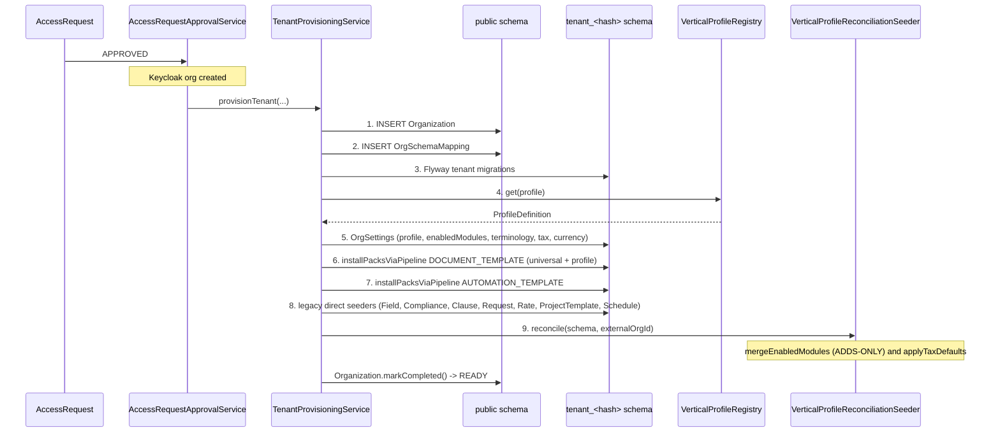
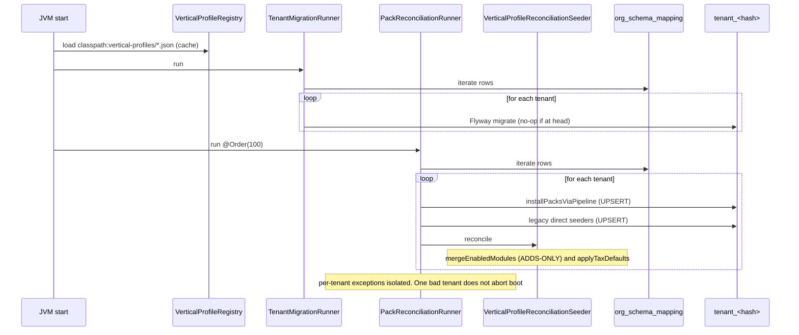

# Pack Install and Vertical Onboarding

## What this flow shows

How a new tenant org transitions from approved access-request to a fully-operable, vertical-specific workspace — `Organization` row, `tenant_<hash>` schema, profile-driven `OrgSettings`, terminology namespace, `enabledModules` slug-set, and the per-vertical pack inventory (templates, fields, checklists, rate cards). Plus the **once-per-boot reconciliation cycle** that keeps every pre-existing tenant in line with the current profile JSON. This is the load-bearing flow for verticalisation: every other vertical concern (terminology, module gates, pack catalog) is downstream of what this pipeline writes. The dominant architectural fragility — *the reconciler only adds, never removes* — lives in §6.

## Cast

- **AccessRequest** — public OTP-verified application, Platform Admin approves. `→ backend/src/main/java/io/b2mash/b2b/b2bstrawman/accessrequest/AccessRequest.java:18`. See [`platform-administration.md`](../30-modules/platform-administration.md).
- **AccessRequestApprovalService** — calls `tenantProvisioningService.provisionTenant(...)` after Keycloak org creation. `→ backend/src/main/java/io/b2mash/b2b/b2bstrawman/accessrequest/AccessRequestApprovalService.java:108`.
- **`Organization` (public schema)** — tenant row with `ProvisioningStatus` (`PENDING → IN_PROGRESS → COMPLETED|FAILED`). `→ provisioning/Organization.java:16,95`.
- **`OrgSchemaMapping` (public schema)** — `externalOrgId → schemaName` lookup; iterated by every cross-tenant runner. `→ multitenancy/OrgSchemaMapping.java:14`.
- **`SchemaNameGenerator`** — deterministic 12-hex hash → idempotent retries. `→ provisioning/SchemaNameGenerator.java:6`.
- **Flyway tenant migrations** — `classpath:db/migration/tenant`; `IF NOT EXISTS`/`ON CONFLICT DO NOTHING`. ADR-T007.
- **`VerticalProfileRegistry`** — boot-time loader of `classpath:vertical-profiles/*.json` into `Map<String, ProfileDefinition>`. `→ verticals/VerticalProfileRegistry.java:24,128`.
- **`TenantProvisioningService`** — five-step pipeline. `→ provisioning/TenantProvisioningService.java:140,170-189`.
- **`PackInstaller` (SPI)** — `type()`, `availablePacks()`, `install(...)`, `uninstall(...)`. Two live (`DOCUMENT_TEMPLATE`, `AUTOMATION_TEMPLATE`); 11 legacy direct-seeders coexist (ADR-243). `→ packs/PackInstaller.java:20`.
- **Direct legacy seeders** — `FieldPackSeeder`, `CompliancePackSeeder` (checklists), `ClausePackSeeder`, `RequestPackSeeder`, `RatePackSeeder`, `ProjectTemplatePackSeeder`, `SchedulePackSeeder`. See [`packs.md`](../30-modules/packs.md) §6.
- **`OrgSettings`** — verticality state row: `verticalProfile`, `enabledModules`, `terminologyNamespace`. `→ settings/OrgSettings.java:177,181,184`.
- **`VerticalProfileReconciliationSeeder`** — adds-only merge of profile `enabledModules` + tax-default reconciliation. `→ verticals/VerticalProfileReconciliationSeeder.java:37`.
- **`TenantMigrationRunner`** — boot-time Flyway re-run across all tenants. `→ provisioning/TenantMigrationRunner.java:16`.
- **`PackReconciliationRunner`** — boot-time pack-and-profile re-application across all tenants. `→ provisioning/PackReconciliationRunner.java:40`.
- **Materialised seed entities** — `ChecklistInstance`, `FieldDefinition`/`FieldGroup`, `DocumentTemplate`, `BillingRate`, `RequestTemplate`, `AutomationRule` (per-tenant, in the new schema).

## Onboarding step-by-step

1. **Approval / demo trigger.** Platform admin approves an `AccessRequest` (or hits the demo-provision endpoint). `AccessRequestApprovalService` creates the Keycloak org then calls `tenantProvisioningService.provisionTenant(externalOrgId, name, verticalProfile, country)`. `→ AccessRequestApprovalService.java:108`. Internal API surface: `POST /internal/orgs/provision` `→ provisioning/ProvisioningController.java:15`.
2. **Public-schema rows + schema creation.** `TenantProvisioningService` writes the `Organization` row (`PENDING → IN_PROGRESS`) and `OrgSchemaMapping` (`externalOrgId → tenant_<12-hex>`); the hash is deterministic so retries are safe `→ SchemaNameGenerator.java:6`.
3. **Flyway tenant migrations.** All `classpath:db/migration/tenant/V__*.sql` run against the new schema (line 209). DDL is `IF NOT EXISTS`/`ON CONFLICT DO NOTHING`; module tables (e.g. `trust_account`) materialise in **every** schema regardless of profile (ADR-191).
4. **Profile resolution.** `VerticalProfileRegistry.get(profileId)` returns the cached `ProfileDefinition` parsed at boot from `classpath:vertical-profiles/<id>.json` `→ VerticalProfileRegistry.java:62-128`. Missing/malformed file → silently skipped (§6).
5. **Set `OrgSettings` verticality.** `setVerticalProfile(...)` writes `verticalProfile`, `enabledModules`, `terminologyNamespace`, and tax/currency defaults from the profile `→ TenantProvisioningService.java:240`.
6. **Universal + profile-specific pack install (unified pipeline).** `installPacksViaPipeline(schemaName, profile, DOCUMENT_TEMPLATE)` (line 308) installs `packCatalogService.getUniversalPackIds(...)` first, then `getPackIdsForProfile(profile, ...)` (line 313). Each call resolves to `PackInstallService.internalInstall(packId, tenantId)` `→ packs/PackInstallService.java:123` — runs inside `RequestScopes.runForTenant(...)`, skips profile-affinity (system actor), UPSERTs content with content-hash, writes `PackInstall` row (`UNIQUE(pack_id)`). Idempotent: existing `PackInstall` short-circuits (line 76). Same sequence for `AUTOMATION_TEMPLATE`.
7. **Direct legacy pack seeders.** For the 11 not-yet-migrated pack types (field, compliance/checklist, clause, request, rate, project-template, schedule, etc.) `TenantProvisioningService` calls `AbstractPackSeeder` subclasses directly. Each is item-level UPSERT and writes a `{packId, version, appliedAt}` entry into the corresponding `OrgSettings.<type>PackStatus` JSONB log (line 361). See [`packs.md`](../30-modules/packs.md) §1, §6.
8. **Reconciler (provisioning leg).** `verticalProfileReconciliationSeeder.reconcile(schemaName, externalOrgId)` runs as step 5 of the pipeline `→ TenantProvisioningService.java:189`. Two concerns, both adds-only: `mergeEnabledModules` (line 96 of seeder; `LinkedHashSet`-merged, GAP-L-44) and `applyTaxDefaults` (line 125; renames legacy `"Standard"` tier → `"VAT — Standard"` only if not owner-edited, GAP-L-27).
9. **Mark complete.** `Organization.markCompleted()`; tenant becomes routable through `TenantFilter` (JWT `o.id` → schema lookup → `RequestScopes.TENANT_ID`). End-user UI is now ready: `OrgProfileProvider` reads `GET /api/settings`, hydrates `<ModuleGate>` and `TerminologyProvider` `→ frontend/lib/org-profile.tsx:27`.

## Boot reconciliation step-by-step

Two `ApplicationRunner`s execute on every backend boot, iterating every row of `org_schema_mapping`:

1. **`TenantMigrationRunner`** (`@Order` before `PackReconciliationRunner`) re-runs Flyway against every existing tenant schema → no-op if already at head; lands DDL added since the tenant was provisioned. Boot time scales linearly with tenant count (tenancy-provisioning §"Open questions"). `→ TenantMigrationRunner.java:16`.
2. **`PackReconciliationRunner`** (`@Order(100)`) iterates tenants → for each: re-runs the full pack pipeline (`installPacksViaPipeline` for universal + profile-specific `DOCUMENT_TEMPLATE` and `AUTOMATION_TEMPLATE`; legacy direct-seeders for the other 11 types) → step 13 calls `verticalProfileReconciliationSeeder.reconcile(...)` (line 126). All operations are idempotent UPSERTs; new modules / new pack ids added to the profile JSON since last boot land here. `→ PackReconciliationRunner.java:40,108-129`.

This is **GAP-L-44's whole purpose**: a tenant provisioned before a module existed on the profile picks it up at next boot without operator action ([`vertical-profiles.md`](../30-modules/vertical-profiles.md) §10.3).

## Flow diagrams

### Provisioning (single tenant, on approval)

### Boot reconciliation (all tenants, every JVM start)

## Failure modes

- **Bad / malformed profile JSON** — `VerticalProfileRegistry` skips the file with `log.warn` (no fail-fast) `→ VerticalProfileRegistry.java:121-125`. Profile `exists(...)` returns false; reconciler no-ops `→ VerticalProfileReconciliationSeeder.java:81-87`. Tenants on that profile keep their last-known state; new modules never land. **No metric / health-check surfaces this drift.** ([`vertical-profiles.md`](../30-modules/vertical-profiles.md) §10.4–10.5.)
- **Typo'd module slug** — silent. The slug is merged into `enabledModules`, matches no `requireModule(...)` call site, every gate fail-closes ([`vertical-profiles.md`](../30-modules/vertical-profiles.md) §10.4).
- **PackInstaller exception during provisioning** — provisioning aborts mid-pipeline; `Organization.markFailed()` may set status `FAILED`; tenant is left half-seeded. `@Retryable` on `provisionTenant` (line 137) re-runs from the top — every step is idempotent so retries are safe (ADR-T007). No tenant-deletion path exists for a permanently-broken provision ([`tenancy-provisioning.md`](../30-modules/tenancy-provisioning.md) §"Open questions").
- **Boot reconciler exception per tenant** — `TenantScopedRunner` isolates exceptions per row; one bad tenant logs and continues `→ multitenancy/TenantScopedRunner.java:37`.
- **Profile switch (`legal-za → consulting-generic`) — THE KNOWN FRAGILITY.** `OrgSettingsService.updateVerticalProfile(...)` `→ settings/OrgSettingsService.java:818` writes the new `verticalProfile` and **calls the same reconciler**. The reconciler is **adds-only**: it appends new-profile modules but **never removes old-profile modules, packs, FieldDefinitions, ChecklistInstances, document templates, clauses, or rate cards**. After `legal-za → consulting-generic`: `trust_accounting` stays in `enabledModules` (because `consulting-generic.enabledModules = []`); `trust_account`, `client_ledger`, LPFF interest, Section 86 investment rows persist; FICA checklist instances persist; legal document templates persist. Trust-accounting service entry points still pass `requireModule("trust_accounting")`; UI is hidden by nav-tree filter on `verticalProfile` but the API is reachable. **One-way safe (consulting → legal lights everything up via the boot reconciler), reversible-dirty.** A `VerticalProfileDrainSeeder` is described but not implemented — and trust money cannot be auto-uninstalled if non-zero balances exist (LPA s.86 is a regulatory question, not a software question). **Treat profile switches as "create a new tenant" until drain semantics ship.** Canonical statement: [`vertical-profiles.md`](../30-modules/vertical-profiles.md) §10.1, [`multi-vertical.md`](../20-cross-cutting/multi-vertical.md) §5, [`packs.md`](../30-modules/packs.md) §10.1, [`tenancy-provisioning.md`](../30-modules/tenancy-provisioning.md) §"Open questions".
- **Profile-declared horizontal module disabled by admin** — admin's `PUT /api/settings/modules` opt-out is non-durable; the boot reconciler re-adds it on next JVM start. No `disabledModules` overlay exists ([`vertical-profiles.md`](../30-modules/vertical-profiles.md) §10.2).
- **Duplicate pack-ID across two installers** — `PackCatalogService` constructor fails fast at boot with `IllegalStateException` `→ packs/PackCatalogService.java:36` (ADR-240).

## Vertical overlays

This whole flow **is** the verticalisation infrastructure. Each profile JSON declares a different pack list and a different `enabledModules` slug-set; the same pipeline produces materially different tenants:

- **`base.md`** — concepts that apply to every profile (universal packs, default terminology). [`60-verticals/base.md`](../60-verticals/base.md).
- **`legal-za`** — 9 enabled modules incl. `trust_accounting`, `court_calendar`, `conflict_check`, `lssa_tariff`; FICA + LSSA tariff packs; `terminologyNamespace = en-ZA-legal`. [`60-verticals/legal-za.md`](../60-verticals/legal-za.md).
- **`accounting-za`** — accounting-vertical defaults + deadline modules. [`60-verticals/accounting-za.md`](../60-verticals/accounting-za.md).
- **`consulting-za`** — consulting + ZA tax. [`60-verticals/consulting-za.md`](../60-verticals/consulting-za.md).
- **`consulting-generic`** — empty `enabledModules`, generic terminology — the no-vertical fallback.

Per-vertical pack catalogue (which packs ship for which profile): [`60-verticals/seeds-and-packs.md`](../60-verticals/seeds-and-packs.md).

## Cross-links

- Module pages: [`30-modules/vertical-profiles.md`](../30-modules/vertical-profiles.md), [`30-modules/packs.md`](../30-modules/packs.md), [`30-modules/tenancy-provisioning.md`](../30-modules/tenancy-provisioning.md), [`30-modules/settings-navigation.md`](../30-modules/settings-navigation.md), [`30-modules/platform-administration.md`](../30-modules/platform-administration.md).
- Cross-cutting: [`20-cross-cutting/multi-vertical.md`](../20-cross-cutting/multi-vertical.md) (the four mechanisms; the nine-layer trust defence), [`20-cross-cutting/multitenancy.md`](../20-cross-cutting/multitenancy.md).
- Verticals: [`60-verticals/seeds-and-packs.md`](../60-verticals/seeds-and-packs.md), [`60-verticals/legal-za.md`](../60-verticals/legal-za.md), [`60-verticals/accounting-za.md`](../60-verticals/accounting-za.md), [`60-verticals/consulting-za.md`](../60-verticals/consulting-za.md), [`60-verticals/base.md`](../60-verticals/base.md).
- Sibling flows: [`50-flows/customer-onboarding-and-kyc.md`](customer-onboarding-and-kyc.md) (consumes the FICA pack content this flow installs).
- Decision anchors: ADR-T007 (idempotent provisioning), ADR-064 (dedicated schema), ADR-181 (profile structure), ADR-184 (vertical-scoped pack filter), ADR-189 (profile storage), ADR-190 (module-guard granularity), ADR-191 (schema uniformity), ADR-192 (`enabledModules` authority), ADR-239 (horizontal vs vertical), ADR-240 (unified pack catalog), ADR-241 (add-only pack semantics), ADR-243 (two pack types live), ADR-244 (pack-only vertical profiles).
