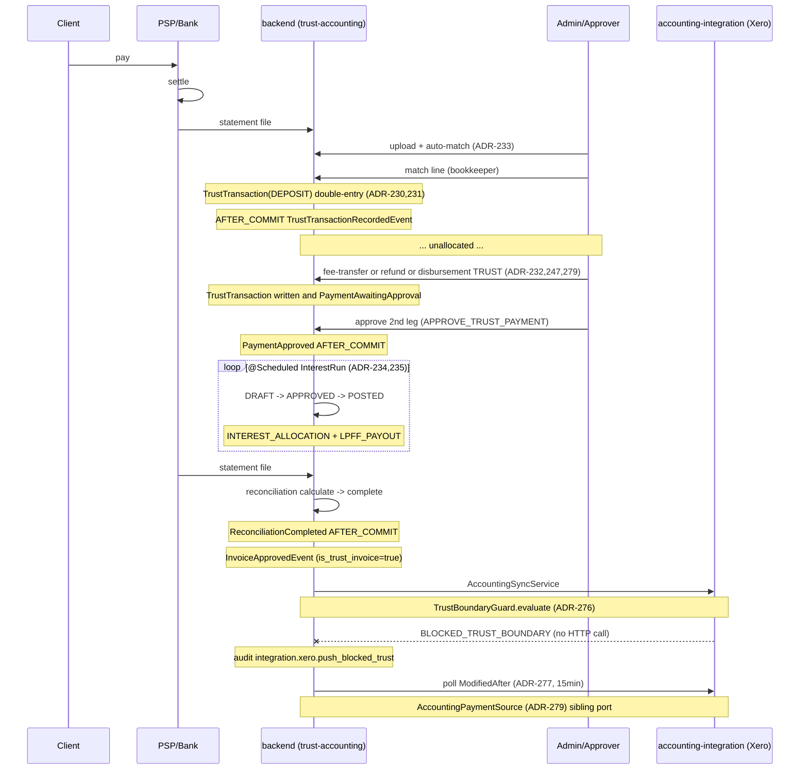

# Payment Receipt to Trust Allocation

**Vertical:** legal-za only. Module-gated `trust_accounting`. The entire flow is unreachable on a non-legal tenant — see the nine-layer defence in [`20-cross-cutting/multi-vertical.md`](../20-cross-cutting/multi-vertical.md) and [`30-modules/trust-accounting.md`](../30-modules/trust-accounting.md) §6.

## 1. What this flow shows {#what}

The money lifecycle of client funds held in fiduciary capacity: a client pays into a firm's trust bank account; the deposit is reconciled against a `BankStatementLine` and posted as a `TrustTransaction(DEPOSIT)` against a `ClientLedgerCard`; later, an admin allocates the balance — fees flow trust→business via `FEE_TRANSFER`, disbursements pay out via the sibling `DisbursementPaymentSource` port (ADR-279), LPFF interest accrues on a schedule, and any remaining balance stays in trust until the matter closes. The boundary with the firm's general ledger is enforced by a fail-closed `TrustBoundaryGuard` (ADR-276) at the integration push, **not** at trust-invoice creation.

The load-bearing property is irreversibility + auditability. Every step writes an `AuditEvent` in-tx; every notification fires `AFTER_COMMIT` (`30-modules/trust-accounting.md` §5).

## 2. Cast {#cast}

- **Customer** — payer `→ backend/src/main/java/io/b2mash/b2b/b2bstrawman/customer/Customer.java:23`
- **Project (Matter)** — legal-za relabel `→ frontend/lib/terminology-map.ts:21`
- **TrustAccount** — `→ backend/src/main/java/io/b2mash/b2b/b2bstrawman/verticals/legal/trustaccounting/TrustAccount.java:19`
- **TrustTransaction** — `→ verticals/legal/trustaccounting/transaction/TrustTransaction.java:17` (10 types per glossary `TrustTransactionType`)
- **ClientLedgerCard** — per-(account, customer) running balance `→ verticals/legal/trustaccounting/ledger/ClientLedgerCard.java`
- **BankStatement / BankStatementLine** — `→ verticals/legal/trustaccounting/reconciliation/BankStatement.java`
- **TrustReconciliation** — `→ verticals/legal/trustaccounting/reconciliation/TrustReconciliation.java`
- **InterestRun / InterestAllocation / LpffRate** — LPFF accrual `→ verticals/legal/trustaccounting/interest/InterestRun.java`
- **Invoice + InvoiceLine** — fee note flagged `is_trust_invoice` `→ backend/.../invoice/Invoice.java:24`
- **LegalDisbursement + DisbursementPaymentSource** — sibling-aggregate (ADR-247) with `OFFICE_ACCOUNT | TRUST_ACCOUNT` source `→ verticals/legal/disbursement/DisbursementPaymentSource.java:14`
- **Integration ports** — `PaymentGateway` (PSP, foundational always-on), `AccountingProvider` + `AccountingPaymentSource` (sibling port, ADR-279) — see [`30-modules/integration-ports.md`](../30-modules/integration-ports.md)
- **TrustBoundaryGuard** — fail-closed export gate (ADR-276) `→ phase71-xero-accounting-integration.md:793-799`
- **Members** — bookkeeper (initiator), approver (`APPROVE_TRUST_PAYMENT` capability — second leg of dual approval, `OWNER_ONLY`)

## 3. Step-by-step sequence {#steps}

1. **Client pays via PSP.** `→ ADR-098` (PaymentGateway port). The PSP is a foundational always-on integration domain (`IntegrationGuardService` early-return; [`30-modules/integration-ports.md`](../30-modules/integration-ports.md) §6). For trust deposits the firm typically directs clients to pay into the trust bank account directly; PSP-routed deposits land in the operating bank and require a manual transfer. Either way, the canonical event is a bank-statement line.
2. **Payment status polled (not webhook).** `→ ADR-277`. A `@Scheduled` worker calls Xero's `Invoices?ModifiedAfter={lastPollAt}` per active connection (15-min default, tenant-configurable). Webhooks are explicitly rejected for v1. The poll resolves the `AccountingPaymentSource` sibling port — `NoOpAccountingProvider` does not implement it, so the worker skips no-op tenants (ADR-279). For deposits originating outside the PSP path (the common case for trust), step 2 is replaced by step 3.
3. **Bank statement uploaded + auto-matched.** Bookkeeper uploads CSV/OFX via `POST /api/trust-accounts/{accountId}/bank-statements` (`reconciliation/TrustReconciliationController.java:34`). Auto-match (ADR-233) sets `BankStatementLine.matchStatus ∈ {MATCHED, UNMATCHED, IGNORED}`. Unmatched lines stay queued.
4. **TrustTransaction(DEPOSIT) created.** Match action `POST /api/bank-statement-lines/{lineId}/match` writes a `TrustTransaction` with `transactionType=DEPOSIT`, `amount`, `customerId`, `projectId` (matter), `transactionDate`. Double-entry invariant (ADR-230): `TrustAccount` cashbook balance and the `ClientLedgerCard` running balance both move in the same tx; balance(account) = Σ balance(client ledgers). Negative-balance guard (ADR-231) refuses.
5. **TrustTransactionRecordedEvent emitted.** Sibling record fired `AFTER_COMMIT` (`event/TrustTransactionRecordedEvent.java:24`). Notifications and the portal trust read-model update.
6. **Held unallocated until decision.** A deposit may sit on the client ledger for arbitrary time before being applied — this is the normal case. The trust balance is the client's money until allocated.
7. **Allocation (admin-initiated).** Three legitimate outflows:
   - **Fees → operating.** `POST /api/trust-accounts/{accountId}/transactions/fee-transfer` writes `TrustTransaction(FEE_TRANSFER)` against an approved `Invoice` (the matter's fee note, flagged `is_trust_invoice=true`). Amount cannot exceed unbilled-or-approved fees on the matter; `requireDualApproval` flag and `paymentApprovalThreshold` (ADR-232) drive whether a second `APPROVE_TRUST_PAYMENT` approver is needed. Awaiting-approval state emits `TrustDomainEvent.PaymentAwaitingApproval` (`event/TrustDomainEvent.java:31`).
   - **Disbursement payment.** `LegalDisbursement` with `paymentSource=TRUST_ACCOUNT` triggers a `TrustTransaction(DISBURSEMENT_PAYMENT)` from `DisbursementService` (the single non-trust-package writer to trust ledgers — see [`30-modules/trust-accounting.md`](../30-modules/trust-accounting.md) §10.2). `OFFICE_ACCOUNT` source skips this flow. ADR-279 frames the source as a sibling port — adding a third source (e.g. third-party financing) requires a new sibling, not an enum extension.
   - **Refund to client.** `POST /api/trust-accounts/{accountId}/transactions/refund` writes `TrustTransaction(REFUND)`; same dual-approval rules apply.
8. **LPFF interest accrual (scheduled).** `POST /api/trust-accounts/{accountId}/interest-runs` opens an `InterestRun(DRAFT)`; `calculate` computes per-client-day balances using the daily-balance method (ADR-234) against effective-dated `LpffRate` rows; `approve` then `post` writes per-client `TrustTransaction(INTEREST_ALLOCATION)` and the LPFF share via `LPFF_PAYOUT`, splitting per ADR-235 (statutory-vs-configurable share). Lifecycle `DRAFT → APPROVED → POSTED` is irreversible. Emits `TrustDomainEvent.InterestPosted` (`event/TrustDomainEvent.java:221`).
9. **Reconciliation closes the period.** `POST /api/trust-accounts/{accountId}/reconciliations` opens a `TrustReconciliation(DRAFT)` against an uploaded statement; `calculate` computes ledger-vs-bank delta; `complete` flips to `COMPLETED` and emits `TrustDomainEvent.ReconciliationCompleted`. Legal Practice Act expects monthly cadence (open question — see §5 below and [`30-modules/trust-accounting.md`](../30-modules/trust-accounting.md) §10.3).
10. **Statement document generated.** `GET /api/trust-accounts/{accountId}/client-ledgers/{customerId}/statement` (`ledger/ClientLedgerController.java:49`) and the portal endpoint render statements on demand from `ClientLedgerStatementQuery`. The portal hardens download URLs to `https:` only (`A3 §269`). Documents are **not** persisted as `GeneratedDocument` rows today — open question on signing/integrity tracked at [`30-modules/trust-accounting.md`](../30-modules/trust-accounting.md) §10.4.
11. **Hard guard at integration push.** `→ ADR-276`. When the matter's fee `Invoice` is approved and `AccountingSyncService` consumes `InvoiceApprovedEvent`, `TrustBoundaryGuard.evaluate(invoice)` runs **before** any HTTP call. Three-condition refusal (`phase71-xero-accounting-integration.md:793-795`): (1) `customFields.is_trust_invoice == true`, (2) any line linked to a `LegalDisbursement` with non-null `trust_account_id`, (3) customer has any non-zero `ClientLedgerCard` balance. Any one triggers `state=BLOCKED_TRUST_BOUNDARY`, audit event `integration.xero.push_blocked_trust`. Fail-closed on lookup error. No bypass, no override (ADR-276:51).

## 4. Sequence diagram {#sequence}

## 5. Failure modes {#failure-modes}

- **Polled but allocation undecided.** Default state — deposit sits on the client ledger as the client's money. No automatic sweep, no reaper. The `OVERDUE_RECONCILIATION` `TrustAlert` (glossary `TrustAlert`) surfaces stale state but does **not** block new transactions — advisory only ([`30-modules/trust-accounting.md`](../30-modules/trust-accounting.md) §10.3).
- **Reconciliation breaks (ledger ≠ bank).** `TrustReconciliation.calculate` exposes the delta; admin must investigate before `complete`. Cannot complete with non-zero variance unless a manual adjustment line is recorded (audit-trailed). Common causes: missed deposit, bank fee on trust account (regulatory anomaly — must be moved to operating), duplicate match.
- **Trust hard-guard blocks Xero push.** Sync entry `state=BLOCKED_TRUST_BOUNDARY`; accounting team notified via the sync-log UI (Phase 71 §11.5). Resolution is **not** to bypass the guard — it is to recognise that the invoice is statutorily forbidden from leaving the trust boundary and reconcile it manually in the firm's external books, or to clear the trust-flag if the flag is incorrect (which itself requires audit). The guard refuses re-attempts identically.
- **LPFF rate change mid-period.** `LpffRate` is effective-dated; `findFirstByTrustAccountIdAndEffectiveFromLessThanEqualOrderByEffectiveFromDesc` (`TrustAccountService.java:324`) resolves the rate per accrual day, so an `InterestRun` spanning a rate change applies the correct rate per day (daily-balance method, ADR-234). An in-flight `InterestRun(DRAFT)` whose rate row is changed before `approve` will recalculate on the next `calculate` call.
- **Dual-approval second leg never lands.** `TrustTransaction.status=AWAITING_APPROVAL` until `approve` or `reject`. Aging surfaces via `AGING_APPROVAL` `TrustAlert`. No automatic timeout — operationally the bookkeeper chases.
- **Negative-balance attempt.** ADR-231 guard refuses at the service layer. The transaction never persists; nothing to reverse.
- **Reversal.** `POST /api/trust-transactions/{id}/reverse` writes a paired `TrustTransaction(REVERSAL)` with `reversalOf` set; the original is **not** deleted (statutory irreversibility). Audit log preserves both legs.
- **Profile-switch orphan.** Switching tenant from `legal-za` to `consulting-generic` does not uninstall trust tables ([`30-modules/trust-accounting.md`](../30-modules/trust-accounting.md) §10.1). Open question: trapdoor vs guided uninstall.

## 6. Vertical overlays {#verticals}

This flow is **legal-za only**. The nine-layer defence ([`20-cross-cutting/multi-vertical.md`](../20-cross-cutting/multi-vertical.md), and [`30-modules/trust-accounting.md`](../30-modules/trust-accounting.md) §6) ensures no leak: profile registry (1) only legal-za enables `trust_accounting`; backend service gates (2) self-refuse with HTTP 403; the export hard guard (3) refuses cross-vertical; frontend nav (4), page server gate (5), capability (6) all hide; portal nav (7), portal redirect (8), and portal data endpoints (9) return **404** (module existence hidden from portal callers — `customerbackend/service/PortalTrustLedgerService.java:31`). Layers 2 and 3 are load-bearing; the rest are belt-and-braces UX. Non-legal verticals (consulting-za, accounting-za, consulting-generic) cannot reach this flow at any layer.

UI relabels on legal-za: Project → Matter, Invoice → Fee Note, Expense → Disbursement (`frontend/lib/terminology-map.ts:21,79`). The trust-accounting module itself does not relabel — it is statutorily named.

## 7. Cross-links {#cross-links}

- [`30-modules/trust-accounting.md`](../30-modules/trust-accounting.md) — entities, REST surface, ADRs, open questions.
- [`30-modules/invoicing.md`](../30-modules/invoicing.md) — `is_trust_invoice` flag, fee-note approval.
- [`30-modules/expenses.md`](../30-modules/expenses.md) — `LegalDisbursement` sibling aggregate (ADR-247).
- [`30-modules/integration-ports.md`](../30-modules/integration-ports.md) — `PaymentGateway`, `AccountingProvider`, `AccountingPaymentSource` (ADR-279), `TrustBoundaryGuard` placement.
- [`20-cross-cutting/multi-vertical.md`](../20-cross-cutting/multi-vertical.md) — full nine-layer mechanism.
- [`50-flows/matter-to-cash.md`](matter-to-cash.md) — generic fee-billing path; this flow is its legal-vertical specialisation downstream of the `PAID` transition.
- [`adr/ADR-247`](../../adr/ADR-247-legal-disbursement-sibling-entity.md), [`ADR-276`](../../adr/ADR-276-trust-accounting-hard-guard-export.md), [`ADR-277`](../../adr/ADR-277-poll-over-webhooks-payment-reconciliation-v1.md), [`ADR-279`](../../adr/ADR-279-sibling-payment-source-port.md).
- `architecture/phase60-trust-accounting.md`, `architecture/phase71-xero-accounting-integration.md` §11.6.
