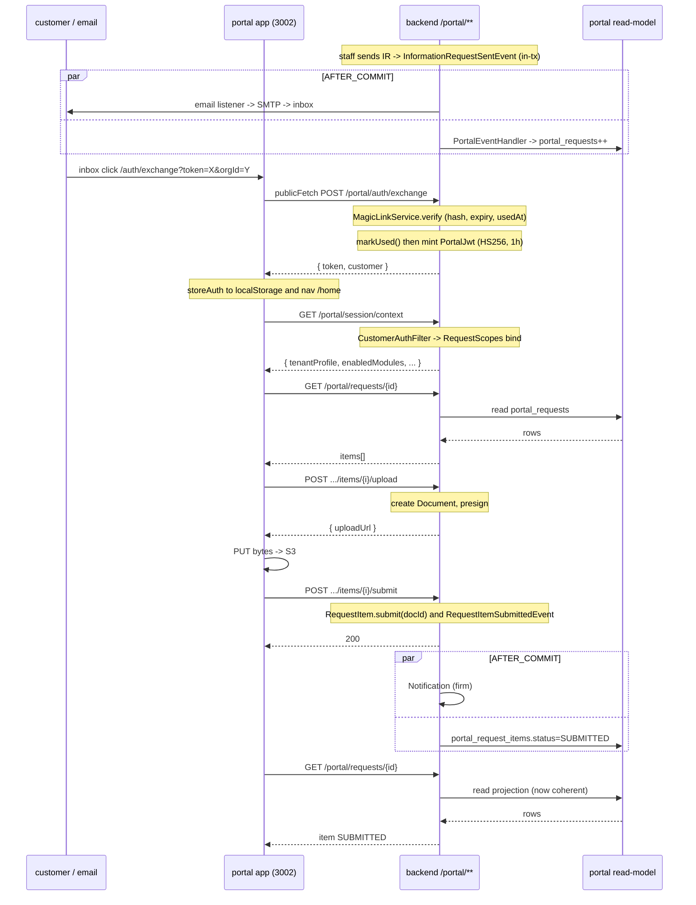

# Portal Magic-Link to Task Completion

**Status:** filled (Phase D part 2).
**Cross-links:** [`30-modules/customer-portal.md`](../30-modules/customer-portal.md), [`30-modules/information-requests.md`](../30-modules/information-requests.md), [`30-modules/proposals-acceptance.md`](../30-modules/proposals-acceptance.md), [`_discovery/A3-portal-gateway-map.md`](../_discovery/A3-portal-gateway-map.md).

## 1. What this flow shows

The end-customer's full portal journey — from the firm provisioning a `PortalContact`, through a magic-link email landing in the inbox, JWT exchange, session-context fetch, and a destructive action (information-request item upload + submit), to the read-model projection that lets the contact see their own submission instantly. Auth and action are stitched into one flow because the portal's value to a customer only materialises once the JWT is in `localStorage` and the read-model has caught up.

## 2. Cast

| Actor | Anchor |
|---|---|
| `PortalContact` | `→ backend/.../portal/PortalContact.java:16` |
| `MagicLinkToken` | `→ backend/.../portal/MagicLinkToken.java:19` |
| `MagicLinkService` (issue + verify) | `→ backend/.../portal/MagicLinkService.java:130` |
| `PortalAuthController` | `→ backend/.../portal/PortalAuthController.java:28-43` |
| `PortalJwtService` (HS256 mint/verify, 1h TTL) | ADR-077 `→ glossary.md:207` |
| `CustomerAuthFilter` (binds `RequestScopes.CUSTOMER_ID`, `PORTAL_CONTACT_ID`) | `→ _discovery/A1-backend-map.md:527` |
| `PortalContextController` (`GET /portal/session/context`) | `→ _discovery/A3-portal-gateway-map.md:131` |
| `PortalInformationRequestController` + `PortalInformationRequestService` | `→ backend/.../customerbackend/controller/PortalInformationRequestController.java:28`, `→ customerbackend/service/PortalInformationRequestService.java:48` |
| `PortalEventHandler` (read-model projector, `AFTER_COMMIT`) | `→ backend/.../customerbackend/handler/PortalEventHandler.java:127` |
| Portal read-model tables (`portal_requests`, `portal_request_items`, `portal_documents`, ...) | ADR-031, ADR-078 |
| Portal Next.js app (port 3002) | `→ _discovery/A3-portal-gateway-map.md:243-247` |
| Backend `/portal/**` filter chain (`@Order(1)`, `securityMatcher("/portal/**")`) | `SecurityConfig.java:79` |

## 3. Step-by-step

1. **Provision** — Staff opens `/org/[slug]/customers/[id]` Portal Contacts tab and creates a `PortalContact` (email + role + status=`ACTIVE`). Row written to `portal_contacts` (tenant schema). Auto-provisioning path also exists: `PortalContactAutoProvisioner` (`@EventListener`, in-flight) creates the contact when an outbound flow names a portal email `→ portal/PortalContactAutoProvisioner.java:42`.
2. **Triggering action** — Staff sends an `InformationRequest` (`POST /api/information-requests/{id}/send`) → `InformationRequestSentEvent` published in-tx. **Two `AFTER_COMMIT` listeners fire:** `InformationRequestEmailEventListener` issues the magic-link email; `PortalEventHandler` projects into `portal_requests` + `portal_request_items` `→ informationrequest/InformationRequestEmailEventListener.java:53`. Same shape applies for `AcceptanceRequestSentEvent` (separate `requestToken`, ADR-107) and `InvoiceSentEvent`.
3. **Fresh-link self-service** — Alternatively, the contact hits `/login`, types email + orgId, the page calls `POST /portal/auth/request-link` `→ A3-portal-gateway-map.md:63`. `MagicLinkService.requestLink(email, orgId, ip)` resolves the contact, generates a 32-byte random token via `SecureRandom`, persists `MagicLinkToken{ tokenHash=SHA-256(raw), expiresAt=now+~15m, createdIp }` `→ MagicLinkToken.java:13-16`, returns the raw token in the email body. Dev-mode response also leaks `magicLink` for QA `→ A3-portal-gateway-map.md:66`.
4. **Email click** — Customer clicks `https://portal.<host>/auth/exchange?token=<raw>&orgId=<org>`. The portal app's `auth/exchange/page.tsx:41` calls `publicFetch("POST /portal/auth/exchange", { token, orgId })`.
5. **Token exchange** — Backend `PortalAuthService.exchangeToken(token, orgId)`: SHA-256 hashes the raw token, looks up by hash (no tenant column on the row per ADR-030 — orgId is a redundant tenant check), validates `usedAt IS NULL AND expiresAt > now()`, calls `MagicLinkToken.markUsed()` `→ MagicLinkToken.java:55-57` (single-use), and mints the **portal JWT** via `PortalJwtService` (HS256, 1h TTL, claims: `org_id, customer_id, portal_contact_id, email`). Returns `{ token, customerId, customerName, email }` `→ PortalAuthController.java:37-43`.
6. **Client store** — `auth/exchange/page.tsx:63` calls `storeAuth(...)` → writes `portal_jwt`, `portal_customer`, `portal_last_org_id` into `localStorage` `→ portal/lib/auth.ts:52`. ADR-077: localStorage chosen over HttpOnly cookies given a read-mostly surface and 1h TTL. Page navigates to `/home`.
7. **Session context** — On `(authenticated)` layout mount, `useSyncExternalStore` confirms auth; `use-portal-context.ts:49` calls `GET /portal/session/context`. `CustomerAuthFilter` validates the bearer JWT and binds `RequestScopes` (`TENANT_ID, CUSTOMER_ID, PORTAL_CONTACT_ID`) `→ _discovery/A6-cross-cutting.md:27-29`. Response carries `tenantProfile, enabledModules, terminologyKey, brandColor, orgName, logoUrl` — drives `TerminologyProvider` and `filterNavItems()` `→ portal/lib/nav-items.ts:32-99`.
8. **Navigate to task** — Customer clicks "Information Requests" → `/requests/[id]/page.tsx:63` calls `GET /portal/requests/{id}` (read-model: `portal_requests` + `portal_request_items`). For each `FILE_UPLOAD` item the page picks a file, calls `POST /portal/requests/{id}/items/{itemId}/upload` → `PortalInformationRequestService` creates a `Document` row, generates a presigned S3 URL via `StorageService.generateUploadUrl(...)` (ADR-136), returns the URL `→ customerbackend/service/PortalInformationRequestService.java:84,152,179`. Browser PUTs file bytes directly to S3.
9. **Submit** — Customer clicks "Submit" → `POST /portal/requests/{id}/items/{itemId}/submit`. Service attaches `documentId` to the `RequestItem`, sets `status=SUBMITTED`, publishes `RequestItemSubmittedEvent` `→ informationrequest/InformationRequestService.java:666`.
10. **Read-model + notification fan-out** — `AFTER_COMMIT`: `PortalEventHandler` updates `portal_request_items` (item now visible as SUBMITTED to the customer); `InformationRequestNotificationEventListener` writes a `Notification` row for the firm reviewer + an audit log entry. The customer sees their own submission immediately on next list refresh because the read-model commit is in the same logical fan-out wave (ADR-031, ADR-078: visibility filtering at write time keeps drafts/internal data out of `portal_*` tables regardless).
11. **Logout / expiry** — Customer hits "Sign out" → `clearAuth()` wipes `portal_jwt`. Or: 1h JWT expires; next call returns 401; `lib/api-client.ts:30-34` clears storage and hard-navigates to `/login?redirectTo=...&orgId=<lastOrg>` (the `portal_last_org_id` key is intentionally retained for deep-link return per `lib/auth.ts:58`).

The same skeleton drives the other two destructive flows: `AcceptanceRequest` (token-gated, **pre-auth**, no JWT — ADR-107; lives at `/api/portal/acceptance/{token}`) and `Proposal` accept/decline (portal-session-authed, `POST /portal/api/proposals/{id}/accept`).

## 4. Sequence diagram

## 5. Failure modes

- **Token already used (replay)** — `markUsed()` is idempotent at the row level: a second exchange against the same hash sees `usedAt IS NOT NULL` and rejects. Service returns 401; portal shows "Link already used or expired" `→ MagicLinkToken.java:55-57`.
- **Token expired between send and click** — `MagicLinkToken.isExpired()` `→ MagicLinkToken.java:59` returns true, exchange rejects. `MagicLinkCleanupService` deletes expired rows hourly `→ _discovery/A6-cross-cutting.md:379`. Customer hits `/login` and requests a fresh link.
- **JWT expired mid-action** — Next `portalFetch` returns 401; client clears `portal_jwt` + hard-navigates to `/login?redirectTo=<current>&orgId=<lastOrg>` `→ portal/lib/api-client.ts:30-34`. After re-auth the redirect resumes the action — but any in-flight upload state in component memory is lost; the customer re-picks the file. (Presigned S3 URL itself is independent of the JWT.)
- **PortalContact suspended after JWT issued** — Staff flips `status=SUSPENDED`. The existing JWT remains valid for the rest of its 1h TTL — there is no JWT denylist or `invalidated_at` check in `CustomerAuthFilter`. **Open question** on `customer-portal.md` §"Open questions" #3: 1h TTL is the de-facto revocation mechanism. Acceptable for most tenants; called out for legal/financial verticals where a sharper boundary may be needed.
- **Customer offboarded mid-session** — Same shape as suspension: staff sets `status=ARCHIVED`; existing JWT keeps working until expiry. New `request-link` calls fail (contact lookup misses on `status=ACTIVE`). The 1h TTL caps blast radius.
- **Read-model sync handler exception** — `PortalEventHandler` runs `AFTER_COMMIT`; an exception there does **not** roll back the source transaction (it cannot — already committed). Result: divergent row (e.g. `RequestItem` says SUBMITTED, `portal_request_items` still PENDING). `PortalResyncController` is the manual repair path `→ customerbackend/controller/PortalResyncController.java`. Tracked as `customer-portal.md` §"Open questions" #4.

## 6. Vertical overlays

- **Module gates on portal nav.** `lib/nav-items.ts:32-99` declares `profiles?: string[]` and `modules?: string[]` per nav entry. `filterNavItems()` runs against `PortalSessionContext.enabledModules`. Trust, Retainer, Deadlines are **profile-gated** (`legal-za, accounting-za, consulting-za` subsets); Information Requests and Document Acceptance are **module-gated** (`information_requests`, `acceptance` slugs). Pages re-check at render and `router.replace("/home")` on miss.
- **Backend is the source of truth for module gating.** Disabled module → 404, not 403 (the module's existence is hidden from the portal) `→ _discovery/A6-cross-cutting.md:245`.
- **Terminology mirror.** `portal/lib/terminology-map.ts` is **duplicated** from `frontend/lib/terminology-map.ts` because the portal is a separate Next.js bundle `→ _discovery/A6-cross-cutting.md:218-220`. Backend exposes only `terminologyKey`; the resolved labels live in the frontend bundle. Information Request keeps its label across all profiles (it is a module gate, not a terminology overlay).
- **Branding-per-tenant pre-auth.** Login page reads `GET /portal/branding?orgId=...` (no JWT) so the firm's logo/colour render before authentication (ADR-079).

## 7. Cross-links

- Modules: [`customer-portal.md`](../30-modules/customer-portal.md) (auth + read-model owner), [`information-requests.md`](../30-modules/information-requests.md) (the worked example), [`proposals-acceptance.md`](../30-modules/proposals-acceptance.md) (sibling pre-auth `AcceptanceRequest`), [`documents-templates.md`](../30-modules/documents-templates.md) (presigned S3 upload — ADR-136).
- Discovery: [`A3-portal-gateway-map.md`](../_discovery/A3-portal-gateway-map.md) §3 (auth flow), §4 (endpoints), §11 (portal-vs-gateway trust boundary).
- Glossary: `Magic Link` `→ glossary.md:166`, `Portal Contact` `→ glossary.md:205`, `Portal JWT` `→ glossary.md:207`, `Tenant Profile` `→ glossary.md:266`.
- ADRs: **ADR-T005** (magic-links-over-customer-accounts; template-level rationale), **ADR-030** (DB-backed `MagicLinkToken` over Caffeine MVP), **ADR-031** (separate portal read-model schema), **ADR-077** (portal JWT in localStorage, 1h TTL), **ADR-078** (read-model extension; visibility filter at sync time).
- Adjacent flows: [`customer-onboarding-and-kyc.md`](customer-onboarding-and-kyc.md) (load-bearing example: FICA pack → portal upload), [`proposal-to-engagement-to-billing.md`](proposal-to-engagement-to-billing.md) (acceptance variant of this flow).
