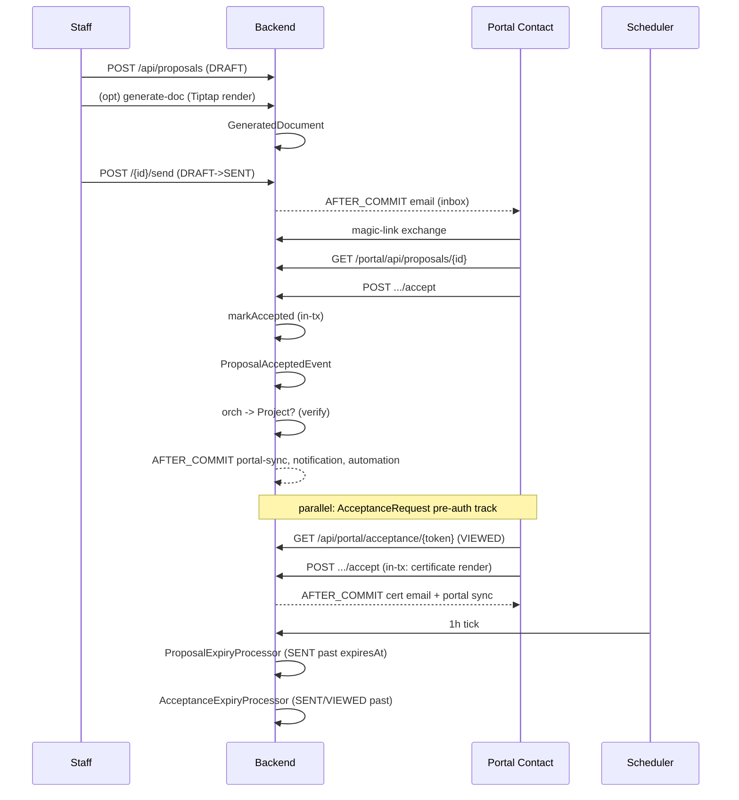

# Proposal to Engagement to Billing

## What this flow shows

Proposal-to-cash with portal-side acceptance signing: staff drafts a `Proposal` (with `FeeModel` and `expiresAt`), the customer reviews and accepts via the portal, downstream orchestration optionally creates a `Project`, and the project's billing path produces invoices either up-front (fixed-fee) or on a periodic billing run (time-based). A standalone `AcceptanceRequest` (token-gated, pre-auth) can wrap **any** `GeneratedDocument` — not just proposal output — producing an immutable Certificate of Acceptance (ADR-108).

UI label: "Engagement Letter" in `accounting-za` and `legal-za` `→ frontend/lib/terminology-map.ts:29`. Backend always says `Proposal`.

## Cast

- `Proposal` `→ backend/src/main/java/io/b2mash/b2b/b2bstrawman/proposal/Proposal.java:31`
- `AcceptanceRequest` `→ backend/src/main/java/io/b2mash/b2b/b2bstrawman/acceptance/AcceptanceRequest.java:22`
- `GeneratedDocument` `→ backend/src/main/java/io/b2mash/b2b/b2bstrawman/template/GeneratedDocument.java:22`
- `Project` `→ backend/src/main/java/io/b2mash/b2b/b2bstrawman/project/Project.java:24`
- `Invoice` `→ backend/src/main/java/io/b2mash/b2b/b2bstrawman/invoice/Invoice.java:24`
- `PortalContact` `→ backend/src/main/java/io/b2mash/b2b/b2bstrawman/portal/PortalContact.java:16`

## Step-by-step

1. **Staff drafts `Proposal` (DRAFT)** — `POST /api/proposals` (capability `INVOICING`) creates with `customerId`, `portalContactId`, `feeModel ∈ {FIXED, HOURLY, RETAINER, CONTINGENCY}` `→ FeeModel.java:4`, `expiresAt`, Tiptap `content` (ADR-124). Status `DRAFT` `→ ProposalStatus.java:4`. Per-tenant number from `ProposalCounter` (ADR-128).
2. **(Optional) Generate proposal document from a Tiptap template** — `POST /api/document-templates/{id}/generate` runs `DocumentGenerationService` against `(primaryEntityType=PROPOSAL, primaryEntityId)` → `GeneratedDocument` (S3 object) + `DocumentGeneratedEvent`. Snapshot semantics per ADR-068.
3. **Send (DRAFT→SENT)** — `POST /api/proposals/{id}/send` transitions status, audit-logs in-transaction, then emits `ProposalSentEvent`. `ProposalSentEmailHandler` runs **AFTER_COMMIT** to email the `PortalContact` (per `_discovery/A6-cross-cutting.md` §6 universal pattern).
4. **Customer arrives via portal magic link** → exchanges token at `MagicLinkService` `→ portal/MagicLinkService.java:130`, lands on `/portal/proposals/[id]` `→ portal/app/proposals/[id]/page.tsx:68`. (Proposal portal surface uses portal session + id, **not** a pre-auth token; see ADR-107 §Rationale for the asymmetry with `AcceptanceRequest`.)
5. **Accept or decline** — `POST /portal/api/proposals/{id}/accept` → `markAccepted` → `ProposalAcceptedEvent`; or `/decline` → `markDeclined` → `ProposalDeclinedEvent`. Both transitions are terminal (`TERMINAL_STATUSES = {ACCEPTED, DECLINED, EXPIRED}` `→ Proposal.java:33`).
6. **Optional: Project auto-creation** — `ProposalOrchestrationService` `→ backend/.../proposal/ProposalOrchestrationService.java` is the obvious convertor candidate; failure path emits `ProposalOrchestrationFailedEvent` (ADR-125 governs the transactional boundary). **Verify** — `glossary.md:272` lists `PROPOSAL_SENT` and `DOCUMENT_ACCEPTED` triggers but **not** `PROPOSAL_ACCEPTED`, so conversion may run via the rule engine rather than hard-coded. See `30-modules/proposals-acceptance.md` §Open questions.
7. **Project active** — `Project` rows feed time/expense/task entry; downstream economics flow into `50-flows/matter-to-cash.md`.
8. **Billing**:
   - **Fixed-fee proposals** (`FeeModel.FIXED`): an invoice may be drafted up-front from `Proposal.fixedFeeAmount` `→ Proposal.java:60`, lines as `InvoiceLineType.FIXED_FEE` `→ invoice/InvoiceLineType.java:4`.
   - **Time-based** (`HOURLY` / `RETAINER`): periodic `BillingRun` consumes unbilled time entries; retainer flow per `30-modules/retainers.md` (ADR-074).
9. **Standalone `AcceptanceRequest`** — `POST /api/acceptance-requests` (or via automation action) wraps any `GeneratedDocument` whose template manifest sets the acceptance-eligible flag (ADR-251). Distinct enum `AcceptanceStatus` `→ AcceptanceStatus.java:4` (`PENDING/SENT/VIEWED/ACCEPTED/EXPIRED/REVOKED`). The portal entry is **pre-auth and token-gated** (ADR-107) — `portal/app/accept/[token]/acceptance-page.tsx`.
10. **On acceptance** — `POST /api/portal/acceptance/{token}/accept` → `AcceptanceService` records the proof bundle (acceptorName, IP, user-agent), in-transaction `AcceptanceCertificateService` downloads the original PDF, computes its SHA-256, renders `templates/certificates/certificate-of-acceptance.html`, writes `certificateS3Key` (ADR-108: original PDF immutable). Transaction commits, then `AcceptanceRequestAcceptedEvent` fires AFTER_COMMIT (ADR-125) for email + portal sync.
11. **Expiry processors** — both `@Scheduled fixedDelay = 1h`, both `TenantScopedRunner.forEachTenant`:
    - `ProposalExpiryProcessor#processExpired` `→ ProposalExpiryProcessor.java:25` reaps SENT proposals → `ProposalExpiredEvent`.
    - `AcceptanceExpiryProcessor#processExpired` `→ AcceptanceExpiryProcessor.java:14` reaps SENT/VIEWED requests → `AcceptanceRequestExpiredEvent`.

## Sequence diagram

## Failure modes

- **Token reuse / replay** — `AcceptanceRequest.requestToken` is 256 bits, unique-indexed (ADR-107 §Consequences). Token authenticates the single accept action only; sharing the URL grants acceptance to whoever clicks (documented + accepted, ADR-107 §Negative). Rate limiting on the lookup endpoint is called for. The `MagicLinkToken` track is single-use (`markUsed()` `→ MagicLinkToken.java:55`) — replay after `usedAt` is set fails the `usedAt IS NULL AND expiresAt > now()` guard.
- **Customer accepts after expiry (race)** — both expiry processors run on a 1h `fixedDelay`, generous by design (no minute-level SLA). A customer can in principle POST `/accept` between the scheduler tick and the email-link click; the entity-side terminal-status guard (`Proposal.markAccepted` rejects from EXPIRED; `AcceptanceRequest` equivalent) is the defence. Hourly cadence means the post-expiry click window is bounded but non-zero.
- **Email delivery failure on send** — `ProposalSentEmailHandler` runs AFTER_COMMIT, so a rolled-back send does not produce an email (universal AFTER_COMMIT rationale, A6 §6). The reverse — committed send + failed SMTP — is observable via the notification module's audit trail; staff can re-send via `POST /api/proposals/{id}/send` (idempotent on the SENT row's portal-sync handler; the email path is best-effort).
- **Two expiry processors run independently — ordering observation** — there is no defined ordering (`_discovery/A1-backend-map.md:492-493`). If a proposal's acceptance request has a tighter window than the proposal itself, the AR expires first and the proposal stays SENT until its own processor fires. The reverse — proposal EXPIRED while the AR is still SENT/VIEWED — does **not** today cascade-revoke the AR (each processor only updates its own aggregate). Flagged for product clarification — see `30-modules/proposals-acceptance.md` §Open questions.

## Vertical overlays

- **`legal-za`** — UI rename `Proposal → Engagement Letter` `→ frontend/lib/terminology-map.ts:57`. SLP-style retainer agreements may attach as a generated document under the `RETAINER` fee model; `FeeModel.CONTINGENCY` carries LPC Rule 59 / Contingency Fees Act 66 of 1997 fields `→ Proposal.java:80-89` — universally available enum value, but compliance shape only fits this vertical. Project surfaces as **Matter** in UI `→ glossary.md:215`.
- **`accounting-za`** — UI rename `Proposal → Engagement Letter` `→ frontend/lib/terminology-map.ts:29`. Project surfaces as **Engagement** `→ glossary.md:119`. Period-close awareness: invoices and payments produced from this flow are subject to `30-modules/trust-accounting.md` egress rules and the Xero one-way sync (ADR-272/ADR-273) — proposal acceptance itself does **not** push to Xero; the downstream `Invoice.APPROVED → SENT` is what drives sync.

## Cross-links

- Module: [`30-modules/proposals-acceptance.md`](../30-modules/proposals-acceptance.md) — entities, REST surface, Open Questions (auto-conversion semantics).
- Module: [`30-modules/projects.md`](../30-modules/projects.md) — `Project` lifecycle continuation.
- Module: [`30-modules/invoicing.md`](../30-modules/invoicing.md) — `Invoice` issuance, `InvoiceLineType.FIXED_FEE`, billing runs.
- Module: [`30-modules/documents-templates.md`](../30-modules/documents-templates.md) — `DocumentGenerationService`, `GeneratedDocument` snapshots.
- Module: [`30-modules/customer-portal.md`](../30-modules/customer-portal.md) — magic-link auth, `PortalContact` provisioning.
- Flow: [`50-flows/matter-to-cash.md`](matter-to-cash.md) — downstream of step 7.
- Flow: [`50-flows/portal-magic-link-to-task-completion.md`](portal-magic-link-to-task-completion.md) — sibling pre-auth/portal-session pattern.
- ADRs: ADR-107 (token strategy), ADR-108 (certificate immutability), ADR-124, ADR-125, ADR-127, ADR-128, ADR-129, ADR-251 — `90-adr-index.md`.
