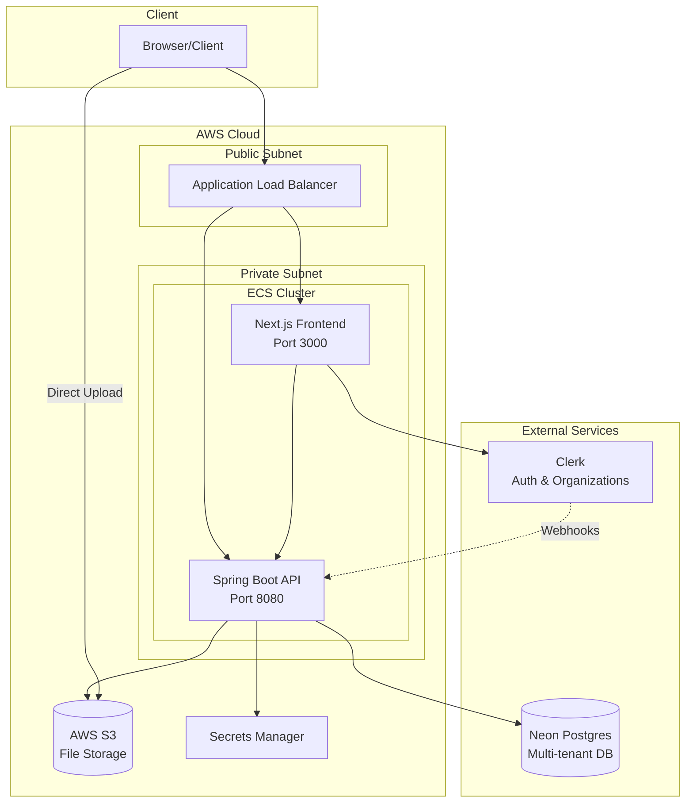
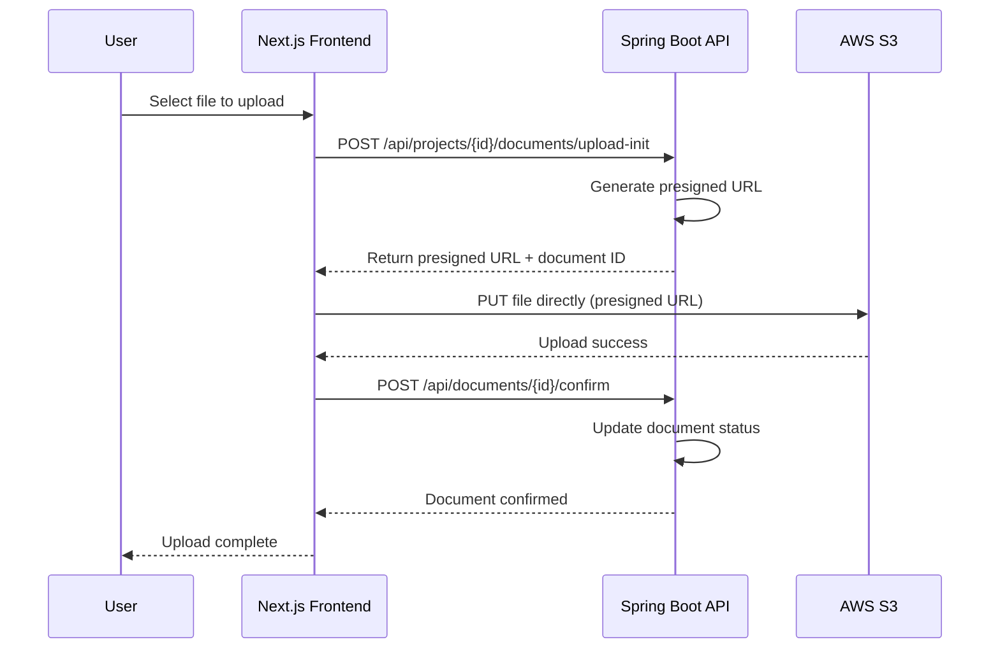
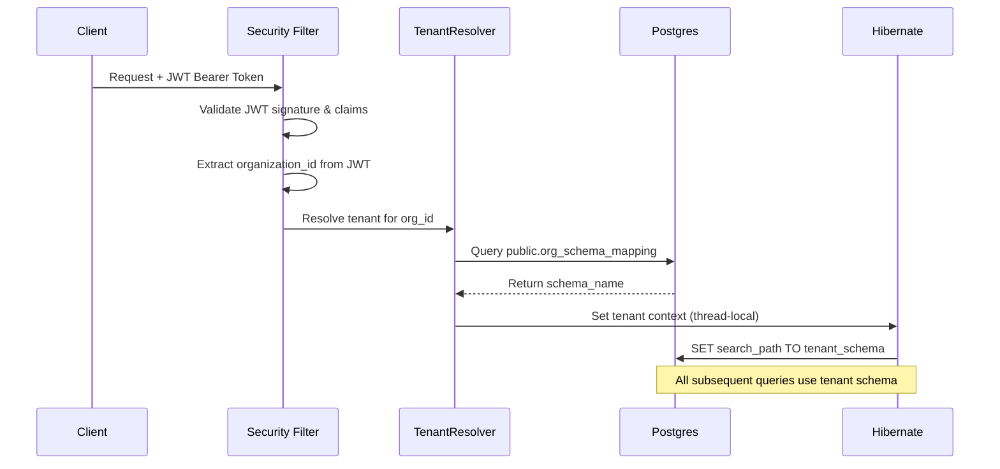
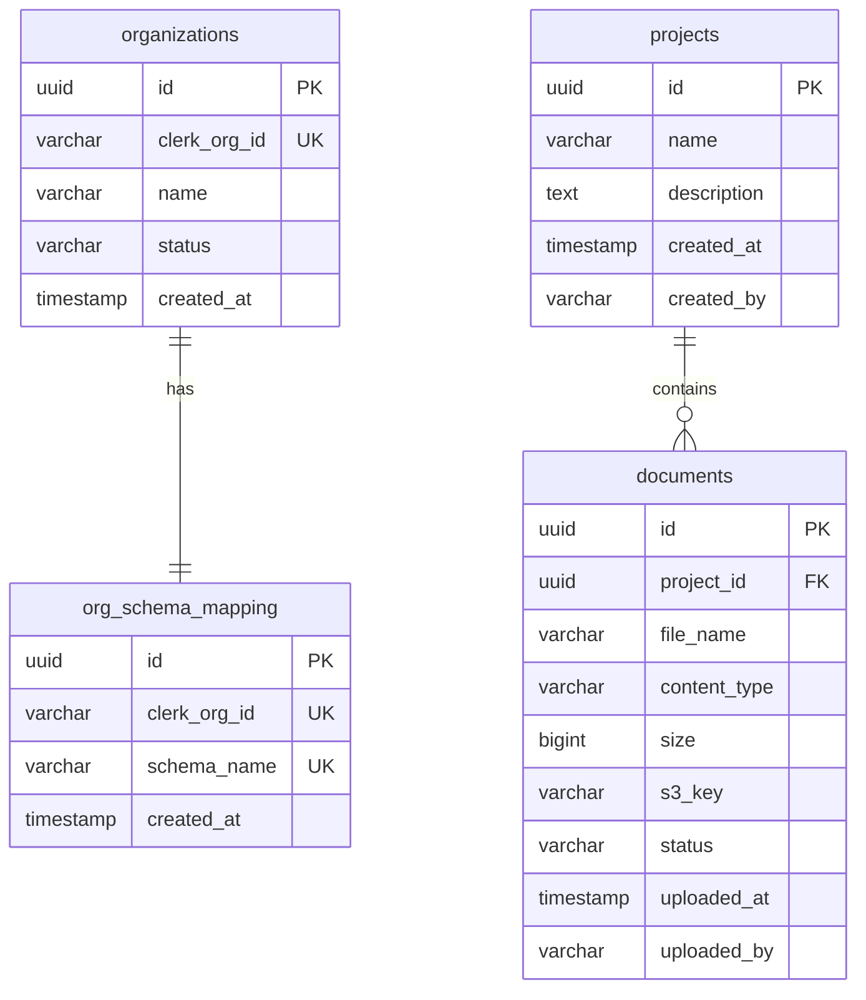
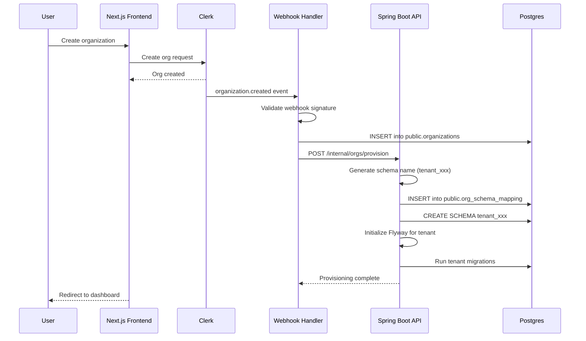
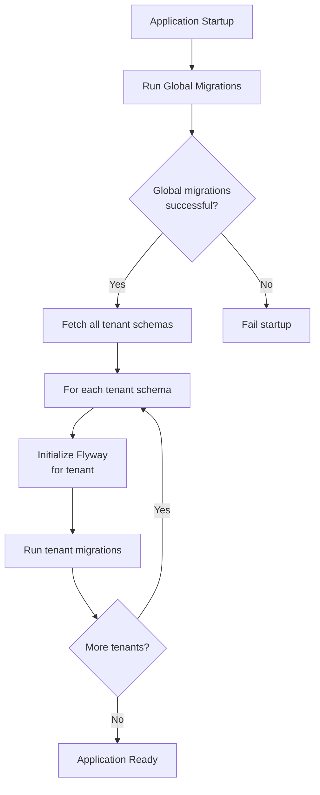
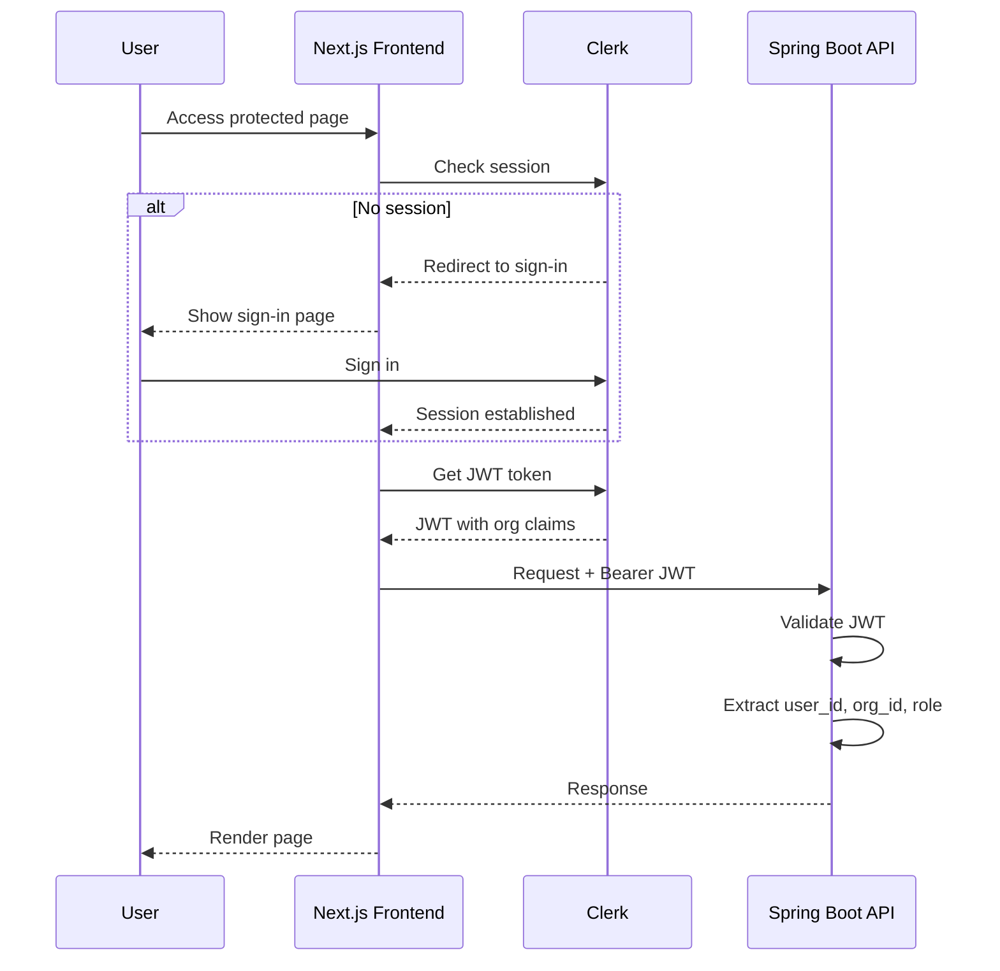
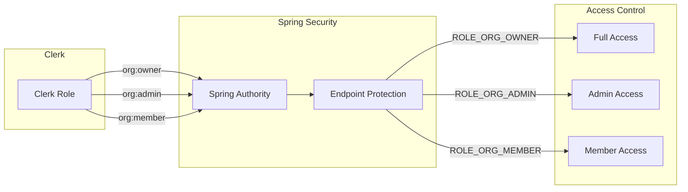
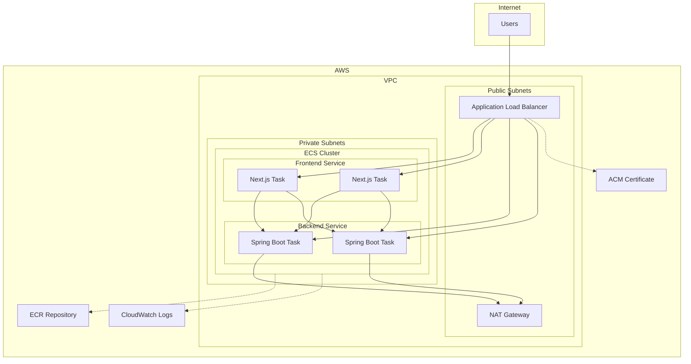
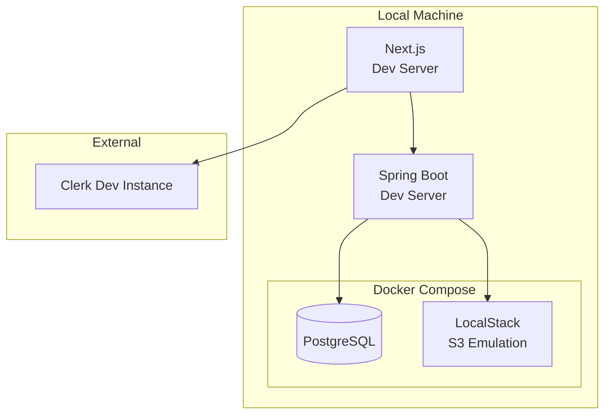

# Multi-tenant SaaS Starter – Technical Specification

## 1. Overview

### 1.1 Purpose
A reusable SaaS starter platform supporting multi-tenant B2B products with schema-per-tenant isolation.

### 1.2 Strawman Product: DocTeams
A team-based document hub where organizations manage projects and upload documents.

### 1.3 Technology Stack

| Layer | Technology |
|-------|------------|
| Frontend | Next.js (App Router), TypeScript, Tailwind CSS, Shadcn UI |
| Authentication | Clerk (auth, organizations, invitations, RBAC) |
| Backend | Spring Boot 4, Java 25, REST API |
| Database | Neon Postgres (single DB, schema-per-tenant) |
| File Storage | AWS S3 (prefix-based partitioning per org) |
| Deployment | AWS ECS/Fargate, Application Load Balancer |

---

## 2. Functional Requirements

### 2.1 Tenants and Organizations
- Each tenant = one Clerk Organization
- Organization creator assigned admin/owner role
- Users can:
  - Create an organization during onboarding
  - Switch between organizations in UI
  - View only data belonging to active organization

### 2.2 Onboarding Flow
1. User signs up/signs in via Clerk
2. User creates a new organization
3. Clerk emits `organization.created` webhook event
4. Webhook handler:
   - Persists org metadata in `public.organizations` table
   - Calls Spring Boot `/internal/orgs/provision` to create tenant schema
5. User lands in org-scoped dashboard

### 2.3 User Invitations and Membership
- Org admins/owners can:
  - Invite users by email with role assignment (owner, admin, member)
  - View pending invitations and current members
- Clerk manages all user accounts and memberships
- Webhook events consumed for membership changes

### 2.4 Core Product Features (DocTeams)

#### Projects
- CRUD operations within an organization
- List all projects for active organization

#### Documents
- Upload via S3 presigned URLs
- Metadata stored in tenant schema (project, filename, size, content type, uploader, S3 key, status)
- List documents per project
- Generate presigned download URLs

#### Dashboard UX
- Organization switcher (Clerk)
- Projects list
- Project detail with documents
- Team management (invitations, members)

### 2.5 RBAC and Permissions

| Role | Permissions |
|------|-------------|
| Owner | Full control: org settings, projects, members, deletion |
| Admin | Manage projects and settings |
| Member | Read projects, upload/view documents |

- Clerk org roles are the primary RBAC source
- Backend maps Clerk roles to Spring Security authorities

---

## 3. Architecture Requirements

### 3.1 High-Level Architecture



### 3.2 Frontend Architecture (Next.js)

#### Authentication
- Clerk Next.js SDK for auth, session management, org switching
- Components: sign-in, sign-up, org creation, org switcher, invitations, team management

#### Data Access
- Server components/actions call Spring Boot API
- Each request includes:
  - Clerk JWT (Bearer token) with org claims
  - Active `organization_id`

#### S3 Upload Flow



### 3.3 Backend Architecture (Spring Boot)

#### REST API Endpoints

| Endpoint | Method | Purpose |
|----------|--------|---------|
| `/api/projects` | GET | List projects for org |
| `/api/projects` | POST | Create project |
| `/api/projects/{id}` | GET | Get project details |
| `/api/projects/{id}` | PUT | Update project |
| `/api/projects/{id}` | DELETE | Delete project |
| `/api/projects/{id}/documents` | GET | List documents |
| `/api/projects/{id}/documents/upload-init` | POST | Get presigned upload URL |
| `/api/documents/{id}/presign-download` | GET | Get presigned download URL |
| `/internal/orgs/provision` | POST | Provision tenant schema |

#### Multitenancy Implementation
- Hibernate multitenancy with `SCHEMA` strategy
- `CurrentTenantIdentifierResolver`: resolves tenant from authenticated request
- `MultiTenantConnectionProvider`: sets `search_path` per request

#### Tenant Resolution Flow



#### S3 Integration
- AWS SDK for presigned URL generation
- Key format: `org/{orgId}/project/{projectId}/{fileId}`

### 3.4 Database Design

#### Schema Overview



#### Global Schema (`public`)

**organizations**
| Column | Type | Constraints |
|--------|------|-------------|
| id | UUID | PK |
| clerk_org_id | VARCHAR | UNIQUE, NOT NULL |
| name | VARCHAR | NOT NULL |
| status | VARCHAR | NOT NULL |
| created_at | TIMESTAMP | NOT NULL |

**org_schema_mapping**
| Column | Type | Constraints |
|--------|------|-------------|
| id | UUID | PK |
| clerk_org_id | VARCHAR | UNIQUE, FK → organizations.clerk_org_id |
| schema_name | VARCHAR | UNIQUE, NOT NULL |
| created_at | TIMESTAMP | NOT NULL |

#### Tenant Schema (e.g., `tenant_abc123`)

**projects**
| Column | Type | Constraints |
|--------|------|-------------|
| id | UUID | PK |
| name | VARCHAR | NOT NULL |
| description | TEXT | |
| created_at | TIMESTAMP | NOT NULL |
| created_by | VARCHAR | NOT NULL (Clerk user ID) |

**documents**
| Column | Type | Constraints |
|--------|------|-------------|
| id | UUID | PK |
| project_id | UUID | FK → projects.id, NOT NULL |
| file_name | VARCHAR | NOT NULL |
| content_type | VARCHAR | NOT NULL |
| size | BIGINT | NOT NULL |
| s3_key | VARCHAR | NOT NULL |
| status | VARCHAR | NOT NULL |
| uploaded_at | TIMESTAMP | NOT NULL |
| uploaded_by | VARCHAR | NOT NULL (Clerk user ID) |

---

## 4. Provisioning Flow

### 4.1 Organization Creation & Schema Provisioning



### 4.2 Schema Provisioning Details (Flyway)
1. Generate unique schema name (e.g., `tenant_<short_hash>`)
2. Persist mapping in `public.org_schema_mapping`
3. Execute `CREATE SCHEMA IF NOT EXISTS <schema_name>`
4. Instantiate Flyway with:
   - `defaultSchema` = new tenant schema
   - Migration location: `db/migration/tenant`
5. Run `flyway.migrate()`

### 4.3 Migration Strategy

| Location | Applied When | Target |
|----------|--------------|--------|
| `db/migration/global` | App startup | `public` schema |
| `db/migration/tenant` | Org provisioning + App startup | Tenant schemas |

**Existing tenant migration**: On app startup/deployment, iterate all tenant schemas and apply pending migrations.



### 4.4 Clerk Webhook Events

The system should handle all relevant Clerk webhook events. **Architect to research best practices for:**
- Which events to handle
- Idempotency strategies
- Retry/failure handling
- Event ordering concerns

Events to consider:

| Event | Purpose |
|-------|---------|
| `organization.created` | Trigger tenant provisioning |
| `organization.updated` | Sync org metadata |
| `organization.deleted` | (Future) Tenant cleanup |
| `organizationMembership.created` | Mirror member data |
| `organizationMembership.updated` | Sync role changes |
| `organizationMembership.deleted` | Remove member mirror |
| `organizationInvitation.created` | Track pending invites |
| `organizationInvitation.accepted` | Update invite status |
| `organizationInvitation.revoked` | Remove pending invite |

---

## 5. Security Requirements

### 5.1 Authentication Flow



### 5.2 Authentication Details
- Clerk handles all user authentication
- Frontend obtains JWTs from Clerk
- Spring Boot validates:
  - JWT signature and issuer
  - Token expiration and audience
  - Extracts: user ID, organization_id, org role

### 5.3 Authorization (RBAC)

Map Clerk roles to Spring authorities:

| Clerk Role | Spring Authority |
|------------|------------------|
| `org:owner` | `ROLE_ORG_OWNER` |
| `org:admin` | `ROLE_ORG_ADMIN` |
| `org:member` | `ROLE_ORG_MEMBER` |



### 5.4 Tenant Isolation
- Tenant determined **only** from validated JWT's `organization_id`
- Client headers (e.g., `X-Org-Id`) are hints only, never trusted
- All queries execute under correct tenant schema
- No cross-schema joins between tenants
- Logging includes tenant identifier for auditing

### 5.5 Internal API Security

**Architect decision required**: How to secure `/internal/orgs/provision`

Options to evaluate:
- API key authentication
- VPC-only access (no public exposure)
- Mutual TLS
- Combination approach

Must prevent unauthorized schema creation.

### 5.6 Secrets Management

All secrets stored in AWS Secrets Manager or SSM Parameter Store:
- Neon connection string
- Clerk API keys (publishable + secret)
- AWS credentials for S3
- Internal API keys (if used)
- Webhook signing secrets

---

## 6. S3 File Storage

### 6.1 Bucket Strategy
- Separate bucket per environment (dev, staging, prod)
- Prefix-based partitioning within bucket

### 6.2 Key Structure

```
{bucket-name}/
├── org/
│   ├── {orgId-1}/
│   │   ├── project/
│   │   │   ├── {projectId-1}/
│   │   │   │   ├── {fileId-1}
│   │   │   │   └── {fileId-2}
│   │   │   └── {projectId-2}/
│   │   │       └── {fileId-3}
│   └── {orgId-2}/
│       └── project/
│           └── ...
```

### 6.3 Bucket Naming Convention
`{app-name}-{environment}` (e.g., `docteams-prod`, `docteams-staging`, `docteams-dev`)

### 6.4 Access Control
- All access via presigned URLs
- No direct public access
- URLs scoped to specific keys with expiration
- Separate IAM policies per environment

---

## 7. Containerization & Deployment

### 7.1 Container Images

| Service | Base Image | Port | Notes |
|---------|------------|------|-------|
| Next.js Frontend | node:20-alpine | 3000 | SSR via `next start` |
| Spring Boot Backend | eclipse-temurin:25-jre-alpine | 8080 | Layered JAR, optimized startup |

- Multi-stage Dockerfile builds
- Minimal base images
- Non-root users

### 7.2 AWS ECS/Fargate Architecture



### 7.3 Deployment Configuration

- ECS cluster with Fargate launch type
- Separate task definitions for frontend and backend
- Application Load Balancer with SSL termination (ACM)
- Services in private subnets; ALB in public subnets
- Security groups: least privilege

### 7.4 Environment Variables

| Variable | Service | Description |
|----------|---------|-------------|
| `DATABASE_URL` | Backend | Neon connection string |
| `CLERK_SECRET_KEY` | Backend | Clerk secret key |
| `CLERK_PUBLISHABLE_KEY` | Frontend | Clerk publishable key |
| `AWS_S3_BUCKET` | Backend | S3 bucket name |
| `AWS_REGION` | Both | AWS region |
| `INTERNAL_API_KEY` | Both | Internal API authentication |

### 7.5 Scaling
- ECS Service Auto Scaling (CPU/memory metrics)
- Fargate manages compute
- Minimum 2 tasks per service for high availability

---

## 8. Local Development

### 8.1 Requirements

Local development environment must support:
- Local Postgres (Docker) instead of Neon
- LocalStack for S3 emulation
- Clerk development instance

### 8.2 Local Architecture



### 8.3 Docker Compose Services

```yaml
# Expected services in docker-compose.yml
services:
  postgres:
    image: postgres:16
    ports:
      - "5432:5432"
    environment:
      POSTGRES_DB: docteams
      POSTGRES_USER: postgres
      POSTGRES_PASSWORD: postgres

  localstack:
    image: localstack/localstack
    ports:
      - "4566:4566"
    environment:
      SERVICES: s3
```

### 8.4 Setup Expectations
- Docker Compose for local services
- Environment-specific configuration files (`.env.local`, `.env.development`)
- Seed data scripts for testing
- Documentation for local setup in README
- Scripts for common development tasks

---

## 9. Architect Decision Points

The following decisions must be made by the architect with justification based on best practices research:

| Decision | Options to Consider | Research Required |
|----------|---------------------|-------------------|
| Webhook handler location | Next.js API route vs Spring Boot endpoint | Clerk best practices, latency, security |
| Internal API security | API key, VPC-only, mutual TLS, combination | AWS security patterns |
| Frontend routing | Org-based URLs (`/org/[slug]/...`) vs session-only | UX patterns, deep linking, SEO |
| Clerk webhook event handling | Which events, idempotency, retry strategy | Clerk documentation, distributed systems patterns |
| Schema naming convention | Hash-based, sequential, org-slug-based | Uniqueness, readability, security |
| Connection pooling | HikariCP config, Neon-specific settings | Neon documentation, serverless DB patterns |

**Expectation**: Use sub-agents to research best practices for each technology before making decisions.

---

## 10. Out of Scope (MVP)

The following are explicitly out of scope for the initial implementation:

- Error recovery for failed provisioning
- Tenant deletion/archival
- Rate limiting
- Formal audit trail beyond logging
- Billing/subscription management
- Custom domains per tenant
- Data export functionality
- Advanced analytics/reporting

---

## 11. Glossary

| Term | Definition |
|------|------------|
| **Tenant** | A single customer organization using the platform. Each tenant's data is isolated in its own database schema. |
| **Schema-per-tenant** | A multitenancy strategy where each tenant has a dedicated database schema within a shared database, providing logical isolation without separate database instances. |
| **Clerk** | Third-party authentication and user management service that handles sign-up, sign-in, organizations, invitations, and RBAC. |
| **Organization** | A Clerk construct representing a tenant. Users belong to organizations and have roles within them. |
| **Neon** | Serverless Postgres database service used as the backing database. Provides automatic scaling and branching features. |
| **JWT (JSON Web Token)** | A compact, URL-safe token format used for securely transmitting claims between parties. Clerk issues JWTs containing user and organization information. |
| **Presigned URL** | A time-limited URL that grants temporary access to a specific S3 object for upload or download without requiring AWS credentials. |
| **Flyway** | Database migration tool that manages schema versioning and applies migrations in order. Used for both global and tenant schema migrations. |
| **RBAC (Role-Based Access Control)** | Authorization model where permissions are assigned to roles, and users are assigned roles. Clerk provides org-level roles (owner, admin, member). |
| **Spring Security Authority** | Spring's representation of a granted permission. Clerk roles are mapped to Spring authorities for endpoint protection. |
| **Hibernate Multitenancy** | Hibernate ORM feature supporting multiple tenants. Configured with SCHEMA strategy to route queries to the correct tenant schema. |
| **CurrentTenantIdentifierResolver** | Hibernate interface implementation that determines the current tenant identifier from the request context. |
| **MultiTenantConnectionProvider** | Hibernate interface implementation that provides database connections configured for the current tenant's schema. |
| **ECS (Elastic Container Service)** | AWS service for running containerized applications. Used with Fargate launch type for serverless container execution. |
| **Fargate** | AWS serverless compute engine for containers. Eliminates need to manage EC2 instances for ECS tasks. |
| **ALB (Application Load Balancer)** | AWS Layer 7 load balancer that routes HTTP/HTTPS traffic to ECS services based on path or host rules. |
| **ACM (AWS Certificate Manager)** | AWS service for provisioning and managing SSL/TLS certificates for HTTPS termination at the ALB. |
| **LocalStack** | Local AWS cloud emulator for development and testing. Used to emulate S3 locally without AWS charges. |
| **Webhook** | HTTP callback triggered by an event in an external system (Clerk). Used to synchronize data and trigger provisioning. |
| **Idempotency** | Property where an operation produces the same result regardless of how many times it's executed. Critical for webhook handlers that may receive duplicate events. |
| **search_path** | PostgreSQL session variable that determines which schemas are searched when resolving unqualified table names. Set per-request to the tenant's schema. |
| **Shadcn UI** | A collection of reusable React components built with Radix UI and Tailwind CSS. Not a component library but a set of copy-paste components. |
| **App Router** | Next.js 13+ routing system using the `app/` directory with React Server Components, layouts, and server actions. |
| **Server Components** | React components that render on the server, reducing client-side JavaScript. Used in Next.js App Router for data fetching. |
| **Server Actions** | Next.js feature allowing server-side functions to be called directly from client components, simplifying form handling and mutations. |

---

## 12. Document Revision History

| Version | Date | Description |
|---------|------|-------------|
| 1.0 | 2025-02-04 | Initial specification |
