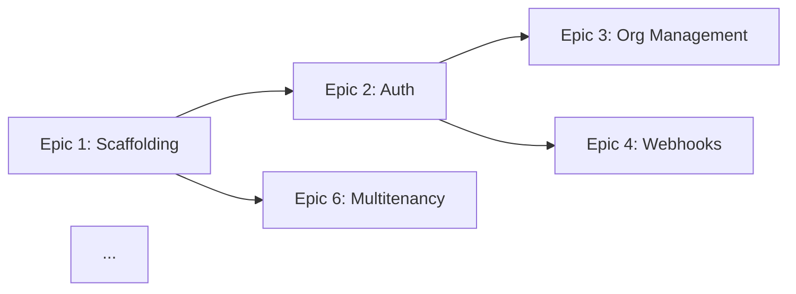

# Claude Code Prompt: Multi-tenant SaaS Starter Architecture & Task Breakdown

## Instructions for Claude Code

You are a senior technical architect. Your task is to read the attached specification document and produce:

1. **A detailed technical architecture document** with justified decisions
2. **A comprehensive technical task breakdown** suitable for implementation

---

## Critical Constraints

### Context Management
- **Your context window must not exceed 50% utilization**
- **Use sub-agents for ALL research tasks** - do not attempt to research directly
- When you need to research best practices for any technology (Clerk, Neon, Spring Boot, Next.js, Flyway, AWS, etc.), spawn a sub-agent with a focused research query
- Summarize sub-agent findings concisely before incorporating into your architecture

### Sub-Agent Usage Pattern
When you need to research a topic, use this pattern:

```
Task for sub-agent: Research [specific topic]
- Question 1: [specific question]
- Question 2: [specific question]
- Return: Summary of findings with sources/references
```

Example research topics requiring sub-agents:
- Clerk webhook best practices and idempotency patterns
- Neon Postgres connection pooling for serverless
- Spring Boot 4 + Hibernate schema-per-tenant multitenancy configuration
- Next.js App Router patterns for multi-tenant SaaS
- Flyway runtime schema provisioning patterns
- AWS ECS/Fargate security best practices

---

## Deliverable 1: Technical Architecture Document

Produce a markdown document (`ARCHITECTURE.md`) containing:

### 1.1 Architecture Decisions Record (ADR)
For each decision point listed in Section 9 of the spec, provide:

```markdown
### ADR-{number}: {Decision Title}

**Status**: Accepted

**Context**: {Why this decision is needed}

**Options Considered**:
1. {Option A} - {Pros/Cons}
2. {Option B} - {Pros/Cons}
3. {Option C} - {Pros/Cons}

**Decision**: {Chosen option}

**Rationale**: {Why this option was chosen, referencing research findings}

**Consequences**: {Impact of this decision}
```

Required ADRs:
- ADR-001: Webhook Handler Location
- ADR-002: Internal API Security
- ADR-003: Frontend Routing Strategy
- ADR-004: Clerk Webhook Event Handling Strategy
- ADR-005: Schema Naming Convention
- ADR-006: Database Connection Pooling Strategy
- ADR-007: Error Handling and Resilience Patterns
- ADR-008: Logging and Observability Strategy

### 1.2 Component Architecture
For each major component, document:
- Responsibilities
- Dependencies
- Interfaces (API contracts)
- Configuration requirements

Components to cover:
- Next.js Frontend
- Spring Boot Backend
- Tenant Provisioning Service
- Webhook Handler
- S3 Integration Layer

### 1.3 Sequence Diagrams (Mermaid)
Create detailed sequence diagrams for:
- Complete user onboarding flow (sign-up → org creation → schema provisioning → dashboard)
- Document upload flow (including error scenarios)
- Organization switching flow
- Invitation acceptance flow

### 1.4 Data Flow Diagrams (Mermaid)
Show data flow for:
- Authentication token flow (Clerk → Frontend → Backend)
- Tenant resolution flow
- File upload/download flow

### 1.5 Security Architecture
Document:
- Authentication flow details
- Authorization enforcement points
- Tenant isolation verification
- Secret management approach
- Internal API security implementation

### 1.6 Infrastructure Architecture
Expand on:
- AWS resource topology
- Network security (VPC, security groups, NACLs)
- CI/CD pipeline design
- Environment strategy (dev, staging, prod)

---

## Deliverable 2: Technical Task Breakdown

Produce a markdown document (`TASKS.md`) containing:

### 2.1 Epic Structure
Organize tasks into epics:

```markdown
## Epic {N}: {Epic Name}

**Goal**: {What this epic achieves}
**Dependencies**: {Other epics that must complete first}
**Estimated Effort**: {T-shirt size: S/M/L/XL}

### Tasks

| ID | Task | Description | Acceptance Criteria | Estimate | Dependencies |
|----|------|-------------|---------------------|----------|--------------|
| {Epic}.{N} | {Name} | {Details} | {Criteria} | {Hours} | {Task IDs} |
```

### 2.2 Required Epics

**Epic 1: Project Scaffolding & Local Development**
- Repository setup (monorepo or separate repos - decide and justify)
- Next.js project initialization with TypeScript, Tailwind, Shadcn UI
- Spring Boot project initialization with Java 25, Maven/Gradle
- Docker Compose for local Postgres and LocalStack
- Environment configuration structure
- Basic CI pipeline (build, lint, test)

**Epic 2: Authentication & Clerk Integration**
- Clerk project setup and configuration
- Next.js Clerk provider integration
- Sign-up / sign-in pages
- Session management
- JWT extraction for API calls

**Epic 3: Organization Management**
- Clerk organization creation flow
- Organization switcher component
- Active organization context in frontend

**Epic 4: Webhook Infrastructure**
- Webhook endpoint implementation
- Signature validation
- Event routing and handling
- Idempotency implementation
- Error handling and retry logic

**Epic 5: Tenant Provisioning**
- Internal provisioning API endpoint
- Schema name generation
- Flyway tenant migration setup
- Schema creation logic
- Global migrations setup
- Startup migration runner for existing tenants

**Epic 6: Multitenancy Backend**
- Hibernate multitenancy configuration
- CurrentTenantIdentifierResolver implementation
- MultiTenantConnectionProvider implementation
- Tenant context filter
- Spring Security + Clerk JWT integration
- Role mapping (Clerk → Spring authorities)

**Epic 7: Core API - Projects**
- Project entity and repository
- Project CRUD endpoints
- Authorization enforcement
- Input validation

**Epic 8: Core API - Documents**
- Document entity and repository
- S3 presigned URL generation (upload)
- Upload initialization endpoint
- Upload confirmation endpoint
- Document listing endpoint
- Presigned download URL endpoint

**Epic 9: S3 Integration**
- AWS SDK configuration
- LocalStack configuration for local dev
- Bucket/key structure implementation
- Presigned URL service

**Epic 10: Frontend - Dashboard & Projects**
- Dashboard layout with org context
- Projects list page
- Project create/edit forms
- Project detail page

**Epic 11: Frontend - Documents**
- Document list component
- File upload component with progress
- Download functionality
- Upload status handling

**Epic 12: Frontend - Team Management**
- Member list component
- Invitation form
- Pending invitations list
- Clerk components integration

**Epic 13: Containerization**
- Next.js Dockerfile (multi-stage)
- Spring Boot Dockerfile (multi-stage, layered JAR)
- Docker Compose for full local stack
- Container optimization (size, startup time)

**Epic 14: AWS Infrastructure**
- VPC and networking (Terraform/CDK/CloudFormation - decide)
- ECS cluster and services
- ALB configuration
- ECR repositories
- Secrets Manager setup
- S3 bucket provisioning
- IAM roles and policies

**Epic 15: Deployment Pipeline**
- CI/CD pipeline (GitHub Actions/GitLab CI - decide)
- Build and push container images
- Deploy to ECS
- Environment promotion strategy
- Rollback procedures

**Epic 16: Testing & Quality**
- Unit test setup (frontend and backend)
- Integration test setup
- Tenant isolation tests
- E2E test framework setup
- Key user journey tests

### 2.3 Dependency Graph (Mermaid)
Create a Mermaid diagram showing epic dependencies:



### 2.4 Implementation Order
Provide a recommended implementation sequence with rationale, considering:
- Critical path to MVP
- Risk mitigation (tackle unknowns early)
- Parallel workstreams for team efficiency

### 2.5 Risk Register

| Risk | Impact | Likelihood | Mitigation |
|------|--------|------------|------------|
| {Risk description} | H/M/L | H/M/L | {Mitigation strategy} |

---

## Output Format

Generate two files:
1. `ARCHITECTURE.md` - Technical architecture document
2. `TASKS.md` - Technical task breakdown

Both documents should:
- Use proper markdown formatting
- Include all Mermaid diagrams inline
- Be self-contained and readable without the original spec
- Reference the original spec section numbers where relevant

---

## Begin

Read the specification document provided, then:

1. First, identify all topics requiring research and spawn sub-agents for each
2. Collect and synthesize research findings
3. Make architecture decisions based on findings
4. Produce the architecture document
5. Produce the task breakdown

Start by listing the research topics you've identified and the sub-agent queries you'll execute.
