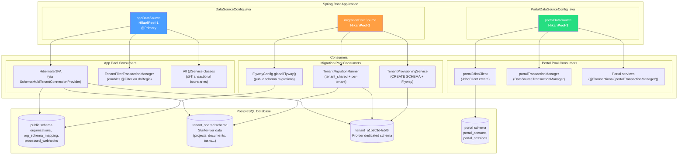
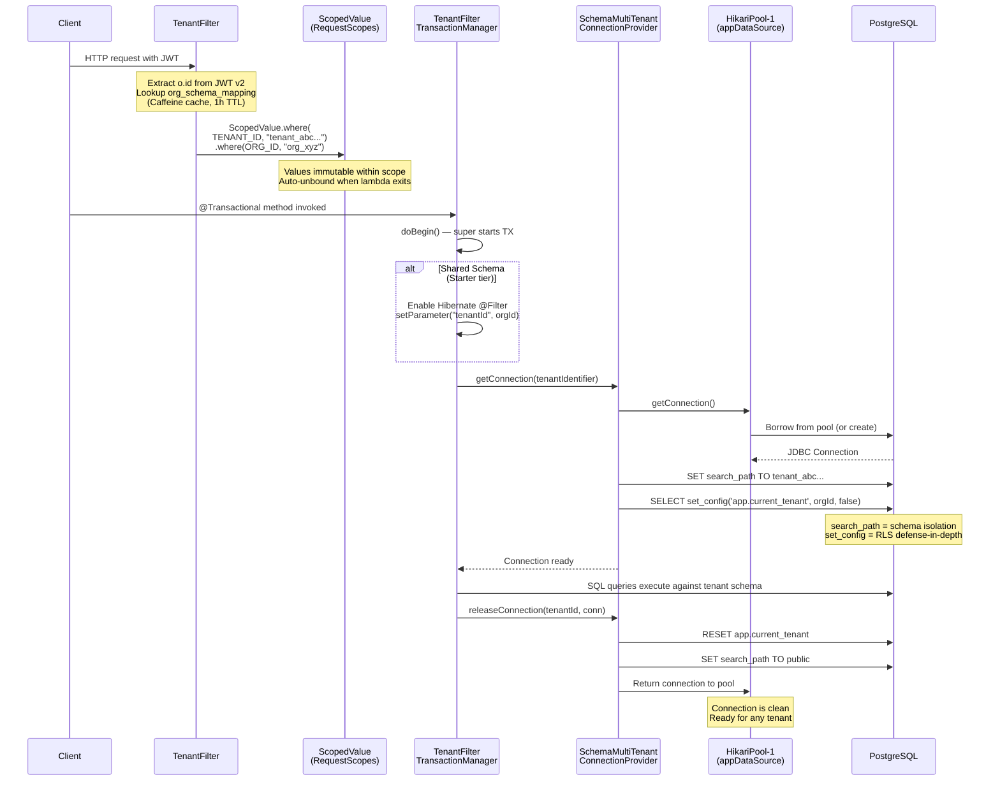
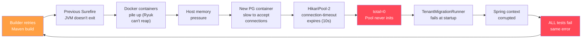
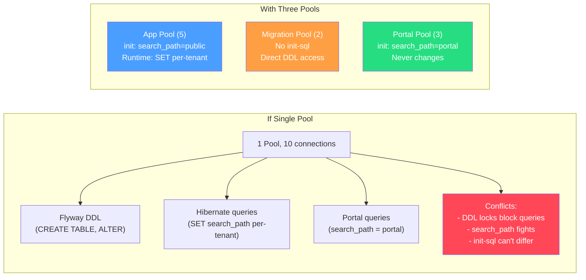
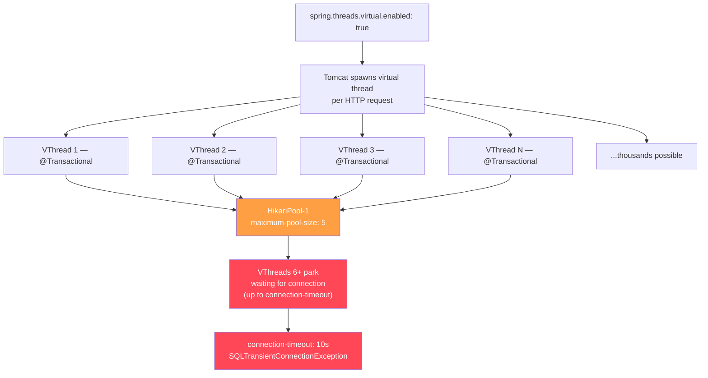
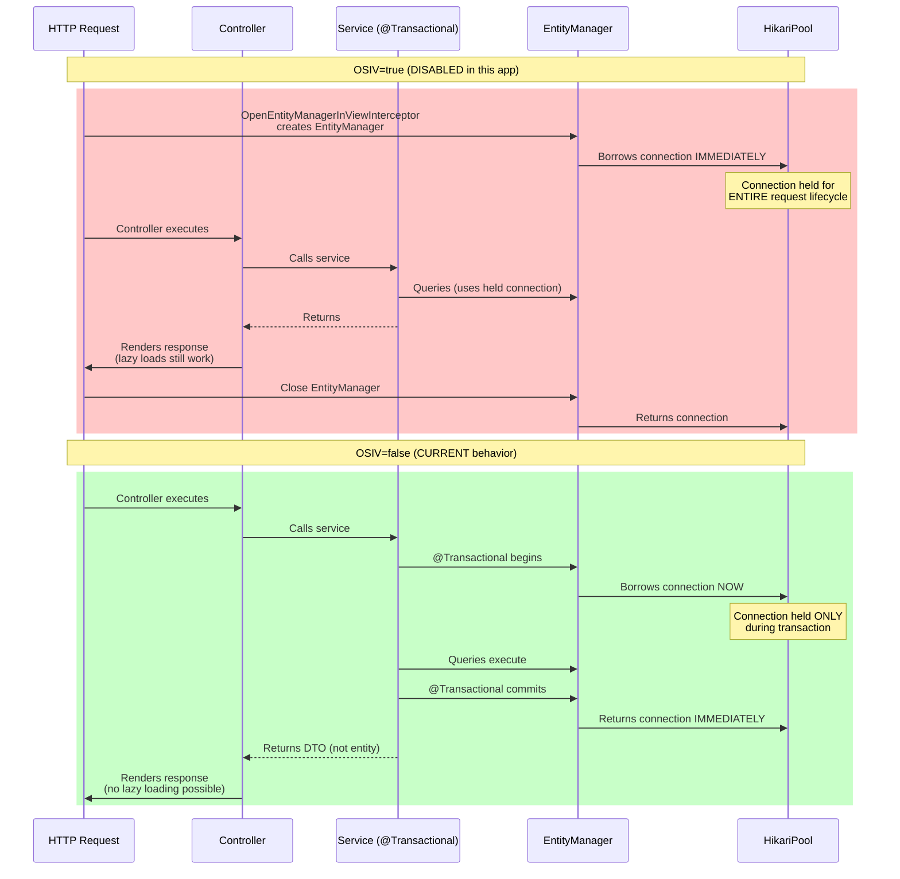
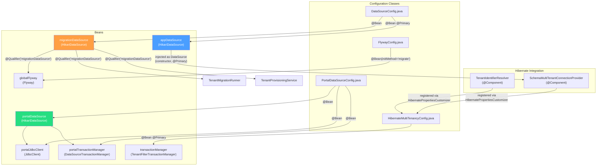
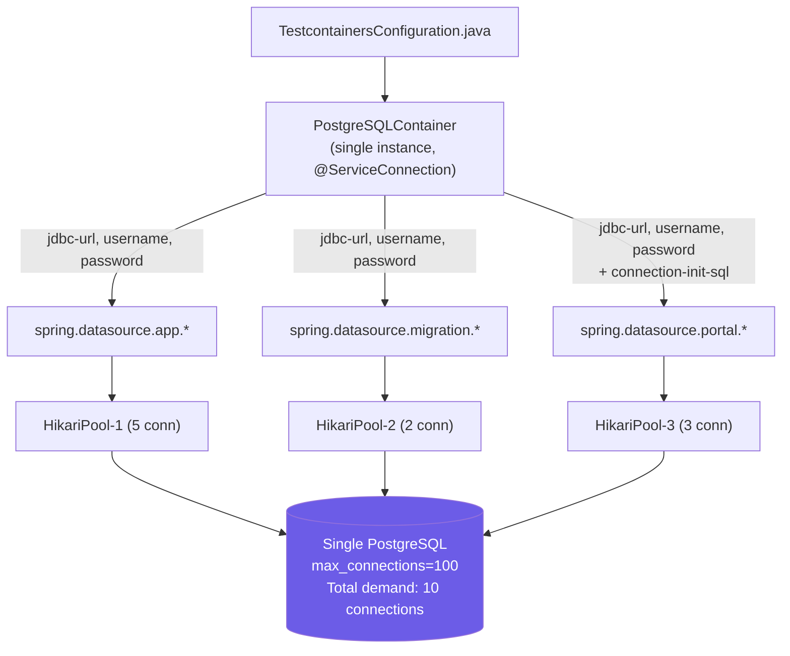

# HikariCP Connection Pools — Architecture & Lifecycle

## 1. Pool Architecture Overview

## 2. Connection Lifecycle — App Pool (Multitenancy Flow)

## 3. Pool Settings Comparison

### Per-Profile Configuration

| Setting | App Pool (local) | App Pool (test) | Migration Pool (local) | Migration Pool (test) | Portal Pool (local) | Portal Pool (default) |
|---------|-----------------|-----------------|----------------------|---------------------|--------------------|--------------------|
| `maximum-pool-size` | **5** | **5** | **2** | **2** | **3** | **5** |
| `minimum-idle` | 2 | 1 | _(default: 5)_ | _(default)_ | 1 | 1 |
| `connection-timeout` | 10,000ms | 10,000ms | 30,000ms | 30,000ms | 10,000ms | 10,000ms |
| `validation-timeout` | 5,000ms | _(default)_ | _(default)_ | _(default)_ | _(default)_ | _(default)_ |
| `idle-timeout` | 300,000ms (5m) | _(default)_ | _(default)_ | _(default)_ | _(default)_ | _(default)_ |
| `max-lifetime` | 1,200,000ms (20m) | _(default)_ | _(default)_ | _(default)_ | _(default)_ | _(default)_ |
| `leak-detection-threshold` | 30,000ms (30s) | **10,000ms (10s)** | _(none)_ | **15,000ms (15s)** | _(none)_ | **10,000ms (10s)** |
| `connection-init-sql` | `SET search_path TO public` | _(none)_ | _(none)_ | _(none)_ | `SET search_path TO portal, public` | `SET search_path TO portal, public` |
| `driver-class-name` | `org.postgresql.Driver` | _(from Testcontainers)_ | `org.postgresql.Driver` | _(from Testcontainers)_ | `org.postgresql.Driver` | `org.postgresql.Driver` |

**Source files:**
- `backend/src/main/resources/application.yml` (defaults)
- `backend/src/main/resources/application-local.yml` (local dev overrides)
- `backend/src/test/resources/application-test.yml` (test overrides)

### HikariCP Defaults (when not explicitly set)

| Setting | HikariCP Default | Notes |
|---------|-----------------|-------|
| `maximum-pool-size` | 10 | Only dangerous if migration pool inherits this in test profile |
| `minimum-idle` | Same as max | Eager pool fill — wastes connections for migration pool |
| `connection-timeout` | 30,000ms | Acceptable for migrations, too slow for app queries |
| `idle-timeout` | 600,000ms (10m) | Connections idle >10m are evicted |
| `max-lifetime` | 1,800,000ms (30m) | Must be under PgBouncer/Neon timeout |
| `leak-detection-threshold` | 0 (disabled) | **Critical gap** — leaks go undetected |

## 4. What Went Wrong: The Zombie Accumulation (Epic 98B)

```mermaid
graph TB
    subgraph "Build 1 — 03:44"
        B1[Maven Surefire Fork 1]
        B1C1["Testcontainers<br/>PostgreSQL Container 1"]
        B1P["3 HikariPools<br/>12 connections"]
        B1 --> B1C1
        B1 --> B1P
    end

    subgraph "Build 2 — 05:36"
        B2[Maven Surefire Fork 2]
        B2C2["Testcontainers<br/>PostgreSQL Container 2"]
        B2P["3 HikariPools<br/>12 connections"]
        B2 --> B2C2
        B2 --> B2P
    end

    subgraph "Build 3 — 06:52"
        B3[Maven Surefire Fork 3]
        B3C3["Testcontainers<br/>PostgreSQL Container 3"]
        B3P["3 HikariPools<br/>12 connections"]
        B3 --> B3C3
        B3 --> B3P
    end

    subgraph "Build 4 — 07:54"
        B4[Maven Surefire Fork 4]
        B4C4["Testcontainers<br/>PostgreSQL Container 4"]
        B4P["3 HikariPools<br/>12 connections"]
        B4 --> B4C4
        B4 --> B4P
    end

    subgraph "Build 5 — 09:07"
        B5[Maven Surefire Fork 5]
        B5C5["Testcontainers<br/>PostgreSQL Container 5"]
        B5P["3 HikariPools<br/>12 connections"]
        B5 --> B5C5
        B5 --> B5P
    end

    subgraph "Docker Host Resources"
        MEM["Host Memory<br/>5 x ~100MB PG = 500MB+"]
        PORTS["Port Allocation<br/>5 random high ports"]
        RYUK["Testcontainers Ryuk<br/>Can't reap — JVMs still 'alive'"]
    end

    B1 -.->|ZOMBIE: never exited| MEM
    B2 -.->|ZOMBIE: never exited| MEM
    B3 -.->|ZOMBIE: never exited| MEM
    B4 -.->|ZOMBIE: never exited| MEM

    B5 -->|New build starts| B5C5
    B5C5 -.->|Container starts but<br/>PG under memory pressure| MEM

    B5P -.->|connection-timeout: 10s<br/>expires before PG ready| FAIL

    FAIL["HikariPool-2 — total=0<br/>active=0, idle=0, waiting=0<br/><b>Pool never initialized</b>"]

    style FAIL fill:#ff4757,color:#fff
    style B1 fill:#999,color:#fff
    style B2 fill:#999,color:#fff
    style B3 fill:#999,color:#fff
    style B4 fill:#999,color:#fff
```

### The Cascade

## 5. Educational Annotations

### Why Three Separate Pools Instead of One?

**App Pool** (`appDataSource`): The primary pool for all Hibernate/JPA operations. The `SchemaMultiTenantConnectionProvider` dynamically sets `search_path` on checkout to the tenant's schema and resets it to `public` on release. Every `@Transactional` service method borrows from this pool. The `connection-init-sql: SET search_path TO public` ensures a clean default even if a connection is borrowed before tenant context is bound (e.g., public-schema lookups like `org_schema_mapping`).

**Migration Pool** (`migrationDataSource`): Dedicated to Flyway DDL operations (CREATE SCHEMA, CREATE TABLE, ALTER TABLE). These operations need direct access to PostgreSQL (not through a connection pool that sets `search_path` via init-sql). Flyway manages its own schema targeting via `.schemas()`. Keeping this pool small (2 connections) prevents DDL from competing with query connections. In production, this pool connects to the direct Neon endpoint (not PgBouncer), because PgBouncer's transaction-mode pooling does not support DDL statements that span multiple transactions.

**Portal Pool** (`portalDataSource`): Permanently locked to `SET search_path TO portal, public` via `connection-init-sql`. Used by the customer portal backend (read-model queries for portal contacts, sessions, documents). Has its own `JdbcClient` and `DataSourceTransactionManager` so portal operations never touch tenant schemas and never interfere with the app pool's dynamic `search_path` switching. The `, public` suffix allows portal queries to also reference public-schema tables (e.g., organizations).

### Why `leak-detection-threshold` Matters

HikariCP's leak detection monitors how long a connection has been borrowed without being returned. If a connection is held longer than the threshold, HikariCP logs a warning with the stack trace of where the connection was acquired. This is critical because:

- **OSIV is disabled** (`spring.jpa.open-in-view: false`) — there is no request-scoped EntityManager holding a connection for the entire HTTP request lifecycle. Connections should be acquired at transaction start and released at transaction end. Any connection held longer than 10-30 seconds is suspect.
- **Without leak detection**, a service method that calls a repository outside `@Transactional` will silently borrow a connection that may never be returned to the pool. This connection is "lost" — the pool doesn't know it's leaked until pool exhaustion causes a `connection-timeout` error minutes or hours later.
- **Test profile uses aggressive thresholds** (10s for app/portal, 15s for migration) to catch leaks early during CI, before they manifest as the `total=0` failure cascade seen in Epic 98B.

### Why `forkedProcessExitTimeoutInSeconds` Prevents Zombies

Maven Surefire forks a new JVM to run tests. If the test JVM hangs (e.g., a deadlocked connection pool, a Spring context that won't shut down), Surefire waits indefinitely by default. Each forked JVM holds:

- 3 HikariCP pools (up to 12 connections)
- 1 Testcontainers PostgreSQL container (~100MB RAM)
- 1 Testcontainers Ryuk sidecar container

With `forkedProcessExitTimeoutInSeconds: 60` in `pom.xml`, Surefire force-kills the forked JVM after 60 seconds of inactivity. This triggers JVM shutdown hooks, which let HikariCP close its pools and Testcontainers Ryuk reap the PostgreSQL container. Without this setting, zombie JVMs accumulate across retries, each consuming host resources until Docker itself runs out of capacity.

### Why `connection-init-sql` Differs Between Pools

| Pool | `connection-init-sql` | Why |
|------|----------------------|-----|
| App | `SET search_path TO public` | Safe default — `SchemaMultiTenantConnectionProvider` overrides this dynamically per-request. Without it, a fresh connection might have PostgreSQL's default search_path (`"$user", public`) which could resolve to a non-existent user schema. |
| Migration | _(none)_ | Flyway sets the schema explicitly via `.schemas()` on each migration run. An init-sql would be overridden immediately anyway. |
| Portal | `SET search_path TO portal, public` | Permanently fixed — portal queries always target the `portal` schema. The `, public` fallback allows joins with public-schema reference tables. This is set once on connection creation and never changed. |

### Why Virtual Threads + Small Pools Is Dangerous

With virtual threads enabled, Tomcat can accept thousands of concurrent requests (virtual threads are cheap). But each `@Transactional` method still needs a real JDBC connection from HikariCP. With `maximum-pool-size: 5`, only 5 requests can execute SQL concurrently. The remaining virtual threads park (block) on `HikariPool.getConnection()`, waiting for a connection to be returned. This is safe if requests are fast (sub-second) but dangerous if:

- A query is slow (long-running report, unindexed scan)
- A transaction holds a connection during an external call (HTTP to Clerk, S3 upload)
- The pool is already partially consumed by background tasks (seeders, migration runner)

The mitigation in this codebase: keep transactions short, never call external services inside a `@Transactional` boundary, and let HikariCP's `connection-timeout` (10s) fail fast rather than queue indefinitely.

### Why OSIV Being Disabled Changes Connection Lifecycle

With OSIV disabled:
- **Connection hold time is minimal** — only during `@Transactional` boundaries, typically milliseconds
- **Pool utilization is efficient** — 5 connections can serve dozens of concurrent requests if transactions are fast
- **Trade-off**: Lazy loading outside `@Transactional` throws `LazyInitializationException`. This codebase avoids this by using UUID FK fields (no JPA relationships) and projections/DTOs instead of returning entities from services.
- **Required for multitenancy**: OSIV creates an EntityManager at request start, which pins to whatever tenant schema is active at that moment. If the tenant context isn't bound yet (filter chain hasn't run), the EntityManager pins to `public` — and all queries for that request go to the wrong schema. Disabling OSIV ensures the EntityManager is only created inside `@Transactional`, after the filter chain has bound the tenant.

## 6. Bean Wiring Summary

## 7. Testcontainers Wiring

In tests, all three pools point to the **same** Testcontainers PostgreSQL container, configured via `DynamicPropertyRegistrar` in `TestcontainersConfiguration.java`:

**Key difference from production**: In production, `appDataSource` connects through **PgBouncer** (transaction-mode pooling) while `migrationDataSource` connects **directly** to PostgreSQL (DDL requires direct connections). In tests, all three pools connect directly to the same Testcontainers PostgreSQL instance.
