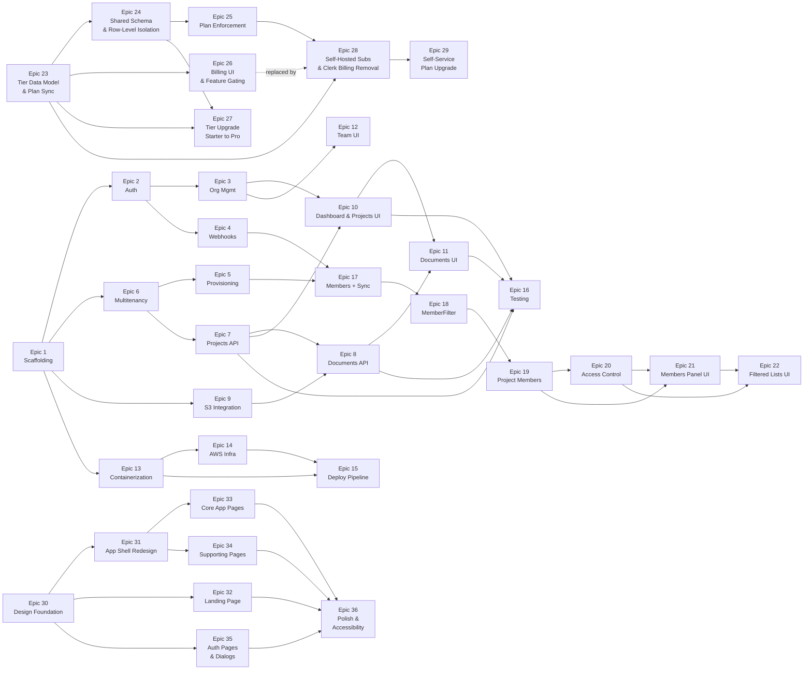

# Reference

## Epic Dependency Graph



---

## Implementation Order

### Phase 1: Foundation

| Order | Epic | Rationale |
|-------|------|-----------|
| 1 | Epic 1: Scaffolding | Everything depends on this. Establishes build tooling, local dev stack, CI. |

### Phase 2: Auth & Backend Core (Parallel Tracks)

| Order | Epic | Rationale |
|-------|------|-----------|
| 2a | Epic 2: Auth + Clerk | Frontend auth is the prerequisite for all user-facing features. |
| 2b | Epic 6: Multitenancy Backend | Backend multitenancy is the prerequisite for all data APIs. Highest technical risk — tackle early. |
| 2c | Epic 9: S3 Integration | Independent, low-risk. Can run in parallel with auth and multitenancy. |

**Rationale**: Epics 2, 6, and 9 are independent of each other and can be developed in parallel. Epic 6 (multitenancy) carries the highest technical risk (Hibernate 7 schema-per-tenant, tenant context, connection pooling), so starting it early maximizes time for course correction.

### Phase 3: Tenant Provisioning & Org Management

| Order | Epic | Rationale |
|-------|------|-----------|
| 3a | Epic 5: Tenant Provisioning | Depends on Epic 6 (multitenancy). Must work before any tenant data can be created. |
| 3b | Epic 3: Org Management | Depends on Epic 2 (auth). Can run in parallel with provisioning. |
| 3c | Epic 4: Webhooks | Depends on Epic 2. Wires org creation to provisioning. |

**Rationale**: Provisioning and org management form the bridge between auth and data. Webhooks connect Clerk org creation to backend provisioning. These three epics complete the onboarding flow.

### Phase 4: Core Features

| Order | Epic | Rationale |
|-------|------|-----------|
| 4a | Epic 7: Projects API | First domain API; validates multitenancy end-to-end. |
| 4b | Epic 8: Documents API | Depends on Projects API and S3. Completes the backend API surface. |

**Rationale**: Projects are the simpler domain entity — validating the full multitenancy stack (JWT → tenant resolution → schema isolation → CRUD) before adding S3 complexity in documents.

### Phase 5: Frontend Features

| Order | Epic | Rationale |
|-------|------|-----------|
| 5a | Epic 10: Dashboard & Projects UI | Primary user interface; depends on Org Management and Projects API. |
| 5b | Epic 11: Documents UI | Depends on Dashboard and Documents API. |
| 5c | Epic 12: Team Management UI | Depends on Org Management. Independent of documents, can run in parallel with 5a/5b. |

**Rationale**: Frontend development starts after backend APIs are available. Team management uses Clerk components directly and can be developed in parallel with dashboard/document UI.

### Phase 6: Infrastructure & Deployment

| Order | Epic | Rationale |
|-------|------|-----------|
| 6a | Epic 13: Containerization | Docker images needed before infrastructure and deployment. |
| 6b | Epic 14: AWS Infrastructure | Terraform modules for all AWS resources. |
| 6c | Epic 15: Deployment Pipeline | GitHub Actions CI/CD depends on ECR and ECS being provisioned. |

**Rationale**: Infrastructure work can begin in parallel with Phase 4–5 once container images are ready. It is intentionally later because local development is sufficient for feature work, and infrastructure changes iterate more slowly.

### Phase 7: Quality & Hardening

| Order | Epic | Rationale |
|-------|------|-----------|
| 7 | Epic 16: Testing & Quality | Integration tests, tenant isolation tests, and E2E tests run after features are built. |

**Rationale**: While unit tests are written alongside each epic, the dedicated testing epic sets up integration test infrastructure (Testcontainers), writes cross-cutting tests (tenant isolation), and establishes E2E coverage. This runs last because it tests the full assembled system.

### Phase 8: Members & Project Ownership

| Order | Epic | Rationale |
|-------|------|-----------|
| 8a | Epic 17: Members + Webhook Sync | Foundation — creates the members table and sync infrastructure. Must exist before MemberFilter can resolve users. |
| 8b | Epic 18: MemberFilter + MemberContext | Request-level member resolution. Modifies existing entities (breaking change to created_by/uploaded_by types). Lazy-create handles the gap between deployment and webhook sync. |
| 8c | Epic 19: Project Members + API | Creates project_members table and CRUD endpoints. Must come after MemberFilter since it uses MemberContext. |
| 8d | Epic 20: Project Access Control | Modifies existing endpoints to enforce project membership. Highest behavioral risk — changes what data users see. |
| 8e | Epic 21: Project Members Panel UI | New UI components for project membership management. Requires backend APIs from Epics 19 and 20. |
| 8f | Epic 22: Filtered Project List | Updates existing pages to reflect the new access model. Depends on both backend access control and new types from Epic 21. |

**Rationale**: All epics are sequential — each depends on its predecessor. Backend foundation (17-18) must land before features (19-20), and backend APIs must exist before frontend (21-22). Each epic is independently deployable and testable.

### Summary Timeline

```
Phase 1:  [E1]
Phase 2:  [E2] [E6] [E9]      <- parallel
Phase 3:  [E5] [E3] [E4]      <- parallel
Phase 4:  [E7] -> [E8]         <- sequential
Phase 5:  [E10] -> [E11] [E12] <- 11 after 10; 12 parallel
Phase 6:  [E13] -> [E14] [E15] <- 14/15 after 13
Phase 7:  [E16]
Phase 8:  [E17] -> [E18] -> [E19] -> [E20] -> [E21] -> [E22]  <- sequential
```

---

## Risk Register

| # | Risk | Impact | Likelihood | Mitigation |
|---|------|--------|------------|------------|
| R1 | Hibernate 7 schema-per-tenant multitenancy has undocumented breaking changes from Hibernate 6 | H | M | Start Epic 6 early (Phase 2). Build a minimal proof-of-concept with `CurrentTenantIdentifierResolver` + `MultiTenantConnectionProvider` before building features. Hibernate 7 removes `multiTenancy` property but auto-detects — verify this works with Spring Boot 4. |
| R2 | Neon PgBouncer (transaction mode) interferes with `SET search_path` | H | L | Research confirms `search_path` set per connection checkout works in transaction mode because Hibernate wraps ops in transactions. Validate with integration test against Neon early. Fallback: use direct connection for all traffic (reduced concurrency). |
| R3 | Clerk webhook delivery unreliability causes missed org provisioning | H | L | Idempotent provisioning allows manual retrigger. Monitor `provisioning_status = PENDING` for stale entries. Add admin endpoint to retrigger provisioning. Svix retries 8 times over 32 hours. |
| R4 | Spring Boot 4 / Java 25 compatibility issues with dependencies (Resilience4j, AWS SDK, etc.) | M | M | Pin dependency versions that are verified compatible. Check release notes for Spring Boot 4 + Hibernate 7 breaking changes. Have a downgrade path to Spring Boot 3.4 + Java 21 if blockers emerge. |
| R5 | Flyway tenant migration at startup becomes slow with many tenants | M | L | Sequential migration is acceptable for MVP (<100 tenants). For scale: parallelize migrations with thread pool, add startup readiness probe delay, consider running migrations as a separate job before deployment. |
| R6 | Clerk JWT claims structure changes between SDK versions | M | L | Pin `@clerk/nextjs` version. Use Clerk's documented JWT template. Validate claim names (`org_id`, `org_role`) against Clerk docs when upgrading. Add integration test that verifies JWT claim parsing. |
| R7 | Presigned URL expiry causes poor UX for large file uploads | M | M | Set generous expiry (1 hour for uploads). Client-side: check URL expiry before starting upload; if expired, re-request. Show clear error if upload fails due to expiry. Consider multipart upload for files > 100MB (future). |
| R8 | Terraform state management conflicts in team development | M | M | Use S3 backend with DynamoDB state locking from day one. One environment per developer is overkill for MVP — use shared dev environment with coordinated applies. Document Terraform workflow. |
| R9 | LocalStack S3 behavior diverges from real AWS S3 | L | M | LocalStack S3 is mature and reliable for presigned URLs. Run integration tests against real S3 in CI staging environment. Document known LocalStack limitations. |
| R10 | Clerk rate limits hit during bulk webhook processing | L | L | Clerk webhook rate limits are generous. Our system doesn't call Clerk API during webhook processing (we only receive events). Risk is theoretical — monitor if org creation volume is unusually high. |
| R11 | Lazy-create in MemberFilter produces incomplete member records (no name/email) | L | M | Webhook handler upserts full data shortly after. Frontend displays placeholder for incomplete records. Add admin endpoint to re-sync if needed. |
| R12 | V4 migration (created_by/uploaded_by type change) fails on existing data | H | L | Multi-step migration with temp columns and backfill. Test with production-like data before deploying. `ON CONFLICT DO NOTHING` makes backfill idempotent. Add rollback migration. |
| R13 | Existing integration tests break after MemberFilter introduction (Epic 18) | M | H | Expected and planned for — task 18.9 explicitly addresses updating all existing tests to provision member records in `@BeforeAll`. Run full test suite before merging. |
| R14 | Membership webhook arrives before tenant is provisioned (org.created not processed yet) | M | L | `MemberSyncService` returns 404 if tenant not found. Svix retries 8 times over 32 hours — will succeed once provisioning completes. Log the failure for monitoring. |
| R15 | ProjectAccessService database lookups add latency to every project request | M | L | Single indexed query on `project_members(project_id, member_id)` covered by UNIQUE constraint index. For listing, JPQL join is a single query. No N+1 risk. Monitor query performance. |
| **Phase 2 Risks** | | | | |
| R16 | ~~Clerk Billing SDK is in beta~~ | — | — | **Resolved by Epic 28**: Clerk Billing removed entirely. Self-hosted subscriptions table replaces all Clerk Billing integration. |
| R17 | Hibernate `@Filter` not activated for native SQL queries in shared schema | H | L | Postgres RLS provides defense-in-depth for all queries including native SQL. All repository methods use JPQL (Hibernate-managed). Add integration test covering native query scenarios. Avoid native queries against tenant tables. Per ADR-012. |
| R18 | Concurrent requests during tier upgrade see empty data briefly | M | L | Migration < 1s for Starter data volumes (2 members, bounded data). Brief window returns empty results, not data leak. Acceptable for low-traffic Starter orgs. Per ADR-016 §Availability. |
| R19 | Shared schema (`tenant_shared`) row count grows unboundedly as Starter orgs scale | M | L | Single schema regardless of org count. Indexes on `tenant_id` keep query performance stable. Monitor row count and index sizes. Promote high-traffic Starter orgs to Pro. Partition tables by `tenant_id` if needed (future). |
| R20 | Postgres RLS session variable (`app.current_tenant`) not reset between pooled connections | H | L | `SchemaMultiTenantConnectionProvider` explicitly RESETs on connection release. HikariCP connection leak detection is enabled. Add integration test verifying cleanup across consecutive requests with different orgs. |
| R21 | Subscription webhook arrives before org provisioning completes (race condition) | M | L | `PlanSyncController` returns 404 if org not found — webhook retries via Svix. Brief period (< 5s) where org operates on Starter is acceptable (Hibernate filter ensures data isolation). Per ADR-015. |
| R22 | `SharedTenantFilterAspect` AOP pointcut matches too broadly or too narrowly | M | M | Define precise pointcut targeting `@Transactional` service methods or repository calls. Verify with integration tests that filter activates for all shared-schema CRUD paths. Use `@Order` to control aspect precedence. |
